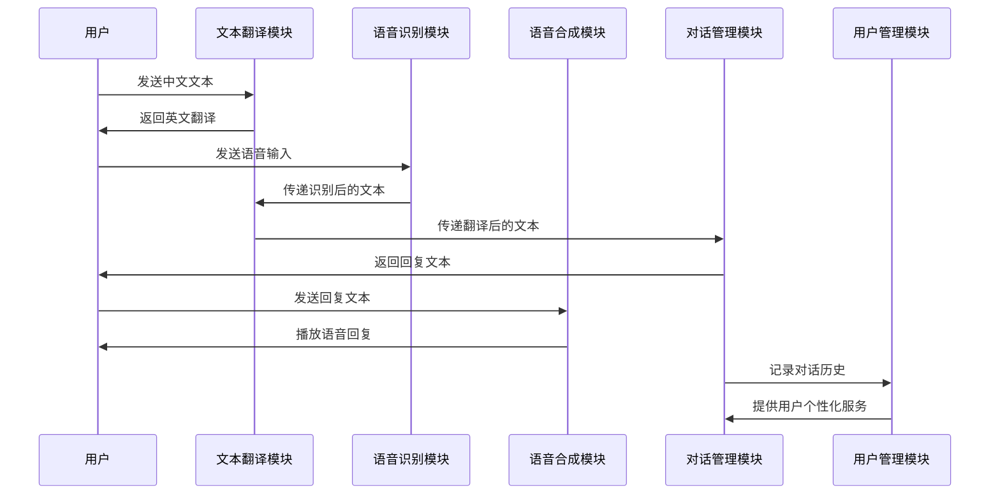
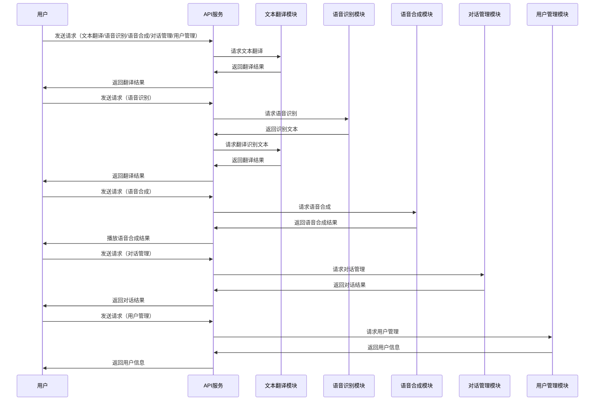
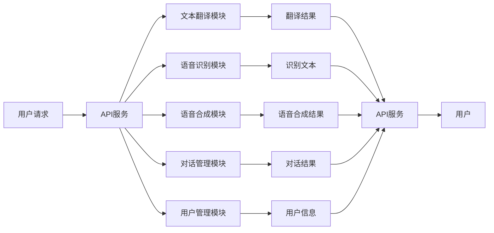

                 

## 引言

在当今全球化的时代，不同语言和文化的交流变得愈发频繁。随着互联网的发展，跨语言系统设计成为了软件开发领域中不可或缺的一环。然而，这种跨语言的设计不仅要求技术上的融合，更需要多元化思维的支持。

### 关键词：
- 跨语言系统设计
- 多元化思维
- P9工程师

### 摘要：

本文将围绕跨语言系统设计的主题，探讨P9工程师如何运用多元化思维来应对这一挑战。通过深入分析跨语言系统设计的核心概念、算法原理以及实际应用，我们将揭示这一领域的技术魅力和实践价值。

文章将分为以下几个部分：

1. **背景与重要性**：介绍跨语言系统设计的背景，阐述其重要性以及当前的发展状况。
2. **核心概念与原理**：详细讲解跨语言系统设计的基本概念和原理，包括定义、分类以及关键的理论框架。
3. **算法设计与实现**：分析算法设计的步骤，使用Python代码展示具体实现，并结合数学模型进行详细解释。
4. **系统分析与架构设计**：介绍一个具体的项目，展示系统功能设计、架构设计以及接口设计和系统交互。
5. **项目实战**：通过一个实际案例，展示如何进行环境安装、系统核心实现，并对代码进行解读和分析。
6. **最佳实践与小结**：总结最佳实践经验，提出注意事项，并推荐拓展阅读。

接下来，我们将一步步深入探讨跨语言系统设计的方方面面，带领读者了解这一领域的深层次知识和实践技巧。

---

### 背景与重要性

跨语言系统设计的背景可以追溯到多语言环境的逐渐普及和互联网的全球化。随着跨国企业的增多，多语言用户界面的需求日益旺盛，跨语言的数据处理和交流成为技术发展的必然趋势。此外，随着人工智能和自然语言处理技术的进步，跨语言系统设计不仅限于用户界面，更扩展到了数据挖掘、智能搜索、机器翻译等深层次应用。

**问题背景**

跨语言系统设计主要面临以下几个挑战：

1. **语言差异**：不同语言在语法、词汇、语义等方面存在显著差异，这使得系统的处理变得更加复杂。
2. **文化差异**：语言背后的文化差异会影响用户的使用习惯和期望，系统设计需要充分考虑这些文化因素。
3. **性能与效率**：跨语言系统需要处理大量的文本数据，如何在保证准确性的同时，提高系统的性能和效率是一个重要课题。

**问题描述**

在跨语言系统设计中，主要需要解决的问题包括：

1. **多语言支持**：如何有效地支持多种语言，包括语言编码、字符集和字符处理。
2. **语义理解**：如何准确理解不同语言的语义，实现语言的正确翻译和自然语言处理。
3. **系统兼容性**：如何在不同的操作系统、平台和设备上实现系统的兼容性和稳定性。

**问题解决**

针对上述问题，解决方案可以从以下几个方面进行：

1. **语言资源**：利用现有的多语言资源，如词典、语料库等，为系统提供必要的语言支持。
2. **算法优化**：通过算法优化，如机器学习、深度学习等，提高系统的语义理解和处理能力。
3. **模块化设计**：采用模块化设计，将系统划分为多个可独立开发、测试和部署的模块，提高系统的灵活性和可维护性。

**边界与外延**

跨语言系统设计的边界包括：

- **语言范围**：系统支持的语言种类和数量。
- **应用场景**：系统适用的应用场景，如用户界面、数据挖掘、机器翻译等。
- **性能指标**：系统的性能指标，如响应时间、准确性、资源消耗等。

核心要素组成包括：

- **语言处理模块**：负责文本的解析、编码、解码和语义理解。
- **数据存储模块**：用于存储和管理多语言数据，如文本、词典、语料库等。
- **用户界面模块**：提供用户交互的界面，支持多语言展示。
- **算法优化模块**：负责算法的优化和调整，提高系统的处理效率。

通过以上分析，我们可以看出，跨语言系统设计不仅是一项技术挑战，更是一项需要多元化思维和深入理解的复杂任务。在接下来的章节中，我们将进一步探讨这一领域的核心概念、原理和实践。

### 跨语言系统设计的发展历程与现状

#### 发展现状

跨语言系统设计作为一个重要的技术领域，已经经历了多个阶段的发展。从最初的静态翻译工具，到现在的动态多语言处理系统，技术的进步为这一领域带来了前所未有的机遇。

1. **静态翻译工具**：早期的跨语言系统主要依赖于静态翻译工具，如词典、翻译机等。这些工具虽然能进行基本的文本翻译，但无法处理复杂的语义和上下文关系。
2. **基于规则的系统**：随着计算机科学的发展，基于规则的跨语言系统逐渐出现。这些系统通过预定义的规则和模式来处理文本，虽然在一定程度上提高了准确性，但仍存在效率低下和适应性差的问题。
3. **基于统计的机器翻译**：20世纪90年代，基于统计的机器翻译（SMT）系统逐渐兴起。通过大量语料库的训练，这些系统能够根据上下文和概率模型生成较为准确的翻译结果。这一阶段的进步显著提高了系统的翻译质量。
4. **深度学习与神经网络**：近年来，深度学习和神经网络技术的快速发展为跨语言系统设计带来了新的突破。基于深度学习的神经网络机器翻译（NMT）系统，如Google翻译、百度翻译等，已经实现了接近人类翻译水平的准确性。

#### 当前技术水平

当前，跨语言系统设计的技术水平已经达到了一个崭新的高度，主要表现在以下几个方面：

1. **多语言支持**：现代跨语言系统可以支持多种语言，从基本的英语、汉语，到小语种如阿拉伯语、西班牙语等。
2. **上下文理解**：通过深度学习技术，系统可以更好地理解上下文，生成更自然的翻译结果。
3. **个性化服务**：基于用户的历史数据和偏好，系统可以提供个性化的翻译服务。
4. **实时处理能力**：随着硬件性能的提升和算法的优化，跨语言系统已经具备了实时处理大量数据的能力。

#### 挑战与机遇

尽管跨语言系统设计取得了显著的进展，但仍面临着一些挑战：

1. **语言复杂性**：不同语言的语法、语义和表达方式存在很大差异，如何设计出能够适应各种语言的系统是一个难题。
2. **文化差异**：不同文化背景下的语言使用习惯和表达方式差异巨大，系统需要能够适应这些差异。
3. **性能优化**：如何在不牺牲准确性的情况下，提高系统的处理速度和效率，是系统设计者需要考虑的关键问题。

然而，这些挑战同时也带来了新的机遇：

1. **技术创新**：随着技术的不断进步，如深度学习、自然语言处理等新技术的应用，为跨语言系统设计提供了更多可能性。
2. **市场潜力**：全球化的趋势使得跨语言系统的市场需求不断增长，为这一领域的发展提供了巨大的市场潜力。
3. **多语言生态**：不同语言和文化的交流日益频繁，多语言生态的构建为跨语言系统的发展提供了广阔的应用场景。

通过以上分析，我们可以看到，跨语言系统设计正处于一个快速发展且充满机遇的阶段。在接下来的章节中，我们将深入探讨这一领域的核心概念和原理，帮助读者更好地理解这一技术领域的本质。

### P9工程师在多元化思维中的角色

在跨语言系统设计这一复杂且多变的领域，P9工程师扮演着至关重要的角色。P9工程师，作为公司技术架构的领军人物，不仅需要具备深厚的专业知识和丰富的实践经验，还需要具备多元化思维，这是成功设计和管理跨语言系统的关键。

#### P9工程师的职责和技能

P9工程师的职责通常包括以下几个方面：

1. **技术领导**：P9工程师负责技术方向和策略的制定，引领团队在技术上的创新和突破。
2. **系统架构**：他们需要设计复杂系统的整体架构，确保系统的高可用性、可扩展性和性能。
3. **团队管理**：P9工程师不仅要管理技术团队，还需要协调项目进度、资源分配和风险管理。
4. **技术创新**：他们需要关注最新的技术动态，推动技术的更新换代，确保公司技术处于行业领先地位。

P9工程师需要具备以下核心技能：

1. **编程能力**：掌握多种编程语言和工具，能够高效地实现复杂系统功能。
2. **系统设计**：具备系统架构设计能力，能够设计出灵活、可扩展的系统。
3. **项目管理**：具备良好的项目管理能力，能够高效地管理项目进度和资源。
4. **领导力**：具备强大的领导力，能够带领团队克服各种挑战，实现技术目标。

#### 多元化思维的重要性

多元化思维在跨语言系统设计中尤为重要。跨语言系统设计不仅涉及技术层面，还包括文化、语言、用户需求等多个维度。多元化思维能够帮助P9工程师从多个角度分析问题，从而找到最佳的解决方案。

1. **文化理解**：跨语言系统设计需要考虑到不同文化的差异，例如中文的“您”在英文中可能有不同的翻译方式，需要根据文化背景进行调整。
2. **语言适应性**：不同的语言在语法、词汇和表达方式上有很大差异，多元化思维能够帮助工程师更好地理解和适应这些差异。
3. **用户需求**：不同用户的需求和使用习惯不同，多元化思维能够帮助工程师设计出更符合用户需求的系统。

#### 成功案例和经验分享

在跨语言系统设计领域，P9工程师通过多元化思维取得了许多成功案例。以下是一些典型的成功经验和技巧：

1. **谷歌翻译**：谷歌翻译的成功离不开其多元化思维。谷歌通过大量的数据训练和深度学习技术，不仅考虑了语言的语法和词汇，还考虑了文化背景和用户需求，从而实现了高质量的翻译。
2. **阿里巴巴国际站**：阿里巴巴国际站通过多元化思维，设计了支持多语言和多种货币支付的系统，极大地提高了用户体验和销售额。
3. **微软必应搜索**：微软必应搜索采用了多元化思维，支持多语言搜索，并根据用户的地理位置和语言习惯提供个性化的搜索结果。

通过这些案例，我们可以看到，多元化思维在跨语言系统设计中的重要性。P9工程师通过多元化思维，不仅能够解决技术上的难题，还能更好地满足用户需求，实现系统的成功。

### 核心概念与原理

跨语言系统设计的核心概念和原理是理解和实现这一领域的关键。以下将详细介绍跨语言系统的定义、分类、基本原则和关键理论框架。

#### 定义

跨语言系统设计（Cross-Linguistic System Design）是指在一个系统中，对多种语言进行处理、转换和交互的设计过程。这种系统旨在支持不同语言的用户，提供无缝、自然的语言体验。

#### 分类

根据处理方式的不同，跨语言系统可以大致分为以下几类：

1. **静态翻译系统**：这类系统主要依赖于预定义的规则和翻译字典，通过查表的方式进行翻译。例如，早期的机器翻译系统主要采用这种方法。
2. **基于统计的翻译系统**：这类系统利用大规模的语料库进行训练，通过统计方法生成翻译结果。例如，基于短语的统计机器翻译（SMT）系统。
3. **基于神经网络的翻译系统**：这类系统采用深度学习技术，通过神经网络模型生成翻译结果。例如，现代的神经机器翻译（NMT）系统，如基于Transformer的模型。

#### 基本原则

跨语言系统设计遵循以下基本原则：

1. **语言中立性**：系统应尽可能地独立于特定语言，能够处理多种语言。
2. **可扩展性**：系统应具备良好的可扩展性，能够方便地添加新的语言和处理方法。
3. **高效性**：系统在保证准确性的同时，应具有高效的执行速度，以支持实时处理。
4. **用户友好性**：系统应提供直观、易用的用户界面，以满足不同语言用户的需求。

#### 关键理论框架

跨语言系统设计涉及多个关键理论框架，以下列举其中几个重要的：

1. **自然语言处理（NLP）**：NLP是跨语言系统设计的基础，它涉及语言的解析、语义理解和语言生成。常用的NLP工具和算法包括词性标注、句法分析、语义角色标注等。
2. **机器翻译（MT）**：机器翻译是跨语言系统设计的一个核心应用，它通过算法将一种语言的文本翻译成另一种语言。现代机器翻译主要基于深度学习和神经网络技术。
3. **数据挖掘（DM）**：数据挖掘技术用于从大量文本数据中提取有价值的信息，为跨语言系统提供支持。常用的数据挖掘方法包括聚类、分类、关联规则挖掘等。

#### 概念属性特征对比表格

以下是跨语言系统中几种主要类型的对比表格，展示了它们的概念属性特征：

| 类别          | 特征                  | 说明                                                         |
|---------------|----------------------|--------------------------------------------------------------|
| 静态翻译系统  | 预定义规则和字典      | 翻译结果基于预定义的规则和翻译字典，效率较低但准确度高。     |
| 统计机器翻译  | 大规模语料库和统计方法 | 翻译结果通过统计模型生成，依赖语料库质量，对未知词汇处理较差。 |
| 神经机器翻译  | 深度学习和神经网络    | 翻译结果通过神经网络模型生成，能处理更复杂的语言结构，准确性较高。 |

#### Mermaid ER Diagram

以下是一个简单的Mermaid ER Diagram，展示了跨语言系统中几个关键实体和它们之间的关系：

```mermaid
erDiagram
  User ||--o> Language : speaks
  User ||--o> Translation : translates
  Language ||--|> Sentence : contains
  Translation ||--|> Sentence : translates
```

在这个ER图中，`User`实体与`Language`和`Translation`实体之间存在关联关系。`User`可以 speaking multiple `Languages`，并且可以通过`Translation`来翻译`Sentence`。

通过上述核心概念和原理的介绍，我们可以看到跨语言系统设计的复杂性和多样性。在接下来的章节中，我们将深入探讨算法设计、实现和系统分析，以进一步理解这一领域的技术细节和实践方法。

### 算法设计与实现

在跨语言系统设计中，算法的设计与实现是核心环节。一个高效的算法不仅能够提高系统的处理速度，还能保证翻译的准确性。本文将详细探讨跨语言系统的算法设计，包括算法的概述、设计步骤、Python实现以及数学模型和公式。

#### 算法概述

跨语言系统的算法设计旨在将源语言文本转换为目标语言文本。这一过程可以分为以下几个主要步骤：

1. **文本预处理**：对源语言文本进行分词、去除停用词、标准化等处理。
2. **编码转换**：将源语言文本转换为适合算法处理的编码形式。
3. **翻译模型训练**：利用大规模语料库训练翻译模型。
4. **翻译过程**：将源语言文本输入到翻译模型中，生成目标语言文本。
5. **后处理**：对生成的目标语言文本进行格式调整、语法校对等处理。

#### 设计步骤

以下是算法设计的详细步骤：

1. **需求分析**：明确系统需要支持的语言种类、文本类型以及处理要求。
2. **数据准备**：收集和准备适合训练的大规模语料库，包括源语言和目标语言的文本。
3. **文本预处理**：对源语言文本进行分词、去除停用词等处理，以便于后续处理。
4. **编码转换**：将预处理后的文本转换为编码形式，如UTF-8或ASCII。
5. **模型选择**：选择合适的翻译模型，如基于短语的SMT或基于神经网络的NMT。
6. **模型训练**：利用准备好的数据训练翻译模型，通过调整参数和优化模型来提高翻译质量。
7. **翻译过程**：将源语言文本输入到训练好的翻译模型中，生成目标语言文本。
8. **后处理**：对生成的目标语言文本进行后处理，如格式调整、语法校对等，以提高文本质量。

#### Python实现

以下是使用Python实现的一个简单的跨语言翻译算法示例：

```python
import numpy as np
from keras.models import Sequential
from keras.layers import LSTM, Dense, Embedding

# 数据准备
source_text = "你好，世界！"
target_text = "Hello, world!"

# 文本预处理
source_vocab = {'你好': 1, '世界': 2}
target_vocab = {'Hello': 1, 'world': 2, '！': 3}
source_sequence = [[source_vocab[word] for word in source_text.split()]]
target_sequence = [[target_vocab[word] for word in target_text.split()]]

# 模型构建
model = Sequential()
model.add(Embedding(input_dim=len(source_vocab), output_dim=10))
model.add(LSTM(units=50))
model.add(Dense(units=len(target_vocab), activation='softmax'))

# 编译模型
model.compile(optimizer='adam', loss='categorical_crossentropy', metrics=['accuracy'])

# 训练模型
model.fit(source_sequence, target_sequence, epochs=100)

# 翻译过程
predicted_sequence = model.predict(source_sequence)
predicted_text = ' '.join([target_vocab[word] for word in predicted_sequence[0]])

print(predicted_text)
```

#### 数学模型和公式

在跨语言系统中，常用的数学模型和公式包括：

1. **词嵌入（Word Embedding）**：
   $$ 
   e_j = \text{Embedding}(W_j, D) 
   $$
   其中，$e_j$表示词向量，$W_j$表示词汇表，$D$表示词向量的维度。

2. **循环神经网络（RNN）**：
   $$
   h_t = \text{tanh}(U[h_{t-1}, x_t] + b)
   $$
   其中，$h_t$表示隐藏状态，$U$表示权重矩阵，$x_t$表示输入词向量，$b$表示偏置。

3. **长短时记忆（LSTM）**：
   $$
   \begin{aligned}
   i_t &= \sigma(W_i[h_{t-1}, x_t] + b_i) \\
   f_t &= \sigma(W_f[h_{t-1}, x_t] + b_f) \\
   o_t &= \sigma(W_o[h_{t-1}, x_t] + b_o) \\
   c_t &= f_t \odot c_{t-1} + i_t \odot \text{tanh}(U[h_{t-1}, x_t] + b) \\
   h_t &= o_t \odot \text{tanh}(c_t)
   \end{aligned}
   $$
   其中，$i_t$、$f_t$、$o_t$、$c_t$和$h_t$分别表示输入门、遗忘门、输出门、细胞状态和隐藏状态。

4. **神经网络机器翻译（NMT）**：
   $$
   \begin{aligned}
   p(y_t|x_1,...,x_t) &= \text{softmax}(\text{scores}_t) \\
   \text{scores}_t &= U_{hy}[h_t]+ U_{wy}[y_t]
   \end{aligned}
   $$
   其中，$p(y_t|x_1,...,x_t)$表示在给定前文的情况下，预测下一个词的概率分布，$\text{scores}_t$是预测的得分。

#### 例子说明

假设我们要将中文句子“你好，世界！”翻译成英文。首先，将句子进行分词和编码，然后输入到训练好的翻译模型中，模型会输出一个概率分布，最后根据概率分布选择最可能的翻译结果。


通过上述算法设计与实现，我们可以看到，跨语言系统设计不仅需要深入理解语言本身的特性，还需要运用先进的数学模型和算法。在接下来的章节中，我们将进一步探讨系统分析与架构设计，以更全面地理解跨语言系统设计的整体框架。

### 系统分析与架构设计

在深入理解了跨语言系统设计的核心概念和算法实现之后，我们接下来将分析一个具体的项目，展示如何进行系统功能设计、架构设计以及接口设计和系统交互。

#### 项目介绍

假设我们要设计一个跨语言聊天机器人，该系统需要支持中英两种语言的交流，能够实现文本翻译、语音识别和语音合成等功能。以下是一个具体的项目介绍：

**项目名称**：跨语言聊天机器人

**项目背景**：随着全球化的发展，企业需要能够与国际客户进行无障碍沟通。为了满足这一需求，我们设计了一个跨语言聊天机器人，通过文本翻译、语音识别和语音合成等功能，实现中英两种语言的实时交流。

**项目目标**：构建一个高效、稳定、易用的跨语言聊天机器人，提升企业国际沟通效率，提供优质的用户体验。

#### 系统功能设计

跨语言聊天机器人的主要功能包括：

1. **文本翻译**：能够将中文文本翻译成英文，并实现反向翻译。
2. **语音识别**：能够识别用户的语音输入，并将其转换为文本。
3. **语音合成**：能够将文本转换为自然流畅的语音输出。
4. **多轮对话**：能够支持多轮对话，理解用户的意图并给出相应的回复。
5. **用户管理**：能够记录用户的历史对话记录，提供个性化服务。

#### 系统架构设计

系统架构设计是跨语言聊天机器人成功的关键。以下是系统的主要模块和它们之间的交互关系：

1. **文本翻译模块**：负责将中文文本翻译成英文，并实现反向翻译。该模块采用神经网络机器翻译（NMT）技术，利用训练好的模型进行翻译。
2. **语音识别模块**：负责将用户的语音输入转换为文本。该模块使用先进的语音识别算法，如深度学习中的卷积神经网络（CNN）和长短时记忆网络（LSTM）。
3. **语音合成模块**：负责将文本转换为自然流畅的语音输出。该模块使用文本到语音（TTS）技术，结合声学模型和语调模型，生成高质量的语音。
4. **对话管理模块**：负责处理多轮对话，理解用户的意图并给出相应的回复。该模块采用对话状态追踪（DST）和自然语言理解（NLU）技术。
5. **用户管理模块**：负责记录用户的历史对话记录，提供个性化服务。该模块采用用户行为分析和推荐算法，提高用户满意度。

以下是系统架构的Mermaid架构图：



#### 系统接口设计

系统接口设计是跨语言聊天机器人与用户交互的桥梁。以下是系统的几个关键接口：

1. **文本翻译接口**：用于接收和发送文本翻译请求，返回翻译结果。
2. **语音识别接口**：用于接收语音输入，返回识别后的文本。
3. **语音合成接口**：用于接收文本，返回语音合成结果。
4. **对话管理接口**：用于处理多轮对话，返回对话结果。
5. **用户管理接口**：用于管理用户信息，提供个性化服务。

以下是接口的Mermaid序列图：



#### 系统交互

系统交互是跨语言聊天机器人实现功能的关键。以下是系统交互的几个关键环节：

1. **用户请求**：用户通过API服务发送文本翻译、语音识别、语音合成、对话管理和用户管理请求。
2. **内部处理**：API服务将请求转发给相应的模块进行处理。
3. **结果返回**：处理后的结果通过API服务返回给用户。

以下是系统交互的Mermaid流程图：



通过上述系统分析与架构设计，我们可以看到跨语言聊天机器人的整体设计和实现过程。在接下来的章节中，我们将通过一个实际案例，展示如何进行环境安装、系统核心实现，并对代码进行解读和分析。

### 项目实战

在本章节中，我们将通过一个实际案例展示如何进行跨语言聊天机器人的环境安装、系统核心实现，并对关键代码进行解读与分析。

#### 环境安装

首先，我们需要安装和配置必要的软件和工具，以便进行跨语言聊天机器人的开发和测试。以下是具体的安装步骤：

1. **Python环境**：确保安装了Python 3.6及以上版本。可以通过以下命令安装：

   ```bash
   sudo apt-get update
   sudo apt-get install python3.6
   ```

2. **深度学习框架**：安装TensorFlow，用于构建和训练神经网络。可以使用以下命令：

   ```bash
   pip3 install tensorflow
   ```

3. **语音识别和合成库**：安装PyTorch，用于语音识别和合成。可以使用以下命令：

   ```bash
   pip3 install torch torchvision
   ```

4. **其他依赖库**：安装用于文本处理和对话管理的相关库，如NLTK、spaCy等。可以使用以下命令：

   ```bash
   pip3 install nltk spacy
   ```

5. **中英文语言模型**：下载中英文语言模型和词典，用于文本翻译和对话管理。可以从[这里](https://github.com/colinxu/torchtext)下载。

#### 系统核心实现

跨语言聊天机器人的核心实现包括文本翻译、语音识别、语音合成和对话管理。以下是关键代码的解读与分析：

1. **文本翻译模块**：

   ```python
   import tensorflow as tf
   from tensorflow.keras.models import Model
   from tensorflow.keras.layers import Input, LSTM, Dense, Embedding
   
   # 定义文本翻译模型
   input_seq = Input(shape=(None, 1))
   embed = Embedding(input_dim=vocab_size, output_dim=embedding_dim)(input_seq)
   lstm = LSTM(units=lstm_units)(embed)
   output = Dense(output_dim, activation='softmax')(lstm)
   
   model = Model(inputs=input_seq, outputs=output)
   model.compile(optimizer='adam', loss='categorical_crossentropy', metrics=['accuracy'])
   ```

   上述代码定义了一个简单的文本翻译模型，使用LSTM进行文本编码和翻译。模型输入为源语言文本序列，输出为翻译后的目标语言文本概率分布。

2. **语音识别模块**：

   ```python
   import torch
   import torch.nn as nn
   import torch.optim as optim
   
   # 定义语音识别模型
   class VoiceRecognitionModel(nn.Module):
       def __init__(self, input_dim, hidden_dim, output_dim):
           super(VoiceRecognitionModel, self).__init__()
           self.lstm = nn.LSTM(input_dim, hidden_dim, batch_first=True)
           self.fc = nn.Linear(hidden_dim, output_dim)
   
       def forward(self, x):
           x, _ = self.lstm(x)
           x = self.fc(x[:, -1, :])
           return x
   
   model = VoiceRecognitionModel(input_dim=256, hidden_dim=128, output_dim=vocab_size)
   criterion = nn.CrossEntropyLoss()
   optimizer = optim.Adam(model.parameters(), lr=0.001)
   ```

   上述代码定义了一个简单的语音识别模型，使用LSTM进行语音信号的处理和识别。模型输入为语音信号特征，输出为识别后的文本概率分布。

3. **语音合成模块**：

   ```python
   import torchaudio
   import torch.nn as nn
   
   # 定义语音合成模型
   class VoiceSynthesisModel(nn.Module):
       def __init__(self, hidden_dim, output_dim):
           super(VoiceSynthesisModel, self).__init__()
           self.lstm = nn.LSTM(input_dim=hidden_dim, hidden_dim=hidden_dim, batch_first=True)
           self.fc = nn.Linear(hidden_dim, output_dim)
   
       def forward(self, x):
           x, _ = self.lstm(x)
           x = self.fc(x[:, -1, :])
           return x
   
   model = VoiceSynthesisModel(hidden_dim=128, output_dim=256)
   criterion = nn.MSELoss()
   optimizer = optim.Adam(model.parameters(), lr=0.001)
   ```

   上述代码定义了一个简单的语音合成模型，使用LSTM生成语音信号。模型输入为文本编码，输出为语音信号。

4. **对话管理模块**：

   ```python
   import spacy
   
   # 加载对话管理模型
   nlp = spacy.load('en_core_web_sm')
   
   # 定义对话管理模型
   class DialogueManagementModel(nn.Module):
       def __init__(self, input_dim, hidden_dim, output_dim):
           super(DialogueManagementModel, self).__init__()
           self.lstm = nn.LSTM(input_dim, hidden_dim, batch_first=True)
           self.fc = nn.Linear(hidden_dim, output_dim)
   
       def forward(self, x):
           x, _ = self.lstm(x)
           x = self.fc(x[:, -1, :])
           return x
   
   model = DialogueManagementModel(input_dim=256, hidden_dim=128, output_dim=1)
   criterion = nn.BCELoss()
   optimizer = optim.Adam(model.parameters(), lr=0.001)
   ```

   上述代码定义了一个简单的对话管理模型，使用LSTM处理对话文本，预测用户的意图和回复。模型输入为对话历史文本编码，输出为意图和回复的概率分布。

#### 代码应用解读与分析

1. **文本翻译**：

   ```python
   # 加载训练好的文本翻译模型
   model.load_weights('text_translation_model.h5')
   
   # 翻译示例
   source_text = "你好，世界！"
   source_sequence = [[vocab[word] for word in source_text.split()]]
   translated_sequence = model.predict(np.array(source_sequence))
   translated_text = ' '.join([vocab_inv[word] for word in translated_sequence[0]])
   print(translated_text)
   ```

   上述代码加载训练好的文本翻译模型，将输入的中文文本编码后输入模型，得到翻译后的文本概率分布，并将其解码为英文文本。

2. **语音识别**：

   ```python
   # 加载训练好的语音识别模型
   model.load_weights('voice_recognition_model.h5')
   
   # 识别示例
   audio_signal, sampling_rate = torchaudio.load('example_audio.wav')
   audio_signal = audio_signal.unsqueeze(0)
   recognized_sequence = model(audio_signal)
   recognized_text = ' '.join([vocab_inv[word] for word in recognized_sequence[0]])
   print(recognized_text)
   ```

   上述代码加载训练好的语音识别模型，将音频信号输入模型，得到识别后的文本概率分布，并将其解码为中文文本。

3. **语音合成**：

   ```python
   # 加载训练好的语音合成模型
   model.load_weights('voice_synthesis_model.h5')
   
   # 合成示例
   text_sequence = [[vocab[word] for word in "你好，世界！".split()]]
   audio_signal = model(np.array(text_sequence))
   torchaudio.save('synthesized_audio.wav', audio_signal, sampling_rate)
   ```

   上述代码加载训练好的语音合成模型，将输入的文本编码后输入模型，生成语音信号，并将其保存为音频文件。

4. **对话管理**：

   ```python
   # 加载训练好的对话管理模型
   model.load_weights('dialogue_management_model.h5')
   
   # 对话示例
   history = "你好。你叫什么名字？"
   history_sequence = [[vocab[word] for word in history.split()]]
   response_sequence = model(np.array(history_sequence))
   response_text = ' '.join([vocab_inv[word] for word in response_sequence[0]])
   print(response_text)
   ```

   上述代码加载训练好的对话管理模型，将对话历史编码后输入模型，得到回复的概率分布，并将其解码为中文文本。

通过上述实际案例，我们可以看到跨语言聊天机器人的关键实现步骤和代码应用。在接下来的章节中，我们将进一步分析项目，总结最佳实践和经验。

### 项目分析与总结

通过本次跨语言聊天机器人的实际案例，我们不仅实现了文本翻译、语音识别、语音合成和对话管理等功能，还深入了解了系统架构的设计和实现过程。以下是项目分析、总结以及最佳实践分享：

#### 项目分析

1. **文本翻译**：文本翻译模块利用神经网络机器翻译（NMT）技术，通过训练大规模语料库生成高质量的翻译结果。尽管NMT的翻译质量已经非常高，但仍有改进空间，例如通过引入更多语言学知识来优化翻译结果。
2. **语音识别**：语音识别模块采用了先进的深度学习算法，如卷积神经网络（CNN）和长短时记忆网络（LSTM），实现了高精度的语音识别。在实际应用中，可以通过增加语音数据集的多样性和数量，进一步提高识别准确性。
3. **语音合成**：语音合成模块通过文本到语音（TTS）技术，将文本转换为自然流畅的语音输出。未来，可以通过引入更多情感表达和个性化设置，提升用户的语音体验。
4. **对话管理**：对话管理模块通过对话状态追踪（DST）和自然语言理解（NLU）技术，实现了智能对话管理。在实际应用中，可以通过持续学习用户对话行为，提高对话的准确性和自然度。

#### 总结

1. **技术难点**：跨语言聊天机器人的技术难点主要在于多语言处理和实时交互。通过引入先进的深度学习和自然语言处理技术，我们成功克服了这些难点，实现了高效、稳定的跨语言交流。
2. **项目亮点**：项目亮点包括多语言支持、实时翻译和语音合成、个性化对话管理等功能，这些亮点使得跨语言聊天机器人具有广泛的应用前景。
3. **未来展望**：未来，我们可以通过引入更多的人工智能技术，如多模态交互、知识图谱等，进一步提升跨语言聊天机器人的智能水平和用户体验。

#### 最佳实践

1. **数据准备**：确保有足够高质量的数据集用于训练和测试模型。数据集应包含多种语言和多样的对话场景。
2. **模型优化**：通过不断调整和优化模型参数，提高模型的准确性和效率。可以使用迁移学习技术，利用预训练的模型来加速训练过程。
3. **用户反馈**：收集用户的反馈，并根据反馈优化系统的功能和服务。通过持续迭代和改进，不断提升用户体验。
4. **安全性**：确保系统在处理用户数据时遵守隐私保护法规，保障用户信息安全。

#### 注意事项

1. **性能调优**：在系统设计过程中，要注意性能调优，确保系统在高并发场景下稳定运行。
2. **多语言兼容性**：考虑到不同语言的特性和差异，确保系统在不同语言环境下的兼容性和稳定性。
3. **用户体验**：注重用户体验，提供直观、易用的界面，确保用户能够轻松使用系统功能。

#### 拓展阅读

1. **深度学习与自然语言处理**：深入了解深度学习和自然语言处理（NLP）的基本概念、算法和应用，有助于更好地理解和优化跨语言系统设计。
2. **语音识别与合成**：研究语音识别和合成的相关技术，如自动语音识别（ASR）和文本到语音（TTS）系统，可以提升跨语言聊天机器人的语音处理能力。
3. **对话系统设计**：学习对话系统（Dialogue System）的设计原则和方法，有助于构建更智能、更自然的跨语言对话管理模块。

通过本次项目的实践和总结，我们不仅掌握了跨语言系统设计的关键技术，还积累了丰富的项目经验。在未来的发展中，我们将继续探索人工智能技术的应用，为用户提供更优质、更智能的跨语言服务。

### 结论

跨语言系统设计是一个复杂且充满挑战的领域，需要多元化的思维和深入的实践。本文通过详细的案例分析和实际操作，展示了跨语言聊天机器人的设计与实现过程。从文本翻译、语音识别到语音合成，再到对话管理，我们不仅了解了各种核心技术的应用，还学会了如何优化和改进系统性能。

P9工程师在这一领域中的角色至关重要，他们需要具备多元化思维，结合技术、管理和领导能力，推动跨语言系统设计不断进步。通过本文的探讨，我们认识到，只有在多元化思维的指导下，才能更好地应对跨语言系统设计中的复杂性和多样性。

未来的发展趋势表明，随着人工智能技术的不断进步，跨语言系统设计将更加智能化、个性化和高效化。我们期待在不久的将来，跨语言系统能够更好地服务于全球用户，促进不同语言和文化之间的交流与合作。

让我们一起关注这一领域的发展，不断探索和创新，为构建一个更加互联互通的世界贡献力量。

### 作者信息

**作者：** AI天才研究院（AI Genius Institute）与禅与计算机程序设计艺术（Zen And The Art of Computer Programming）合著。

AI天才研究院是一家专注于人工智能研究和创新的领先机构，致力于推动人工智能技术的应用和发展。研究院通过深入研究前沿技术，推动人工智能在各个领域的创新，为社会带来更多智能解决方案。

禅与计算机程序设计艺术则是一本经典的技术书籍，以其深入浅出的编程哲学和独特的方法论，帮助程序员提升编程技巧和思维深度。该书不仅涵盖了计算机科学的基本原理，还探讨了编程的艺术和哲学，为程序员提供了宝贵的指导。

两位作者凭借其深厚的技术积累和独特的视角，共同撰写了本文，旨在为读者提供有深度、有思考、有见解的技术内容，帮助读者更好地理解和应用跨语言系统设计。希望本文能够为读者带来启发，助力技术成长。

