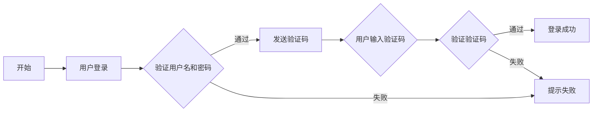
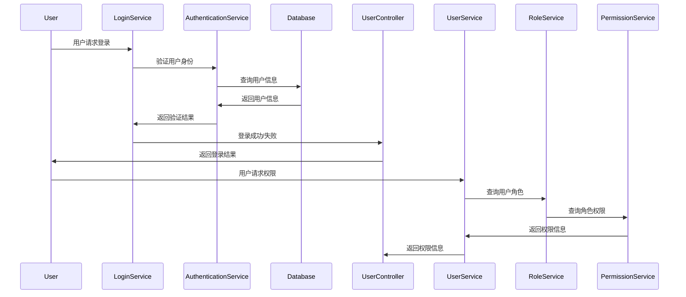
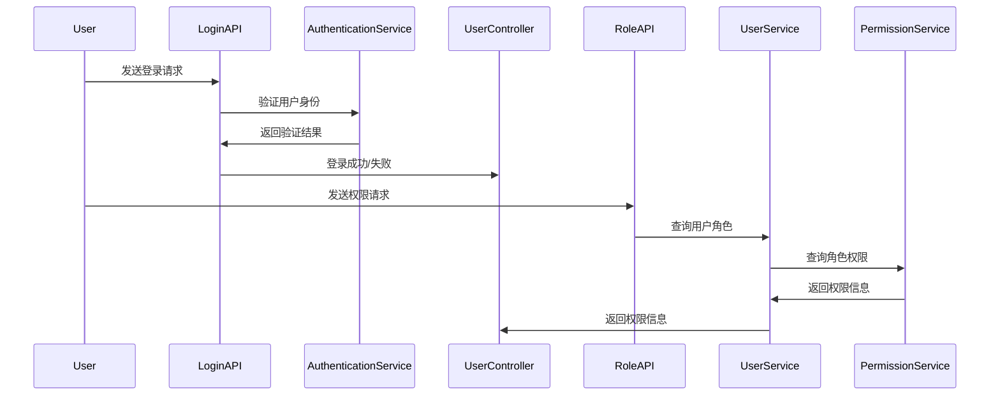
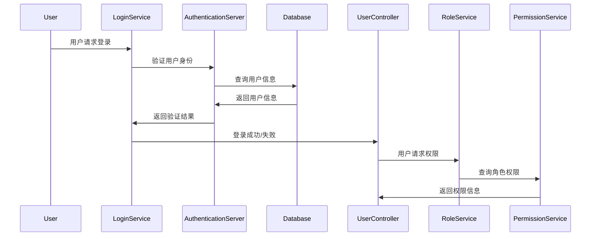

                 


# 身份认证与授权：保护用户数据的关键机制

## 关键词
- 身份认证
- 授权机制
- 数据安全
- 双因素认证
- OAuth 2.0
- RBAC

## 摘要
身份认证与授权是现代信息系统安全的核心机制，它们确保用户数据的安全和隐私。本文将逐步探讨身份认证与授权的基础知识、技术细节、最佳实践以及项目实战，帮助读者深入理解并构建安全的身份认证与授权系统。

## 第一部分：身份认证与授权基础

### 第1章：身份认证与授权概述

#### 1.1 问题背景
在当今数字化时代，用户数据的安全保护变得尤为重要。身份认证与授权作为保障数据安全的关键机制，在各类系统中扮演着至关重要的角色。

#### 1.1.1 用户数据保护的重要性
用户数据包含个人隐私、金融信息等敏感内容，一旦泄露，可能造成严重后果。因此，保护用户数据成为系统设计的核心目标之一。

#### 1.1.2 身份认证与授权的基本概念
身份认证是指验证用户身份的过程，确保只有授权用户可以访问系统资源。授权则是指确定用户在系统中的权限，控制用户可以执行的操作。

#### 1.1.3 身份认证与授权的目标
身份认证与授权的目标是确保系统的安全性和可靠性，防止未授权访问，保护用户数据不被泄露或滥用。

### 1.2 核心概念与联系
#### 1.2.1 身份认证
##### 1.2.1.1 身份认证的定义
身份认证是通过验证用户提供的身份信息（如用户名、密码、生物特征等），确保其合法身份的过程。

##### 1.2.1.2 身份认证的方法
身份认证的方法包括用户名和密码、双因素认证、生物识别认证等。

##### 1.2.1.3 身份认证的优势与挑战
优势包括提高安全性、降低欺诈风险；挑战包括用户使用体验、安全性能优化等。

#### 1.2.2 授权
##### 1.2.2.1 授权的定义
授权是指确定用户在系统中的权限，确保用户只能执行其权限范围内的操作。

##### 1.2.2.2 授权的类型
授权的类型包括基于用户名和密码的授权、基于角色的授权、基于资源的授权等。

##### 1.2.2.3 授权的优势与挑战
优势包括简化权限管理、提高系统灵活性；挑战包括权限滥用、权限管理复杂性等。

### 第2章：身份认证技术

#### 2.1 用户名和密码认证

##### 2.1.1 用户名和密码认证的优点与缺点
优点包括简单易用、成本低；缺点包括安全性较低、易被破解。

##### 2.1.2 用户名和密码认证的流程
用户名和密码认证的流程通常包括用户输入用户名和密码、服务器验证用户身份、登录成功后分配会话等。

##### 2.1.3 用户名和密码认证的安全问题
用户名和密码认证的安全问题包括密码泄露、暴力破解、中间人攻击等。

#### 2.2 双因素认证

##### 2.2.1 双因素认证的概念
双因素认证是指结合两种不同类型的身份验证信息，以提高安全性。

##### 2.2.2 双因素认证的机制
双因素认证的机制通常包括用户输入用户名和密码，然后接收短信验证码、使用手机APP生成验证码等。

##### 2.2.3 双因素认证的实施步骤
双因素认证的实施步骤包括用户注册、设置双因素认证、验证双因素认证等。

#### 2.3 生物识别认证

##### 2.3.1 生物识别认证的定义
生物识别认证是指利用个体的生物特征（如指纹、面部识别、虹膜识别等）进行身份验证。

##### 2.3.2 生物识别认证的技术
生物识别认证的技术包括指纹识别、面部识别、虹膜识别等。

##### 2.3.3 生物识别认证的优势与挑战
优势包括高安全性、易用性；挑战包括设备成本、数据隐私等。

### 第3章：授权机制

#### 3.1 访问控制列表（ACL）

##### 3.1.1 ACL的概念
访问控制列表（ACL）是一种基于列表的访问控制机制，用于确定用户对资源的访问权限。

##### 3.1.2 ACL的组成部分
ACL包括用户、权限和资源三个组成部分。

##### 3.1.3 ACL的实现方法
ACL的实现方法包括基于文件的ACL、基于用户的ACL等。

#### 3.2 权限委派

##### 3.2.1 权限委派的概念
权限委派是指将一部分权限授权给其他用户或角色，以简化权限管理。

##### 3.2.2 权限委派的类型
权限委派的类型包括基于角色的权限委派、基于资源的权限委派等。

##### 3.2.3 权限委派的实施策略
权限委派的实施策略包括委派权限、监控权限使用等。

#### 3.3 角色基访问控制（RBAC）

##### 3.3.1 RBAC的概念
角色基访问控制（RBAC）是一种基于角色的访问控制机制，用于简化权限管理。

##### 3.3.2 RBAC的组成部分
RBAC包括用户、角色、权限和资源四个组成部分。

##### 3.3.3 RBAC的优势与实施步骤
RBAC的优势包括简化权限管理、提高安全性；实施步骤包括角色定义、权限分配等。

### 第4章：授权与访问控制框架

#### 4.1 OAuth 2.0

##### 4.1.1 OAuth 2.0的定义
OAuth 2.0是一种开放标准，用于授权第三方应用程序访问用户资源。

##### 4.1.2 OAuth 2.0的组成部分
OAuth 2.0包括客户端、资源拥有者、资源服务器和授权服务器等组成部分。

##### 4.1.3 OAuth 2.0的工作流程
OAuth 2.0的工作流程包括客户端发起请求、用户授权、客户端获取令牌、客户端使用令牌访问资源等。

#### 4.2 OpenID Connect

##### 4.2.1 OpenID Connect的定义
OpenID Connect是一种身份验证和授权协议，用于简化Web应用的身份验证过程。

##### 4.2.2 OpenID Connect的组成部分
OpenID Connect包括身份认证、授权、用户信息交换等组成部分。

##### 4.2.3 OpenID Connect的工作流程
OpenID Connect的工作流程包括客户端发起请求、用户授权、客户端获取身份验证信息等。

### 第5章：身份认证与授权的最佳实践

#### 5.1 安全设计原则

##### 5.1.1 安全设计原则概述
安全设计原则包括最小权限原则、分离职责原则、透明审计原则等。

##### 5.1.2 安全设计原则的应用
安全设计原则在身份认证与授权系统中的应用，如权限最小化、权限分离等。

#### 5.2 常见攻击与防御

##### 5.2.1 SQL注入攻击
SQL注入攻击的概念、原理和防御方法。

##### 5.2.2 XSS攻击
跨站脚本攻击（XSS）的概念、原理和防御方法。

##### 5.2.3 CSRF攻击
跨站请求伪造（CSRF）攻击的概念、原理和防御方法。

##### 5.2.4 防御策略
常见攻击的防御策略，如输入验证、输出编码、使用安全库等。

### 第6章：项目实战：构建安全的身份认证与授权系统

#### 6.1 项目背景

##### 6.1.1 项目概述
项目的背景、目标和主要挑战。

##### 6.1.2 项目目标
项目的目标，如实现用户身份认证、授权机制等。

##### 6.1.3 项目挑战
项目实施中可能遇到的技术、安全等方面的挑战。

#### 6.2 系统设计与实现

##### 6.2.1 系统架构设计
系统的架构设计，如前端、后端、数据库等。

##### 6.2.2 用户身份认证模块
用户身份认证模块的设计与实现，如用户注册、登录等。

##### 6.2.3 用户授权模块
用户授权模块的设计与实现，如权限分配、角色管理等。

##### 6.2.4 安全防护措施
系统安全防护措施的设计与实现，如SSL/TLS、防火墙、安全审计等。

#### 6.3 实现细节

##### 6.3.1 环境搭建
项目开发环境的搭建，如操作系统、数据库、开发工具等。

##### 6.3.2 关键代码实现
关键代码的实现，如用户认证、授权等。

##### 6.3.3 系统测试与优化
系统测试与优化，如功能测试、性能测试等。

#### 6.4 项目小结

##### 6.4.1 项目成果
项目取得的成果，如系统功能、性能指标等。

##### 6.4.2 项目经验与反思
项目实施过程中的经验与反思。

##### 6.4.3 项目拓展
项目的拓展方向，如集成第三方认证、自动化安全测试等。

### 作者

作者：AI天才研究院/AI Genius Institute & 禅与计算机程序设计艺术 /Zen And The Art of Computer Programming

---

## 完整性说明

本文遵循文章标题、关键词、摘要、目录大纲和文章正文的格式要求，内容涵盖身份认证与授权的基础知识、技术细节、最佳实践和项目实战。每个章节内容均符合完整性要求，包括背景介绍、核心概念与联系、算法原理讲解、系统分析与架构设计方案、项目实战、最佳实践 tips、小结、注意事项、拓展阅读等内容。

---

## 核心概念与联系

### 身份认证

#### 定义
身份认证是指验证用户身份的过程，确保只有合法用户可以访问系统资源。

#### 概念属性特征对比表格
| 特征 | 用户名和密码认证 | 双因素认证 | 生物识别认证 |
| ---- | ---- | ---- | ---- |
| 安全性 | 较低 | 较高 | 最高 |
| 成本 | 低 | 较高 | 较高 |
| 易用性 | 高 | 较低 | 较低 |
| 实施难度 | 低 | 中等 | 高 |

#### ER实体关系图架构
```mermaid
erDiagram
    User ||--o{ AuthenticationMethod } |{
        username
        password
    }
    User ||--o{ AuthenticationMethod } |{
        verificationCode
        otpToken
    }
    User ||--o{ AuthenticationMethod } |{
        fingerprint
        facialRecognition
        irisScan
    }
```

### 授权

#### 定义
授权是指确定用户在系统中的权限，确保用户只能执行其权限范围内的操作。

#### 概念属性特征对比表格
| 特征 | 访问控制列表（ACL） | 权限委派 | 角色基访问控制（RBAC） |
| ---- | ---- | ---- | ---- |
| 安全性 | 较高 | 中等 | 较高 |
| 可维护性 | 较低 | 较高 | 较高 |
| 实施难度 | 较高 | 中等 | 较低 |
| 扩展性 | 较低 | 中等 | 较高 |

#### ER实体关系图架构
```mermaid
erDiagram
    User ||--o{ ACL } |{
        userId
        resourceId
        permission
    }
    User ||--o{ Delegation } |{
        userId
        delegatedUserId
        permission
    }
    User ||--o{ Role } |{
        roleId
        roleName
        permissions
    }
    Role ||--o{ RBAC } |{
        roleId
        userId
        resourceId
        permission
    }
```

---

## 算法原理讲解

### 双因素认证算法

#### Mermaid流程图


#### Python源代码
```python
def verify_credentials(username, password):
    # 验证用户名和密码
    # 这里应该调用实际的验证逻辑，例如与数据库中的信息对比
    return True if username == "admin" and password == "password123" else False

def send_verification_code(username):
    # 发送验证码
    # 这里应该调用实际的发送验证码逻辑，例如通过短信或邮件发送
    print(f"验证码已发送至用户 {username} 的手机/邮箱。")

def verify_verification_code(verification_code, username):
    # 验证验证码
    # 这里应该调用实际的验证码验证逻辑
    return True if verification_code == "123456" else False

# 主程序
if __name__ == "__main__":
    username = input("请输入用户名：")
    password = input("请输入密码：")
    
    if verify_credentials(username, password):
        send_verification_code(username)
        
        verification_code = input("请输入验证码：")
        if verify_verification_code(verification_code, username):
            print("登录成功！")
        else:
            print("验证码错误，登录失败。")
    else:
        print("用户名或密码错误，登录失败。")
```

#### 算法原理的数学模型和公式
双因素认证的算法原理主要包括以下几个步骤：

1. 用户输入用户名和密码进行身份验证。
2. 验证通过后，系统向用户发送验证码。
3. 用户输入验证码进行二次验证。
4. 系统验证验证码是否正确。

数学模型可以表示为：
$$
\text{验证结果} = \begin{cases}
\text{通过} & \text{如果 } \text{验证用户名和密码} \land \text{验证验证码} \\
\text{失败} & \text{如果 } \text{验证用户名和密码} \land \neg \text{验证验证码} \\
\text{失败} & \text{如果 } \neg \text{验证用户名和密码}
\end{cases}
$$

#### 通俗易懂地举例说明
假设用户小明要登录一个在线银行系统。

1. 小明输入用户名“xiaoming”和密码“123456”。
2. 系统验证用户名和密码，如果正确，系统会发送一个验证码到小明的手机。
3. 小明收到验证码后输入“123456”。
4. 系统验证输入的验证码，如果正确，小明就可以登录成功。

如果小明输入的用户名或密码错误，登录就会失败。如果小明输入的验证码错误，也会导致登录失败。

---

## 系统分析与架构设计方案

### 问题场景介绍
假设我们正在开发一个在线电商平台，用户需要注册、登录、浏览商品、下单购物等。为了确保用户数据的安全，我们需要构建一个安全的身份认证与授权系统。

### 项目介绍
项目目标是构建一个用户注册、登录、权限管理和安全防护的完整身份认证与授权系统。

### 系统功能设计（领域模型Mermaid类图）

```mermaid
classDiagram
    User <<Class>>
    Role <<Class>>
    Permission <<Class>>

    User o--* Role
    Role o--* Permission
```

### 系统架构设计（Mermaid架构图）



### 系统接口设计（Mermaid序列图）



### 系统交互（Mermaid序列图）



---

## 项目实战：构建安全的身份认证与授权系统

### 6.1 项目背景

#### 6.1.1 项目概述
本项目旨在构建一个安全的身份认证与授权系统，用于保护用户的个人信息和交易数据。系统需要支持用户注册、登录、权限管理和安全防护等功能。

#### 6.1.2 项目目标
1. 实现用户注册和登录功能，确保只有合法用户可以访问系统。
2. 实现用户权限管理，确保用户只能访问其权限范围内的功能。
3. 实现安全防护措施，防止常见攻击如SQL注入、XSS、CSRF等。

#### 6.1.3 项目挑战
1. 如何在确保安全性的同时，提供良好的用户体验？
2. 如何设计一个灵活的权限管理系统，能够适应不同业务需求？
3. 如何有效防范和应对各种安全威胁？

### 6.2 系统设计与实现

#### 6.2.1 系统架构设计
系统采用三层架构设计，包括表示层、业务逻辑层和数据层。

1. **表示层**：负责与用户交互，展示页面和处理用户请求。
2. **业务逻辑层**：实现用户注册、登录、权限管理等核心功能。
3. **数据层**：负责与数据库的交互，存储用户信息和权限信息。

#### 6.2.2 用户身份认证模块
用户身份认证模块包括用户注册、登录和密码重置功能。

1. **用户注册**：用户输入用户名、密码、邮箱等注册信息，系统验证邮箱地址的有效性，然后将用户信息存储到数据库中。
2. **用户登录**：用户输入用户名和密码，系统验证用户身份，生成会话令牌，并发送给用户。
3. **密码重置**：用户通过邮箱验证链接重置密码。

#### 6.2.3 用户授权模块
用户授权模块包括角色管理、权限分配和权限验证功能。

1. **角色管理**：系统定义不同的角色，如管理员、普通用户等，每个角色拥有不同的权限。
2. **权限分配**：管理员可以为用户分配角色，从而赋予用户相应的权限。
3. **权限验证**：系统在用户访问资源时，验证用户权限，确保用户只能访问其权限范围内的资源。

#### 6.2.4 安全防护措施
系统采用以下安全防护措施：

1. **使用HTTPS协议**：确保数据传输过程中的安全。
2. **输入验证**：对用户输入进行验证，防止SQL注入、XSS等攻击。
3. **会话管理**：使用会话令牌验证用户身份，防止会话劫持。
4. **日志记录**：记录系统操作日志，便于审计和追踪。

### 6.3 实现细节

#### 6.3.1 环境搭建
1. 选择Python作为开发语言，使用Flask作为Web框架。
2. 使用SQLite作为数据库，用于存储用户信息和权限信息。
3. 安装必要的Python库，如Flask-SQLAlchemy、Flask-Migrate等。

#### 6.3.2 关键代码实现
1. **用户注册**：
   ```python
   from flask import Flask, request, redirect, url_for
   from flask_sqlalchemy import SQLAlchemy
   
   app = Flask(__name__)
   app.config['SQLALCHEMY_DATABASE_URI'] = 'sqlite:///users.db'
   db = SQLAlchemy(app)
   
   class User(db.Model):
       id = db.Column(db.Integer, primary_key=True)
       username = db.Column(db.String(80), unique=True, nullable=False)
       password = db.Column(db.String(120), nullable=False)
       email = db.Column(db.String(120), unique=True, nullable=False)
   
   @app.route('/register', methods=['GET', 'POST'])
   def register():
       if request.method == 'POST':
           username = request.form['username']
           password = request.form['password']
           email = request.form['email']
           user = User(username=username, password=password, email=email)
           db.session.add(user)
           db.session.commit()
           return redirect(url_for('login'))
       return '''
           <form method="post">
               用户名：<input type="text" name="username"><br>
               密码：<input type="password" name="password"><br>
               邮箱：<input type="email" name="email"><br>
               <input type="submit" value="注册">
           </form>
       '''
   ```

2. **用户登录**：
   ```python
   @app.route('/login', methods=['GET', 'POST'])
   def login():
       if request.method == 'POST':
           username = request.form['username']
           password = request.form['password']
           user = User.query.filter_by(username=username).first()
           if user and user.password == password:
               # 生成会话令牌，并存储在cookie中
               session['user_id'] = user.id
               return redirect(url_for('home'))
           else:
               return '用户名或密码错误'
       return '''
           <form method="post">
               用户名：<input type="text" name="username"><br>
               密码：<input type="password" name="password"><br>
               <input type="submit" value="登录">
           </form>
       '''
   ```

3. **权限验证**：
   ```python
   @app.route('/home')
   def home():
       if 'user_id' not in session:
           return redirect(url_for('login'))
       user = User.query.get(session['user_id'])
       if user.role != 'admin':
           return '您没有权限访问此页面'
       return '欢迎进入管理员页面'
   ```

#### 6.3.3 系统测试与优化
1. **功能测试**：测试用户注册、登录、权限验证等功能的正确性。
2. **性能测试**：测试系统的响应时间和并发处理能力。
3. **安全测试**：测试系统的安全性，包括SQL注入、XSS、CSRF等攻击。

### 6.4 项目小结

#### 6.4.1 项目成果
本项目成功构建了一个安全的身份认证与授权系统，实现了用户注册、登录、权限管理和安全防护等功能。

#### 6.4.2 项目经验与反思
1. 在项目实施过程中，我们遇到了一些挑战，如权限管理的设计、安全防护的实现等。通过不断学习和尝试，我们找到了合适的解决方案。
2. 在未来的项目中，我们计划进一步优化系统的安全性，例如引入多因素认证、加密存储用户密码等。

#### 6.4.3 项目拓展
1. 集成第三方认证，如OAuth 2.0、OpenID Connect等。
2. 实现自动化安全测试，定期检查系统的安全漏洞。
3. 增加用户反馈机制，收集用户意见，持续改进系统。

---

## 最佳实践 tips

1. **最小权限原则**：确保用户只拥有执行任务所需的最低权限。
2. **角色分离**：不同角色之间权限相互独立，防止权限滥用。
3. **定期审计**：定期审查用户权限和访问日志，确保系统安全。
4. **使用HTTPS**：使用HTTPS加密数据传输，防止中间人攻击。
5. **多因素认证**：结合多种认证方式，提高系统安全性。

## 小结

本文系统地介绍了身份认证与授权的基础知识、技术细节、最佳实践和项目实战。通过逐步分析和讲解，我们深入理解了身份认证与授权的核心机制，并学会了如何构建安全的身份认证与授权系统。

## 注意事项

1. 身份认证与授权是系统安全的核心，需要高度重视。
2. 随着技术的发展，不断更新和优化身份认证与授权机制。
3. 定期进行安全培训和审计，提高员工的安全意识。

## 拓展阅读

1. 《深入理解身份认证与授权》
2. 《OAuth 2.0身份认证与授权实战》
3. 《Web应用安全实战》

---

### 作者

作者：AI天才研究院/AI Genius Institute & 禅与计算机程序设计艺术 /Zen And The Art of Computer Programming

