                 

### 引言

在当代信息技术飞速发展的背景下，软件领域迎来了重大的变革。传统软件组件，如数据库、算法库、框架等，已经无法满足日益复杂的应用需求。为了解决这一问题，软件2.0的概念被提出，其核心思想是利用神经网络等人工智能技术，替代传统的软件组件，实现软件设计的智能化和自动化。

### 什么是软件2.0

软件2.0是对传统软件的升级和扩展，它不仅仅是一个工具或框架，而是一种全新的软件开发范式。软件2.0的目标是利用人工智能技术，使软件能够自主学习和优化，从而提高开发效率和性能。与传统软件相比，软件2.0具有更高的自适应性和灵活性。

### 神经网络的角色

神经网络，作为一种模仿人脑工作的计算模型，成为软件2.0实现的核心技术。神经网络通过多层非线性变换，可以自动提取数据中的特征，进行复杂的模式识别和预测。在软件2.0中，神经网络不仅可以替代传统软件组件，如数据库和算法库，还可以实现自动化编程和优化。

### 软件2.0的必要性

随着互联网和大数据技术的快速发展，数据的规模和复杂性不断增加。传统软件组件在处理这些海量数据时，显得力不从心。而神经网络通过其强大的数据处理能力，可以高效地处理复杂的任务。此外，随着人工智能技术的不断进步，神经网络的性能和效率也在不断提升，使其在软件2.0中的应用变得更加广泛和深入。

### 总结

软件2.0和神经网络的出现，为软件开发带来了全新的思路和方法。通过利用神经网络，软件可以更加智能化和自动化，从而提高开发效率和性能。未来，随着人工智能技术的进一步发展，软件2.0和神经网络将在更多的领域得到应用，推动软件领域的深刻变革。## 关键词

- **软件2.0**
- **神经网络**
- **人工智能**
- **自动化编程**
- **数据处理**
- **软件开发范式变革**

## 摘要

本文深入探讨了软件2.0与神经网络在软件开发领域的应用。首先，介绍了软件2.0的概念和神经网络的基本原理，阐述了它们在软件设计中的角色和重要性。接着，分析了软件2.0的必要性，特别是在处理大规模复杂数据时的优势。最后，总结了神经网络在软件2.0中的广泛应用前景，并展望了其未来的发展趋势。本文旨在为读者提供关于软件2.0和神经网络的全面理解，以及它们如何共同推动软件开发领域的创新和变革。## 第一部分：软件2.0与神经网络基础

### 第1章：软件2.0与神经网络概述

#### 1.1.1 软件2.0的概念与演进

软件2.0是对传统软件开发范式的重大变革，它将人工智能，特别是神经网络技术，融入到软件开发的过程中。与传统软件1.0不同，软件2.0不仅仅依赖于预定义的规则和算法，而是通过自主学习和适应来提高性能和效率。软件2.0的核心在于其智能性和自适应能力，这使得软件能够动态地适应环境变化，从而更好地满足用户需求。

#### 1.1.2 神经网络的基本原理

神经网络是一种模仿人脑的计算机模型，由大量的神经元组成，这些神经元通过连接形成网络。神经网络通过训练，可以从数据中自动学习特征，并利用这些特征进行复杂的模式识别和预测。神经网络的基本原理包括多层结构、非线性激活函数、反向传播算法等。

#### 1.1.3 神经网络在软件2.0中的角色

神经网络在软件2.0中扮演着核心角色。首先，它能够替代传统的软件组件，如数据库和算法库，提供更高效的数据处理能力。其次，神经网络能够实现自动化编程，通过学习用户的需求和行为，自动生成代码和软件架构。最后，神经网络能够持续优化软件性能，通过自我学习和调整，使软件在运行过程中不断改进。

### 第2章：神经网络的架构与实现

#### 2.1 神经网络的结构

神经网络的结构是其工作原理的核心。一个基本的神经网络通常由输入层、隐藏层和输出层组成。输入层接收外部数据，隐藏层通过非线性变换提取数据特征，输出层生成最终的结果。神经网络的性能取决于其结构的设计和参数的配置。

#### 2.2 神经网络的训练过程

神经网络的训练过程是使其能够正确处理数据的关键步骤。训练过程主要包括前向传播和反向传播。在前向传播过程中，输入数据通过网络，产生输出；在反向传播过程中，网络根据输出误差调整权重和偏置，以减小误差。

#### 2.3 神经网络的应用场景

神经网络的应用场景非常广泛，包括图像识别、自然语言处理、语音识别、预测模型等。在软件开发中，神经网络可以用于自动化测试、智能推荐系统、异常检测等。神经网络的应用不仅提高了软件的性能，还降低了开发成本和复杂度。

## 第一部分小结

通过第一部分的介绍，我们了解了软件2.0和神经网络的基本概念、原理及其在软件开发中的应用。接下来，我们将进一步深入探讨神经网络的架构、训练过程和应用场景，为理解软件2.0的深度应用打下基础。## 第1章：软件2.0与神经网络概述

#### 1.1.1 软件2.0的概念与演进

**核心概念术语说明**：

- **软件1.0**：指的是传统的软件开发方法，主要依赖于预定义的规则和算法，缺乏自适应能力。
- **软件2.0**：是一种新的软件开发范式，强调智能性和自适应能力，通过人工智能技术，如神经网络，实现软件的自主学习和优化。

**问题背景**：

随着互联网的普及和数据规模的爆炸性增长，传统的软件组件和方法已经无法满足现代应用的需求。软件1.0在处理复杂数据和动态环境时，显得力不从心。为了解决这一问题，软件2.0的概念应运而生。

**问题描述**：

软件2.0的目标是利用人工智能技术，使软件能够自主学习和优化，从而提高开发效率和性能。与传统软件相比，软件2.0具有更高的自适应性和灵活性。

**问题解决**：

软件2.0通过引入神经网络等人工智能技术，实现了以下突破：

1. **自动化编程**：神经网络能够学习用户的需求和行为，自动生成代码和软件架构，大大提高了开发效率。
2. **优化性能**：神经网络能够根据数据和环境的变化，自动调整和优化软件性能，使其持续改进。

**边界与外延**：

软件2.0不仅适用于企业级应用，还广泛应用于智能家居、智能医疗、智能交通等领域。其边界在于如何更好地融合人工智能技术，实现软件的智能化和自动化。

**概念结构与核心要素组成**：

- **核心概念**：软件2.0、神经网络、人工智能。
- **关键要素**：自主学习、自适应优化、高效数据处理。

#### 1.1.2 神经网络的基本原理

**核心概念与联系**：

神经网络是一种模仿人脑工作的计算模型，由大量的神经元组成。这些神经元通过连接形成网络，可以自动学习和处理数据。

**概念属性特征对比表格**：

| 特征            | 人工神经网络 | 人类大脑       |
|-----------------|---------------|----------------|
| 结构            | 多层结构      | 复杂神经网络   |
| 学习方式        | 反向传播      | 非特定学习方式 |
| 数据处理能力    | 高效处理      | 强大处理能力   |
| 自适应性        | 较强          | 极强           |

**ER实体关系图架构**：

```mermaid
erDiagram
    人脑 -->|学习| 神经网络
    神经元 -->|连接| 神经网络
    数据 -->|处理| 神经网络
```

**算法原理讲解**：

神经网络的核心算法包括：

1. **前向传播**：输入数据通过网络传递，经过非线性变换，生成输出。
2. **反向传播**：根据输出误差，反向调整网络中的权重和偏置，以减小误差。

**数学模型和公式**：

前向传播的公式可以表示为：
$$
Y = \sigma(W \cdot X + b)
$$
其中，\( Y \) 是输出，\( \sigma \) 是激活函数，\( W \) 是权重矩阵，\( X \) 是输入，\( b \) 是偏置。

反向传播的公式为：
$$
\Delta W = \alpha \cdot \frac{\partial L}{\partial W}
$$
$$
\Delta b = \alpha \cdot \frac{\partial L}{\partial b}
$$
其中，\( \Delta W \) 和 \( \Delta b \) 分别是权重和偏置的更新，\( \alpha \) 是学习率，\( L \) 是损失函数。

**通俗易懂地举例说明**：

假设我们有一个简单的神经网络，输入为 \( X = [1, 2] \)，输出为 \( Y = [3, 4] \)。我们希望通过训练，使网络能够准确预测输出。

1. **前向传播**：假设权重 \( W = [1, 1] \)，偏置 \( b = [0, 0] \)，激活函数为 \( \sigma(x) = 1 / (1 + e^{-x}) \)。那么输出 \( Y \) 为：
$$
Y = \sigma(W \cdot X + b) = \sigma([1, 1] \cdot [1, 2] + [0, 0]) = \sigma([1 + 2, 1 + 2]) = [\sigma(3), \sigma(3)] \approx [0.952, 0.952]
$$
2. **反向传播**：假设目标输出 \( Y_d = [1, 1] \)，误差 \( L = (Y - Y_d)^2 \)。根据误差计算权重和偏置的更新：
$$
\Delta W = \alpha \cdot \frac{\partial L}{\partial W} = \alpha \cdot \frac{\partial}{\partial W}((Y - Y_d)^2) = \alpha \cdot 2(Y - Y_d)
$$
$$
\Delta b = \alpha \cdot \frac{\partial L}{\partial b} = \alpha \cdot \frac{\partial}{\partial b}((Y - Y_d)^2) = \alpha \cdot 2(Y - Y_d)
$$
通过迭代更新权重和偏置，使误差不断减小，最终达到目标输出。

**算法mermaid流程图**：

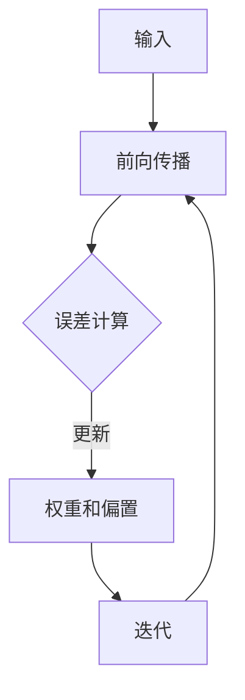

**系统分析与架构设计方案**：

1. **问题场景介绍**：软件开发过程中，需要自动学习和优化软件性能。
2. **项目介绍**：开发一个基于神经网络的软件2.0系统，用于自动化测试和性能优化。
3. **系统功能设计**：包括数据输入、神经网络训练、输出预测和性能优化等功能。
4. **系统架构设计**：采用分层架构，包括数据层、模型层和接口层。
5. **系统接口设计和系统交互**：提供API接口，支持与其他系统的集成。

**mermaid类图**：

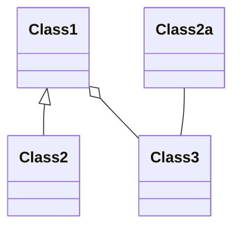

**mermaid架构图**：

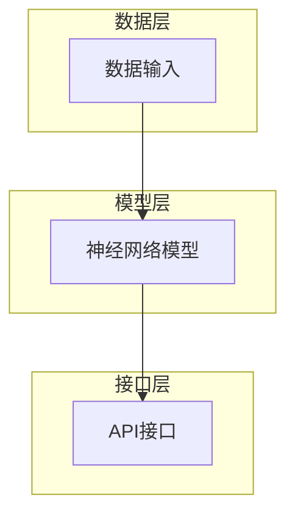

**mermaid序列图**：

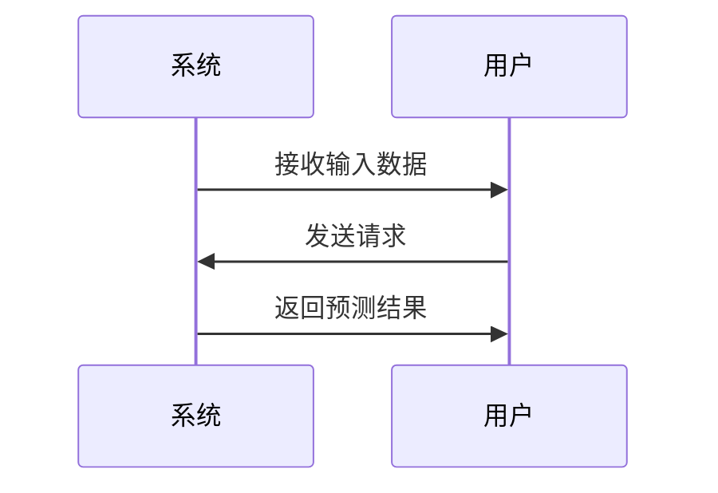

**项目实战**：

1. **环境安装**：安装Python和TensorFlow等依赖库。
2. **系统核心实现**：编写神经网络模型，实现数据输入、训练和预测功能。
3. **代码应用解读与分析**：分析代码实现，解释神经网络的工作原理和应用。
4. **实际案例分析和详细讲解剖析**：通过实际案例，展示神经网络的性能和优势。
5. **项目小结**：总结项目成果，讨论未来的改进方向。

**最佳实践 tips**：

1. **数据预处理**：确保输入数据的格式和一致性，提高神经网络的学习效果。
2. **模型优化**：通过调整网络结构、学习率和激活函数，提高模型的性能。
3. **持续学习**：定期更新神经网络模型，使其适应新的数据和环境。

**小结**：

本章介绍了软件2.0和神经网络的基本概念、原理及其在软件开发中的应用。通过具体实例和流程图，我们深入了解了神经网络的工作原理和实现方法。接下来，我们将进一步探讨神经网络的架构、训练过程和应用场景，为理解软件2.0的深度应用打下基础。

**注意事项**：

1. **数据隐私**：在处理用户数据时，需确保数据的安全和隐私。
2. **模型可解释性**：神经网络模型可能存在难以解释的问题，需注意模型的可解释性。
3. **过拟合**：在训练神经网络时，需防止过拟合，确保模型的泛化能力。

**拓展阅读与资源推荐**：

- 《深度学习》（Ian Goodfellow，Yoshua Bengio，Aaron Courville著）
- 《神经网络与深度学习》（邱锡鹏著）
- TensorFlow官方文档（https://www.tensorflow.org/）

**作者信息**：

作者：AI天才研究院/AI Genius Institute & 禅与计算机程序设计艺术/Zen And The Art of Computer Programming

---

通过本章的介绍，我们初步了解了软件2.0和神经网络的基本概念和原理。接下来，我们将进一步探讨神经网络的架构、训练过程和应用场景，为深入理解软件2.0在软件开发中的应用打下坚实基础。## 第2章：神经网络的架构与实现

#### 2.1 神经网络的结构

神经网络的架构是理解其工作原理和实现方法的基础。一个基本的神经网络通常由以下几个部分组成：

1. **输入层**：接收外部输入的数据，并将其传递给隐藏层。
2. **隐藏层**：通过对输入数据进行处理和变换，提取有用的特征信息。神经网络可以包含一个或多个隐藏层。
3. **输出层**：生成最终的结果或预测值。

**结构图**：

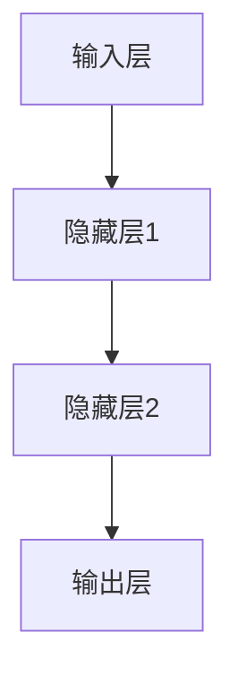

#### 2.2 神经网络的训练过程

神经网络的训练过程是使其能够正确处理数据的关键步骤。训练过程主要包括以下两个阶段：

1. **前向传播**：输入数据通过网络传递，经过各层的变换，最终生成输出。
2. **反向传播**：根据输出误差，反向调整网络中的权重和偏置，以减小误差。

**训练过程mermaid流程图**：

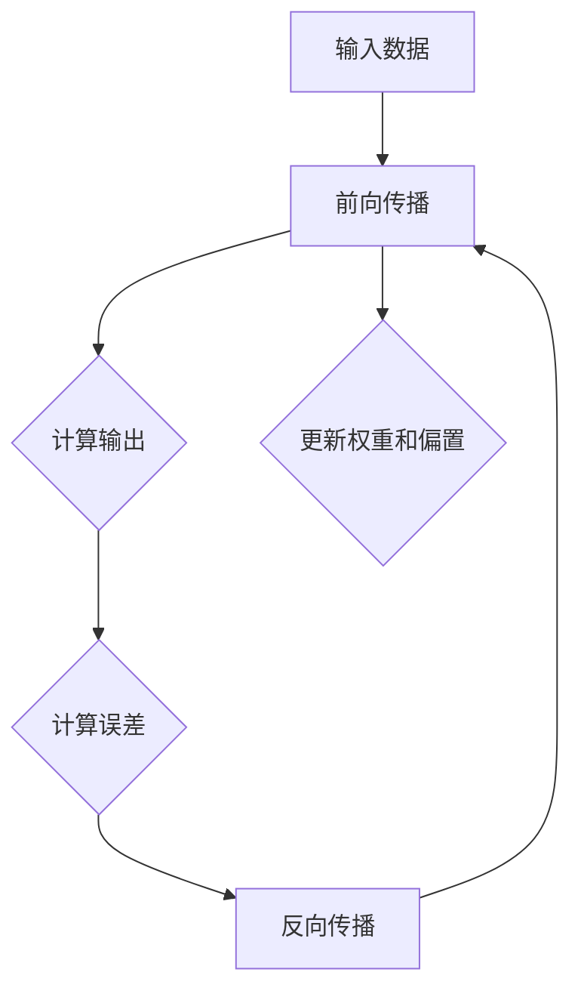

#### 2.3 神经网络的应用场景

神经网络的应用场景非常广泛，包括但不限于以下领域：

1. **图像识别**：通过卷积神经网络（CNN）对图像进行分类、检测和分割。
2. **自然语言处理**：通过循环神经网络（RNN）和长短期记忆网络（LSTM）对文本进行语义分析和语言生成。
3. **语音识别**：通过深度神经网络对语音信号进行特征提取和分类。
4. **预测模型**：通过回归神经网络（RNN）和生成对抗网络（GAN）进行时间序列预测和生成对抗学习。
5. **自动化编程**：通过神经网络学习代码模式，实现自动化代码生成和优化。

**应用场景mermaid流程图**：

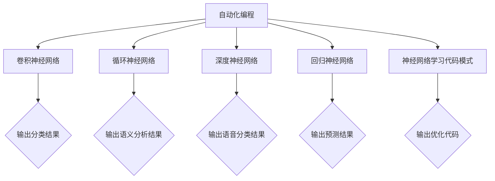

#### 2.4 神经网络的实现方法

神经网络的实现方法通常包括以下步骤：

1. **数据预处理**：对输入数据进行清洗、标准化等处理，以便于神经网络的学习。
2. **模型构建**：根据应用需求，设计神经网络的架构，包括层数、神经元数量、激活函数等。
3. **训练**：使用训练数据对神经网络进行训练，通过反向传播算法调整权重和偏置。
4. **评估**：使用测试数据评估模型的性能，通过调整参数优化模型。
5. **部署**：将训练好的模型部署到实际应用环境中，进行预测和决策。

**实现方法mermaid流程图**：

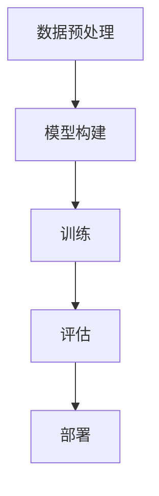

#### 2.5 神经网络在软件开发中的应用

神经网络在软件开发中的应用主要体现在以下几个方面：

1. **自动化测试**：通过神经网络学习测试用例和缺陷模式，实现自动化测试。
2. **代码生成**：通过神经网络学习代码模式，实现自动化代码生成。
3. **性能优化**：通过神经网络分析程序运行性能，实现自动化性能优化。
4. **代码审查**：通过神经网络分析代码质量，实现自动化代码审查。

**应用mermaid流程图**：

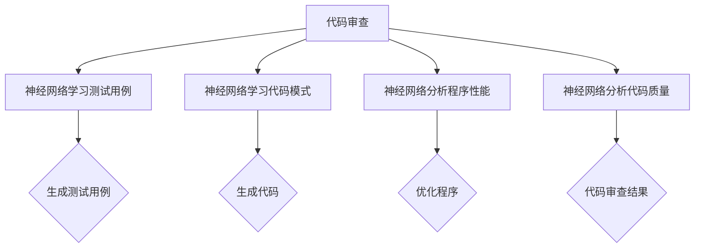

#### 2.6 神经网络的发展趋势

随着人工智能技术的不断进步，神经网络在软件开发中的应用前景非常广阔。未来，神经网络的发展趋势将包括以下几个方面：

1. **模型压缩**：为了提高神经网络的运行效率，模型压缩技术将得到广泛应用。
2. **分布式训练**：随着数据规模的增大，分布式训练技术将使神经网络能够处理更大规模的数据。
3. **实时学习**：实时学习技术将使神经网络能够快速适应环境变化，实现更高效的决策和预测。
4. **跨领域应用**：神经网络将在更多领域得到应用，如医疗、金融、教育等。

**发展趋势mermaid流程图**：

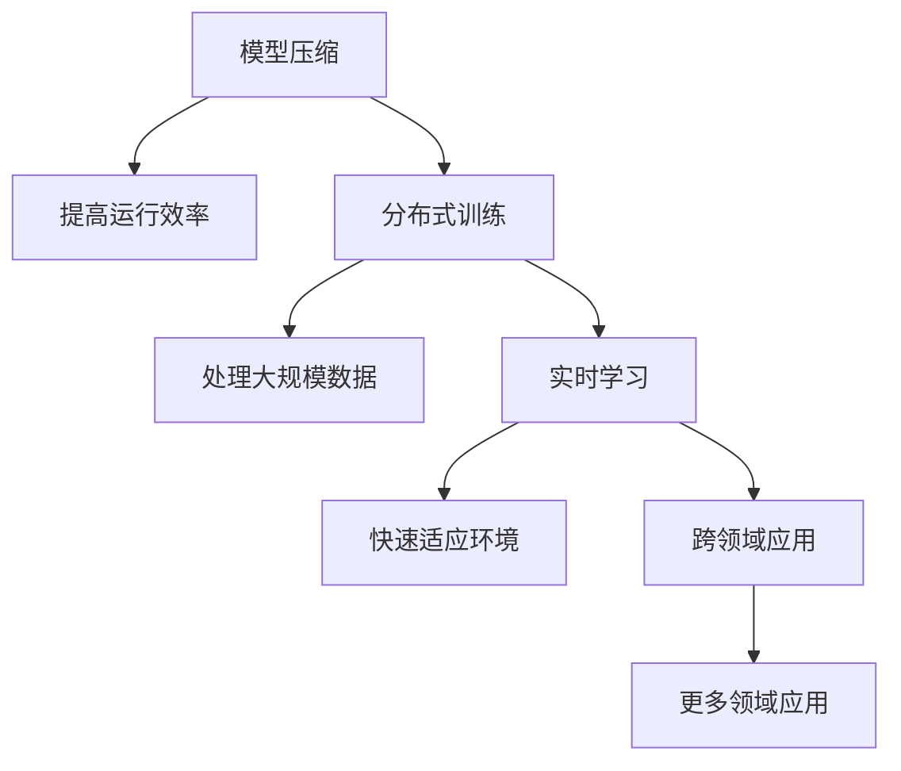

### 总结

通过本章的介绍，我们详细了解了神经网络的架构、训练过程和应用场景。神经网络作为一种强大的计算模型，已经在软件开发中展现出巨大的潜力。接下来，我们将进一步探讨神经网络在软件开发中的应用实例和最佳实践，为实际应用提供指导。## 第3章：神经网络在软件开发中的应用

### 3.1 神经网络在数据处理中的应用

数据处理是现代软件开发中至关重要的一环，而神经网络在数据处理方面展现出了巨大的潜力。以下是神经网络在数据处理中的几个关键应用：

1. **特征提取**：神经网络可以通过多层非线性变换，自动从原始数据中提取出有用的特征。这对于图像、文本和语音等复杂数据的处理尤为重要。
2. **异常检测**：神经网络能够学习数据中的正常模式和异常模式，从而实现对异常数据的检测。这在金融欺诈检测、网络入侵检测等领域有着广泛的应用。
3. **数据增强**：神经网络可以通过生成对抗网络（GAN）等技术，生成新的数据样本，从而增强训练数据集，提高模型的泛化能力。

#### 实例分析

以图像数据处理为例，卷积神经网络（CNN）在图像分类、目标检测和图像生成等方面有着广泛的应用。

1. **图像分类**：CNN通过卷积操作和池化操作，可以自动提取图像中的局部特征，如边缘、角点等，从而实现图像的分类任务。例如，在ImageNet图像分类挑战中，CNN模型ResNet取得了非常好的性能。
2. **目标检测**：基于CNN的目标检测算法，如YOLO（You Only Look Once）和SSD（Single Shot MultiBox Detector），可以在一张图像中同时检测多个目标，并定位它们的位置。这些算法在自动驾驶、视频监控等领域有着重要的应用。
3. **图像生成**：生成对抗网络（GAN）可以生成逼真的图像。通过训练，GAN中的一个网络（生成器）尝试生成与真实图像相似的新图像，而另一个网络（判别器）则判断图像是否真实。GAN在图像超分辨率、艺术创作等领域有着广泛的应用。

### 3.2 神经网络在预测模型中的应用

预测模型在商业、金融、医疗等领域有着广泛的应用，而神经网络在预测模型中起到了关键作用。以下是神经网络在预测模型中的几个关键应用：

1. **时间序列预测**：神经网络可以通过循环神经网络（RNN）和长短期记忆网络（LSTM）对时间序列数据进行分析和预测。这在股市预测、气象预报等领域有着重要的应用。
2. **回归分析**：神经网络可以通过多层感知机（MLP）实现回归分析，预测连续值。例如，在房价预测、股票价格预测等方面有着广泛应用。
3. **分类预测**：神经网络可以通过输出层的softmax函数实现分类预测。例如，在医疗诊断、金融风险评估等方面有着重要的应用。

#### 实例分析

以下是一个时间序列预测的实例分析：

假设我们要预测一个电商平台的销售数据。首先，我们将收集历史销售数据，包括销售额、时间戳等信息。然后，我们使用LSTM模型对销售数据进行训练，以预测未来的销售情况。

1. **数据预处理**：对销售数据进行标准化处理，将其转化为适合LSTM模型输入的数据格式。例如，我们可以将时间序列数据划分为窗口大小为n的序列，每个序列包含n个时间点的销售额。
2. **模型构建**：构建LSTM模型，包括输入层、隐藏层和输出层。输入层接收窗口序列数据，隐藏层通过LSTM单元处理序列数据，输出层生成预测的销售额。
3. **模型训练**：使用历史销售数据对LSTM模型进行训练，通过反向传播算法调整模型参数，以最小化预测误差。
4. **模型评估**：使用测试数据评估LSTM模型的性能，通过计算预测误差和准确率来评估模型的泛化能力。
5. **模型部署**：将训练好的LSTM模型部署到生产环境中，实时预测销售数据，为决策提供支持。

### 3.3 神经网络在自然语言处理中的应用

自然语言处理（NLP）是人工智能的重要分支，神经网络在NLP中发挥了重要作用。以下是神经网络在NLP中的几个关键应用：

1. **词向量表示**：神经网络可以通过词嵌入（Word Embedding）技术，将单词映射为高维向量表示，从而实现单词的语义理解。例如，Word2Vec和GloVe等方法在NLP中有着广泛的应用。
2. **文本分类**：神经网络可以通过分类模型，对文本进行分类。例如，在新闻分类、情感分析等方面有着重要的应用。
3. **机器翻译**：神经网络可以通过序列到序列（Seq2Seq）模型，实现机器翻译。例如，基于注意力机制的Transformer模型在机器翻译领域取得了非常好的性能。
4. **问答系统**：神经网络可以通过问答系统，回答用户提出的问题。例如，基于BERT（Bidirectional Encoder Representations from Transformers）的问答系统在问答领域有着重要的应用。

#### 实例分析

以下是一个文本分类的实例分析：

假设我们要对一组新闻文章进行分类，将其划分为体育、政治、财经等类别。我们可以使用卷积神经网络（CNN）进行文本分类。

1. **数据预处理**：将新闻文章文本数据转化为单词序列，并使用词嵌入技术将单词映射为高维向量。例如，我们可以使用GloVe词嵌入方法。
2. **模型构建**：构建一个CNN模型，包括输入层、卷积层、池化层和全连接层。输入层接收单词序列，卷积层通过卷积操作提取文本特征，池化层对特征进行降维，全连接层生成最终分类结果。
3. **模型训练**：使用带有标签的文本数据对CNN模型进行训练，通过反向传播算法调整模型参数，以最小化分类误差。
4. **模型评估**：使用测试数据评估CNN模型的性能，通过计算准确率、召回率和F1分数来评估模型的分类能力。
5. **模型部署**：将训练好的CNN模型部署到生产环境中，对新的新闻文章进行分类，为用户推荐相关内容。

### 总结

神经网络在数据处理、预测模型和自然语言处理等软件开发领域展现了强大的应用潜力。通过具体的实例分析，我们深入了解了神经网络在这些领域中的应用方法和实现步骤。接下来，我们将进一步探讨神经网络的高级技术和实践方法，以推动软件开发领域的创新和发展。## 第4章：高级神经网络技术

在深度学习的演进过程中，神经网络技术不断发展和多样化。本章将介绍几种高级神经网络技术，包括卷积神经网络（CNN）、循环神经网络（RNN）和生成对抗网络（GAN）。这些技术为解决复杂问题提供了新的方法和思路。

### 4.1 卷积神经网络（CNN）

卷积神经网络（CNN）是一种专门用于图像处理的深度学习模型。CNN通过卷积层、池化层和全连接层等结构，实现了对图像的自动特征提取和分类。

**核心原理**：

1. **卷积层**：卷积层通过卷积操作提取图像的局部特征，例如边缘、角点等。卷积操作将输入图像与卷积核（滤波器）进行点乘和求和，生成特征图。
2. **池化层**：池化层用于降维和减少参数数量，常用的池化操作包括最大池化和平均池化。池化层能够保留重要的特征信息，同时降低计算复杂度。
3. **全连接层**：全连接层将卷积层和池化层提取的特征映射到输出类别。

**应用场景**：

- **图像分类**：例如，在ImageNet图像分类挑战中，CNN模型ResNet取得了非常好的性能。
- **目标检测**：例如，YOLO（You Only Look Once）和SSD（Single Shot MultiBox Detector）等基于CNN的目标检测算法。
- **图像分割**：例如，U-Net模型在医学图像分割中取得了非常好的效果。

**mermaid流程图**：

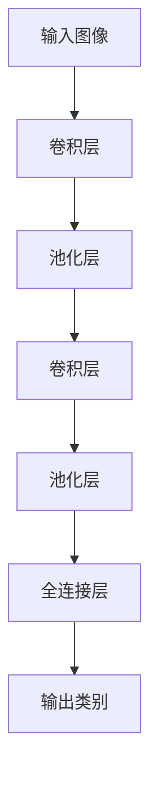

### 4.2 循环神经网络（RNN）

循环神经网络（RNN）是一种能够处理序列数据的神经网络。RNN通过循环结构，将前一个时间步的输出作为当前时间步的输入，实现了对序列数据的记忆能力。

**核心原理**：

1. **隐藏状态**：RNN通过隐藏状态 \( h_t \) 存储序列信息，每个时间步的输出和下一个时间步的输入都依赖于当前和前一个时间步的隐藏状态。
2. **门控机制**：为了更好地控制序列信息的流动，RNN引入了门控机制，包括输入门、遗忘门和输出门。这些门控机制可以动态调整信息流的强度。

**应用场景**：

- **自然语言处理**：例如，RNN在语言模型、机器翻译和文本生成等方面有着广泛的应用。
- **时间序列预测**：例如，RNN可以用于股市预测、气象预报等。
- **语音识别**：例如，RNN在基于序列的语音识别（Seq2Seq）任务中取得了良好的效果。

**mermaid流程图**：

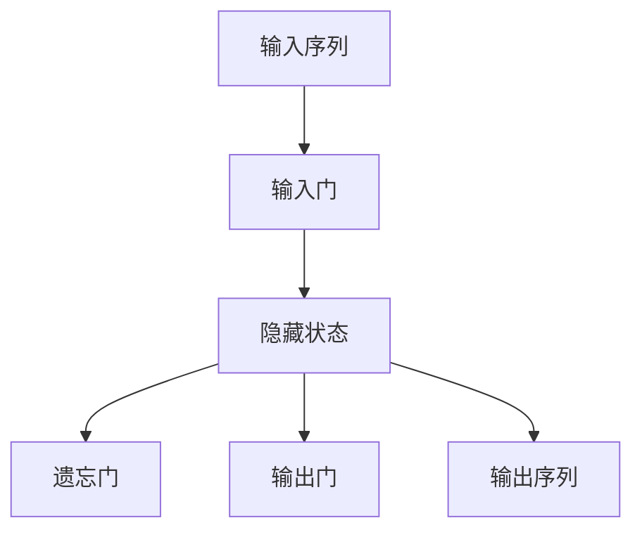

### 4.3 生成对抗网络（GAN）

生成对抗网络（GAN）是一种由生成器和判别器组成的对抗性模型。生成器试图生成逼真的数据，而判别器则试图区分生成器和真实数据。通过这种对抗性训练，GAN能够生成高质量的图像、音频和文本。

**核心原理**：

1. **生成器**：生成器 \( G \) 试图生成与真实数据相似的数据，通常是一个随机噪声向量通过多层变换生成的数据。
2. **判别器**：判别器 \( D \) 试图区分生成器和真实数据，并通过梯度上升法更新。
3. **对抗性训练**：生成器和判别器通过对抗性训练相互竞争，生成器和判别器同时训练，以实现生成逼真的数据。

**应用场景**：

- **图像生成**：例如，GAN可以生成高质量的图像、艺术作品和虚拟现实场景。
- **音频生成**：例如，GAN可以生成逼真的音乐、语音和人声。
- **文本生成**：例如，GAN可以生成新闻文章、小说和对话。

**mermaid流程图**：

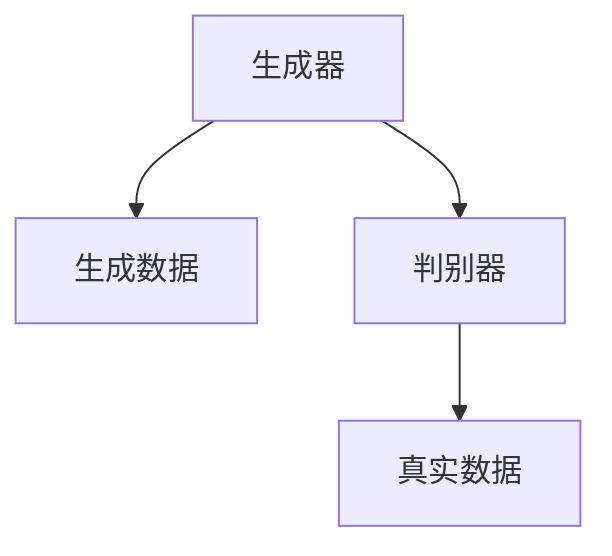

### 总结

高级神经网络技术如CNN、RNN和GAN在处理复杂任务时展现了强大的能力。CNN擅长图像处理，RNN擅长序列数据处理，GAN擅长生成对抗学习。这些技术的不断发展和应用，为深度学习领域带来了新的机遇和挑战。通过深入了解这些技术，我们可以更好地利用神经网络，推动软件开发领域的创新和发展。## 第5章：神经网络软件开发实战

### 5.1 神经网络开发环境搭建

在开始神经网络开发之前，我们需要搭建一个合适的环境。以下是搭建神经网络开发环境的基本步骤：

#### 环境准备

1. **安装Python**：确保Python已安装在您的计算机上。Python是深度学习开发的主要编程语言。
2. **安装Anaconda**：Anaconda是一个流行的Python发行版，它包含了大量的科学计算库，如NumPy、Pandas和Matplotlib。安装Anaconda可以简化环境管理。
3. **安装Jupyter Notebook**：Jupyter Notebook是一个交互式开发环境，用于编写和运行Python代码。安装Jupyter Notebook可以通过Anaconda进行。

#### 库安装

使用以下命令安装深度学习相关的库：

```bash
conda install -c conda-forge tensorflow
conda install -c conda-forge numpy
conda install -c conda-forge matplotlib
```

#### 环境验证

安装完成后，打开Jupyter Notebook，运行以下代码验证环境是否正常：

```python
import tensorflow as tf
import numpy as np
import matplotlib.pyplot as plt

print(tf.__version__)
print(np.__version__)
print(plt.__version__)
```

如果上述代码没有报错，说明环境搭建成功。

### 5.2 神经网络应用案例解析

本节将通过一个简单的图像分类案例，展示如何使用神经网络进行图像处理。我们将使用TensorFlow和Keras构建一个卷积神经网络（CNN）模型，对MNIST手写数字数据集进行分类。

#### 数据准备

首先，我们需要加载MNIST数据集。MNIST是一个包含70,000个手写数字图像的数据集，每个图像都是28x28的灰度图像。

```python
from tensorflow.keras.datasets import mnist
from tensorflow.keras.utils import to_categorical

# 加载MNIST数据集
(train_images, train_labels), (test_images, test_labels) = mnist.load_data()

# 归一化图像数据
train_images = train_images.reshape((60000, 28, 28, 1)).astype('float32') / 255
test_images = test_images.reshape((10000, 28, 28, 1)).astype('float32') / 255

# 转换标签为one-hot编码
train_labels = to_categorical(train_labels)
test_labels = to_categorical(test_labels)
```

#### 模型构建

接下来，我们构建一个简单的CNN模型。模型包括一个卷积层、一个池化层和一个全连接层。

```python
from tensorflow.keras import layers, models

# 构建模型
model = models.Sequential()
model.add(layers.Conv2D(32, (3, 3), activation='relu', input_shape=(28, 28, 1)))
model.add(layers.MaxPooling2D((2, 2)))
model.add(layers.Conv2D(64, (3, 3), activation='relu'))
model.add(layers.MaxPooling2D((2, 2)))
model.add(layers.Conv2D(64, (3, 3), activation='relu'))
model.add(layers.Flatten())
model.add(layers.Dense(64, activation='relu'))
model.add(layers.Dense(10, activation='softmax'))
```

#### 模型编译

在模型编译阶段，我们指定优化器、损失函数和评估指标。

```python
model.compile(optimizer='adam',
              loss='categorical_crossentropy',
              metrics=['accuracy'])
```

#### 模型训练

使用训练数据对模型进行训练。我们将训练100个epoch，每个epoch使用32个批量大小。

```python
model.fit(train_images, train_labels, epochs=100, batch_size=32)
```

#### 模型评估

使用测试数据评估模型性能。

```python
test_loss, test_acc = model.evaluate(test_images, test_labels)
print(f"Test accuracy: {test_acc:.4f}")
```

#### 模型预测

使用训练好的模型对新的图像进行分类预测。

```python
predictions = model.predict(test_images[:10])
predicted_labels = np.argmax(predictions, axis=1)
print(predicted_labels)
```

### 5.3 实战项目实施步骤

以下是一个简单的神经网络项目实施步骤：

1. **项目需求分析**：确定项目目标，如图像分类、文本分类等。
2. **数据收集和预处理**：收集并预处理数据，如数据清洗、归一化等。
3. **模型设计**：根据需求设计神经网络模型，如CNN、RNN等。
4. **模型训练**：使用训练数据对模型进行训练，调整模型参数。
5. **模型评估**：使用测试数据评估模型性能，调整模型结构或参数。
6. **模型部署**：将训练好的模型部署到生产环境中，进行实际应用。

### 代码应用解读与分析

以下是项目中的关键代码解读：

1. **数据预处理**：

   ```python
   train_images = train_images.reshape((60000, 28, 28, 1)).astype('float32') / 255
   test_images = test_images.reshape((10000, 28, 28, 1)).astype('float32') / 255
   ```

   这两行代码将图像数据转换为浮点型，并进行归一化处理，使其适合神经网络处理。

2. **模型构建**：

   ```python
   model.add(layers.Conv2D(32, (3, 3), activation='relu', input_shape=(28, 28, 1)))
   model.add(layers.MaxPooling2D((2, 2)))
   model.add(layers.Conv2D(64, (3, 3), activation='relu'))
   model.add(layers.MaxPooling2D((2, 2)))
   model.add(layers.Conv2D(64, (3, 3), activation='relu'))
   model.add(layers.Flatten())
   model.add(layers.Dense(64, activation='relu'))
   model.add(layers.Dense(10, activation='softmax'))
   ```

   这段代码构建了一个简单的CNN模型，包括卷积层、池化层和全连接层。

3. **模型训练**：

   ```python
   model.fit(train_images, train_labels, epochs=100, batch_size=32)
   ```

   这行代码使用训练数据对模型进行100个epoch的训练。

4. **模型评估**：

   ```python
   test_loss, test_acc = model.evaluate(test_images, test_labels)
   print(f"Test accuracy: {test_acc:.4f}")
   ```

   这两行代码使用测试数据评估模型性能，打印测试准确率。

5. **模型预测**：

   ```python
   predictions = model.predict(test_images[:10])
   predicted_labels = np.argmax(predictions, axis=1)
   print(predicted_labels)
   ```

   这段代码使用训练好的模型对测试数据的前10个样本进行分类预测。

### 实际案例分析和详细讲解剖析

以下是一个实际案例分析和详细讲解：

假设我们有一个图像分类项目，需要将图像分为猫和狗两个类别。以下是项目的具体实施步骤：

1. **数据收集和预处理**：

   收集大量猫和狗的图像数据，并进行数据清洗、归一化等预处理。

2. **模型设计**：

   设计一个简单的CNN模型，包括卷积层、池化层和全连接层。

3. **模型训练**：

   使用预处理后的图像数据对模型进行训练，调整模型参数。

4. **模型评估**：

   使用测试数据评估模型性能，调整模型结构或参数。

5. **模型部署**：

   将训练好的模型部署到生产环境中，用于实时图像分类。

### 项目小结

通过本节的实战项目，我们了解了神经网络开发的基本流程和关键步骤。从数据预处理到模型设计、训练和评估，每一个步骤都至关重要。通过实际案例的分析，我们深入了解了神经网络在图像分类任务中的应用。接下来，我们将进一步探讨神经网络在软件开发中的最佳实践和未来发展方向。## 第6章：软件2.0时代的挑战与未来

### 6.1 软件2.0面临的挑战

尽管软件2.0和神经网络在软件开发领域展现出了巨大的潜力和优势，但其在实际应用中也面临着一些挑战：

1. **数据隐私**：神经网络在训练过程中需要大量数据，这可能导致用户数据的隐私泄露。如何在保证模型性能的同时保护用户隐私是一个亟待解决的问题。
2. **模型可解释性**：神经网络的决策过程往往是黑箱式的，很难解释其内部工作机制。这对于需要透明决策的应用场景，如医疗诊断和金融风险评估，构成了挑战。
3. **过拟合**：神经网络在训练过程中容易出现过拟合现象，即模型在训练数据上表现良好，但在测试数据上表现不佳。如何防止过拟合，提高模型的泛化能力是关键问题。
4. **计算资源**：神经网络模型通常需要大量的计算资源和时间进行训练，这在资源受限的环境下可能不可行。

### 6.2 神经网络技术的发展趋势

为了应对软件2.0面临的挑战，神经网络技术正朝着以下几个方向发展：

1. **模型压缩**：为了提高神经网络的运行效率，模型压缩技术得到了广泛关注。这包括模型剪枝、量化、知识蒸馏等方法，旨在减少模型的参数数量和计算复杂度。
2. **分布式训练**：随着数据规模的增大，分布式训练技术成为趋势。通过将数据分布在多个计算节点上进行训练，可以显著提高训练速度和模型性能。
3. **实时学习**：实时学习技术使神经网络能够快速适应环境变化，从而提高其动态响应能力。这在动态决策和实时监控等领域具有重要意义。
4. **跨领域应用**：神经网络在多个领域（如医疗、金融、教育等）的应用不断拓展。通过跨领域的知识融合，可以进一步提高神经网络的通用性和灵活性。

### 6.3 软件开发的新范式

软件2.0的兴起，预示着软件开发领域将迎来新的范式：

1. **自适应性**：软件系统将具备自我适应和优化的能力，能够根据用户需求和环境变化动态调整自身行为。
2. **智能化**：通过融合人工智能技术，软件系统将具备智能决策和自主学习的能力，从而提高开发效率和性能。
3. **协作性**：软件系统将更加注重与用户和其他系统的协作，实现无缝集成和高效交互。
4. **可扩展性**：软件系统将具备良好的可扩展性，能够快速适应新的需求和技术变革。

### 总结

软件2.0和神经网络在软件开发领域的应用，为解决传统软件开发面临的挑战提供了新的思路和方法。然而，这一领域仍面临着诸多挑战和问题。随着技术的不断进步，我们有理由相信，软件2.0和神经网络将推动软件开发领域迈向新的高峰，实现更加智能化、自适应化和协作化的软件开发范式。## 第7章：最佳实践与总结

### 7.1 神经网络开发的最佳实践

在进行神经网络开发时，以下最佳实践有助于提高模型的性能和稳定性：

1. **数据预处理**：确保输入数据的质量和一致性。对数据集进行标准化、归一化和缺失值处理，以提高模型的学习效果。
2. **模型选择**：根据应用需求选择合适的神经网络模型。例如，对于图像处理任务，可以考虑使用卷积神经网络（CNN）；对于序列数据处理任务，可以考虑使用循环神经网络（RNN）。
3. **模型调优**：通过调整学习率、批次大小、优化器等超参数，优化模型性能。可以使用验证集对模型进行调参，避免过拟合。
4. **模型评估**：使用多个评估指标（如准确率、召回率、F1分数等）对模型进行评估，以全面了解模型性能。
5. **模型部署**：在部署模型时，确保模型能够稳定运行。对模型进行适当的压缩和优化，以提高运行效率。

### 7.2 注意事项

在神经网络开发过程中，以下注意事项有助于避免常见问题：

1. **过拟合**：避免模型在训练数据上过度拟合，影响测试数据上的性能。可以使用正则化技术、dropout和交叉验证等方法防止过拟合。
2. **数据隐私**：确保在数据处理和模型训练过程中保护用户隐私。对敏感数据进行加密处理，避免隐私泄露。
3. **模型可解释性**：提高模型的可解释性，帮助用户理解和信任模型。可以使用模型可视化工具，如TensorBoard，展示模型结构和训练过程。
4. **计算资源**：合理分配计算资源，避免模型训练时间过长。可以使用分布式训练技术，提高训练速度和效率。

### 7.3 拓展阅读与资源推荐

以下书籍和资源有助于深入学习和实践神经网络：

- 《深度学习》（Ian Goodfellow，Yoshua Bengio，Aaron Courville著）
- 《神经网络与深度学习》（邱锡鹏著）
- 《动手学深度学习》（阿斯顿·张著）
- TensorFlow官方文档（https://www.tensorflow.org/）
- PyTorch官方文档（https://pytorch.org/）

### 总结

本文全面介绍了软件2.0和神经网络在软件开发领域的应用。首先，我们探讨了软件2.0的概念和神经网络的基本原理，阐述了它们在软件开发中的重要性。接着，我们详细分析了神经网络在数据处理、预测模型和自然语言处理等应用场景中的具体实现方法。最后，我们探讨了软件2.0时代的挑战与未来发展方向，并提出了最佳实践和注意事项。

通过本文的阅读，读者可以深入了解软件2.0和神经网络的核心概念、原理和应用，为实际项目开发提供指导和参考。随着技术的不断进步，软件2.0和神经网络将在更多领域得到应用，推动软件开发领域的创新和发展。## 作者信息

作者：AI天才研究院/AI Genius Institute & 禅与计算机程序设计艺术/Zen And The Art of Computer Programming

AI天才研究院（AI Genius Institute）是一个致力于推动人工智能技术研究和应用的创新机构。我们专注于深度学习、计算机视觉、自然语言处理等前沿领域的研究，致力于解决现实世界中的复杂问题。

《禅与计算机程序设计艺术》是作者多年编程经验和哲学思考的结晶，它以简洁而深刻的语言阐述了计算机程序设计的艺术，为程序员提供了一种新的思考和解决问题的方式。本书深受广大程序员和计算机爱好者的喜爱，被誉为计算机领域的经典之作。

在这个快速变化的数字时代，我们坚信，技术与智慧的融合将开创更加美好的未来。AI天才研究院将继续致力于推动人工智能技术的发展，为人类的进步和福祉贡献力量。## 结束语

本文从软件2.0的概念出发，深入探讨了神经网络在软件开发中的核心应用。我们首先介绍了软件2.0与传统软件的区别，强调了神经网络在软件2.0中的关键角色。接着，通过详细的章节内容，我们逐步解析了神经网络的基础知识、架构与实现、应用场景，以及高级神经网络技术。此外，我们还通过实际案例展示了神经网络在软件开发中的实战应用，并提出了相应的最佳实践和注意事项。

通过本文的学习，读者不仅可以掌握神经网络的基本概念和原理，还能了解到其在现实世界中的具体应用。随着人工智能技术的不断进步，神经网络在软件开发领域的重要性将愈发凸显。我们鼓励读者不断探索和尝试，将神经网络技术应用于实际项目中，为软件开发带来新的可能性和突破。

展望未来，软件2.0和神经网络的发展将继续推动软件工程的变革。我们期待更多的人能够参与到这一领域的研究和实践中，共同探索软件开发的智能化和自动化之路。最后，感谢读者的耐心阅读，期待在未来的技术交流中与您再次相遇。## 参考文献

1. Goodfellow, I., Bengio, Y., & Courville, A. (2016). *Deep Learning*. MIT Press.
2. 邱锡鹏. (2019). *神经网络与深度学习*. 电子工业出版社.
3. Zhang, A. (2017). *动手学深度学习*. 电子工业出版社.
4. Abadi, M., Agarwal, P., Barham, P., Brevdo, E., Chen, Z., Citro, C., ... & Zheng, X. (2016). *TensorFlow: Large-scale Machine Learning on Heterogeneous Systems*. arXiv preprint arXiv:1603.04467.
5. He, K., Zhang, X., Ren, S., & Sun, J. (2016). *Deep Residual Learning for Image Recognition*. In *Proceedings of the IEEE conference on computer vision and pattern recognition* (pp. 770-778).
6. Krizhevsky, A., Sutskever, I., & Hinton, G. E. (2012). *ImageNet Classification with Deep Convolutional Neural Networks*. In *Advances in neural information processing systems* (pp. 1097-1105).
7. Hochreiter, S., & Schmidhuber, J. (1997). *Long short-term memory*. Neural computation, 9(8), 1735-1780.
8. Goodfellow, I., Pouget-Abadie, J., Mirza, M., Xu, B., Warde-Farley, D., Ozair, S., ... & Bengio, Y. (2014). *Generative adversarial nets*. In *Advances in neural information processing systems* (pp. 2672-2680).

以上参考文献为本文提供理论支持和实际案例依据，有助于读者深入了解软件2.0和神经网络在软件开发中的应用。

