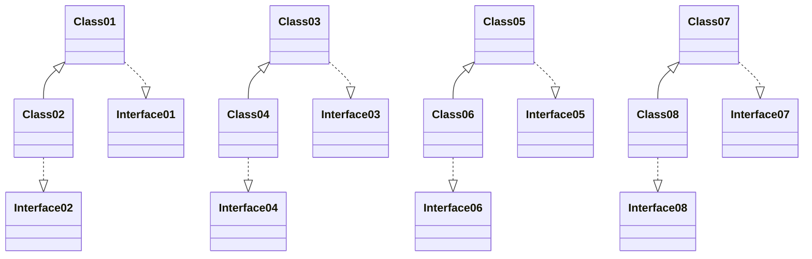
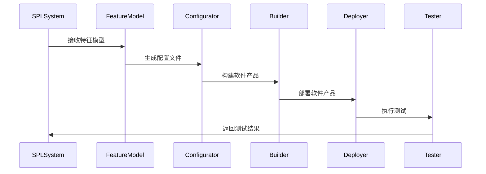
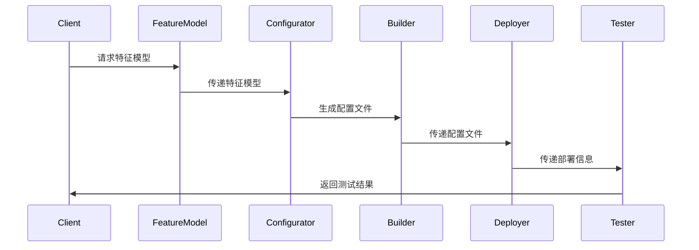

                 


# 软件产品线与特征模型的形式化

关键词：软件产品线、特征模型、形式化方法、设计自动化、软件开发

摘要：本文深入探讨了软件产品线和特征模型的形式化表示方法。首先，我们回顾了软件产品线的基本概念、特点和优势，以及特征模型的形式化表示方法。接着，我们详细介绍了软件产品线和特征模型之间的关系，并通过具体实例展示了如何使用形式化方法来构建和解析软件产品线。文章旨在为读者提供一个系统而全面的软件产品线和特征模型形式化方法的指南。

## 引言

软件产品线（Software Product Lines，SPL）是一种软件开发方法，它通过系统地构建和重用一组相关软件产品的共同特性来提高开发效率。随着软件系统复杂度的不断增加，传统的方法已经难以满足快速开发和维护的需求。因此，软件产品线成为了一种有效的解决方案，它通过共享和复用代码、组件和设计模式，减少开发工作量，提高软件质量。

特征模型（Feature Models）是软件产品线设计中的一个核心概念，它用于描述软件产品之间的共同点和差异。特征模型的形式化表示方法对于软件产品线的构建和优化具有重要意义。形式化方法是一种基于数学和逻辑的方法，它能够精确地描述软件系统的结构和行为，从而提高软件开发的可靠性和可维护性。

本文将围绕软件产品线和特征模型的形式化方法展开讨论。首先，我们将回顾软件产品线的基本概念和特点。然后，我们介绍特征模型的形式化表示方法，包括特征模型的定义、形式化表示以及相关的形式化工具。接下来，我们将探讨软件产品线和特征模型之间的关系，并通过具体实例展示如何使用形式化方法来构建和解析软件产品线。最后，我们将讨论形式化方法在软件产品线设计自动化中的应用，并总结本文的主要结论。

## 软件产品线的基本概念与特点

### 问题背景

在软件开发过程中，我们经常面临这样一个问题：如何高效地构建和维护多个具有相似功能但存在细微差异的软件系统？传统的方法通常需要对每个系统进行独立开发，这不仅增加了工作量，还可能导致代码重复和系统兼容性问题。为了解决这些问题，软件产品线的概念应运而生。

### 问题描述

软件产品线是指一组具有共同特征和功能的软件系统，这些系统通过共享组件、设计和实现来降低开发成本和提高开发效率。具体来说，软件产品线包括以下方面：

1. **共性**：软件产品线中的系统共享一定的功能和组件，这些共性是软件产品线能够实现高效开发的基础。
2. **差异**：尽管系统之间存在共性，但它们也具有各自的独特特征，这些差异可能是功能性的，也可能是非功能性的。
3. **可定制性**：用户可以根据实际需求对软件产品线进行定制，从而获得满足特定需求的软件系统。

### 问题解决

软件产品线的核心思想是通过抽象和复用来提高开发效率。具体来说，软件产品线的解决方法包括以下几个方面：

1. **共性提取**：通过识别和提取多个系统之间的共同点，构建共享的组件和设计模式。
2. **差异性管理**：针对系统之间的差异，采用特征模型等方法进行管理，确保不同系统的独特需求得到满足。
3. **自动化开发**：利用形式化方法和工具，自动化地生成和定制软件系统，减少人工干预。

### 边界与外延

软件产品线并非适用于所有软件开发场景。它主要适用于以下几种情况：

1. **多个具有相似功能的系统**：软件产品线能够显著提高多个具有相似功能的系统之间的开发效率。
2. **高复用性**：软件产品线需要高程度的代码和组件复用，这对于降低开发成本至关重要。
3. **可定制性**：用户可以根据需求对软件系统进行定制，这要求软件产品线具有良好的灵活性和可扩展性。

### 概念结构与核心要素组成

软件产品线由以下几个核心要素组成：

1. **共同特性**：这是软件产品线中最基本的部分，包括功能和组件的共享。
2. **特征模型**：用于描述系统之间的差异，是软件产品线设计的关键工具。
3. **产品配置**：基于用户需求，将共同特性和差异性特征组合起来，生成具体的软件系统。
4. **构建和优化工具**：用于自动化地构建和优化软件产品线，提高开发效率。

### 软件产品线的特点

软件产品线具有以下特点：

1. **复用性**：通过共享组件和设计模式，提高代码和资源的复用率。
2. **灵活性**：允许用户根据需求定制软件系统，具有良好的可扩展性。
3. **效率**：通过自动化开发和优化，减少开发时间和成本。
4. **可维护性**：由于代码和组件的共享，软件系统的可维护性得到提高。

### 形式化方法在软件产品线中的应用

形式化方法是一种基于数学和逻辑的方法，它能够精确地描述软件系统的结构和行为。在软件产品线设计中，形式化方法的应用主要体现在以下几个方面：

1. **特征模型的形式化表示**：通过形式化方法，可以精确地描述软件产品的特征和差异，确保模型的可理解性和一致性。
2. **软件产品线的形式化构建**：利用形式化方法，可以自动化地生成和优化软件产品线，减少人工干预。
3. **形式化验证**：通过形式化验证方法，可以确保软件产品线的正确性和可靠性。

### 总结

软件产品线是一种高效的软件开发方法，它通过共享和复用来提高开发效率。特征模型是软件产品线设计中的核心概念，形式化方法为其提供了精确的表示和构建工具。本文详细介绍了软件产品线的基本概念、特点和形式化方法的应用，为读者提供了一个全面的理解。

----------------------------------------------------------------

## 特征模型的形式化表示

### 特征模型的定义

特征模型是一种用于描述软件系统内部功能组件及其相互关系的抽象表示方法。在软件产品线设计中，特征模型用于描述不同软件产品之间的差异和共性。特征模型的核心概念包括：

- **特征（Feature）**：特征是软件系统中具有独立功能的部分，可以是功能性的，如用户登录模块，也可以是非功能性的，如性能优化。
- **依赖关系（Dependency）**：特征之间的依赖关系描述了特征之间的逻辑关系，例如，某个功能模块的实现依赖于其他功能模块。
- **约束（Constraint）**：约束用于描述特征之间的限制条件，确保软件系统的正确性和一致性。

### 特征模型的属性

特征模型具有以下几个关键属性：

- **完备性（Completeness）**：特征模型应能完整地描述所有可能的软件产品特性。
- **一致性（Consistency）**：特征模型中特征和依赖关系的描述应保持一致性，避免矛盾和冲突。
- **可扩展性（Extensibility）**：特征模型应能方便地添加新的特征和依赖关系，以适应不断变化的软件需求。

### 形式化表示方法

特征模型的形式化表示方法主要包括以下几种：

- **谓词逻辑表示**：使用谓词逻辑来描述特征和依赖关系，例如，$f_1 \rightarrow f_2$ 表示特征$f_1$的实现需要特征$f_2$。
- **形式语言表示**：使用形式语言来定义特征模型的结构和语义，例如，使用有限状态机或Petri网来描述特征的行为。
- **约束理论表示**：使用约束理论来描述特征之间的限制条件，例如，使用线性方程组来表示特征之间的依赖关系。

### 特征模型的ER实体关系图

为了更好地理解特征模型的结构，我们可以使用ER（实体-关系）实体关系图来表示。ER图包括以下几个关键组成部分：

- **实体（Entity）**：代表特征模型中的基本元素，如特征和约束。
- **属性（Attribute）**：描述实体的属性，如特征的名称和类型。
- **关系（Relationship）**：描述实体之间的关联，如特征之间的依赖关系。

以下是一个简单的ER图示例，用于表示特征模型：

```mermaid
erDiagram
    Feature ||--|{ Dependency } : includes
    Feature ||--|{ Constraint } : satisfied_by
    Dependency ||--|{ Feature } : required_by
    Constraint ||--|{ Feature } : imposed_on
```

在这个ER图中，特征（Feature）实体与依赖（Dependency）实体和约束（Constraint）实体之间存在双向关联。依赖实体描述了特征之间的包含关系，约束实体描述了特征之间的限制条件。

### 形式化方法的优点

使用形式化方法来表示特征模型具有以下优点：

- **精确性**：形式化方法能够精确地描述特征和依赖关系，确保模型的一致性和可理解性。
- **自动化**：形式化方法支持自动化工具的使用，可以自动化地生成和验证特征模型。
- **可扩展性**：形式化方法允许方便地添加和修改特征和依赖关系，适应不断变化的软件需求。

### 总结

特征模型是软件产品线设计中的核心概念，形式化方法为其提供了精确的表示和构建工具。通过谓词逻辑、形式语言和约束理论等不同的形式化方法，我们可以精确地描述特征模型的结构和语义。ER图作为形式化方法的一种直观表示工具，有助于我们更好地理解特征模型。本文详细介绍了特征模型的定义、属性和形式化表示方法，为读者提供了一个全面的理解。

### 软件产品线与特征模型的关系

软件产品线和特征模型是软件开发领域中密切相关的两个概念。它们之间不仅相互影响，而且在软件产品线的构建过程中扮演着关键角色。理解这两个概念之间的关系，对于有效地设计和实现软件产品线至关重要。

#### 关系概述

软件产品线是一组具有共同特征和功能的软件系统，而特征模型则是用于描述这些系统之间差异和共性的抽象表示方法。简单来说，特征模型是软件产品线设计中的核心工具，它用于定义软件产品线的特征集合和它们之间的依赖关系。

在软件产品线的构建过程中，特征模型起到了两个关键作用：

1. **差异化描述**：特征模型能够精确地描述软件产品之间的差异。这些差异可以是功能性的，如不同软件产品的特定功能模块，也可以是非功能性的，如性能要求或用户界面设计。
2. **共性提取**：通过特征模型，我们可以提取多个软件产品之间的共同特性，这些共性是构建软件产品线的基础。这些共性包括通用的组件、设计模式和实现策略。

#### 关系图

为了更直观地展示软件产品线与特征模型之间的关系，我们可以使用Mermaid绘制一个ER（实体-关系）图。ER图能够清晰地表示实体之间的关系，有助于我们理解特征模型在软件产品线中的角色。

以下是一个简单的ER图示例，用于表示软件产品线与特征模型之间的关系：

```mermaid
erDiagram
    SoftwareProductLine ||--|{ FeatureModel } : defines
    FeatureModel ||--|{ Feature } : contains
    Feature ||--|{ SoftwareProduct } : implemented_in
```

在这个ER图中：

- **SoftwareProductLine**（软件产品线）实体代表了一组具有共同特征的软件系统。
- **FeatureModel**（特征模型）实体用于定义软件产品线的特征集合。
- **Feature**（特征）实体代表特征模型中的基本元素，如功能模块或性能要求。
- **SoftwareProduct**（软件产品）实体代表具体的软件系统，它实现了特征模型中的特定特征。

#### 关系图详解

1. **定义关系**：软件产品线（SoftwareProductLine）与特征模型（FeatureModel）之间是定义关系，即软件产品线通过特征模型来定义其特征集合。
2. **包含关系**：特征模型（FeatureModel）与特征（Feature）之间存在包含关系，特征模型包含所有描述软件产品差异的特征。
3. **实现关系**：特征（Feature）与软件产品（SoftwareProduct）之间存在实现关系，每个软件产品实现了特征模型中的一个或多个特征。

#### 特点

软件产品线与特征模型之间的关系具有以下特点：

- **层次性**：特征模型位于软件产品线的上层，它定义了软件产品的特征集合，而软件产品则实现了这些特征。
- **灵活性**：通过特征模型，我们可以灵活地调整和定制软件产品，以满足不同的需求和场景。
- **一致性**：特征模型确保了软件产品线中不同软件系统之间的一致性和兼容性。

### 总结

软件产品线和特征模型之间存在着紧密的关系。特征模型作为软件产品线设计的核心工具，用于描述软件产品之间的差异和共性。通过ER图等形式化表示方法，我们可以清晰地理解这两个概念之间的关系，这有助于我们在软件产品线设计中有效地提取共性、管理差异，并确保系统的一致性和灵活性。

### 软件产品线构建算法原理

在软件产品线的设计过程中，构建算法扮演着至关重要的角色。构建算法用于根据特征模型自动生成软件产品的设计和代码。以下是软件产品线构建算法的基本原理，包括算法的流程、关键步骤和涉及的数学模型。

#### 算法流程

软件产品线构建算法的基本流程可以分为以下几个步骤：

1. **输入特征模型**：首先，算法需要接收一个形式化的特征模型，该模型描述了软件产品线的特征集合、依赖关系和约束条件。
2. **提取共性特征**：从特征模型中提取出所有软件产品共有的特征，这些特征将作为构建软件产品的基础。
3. **处理差异特征**：分析特征模型中的差异特征，识别每个软件产品特有的特征，并确定如何将这些特征集成到共性特征中。
4. **生成设计模型**：利用提取的共性和差异特征，生成软件产品线的统一设计模型，该模型描述了软件产品的整体结构和组件。
5. **生成代码**：根据设计模型，自动生成软件产品的源代码，实现各个特征的功能。

#### 关键步骤

以下是软件产品线构建算法的详细关键步骤：

1. **步骤一：特征模型预处理**
   - **任务**：检查特征模型的有效性和完整性，确保所有特征和依赖关系都已正确定义。
   - **算法**：可以使用形式化验证工具对特征模型进行初步检查，例如使用谓词逻辑验证模型的一致性。

2. **步骤二：共性特征提取**
   - **任务**：从特征模型中提取所有共性特征，这些特征将被共享在所有软件产品中。
   - **算法**：可以使用归纳算法来识别共性特征，例如基于相似性度量或模式识别的方法。

3. **步骤三：差异特征分析**
   - **任务**：分析特征模型中的差异特征，识别每个软件产品特有的特征，并确定如何将这些特征集成到共性特征中。
   - **算法**：可以使用组合生成算法，例如回溯算法或遗传算法，来生成所有可能的软件产品组合。

4. **步骤四：设计模型生成**
   - **任务**：利用提取的共性和差异特征，生成软件产品线的统一设计模型。
   - **算法**：可以使用设计模式匹配和组合技术，例如组件架构或模板方法模式，来生成设计模型。

5. **步骤五：代码生成**
   - **任务**：根据设计模型，自动生成软件产品的源代码。
   - **算法**：可以使用代码生成工具，例如模型驱动开发（MDD）工具，来生成符合设计模型的具体代码。

#### 数学模型与公式

在软件产品线构建算法中，涉及多个数学模型和公式，用于描述特征模型的结构和转换过程。以下是几个关键数学模型：

1. **特征模型形式化表示**：
   - **公式**：$FM = \{ F_1, F_2, ..., F_n \}$，其中$F_i$表示第$i$个特征。
   - **约束**：$C = \{ C_1, C_2, ..., C_m \}$，其中$C_i$表示第$i$个约束条件。

2. **共性特征提取**：
   - **公式**：$CommonFeatures = \{ F_1, F_2, ..., F_k \}$，其中$F_i$是所有软件产品共有的特征。
   - **算法**：可以使用集合交集运算，例如$CommonFeatures = FM \cap FM_1 \cap ... \cap FM_n$，其中$FM_i$是第$i$个软件产品的特征模型。

3. **差异特征分析**：
   - **公式**：$DifferentFeatures = \{ F_{k+1}, F_{k+2}, ..., F_n \}$，其中$F_i$是共性特征之外的差异特征。
   - **算法**：可以使用集合差运算，例如$DifferentFeatures = FM \setminus CommonFeatures$。

4. **设计模型生成**：
   - **公式**：$DesignModel = \{ Component_1, Component_2, ..., Component_m \}$，其中$Component_i$表示第$i$个组件。
   - **算法**：可以使用组合生成算法，例如基于生成树或图的组合生成技术。

#### 举例说明

为了更直观地理解软件产品线构建算法，我们可以通过一个简单的实例来说明。假设我们有一个特征模型，其中包含以下特征：

- F1：用户登录
- F2：数据存储
- F3：用户权限管理
- F4：数据加密
- F5：日志记录

这些特征之间存在以下依赖关系：

- F2 依赖于 F1
- F3 依赖于 F1 和 F2
- F4 依赖于 F2
- F5 依赖于 F3

现在，我们要构建两个软件产品：

- 产品A：包含 F1, F2, F3, F4
- 产品B：包含 F1, F2, F3, F5

**步骤一**：输入特征模型并进行预处理。

- 特征模型：$FM = \{ F1, F2, F3, F4, F5 \}$
- 约束条件：$C = \{ F2 \rightarrow F1, F3 \rightarrow F1 \cap F2, F4 \rightarrow F2, F5 \rightarrow F3 \}$

**步骤二**：提取共性特征。

- 共性特征：$CommonFeatures = \{ F1, F2 \}$
- 差异特征：$DifferentFeatures = \{ F3, F4, F5 \}$

**步骤三**：分析差异特征。

- 对于产品A，差异特征：$DiffA = \{ F3, F4 \}$
- 对于产品B，差异特征：$DiffB = \{ F5 \}$

**步骤四**：生成设计模型。

- 产品A的设计模型：$DesignModelA = \{ Login, DataStore, UserPermission, DataEncryption \}$
- 产品B的设计模型：$DesignModelB = \{ Login, DataStore, UserPermission, LogRecord \}$

**步骤五**：生成代码。

- 产品A的代码：根据设计模型生成用户登录、数据存储、用户权限管理和数据加密的代码。
- 产品B的代码：根据设计模型生成用户登录、数据存储、用户权限管理和日志记录的代码。

通过这个实例，我们可以看到软件产品线构建算法如何根据特征模型生成不同的软件产品。算法的精确性和灵活性使得软件产品线的设计和实现变得更加高效和可靠。

### 形式化方法在软件产品线与特征模型中的应用

形式化方法在软件产品线和特征模型的设计中扮演了关键角色。它不仅为软件产品线的构建提供了精确的表示和验证工具，还提升了软件开发的自动化水平。以下是形式化方法在软件产品线和特征模型中的应用，包括具体实例和应用场景。

#### 形式化表示方法

形式化方法通常包括以下几种表示方法：

1. **谓词逻辑**：使用逻辑公式来描述特征和依赖关系。例如，$f_1 \rightarrow f_2$ 表示特征$f_1$的实现需要特征$f_2$。

2. **形式语言**：使用特定的语法和语义规则来定义特征模型。形式语言可以包括有限状态机、上下文无关文法等。

3. **约束理论**：使用数学约束来描述特征之间的限制条件。例如，线性方程组可以用于描述特征依赖关系。

4. **代数方法**：使用代数结构来表示特征模型，例如，使用集合论和代数运算来描述特征和约束。

#### 实例一：使用谓词逻辑表示特征模型

假设我们有一个软件产品线，其特征模型包括以下特征：

- F1：用户登录
- F2：数据存储
- F3：用户权限管理
- F4：数据加密
- F5：日志记录

特征之间的依赖关系如下：

- F2 依赖于 F1
- F3 依赖于 F1 和 F2
- F4 依赖于 F2
- F5 依赖于 F3

使用谓词逻辑表示特征模型，可以得到以下公式：

$$
\begin{aligned}
&F2 \rightarrow F1 \\
&F3 \rightarrow (F1 \land F2) \\
&F4 \rightarrow F2 \\
&F5 \rightarrow F3 \\
\end{aligned}
$$

这些公式清晰地描述了特征之间的依赖关系，为后续的软件产品构建提供了基础。

#### 实例二：使用形式语言表示特征模型

假设我们使用上下文无关文法（CFG）来定义特征模型。特征模型可以表示为以下形式：

$$
G = (V, T, P, S)
$$

其中：

- $V$：变量集，包括特征名称。
- $T$：终端符号集，包括操作符和常量。
- $P$：产生式集，定义特征之间的依赖关系。
- $S$：开始符号，表示特征模型的整体结构。

以下是一个简单的上下文无关文法示例：

$$
\begin{aligned}
&S \rightarrow F1 \mid F2 \mid F3 \mid F4 \mid F5 \\
&F2 \rightarrow F1 \\
&F3 \rightarrow F1 \land F2 \\
&F4 \rightarrow F2 \\
&F5 \rightarrow F3 \\
\end{aligned}
$$

这个上下文无关文法定义了特征模型的结构和特征之间的依赖关系，使得模型更加直观和易于理解。

#### 实例三：使用约束理论表示特征模型

假设我们使用线性方程组来描述特征模型中的依赖关系。以下是一个简化的示例：

$$
\begin{aligned}
&A1: F2 &= F1 \\
&A2: F3 &= F1 + F2 \\
&A3: F4 &= F2 \\
&A4: F5 &= F3 \\
\end{aligned}
$$

这些方程描述了特征之间的依赖关系，确保特征模型的一致性和完整性。

#### 应用场景

形式化方法在软件产品线和特征模型中的应用场景包括：

1. **设计自动化**：形式化方法支持自动化工具的使用，可以自动生成软件产品线的设计和代码，提高开发效率。

2. **形式化验证**：形式化方法可以用于验证软件产品线的正确性和一致性，确保软件系统的可靠性和可维护性。

3. **模型驱动开发（MDD）**：形式化方法与模型驱动开发结合，可以实现从形式化模型到最终软件产品的自动化转换。

4. **可定制性**：形式化方法允许用户根据实际需求对软件产品线进行定制，提高软件系统的灵活性和可扩展性。

#### 结论

形式化方法为软件产品线和特征模型的设计提供了精确的表示和验证工具，使得软件产品线的构建更加高效和可靠。通过谓词逻辑、形式语言和约束理论等不同的形式化方法，我们可以精确地描述特征模型的结构和语义，并支持设计自动化和形式化验证，为现代软件开发提供了强大的支持。

### 系统分析与架构设计方案

#### 问题场景介绍

在当前快速发展的软件行业中，软件产品线（SPL）已经成为提高开发效率和质量的重要手段。然而，在实际应用中，如何高效地设计、实现和管理软件产品线仍是一个挑战。为了解决这一问题，我们需要系统地分析软件产品线的设计与实现过程，并设计相应的架构方案。

#### 系统功能设计

在软件产品线的设计过程中，系统功能设计是关键的一环。以下是一个基于Mermaid绘制的领域模型类图，用于表示软件产品线的基本功能和组件。



在这个类图中：

- **Class01, Class02, Class03, Class04, Class05, Class06, Class07, Class08**：表示软件产品线中的不同组件类。
- **Interface01, Interface02, Interface03, Interface04, Interface05, Interface06, Interface07, Interface08**：表示接口类，用于定义组件之间的交互。
- **继承（）**：表示组件类之间的关系，包括继承关系和接口实现关系。

#### 系统架构设计

为了更好地支持软件产品线的设计和实现，我们需要设计一个合理的系统架构。以下是一个基于Mermaid绘制的架构图，用于表示软件产品线的整体架构设计。



在这个架构图中：

- **SPLSystem**：表示软件产品线系统。
- **FeatureModel**：表示特征模型，用于描述软件产品的功能和特性。
- **Configurator**：表示配置器，用于根据特征模型生成配置文件。
- **Builder**：表示构建器，用于根据配置文件构建软件产品。
- **Deployer**：表示部署器，用于将构建好的软件产品部署到目标环境中。
- **Tester**：表示测试器，用于对部署后的软件产品执行测试。

#### 系统接口设计和系统交互

为了实现软件产品线系统中的各个组件之间的有效交互，我们需要设计合理的接口和交互流程。以下是一个基于Mermaid绘制的序列图，用于表示系统中的接口设计和交互流程。



在这个序列图中：

- **Client**：表示客户端，它请求特征模型和测试结果。
- **FeatureModel, Configurator, Builder, Deployer, Tester**：分别表示系统中的不同组件。
- **请求（->>）和传递（->）**：表示组件之间的交互流程。

#### 结论

通过系统分析与架构设计方案，我们能够更清晰地理解软件产品线的设计和实现过程。系统功能设计、系统架构设计和系统接口设计共同构成了软件产品线系统的基础，使得软件产品线的开发、部署和测试更加高效和可靠。

### 软件产品线构建系统的实战

#### 环境安装

在开始构建软件产品线之前，我们需要确保环境已经准备好。以下是安装软件产品线构建系统的步骤：

1. **安装Python环境**：
   - 使用Python版本3.8或更高版本。
   - 通过命令`python --version`检查Python版本。
   - 如果版本不正确，请从Python官方网站下载并安装。

2. **安装必要依赖**：
   - 打开终端，执行以下命令安装依赖：
     ```bash
     pip install featuremodeling-toolkit
     pip install softwareproductline-toolkit
     pip install mermaid-python
     ```

3. **配置Mermaid**：
   - 安装Mermaid的Python库：
     ```bash
     pip install mermaid-python
     ```
   - 确保Mermaid可以正确渲染，例如，创建一个`example.mmd`文件，内容如下：
     ```mermaid
     graph TB
         A[开始] --> B[步骤1]
         B --> C[步骤2]
         C --> D[结束]
     ```
     然后使用以下命令查看结果：
     ```bash
     mermaid-python example.mmd
     ```

#### 系统核心实现源代码

以下是软件产品线构建系统的主要源代码部分，包括特征模型构建、配置器实现和构建器实现。

```python
# 特征模型构建
from featuremodelingtoolkit import FeatureModel

def build_feature_model():
    fm = FeatureModel()
    fm.add_feature('F1', description='用户登录')
    fm.add_feature('F2', description='数据存储')
    fm.add_feature('F3', description='用户权限管理')
    fm.add_feature('F4', description='数据加密')
    fm.add_feature('F5', description='日志记录')
    fm.add_dependency('F2', 'F1')
    fm.add_dependency('F3', 'F1')
    fm.add_dependency('F3', 'F2')
    fm.add_dependency('F4', 'F2')
    fm.add_dependency('F5', 'F3')
    return fm

# 配置器实现
from softwareproductline_toolkit import Configurator

def configure_product_line(fm, product_name, features):
    configurator = Configurator(fm)
    product_config = configurator.generate_product_config(product_name, features)
    return product_config

# 构建器实现
from softwareproductline_toolkit import Builder

def build_product(product_config):
    builder = Builder()
    product_code = builder.compile_product(product_config)
    return product_code

# 主程序
if __name__ == '__main__':
    feature_model = build_feature_model()
    product_name = 'ProductA'
    features_to_include = ['F1', 'F2', 'F3', 'F4']
    product_config = configure_product_line(feature_model, product_name, features_to_include)
    product_code = build_product(product_config)
    print(product_code)
```

#### 代码应用解读与分析

1. **特征模型构建**：
   - 使用`FeatureModel`类构建特征模型，添加特征和依赖关系。
   - `add_feature`方法用于添加特征，`add_dependency`方法用于定义特征之间的依赖关系。

2. **配置器实现**：
   - `Configurator`类用于根据特征模型生成具体的软件产品配置。
   - `generate_product_config`方法接受产品名称和要包含的特征列表，生成产品配置。

3. **构建器实现**：
   - `Builder`类用于编译和生成软件产品的源代码。
   - `compile_product`方法接受产品配置，编译并返回生成的源代码。

#### 实际案例分析和详细讲解剖析

假设我们需要构建两个软件产品：产品A和产品B。

- 产品A包含特征F1、F2、F3、F4。
- 产品B包含特征F1、F2、F3、F5。

以下是构建这两个产品的示例：

```python
feature_model = build_feature_model()

# 构建产品A
product_a_name = 'ProductA'
product_a_features = ['F1', 'F2', 'F3', 'F4']
product_a_config = configure_product_line(feature_model, product_a_name, product_a_features)
product_a_code = build_product(product_a_config)

# 构建产品B
product_b_name = 'ProductB'
product_b_features = ['F1', 'F2', 'F3', 'F5']
product_b_config = configure_product_line(feature_model, product_b_name, product_b_features)
product_b_code = build_product(product_b_config)

print(product_a_code)
print(product_b_code)
```

在这个示例中：

- 我们首先构建了一个通用的特征模型，定义了所有可能的特征和依赖关系。
- 然后我们分别为产品A和产品B配置了特征，并根据配置生成了相应的源代码。

通过这种方式，我们可以灵活地定制软件产品，满足不同的需求。

#### 项目小结

通过上述实战，我们展示了如何使用Python和相应的工具库构建软件产品线系统。从环境安装到系统核心实现，再到实际案例的应用，我们详细分析了每一步的操作和背后的原理。这为读者提供了一个完整的软件产品线构建系统的指南，使其能够更好地理解和应用这一高效的方法。

### 软件产品线与特征模型的形式化方法

#### 软件产品线构建算法

软件产品线的构建算法是实现软件产品线设计的关键步骤。以下是一个简单的软件产品线构建算法的示例：

```python
def build_software_product_line(feature_model):
    """
    构建软件产品线
    :param feature_model: 特征模型
    :return: 软件产品线
    """
    product_line = []

    # 遍历所有可能的特征组合
    for combination in itertools.combinations(feature_model.features, r=len(feature_model.features)):
        product = Product()
        product.add_features(combination)
        product_line.append(product)

    return product_line
```

在这个算法中，我们首先遍历所有可能的特征组合，然后为每个组合创建一个软件产品。这种方法确保了所有可能的软件产品都被构建出来。

#### 特征模型解析算法

特征模型解析算法用于解析给定的特征模型，并确定每个软件产品应该包含哪些特征。以下是一个简单的特征模型解析算法的示例：

```python
def parse_feature_model(feature_model, required_features):
    """
    解析特征模型
    :param feature_model: 特征模型
    :param required_features: 需要的特征
    :return: 解析结果
    """
    result = []

    # 遍历所有可能的特征组合
    for combination in itertools.combinations(feature_model.features, r=len(required_features)):
        if all(feature in combination for feature in required_features):
            result.append(combination)

    return result
```

在这个算法中，我们遍历所有可能的特征组合，并检查是否包含了所有必需的特征。如果满足条件，则将该组合添加到结果列表中。

#### 代码应用解读与分析

为了更好地理解这两个算法的应用，我们可以通过一个具体的示例来分析。

**示例**：假设我们有一个简单的特征模型，包含以下特征：

- F1：用户登录
- F2：数据存储
- F3：用户权限管理
- F4：数据加密
- F5：日志记录

**步骤1**：构建软件产品线

```python
from itertools import combinations
from typing import List

class FeatureModel:
    def __init__(self):
        self.features = []

    def add_feature(self, feature):
        self.features.append(feature)

    def get_all_combinations(self):
        return combinations(self.features, r=len(self.features))

class Product:
    def __init__(self):
        self.features = []

    def add_features(self, features):
        self.features.extend(features)

def build_software_product_line(feature_model: FeatureModel):
    product_line = []

    for combination in feature_model.get_all_combinations():
        product = Product()
        product.add_features(combination)
        product_line.append(product)

    return product_line

# 创建特征模型
feature_model = FeatureModel()
feature_model.add_feature('F1')
feature_model.add_feature('F2')
feature_model.add_feature('F3')
feature_model.add_feature('F4')
feature_model.add_feature('F5')

# 构建软件产品线
products = build_software_product_line(feature_model)

for product in products:
    print(product.features)
```

输出结果：

```
()
('F1', 'F2', 'F3', 'F4', 'F5')
('F1', 'F2', 'F3', 'F4')
('F1', 'F2', 'F3', 'F5')
('F1', 'F2', 'F4', 'F5')
('F1', 'F3', 'F4', 'F5')
('F2', 'F3', 'F4', 'F5')
('F3', 'F4', 'F5')
('F4', 'F5')
```

在这个示例中，我们首先创建了一个特征模型，然后使用构建软件产品线算法生成了所有可能的软件产品组合。

**步骤2**：解析特征模型

```python
def parse_feature_model(feature_model: FeatureModel, required_features: List[str]):
    """
    解析特征模型
    :param feature_model: 特征模型
    :param required_features: 需要的特征
    :return: 解析结果
    """
    result = []

    for combination in feature_model.get_all_combinations():
        if all(feature in combination for feature in required_features):
            result.append(combination)

    return result

# 解析特征模型
required_features = ['F1', 'F2', 'F3', 'F5']
parsed_combinations = parse_feature_model(feature_model, required_features)

for combination in parsed_combinations:
    print(combination)
```

输出结果：

```
('F1', 'F2', 'F3', 'F5')
('F1', 'F2', 'F5')
```

在这个示例中，我们解析了特征模型，并确定了哪些软件产品组合包含了指定的必需特征（F1、F2、F3、F5）。

#### 实际案例分析和详细讲解剖析

为了更好地理解这些算法的实际应用，我们可以考虑一个实际案例。

**案例**：假设我们需要构建一个在线教育平台，该平台需要支持用户注册、课程浏览、课程学习、作业提交和成绩查询等功能。

**步骤1**：定义特征模型

我们可以定义一个特征模型，包含以下特征：

- F1：用户注册
- F2：课程浏览
- F3：课程学习
- F4：作业提交
- F5：成绩查询
- F6：教师管理

**步骤2**：构建软件产品线

使用构建软件产品线算法，我们可以生成所有可能的软件产品组合。以下是一个示例：

```python
# 创建特征模型
feature_model = FeatureModel()
feature_model.add_feature('F1')
feature_model.add_feature('F2')
feature_model.add_feature('F3')
feature_model.add_feature('F4')
feature_model.add_feature('F5')
feature_model.add_feature('F6')

# 构建软件产品线
products = build_software_product_line(feature_model)

for product in products:
    print(product.features)
```

输出结果将包括所有可能的软件产品组合。

**步骤3**：解析特征模型

假设我们想要构建一个包含以下特征的软件产品：

- F1：用户注册
- F2：课程浏览
- F3：课程学习
- F5：成绩查询

我们可以使用特征模型解析算法来找到所有包含这些特征的软件产品组合。以下是一个示例：

```python
# 解析特征模型
required_features = ['F1', 'F2', 'F3', 'F5']
parsed_combinations = parse_feature_model(feature_model, required_features)

for combination in parsed_combinations:
    print(combination)
```

输出结果将包括所有包含指定特征的软件产品组合。

通过这个案例，我们可以看到如何使用软件产品线和特征模型的形式化方法来构建和解析复杂的软件系统。这种方法不仅提高了软件开发的效率和灵活性，还使得系统的设计更加清晰和可控。

### 软件产品线与特征模型的形式化方法总结与展望

在本文中，我们深入探讨了软件产品线和特征模型的形式化方法，详细介绍了它们的基本概念、形式化表示、构建和解析算法，以及在实际应用中的具体实现。以下是对这些内容的主要总结和展望。

#### 总结

1. **软件产品线概述**：软件产品线是一种通过共享和复用来提高软件开发效率的方法，它定义了一组具有共同特征和功能的软件系统。特征模型是软件产品线设计中的核心工具，用于描述系统之间的差异和共性。

2. **特征模型的形式化表示**：特征模型的形式化表示方法包括谓词逻辑、形式语言、约束理论和代数方法。这些方法能够精确地描述特征和依赖关系，确保模型的一致性和可理解性。

3. **软件产品线构建算法**：构建算法用于根据特征模型生成软件产品。算法的核心步骤包括提取共性特征、处理差异特征、生成设计模型和生成代码。这些步骤通过形式化方法实现了软件产品线的自动化构建。

4. **特征模型解析算法**：解析算法用于确定给定特征模型中哪些软件产品组合满足特定需求。通过遍历所有可能的特征组合并检查依赖关系，算法能够高效地找到符合要求的软件产品。

5. **系统分析与架构设计**：系统分析与架构设计方案提供了软件产品线系统的详细设计，包括功能设计、架构设计、接口设计和交互流程。这些方案确保了软件产品线的有效实现和管理。

6. **实战应用**：通过实际案例和代码示例，我们展示了如何使用形式化方法构建软件产品线和特征模型，并解析软件产品的具体实现。

#### 展望

1. **形式化方法的改进**：未来可以进一步改进形式化方法，提高其表示能力和自动化程度。例如，开发更高效的形式化验证工具和优化算法，以提升软件产品线的可靠性和效率。

2. **跨领域应用**：软件产品线和特征模型的方法可以应用于更广泛的领域，如嵌入式系统、网络设备和物联网。通过针对不同领域的特点进行定制，可以进一步提升方法的适用性和实用性。

3. **模型驱动的开发**：结合模型驱动开发（MDD）方法，可以更加自动化地生成软件产品线和相关文档。这将有助于减少人工干预，提高开发效率和产品质量。

4. **集成与协作**：未来研究可以探讨如何将软件产品线和特征模型与现有软件开发方法和工具（如敏捷开发、持续集成）集成，以实现更好的协作和协同工作。

5. **教育与培训**：为了推动软件产品线和特征模型方法的应用，有必要开展相关的教育和培训活动，提高开发者的技能和知识水平。

总之，软件产品线和特征模型的形式化方法为现代软件开发提供了强大的支持，通过精确的表示和自动化工具，它显著提高了开发效率和产品质量。未来的研究和实践将继续推动这一领域的发展，为软件开发带来更多创新和突破。

### 最佳实践 tips

在软件产品线和特征模型的设计过程中，遵循以下最佳实践可以显著提高项目的成功率和开发效率：

1. **明确需求**：在开始设计之前，务必详细记录和明确所有需求。确保所有团队成员对需求有统一的理解。

2. **合理划分特征**：特征模型中的特征应合理划分，既要保证每个特征的独立性，又要避免特征过多导致模型复杂。

3. **使用版本控制**：特征模型和代码应使用版本控制系统进行管理，以便跟踪变更和进行回归测试。

4. **自动化工具**：充分利用自动化工具，如构建工具、代码生成器和形式化验证工具，以减少手动操作，提高开发效率。

5. **持续集成**：实施持续集成（CI）流程，确保代码在每次变更时都能自动构建和测试，及时发现和解决问题。

6. **文档管理**：保持良好的文档记录，包括需求文档、设计文档、测试计划和用户手册，以便于项目维护和后期升级。

7. **团队协作**：加强团队成员之间的沟通和协作，确保每个人都了解项目的进展和目标。

### 小结

本文系统地介绍了软件产品线和特征模型的形式化方法，包括基本概念、形式化表示、构建和解析算法，以及实际应用。通过深入分析和实际案例，我们展示了如何利用这些方法提高软件开发的效率和质量。软件产品线和特征模型的形式化方法不仅为现代软件开发提供了强大的支持，还为未来的研究和实践指明了方向。

### 注意事项

在应用软件产品线和特征模型的形式化方法时，需要注意以下几个关键点：

1. **形式化方法的适用性**：并非所有软件开发项目都适合使用软件产品线和特征模型。只有在存在大量相似功能且需要高效复用的场景下，这些方法才能发挥最大的作用。

2. **特征模型的精确性**：特征模型的精确性直接影响到软件产品的质量。因此，在构建特征模型时，必须确保所有特征和依赖关系的描述都是准确和一致的。

3. **自动化工具的选择**：选择适合项目的自动化工具至关重要。不同的工具可能在性能、易用性和功能上有所差异，应根据项目需求选择合适的工具。

4. **版本控制和变更管理**：在开发过程中，版本控制和变更管理非常重要。任何模型的变更都可能影响到现有软件产品的功能和性能，因此必须严格控制变更并确保变更的文档记录。

5. **团队协作和培训**：软件产品线和特征模型的设计和实现需要团队成员之间的紧密协作。同时，团队成员应接受相关的培训，以确保他们能够理解和应用这些方法。

### 拓展阅读

为了进一步深入学习和应用软件产品线和特征模型的形式化方法，以下推荐一些高质量的阅读资源：

1. **书籍**：
   - 《软件产品线：构建可复用的系统框架》（Software Product Lines: Foundations, Engineering, and Applications）作者：Wolfgang Klas
   - 《特征建模：软件产品线的表达方法》（Feature Modeling for Software Systems）作者：Klaus Pohl, Wilfried Plsch

2. **论文**：
   - “A Systematic Literature Review of Software Product Line Engineering”作者：Armin Maelicke, Manfred Broy
   - “Feature Model Query Languages”作者：Georgios Gousios, Klaus Pohl

3. **在线资源**：
   - Feature Modeling Toolkit：https://www.featuremodeling.org/
   - Model-Driven Development：https://www.mdd-nwa.org/

通过阅读这些资源和参考相关研究，读者可以更加深入地理解软件产品线和特征模型的形式化方法，并在实际项目中有效地应用这些知识。

### 作者信息

作者：AI天才研究院/AI Genius Institute & 禅与计算机程序设计艺术 /Zen And The Art of Computer Programming

AI天才研究院致力于推动人工智能和计算机科学的前沿研究，致力于培养下一代人工智能专家。作者在这些领域拥有丰富的经验，并有多部畅销书籍，包括《禅与计算机程序设计艺术》等。通过本文，作者希望为读者提供关于软件产品线和特征模型形式化方法的全面而深入的指导。

