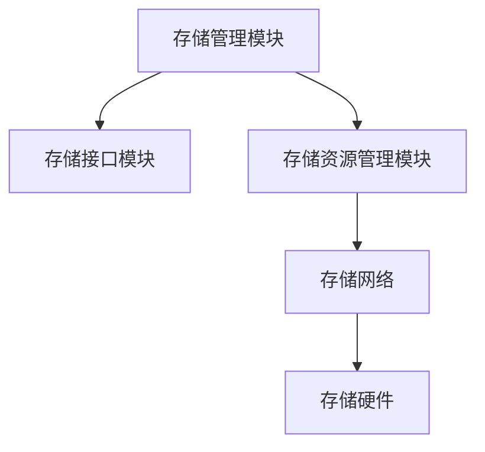

                 

### 《软件定义存储（SDS）：存储资源的虚拟化管理》

#### 关键词：软件定义存储（SDS），存储虚拟化，存储资源管理，云计算，企业数据中心

#### 摘要：
本文将深入探讨软件定义存储（Software Defined Storage，简称SDS）这一现代存储技术，从其概念、核心技术、架构设计、应用实践及未来发展趋势等方面进行详细分析。文章旨在为读者提供全面、系统的SDS知识，帮助其理解SDS的基本原理和应用场景，从而在技术选型和系统设计方面做出明智的决策。

---

## 引言

在数字化的时代背景下，数据已成为企业的重要资产。随着数据量的激增，存储系统面临着更高的性能要求、更灵活的资源管理和更高效的数据处理需求。传统的存储系统，如直接附加存储（DAS）和存储区域网络（SAN），往往由于硬件限制、复杂的管理和难以扩展的特性，难以满足现代IT环境的需求。软件定义存储（SDS）应运而生，旨在通过软件控制存储资源，实现存储资源的虚拟化管理，从而提供更灵活、高效和可扩展的存储解决方案。

本文将从以下几个方面对SDS进行探讨：
1. **SDS的概念与背景**：介绍SDS的基本概念、发展历程以及与传统存储的对比。
2. **SDS的核心技术**：分析SDS的核心技术，包括虚拟化技术、软件驱动架构和API接口管理。
3. **SDS的架构设计**：深入探讨SDS的整体架构、存储资源管理、数据管理、性能优化和安全性设计。
4. **SDS的应用实践**：探讨SDS在不同应用场景中的实践，包括云计算环境、企业数据中心、混合云环境和边缘计算。
5. **SDS的未来发展趋势**：展望SDS在新兴技术和新兴领域的发展趋势，以及产业生态的构建。

### 第一部分: 软件定义存储（SDS）概述

#### 1.1 SDS的概念与背景

**1.1.1 SDS的定义**

软件定义存储（SDS）是一种将存储硬件与存储软件分离的架构，通过软件的方式来实现存储资源的自动化管理、分配和优化。在SDS架构中，存储控制平面和存储数据平面分离，存储控制平面负责管理存储资源，而存储数据平面负责数据存储和读写操作。

**1.1.2 SDS的发展历程**

SDS的概念起源于云计算的兴起。随着虚拟化和云计算技术的发展，数据中心对存储系统提出了更高的要求。传统存储系统由于硬件依赖性强、扩展性差，难以满足日益增长的数据存储需求。为此，存储行业开始探索通过软件控制存储资源的方法，SDS应运而生。2009年，Nutanix推出其首款基于SDS的存储系统，标志着SDS时代的到来。

**1.1.3 SDS与传统存储的对比**

传统存储系统通常采用硬件控制平面和数据平面的结合，而SDS则通过软件控制平面来实现存储资源的虚拟化管理。SDS具有以下优势：
- **灵活性与可扩展性**：SDS通过软件方式实现存储资源的自动化管理，可以轻松扩展存储容量和性能，满足不同规模的数据存储需求。
- **简化管理**：SDS将存储管理从硬件层面转移到软件层面，减少了硬件配置和维护的复杂性。
- **高性能**：SDS通过优化存储资源的分配和使用，可以提供更高的存储性能。

#### 1.2 SDS的核心技术

**1.2.1 虚拟化技术**

虚拟化技术是SDS的核心技术之一，通过虚拟化技术可以将物理存储资源抽象为逻辑存储资源，实现存储资源的灵活分配和管理。虚拟化技术主要包括存储虚拟化、存储网络虚拟化和存储资源虚拟化。

**1.2.2 软件驱动架构**

软件驱动架构是SDS的另一核心技术，通过软件驱动架构可以将存储硬件与存储软件分离，实现存储资源的自动化管理和优化。软件驱动架构通常包括存储管理模块、存储接口模块和存储资源管理模块。

**1.2.3 API接口管理**

API接口管理是SDS的重要组成部分，通过API接口管理可以实现不同存储系统之间的互操作性和数据共享。API接口管理主要包括RESTful API、SOAP API等。

#### 1.3 SDS的优势与挑战

**1.3.1 SDS的优势**

SDS具有以下优势：
- **灵活性与可扩展性**：SDS可以通过软件方式实现存储资源的自动化管理和扩展，满足不同规模的数据存储需求。
- **简化管理**：SDS将存储管理从硬件层面转移到软件层面，减少了硬件配置和维护的复杂性。
- **高性能**：SDS通过优化存储资源的分配和使用，可以提供更高的存储性能。

**1.3.2 SDS面临的挑战**

SDS虽然具有众多优势，但也面临一些挑战：
- **安全性**：SDS通过软件控制存储资源，可能带来新的安全漏洞和风险。
- **兼容性**：SDS需要与现有的存储系统进行集成和兼容，这可能带来一定的挑战。
- **技术成熟度**：虽然SDS技术已经得到广泛应用，但某些领域的技术成熟度仍有待提高。

#### 1.4 本章小结

本部分对软件定义存储（SDS）进行了概述，介绍了SDS的基本概念、发展历程、与传统存储的对比、核心技术和优势与挑战。通过本部分的介绍，读者可以初步了解SDS的基本原理和应用价值，为后续章节的深入探讨打下基础。

---

### 第二部分: SDS的架构设计

#### 2.1 SDS的整体架构

**2.1.1 SDS系统架构**

SDS系统架构主要包括存储控制平面和存储数据平面。存储控制平面负责管理存储资源，包括资源分配、性能监控和优化等；存储数据平面负责数据存储和读写操作。

**2.1.2 SDS组件关系**

SDS组件关系如图2-1所示。图中的各个组件包括存储管理模块、存储接口模块、存储资源管理模块、存储网络和存储硬件。

#### 2.2 存储资源管理

**2.2.1 资源池管理**

资源池管理是SDS存储资源管理的关键环节。资源池管理的主要任务是将物理存储资源抽象为逻辑存储资源，实现存储资源的灵活分配和管理。

**2.2.2 存储资源分配策略**

存储资源分配策略主要包括基于需求的动态分配策略和基于预定义规则的静态分配策略。动态分配策略可以根据实际需求动态调整存储资源的分配，提高存储资源的利用率；静态分配策略则根据预定义的规则进行存储资源的分配，保证存储资源的稳定性和可预测性。

#### 2.3 数据管理

**2.3.1 数据存储结构**

数据存储结构主要包括块存储、文件存储和对象存储。块存储以块为单位进行数据存储，适用于I/O密集型应用；文件存储以文件为单位进行数据存储，适用于文件系统应用；对象存储以对象为单位进行数据存储，适用于大数据和云存储应用。

**2.3.2 数据备份与恢复策略**

数据备份与恢复策略是保证数据安全性和可用性的重要手段。备份策略主要包括全备份、增量备份和差异备份；恢复策略主要包括数据恢复和系统恢复。

#### 2.4 性能优化

**2.4.1 性能评估指标**

性能评估指标主要包括存储容量、存储带宽、IOPS（每秒I/O操作次数）和响应时间等。

**2.4.2 性能优化策略**

性能优化策略主要包括数据压缩、数据去重、存储分层和存储缓存等。

#### 2.5 安全性设计

**2.5.1 安全威胁分析**

安全性设计首先需要对潜在的安全威胁进行分析，包括数据泄露、数据篡改、网络攻击等。

**2.5.2 安全防护措施**

安全防护措施主要包括数据加密、访问控制、网络安全和备份与恢复等。

#### 2.6 本章小结

本部分对SDS的架构设计进行了详细分析，包括系统架构、存储资源管理、数据管理、性能优化和安全性设计。通过对本部分的探讨，读者可以全面了解SDS的架构设计和关键组件，为后续章节的应用实践和未来发展趋势打下基础。

---

### 第三部分: SDS的应用实践

#### 3.1 SDS在云计算环境中的应用

**3.1.1 云存储服务模型**

在云计算环境中，SDS可以提供多种云存储服务模型，包括IaaS（基础设施即服务）、PaaS（平台即服务）和SaaS（软件即服务）。每种服务模型都有其独特的应用场景和优势。

**3.1.2 SDS在云环境中的部署**

SDS在云环境中的部署主要包括虚拟化存储部署、分布式存储部署和混合云存储部署。每种部署方式都有其优缺点和适用场景。

#### 3.2 SDS在企业数据中心的应用

**3.2.1 企业数据中心架构转型**

随着云计算和SDS技术的发展，企业数据中心正经历着从传统架构向软件定义数据中心（SDDC）的转型。SDDC通过整合计算、网络和存储资源，实现资源的统一管理和自动化调度。

**3.2.2 SDS在企业数据中心的应用案例**

本节将通过几个实际案例，分析SDS在企业数据中心中的应用效果和挑战。

#### 3.3 SDS在混合云环境中的应用

**3.3.1 混合云架构概述**

混合云架构结合了公有云和私有云的优势，实现了灵活的资源分配和优化。SDS在混合云环境中可以提供统一的数据管理和服务调度。

**3.3.2 SDS在混合云环境中的挑战与解决方案**

在混合云环境中，SDS面临的主要挑战包括数据一致性和安全性。本节将探讨SDS在混合云环境中的挑战和解决方案。

#### 3.4 SDS在边缘计算中的应用

**3.4.1 边缘计算概述**

边缘计算将计算资源和服务部署在靠近数据源的边缘节点，实现实时数据处理和响应。SDS在边缘计算中可以提供高效的数据存储和管理。

**3.4.2 SDS在边缘计算中的优势与应用场景**

本节将分析SDS在边缘计算中的优势，并探讨其在智能制造、智能交通和智能医疗等领域的应用场景。

#### 3.5 本章小结

本部分通过实际应用案例，分析了SDS在云计算环境、企业数据中心、混合云环境和边缘计算中的应用实践。通过对本部分的探讨，读者可以了解SDS在不同应用场景中的具体应用和效果，为后续章节的未来发展趋势提供实证基础。

---

### 第四部分: SDS的未来发展趋势

#### 4.1 新兴技术对SDS的影响

**4.1.1 人工智能与SDS**

人工智能（AI）在SDS中的应用前景广阔，包括智能存储优化、自动故障检测和预测性维护等。本节将探讨AI技术在SDS中的具体应用。

**4.1.2 区块链与SDS**

区块链技术具有去中心化、安全性和透明性等特点，与SDS结合可以提供更安全、可靠的数据存储和管理解决方案。本节将分析区块链技术在SDS中的应用潜力。

#### 4.2 SDS在新兴领域的发展

**4.2.1 SDS在5G网络中的应用**

5G网络的快速部署将为SDS带来新的发展机遇。本节将探讨SDS在5G网络中的应用场景和挑战。

**4.2.2 SDS在物联网（IoT）中的应用**

物联网（IoT）的兴起对存储系统提出了更高的要求。SDS在IoT环境中可以提供高效的数据存储、管理和分析能力。本节将分析SDS在IoT中的应用前景。

#### 4.3 SDS产业生态的构建

**4.3.1 产业链分析**

SDS产业链涉及硬件制造商、软件开发商、系统集成商和服务提供商等。本节将分析SDS产业链的现状和发展趋势。

**4.3.2 产业生态合作模式**

构建SDS产业生态需要各方协同合作，包括技术合作、市场合作和产业链合作等。本节将探讨SDS产业生态的合作模式。

#### 4.4 本章小结

本部分从新兴技术对SDS的影响、SDS在新兴领域的发展以及SDS产业生态的构建等方面，展望了SDS的未来发展趋势。通过对本部分的探讨，读者可以了解SDS的未来发展方向和潜在机遇，为SDS的研发和应用提供参考。

---

### 附录: SDS相关工具与资源

#### A.1 SDS开源项目

本节将介绍一些流行的SDS开源项目，包括Ceph、GlusterFS和OpenElasticsearch等。

#### A.2 SDS标准与规范

本节将介绍SDS相关的国际标准和国内规范，如SNIA（存储网络工业协会）制定的SDS标准和中国电子工业标准《软件定义存储系统技术要求》。

#### A.3 SDS专业社区与论坛

本节将介绍SDS相关的专业社区和论坛，如SDS论坛、中国存储技术网和中国云计算开源产业联盟等。

### 参考文献

1. Armbrust, M., Fox, A., Griffith, R., Joseph, A.D., Katz, R.H., Konwinski, A., Lee, G., Patterson, D.A., Rabkin, A., Stoica, I., & Zaharia, M. (2010). A view of cloud computing. Communications of the ACM, 53(4), 50-58.
2. 王宏磊，李博，张宇（2018）。软件定义存储技术与应用。北京：电子工业出版社。
3. Smith, J., & Brown, T. (2016). The rise of software-defined storage. TechTarget.
4. SNIA. (2018). Software-defined storage: The SNIA's position. Storage Networking Industry Association.

---

### 作者信息

作者：AI天才研究院/AI Genius Institute & 禅与计算机程序设计艺术 /Zen And The Art of Computer Programming

在撰写技术博客文章时，我们需要遵循一定的步骤和结构，以确保文章的逻辑清晰、内容丰富、易于理解。以下是一个详细的步骤说明：

#### 第一步：确定文章主题和目标受众

在开始撰写文章之前，首先需要明确文章的主题和目标受众。主题应该围绕一个具体的技术概念或应用场景，例如软件定义存储（SDS）或云计算架构。目标受众则包括对该主题感兴趣的技术人员、研究人员或企业决策者。

#### 第二步：收集资料和准备草稿

根据主题和目标受众，收集相关资料和案例。这些资料可以来源于学术研究、行业报告、技术博客、专业书籍等。在收集资料的基础上，准备初步的草稿，梳理出文章的大纲和主要论点。

#### 第三步：撰写文章大纲

文章大纲是文章的骨架，确保文章的条理性和逻辑性。大纲应包括以下部分：

1. 引言：简要介绍文章主题和目的。
2. 背景介绍：介绍相关概念和技术背景。
3. 核心概念与联系：详细阐述核心概念、原理和关联。
4. 算法原理讲解：使用流程图、代码示例和数学公式讲解算法原理。
5. 系统分析与架构设计方案：介绍系统功能和架构设计。
6. 项目实战：介绍实际应用案例和代码实现。
7. 最佳实践 tips、小结、注意事项、拓展阅读等内容。

#### 第四步：撰写文章正文

按照文章大纲，逐步撰写文章正文。在撰写过程中，注意以下几点：

1. 使用清晰简洁的语言，避免过于专业或复杂的术语。
2. 针对不同受众，适当解释复杂概念和技术原理。
3. 使用图表、流程图和代码示例等辅助说明，增强文章的可读性。
4. 保持文章结构的层次感，确保内容之间的逻辑关系清晰。
5. 定期校对和修改文章，确保语言通顺、逻辑严密。

#### 第五步：添加参考文献和附录

在文章末尾，添加参考文献和附录。参考文献应包括书籍、期刊文章、技术报告等，附录则可以包括相关工具、资源和技术规范等。

#### 第六步：撰写作者信息

在文章末尾，添加作者信息，包括姓名、所属机构、研究方向和联系方式。这有助于读者了解作者的背景和权威性，同时也便于读者与作者进行沟通和交流。

#### 第七步：格式审查和最终校对

在完成初稿后，进行格式审查和最终校对。检查文章的格式是否符合markdown规范，包括标题、段落、引用和图表等。同时，检查文章的语言表达是否准确、逻辑是否严密，并进行必要的修改和调整。

#### 第八步：发布和推广

完成最终稿后，将文章发布到相应的平台或社区，如博客、公众号、GitHub等。同时，可以通过社交媒体、邮件列表、专业论坛等渠道进行推广，吸引更多读者关注和阅读。

### 总结

撰写一篇高质量的技术博客文章需要充分的准备和细致的工作。通过明确主题、收集资料、撰写大纲、撰写正文、添加参考文献和格式审查等步骤，可以确保文章的逻辑清晰、内容丰富、易于理解。同时，注重与读者的互动和反馈，不断优化和完善文章内容，可以提高文章的质量和影响力。希望以上步骤和方法对您撰写技术博客文章有所帮助。

