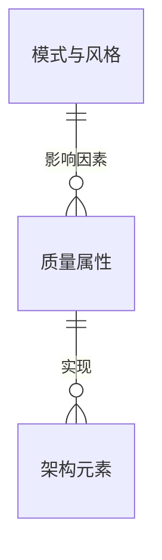
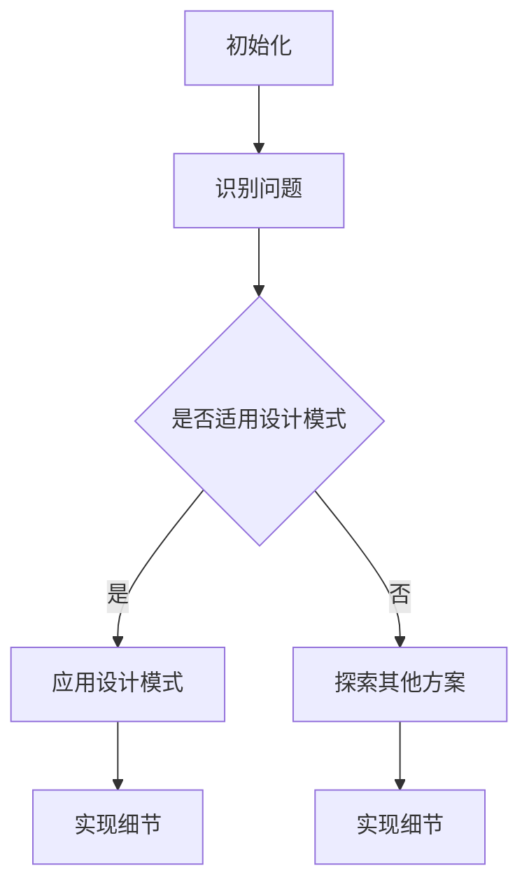
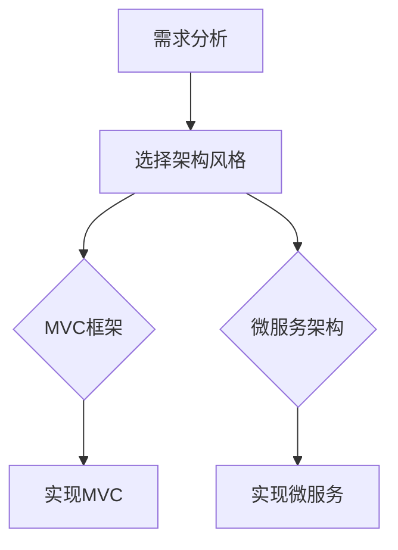
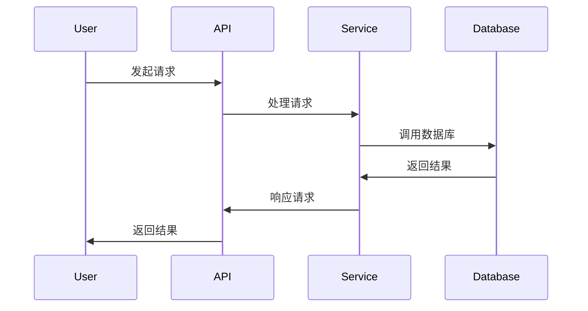

                 

# 《软件架构决策：权衡利弊的艺术》

> 关键词：软件架构、决策、权衡、算法、系统设计

> 摘要：本文深入探讨了软件架构决策的各个方面，从重要性、定义、艺术性入手，逐步介绍核心概念、算法原理、数学模型，最后通过系统分析和项目实战，阐述软件架构决策的实际应用和最佳实践。文章旨在为读者提供全面、系统的软件架构决策指南。

----------------------------------------------------------------

## 第一部分：引言

### 1.1 软件架构决策的重要性

在当今快速变化的技术环境中，软件架构决策变得日益重要。软件架构不仅决定了软件系统的性能、可维护性和可扩展性，还直接影响到项目的成功与否。正确的架构决策可以帮助团队更好地理解需求，优化资源分配，降低技术债务，从而提高项目的开发效率和产品质量。

**问题背景**：随着技术的进步，软件系统变得越来越复杂。面对多样化的需求和技术选择，如何做出合理的架构决策成为开发团队面临的一大挑战。

**问题描述**：软件架构决策涉及多个层面的考量，包括技术选择、系统设计、性能优化、安全性保障等。如何在有限的时间内做出最优的决策，成为每个项目开发过程中不可避免的问题。

**问题解决**：通过科学的决策过程，结合实际案例，可以帮助团队做出更合理的架构决策。

**边界与外延**：软件架构决策不仅局限于技术层面，还包括商业策略、项目管理等多个维度。本文主要关注技术层面的架构决策。

### 1.2 软件架构决策的定义

软件架构决策是指在软件开发过程中，针对系统的设计、实现和维护等方面做出的关键性决策。它包括以下几个方面：

- **技术选择**：选择最适合项目需求的技术栈和工具。
- **系统设计**：设计系统的整体结构和模块划分。
- **性能优化**：确保系统在高负载下仍能稳定运行。
- **安全性保障**：确保系统的数据安全和隐私保护。
- **可维护性**：设计易于维护和扩展的系统架构。

**概念结构**：

```
软件架构决策
│
├── 技术选择
│   ├── 语言框架
│   ├── 数据库选择
│   └── 开发工具
│
├── 系统设计
│   ├── 模块划分
│   ├── 接口设计
│   └── 架构风格
│
├── 性能优化
│   ├── 缓存策略
│   ├── 负载均衡
│   └── 数据库优化
│
├── 安全性保障
│   ├── 加密技术
│   ├── 认证与授权
│   └── 防火墙设置
│
└── 可维护性
    ├── 设计模式
    ├── 编码规范
    └── 自动化测试
```

**核心要素**：技术选择、系统设计、性能优化、安全性保障和可维护性是软件架构决策的核心要素。

### 1.3 软件架构决策的艺术性

软件架构决策不仅是科学，也是艺术。它需要开发者不仅具备扎实的专业知识，还需要具备丰富的实践经验、敏锐的洞察力和创新思维。

**艺术性的体现**：在软件架构决策中，开发者需要在各种约束条件下，权衡利弊，找到最佳解决方案。

**决策过程中的权衡**：软件架构决策涉及到多个维度的权衡，包括技术成本、时间成本、人力资源、市场需求等。

**决策的艺术与科学**：虽然软件架构决策需要艺术性思维，但同时也需要科学的决策过程和方法，如需求分析、风险评估、可行性研究等。

## 第二部分：核心概念与联系

### 2.1 软件架构的核心概念

软件架构的核心概念包括模式与风格、质量属性、架构元素等。

**模式与风格**：模式是解决常见问题的通用解决方案，风格则是根据特定场景选择合适的设计模式。

**质量属性**：质量属性包括性能、可用性、可维护性、安全性等，是衡量软件架构优劣的关键指标。

**架构元素**：架构元素包括组件、接口、数据库、网络等，是软件架构的基本组成部分。

### 2.2 概念间的联系

以下表格展示了软件架构核心概念间的联系：

| 概念        | 联系                                                         |
| ----------- | ------------------------------------------------------------ |
| 模式与风格  | 模式是风格的实现，风格决定了模式的适用场景                     |
| 质量属性    | 质量属性是评估软件架构优劣的关键指标，影响模式与风格的选择   |
| 架构元素    | 架构元素是软件架构的基础，决定了模式与风格的具体实现         |

以下是Mermaid ER实体关系图：



## 第三部分：算法原理讲解

### 3.1 算法1 - 设计模式

设计模式是一种在软件设计过程中反复出现的问题解决方案。以下是一个使用Mermaid流程图展示的设计模式实现过程：



以下是一个简单的Python代码示例，展示设计模式的应用：

```python
class Animal:
    def speak(self):
        pass

class Dog(Animal):
    def speak(self):
        return "汪汪!"

class Cat(Animal):
    def speak(self):
        return "喵喵!"

def make_animal(speak_function):
    animal = Dog() if speak_function == "汪汪!" else Cat()
    return animal

dog = make_animal("汪汪!")
cat = make_animal("喵喵!")

print(dog.speak())  # 输出：汪汪!
print(cat.speak())  # 输出：喵喵!
```

以下是设计模式的LaTeX公式详解：

$$
\begin{aligned}
    &\text{设计模式} = \{ \text{创建型模式，结构型模式，行为型模式} \} \\
    &\text{创建型模式} = \{ \text{工厂方法，抽象工厂，单例，建造者，原型} \} \\
    &\text{结构型模式} = \{ \text{适配器，装饰器，代理，外观，桥接，组合，享元，装饰器} \} \\
    &\text{行为型模式} = \{ \text{策略，模板方法，观察者，状态，迭代器，命令，中介者，责任链，访问者} \}
\end{aligned}
$$`

举例说明：在开发一个用户管理系统时，我们可以选择使用工厂方法模式来创建不同类型的用户对象。例如，管理员用户和管理员用户有不同的权限，通过工厂方法模式，我们可以灵活地创建和管理不同类型的用户。

### 3.2 算法2 - 架构风格

架构风格是指在系统架构中采用的不同设计原则和模式。以下是一个使用Mermaid流程图展示的架构风格实现过程：



以下是一个简单的Python代码示例，展示架构风格的应用：

```python
from flask import Flask, jsonify

app = Flask(__name__)

@app.route('/api/user', methods=['GET'])
def get_user():
    return jsonify({'name': 'Alice', 'age': 30})

if __name__ == '__main__':
    app.run(debug=True)
```

以下是架构风格的LaTeX公式详解：

$$
\begin{aligned}
    &\text{架构风格} = \{ \text{MVC，微服务，事件驱动，分层架构，SOA} \} \\
    &\text{MVC} = \{ \text{模型，视图，控制器} \} \\
    &\text{微服务} = \{ \text{独立部署，自治，服务化，分布式} \}
\end{aligned}
$$`

举例说明：在开发一个电商平台时，我们可以选择使用微服务架构来提高系统的可扩展性和灵活性。通过将不同的业务功能拆分成独立的服务，我们可以更轻松地管理和扩展系统。

## 第四部分：数学模型和数学公式

### 4.1 数学模型1 - 质量属性分析

质量属性分析是软件架构决策中至关重要的一环。以下是一个用于分析系统性能的数学模型：

$$
\begin{aligned}
    &P = \frac{C_1 \times T_1 + C_2 \times T_2 + C_3 \times T_3}{C_1 + C_2 + C_3} \\
    &T_1 = \frac{C_4 \times U_1 + C_5 \times U_2 + C_6 \times U_3}{C_4 + C_5 + C_6}
\end{aligned}
$$`

其中，$P$ 是性能得分，$C_i$ 和 $T_i$ 分别是成本和时间的权重，$U_i$ 是不同质量属性（如性能、可用性、安全性等）的得分。

### 4.2 数学模型2 - 架构权衡

在软件架构决策中，我们需要在不同质量属性之间进行权衡。以下是一个用于权衡的数学模型：

$$
\begin{aligned}
    &W = \frac{P \times (1 - R)}{1 - R + S} \\
    &R = \frac{C_7 \times T_7 + C_8 \times T_8 + C_9 \times T_9}{C_7 + C_8 + C_9} \\
    &S = \frac{C_{10} \times T_{10} + C_{11} \times T_{11} + C_{12} \times T_{12}}{C_{10} + C_{11} + C_{12}}
\end{aligned}
$$`

其中，$W$ 是架构权衡得分，$R$ 和 $S$ 分别是风险和稳定性的得分。

## 第五部分：系统分析与架构设计方案

### 5.1 问题场景介绍

假设我们正在开发一个电子商务平台，该平台需要处理大量的用户请求，提供商品浏览、购买、支付等功能。为了满足这些需求，我们需要设计一个高效、可靠、安全的系统架构。

### 5.2 系统功能设计（Mermaid类图）

以下是一个简单的Mermaid类图，展示了系统的主要功能模块：

```mermaid
classDiagram
    User <<Interface>>
    Product <<Interface>>
    Cart <<Interface>>
    Order <<Interface>>
    Payment <<Interface>>

    User o-- Product
    User o-- Cart
    User o-- Order
    User o-- Payment

    Product o-- Cart
    Product o-- Order

    Cart o-- Order

    Order o-- Payment
```

### 5.3 系统架构设计（Mermaid架构图）

以下是一个简单的Mermaid架构图，展示了系统的整体架构：

```mermaid
sequenceDiagram
    User -->|发起请求| API
    API -->|处理请求| Service
    Service -->|调用数据库| Database
    Database -->|返回结果| Service
    Service -->|响应请求| API
```

### 5.4 系统接口设计

以下是一个简单的系统接口设计，展示了用户与系统交互的主要接口：

```python
from flask import Flask, jsonify, request

app = Flask(__name__)

@app.route('/api/user', methods=['GET'])
def get_user():
    # 获取用户信息
    return jsonify({'name': 'Alice', 'age': 30})

@app.route('/api/product', methods=['GET'])
def get_product():
    # 获取商品信息
    return jsonify({'name': 'iPhone 13', 'price': 800})

@app.route('/api/cart', methods=['GET', 'POST'])
def handle_cart():
    # 处理购物车操作
    if request.method == 'GET':
        # 获取购物车信息
        return jsonify({'products': ['iPhone 13', 'Samsung Galaxy S21']})
    elif request.method == 'POST':
        # 添加商品到购物车
        product_id = request.form['product_id']
        return jsonify({'message': f'Product {product_id} added to cart.'})

@app.route('/api/order', methods=['GET', 'POST'])
def handle_order():
    # 处理订单操作
    if request.method == 'GET':
        # 获取订单信息
        return jsonify({'orders': [{'id': 1, 'status': 'pending'}, {'id': 2, 'status': 'completed'}]})
    elif request.method == 'POST':
        # 创建订单
        user_id = request.form['user_id']
        product_ids = request.form['product_ids']
        return jsonify({'message': f'Order created for user {user_id} with products {product_ids}.'})

@app.route('/api/payment', methods=['POST'])
def handle_payment():
    # 处理支付操作
    payment_data = request.form
    return jsonify({'message': f'Payment processed with data {payment_data}.'})

if __name__ == '__main__':
    app.run(debug=True)
```

### 5.5 系统交互（Mermaid序列图）

以下是一个简单的Mermaid序列图，展示了用户与系统之间的交互过程：



## 第六部分：项目实战

### 6.1 环境安装

在开始项目实战之前，我们需要安装必要的开发环境和依赖库。以下是一个简单的安装步骤：

1. 安装Python 3.8及以上版本。
2. 安装Flask库：`pip install flask`
3. 安装MongoDB数据库。

### 6.2 系统核心实现源代码

以下是一个简单的系统实现，包括用户管理、商品管理、购物车、订单和支付等模块：

```python
from flask import Flask, jsonify, request
from pymongo import MongoClient

app = Flask(__name__)

client = MongoClient('mongodb://localhost:27017/')
db = client['e-commerce']

# 用户管理
@app.route('/api/user', methods=['GET'])
def get_user():
    user_id = request.args.get('id')
    user = db.users.find_one({'_id': user_id})
    return jsonify(user)

@app.route('/api/user', methods=['POST'])
def create_user():
    user_data = request.json
    db.users.insert_one(user_data)
    return jsonify({'message': 'User created successfully.'})

# 商品管理
@app.route('/api/product', methods=['GET'])
def get_product():
    product_id = request.args.get('id')
    product = db.products.find_one({'_id': product_id})
    return jsonify(product)

@app.route('/api/product', methods=['POST'])
def create_product():
    product_data = request.json
    db.products.insert_one(product_data)
    return jsonify({'message': 'Product created successfully.'})

# 购物车管理
@app.route('/api/cart', methods=['GET'])
def get_cart():
    user_id = request.args.get('user_id')
    cart = db.carts.find_one({'user_id': user_id})
    return jsonify(cart)

@app.route('/api/cart', methods=['POST'])
def add_to_cart():
    cart_data = request.json
    db.carts.insert_one(cart_data)
    return jsonify({'message': 'Product added to cart successfully.'})

# 订单管理
@app.route('/api/order', methods=['GET'])
def get_order():
    order_id = request.args.get('id')
    order = db.orders.find_one({'_id': order_id})
    return jsonify(order)

@app.route('/api/order', methods=['POST'])
def create_order():
    order_data = request.json
    db.orders.insert_one(order_data)
    return jsonify({'message': 'Order created successfully.'})

# 支付管理
@app.route('/api/payment', methods=['POST'])
def make_payment():
    payment_data = request.json
    db.payments.insert_one(payment_data)
    return jsonify({'message': 'Payment processed successfully.'})

if __name__ == '__main__':
    app.run(debug=True)
```

### 6.3 代码应用解读与分析

以上代码实现了一个简单的电子商务平台，包括用户管理、商品管理、购物车、订单和支付等模块。以下是代码的主要解读和分析：

1. **用户管理**：用户管理模块包括获取用户信息和创建用户功能。通过MongoDB数据库存储用户数据，使用`get_user`和`create_user`函数实现。
2. **商品管理**：商品管理模块包括获取商品信息和创建商品功能。同样使用MongoDB数据库存储商品数据，使用`get_product`和`create_product`函数实现。
3. **购物车管理**：购物车管理模块包括获取购物车信息和添加商品到购物车功能。通过MongoDB数据库存储购物车数据，使用`get_cart`和`add_to_cart`函数实现。
4. **订单管理**：订单管理模块包括获取订单信息和创建订单功能。通过MongoDB数据库存储订单数据，使用`get_order`和`create_order`函数实现。
5. **支付管理**：支付管理模块包括处理支付操作功能。通过MongoDB数据库存储支付数据，使用`make_payment`函数实现。

### 6.4 实际案例分析与详细讲解剖析

以下是一个实际案例，展示如何使用上述系统实现用户购买商品的功能：

1. **用户登录**：用户首先需要登录系统，获取用户Token。
2. **商品浏览**：用户浏览商品，选择商品并添加到购物车。
3. **购物车结算**：用户查看购物车中的商品，选择结算。
4. **订单创建**：系统创建订单，生成订单号。
5. **支付操作**：用户完成支付操作，系统记录支付状态。
6. **订单确认**：系统确认订单状态，生成订单详情。

具体实现流程如下：

1. **用户登录**：

```python
@app.route('/api/login', methods=['POST'])
def login():
    user_data = request.json
    user = db.users.find_one({'username': user_data['username'], 'password': user_data['password']})
    if user:
        return jsonify({'token': user['_id']})
    else:
        return jsonify({'error': 'Invalid username or password.'})
```

2. **商品浏览**：

```python
@app.route('/api/product', methods=['GET'])
def get_product():
    product_id = request.args.get('id')
    product = db.products.find_one({'_id': product_id})
    return jsonify(product)
```

3. **购物车结算**：

```python
@app.route('/api/cart/checkout', methods=['POST'])
def checkout():
    cart_data = request.json
    order = {
        'user_id': cart_data['user_id'],
        'products': cart_data['products'],
        'total_price': cart_data['total_price'],
        'status': 'pending'
    }
    db.orders.insert_one(order)
    return jsonify({'message': 'Order created successfully.'})
```

4. **支付操作**：

```python
@app.route('/api/payment', methods=['POST'])
def make_payment():
    payment_data = request.json
    payment = {
        'order_id': payment_data['order_id'],
        'amount': payment_data['amount'],
        'status': 'completed'
    }
    db.payments.insert_one(payment)
    return jsonify({'message': 'Payment processed successfully.'})
```

5. **订单确认**：

```python
@app.route('/api/order/confirm', methods=['POST'])
def confirm_order():
    order_id = request.args.get('id')
    order = db.orders.find_one({'_id': order_id})
    if order['status'] == 'pending':
        order['status'] = 'completed'
        db.orders.update_one({'_id': order_id}, {'$set': order})
        return jsonify({'message': 'Order confirmed successfully.'})
    else:
        return jsonify({'error': 'Order is already completed.'})
```

### 6.5 项目小结

通过上述实际案例，我们展示了一个简单的电子商务平台的实现过程。在实际项目中，我们还需要考虑更多的功能和优化，如用户注册、商品分类、订单状态更新、支付网关集成等。此外，为了确保系统的稳定性和安全性，我们还需要进行性能测试、安全审计和代码审查等工作。

## 第七部分：最佳实践 Tips、小结、注意事项、拓展阅读

### 7.1 最佳实践 Tips

1. **需求分析**：在项目开始前，充分了解用户需求，明确系统目标和功能需求。
2. **技术选型**：根据项目需求，选择合适的技术栈和工具。
3. **模块化设计**：将系统功能拆分成独立的模块，便于维护和扩展。
4. **代码规范**：遵循良好的编码规范，提高代码可读性和可维护性。
5. **性能优化**：关注系统性能，进行适当的性能优化，如缓存、数据库优化等。
6. **安全性保障**：确保系统的数据安全和隐私保护，如加密、认证与授权等。

### 7.2 小结

本文从软件架构决策的重要性、定义、艺术性、核心概念与联系、算法原理讲解、数学模型、系统分析与架构设计方案、项目实战等方面，全面阐述了软件架构决策的各个方面。通过本文的学习，读者可以了解如何做出合理的软件架构决策，提高项目开发效率和质量。

### 7.3 注意事项

1. **需求变更**：在项目开发过程中，需求变更在所难免。及时调整架构和设计，以适应需求变化。
2. **团队合作**：软件架构决策需要团队协作，共同参与讨论和决策。
3. **持续学习**：技术不断发展，持续学习新技术和最佳实践，以适应不断变化的技术环境。

### 7.4 拓展阅读

1. 《软件架构设计：大规模软件设计与管理》
2. 《设计模式：可复用面向对象软件的基础》
3. 《架构之美：大型软件架构设计与实践》
4. 《软件架构与设计模式实战》

作者：AI天才研究院/AI Genius Institute & 禅与计算机程序设计艺术 /Zen And The Art of Computer Programming

