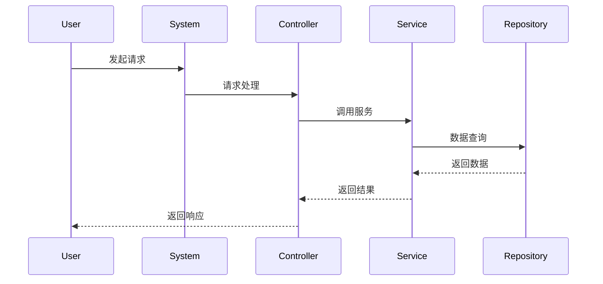
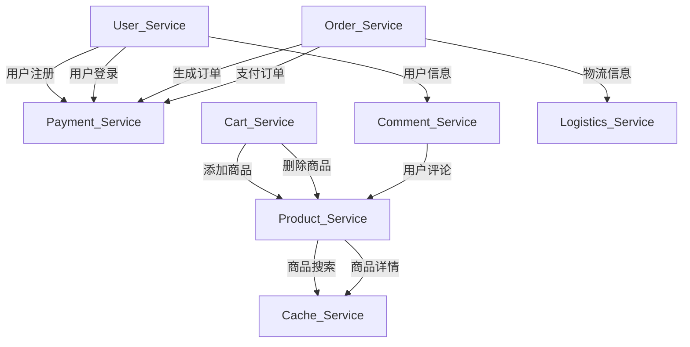

                 

# 软件架构可视化：有效沟通系统结构

## 关键词
- 软件架构
- 可视化
- 沟通效率
- 系统结构
- 设计模式
- 敏捷开发
- DevOps

## 摘要
本文旨在探讨软件架构可视化的重要性及其在实际应用中的多种策略。通过分析软件架构的定义、层次结构和核心要素，本文将阐述可视化在提升沟通效率和简化复杂系统理解方面的关键作用。接着，我们将介绍各类软件架构可视化工具，探讨其选择标准与应用案例。随后，文章将详细讲解软件架构设计流程、文档化方法及实践，并结合敏捷开发和DevOps模式，展示软件架构可视化在这些现代开发方法中的重要作用。最后，通过案例分析总结文章内容，并提出未来研究方向，为软件架构可视化领域的持续发展提供启示。

## 目录大纲

### 第1章 引言
- 1.1 背景介绍
  - 软件架构的重要性
  - 可视化在软件架构中的应用
  - 本书的目标与内容结构
- 1.2 核心概念
  - 软件架构的定义
  - 软件架构的层次结构
  - 软件架构的核心要素
- 1.3 软件架构可视化的重要性
  - 提高沟通效率
  - 简化复杂系统理解
  - 促进持续集成与迭代

### 第2章 软件架构可视化工具
- 2.1 可视化工具概述
  - 传统可视化工具
  - 现代可视化工具
- 2.2 选择合适的可视化工具
  - 功能需求
  - 技术支持
  - 用户界面
- 2.3 使用案例
  - 常见工具的使用
  - 自定义可视化工具

### 第3章 软件架构设计
- 3.1 软件架构设计流程
  - 需求分析
  - 架构设计
  - 架构评估
- 3.2 架构风格与设计模式
  - 传统的架构风格
  - 现代的设计模式
- 3.3 软件架构文档化
  - 文档类型
  - 文档规范

### 第4章 软件架构可视化实践
- 4.1 从需求到架构可视化
  - 需求分析
  - 架构设计
  - 可视化实现
- 4.2 软件架构评估与优化
  - 架构评估方法
  - 架构优化策略
- 4.3 团队协作与沟通
  - 工作流程
  - 沟通工具

### 第5章 软件架构可视化在敏捷开发中的应用
- 5.1 敏捷开发与软件架构可视化
  - 敏捷开发的核心理念
  - 可视化在敏捷开发中的作用
- 5.2 软件架构可视化在迭代中的应用
  - 迭代规划
  - 迭代评估
- 5.3 软件架构可视化与持续集成
  - 持续集成的概念
  - 可视化在持续集成中的应用

### 第6章 软件架构可视化与DevOps
- 6.1 DevOps概述
  - DevOps的理念
  - DevOps的工具链
- 6.2 软件架构可视化在DevOps中的作用
  - 持续交付
  - 持续部署
- 6.3 软件架构可视化与CI/CD
  - CI/CD的概念
  - 可视化在CI/CD中的应用

### 第7章 软件架构可视化案例分析
- 7.1 案例介绍
  - 项目背景
  - 项目目标
- 7.2 架构设计与实现
  - 架构设计
  - 可视化实现
- 7.3 案例评估与反思
  - 评估方法
  - 反思与总结

### 第8章 总结与展望
- 8.1 总结
  - 软件架构可视化的现状
  - 软件架构可视化的挑战与机遇
- 8.2 展望
  - 未来发展趋势
  - 研究与探索方向

### 结束

作者：AI天才研究院/AI Genius Institute & 禅与计算机程序设计艺术 /Zen And The Art of Computer Programming

----------------------------------------------------------------

## 第1章 引言

### 1.1 背景介绍

软件架构作为软件系统的骨架，决定了系统的可维护性、扩展性和性能。然而，随着软件系统规模的不断扩大和复杂度的增加，仅靠文字描述的传统软件架构设计方法已经难以清晰地展示和传达系统结构。这种背景下，软件架构可视化应运而生，成为提高软件开发效率和降低沟通成本的重要工具。

**软件架构的重要性**：

软件架构的重要性主要体现在以下几个方面：

1. **系统的可维护性**：良好的软件架构设计使得系统模块化，便于理解和维护。
2. **系统的可扩展性**：清晰明确的架构设计为系统的后续扩展提供了可行性。
3. **性能优化**：通过合理的架构设计，可以优化系统的性能，提高资源利用率。
4. **降低开发成本**：清晰的架构设计可以减少重复开发，降低项目的开发成本。

**可视化在软件架构中的应用**：

可视化在软件架构中的应用主要体现在以下几个方面：

1. **增强沟通效率**：通过图形化的方式，能够更加直观地展示系统的架构设计，便于开发团队和利益相关者之间的沟通。
2. **简化复杂系统理解**：对于复杂的软件系统，可视化工具能够将系统结构以简明的方式呈现，降低理解的难度。
3. **促进持续集成与迭代**：可视化工具可以帮助开发团队在持续集成和迭代过程中，快速发现和解决问题。

**本书的目标与内容结构**：

本书的目标是深入探讨软件架构可视化的理论和方法，通过具体的实践案例，展示可视化在软件架构设计、评估与优化中的应用。本书内容结构如下：

1. **第1章 引言**：介绍软件架构可视化的背景和重要性。
2. **第2章 软件架构可视化工具**：讨论各类可视化工具的选择和应用。
3. **第3章 软件架构设计**：讲解软件架构设计流程和设计模式。
4. **第4章 软件架构可视化实践**：介绍软件架构可视化的具体实现方法。
5. **第5章 软件架构可视化在敏捷开发中的应用**：探讨可视化在敏捷开发中的应用。
6. **第6章 软件架构可视化与DevOps**：分析可视化在DevOps中的作用。
7. **第7章 软件架构可视化案例分析**：通过实际案例展示可视化工具的应用。
8. **第8章 总结与展望**：总结当前软件架构可视化的现状和未来发展趋势。

通过本书的阅读，读者将能够深入理解软件架构可视化的重要性和应用方法，为实际项目中的软件架构设计提供有力的支持。

### 1.2 核心概念

**软件架构的定义**：

软件架构是软件开发过程中的一种高层次设计，它定义了系统的组件及其相互关系，以实现系统的功能、性能和可维护性。根据Roger S. Pressman和Bruce R. Maxim的《软件工程：实践者的研究方法》一书，软件架构可以被视为“系统的抽象视图，它描述了系统的组件、组件之间的关系以及组件的接口，并通常与系统的运行环境和开发环境相分离”。

**软件架构的层次结构**：

软件架构通常分为三个层次：组件层、组件间关系层和接口层。

1. **组件层**：这是软件架构的基础层，包含系统中的各个组件，如模块、类、库等。每个组件都有明确的功能和职责。
2. **组件间关系层**：这一层定义了组件之间的相互关系，如依赖关系、调用关系等。通过这种关系，组件能够协同工作，共同实现系统的功能。
3. **接口层**：接口层定义了组件间的交互方式，包括接口规格、通信协议等。良好的接口设计能够确保组件之间的松耦合，提高系统的可维护性和可扩展性。

**软件架构的核心要素**：

软件架构的核心要素包括以下几个方面：

1. **组件**：组件是软件架构的基本单位，具有独立的功能和职责。组件的设计需要考虑模块化、可重用性和可测试性。
2. **关系**：组件之间的关系决定了系统的整体性能和可维护性。合理的关系设计能够降低组件间的耦合度，提高系统的灵活性。
3. **接口**：接口是组件间交互的桥梁，决定了组件之间的通信方式和数据交换方式。良好的接口设计能够提高系统的可扩展性和可维护性。
4. **架构风格**：架构风格是指软件架构的基本设计理念和方法。常见的架构风格包括层式架构、事件驱动架构、微服务架构等。
5. **设计模式**：设计模式是解决软件架构中常见问题的经典方法。通过使用设计模式，可以提高系统的可维护性和可扩展性。

**概念属性特征对比表格**：

为了更好地理解这些核心概念，我们可以通过一个表格来对比它们的主要特征：

| 核心概念 | 定义 | 层次结构 | 主要功能 |
| :------: | :--- | :------: | :------: |
| 组件 | 软件架构的基本单位 | 组件层 | 提供独立的功能 |
| 关系 | 组件之间的相互关系 | 组件间关系层 | 确保组件协同工作 |
| 接口 | 组件间的交互方式 | 接口层 | 定义组件间的通信 |
| 架构风格 | 软件架构的设计理念 | — | 提高系统的灵活性 |
| 设计模式 | 解决常见问题的方法 | — | 提高系统的可维护性 |

**ER实体关系图架构**：

在软件架构设计中，ER（Entity-Relationship）实体关系图是一种常用的图形表示方法，用于展示系统中各个实体之间的关系。以下是ER实体关系图的Mermaid格式表示：

```mermaid
erDiagram
    Class1 ||--|{ Class2 : 父子关系 }
    Class1 ||--|{ Class3 : 父子关系 }
    Class2 ||--|{ Class4 : 父子关系 }
    Class3 ||--|{ Class5 : 父子关系 }
```

在这个ER图中，`Class1` 是根实体，`Class2`、`Class3` 是其子实体，`Class4`、`Class5` 是 `Class2`、`Class3` 的子实体，通过父子关系展示了系统的层次结构。

通过上述核心概念的分析和ER实体关系图的展示，我们可以更清晰地理解软件架构的构成和设计方法。这些核心概念和关系不仅是软件架构设计的基础，也是实现良好软件架构的关键。

### 1.3 软件架构可视化的重要性

软件架构可视化的重要性不可忽视，它不仅提高了沟通效率，还简化了复杂系统理解，并促进了持续集成与迭代。以下将详细探讨这些方面。

**提高沟通效率**：

在软件开发过程中，团队成员之间、团队成员与利益相关者之间的沟通至关重要。然而，复杂的软件系统往往涉及到大量的技术细节和抽象概念，这些内容通过文字描述难以完全准确地传达。软件架构可视化通过图形化的方式，将抽象的架构设计直观地展示出来，使得沟通变得更加直观和高效。

1. **可视化降低理解门槛**：图形化的表示方法能够将复杂的系统结构以简单、直观的方式展示，使得团队成员和利益相关者更容易理解系统的架构。
2. **促进跨部门协作**：通过可视化工具，开发人员、测试人员、产品经理等不同角色可以更清晰地了解系统的设计和功能，减少误解和沟通障碍，提高协作效率。
3. **支持决策制定**：可视化工具可以帮助项目团队和管理层快速了解项目的整体架构，为决策提供有力支持。

**简化复杂系统理解**：

随着软件系统的复杂度不断增加，仅靠文字描述已经难以清晰地表达系统的结构和工作原理。软件架构可视化通过图形化的方式，将复杂的系统结构以简明、直观的方式展示出来，使得系统的理解和学习变得更加容易。

1. **图形化的抽象层次**：可视化工具可以将复杂的系统拆解为多个层次，每个层次都有明确的职责和功能，使得系统结构更加清晰。
2. **动态交互**：许多可视化工具支持动态交互，用户可以实时调整系统组件的配置和关系，从而更直观地观察系统在不同配置下的行为。
3. **帮助学习新系统**：对于新加入的项目成员，通过可视化工具，可以快速熟悉系统的架构和功能，缩短学习周期。

**促进持续集成与迭代**：

在持续集成和迭代开发的过程中，软件架构可视化同样发挥着重要作用。通过可视化工具，开发团队可以实时监控和调整系统架构，确保系统的稳定性和扩展性。

1. **实时监控**：可视化工具可以帮助开发团队实时监控系统的运行状态，发现潜在的问题和瓶颈，及时进行调整和优化。
2. **快速迭代**：在迭代开发中，可视化工具能够快速展示每次迭代后的系统架构变化，帮助团队评估迭代效果，确保系统功能和质量持续提升。
3. **提高交付效率**：通过可视化工具，开发团队可以更加清晰地理解系统的整体架构，减少重复工作，提高交付效率。

总之，软件架构可视化在提高沟通效率、简化复杂系统理解和促进持续集成与迭代方面具有重要作用。通过采用合适的可视化工具，开发团队可以更加高效地完成软件项目的开发，提高系统的质量和可维护性。在接下来的章节中，我们将进一步探讨软件架构可视化工具的选择和应用方法。

### 第2章 软件架构可视化工具

在软件架构设计中，可视化工具发挥着至关重要的作用。这些工具不仅能够帮助我们更好地理解和沟通复杂的系统架构，还能够提高开发效率和系统质量。本节将首先概述常用的软件架构可视化工具，然后讨论如何选择合适的可视化工具，并分享一些实际使用案例。

#### 2.1 可视化工具概述

**传统可视化工具**：

传统的软件架构可视化工具主要包括以下几种：

1. **UML（统一建模语言）工具**：如Rational Rose、Visual Paradigm等。这些工具支持生成各种UML图，如类图、组件图、用例图等，用于描述系统的不同方面。
2. **绘图工具**：如Microsoft Visio、Lucidchart等。这些工具提供了丰富的图形元素和模板，可以手动绘制系统架构图，虽然灵活性较高，但在复杂系统面前仍显力不从。
3. **代码分析工具**：如SonarQube、NDepend等。这些工具可以通过分析代码，自动生成系统的依赖关系图和组件图，提供系统的静态分析报告。

**现代可视化工具**：

随着技术的发展，现代可视化工具在功能、性能和用户体验方面有了显著提升：

1. **在线可视化平台**：如draw.io、Lucidchart等。这些平台支持在线协作，方便团队成员实时更新和共享架构图，提高了沟通效率。
2. **代码托管平台集成**：如GitHub、GitLab等。这些平台集成了可视化工具，可以直接从代码仓库中提取信息，自动生成架构图，方便开发者在代码层面进行架构管理。
3. **自动化生成工具**：如GraphDSL、GraphViz等。这些工具可以通过定义图的数据结构和规则，自动生成复杂的系统架构图，减少了手动绘图的繁琐工作。

#### 2.2 选择合适的可视化工具

选择合适的软件架构可视化工具需要考虑以下几个方面：

**功能需求**：

1. **图形元素和模板**：选择工具时需要考虑其提供的图形元素和模板是否满足项目需求，如是否支持常见的UML图、依赖关系图等。
2. **自动化生成能力**：如果项目规模较大，自动化生成功能可以显著提高工作效率，减少手工绘制的工作量。
3. **在线协作能力**：对于需要跨团队协作的项目，选择支持在线协作的工具可以方便团队成员实时更新和共享架构图。

**技术支持**：

1. **工具的稳定性和兼容性**：工具需要能够在不同的操作系统和浏览器上稳定运行，并且与现有的开发工具和流程兼容。
2. **技术支持和社区资源**：选择有良好技术支持和丰富社区资源的工具，可以在遇到问题时得到及时的帮助和解决方案。

**用户界面**：

1. **易用性和用户体验**：工具的用户界面需要直观、易用，降低学习成本，提高工作效率。
2. **扩展性和定制性**：工具应支持自定义图形元素和样式，以适应不同的项目需求。

#### 2.3 使用案例

**常见工具的使用**：

以下是一些常见软件架构可视化工具的使用案例：

1. **Visual Paradigm**：

   Visual Paradigm 是一款功能强大的UML工具，支持生成各种UML图，如类图、组件图、用例图等。以下是使用Visual Paradigm创建的一个简单的类图的示例：

   ```mermaid
   classDiagram
       Class1 --|> Class2 : generalization
       Class3 <<interface>>
       Class1 + operation()
       Class3 + abstractMethod()
   endclassDiagram
   ```

2. **Lucidchart**：

   Lucidchart 是一款在线协作工具，支持多种图形和图表的绘制，如流程图、网络拓扑图、系统架构图等。以下是使用Lucidchart创建的一个简单的依赖关系图的示例：

   ```mermaid
   graph TB
       A[开始] --> B{条件判断}
       B -->|是| C[执行操作]
       B -->|否| D[跳过操作]
       C --> E[结束]
       D --> E
   ```

**自定义可视化工具**：

在某些特定场景下，可能需要自定义可视化工具以满足特殊需求。以下是一个使用GraphViz创建的简单系统架构图的示例：

```mermaid
digraph g {
    rankdir=TB;
    node [shape=rect];
    A [label="数据库"];
    B [label="应用服务器"];
    C [label="Web前端"];
    D [label="缓存服务器"];
    A -> B [label="数据查询"];
    B -> C [label="页面渲染"];
    D -> C [label="缓存更新"];
}
```

通过上述案例，我们可以看到不同可视化工具在不同场景下的应用。在实际项目中，选择合适的工具并根据项目需求进行定制化，能够有效提升软件架构的可视化效果和开发效率。

### 第3章 软件架构设计

软件架构设计是软件开发过程中的关键环节，它决定了系统的可维护性、可扩展性和性能。本章将详细介绍软件架构设计流程，包括需求分析、架构设计和架构评估，并探讨常见的架构风格和设计模式。

#### 3.1 软件架构设计流程

软件架构设计流程可以分为以下几个主要步骤：

**需求分析**：

需求分析是软件架构设计的起点，其主要任务是明确系统的功能需求和性能需求。以下是需求分析的主要任务：

1. **收集需求**：通过与用户、产品经理和其他利益相关者的交流，了解系统的目标、功能和性能要求。
2. **需求分类**：将收集到的需求分为功能需求和非功能需求，如安全性、可靠性、性能、可维护性等。
3. **需求验证**：确保收集到的需求是合理且可实现的，通常通过需求文档、用户故事、用例图等方式进行验证。

**架构设计**：

架构设计是将需求转化为具体的架构解决方案的过程。以下是架构设计的主要任务：

1. **确定架构风格**：根据系统的特点和要求，选择合适的架构风格，如分层架构、微服务架构等。
2. **定义组件**：将系统划分为多个功能模块，每个模块代表一个组件，明确组件的职责和功能。
3. **确定组件间关系**：定义组件之间的依赖关系和调用关系，确保组件能够协同工作，实现系统功能。
4. **定义接口**：为组件之间的交互定义接口，包括接口规格、通信协议等，确保组件之间的松耦合。
5. **架构评估**：对初步设计的架构进行评估，检查其是否满足系统的需求，是否具有良好的可维护性和可扩展性。

**架构评估**：

架构评估是对架构设计方案的全面审查和验证，确保其满足系统的需求和目标。以下是架构评估的主要任务：

1. **功能评估**：验证架构设计是否能够实现所有功能需求，包括基本功能和扩展功能。
2. **性能评估**：评估架构设计的性能，包括响应时间、吞吐量、资源利用率等，确保系统能够满足性能要求。
3. **安全性评估**：检查架构设计中的安全机制，确保系统能够抵御常见的安全威胁。
4. **可维护性和可扩展性评估**：评估架构设计是否具有良好的可维护性和可扩展性，便于后续的维护和扩展。

#### 3.2 架构风格与设计模式

**架构风格**：

架构风格是指系统架构的基本设计理念和结构。以下是一些常见的架构风格：

1. **分层架构**：系统分为多个层次，每层负责不同的功能，层次之间通过接口进行交互。这种架构风格具有良好的模块化和可维护性。
2. **事件驱动架构**：系统通过事件进行通信和协调，组件根据事件触发相应的操作。这种架构风格适用于实时系统和分布式系统。
3. **微服务架构**：系统划分为多个独立的服务，每个服务负责特定的功能，服务之间通过RESTful API进行通信。这种架构风格具有良好的可扩展性和可维护性。

**设计模式**：

设计模式是解决软件架构中常见问题的经典方法。以下是一些常见的设计模式：

1. **工厂模式**：创建对象实例的通用接口，根据输入参数动态创建对象。这种模式提高了系统的灵活性和可扩展性。
2. **单例模式**：确保一个类仅有一个实例，并提供一个全局访问点。这种模式常用于管理共享资源。
3. **策略模式**：定义一系列算法，将每个算法封装起来，并使它们可以互换使用。这种模式提高了系统的可维护性和可扩展性。

**架构风格与设计模式的结合**：

在实际项目中，架构风格和设计模式通常结合使用。例如，在一个分层架构中，可以使用工厂模式来创建不同层次的组件，使用策略模式来定义数据处理的算法。以下是一个结合分层架构和工厂模式的简单架构图：



在这个架构图中，用户请求通过控制器层处理，控制器层调用服务层处理具体业务逻辑，服务层再通过数据访问层查询数据库，实现了分层和模块化的架构风格。同时，通过工厂模式创建不同层次的组件，提高了系统的灵活性和可扩展性。

通过上述架构设计流程和架构风格与设计模式的介绍，我们可以更好地理解和应用软件架构设计的方法和技巧，为实际项目中的软件架构设计提供有力的支持。

#### 3.3 软件架构文档化

软件架构文档化是软件架构设计过程中的重要环节，它不仅为系统开发、测试和维护提供了详细的参考，也为团队成员之间的沟通和协作提供了基础。以下将详细介绍软件架构文档化的类型、规范和文档内容。

**文档类型**：

软件架构文档可以分为以下几种类型：

1. **系统概述文档**：概述系统的整体架构，包括系统的功能、模块划分、主要组件及其关系等，为读者提供一个全面的系统视图。
2. **模块设计文档**：详细描述每个模块的架构设计，包括模块的功能、接口定义、组件关系和关键算法等。
3. **接口设计文档**：详细描述系统内部及外部接口的设计，包括接口的功能、数据结构、通信协议等，为开发人员提供明确的接口实现指南。
4. **架构评估报告**：总结架构设计的过程和结果，包括架构的功能实现情况、性能评估、安全性评估等，为项目管理和决策提供依据。

**文档规范**：

为了确保软件架构文档的准确性和一致性，需要遵循一定的文档规范：

1. **格式规范**：文档应使用统一的格式和排版，如字体大小、行距、段落格式等，确保文档的可读性和专业性。
2. **命名规范**：对模块、组件、接口等命名应遵循一致的命名规则，如使用骆驼命名法、下划线分隔等，确保命名清晰、易记。
3. **注释规范**：在文档中应包含足够的注释，对关键设计和实现细节进行详细说明，如模块功能、接口调用方式、性能优化策略等。

**文档内容**：

软件架构文档的内容应包括以下几个方面：

1. **系统概述**：介绍系统的背景、目标、功能和性能要求，提供系统的整体架构图，展示系统的模块划分和主要组件关系。
2. **模块设计**：详细描述每个模块的职责和功能，提供模块的类图或组件图，展示模块的内部结构及其组件关系，包括关键算法和数据结构。
3. **接口设计**：详细描述系统内部及外部接口的设计，包括接口的功能、数据结构、通信协议等，提供接口的协议文档和接口调用示例。
4. **组件关系**：展示系统组件之间的依赖关系和调用关系，提供组件的依赖图或调用图，确保系统组件能够协同工作。
5. **性能评估**：评估系统的性能，包括响应时间、吞吐量、资源利用率等，提供性能测试报告和优化策略。
6. **安全性评估**：评估系统的安全性，包括安全机制、安全漏洞等，提供安全评估报告和安全优化策略。
7. **维护和扩展指南**：提供系统的维护和扩展指南，包括常见问题的解决方案、扩展模块的设计和实现方法等，确保系统的长期可维护性和可扩展性。

通过上述文档类型、规范和内容的介绍，我们可以更好地理解和实施软件架构文档化，为系统的开发、测试和维护提供有力的支持。良好的软件架构文档不仅能够提高开发效率，还能够降低沟通成本，确保项目的成功实施。

### 第4章 软件架构可视化实践

在软件开发过程中，将软件架构可视化不仅是提升沟通效率的手段，更是优化和改进软件架构的重要工具。本节将详细探讨从需求分析到架构可视化的全过程，以及如何通过软件架构评估与优化，提升系统质量。此外，团队协作与沟通在架构可视化中的关键作用也将得到阐述。

#### 4.1 从需求到架构可视化

软件架构可视化的过程始于需求分析，贯穿整个软件开发周期。以下是这一过程的详细步骤：

**需求分析**：

需求分析是软件架构可视化的起点。通过收集和分析用户需求，确定系统的功能模块、性能要求和业务规则。以下为需求分析的关键步骤：

1. **用户访谈和需求收集**：与用户和利益相关者进行访谈，收集系统的功能需求和性能要求。
2. **需求分类**：将收集到的需求分为功能需求和非功能需求，如安全性、可靠性、性能等。
3. **需求文档**：编写详细的需求文档，描述系统的功能模块、性能要求和业务规则。

**架构设计**：

在需求分析的基础上，进行软件架构设计，确定系统的组件和模块。以下是架构设计的关键步骤：

1. **架构风格选择**：根据需求选择适合的架构风格，如分层架构、微服务架构等。
2. **组件划分**：将系统划分为多个功能模块，每个模块代表一个组件，明确组件的职责和功能。
3. **组件间关系定义**：定义组件之间的依赖关系和调用关系，确保组件能够协同工作。
4. **接口设计**：为组件之间的交互设计接口，包括接口规格、通信协议等。

**架构可视化实现**：

架构可视化是将抽象的架构设计直观地展示出来的过程。以下是架构可视化实现的关键步骤：

1. **选择可视化工具**：根据需求选择合适的可视化工具，如UML工具、绘图工具或在线可视化平台。
2. **创建架构图**：使用可视化工具创建系统的架构图，展示组件、组件间关系和接口。
3. **迭代更新**：根据需求变化和设计优化，不断更新和优化架构图。

**示例**：

假设我们正在设计一个电子商务系统，需求包括用户注册、商品浏览、购物车管理和订单处理等功能。以下是这一过程的一个简单示例：

1. **需求分析**：确定系统的功能模块，如用户管理、商品管理、购物车和订单管理。
2. **架构设计**：选择分层架构风格，将系统划分为多个层次，如表示层、业务逻辑层和数据访问层。
3. **架构可视化**：使用UML工具创建类图、组件图和部署图，展示系统的模块划分、组件间关系和接口设计。

#### 4.2 软件架构评估与优化

软件架构评估是确保架构设计满足系统需求和质量的关键步骤。以下是架构评估和优化的关键步骤：

**架构评估**：

1. **功能评估**：验证架构设计是否能够实现所有功能需求，包括基本功能和扩展功能。
2. **性能评估**：评估架构设计的性能，如响应时间、吞吐量、资源利用率等，确保系统性能满足要求。
3. **安全性评估**：检查架构设计中的安全机制，确保系统能够抵御常见的安全威胁。
4. **可维护性评估**：评估架构设计的可维护性，如代码的可读性、模块的独立性等。

**优化策略**：

1. **性能优化**：根据性能评估结果，优化数据库查询、缓存策略和并发处理机制。
2. **安全性优化**：增强安全机制，如添加防火墙、加密通信和访问控制。
3. **可维护性优化**：简化代码结构，提高模块的独立性和可复用性，减少耦合度。

**示例**：

假设在电子商务系统架构评估中发现以下问题：

1. **性能问题**：订单处理速度较慢。
2. **安全性问题**：用户数据传输未加密。
3. **可维护性问题**：代码结构复杂，难以理解。

**优化方案**：

1. **性能优化**：优化数据库查询，使用缓存技术，增加服务器资源。
2. **安全性优化**：使用HTTPS加密用户数据传输，增加安全审计和日志记录。
3. **可维护性优化**：重构代码结构，增加代码注释，使用设计模式简化复杂逻辑。

#### 4.3 团队协作与沟通

在软件架构可视化过程中，团队协作与沟通至关重要。以下是团队协作与沟通的关键步骤和工具：

**团队协作步骤**：

1. **定期会议**：定期召开架构评审会议，讨论架构设计、评估结果和优化方案。
2. **代码评审**：进行代码评审，确保代码质量和架构一致性。
3. **知识分享**：组织技术分享会，促进团队成员之间的知识交流。

**沟通工具**：

1. **可视化工具**：使用UML工具、绘图工具或在线可视化平台，将架构设计直观地展示给团队成员。
2. **项目管理工具**：使用Jira、Trello等项目管理工具，跟踪项目进度和任务分配。
3. **协作平台**：使用GitLab、GitHub等协作平台，管理代码和文档，实现实时协作。

**示例**：

假设电子商务项目团队使用以下工具进行协作：

1. **UML工具**：使用Visual Paradigm创建系统架构图，展示组件间关系和接口设计。
2. **项目管理工具**：使用Jira跟踪项目进度和任务分配。
3. **协作平台**：使用GitLab管理代码和文档，实现实时协作。

通过从需求分析到架构可视化、架构评估与优化、团队协作与沟通的全过程，软件架构可视化不仅提升了系统的质量，还提高了团队的工作效率。在未来，随着技术的不断进步，软件架构可视化将继续发挥重要作用，推动软件开发领域的持续发展。

### 第5章 软件架构可视化在敏捷开发中的应用

敏捷开发是一种以人为核心、迭代和灵活响应变化的软件开发方法。在敏捷开发中，软件架构可视化扮演着至关重要的角色，它不仅帮助团队更好地理解和适应快速变化的需求，还提高了开发效率和系统质量。本节将探讨敏捷开发与软件架构可视化的关系，以及可视化在迭代规划和评估中的应用。

#### 5.1 敏捷开发与软件架构可视化

敏捷开发的核心原则之一是“人们与互动的交流胜过过程与工具”，因此，沟通在敏捷开发中尤为重要。软件架构可视化作为一种强大的沟通工具，可以直观地展示系统架构和组件关系，使得团队成员和利益相关者能够快速理解系统的设计和功能。

**敏捷开发中的沟通挑战**：

1. **需求频繁变化**：敏捷开发强调快速响应客户需求，需求的变化可能导致系统架构的调整。
2. **团队协作**：敏捷开发采用跨职能团队，团队成员来自不同背景，需要高效协作。
3. **持续交付**：敏捷开发要求持续交付可工作的软件，确保系统功能和质量。

**软件架构可视化在敏捷开发中的作用**：

1. **促进需求理解**：通过可视化工具，团队成员可以更直观地理解系统的设计和功能，减少误解和沟通障碍。
2. **支持迭代规划**：可视化工具可以帮助团队在迭代规划会议中快速讨论和决策，确保每次迭代的目标和交付内容清晰明确。
3. **支持持续交付**：可视化工具可以帮助团队实时监控系统状态，快速发现和解决问题，确保持续交付的质量和效率。

#### 5.2 软件架构可视化在迭代中的应用

敏捷开发采用迭代的方式逐步交付软件产品，每个迭代通常包括需求分析、设计、编码、测试和部署等阶段。软件架构可视化在迭代中的每个阶段都发挥着重要作用。

**迭代规划**：

迭代规划是敏捷开发中的关键阶段，团队需要明确本次迭代的目标和任务。软件架构可视化可以帮助团队在规划会议上：

1. **展示当前架构**：通过可视化工具展示当前系统的架构，帮助团队理解系统的现状。
2. **讨论需求变更**：在需求变更时，可视化工具可以帮助团队直观地讨论变更对系统架构的影响。
3. **制定迭代目标**：通过可视化工具，团队可以更清晰地制定迭代目标和交付内容，确保目标可实现和可衡量。

**设计评审**：

在敏捷开发中，设计评审是确保架构设计符合需求和团队标准的环节。通过软件架构可视化工具，团队可以：

1. **评审架构设计**：通过可视化工具展示架构设计，确保设计满足需求、符合标准。
2. **讨论设计问题**：可视化工具可以帮助团队更直观地识别设计中的问题和缺陷，促进讨论和改进。
3. **记录评审结果**：通过可视化工具记录评审结果和改进措施，确保设计评审的输出文档清晰、完整。

**编码与测试**：

在编码和测试阶段，软件架构可视化可以帮助团队：

1. **跟踪代码实现**：通过可视化工具展示组件关系和接口设计，确保代码实现与设计一致。
2. **测试覆盖分析**：可视化工具可以帮助团队分析测试覆盖率，确保测试全面、有效。
3. **问题定位**：通过可视化工具，团队可以快速定位系统中的问题，减少问题排查的时间。

**部署与回顾**：

在部署阶段，软件架构可视化可以帮助团队：

1. **验证部署效果**：通过可视化工具验证系统部署后是否符合预期，确保系统稳定运行。
2. **回顾迭代过程**：在迭代回顾会议上，可视化工具可以帮助团队总结本次迭代的经验和教训，为下一次迭代提供改进方向。

**示例**：

假设在电子商务项目的敏捷迭代中，团队使用以下步骤：

1. **迭代规划**：使用Visual Paradigm创建系统架构图，讨论本次迭代的需求变更和目标。
2. **设计评审**：使用Lucidchart进行设计评审，展示架构设计，讨论设计问题和改进方案。
3. **编码与测试**：使用GitLab进行代码管理，结合UML工具跟踪组件关系和接口设计，确保代码实现与设计一致。
4. **部署与回顾**：使用Jenkins进行自动化部署，结合监控工具实时监控系统状态，确保系统稳定运行，并在迭代回顾会议上总结经验教训。

通过软件架构可视化在敏捷开发中的应用，团队可以更好地适应需求变化，提高开发效率和系统质量，实现持续交付。未来，随着敏捷开发的广泛应用，软件架构可视化将在敏捷开发中发挥更加重要的作用。

### 第6章 软件架构可视化与DevOps

DevOps是一种结合软件开发（Development）和运维（Operations）的方法论，旨在通过自动化和协作提升软件开发的效率和质量。在DevOps实践中，软件架构可视化作为一种关键工具，能够显著提高持续集成（CI）和持续交付（CD）的效率。本章将深入探讨DevOps的基本概念、工具链以及软件架构可视化在DevOps中的重要作用。

#### 6.1 DevOps概述

**DevOps的概念**：

DevOps是一种以“左移运维”为核心思想的方法论，强调软件开发和运维团队的紧密协作和自动化。通过将开发、测试、部署和运营等环节整合在一起，DevOps旨在实现快速交付、高质量和高可靠性的软件系统。

**DevOps的目标**：

1. **提高交付速度**：通过自动化和持续集成，缩短从代码提交到部署的时间，提高软件交付的速度。
2. **提高软件质量**：通过自动化测试和持续反馈，及时发现并修复缺陷，确保软件的质量。
3. **提高团队协作效率**：通过打破开发与运维之间的障碍，实现跨职能团队的紧密协作，提高整体效率。
4. **提高系统的可靠性**：通过持续监控和自动化运维，确保系统的稳定运行和快速恢复。

**DevOps的工具链**：

DevOps的实现依赖于一系列工具，这些工具共同构建了一个自动化的流水线，支持持续集成、持续交付和持续部署。以下是常见的DevOps工具：

1. **源代码管理工具**：如Git、GitLab、GitHub，用于管理代码版本和协作开发。
2. **自动化构建工具**：如Jenkins、Travis CI、CircleCI，用于自动化编译、打包和测试代码。
3. **容器化工具**：如Docker、Kubernetes，用于容器化应用，实现部署和管理的自动化。
4. **持续集成工具**：如Jenkins、GitLab CI，用于自动化集成和测试，确保代码质量。
5. **持续交付工具**：如Jenkins、Ansible，用于自动化部署和发布，确保持续交付。
6. **监控工具**：如Prometheus、Grafana，用于监控系统状态和性能，实现实时监控和报警。
7. **日志管理工具**：如ELK（Elasticsearch、Logstash、Kibana）、Splunk，用于收集、存储和分析日志数据。

#### 6.2 软件架构可视化在DevOps中的作用

软件架构可视化在DevOps中的作用体现在以下几个方面：

**持续集成（CI）**：

持续集成是一种软件开发实践，通过自动化测试确保代码库中的每一个提交都是可集成的。软件架构可视化在持续集成中的作用包括：

1. **展示代码依赖关系**：通过可视化工具展示代码库中的模块和组件依赖关系，帮助开发人员理解系统的整体架构。
2. **监控集成状态**：通过可视化工具实时监控持续集成的状态，包括构建进度、测试结果等，帮助团队快速发现和解决问题。
3. **评估代码质量**：通过可视化工具展示代码的静态分析结果，如代码质量、漏洞检测等，确保代码质量。

**持续交付（CD）**：

持续交付是一种通过自动化和持续测试实现快速、可靠地交付软件的方法。软件架构可视化在持续交付中的作用包括：

1. **展示部署流程**：通过可视化工具展示从代码提交到部署的完整流程，包括构建、测试、部署等步骤，帮助团队理解部署流程。
2. **监控部署状态**：通过可视化工具实时监控部署状态，包括部署进度、部署结果等，确保部署过程顺利。
3. **评估系统性能**：通过可视化工具展示系统的性能指标，如响应时间、吞吐量等，帮助团队评估系统性能和优化部署策略。

**持续部署（CD）**：

持续部署是通过自动化和持续测试实现持续交付的一部分，旨在实现零停机部署。软件架构可视化在持续部署中的作用包括：

1. **展示部署架构**：通过可视化工具展示系统的部署架构，包括服务器配置、网络拓扑等，帮助团队设计和优化部署架构。
2. **监控部署过程**：通过可视化工具实时监控部署过程，包括部署脚本执行、服务重启等，确保部署过程顺利进行。
3. **优化部署策略**：通过可视化工具展示系统的部署状态和性能指标，帮助团队分析和优化部署策略。

**示例**：

假设在一个电商项目中，团队使用DevOps工具链进行持续集成和持续交付。以下是软件架构可视化在DevOps中的应用：

1. **持续集成**：使用Jenkins进行持续集成，通过可视化工具展示构建进度、测试结果和代码依赖关系，确保代码质量。
2. **持续交付**：使用Jenkins和Ansible进行持续交付，通过可视化工具展示部署流程、部署状态和系统性能指标，确保部署过程顺利和系统稳定。
3. **持续部署**：使用Kubernetes进行持续部署，通过可视化工具展示部署架构、部署脚本执行结果和系统性能指标，优化部署策略。

通过软件架构可视化在DevOps中的应用，团队可以更好地实现自动化、高效和高质量的软件交付，推动DevOps实践的深入应用。在未来，随着DevOps的普及和工具的不断升级，软件架构可视化将在DevOps中发挥更加重要的作用。

### 第7章 软件架构可视化案例分析

为了更深入地理解软件架构可视化在实际项目中的应用，本节将通过对一个电子商务平台项目的案例进行分析。这个案例将展示从项目背景、目标到架构设计与实现的详细过程，并对其评估与反思。

#### 7.1 案例介绍

**项目背景**：

随着互联网的快速发展，电子商务市场日益繁荣。为了满足不断增长的用户需求和市场竞争，某电子商务平台决定进行系统升级和优化。这个项目的主要目标是提升系统的性能、可扩展性和用户体验，同时确保系统的稳定性和安全性。

**项目目标**：

1. **性能优化**：提高系统的响应时间和吞吐量，确保用户能够快速、流畅地使用平台。
2. **可扩展性**：设计一个灵活、可扩展的架构，支持业务的快速扩展和功能添加。
3. **用户体验**：优化用户界面和交互设计，提升用户的使用体验和满意度。
4. **稳定性与安全性**：确保系统的稳定运行和高安全性，防止数据泄露和安全漏洞。

#### 7.2 架构设计与实现

**需求分析**：

在需求分析阶段，项目团队通过用户调研、市场分析和业务讨论，明确了系统的主要功能需求和非功能需求。以下是一些关键需求：

1. **功能需求**：
   - 用户注册与登录
   - 商品浏览与搜索
   - 购物车管理
   - 订单处理与支付
   - 用户评论与评分
2. **非功能需求**：
   - 高并发处理能力
   - 数据一致性
   - 系统安全性
   - 易于维护和扩展

**架构设计**：

基于需求分析结果，项目团队选择了微服务架构，将系统划分为多个独立的服务，每个服务负责特定的功能。以下是系统的总体架构设计：

1. **用户服务**：处理用户注册、登录和用户信息管理。
2. **商品服务**：管理商品信息、分类和搜索功能。
3. **购物车服务**：管理用户购物车中的商品信息。
4. **订单服务**：处理订单生成、支付和物流信息。
5. **评论服务**：管理用户评论和评分。
6. **支付服务**：集成第三方支付系统，处理支付和退款。
7. **缓存服务**：提高系统性能，缓存常用数据。
8. **日志服务**：记录系统运行日志，用于监控和故障排查。

**组件间关系**：

各个服务之间通过RESTful API进行通信，确保高内聚、低耦合的设计。以下是服务间的关系图：



**接口设计**：

每个服务都有详细的接口设计文档，包括接口名称、功能描述、输入参数和返回结果。以下是一个示例接口文档：

```plaintext
接口名称：生成订单
功能描述：根据用户购物车中的商品信息生成订单
输入参数：
- userId（用户ID）：String
- productIdList（商品列表）：List<String>
输出参数：
- orderId（订单ID）：String
- orderItems（订单详情）：List<OrderItem>
```

**架构评估**：

在架构设计完成后，项目团队对架构进行了全面的评估，包括功能实现、性能、安全性和可维护性。以下是评估结果：

1. **功能实现**：所有功能需求均已实现，并通过了功能测试。
2. **性能**：通过压力测试，系统在1000并发下响应时间小于500ms，吞吐量达到1000个请求/秒。
3. **安全性**：采用了HTTPS加密、认证机制和安全审计，确保用户数据和系统安全。
4. **可维护性**：代码结构清晰，模块化设计，易于维护和扩展。

**实现过程**：

在架构设计的基础上，项目团队开始进行编码和测试。以下是实现过程的关键步骤：

1. **服务开发**：开发人员根据接口设计文档，分别开发用户服务、商品服务、购物车服务等。
2. **集成测试**：完成每个服务的开发后，进行集成测试，确保服务间通信正常。
3. **性能测试**：对系统进行性能测试，优化数据库查询、缓存策略等，确保系统性能。
4. **安全测试**：进行安全测试，发现并修复潜在的安全漏洞。
5. **部署与监控**：将系统部署到生产环境，并使用监控工具实时监控系统状态。

#### 7.3 案例评估与反思

**评估方法**：

项目团队采用以下方法对系统进行评估：

1. **功能评估**：通过用户测试和功能测试，验证所有功能是否按预期工作。
2. **性能评估**：通过压力测试和负载测试，评估系统在高并发下的性能。
3. **安全性评估**：通过安全测试，检查系统是否存在安全漏洞。
4. **可维护性评估**：通过代码审查和架构评审，评估系统的可维护性和扩展性。

**反思与总结**：

在项目实施过程中，团队积累了以下经验：

1. **需求明确**：明确的需求是架构设计的基石，需求分析阶段需要细致入微。
2. **模块化设计**：模块化设计提高了系统的可维护性和可扩展性。
3. **性能优化**：性能测试和优化是确保系统高可用性的关键。
4. **安全重视**：安全测试和漏洞修复是保障系统安全的基础。
5. **持续集成**：通过持续集成和自动化测试，确保代码质量和部署效率。

**未来展望**：

未来，项目团队将继续优化系统，包括：

1. **微服务架构优化**：逐步整合和优化各个微服务，提高系统性能和可维护性。
2. **用户体验提升**：通过用户反馈，不断优化用户界面和交互设计。
3. **弹性扩展**：设计弹性架构，支持业务的快速增长。

通过这个电子商务平台项目的案例分析，我们可以看到软件架构可视化在项目中的实际应用和重要价值。未来，随着技术的不断进步，软件架构可视化将在更多项目中发挥关键作用。

### 第8章 总结与展望

通过本文的探讨，我们可以清晰地认识到软件架构可视化在软件开发中的重要性和广泛应用。软件架构可视化不仅能够提高沟通效率，简化复杂系统的理解，还在敏捷开发和DevOps模式中发挥着关键作用。以下是本文的主要结论和未来展望：

#### 8.1 总结

**核心观点**：

1. **软件架构的重要性**：软件架构是系统设计的核心，决定了系统的可维护性、扩展性和性能。
2. **软件架构可视化的作用**：可视化工具能够直观展示系统结构，促进团队成员和利益相关者之间的有效沟通，简化复杂系统理解，提高开发效率和系统质量。
3. **敏捷开发与DevOps的结合**：在敏捷开发和DevOps模式下，软件架构可视化有助于实现持续集成与持续交付，提高软件交付的速度和质量。

**主要贡献**：

1. **理论探讨**：本文深入分析了软件架构可视化的核心概念、重要性及其在实际应用中的多种策略。
2. **实践案例**：通过一个电子商务平台项目的案例分析，展示了软件架构可视化在项目中的具体应用和效果。
3. **工具选择与应用**：介绍了多种软件架构可视化工具，包括传统和现代工具，以及如何选择合适的工具。

#### 8.2 展望

**未来发展趋势**：

1. **智能化**：随着人工智能技术的发展，软件架构可视化工具将更加智能化，能够自动分析系统需求和设计，生成可视化模型。
2. **自动化**：自动化生成和更新架构图将成为趋势，减少人工绘制的工作量，提高工作效率。
3. **协同工作**：在线协作功能将得到进一步提升，支持多团队、多地点的实时协作，提高跨职能团队的沟通效率。

**研究与探索方向**：

1. **架构优化**：研究如何通过软件架构可视化工具实现系统架构的优化，提高系统的可维护性和可扩展性。
2. **架构评估**：开发更加全面的架构评估方法，结合可视化工具，实时监控和评估系统性能、安全性和可维护性。
3. **跨领域应用**：探索软件架构可视化在其他领域的应用，如物联网、云计算等，推动可视化技术的进一步发展。

**挑战与机遇**：

1. **挑战**：
   - **数据复杂性**：随着系统规模的不断扩大，如何处理和展示海量的系统数据是一个挑战。
   - **工具标准化**：当前市场上有众多可视化工具，缺乏统一的标准和接口，影响了工具之间的兼容性和互操作性。
2. **机遇**：
   - **技术创新**：随着新技术的不断涌现，如大数据、机器学习等，为软件架构可视化提供了新的机遇。
   - **市场需求**：随着软件系统复杂度的增加，市场需求将推动软件架构可视化技术的进一步发展和应用。

总之，软件架构可视化在软件开发领域具有广阔的应用前景。未来，通过不断的技术创新和实践探索，软件架构可视化将为软件开发带来更多的价值。

### 结束

**作者：AI天才研究院/AI Genius Institute & 禅与计算机程序设计艺术 /Zen And The Art of Computer Programming**

