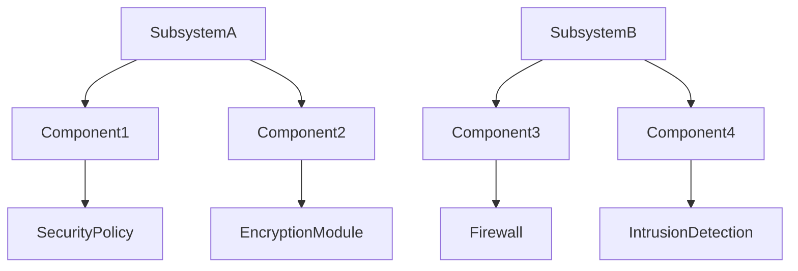
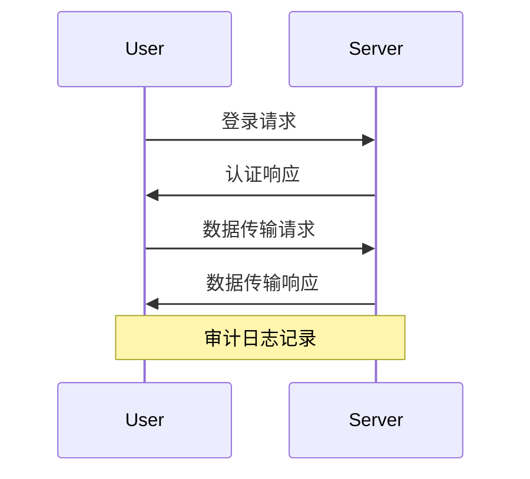

                 

### 《软件架构安全：设计阶段的安全考量》

#### 关键词：
- 软件架构安全
- 设计阶段
- 安全考量
- 需求分析
- 架构设计
- 安全模式

#### 摘要：
本文将深入探讨软件架构安全在设计阶段的重要性。通过对安全相关核心概念的分析，我们将探讨在软件架构设计中考虑安全的最佳实践，并提供系统架构设计和接口交互设计的详细案例。通过项目实战与案例分析，我们旨在为开发者提供实用的安全设计指南，以提高软件系统的整体安全性。

### 第一部分：软件架构安全概述

#### 第1章：软件架构安全的重要性与挑战

**1.1 问题背景**

随着信息技术的飞速发展，软件系统变得越来越复杂，安全威胁也日益多样化。软件架构安全成为确保系统稳定性和用户数据保护的关键因素。

**1.2 问题描述**

软件架构安全主要面临以下几个问题：
- 系统漏洞：恶意攻击者利用系统漏洞进行非法访问或数据篡改。
- 信息泄露：敏感数据在传输或存储过程中被窃取或泄露。
- 恶意软件：恶意程序通过系统漏洞植入，对系统造成破坏或窃取信息。

**1.3 问题解决**

解决软件架构安全问题需要从以下几个方面入手：
- 安全需求分析：明确系统安全需求，确保在设计阶段就考虑安全因素。
- 安全设计原则：遵循安全设计原则，提高系统抗攻击能力。
- 安全测试与审计：对系统进行安全测试和审计，及时发现并修复安全问题。

**1.4 边界与外延**

软件架构安全不仅涉及技术层面，还包括组织管理和法律规范。边界与外延的扩展使得软件架构安全成为一个系统性问题。

**1.5 概念结构与核心要素组成**

软件架构安全的概念结构包括以下几个方面：
- 安全需求：系统需要满足的安全要求。
- 安全机制：用于实现安全需求的机制，如加密、认证、访问控制等。
- 安全评估：对系统安全性进行评估和审计。
- 安全响应：针对安全事件进行响应和恢复。

### 第二部分：核心概念与联系

#### 第2章：安全相关核心概念解析

**2.1 安全性定义**

安全性是指系统在面临威胁时能够保持正常功能和服务的能力。安全性包括以下几个方面：
- 完整性：确保系统数据不被未经授权的篡改。
- 可用性：确保系统能够在需要时提供服务和响应请求。
- 机密性：确保系统中的敏感信息不被未授权者访问。

**2.2 安全属性对比表格**

安全性属性包括以下几种，可以通过表格进行对比：
- **属性** | **描述** | **重要程度**
- --- | --- | ---
- 完整性 | 防止数据被篡改 | 高
- 可用性 | 防止系统被攻击或拒绝服务 | 高
- 机密性 | 防止敏感信息泄露 | 高

**2.3 安全相关概念ER图**

通过ER图（实体关系图）来展示安全相关概念之间的联系：

```mermaid
erDiagram
  User ||--|{ AccessControl } : 有权限
  Resource ||--|{ AccessControl } : 受保护
  Service ||--|{ AccessControl } : 提供权限
  Threat ||--|{ Vulnerability } : 引起漏洞
  Vulnerability ||--|{ Exploit } : 被利用
  Attack ||--|{ Exploit } : 实施攻击
```

### 第三部分：软件架构设计中的安全考虑

#### 第3章：安全需求分析

**3.1 安全需求收集**

在软件架构设计阶段，首先需要收集安全需求。安全需求可以从以下几个方面进行收集：
- 业务需求：了解业务流程和用户需求，确保系统能够满足安全要求。
- 风险评估：识别系统面临的安全威胁和潜在漏洞，确定安全需求。

**3.2 安全需求建模**

通过需求建模工具，如用例图和需求规格说明书，将安全需求进行明确和规范。例如，可以使用以下用例图来描述安全需求：

```mermaid
usecase Security
  Security "-[具有安全性]-" "用户身份验证"
  Security "-[具有安全性]-" "访问控制"
  Security "-[具有安全性]-" "数据加密"
  Security "-[具有安全性]-" "安全审计"
```

**3.3 安全需求分析**

对安全需求进行分析和分类，以确保需求的可行性和一致性。分析方法包括以下几种：
- 需求评审：通过专家评审，对安全需求进行审查和评估。
- 需求验证：通过测试和验证，确保安全需求得到实现。

### 第四部分：系统架构中的安全考虑

#### 第4章：系统安全架构设计

**4.1 系统安全架构概述**

系统安全架构是指系统在安全方面所采用的整体设计方案。它包括以下组成部分：

- 安全策略：定义系统的安全目标和原则。
- 安全机制：实现安全策略的具体手段，如防火墙、加密技术等。
- 安全管理：负责安全策略的执行和监控。

**4.2 安全架构设计流程**

安全架构设计流程包括以下步骤：

1. 安全需求分析：明确系统的安全需求。
2. 安全架构设计：根据安全需求设计安全架构。
3. 安全机制实现：实现安全架构中的安全机制。
4. 安全测试与审计：对系统进行安全测试和审计。

**4.3 安全架构设计方案**

以下是一个简单的安全架构设计方案：



### 第五部分：系统接口与交互的安全设计

#### 第5章：系统接口与交互的安全设计

**5.1 系统接口安全设计**

系统接口安全设计包括以下方面：

- 接口认证：确保接口访问者具有合法权限。
- 数据完整性：确保接口传输的数据未被篡改。
- 传输加密：对接口传输的数据进行加密处理。

**5.2 系统交互安全设计**

系统交互安全设计包括以下方面：

- 安全协议：使用安全协议（如HTTPS）进行通信。
- 访问控制：对系统中的资源进行访问控制。
- 审计日志：记录系统交互过程中的日志，以便于后续审计。

**5.3 安全交互Mermaid序列图**

以下是一个简单的安全交互Mermaid序列图示例：



### 第六部分：项目实战与案例分析

#### 第7章：软件架构安全项目实战

**7.1 环境安装与配置**

在项目实战中，首先需要安装和配置所需的环境，包括开发工具、数据库和安全组件等。

**7.2 系统核心实现**

系统核心实现包括业务逻辑和安全管理模块。以下是一个简单的Python代码示例：

```python
import hashlib
import json

def hash_password(password):
    return hashlib.sha256(password.encode()).hexdigest()

def verify_password(password, hashed_password):
    return hash_password(password) == hashed_password

# 示例：用户登录
def login(username, password):
    hashed_password = fetch_hashed_password_from_database(username)
    if verify_password(password, hashed_password):
        return "登录成功"
    else:
        return "登录失败"

# 示例：数据加密与传输
def send_data(data):
    encrypted_data = encrypt_data(data)
    send_to_server(encrypted_data)

def receive_data():
    encrypted_data = receive_from_server()
    return decrypt_data(encrypted_data)
```

**7.3 代码应用解读与分析**

代码应用解读与分析包括以下几个方面：

- 密码安全：使用SHA-256对密码进行加密，防止明文存储。
- 访问控制：通过验证用户身份，确保只有授权用户可以访问系统。
- 数据加密：对敏感数据进行加密，防止数据泄露。

**7.4 实际案例分析与讲解**

实际案例分析与讲解可以从以下几个方面进行：

- 漏洞挖掘：利用工具进行漏洞挖掘，发现系统漏洞。
- 漏洞修复：针对发现的漏洞，进行修复和改进。
- 安全测试：对系统进行安全测试，验证安全性。

**7.5 项目小结**

项目小结可以从以下几个方面进行：

- 安全性评估：对项目进行安全性评估，确定安全性指标。
- 改进方向：根据评估结果，提出改进方向和措施。
- 最佳实践：总结项目中的最佳实践，为后续项目提供参考。

### 第七部分：最佳实践与拓展阅读

#### 第8章：最佳实践总结

**8.1 安全设计最佳实践**

安全设计最佳实践包括以下几个方面：

- 安全需求分析：明确安全需求，确保在设计阶段就考虑安全因素。
- 安全设计原则：遵循安全设计原则，提高系统抗攻击能力。
- 安全测试与审计：对系统进行安全测试和审计，及时发现并修复安全问题。

**8.2 小结与注意事项**

小结与注意事项包括以下几个方面：

- 安全性是一个持续的过程，需要定期进行安全评估和改进。
- 安全设计需要与业务需求相结合，确保系统既安全又可用。

#### 第9章：拓展阅读与深入研究

**9.1 最新安全研究动态**

最新安全研究动态包括以下几个方面：

- 加密技术：了解最新的加密算法和协议。
- 网络安全：研究最新的网络安全威胁和防御技术。
- 应用安全：探讨如何在应用层进行安全设计。

**9.2 拓展阅读推荐**

拓展阅读推荐包括以下几个方面：

- 《软件架构安全：设计阶段的安全考量》
- 《网络安全：设计与实践》
- 《加密技术与应用》

### 作者信息

作者：AI天才研究院/AI Genius Institute & 禅与计算机程序设计艺术 /Zen And The Art of Computer Programming

本文以深入浅出的方式，系统地介绍了软件架构安全在设计阶段的重要性、核心概念、安全需求分析、安全设计原则与模式、系统架构设计、接口与交互设计以及项目实战与案例分析。通过本文的阅读，开发者可以更好地理解软件架构安全，并将其应用到实际项目中，提高软件系统的安全性。同时，本文也提供了丰富的拓展阅读资源，为读者进一步深入研究和学习提供了方向。在未来的工作中，我们应不断关注安全领域的最新动态，持续提升软件架构安全水平，确保系统的稳定运行和用户数据的安全。作者：AI天才研究院/AI Genius Institute & 禅与计算机程序设计艺术 /Zen And The Art of Computer Programming。

