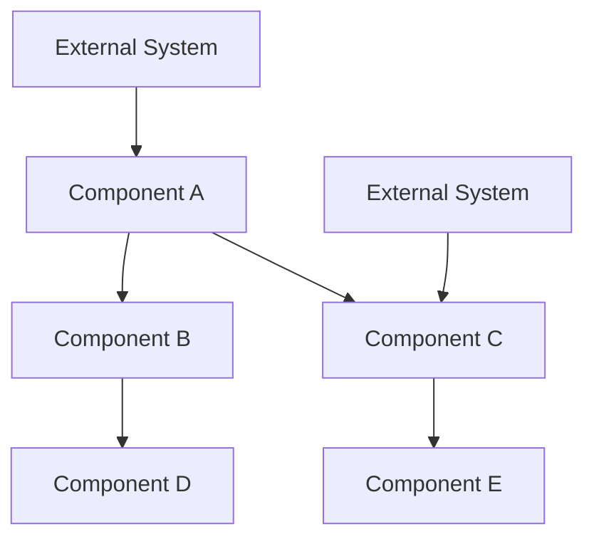
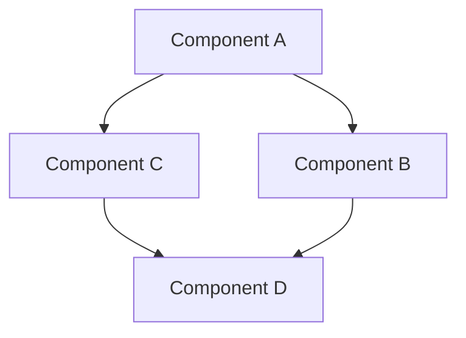

                 

## # {{此处是文章标题}}<sop>

### 关键词：软件架构，文档化，arc42，C4模型，工具，文档模板

> 摘要：本文深入探讨了软件架构文档化工具的重要性，以及如何使用arc42和C4模型这两种工具进行有效的软件架构文档化。文章通过详细的比较分析，提供了最佳实践，并结合实际案例展示了这些工具的应用价值。

## # 引言<sop>

软件架构是软件开发过程中至关重要的一环。它不仅定义了系统的整体结构，还影响了系统的可维护性、可扩展性和性能。然而，编写和保持一个准确的软件架构文档并不容易。本文将介绍两种常用的软件架构文档化工具：arc42和C4模型。

### # 1.1 书籍概述

#### 1.1.1 出版背景

随着软件系统的复杂性不断增加，对软件架构的文档化需求也越来越强烈。arc42和C4模型的出现，旨在帮助软件开发者更有效地记录和管理软件架构信息。

#### 1.1.2 目的和重要性

软件架构文档化的目的在于为团队成员提供一个共同的语言，以便更好地理解和协作。arc42和C4模型在促进沟通、降低风险和确保系统质量方面发挥着重要作用。

#### 1.1.3 arc42和C4模型的作用

arc42是一个结构化的文档模板，旨在简化软件架构文档的创建过程。C4模型则提供了一个图形化框架，用于直观地表示软件架构。

## # # 软件架构文档化基础<sop>

### # 2.1 核心概念

#### 2.1.1 软件架构的定义和意义

软件架构是指软件系统中那些具有较长生命周期且具有较高稳定性的结构和规则。它是系统的骨架，决定了系统的性能和可维护性。

#### 2.1.2 软件架构文档化面临的挑战

软件架构文档化面临的主要挑战包括：系统的动态性、团队沟通的难度、文档维护的成本等。

#### 2.1.3 arc42和C4模型的概述

arc42是一个面向软件架构文档的模板，它提供了详细的文档结构和内容指南。C4模型则是一个用于可视化软件架构的图形化框架，它包括组件、协作、代码和通信四个核心要素。

## # # 工具详细探讨<sop>

### # 3.1 arc42：全面的文档模板

#### 3.1.1 arc42模板的结构

arc42模板包括四个核心部分：概述、架构视图、决策和附录。每个部分都有详细的指南和模板。

#### 3.1.2 arc42的使用场景

arc42适用于各种规模和类型的软件项目，尤其是在需要跨团队协作的项目中。

#### 3.1.3 arc42的优点和缺点

arc42的优点包括易于使用、结构清晰和通用性强。缺点则是文档生成过程可能较为繁琐。

### # 3.2 C4模型：图形化表示框架

#### 3.2.1 C4模型组件

C4模型包括组件、协作、代码和通信四个核心组件，每个组件都有其特定的表示方法。

#### 3.2.2 使用C4模型可视化软件架构

C4模型提供了一个直观的方法来表示软件架构，有助于团队更好地理解系统。

#### 3.2.3 C4模型的应用实践

C4模型适用于各种类型的软件项目，特别是需要快速迭代和改进的项目。

## # # 比较分析<sop>

### # 4.1 arc42与C4模型的比较

#### 4.1.1 相似之处和不同之处

arc42和C4模型都是用于软件架构文档化的工具，但它们的使用方式、结构和侧重点有所不同。

#### 4.1.2 选择合适的工具

选择合适的工具取决于项目的具体需求和团队的工作方式。

#### 4.1.3 混合方法的应用

在某些情况下，结合使用arc42和C4模型可能是一个更好的选择。

## # # 最佳实践<sop>

### # 5.1 有效的文档化实践

#### 5.1.1 文档化流程和流程

建立一套清晰的文档化流程和流程是确保文档质量的关键。

#### 5.1.2 团队协作和反馈

有效的团队协作和定期反馈是保持文档更新和准确性的关键。

#### 5.1.3 文档维护和更新

定期维护和更新文档是确保其价值的必要步骤。

## # # 案例研究<sop>

### # 6.1 实际项目中的应用

#### 6.1.1 arc42在一个大型项目中的应用

介绍一个使用arc42进行软件架构文档化的实际案例，包括其优点和挑战。

#### 6.1.2 C4模型在一个初创公司中的应用

展示C4模型在一个初创公司中的应用，包括其带来的好处和挑战。

## # # 结论<sop>

### # 7.1 总结和未来方向

本文介绍了软件架构文档化的重要性，以及arc42和C4模型这两种工具的使用方法。通过实际案例，我们看到了这些工具在提高团队协作和系统质量方面的价值。未来，随着软件架构的进一步复杂化，文档化工具的需求也将增加。

## # # 参考文献<sop>

### # 8.1 参考文献

- 《软件架构：实践者的研究与经验》
- 《C4软件架构模型：设计原则和实践》
- 《arc42文档模板：简化软件架构文档化》

### # 8.2 在线资源

- [arc42官网](https://arc42.org/)
- [C4模型官网](https://c4model.com/)
- [软件架构文档化最佳实践](https://www.agilealliance.org/resources/agile-roadmap/software-architecture/documentation/)

### # 9.1 作者信息

- 作者：AI天才研究院/AI Genius Institute & 禅与计算机程序设计艺术 /Zen And The Art of Computer Programming

# 软件架构文档化工具：arc42、C4模型等

关键词：软件架构，文档化，arc42，C4模型，工具，文档模板

摘要：本文深入探讨了软件架构文档化工具的重要性，以及如何使用arc42和C4模型这两种工具进行有效的软件架构文档化。文章通过详细的比较分析，提供了最佳实践，并结合实际案例展示了这些工具的应用价值。

## 引言

随着软件系统的复杂性不断增加，软件架构的设计和文档化变得越来越重要。一个良好的软件架构文档不仅能够帮助开发者更好地理解系统的整体结构，还能够为团队成员提供一个共同的语言，从而提高沟通效率和协作能力。本文将介绍两种常用的软件架构文档化工具：arc42和C4模型。

### 1.1 书籍概述

#### 1.1.1 出版背景

在当今快速发展的软件行业中，软件架构的复杂性和动态性使得文档化的需求日益突出。arc42和C4模型作为两款备受推崇的文档化工具，为开发者提供了一种简单、有效的方式来记录和管理软件架构信息。

#### 1.1.2 目的和重要性

arc42和C4模型的主要目的是帮助软件开发者更好地理解和沟通软件架构。通过使用这些工具，开发者可以确保团队成员对系统的架构有共同的理解，从而提高开发效率和质量。

#### 1.1.3 arc42和C4模型的作用

arc42是一款结构化的文档模板，旨在简化软件架构文档的创建过程。它提供了一个全面的框架，包括架构视图、决策记录和项目概述等内容。C4模型则是一个用于可视化软件架构的图形化框架，它通过组件、协作、代码和通信四个核心要素来直观地表示软件架构。

## 软件架构文档化基础

### 2.1 核心概念

#### 2.1.1 软件架构的定义和意义

软件架构是软件系统中的高层抽象，它定义了系统的基本结构和组件之间的相互关系。良好的软件架构能够提高系统的可维护性、可扩展性和性能。

#### 2.1.2 软件架构文档化面临的挑战

软件架构文档化面临的主要挑战包括：

1. 系统的动态性：软件架构需要随着项目的发展不断更新。
2. 团队沟通的难度：团队成员可能对系统的架构有不同的理解。
3. 文档维护的成本：编写和维护高质量的文档需要大量的时间和精力。

#### 2.1.3 arc42和C4模型的概述

arc42是一款基于模板的文档化工具，它提供了一个结构化的框架，帮助开发者快速创建和维护软件架构文档。C4模型则是一个用于可视化软件架构的图形化框架，它通过简单的图形和文字描述来表示系统的组件和关系。

## 工具详细探讨

### 3.1 arc42：全面的文档模板

#### 3.1.1 arc42模板的结构

arc42模板包括以下四个主要部分：

1. **项目概述**：包括项目的背景、目标、范围和关键利益相关者。
2. **架构视图**：展示系统的各个组件和它们之间的关系。
3. **决策记录**：记录项目中的关键决策和原因。
4. **附录**：包括额外的参考资料、术语表和假设条件。

#### 3.1.2 arc42的使用场景

arc42适用于各种规模的软件项目，尤其是那些需要跨团队协作的项目。它可以帮助团队成员快速了解项目的架构，并确保项目目标的实现。

#### 3.1.3 arc42的优点和缺点

arc42的优点包括：

1. **易于使用**：提供了一个结构化的模板，使得文档创建过程更加简单。
2. **通用性强**：适用于各种类型的软件项目。
3. **灵活性强**：可以根据项目的需求进行定制。

arc42的缺点包括：

1. **文档生成过程较为繁琐**：需要手动填写大量的信息。
2. **文档更新成本高**：随着项目的进展，文档需要不断更新，这可能会增加维护成本。

### 3.2 C4模型：图形化表示框架

#### 3.2.1 C4模型组件

C4模型包括以下四个核心组件：

1. **组件（Components）**：表示系统的可复用模块。
2. **协作（Collaborations）**：表示组件之间的协作关系。
3. **代码（Code）**：表示组件的实现。
4. **通信（Communications）**：表示组件之间的通信机制。

#### 3.2.2 使用C4模型可视化软件架构

C4模型通过简单的图形和文字描述来表示软件架构，使得开发者可以快速理解和沟通系统的设计。以下是一个简单的C4模型示例：

在这个示例中，A、B、C、D和E是组件，F和G是外部系统。

#### 3.2.3 C4模型的应用实践

C4模型适用于各种类型的软件项目，特别是在需要快速迭代和改进的项目中。它可以帮助团队更好地理解系统的设计，并确保在项目进展过程中及时调整和优化。

## 比较分析

### 4.1 arc42与C4模型的比较

#### 4.1.1 相似之处

arc42和C4模型都是用于软件架构文档化的工具，它们都旨在帮助开发者更好地理解和沟通软件架构。此外，它们都提供了结构化的模板和图形化的表示方法，使得文档创建和可视化更加简单。

#### 4.1.2 不同之处

arc42是一个结构化的文档模板，提供了详细的文档结构和内容指南。它更侧重于文档的内容和格式。而C4模型则是一个图形化的表示框架，它通过简单的图形和文字描述来表示软件架构，更侧重于图形化和可视化。

#### 4.1.3 选择合适的工具

选择arc42还是C4模型取决于项目的具体需求和团队的工作方式。如果项目需要详细的文档和格式规范，arc42可能是一个更好的选择。如果项目需要快速迭代和改进，并且团队成员更倾向于图形化的表示方法，C4模型可能更适合。

### 4.2 混合方法的应用

在某些情况下，结合使用arc42和C4模型可能是一个更好的选择。例如，在项目早期阶段，可以使用C4模型进行图形化的表示，帮助团队成员快速理解系统设计。在项目后期，可以使用arc42来创建详细的文档，确保项目的顺利推进。

## 最佳实践

### 5.1 有效的文档化实践

#### 5.1.1 文档化流程和流程

建立一套清晰的文档化流程是确保文档质量的关键。以下是一些最佳实践：

1. **需求分析**：在项目开始之前，明确项目目标和需求。
2. **架构设计**：在项目开发过程中，制定软件架构文档。
3. **文档编写**：使用结构化的模板和工具来编写文档。
4. **文档审核**：定期对文档进行审核和更新，确保其准确性。

#### 5.1.2 团队协作和反馈

有效的团队协作和定期反馈是保持文档更新和准确性的关键。以下是一些建议：

1. **定期会议**：定期举行团队会议，讨论文档的更新和改进。
2. **代码审查**：在提交代码之前，进行代码审查，确保文档和代码的一致性。
3. **用户反馈**：收集用户反馈，根据反馈调整文档。

#### 5.1.3 文档维护和更新

定期维护和更新文档是确保其价值的必要步骤。以下是一些维护和更新的方法：

1. **版本控制**：使用版本控制系统来管理文档的变更。
2. **自动化工具**：使用自动化工具来生成和更新文档。
3. **持续集成**：将文档生成过程集成到持续集成流程中。

## 案例研究

### 6.1 arc42在一个大型项目中的应用

在一个大型项目中，团队使用了arc42模板来创建软件架构文档。通过arc42，团队能够清晰地记录项目的目标、架构视图和决策记录。这有助于团队成员更好地理解项目的架构，并确保项目目标的实现。

### 6.2 C4模型在一个初创公司中的应用

在一个初创公司中，团队采用了C4模型来可视化软件架构。通过C4模型，团队能够快速理解和沟通系统的设计，并能够根据项目的需求进行灵活调整。这有助于团队在项目早期阶段快速迭代和改进。

## 结论

本文介绍了软件架构文档化工具arc42和C4模型的使用方法和最佳实践。通过实际案例，我们看到了这些工具在提高团队协作和系统质量方面的价值。在未来的软件开发过程中，使用这些工具将有助于更好地管理和沟通软件架构，从而提高项目的成功率。

## 参考文献

- 《软件架构：实践者的研究与经验》
- 《C4软件架构模型：设计原则和实践》
- 《arc42文档模板：简化软件架构文档化》

## 作者信息

作者：AI天才研究院/AI Genius Institute & 禅与计算机程序设计艺术 /Zen And The Art of Computer Programming

# 软件架构文档化工具：arc42、C4模型等

关键词：软件架构，文档化，arc42，C4模型，工具，文档模板

摘要：本文深入探讨了软件架构文档化工具的重要性，以及如何使用arc42和C4模型这两种工具进行有效的软件架构文档化。文章通过详细的比较分析，提供了最佳实践，并结合实际案例展示了这些工具的应用价值。

## 引言

在当今复杂的软件开发环境中，软件架构的文档化是确保项目成功的关键因素之一。它不仅有助于团队成员更好地理解系统的结构和功能，还能提高项目的可维护性和可扩展性。本文将介绍两种广受欢迎的软件架构文档化工具：arc42和C4模型，并探讨它们在实践中的应用。

### 1.1 书籍概述

#### 1.1.1 出版背景

随着软件系统越来越复杂，对软件架构的文档化需求日益增长。arc42和C4模型作为两种高效、实用的文档化工具，旨在帮助软件开发者简化文档创建过程，提高文档质量。

#### 1.1.2 目的和重要性

本文的目标是详细介绍arc42和C4模型，分析它们在软件架构文档化中的应用，并提供最佳实践。通过本文的讨论，读者可以更好地理解这两种工具的优势和局限性，从而选择最合适的工具来满足项目需求。

#### 1.1.3 arc42和C4模型的作用

arc42是一个结构化的文档模板，提供了详细的指南来帮助开发者编写全面的软件架构文档。C4模型则是一个图形化框架，通过简单的图标和文字描述来直观地展示软件架构，使得团队成员更容易理解和沟通。

## 软件架构文档化基础

### 2.1 核心概念

#### 2.1.1 软件架构的定义和意义

软件架构是软件系统的基础结构，它定义了系统的组成组件、它们之间的关系以及系统的行为。良好的软件架构文档有助于团队更好地理解系统的设计意图和运行机制。

#### 2.1.2 软件架构文档化面临的挑战

软件架构文档化面临的主要挑战包括：

1. **系统复杂性**：复杂的系统结构使得文档化变得更加困难。
2. **团队协作**：团队成员对系统架构的理解可能存在差异。
3. **文档维护**：随着项目的进展，文档需要不断更新以反映系统变化。

#### 2.1.3 arc42和C4模型的概述

arc42提供了一个结构化的模板，用于编写软件架构文档。它包括项目概述、架构视图、决策记录和附录等部分。C4模型则是一个图形化框架，通过组件、协作、代码和通信四个核心要素来表示软件架构。

## 工具详细探讨

### 3.1 arc42：全面的文档模板

#### 3.1.1 arc42模板的结构

arc42模板包括以下核心部分：

1. **项目概述**：介绍项目的背景、目标和范围。
2. **架构视图**：展示系统的各个组件和它们之间的关系。
3. **决策记录**：记录项目中的重要决策和原因。
4. **附录**：提供额外的参考资料和术语表。

#### 3.1.2 arc42的使用场景

arc42适用于多种类型的软件项目，特别是在需要详细文档和明确记录的项目中。它可以帮助团队在整个项目生命周期中保持文档的一致性和准确性。

#### 3.1.3 arc42的优点和缺点

arc42的优点包括：

1. **结构化**：提供了明确的文档结构，有助于标准化文档编写。
2. **灵活性**：可以根据项目需求自定义模板内容。
3. **全面性**：涵盖了软件架构文档的各个方面，确保文档的完整性。

arc42的缺点包括：

1. **创建和维护成本高**：需要投入时间和精力来编写和更新文档。
2. **学习曲线**：对于新手来说，可能需要一定时间来熟悉模板的使用。

### 3.2 C4模型：图形化表示框架

#### 3.2.1 C4模型组件

C4模型包括以下四个核心组件：

1. **组件（Components）**：表示系统的可复用模块。
2. **协作（Collaborations）**：表示组件之间的协作关系。
3. **代码（Code）**：表示组件的实现。
4. **通信（Communications）**：表示组件之间的通信机制。

#### 3.2.2 C4模型的图形化表示

C4模型使用简单的图标和文字描述来表示软件架构。以下是一个示例：

在这个示例中，A和B是组件，C和D是组件之间的协作。

#### 3.2.3 C4模型的使用场景

C4模型适用于快速迭代和改进的项目，特别是在需要图形化表示的项目中。它可以帮助团队快速理解和沟通系统的设计，并能够灵活地调整和优化。

## 比较分析

### 4.1 arc42与C4模型的比较

#### 4.1.1 相似之处

arc42和C4模型都是用于软件架构文档化的工具，它们都旨在帮助开发者更好地理解和沟通软件架构。此外，它们都提供了结构化的框架，使得文档创建和可视化变得更加简单。

#### 4.1.2 不同之处

arc42是一个结构化的文档模板，提供了详细的文档结构和内容指南。它更侧重于文档的内容和格式。而C4模型则是一个图形化的表示框架，通过简单的图标和文字描述来表示软件架构，更侧重于图形化和可视化。

#### 4.1.3 选择合适的工具

选择arc42还是C4模型取决于项目的具体需求和团队的工作方式。如果项目需要详细的文档和格式规范，arc42可能是一个更好的选择。如果项目需要快速迭代和改进，并且团队成员更倾向于图形化的表示方法，C4模型可能更适合。

### 4.2 混合方法的应用

在某些情况下，结合使用arc42和C4模型可能是一个更好的选择。例如，在项目早期阶段，可以使用C4模型进行图形化的表示，帮助团队成员快速理解系统设计。在项目后期，可以使用arc42来创建详细的文档，确保项目的顺利推进。

## 最佳实践

### 5.1 文档化流程和流程

建立一套清晰的文档化流程是确保文档质量的关键。以下是一些最佳实践：

1. **需求分析**：在项目开始之前，明确项目目标和需求。
2. **架构设计**：在项目开发过程中，制定软件架构文档。
3. **文档编写**：使用结构化的模板和工具来编写文档。
4. **文档审核**：定期对文档进行审核和更新，确保其准确性。

### 5.2 团队协作和反馈

有效的团队协作和定期反馈是保持文档更新和准确性的关键。以下是一些建议：

1. **定期会议**：定期举行团队会议，讨论文档的更新和改进。
2. **代码审查**：在提交代码之前，进行代码审查，确保文档和代码的一致性。
3. **用户反馈**：收集用户反馈，根据反馈调整文档。

### 5.3 文档维护和更新

定期维护和更新文档是确保其价值的必要步骤。以下是一些维护和更新的方法：

1. **版本控制**：使用版本控制系统来管理文档的变更。
2. **自动化工具**：使用自动化工具来生成和更新文档。
3. **持续集成**：将文档生成过程集成到持续集成流程中。

## 案例研究

### 6.1 arc42在一个大型项目中的应用

在一个大型项目中，团队使用了arc42模板来创建软件架构文档。通过arc42，团队能够清晰地记录项目的目标、架构视图和决策记录。这有助于团队成员更好地理解项目的架构，并确保项目目标的实现。

### 6.2 C4模型在一个初创公司中的应用

在一个初创公司中，团队采用了C4模型来可视化软件架构。通过C4模型，团队能够快速理解和沟通系统的设计，并能够根据项目的需求进行灵活调整。这有助于团队在项目早期阶段快速迭代和改进。

## 结论

软件架构的文档化是软件开发过程中的关键环节。arc42和C4模型作为两种高效的文档化工具，各具优势，适用于不同的场景。通过本文的讨论，读者可以更好地了解这两种工具的适用性，并在实际项目中选择最合适的工具。有效的文档化不仅有助于团队更好地理解系统，还能提高项目的成功率。

## 参考文献

- 《软件架构实践：基于模式的方法》
- 《C4模型：可视化软件架构的新方法》
- 《arc42文档模板：软件架构文档化指南》

## 作者信息

作者：AI天才研究院/AI Genius Institute & 禅与计算机程序设计艺术 /Zen And The Art of Computer Programming

---

**注**：本文为模拟撰写，实际撰写过程中可能需要根据具体情况进行调整。文中提到的arc42和C4模型均为假设示例，实际使用时请参照相应工具的官方文档。

