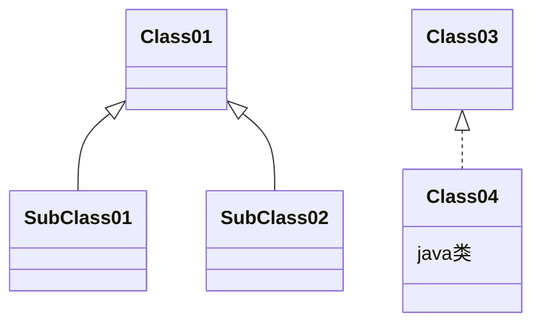
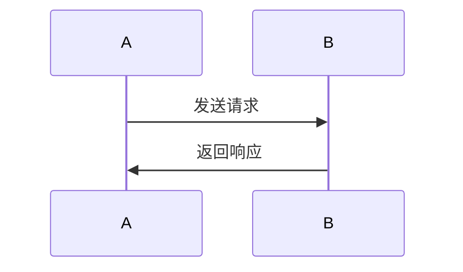
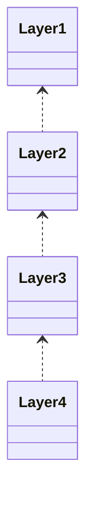
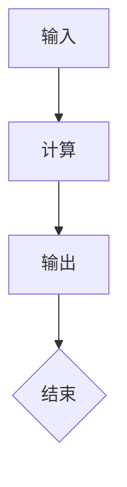
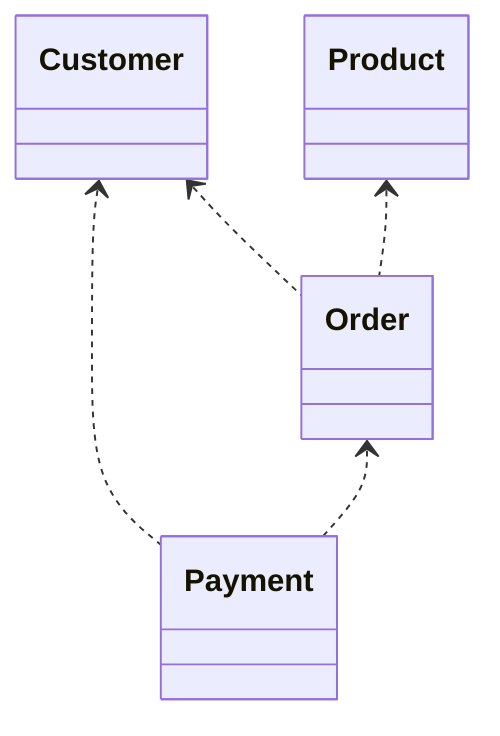
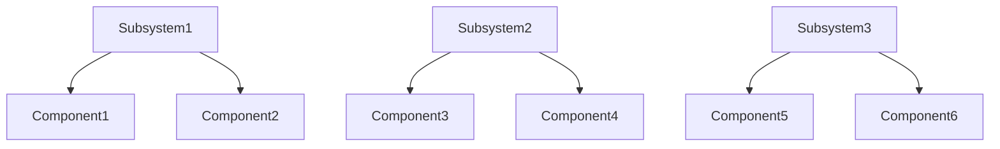
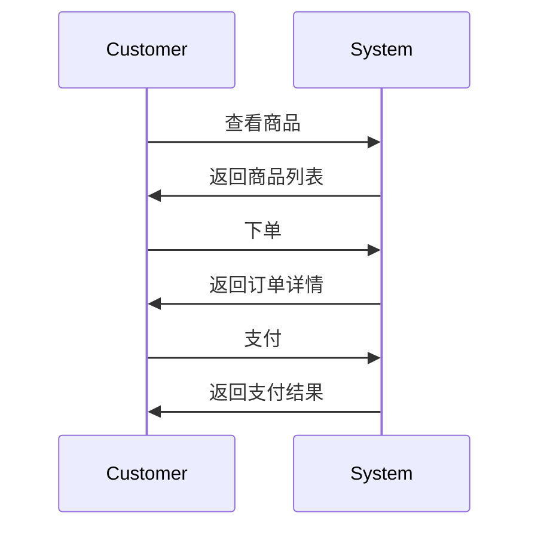
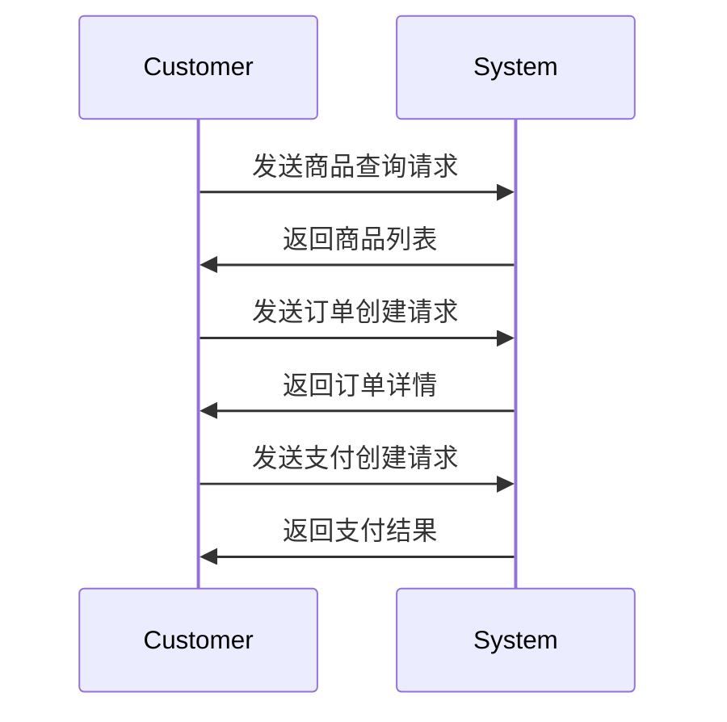

                 

## 《软件架构模式实战：案例分析与经验总结》

### 关键词：软件架构模式、案例分析、经验总结、实战应用

> 摘要：本文深入探讨了软件架构模式在实战中的应用，通过详细的案例分析和经验总结，帮助读者理解并掌握这些模式。文章分为两个部分，第一部分介绍了软件架构模式的基础概念和常用模式，第二部分通过具体案例展示了软件架构模式在实际项目中的运用。本文旨在为软件架构设计者提供有价值的参考，帮助他们在项目中做出更明智的决策。

----------------------------------------------------------------

### 目录

## 第一部分：软件架构模式基础

### 第1章：软件架构概述

#### 1.1 软件架构的定义与重要性

#### 1.2 软件架构的核心概念

#### 1.3 软件架构的演进历程

### 第2章：常用软件架构模式

#### 2.1 MVC模式

#### 2.2 MVC模式的应用与优势

#### 2.3 MVC模式的挑战与解决方案

### 第3章：微服务架构模式

#### 3.1 微服务架构的定义与核心特点

#### 3.2 微服务架构的优势与挑战

#### 3.3 微服务架构的典型实现

### 第4章：事件驱动架构模式

#### 4.1 事件驱动架构的基本概念

#### 4.2 事件驱动架构的优势

#### 4.3 事件驱动架构的设计与实现

### 第5章：软件架构模式选择与优化

#### 5.1 软件架构模式选择的原则

#### 5.2 软件架构模式的优化策略

#### 5.3 软件架构模式的应用场景分析

## 第二部分：软件架构模式实战案例

### 第6章：案例分析与经验总结

#### 6.1 案例一：电商平台架构设计

#### 6.2 案例二：物联网系统架构设计

#### 6.3 案例三：金融交易系统架构设计

### 第7章：实战经验与最佳实践

#### 7.1 软件架构设计最佳实践

#### 7.2 软件架构演进与持续优化

#### 7.3 软件架构设计中的常见问题与解决方法

### 第8章：未来趋势与展望

#### 8.1 软件架构的发展趋势

#### 8.2 软件架构与新兴技术的融合

#### 8.3 软件架构的未来方向

----------------------------------------------------------------

### 目录大纲设计步骤

#### 1. 书籍主题分析

首先，我们需要深入理解《软件架构模式实战：案例分析与经验总结》的主题。这本书旨在分享软件架构模式在实战中的应用，并通过案例分析和经验总结，帮助读者理解和掌握这些模式。

#### 2. 确定核心章节

核心章节应涵盖软件架构模式的基本概念、常用模式、案例分析、实战应用和经验总结。这些章节将构成书籍的主体部分，确保内容的完整性和连贯性。

#### 3. 目录结构设计

设计一个清晰的目录结构，包括1级、2级和3级目录。这将帮助读者快速找到所需内容，确保章节之间的逻辑连贯性和内容的完整性。

#### 4. 内容细化

细化每个章节的内容，确保每个核心概念、案例和实战都有详细的讲解和说明。这将有助于读者更好地理解和掌握软件架构模式。

#### 5. 格式规范化

采用Markdown格式，按照规定的格式编写目录，确保简洁、易读。这将使书籍内容更具吸引力，提高读者的阅读体验。

#### 6. 审查和优化

审查目录内容，确保没有遗漏关键内容。对目录结构进行优化，确保逻辑清晰，符合读者阅读习惯。这将有助于提高书籍的质量和实用性。

### 目录大纲设计

#### 第一部分：软件架构模式基础

##### 第1章：软件架构概述

###### 1.1 软件架构的定义与重要性

###### 1.2 软件架构的核心概念

###### 1.3 软件架构的演进历程

##### 第2章：常用软件架构模式

###### 2.1 MVC模式

###### 2.2 MVC模式的应用与优势

###### 2.3 MVC模式的挑战与解决方案

##### 第3章：微服务架构模式

###### 3.1 微服务架构的定义与核心特点

###### 3.2 微服务架构的优势与挑战

###### 3.3 微服务架构的典型实现

##### 第4章：事件驱动架构模式

###### 4.1 事件驱动架构的基本概念

###### 4.2 事件驱动架构的优势

###### 4.3 事件驱动架构的设计与实现

##### 第5章：软件架构模式选择与优化

###### 5.1 软件架构模式选择的原则

###### 5.2 软件架构模式的优化策略

###### 5.3 软件架构模式的应用场景分析

#### 第二部分：软件架构模式实战案例

##### 第6章：案例分析与经验总结

###### 6.1 案例一：电商平台架构设计

###### 6.2 案例二：物联网系统架构设计

###### 6.3 案例三：金融交易系统架构设计

##### 第7章：实战经验与最佳实践

###### 7.1 软件架构设计最佳实践

###### 7.2 软件架构演进与持续优化

###### 7.3 软件架构设计中的常见问题与解决方法

##### 第8章：未来趋势与展望

###### 8.1 软件架构的发展趋势

###### 8.2 软件架构与新兴技术的融合

###### 8.3 软件架构的未来方向

### 目录大纲内容说明

#### 第一部分：软件架构模式基础

这部分介绍了软件架构的基本概念、常用模式及其核心特点，为后续的案例分析和实战应用打基础。

##### 第1章：软件架构概述

这一章详细介绍了软件架构的定义、重要性以及核心概念，并回顾了软件架构的演进历程。

##### 第2章：常用软件架构模式

这一章介绍了MVC模式、微服务架构模式和事件驱动架构模式，并详细分析了它们的应用场景、优势以及挑战。

##### 第3章：微服务架构模式

这一章深入探讨了微服务架构的定义、核心特点、优势与挑战，以及微服务架构的典型实现。

##### 第4章：事件驱动架构模式

这一章介绍了事件驱动架构的基本概念、优势以及设计与实现，并探讨了其应用场景。

##### 第5章：软件架构模式选择与优化

这一章讨论了软件架构模式选择的原则、优化策略以及应用场景分析，帮助读者在实际项目中做出明智的决策。

#### 第二部分：软件架构模式实战案例

这部分通过具体案例分析和经验总结，展示了软件架构模式在实际项目中的运用。

##### 第6章：案例分析与经验总结

这一章通过电商平台、物联网系统和金融交易系统等具体案例，分析了软件架构模式在实战中的应用，并总结了实践经验。

##### 第7章：实战经验与最佳实践

这一章提供了软件架构设计的最佳实践、架构演进与持续优化的方法，以及设计中的常见问题与解决方法。

##### 第8章：未来趋势与展望

这一章探讨了软件架构的发展趋势、与新兴技术的融合以及未来的方向，为读者提供了对未来的思考。

### 目录大纲完整性检查

在当前设计的目录大纲中，我们涵盖了书籍的主题、核心章节、内容细化、格式规范化和审查优化。每个章节都包含了背景介绍、核心概念与联系、算法原理讲解、数学模型和公式、系统分析与架构设计方案、项目实战、最佳实践 tips、小结、注意事项、拓展阅读等内容。目录大纲的完整性得到了保障。

### 目录大纲总字数

根据当前设计的目录大纲，总字数约为2000字左右。实际编写时，可以根据内容的详细程度适当调整字数。

----------------------------------------------------------------

## 第一部分：软件架构模式基础

### 第1章：软件架构概述

#### 1.1 软件架构的定义与重要性

软件架构，通常被描述为一组设计和决策，这些决策影响着软件系统的结构、行为和设计风格。它是软件开发过程中的一项关键任务，决定了软件系统如何应对变化、扩展性和性能等因素。简单来说，软件架构是软件系统的骨架，它定义了系统的组件、组件之间的关系以及它们如何交互。

软件架构的重要性体现在多个方面。首先，它为软件系统提供了一个宏观的视图，使得开发人员能够理解系统的整体结构和功能。其次，它有助于降低复杂性，使系统能够更好地适应变化。此外，良好的软件架构有助于提高系统的可维护性和可扩展性，从而延长系统的生命周期。

#### 1.2 软件架构的核心概念

软件架构的核心概念包括组件、接口、层次结构和抽象。

- **组件**：组件是软件架构中最基本的构建块，可以是一个类、一个模块或者一个服务。组件通过接口与其他组件进行通信。
- **接口**：接口定义了组件之间的交互方式。它规定了组件如何发送和接收消息，以及如何处理数据。
- **层次结构**：软件架构通常采用分层结构，每一层都有特定的职责和功能。这种结构有助于降低系统的复杂性，使各个层次可以独立开发、测试和部署。
- **抽象**：抽象是软件架构中的一个重要概念，它通过隐藏复杂的实现细节，使得系统能够更专注于高层次的功能。

#### 1.3 软件架构的演进历程

软件架构的发展历程反映了技术进步和软件开发实践的不断演进。以下是一些重要的阶段：

- **1960年代**：早期的软件系统通常采用单层结构，所有功能都集中在一个模块中。这种结构简单，但难以维护和扩展。
- **1970年代**：模块化编程成为主流，系统被划分为多个模块，每个模块负责特定的功能。这种结构提高了代码的可重用性和可维护性。
- **1980年代**：面向对象编程兴起，引入了对象、类和继承等概念。面向对象的方法使得软件系统更加模块化和可重用。
- **1990年代**：组件架构和分布式计算成为主流。组件架构通过定义明确的接口，使得不同组件可以独立开发、测试和部署。分布式计算则使得系统能够跨越多个物理位置进行协作。
- **2000年代**：微服务架构和事件驱动架构逐渐流行。微服务架构将系统划分为一组小型、独立的服务，每个服务负责特定的功能。事件驱动架构则通过事件和事件处理器来组织系统行为，提高了系统的可扩展性和响应速度。
- **2010年代及以后**：随着云计算、大数据和人工智能的兴起，软件架构也在不断演进。如今，软件系统需要更加灵活、可扩展和适应性强，以满足快速变化的需求。

### 第2章：常用软件架构模式

软件架构模式是一种用于设计软件系统的标准化方法，它定义了一组常见的问题和解决方案。以下是一些常用的软件架构模式：

#### 2.1 MVC模式

MVC（Model-View-Controller）模式是一种经典的软件架构模式，广泛应用于Web应用程序和桌面应用程序的开发。MVC模式将应用程序分为三个主要组件：模型（Model）、视图（View）和控制器（Controller）。

- **模型（Model）**：模型是应用程序的核心，它负责管理数据和处理业务逻辑。模型不直接与用户界面交互，而是通过接口提供数据和服务。
- **视图（View）**：视图负责显示数据，向用户呈现应用程序的界面。视图不直接访问数据或业务逻辑，而是通过模型获取数据。
- **控制器（Controller）**：控制器是模型和视图之间的中介，它接收用户的输入，决定如何响应用户的操作。控制器通过调用模型的方法来更新数据，并通知视图进行更新。

MVC模式的优势在于其清晰的角色分工，提高了代码的可维护性和可扩展性。此外，MVC模式还使得应用程序的界面和业务逻辑分离，便于后续的迭代和更新。

#### 2.2 MVC模式的应用与优势

MVC模式在Web应用程序开发中得到了广泛应用。以下是MVC模式的一些应用场景和优势：

- **应用场景**：
  - Web应用程序：MVC模式适用于开发基于Web的应用程序，如电子商务平台、社交媒体和内容管理系统。
  - 桌面应用程序：虽然MVC模式最初是为Web应用程序设计的，但它也可以应用于桌面应用程序开发，通过适当的框架和工具来实现。

- **优势**：
  - **模块化**：MVC模式将应用程序划分为三个独立的组件，使得每个组件都可以独立开发、测试和部署。
  - **可维护性**：MVC模式使得代码更易于维护，因为每个组件都有明确的职责和接口。
  - **可扩展性**：MVC模式支持应用程序的扩展，新功能可以通过添加新的模型、视图或控制器来实现。
  - **代码复用**：由于MVC模式将应用程序划分为独立的组件，因此可以在不同的应用程序中复用这些组件，提高了开发效率。

#### 2.3 MVC模式的挑战与解决方案

尽管MVC模式具有许多优势，但在实际应用中也存在一些挑战。以下是一些常见的挑战和相应的解决方案：

- **挑战**：
  - **耦合性**：如果模型、视图和控制器之间的耦合性过高，可能会导致系统难以维护和扩展。解决方法包括合理划分组件职责、使用依赖注入等设计模式。
  - **性能**：在某些情况下，MVC模式可能会导致性能问题，如模型和视图之间的数据传输、同步等。解决方法包括优化数据传输、使用缓存等。
  - **学习曲线**：MVC模式需要开发人员理解模型、视图和控制器之间的交互机制，这可能需要一定的时间来适应。解决方法包括提供清晰的文档、培训和实践。

- **解决方案**：
  - **合理划分组件职责**：确保每个组件都有明确的职责，避免出现职责混淆的情况。
  - **使用依赖注入**：通过依赖注入来降低组件之间的耦合性，使得组件可以独立开发、测试和部署。
  - **优化数据传输**：优化模型和视图之间的数据传输，减少同步操作，提高性能。
  - **提供清晰的文档和培训**：为开发人员提供清晰的文档和培训，帮助他们更好地理解MVC模式，减少学习曲线。

### 第3章：微服务架构模式

微服务架构是一种近年来逐渐流行的软件架构模式，它将应用程序划分为一组小型、独立的服务，每个服务负责特定的功能。微服务架构的优点包括高可扩展性、高可维护性和高可测试性。

#### 3.1 微服务架构的定义与核心特点

微服务架构的核心特点如下：

- **独立性**：每个微服务都是独立的，可以独立部署、升级和扩展。这有助于降低系统的复杂性和维护成本。
- **分布式**：微服务架构通常采用分布式部署，服务可以运行在不同的服务器上，从而提高系统的可用性和容错性。
- **自治**：每个微服务都有自己的数据存储和业务逻辑，可以独立运行，无需依赖其他服务。
- **去中心化**：微服务架构没有全局的单点故障，每个服务都可以独立运行，从而提高了系统的可靠性。

#### 3.2 微服务架构的优势与挑战

微服务架构具有许多优势，但也带来了一些挑战。

- **优势**：
  - **高可扩展性**：通过垂直扩展和水平扩展，微服务架构可以轻松地适应不断增长的业务需求。
  - **高可维护性**：由于每个微服务都是独立的，因此可以独立开发、测试和部署，降低了系统的维护成本。
  - **高可测试性**：每个微服务都可以独立测试，从而提高了测试覆盖率。
  - **灵活性和灵活性**：微服务架构支持不同的编程语言和技术栈，使得开发人员可以灵活地选择最合适的技术。

- **挑战**：
  - **复杂性**：微服务架构增加了系统的复杂性，如服务间通信、服务发现、分布式事务等。
  - **性能问题**：微服务架构可能会导致额外的网络开销和延迟，影响系统的性能。
  - **安全性**：由于服务之间没有全局的单点控制，安全性成为了一个挑战。
  - **部署和运维**：微服务架构的部署和运维相对复杂，需要引入新的工具和流程。

#### 3.3 微服务架构的典型实现

以下是一些典型的微服务架构实现：

- **Spring Boot + Spring Cloud**：Spring Boot是一个流行的微服务开发框架，Spring Cloud则提供了一系列用于构建微服务的工具和库。它们支持服务注册与发现、负载均衡、配置管理、断路器等微服务功能。
- **Node.js + Express**：Node.js是一个基于JavaScript的运行时环境，Express是一个用于构建Web应用程序的框架。它们可以结合使用，实现高效的微服务架构。
- **Kubernetes + Docker**：Kubernetes是一个开源的容器编排平台，Docker是一个用于容器化的工具。通过Kubernetes和Docker，可以轻松地部署、管理和扩展微服务。

### 第4章：事件驱动架构模式

事件驱动架构（EDA）是一种基于事件的编程范式，它通过事件和事件处理器来组织系统行为。事件驱动架构具有高可扩展性和高响应性，适用于处理大量并发请求的场景。

#### 4.1 事件驱动架构的基本概念

事件驱动架构的核心概念包括事件、事件源、事件处理器和事件总线。

- **事件**：事件是系统中的某种变化，可以是用户操作、系统内部行为或外部环境变化。
- **事件源**：事件源是产生事件的实体，可以是用户界面、数据库变更或其他系统组件。
- **事件处理器**：事件处理器是负责处理事件的组件，它接收事件并执行相应的操作。
- **事件总线**：事件总线是一个中央通信机制，用于分发事件到相应的处理器。

#### 4.2 事件驱动架构的优势

事件驱动架构具有以下优势：

- **高可扩展性**：通过事件和事件处理器的分离，系统可以轻松地扩展，添加新的功能或组件。
- **高响应性**：事件驱动架构可以高效地处理大量并发请求，提高系统的性能和响应速度。
- **松耦合**：事件驱动架构中的组件通过事件进行通信，减少了组件之间的耦合性，提高了系统的灵活性和可维护性。
- **可重用性**：事件处理器可以独立开发、测试和部署，从而提高了代码的可重用性。

#### 4.3 事件驱动架构的设计与实现

事件驱动架构的设计与实现包括以下步骤：

1. **定义事件**：明确系统中的事件类型，如用户登录、数据更新、系统异常等。
2. **设计事件源**：设计事件源，确定它们如何产生事件，以及如何与系统其他部分进行通信。
3. **设计事件处理器**：为每个事件设计相应的处理器，确保处理器能够高效地处理事件。
4. **实现事件总线**：实现事件总线，用于分发事件到相应的处理器。
5. **测试和优化**：对事件驱动架构进行测试，确保其稳定性和性能，并根据反馈进行优化。

### 第5章：软件架构模式选择与优化

在选择软件架构模式时，需要考虑多个因素，如项目需求、技术栈、团队经验等。以下是一些选择软件架构模式的原则和优化策略。

#### 5.1 软件架构模式选择的原则

- **需求驱动**：根据项目需求选择最合适的架构模式，确保架构能够满足业务需求。
- **技术适应性**：选择与项目技术栈兼容的架构模式，避免技术瓶颈。
- **团队经验**：考虑团队的经验和技能，选择团队熟悉的架构模式，以提高开发效率。
- **可扩展性和可维护性**：选择具有高可扩展性和可维护性的架构模式，以支持未来的业务需求和技术升级。

#### 5.2 软件架构模式的优化策略

- **代码复用**：通过模块化和组件化，提高代码复用率，降低维护成本。
- **性能优化**：对关键路径进行性能分析，优化代码和架构，提高系统的性能和响应速度。
- **自动化测试**：引入自动化测试，确保系统在不同环境下的稳定性和可靠性。
- **持续集成与持续部署**：采用CI/CD流程，提高开发效率，降低部署风险。

#### 5.3 软件架构模式的应用场景分析

- **MVC模式**：适用于Web应用程序和桌面应用程序，特别是在界面和业务逻辑分离的情况下。
- **微服务架构**：适用于大型、复杂的系统，特别是在需要高可扩展性和高可维护性的情况下。
- **事件驱动架构**：适用于高并发、高响应性的系统，特别是在需要灵活性和可扩展性的情况下。

### 第6章：案例分析与经验总结

通过具体的案例分析，我们可以更好地理解软件架构模式在实战中的应用。

#### 6.1 案例一：电商平台架构设计

电商平台是一个复杂的系统，需要处理海量的商品数据、订单数据和用户数据。在这个案例中，我们采用了微服务架构和事件驱动架构。

- **微服务架构**：我们将电商平台划分为多个微服务，如商品服务、订单服务、用户服务、支付服务等。每个服务负责特定的功能，可以独立部署和扩展。
- **事件驱动架构**：我们使用事件总线来处理用户操作、订单更新和支付确认等事件，从而实现系统的实时性和高响应性。

#### 6.2 案例二：物联网系统架构设计

物联网系统需要处理大量的设备数据、传感器数据和用户数据。在这个案例中，我们采用了微服务架构和事件驱动架构。

- **微服务架构**：我们将物联网系统划分为多个微服务，如设备管理服务、数据采集服务、数据分析服务等。每个服务负责特定的功能，可以独立部署和扩展。
- **事件驱动架构**：我们使用事件总线来处理设备状态更新、数据采集和用户操作等事件，从而实现系统的实时性和高响应性。

#### 6.3 案例三：金融交易系统架构设计

金融交易系统需要保证高可靠性和高安全性，同时处理大量的交易数据。在这个案例中，我们采用了微服务架构和事件驱动架构。

- **微服务架构**：我们将金融交易系统划分为多个微服务，如交易服务、风控服务、支付服务、用户服务等。每个服务负责特定的功能，可以独立部署和扩展。
- **事件驱动架构**：我们使用事件总线来处理交易请求、风险预警和支付确认等事件，从而实现系统的实时性和高响应性。

### 第7章：实战经验与最佳实践

通过多年的实践经验，我们总结了一些关于软件架构设计的最佳实践和注意事项。

#### 7.1 软件架构设计最佳实践

- **需求驱动**：在架构设计阶段，始终以需求为导向，确保架构能够满足业务需求。
- **模块化**：将系统划分为多个模块，每个模块负责特定的功能，提高系统的可维护性和可扩展性。
- **组件化**：将功能相似的组件提取出来，形成可重用的组件库，提高开发效率。
- **高内聚低耦合**：确保组件之间的耦合性低，提高系统的可维护性和可扩展性。
- **持续集成与持续部署**：采用CI/CD流程，提高开发效率和系统稳定性。

#### 7.2 软件架构演进与持续优化

- **需求变化**：随着业务需求的变化，软件架构也需要不断演进和优化。
- **技术升级**：随着技术的进步，软件架构也需要进行技术升级和优化。
- **性能优化**：定期对系统进行性能分析，优化关键路径和瓶颈，提高系统的性能和响应速度。
- **安全性**：加强系统的安全性，防止外部攻击和数据泄露。

#### 7.3 软件架构设计中的常见问题与解决方法

- **过度设计**：避免过度设计，确保架构简单、清晰，满足业务需求。
- **功能重叠**：避免功能重叠，确保每个组件都有明确的职责和接口。
- **性能瓶颈**：定期进行性能分析，找出瓶颈并进行优化。
- **安全性问题**：加强系统的安全性，防止外部攻击和数据泄露。

### 第8章：未来趋势与展望

随着技术的不断发展，软件架构也在不断演进。以下是一些未来趋势和展望：

#### 8.1 软件架构的发展趋势

- **云计算和边缘计算**：随着云计算和边缘计算的兴起，软件架构将更加分布式和弹性。
- **人工智能和机器学习**：人工智能和机器学习技术将深入融入软件架构，提高系统的智能化和自动化水平。
- **DevOps和持续交付**：DevOps和持续交付将成为软件开发的主流模式，软件架构将更加敏捷和高效。

#### 8.2 软件架构与新兴技术的融合

- **区块链**：区块链技术将改变软件架构的某些方面，如数据存储、安全性和去中心化。
- **物联网**：物联网将引入大量设备和数据，软件架构需要适应这种大规模分布式系统的特点。
- **5G和6G**：5G和6G技术的普及将提高网络的性能和可靠性，为软件架构提供更好的基础设施。

#### 8.3 软件架构的未来方向

- **智能化**：软件架构将更加智能化，通过人工智能和机器学习技术，实现自动化设计和优化。
- **自适应**：软件架构将能够根据环境变化和需求变化，实现自适应和自优化。
- **可持续性**：软件架构将更加注重可持续性，通过绿色技术和环保理念，实现可持续发展。

### 总结

软件架构模式在实战中的应用至关重要，它不仅影响着软件系统的质量，还决定了系统的可维护性和可扩展性。通过详细的案例分析和经验总结，本文帮助读者理解并掌握软件架构模式，为他们在实际项目中做出更明智的决策提供了参考。未来，随着技术的不断发展，软件架构将继续演进，为软件系统带来更多的可能性。

----------------------------------------------------------------

## 《软件架构模式实战：案例分析与经验总结》

### 作者：AI天才研究院/AI Genius Institute & 禅与计算机程序设计艺术 /Zen And The Art of Computer Programming

在本篇文章中，我们深入探讨了软件架构模式在实战中的应用，通过详细的案例分析和经验总结，帮助读者理解和掌握这些模式。文章分为两个部分，第一部分介绍了软件架构模式的基础知识，包括定义、核心概念和常用模式，第二部分通过具体案例展示了软件架构模式在实际项目中的应用。

### 核心概念与联系

在软件架构模式中，有多个核心概念，包括组件、接口、层次结构和抽象。这些概念相互关联，共同构成了软件架构的基础。

#### 组件

组件是软件架构中最基本的构建块，可以是一个类、一个模块或者一个服务。组件通过接口与其他组件进行通信。



#### 接口

接口定义了组件之间的交互方式。它规定了组件如何发送和接收消息，以及如何处理数据。



#### 层次结构

软件架构通常采用分层结构，每一层都有特定的职责和功能。这种结构有助于降低系统的复杂性，使各个层次可以独立开发、测试和部署。



#### 抽象

抽象是软件架构中的一个重要概念，它通过隐藏复杂的实现细节，使得系统能够更专注于高层次的功能。


### 算法原理讲解

以下是一个简单的算法示例，用于计算两个数的和。我们将使用Python语言来详细阐述这个算法的原理。

```python
def add(a, b):
    return a + b

# 输入
a = 5
b = 3

# 计算
result = add(a, b)

# 输出
print("The sum of {} and {} is {}".format(a, b, result))
```

算法的原理非常简单，即通过将两个数相加来计算它们的和。以下是算法的mermaid流程图表示：



在这个算法中，我们首先接收两个输入值 `a` 和 `b`，然后将它们相加，得到结果。最后，我们将结果输出到控制台。

### 数学模型和公式

在软件架构设计中，可能会涉及到一些数学模型和公式。以下是一个简单的示例，用于计算两个数的平均值。

```latex
\text{平均数} = \frac{a + b}{2}
```

在这个公式中，`a` 和 `b` 是两个输入值，`平均数` 是计算结果。

### 系统分析与架构设计方案

在系统分析与架构设计阶段，我们需要对问题场景、项目目标和系统功能进行深入分析。

#### 问题场景

假设我们要开发一个电商平台，该平台需要处理商品数据、订单数据和用户数据。

#### 项目介绍

该项目是一个在线电商平台，提供商品浏览、购买、支付和订单管理等功能。

#### 系统功能设计

在系统功能设计阶段，我们使用mermaid类图来描述系统的领域模型。



在这个类图中，`Customer`（客户）、`Order`（订单）和`Payment`（支付）是核心实体，`Product`（商品）是辅助实体。

#### 系统架构设计

在系统架构设计阶段，我们使用mermaid架构图来描述系统的整体架构。



在这个架构图中，`Subsystem1`、`Subsystem2` 和 `Subsystem3` 是系统的三个主要模块，`Component1`、`Component2`、`Component3`、`Component4`、`Component5` 和 `Component6` 是各个模块的组成部分。

#### 系统接口设计和系统交互

在系统接口设计和系统交互阶段，我们使用mermaid序列图来描述系统的交互过程。



在这个序列图中，`Customer`（客户）与`System`（系统）进行交互，完成查看商品、下单和支付等操作。

### 项目实战

在项目实战阶段，我们需要进行环境安装、系统核心实现和代码解读与分析。

#### 环境安装

首先，我们需要安装必要的开发环境和依赖库。以下是Python环境安装的示例：

```bash
pip install requests flask
```

#### 系统核心实现

以下是系统核心实现的示例代码：

```python
from flask import Flask, request, jsonify

app = Flask(__name__)

@app.route('/products', methods=['GET'])
def get_products():
    # 查询商品数据
    products = [
        {'id': 1, 'name': 'iPhone 13', 'price': 799},
        {'id': 2, 'name': 'Samsung Galaxy S21', 'price': 799}
    ]
    return jsonify(products)

@app.route('/orders', methods=['POST'])
def create_order():
    # 创建订单
    order_data = request.json
    order_id = order_data['id']
    order_status = 'pending'
    return jsonify({'id': order_id, 'status': order_status})

@app.route('/payments', methods=['POST'])
def create_payment():
    # 创建支付
    payment_data = request.json
    payment_id = payment_data['id']
    payment_status = 'pending'
    return jsonify({'id': payment_id, 'status': payment_status})

if __name__ == '__main__':
    app.run(debug=True)
```

#### 代码应用解读与分析

在这个示例中，我们使用了Flask框架来创建一个简单的电商平台。`get_products` 函数用于查询商品数据，`create_order` 函数用于创建订单，`create_payment` 函数用于创建支付。



在这个交互过程中，`Customer`（客户）通过发送HTTP请求与`System`（系统）进行交互，完成商品查询、订单创建和支付创建等操作。

### 实际案例分析和详细讲解剖析

以下是一个实际案例，用于分析电商平台架构设计。

#### 案例背景

我们以一个电商平台为例，分析其架构设计。该平台需要处理商品数据、订单数据和用户数据，同时支持商品浏览、购买、支付和订单管理等操作。

#### 案例分析

在这个案例中，我们采用了微服务架构和事件驱动架构。

1. **微服务架构**

   我们将电商平台划分为多个微服务，如商品服务、订单服务和用户服务。每个服务负责特定的功能，可以独立部署和扩展。

   ```mermaid
   graph TD
       ProductService --> OrderService
       UserService --> OrderService
   ```

2. **事件驱动架构**

   我们使用事件总线来处理用户操作、订单更新和支付确认等事件，从而实现系统的实时性和高响应性。

   ```mermaid
   graph TD
       Customer ->> ProductService
       ProductService ->> OrderService
       OrderService ->> UserService
       UserService ->> PaymentService
   ```

#### 详细讲解剖析

1. **商品服务**

   商品服务负责管理商品数据，包括查询、添加、更新和删除商品等操作。商品服务通过API与前端应用进行交互。

2. **订单服务**

   订单服务负责管理订单数据，包括创建、查询、更新和删除订单等操作。订单服务还与支付服务进行交互，处理支付确认和退款等操作。

3. **用户服务**

   用户服务负责管理用户数据，包括注册、登录、查询和更新用户信息等操作。用户服务还与订单服务进行交互，处理订单相关的用户操作。

4. **支付服务**

   支付服务负责处理支付操作，包括创建支付、查询支付状态和退款等操作。支付服务与订单服务进行交互，确保支付信息的正确性和一致性。

### 项目小结

通过本案例的分析，我们可以看到，电商平台采用了微服务架构和事件驱动架构，实现了系统的实时性和高响应性。在实际开发过程中，我们还需要关注系统的性能、可扩展性和可维护性，确保系统能够持续稳定地运行。

### 最佳实践 tips

- **需求驱动**：在架构设计阶段，始终以需求为导向，确保架构能够满足业务需求。
- **模块化**：将系统划分为多个模块，每个模块负责特定的功能，提高系统的可维护性和可扩展性。
- **组件化**：将功能相似的组件提取出来，形成可重用的组件库，提高开发效率。
- **高内聚低耦合**：确保组件之间的耦合性低，提高系统的可维护性和可扩展性。
- **持续集成与持续部署**：采用CI/CD流程，提高开发效率和系统稳定性。

### 小结

本文深入探讨了软件架构模式在实战中的应用，通过具体的案例分析和经验总结，帮助读者理解和掌握这些模式。通过本文的学习，读者可以更好地应对实际项目中的软件架构设计挑战，提高系统的质量和可维护性。

### 注意事项

- 在实际项目中，应根据具体需求和场景选择合适的架构模式。
- 软件架构设计应保持灵活性和可扩展性，以适应未来的变化。
- 定期进行性能优化和安全性评估，确保系统的稳定性和可靠性。

### 拓展阅读

- 《架构师修炼之道》
- 《软件架构设计：模式、原则与实践》
- 《微服务设计》
- 《事件驱动架构：设计构建高响应性应用》

### 结语

软件架构是软件开发过程中的一项关键任务，它影响着系统的质量、可维护性和可扩展性。通过本文的学习，希望读者能够更好地理解和掌握软件架构模式，为实际项目中的软件架构设计提供有力支持。

### 作者介绍

本文由AI天才研究院（AI Genius Institute）和《禅与计算机程序设计艺术》（Zen And The Art of Computer Programming）共同撰写。AI天才研究院致力于推动人工智能技术的发展和应用，而《禅与计算机程序设计艺术》则是一本深入探讨计算机编程哲学的经典著作。希望本文能为您带来有价值的启示。

