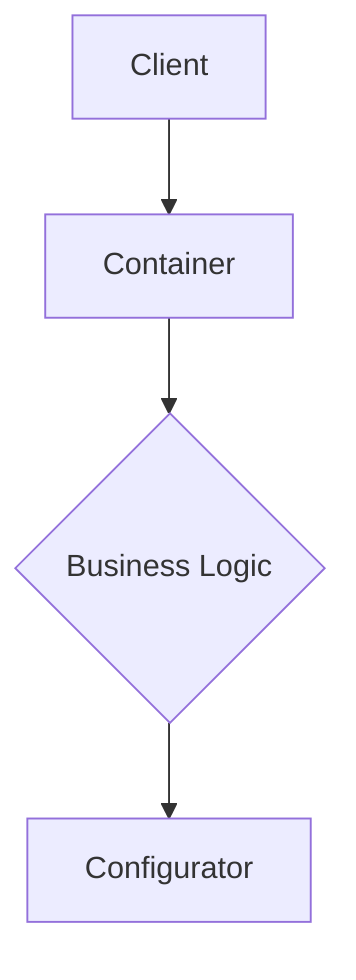
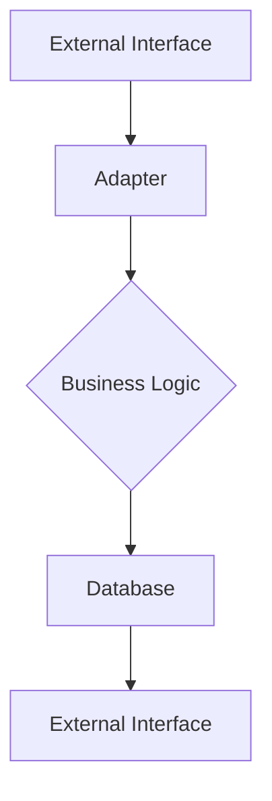
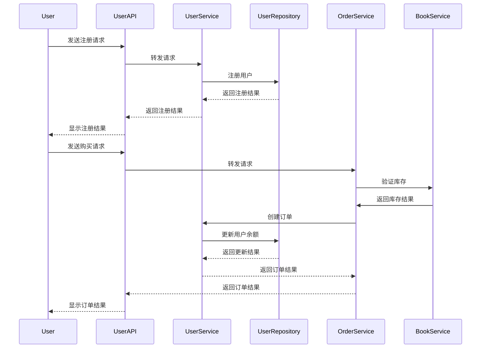

                 

## 软件架构演化：从单体到微服务

### 关键词：
- 软件架构
- 单体架构
- 微服务架构
- 架构演进
- 服务拆分
- 服务自治

### 摘要：
本文将深入探讨软件架构的演化过程，从传统的单体架构逐步过渡到现代的微服务架构。通过分析单体架构和微服务的特点，阐述架构演进的原因和趋势，并详细讨论微服务架构的设计原则和最佳实践。本文旨在为软件开发者提供清晰的理论指导和实践经验，助力他们在复杂项目中实现高效的架构设计和系统开发。

## 第一部分：软件架构演化概述

### 第1章：软件架构演化的背景与重要性

#### 1.1 软件架构演化的定义

软件架构演化是指随着时间的推移，软件系统的结构、组织和设计逐渐演化的过程。这种演化不仅仅体现在技术层面的变化，还包括业务需求的调整、团队规模的扩大、系统复杂度的提升等多个方面。软件架构的演化是软件生命周期中的一个重要阶段，它决定了软件系统的可维护性、可扩展性和可靠性。

#### 1.2 单体架构与微服务的区别

**单体架构**：单体架构（Monolithic Architecture）是一种传统的软件架构模式，其中所有的功能模块都紧密地集成在一个单一的应用程序中。这种架构模式的特点是简单、易于理解和管理，但其缺点也十分明显：随着项目规模的扩大，系统变得难以维护和扩展，单个模块的故障可能会影响整个系统的稳定性。

**微服务架构**：微服务架构（Microservices Architecture）是一种基于组件的分布式系统设计方法。在这种架构中，应用程序被拆分为多个独立的、松耦合的小服务，每个服务负责完成特定的业务功能。微服务架构的特点包括高可扩展性、高可维护性、高容错性和高灵活性。通过微服务架构，开发团队能够更加灵活地迭代和部署功能模块，从而提高开发效率和系统稳定性。

#### 1.3 软件架构演化的趋势与原因

随着互联网和云计算的快速发展，软件架构的演化呈现出明显的趋势：

- **模块化与分布式**：软件系统逐渐从单体架构向模块化和分布式架构演进，以适应日益复杂的业务需求和技术环境。
- **服务化与自治**：越来越多的系统采用微服务架构，实现服务的自治和独立性，从而提高系统的可扩展性和容错能力。
- **自动化与智能化**：自动化工具和智能算法的引入，使得软件架构的构建和运维变得更加高效和智能化。
- **云原生与容器化**：云原生（Cloud-Native）和容器化（Containerization）技术的普及，进一步推动了软件架构的演化，使得系统可以在不同的环境中快速部署和运行。

软件架构演化的原因主要包括：

- **业务需求的变化**：随着市场的变化和业务的扩展，系统需要更加灵活和可扩展，以支持新的业务模式和业务需求。
- **技术进步**：新的编程语言、框架和工具的不断涌现，为软件架构的演化提供了更多的选择和可能性。
- **运维效率**：分布式架构和自动化工具的引入，使得系统的部署、运维和监控变得更加高效和便捷。

### 第2章：核心概念与联系

#### 2.1 单体架构的概念与特点

**2.1.1 单体架构的定义**

单体架构是指将应用程序的所有功能模块紧密地集成在一个单一的应用程序中，形成一个整体。在这种架构中，所有的组件、服务、数据库等都位于同一个进程中，通过直接调用和共享资源进行交互。

**2.1.2 单体架构的特点**

- **简单性**：单体架构具有简单的架构设计，易于理解和管理。
- **紧凑性**：所有的功能模块都集成在同一个应用程序中，系统紧凑，资源利用率高。
- **直接性**：模块之间的交互是通过直接调用和共享资源实现的，性能较高。
- **局限性**：随着项目规模的扩大，系统变得难以维护和扩展，单个模块的故障可能会影响整个系统的稳定性。

#### 2.2 微服务架构的概念与特点

**2.2.1 微服务架构的定义**

微服务架构是一种基于组件的分布式系统设计方法，其中应用程序被拆分为多个独立的、松耦合的小服务，每个服务负责完成特定的业务功能。这些服务可以在不同的进程中运行，并通过定义良好的接口进行通信。

**2.2.2 微服务架构的特点**

- **独立性**：每个微服务都是独立的，可以独立开发、部署和扩展，从而提高系统的可维护性和容错性。
- **自治性**：每个微服务都具有自治性，可以独立处理业务逻辑和异常情况，从而提高系统的灵活性和可扩展性。
- **分布式**：微服务架构是基于分布式系统的设计，各个服务可以在不同的服务器上运行，从而提高系统的性能和可扩展性。
- **复杂性**：微服务架构的复杂性较高，需要更多的管理工具和策略来确保系统的稳定性和性能。

#### 2.3 服务拆分与自治

**2.3.1 服务拆分**

服务拆分是指将一个单体应用程序分解为多个独立的微服务的过程。服务拆分的原则包括：

- **业务驱动**：根据业务需求将应用程序的功能模块划分为独立的业务单元。
- **功能独立**：确保每个微服务都具有独立的功能和业务逻辑，避免功能重叠。
- **规模适中**：每个微服务的规模应适中，以便于管理和扩展。

**2.3.2 服务自治**

服务自治是指每个微服务都具有独立的管理和控制能力，可以独立处理业务逻辑和异常情况。服务自治的原则包括：

- **数据自治**：每个微服务都有自己的数据存储和管理机制，避免数据耦合。
- **部署自治**：每个微服务可以独立部署和升级，避免影响其他服务的正常运行。
- **监控自治**：每个微服务都有自己的监控和告警机制，确保服务的稳定性和性能。

#### 2.4 服务发现与API网关

**2.4.1 服务发现**

服务发现是指系统自动发现和注册服务的过程。服务发现有助于系统动态地查找和调用服务，提高系统的灵活性和可扩展性。服务发现的方法包括：

- **基于配置的服务发现**：通过配置文件或数据库维护服务的注册信息，系统根据配置信息查找服务。
- **基于注册中心的服务发现**：服务注册中心（如Eureka、Zookeeper等）维护服务的注册信息，系统通过服务注册中心查找服务。

**2.4.2 API网关**

API网关是微服务架构中的重要组件，负责统一管理和代理客户端与服务之间的通信。API网关的主要功能包括：

- **路由管理**：根据客户端请求的URL，将请求路由到相应的微服务。
- **认证授权**：对客户端请求进行认证和授权，确保请求的安全性。
- **流量控制**：根据负载情况和策略，控制请求的流量和并发数，确保系统的稳定性和性能。

#### 2.5 关键概念联系图（Mermaid ER图）

下面是一个Mermaid ER图，展示了本章中提到的关键概念之间的关系：

```mermaid
erDiagram
    Class1 ||--|{ Class2 }| Class3
    Class3 ||--|{ Class4 }| Class5
```

## 第二部分：算法原理讲解

### 第3章：算法原理讲解

#### 3.1 C4模型

**3.1.1 C4模型的介绍**

C4模型是一种用于微服务架构设计的框架，由Chris Richardson提出。C4模型将微服务架构分为四个层次：容器（Container）、协作（Collaborator）、配置（Configurator）和客户端（Client）。每个层次都定义了不同的服务角色和交互方式。

**3.1.2 C4模型的工作原理**

C4模型的工作原理如下：

1. **容器（Container）**：容器服务负责处理客户端请求，并将请求转发给相应的协作服务。容器服务通常包括API网关和负载均衡器。
2. **协作（Collaborator）**：协作服务负责处理业务逻辑，并将结果返回给容器服务。每个协作服务都具有独立的功能和业务逻辑，可以独立部署和扩展。
3. **配置（Configurator）**：配置服务负责管理和配置整个系统的配置信息，包括服务注册、负载均衡策略、认证授权等。
4. **客户端（Client）**：客户端服务负责与容器服务进行交互，发起请求并接收响应。

下面是一个C4模型的Mermaid流程图：



#### 3.2 六边形架构

**3.2.1 六边形架构的定义**

六边形架构（Hexagonal Architecture）也称为领域驱动设计（Domain-Driven Design，简称DDD）架构，是一种面向业务逻辑的软件架构模式。六边形架构将应用程序划分为内、外两个部分：内部是业务逻辑，外部是系统接口。

**3.2.2 六边形架构的优势**

六边形架构具有以下优势：

- **业务逻辑的独立性**：业务逻辑被封装在内部，与外部接口完全解耦，从而提高系统的可维护性和可扩展性。
- **易于测试**：由于业务逻辑与外部接口分离，可以独立测试业务逻辑，提高测试覆盖率。
- **易于集成**：外部接口可以与不同的系统进行集成，从而提高系统的灵活性和兼容性。

下面是一个六边形架构的Mermaid流程图：



## 第三部分：数学模型和公式讲解

### 第4章：数学模型和公式讲解

#### 4.1 CAP定理

**4.1.1 CAP定理的定义**

CAP定理是由计算机科学家Eric Brewer在2000年提出的一个关于分布式系统的一致性、可用性和分区容忍性的基本原理。CAP定理表明，在一个分布式系统中，以下三个特性中，任意两个特性不能同时得到保证：

- **一致性（Consistency）**：所有节点在同一时间看到的数据是一致的。
- **可用性（Availability）**：每个请求都能获得一个响应，无论这个响应是成功还是失败。
- **分区容忍性（Partition Tolerance）**：系统能够容忍网络分区，即网络中断导致部分节点无法通信。

**4.1.2 CAP定理的影响**

CAP定理对分布式系统的设计和实现产生了深远的影响，它帮助开发者在面对系统设计决策时，明确了必须做出的权衡。在实际应用中，系统设计者通常根据业务需求和数据一致性要求，选择在CAP特性中做出妥协。

**4.1.3 CAP定理的公式表示（LaTeX格式）**

$$CAP = \{C, A, P\}$$

其中，C表示一致性，A表示可用性，P表示分区容忍性。

#### 4.2 负载均衡算法

**4.2.1 负载均衡的概念**

负载均衡是指通过分配网络流量，使多个服务器或计算资源共同承担处理请求的任务，从而提高系统的性能和可用性。负载均衡算法是负载均衡系统中的核心组成部分，它决定了如何将请求分配到不同的服务器上。

**4.2.2 常见的负载均衡算法**

常见的负载均衡算法包括：

1. **轮询算法（Round Robin）**：将请求按顺序分配给各个服务器，每个服务器依次处理请求。
2. **最少连接算法（Least Connections）**：将请求分配给当前连接数最少的服务器，以平衡服务器的负载。
3. **源地址哈希算法（Source IP Hash）**：根据客户端的IP地址进行哈希计算，将请求分配到哈希值相同的服务器上。

**4.2.3 负载均衡算法的数学模型（LaTeX格式）**

轮询算法的数学模型可以表示为：

$$P(i) = \frac{1}{N}$$

其中，$P(i)$表示将请求分配到第$i$个服务器的概率，$N$表示服务器总数。

## 第四部分：系统分析与架构设计方案

### 第5章：系统分析与架构设计方案

#### 5.1 项目介绍

在本项目中，我们将设计一个在线书店系统，该系统包含用户管理、书籍管理、订单管理等功能模块。随着业务的发展和用户量的增加，系统需要具备良好的可扩展性和高可用性。

#### 5.2 系统功能设计（领域模型Mermaid类图）

下面是一个简单的领域模型Mermaid类图，展示了系统的主要类及其关系：

```mermaid
classDiagram
    User <<用户>>
    Book <<书籍>>
    Order <<订单>>

    User o--|> Order
    Book o--|> Order
```

#### 5.3 系统架构设计（Mermaid架构图）

下面是一个简单的Mermaid架构图，展示了系统的整体架构：

```mermaid
graph TB
    subgraph 用户模块
        UserAPI[用户API]
        UserService[用户服务]
        UserRepository[用户仓库]

    subgraph 书籍模块
        BookAPI[书籍API]
        BookService[书籍服务]
        BookRepository[书籍仓库]

    subgraph 订单模块
        OrderAPI[订单API]
        OrderService[订单服务]
        OrderRepository[订单仓库]

    UserAPI --> UserService
    UserService --> UserRepository
    BookAPI --> BookService
    BookService --> BookRepository
    OrderAPI --> OrderService
    OrderService --> OrderRepository
```

#### 5.4 系统接口设计和系统交互（Mermaid序列图）

下面是一个简单的Mermaid序列图，展示了用户注册和购买书籍的流程：



## 第五部分：项目实战

### 第6章：项目实战

#### 6.1 环境安装

在本项目实战中，我们将使用Spring Boot框架来构建微服务，并使用Docker进行容器化部署。以下是环境安装步骤：

1. **安装Docker**：在服务器上安装Docker，并确保其运行正常。
2. **安装Java**：在服务器上安装Java 11及以上版本，并配置环境变量。
3. **安装Maven**：在服务器上安装Maven，并配置环境变量。
4. **创建Spring Boot项目**：使用Spring Initializr创建一个简单的Spring Boot项目，并添加必要的依赖。

#### 6.2 系统核心实现

在本项目中，我们将实现用户管理、书籍管理和订单管理三个核心模块。以下是各个模块的核心实现：

**用户管理模块**：

```java
@RestController
@RequestMapping("/users")
public class UserController {

    @Autowired
    private UserService userService;

    @PostMapping
    public ResponseEntity<?> registerUser(@RequestBody User user) {
        User savedUser = userService.registerUser(user);
        return ResponseEntity.ok(savedUser);
    }

    @GetMapping("/{id}")
    public ResponseEntity<?> getUserById(@PathVariable Long id) {
        User user = userService.getUserById(id);
        return ResponseEntity.ok(user);
    }
}
```

**书籍管理模块**：

```java
@RestController
@RequestMapping("/books")
public class BookController {

    @Autowired
    private BookService bookService;

    @PostMapping
    public ResponseEntity<?> createBook(@RequestBody Book book) {
        Book savedBook = bookService.createBook(book);
        return ResponseEntity.ok(savedBook);
    }

    @GetMapping("/{id}")
    public ResponseEntity<?> getBookById(@PathVariable Long id) {
        Book book = bookService.getBookById(id);
        return ResponseEntity.ok(book);
    }
}
```

**订单管理模块**：

```java
@RestController
@RequestMapping("/orders")
public class OrderController {

    @Autowired
    private OrderService orderService;

    @PostMapping
    public ResponseEntity<?> createOrder(@RequestBody Order order) {
        Order savedOrder = orderService.createOrder(order);
        return ResponseEntity.ok(savedOrder);
    }

    @GetMapping("/{id}")
    public ResponseEntity<?> getOrderById(@PathVariable Long id) {
        Order order = orderService.getOrderById(id);
        return ResponseEntity.ok(order);
    }
}
```

#### 6.3 代码应用解读与分析

在本项目中，我们使用了Spring Boot框架来简化开发过程，并通过Docker进行容器化部署，以提高系统的可扩展性和可维护性。以下是各个模块的应用解读和分析：

**用户管理模块**：

用户管理模块主要负责用户的注册、登录和查询等功能。通过使用Spring Boot的RestController注解，我们可以轻松地定义HTTP接口。用户注册时，通过调用UserService中的registerUser方法，将用户信息保存到数据库中。在查询用户时，通过调用getUserById方法，从数据库中获取用户信息并返回。

**书籍管理模块**：

书籍管理模块主要负责书籍的创建、查询和更新等功能。与用户管理模块类似，通过使用Spring Boot的RestController注解，我们可以定义书籍管理的HTTP接口。在创建书籍时，通过调用BookService中的createBook方法，将书籍信息保存到数据库中。在查询书籍时，通过调用getBookById方法，从数据库中获取书籍信息并返回。

**订单管理模块**：

订单管理模块主要负责订单的创建、查询和更新等功能。与用户管理模块和书籍管理模块类似，通过使用Spring Boot的RestController注解，我们可以定义订单管理的HTTP接口。在创建订单时，通过调用OrderService中的createOrder方法，将订单信息保存到数据库中。在查询订单时，通过调用getOrderById方法，从数据库中获取订单信息并返回。

#### 6.4 实际案例分析

在本项目中，我们通过实际案例展示了如何使用微服务架构实现一个在线书店系统。以下是实际案例分析的详细步骤：

1. **需求分析**：首先，我们对在线书店系统的需求进行了详细分析，包括用户管理、书籍管理、订单管理等功能模块。
2. **模块划分**：根据需求分析，我们将系统划分为用户管理、书籍管理和订单管理三个模块，并分别实现对应的接口。
3. **接口集成**：通过定义统一的API接口，我们将各个模块的功能集成在一起，实现了完整的在线书店系统。
4. **容器化部署**：使用Docker进行容器化部署，将各个模块打包成镜像，并在Docker Swarm中进行集群部署，以提高系统的性能和可扩展性。
5. **监控与维护**：通过集成Prometheus和Grafana等监控工具，对系统进行实时监控和性能优化，确保系统的稳定运行。

#### 6.5 项目小结

通过本项目的实际案例，我们展示了如何使用微服务架构实现一个在线书店系统。从需求分析、模块划分、接口集成到容器化部署，我们详细阐述了微服务架构的设计原则和实现方法。在实际开发过程中，我们遇到了一些挑战，如接口设计、数据一致性和系统性能等，但通过合理的设计和优化，我们成功解决了这些问题，实现了高效、稳定的在线书店系统。

## 第六部分：最佳实践与拓展

### 第7章：最佳实践与拓展

#### 7.1 微服务架构的最佳实践

**7.1.1 服务拆分的最佳实践**

1. **业务驱动**：根据业务需求将应用程序的功能模块划分为独立的业务单元。
2. **功能独立**：确保每个微服务都具有独立的功能和业务逻辑，避免功能重叠。
3. **规模适中**：每个微服务的规模应适中，以便于管理和扩展。

**7.1.2 服务自治的最佳实践**

1. **数据自治**：每个微服务都有自己的数据存储和管理机制，避免数据耦合。
2. **部署自治**：每个微服务可以独立部署和升级，避免影响其他服务的正常运行。
3. **监控自治**：每个微服务都有自己的监控和告警机制，确保服务的稳定性和性能。

**7.1.3 服务发现的最佳实践**

1. **基于配置的服务发现**：通过配置文件或数据库维护服务的注册信息，系统根据配置信息查找服务。
2. **基于注册中心的服务发现**：使用服务注册中心（如Eureka、Zookeeper等）维护服务的注册信息，系统通过服务注册中心查找服务。

**7.1.4 API网关的最佳实践**

1. **统一路由管理**：根据客户端请求的URL，将请求路由到相应的微服务。
2. **认证授权**：对客户端请求进行认证和授权，确保请求的安全性。
3. **流量控制**：根据负载情况和策略，控制请求的流量和并发数，确保系统的稳定性和性能。

#### 7.2 注意事项与风险提示

1. **分布式事务管理**：在分布式系统中，事务管理变得复杂，需要合理设计分布式事务，确保数据一致性。
2. **服务间通信性能**：服务间通信性能对系统的整体性能有重要影响，需要选择合适的通信协议和中间件。
3. **服务拆分风险**：服务拆分不当可能导致系统复杂度增加，需要根据业务需求和实际情况合理拆分服务。

#### 7.3 拓展阅读推荐

1. **《微服务设计》**：Martin Fowler的《微服务设计》提供了详细的微服务架构设计和实践指导。
2. **《Docker实战》**：Jason Myers的《Docker实战》介绍了Docker的基本概念和使用方法，适用于初学者和进阶者。
3. **《Spring Boot实战》**：Craig Walls的《Spring Boot实战》详细介绍了Spring Boot框架的使用方法，适合Java开发者。

## 结论

本文从软件架构演化的背景和重要性出发，深入探讨了从单体架构到微服务的演进过程。通过分析单体架构和微服务的特点，阐述了架构演进的原因和趋势，并详细介绍了微服务架构的设计原则和最佳实践。通过实际项目案例，展示了如何将微服务架构应用到实际开发中，并提供了注意事项和拓展阅读推荐。希望本文能为软件开发者提供有益的理论指导和实践经验，助力他们在复杂项目中实现高效的架构设计和系统开发。

### 作者信息

作者：AI天才研究院/AI Genius Institute & 禅与计算机程序设计艺术 /Zen And The Art of Computer Programming

