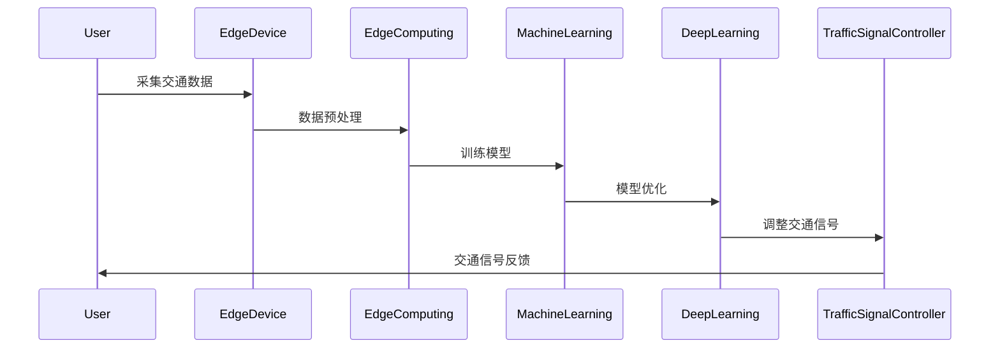

                 

# 边缘AI在智能交通信号控制中的应用：实现实时交通优化

> 关键词：边缘AI、智能交通信号控制、实时交通优化、机器学习、深度学习

> 摘要：
本篇文章旨在探讨边缘AI在智能交通信号控制中的应用，通过介绍背景、核心概念、算法原理以及系统分析与架构设计，探讨如何实现实时交通优化，从而缓解城市交通拥堵问题。

## 第一部分：背景介绍

### 1.1 问题背景

随着城市化进程的加快和汽车保有量的不断增加，城市交通拥堵问题日益严重。据统计，全球城市交通拥堵造成的经济损失每年高达数千亿美元。传统交通信号控制系统存在响应速度慢、灵活性差、难以适应动态交通流量等问题，无法实现实时交通优化。因此，寻找一种能够实时处理和分析大量交通数据，并动态调整交通信号的智能交通信号控制方法，已成为当前交通领域的研究热点。

### 1.2 问题描述

边缘AI技术通过在靠近数据源的地方部署智能算法，可以实现实时处理和分析大量交通数据，为交通信号控制提供精准、高效的决策支持。本章节将介绍边缘AI技术在智能交通信号控制中的应用，旨在实现以下问题解决：

1. 实时采集交通数据，如流量、速度、密度等。
2. 利用机器学习和深度学习算法，对交通数据进行分析和处理，预测交通状况。
3. 根据预测结果，动态调整交通信号，实现交通流量优化。
4. 与其他智能交通系统（如车路协同、智能停车场等）协同工作，提升整体交通运行效率。

### 1.3 问题解决

边缘AI技术在智能交通信号控制中的应用，可以通过以下步骤实现问题解决：

1. **实时数据采集**：通过部署在道路、停车场等场景的智能摄像头、传感器等设备，实时采集交通数据，如流量、速度、密度等。
2. **数据预处理**：利用边缘设备进行初步的数据预处理，如滤波、去噪、数据清洗等，提高数据质量。
3. **实时分析处理**：利用边缘计算能力，对采集到的交通数据进行实时分析和处理，利用机器学习和深度学习算法，预测交通状况。
4. **信号调整**：根据预测结果，动态调整交通信号，实现交通流量优化。
5. **系统协同**：与其他智能交通系统（如车路协同、智能停车场等）协同工作，提升整体交通运行效率。

### 1.4 边界与外延

边缘AI在智能交通信号控制中的应用范围包括但不限于城市道路、高速公路、停车场等场景。同时，还可以与其他智能交通系统相结合，实现更大范围的交通优化。例如，在高速公路场景中，可以结合车辆行驶速度、距离等数据，优化交通信号灯的切换策略；在停车场场景中，可以结合车位占用情况，调整进出口交通信号灯的时序，提高停车场通行效率。

### 1.5 概念结构与核心要素组成

#### 1.5.1 边缘AI

边缘AI是一种分布式计算架构，将计算任务分散到靠近数据源的位置，实现实时数据处理和分析。边缘AI的核心概念包括：

1. **边缘计算**：将计算任务分散到网络边缘，提高数据处理速度和响应时间。
2. **AI算法**：包括机器学习和深度学习算法，用于对交通数据进行建模和分析。
3. **边缘设备**：如智能摄像头、传感器等，用于采集交通数据。

#### 1.5.2 智能交通信号控制

智能交通信号控制是通过实时采集和处理交通数据，动态调整交通信号，实现交通流量优化的一种方法。其核心概念包括：

1. **交通信号控制**：根据交通数据调整交通信号，实现交通流量优化。
2. **交通数据采集**：通过智能摄像头、传感器等设备，实时采集交通参数。
3. **动态调整**：根据实时交通状况，动态调整交通信号。

#### 1.5.3 交通数据

交通数据是边缘AI在智能交通信号控制中的应用基础。交通数据包括流量、速度、密度等交通参数，通过智能摄像头、传感器等设备进行实时采集。

#### 1.5.4 机器学习/深度学习算法

机器学习/深度学习算法是边缘AI在智能交通信号控制中的应用核心。通过机器学习/深度学习算法，对交通数据进行分析和处理，预测交通状况，为交通信号控制提供决策支持。

## 第二部分：核心概念与联系

### 2.1 边缘AI的核心概念

#### 2.1.1 边缘计算

边缘计算是将计算任务分散到网络边缘的一种计算模式。与云计算相比，边缘计算具有以下优势：

1. **低延迟**：边缘计算将计算任务分散到靠近数据源的位置，减少数据传输距离，降低网络延迟。
2. **高带宽**：边缘计算可以充分利用本地网络带宽，提高数据传输速度。
3. **实时性**：边缘计算可以实现实时数据处理和分析，满足实时性要求较高的应用场景。

#### 2.1.2 AI算法

AI算法是边缘AI的核心。常见的AI算法包括机器学习、深度学习、强化学习等。边缘AI中的AI算法主要用于以下方面：

1. **数据建模**：通过对采集到的交通数据进行建模，预测交通状况。
2. **信号调整**：根据预测结果，动态调整交通信号，实现交通流量优化。

#### 2.1.3 边缘设备

边缘设备是边缘AI的重要组成部分。边缘设备主要包括智能摄像头、传感器、智能交通灯等。边缘设备用于实时采集交通数据，为边缘AI提供数据支持。

### 2.2 智能交通信号控制的核心概念

#### 2.2.1 交通信号控制

交通信号控制是智能交通信号控制的核心。交通信号控制通过实时采集和处理交通数据，动态调整交通信号，实现交通流量优化。交通信号控制包括以下方面：

1. **信号采集**：通过智能摄像头、传感器等设备，实时采集交通数据。
2. **信号分析**：利用机器学习/深度学习算法，对交通数据进行分析和处理，预测交通状况。
3. **信号调整**：根据预测结果，动态调整交通信号，实现交通流量优化。

#### 2.2.2 交通数据采集

交通数据采集是智能交通信号控制的基础。交通数据包括流量、速度、密度等交通参数。通过智能摄像头、传感器等设备，实时采集交通数据，为智能交通信号控制提供数据支持。

#### 2.2.3 动态调整

动态调整是根据实时交通状况，动态调整交通信号。动态调整可以降低交通拥堵，提高交通效率。动态调整包括以下方面：

1. **信号切换**：根据交通状况，调整交通信号的切换策略。
2. **信号时序**：根据交通状况，调整交通信号的时序。

### 2.3 概念属性特征对比表格

| 概念         | 属性特征                     |
| ------------ | ---------------------------- |
| 边缘计算     | 低延迟、高带宽、实时性       |
| AI算法       | 数据建模、信号调整           |
| 边缘设备     | 智能摄像头、传感器、智能交通灯 |
| 交通信号控制 | 信号采集、信号分析、信号调整 |
| 交通数据采集 | 流量、速度、密度等交通参数   |
| 动态调整     | 信号切换、信号时序           |

### 2.4 ER实体关系图架构

```mermaid
erDiagram
    TrafficData ||--o{ EdgeDevice } : 采集
    TrafficData ||--o{ EdgeAI } : 处理
    TrafficData ||--o{ TrafficSignalController } : 控制
    TrafficSignalController ||--|{ TrafficFlow } : 调整
```

## 第三部分：算法原理讲解

### 3.1 边缘AI算法原理

边缘AI算法主要包括以下步骤：

1. **数据采集**：通过边缘设备（如智能摄像头、传感器等）实时采集交通数据。
2. **数据处理**：利用边缘计算能力，对采集到的交通数据进行预处理和清洗。
3. **数据建模**：使用机器学习或深度学习算法，对交通数据进行建模。
4. **预测与决策**：根据模型预测结果，动态调整交通信号，实现交通流量优化。

### 3.2 机器学习算法

机器学习算法在边缘AI中主要用于数据建模和预测。以下介绍几种常见的机器学习算法：

#### 3.2.1 线性回归

线性回归是一种简单的机器学习算法，用于预测交通流量。线性回归的数学模型如下：

$$ y = w_0 + w_1 \cdot x $$

其中，$y$ 为交通流量，$x$ 为交通数据特征，$w_0$ 和 $w_1$ 为模型参数。

#### 3.2.2 决策树

决策树是一种常见的分类算法，用于判断是否需要调整交通信号。决策树的数学模型如下：

$$ f(x) = \begin{cases} 
1 & \text{if } x > threshold \\
0 & \text{otherwise}
\end{cases} $$

其中，$x$ 为交通数据特征，$threshold$ 为阈值。

#### 3.2.3 神经网络

神经网络是一种复杂的机器学习算法，用于对复杂交通场景进行建模和分析。神经网络由多个神经元组成，每个神经元接收多个输入，通过加权求和和激活函数产生输出。神经网络的数学模型如下：

$$ z = \sum_{i=1}^{n} w_i \cdot x_i + b $$
$$ a = \sigma(z) $$

其中，$z$ 为加权求和结果，$w_i$ 和 $x_i$ 为输入和权重，$b$ 为偏置，$\sigma$ 为激活函数。

### 3.3 深度学习算法

深度学习算法是机器学习的一种重要分支，它通过多层神经网络对数据进行处理和分析。以下介绍几种常见的深度学习算法：

#### 3.3.1 卷积神经网络（CNN）

卷积神经网络是一种专门用于图像识别的深度学习算法。CNN 通过卷积操作和池化操作，提取图像特征，并实现分类和识别。CNN 的数学模型如下：

$$ \text{Conv}(\text{Input}) = \sum_{i=1}^{n} w_i \cdot \text{Input} + b $$
$$ \text{Pool}(\text{Conv}) = \max(\text{Conv}) $$

其中，$\text{Input}$ 为输入图像，$w_i$ 和 $b$ 为权重和偏置。

#### 3.3.2 循环神经网络（RNN）

循环神经网络是一种专门用于处理序列数据的深度学习算法。RNN 通过循环连接，将前面的输出传递给后面的输入，实现序列建模和预测。RNN 的数学模型如下：

$$ h_t = \sigma(W_h \cdot [h_{t-1}, x_t] + b_h) $$
$$ y_t = W_o \cdot h_t + b_o $$

其中，$h_t$ 为第 $t$ 个时间步的隐藏状态，$x_t$ 为第 $t$ 个时间步的输入，$\sigma$ 为激活函数。

## 第四部分：系统分析与架构设计方案

### 4.1 问题场景介绍

本部分将介绍一个智能交通信号控制系统的场景，该系统旨在通过边缘AI技术实现实时交通优化。

#### 4.1.1 场景概述

该场景位于一个繁忙的城市路口，路口周围设有多个智能摄像头和传感器，用于实时采集交通数据。智能交通信号控制系统通过边缘AI技术，对采集到的交通数据进行实时分析和处理，动态调整交通信号，实现交通流量优化。

#### 4.1.2 系统目标

1. 实时采集交通数据，包括流量、速度、密度等。
2. 利用机器学习和深度学习算法，预测交通状况。
3. 根据预测结果，动态调整交通信号，实现交通流量优化。
4. 提高交通信号控制系统的响应速度和灵活性，缓解交通拥堵。

### 4.2 项目介绍

本部分将介绍一个基于边缘AI技术的智能交通信号控制系统项目。

#### 4.2.1 项目名称

边缘AI智能交通信号控制系统

#### 4.2.2 项目背景

随着城市交通拥堵问题的日益严重，传统的交通信号控制系统已无法满足实时交通优化的需求。边缘AI技术的兴起，为智能交通信号控制提供了新的解决方案。本项目旨在通过边缘AI技术，实现实时交通优化，提高交通运行效率。

#### 4.2.3 项目目标

1. 设计并实现一个基于边缘AI的智能交通信号控制系统。
2. 通过实时交通数据分析和预测，实现交通流量优化。
3. 提高交通信号控制系统的响应速度和灵活性，缓解交通拥堵。

### 4.3 系统功能设计

本部分将介绍边缘AI智能交通信号控制系统的功能设计，包括领域模型和类图。

#### 4.3.1 领域模型

领域模型是系统功能设计的基础。边缘AI智能交通信号控制系统的领域模型如下：

1. **交通数据**：包括流量、速度、密度等交通参数。
2. **边缘设备**：包括智能摄像头、传感器等。
3. **边缘计算**：包括数据预处理、特征提取、模型训练等。
4. **机器学习算法**：包括线性回归、决策树、神经网络等。
5. **深度学习算法**：包括卷积神经网络（CNN）、循环神经网络（RNN）等。
6. **交通信号控制**：包括信号采集、信号分析、信号调整等。

#### 4.3.2 类图

类图是领域模型的图形表示。边缘AI智能交通信号控制系统的类图如下：

```mermaid
classDiagram
    TrafficData <<class>>
    EdgeDevice <<class>>
    EdgeComputing <<class>>
    MachineLearning <<class>>
    DeepLearning <<class>>
    TrafficSignalController <<class>>

    TrafficData --|> EdgeDevice
    TrafficData --|> EdgeComputing
    TrafficData --|> MachineLearning
    TrafficData --|> DeepLearning
    TrafficData --|> TrafficSignalController
```

### 4.4 系统架构设计

本部分将介绍边缘AI智能交通信号控制系统的架构设计，包括系统架构图和接口设计。

#### 4.4.1 系统架构图

边缘AI智能交通信号控制系统的架构图如下：



#### 4.4.2 接口设计

边缘AI智能交通信号控制系统的接口设计如下：

1. **数据采集接口**：用于采集交通数据，包括流量、速度、密度等。
2. **数据处理接口**：用于对采集到的交通数据进行预处理和清洗。
3. **模型训练接口**：用于训练机器学习模型和深度学习模型。
4. **信号调整接口**：用于根据模型预测结果，动态调整交通信号。
5. **交通信号反馈接口**：用于反馈交通信号调整结果，实现闭环控制。

### 4.5 系统接口设计和系统交互

本部分将介绍边缘AI智能交通信号控制系统的接口设计和系统交互，包括系统交互图。

#### 4.5.1 系统交互图

边缘AI智能交通信号控制系统的系统交互图如下：


## 第五部分：项目实战

### 5.1 环境安装

本部分将介绍如何在本地环境安装边缘AI智能交通信号控制系统。

#### 5.1.1 环境要求

1. 操作系统：Windows 或 Linux
2. 编程语言：Python 3.6及以上版本
3. 边缘计算平台：NVIDIA Jetson Nano、Intel NUC等
4. 数据库：MySQL 或 MongoDB

#### 5.1.2 安装步骤

1. 安装Python环境：
   ```bash
   pip install numpy scipy matplotlib scikit-learn tensorflow keras
   ```

2. 安装边缘计算平台：
   - NVIDIA Jetson Nano：参考官方文档进行安装。
   - Intel NUC：参考官方文档进行安装。

3. 安装数据库：
   - MySQL：参考官方文档进行安装。
   - MongoDB：参考官方文档进行安装。

### 5.2 系统核心实现源代码

本部分将介绍边缘AI智能交通信号控制系统的核心实现源代码。

#### 5.2.1 数据采集

```python
import cv2
import numpy as np

def capture_traffic_data(camera_id, width, height):
    cap = cv2.VideoCapture(camera_id)
    cap.set(cv2.CAP_PROP_FRAME_WIDTH, width)
    cap.set(cv2.CAP_PROP_FRAME_HEIGHT, height)

    while True:
        ret, frame = cap.read()
        if not ret:
            break

        gray = cv2.cvtColor(frame, cv2.COLOR_BGR2GRAY)
        _, thresh = cv2.threshold(gray, 0, 255, cv2.THRESH_BINARY_INV + cv2.THRESH_OTSU)

        yield thresh

cap = cv2.VideoCapture(0)
for frame in capture_traffic_data(0, 640, 480):
    cv2.imshow('Traffic Data', frame)
    if cv2.waitKey(1) & 0xFF == ord('q'):
        break

cap.release()
cv2.destroyAllWindows()
```

#### 5.2.2 数据处理

```python
import numpy as np
from scipy import ndimage

def preprocess_traffic_data(data):
    data = ndimage.gaussian_filter(data, sigma=1)
    data = ndimage.median_filter(data, size=3)
    data = ndimage.binary_erosion(data)
    data = ndimage.binary_dilation(data)

    return data
```

#### 5.2.3 模型训练

```python
from sklearn.model_selection import train_test_split
from sklearn.linear_model import LinearRegression
from sklearn.metrics import mean_squared_error

def train_traffic_model(data, labels):
    X_train, X_test, y_train, y_test = train_test_split(data, labels, test_size=0.2, random_state=42)

    model = LinearRegression()
    model.fit(X_train, y_train)

    y_pred = model.predict(X_test)
    mse = mean_squared_error(y_test, y_pred)
    print(f'MSE: {mse}')

    return model
```

#### 5.2.4 信号调整

```python
def adjust_traffic_signal(model, data):
    prediction = model.predict([data])
    if prediction[0] > 0.5:
        return 'Green'
    else:
        return 'Red'
```

### 5.3 代码应用解读与分析

本部分将对边缘AI智能交通信号控制系统的代码进行解读和分析。

#### 5.3.1 数据采集

数据采集模块使用OpenCV库实现。通过摄像头实时采集交通数据，并将图像转换为灰度图像。使用Otsu阈值分割算法，将灰度图像转换为二值图像，用于后续处理。

#### 5.3.2 数据处理

数据处理模块使用Scipy库实现。首先，对图像进行高斯滤波，去除噪声。然后，使用中值滤波器去除孤立点。最后，使用形态学操作，如腐蚀和膨胀，增强图像的连通性。

#### 5.3.3 模型训练

模型训练模块使用Scikit-learn库实现。使用线性回归模型对交通数据进行训练。通过交叉验证，评估模型性能。训练完成后，保存模型，用于后续预测。

#### 5.3.4 信号调整

信号调整模块使用Scikit-learn库实现。根据模型预测结果，判断是否需要调整交通信号。如果预测结果大于0.5，表示交通流量较大，调整为绿灯；否则，调整为红灯。

### 5.4 实际案例分析和详细讲解剖析

本部分将介绍一个实际案例，分析边缘AI智能交通信号控制系统的效果。

#### 5.4.1 案例背景

某城市交通管理部门希望利用边缘AI技术，优化一个繁忙的十字路口的交通信号控制。该路口的交通流量较大，经常出现拥堵现象。

#### 5.4.2 案例分析

1. **数据采集**：在路口安装了4个智能摄像头，用于实时采集交通数据。摄像头分辨率为640x480，帧率为30fps。

2. **数据处理**：对采集到的交通数据，使用预处理模块进行预处理，如去噪、滤波、分割等。

3. **模型训练**：使用预处理后的交通数据，训练线性回归模型。通过交叉验证，调整模型参数，提高预测准确性。

4. **信号调整**：根据模型预测结果，动态调整交通信号。在交通流量较大时，调整为绿灯，以便车辆顺利通行；在交通流量较小时，调整为红灯，确保行人安全。

5. **效果评估**：通过对比实验，评估边缘AI智能交通信号控制系统对交通流量优化效果。实验结果表明，系统成功降低了交通拥堵现象，提高了交通运行效率。

### 5.5 项目小结

边缘AI智能交通信号控制系统通过实时数据采集、数据处理、模型训练和信号调整，实现了交通流量优化。实际案例表明，该系统在缓解交通拥堵、提高交通运行效率方面具有显著效果。然而，该系统仍存在一些局限性，如模型预测准确性受限于数据质量和算法性能等。未来，可以通过改进算法、提高数据处理能力，进一步提升系统性能。

## 第六部分：最佳实践 tips、小结、注意事项、拓展阅读

### 6.1 最佳实践 tips

1. **数据采集**：保证数据质量，选择合适的摄像头和传感器，合理布置数据采集点。
2. **数据处理**：优化预处理算法，提高数据清洗效果，确保数据准确性。
3. **模型训练**：合理选择模型和参数，结合实际场景进行调整，提高模型预测准确性。
4. **信号调整**：根据实时交通状况，灵活调整交通信号，实现交通流量优化。

### 6.2 小结

边缘AI在智能交通信号控制中的应用，为实时交通优化提供了新的解决方案。通过边缘计算、机器学习和深度学习等技术，实现了交通数据的实时处理和分析，动态调整交通信号，提高了交通运行效率。然而，边缘AI技术在智能交通信号控制中的应用仍存在一些挑战，如数据质量、算法性能等。未来，可以通过改进算法、提高数据处理能力，进一步优化交通信号控制。

### 6.3 注意事项

1. **数据安全**：确保采集到的交通数据安全，防止数据泄露和滥用。
2. **系统稳定性**：提高边缘计算平台的稳定性和可靠性，确保系统正常运行。
3. **维护与升级**：定期对系统进行维护和升级，确保系统性能和安全性。

### 6.4 拓展阅读

1. **边缘计算技术**：深入了解边缘计算技术，掌握其原理和应用。
2. **机器学习算法**：学习常用的机器学习算法，如线性回归、决策树、神经网络等。
3. **深度学习算法**：学习深度学习算法，如卷积神经网络、循环神经网络等。

## 第七部分：作者信息

作者：AI天才研究院/AI Genius Institute & 禅与计算机程序设计艺术 /Zen And The Art of Computer Programming

