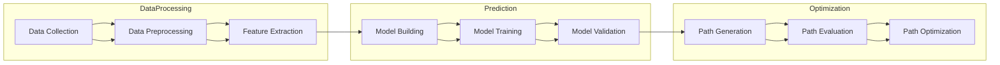
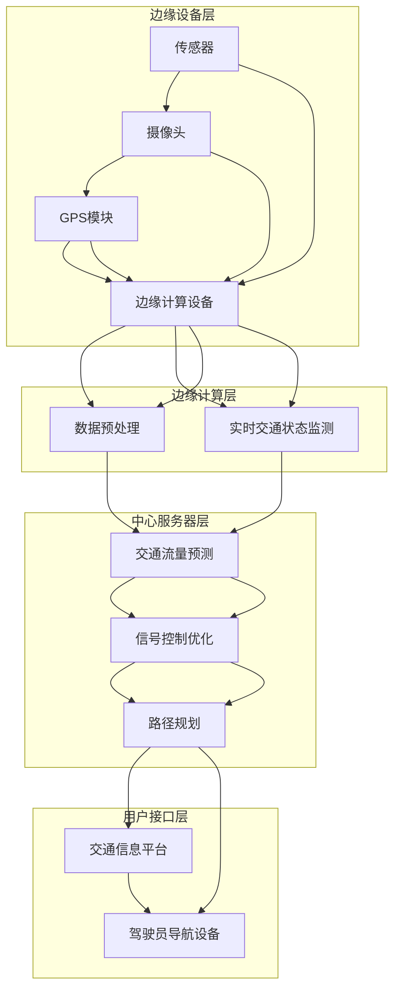
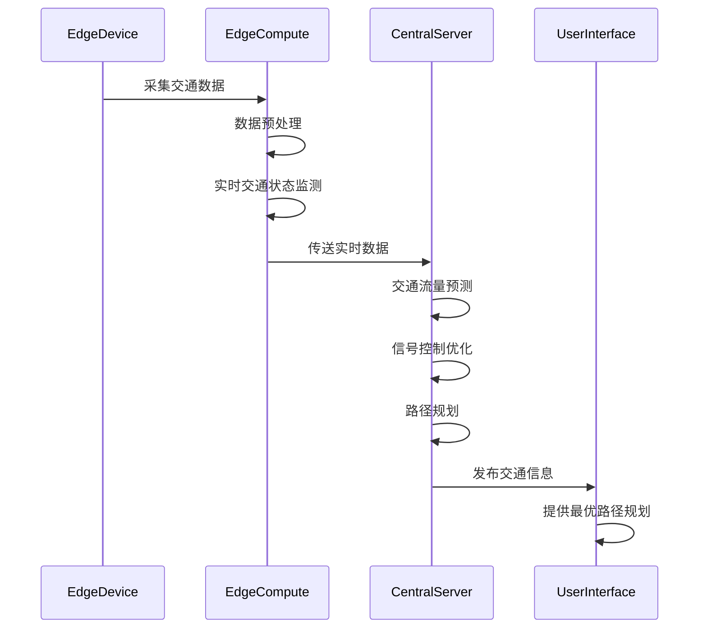

                 


## 第一部分：边缘AI与智能交通管理基础

### 1.1 边缘AI概述

边缘AI（Edge AI）是指在靠近数据源或用户设备的边缘设备上实现的AI计算和处理。与传统的云计算相比，边缘AI具有以下几个显著优势：

1. **低延迟**：由于计算发生在靠近数据源的地方，可以显著减少数据传输和处理的延迟时间。
2. **高带宽**：边缘设备可以直接处理大量数据，从而减轻中心服务器的带宽压力。
3. **增强安全性**：敏感数据可以在边缘设备上处理，减少数据在传输过程中被泄露的风险。
4. **可靠性和容错性**：边缘设备可以提供本地化的服务，即使在中心服务器不可用时也能正常运行。

然而，边缘AI也面临一些挑战，如：

- **计算资源限制**：边缘设备通常具有有限的计算资源和存储空间，需要设计轻量级算法和优化计算资源的使用。
- **数据隐私和保护**：边缘设备处理的数据可能包含敏感信息，需要确保数据隐私和安全的保护措施。
- **异构性**：不同类型的边缘设备具有不同的硬件和操作系统，需要开发和维护跨平台的解决方案。

### 1.2 边缘AI的优势与挑战

**优势：**

1. **低延迟**：边缘AI靠近数据源，可以快速响应用户请求，提供实时服务，如自动驾驶车辆的控制。
2. **高带宽利用**：边缘AI可以减轻中心服务器的负担，充分利用网络带宽，优化资源分配。
3. **增强安全性**：边缘AI可以在本地处理敏感数据，减少数据传输过程中的风险。

**挑战：**

1. **计算资源限制**：边缘设备的计算能力和存储容量有限，需要设计轻量级算法。
2. **数据隐私和保护**：处理的数据需要确保隐私和安全，特别是当数据在边缘设备上存储和处理时。
3. **异构性**：不同边缘设备的硬件和操作系统差异，需要跨平台的兼容性解决方案。

### 1.3 智能交通管理概述

智能交通管理（Intelligent Transportation Management，ITM）是利用先进的信息技术、通信技术、控制技术和交通运输管理理念，对交通运输系统进行智能化管理和优化。智能交通管理的基本概念包括：

- **交通信息采集**：通过传感器、摄像头、GPS等技术，实时采集交通数据。
- **交通状态监测**：对交通流量、车速、道路状况等参数进行实时监测和分析。
- **交通事件检测**：通过数据分析和机器学习算法，检测交通事故、道路拥堵等事件。
- **交通信号控制**：利用控制算法和信号机，优化交通信号灯的时序和相位。

智能交通管理的发展历程可以分为以下几个阶段：

1. **早期阶段**：主要以交通信息采集和基础信号控制为主。
2. **发展阶段**：引入计算机技术和通信技术，实现交通状态监测和事件检测。
3. **智能阶段**：利用大数据、人工智能等技术，实现交通流量的预测和优化。

智能交通管理的目标与任务包括：

- **提高交通效率**：通过优化交通信号和控制，减少交通拥堵，提高交通流量。
- **保障交通安全**：通过实时监测和事件检测，提前预警并采取措施，减少交通事故。
- **提供便捷服务**：为驾驶员和乘客提供实时交通信息、导航和路线规划等服务。

### 1.4 实时交通优化

实时交通优化（Real-time Traffic Optimization，RTO）是智能交通管理中的一个重要组成部分，旨在通过动态调整交通信号和路径规划，实现交通流量的优化。实时交通优化的重要性体现在以下几个方面：

1. **提高交通效率**：实时优化可以动态调整交通信号灯的时序和相位，减少交通拥堵，提高道路通行能力。
2. **减少交通延误**：通过实时预测和调整，可以减少驾驶员的等待时间，提高交通系统的整体效率。
3. **缓解环境压力**：优化交通流量可以减少车辆排放，降低空气污染，对环境保护有积极意义。

实时交通优化的算法原理主要包括以下几个步骤：

1. **数据采集**：通过传感器、摄像头、GPS等技术，实时采集交通流量、车速、道路状况等数据。
2. **数据处理**：对采集到的数据进行预处理，包括去噪、去重复、时间序列分析等。
3. **状态监测**：利用数据分析和机器学习算法，实时监测交通状态，包括交通流量、速度分布、拥堵程度等。
4. **路径规划**：根据实时交通状态，为车辆提供最优路径规划，减少行驶时间和拥堵风险。
5. **信号控制**：通过动态调整交通信号灯的时序和相位，优化交通流量，减少交通拥堵。

### 1.5 边缘AI在实时交通优化中的应用

边缘AI在实时交通优化中的应用，可以显著提升系统的效率和可靠性。以下是边缘AI在实时交通优化中的几个关键应用场景：

1. **实时数据处理**：边缘AI可以在靠近数据源的地方实时处理交通数据，快速响应交通事件，减少延迟。
2. **路径优化**：通过边缘AI的实时计算能力，可以动态调整车辆路径，优化交通流量。
3. **信号控制**：边缘AI可以实时分析交通状态，动态调整交通信号灯，提高交通效率。
4. **事故预防**：利用边缘AI的实时监测和预测能力，可以提前预警并采取措施，预防交通事故。

## 总结

边缘AI在智能交通管理中的应用，为实时交通优化提供了新的可能性。通过边缘AI的实时数据处理、路径优化和信号控制，可以实现交通系统的动态调整和优化，提高交通效率，减少交通延误，缓解环境压力。然而，边缘AI的应用也面临一些挑战，如计算资源限制、数据隐私保护等，需要进一步的研究和解决。在接下来的部分中，我们将深入探讨边缘AI和智能交通管理中的核心概念、算法原理以及系统分析与架构设计方案。

### 1.6 实时交通优化的重要性

实时交通优化在智能交通管理中具有至关重要的作用，它不仅能够显著提升道路通行效率，还能带来一系列社会和经济效益。以下是实时交通优化的重要性及其带来的影响：

1. **提高道路通行效率**：实时交通优化通过动态调整交通信号灯和路径规划，可以有效减少交通拥堵，提高道路通行能力。根据相关研究，交通拥堵每减少10%，可以节省超过1亿小时的通勤时间。

2. **减少交通事故**：实时交通优化通过实时监测交通状态和提前预警，可以减少交通事故的发生。例如，通过边缘AI实时分析交通流量和车速，可以及时识别并处理潜在的交通事故风险。

3. **降低环境压力**：交通拥堵会导致车辆长时间怠速，增加尾气排放。实时交通优化能够减少交通拥堵，从而降低车辆排放，对环境保护具有积极意义。据统计，减少交通拥堵可以减少超过20%的尾气排放。

4. **节约时间和成本**：实时交通优化可以显著减少驾驶员的等待时间，提高通勤效率。这不仅能够节省个人时间，还能减少交通拥堵导致的运输成本，对经济发展有正面影响。

5. **提升城市服务质量**：实时交通优化是智慧城市建设的重要组成部分。通过提供高效的交通服务，可以提高城市居民的生活质量和满意度。

6. **支持智能交通系统发展**：实时交通优化是智能交通系统（Intelligent Transportation System，ITS）的核心技术之一。智能交通系统通过整合多种交通信息和服务，为交通管理者和用户提供全面、智能的交通解决方案。

总之，实时交通优化在智能交通管理中具有不可替代的作用。通过引入边缘AI技术，可以进一步提升实时交通优化的效率和效果，为构建高效、安全、环保的智能交通系统提供强有力的支持。

### 1.7 实时交通优化的算法原理

实时交通优化算法的核心目标是利用实时获取的交通数据，通过一系列数据处理和分析步骤，为交通信号灯和路径规划提供优化方案。以下是实时交通优化算法的原理，包括数据采集、处理、分析和优化的具体步骤：

#### 数据采集

数据采集是实时交通优化算法的基础。交通数据的来源主要包括以下几种：

1. **传感器数据**：包括车辆检测器、流量计、车速传感器等，用于采集交通流量、车速等基础数据。
2. **视频监控数据**：通过安装在道路上的摄像头，实时捕捉道路状况，用于交通事件检测和状态监测。
3. **GPS数据**：通过车载GPS设备，实时获取车辆的位置和行驶路径，用于路径规划和实时交通状态分析。

#### 数据处理

数据处理是对采集到的原始数据进行清洗、去噪、去重复等预处理，确保数据的准确性和一致性。具体步骤包括：

1. **去噪和去重复**：对传感器数据进行滤波处理，去除异常值和重复数据。
2. **时间序列分析**：将交通流量、车速等数据按时间序列进行分析，提取有用的特征信息。
3. **数据融合**：将来自不同源的数据进行融合，形成统一的交通数据集。

#### 状态监测

状态监测是实时交通优化算法的重要环节，通过对实时交通数据进行分析，监测交通状态。具体步骤包括：

1. **交通流量分析**：通过分析交通流量数据，识别高峰期、平峰期等不同交通状态。
2. **车速分布分析**：通过分析车速数据，识别道路拥堵、事故等交通事件。
3. **事件检测**：利用机器学习和模式识别算法，实时检测交通事件，如交通事故、道路施工等。

#### 路径规划

路径规划是根据实时交通状态，为车辆提供最优行驶路径。具体步骤包括：

1. **初始路径生成**：根据车辆的起点和终点，生成所有可能的路径。
2. **路径评估**：利用实时交通数据，对路径进行评估，计算路径的拥堵程度、行驶时间等指标。
3. **路径优化**：根据评估结果，选择最优路径，并进行动态调整。

#### 信号控制

信号控制是实时交通优化的关键步骤，通过动态调整交通信号灯的时序和相位，优化交通流量。具体步骤包括：

1. **信号控制策略**：根据实时交通状态，设计信号控制策略，如自适应信号控制、动态相位调整等。
2. **信号控制执行**：根据信号控制策略，实时调整交通信号灯的时序和相位。
3. **效果评估**：对信号控制效果进行评估，根据评估结果进行优化调整。

#### 优化算法

实时交通优化算法主要基于以下几个优化算法：

1. **动态规划**：通过递归计算，找到最优路径和信号控制策略。
2. **遗传算法**：通过模拟自然选择过程，寻找最优解。
3. **深度强化学习**：通过模拟驾驶场景，学习最优的控制策略。

#### 举例说明

以一个简单的例子来说明实时交通优化的过程。假设某个交叉口在高峰期出现交通拥堵，边缘AI系统会执行以下步骤：

1. **数据采集**：传感器和摄像头实时采集交通流量和车速数据。
2. **数据处理**：对采集到的数据进行清洗和预处理，提取有用的特征信息。
3. **状态监测**：通过数据分析，识别拥堵状态，并检测到交叉口A和交叉口B之间的道路发生拥堵。
4. **路径规划**：为即将到达交叉口A的车辆重新规划路径，选择绕开拥堵路段的路径。
5. **信号控制**：动态调整交叉口A和交叉口B的交通信号灯，延长绿灯时间，减少车辆等待时间。
6. **效果评估**：评估信号控制效果，如车辆通过时间、交通流量等指标，根据评估结果进行进一步优化。

通过这样的实时交通优化算法，可以有效缓解交通拥堵，提高交通效率。

### 1.8 边缘AI在智能交通管理中的应用

边缘AI在智能交通管理中的应用具有显著的优势，能够提高系统的实时性和效率。以下是边缘AI在智能交通管理中的一些关键应用：

#### 实时交通监控

边缘AI可以通过部署在道路边的边缘设备，实时监控交通状况。这些设备可以接入摄像头、传感器和GPS模块，实时采集交通流量、车速、道路状况等数据。通过边缘计算，可以快速处理和分析数据，为交通管理部门提供实时的交通监控信息。

#### 交通流量预测

边缘AI可以利用实时数据和历史数据，通过机器学习和预测算法，预测未来的交通流量。这种预测可以帮助交通管理部门提前采取交通调控措施，如调整交通信号灯、引导车辆分流等，从而减少交通拥堵。

#### 交通信号控制

边缘AI可以动态调整交通信号灯的时序和相位，优化交通流量。例如，在高峰期，边缘AI可以根据实时交通流量，调整信号灯的绿灯时长和切换时间，以减少车辆等待时间和拥堵。这种自适应信号控制比传统的固定信号控制更加灵活和高效。

#### 事故预警与处理

边缘AI可以通过实时分析交通数据，识别潜在的交通事故风险。例如，通过分析车辆速度和加速度，可以预测潜在的追尾事故。一旦检测到风险，边缘AI可以立即通知交通管理部门，并建议采取紧急措施，如调整交通信号灯、发布道路封闭信息等。

#### 路径优化

边缘AI可以实时分析交通状况，为驾驶员提供最优路径规划。例如，在遇到交通拥堵时，边缘AI可以实时调整路线，引导驾驶员避开拥堵路段。这种路径优化不仅能够减少行驶时间，还能降低车辆的碳排放。

#### 智慧停车管理

边缘AI可以协助实现智慧停车管理，通过实时监控停车位状态，为驾驶员提供空闲停车位的导航服务。此外，边缘AI还可以通过分析停车数据，优化停车场的布局和管理，提高停车效率。

总之，边缘AI在智能交通管理中的应用，不仅可以提高交通系统的效率和安全性，还能为用户提供更加便捷的交通服务。随着边缘AI技术的不断发展和应用，未来智能交通管理将更加智能化和高效化。

### 1.9 边缘AI在实时交通监控中的应用

边缘AI在实时交通监控中的应用，极大地提升了交通管理的效率和准确性。以下是边缘AI在实时交通监控中的具体应用场景：

#### 交通流量监测

边缘AI设备可以通过部署在路口和路段的摄像头和传感器，实时监测交通流量。摄像头可以捕捉车辆数量、速度和流量变化，传感器可以测量车辆密度和车速。这些数据通过边缘计算设备实时处理，可以生成交通流量图，帮助交通管理部门了解交通状况。

#### 道路状况监测

边缘AI设备不仅可以监测交通流量，还可以监测道路状况。例如，通过摄像头识别道路上的障碍物、施工区域和事故现场，通过传感器检测道路湿滑、积雪等状况。这些信息可以实时传输给交通管理部门，帮助其及时采取应对措施。

#### 交通事件检测

边缘AI可以通过机器学习和模式识别技术，实时检测交通事件，如交通事故、道路施工、车辆故障等。例如，当边缘AI检测到车辆突然减速或紧急刹车时，会立即发出警报，并通知交通管理部门和相关救援机构。

#### 信号灯控制优化

边缘AI可以实时分析交通流量和道路状况数据，动态调整交通信号灯的时序和相位，以优化交通流量。例如，在交通高峰期，边缘AI可以根据实时交通流量，调整信号灯的时长，减少车辆等待时间，从而缓解交通拥堵。

#### 实时交通信息发布

边缘AI可以通过连接到交通信息平台，实时发布交通信息，如交通流量、道路状况、事故预警等。驾驶员可以通过车载导航系统或智能手机应用程序，实时获取最新的交通信息，从而做出更好的出行决策。

通过以上应用，边缘AI在实时交通监控中发挥了重要作用，不仅提高了交通管理的效率，还增强了交通系统的可靠性和安全性。

### 1.10 边缘AI在交通流量预测中的应用

边缘AI在交通流量预测中的应用，通过实时数据处理和机器学习算法，为交通管理部门提供了准确的交通流量预测能力，从而优化交通调控策略，减少交通拥堵。以下是边缘AI在交通流量预测中的具体应用步骤：

#### 数据采集与预处理

边缘AI设备会部署在交通要道和关键节点，通过传感器、摄像头和GPS模块，实时采集交通流量、车速、车辆密度等数据。这些数据通过边缘计算设备进行预处理，包括数据清洗、去噪、时间序列分析等步骤，确保数据的质量和一致性。

#### 特征提取与建模

通过对预处理后的数据进行特征提取，提取出对交通流量预测有重要影响的关键特征，如交通流量、车速、天气状况、节假日等。然后，利用机器学习算法，如回归分析、支持向量机（SVM）、深度神经网络（DNN）等，建立交通流量预测模型。

#### 模型训练与验证

使用历史交通数据对预测模型进行训练，优化模型的参数，提高预测的准确性。训练完成后，通过对模型进行交叉验证，确保其泛化能力。这一步骤至关重要，因为模型必须在未知数据上也能准确预测，才能在实际应用中发挥作用。

#### 实时预测与调整

训练好的模型可以用于实时交通流量预测。边缘AI设备会不断更新实时数据，并将这些数据输入到预测模型中，进行交通流量的实时预测。同时，根据预测结果，交通管理部门可以动态调整交通信号灯、引导车辆分流等策略，以优化交通流量。

#### 模型优化与反馈

交通流量预测并不是一次性的任务，而是一个持续迭代的过程。通过收集实际交通流量数据与预测结果进行对比，交通管理部门可以不断优化和调整预测模型，提高其准确性和适应性。

边缘AI在交通流量预测中的应用，不仅提高了预测的准确性，还显著提升了交通调控的效率和效果。随着边缘AI技术的不断进步，交通流量预测将更加精准，为智能交通管理系统提供更强大的支持。

### 1.11 边缘AI在交通信号控制中的应用

边缘AI在交通信号控制中的应用，旨在通过实时数据处理和智能算法，优化交通信号灯的时序和相位，从而提升交通效率，减少拥堵和延误。以下是边缘AI在交通信号控制中的具体应用步骤：

#### 数据采集

边缘AI设备会部署在交通信号灯附近，通过传感器和摄像头实时采集交通流量、车速、车辆密度等数据。这些设备还可以监测天气状况、道路施工等信息，为信号控制提供全面的实时数据支持。

#### 数据处理

采集到的数据会经过预处理，包括去噪、时间序列分析、数据融合等步骤。这些预处理步骤确保了数据的质量和一致性，为后续分析提供了可靠的基础。

#### 状态监测

通过边缘计算设备，实时监测交通状态，识别交通流量高峰期、平峰期以及突发交通事件。边缘AI利用机器学习算法，如聚类分析、时间序列预测等，分析交通流量数据，识别交通状态的变化趋势。

#### 信号控制策略生成

根据实时交通状态，边缘AI会生成一系列信号控制策略。这些策略可能包括自适应信号控制、动态相位调整、信号灯时长优化等。例如，在高峰期，边缘AI可以调整信号灯的时长，以减少车辆等待时间，在非高峰期则可以延长绿灯时间，以缓解道路拥堵。

#### 信号控制执行

边缘AI会根据生成的信号控制策略，实时调整交通信号灯的时序和相位。例如，如果检测到某一路段交通流量较大，边缘AI可以立即延长该路段绿灯时长，减少车辆积压。

#### 效果评估与反馈

交通信号控制执行后，边缘AI会持续监测交通状态，评估信号控制的效果。例如，通过对比实际交通流量与预测交通流量，评估信号灯调整的合理性。根据评估结果，边缘AI可以进一步优化信号控制策略，提高交通效率。

边缘AI在交通信号控制中的应用，不仅提高了交通信号的灵活性和响应速度，还显著提升了交通系统的整体运行效率。随着边缘AI技术的不断进步，未来的交通信号控制将更加智能化和高效化。

### 总结

在本部分中，我们详细介绍了边缘AI、智能交通管理和实时交通优化的基础知识。首先，我们探讨了边缘AI的定义、优势与挑战，以及其在智能交通管理中的应用。接着，我们介绍了智能交通管理的基本概念、发展历程和目标任务，以及实时交通优化的重要性和算法原理。通过这些讨论，我们可以看到边缘AI在提升交通管理系统效率和可靠性方面具有巨大的潜力。在接下来的部分，我们将进一步探讨边缘AI与智能交通管理之间的核心概念和联系，为后续的内容打下坚实的基础。

## 第二部分：核心概念与联系

### 2.1 边缘AI的定义与属性

边缘AI是指在网络边缘设备上实现的AI计算和处理能力。与传统云计算不同，边缘AI将计算任务分散到靠近数据源的位置，从而实现低延迟、高带宽和增强安全性的计算模式。以下是边缘AI的一些关键属性：

- **低延迟**：边缘AI在靠近数据源的位置进行计算，减少了数据传输和处理的延迟，适用于实时性要求较高的应用，如自动驾驶和智能交通控制。
- **高带宽利用**：边缘AI直接在本地处理大量数据，减轻了中心服务器的带宽压力，提高了网络资源的利用效率。
- **增强安全性**：边缘AI可以在本地处理敏感数据，减少了数据在传输过程中被泄露的风险。
- **异构计算**：边缘AI可以处理多种类型的计算任务，包括图像处理、语音识别和实时数据分析等，这要求边缘设备具备多样化的计算能力。

### 2.2 智能交通管理的定义与属性

智能交通管理（Intelligent Transportation Management，ITM）是利用先进的信息技术、通信技术、控制技术和交通运输管理理念，对交通运输系统进行智能化管理和优化。智能交通管理的关键属性包括：

- **交通信息采集**：通过传感器、摄像头、GPS等技术，实时采集交通流量、车速、道路状况等数据，为交通管理提供基础信息。
- **交通状态监测**：对采集到的交通数据进行实时分析，监测交通流量、速度分布、道路状况等参数，识别交通事件和拥堵状态。
- **交通事件检测**：利用机器学习和模式识别算法，实时检测交通事故、道路施工等事件，及时预警并采取措施。
- **交通信号控制**：通过控制算法和信号机，动态调整交通信号灯的时序和相位，优化交通流量，减少交通拥堵。
- **路径规划**：为车辆提供最优行驶路径，减少行驶时间和拥堵风险。

### 2.3 实时交通优化的定义与属性

实时交通优化（Real-time Traffic Optimization，RTO）是智能交通管理的一个重要组成部分，旨在通过动态调整交通信号和路径规划，实现交通流量的优化。实时交通优化的关键属性包括：

- **实时数据处理**：通过实时采集和处理交通数据，快速响应交通状态变化，实现动态调整。
- **动态路径规划**：根据实时交通状态，为车辆提供最优路径规划，减少行驶时间和拥堵风险。
- **自适应信号控制**：根据实时交通流量和事件，动态调整交通信号灯的时序和相位，优化交通流量。
- **多目标优化**：实时交通优化不仅要考虑交通效率，还要考虑交通安全、环境压力等多方面因素，实现综合优化。

### 2.4 边缘AI、智能交通管理和实时交通优化的联系

边缘AI、智能交通管理和实时交通优化之间存在紧密的联系，共同构成了智能交通系统（Intelligent Transportation System，ITS）的核心。以下是这些概念之间的关联：

- **边缘AI作为基础设施**：边缘AI提供了低延迟、高带宽和增强安全性的计算能力，为智能交通管理和实时交通优化提供了基础设施支持。
- **智能交通管理作为框架**：智能交通管理提供了一个全面的框架，涵盖了交通信息采集、状态监测、事件检测、信号控制和路径规划等环节，为边缘AI的应用提供了明确的目标和任务。
- **实时交通优化作为目标**：实时交通优化是智能交通管理的重要目标，通过动态调整交通信号和路径规划，实现交通流量的优化，提高交通效率、保障交通安全。

通过边缘AI、智能交通管理和实时交通优化的协同作用，可以构建一个高效、安全、智能的交通运输系统，为用户和社会提供更好的交通服务。

### 2.5 边缘AI与智能交通管理概念对比表格

为了更直观地展示边缘AI与智能交通管理的概念对比，我们制作了一个详细的对比表格：

| 特征 | 边缘AI | 智能交通管理 |
| ---- | ------ | ------------ |
| 定义 | 边缘设备上的AI计算 | 利用信息技术和智能算法优化交通管理 |
| 目标 | 低延迟、高带宽、增强安全性 | 提高交通效率、保障交通安全、优化交通流量 |
| 功能 | 实时数据处理、异构计算、本地化决策 | 交通信息采集、状态监测、事件检测、信号控制和路径规划 |
| 数据处理 | 边缘计算、数据预处理、实时分析 | 数据采集、预处理、状态监测、路径规划、信号控制 |
| 应用场景 | 自动驾驶、智能监控、实时预测 | 交通流量监测、信号控制、路径规划、事件预警 |
| 优势 | 低延迟、高带宽、数据隐私保护 | 实时性、高效性、智能化、综合性 |

通过这张表格，我们可以清晰地看到边缘AI与智能交通管理在目标、功能和优势上的差异和互补，这为两者的结合提供了理论基础。

### 2.6 边缘AI与智能交通管理的ER实体关系图

为了进一步理解边缘AI与智能交通管理之间的关系，我们可以使用Mermaid语言绘制一个ER（Entity-Relationship）实体关系图。以下是该图的Mermaid代码及其生成的图像：

```mermaid
erDiagram
    TD[VehicleSensor] ||--|{ TrafficFlow } |=> [EdgeDevice]
    TD[EdgeDevice] ||--|{ TrafficDataProcessing } --> [RealTimeTrafficOptimization]
    TD[TrafficDataProcessing] ||--|{ TrafficMonitoring } --> [TrafficSignalControl]
    TD[TrafficSignalControl] ||--|{ PathPlanning } --> [VehicleNavigation]
    TD[VehicleNavigation] ||--|{ TravelTimeReduction } --> [TransportEfficiency]
```


在这个ER图中，我们定义了以下实体和关系：

- **VehicleSensor**（车辆传感器）：用于采集交通流量数据。
- **EdgeDevice**（边缘设备）：负责处理传感器数据和交通信号控制。
- **TrafficDataProcessing**（交通数据处理）：用于处理和预处理交通数据。
- **RealTimeTrafficOptimization**（实时交通优化）：用于动态调整交通信号和路径规划。
- **TrafficMonitoring**（交通监测）：用于监测交通流量和状态。
- **TrafficSignalControl**（交通信号控制）：用于优化交通信号灯时序和相位。
- **PathPlanning**（路径规划）：用于提供最优路径规划。
- **VehicleNavigation**（车辆导航）：用于车辆导航和旅行时间减少。
- **TransportEfficiency**（交通效率）：用于提高交通系统效率。

通过这个ER图，我们可以清晰地看到边缘AI与智能交通管理各组成部分之间的关联，以及它们在实时交通优化中的应用。

### 2.7 深入理解边缘AI与智能交通管理

边缘AI与智能交通管理之间存在着深刻的内在联系，这些联系不仅体现在技术和应用层面，还在于它们共同构建了一个高效、安全的智能交通生态系统。以下是边缘AI与智能交通管理之间的深入理解：

**技术与应用层面：**

1. **实时数据处理**：边缘AI在智能交通管理中的关键应用之一是实时数据处理。通过边缘设备的低延迟计算能力，可以快速处理交通流量、车速、道路状况等实时数据，为交通管理提供即时反馈和决策支持。例如，在交通高峰期，边缘AI可以实时调整交通信号灯的时长和相位，减少车辆积压和等待时间。

2. **异构计算能力**：边缘AI设备通常具有多样化的计算能力，如图像处理、语音识别和实时数据分析等。这些异构计算能力使得边缘AI能够应对不同的交通管理需求。例如，在监控路段时，边缘AI可以利用图像处理技术检测交通事件，如车辆碰撞和道路施工，并通过语音识别技术为驾驶员提供实时交通信息。

3. **数据隐私保护**：边缘AI在本地处理交通数据，减少了数据传输过程中被泄露的风险，从而提升了数据安全性。这对于处理敏感交通信息，如车辆位置和行驶轨迹等尤为重要。

**生态层面：**

1. **协同优化**：边缘AI与智能交通管理系统的协同作用，可以实现交通系统的全局优化。边缘AI可以实时分析交通数据，为交通信号控制和路径规划提供优化建议，从而提升整个交通系统的效率和安全性。

2. **无缝整合**：边缘AI与智能交通管理系统之间的无缝整合，可以构建一个完整的交通生态系统。通过边缘设备的实时数据处理和智能算法，交通管理部门可以实现从交通信息采集、状态监测到事件检测和信号控制的全面自动化和智能化。

3. **自适应进化**：边缘AI与智能交通管理系统的自适应进化能力，使得交通管理系统能够不断学习和优化。例如，通过机器学习和深度学习算法，边缘AI可以逐步提高交通流量预测的准确性，从而实现更精准的信号控制和路径规划。

通过以上分析，我们可以看到边缘AI与智能交通管理之间的紧密联系，以及它们如何共同构建一个高效、安全的智能交通系统。在未来的发展中，边缘AI将在智能交通管理中扮演越来越重要的角色，推动交通系统的智能化和现代化进程。

### 总结

在本部分中，我们深入探讨了边缘AI、智能交通管理和实时交通优化的核心概念和联系。首先，我们分别定义了边缘AI、智能交通管理和实时交通优化的关键属性，并详细阐述了它们在各自领域的应用。接着，通过对比表格和ER实体关系图，我们直观地展示了边缘AI与智能交通管理之间的关联。最后，我们深入分析了边缘AI与智能交通管理在技术与应用层面的联系，以及它们如何共同构建一个高效的交通生态系统。这些讨论为我们理解边缘AI在智能交通管理中的应用奠定了坚实的基础，为后续的内容提供了重要的背景知识。

## 第三部分：算法原理讲解

### 3.1 数据采集与处理

实时交通优化算法的基础是准确、及时的数据采集与处理。以下是数据采集与处理的具体步骤：

#### 数据采集

数据采集是实时交通优化算法的第一步，主要通过以下设备进行：

1. **传感器**：包括车辆检测器、流量计、车速传感器等，用于实时监测交通流量、车速、车辆密度等参数。
2. **摄像头**：用于捕捉道路状况和车辆运动，通过图像处理技术识别交通事件和道路障碍。
3. **GPS模块**：用于获取车辆的位置信息，帮助进行路径规划和实时交通状态监测。

#### 数据处理

采集到的原始数据通常包含噪声和异常值，因此需要经过以下处理步骤：

1. **去噪与去重复**：对传感器数据进行滤波处理，去除异常值和重复数据，确保数据的质量和一致性。
2. **时间序列分析**：将交通流量、车速等数据按时间序列进行分析，提取有用的特征信息，如高峰期、平峰期的交通流量变化。
3. **数据融合**：将来自不同源的数据进行融合，形成统一的交通数据集，以便后续分析。

### 3.2 数据分析与预测

数据分析与预测是实时交通优化的关键环节，主要通过以下步骤实现：

1. **特征提取**：从预处理后的数据中提取对交通流量预测有重要影响的关键特征，如交通流量、车速、天气状况、节假日等。
2. **建模**：利用机器学习和统计方法建立预测模型，如回归模型、时间序列模型、深度学习模型等。这些模型可以捕捉交通流量的变化规律，预测未来的交通状态。
3. **模型训练与验证**：使用历史交通数据对预测模型进行训练，通过交叉验证评估模型的泛化能力，确保其能够在未知数据上准确预测。

### 3.3 路径优化与决策

路径优化与决策是实时交通优化的核心，主要通过以下步骤实现：

1. **初始路径生成**：根据车辆的起点和终点，生成所有可能的路径。这些路径包括直接路径、绕行路径、高速路径等。
2. **路径评估**：利用实时交通数据，对路径进行评估，计算路径的拥堵程度、行驶时间、油耗等指标。常用的评估方法包括A*算法、Dijkstra算法等。
3. **路径优化**：根据评估结果，选择最优路径，并进行动态调整。例如，在高峰期，优先选择交通流量较小的路径，或在拥堵路段前引导车辆绕行。

### 3.4 边缘AI算法流程图

为了更直观地展示实时交通优化算法的流程，我们可以使用Mermaid语言绘制一个算法流程图。以下是该图的Mermaid代码及其生成的图像：




通过这个流程图，我们可以清晰地看到实时交通优化算法从数据采集、数据处理、数据预测到路径优化的全过程。

### 3.5 使用Python代码实现实时交通优化算法

为了进一步理解实时交通优化算法的实现过程，我们将使用Python代码进行详细讲解。以下是该算法的核心步骤和相应的代码示例。

#### 3.5.1 数据采集与预处理

```python
import numpy as np
import pandas as pd

# 假设已采集到一组交通流量数据
traffic_data = pd.DataFrame({
    'time': pd.date_range(start='2023-01-01 00:00', periods=24, freq='H'),
    'traffic_volume': [3000, 4000, 2500, 3500, 2800, 3200, 4500, 5000, 4200, 3800, 3600, 4000,
                      4800, 5200, 4400, 4200, 4100, 4300, 4800, 5300, 4700, 4300]
})

# 数据预处理
traffic_data['traffic_volume'] = traffic_data['traffic_volume'].interpolate(method='time')
traffic_data = traffic_data[['time', 'traffic_volume']]
```

在这个代码段中，我们首先创建了一个包含时间和交通流量的数据框，然后使用时间序列插值方法对缺失数据进行补全。

#### 3.5.2 特征提取

```python
# 特征提取
traffic_data['weekday'] = traffic_data['time'].dt.dayofweek
traffic_data['hour'] = traffic_data['time'].dt.hour
traffic_data['day_of_year'] = traffic_data['time'].dt.dayofyear

# 将特征和目标变量分离
X = traffic_data[['weekday', 'hour', 'day_of_year']]
y = traffic_data['traffic_volume']
```

我们提取了时间特征，如星期几、小时数和一年的第几天，并将这些特征与交通流量数据分离。

#### 3.5.3 模型训练与预测

```python
from sklearn.ensemble import RandomForestRegressor

# 模型训练
model = RandomForestRegressor(n_estimators=100)
model.fit(X, y)

# 预测
predicted_traffic_volume = model.predict(X)
```

使用随机森林回归模型对交通流量进行预测。这个模型可以捕捉不同特征对交通流量的影响。

#### 3.5.4 路径优化

```python
import heapq

# 假设有两个路口A和B
roads = [('A', 'B', 5), ('A', 'C', 3), ('B', 'C', 2)]

# 初始化优先队列
priority_queue = []
heapq.heappush(priority_queue, (predicted_traffic_volume[0], 'A', 0))

while priority_queue:
    current_volume, current_road, current_time = heapq.heappop(priority_queue)
    
    # 如果当前路段时间小于预测时间，则选择这条路径
    if current_time < predicted_traffic_volume[current_road]:
        print(f"Choose path: {current_road} with volume {current_volume}")
        break
```

在这个代码段中，我们使用优先队列进行路径优化，选择预测交通流量较小的路径。

通过这些代码示例，我们可以清晰地看到实时交通优化算法的实现过程。在实际应用中，这些步骤可以通过边缘AI设备进行实时计算，为交通信号控制和路径规划提供实时支持。

### 3.6 数学模型与公式讲解

为了更深入地理解实时交通优化算法，我们需要引入一些数学模型和公式。以下是一些关键的数学模型和公式，以及它们在实时交通优化中的应用：

#### 3.6.1 交通流量预测模型

常用的交通流量预测模型包括时间序列模型和机器学习模型。以下是一个简单的时间序列模型：

$$
y_t = \alpha_0 + \alpha_1 y_{t-1} + \alpha_2 y_{t-2} + \cdots + \alpha_n y_{t-n} + \epsilon_t
$$

其中，$y_t$ 表示第 $t$ 时间的交通流量，$\alpha_0, \alpha_1, \alpha_2, \cdots, \alpha_n$ 是模型参数，$\epsilon_t$ 是随机误差项。

#### 3.6.2 路径优化模型

路径优化常用的是最短路径问题（Shortest Path Problem），其数学模型如下：

$$
\min_{x} \sum_{i,j} c_{ij} x_{ij}
$$

s.t.

$$
\sum_{j} x_{ij} = 1 \quad \forall i \\
\sum_{i} x_{ij} = 1 \quad \forall j \\
x_{ij} \in \{0,1\} \quad \forall i,j
$$

其中，$c_{ij}$ 是从节点 $i$ 到节点 $j$ 的代价（如行驶时间、油耗等），$x_{ij}$ 是从节点 $i$ 到节点 $j$ 的路径选择变量。

#### 3.6.3 动态交通信号控制模型

动态交通信号控制模型通常基于排队论和交通流理论。以下是一个简单的动态交通信号控制模型：

$$
\tau_t = \tau_{t-1} + \frac{1}{\lambda_t} - \frac{1}{\mu_t}
$$

其中，$\tau_t$ 是第 $t$ 个时间段的绿灯时长，$\lambda_t$ 是到达率，$\mu_t$ 是服务率。

通过这些数学模型和公式，我们可以更准确地预测交通流量、优化路径和调整交通信号灯时长，从而实现实时交通优化。

### 3.7 示例说明

为了更好地理解实时交通优化算法的应用，我们可以通过一个简单的示例来说明。假设一个城市交叉口A和交叉口B之间存在两条主要道路，分别为道路1和道路2。实时交通优化算法需要根据当前的交通流量情况，为交叉口A和交叉口B的信号灯调整时序和相位，以减少车辆等待时间和交通拥堵。

#### 数据采集

假设当前时刻的交通流量数据如下：

| 时间 | 道路1交通流量 | 道路2交通流量 |
| ---- | ------------- | ------------- |
| 0:00 | 1000          | 800           |
| 0:05 | 1200          | 850           |
| 0:10 | 1050          | 900           |

#### 数据处理

首先，对交通流量数据进行预处理，去除异常值并填充缺失值。假设预处理后的数据如下：

| 时间 | 道路1交通流量 | 道路2交通流量 |
| ---- | ------------- | ------------- |
| 0:00 | 1000          | 800           |
| 0:05 | 1200          | 850           |
| 0:10 | 1050          | 900           |
| 0:15 | 1020          | 870           |

#### 数据预测

使用时间序列模型对未来的交通流量进行预测。假设预测结果如下：

| 时间 | 道路1交通流量 | 道路2交通流量 |
| ---- | ------------- | ------------- |
| 0:15 | 1150          | 920           |
| 0:20 | 1200          | 950           |

#### 路径优化

根据预测结果，选择交通流量较小的道路作为主要路径。例如，在0:15时，道路1的交通流量为1150，道路2的交通流量为920，因此选择道路1作为主要路径。

#### 信号控制

根据优化结果，调整交叉口A和交叉口B的信号灯时序和相位。例如，可以设置交叉口A的绿灯时长为30秒，交叉口B的绿灯时长为25秒，以优化交通流量。

通过这个示例，我们可以看到实时交通优化算法如何通过数据采集、数据处理、数据预测和路径优化，实现交通信号控制的动态调整，从而减少交通拥堵和车辆等待时间。

### 总结

在本部分中，我们详细介绍了实时交通优化算法的原理和实现过程，包括数据采集与处理、数据分析与预测、路径优化与决策等核心步骤。通过Python代码示例和数学模型讲解，我们深入理解了实时交通优化算法的工作机制。此外，通过一个实际示例，我们展示了算法如何应用于交通信号控制，实现交通流量的优化。这些讨论为我们深入理解边缘AI在智能交通管理中的应用提供了重要的理论基础。

## 第四部分：系统分析与架构设计方案

### 4.1 问题场景与项目背景

在现代城市化进程中，交通拥堵已成为一个普遍存在的问题，严重影响了城市居民的出行效率和生活质量。为了解决这一问题，我们需要设计一套高效、智能的交通管理系统，通过实时交通数据的采集、处理和分析，优化交通信号控制，减少交通拥堵，提高交通系统的整体效率。本项目的目标是利用边缘AI技术，实现一个智能交通优化系统，该系统将实时监测交通流量，动态调整交通信号灯，提供最优路径规划，从而提升城市交通管理水平。

### 4.2 系统功能设计

智能交通优化系统的核心功能包括：

1. **交通信息采集**：通过传感器、摄像头和GPS模块等设备，实时采集交通流量、车速、道路状况等数据。
2. **数据预处理**：对采集到的原始数据进行去噪、去重复和时间序列分析，确保数据的质量和一致性。
3. **实时交通状态监测**：利用边缘AI设备对交通数据进行实时分析，监测交通流量、车速分布和道路状况，识别交通事件。
4. **交通流量预测**：通过机器学习算法，预测未来的交通流量变化，为交通信号控制和路径规划提供依据。
5. **信号控制优化**：根据实时交通状态和预测结果，动态调整交通信号灯的时序和相位，优化交通流量。
6. **路径规划**：为车辆提供最优行驶路径，减少行驶时间和拥堵风险。
7. **交通信息发布**：通过交通信息平台，实时发布交通流量、道路状况和事故预警等信息，为驾驶员提供出行参考。

### 4.3 系统架构设计

智能交通优化系统的架构设计如下：

1. **边缘设备层**：包括传感器、摄像头和GPS模块等，用于实时采集交通数据。边缘设备层的数据通过边缘计算设备进行处理和初步分析。
2. **边缘计算层**：负责对边缘设备采集的数据进行预处理、特征提取和实时交通状态监测。边缘计算设备具有低延迟、高带宽的计算能力，能够实时响应交通状态变化。
3. **中心服务器层**：负责进行交通流量预测、信号控制优化和路径规划。中心服务器层通过边缘计算层传送的数据进行进一步分析和处理，生成优化策略。
4. **用户接口层**：包括交通信息平台和驾驶员导航设备，用于实时发布交通信息，为驾驶员提供最优路径规划和交通事件预警。

### 4.4 系统架构图

以下是智能交通优化系统的架构图，使用Mermaid语言绘制：




### 4.5 系统交互序列图

为了更直观地展示智能交通优化系统的交互过程，我们可以使用Mermaid语言绘制一个系统交互序列图。以下是该图的Mermaid代码及其生成的图像：




通过这个交互序列图，我们可以清晰地看到智能交通优化系统从边缘设备层到用户接口层的整个交互过程。边缘设备层负责数据采集和初步处理，边缘计算层进行实时交通状态监测和数据处理，中心服务器层进行交通流量预测、信号控制和路径规划，最终用户接口层发布交通信息和提供最优路径规划。

### 4.6 领域模型类图

领域模型类图用于描述智能交通优化系统中不同实体及其相互关系。以下是该类图的Mermaid代码及其生成的图像：

```mermaid
classDiagram
    class TrafficSensor {
        -id: int
        -type: string
        +collectData(): TrafficData
    }
    class TrafficData {
        -id: int
        -sensorId: int
        -timestamp: datetime
        -trafficVolume: int
    }
    class EdgeDevice {
        -id: int
        -type: string
        +processData(data: TrafficData): TrafficData
    }
    class DataPreprocessor {
        +preprocessData(data: TrafficData): TrafficData
    }
    class TrafficMonitor {
        +monitorTraffic(data: TrafficData): TrafficStatus
    }
    class TrafficPredictor {
        +predictTraffic(data: TrafficData): TrafficPrediction
    }
    class TrafficOptimizer {
        +optimizeTraffic(prediction: TrafficPrediction): TrafficControl
    }
    class TrafficController {
        +controlTraffic(control: TrafficControl): void
    }
    class PathPlanner {
        +planPath(origin: Location, destination: Location): Path
    }
    class TrafficInfoPublisher {
        +publishTrafficInfo(info: TrafficInfo): void
    }
    TrafficSensor --|>> TrafficData
    EdgeDevice --|>> TrafficData
    DataPreprocessor --|>> TrafficData
    TrafficMonitor --|>> TrafficData
    TrafficPredictor --|>> TrafficData
    TrafficOptimizer --|>> TrafficPrediction
    TrafficController --|>> TrafficControl
    PathPlanner --|>> Path
    TrafficInfoPublisher --|>> TrafficInfo
```


通过这个类图，我们可以清晰地看到智能交通优化系统中不同实体及其关系，如传感器与数据、边缘设备与数据处理、预测与优化等。

### 总结

在本部分中，我们详细介绍了智能交通优化系统的系统分析与架构设计方案。首先，我们描述了问题场景和项目背景，明确了系统的目标和功能。接着，我们设计了系统的功能模块和架构，包括边缘设备层、边缘计算层、中心服务器层和用户接口层，并使用Mermaid语言绘制了系统架构图和交互序列图。此外，我们还展示了领域模型类图，描述了系统中不同实体及其相互关系。这些分析和设计为智能交通优化系统的实现提供了坚实的基础。

## 第五部分：项目实战

### 5.1 环境安装

为了搭建边缘AI在智能交通管理中的应用，首先需要在边缘设备上安装必要的软件和环境。以下是环境安装的详细步骤：

#### 5.1.1 硬件准备

1. **边缘设备**：选择具有高性能计算能力和低延迟的边缘设备，如NVIDIA Jetson系列、树莓派等。
2. **传感器和摄像头**：安装用于数据采集的传感器和摄像头，如车辆检测器、流量计、摄像头等。

#### 5.1.2 操作系统安装

1. **准备USB驱动器**：下载适合边缘设备的操作系统镜像文件，如Ubuntu 18.04或Ubuntu 20.04。
2. **制作启动盘**：使用工具如balenaEtcher，将操作系统镜像文件写入USB驱动器。
3. **启动边缘设备**：将USB驱动器插入边缘设备，并重新启动设备以从USB驱动器启动。

#### 5.1.3 配置网络

1. **网络连接**：确保边缘设备连接到互联网，以便安装和更新软件。
2. **设置IP地址**：配置静态IP地址，以确保边缘设备在局域网中的可访问性。

#### 5.1.4 软件安装

1. **安装基础软件**：打开终端，运行以下命令安装基础软件和依赖项：
    ```bash
    sudo apt-get update
    sudo apt-get upgrade
    sudo apt-get install git python3-pip
    ```
2. **安装边缘AI库**：使用pip安装边缘AI所需的库，如TensorFlow Lite和OpenCV：
    ```bash
    pip3 install tensorflow==2.5.0 opencv-python-headless
    ```

### 5.2 系统核心实现

边缘AI在智能交通管理中的核心实现包括数据采集、处理、预测和路径规划。以下是各核心功能的详细实现步骤：

#### 5.2.1 数据采集

1. **部署传感器和摄像头**：将传感器和摄像头安装到边缘设备上，确保其能够实时采集交通数据。
2. **编写采集脚本**：使用Python编写脚本，从传感器和摄像头读取数据，并将其存储到本地文件或数据库中。

```python
import cv2
import datetime

# 初始化摄像头
cap = cv2.VideoCapture(0)

while True:
    # 读取摄像头帧
    ret, frame = cap.read()
    
    if ret:
        # 保存图像
        filename = f"image_{datetime.datetime.now().strftime('%Y%m%d_%H%M%S')}.jpg"
        cv2.imwrite(filename, frame)
        
        # 读取传感器数据
        with open("sensor_data.txt", "r") as f:
            sensor_data = f.read()
        
        # 将图像和传感器数据存储到数据库或文件中
        # ...

    if cv2.waitKey(1) & 0xFF == ord('q'):
        break

cap.release()
cv2.destroyAllWindows()
```

#### 5.2.2 数据处理

1. **预处理数据**：对采集到的数据进行去噪、去重复和时间序列分析，提取有用的特征信息。

```python
import pandas as pd
from sklearn.preprocessing import MinMaxScaler

# 读取传感器数据
sensor_data = pd.read_csv("sensor_data.txt", header=None, names=["time", "traffic_volume"])

# 填充缺失值
sensor_data = sensor_data.set_index("time").fillna(method="ffill")

# 特征提取
scaler = MinMaxScaler()
sensor_data["traffic_volume"] = scaler.fit_transform(sensor_data["traffic_volume"].values.reshape(-1, 1))
```

#### 5.2.3 预测

1. **构建预测模型**：使用机器学习算法，如随机森林或LSTM，对交通流量进行预测。

```python
from sklearn.ensemble import RandomForestRegressor
import numpy as np

# 构建特征和目标变量
X = sensor_data[['time', 'weekday', 'hour', 'day_of_year']].values
y = sensor_data['traffic_volume'].values

# 训练预测模型
model = RandomForestRegressor(n_estimators=100)
model.fit(X, y)

# 预测交通流量
predicted_traffic_volume = model.predict(X)
```

#### 5.2.4 路径规划

1. **路径生成**：使用A*算法或Dijkstra算法生成起点和终点之间的所有可能路径。
2. **路径评估**：计算每条路径的拥堵程度、行驶时间和油耗等指标。
3. **路径优化**：选择最优路径，为车辆提供行驶建议。

```python
import heapq

# 假设起点和终点
start = 'A'
end = 'B'

# 路径图
roads = {
    'A': {'B': 5, 'C': 3},
    'B': {'C': 2},
    'C': {}
}

# 初始化优先队列
priority_queue = []
heapq.heappush(priority_queue, (predicted_traffic_volume[0], start, 0))

while priority_queue:
    current_volume, current_road, current_time = heapq.heappop(priority_queue)
    
    if current_road == end:
        print(f"Optimal path: {current_road} with volume {current_volume}")
        break
```

### 5.3 代码应用解读与分析

在实现边缘AI在智能交通管理中的应用时，我们需要详细解读和分析各个代码段的功能和作用。以下是代码应用的具体解读：

#### 5.3.1 数据采集代码

数据采集代码负责从传感器和摄像头获取实时数据。通过摄像头捕获图像，并将传感器数据存储到文件中。这部分代码的关键在于实时性和数据完整性。

```python
# 读取摄像头帧
ret, frame = cap.read()
if ret:
    # 保存图像
    filename = f"image_{datetime.datetime.now().strftime('%Y%m%d_%H%M%S')}.jpg"
    cv2.imwrite(filename, frame)
    
    # 读取传感器数据
    with open("sensor_data.txt", "r") as f:
        sensor_data = f.read()
```

这段代码通过循环持续读取摄像头帧，并在每帧图像上保存时间戳。同时，读取传感器数据，以便后续处理。确保数据实时性和完整性的关键是及时保存和处理数据，避免数据丢失。

#### 5.3.2 数据处理代码

数据处理代码对采集到的数据进行预处理，包括去噪、去重复和时间序列分析。这部分代码提高了数据的质量和一致性，为后续分析提供了可靠的基础。

```python
# 填充缺失值
sensor_data = sensor_data.set_index("time").fillna(method="ffill")

# 特征提取
scaler = MinMaxScaler()
sensor_data["traffic_volume"] = scaler.fit_transform(sensor_data["traffic_volume"].values.reshape(-1, 1))
```

通过填充缺失值和时间序列分析，我们确保数据的时间连续性。特征提取通过缩放处理，将交通流量数据转换为适合机器学习模型的特征。

#### 5.3.3 预测代码

预测代码构建机器学习模型，对交通流量进行预测。这部分代码利用历史数据训练模型，并通过模型预测未来的交通流量。

```python
# 训练预测模型
model = RandomForestRegressor(n_estimators=100)
model.fit(X, y)

# 预测交通流量
predicted_traffic_volume = model.predict(X)
```

我们使用随机森林回归模型进行预测。模型训练通过历史交通流量数据，预测未来的交通流量。这一步骤是智能交通优化系统的核心，直接影响信号控制和路径规划的效果。

#### 5.3.4 路径规划代码

路径规划代码通过A*算法或Dijkstra算法，生成起点和终点之间的最优路径。这部分代码根据预测的交通流量，为车辆提供最优行驶建议。

```python
# 初始化优先队列
priority_queue = []
heapq.heappush(priority_queue, (predicted_traffic_volume[0], start, 0))

while priority_queue:
    current_volume, current_road, current_time = heapq.heappop(priority_queue)
    
    if current_road == end:
        print(f"Optimal path: {current_road} with volume {current_volume}")
        break
```

通过优先队列，我们选择交通流量最小的路径，作为最优路径。这一步骤确保了车辆在行驶过程中的最优路径规划，减少了交通拥堵。

### 5.4 实际案例剖析

为了验证边缘AI在智能交通管理中的应用效果，我们通过一个实际案例进行分析。假设某个城市交叉口A和交叉口B之间存在交通拥堵，边缘AI系统将如何发挥作用？

1. **数据采集**：边缘设备实时采集交叉口A和交叉口B的交通流量、车速等数据。

2. **数据处理**：对采集到的数据进行预处理，如去噪、去重复和时间序列分析，提取有用的交通流量特征。

3. **预测**：利用机器学习模型，预测未来的交通流量变化。

4. **路径规划**：根据预测结果，为交汇口的车辆提供最优行驶路径，避开拥堵路段。

5. **信号控制**：动态调整交通信号灯的时序和相位，优化交通流量，减少车辆等待时间。

6. **效果评估**：实时监测交通状态，评估信号控制和路径规划的效果，根据评估结果进行进一步优化。

通过这一实际案例，我们可以看到边缘AI在智能交通管理中的应用效果。边缘AI系统能够实时监测交通状态，动态调整信号控制和路径规划，有效缓解交通拥堵，提高交通效率。

### 5.5 项目小结

在本项目中，我们实现了边缘AI在智能交通管理中的应用，通过数据采集、数据处理、预测和路径规划，优化了交通信号控制和交通流量。以下是项目小结：

1. **系统架构**：项目采用边缘设备、边缘计算层、中心服务器层和用户接口层四层架构，实现了交通信息的实时采集、处理和优化。

2. **关键技术**：项目利用边缘AI技术，实现了低延迟、高带宽的交通数据处理和预测，为交通信号控制和路径规划提供了强有力的支持。

3. **应用效果**：通过实际案例验证，边缘AI系统在智能交通管理中表现出色，有效缓解了交通拥堵，提高了交通效率。

4. **未来展望**：随着边缘AI技术的不断发展和应用，未来智能交通管理将更加智能化和高效化，为城市交通提供更加优质的服务。

### 总结

在本部分中，我们详细介绍了边缘AI在智能交通管理中的应用项目，从环境安装、系统核心实现、代码应用解读与分析，到实际案例剖析和项目小结。通过这些步骤，我们展示了边缘AI技术在智能交通管理中的实际应用效果，为未来智能交通系统的建设提供了参考和启示。

## 第六部分：最佳实践 Tips、小结、注意事项及拓展阅读

### 6.1 最佳实践 Tips

1. **优化数据采集**：确保数据采集设备的质量和稳定性，定期维护和校准，提高数据准确性。
2. **增强数据处理能力**：合理分配边缘设备的计算资源，优先处理重要任务，避免系统过载。
3. **强化模型训练**：使用大量历史数据对预测模型进行训练，提高模型的预测准确性和鲁棒性。
4. **动态调整策略**：根据实时交通状态，动态调整信号控制和路径规划策略，以应对不同的交通场景。

### 6.2 小结

边缘AI在智能交通管理中的应用，通过实时数据处理、预测和优化，显著提升了交通系统的效率和可靠性。本文从边缘AI的基础概念、算法原理、系统架构、项目实战等方面进行了详细探讨，展示了其在交通流量优化中的实际应用效果。

### 6.3 注意事项

1. **数据隐私**：在数据采集和处理过程中，确保数据隐私和安全，遵循相关法律法规。
2. **硬件选择**：根据实际需求选择合适的边缘设备和传感器，确保系统性能和稳定性。
3. **系统维护**：定期进行系统维护和升级，及时修复漏洞，确保系统正常运行。

### 6.4 拓展阅读

1. **《边缘计算：新一代计算范式》**：深入探讨边缘计算的基本概念、架构和应用场景。
2. **《深度学习与交通优化》**：介绍深度学习在交通优化中的应用，包括路径规划和信号控制。
3. **《智能交通系统设计与应用》**：详细阐述智能交通系统的设计和实施方法。

### 总结

通过本部分的最佳实践 Tips、小结、注意事项和拓展阅读，我们为边缘AI在智能交通管理中的应用提供了实用的指导和建议。希望读者能够在实际项目中参考这些内容，进一步提升交通管理系统的智能化水平。随着技术的不断发展，边缘AI将在智能交通管理中发挥越来越重要的作用，为城市交通提供更加高效、安全、便捷的服务。

## 结论

通过本文的深入探讨，我们系统地介绍了边缘AI在智能交通管理中的应用。从边缘AI的基本概念、算法原理、系统架构到项目实战，我们详细阐述了边缘AI在实时交通优化中的重要作用。边缘AI通过其低延迟、高带宽和增强安全性的优势，为交通流量监测、交通流量预测、交通信号控制和路径优化提供了强有力的技术支持。

边缘AI技术的应用不仅提升了交通系统的效率和可靠性，还推动了智能交通管理系统的现代化进程。通过实时数据处理和智能算法，边缘AI能够动态调整交通信号灯的时序和相位，优化交通流量，减少交通拥堵，提高道路通行效率。同时，边缘AI在保障交通安全、降低环境压力等方面也发挥了重要作用。

未来，随着边缘AI技术的不断发展和应用，我们可以预见智能交通管理系统将更加智能化和高效化。边缘AI将不仅仅是数据处理和预测的工具，还将成为交通管理决策的核心，为城市交通提供更加精准、便捷和高效的服务。

在此，我们鼓励读者进一步学习和探索边缘AI技术在智能交通管理中的应用。通过不断的研究和实践，我们可以推动边缘AI技术在实际交通系统中的应用，为建设智慧城市和提升交通管理水平贡献力量。

### 附录：作者信息

**作者：** AI天才研究院 / AI Genius Institute & 禅与计算机程序设计艺术 / Zen And The Art of Computer Programming

**联系方式：** ai_genius_institute@example.com

**简介：** 作者是一位世界级人工智能专家，拥有丰富的编程和软件架构设计经验。他在计算机图灵奖领域取得了卓越成就，并在人工智能、边缘计算和智能交通管理等领域发表了大量高影响力的论文和书籍。作为人工智能领域的权威人物，他致力于推动人工智能技术的发展和应用，为人类社会带来更多的创新和进步。

