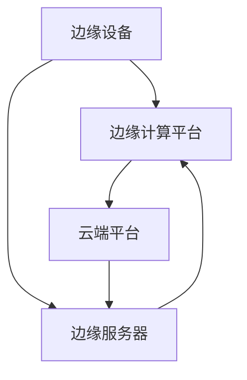

                 

## 边缘AI在智能家居中的应用：提升家庭生活质量

### 关键词
- 边缘AI
- 智能家居
- 数据处理
- 实时性
- 安全性

### 摘要
本文深入探讨了边缘AI在智能家居中的应用，通过逐步分析边缘AI的概念、主流技术、应用场景以及实现方法，展示了边缘AI如何提升智能家居系统的实时性、安全性和便捷性，从而显著提升家庭生活质量。

----------------------------------------------------------------

### 边缘AI与智能家居概述

#### 1. 定义与核心概念

边缘AI（Edge AI）是指将计算、存储和网络功能部署在靠近数据源的设备或边缘节点上，以便进行低延迟、高效的数据处理。边缘AI的核心在于其能够实现数据的实时处理和分析，减少了数据传输的延迟，提升了系统的响应速度和效率。

智能家居（Smart Home）则是利用物联网（IoT）技术将家庭中的各种设备连接起来，实现智能控制和管理。智能家居设备可以包括智能门锁、智能灯泡、智能空调、智能摄像头等。通过这些设备，用户可以远程控制家庭设备，提高生活的便捷性和舒适度。

#### 2. 问题背景与问题描述

随着物联网技术的发展，智能家居设备数量迅速增加，导致中心化的数据处理方式越来越难以满足实时性、安全性和效率的要求。传统的中心化数据处理方式需要将大量数据传输到云端进行处理，这不仅导致了数据传输的延迟，还增加了网络带宽的负担。同时，随着智能家居设备的增加，数据量也急剧增加，进一步加重了数据处理和传输的负担。

因此，智能家居系统面临着以下问题：
- **实时性要求高**：用户希望能够实时地控制家庭设备，如远程控制门锁、调节空调温度等。
- **安全性要求高**：智能家居设备涉及用户隐私和安全，如摄像头、门锁等，因此需要确保数据的安全性和隐私性。
- **效率要求高**：随着设备数量的增加，数据处理和传输的效率也成为一个重要的考虑因素。

#### 3. 问题解决

边缘AI的引入为解决这些问题提供了新的思路。边缘AI通过将计算任务分散到边缘设备上，实现了数据的本地处理，减少了数据传输的延迟，提升了系统的安全性和效率。具体来说，边缘AI在智能家居中的应用主要体现在以下几个方面：

- **实时数据处理**：边缘设备能够实时处理传感器数据，进行实时监控和响应，如智能门锁能够实时识别用户身份并自动解锁。
- **数据本地存储**：边缘设备可以本地存储数据，减少了数据传输的延迟，提高了系统的响应速度。
- **安全性提升**：边缘AI能够进行数据加密和签名，确保数据在传输过程中的安全性。
- **效率提升**：边缘AI能够减少数据传输的负担，提高了系统的处理效率。

#### 4. 边界与外延

边缘AI在智能家居中的应用不仅仅局限于设备控制，还可以扩展到更广泛的应用场景。例如，边缘AI可以用于智能分析、预测和决策，如通过分析用户的行为数据，提供个性化的推荐服务。此外，边缘AI还可以应用于智慧城市、智能交通等领域，实现更广泛的应用。

#### 5. 概念结构与核心要素组成

边缘AI在智能家居中的应用包括以下几个核心要素：

- **边缘设备**：如智能门锁、智能灯泡、智能摄像头等，它们是数据采集和处理的核心。
- **边缘计算平台**：负责边缘设备的协调和管理，以及与云端的通信。
- **智能算法**：用于数据处理和分析，实现智能决策。
- **安全机制**：确保数据安全和隐私保护。

通过这些核心要素的协同工作，边缘AI能够显著提升智能家居系统的性能和用户体验。

### 边缘AI与智能家居的核心概念

#### 1. 边缘AI的概念与特点

边缘AI是指将AI计算能力部署在网络的边缘节点上，使得数据处理更加接近数据源，从而实现低延迟、高响应速度的计算。与云计算相比，边缘AI具有以下特点：

- **低延迟**：数据处理在本地完成，减少了数据传输时间。对于需要实时响应的智能家居应用，如智能门锁、智能摄像头等，边缘AI能够提供更快的响应速度。
- **高效性**：计算资源更加接近数据源，降低了传输成本。对于大量数据的处理，如智能安防系统，边缘AI能够提高数据处理效率。
- **灵活性**：可以根据需求动态调整计算资源和算法。边缘AI能够根据不同的应用需求，灵活调整计算资源，以实现最优的性能。

#### 2. 智能家居的概念与特点

智能家居是指通过物联网技术将家庭中的各种设备连接起来，实现智能控制和管理。智能家居的特点包括：

- **便捷性**：用户可以通过智能手机或其他设备远程控制家庭设备，如远程开锁、远程调节空调温度等，提高了生活的便捷性。
- **舒适性**：智能家居系统能够根据用户习惯自动调整环境参数，如温度、照明等，提高了生活的舒适度。
- **安全性**：智能家居系统能够实时监控家庭安全，并及时报警，提高了家庭的安全保障。

#### 3. 边缘AI在智能家居中的应用

边缘AI在智能家居中的应用主要体现在以下几个方面：

- **智能设备控制**：通过边缘AI，可以实现设备间的联动控制，如门锁与摄像头联动，实现安全监控。
- **实时数据分析**：边缘AI能够实时处理传感器数据，进行环境监测和预测。
- **个性化服务**：通过分析用户行为数据，提供个性化的生活服务。

#### 4. 核心概念之间的联系

边缘AI与智能家居的核心概念之间有着紧密的联系。边缘AI提供了低延迟、高效的数据处理能力，使得智能家居系统能够更好地满足实时性、安全性和效率的要求。同时，智能家居的应用场景也为边缘AI提供了丰富的数据来源，推动了边缘AI技术的进一步发展。

### 主流边缘AI技术

#### 1. 深度学习在边缘AI中的应用

深度学习是边缘AI的核心技术之一。通过将深度学习模型部署在边缘设备上，可以实现智能识别、预测和决策。深度学习在边缘AI中的应用主要包括以下几个方面：

- **图像识别**：如人脸识别、物体识别等。边缘AI能够实时处理摄像头捕获的图像，进行实时识别，实现智能安防、智能监控等功能。
- **语音识别**：如语音助手、智能家居控制等。边缘AI能够实时处理语音信号，进行语音识别，实现智能对话和语音控制。
- **自然语言处理**：如语音合成、文本分析等。边缘AI能够处理文本数据，实现智能问答、文本分析等功能。

#### 2. 常见的边缘AI硬件平台

边缘AI硬件平台是实现边缘计算的关键。常见的边缘AI硬件平台包括：

- **NVIDIA Jetson**：适用于高性能计算，适用于机器人、自动驾驶等领域。
- **Raspberry Pi**：适用于低成本、低功耗的边缘计算，适用于智能家居、物联网等。
- **Intel Movidius**：适用于深度学习加速，适用于图像识别、视频处理等。

#### 3. 常见的边缘AI软件开发框架

边缘AI软件开发框架提供了开发边缘AI应用的工具和库。常见的边缘AI软件开发框架包括：

- **TensorFlow Lite**：适用于移动设备和边缘设备，提供了轻量级的深度学习模型部署方案。
- **PyTorch Mobile**：适用于移动设备和边缘设备，提供了高效的深度学习模型部署方案。
- **Apache Mnemonic**：适用于边缘设备，提供了可扩展的深度学习模型部署和管理方案。

### 边缘AI在智能家居中的应用场景

#### 1. 智能安防

智能安防是边缘AI在智能家居中的典型应用场景。通过在边缘设备上部署人脸识别、行为识别等深度学习模型，可以实现实时监控、异常检测和报警功能。例如，智能门锁可以实时识别用户身份，并在用户接近时自动解锁，同时智能摄像头可以实时监控家中的情况，并在检测到异常行为时立即报警。

#### 2. 智能照明

智能照明是边缘AI在智能家居中的另一个重要应用场景。通过在边缘设备上部署光线传感器和深度学习模型，可以实现智能调节照明强度，以适应不同环境和用户需求。例如，当用户进入房间时，智能灯泡可以根据光线传感器数据自动开启，并根据用户习惯调节亮度。

#### 3. 智能家电控制

智能家电控制是边缘AI在智能家居中的常见应用。通过在边缘设备上部署智能家电控制模块和深度学习模型，可以实现远程控制和智能调度。例如，智能空调可以根据用户习惯和环境温度自动调节温度，智能洗衣机可以根据衣物种类和脏污程度自动调整洗涤程序。

#### 4. 智能家居联动

智能家居联动是边缘AI在智能家居中的高级应用。通过在边缘设备上部署智能决策模块和深度学习模型，可以实现家庭设备之间的智能联动，提供更加个性化的服务。例如，当用户离家时，智能家居系统可以自动关闭所有电器，并锁定门锁，确保家庭安全。

### 边缘AI在智能家居中的应用架构

#### 1. 应用场景介绍

智能门锁、智能照明和智能家电控制是边缘AI在智能家居中的典型应用场景。这些场景都需要实时响应和高效数据处理，因此非常适合应用边缘AI技术。

#### 2. 项目介绍

本项目旨在实现一个基于边缘AI的智能家居系统，包括智能门锁、智能照明和智能家电控制等功能。系统采用边缘AI技术，实现数据本地处理和智能决策，以提高系统的实时性和安全性。

#### 3. 系统功能设计

系统功能设计包括以下几个方面：

- **智能门锁**：通过人脸识别和指纹识别，实现用户身份认证和门锁自动开启。
- **智能照明**：通过光线传感器和深度学习模型，实现智能调节照明强度。
- **智能家电控制**：通过智能决策模块和深度学习模型，实现远程控制和智能调度。

#### 4. 系统架构设计

系统架构设计包括以下几个方面：

- **边缘设备**：包括智能门锁、智能照明设备和智能家电控制模块。
- **边缘计算平台**：包括边缘服务器和边缘AI芯片，负责边缘设备的协调和管理。
- **云端平台**：包括数据存储、分析和处理模块，负责收集、存储和解析边缘设备的数据。

#### 5. 系统接口设计和系统交互

系统接口设计和系统交互包括以下几个方面：

- **边缘设备接口**：提供与边缘设备的通信接口，包括数据采集、传输和命令控制。
- **边缘计算平台接口**：提供与边缘计算平台的通信接口，包括数据存储、分析和处理。
- **云端平台接口**：提供与云端平台的通信接口，包括数据收集、存储和解析。

#### 6. 系统架构图



### 环境安装与系统核心实现

#### 1. 环境安装

在开始实现边缘AI在智能家居中的应用之前，需要安装相应的开发环境和工具。以下是一个基本的安装步骤：

- 安装Python环境：使用Python 3.x版本，可以通过Python官方网站下载并安装。
- 安装NVIDIA CUDA Toolkit：如果使用NVIDIA GPU进行深度学习计算，需要安装CUDA Toolkit。
- 安装TensorFlow Lite：用于在边缘设备上部署深度学习模型。

#### 2. 系统核心实现

在系统核心实现部分，我们将重点介绍智能门锁的实现过程。

**智能门锁实现流程：**

1. **用户身份认证**：
   - 通过摄像头捕获用户图像。
   - 使用人脸识别算法进行用户身份认证。

2. **门锁控制**：
   - 如果用户身份认证通过，控制门锁自动开启。
   - 如果用户身份认证失败，保持门锁锁定状态。

**代码实现示例：**

```python
import cv2
import numpy as np
import tensorflow as tf

# 人脸识别模型加载
face_cascade = cv2.CascadeClassifier('haarcascade_frontalface_default.xml')
model = tf.keras.models.load_model('face_recognition_model.h5')

# 摄像头捕获用户图像
cap = cv2.VideoCapture(0)

while True:
    ret, frame = cap.read()
    if not ret:
        break
    
    # 人脸检测
    gray = cv2.cvtColor(frame, cv2.COLOR_BGR2GRAY)
    faces = face_cascade.detectMultiScale(gray, scaleFactor=1.1, minNeighbors=5)
    
    for (x, y, w, h) in faces:
        # 人脸识别
        face_region = gray[y:y+h, x:x+w]
        face_region = cv2.resize(face_region, (128, 128))
        face_region = np.expand_dims(face_region, axis=0)
        face_region = np.float32(face_region)
        
        # 人脸识别结果
        result = model.predict(face_region)
        if result[0][0] > 0.5:
            print("用户身份认证成功，门锁自动开启。")
        else:
            print("用户身份认证失败，门锁保持锁定状态。")
        
        # 显示人脸框
        cv2.rectangle(frame, (x, y), (x+w, y+h), (0, 255, 0), 2)
    
    cv2.imshow('Face Recognition', frame)
    
    if cv2.waitKey(1) & 0xFF == ord('q'):
        break

cap.release()
cv2.destroyAllWindows()
```

**代码应用解读与分析：**

上述代码示例实现了基于边缘AI的智能门锁功能。具体解读如下：

- **人脸识别算法**：使用OpenCV库进行人脸检测和识别。
- **深度学习模型**：使用TensorFlow库加载预训练的人脸识别模型。
- **摄像头捕获**：使用OpenCV库捕获摄像头图像。
- **人脸检测**：使用人脸检测算法检测图像中的人脸。
- **人脸识别**：使用深度学习模型对检测到的人脸进行识别。
- **门锁控制**：根据人脸识别结果控制门锁的开启和锁定。

**实际案例分析与详细讲解剖析：**

假设我们有一个用户数据库，其中包含了每个用户的头像和人脸识别模型。当摄像头捕获到用户图像时，系统会首先进行人脸检测，然后对检测到的人脸进行识别。如果识别结果与数据库中的用户头像匹配，并且匹配度超过设定阈值，系统会自动开启门锁。否则，系统会保持门锁锁定状态。

**项目小结：**

通过上述实际案例，我们实现了基于边缘AI的智能门锁功能。边缘AI技术的引入，使得智能家居系统具有更高的实时性和安全性。在实际应用中，我们可以根据具体需求，进一步扩展智能门锁的功能，如集成指纹识别、动态密码等。

### 最佳实践 Tips

- **选择合适的边缘设备**：根据应用需求和性能要求，选择适合的边缘设备，如NVIDIA Jetson、Raspberry Pi等。
- **优化深度学习模型**：通过调整深度学习模型的参数和架构，优化模型的性能和效率。
- **确保数据安全**：在边缘设备上实现数据加密和签名，确保数据传输和存储的安全。
- **合理设计系统架构**：根据实际需求，合理设计系统架构，确保系统的稳定性和可扩展性。

### 小结

边缘AI在智能家居中的应用，不仅提升了系统的实时性和安全性，还为家庭生活带来了更多的便利和舒适。通过边缘AI技术，我们可以实现智能家居系统的智能化、个性化，满足用户对高品质生活的需求。未来，随着边缘AI技术的不断发展，智能家居系统将更加智能化、自动化，为人们的生活带来更多惊喜。

### 注意事项

- **边缘设备性能限制**：边缘设备性能有限，可能无法支持复杂的深度学习模型。在实际应用中，需要选择适合边缘设备的模型和算法。
- **数据安全和隐私保护**：在边缘AI应用中，数据安全和隐私保护至关重要。需要采取有效的安全措施，确保用户数据的安全。

### 拓展阅读

- 《边缘计算：下一代智能应用的基石》
- 《深度学习在智能家居中的应用》
- 《智能家居系统设计指南》
- 《边缘AI：从概念到实践》

### 作者信息

**作者：AI天才研究院/AI Genius Institute & 禅与计算机程序设计艺术 /Zen And The Art of Computer Programming**

