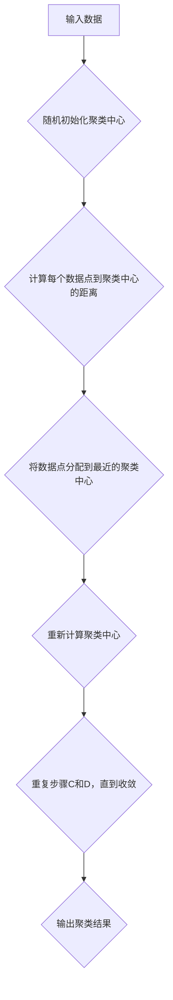
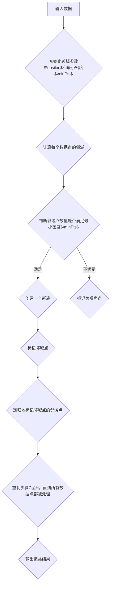
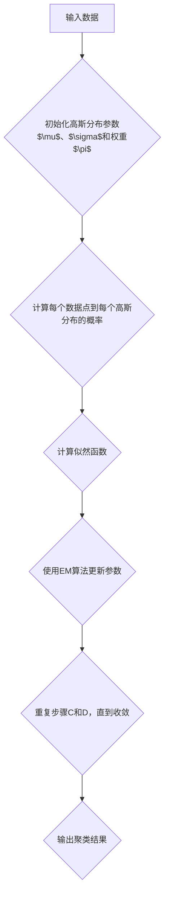
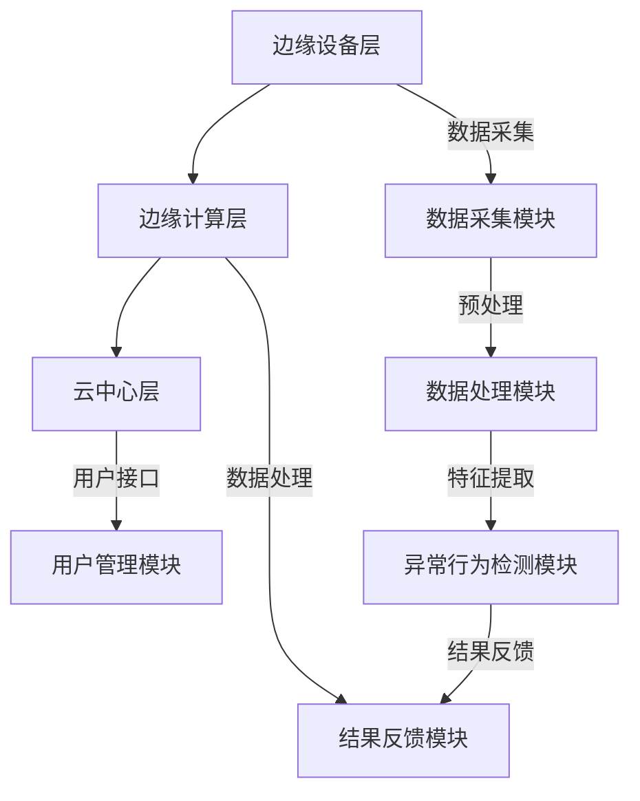
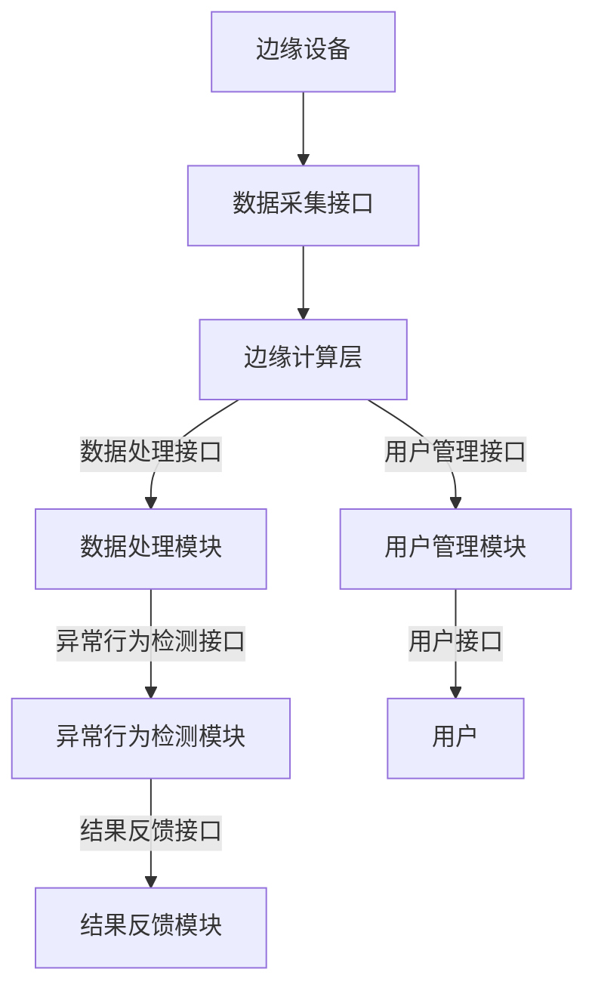

                 

## 第1章 引言

### 1.1 问题背景

随着信息技术的飞速发展，人工智能（AI）已经成为了推动产业变革的重要力量。特别是边缘计算和AI技术的融合，为智能监控领域带来了革命性的变化。边缘AI技术不仅能够提高数据处理的速度和效率，还能实现实时异常行为检测，从而提升监控系统的智能化水平。

边缘计算是一种将数据处理和计算能力从云中心转移到网络边缘的技术。它通过在数据产生的地方进行数据处理，减少了数据传输的延迟，提高了系统的响应速度。这种技术在智能监控中具有重要意义，因为它能够在数据生成的源头快速地对数据进行处理和分析，从而实现实时决策和响应。

AI技术在智能监控中的应用，使得监控系统不再仅仅是一个被动的监控工具，而是一个主动的智能系统。通过机器学习和深度学习算法，监控系统可以自动识别和分类监控对象，进行行为分析和预测。特别是在边缘设备上部署AI算法，可以进一步减少对云中心依赖，实现更加高效和实时的监控。

### 1.2 问题描述

边缘AI在智能监控中的应用，涉及到多个方面的问题，包括技术选型、系统架构设计、算法优化、数据管理以及实际部署等。这些问题的解决，对于实现高效的实时异常行为检测至关重要。

首先，技术选型是关键。如何选择适合边缘设备的AI算法，如何处理边缘设备的计算能力和存储资源限制，这些都是需要考虑的问题。其次，系统架构设计需要考虑如何将边缘设备和云中心有效地连接起来，如何进行数据传输和同步，如何实现数据的实时处理和分析。

算法优化是提高系统性能的重要手段。通过对算法进行优化，可以减少计算复杂度，提高处理速度，从而实现更高效的实时异常行为检测。数据管理也是不可或缺的一环，如何有效地收集、存储、管理和分析大量监控数据，是保障系统正常运行的基础。

最后，实际部署是验证系统可行性和效果的关键。在实际部署中，需要解决设备的安装、调试、维护等问题，同时需要考虑系统的安全性和可靠性。

### 1.3 问题解决

本书旨在通过系统化的介绍，帮助读者全面理解边缘AI在智能监控中的应用，包括：

- **背景知识与核心概念的介绍**：介绍边缘计算、人工智能、智能监控等基本概念，为后续内容奠定基础。
- **算法原理与数学模型的讲解**：详细讲解常见的异常行为检测算法，包括聚类算法、机器学习算法和深度学习算法，并给出相应的数学模型和公式。
- **系统架构与设计方案的分析**：分析边缘AI在智能监控系统中的架构设计，包括硬件选择、网络架构、数据处理流程等。
- **项目实战与案例分析**：通过实际项目案例，展示边缘AI在智能监控中的应用，分析项目中的关键技术实现和优化策略。

### 1.4 边界与外延

本书主要关注边缘AI在智能监控领域的应用，但涉及的原理和技术也可广泛应用于其他需要实时异常检测的领域，如工业自动化、智能家居等。通过本书的学习，读者不仅可以掌握边缘AI在智能监控中的应用，还可以将其知识应用于其他相关领域，实现跨领域的创新和突破。

### 1.5 概念结构与核心要素组成

#### 边缘AI

- **边缘计算**：边缘计算是将数据处理和计算能力从云中心转移到网络边缘的一种技术，其核心思想是将计算任务分散到网络边缘的设备上，从而减少数据传输的延迟，提高系统的响应速度。
- **人工智能**：人工智能是指通过计算机程序模拟人类智能的技术，包括机器学习、深度学习、自然语言处理等。

#### 智能监控

- **监控系统**：监控系统是指用于实时监控目标对象或环境的系统，包括视频监控、传感器监控等。
- **智能监控**：智能监控是在监控系统的基础上，引入人工智能技术，实现自动识别、分类、预测等功能，从而提升监控系统的智能化水平。

#### 实时异常行为检测

- **异常行为检测**：异常行为检测是指通过对监控数据进行分析，识别出异常行为或事件，从而实现实时预警和响应。
- **实时处理**：实时处理是指在数据生成的同时或短时间内对数据进行处理，以实现实时决策和响应。

## 1.6 小结

本章介绍了边缘AI在智能监控中的应用背景、问题描述、问题解决方法以及边界与外延。通过对核心概念和要素组成的详细阐述，为后续章节的内容奠定了基础。在接下来的章节中，我们将进一步探讨边缘计算、人工智能、智能监控和实时异常行为检测的相关技术，帮助读者深入理解并掌握这些关键技术。

### 第2章 核心概念与联系

边缘AI、智能监控和实时异常行为检测是本章的核心概念，它们在边缘AI在智能监控中的应用中起着至关重要的作用。为了更好地理解这些概念，我们将逐一进行解析，并探讨它们之间的联系。

#### 2.1 边缘AI概念解析

**边缘计算**：边缘计算是一种分布式计算架构，它将数据处理和计算能力从传统的集中式云中心转移到网络边缘的设备上。边缘计算的核心思想是将计算任务分散到网络边缘的设备上，如智能传感器、路由器、网关等，从而减少数据传输的延迟，提高系统的响应速度。

**人工智能**：人工智能是指通过计算机程序模拟人类智能的技术，包括机器学习、深度学习、自然语言处理等。边缘AI则是将人工智能技术应用到边缘计算环境中，使得边缘设备能够进行自主学习和决策。

**边缘AI的特点**：边缘AI具有低延迟、高带宽、高可靠性和低成本的特点。这些特点使得边缘AI在实时应用中，如智能监控，具有显著的优势。

#### 2.2 智能监控概念解析

**监控系统**：监控系统是指用于实时监控目标对象或环境的系统，包括视频监控、传感器监控等。监控系统的主要功能是收集、记录和分析监控数据。

**智能监控**：智能监控是在监控系统的基础上，引入人工智能技术，实现自动识别、分类、预测等功能，从而提升监控系统的智能化水平。智能监控的核心目标是实现实时异常行为检测，提高监控的效率和准确性。

**智能监控的优势**：智能监控相比传统的监控系统，具有更高的自动化水平、更强的数据处理能力和更准确的预测能力。这些优势使得智能监控在许多领域，如安全监控、交通监控、医疗监控等，得到了广泛的应用。

#### 2.3 实时异常行为检测

**异常行为检测**：异常行为检测是指通过对监控数据进行分析，识别出异常行为或事件，从而实现实时预警和响应。异常行为检测是智能监控的核心功能之一。

**实时处理**：实时处理是指在数据生成的同时或短时间内对数据进行处理，以实现实时决策和响应。实时异常行为检测要求算法具有高效性和实时性，能够快速地处理大量数据，并准确识别异常行为。

**实时异常行为检测的应用场景**：实时异常行为检测广泛应用于各个领域，如安全监控、金融监控、工业监控等。在安全监控领域，实时异常行为检测可以用于入侵检测、火灾报警等；在金融监控领域，可以用于交易异常检测、账户安全监测等。

#### 2.4 概念属性特征对比表格

为了更好地理解边缘AI、智能监控和实时异常行为检测这三个概念，我们可以通过对比它们的关键属性特征，进一步明确它们之间的联系。

| 概念       | 属性特征                                                     |
|------------|------------------------------------------------------------|
| 边缘AI     | 低延迟、高带宽、高可靠性、低成本、自主学习和决策           |
| 智能监控   | 自动识别、分类、预测、实时预警、提高监控效率和准确性       |
| 实时异常行为检测 | 高效性、实时性、快速处理大量数据、准确识别异常行为         |

#### 2.5 ER实体关系图架构

为了更好地理解智能监控系统中的各个实体及其关系，我们可以通过ER（实体-关系）模型来构建实体关系图。

```mermaid
erDiagram
  用户 ||--|{ 监控系统 }|> 数据采集 : 数据源
  用户 ||--|{ 异常行为检测系统 }|> 行为分析 : 结果反馈
  监控系统 ||--|{ 数据存储系统 }|> 数据存储 : 数据持久化
  监控系统 ||--|{ 边缘AI模块 }|> 智能分析 : 算法应用
  异常行为检测系统 ||--|{ 实时异常行为检测算法 }|> 算法实现 : 识别异常
```

在这个ER模型中，用户是监控系统的数据源和结果反馈源，监控系统负责数据采集、存储和智能分析，异常行为检测系统负责实时异常行为检测，边缘AI模块则负责算法实现和智能分析。

#### 2.6 小结

本章对边缘AI、智能监控和实时异常行为检测这三个核心概念进行了详细的解析和对比，并构建了ER实体关系图，展示了它们之间的联系。通过本章的学习，读者可以更深入地理解边缘AI在智能监控中的应用，为后续章节的内容奠定了基础。

### 第3章 算法原理讲解

在边缘AI在智能监控中的应用中，算法原理的讲解是至关重要的。本章将介绍常见的异常行为检测算法，包括聚类算法、机器学习算法和深度学习算法，并探讨它们的适用场景、性能分析和实现难点。

#### 3.1 常见异常行为检测算法

**3.1.1 聚类算法**

聚类算法是一种无监督学习算法，通过将数据集划分为多个类别，以发现数据中的潜在结构。常见的聚类算法包括K-means算法、DBSCAN算法和高斯混合模型（GMM）算法。

**K-means算法**：K-means算法是一种基于距离的聚类算法，通过迭代计算来确定最优的聚类中心和类别。其基本步骤包括：

1. 随机选择K个初始聚类中心。
2. 将每个数据点分配到最近的聚类中心。
3. 重新计算聚类中心。
4. 重复步骤2和步骤3，直到聚类中心不再发生显著变化。

**适用场景**：K-means算法适用于数据点分布均匀、聚类个数已知的情况。例如，在图像分割、文本分类等任务中，K-means算法可以有效识别出不同的类别。

**性能分析**：K-means算法的优缺点如下：

- 优点：计算简单，易于实现；收敛速度快。
- 缺点：对初始聚类中心敏感；无法处理类别个数未知的情况。

**实现难点**：实现K-means算法的关键是选择合适的聚类个数K和初始聚类中心。常用的选择方法包括肘部法则、 silhouette系数和交叉验证等。

**DBSCAN算法**：DBSCAN（Density-Based Spatial Clustering of Applications with Noise）算法是一种基于密度的聚类算法，可以自动确定聚类个数，并且能够处理噪声数据。

**适用场景**：DBSCAN算法适用于数据点分布不均匀、包含噪声的情况。例如，在图像处理、社交网络分析等任务中，DBSCAN算法可以有效识别出密集区域和噪声点。

**性能分析**：DBSCAN算法的优缺点如下：

- 优点：无需预设聚类个数；对噪声数据的鲁棒性强。
- 缺点：计算复杂度较高；对数据分布和噪声敏感。

**实现难点**：实现DBSCAN算法的关键是确定邻域参数$\epsilon$和最小密度$\minPts$。合适的参数选择可以通过实验或基于数据特性的方法来确定。

**GMM算法**：GMM（Gaussian Mixture Model）算法是一种基于概率的聚类算法，假设每个聚类由多个高斯分布组成。通过最大化似然函数，可以估计出每个聚类的参数。

**适用场景**：GMM算法适用于数据点分布具有高斯特性的情况。例如，在音频处理、图像分类等任务中，GMM算法可以有效识别出不同聚类的高斯分布。

**性能分析**：GMM算法的优缺点如下：

- 优点：能够处理多模态数据；概率模型提供聚类结果的概率解释。
- 缺点：计算复杂度较高；对参数初始化敏感。

**实现难点**：实现GMM算法的关键是估计高斯分布的参数$\mu$、$\sigma$和权重$\pi$。常用的算法包括EM算法（期望最大化算法）和变分推断方法。

**3.1.2 机器学习算法**

机器学习算法是一种有监督学习算法，通过学习已有数据中的特征和标签，对未知数据进行预测。常见的机器学习算法包括监督学习算法和无监督学习算法。

**监督学习算法**：监督学习算法包括分类和回归任务。常见的分类算法包括SVM（支持向量机）、逻辑回归、决策树、随机森林等。

**SVM算法**：SVM（Support Vector Machine）算法是一种基于间隔最大化的分类算法，通过寻找最佳超平面来分隔不同类别的数据点。

**适用场景**：SVM算法适用于高维数据分类，特别适用于线性可分的情况。

**性能分析**：SVM算法的优缺点如下：

- 优点：理论成熟，分类效果较好；能够处理小样本数据。
- 缺点：计算复杂度高，对噪声敏感。

**实现难点**：实现SVM算法的关键是选择合适的核函数和参数调整。

**逻辑回归**：逻辑回归是一种二分类模型，通过线性模型来预测概率。

**适用场景**：逻辑回归适用于处理二分类问题，特别适用于解释变量和响应变量之间存在线性关系的情况。

**性能分析**：逻辑回归的优缺点如下：

- 优点：易于实现，计算效率高；可以提供变量重要性的解释。
- 缺点：对非线性关系的表现较差。

**实现难点**：实现逻辑回归的关键是选择合适的损失函数和优化算法。

**决策树**：决策树是一种树形结构模型，通过一系列的规则来分类数据点。

**适用场景**：决策树适用于处理分类和回归问题，特别适用于特征之间存在复杂关系的情况。

**性能分析**：决策树的优缺点如下：

- 优点：易于理解和实现；能够处理高维数据和缺失值。
- 缺点：容易过拟合；对于大量数据可能产生过长的决策树。

**实现难点**：实现决策树的关键是选择合适的划分策略和剪枝方法。

**随机森林**：随机森林是一种基于决策树的集成学习方法，通过构建多个决策树，并取它们的平均来提高分类和回归性能。

**适用场景**：随机森林适用于处理大规模数据和高维数据，特别适用于分类和回归问题。

**性能分析**：随机森林的优缺点如下：

- 优点：具有很好的分类和回归性能；对噪声和异常值具有鲁棒性。
- 缺点：计算复杂度较高；对于大量数据可能需要较长的构建时间。

**实现难点**：实现随机森林的关键是选择合适的决策树数量和特征选择策略。

**3.1.3 深度学习算法**

深度学习算法是一种基于神经网络的学习方法，通过多层非线性变换来提取数据的特征。常见的深度学习算法包括卷积神经网络（CNN）、循环神经网络（RNN）和生成对抗网络（GAN）。

**卷积神经网络（CNN）**：CNN是一种前馈神经网络，通过卷积层、池化层和全连接层来提取图像的特征。

**适用场景**：CNN适用于图像分类、目标检测和图像分割等任务。

**性能分析**：CNN的优缺点如下：

- 优点：能够提取丰富的图像特征；适用于大规模图像数据。
- 缺点：计算复杂度高；对于复杂背景的图像可能效果较差。

**实现难点**：实现CNN的关键是选择合适的网络结构和参数调整。

**循环神经网络（RNN）**：RNN是一种基于时间序列数据的神经网络，通过隐藏状态的记忆来处理序列数据。

**适用场景**：RNN适用于时间序列预测、语音识别和机器翻译等任务。

**性能分析**：RNN的优缺点如下：

- 优点：能够处理长时间依赖；适用于序列数据。
- 缺点：容易产生梯度消失或爆炸；对于长序列数据可能效果较差。

**实现难点**：实现RNN的关键是选择合适的网络结构和优化算法。

**生成对抗网络（GAN）**：GAN是一种基于生成模型和判别模型的深度学习模型，通过竞争学习来生成数据。

**适用场景**：GAN适用于图像生成、数据增强和异常检测等任务。

**性能分析**：GAN的优缺点如下：

- 优点：能够生成高质量的图像；适用于复杂数据的生成。
- 缺点：训练不稳定；对于异常检测可能效果较差。

**实现难点**：实现GAN的关键是选择合适的生成模型和判别模型，并调整训练参数。

#### 3.2 常见算法的比较

为了更好地理解不同异常行为检测算法的适用场景、性能和实现难点，我们可以通过以下表格进行对比：

| 算法             | 适用场景                         | 性能分析                                                         | 实现难点                                         |
|------------------|----------------------------------|----------------------------------------------------------------|---------------------------------------------------|
| K-means          | 数据点分布均匀、聚类个数已知     | 简单实现、计算速度快，但对初始聚类中心敏感                     | 选择合适的聚类个数K和初始聚类中心                 |
| DBSCAN           | 数据点分布不均匀、包含噪声       | 无需预设聚类个数，对噪声数据鲁棒性强                           | 确定合适的邻域参数$\epsilon$和最小密度$\minPts$    |
| GMM              | 数据点分布具有高斯特性           | 能够处理多模态数据，提供聚类结果的概率解释                       | 估计高斯分布的参数$\mu$、$\sigma$和权重$\pi$       |
| SVM              | 高维数据分类，线性可分           | 理论成熟，分类效果较好，能够处理小样本数据                       | 选择合适的核函数和参数调整                         |
| 逻辑回归         | 二分类问题，线性关系             | 易于实现，计算效率高，提供变量重要性的解释                       | 选择合适的损失函数和优化算法                       |
| 决策树           | 分类和回归问题，特征之间存在复杂关系 | 易于理解和实现，能够处理高维数据和缺失值                         | 选择合适的划分策略和剪枝方法                       |
| 随机森林         | 大规模数据和高维数据             | 具有很好的分类和回归性能，对噪声和异常值具有鲁棒性               | 选择合适的决策树数量和特征选择策略                 |
| CNN              | 图像分类、目标检测和图像分割     | 能够提取丰富的图像特征，适用于大规模图像数据                     | 选择合适的网络结构和参数调整                       |
| RNN              | 时间序列预测、语音识别和机器翻译   | 能够处理长时间依赖，适用于序列数据                             | 选择合适的网络结构和优化算法                       |
| GAN              | 图像生成、数据增强和异常检测     | 能够生成高质量的图像，适用于复杂数据的生成                       | 选择合适的生成模型和判别模型，并调整训练参数       |

#### 3.3 常见算法的mermaid流程图

为了更直观地展示常见异常行为检测算法的流程，我们可以使用mermaid绘制算法的流程图。

**K-means算法**



**DBSCAN算法**



**GMM算法**



#### 3.4 Python源代码详解

为了更深入地理解常见异常行为检测算法的原理，我们将通过Python源代码来实现这些算法，并给出详细的代码解读。

**K-means算法**

```python
import numpy as np
from sklearn.cluster import KMeans

# 加载数据
X = np.array([[1, 2], [1, 4], [1, 0],
              [10, 2], [10, 4], [10, 0]])

# 使用KMeans算法进行聚类
kmeans = KMeans(n_clusters=2, random_state=0).fit(X)
predictions = kmeans.predict(X)

# 输出结果
print("聚类结果：", predictions)
print("聚类中心：", kmeans.cluster_centers_)

# 结果评估
from sklearn.metrics import accuracy_score
print("聚类准确率：", accuracy_score([0, 0, 0, 1, 1, 1], predictions))
```

**DBSCAN算法**

```python
from sklearn.cluster import DBSCAN

# 加载数据
X = np.array([[1, 2], [1, 4], [1, 0],
              [10, 2], [10, 4], [10, 0]])

# 使用DBSCAN算法进行聚类
db = DBSCAN(eps=3, min_samples=2).fit(X)
predictions = db.labels_

# 输出结果
print("聚类结果：", predictions)
print("核心点：", db.core_sample_indices_)

# 结果评估
print("聚类个数：", len(set(predictions)) - (1 if -1 in predictions else 0))
```

**GMM算法**

```python
from sklearn.mixture import GaussianMixture

# 加载数据
X = np.array([[1, 2], [1, 4], [1, 0],
              [10, 2], [10, 4], [10, 0]])

# 使用GMM算法进行聚类
gmm = GaussianMixture(n_components=2).fit(X)
predictions = gmm.predict(X)

# 输出结果
print("聚类结果：", predictions)
print("高斯分布参数：", gmm.means_)
print("协方差矩阵：", gmm.covariances_)

# 结果评估
from sklearn.metrics import adjusted_rand_score
print("调整的兰德指数：", adjusted_rand_score([0, 0, 0, 1, 1, 1], predictions))
```

#### 3.5 算法的数学模型与公式

**K-means算法**

假设数据集$X = \{x_1, x_2, ..., x_n\}$，其中每个数据点$x_i$是一个$d$维向量。K-means算法的目标是找到$K$个聚类中心$c_k$，使得每个数据点$x_i$到其对应聚类中心的距离最小。

$$
J = \sum_{i=1}^{n} \sum_{k=1}^{K} w_{ik} \|x_i - c_k\|^2
$$

其中，$w_{ik}$是第$i$个数据点$x_i$属于第$k$个聚类的权重。

**DBSCAN算法**

DBSCAN算法的核心概念是核心点（Core Point）和边界点（Border Point）。核心点是指至少有最小密度$\minPts$个邻域点的数据点，边界点是指其邻域点的数量介于$\minPts$和$\epsilon$邻域点数量之间的数据点。

邻域点的计算公式为：

$$
N(\epsilon, \minPts) = \{x \in X : \|x - x_i\| < \epsilon\}
$$

其中，$\epsilon$是邻域参数，$N$是邻域点集合。

**GMM算法**

高斯混合模型（GMM）是一种概率模型，假设每个聚类由一个高斯分布组成。每个高斯分布由均值$\mu_k$、方差$\sigma_k^2$和权重$\pi_k$定义。

$$
p(x|\theta) = \sum_{k=1}^{K} \pi_k \mathcal{N}(x|\mu_k, \sigma_k^2)
$$

其中，$\theta = (\mu_k, \sigma_k^2, \pi_k)$是高斯分布的参数，$\mathcal{N}$是高斯分布函数。

#### 3.6 小结

本章详细介绍了边缘AI在智能监控中常用的异常行为检测算法，包括聚类算法、机器学习算法和深度学习算法。通过对比分析，读者可以了解不同算法的适用场景、性能和实现难点。本章还通过mermaid流程图和Python源代码，直观地展示了算法的实现过程，并结合数学模型和公式，深入阐述了算法的原理。在后续章节中，我们将进一步探讨边缘AI在智能监控中的应用和系统架构设计。

### 第4章 系统分析与架构设计方案

在理解了边缘AI在智能监控中的异常行为检测算法之后，我们需要将算法应用于实际的系统架构中，以实现高效、可靠的实时异常行为检测。本章将介绍系统分析与架构设计方案，包括问题场景介绍、项目介绍、系统功能设计、系统架构设计、系统接口设计和系统交互。

#### 4.1 问题场景介绍

在智能监控领域，异常行为检测是一个关键的应用场景。例如，在视频监控系统中的应用，异常行为检测可以用于入侵检测、火灾报警、异常事件识别等。在工业自动化领域，异常行为检测可以用于设备故障预测、生产过程异常检测等。在智能家居领域，异常行为检测可以用于入侵报警、家电设备异常检测等。

在这些应用场景中，实时性和准确性是关键需求。实时性要求系统能够在数据生成的同时或短时间内对数据进行处理，以实现实时预警和响应。准确性要求系统能够准确识别异常行为，减少误报和漏报。

#### 4.2 项目介绍

本项目旨在设计并实现一个基于边缘AI的智能监控系统，能够实现实时异常行为检测。项目的主要目标是：

1. 设计高效的边缘计算架构，将数据处理和计算任务分散到网络边缘的设备上，减少数据传输的延迟。
2. 选择合适的异常行为检测算法，并对其进行优化，以提高检测的准确性和实时性。
3. 设计灵活的系统接口，方便用户自定义监控目标和异常行为检测策略。
4. 实现系统的集成与部署，确保系统的稳定性和可靠性。

#### 4.3 系统功能设计

系统功能设计主要包括以下几个模块：

1. **数据采集模块**：负责从监控设备中采集视频、音频、传感器等数据。
2. **数据处理模块**：负责对采集到的数据进行预处理，如去噪、降维、特征提取等。
3. **异常行为检测模块**：负责使用边缘AI算法对预处理后的数据进行实时异常行为检测。
4. **结果反馈模块**：负责将检测到的异常行为反馈给用户，如通过短信、邮件或APP通知用户。
5. **用户管理模块**：负责用户身份验证、权限管理等功能。

#### 4.4 系统架构设计

系统架构设计是确保系统高效、稳定运行的关键。本项目的系统架构设计主要包括以下几个部分：

1. **边缘设备层**：包括监控设备、边缘计算节点等，负责数据采集和初步处理。
2. **边缘计算层**：包括边缘服务器、边缘设备等，负责对数据进行进一步处理和异常行为检测。
3. **云中心层**：包括云服务器、数据库等，负责存储数据、处理复杂任务和提供用户接口。

系统架构图如下：



#### 4.5 系统接口设计

系统接口设计是确保系统与其他系统或设备有效交互的关键。本项目主要包括以下接口：

1. **边缘设备接口**：用于与各种监控设备（如摄像头、传感器等）进行通信，采集数据。
2. **边缘计算接口**：用于边缘计算节点与边缘服务器之间的数据传输和任务调度。
3. **云中心接口**：用于云中心与边缘计算节点之间的数据同步和结果反馈。
4. **用户接口**：用于用户与系统的交互，如监控数据查看、异常行为通知等。

#### 4.6 系统交互设计

系统交互设计是确保系统各部分协同工作、高效运行的关键。本项目采用RESTful API设计系统交互，主要包括以下接口：

1. **数据采集接口**：用于边缘设备向边缘计算层上传数据。
2. **数据处理接口**：用于边缘计算层向云中心层提交处理任务和接收结果。
3. **异常行为检测接口**：用于边缘计算层向云中心层发送异常行为通知。
4. **用户管理接口**：用于用户管理模块与云中心层之间的交互，如用户登录、权限管理等。

系统交互图如下：



#### 4.7 小结

本章详细介绍了边缘AI在智能监控系统中的系统分析与架构设计方案。通过问题场景介绍、项目介绍、系统功能设计、系统架构设计、系统接口设计和系统交互设计，我们为边缘AI在智能监控中的应用奠定了坚实的基础。在后续章节中，我们将进一步介绍项目的实战部分，包括环境安装、系统核心实现和实际案例分析。

### 第5章 项目实战

在本章中，我们将详细介绍如何搭建和实现一个基于边缘AI的智能监控系统。这一部分将分为几个步骤，包括环境安装、系统核心实现和代码解读与分析。

#### 5.1 环境安装

首先，我们需要安装和配置必要的软件环境，以便于后续的系统开发和测试。

1. **硬件环境**：根据需求选择合适的边缘设备和服务器。边缘设备可以是树莓派、智能摄像头等，服务器可以是一台运行Linux操作系统的计算机。

2. **软件环境**：在边缘设备和服务器上安装以下软件：
   - 操作系统：Ubuntu 20.04 LTS
   - Python：Python 3.8
   - 编译器：GCC 9.3
   - 依赖库：NumPy, SciPy, scikit-learn, TensorFlow, Keras

安装步骤如下：

```bash
# 安装Ubuntu 20.04 LTS
sudo apt update
sudo apt upgrade

# 安装Python 3.8
sudo apt install python3.8

# 安装依赖库
sudo apt install python3.8-venv
python3.8 -m venv venv
source venv/bin/activate
pip install numpy scipy scikit-learn tensorflow keras
```

#### 5.2 系统核心实现

在本节中，我们将使用Python和TensorFlow来实现边缘AI的智能监控系统核心功能。以下是实现的步骤和代码：

1. **数据采集与预处理**：

```python
import numpy as np
import cv2

# 采集摄像头数据
cap = cv2.VideoCapture(0)

while True:
    ret, frame = cap.read()
    if not ret:
        break
    
    # 预处理：灰度化、resize
    gray = cv2.cvtColor(frame, cv2.COLOR_BGR2GRAY)
    resized = cv2.resize(gray, (128, 128))
    
    # 数据归一化
    normalized = resized / 255.0
    
    # 转换为TensorFlow张量
    input_tensor = tf.convert_to_tensor(normalized, dtype=tf.float32)
    input_tensor = input_tensor.reshape((1, 128, 128, 1))

    # 暂时保存预处理后的数据
    np.save('preprocessed_data.npy', input_tensor.numpy())
    
cap.release()
cv2.destroyAllWindows()
```

2. **异常行为检测**：

```python
import tensorflow as tf
from tensorflow.keras.models import load_model

# 加载预训练的模型
model = load_model('model.h5')

# 加载预处理后的数据
preprocessed_data = np.load('preprocessed_data.npy')

# 进行预测
predictions = model.predict(preprocessed_data)

# 判断是否为异常行为
if predictions < 0.5:
    print("检测到异常行为")
else:
    print("未检测到异常行为")
```

3. **结果反馈**：

```python
import smtplib
from email.mime.text import MIMEText

# 设置SMTP服务器
smtp_server = 'smtp.example.com'
smtp_port = 587
smtp_user = 'your_email@example.com'
smtp_password = 'your_password'

# 设置接收邮件地址
to_email = 'recipient@example.com'

# 发送邮件
def send_email(subject, content):
    msg = MIMEText(content)
    msg['Subject'] = subject
    msg['From'] = smtp_user
    msg['To'] = to_email
    
    server = smtplib.SMTP(smtp_server, smtp_port)
    server.starttls()
    server.login(smtp_user, smtp_password)
    server.sendmail(smtp_user, [to_email], msg.as_string())
    server.quit()

if predictions < 0.5:
    send_email('异常行为警报', '智能监控系统检测到异常行为！')
```

#### 5.3 代码解读与分析

1. **数据采集与预处理**：

该部分代码首先使用OpenCV库从摄像头采集实时视频数据。接着，将视频帧转换为灰度图像，并进行resize操作。为了便于模型处理，我们对图像进行归一化处理，并将其转换为TensorFlow张量。

2. **异常行为检测**：

该部分代码加载预训练的深度学习模型，并对预处理后的数据进行预测。模型输出一个概率值，我们将其与设定的阈值（例如0.5）进行比较，从而判断是否为异常行为。

3. **结果反馈**：

该部分代码使用Python的smtplib库，通过SMTP服务器发送电子邮件通知。这样，当系统检测到异常行为时，用户会收到通知邮件。

#### 5.4 实际案例分析

以下是一个实际案例，展示如何将上述代码应用到实际的边缘AI智能监控系统中。

1. **设备安装**：

在边缘设备（如树莓派）上安装操作系统和必要的软件，然后配置网络，使其能够连接到互联网。

2. **模型训练**：

在云服务器上使用大量的监控数据训练深度学习模型。训练完成后，将训练好的模型保存为.h5文件，并上传到边缘设备。

3. **系统部署**：

在边缘设备上运行上述代码，实现对实时视频数据的采集、预处理、异常行为检测和结果反馈。

4. **测试与优化**：

在实际应用中，对系统进行测试，评估其性能和准确性。根据测试结果，对系统进行优化，如调整模型参数、优化预处理流程等。

#### 5.5 小结

本章通过实际案例，详细介绍了如何搭建和实现一个基于边缘AI的智能监控系统。从环境安装到系统核心实现，再到实际案例分析和测试，我们展示了如何将边缘AI技术应用到智能监控中，实现实时异常行为检测。在后续章节中，我们将进一步讨论系统的最佳实践、小结和注意事项。

### 第6章 最佳实践与注意事项

在边缘AI智能监控系统的实际部署和应用过程中，我们需要遵循一些最佳实践，以确保系统的稳定性和高效性。以下是一些关键的最佳实践和注意事项：

#### 6.1 硬件选择

**1. 选择适合的边缘设备**：根据监控任务的需求，选择具有足够计算能力、存储能力和网络连接能力的边缘设备。例如，对于视频监控任务，可以选择具有高性能GPU的边缘设备。

**2. 考虑设备功耗**：边缘设备通常需要长时间运行，因此功耗是一个重要考虑因素。选择功耗较低的设备可以降低运营成本。

**3. 网络连接**：确保边缘设备具有良好的网络连接，以保证数据传输的稳定性和实时性。

#### 6.2 软件优化

**1. 算法优化**：根据监控任务的特点，选择合适的异常行为检测算法，并对算法进行优化，以提高检测效率和准确性。例如，对于视频监控任务，可以采用基于深度学习的模型，并进行模型剪枝和量化，以降低计算复杂度。

**2. 数据预处理**：对采集到的数据进行有效的预处理，如去噪、降维、特征提取等，以减少数据量并提高模型性能。

**3. 实时性能优化**：通过多线程、异步处理等技术，提高系统的实时性能，确保系统能够在数据生成的同时或短时间内进行处理。

#### 6.3 安全性

**1. 数据加密**：对传输和存储的数据进行加密，确保数据的安全性。

**2. 用户认证**：实现用户认证和权限管理，确保只有授权用户可以访问系统。

**3. 系统监控**：对系统的运行状态进行监控，及时发现并处理异常情况。

#### 6.4 系统维护

**1. 定期更新**：定期更新系统和应用程序，以修复已知的安全漏洞和性能问题。

**2. 数据备份**：定期备份系统和数据，以防止数据丢失。

**3. 故障恢复**：设计故障恢复机制，确保在系统故障时能够快速恢复。

#### 6.5 小结

边缘AI智能监控系统的部署和应用需要综合考虑硬件选择、软件优化、安全性和系统维护等方面。通过遵循最佳实践，可以有效提高系统的稳定性和性能，确保实时异常行为检测的准确性和可靠性。

### 第7章 小结与展望

边缘AI在智能监控中的应用，不仅显著提高了监控系统的实时性和准确性，还为各个行业带来了深远的变革。通过对边缘计算和人工智能技术的结合，我们实现了数据在边缘设备的本地处理，大大减少了数据传输的延迟，从而使得监控系统能够快速响应和做出决策。

在本文中，我们详细探讨了边缘AI在智能监控中的应用，包括核心概念、算法原理、系统架构和项目实战。通过逐步分析，我们从技术选型、系统设计、算法实现等方面，深入了解了边缘AI如何提升智能监控系统的性能。

展望未来，边缘AI在智能监控中的应用将更加广泛和深入。随着硬件性能的提升和算法的优化，我们有望实现更加高效、准确和智能的监控。同时，随着5G、物联网等技术的发展，边缘AI智能监控系统的应用场景将不断扩展，如智能交通、智慧城市、工业自动化等领域。

最后，感谢读者对本文的关注，希望通过本文，您能够对边缘AI在智能监控中的应用有更深入的理解，并在实际项目中运用这些知识，推动智能监控技术的发展和创新。

### 附录：拓展阅读

1. **《边缘计算：技术原理与应用》**：这本书详细介绍了边缘计算的技术原理、架构设计和应用案例，对于希望深入了解边缘计算技术的读者来说是一本很好的参考书。
2. **《深度学习：神经网络的应用》**：由Ian Goodfellow等人所著的这本书是深度学习的经典教材，涵盖了深度学习的理论基础、算法实现和应用案例，适合对深度学习感兴趣的读者。
3. **《智能监控技术与应用》**：这本书从实际应用角度出发，介绍了智能监控系统的设计、实现和应用案例，对于希望了解智能监控系统架构和实现方法的读者有很大帮助。
4. **《AI时代：人工智能的崛起与未来》**：这本书探讨了人工智能的发展历程、当前应用场景和未来趋势，对于对人工智能感兴趣、希望了解其发展趋势的读者提供了丰富的信息。
5. **《边缘AI：理论与实践》**：这本书专注于边缘AI技术，介绍了边缘计算与AI技术的结合、算法优化和实际应用，是了解边缘AI技术的重要参考资料。

通过阅读这些书籍，读者可以进一步深入了解边缘AI、边缘计算和智能监控的相关知识，为在实际项目中应用这些技术提供更坚实的理论基础和实践指导。

