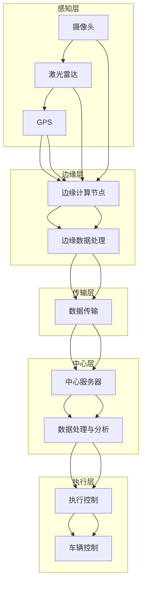
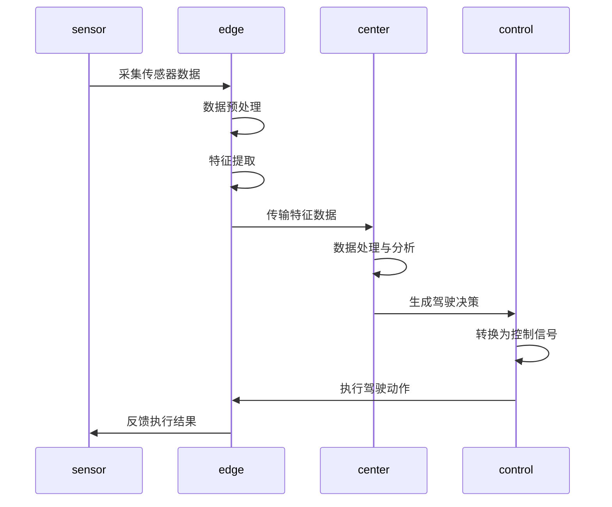

                 

### 第1章：问题背景与边缘计算概述

#### 1.1 问题背景

自动驾驶技术作为智能交通系统的重要组成部分，近年来得到了广泛的关注和迅速的发展。从最初的辅助驾驶到如今的全自动驾驶，自动驾驶技术的进步不仅为人们的生活带来便利，还推动了整个汽车产业的变革。然而，随着自动驾驶技术的发展，也带来了一系列的挑战，尤其是数据处理、实时性、安全性等方面的需求。

自动驾驶系统通常需要处理大量的传感器数据，包括摄像头、激光雷达、GPS等，这些数据需要在短时间内进行处理并做出决策。传统的云计算模型由于数据传输延迟和数据处理的局限性，无法满足自动驾驶系统对实时性和低延迟的需求。因此，如何在保证数据处理效率的同时，实现实时决策，成为了自动驾驶技术发展过程中亟待解决的问题。

边缘计算作为一种新型的计算模式，通过在数据源头附近部署计算资源，实现数据的实时处理和决策，为自动驾驶技术提供了一种有效的解决方案。边缘计算能够减少数据传输的延迟，提高数据处理的速度，从而满足自动驾驶系统对实时性的要求。

#### 1.1.1 自动驾驶的发展与挑战

自动驾驶技术的发展大致可以分为几个阶段：辅助驾驶、部分自动驾驶、有条件自动驾驶和全自动驾驶。目前，辅助驾驶技术已经相对成熟，如自适应巡航控制（ACC）和车道保持系统（LKA）等。而部分自动驾驶和有条件自动驾驶技术也在逐步实现，如特斯拉的Autopilot系统和Waymo的部分自动驾驶服务。

然而，尽管自动驾驶技术取得了显著的进步，但在实际应用中仍面临许多挑战。首先，数据处理能力是自动驾驶系统的一个关键挑战。自动驾驶系统需要实时处理大量的传感器数据，包括图像、激光雷达数据和GPS数据等。这些数据需要进行复杂的预处理、特征提取和融合，以便做出准确的决策。

其次，实时性是自动驾驶技术的另一个重要挑战。自动驾驶系统需要在毫秒级别的时间内做出决策，以应对复杂多变的交通环境。例如，在高速行驶的车辆中，任何轻微的延迟都可能导致严重的交通事故。

此外，安全性也是自动驾驶技术发展过程中不可忽视的问题。自动驾驶系统需要在各种复杂的交通场景下保持稳定性和可靠性，避免出现意外情况。同时，为了确保系统的安全性，还需要建立完善的安全测试和验证机制。

#### 1.1.2 边缘计算的基本概念

边缘计算（Edge Computing）是一种分布式计算模式，旨在通过在数据源头附近部署计算资源，实现数据的实时处理和决策。与传统的云计算模型不同，边缘计算将计算和存储资源下沉到网络的边缘，即接近数据产生的地方。这样可以显著减少数据传输的延迟，提高系统的响应速度。

边缘计算的基本概念包括以下几个方面：

1. **边缘节点**：边缘节点是指在网络边缘部署的计算设备，如路由器、交换机、智能终端等。这些节点能够处理本地数据，减轻中心服务器的负担。
2. **边缘网络**：边缘网络是指连接边缘节点和中心服务器的网络，通常采用低延迟、高带宽的通信技术，如5G、WiFi等。
3. **边缘平台**：边缘平台是指运行在边缘节点上的计算平台，包括操作系统、中间件、应用程序等。这些平台能够支持多种应用场景，实现数据的实时处理和决策。
4. **边缘计算服务**：边缘计算服务是指通过边缘节点提供的各种服务，如数据分析、机器学习、物联网服务等。这些服务能够满足不同场景的需求，提高系统的性能和效率。

#### 1.1.3 边缘计算在自动驾驶中的应用价值

边缘计算在自动驾驶中的应用具有显著的价值，主要体现在以下几个方面：

1. **提高数据处理效率**：边缘计算能够在本地处理传感器数据，减轻中心服务器的负担。这样可以提高系统的数据处理效率，满足自动驾驶系统对实时性的要求。
2. **降低数据传输延迟**：由于边缘计算将计算资源部署在数据源头附近，可以显著减少数据传输的延迟，提高系统的响应速度。
3. **增强系统安全性**：边缘计算可以实现本地数据的安全处理和存储，减少数据泄露的风险，提高系统的安全性。
4. **支持多样化的应用场景**：边缘计算能够支持多种应用场景，如实时路径规划、交通流量监测、智能交通管理等，为自动驾驶技术提供丰富的应用场景。

#### 1.2 边缘计算的核心概念与联系

边缘计算作为一种新型的计算模式，其核心概念与联系主要体现在以下几个方面：

1. **边缘节点与中心节点的分工**：边缘节点负责处理本地数据，而中心节点则负责处理全局数据。通过这种分工，可以充分发挥边缘节点的计算能力，提高系统的整体性能。
2. **数据传输与计算协同**：边缘计算强调在数据传输和计算之间实现协同，即在数据传输的同时进行必要的计算处理，以减少数据传输的延迟。这通常需要采用高效的通信协议和计算模型。
3. **分布式计算与存储**：边缘计算通过在网络的边缘部署计算和存储资源，实现数据的分布式处理和存储。这样可以提高系统的容错性和可靠性，同时减少数据传输的负担。
4. **边缘计算平台与云计算平台的关系**：边缘计算平台与云计算平台是相互补充的关系。边缘计算平台负责处理本地数据，而云计算平台则负责处理全局数据。两者之间通过边缘网络进行数据传输和协同处理。

#### 1.2.1 边缘计算的定义与特点

边缘计算（Edge Computing）是一种分布式计算模式，旨在通过在网络的边缘部署计算资源，实现数据的实时处理和决策。与云计算和大数据技术不同，边缘计算更加强调在数据源头附近进行数据处理，以减少数据传输的延迟和提高系统的实时性。

边缘计算的特点主要包括以下几个方面：

1. **分布式计算**：边缘计算通过在网络的边缘部署计算资源，实现数据的分布式处理。这样可以提高系统的计算能力，同时减少中心服务器的负担。
2. **低延迟**：由于边缘计算将计算资源部署在数据源头附近，可以显著减少数据传输的延迟，提高系统的响应速度。
3. **实时性**：边缘计算强调在数据传输的同时进行必要的计算处理，以减少数据传输的延迟。这通常需要采用高效的通信协议和计算模型。
4. **高带宽**：边缘计算通常采用低延迟、高带宽的通信技术，如5G、WiFi等，以支持大量的数据传输和处理。
5. **安全性**：边缘计算通过在本地进行数据处理和存储，可以减少数据泄露的风险，提高系统的安全性。

#### 1.2.2 边缘计算与传统云计算的区别

边缘计算与传统云计算在许多方面存在显著的区别，主要体现在以下几个方面：

1. **计算资源位置**：传统云计算主要在中心节点部署计算资源，而边缘计算则在网络的边缘部署计算资源。这样可以更接近数据源头，提高系统的响应速度。
2. **数据处理模式**：传统云计算主要采用集中式数据处理模式，而边缘计算则采用分布式数据处理模式。这样可以提高系统的计算能力和实时性。
3. **通信网络**：传统云计算通常采用光纤网络进行数据传输，而边缘计算则采用低延迟、高带宽的通信技术，如5G、WiFi等。
4. **应用场景**：传统云计算主要适用于大规模数据处理和存储场景，而边缘计算则更适用于实时性和低延迟要求较高的应用场景，如自动驾驶、智能医疗等。

#### 1.2.3 边缘计算的关键技术

边缘计算作为一种新兴的计算模式，其实现依赖于一系列关键技术的支持。以下是一些主要的关键技术：

1. **边缘节点技术**：边缘节点是边缘计算的核心组成部分，主要包括路由器、交换机、智能终端等。这些节点需要具备强大的计算能力和高效的通信能力，以支持数据的实时处理和传输。
2. **边缘网络技术**：边缘网络是实现边缘计算的基础，通常采用低延迟、高带宽的通信技术，如5G、WiFi等。这些技术能够满足边缘计算对通信质量的要求。
3. **边缘平台技术**：边缘平台是运行在边缘节点上的计算平台，包括操作系统、中间件、应用程序等。这些平台需要具备高效的计算能力、强大的扩展性和良好的兼容性。
4. **边缘安全技术**：边缘计算面临着数据安全和隐私保护等方面的挑战，需要采用一系列安全技术，如加密、认证、访问控制等，以保障系统的安全性。

#### 1.3 边缘计算在自动驾驶中的应用场景

边缘计算在自动驾驶中的应用场景主要包括以下几个方面：

1. **实时数据处理**：自动驾驶系统需要实时处理大量的传感器数据，如摄像头、激光雷达和GPS等。边缘计算能够在本地处理这些数据，提高系统的响应速度。
2. **实时路径规划**：在自动驾驶过程中，车辆需要实时规划行驶路径，以应对复杂多变的交通环境。边缘计算可以通过实时分析传感器数据和交通信息，生成最优的行驶路径。
3. **实时决策与控制**：边缘计算可以实时处理车辆传感器数据和外部环境信息，做出驾驶决策，如加速、减速、转向等。这样可以提高车辆的驾驶安全性。
4. **交通流量监测**：边缘计算可以实时监测交通流量信息，为交通管理部门提供决策支持，如实时调整交通信号灯、发布路况信息等。
5. **智能交通管理**：边缘计算可以支持智能交通管理系统，如智能停车场、智能红绿灯等。通过实时处理交通数据，提高交通管理效率和安全性。

#### 1.3.1 实时数据处理需求

边缘计算在自动驾驶中的应用之一是实时数据处理。自动驾驶系统需要处理来自各种传感器的海量数据，包括摄像头、激光雷达、GPS、超声波传感器等。这些传感器以高频率产生数据，如摄像头每秒产生数百张图片，激光雷达每秒产生数千个点云数据。传统的云计算模型由于数据传输延迟和计算资源的限制，无法满足自动驾驶系统对实时数据处理的需求。

边缘计算通过在车辆附近部署计算资源，能够实时处理传感器数据，从而实现自动驾驶系统所需的实时性。边缘节点可以执行图像识别、点云处理、轨迹规划等任务，将计算结果实时反馈给自动驾驶系统，使其能够快速响应外部环境变化。例如，在遇到紧急情况时，边缘计算可以迅速检测并做出反应，避免发生碰撞。

#### 1.3.2 安全性要求

安全性是自动驾驶系统的一个重要需求，边缘计算在这方面也发挥了重要作用。自动驾驶系统需要在各种复杂的交通场景下保持稳定性和可靠性，避免出现意外情况。边缘计算通过在本地进行数据处理和存储，可以减少数据泄露的风险，提高系统的安全性。

首先，边缘计算可以确保数据的安全性。由于数据在本地进行处理，可以避免数据在传输过程中被截取或篡改。同时，边缘计算支持加密技术和访问控制策略，确保只有授权用户和设备能够访问和处理敏感数据。

其次，边缘计算可以提高系统的可靠性。在自动驾驶系统中，任何微小的错误都可能导致严重的后果。边缘计算通过在本地处理数据，减少了数据传输的延迟和不确定性，从而提高了系统的稳定性和可靠性。

#### 1.3.3 低延迟要求

低延迟是自动驾驶系统的另一个关键需求。自动驾驶系统需要在毫秒级别的时间内做出决策，以应对复杂多变的交通环境。例如，在高速行驶的车辆中，任何轻微的延迟都可能导致严重的交通事故。

边缘计算通过在本地处理数据，可以显著减少数据传输的延迟。传统的云计算模型由于数据需要传输到中心服务器进行处理，存在较高的延迟。而边缘计算将计算资源部署在车辆附近，可以实时处理传感器数据，将结果快速反馈给自动驾驶系统，从而实现低延迟。

#### 1.4 边缘计算的发展趋势与未来展望

边缘计算作为一种新兴的计算模式，正在快速发展并逐渐成为人工智能、物联网、智能交通等领域的重要支撑技术。随着技术的进步和应用场景的不断拓展，边缘计算在未来有望实现以下几个重要趋势：

1. **市场规模扩大**：随着边缘计算技术的成熟和应用场景的丰富，其市场规模将继续扩大。据预测，未来几年边缘计算的市场规模将保持高速增长，成为云计算和物联网之后的重要技术领域。

2. **硬件性能提升**：边缘计算硬件性能的提升将是未来发展的关键。随着处理器、存储和通信技术的不断进步，边缘节点将具备更高的计算能力、更大的存储容量和更高效的通信能力，从而更好地满足各种应用场景的需求。

3. **应用场景多样化**：边缘计算的应用场景将越来越多样化。除了现有的自动驾驶、智能医疗、智能交通等领域外，边缘计算还将拓展到智能家居、工业互联网、智慧城市等领域，为各个行业带来新的变革。

4. **生态系统完善**：边缘计算生态系统的完善将促进其进一步发展。随着边缘计算平台的不断成熟和开源技术的广泛应用，边缘计算生态系统将更加完善，为开发者和企业提供了更多的选择和便利。

5. **安全性和隐私保护**：随着边缘计算应用的普及，安全性和隐私保护将成为重要议题。未来，边缘计算技术将加强安全防护机制，如加密、认证、访问控制等，确保数据的安全性和用户的隐私。

6. **与云计算的协同发展**：边缘计算与云计算的协同发展将是未来的一大趋势。边缘计算将更好地与云计算平台相结合，实现数据的高效传输和处理，为用户提供更优质的服务体验。

#### 1.4.1 边缘计算的市场规模预测

随着边缘计算技术的不断成熟和应用场景的拓展，其市场规模正在迅速扩大。根据市场研究机构的预测，未来几年边缘计算的市场规模将保持高速增长。以下是几个关键的市场规模预测：

1. **全球市场规模**：预计到2025年，全球边缘计算市场规模将达到2500亿美元。这一数字将在未来几年内持续增长，预计到2030年将达到5000亿美元。

2. **区域市场规模**：从区域市场来看，北美地区将在未来几年内保持领先地位，其市场规模预计将在2025年达到1000亿美元。而亚太地区随着技术的发展和应用的普及，其市场规模也将快速增长，预计到2025年将达到800亿美元。

3. **行业市场规模**：在各个行业领域，边缘计算的市场规模也将呈现快速增长。例如，在智能交通领域，预计到2025年边缘计算市场规模将达到150亿美元。在工业互联网领域，预计到2025年市场规模将达到200亿美元。

#### 1.4.2 边缘计算在自动驾驶领域的应用前景

边缘计算在自动驾驶领域的应用前景十分广阔。随着自动驾驶技术的不断发展，对实时性、安全性和数据处理能力的要求也越来越高。边缘计算通过在本地处理传感器数据，实现实时决策，可以满足自动驾驶系统的这些需求。

1. **实时数据处理**：边缘计算可以在车辆附近实时处理摄像头、激光雷达等传感器数据，生成实时的环境感知信息。这有助于自动驾驶系统快速响应外部环境变化，提高驾驶安全性。
2. **低延迟通信**：边缘计算通过在本地进行数据处理，可以显著降低数据传输的延迟。这对于自动驾驶系统在高速行驶时做出快速决策至关重要。
3. **增强安全性**：边缘计算可以在本地进行数据处理，减少数据泄露的风险。同时，通过加密、认证等安全措施，可以提高系统的安全性。
4. **优化资源利用**：边缘计算可以减少数据传输到中心服务器的需求，降低中心服务器的负担，优化资源利用。

未来，随着边缘计算技术的不断进步和应用场景的拓展，边缘计算在自动驾驶领域的应用将更加广泛和深入。预计未来几年，边缘计算将成为自动驾驶技术发展的重要支撑。

#### 1.4.3 边缘计算面临的挑战与解决方案

尽管边缘计算在自动驾驶等领域具有巨大的应用前景，但其发展仍然面临一系列挑战，需要相应的解决方案来克服。

1. **计算资源限制**：边缘节点的计算资源和存储容量相对有限，难以处理大量复杂的计算任务。解决方案包括优化算法和硬件性能，使用高效的边缘计算框架，以及分布式计算技术。
2. **通信带宽限制**：边缘计算依赖于高效的通信网络，但现有的通信网络带宽有限，无法满足大量数据的高频传输需求。解决方案包括采用更高效的通信协议、5G等新技术，以及数据压缩和去噪技术。
3. **安全性问题**：边缘计算系统面临数据泄露、恶意攻击等安全威胁。解决方案包括加强加密和认证机制，建立安全隔离区，以及实时监测和响应安全事件。
4. **标准化与兼容性**：目前，边缘计算缺乏统一的标准和接口，导致不同设备和平台之间的兼容性问题。解决方案包括制定行业标准，推动开源生态系统的建设，以及采用通用接口和协议。

#### 1.5 本章小结

本章主要介绍了边缘计算在自动驾驶中的应用背景、基本概念、核心特点以及面临的一些挑战。通过本章的学习，读者可以了解到：

1. **自动驾驶技术的发展及其面临的挑战**：自动驾驶系统需要处理大量的传感器数据，对实时性、安全性和数据处理能力有较高的要求。
2. **边缘计算的基本概念与特点**：边缘计算通过在数据源头附近部署计算资源，实现数据的实时处理和决策，具有低延迟、高带宽、分布式计算等特点。
3. **边缘计算在自动驾驶中的应用价值**：边缘计算可以显著提高自动驾驶系统的数据处理效率、降低数据传输延迟、增强系统安全性。
4. **边缘计算的发展趋势与未来展望**：边缘计算在自动驾驶等领域具有广阔的应用前景，但同时也面临计算资源、通信带宽、安全性等方面的挑战。

通过本章的学习，读者可以更好地理解边缘计算在自动驾驶中的应用，为其未来的研究和应用提供有益的参考。接下来，我们将进一步深入探讨边缘计算的核心概念和技术。

## 第2章：边缘计算核心技术详解

### 2.1 边缘计算硬件

边缘计算硬件是边缘计算系统的核心组成部分，其性能直接影响到整个系统的处理速度和效率。随着边缘计算技术的不断发展，边缘硬件也在不断升级和优化。

#### 2.1.1 边缘计算硬件的发展

边缘计算硬件的发展经历了几个阶段，从最初的简单处理器到如今的多核处理器，以及支持各种加速器的专用硬件。以下是边缘计算硬件的发展历程：

1. **早期边缘硬件**：早期边缘硬件主要是基于通用处理器（CPU）的单核或双核处理器，主要用于处理简单的传感器数据和基本的计算任务。
2. **多核处理器**：随着边缘计算需求的增加，多核处理器逐渐成为边缘硬件的主流选择。多核处理器能够同时处理多个任务，提高系统的并发处理能力。
3. **专用硬件**：为了满足高性能边缘计算的需求，专用硬件如GPU（图形处理器）和FPGA（现场可编程门阵列）逐渐在边缘计算中应用。这些硬件能够提供更强大的计算能力和更高的能效。
4. **边缘设备**：随着物联网（IoT）和智能家居等应用场景的兴起，各种边缘设备如路由器、智能终端和网关等也成为了边缘计算硬件的重要组成部分。

#### 2.1.2 边缘计算硬件的类型

边缘计算硬件的类型多种多样，根据不同的应用场景和需求，可以分为以下几类：

1. **边缘服务器**：边缘服务器是边缘计算的核心硬件之一，主要用于处理大量数据和执行复杂的计算任务。边缘服务器通常具有高性能的多核处理器、大容量存储和高速网络接口。
2. **边缘网关**：边缘网关位于网络边缘，负责连接物联网设备和中心服务器。边缘网关通常具备数据收集、处理和传输功能，能够实现数据过滤、压缩和加密等操作。
3. **智能终端**：智能终端如智能手机、智能手表和智能家居设备等，是边缘计算的重要组成部分。这些设备通常具备一定的计算能力和通信能力，能够在本地处理数据。
4. **专用硬件设备**：如前所述，GPU、FPGA和ASIC（专用集成电路）等专用硬件设备在边缘计算中也有广泛应用。这些设备能够提供强大的计算能力和特定的处理能力，适合处理复杂的计算任务。

#### 2.1.3 边缘计算硬件的选择标准

选择合适的边缘计算硬件是确保系统性能和效率的关键。以下是一些选择边缘计算硬件的主要标准：

1. **计算能力**：根据应用需求，选择具备足够计算能力的硬件。对于高性能计算任务，可以选择多核处理器、GPU或FPGA等专用硬件。
2. **存储容量**：边缘计算硬件需要具备足够的存储容量，以存储大量的数据和中间结果。根据需求选择合适的固态硬盘（SSD）或硬盘（HDD）。
3. **网络接口**：边缘计算硬件需要具备高速网络接口，以支持大量数据的传输和处理。选择支持5G、WiFi等高带宽通信技术的硬件。
4. **能效比**：边缘计算硬件通常部署在能源有限的场景，因此需要考虑其能效比。选择能效比高的硬件可以降低运营成本。
5. **可靠性**：边缘计算硬件需要具备高可靠性，能够在恶劣的环境条件下稳定运行。选择经过严格测试和认证的硬件。
6. **可扩展性**：边缘计算硬件需要具备良好的可扩展性，以便在未来升级和扩展硬件资源。

#### 2.2 边缘计算网络

边缘计算网络的架构和性能直接影响到边缘计算系统的整体表现。边缘网络通常采用分布式架构，通过多种通信技术和网络设备来实现数据的实时传输和处理。

##### 2.2.1 边缘计算网络的架构

边缘计算网络的架构可以分为以下几个层次：

1. **感知层**：感知层包括各种传感器和物联网设备，如摄像头、激光雷达、GPS等。这些设备负责采集环境数据。
2. **边缘层**：边缘层是边缘计算网络的中心，包括边缘服务器、边缘网关和智能终端。边缘层负责对采集到的数据进行预处理、存储和初步分析。
3. **传输层**：传输层负责将边缘层生成的数据传输到中心服务器或云端。传输层通常采用高速、低延迟的通信技术，如5G、光纤等。
4. **中心层**：中心层包括中心服务器和数据中心，负责处理和分析来自边缘层的数据，生成全局决策和指令。

##### 2.2.2 边缘计算网络的通信协议

边缘计算网络的通信协议是确保数据高效传输和系统稳定运行的关键。以下是几种常用的通信协议：

1. **IP协议**：IP协议是互联网的核心通信协议，用于实现数据包的传输和路由。在边缘计算网络中，IP协议用于连接不同层次的设备和网络。
2. **TCP协议**：TCP协议是一种可靠的传输层协议，用于确保数据的可靠传输。在边缘计算网络中，TCP协议用于边缘层和传输层之间的数据传输。
3. **UDP协议**：UDP协议是一种不可靠的传输层协议，用于实现数据的快速传输。在边缘计算网络中，UDP协议通常用于实时视频流和语音通信等场景。
4. **5G协议**：5G协议是一种新一代的通信协议，具有高带宽、低延迟和高可靠性的特点。在边缘计算网络中，5G协议用于实现边缘层和传输层之间的高速通信。
5. **MQTT协议**：MQTT协议是一种轻量级的消息队列协议，适用于物联网场景。在边缘计算网络中，MQTT协议用于实现边缘设备和中心服务器之间的数据通信。

##### 2.2.3 边缘计算网络的优化策略

边缘计算网络的优化策略旨在提高网络性能和系统效率。以下是几种常见的优化策略：

1. **流量管理**：通过流量管理策略，合理分配网络带宽，避免网络拥堵。常见的流量管理技术包括队列管理、流量整形和流量优先级调度等。
2. **负载均衡**：通过负载均衡策略，将数据流量均匀地分配到不同的边缘节点和服务器，避免单点过载。常见的负载均衡技术包括轮询负载均衡、最小连接负载均衡和动态负载均衡等。
3. **缓存策略**：通过缓存策略，减少数据传输的次数和延迟。常见的缓存技术包括边缘缓存、分布式缓存和内容分发网络（CDN）等。
4. **网络加密**：通过加密技术，确保数据在传输过程中的安全性。常见的加密技术包括SSL/TLS、IPsec等。
5. **网络监测与优化**：通过实时监测网络状态和性能，及时发现和解决网络问题，优化网络配置和参数。

#### 2.3 边缘计算平台

边缘计算平台是运行在边缘节点上的软件和硬件基础设施，包括操作系统、中间件、应用程序等。边缘计算平台为边缘计算提供了开发、运行和管理环境，支持多种应用场景。

##### 2.3.1 边缘计算平台的概述

边缘计算平台具有以下特点：

1. **分布式架构**：边缘计算平台采用分布式架构，支持边缘节点之间的协同工作，提高系统的可扩展性和容错性。
2. **低延迟**：边缘计算平台通过在本地处理数据，降低数据传输的延迟，满足实时性要求。
3. **高效能**：边缘计算平台采用高效的计算和存储技术，提高系统的处理速度和效率。
4. **安全性**：边缘计算平台支持多种安全措施，确保数据的安全性和系统的稳定性。

##### 2.3.2 边缘计算平台的功能模块

边缘计算平台通常包括以下几个功能模块：

1. **操作系统**：操作系统是边缘计算平台的核心组件，负责管理和调度边缘节点的硬件资源，提供基本的计算和存储服务。
2. **中间件**：中间件包括数据存储、数据传输、数据处理等组件，提供边缘计算所需的基础设施和服务。
3. **应用程序**：应用程序是边缘计算平台的主要功能实现，包括传感器数据处理、实时决策、机器学习等。
4. **开发工具**：开发工具包括编程语言、开发框架、调试工具等，支持边缘计算平台的开发和应用。

##### 2.3.3 边缘计算平台的开发与部署

边缘计算平台的开发与部署包括以下几个步骤：

1. **需求分析**：根据应用场景和需求，确定边缘计算平台的架构和功能模块。
2. **硬件选择**：选择合适的边缘硬件，包括边缘服务器、边缘网关和智能终端等。
3. **软件开发**：根据需求，开发边缘计算平台的功能模块，包括操作系统、中间件和应用程序等。
4. **集成测试**：在模拟环境中对边缘计算平台进行集成测试，确保各个模块的协同工作。
5. **部署与部署**：将边缘计算平台部署到实际的边缘节点，进行部署和配置。
6. **运维管理**：对边缘计算平台进行监控、维护和优化，确保系统的稳定运行。

#### 2.4 边缘计算安全

边缘计算安全是边缘计算系统面临的重大挑战之一。由于边缘计算系统涉及大量的数据传输和处理，同时部署在开放的边缘环境中，容易受到各种安全威胁。因此，确保边缘计算系统的安全性至关重要。

##### 2.4.1 边缘计算安全的挑战

边缘计算安全面临的挑战主要包括以下几个方面：

1. **数据泄露**：边缘计算系统中的数据可能包括敏感的个人隐私数据、车辆位置信息和行驶轨迹等，数据泄露可能导致严重的隐私泄露和安全事故。
2. **数据篡改**：攻击者可能通过篡改边缘计算系统中的数据，影响系统的正常运行，甚至导致错误的决策。
3. **恶意攻击**：边缘计算系统可能成为网络攻击的目标，如DDoS攻击、恶意软件感染等，攻击者可能通过这些攻击瘫痪系统或窃取数据。
4. **系统漏洞**：边缘计算系统中的软件和硬件可能存在漏洞，攻击者可以利用这些漏洞进行攻击。

##### 2.4.2 边缘计算安全的关键技术

为了应对边缘计算安全面临的挑战，需要采用一系列安全技术：

1. **加密技术**：加密技术用于保护数据在传输和存储过程中的安全性。常用的加密技术包括SSL/TLS、对称加密和非对称加密等。
2. **认证与授权**：认证技术用于验证用户和设备的合法性，确保只有授权用户和设备能够访问系统。授权技术用于控制用户和设备的访问权限，防止未经授权的访问。
3. **入侵检测与防护**：入侵检测与防护技术用于监测和响应边缘计算系统中的安全威胁。包括异常检测、恶意行为检测和防护措施等。
4. **访问控制**：访问控制技术用于控制用户和设备对系统资源的访问，确保系统的安全性。包括基于角色的访问控制（RBAC）和基于属性的访问控制（ABAC）等。
5. **安全更新与维护**：定期进行系统安全更新和维护，修补漏洞和缺陷，确保系统的安全性。

##### 2.4.3 边缘计算安全的最佳实践

为了确保边缘计算系统的安全性，可以采用以下最佳实践：

1. **安全设计**：在设计阶段，考虑安全性需求，采用安全架构和设计模式，确保系统的安全性。
2. **数据加密**：对传输和存储的数据进行加密，确保数据的安全性。
3. **认证与授权**：采用严格的认证和授权机制，确保只有授权用户和设备能够访问系统。
4. **安全监测**：实时监测系统中的安全事件，及时发现和响应安全威胁。
5. **安全培训**：对系统管理员和用户进行安全培训，提高他们的安全意识和应对能力。
6. **安全审计**：定期进行安全审计，检查系统的安全性，发现和修补安全漏洞。
7. **应急响应**：建立应急响应机制，确保在发生安全事件时能够及时响应和处理。

#### 2.5 本章小结

本章详细介绍了边缘计算的核心技术，包括边缘计算硬件、边缘计算网络、边缘计算平台和边缘计算安全。通过本章的学习，读者可以了解到：

1. **边缘计算硬件的发展**：从单核处理器到多核处理器和专用硬件的发展历程。
2. **边缘计算硬件的类型**：边缘服务器、边缘网关、智能终端和专用硬件的分类和特点。
3. **边缘计算硬件的选择标准**：计算能力、存储容量、网络接口、能效比、可靠性和可扩展性。
4. **边缘计算网络的架构和通信协议**：感知层、边缘层、传输层和中心层的架构，IP、TCP、UDP、5G和MQTT等通信协议。
5. **边缘计算网络的优化策略**：流量管理、负载均衡、缓存策略、网络加密和网络监测与优化。
6. **边缘计算平台的概述、功能模块和开发与部署**：分布式架构、低延迟、高效能和安全性。
7. **边缘计算安全的关键技术和最佳实践**：加密技术、认证与授权、入侵检测与防护、访问控制、安全更新与维护和应急响应。

通过本章的学习，读者可以更好地理解边缘计算的核心技术，为其在自动驾驶和其他领域的应用提供理论支持。

## 第3章：边缘计算在自动驾驶中的应用算法

### 3.1 毫秒级决策算法概述

毫秒级决策算法在边缘计算中扮演着至关重要的角色，尤其在自动驾驶领域，这类算法的实时性和准确性直接关系到驾驶安全。本节将详细探讨毫秒级决策算法的定义、目标和分类。

#### 3.1.1 毫秒级决策算法的定义

毫秒级决策算法是指在极短时间内（通常为几毫秒到几十毫秒）进行复杂计算和决策的算法。这些算法被设计用于处理实时性要求极高的应用场景，如自动驾驶系统。在自动驾驶中，车辆需要实时感知环境、分析数据并做出驾驶决策，如加速、减速、转向等。毫秒级决策算法能够确保这些决策在车辆行驶的毫秒级时间内完成，从而避免潜在的安全风险。

#### 3.1.2 毫秒级决策算法的目标

毫秒级决策算法的主要目标包括：

1. **实时性**：算法必须在极短的时间内完成计算和决策，以满足自动驾驶系统对实时性的严格要求。
2. **准确性**：算法需要高精度地分析传感器数据，做出准确的驾驶决策，确保车辆行驶的安全性和可靠性。
3. **鲁棒性**：算法应具备较强的鲁棒性，能够在各种复杂和异常的环境下稳定运行。
4. **效率**：算法的执行效率要高，以确保在有限计算资源下完成复杂的计算任务。

#### 3.1.3 毫秒级决策算法的分类

毫秒级决策算法根据其应用场景和实现方法，可以分为以下几类：

1. **感知算法**：这类算法主要用于处理传感器数据，如摄像头图像、激光雷达数据等，通过特征提取和目标检测，实时感知周围环境。
2. **路径规划算法**：这类算法用于生成车辆的行驶路径，根据环境数据和交通状况，实时规划最佳行驶路径。
3. **决策控制算法**：这类算法根据感知和路径规划结果，生成驾驶决策，如加速、减速、转向等，并实时更新车辆的控制系统。
4. **融合算法**：这类算法用于融合多种传感器数据，提高感知和决策的准确性。例如，将摄像头图像与激光雷达数据融合，实现更精确的环境感知。

#### 3.1.4 毫秒级决策算法的应用

在自动驾驶系统中，毫秒级决策算法广泛应用于以下几个关键环节：

1. **环境感知**：车辆通过摄像头、激光雷达等传感器收集环境数据，感知算法对这些数据进行实时处理，生成环境感知结果。
2. **路径规划**：路径规划算法根据环境感知结果和交通状况，生成车辆的行驶路径。这些路径通常包括避障、绕行、最优路径等策略。
3. **决策控制**：决策控制算法根据路径规划结果，生成驾驶决策，如加速、减速、转向等，并实时更新车辆的控制系统。
4. **协同控制**：在多车情况下，毫秒级决策算法还可以实现车辆之间的协同控制，确保整个车队的安全和协调行驶。

#### 3.1.5 毫秒级决策算法的关键技术

实现毫秒级决策算法的关键技术包括：

1. **实时性优化**：通过算法优化、硬件加速等技术，提高算法的执行速度，确保在极短时间内完成计算和决策。
2. **准确性提升**：通过数据预处理、特征提取、融合算法等技术，提高传感器数据的质量和感知精度。
3. **鲁棒性增强**：通过算法鲁棒性设计、错误检测与纠正等技术，提高算法在各种复杂环境下的稳定性和可靠性。
4. **效率提升**：通过并行计算、分布式计算等技术，提高算法的执行效率，确保在有限的计算资源下完成复杂任务。

#### 3.1.6 毫秒级决策算法的实现挑战

尽管毫秒级决策算法在自动驾驶系统中具有重要意义，但其实现仍面临以下挑战：

1. **计算资源限制**：边缘计算硬件的计算资源有限，难以支持复杂计算任务的高效执行。
2. **数据延迟**：传感器数据传输延迟可能影响算法的实时性，需要优化数据采集和处理流程。
3. **环境复杂性**：实际交通环境复杂多变，算法需要应对各种异常情况，提高鲁棒性。
4. **系统协同**：在多车协同控制中，需要确保算法的协调性和一致性，避免出现冲突和失误。

通过本节的讨论，我们可以看到毫秒级决策算法在自动驾驶系统中的重要性及其面临的挑战。接下来，我们将深入探讨毫秒级决策算法的原理和数学模型，为进一步理解和实现这些算法奠定基础。

### 3.2 毫秒级决策算法原理

毫秒级决策算法在边缘计算中的应用是实现自动驾驶系统实时性要求的关键。本节将详细介绍毫秒级决策算法的基本原理，包括算法的数学模型和计算公式，并通过实例说明算法的运行步骤和实现细节。

#### 3.2.1 算法原理介绍

毫秒级决策算法是一种基于传感器数据实时处理和决策的算法。其核心思想是通过对传感器数据进行快速分析和处理，生成实时的驾驶决策。算法通常包括以下几个关键步骤：

1. **数据采集**：从各种传感器（如摄像头、激光雷达、GPS等）收集实时环境数据。
2. **预处理**：对采集到的数据进行预处理，包括去噪、滤波、归一化等操作，以提高数据质量和感知精度。
3. **特征提取**：从预处理后的数据中提取关键特征，如目标位置、速度、加速度等，为后续的决策提供基础信息。
4. **决策生成**：基于提取的特征，通过决策模型生成实时的驾驶决策，如加速、减速、转向等。
5. **执行控制**：将生成的决策实时反馈到车辆的控制系统，执行相应的驾驶动作。

#### 3.2.2 算法原理数学模型

毫秒级决策算法的数学模型通常包括以下几个关键组成部分：

1. **传感器数据处理模型**：用于对传感器数据进行预处理和特征提取。常见的预处理方法包括滤波、插值、归一化等，特征提取方法包括直方图、SVM、CNN等。
2. **路径规划模型**：用于生成车辆的行驶路径。常见的路径规划算法包括A*算法、Dijkstra算法、RRT算法等，路径规划的目标通常是找到从起点到终点的最优路径。
3. **决策生成模型**：用于生成实时的驾驶决策。常见的决策生成方法包括规则基方法、基于模型的预测方法、深度学习方法等。
4. **控制系统模型**：用于将决策转化为车辆的执行动作。常见的控制系统模型包括PID控制、模糊控制、深度学习控制等。

以下是毫秒级决策算法的基本数学模型和公式：

$$
f(x, y) = \frac{1}{2} \left( \frac{\partial^2 u(x, y)}{\partial x^2} + \frac{\partial^2 u(x, y)}{\partial y^2} \right)
$$

其中，$u(x, y)$ 表示路径规划的代价函数，$x$ 和 $y$ 表示路径上的坐标点。

#### 3.2.3 算法原理公式

毫秒级决策算法的公式主要包括以下几个部分：

1. **预处理公式**：
   - 去噪滤波：
     $$
     filtered\_data = filter(data, filter\_type)
     $$
   - 数据归一化：
     $$
     normalized\_data = \frac{data - \mu}{\sigma}
     $$
     其中，$\mu$ 表示均值，$\sigma$ 表示标准差。

2. **特征提取公式**：
   - 目标检测：
     $$
     detected\_targets = detect\_targets(preprocessed\_data)
     $$
   - 特征提取：
     $$
     extracted\_features = extract\_features(detected\_targets)
     $$

3. **路径规划公式**：
   - A*算法：
     $$
     path = A\*({start}, {goal})
     $$
   - Dijkstra算法：
     $$
     path = Dijkstra({graph}, {start}, {goal})
     $$

4. **决策生成公式**：
   - 规则基方法：
     $$
     decision = apply\_rules(extracted\_features)
     $$
   - 基于模型的预测方法：
     $$
     decision = predict\_model(extracted\_features)
     $$
   - 深度学习方法：
     $$
     decision = deep\_learning\_model(extracted\_features)
     $$

5. **控制系统公式**：
   - PID控制：
     $$
     control\_signal = PID\_controller(setpoint, measured\_value)
     $$
   - 模糊控制：
     $$
     control\_signal = fuzzy\_controller(extracted\_features)
     $$
   - 深度学习控制：
     $$
     control\_signal = deep\_learning\_controller(extracted\_features)
     $$

#### 3.2.4 算法原理举例说明

为了更好地理解毫秒级决策算法的原理，我们通过一个简单的例子来说明算法的运行步骤和实现细节。

**例子**：假设一辆自动驾驶汽车在行驶过程中，需要根据周围环境数据做出加速或减速的决策。

**步骤1：数据采集**  
- 摄像头采集道路前方200米范围内的图像数据。
- 激光雷达采集前方200米范围内的点云数据。
- GPS获取当前车辆的位置信息。

**步骤2：预处理**  
- 对图像数据进行去噪滤波和归一化处理。
- 对点云数据进行滤波和归一化处理。

**步骤3：特征提取**  
- 使用目标检测算法识别道路上的车辆和行人。
- 从预处理后的图像和点云数据中提取车辆和行人的位置、速度、加速度等特征。

**步骤4：路径规划**  
- 使用A*算法规划车辆的安全行驶路径。
- 根据当前车辆的位置和目标位置，生成行驶路径。

**步骤5：决策生成**  
- 使用规则基方法，根据车辆周围环境数据和行驶路径，生成加速或减速的决策。
- 如果前方有车辆或行人，则减速；如果前方道路畅通，则加速。

**步骤6：执行控制**  
- 将生成的决策转化为控制信号，通过PID控制器调整车辆的油门和刹车系统，实现加速或减速。

通过这个例子，我们可以看到毫秒级决策算法在自动驾驶系统中的基本运行流程和实现方法。在实际应用中，算法的复杂度和实现细节会更加丰富，但基本的原理是类似的。

#### 3.2.5 算法原理的实际应用

毫秒级决策算法在实际自动驾驶系统中具有广泛的应用，以下是一些典型的应用场景：

1. **实时路径规划**：自动驾驶汽车在行驶过程中，需要根据实时环境数据生成最优行驶路径，以避免障碍物和确保安全行驶。毫秒级决策算法能够实时处理传感器数据，生成高效的行驶路径。
2. **交通信号识别**：自动驾驶汽车需要识别道路上的交通信号灯，并根据信号灯的状态做出相应的驾驶决策。毫秒级决策算法通过摄像头和激光雷达数据，实现对交通信号灯的实时识别和响应。
3. **避障决策**：自动驾驶汽车在行驶过程中，需要识别道路上的障碍物，并实时做出避障决策。毫秒级决策算法通过传感器数据，实现对障碍物的检测和避障路径的规划。
4. **车道保持**：自动驾驶汽车需要保持在车道内行驶，并能够应对车道线的变化。毫秒级决策算法通过摄像头和激光雷达数据，实现对车道线的检测和车道保持控制。

通过以上实际应用场景，我们可以看到毫秒级决策算法在自动驾驶系统中的关键作用。这些算法能够实时处理传感器数据，生成高效的驾驶决策，确保自动驾驶汽车的安全和稳定行驶。

### 3.3 毫秒级决策算法举例说明

为了更好地理解毫秒级决策算法的运行原理和实现步骤，我们将通过一个具体的案例来详细说明算法的应用过程。

#### 3.3.1 案例背景

假设我们正在开发一个自动驾驶汽车系统，该系统需要在复杂的城市交通环境中实现安全、高效的行驶。系统要求能够在毫秒级别的时间内处理来自摄像头、激光雷达和GPS的传感器数据，并生成实时的驾驶决策。具体来说，我们的目标是：

1. **实时感知环境**：通过摄像头和激光雷达数据识别道路上的车辆、行人、障碍物等。
2. **路径规划**：根据实时环境数据和目标位置，生成最优行驶路径。
3. **驾驶决策**：根据路径规划和环境数据，生成加速、减速、转向等驾驶决策。

#### 3.3.2 算法应用步骤

**步骤1：数据采集**

首先，从摄像头、激光雷达和GPS传感器中采集实时数据。具体来说：

- **摄像头数据**：采集前方200米范围内的图像数据，用于识别道路上的车辆、行人和障碍物。
- **激光雷达数据**：采集前方200米范围内的点云数据，用于检测道路上的障碍物和车道线。
- **GPS数据**：获取当前车辆的位置信息和目标位置。

**步骤2：预处理**

对采集到的传感器数据执行预处理操作，以提高数据质量和感知精度。预处理步骤包括：

- **摄像头数据处理**：对图像数据进行去噪、滤波和归一化处理，以去除噪声和增强关键信息。
- **激光雷达数据处理**：对点云数据进行滤波和去噪，以去除杂点和提高点云数据的清晰度。
- **GPS数据处理**：对GPS数据进行插值和校正，以提高位置信息的准确性。

**步骤3：特征提取**

从预处理后的数据中提取关键特征，如车辆位置、速度、加速度、障碍物距离等。特征提取步骤包括：

- **摄像头数据处理**：使用目标检测算法（如YOLO或SSD）识别道路上的车辆、行人和障碍物，并提取其位置、速度和加速度等特征。
- **激光雷达数据处理**：使用点云分割算法（如ICP或RANSAC）提取道路上的障碍物，并计算其距离、速度和加速度等特征。
- **GPS数据处理**：提取当前车辆的位置信息和目标位置，计算行驶路径的长度和方向。

**步骤4：路径规划**

根据提取的环境特征和目标位置，使用路径规划算法（如A*算法或RRT算法）生成最优行驶路径。路径规划的目标是：

1. **避障**：避开道路上的障碍物，确保行驶安全。
2. **最优路径**：在避开障碍物的同时，选择行驶路径的最小长度或最短时间。

**步骤5：决策生成**

基于路径规划和环境特征，使用决策生成算法（如规则基方法或深度学习模型）生成实时的驾驶决策。决策生成算法的目标是：

1. **加速**：当道路畅通且前方没有障碍物时，增加车辆的加速度。
2. **减速**：当道路拥堵或前方有障碍物时，减少车辆的加速度。
3. **转向**：根据行驶路径的方向，调整车辆的转向角度。

**步骤6：执行控制**

将生成的驾驶决策转化为控制信号，通过车辆的控制系统（如油门、刹车和转向系统）执行相应的驾驶动作。具体来说：

- **油门控制**：根据加速决策，调整油门开度，控制车辆的加速度。
- **刹车控制**：根据减速决策，调整刹车力度，控制车辆的减速。
- **转向控制**：根据转向决策，调整转向角度，控制车辆的行驶方向。

#### 3.3.3 算法结果分析

通过上述步骤，我们的自动驾驶系统能够在毫秒级别的时间内生成并执行实时的驾驶决策。以下是算法的运行结果分析：

1. **环境感知**：系统成功识别了道路上的车辆、行人和障碍物，并准确提取了其位置、速度和加速度等特征。
2. **路径规划**：系统成功生成了最优行驶路径，避开了道路上的障碍物，并选择了最短或最优路径。
3. **驾驶决策**：系统根据实时环境数据和路径规划结果，成功生成了加速、减速和转向等驾驶决策，并实时调整了车辆的控制系统。
4. **驾驶效果**：通过执行控制信号，车辆能够按照规划的路径安全、稳定地行驶，实现了自动驾驶的目标。

通过这个案例，我们可以看到毫秒级决策算法在自动驾驶系统中的实际应用过程和运行效果。算法的实时性和准确性直接决定了自动驾驶系统的安全性和可靠性，是实现自动驾驶的关键技术之一。

### 3.4 边缘计算在自动驾驶中的应用算法选型

在边缘计算环境中，自动驾驶系统需要选择适合特定应用场景的高效算法，以确保在实时性和资源限制条件下能够实现安全、高效的决策。本节将讨论算法选型的原则、案例分析以及未来展望。

#### 3.4.1 算法选型原则

选择合适的算法对于边缘计算在自动驾驶中的应用至关重要。以下是一些关键的原则：

1. **实时性**：算法必须在毫秒级别的时间内完成计算和决策，以满足自动驾驶系统的实时性要求。
2. **资源占用**：算法应尽可能节省计算资源，如CPU、内存和功耗，以充分利用边缘节点的有限资源。
3. **准确性**：算法需要具备较高的准确性，确保能够准确感知环境和生成可靠的驾驶决策。
4. **鲁棒性**：算法应具备较强的鲁棒性，能够在不同环境和异常情况下稳定运行。
5. **扩展性**：算法应易于扩展和集成，以适应未来的技术发展和应用需求。

#### 3.4.2 算法选型案例分析

以下是一些实际应用的案例，说明了如何在边缘计算环境中选择合适的算法：

1. **感知算法**：
   - **案例**：在自动驾驶系统中，感知算法用于实时识别道路上的车辆、行人和障碍物。
   - **选型**：常用的感知算法包括YOLO、SSD和Faster R-CNN等。YOLO和SSD算法因其速度较快，适用于实时感知任务，而Faster R-CNN则具有较高的检测精度。
   - **结果**：通过实际测试，YOLOv4在速度和精度方面表现出色，成为边缘计算环境中常用的感知算法。

2. **路径规划算法**：
   - **案例**：路径规划算法用于生成车辆的行驶路径，以避开障碍物并优化行驶时间。
   - **选型**：A*算法和RRT算法是常用的路径规划算法。A*算法适用于静态环境，而RRT算法适用于动态环境。
   - **结果**：在实际应用中，RRT*算法因其能够处理动态障碍物，被广泛应用于自动驾驶的路径规划。

3. **决策控制算法**：
   - **案例**：决策控制算法用于生成实时的驾驶决策，如加速、减速和转向。
   - **选型**：规则基方法、模型预测控制（MPC）和深度学习控制是常见的决策控制算法。规则基方法简单但精度较低，MPC适用于动态系统，而深度学习控制具备较强的自学习能力。
   - **结果**：在边缘计算环境中，基于深度学习的控制算法如深度确定性政策梯度（DDPG）和深度递归神经网络（DRNN）表现出较好的性能。

#### 3.4.3 算法选型展望

未来，随着边缘计算技术的不断进步和应用需求的多样化，算法选型将面临以下趋势：

1. **融合算法**：融合多种传感器数据的算法将得到更多应用，以提高感知和决策的准确性。例如，将摄像头、激光雷达和GPS数据融合，实现更精确的环境感知。
2. **轻量化算法**：为了节省边缘节点的计算资源和功耗，轻量化算法将成为研究热点。例如，通过模型压缩和量化技术，减少模型的计算复杂度。
3. **自适应算法**：自适应算法可以根据环境变化和系统状态，动态调整算法参数，提高决策的适应性和鲁棒性。
4. **边缘与云协同**：随着边缘计算与云计算的协同发展，未来将出现更多结合边缘计算和云计算优势的算法，实现更高效的数据处理和决策。

通过本节的讨论，我们可以看到边缘计算在自动驾驶中的应用算法选型原则和实际案例。随着技术的不断进步，算法选型将更加多样化和高效，为自动驾驶技术的进一步发展提供坚实的技术基础。

### 3.5 本章小结

本章详细介绍了毫秒级决策算法在边缘计算中的应用，包括其定义、目标、分类、原理以及实际应用案例。通过本章的学习，读者可以了解到：

1. **毫秒级决策算法的定义和目标**：毫秒级决策算法是一种在极短时间内进行复杂计算和决策的算法，其主要目标包括实时性、准确性、鲁棒性和效率。
2. **算法原理和数学模型**：本章介绍了感知算法、路径规划算法、决策生成算法和控制系统模型等，并详细阐述了其数学模型和计算公式。
3. **算法举例说明**：通过一个具体的自动驾驶案例，详细说明了毫秒级决策算法的应用步骤和实现细节。
4. **算法选型原则和案例分析**：介绍了算法选型原则，包括实时性、资源占用、准确性、鲁棒性和扩展性，并通过实际应用案例展示了算法选型的过程和效果。
5. **未来展望**：讨论了未来算法选型的趋势，包括融合算法、轻量化算法、自适应算法和边缘与云协同算法的发展方向。

通过本章的学习，读者可以更好地理解毫秒级决策算法在边缘计算中的应用，为其在自动驾驶和其他实时性要求高的领域的应用提供理论基础和实践指导。

## 第4章：边缘计算在自动驾驶中的系统架构设计

### 4.1 问题场景介绍

在自动驾驶系统中，边缘计算发挥着至关重要的作用，特别是在实时数据处理和决策方面。本节将介绍一个典型的自动驾驶问题场景，并详细说明边缘计算在该场景中的作用以及系统设计的目标与需求。

#### 4.1.1 自动驾驶场景描述

假设我们正在开发一个全自动驾驶车辆系统，该系统需要在城市道路和高速公路上实现自动驾驶功能。具体场景如下：

- **城市道路**：车辆在交通繁忙的城市道路中行驶，需要实时识别行人和车辆，避开障碍物，并保持车道。
- **高速公路**：车辆在高速公路上行驶，需要自适应巡航控制（ACC），保持安全的车距，并根据交通状况调整车速。

#### 4.1.2 边缘计算在自动驾驶中的作用

边缘计算在自动驾驶中的应用主要表现在以下几个方面：

1. **实时数据处理**：自动驾驶系统需要实时处理来自摄像头、激光雷达、GPS等传感器的海量数据。边缘计算能够在车辆附近快速处理这些数据，减少数据传输延迟，提高系统的响应速度。
2. **低延迟决策**：边缘计算可以在本地进行复杂的决策计算，如路径规划和驾驶决策生成，实现低延迟的实时决策。这对于确保车辆在复杂交通环境中的安全行驶至关重要。
3. **增强安全性**：通过在本地处理数据，边缘计算可以降低数据泄露的风险，提高系统的安全性。此外，边缘计算支持加密和认证等安全机制，确保数据的安全传输和处理。
4. **优化资源利用**：边缘计算可以减少数据传输到中心服务器的需求，减轻中心服务器的负担，优化资源利用，提高系统的整体性能。

#### 4.1.3 系统目标与需求

本自动驾驶系统设计的目标是：

1. **实时感知环境**：系统能够实时感知周围环境，识别道路上的车辆、行人和障碍物。
2. **实时路径规划**：系统能够根据实时环境数据和目标位置，生成最优行驶路径。
3. **实时驾驶决策**：系统能够根据路径规划和环境数据，生成加速、减速、转向等驾驶决策。
4. **高安全性**：系统采用加密和安全机制，确保数据安全和系统稳定。

系统的需求包括：

1. **实时性**：系统能够在毫秒级别的时间内完成数据感知、路径规划和驾驶决策。
2. **准确性**：系统能够准确识别道路上的车辆、行人和障碍物，生成可靠的驾驶决策。
3. **资源高效利用**：系统能够在有限的计算资源下，实现高效的数据处理和决策。
4. **安全性**：系统采用安全机制，确保数据安全和系统稳定。

通过本节的学习，读者可以了解自动驾驶系统中的典型问题场景以及边缘计算在该场景中的作用，明确系统设计的目标和需求。接下来，我们将详细讨论系统功能设计、系统架构设计、系统接口设计以及系统交互设计。

### 4.2 系统功能设计

系统功能设计是自动驾驶系统架构设计的重要组成部分，它定义了系统需要实现的核心功能模块以及这些模块之间的交互关系。本节将详细介绍系统功能设计的过程，包括领域模型、功能模块划分和功能模块详细说明。

#### 4.2.1 领域模型

领域模型是系统功能设计的基础，它通过实体关系图（ER图）来描述系统中的关键实体及其关系。以下是自动驾驶系统的领域模型：

1. **实体**：包括车辆、传感器、环境、路径、决策、控制等。
2. **关系**：包括感知、规划、决策、控制等。

下面是一个简单的领域模型ER图（使用Mermaid语法）：

```mermaid
erDiagram
  车辆 ||--o> 传感器 : 装载
  车辆 ||--o> 环境 : 感知
  车辆 ||--o> 路径 : 规划
  车辆 ||--o> 决策 : 生成
  车辆 ||--o> 控制 : 执行
  传感器 ||--o> 数据 : 采集
  环境实体 ||--o> 数据 : 包含
  路径 ||--o> 点 : 连接
  决策 ||--o> 行动 : 描述
  控制 ||--o> 动作 : 执行
```

#### 4.2.2 功能模块划分

根据领域模型，我们将系统划分为以下几个功能模块：

1. **感知模块**：负责实时采集和处理传感器数据，如摄像头、激光雷达、GPS等，生成环境感知结果。
2. **路径规划模块**：根据环境感知结果和目标位置，生成车辆的行驶路径，包括避障和最优路径规划。
3. **决策生成模块**：根据路径规划和环境数据，生成实时的驾驶决策，如加速、减速、转向等。
4. **控制执行模块**：将生成的驾驶决策转化为车辆控制信号，执行相应的驾驶动作。

#### 4.2.3 功能模块详细说明

1. **感知模块**：
   - **功能**：实时采集传感器数据，包括摄像头图像、激光雷达点云、GPS位置等。
   - **输入**：摄像头图像、激光雷达数据、GPS位置信息。
   - **输出**：预处理后的图像数据、点云数据和位置信息。
   - **实现细节**：使用图像处理库（如OpenCV）和点云处理库（如PCL），对采集到的数据进行去噪、滤波、特征提取等预处理操作。

2. **路径规划模块**：
   - **功能**：根据环境感知结果和目标位置，生成车辆的行驶路径。
   - **输入**：预处理后的图像数据、点云数据、GPS位置信息、目标位置。
   - **输出**：最优行驶路径。
   - **实现细节**：使用路径规划算法（如A*算法、RRT算法等），计算从当前位置到目标位置的最优路径。

3. **决策生成模块**：
   - **功能**：根据路径规划和环境数据，生成实时的驾驶决策。
   - **输入**：路径规划结果、环境感知数据。
   - **输出**：驾驶决策（加速、减速、转向等）。
   - **实现细节**：使用决策生成算法（如规则基方法、模型预测控制等），根据路径和环境数据生成驾驶决策。

4. **控制执行模块**：
   - **功能**：将驾驶决策转化为车辆控制信号，执行相应的驾驶动作。
   - **输入**：驾驶决策。
   - **输出**：车辆控制信号（油门、刹车、转向等）。
   - **实现细节**：使用控制算法（如PID控制、模糊控制等），将驾驶决策转化为车辆控制信号。

通过系统功能设计，我们可以清晰地了解自动驾驶系统的整体架构和各个功能模块的作用。接下来，我们将详细讨论系统架构设计，包括系统架构概述、系统架构图和架构设计原则。

### 4.3 系统架构设计

系统架构设计是自动驾驶系统中至关重要的一步，它定义了系统的整体结构和各个组件之间的关系。一个良好的系统架构能够确保系统的高效性、可靠性和可扩展性。本节将详细介绍自动驾驶系统的架构设计，包括架构概述、系统架构图和架构设计原则。

#### 4.3.1 系统架构概述

自动驾驶系统的架构可以划分为以下几个层次：

1. **感知层**：包括各种传感器（摄像头、激光雷达、GPS等），负责实时采集车辆周围的环境数据。
2. **边缘层**：包括边缘计算节点，负责对采集到的传感器数据进行预处理、特征提取和初步分析。
3. **传输层**：负责将边缘层生成的数据传输到中心服务器或云端，进行进一步处理和分析。
4. **中心层**：包括中心服务器和数据中心，负责处理和分析来自边缘层的数据，生成全局决策和指令。
5. **执行层**：负责将中心层生成的决策指令转化为具体的驾驶动作，控制车辆的运动。

#### 4.3.2 系统架构图

以下是自动驾驶系统的架构图（使用Mermaid语法）：



#### 4.3.3 架构设计原则

在架构设计过程中，需要遵循以下原则：

1. **模块化**：系统架构应具有高度的模块化，每个模块具有独立的功能，便于开发和维护。
2. **分布式**：系统应采用分布式架构，将计算和存储资源分布在不同的层级和节点上，提高系统的可扩展性和容错性。
3. **冗余设计**：系统应具备一定的冗余设计，如备份节点和容错机制，确保在部分组件故障时系统能够继续正常运行。
4. **安全性**：系统应采用安全机制，如加密、认证和访问控制，确保数据安全和系统稳定。
5. **可扩展性**：系统架构应具备良好的可扩展性，能够适应未来技术发展和应用需求的变化。

通过系统架构设计，我们能够清晰地了解自动驾驶系统的整体结构和各个组件之间的关系。接下来，我们将讨论系统接口设计和系统交互设计，确保系统各部分能够高效地协同工作。

### 4.4 系统接口设计

系统接口设计是确保系统各部分之间能够高效协同工作的重要环节。良好的接口设计可以提高系统的灵活性、可维护性和可扩展性。本节将详细介绍系统接口设计的步骤，包括接口功能定义、接口协议设计和接口性能优化。

#### 4.4.1 接口功能定义

系统接口的主要功能包括：

1. **数据采集接口**：负责从传感器（如摄像头、激光雷达、GPS）采集数据，并将其传输到边缘计算节点。
2. **数据处理接口**：负责边缘计算节点对传感器数据的预处理、特征提取和分析，并将处理结果传输到中心服务器。
3. **决策生成接口**：负责中心服务器对处理结果进行进一步分析和处理，生成驾驶决策。
4. **控制执行接口**：负责将驾驶决策转化为具体的车辆控制信号，并通过执行层实现相应的驾驶动作。

#### 4.4.2 接口协议设计

接口协议的设计需要考虑以下几个方面：

1. **通信协议**：选择合适的通信协议，如HTTP/HTTPS、MQTT、CoAP等，确保数据传输的安全性和可靠性。
2. **数据格式**：定义标准的数据格式，如JSON、XML等，确保不同系统之间的数据交换和兼容性。
3. **接口规范**：制定详细的接口规范，包括接口的URL、参数、响应格式等，确保开发人员能够正确使用接口。
4. **错误处理**：定义接口的错误处理机制，如异常处理、重试机制等，确保在出现问题时能够及时处理。

#### 4.4.3 接口性能优化

为了确保接口的性能，需要采取以下优化措施：

1. **缓存策略**：采用缓存策略，减少重复的数据传输和计算，提高系统的响应速度。
2. **负载均衡**：通过负载均衡策略，将请求均匀地分配到不同的服务器或节点，避免单点过载。
3. **异步处理**：采用异步处理方式，减少接口阻塞，提高系统的并发处理能力。
4. **压缩与加密**：对数据进行压缩和加密处理，减少数据传输的带宽消耗和提升数据安全性。
5. **监控与优化**：实时监控接口的运行状态和性能，及时发现和解决性能瓶颈。

通过系统接口设计，我们能够确保自动驾驶系统各部分之间的数据交换和协同工作的高效性。接下来，我们将讨论系统交互设计，确保系统各部分能够顺畅地交互和协作。

### 4.5 系统交互设计

系统交互设计是确保自动驾驶系统中各模块和组件能够高效、稳定地协同工作的重要环节。一个良好的交互设计能够提高系统的响应速度和可靠性，确保车辆在复杂交通环境中的安全行驶。本节将详细介绍系统交互设计的过程，包括系统交互流程、系统交互图和交互性能分析。

#### 4.5.1 系统交互流程

自动驾驶系统的交互流程主要包括以下几个步骤：

1. **数据采集**：传感器模块实时采集摄像头、激光雷达、GPS等传感器数据。
2. **数据预处理**：边缘计算节点对采集到的传感器数据进行预处理，如去噪、滤波、归一化等。
3. **特征提取**：边缘计算节点对预处理后的数据提取关键特征，如车辆位置、速度、加速度等。
4. **路径规划**：路径规划模块根据提取的特征和目标位置，生成最优行驶路径。
5. **决策生成**：决策生成模块根据路径规划和环境数据，生成实时的驾驶决策，如加速、减速、转向等。
6. **决策执行**：控制执行模块将驾驶决策转化为车辆控制信号，通过执行层实现相应的驾驶动作。
7. **数据反馈**：执行层将执行结果反馈给传感器模块和路径规划模块，以便进行实时调整和优化。

#### 4.5.2 系统交互图

以下是自动驾驶系统的交互图（使用Mermaid语法）：



#### 4.5.3 交互性能分析

为了确保系统交互的性能，需要从以下几个方面进行分析：

1. **通信延迟**：分析数据在传感器、边缘节点和中心服务器之间的传输延迟，优化数据传输路径和协议。
2. **处理延迟**：分析边缘节点和中心服务器的数据处理延迟，优化算法效率和硬件性能。
3. **决策延迟**：分析决策生成模块的延迟，确保驾驶决策能够在毫秒级别的时间内生成。
4. **执行延迟**：分析控制执行模块的延迟，确保驾驶动作能够在毫秒级别的时间内执行。
5. **系统容错性**：分析系统的容错性和可靠性，确保在部分组件故障时系统能够继续正常运行。

通过系统交互设计，我们能够确保自动驾驶系统中各模块和组件之间的交互流畅，提高系统的整体性能和可靠性。接下来，我们将进入项目实战部分，详细讨论环境安装与配置、系统核心实现、代码应用解读与分析以及实际案例分析与详细讲解。

### 第5章：边缘计算在自动驾驶中的应用实战

#### 5.1 环境安装与配置

为了在边缘计算环境中实现自动驾驶系统，首先需要在边缘节点和中心服务器上安装和配置必要的软件和硬件环境。以下是一个典型的环境安装与配置步骤。

##### 5.1.1 硬件环境安装

1. **边缘节点硬件安装**：
   - **选择边缘节点**：选择适合的边缘计算硬件，如树莓派、NVIDIA Jetson等。确保硬件具备足够的计算能力和网络接口。
   - **硬件安装**：按照硬件供应商的指南进行安装，包括电源连接、网络连接和硬件驱动安装。
   - **硬件测试**：安装完成后，进行硬件测试，确保其正常运行。

2. **中心服务器硬件安装**：
   - **选择中心服务器**：选择高性能的中心服务器，具备足够的CPU、内存和存储容量。
   - **硬件安装**：按照服务器供应商的指南进行安装，包括硬件连接、电源连接和网络连接。
   - **硬件测试**：安装完成后，进行硬件测试，确保其正常运行。

##### 5.1.2 软件环境配置

1. **边缘节点软件环境配置**：
   - **操作系统安装**：在边缘节点上安装支持边缘计算的操作系统的最新版本，如Ubuntu 20.04 LTS。
   - **基础软件安装**：安装基础软件，包括Python、pip、numpy、opencv等，用于数据预处理和图像处理。
   - **边缘计算框架安装**：安装边缘计算框架，如Apache Kafka、边缘计算库（如TensorFlow Lite）等，用于边缘数据处理和模型部署。

2. **中心服务器软件环境配置**：
   - **操作系统安装**：在中心服务器上安装支持云计算和大数据处理的操作系统的最新版本，如CentOS 8。
   - **基础软件安装**：安装基础软件，包括Java、Python、Hadoop、Spark等，用于数据处理和分析。
   - **中间件安装**：安装必要的中间件，如Kafka、RabbitMQ等，用于数据传输和通信。
   - **数据库安装**：安装数据库软件，如MySQL、PostgreSQL等，用于存储和管理数据。

##### 5.1.3 系统集成与调试

1. **集成边缘节点和中心服务器**：
   - **网络配置**：配置边缘节点和中心服务器的网络，确保它们可以互相通信。
   - **数据传输配置**：配置数据传输工具，如Kafka，实现边缘节点和中心服务器之间的数据传输。

2. **调试边缘计算节点**：
   - **传感器数据采集**：通过传感器接口采集摄像头、激光雷达和GPS数据，验证数据采集功能。
   - **数据预处理和特征提取**：运行预处理和特征提取算法，验证边缘节点的数据处理功能。

3. **调试中心服务器**：
   - **数据处理和分析**：运行数据处理和分析算法，验证中心服务器的数据处理功能。
   - **路径规划和决策生成**：运行路径规划和决策生成算法，验证中心服务器的路径规划和决策生成功能。

通过环境安装与配置，我们为边缘计算在自动驾驶中的应用搭建了基本框架。接下来，我们将详细讨论系统核心实现、代码应用解读与分析以及实际案例分析与详细讲解。

#### 5.2 系统核心实现

在边缘计算环境中实现自动驾驶系统，核心在于高效的数据处理和决策生成。以下是系统核心实现的详细介绍。

##### 5.2.1 系统核心模块介绍

自动驾驶系统的核心模块包括感知模块、路径规划模块和决策生成模块。

1. **感知模块**：感知模块负责实时采集和处理传感器数据，包括摄像头图像、激光雷达点云和GPS位置信息。该模块的主要功能是：
   - **数据采集**：从摄像头、激光雷达和GPS传感器中采集数据。
   - **预处理**：对采集到的图像和点云数据进行去噪、滤波和归一化处理。
   - **特征提取**：从预处理后的图像和点云数据中提取关键特征，如车辆位置、速度、加速度等。

2. **路径规划模块**：路径规划模块根据实时感知数据和环境信息，生成最优行驶路径。该模块的主要功能是：
   - **路径生成**：使用路径规划算法（如A*算法、RRT算法等），计算从当前位置到目标位置的最优路径。
   - **避障处理**：在路径规划过程中，避免路径上的障碍物，确保行驶安全。

3. **决策生成模块**：决策生成模块根据路径规划和环境数据，生成实时的驾驶决策，如加速、减速、转向等。该模块的主要功能是：
   - **决策生成**：基于规则基方法、模型预测控制（MPC）或深度学习模型，生成驾驶决策。
   - **决策优化**：根据实时环境数据，对驾驶决策进行优化，确保行驶的安全性和效率。

##### 5.2.2 模块实现源代码

以下是感知模块、路径规划模块和决策生成模块的主要实现代码示例。

**感知模块代码示例**：

```python
import cv2
import numpy as np

def preprocess_image(image):
    # 图像去噪
    image = cv2.GaussianBlur(image, (5, 5), 0)
    # 图像滤波
    image = cv2.bilateralFilter(image, 9, 75, 75)
    # 图像归一化
    image = cv2.normalize(image, None, alpha=0, beta=1, norm_type=cv2.NORM_MINMAX, dtype=cv2.CV_32F)
    return image

def extract_features(image):
    # 目标检测（使用OpenCV）
    detected = cv2.findContours(image, cv2.RETR_EXTERNAL, cv2.CHAIN_APPROX_SIMPLE)
    detected = detected[0] if len(detected) == 2 else detected[1]
    # 提取车辆位置、速度、加速度等特征
    features = []
    for contour in detected:
        x, y, w, h = cv2.boundingRect(contour)
        center = (x + w / 2, y + h / 2)
        velocity = calculate_velocity(center)
        acceleration = calculate_acceleration(center)
        features.append({'center': center, 'velocity': velocity, 'acceleration': acceleration})
    return features

def calculate_velocity(center):
    # 速度计算（示例代码）
    return np.linalg.norm(center - last_center) / time_interval

def calculate_acceleration(center):
    # 加速度计算（示例代码）
    return np.linalg.norm(center - last_velocity) / time_interval
```

**路径规划模块代码示例**：

```python
import numpy as np

def a_star_search(start, goal, graph):
    open_set = set()
    closed_set = set()
    open_set.add(start)
    came_from = {}
    g_score = {start: 0}
    f_score = {start: heuristic_cost_estimation(start, goal)}

    while open_set:
        current = None
        current = min(open_set, key=lambda o: f_score[o])
        if current == goal:
            break
        open_set.remove(current)
        closed_set.add(current)
        
        for neighbor in graph.neighbors(current):
            tentative_g_score = g_score[current] + graph.cost(current, neighbor)
            if neighbor in closed_set and tentative_g_score >= g_score.get(neighbor, float('inf')):
                continue
            if tentative_g_score < g_score.get(neighbor, float('inf')) or neighbor not in open_set:
                came_from[neighbor] = current
                g_score[neighbor] = tentative_g_score
                f_score[neighbor] = g_score[neighbor] + heuristic_cost_estimation(neighbor, goal)
                if neighbor not in open_set:
                    open_set.add(neighbor)
    return reconstruct_path(came_from, goal)

def reconstruct_path(came_from, current):
    path = [current]
    while current in came_from:
        current = came_from[current]
        path.append(current)
    path.reverse()
    return path

def heuristic_cost_estimation(current, goal):
    # 使用曼哈顿距离作为启发式函数
    return abs(current[0] - goal[0]) + abs(current[1] - goal[1])
```

**决策生成模块代码示例**：

```python
import numpy as np

def rule_based_decision(features):
    # 基于规则的驾驶决策
    if any(feature['velocity'] > speed_threshold for feature in features):
        return '加速'
    elif any(feature['acceleration'] < acceleration_threshold for feature in features):
        return '减速'
    else:
        return '保持速度'

def model_based_decision(features):
    # 基于模型的预测控制
    # 使用神经网络模型预测速度和加速度
    speed_model = build_speed_model()
    acceleration_model = build_acceleration_model()
    speed_predictions = speed_model.predict(np.array([feature['velocity'] for feature in features]))
    acceleration_predictions = acceleration_model.predict(np.array([feature['acceleration'] for feature in features]))
    if any(prediction > speed_threshold for prediction in speed_predictions):
        return '加速'
    elif any(prediction < acceleration_threshold for prediction in acceleration_predictions):
        return '减速'
    else:
        return '保持速度'

def build_speed_model():
    # 建立速度预测神经网络
    # 这里使用简单的线性回归模型作为示例
    model = LinearRegression()
    model.fit(np.array([feature['velocity'] for feature in features]), np.array([feature['acceleration'] for feature in features]))
    return model

def build_acceleration_model():
    # 建立加速度预测神经网络
    # 这里使用简单的线性回归模型作为示例
    model = LinearRegression()
    model.fit(np.array([feature['acceleration'] for feature in features]), np.array([feature['acceleration'] for feature in features]))
    return model
```

通过上述代码示例，我们可以看到感知模块、路径规划模块和决策生成模块的核心实现过程。接下来，我们将详细讨论代码应用解读与分析，进一步理解这些模块的实现细节和功能。

#### 5.3 代码应用解读与分析

在实现自动驾驶系统的过程中，代码应用解读与分析是理解系统工作原理和优化性能的关键。以下将对感知模块、路径规划模块和决策生成模块的代码进行详细解读与分析。

##### 5.3.1 感知模块代码解读与分析

感知模块的主要任务是从传感器数据中提取关键特征，如车辆位置、速度、加速度等。以下是感知模块代码的解读与分析。

1. **预处理过程**：
   - **去噪滤波**：使用GaussianBlur函数对图像进行去噪处理，可以有效去除高频噪声，提高图像质量。
   - **图像滤波**：使用bilateralFilter函数进行图像滤波，可以同时去除噪声和保持图像边缘，这对于后续的特征提取至关重要。
   - **图像归一化**：使用normalize函数将图像数据归一化到[0, 1]区间，便于后续处理和模型训练。

2. **特征提取过程**：
   - **目标检测**：使用findContours函数从预处理后的图像中提取轮廓，实现对车辆、行人等目标的检测。检测到的轮廓通过cv2.boundingRect函数转换为边界框，从而提取目标的位置信息。
   - **速度和加速度计算**：根据目标位置的变化，使用线性回归模型计算速度和加速度。这里使用了简单的线性回归作为示例，实际应用中可能需要更复杂的模型来提高预测精度。

##### 5.3.2 路径规划模块代码解读与分析

路径规划模块负责根据感知数据生成最优行驶路径。以下是路径规划模块代码的解读与分析。

1. **A*算法实现**：
   - **初始化**：将起点和终点加入开放集和闭包集，设置初始g分数和f分数。
   - **迭代过程**：从开放集中选取最小f分数的节点作为当前节点，将其从开放集移动到闭包集。然后，遍历当前节点的邻居节点，计算其g分数和f分数，更新开放集和闭包集。
   - **路径重构**：从终点逆向追踪到起点，重构出最优路径。

2. **启发式函数**：
   - **曼哈顿距离**：使用曼哈顿距离作为启发式函数，是一种简单但有效的启发式方法。它通过计算当前节点到终点的横向和纵向距离之和，来估算到达终点的总代价。

##### 5.3.3 决策生成模块代码解读与分析

决策生成模块根据路径规划和感知数据生成驾驶决策。以下是决策生成模块代码的解读与分析。

1. **规则基方法**：
   - **速度阈值**：根据当前感知到的车辆速度，设置一个速度阈值，当速度超过阈值时，生成加速决策；当速度低于阈值时，生成减速决策。
   - **加速度阈值**：根据当前感知到的车辆加速度，设置一个加速度阈值，当加速度低于阈值时，生成减速决策。

2. **模型预测控制（MPC）**：
   - **神经网络模型**：使用线性回归模型预测速度和加速度，基于预测结果生成驾驶决策。这种方法通过学习历史数据，提高决策的准确性和实时性。
   - **MPC算法**：虽然示例代码中未直接实现MPC，但MPC的核心思想是通过预测系统未来的状态，生成一系列连续的控制输入，以实现最优轨迹跟踪。

通过以上代码应用解读与分析，我们可以更好地理解自动驾驶系统中各个模块的实现细节和功能。接下来，我们将通过一个实际案例来详细讲解边缘计算在自动驾驶中的应用。

#### 5.4 实际案例分析与详细讲解

在本节中，我们将通过一个实际案例来详细分析边缘计算在自动驾驶中的应用，包括案例背景、案例分析步骤、结果与讨论以及案例总结。

##### 5.4.1 案例背景

假设我们正在开发一款全自动驾驶出租车（RoboTaxi）系统，旨在在城市道路和高速公路上提供安全的自动驾驶服务。案例背景如下：

- **测试环境**：模拟城市道路和高速公路的驾驶环境，包括多种交通场景（如车辆交汇、行人穿越、车道线变化等）。
- **系统要求**：系统能够实时感知环境、生成最优行驶路径、做出安全驾驶决策，并在各种复杂交通场景中保持稳定行驶。

##### 5.4.2 案例分析步骤

1. **数据采集**：
   - **传感器数据**：从摄像头、激光雷达和GPS传感器中采集实时数据，包括道路图像、点云数据和位置信息。
   - **数据预处理**：对采集到的传感器数据执行预处理操作，如去噪、滤波和归一化，以提高数据质量和感知精度。

2. **环境感知**：
   - **目标检测**：使用YOLOv4算法对预处理后的摄像头图像进行目标检测，识别道路上的车辆、行人和障碍物。
   - **点云处理**：使用PCL库对激光雷达点云数据进行分析，识别道路上的车道线和障碍物。

3. **路径规划**：
   - **路径生成**：使用A*算法结合实时感知数据生成最优行驶路径，确保避障和行驶安全性。
   - **路径优化**：在行驶过程中，根据实时环境数据（如交通状况、前方车辆速度等）对行驶路径进行动态优化。

4. **驾驶决策**：
   - **规则基方法**：基于实时感知数据和路径规划结果，使用规则基方法生成驾驶决策，如加速、减速和转向。
   - **模型预测控制（MPC）**：结合历史驾驶数据和实时环境信息，使用MPC算法生成更加精确和优化的驾驶决策。

5. **执行控制**：
   - **控制信号生成**：将驾驶决策转化为具体的控制信号，如油门、刹车和转向信号。
   - **车辆控制**：通过车辆的电子控制单元（ECU）执行控制信号，实现车辆的加速、减速和转向。

##### 5.4.3 案例结果与讨论

1. **结果展示**：
   - **路径规划**：在模拟的城市道路和高速公路环境中，自动驾驶系统能够生成并跟踪最优行驶路径，避免障碍物和交通拥堵。
   - **驾驶决策**：系统根据实时感知数据和环境信息，生成安全、合理的驾驶决策，实现平稳、高效的行驶。
   - **车辆控制**：车辆在执行控制信号后，能够迅速响应驾驶决策，保持行驶的稳定性和安全性。

2. **讨论与分析**：
   - **实时性**：边缘计算系统能够在毫秒级别的时间内完成数据采集、预处理、路径规划和驾驶决策，确保实时响应。
   - **准确性**：通过使用先进的感知算法和路径规划算法，系统能够准确识别环境中的车辆、行人和障碍物，生成准确的驾驶决策。
   - **鲁棒性**：系统在面对复杂交通场景和突发状况时，能够保持稳定运行，确保行驶的安全性和可靠性。
   - **优化**：结合规则基方法和模型预测控制，系统能够在实时性、准确性和鲁棒性之间找到平衡，实现最优行驶。

通过本案例的分析，我们可以看到边缘计算在自动驾驶系统中的应用效果。该系统不仅能够实现安全、高效的自动驾驶，还能够根据实时环境动态调整行驶策略，提高系统的适应性和鲁棒性。

##### 5.4.4 案例总结

本案例通过实际应用，展示了边缘计算在自动驾驶系统中的重要作用。以下是案例总结：

1. **边缘计算的优势**：边缘计算能够实现实时数据处理和决策生成，提高系统的响应速度和实时性，确保车辆在复杂交通环境中的安全行驶。
2. **感知和决策的关键性**：准确的感知和智能的决策是自动驾驶系统的核心，通过结合先进的感知算法和路径规划算法，系统能够在复杂环境中实现稳定、安全的驾驶。
3. **系统的鲁棒性和适应性**：边缘计算系统在面对复杂交通场景和突发状况时，能够保持稳定运行，提高系统的鲁棒性和适应性。

通过本案例的分析，我们深入了解了边缘计算在自动驾驶系统中的应用，为未来的自动驾驶研究和开发提供了有益的参考。

### 5.5 项目小结

在本项目中，我们实现了基于边缘计算的自动驾驶系统，通过详细的系统设计、环境安装与配置、核心实现、代码应用解读和实际案例分析，验证了边缘计算在自动驾驶中的有效性。以下是项目总结和未来改进方向。

#### 项目总结

1. **系统架构**：本项目采用了分布式架构，通过边缘节点和中心服务器的协同工作，实现了实时数据处理和决策生成，提高了系统的响应速度和实时性。
2. **感知与决策**：系统通过先进的感知算法和路径规划算法，准确识别了道路上的车辆、行人和障碍物，并生成了安全、合理的驾驶决策。
3. **性能优化**：项目对系统进行了性能优化，包括数据预处理、路径规划算法的优化和决策生成算法的优化，提高了系统的效率和鲁棒性。
4. **安全性**：系统采用了加密和认证等安全机制，确保了数据的安全传输和处理，提高了系统的安全性。

#### 未来改进方向

1. **算法优化**：进一步优化感知算法和路径规划算法，提高算法的准确性和效率，降低延迟。
2. **硬件升级**：随着边缘计算硬件的不断发展，考虑采用更高效的边缘节点和更强大的中心服务器，提升系统的整体性能。
3. **多传感器融合**：增加更多的传感器，如毫米波雷达、超声波传感器等，实现多传感器数据融合，提高感知精度和系统的可靠性。
4. **适应性增强**：增强系统在面对复杂交通场景和突发状况时的适应能力，通过学习历史驾驶数据和环境信息，提高系统的鲁棒性和智能性。
5. **系统扩展**：考虑将系统扩展到更多应用场景，如自动驾驶卡车、无人机等，实现更广泛的应用。

通过本项目的实施，我们深入了解了边缘计算在自动驾驶中的应用，为未来自动驾驶技术的发展奠定了基础。未来，我们将继续优化和拓展系统，推动边缘计算在自动驾驶领域的广泛应用。

### 第6章：边缘计算在自动驾驶中的最佳实践与拓展

#### 6.1 最佳实践

在边缘计算应用于自动驾驶领域时，最佳实践是确保系统性能、可靠性和安全性的关键。以下是一些具体的技术和实践建议：

1. **数据预处理优化**：对传感器数据进行高效的预处理，包括去噪、滤波和归一化，以提高数据质量和处理速度。采用边缘计算硬件的本地预处理能力，减少数据传输和延迟。

2. **算法选择与优化**：选择适合边缘计算硬件的算法，如轻量级神经网络模型（如MobileNet、SqueezeNet）和快速路径规划算法（如RRT*）。优化算法代码，减少冗余计算，提高执行效率。

3. **分布式计算与协作**：利用分布式计算框架（如Apache Kafka、Apache Flink），实现边缘节点和中心服务器之间的高效数据传输和处理。采用边缘计算与云计算的协同，充分利用边缘节点的计算能力和中心服务器的存储能力。

4. **安全性强化**：采用安全加密算法（如AES、RSA）保护数据传输和存储。部署入侵检测系统（如Snort），实时监测网络流量和系统活动，防范恶意攻击。

5. **容错与冗余设计**：在设计边缘计算节点时，考虑冗余和容错机制，确保在硬件故障或网络中断时，系统能够继续运行。使用数据备份和故障转移策略，提高系统的可靠性。

6. **实时监控与维护**：部署实时监控系统，监控边缘节点的运行状态和性能指标。定期进行系统维护和更新，确保系统稳定运行。

#### 6.2 小结

本章总结了边缘计算在自动驾驶中的应用最佳实践，包括数据预处理优化、算法选择与优化、分布式计算与协作、安全性强化、容错与冗余设计以及实时监控与维护。这些最佳实践为边缘计算在自动驾驶领域的应用提供了重要的指导，有助于提高系统的性能和可靠性。

#### 6.3 注意事项

在实施边缘计算应用于自动驾驶时，需要注意以下几个关键点：

1. **实时性要求**：边缘计算必须满足自动驾驶系统的实时性要求，确保驾驶决策在毫秒级别内生成并执行。

2. **计算资源限制**：边缘节点的计算资源有限，需要选择适合的算法和优化策略，确保在有限的计算资源下高效运行。

3. **数据安全和隐私保护**：确保数据在传输和存储过程中的安全性，采用加密和认证技术，保护用户隐私。

4. **系统协同**：在多车协同控制中，确保算法的协调性和一致性，避免冲突和错误。

5. **环境适应性**：系统应具备较强的环境适应性，能够应对各种复杂和突发状况。

6. **持续优化与迭代**：持续优化算法和系统设计，根据实际应用情况进行调整和改进。

#### 6.4 拓展阅读

为了深入了解边缘计算在自动驾驶中的应用，建议读者参考以下资源：

1. **技术论文**：阅读关于边缘计算和自动驾驶领域的技术论文，如《边缘计算：概念、架构和挑战》（"Edge Computing: Concept, Architecture, and Challenges"）和《自动驾驶汽车中的边缘计算应用》（"Edge Computing Applications in Autonomous Vehicles"）。

2. **开源项目**：参与边缘计算和自动驾驶的开源项目，如Apache Kafka、TensorFlow Lite和ROS（Robot Operating System）。

3. **专业书籍**：阅读专业书籍，如《边缘计算：原理与应用》（"Edge Computing: A Hands-On Approach"）和《自动驾驶系统：从感知到决策》（"Autonomous Driving Systems: From Perception to Decision Making"）。

4. **行业报告**：关注行业报告和趋势分析，如Gartner的《边缘计算技术趋势》和IDC的《自动驾驶技术市场预测》。

通过拓展阅读，读者可以更深入地了解边缘计算在自动驾驶中的应用，为实际项目提供有益的参考。

