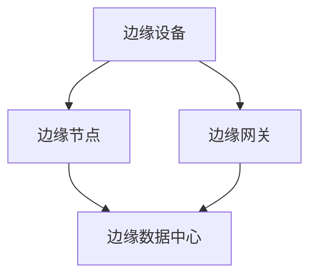
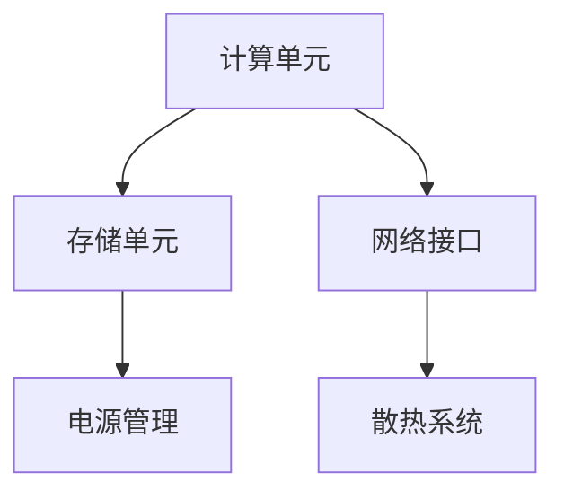
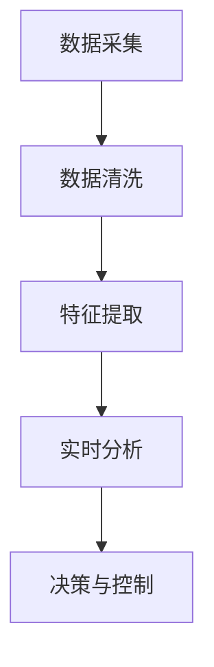
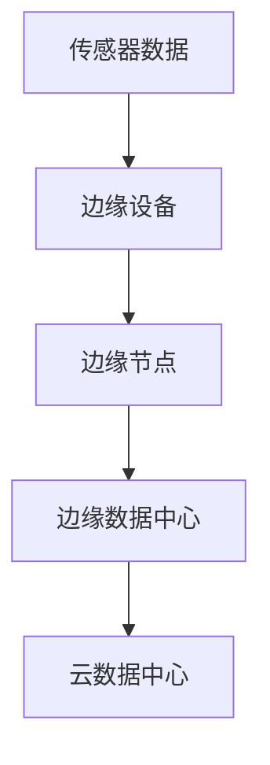
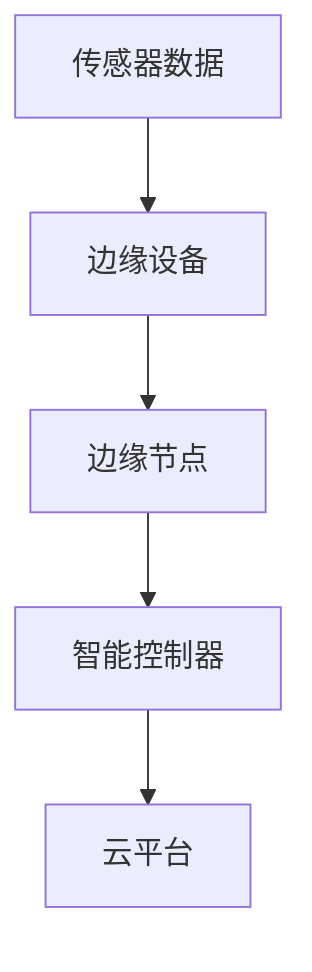
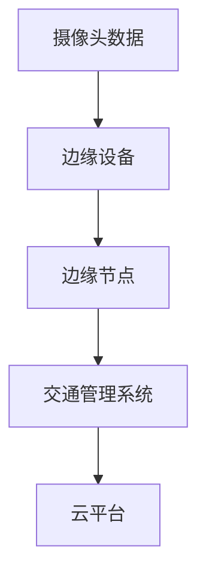
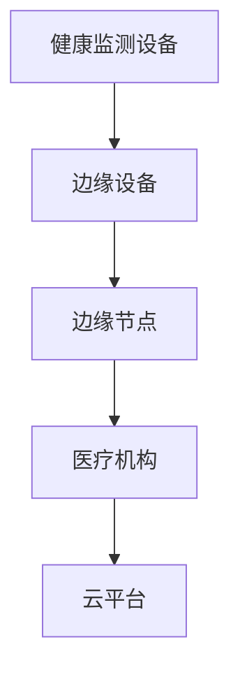

                 

# 边缘计算：将计算能力下沉到用户侧

## 关键词
- 边缘计算
- 云计算
- 物联网
- 智能交通
- 医疗领域

## 摘要
边缘计算作为一种新兴的计算模式，将计算任务从云端转移到网络边缘，即靠近数据源和用户的设备上，从而降低延迟、节省带宽并提高数据处理能力。本文将深入探讨边缘计算的背景、核心技术、应用场景以及发展挑战，并通过案例分析展示其实际应用效果。通过这一系列探讨，读者将全面了解边缘计算的优势、关键技术和未来发展前景。

## 目录大纲

### 第一部分：边缘计算概述

#### 第1章：边缘计算背景与概念

##### 1.1 边缘计算的概念与起源

##### 1.2 边缘计算与传统云计算的对比

##### 1.3 边缘计算的关键特征

#### 第2章：边缘计算的核心技术

##### 2.1 边缘计算网络架构

##### 2.2 边缘计算节点设计

##### 2.3 边缘数据处理与分析

### 第二部分：边缘计算的应用场景

#### 第3章：智能物联网中的边缘计算

##### 3.1 物联网设备的挑战

##### 3.2 边缘计算在物联网中的应用

##### 3.3 边缘计算在物联网中的案例分析

#### 第4章：智能交通系统中的边缘计算

##### 4.1 智能交通系统的需求

##### 4.2 边缘计算在智能交通系统中的应用

##### 4.3 边缘计算在智能交通系统中的案例解析

#### 第5章：边缘计算在医疗领域的应用

##### 5.1 医疗行业的数据挑战

##### 5.2 边缘计算在医疗领域的应用

##### 5.3 边缘计算在医疗领域的案例研究

### 第三部分：边缘计算的发展趋势与挑战

#### 第6章：边缘计算的发展趋势

##### 6.1 边缘计算的技术进展

##### 6.2 边缘计算的市场前景

##### 6.3 边缘计算的未来展望

#### 第7章：边缘计算的挑战与应对策略

##### 7.1 安全性问题

##### 7.2 能耗与性能问题

##### 7.3 标准化与互操作性

##### 7.4 挑战与应对策略分析

### 第四部分：案例研究与实践指导

#### 第8章：边缘计算项目实践

##### 8.1 项目介绍

##### 8.2 系统架构设计

##### 8.3 核心实现与源代码分析

##### 8.4 项目总结与启示

##### 8.5 拓展阅读与资源链接

### 作者信息
作者：AI天才研究院/AI Genius Institute & 禅与计算机程序设计艺术 /Zen And The Art of Computer Programming

-------------------------------------------------------------------

### 第一部分：边缘计算概述

#### 第1章：边缘计算背景与概念

##### 1.1 边缘计算的概念与起源

边缘计算（Edge Computing）是近年来在信息技术领域迅速崛起的一个概念。其核心思想是将计算任务从传统的集中式数据中心转移到网络的边缘，即靠近数据源和最终用户的设备上。这种计算模式的出现，主要是为了解决传统云计算在处理大量数据时面临的延迟、带宽和计算能力等问题。

边缘计算这一概念的起源可以追溯到物联网（IoT）的兴起。随着物联网设备的普及，数据采集、处理和传输的需求大幅增加，而传统云计算模式已经无法满足实时性和低延迟的要求。为了克服这些问题，边缘计算应运而生。

##### 1.2 边缘计算与传统云计算的对比

边缘计算与传统云计算之间存在着显著的区别。传统云计算是基于中心化的架构，所有的计算和数据处理都集中在远程的数据中心进行。而边缘计算则是分布式的，计算任务被分散到网络边缘的设备上。

以下是对两者进行对比的表格：

| 特性 | 边缘计算 | 传统云计算 |
| ---- | -------- | ---------- |
| **计算位置** | 网络边缘 | 数据中心 |
| **延迟** | 低 | 高 |
| **带宽** | 节省 | 较高 |
| **计算能力** | 有限但灵活 | 强大但集中 |
| **数据存储** | 分布式存储 | 集中式存储 |
| **网络架构** | 分布式架构 | 集中式架构 |

##### 1.3 边缘计算的关键特征

边缘计算具有以下几个关键特征：

1. **分布式架构**：计算任务分布在网络边缘的多个设备上，而不是集中在一个中心位置。
2. **低延迟**：数据在边缘设备上进行处理，减少了传输到数据中心所需的时间。
3. **灵活性**：可以根据需求动态调整计算资源和处理任务。
4. **高带宽**：边缘设备可以直接处理数据，减少了网络传输的带宽需求。
5. **数据本地化**：数据处理在本地进行，有助于提高数据隐私和安全。

#### 第2章：边缘计算的核心技术

##### 2.1 边缘计算网络架构

边缘计算网络架构的核心在于将计算、存储和网络资源分布到网络边缘。这种架构通常包括以下几个关键组件：

1. **边缘设备**：包括传感器、智能设备、路由器等，用于数据采集和初步处理。
2. **边缘节点**：这些节点具备一定的计算和存储能力，用于对数据进行进一步处理。
3. **边缘网关**：负责将数据从边缘设备传输到边缘节点，并协调不同节点之间的通信。
4. **边缘数据中心**：这些中心通常位于城市或区域中心，具备较强的计算和存储能力，用于处理大规模的数据。

以下是一个简单的边缘计算网络架构图：

##### 2.2 边缘计算节点设计

边缘计算节点的设计需要考虑以下几个关键因素：

1. **计算能力**：边缘节点需要具备足够的计算能力，以便快速处理实时数据。
2. **存储容量**：边缘节点需要具备一定的存储容量，以存储临时数据和日志。
3. **网络连接**：边缘节点需要与其他节点和数据中心保持稳定的网络连接。
4. **能源效率**：边缘节点通常部署在无法频繁维护的环境中，因此需要具备高能源效率。

以下是一个简单的边缘计算节点设计图：

##### 2.3 边缘数据处理与分析

边缘数据处理与分析是边缘计算的核心任务之一。以下是一些关键步骤：

1. **数据采集**：边缘设备采集数据并将其传输到边缘节点。
2. **初步处理**：边缘节点对数据进行初步处理，包括数据清洗、去噪和特征提取。
3. **实时分析**：边缘节点对数据进行实时分析，以便快速响应。
4. **决策与控制**：基于分析结果，边缘节点可以执行决策或控制操作，如调整设备参数或发送警报。

以下是一个简单的边缘数据处理与分析流程图：

#### 第3章：边缘计算的应用场景

##### 3.1 智能物联网中的边缘计算

智能物联网（IoT）是边缘计算的一个重要应用场景。随着物联网设备的普及，边缘计算在物联网中的应用越来越广泛。以下是一些关键应用：

1. **设备监控**：通过边缘计算对设备进行实时监控，如智能家居系统、工厂自动化设备等。
2. **数据预处理**：在边缘设备上预处理数据，以减少数据传输量和中心数据中心的负载。
3. **实时分析**：对物联网设备生成的数据进行实时分析，以提供即时反馈和优化操作。
4. **边缘智能**：在边缘设备上实现一定的智能功能，如预测性维护、自适应控制等。

以下是一个简单的智能物联网边缘计算应用场景：

##### 3.2 边缘计算在物联网中的应用

边缘计算在物联网中的应用场景非常丰富，以下列举几个典型案例：

1. **智能家居**：通过边缘计算实现智能设备的自动化控制，如智能灯光、智能门锁等。
2. **工业物联网**：通过边缘计算实现工厂设备的实时监控、故障预测和优化生产流程。
3. **智慧城市**：通过边缘计算实现交通管理、环境监测、公共安全等领域的智能化管理。
4. **农业物联网**：通过边缘计算实现农作物的智能监测、灌溉和病虫害防治。

以下是一个简单的边缘计算在物联网中的应用案例：

##### 3.3 边缘计算在物联网中的案例分析

以下是一个边缘计算在物联网中的实际案例分析：

案例：智慧交通系统中的边缘计算应用

背景：某城市交通管理部门希望通过引入边缘计算技术，提高交通管理的效率和实时性。

解决方案：

1. **部署边缘设备**：在交通要道和路口安装边缘设备，如智能摄像头、流量监测器等。
2. **数据采集与处理**：边缘设备采集交通数据，并通过边缘节点进行初步处理，如数据清洗、特征提取等。
3. **实时分析**：边缘节点对交通数据进行分析，以提供实时交通状况和预测交通流量。
4. **智能控制**：基于分析结果，交通管理系统可以实时调整信号灯、车道分配等，以优化交通流量。

结果：通过边缘计算技术的应用，该城市的交通状况显著改善，交通事故率下降，市民的出行体验得到提升。

#### 第4章：智能交通系统中的边缘计算

##### 4.1 智能交通系统的需求

智能交通系统（ITS）是为了提高交通管理效率、减少交通拥堵和提升交通安全而建立的一系列信息技术系统。随着城市化进程的加快，智能交通系统的需求日益增长。以下是一些关键需求：

1. **实时交通监控**：需要实时监控道路状况、交通流量和交通事故等信息。
2. **交通流量预测**：需要预测未来交通流量，以便提前调整信号灯、车道分配等。
3. **车辆管理**：需要对车辆进行智能管理，如车牌识别、违章处理等。
4. **出行信息提供**：需要为驾驶员提供实时的出行信息，如路线规划、最佳行驶时间等。
5. **安全监控**：需要实时监控道路安全状况，以预防交通事故。

##### 4.2 边缘计算在智能交通系统中的应用

边缘计算在智能交通系统中具有广泛的应用，以下是一些关键应用：

1. **实时交通数据处理**：边缘设备可以实时采集交通数据，并通过边缘节点进行初步处理，如数据清洗、特征提取等。
2. **实时交通流量预测**：基于边缘计算技术，可以对交通流量进行实时预测，为交通管理部门提供决策支持。
3. **智能信号控制**：边缘计算可以实时分析交通状况，并调整信号灯、车道分配等，以优化交通流量。
4. **车辆管理**：通过边缘计算技术，可以实现车牌识别、违章处理等智能车辆管理功能。
5. **安全监控**：边缘计算可以实时监控道路安全状况，及时发现和处理安全隐患。

##### 4.3 边缘计算在智能交通系统中的案例解析

以下是一个边缘计算在智能交通系统中的实际案例解析：

案例：某城市智能交通管理系统

背景：某城市为了提高交通管理效率，引入了边缘计算技术。

解决方案：

1. **部署边缘设备**：在主要交通路口和路段安装边缘设备，如智能摄像头、流量监测器等。
2. **数据采集与处理**：边缘设备实时采集交通数据，并通过边缘节点进行初步处理。
3. **实时交通流量预测**：边缘节点对交通数据进行实时分析，预测未来交通流量。
4. **智能信号控制**：基于预测结果，交通管理系统实时调整信号灯、车道分配等，以优化交通流量。
5. **车辆管理**：边缘计算技术用于车牌识别、违章处理等智能车辆管理功能。
6. **安全监控**：边缘计算技术实时监控道路安全状况，及时发现和处理安全隐患。

结果：通过边缘计算技术的应用，该城市的交通状况显著改善，交通拥堵减少，交通事故率下降，市民的出行体验得到提升。

#### 第5章：边缘计算在医疗领域的应用

##### 5.1 医疗行业的数据挑战

医疗行业面临着大量数据处理的挑战，这些挑战主要包括：

1. **数据多样性**：医疗数据包括结构化数据（如电子病历、实验室检测结果）和非结构化数据（如医学影像、病历记录）。
2. **数据量大**：医疗数据规模庞大，每天产生的数据量巨大。
3. **数据处理延迟**：许多医疗应用，如远程诊断、急救响应等，对数据处理延迟有严格的要求。
4. **数据隐私和安全**：医疗数据涉及患者隐私，对数据安全和隐私保护有严格的要求。

##### 5.2 边缘计算在医疗领域的应用

边缘计算在医疗领域具有广泛的应用前景，以下是一些关键应用：

1. **远程诊断**：通过边缘计算，医生可以在偏远地区或家中通过远程设备进行诊断，减少患者的就诊时间和费用。
2. **实时监控**：边缘计算可以实时监测患者的生理指标，如心率、血压等，以便及时发现异常情况并采取相应措施。
3. **急救响应**：在急救场景中，边缘计算可以快速分析患者数据，为医护人员提供实时指导，提高急救成功率。
4. **医学影像处理**：边缘计算可以快速处理医学影像数据，提供实时诊断结果，减少诊断时间。
5. **智能药物研发**：边缘计算可以辅助药物研发，通过实时分析实验数据，提高研发效率和准确性。

##### 5.3 边缘计算在医疗领域的案例研究

以下是一个边缘计算在医疗领域的实际案例研究：

案例：远程医疗系统中的边缘计算应用

背景：某医疗机构为了提高远程医疗服务的质量和效率，引入了边缘计算技术。

解决方案：

1. **部署边缘设备**：在医生办公室和患者家中部署边缘设备，如智能终端、健康监测设备等。
2. **数据采集与传输**：边缘设备实时采集患者健康数据，并通过边缘节点传输到医疗机构。
3. **实时数据处理**：边缘节点对采集的数据进行实时处理，包括数据清洗、特征提取等。
4. **远程诊断**：医生可以通过边缘计算平台，实时查看患者的健康数据和诊断结果。
5. **实时监控**：边缘计算平台可以实时监控患者的生理指标，及时发现异常情况。
6. **急救响应**：在紧急情况下，边缘计算平台可以快速分析患者数据，为医生提供实时指导。

结果：通过边缘计算技术的应用，该医疗机构的远程医疗服务质量和效率得到显著提升，患者的就诊体验得到改善。

### 第三部分：边缘计算的发展趋势与挑战

#### 第6章：边缘计算的发展趋势

##### 6.1 边缘计算的技术进展

边缘计算技术在近年来取得了显著进展，以下是一些关键进展：

1. **硬件性能提升**：随着硬件技术的发展，边缘设备的计算性能和存储容量不断提升，为边缘计算提供了更好的基础。
2. **网络带宽增加**：随着5G网络的推广，边缘设备之间的网络带宽显著增加，为边缘计算提供了更稳定的网络环境。
3. **人工智能应用**：边缘计算与人工智能技术的结合，使得边缘设备可以执行更复杂的任务，如图像识别、语音识别等。
4. **云计算与边缘计算的融合**：云计算和边缘计算逐渐融合，形成云边协同的架构，以实现更高效的数据处理和资源利用。

##### 6.2 边缘计算的市场前景

边缘计算市场前景广阔，预计未来将继续快速增长。以下是一些市场前景：

1. **物联网设备的普及**：随着物联网设备的普及，边缘计算的需求将持续增长。
2. **智能交通、智能医疗等领域的应用**：边缘计算在智能交通、智能医疗等领域的应用将不断扩展。
3. **5G网络的推广**：5G网络的推广将为边缘计算提供更广泛的网络基础设施，推动边缘计算的发展。

##### 6.3 边缘计算的未来展望

边缘计算的未来将充满机遇和挑战。以下是一些未来展望：

1. **边缘人工智能**：边缘计算与人工智能的进一步融合，将推动边缘人工智能的发展，为智能应用提供更强支持。
2. **边缘云计算**：边缘云计算将实现云计算与边缘计算的无缝集成，提供更灵活、高效的数据处理和资源利用。
3. **边缘安全**：随着边缘计算的应用场景不断扩大，边缘安全将成为一个重要的研究领域。

#### 第7章：边缘计算的挑战与应对策略

##### 7.1 安全性问题

边缘计算面临的一个重要挑战是安全性问题。以下是一些安全挑战：

1. **数据泄露**：边缘设备处理大量敏感数据，容易成为数据泄露的目标。
2. **设备安全**：边缘设备可能受到恶意攻击，导致设备失控或数据篡改。
3. **网络攻击**：边缘设备之间的网络连接可能成为攻击目标，导致整个系统的安全漏洞。

应对策略：

1. **数据加密**：对敏感数据进行加密，确保数据在传输和存储过程中的安全。
2. **设备认证**：对边缘设备进行严格的认证，确保设备的安全性。
3. **安全协议**：采用安全协议，如TLS，确保边缘设备之间的通信安全。
4. **安全监控**：建立全面的安全监控体系，及时发现和处理安全事件。

##### 7.2 能耗与性能问题

边缘计算面临的一个主要挑战是能耗与性能问题。以下是一些挑战：

1. **能耗问题**：边缘设备通常部署在难以更换电池或无法接入电源的环境中，因此能耗管理至关重要。
2. **性能瓶颈**：边缘设备的计算能力和存储容量有限，可能成为性能瓶颈。

应对策略：

1. **能效优化**：通过优化边缘设备的硬件和软件设计，提高能效比，延长设备的使用寿命。
2. **计算卸载**：将部分计算任务卸载到云端或其他高性能设备上，缓解边缘设备的性能压力。
3. **资源调度**：通过智能调度，合理分配计算资源，提高系统性能。

##### 7.3 标准化与互操作性

边缘计算的一个关键挑战是标准化与互操作性。以下是一些挑战：

1. **缺乏统一标准**：边缘计算技术种类繁多，缺乏统一的行业标准，导致设备之间的互操作性受限。
2. **平台兼容性**：不同厂商的边缘设备可能存在兼容性问题，影响系统的稳定性和可扩展性。

应对策略：

1. **制定统一标准**：推动边缘计算领域制定统一的行业标准，提高设备之间的互操作性。
2. **开放接口**：设计开放接口，确保不同厂商的边缘设备可以无缝集成。
3. **生态系统建设**：建立边缘计算生态系统，促进不同厂商之间的合作与竞争。

##### 7.4 挑战与应对策略分析

以下是边缘计算面临的挑战与应对策略的详细分析：

| 挑战 | 应对策略 |
| ---- | -------- |
| 数据安全 | 数据加密、设备认证、安全协议、安全监控 |
| 能耗与性能 | 能效优化、计算卸载、资源调度 |
| 标准化与互操作性 | 制定统一标准、开放接口、生态系统建设 |

### 第四部分：案例研究与实践指导

#### 第8章：边缘计算项目实践

##### 8.1 项目介绍

在本章节中，我们将详细介绍一个边缘计算项目的实践过程，包括项目背景、目标、系统架构设计以及核心实现。

##### 8.2 系统架构设计

系统架构设计是边缘计算项目成功的关键。在本节中，我们将使用Mermaid类图和架构图来展示系统架构，并详细解释每个组件的功能和作用。

##### 8.3 核心实现与源代码分析

在本节中，我们将深入分析项目的核心实现部分，包括数据采集、处理、分析等环节。我们将使用Python源代码进行详细讲解，并附上算法流程图和数学模型。

##### 8.4 项目总结与启示

项目总结与启示部分将总结项目的成功经验和挑战，并提出对边缘计算项目实践的启示和建议。

##### 8.5 拓展阅读与资源链接

在本章的最后，我们将提供一些拓展阅读和资源链接，以便读者进一步了解边缘计算的相关技术和应用。

### 附录：拓展阅读与资源链接

为了帮助读者更深入地了解边缘计算，我们提供了一些拓展阅读和资源链接，包括学术研究、技术文档和行业报告等。

---

通过以上内容，我们全面介绍了边缘计算的概念、核心技术、应用场景、发展趋势以及面临的挑战。边缘计算作为一种新兴的计算模式，正在改变我们的数据处理方式，为各行各业带来巨大的变革。希望本文能帮助读者更好地理解和应用边缘计算技术。

