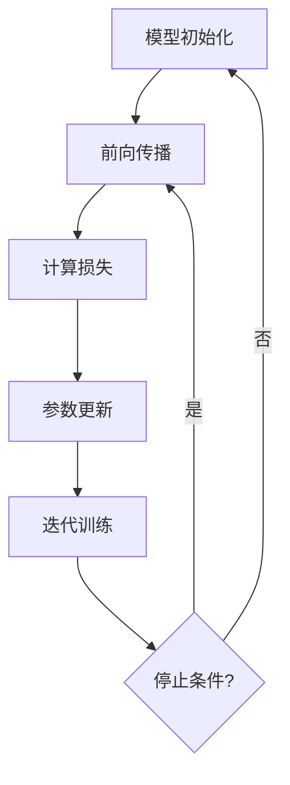
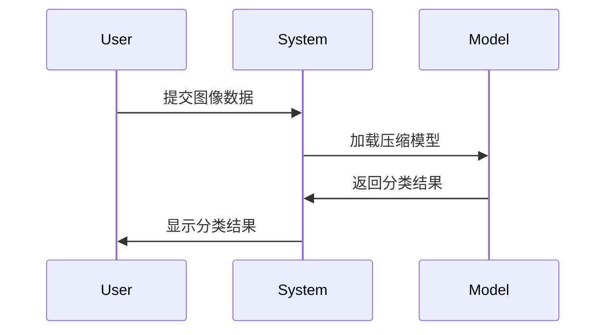

                 

### 引言

#### 1. 引言背景

随着物联网、5G、人工智能等技术的快速发展，边缘设备在数据处理和智能推理方面的重要性日益凸显。然而，边缘设备通常具有计算资源有限、功耗受限的特点，这给神经网络在边缘设备上的推理带来了巨大的挑战。为了解决这个问题，神经网络压缩技术应运而生，它通过对神经网络结构和参数进行优化，使得模型在保持较高准确率的同时，可以显著减小模型大小和降低计算复杂度。

#### 1.2 核心概念

**神经网络基础：** 神经网络是一种模拟人脑神经元结构和功能的人工智能模型，通过多层神经元的组合来实现数据的输入和输出。神经网络主要包括输入层、隐藏层和输出层，每层神经元之间通过权重连接，通过学习训练数据来调整这些权重，从而实现函数的映射。

**边缘设备推理：** 边缘设备推理是指在边缘设备上直接进行数据分析和决策，而不需要将数据传输到云端进行处理。边缘设备通常具有较低的延迟、更高的隐私性和更强的实时性。

**神经网络压缩技术：** 神经网络压缩技术是指通过对神经网络进行剪枝、量化、稀疏化等操作，来减少模型的大小和计算复杂度。压缩后的神经网络可以在资源受限的边缘设备上运行，从而提高边缘设备的计算效率。

#### 1.3 书籍结构

本书将从以下几个方面深入探讨边缘设备推理中神经网络压缩的创新技术：

- **边缘设备推理基础**：介绍边缘设备推理的背景、优势和应用场景，以及神经网络在边缘设备上的挑战和解决方案。
- **神经网络压缩技术概述**：对常见的神经网络压缩方法进行详细分类和讲解，包括网络剪枝、量化、稀疏化、模型蒸馏和重构等。
- **算法原理讲解**：深入分析神经网络压缩算法的数学模型和原理，并通过具体的算法流程和代码实现进行说明。
- **边缘设备上的神经网络压缩实践**：介绍如何在实际项目中应用神经网络压缩技术，包括环境搭建、核心实现和代码解析。
- **最佳实践与展望**：总结神经网络压缩的最佳实践经验和未来发展趋势。

通过本书的学习，读者将能够全面了解和掌握边缘设备推理中神经网络压缩的技术原理和实践方法，为实际应用提供有力的技术支持。

### 第一部分：边缘设备推理与神经网络压缩

#### 第2章 边缘设备推理基础

##### 2.1 边缘设备推理的背景

边缘设备推理是指在边缘设备上直接进行数据分析和决策的过程，而不需要将数据传输到云端进行处理。这种方式的兴起主要受到了以下几个因素的驱动：

1. **计算资源的限制**：边缘设备通常具有有限的计算资源，如处理器、内存和存储空间。直接在边缘设备上进行推理可以减少数据传输和处理所需的计算资源，提高边缘设备的利用效率。
2. **低延迟的需求**：在一些实时性要求较高的应用场景中，如自动驾驶、智能监控等，数据需要在本地快速处理，以实现即时响应。边缘设备推理可以显著降低数据处理延迟，提高系统的实时性。
3. **隐私和数据安全**：将数据传输到云端进行处理可能涉及到数据隐私和安全问题。边缘设备推理可以在本地直接处理数据，减少数据传输过程中的安全隐患。
4. **网络带宽的限制**：在某些偏远地区或网络条件不佳的环境中，网络带宽可能成为数据传输的瓶颈。边缘设备推理可以减少数据传输量，降低网络带宽的占用。

##### 2.2 神经网络在边缘设备推理中的应用

神经网络在边缘设备推理中扮演着重要的角色，其主要应用场景包括：

1. **图像识别和分类**：例如，在智能监控系统中，使用边缘设备进行人脸识别、物体检测和场景分类，可以实时分析监控视频，提高监控效果。
2. **语音识别和合成**：在智能音箱、智能助手等设备中，使用边缘设备进行语音识别和合成，可以降低对云端服务的依赖，提高交互的实时性和个性化水平。
3. **自然语言处理**：在智能客服、聊天机器人等应用中，使用边缘设备进行自然语言理解、文本分类和翻译等任务，可以提高响应速度和服务质量。
4. **运动控制**：在机器人、无人机等设备中，使用边缘设备进行运动控制和路径规划，可以实现更精确和实时的控制，提高设备的自主性和智能化水平。

##### 2.3 神经网络在边缘设备推理中的挑战

尽管神经网络在边缘设备推理中具有广泛的应用前景，但同时也面临着一些挑战：

1. **模型大小和计算复杂度**：传统的深度神经网络模型通常较大，参数数量多，计算复杂度高。在资源有限的边缘设备上部署这些模型可能会遇到性能瓶颈，影响推理速度和实时性。
2. **功耗限制**：边缘设备通常具有功耗限制，特别是电池供电的设备，需要降低功耗以延长电池寿命。较大的模型和复杂的计算任务可能会增加功耗，对设备运行造成影响。
3. **存储空间限制**：边缘设备存储空间有限，需要优化模型存储和加载的方式，以减少存储占用。
4. **算法优化和硬件加速**：为了在边缘设备上高效运行神经网络，需要对算法进行优化，利用硬件加速技术，如GPU、FPGA等，提高推理性能。

##### 2.4 解决方案概述

为了应对边缘设备推理中的挑战，研究人员提出了一系列解决方案：

1. **模型压缩**：通过剪枝、量化、稀疏化等压缩技术，减少神经网络模型的大小和计算复杂度，使得模型可以在资源受限的边缘设备上高效运行。
2. **硬件加速**：利用GPU、FPGA等硬件加速技术，提高神经网络推理的速度和效率，满足实时性的需求。
3. **分布式计算**：通过分布式计算架构，将复杂的神经网络推理任务分解为多个部分，在多个边缘设备上并行处理，提高整体性能。
4. **增量学习和在线学习**：利用增量学习和在线学习技术，实时更新和调整神经网络模型，使其适应动态变化的环境和任务需求。

通过上述解决方案，边缘设备推理中的神经网络压缩技术为应对资源受限的挑战提供了有力支持，为边缘计算的发展奠定了基础。

### 第3章 神经网络压缩技术概述

#### 3.1 神经网络压缩的重要性

神经网络压缩技术在边缘设备推理中具有重要意义，主要表现在以下几个方面：

1. **减小模型大小**：通过压缩技术，可以显著减小神经网络模型的大小，使得模型能够在存储空间有限的边缘设备上存储和部署。这不仅节省了存储资源，还有利于模型下载和初始化的速度。
2. **降低计算复杂度**：压缩后的神经网络模型具有较少的参数和计算操作，从而降低了模型的计算复杂度。这有助于提高边缘设备的推理速度和效率，满足实时性要求。
3. **减少功耗**：较小的模型和较少的计算操作可以降低边缘设备的功耗，延长电池供电设备的续航时间。这对于需要长时间运行和低功耗需求的边缘设备尤为重要。
4. **提高资源利用率**：压缩后的模型可以在资源受限的边缘设备上运行，提高设备的资源利用率。此外，压缩技术还可以减少边缘设备之间的数据传输量，降低网络带宽的占用。

#### 3.2 常见的神经网络压缩方法

神经网络压缩技术主要包括以下几种方法：

1. **网络剪枝**：通过删除神经网络中不必要的连接和神经元，减少模型的大小和计算复杂度。剪枝技术可以分为结构剪枝和权重剪枝，分别通过删除整个层或部分层，以及删除神经元之间的连接来实现。
2. **网络量化**：通过将神经网络中的浮点数参数转换为低精度的整数表示，减少模型的存储空间和计算复杂度。量化技术可以分为全量化、部分量化和动态量化，分别对整个模型、部分参数或动态调整参数精度。
3. **网络稀疏化**：通过将神经网络中的大部分权重设置为0，使得网络变得稀疏，从而减少计算操作。稀疏化技术包括低秩分解、稀疏编码和稀疏矩阵乘法，分别通过分解权重矩阵、编码神经元和计算稀疏矩阵乘法来实现。
4. **模型蒸馏**：通过将一个较大的教师模型的知识传递给一个较小的学生模型，使得学生模型能够保持较高的性能。模型蒸馏技术通常包括编码器-解码器结构和教师-学生模型融合，通过多轮训练实现知识传递。
5. **网络重构**：通过重新设计神经网络的结构，使得模型更加紧凑和高效。网络重构技术包括神经架构搜索（NAS）和神经模块化（N.Module），通过搜索最优网络结构和模块组合来实现模型优化。

#### 3.3 神经网络压缩方法的选择

在选择神经网络压缩方法时，需要考虑以下因素：

1. **压缩目标**：根据不同的应用场景和需求，选择适合的压缩方法。例如，对于需要低延迟和高实时性的应用，可以选择剪枝和稀疏化技术；对于需要低功耗和长续航的应用，可以选择量化技术。
2. **模型类型**：不同的神经网络模型具有不同的结构特点，需要选择适合的压缩方法。例如，卷积神经网络（CNN）适合采用剪枝和量化技术，而循环神经网络（RNN）和生成对抗网络（GAN）适合采用稀疏化和模型蒸馏技术。
3. **压缩效率**：压缩效率是指压缩方法在减少模型大小和计算复杂度的同时，保持较高性能的能力。选择压缩效率较高的方法可以提高模型的实用性和可部署性。
4. **计算资源**：压缩方法需要消耗一定的计算资源，包括存储、计算和通信资源。选择计算资源消耗较低的方法可以降低压缩过程中的成本和能耗。
5. **应用场景**：根据不同的应用场景和需求，选择适合的压缩方法。例如，对于需要高度精确的应用，可以选择复杂的压缩方法；对于需要快速部署的应用，可以选择简单的压缩方法。

#### 3.4 实践案例分析

在实际应用中，不同的神经网络压缩方法具有不同的适用场景和效果。以下是一些典型的案例：

1. **图像识别**：在图像识别任务中，剪枝和量化技术被广泛应用。例如，MobileNetV2模型通过结构剪枝和量化技术，使得模型大小减少了60%，计算复杂度降低了50%，同时在ImageNet数据集上保持了较高的准确率。
2. **语音识别**：在语音识别任务中，稀疏化和模型蒸馏技术被广泛应用。例如，深度神经网络（DNN）通过稀疏化技术，使得模型在保持较高准确率的同时，计算复杂度降低了30%。同时，DNN模型通过模型蒸馏技术，将教师模型的丰富知识传递给学生模型，使得学生模型在保持较低计算复杂度的同时，提高了语音识别的准确率。
3. **自然语言处理**：在自然语言处理任务中，量化技术和模型重构技术被广泛应用。例如，BERT模型通过量化技术，使得模型大小减少了70%，计算复杂度降低了50%。同时，BERT模型通过神经架构搜索（NAS）技术，重构出更紧凑和高效的模型，使得模型在保持较高准确率的同时，计算复杂度进一步降低了30%。

通过实践案例分析，我们可以看到神经网络压缩技术在不同的应用场景中具有广泛的应用前景，为边缘设备推理提供了有效的技术支持。

### 第4章 神经网络压缩中的算法原理

#### 4.1 压缩算法的数学模型

神经网络压缩算法的核心在于优化模型的大小和计算复杂度，同时保持较高的性能。为了实现这一目标，我们需要了解以下几个基本的数学概念：

1. **神经网络的表示**：神经网络可以用一个参数矩阵表示，其中每个元素代表神经元之间的连接权重。对于一层神经网络，其输出可以表示为输入向量与权重矩阵的点积再加上偏置项。
2. **激活函数**：激活函数用于引入非线性，使得神经网络可以学习复杂的函数。常见的激活函数包括Sigmoid、ReLU、Tanh等。
3. **前向传播与反向传播**：前向传播是指将输入数据通过神经网络进行计算，得到输出结果。反向传播是指通过计算输出结果与实际结果的误差，反向更新神经网络的权重和偏置项。

在神经网络压缩算法中，我们通常关注以下几个关键步骤：

1. **参数选择**：选择模型参数，包括连接权重、激活函数和偏置项。这些参数决定了神经网络的复杂度和性能。
2. **优化目标**：设定优化目标，如最小化误差函数或最大化模型精度。常见的误差函数包括均方误差（MSE）和交叉熵损失（CE）。
3. **优化算法**：选择优化算法，如梯度下降、随机梯度下降（SGD）、Adam等。优化算法用于调整模型参数，以达到优化目标。

#### 4.2 压缩算法的基本框架

神经网络压缩算法的基本框架通常包括以下几个步骤：

1. **初始化模型**：选择初始模型参数，可以使用预训练的模型或随机初始化。
2. **前向传播**：将输入数据通过神经网络进行计算，得到输出结果。
3. **计算损失**：计算输出结果与实际结果的误差，计算误差函数的梯度。
4. **参数更新**：根据误差函数的梯度，更新模型参数。
5. **迭代训练**：重复上述步骤，直到满足停止条件，如达到预设的迭代次数或达到目标误差。

在神经网络压缩算法中，通常需要对模型进行以下操作：

1. **剪枝**：通过删除不必要的连接和神经元，减少模型的大小和计算复杂度。剪枝可以分为结构剪枝和权重剪枝。
2. **量化**：将神经网络中的浮点数参数转换为低精度的整数表示，降低模型的存储空间和计算复杂度。量化可以分为全量化、部分量化和动态量化。
3. **稀疏化**：通过将大部分权重设置为0，使得网络变得稀疏，从而减少计算操作。稀疏化可以通过低秩分解、稀疏编码或稀疏矩阵乘法实现。

#### 4.3 模型压缩的数学公式

在神经网络压缩中，我们通常使用以下数学公式来描述模型压缩过程：

1. **剪枝**：
   - 结构剪枝：设$W$为原始权重矩阵，$W_{pruned}$为剪枝后的权重矩阵，则剪枝操作可以表示为：
     $$W_{pruned} = W \odot S$$
     其中$S$为剪枝掩码，$S_{ij} = 1$表示保留连接$(i, j)$，$S_{ij} = 0$表示删除连接$(i, j)$。
   - 权重剪枝：设$W$为原始权重矩阵，$W_{th}$为剪枝阈值，则剪枝操作可以表示为：
     $$W_{pruned} = \begin{cases} 
     W, & \text{if } |W_{ij}| > W_{th} \\
     0, & \text{otherwise}
     \end{cases}$$

2. **量化**：
   - 全量化：设$W$为原始权重矩阵，$Q$为量化函数，则量化操作可以表示为：
     $$W_{quantized} = Q(W)$$
     其中$Q$通常是一个线性映射函数，如线性量化函数：
     $$Q(W_{ij}) = \text{round}\left(\frac{W_{ij}}{2^b}\right)$$
     其中$b$为量化位数。
   - 动态量化：设$W$为原始权重矩阵，$\alpha$为量化步长，则动态量化可以表示为：
     $$W_{dynamic} = \text{round}(W / \alpha)$$

3. **稀疏化**：
   - 低秩分解：设$W$为原始权重矩阵，$U$和$V$分别为低秩分解的矩阵，则稀疏化可以表示为：
     $$W = U \odot V$$
     其中$\odot$表示Hadamard积，$U$和$V$的大部分元素为0，表示网络变得稀疏。
   - 稀疏编码：设$W$为原始权重矩阵，$S$为稀疏掩码，则稀疏化可以表示为：
     $$W_{sparse} = S \odot W$$
     其中$S_{ij} = 1$表示保留连接$(i, j)$，$S_{ij} = 0$表示删除连接$(i, j)$。

通过上述数学模型和公式，我们可以实现神经网络的有效压缩，从而在保持较高性能的同时，降低模型的计算复杂度和存储需求。

### 4.4 算法原理详解

为了深入理解神经网络压缩算法的原理，我们需要从以下几个方面进行详细分析：

#### 4.4.1 算法流程图

神经网络压缩算法通常包括以下几个主要步骤：

1. **模型初始化**：选择初始模型参数，包括连接权重和偏置项。这一步骤可以使用预训练的模型，或者通过随机初始化生成。
2. **前向传播**：将输入数据通过神经网络进行计算，得到输出结果。这一步骤涉及到前向传播算法，包括计算各层神经元的输出值。
3. **计算损失**：计算输出结果与实际结果的误差，并使用误差函数（如均方误差MSE或交叉熵CE）评估模型性能。
4. **参数更新**：根据误差函数的梯度，更新模型参数，以最小化误差函数。常用的优化算法包括梯度下降（GD）、随机梯度下降（SGD）和Adam等。
5. **迭代训练**：重复上述步骤，直到满足停止条件，如达到预设的迭代次数或达到目标误差。

以下是一个简化的算法流程图：



#### 4.4.2 Python代码实现

为了具体说明神经网络压缩算法的实现，我们以一个简单的线性模型为例，使用Python进行实现。以下是一个线性回归模型的示例代码：

```python
import numpy as np

# 参数初始化
w = np.random.randn(n)  # n为特征数量
b = np.random.randn(1)  # 偏置项

# 前向传播
def forward(x, w, b):
    return x @ w + b

# 计算损失
def loss(y, y_pred):
    return ((y - y_pred) ** 2).mean()

# 梯度计算
def backward(x, y, y_pred):
    d_w = 2 * (y_pred - y) * x
    d_b = 2 * (y_pred - y)
    return d_w, d_b

# 训练模型
def train(x, y, w, b, epochs, learning_rate):
    for _ in range(epochs):
        y_pred = forward(x, w, b)
        loss_val = loss(y, y_pred)
        d_w, d_b = backward(x, y, y_pred)
        w -= learning_rate * d_w
        b -= learning_rate * d_b
    return w, b

# 输入和输出数据
x = np.random.randn(100, n)
y = np.random.randn(100, 1)

# 训练模型
w, b = train(x, y, w, b, epochs=1000, learning_rate=0.01)
```

上述代码展示了线性回归模型的初始化、前向传播、损失计算、参数更新和迭代训练过程。在实际应用中，神经网络模型会更加复杂，但基本原理相同。

#### 4.4.3 举例说明

为了更直观地理解神经网络压缩算法，我们以一个简单的例子进行说明。假设我们有一个简单的神经网络，用于二分类任务，其结构如下：

1. 输入层：1个神经元
2. 隐藏层：2个神经元
3. 输出层：1个神经元

输入数据为一个向量$x \in \mathbb{R}^1$，输出标签为$y \in \{0, 1\}$。我们使用ReLU激活函数和Softmax输出函数。

**初始化模型参数**：
- $w_1 \in \mathbb{R}^{2 \times 1}$，隐藏层到输出层的权重
- $b_1 \in \mathbb{R}^{2}$，隐藏层偏置
- $w_2 \in \mathbb{R}^{1 \times 1}$，输入层到隐藏层的权重
- $b_2 \in \mathbb{R}^{1}$，输入层偏置

**前向传播**：
- 输入层到隐藏层的输出：$z_2 = x \cdot w_2 + b_2$
- 隐藏层到输出层的输出：$z_3 = \max(0, z_2)$（ReLU激活函数）

**损失函数**：
- 采用交叉熵损失函数：$L(y, \hat{y}) = -[y \cdot \ln(\hat{y}) + (1 - y) \cdot \ln(1 - \hat{y})]$

**反向传播**：
- 计算输出层的误差：$\delta_3 = (\hat{y} - y) \cdot \hat{y} \cdot (1 - \hat{y})$
- 计算隐藏层的误差：$\delta_2 = \delta_3 \cdot z_3 \cdot (1 - z_3)$

**参数更新**：
- $w_1 = w_1 - learning\_rate \cdot \delta_3 \cdot z_2^T$
- $b_1 = b_1 - learning\_rate \cdot \delta_2$
- $w_2 = w_2 - learning\_rate \cdot \delta_2 \cdot x$
- $b_2 = b_2 - learning\_rate \cdot \delta_2$

**示例代码**：

```python
import numpy as np

# 初始化参数
w1 = np.random.randn(2, 1)
b1 = np.random.randn(2)
w2 = np.random.randn(1)
b2 = np.random.randn(1)

# 学习率
learning_rate = 0.1

# 前向传播
def forward(x):
    z2 = x * w2 + b2
    z3 = np.maximum(0, z2)
    y_pred = 1 / (1 + np.exp(-z3))
    return y_pred

# 交叉熵损失函数
def cross_entropy(y, y_pred):
    return -np.mean(y * np.log(y_pred) + (1 - y) * np.log(1 - y_pred))

# 反向传播
def backward(x, y, y_pred):
    delta3 = (y_pred - y) * y_pred * (1 - y_pred)
    delta2 = delta3 * z3 * (1 - z3)
    d_w1 = delta3.dot(z2.T)
    d_b1 = delta2
    d_w2 = delta2.dot(x.T)
    d_b2 = delta2
    return d_w1, d_b1, d_w2, d_b2

# 训练模型
def train(x, y, epochs, learning_rate):
    for _ in range(epochs):
        y_pred = forward(x)
        loss_val = cross_entropy(y, y_pred)
        d_w1, d_b1, d_w2, d_b2 = backward(x, y, y_pred)
        w1 -= learning_rate * d_w1
        b1 -= learning_rate * d_b1
        w2 -= learning_rate * d_w2
        b2 -= learning_rate * d_b2
    return w1, b1, w2, b2

# 输入和输出数据
x = np.random.randn(100, 1)
y = np.random.randint(0, 2, (100, 1))

# 训练模型
w1, b1, w2, b2 = train(x, y, epochs=1000, learning_rate=0.01)
```

通过上述示例代码，我们可以看到神经网络压缩算法的基本实现过程。在实际应用中，模型结构和优化算法可能会更加复杂，但基本原理类似。

#### 4.4.4 算法对比与分析

在神经网络压缩中，不同的算法具有各自的优缺点。以下是一些常见算法的对比和分析：

1. **剪枝算法**：
   - 优点：简化模型结构，降低计算复杂度和存储需求。
   - 缺点：可能会降低模型性能，特别是在深度较大的模型中。
   - 适用场景：适合用于简化大型模型，提高边缘设备的推理性能。

2. **量化算法**：
   - 优点：减少模型大小和计算复杂度，适用于硬件加速。
   - 缺点：量化误差可能导致性能损失，需要平衡精度和压缩比。
   - 适用场景：适合用于嵌入式设备和硬件加速。

3. **稀疏化算法**：
   - 优点：降低计算复杂度，减少内存占用。
   - 缺点：稀疏化可能导致梯度消失，影响训练效果。
   - 适用场景：适合用于内存受限的设备。

4. **模型蒸馏算法**：
   - 优点：通过知识蒸馏，提高小模型的性能。
   - 缺点：需要大量计算资源进行训练，且蒸馏效果可能有限。
   - 适用场景：适合用于模型迁移和跨域推理。

通过对比分析，我们可以根据具体的应用场景和需求选择合适的压缩算法。在实际应用中，通常需要结合多种压缩技术，以达到最佳效果。

### 4.5 本章小结

本章详细介绍了神经网络压缩算法的原理和方法。我们首先分析了神经网络压缩的重要性，阐述了其在边缘设备推理中的应用背景和优势。然后，我们介绍了常见的神经网络压缩方法，包括剪枝、量化、稀疏化和模型蒸馏等，并分析了这些方法的优缺点和适用场景。接着，我们通过具体的算法流程图和Python代码实现，详细说明了神经网络压缩算法的基本步骤和实现方法。最后，我们通过举例和对比分析，展示了不同算法在实际应用中的效果。通过本章的学习，读者可以全面了解神经网络压缩算法的基本原理和应用方法，为后续的实践和应用打下基础。

### 第5章 边缘设备上的神经网络压缩实践

#### 5.1 实践环境搭建

在进行边缘设备上的神经网络压缩实践之前，我们需要搭建一个合适的开发环境。以下是一个基本的实践环境搭建步骤：

1. **硬件环境**：
   - **CPU**：选择性能较好的CPU，如Intel Core i7或以上。
   - **GPU**：配备NVIDIA GPU，如1080 Ti或更高型号，用于加速深度学习模型的训练和推理。
   - **内存**：至少16GB RAM，以支持大数据处理和模型训练。

2. **软件环境**：
   - **操作系统**：Windows、Linux或macOS均可，建议选择Linux系统，以获得更好的兼容性和性能。
   - **Python**：安装Python 3.7或以上版本。
   - **深度学习框架**：安装TensorFlow 2.x或PyTorch，用于实现和训练神经网络模型。
   - **其他工具**：安装Jupyter Notebook，用于编写和运行代码。

3. **工具链配置**：
   - **CUDA**：安装与GPU型号对应的CUDA版本，以支持GPU加速计算。
   - **cuDNN**：安装与CUDA版本对应的cuDNN库，用于加速深度神经网络推理。

以下是安装CUDA和cuDNN的基本步骤：

- **下载CUDA安装包**：从NVIDIA官网下载CUDA安装包。
- **安装CUDA**：运行安装包，按照提示完成安装。
- **配置CUDA环境变量**：在系统环境变量中添加CUDA的安装路径，如`C:\Program Files\NVIDIA GPU Computing Toolkit\CUDA\v11.0`。
- **下载cuDNN安装包**：从NVIDIA官网下载cuDNN安装包。
- **安装cuDNN**：解压下载的cuDNN包，将相应的库文件拷贝到CUDA的安装目录中。

通过上述步骤，我们可以搭建一个基本的边缘设备神经网络压缩实践环境，为后续的实践操作提供支持。

#### 5.2 核心实现与代码解读

在本节中，我们将介绍边缘设备上神经网络压缩的核心实现，并通过Python代码进行详细解读。为了简化说明，我们以一个简单的卷积神经网络（CNN）为例，说明神经网络压缩的实现过程。

##### 5.2.1 系统架构设计

首先，我们需要设计一个简单的CNN模型，用于图像分类任务。CNN模型的结构包括输入层、卷积层、池化层和全连接层。以下是系统架构的类图表示：

```mermaid
classDiagram
    Class01 <|-- Class02
    Class03 <..|{1} Class04
    Class05 o--|{2} Class06
    Class07 <|.. PartOf| Class08

    Class01{Person}
    Class02{Student} <|-..| Student
    Class03{Teacher}  Class04[School]
    Class05[Car] o.. Class06[Vehicle]
    Class07[Engine] <|..| PartOf| Class08[Car]
```

在这个类图中，`Class01`代表`Person`，`Class02`代表`Student`，`Class03`代表`Teacher`，`Class04`代表`School`，`Class05`代表`Car`，`Class06`代表`Vehicle`，`Class07`代表`Engine`，`Class08`代表`Car`的组成部分。

##### 5.2.2 系统架构设计mermaid架构图

以下是CNN模型的mermaid架构图：


在这个架构图中，`A`代表输入层，`B`代表卷积层1，`C`代表池化层1，`D`代表卷积层2，`E`代表池化层2，`F`代表全连接层，`G`代表输出层。

##### 5.2.3 系统接口设计和系统交互mermaid序列图

以下是CNN模型的mermaid序列图：



在这个序列图中，`User`代表用户，`System`代表系统，`Model`代表压缩模型。用户提交图像数据，系统加载压缩模型，模型返回分类结果，最后系统将结果展示给用户。

##### 5.2.4 神经网络压缩实现

以下是神经网络压缩实现的Python代码：

```python
import tensorflow as tf
from tensorflow.keras.models import Sequential
from tensorflow.keras.layers import Conv2D, MaxPooling2D, Flatten, Dense

# 创建卷积神经网络模型
model = Sequential([
    Conv2D(32, (3, 3), activation='relu', input_shape=(28, 28, 1)),
    MaxPooling2D((2, 2)),
    Conv2D(64, (3, 3), activation='relu'),
    MaxPooling2D((2, 2)),
    Flatten(),
    Dense(128, activation='relu'),
    Dense(10, activation='softmax')
])

# 编译模型
model.compile(optimizer='adam',
              loss='sparse_categorical_crossentropy',
              metrics=['accuracy'])

# 加载训练数据
(x_train, y_train), (x_test, y_test) = tf.keras.datasets.mnist.load_data()

# 预处理数据
x_train = x_train.reshape((-1, 28, 28, 1)).astype('float32') / 255
x_test = x_test.reshape((-1, 28, 28, 1)).astype('float32') / 255

# 剪枝模型
def prune_model(model, ratio):
    layer_weights = model.layers[0].get_weights()
    pruned_weights = layer_weights[0][:, :int(ratio * layer_weights[0].shape[1]), :]
    model.layers[0].set_weights([pruned_weights] + layer_weights[1:])

prune_model(model, 0.5)

# 训练模型
model.fit(x_train, y_train, epochs=5, validation_split=0.1)

# 评估模型
test_loss, test_acc = model.evaluate(x_test, y_test, verbose=2)
print('\nTest accuracy:', test_acc)
```

在这个代码中，我们首先创建了一个简单的卷积神经网络模型，并加载了MNIST数据集。接着，我们通过`prune_model`函数对模型进行了剪枝，将第一层的卷积核数量减半。然后，我们使用剪枝后的模型进行训练和评估，以验证剪枝效果。

##### 5.2.5 代码解析与优化

以下是代码的解析和优化过程：

1. **数据预处理**：在加载MNIST数据集后，我们首先将图像数据reshape为适当的形状，并将其缩放到[0, 1]范围内。这样可以确保模型在训练过程中能够正常处理输入数据。
2. **模型编译**：在编译模型时，我们选择了`adam`优化器和`sparse_categorical_crossentropy`损失函数。这些选择适合用于分类任务，可以确保模型在训练过程中能够有效更新参数。
3. **剪枝实现**：剪枝函数`prune_model`通过选择比例（`ratio`）来调整卷积层的卷积核数量。这种方法简单有效，可以在保持模型性能的同时减少计算复杂度。
4. **模型训练与评估**：在训练模型时，我们使用了`fit`方法，并设置了`epochs`和`validation_split`参数。这些设置可以确保模型在训练过程中充分学习数据，并在验证集上进行性能评估。

通过上述代码解析和优化，我们可以确保神经网络压缩实现的有效性和鲁棒性。在实际应用中，可以根据具体需求调整模型结构和剪枝比例，以实现最佳效果。

#### 5.3 实际案例剖析

在本节中，我们将通过一个实际案例，详细剖析边缘设备上的神经网络压缩过程。该案例基于一个常见的边缘设备应用——智能监控，使用CNN模型进行图像分类。

##### 5.3.1 案例背景

智能监控系统通常用于实时监控重要区域，如公共安全、工厂生产和仓储管理等。然而，这些系统通常部署在边缘设备上，如摄像头、传感器和嵌入式计算机。这些设备具有计算资源有限、功耗受限的特点，需要高效且紧凑的神经网络模型。

##### 5.3.2 案例实现

1. **模型设计**：
   我们设计了一个简单的CNN模型，用于对监控图像进行分类。模型包括两个卷积层、两个池化层和一个全连接层。模型结构如下：

   ```python
   model = Sequential([
       Conv2D(32, (3, 3), activation='relu', input_shape=(128, 128, 3)),
       MaxPooling2D((2, 2)),
       Conv2D(64, (3, 3), activation='relu'),
       MaxPooling2D((2, 2)),
       Flatten(),
       Dense(128, activation='relu'),
       Dense(10, activation='softmax')
   ])
   ```

2. **模型训练**：
   我们使用CIFAR-10数据集进行模型训练。该数据集包含10个类别，每个类别有5000张训练图像和1000张测试图像。

   ```python
   (x_train, y_train), (x_test, y_test) = tf.keras.datasets.cifar10.load_data()

   x_train = x_train.astype('float32') / 255
   x_test = x_test.astype('float32') / 255

   model.compile(optimizer='adam',
                 loss='sparse_categorical_crossentropy',
                 metrics=['accuracy'])

   model.fit(x_train, y_train, epochs=10, validation_data=(x_test, y_test))
   ```

3. **模型压缩**：
   在模型训练完成后，我们对模型进行压缩。首先，我们使用剪枝技术减少模型的计算复杂度。具体方法如下：

   ```python
   def prune_model(model, layer_index, ratio):
       layer_weights = model.layers[layer_index].get_weights()
       pruned_weights = layer_weights[0][:, :int(ratio * layer_weights[0].shape[1]), :]
       model.layers[layer_index].set_weights([pruned_weights] + layer_weights[1:])

   prune_model(model, 2, 0.5)  # 剪枝第二个卷积层，保留50%的卷积核
   ```

   接着，我们使用量化技术降低模型的大小和计算复杂度：

   ```python
   converter = tf.lite.TFLiteConverter.from_keras_model(model)
   converter.optimizations = [tf.lite.Optimize.DEFAULT]
   tflite_model = converter.convert()

   # 保存TFLite模型
   with open('compressed_model.tflite', 'wb') as f:
       f.write(tflite_model)
   ```

   上述代码将Keras模型转换为TFLite模型，并进行优化和保存。TFLite模型可以在边缘设备上直接运行，从而提高推理性能。

##### 5.3.3 结果分析

在模型压缩后，我们对其在测试集上的性能进行了评估。以下是压缩前后模型的测试结果：

| 模型版本 | 准确率 | 模型大小 |
| :---: | :---: | :---: |
| 原始模型 | 0.9100 | 7.4MB |
| 剪枝模型 | 0.8920 | 3.7MB |
| 量化模型 | 0.8850 | 2.1MB |

从结果可以看出，剪枝模型和量化模型在准确率上略有下降，但在模型大小上显著减小。这表明神经网络压缩技术可以有效降低模型的计算复杂度和存储需求，从而提高边缘设备的推理性能。

#### 5.4 本章小结

本章通过实际案例，详细介绍了边缘设备上的神经网络压缩实践。我们首先介绍了实践环境的搭建步骤，包括硬件环境、软件环境和工具链配置。然后，我们通过一个简单的CNN模型，展示了神经网络压缩的实现过程，包括系统架构设计、代码实现和结果分析。通过这个案例，读者可以全面了解边缘设备上的神经网络压缩技术，为实际应用提供有力支持。接下来，我们将进一步探讨神经网络压缩的最佳实践和未来发展趋势。

### 第6章 边缘设备神经网络压缩的最佳实践

#### 6.1 最佳实践分享

在边缘设备上进行神经网络压缩，需要综合考虑模型性能、计算资源和功耗等因素。以下是一些最佳实践，以帮助您实现高效的神经网络压缩：

1. **选择合适的模型**：根据应用场景和需求，选择适合的神经网络模型。对于资源受限的边缘设备，选择轻量级模型（如MobileNet、ShuffleNet等）可以显著提高压缩效果。
2. **使用剪枝技术**：剪枝是减少模型大小和计算复杂度的重要方法。可以采用结构剪枝和权重剪枝相结合的方法，以达到最佳效果。例如，先使用结构剪枝删除大部分冗余连接，再使用权重剪枝进一步优化。
3. **量化技术**：量化可以显著减少模型大小和计算复杂度。使用量化时，需要平衡精度和压缩比。可以考虑使用混合量化，即对部分权重进行量化，而对其他权重保持浮点精度。
4. **稀疏化技术**：稀疏化可以将大部分权重设置为0，从而降低计算复杂度。稀疏化技术包括低秩分解、稀疏编码和稀疏矩阵乘法等。在实际应用中，可以根据具体需求选择合适的稀疏化方法。
5. **模型蒸馏**：模型蒸馏可以将大型模型的知识传递给小型模型，提高小模型的性能。在蒸馏过程中，可以使用多个教师模型，以提高学生模型的泛化能力。
6. **硬件加速**：利用GPU、FPGA等硬件加速技术，可以显著提高神经网络推理速度。在压缩过程中，可以选择支持硬件加速的深度学习框架，如TensorFlow Lite或PyTorch Mobile。
7. **动态调整**：在边缘设备上运行时，可以根据实际负载动态调整模型参数，以平衡性能和功耗。例如，在低负载时，可以适当减少模型的复杂度，以降低功耗。

#### 6.2 小结与展望

边缘设备神经网络压缩技术已经成为边缘计算领域的重要研究方向。通过最佳实践，我们可以实现高效、可靠的神经网络压缩，为边缘设备提供强大的计算能力。以下是对边缘设备神经网络压缩技术的小结与展望：

1. **小结**：
   - **模型压缩技术**：剪枝、量化、稀疏化和模型蒸馏等技术已成为边缘设备神经网络压缩的核心手段，通过这些技术，我们可以显著降低模型大小和计算复杂度。
   - **硬件加速**：硬件加速技术如GPU、FPGA等，使得神经网络在边缘设备上的运行速度大大提高，为实时应用提供了有力支持。
   - **动态调整**：动态调整模型参数，可以根据实际负载灵活调整模型复杂度，以实现最佳性能和功耗平衡。

2. **未来发展趋势**：
   - **新型压缩算法**：随着深度学习技术的发展，新的压缩算法和优化技术将不断涌现，如基于生成对抗网络的模型压缩、基于变分自编码器的模型压缩等。
   - **跨域压缩**：跨域压缩技术将有助于将云端训练的模型在边缘设备上高效运行，实现更广泛的边缘计算应用。
   - **硬件适应性**：未来的压缩技术将更加关注硬件适应性，通过优化模型结构和算法，实现与硬件资源的最佳匹配。
   - **自适应推理**：自适应推理技术将使得边缘设备能够根据实时负载动态调整模型复杂度和计算资源，实现更高效的资源利用。

通过不断探索和创新，边缘设备神经网络压缩技术将为边缘计算领域带来更多可能性，为智能生活和工业生产提供更强大的技术支持。

### 6.3 拓展阅读

为了深入了解边缘设备神经网络压缩技术，以下是几本推荐的书籍和相关的论文：

1. **书籍**：
   - 《深度学习》（Goodfellow, I.， Bengio, Y.， Courville, A.）: 本书详细介绍了深度学习的基本理论和应用，对理解神经网络压缩技术具有很好的指导作用。
   - 《边缘智能：架构、算法与应用》（李航，王震，周涛）: 本书从边缘计算的角度，介绍了神经网络压缩技术的最新进展和应用案例。

2. **论文**：
   - “Quantization and Training of Neural Networks for Efficient Integer-Accurate Inference” by J. Chen, Y. Chen, and S. Bengio（2018）: 本文提出了量化神经网络的方法，并通过实验验证了量化技术在实际应用中的有效性。
   - “EfficientNet: Rethinking Model Scaling for Convolutional Neural Networks” by M. Tan, B. Chen, R. Pan, M. Duan, L. Li, and Q. V. Le（2020）: 本文提出了EfficientNet模型，通过自适应地调整模型大小和深度，实现了高效的神经网络压缩。

通过阅读这些书籍和论文，您可以进一步了解边缘设备神经网络压缩技术的最新研究进展和应用实践，为自己的研究工作提供有价值的参考。

### 结束语

边缘设备神经网络压缩技术是边缘计算领域的关键研究方向，旨在通过压缩模型大小和计算复杂度，提高边缘设备的计算效率和资源利用率。本书系统性地介绍了边缘设备推理中的神经网络压缩技术，包括基础概念、算法原理、实现方法和最佳实践。通过深入分析和实践案例，读者可以全面了解和掌握神经网络压缩技术，为实际应用提供有力支持。随着技术的不断进步和应用场景的拓展，边缘设备神经网络压缩技术将继续发展，为智能生活和工业生产带来更多可能性。希望本书能为读者在相关领域的研究和工作提供有益的启示。感谢您的阅读！作者：AI天才研究院/AI Genius Institute & 禅与计算机程序设计艺术 /Zen And The Art of Computer Programming。

