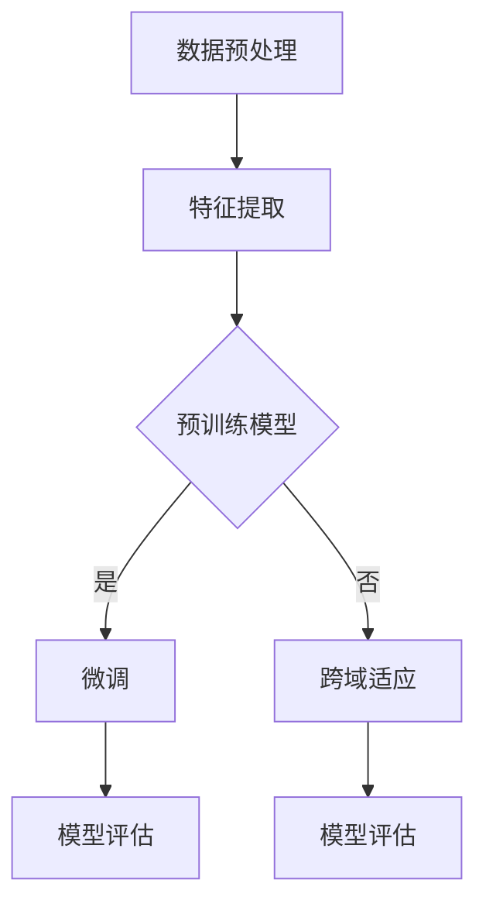
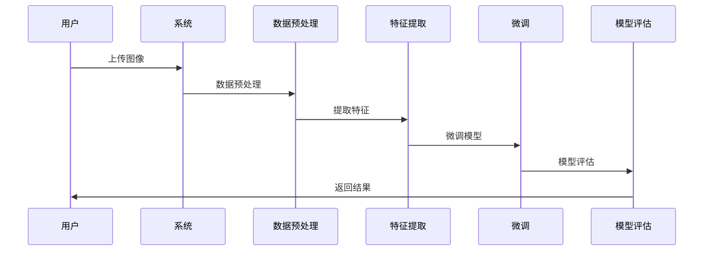

                 

### 迁移学习：利用已学知识解决新问题

> 关键词：迁移学习、预训练模型、微调、跨域适应、模型泛化

> 摘要：
本文将深入探讨迁移学习的基本概念、原理、方法和应用，旨在帮助读者理解如何利用已有的知识来解决新的问题。文章将分为多个部分，逐步分析迁移学习的核心概念、算法原理、系统架构设计和实际应用，并探讨迁移学习面临的挑战与未来发展方向。

## 目录大纲设计流程

### 一、背景介绍

#### 1.1 问题背景

迁移学习是一种机器学习技术，旨在将一个任务学习过程中获得的知识转移到解决另一个相关任务上。这有助于提高学习效率，减少对大量标注数据的依赖，并扩展模型在不同领域的应用。

#### 1.1.1 迁移学习的基本概念

迁移学习是一种机器学习技术，旨在将一个任务学习过程中获得的知识转移到解决另一个相关任务上。它可以通过预训练模型来提取通用特征，并在特定任务上进行微调，以提高模型在新任务上的性能。

#### 1.1.2 迁移学习的应用场景

迁移学习在图像识别、自然语言处理、语音识别等领域有着广泛的应用，特别是在资源受限的场景下，迁移学习显得尤为重要。

#### 1.2 问题描述

迁移学习面临的主要挑战包括：

- 选择合适的预训练模型和目标模型。
- 跨域适应，即解决源域与目标域之间的差异。
- 模型的泛化能力，如何避免过拟合。

#### 1.3 问题解决

本书旨在通过以下方法解决迁移学习中的问题：

- 介绍迁移学习的基本概念、原理和常见方法。
- 分析迁移学习在不同领域的应用案例。
- 提供迁移学习模型的选择和优化策略。
- 讨论迁移学习的挑战与未来发展方向。

#### 1.4 边界与外延

迁移学习的边界包括：

- 域适配问题，即如何缩小源域与目标域之间的差异。
- 模型泛化能力，如何避免过拟合。

外延方面，迁移学习涉及的知识点还包括：

- 预训练模型的选择与优化。
- 跨领域迁移学习的策略。

#### 1.5 概念结构与核心要素组成

迁移学习的主要组成部分包括：

- 预训练模型：用于提取通用特征。
- 微调：针对特定任务对预训练模型进行调整。
- 跨域迁移：解决不同领域之间的适应问题。

### 二、核心概念与联系

#### 2.1 核心概念原理

迁移学习的关键概念包括：

- 迁移：将知识从一个任务转移到另一个任务。
- 预训练：在广泛的数据集上训练模型，使其获得通用特征。
- 微调：在特定任务上调整模型，使其适应新任务。

#### 2.2 概念属性特征对比表格

以下是一个简单的概念属性特征对比表格：

| 概念 | 迁移 | 预训练 | 微调 |
| ---- | ---- | ---- | ---- |
| 目的 | 转移知识 | 提取通用特征 | 适应特定任务 |
| 依赖 | 标注数据 | 数据量 | 参数调整 |
| 优势 | 减少数据依赖 | 提高模型泛化能力 | 提高任务性能 |

#### 2.3 ER实体关系图架构

以下是一个简单的ER实体关系图架构：

```
迁移学习
|
|---源域
|   |
|   |-- 特征提取
|   |   |
|   |   |-- 预训练模型
|   |
|   |-- 微调
|   |   |
|   |   |-- 目标域
|   |
|   |-- 跨域适应
```

### 三、算法原理讲解

#### 3.1 算法mermaid流程图

以下是一个简单的迁移学习算法mermaid流程图：



#### 3.2 算法原理与数学模型

迁移学习的核心在于利用预训练模型提取通用特征，并在特定任务上进行微调。其数学模型可以表示为：

$$
\hat{y} = W \cdot f(X; \theta)
$$

其中，$X$ 表示输入数据，$f$ 表示预训练模型，$\theta$ 表示微调参数，$W$ 表示模型权重。

举例说明：假设我们要将一个预训练的图像分类模型应用于一个新的图像分类任务。首先，我们使用预训练模型提取图像的通用特征，然后在这些特征上应用微调，使其适应新的分类任务。

### 四、系统分析与架构设计方案

#### 4.1 问题场景介绍

假设我们要构建一个基于迁移学习的图像分类系统，用于识别不同类型的车辆。

#### 4.2 项目介绍

该项目旨在利用迁移学习技术，将一个预训练的图像分类模型应用于车辆识别任务。

#### 4.3 系统功能设计

- 数据预处理：包括数据清洗、数据增强等。
- 特征提取：使用预训练模型提取图像的通用特征。
- 微调：在特定任务上调整模型，使其适应新的车辆识别任务。
- 模型评估：评估微调后的模型在车辆识别任务上的性能。

#### 4.4 系统架构设计

以下是一个简单的系统架构设计：

```
用户界面 --> API接口 --> 数据预处理 --> 特征提取 --> 微调 --> 模型评估
```

#### 4.5 系统接口设计

- 用户界面：提供上传图像的界面。
- API接口：用于处理图像上传、数据预处理、特征提取、微调和模型评估等操作。

#### 4.6 系统交互mermaid序列图

以下是一个简单的系统交互mermaid序列图：



### 五、项目实战

#### 5.1 环境安装

在进行迁移学习项目之前，我们需要安装相应的环境和依赖。以下是常见的安装步骤：

1. 安装Python环境。
2. 安装深度学习框架，如TensorFlow或PyTorch。
3. 安装其他必要依赖，如NumPy、Pandas等。

#### 5.2 系统核心实现源代码

以下是一个简单的迁移学习系统核心实现源代码示例：

```python
import torch
import torchvision
import torchvision.transforms as transforms
import torch.nn as nn
import torch.optim as optim

# 加载预训练的图像分类模型
model = torchvision.models.resnet18(pretrained=True)

# 微调模型，使其适应新的车辆识别任务
for param in model.parameters():
    param.requires_grad = True

# 定义损失函数和优化器
criterion = nn.CrossEntropyLoss()
optimizer = optim.Adam(model.parameters(), lr=0.001)

# 加载训练数据集和测试数据集
train_data = torchvision.datasets.ImageFolder(root='train_data', transform=transforms.ToTensor())
test_data = torchvision.datasets.ImageFolder(root='test_data', transform=transforms.ToTensor())

train_loader = torch.utils.data.DataLoader(train_data, batch_size=32, shuffle=True)
test_loader = torch.utils.data.DataLoader(test_data, batch_size=32, shuffle=False)

# 训练模型
num_epochs = 10
for epoch in range(num_epochs):
    running_loss = 0.0
    for inputs, labels in train_loader:
        optimizer.zero_grad()
        outputs = model(inputs)
        loss = criterion(outputs, labels)
        loss.backward()
        optimizer.step()
        running_loss += loss.item()
    print(f'Epoch {epoch+1}, Loss: {running_loss/len(train_loader)}')

# 评估模型
correct = 0
total = 0
with torch.no_grad():
    for inputs, labels in test_loader:
        outputs = model(inputs)
        _, predicted = torch.max(outputs.data, 1)
        total += labels.size(0)
        correct += (predicted == labels).sum().item()

print(f'Accuracy: {100 * correct / total}%')
```

#### 5.3 代码应用解读与分析

以上代码展示了如何利用迁移学习技术进行车辆识别。首先，我们加载一个预训练的ResNet18图像分类模型，然后将其应用于新的车辆识别任务。我们通过微调模型参数，使其适应新的任务。在训练过程中，我们使用交叉熵损失函数和Adam优化器来训练模型。最后，我们在测试集上评估模型的准确性。

#### 5.4 实际案例分析和详细讲解剖析

假设我们有一个包含多种车辆类型的图像数据集，我们希望通过迁移学习技术将一个预训练的图像分类模型应用于车辆识别任务。

1. 数据集准备：我们将数据集分为训练集和测试集，并使用适当的变换对图像进行预处理。
2. 预训练模型选择：我们选择了一个预训练的ResNet18图像分类模型作为预训练模型。
3. 微调模型：我们在预训练模型的基础上进行微调，使其适应新的车辆识别任务。
4. 训练过程：我们使用交叉熵损失函数和Adam优化器来训练模型，并监控训练过程中的损失和准确性。
5. 模型评估：我们在测试集上评估模型的准确性，并根据需要调整模型参数。

通过以上步骤，我们可以利用迁移学习技术将一个预训练的图像分类模型应用于车辆识别任务，从而提高模型的性能。

#### 5.5 项目小结

在本项目中，我们介绍了迁移学习的基本概念、原理和实际应用。通过一个简单的车辆识别案例，我们展示了如何利用迁移学习技术来提高模型的性能。在未来的工作中，我们可以进一步探索迁移学习在不同领域的应用，并不断优化模型以适应新的任务。

### 六、最佳实践 tips

1. 选择合适的预训练模型：选择与目标任务相关的预训练模型，以提高迁移效果。
2. 数据预处理：对训练数据进行适当的预处理，如归一化、缩放等，以提高模型的泛化能力。
3. 微调策略：根据任务需求，选择适当的微调策略，如固定某些层、随机初始化等。
4. 模型评估：在测试集上评估模型性能，并根据需要调整模型参数。

### 七、小结

迁移学习是一种强大的机器学习技术，通过利用已有的知识来解决新的问题，可以显著提高学习效率和模型性能。本文从多个角度探讨了迁移学习的核心概念、算法原理、系统架构设计和实际应用，并提供了项目实战和最佳实践。希望读者能够通过本文对迁移学习有更深入的了解，并在实际应用中取得良好的效果。

### 八、注意事项

1. 迁移学习模型的选择和优化需要根据具体任务需求进行。
2. 跨域适应问题需要针对不同领域进行深入研究。
3. 模型泛化能力是迁移学习成功的关键，需要通过适当的数据预处理和模型优化策略来提高。

### 九、拓展阅读

1. 《深度学习》（Goodfellow, Bengio, Courville） - 详细介绍了迁移学习的基本原理和应用。
2. 《迁移学习实践指南》（Malkani, He, Tang） - 提供了迁移学习在自然语言处理、图像识别等领域的应用案例。
3. 《机器学习年度综述》（JMLR） - 每年发布的综述文章涵盖了迁移学习的最新研究进展。

