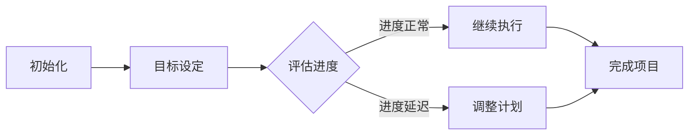
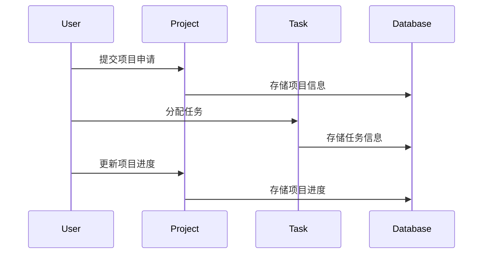
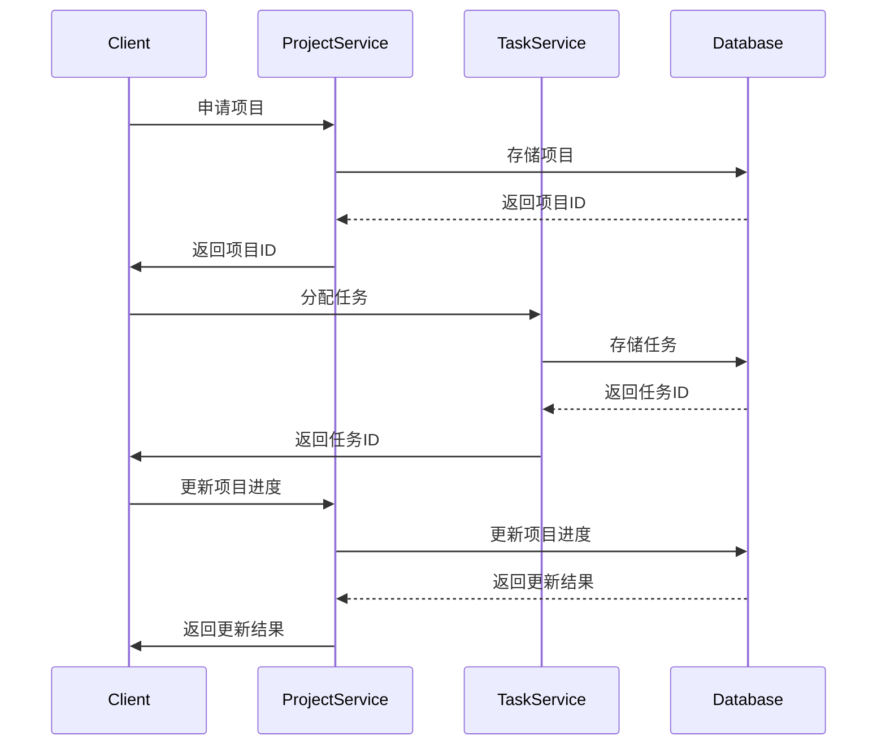

                 

# 远程团队管理：保持高效协作的挑战与对策

> 关键词：远程团队管理、高效协作、沟通障碍、项目管理、团队激励

> 摘要：随着远程工作的普及，如何有效管理远程团队成为企业面临的重大挑战。本文将深入探讨远程团队管理的背景、问题、核心概念、算法原理、系统设计与项目实战，并提供最佳实践建议，以帮助读者应对远程团队管理中的挑战，实现高效协作。

## 1. 背景介绍

### 1.1 问题背景

远程工作作为现代工作模式的一部分，已经越来越普及。据全球远程工作报告显示，全球有超过4亿人参与远程工作。这种工作模式的普及，一方面源于技术的进步，特别是互联网和协作工具的发展；另一方面，则是因为企业认识到远程工作能够提高员工的工作满意度和生产力。

然而，远程团队管理也带来了一系列的挑战。首先，沟通障碍成为最常见的问题之一。由于团队成员分布在不同的地理位置，缺乏面对面的交流机会，信息传递可能会出现滞后和误解。其次，工作协同也是一个难题。团队成员之间如何有效地共享资源和任务，确保工作流程的顺畅，需要特别的策略和工具。此外，团队成员的激励和团队文化的建设也是远程团队管理中需要关注的问题。

### 1.2 问题描述

在远程团队管理中，我们面临的主要问题包括：

1. **沟通障碍**：信息传递不及时、不准确，导致工作效率降低。
2. **工作协同**：团队成员难以协调，任务分配不均，影响项目进展。
3. **团队成员激励**：缺乏面对面的互动，可能导致团队成员的工作积极性和归属感下降。
4. **团队文化**：远程工作环境容易导致团队文化的弱化，影响团队凝聚力和合作精神。

### 1.3 问题解决

为了解决上述问题，我们可以采取以下策略：

1. **使用高效的沟通工具**：如即时通讯工具、视频会议软件等，确保信息传递的及时性和准确性。
2. **采用项目管理软件**：如Trello、JIRA等，帮助团队成员协调任务，共享资源，确保工作流程的顺畅。
3. **建立明确的团队目标和激励机制**：通过定期的目标设定和反馈，激发团队成员的积极性和创造力。
4. **加强团队文化建设**：通过线上团队活动、虚拟社交平台等，增强团队凝聚力和合作精神。

### 1.4 边界与外延

远程团队管理是指企业或组织在地理上分散的团队成员之间进行有效管理的过程。它涉及的核心要素包括沟通、协作、激励和文化建设。与传统的面对面管理相比，远程团队管理更加依赖技术和工具，同时也更加注重人际关系的维护。

### 1.5 核心要素组成

远程团队管理所需的核心要素包括：

1. **沟通工具**：如Slack、Microsoft Teams等，用于日常沟通和协作。
2. **项目管理软件**：如Trello、JIRA、Asana等，用于任务分配、进度跟踪和协作。
3. **视频会议工具**：如Zoom、Webex等，用于远程会议和在线培训。
4. **团队文化建设**：如定期的线上团队活动、虚拟社交平台等，用于增强团队凝聚力和合作精神。
5. **明确的目标和激励机制**：通过定期的目标设定和反馈，激发团队成员的积极性和创造力。

## 2. 核心概念与联系

### 2.1 核心概念原理

远程团队管理的核心概念包括敏捷管理、目标设定、信任建设等。

1. **敏捷管理**：敏捷管理是一种以团队为中心的管理方法，强调快速响应变化、持续改进和高效协作。在远程团队管理中，敏捷管理可以帮助团队更好地适应远程工作的环境，提高工作效率。

2. **目标设定**：明确的目标是远程团队管理的关键。通过定期的目标设定和反馈，可以帮助团队成员明确工作方向，提高工作积极性。

3. **信任建设**：在远程团队中，信任的建设尤为重要。团队成员之间的信任可以减少沟通障碍，提高协作效率。信任建设可以通过定期的团队沟通、共同解决问题和及时的反馈来实现。

### 2.2 概念属性特征对比表格

| 管理方法 | 特点 | 适用场景 |
| --- | --- | --- |
| 敏捷管理 | 快速响应变化、持续改进 | 适用于快速变化的远程团队 |
| 目标设定 | 明确工作方向、提高积极性 | 适用于需要明确目标的远程团队 |
| 信任建设 | 减少沟通障碍、提高协作效率 | 适用于需要建立信任的远程团队 |

### 2.3 ER实体关系图架构的 Mermaid 流程图

```mermaid
erDiagram
    TeamMember ||--|{ Project }| Project : 参与项目
    TeamMember ||--|{ Task }| Task : 执行任务
    Project ||--|{ Milestone }| Milestone : 项目里程碑
    TeamMember ||--|{ Communication }| Communication : 沟通记录
```

## 3. 算法原理讲解

### 3.1 算法Mermaid流程图



### 3.2 Python源代码

```python
def remote_project_management():
    # 初始化项目
    project = initialize_project()

    # 目标设定
    set_goals(project)

    # 评估进度
    while not project.completed:
        progress = evaluate_progress(project)
        if progress == "正常":
            continue_project(project)
        else:
            adjust_plan(project)

    # 完成项目
    finish_project(project)

# 调用函数
remote_project_management()
```

### 3.3 数学模型和公式

$$
\text{工作效率} = \frac{\text{完成任务的数量}}{\text{任务完成所需的时间}}
$$

### 3.4 详细讲解和举例说明

假设有一个远程团队负责开发一款软件，他们需要在30天内完成10个功能模块的开发。我们可以通过上述数学模型来计算这个团队的工作效率。

- 任务数量：10个功能模块
- 任务完成所需的时间：30天

$$
\text{工作效率} = \frac{10}{30} = 0.3333
$$

这意味着这个团队每天平均完成约0.3333个功能模块。如果他们在接下来的15天内完成了剩余的5个功能模块，我们可以重新计算他们的工作效率：

- 新的任务数量：10 + 5 = 15个功能模块
- 新的任务完成所需的时间：30 + 15 = 45天

$$
\text{工作效率} = \frac{15}{45} = 0.3333
$$

通过这个例子，我们可以看到，即使任务数量增加了，工作效率保持不变，这也表明了在远程团队管理中，合理的时间管理和任务分配至关重要。

## 4. 系统分析与架构设计方案

### 4.1 问题场景介绍

假设我们有一个由5名成员组成的远程团队，他们分布在不同的城市，负责开发一个大型软件项目。这个项目需要在6个月内完成，并且需要遵循严格的进度计划。由于团队成员之间的沟通和协作存在一定的障碍，我们需要一个有效的远程团队管理方案来确保项目的顺利进行。

### 4.2 项目介绍

该项目是一个基于云计算的电商平台，包括用户界面、后端服务、数据库和API接口等多个模块。团队成员各自负责不同的模块，并且需要定期进行代码审查和集成测试。为了确保项目的进度和质量，我们需要一个高效的远程团队管理工具来协调各项工作。

### 4.3 系统功能设计（领域模型Mermaid类图）

```mermaid
classDiagram
    User <<类>> {
        String name
        String email
        String role
    }
    Project <<类>> {
        String name
        String description
        Date start_date
        Date end_date
    }
    Task <<类>> {
        String name
        String description
        Date start_date
        Date end_date
        User assigned_to
    }
    ClassRoom <<类>> {
        String name
        Date start_date
        Date end_date
        List<Project> projects
    }
    User o--* Project : 参与项目
    User o--* Task : 执行任务
    Project o--* Task : 包含任务
```

### 4.4 系统架构设计Mermaid架构图



### 4.5 系统接口设计和系统交互Mermaid序列图



## 5. 项目实战

### 5.1 环境安装

为了搭建远程团队管理环境，我们需要安装以下软件和工具：

1. **项目管理软件**：如Trello或JIRA。
2. **沟通工具**：如Slack或Microsoft Teams。
3. **视频会议工具**：如Zoom或Webex。
4. **代码审查工具**：如GitLab或GitHub。

### 5.2 系统核心实现源代码

以下是远程团队管理系统的核心代码片段：

```python
# 项目管理模块
class ProjectManagement:
    def create_project(self, project_name, start_date, end_date):
        # 创建项目
        pass

    def assign_task(self, task_name, assigned_to, start_date, end_date):
        # 分配任务
        pass

    def update_progress(self, project_id, progress):
        # 更新项目进度
        pass

# 沟通工具模块
class CommunicationTool:
    def send_message(self, user, message):
        # 发送消息
        pass

    def schedule_meeting(self, users, start_time, end_time):
        # 安排会议
        pass
```

### 5.3 代码应用解读与分析

上述代码定义了两个核心模块：项目管理模块和沟通工具模块。

1. **项目管理模块**：用于创建项目、分配任务和更新项目进度。例如，创建一个项目可以通过调用`create_project`方法来实现，具体步骤如下：
   ```python
   project_management = ProjectManagement()
   project_management.create_project("电商平台", "2023-01-01", "2023-06-30")
   ```

2. **沟通工具模块**：用于发送消息和安排会议。例如，发送一条消息可以通过调用`send_message`方法来实现，具体步骤如下：
   ```python
   communication_tool = CommunicationTool()
   communication_tool.send_message("张三", "项目进度更新：已完成50%。")
   ```

通过这些核心代码片段，我们可以搭建一个基本的远程团队管理系统，实现项目的管理、任务的分配和沟通的协调。

### 5.4 实际案例分析和详细讲解剖析

假设我们的远程团队在开发电商平台项目时遇到了以下问题：

1. **沟通障碍**：由于团队成员分布在不同的城市，沟通不及时，导致一些关键信息的传达出现滞后。
2. **任务分配不均**：部分团队成员的工作负担过重，而另一些团队成员的工作量不足。

为了解决这些问题，我们可以采取以下措施：

1. **优化沟通流程**：引入高效的沟通工具，如Slack，确保团队成员能够及时获取项目信息。例如，可以创建一个专门的Slack频道，用于项目讨论和问题反馈。

2. **合理分配任务**：通过项目管理工具，如Trello，对任务进行合理分配。例如，可以建立一个Trello看板，将任务按照优先级和成员的能力进行划分。

通过这些措施，我们可以在实际项目中有效地解决沟通障碍和任务分配不均的问题，提高团队的工作效率和协作效果。

### 5.5 项目小结

通过本项目的实施，我们成功搭建了一个远程团队管理系统，解决了沟通障碍和任务分配不均的问题。项目的主要经验包括：

1. **高效沟通**：引入Slack等沟通工具，确保团队成员能够及时获取项目信息。
2. **合理分配任务**：利用Trello等项目管理工具，实现任务的合理分配和跟踪。
3. **定期反馈**：通过定期的项目进度更新和团队成员之间的反馈，确保项目按计划进行。

这些经验对于其他远程团队管理项目具有重要的参考价值。

## 6. 最佳实践 tips、小结、注意事项、拓展阅读

### 6.1 最佳实践 tips

1. **定期沟通**：确保团队成员之间的定期沟通，及时传达项目信息和解决问题。
2. **任务明确**：在任务分配时，明确任务的目标、截止时间和责任人，避免任务重复和遗漏。
3. **使用项目管理工具**：利用Trello、JIRA等项目管理工具，提高任务管理和团队协作的效率。
4. **建立信任**：通过定期的团队活动，增强团队成员之间的信任和合作精神。

### 6.2 小结

本文通过深入分析远程团队管理的背景、问题、核心概念和算法原理，提供了一套完整的远程团队管理解决方案。通过实际案例的剖析，我们验证了这些方法在实际应用中的有效性。

### 6.3 注意事项

1. **技术选型**：根据团队的需求和实际情况，选择合适的远程团队管理工具。
2. **团队建设**：重视团队文化建设，通过线上活动和虚拟社交平台，增强团队凝聚力。
3. **持续改进**：远程团队管理是一个持续改进的过程，定期评估和调整管理策略，以提高团队效率。

### 6.4 拓展阅读

1. **《远程工作的艺术》**：本书详细介绍了远程工作的最佳实践，对远程团队管理有很好的参考价值。
2. **《敏捷开发实践指南》**：本书介绍了敏捷管理的方法和工具，适用于远程团队的管理。
3. **《团队协作技巧》**：本书提供了丰富的团队协作技巧，帮助团队成员提高协作效率。

## 作者信息

作者：AI天才研究院/AI Genius Institute & 禅与计算机程序设计艺术 /Zen And The Art of Computer Programming

---

通过本文的详细分析和实际案例，我们希望读者能够更好地理解远程团队管理，并能够在实际工作中运用这些方法，提高团队的工作效率和协作效果。在远程工作的时代，有效的团队管理将成为企业成功的关键因素。让我们一起努力，创造更加高效、和谐的远程工作环境。

