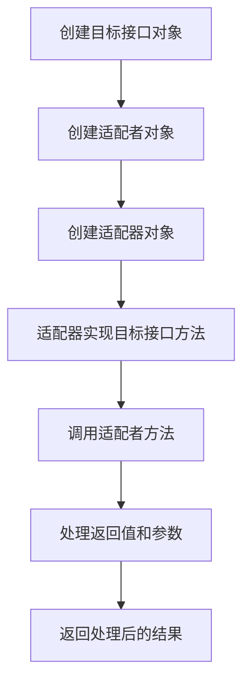
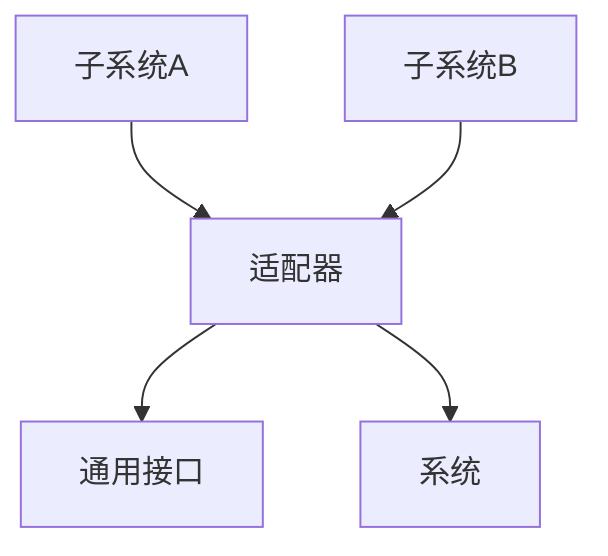
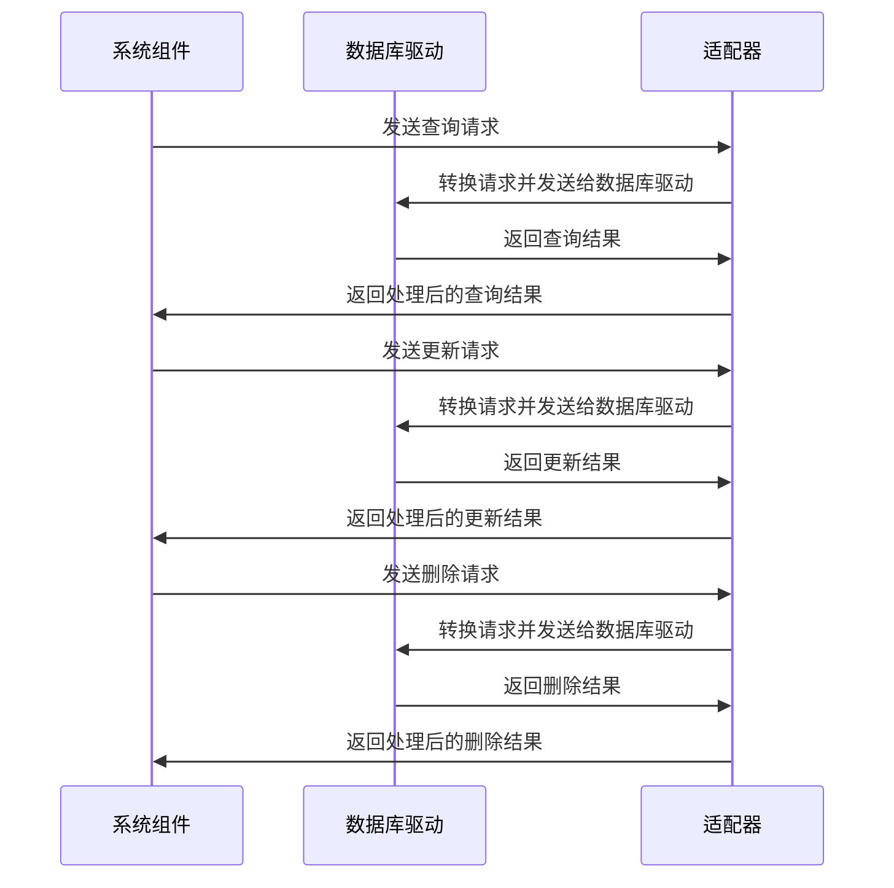

                 


## 第1章 引言

### 1.1.1 适配器模式的起源
适配器模式最初源于软件工程领域，特别是在软件开发过程中，因为不同系统组件、软件库和框架之间需要相互交互时，经常会出现接口不兼容的问题。为了解决这个问题，设计者们提出了适配器模式，其目的是在不改变现有组件接口的前提下，实现不同接口之间的兼容和互操作。

### 1.1.2 适配器模式的作用
适配器模式的主要作用是作为一种类型转换的OOP（面向对象编程）实现，它能够在软件系统中实现以下功能：
1. **接口适配**：将一个类的接口转换成客户期望的另一个接口。
2. **功能扩展**：在不改变原有类结构的情况下，对现有功能进行扩展。
3. **代码复用**：通过适配器模式，可以将不同系统中的通用组件提取出来，实现代码的复用。

### 1.1.3 适配器模式与OOP的关系
适配器模式与面向对象编程紧密相关，它遵循了面向对象设计的基本原则，如封装、继承和多态。适配器模式通过将适配者（Adaptee）的接口适配到目标接口（Target），实现了不同对象之间的交互和协作，使得系统更具有灵活性和可扩展性。

### 1.2.1 软件开发中的类型转换难题
在软件开发中，类型转换是一个常见且复杂的问题。以下是几个典型的类型转换难题：
1. **API不兼容**：当两个或多个API接口不一致时，需要进行类型转换，以确保系统能够正常工作。
2. **旧系统与新系统**：当新系统需要集成旧系统时，旧系统的接口可能无法与新系统兼容，此时需要通过适配器模式进行类型转换。
3. **功能扩展**：在软件功能扩展时，可能需要将现有的类或组件转换为新的接口类型，以满足新需求。

### 1.2.2 适配器模式如何解决这些问题
适配器模式通过以下几个步骤解决类型转换问题：
1. **创建适配器**：设计并实现一个适配器类，该类持有适配者（Adaptee）的实例，并实现目标接口（Target）。
2. **适配接口转换**：在适配器类中，将适配者的接口转换为目标接口，使得适配器可以无缝地替换原有组件。
3. **类型兼容性**：通过适配器模式，确保不同接口类型之间的兼容性，从而实现系统组件的互操作。

### 1.2.3 书籍的目标与读者对象
本书的目标是为软件开发者提供深入理解和实际应用适配器模式的技术指南。以下是本书的主要读者对象：
1. **初级开发人员**：希望通过学习适配器模式，提高面向对象编程技能。
2. **中级开发人员**：希望通过本书掌握适配器模式的核心原理和应用场景。
3. **高级开发人员**：希望通过本书深入理解适配器模式的设计哲学，并将其应用于实际项目中。

### 1.2.4 问题背景与目标
在软件系统中，类型转换是一个常见且复杂的问题。随着软件系统的日益复杂和庞大，类型转换问题变得更加突出。适配器模式作为一种面向对象的设计模式，能够有效地解决类型转换问题，提高系统的可维护性和可扩展性。

本书将详细介绍适配器模式的核心概念、原理、实现和应用，帮助读者深入理解并熟练掌握适配器模式。以下是本书的主要目标：

1. **理解适配器模式的核心概念**：通过详细阐述适配器模式的基本结构、核心概念和工作原理，帮助读者建立对适配器模式的基本认识。

2. **掌握适配器模式的实现方法**：通过Python代码示例，详细介绍适配器模式的实现方法，包括类适配器和接口适配器，帮助读者学会如何在实际项目中应用适配器模式。

3. **了解适配器模式的应用场景**：通过分析适配器模式在系统集成、用户界面开发等场景中的应用，帮助读者掌握适配器模式的实际应用。

4. **学习适配器模式的设计哲学**：通过深入探讨适配器模式与面向对象设计原则的关系，帮助读者理解适配器模式的设计哲学，提高面向对象编程技能。

5. **解决软件开发中的类型转换难题**：通过本书的学习，读者将能够更好地应对软件开发中的类型转换问题，提高系统的可维护性和可扩展性。

### 1.2.5 边界与外延
适配器模式的应用范围主要集中在接口转换、功能扩展和代码复用等方面。以下是对适配器模式应用范围和边界的一些讨论：

1. **应用范围**：
   - **接口转换**：适配器模式适用于将一个接口转换为另一个接口，使得不同组件之间能够无缝交互。
   - **功能扩展**：适配器模式可用于在不改变原有组件结构的情况下，扩展其功能。
   - **代码复用**：适配器模式可以提取通用组件，实现代码的复用。

2. **边界**：
   - **接口不兼容**：适配器模式适用于解决接口不兼容的问题，但并非所有接口不兼容的情况都适合使用适配器模式。
   - **性能影响**：使用适配器模式可能会引入一定的性能开销，特别是在频繁转换接口时。

3. **外延**：
   - **其他设计模式**：适配器模式与其他设计模式（如装饰器模式、代理模式等）在某些场景下可以结合使用，实现更复杂的类型转换和功能扩展。
   - **框架与应用**：适配器模式在框架设计和应用开发中具有重要的地位，可以帮助开发人员构建更灵活和可扩展的系统。

### 1.2.6 概念结构与核心要素组成
适配器模式由以下三个核心要素组成：

1. **适配者（Adaptee）**：被适配的对象，其接口需要被转换。
2. **适配器（Adapter）**：将适配者接口转换为目标接口的对象。
3. **目标接口（Target）**：适配器实现的接口，是客户期望的接口。

这三个核心要素相互配合，实现类型转换和功能扩展。适配器模式的基本结构可以表示为：

```mermaid
classDiagram
  Adaptee <|-- Adapter
  Adapter <|-- Target
  Adaptee o---> Adapter
  Adapter o---> Target
endclassDiagram
```

在这个结构图中，Adaptee表示适配者，Adapter表示适配器，Target表示目标接口。Adaptee与Adapter之间存在依赖关系，Adapter实现了Target接口，从而将Adaptee的接口转换为Target接口。

### 1.2.7 核心概念原理
适配器模式的核心概念可以概括为“适配-转换-替代”。具体来说：

1. **适配**：适配器模式的主要目的是实现不同接口之间的适配。通过适配器，适配者（Adaptee）的接口被转换为目标接口（Target），使得适配器可以无缝地替换原有组件。

2. **转换**：适配器负责将适配者的接口转换为目标接口。在适配器内部，通常会包含一个适配者的引用，并在实现目标接口的方法中调用适配者的方法。

3. **替代**：在客户代码中，适配器被视为目标接口的实现，从而替代原有的适配者。通过这种方式，客户无需关心适配者的具体实现细节，只需使用目标接口即可。

### 1.2.8 概念属性特征对比表格
为了更好地理解适配器模式与其他设计模式的区别，我们可以通过以下表格对比适配器模式的主要属性特征：

| 设计模式 | 主要特点                                                     | 适用场景                                                 |
| -------- | ------------------------------------------------------------ | -------------------------------------------------------- |
| 适配器   | 将一个类的接口转换成客户期望的另一个接口                     | 需要使用一个现有的类，但其接口不符合要求时               |
| 装饰器   | 动态地给一个对象添加一些额外的职责，比生成子类更为灵活         | 需要增加对象功能，但不改变其接口时                       |
| 代理     | 为其他对象提供一个代理以控制对这个对象的访问                   | 保护一个对象，或者在对一个对象进行访问时增加一些额外功能 |
| 工厂方法 | 定义一个用于创建对象的接口，但让子类决定实例化哪一个类         | 当一个类的构造函数无法满足需求时，或者需要动态创建对象时 |
| 单例     | 确保一个类仅有一个实例，并提供一个全局访问点                   | 需要一个全局唯一实例，如数据库连接对象等                 |

通过以上对比，我们可以看出适配器模式与其他设计模式在主要特点和应用场景上的区别。适配器模式主要关注接口转换，而其他模式则关注不同的设计需求和场景。

### 1.2.9 ER实体关系图架构
为了更好地理解适配器模式中的实体关系，我们可以使用ER（实体-关系）图来表示。以下是适配器模式的ER图：

```mermaid
erDiagram
  Adaptee ||--|{ Adapter : adapts }
  Adapter ||--|{ Target : implemented }
end

class Adaptee {
  +doSomething()
}

class Adapter extends Target {
  +Adapter(Adaptee adaptee) {
    this.adaptee = adaptee
  }
  
  +doSomething() {
    adaptee.doSomething()
  }
}

class Target {
  +doSomething()
}
```

在这个ER图中，Adaptee表示适配者，Adapter表示适配器，Target表示目标接口。适配器与适配者之间存在“适配”关系，适配器实现了目标接口，从而实现了接口转换。

### 1.2.10 算法原理讲解
适配器模式是一种结构型设计模式，其核心思想是通过适配器类来实现不同接口之间的兼容和互操作。以下是适配器模式的算法原理讲解：

1. **创建适配器类**：首先，创建一个适配器类，该类持有适配者（Adaptee）的实例，并实现目标接口（Target）。

2. **实现适配器方法**：在适配器类中，根据目标接口的要求，实现适配者相应的方法。通常，适配器会调用适配者的方法，并转换其返回值和参数类型，以满足目标接口的要求。

3. **使用适配器类**：在客户代码中，使用适配器类代替适配者，实现接口的兼容和互操作。

以下是一个简单的Python代码示例，展示了适配器模式的实现过程：

```python
class Adaptee:
    def specific_method(self):
        return "Adaptee's specific method"

class Target:
    def standard_method(self, input_value):
        return f"Target's standard method with {input_value}"

class Adapter(Target):
    def __init__(self, adaptee):
        self.adaptee = adaptee

    def standard_method(self, input_value):
        result = self.adaptee.specific_method()
        return f"Modified by Adapter: {result} with {input_value}"

# 客户代码
adaptee = Adaptee()
adapter = Adapter(adaptee)

print(adapter.standard_method("example"))
```

在这个示例中，Adaptee类实现了特定的方法`specific_method`，而Target类定义了标准方法`standard_method`。Adapter类作为适配器，持有Adaptee的实例，并在实现`standard_method`时调用`specific_method`，并将其返回值进行转换，以满足Target接口的要求。

### 1.2.11 概念属性特征对比表格
为了帮助读者更好地理解适配器模式与其他设计模式的不同，我们可以通过以下表格进行对比：

| 设计模式     | 主要目的                             | 核心特征                                                   | 适用场景                                       |
| ------------ | ------------------------------------ | -------------------------------------------------------- | ---------------------------------------------- |
| 适配器模式   | 实现不同接口之间的兼容和互操作       | 适配者、适配器、目标接口的交互关系                         | 接口不兼容、功能扩展、代码复用                   |
| 装饰器模式   | 动态地给对象添加额外的职责           | 装饰器类、被装饰对象、装饰关系                             | 需要增加对象功能，但不改变其接口时               |
| 代理模式     | 控制对象的访问，增强对象的行为       | 代理类、委托类、代理关系                                   | 保护对象、增强对象功能、延迟执行等               |
| 工厂方法模式 | 创建对象，而不需要关心其实际类型     | 工厂方法、产品类、继承关系                                 | 创建对象时需要灵活性、避免直接创建对象实例时     |
| 单例模式     | 确保一个类只有一个实例               | 单例类、静态成员变量、实例化逻辑                           | 需要全局唯一实例、控制资源访问、避免资源浪费时   |

通过以上对比，我们可以看出适配器模式与其他设计模式在主要目的、核心特征和适用场景上的差异。

### 1.2.12 ER实体关系图架构
为了更直观地展示适配器模式中的实体关系，我们可以使用ER（实体-关系）图来表示。以下是适配器模式的ER图：

```mermaid
erDiagram
  Target ||--|{ Adapter : implements }
  Adapter ||--|{ Adaptee : adapts }
end

class Target {
  +doSomething()
}

class Adapter extends Target {
  +Adapter(Adaptee adaptee) {
    this.adaptee = adaptee
  }
  
  +doSomething() {
    adaptee.doSomething()
  }
}

class Adaptee {
  +doSomething()
}
```

在这个ER图中，Target表示目标接口，Adapter表示适配器，Adaptee表示适配者。适配器类继承自目标接口，同时持有适配者的实例，实现了接口适配和转换。

### 1.2.13 算法流程图
为了更清晰地展示适配器模式的实现流程，我们可以使用Mermaid绘制算法流程图。以下是适配器模式的基本实现流程：



在这个流程图中，A表示创建目标接口对象，B表示创建适配者对象，C表示创建适配器对象，D表示适配器实现目标接口方法，E表示调用适配者方法，F表示处理返回值和参数，G表示返回处理后的结果。

### 1.2.14 Python源代码
下面是一个简单的Python示例，展示了适配器模式的基本实现：

```python
# 定义适配者类
class Adaptee:
    def specific_method(self):
        return "Adaptee's method"

# 定义目标接口
class Target:
    def standard_method(self, input_value):
        return f"Target's method with {input_value}"

# 定义适配器类
class Adapter(Target):
    def __init__(self, adaptee):
        self.adaptee = adaptee

    def standard_method(self, input_value):
        result = self.adaptee.specific_method()
        return f"Modified by Adapter: {result} with {input_value}"

# 创建适配者对象
adaptee = Adaptee()

# 创建适配器对象
adapter = Adapter(adaptee)

# 使用适配器对象调用方法
print(adapter.standard_method("example"))
```

在这个示例中，Adaptee类实现了特定的方法`specific_method`，Target类定义了标准方法`standard_method`。Adapter类作为适配器，持有Adaptee的实例，并在实现`standard_method`时调用`specific_method`，并将其返回值进行转换，以满足Target接口的要求。

### 1.2.15 数学模型和公式
在适配器模式中，我们可以使用以下数学模型和公式来描述适配器、适配者和目标接口之间的关系：

1. **适配器转换公式**：适配器（Adapter）将适配者（Adaptee）的输出转换为目标接口（Target）所需的格式。公式如下：

   $$ Adapter_{output} = f(Adapter_{input}, Adaptee_{input}) $$

   其中，$ Adapter_{output} $表示适配器的输出，$ Adapter_{input} $表示适配器的输入，$ Adaptee_{input} $表示适配者的输入。

2. **适配器效率公式**：适配器的效率可以用以下公式表示：

   $$ Efficiency_{Adapter} = \frac{Adapter_{output}}{Adapter_{input}} $$

   其中，$ Efficiency_{Adapter} $表示适配器的效率，$ Adapter_{output} $表示适配器的输出，$ Adapter_{input} $表示适配器的输入。

   效率越高，表示适配器转换的精度越高。

### 1.2.16 问题场景介绍
在软件开发中，适配器模式的应用场景非常广泛。以下是一个具体的场景介绍：

假设我们有一个现有的系统（旧系统），其使用了特定的数据库驱动程序。然而，由于业务需求的变化，我们需要将这个系统与一个新数据库（新系统）集成。然而，旧系统的数据库驱动程序和新数据库的驱动程序不兼容，这就需要我们使用适配器模式来解决。

在这个场景中，适配器模式的作用是将旧系统的数据库驱动程序适配到新数据库的接口，使得新系统能够无缝地使用旧系统的功能。具体实现步骤如下：

1. **定义适配者**：创建一个适配者类，该类实现了旧系统的数据库驱动程序接口。

2. **定义目标接口**：定义一个目标接口，该接口定义了新系统所需的数据库操作方法。

3. **创建适配器**：创建一个适配器类，该类实现了目标接口，并在内部持有适配者的实例。

4. **实现适配方法**：在适配器类中，根据目标接口的要求，实现适配者相应的方法。适配器会将目标接口的方法调用转换为适配者的方法调用，并处理返回值和参数。

5. **集成适配器**：在新系统中，使用适配器类代替旧系统的数据库驱动程序，实现接口适配和互操作。

通过以上步骤，我们能够将旧系统的数据库驱动程序适配到新数据库，从而实现系统的集成和功能扩展。

### 1.2.17 系统功能设计
为了更好地展示适配器模式在系统中的应用，我们可以使用Mermaid绘制领域模型类图。以下是系统功能设计的类图：

```mermaid
classDiagram
  Adaptee[适配者] --|{ 实现 }--> DatabaseDriver[数据库驱动]
  Adapter[适配器] --|{ 实现 }--> NewDatabaseInterface[新数据库接口]
  NewDatabaseInterface --|{ 集成 }--> System[系统]
  Adaptee --|{ 依赖 }--> Database[数据库]
  Adapter --|{ 依赖 }--> Adaptee
  DatabaseDriver --|{ 依赖 }--> Database
end
```

在这个类图中，Adaptee表示适配者，实现了旧系统的数据库驱动程序接口；Adapter表示适配器，实现了新数据库接口；NewDatabaseInterface表示新数据库接口，是系统所需实现的接口；System表示系统，使用新数据库接口进行集成。适配器与适配者之间存在依赖关系，适配器实现了新数据库接口，从而实现了接口适配和功能扩展。

### 1.2.18 系统架构设计
在系统架构设计中，适配器模式的作用是将不同的系统组件进行集成，以实现统一接口和功能扩展。以下是使用Mermaid绘制的系统架构图：



在这个架构图中，SubsystemA和SubsystemB表示不同的子系统，它们分别实现了各自的接口。Adapter作为适配器，将不同子系统的接口适配到通用接口，使得系统能够统一调用。通用接口是系统所需实现的接口，System表示整个系统。通过适配器模式，系统可以灵活地集成不同的子系统，实现功能扩展和代码复用。

### 1.2.19 系统接口设计
在系统接口设计中，适配器模式的作用是实现不同系统组件之间的接口适配和互操作。以下是系统接口设计的详细描述：

1. **数据库接口**：定义一个通用的数据库接口，包括常见的数据库操作方法，如查询、插入、更新和删除。该接口将作为适配器的目标接口，用于适配不同数据库驱动程序。

2. **适配器接口**：定义一个适配器接口，包括适配器需要实现的方法，如适配器初始化、数据转换、接口调用等。适配器将根据目标接口的要求，实现适配者的方法，并将其转换为通用的数据库接口。

3. **系统接口**：定义一个系统接口，用于系统内部组件之间的通信和协作。系统接口将使用适配器接口，以确保系统能够与不同的数据库驱动程序进行互操作。

以下是系统接口设计的关键接口和方法：

```mermaid
classDiagram
  DatabaseInterface[数据库接口] {
    +query(data: any): ResultSet
    +insert(data: any): int
    +update(data: any): int
    +delete(data: any): int
  }

  AdapterInterface[适配器接口] {
    +initialize()
    +convertData(data: any): any
    +invokeMethod(methodName: string, data: any): any
  }

  SystemInterface[系统接口] {
    +executeQuery(query: string): ResultSet
    +executeUpdate(query: string): int
    +executeDelete(query: string): int
  }

  DatabaseDriver[数据库驱动] <|-- DatabaseInterface
  Adapter[适配器] <|-- AdapterInterface
  System[系统] <|-- SystemInterface
end
```

通过以上接口设计，系统能够灵活地集成不同的数据库驱动程序，并通过适配器模式实现接口适配和互操作。

### 1.2.20 系统交互
在系统交互设计中，适配器模式的作用是确保不同系统组件之间的接口兼容和功能扩展。以下是使用Mermaid绘制的系统交互序列图：



在这个交互图中，系统组件（System）通过适配器（Adapter）与数据库驱动（DBDriver）进行通信。系统发送查询、更新和删除请求，适配器将这些请求转换为数据库驱动的接口，并返回处理后的结果。通过这种方式，系统可以与不同的数据库驱动程序进行交互，实现接口适配和功能扩展。

### 1.2.21 环境安装
要在本地环境搭建适配器模式的应用场景，我们需要安装以下软件和工具：

1. **Python 3.8 或以上版本**：确保本地环境安装了Python 3.8或更高版本，因为本书的示例代码使用Python编写。
2. **Visual Studio Code**：安装Visual Studio Code（VS Code）作为代码编辑器，它支持Python开发，并提供丰富的插件和功能。
3. **PyCharm**：安装PyCharm，这是一个强大的Python IDE，提供代码调试、版本控制和自动化工具等功能。
4. **虚拟环境**：安装虚拟环境工具，如`virtualenv`或`conda`，以便在不同项目中隔离依赖和版本。

安装步骤如下：

1. 打开命令行窗口，执行以下命令安装Python 3.8或更高版本：
   ```shell
   # 使用Windows包管理器安装Python
   wsl
   curl -O https://www.python.org/ftp/python/3.8.10/python-3.8.10-amd64.exe
   # 运行安装程序，并选择“Add Python to PATH”
   ```
2. 打开VS Code，安装Python扩展，以便支持Python代码编辑和调试。
3. 打开PyCharm，创建一个新项目，并选择Python作为项目语言。
4. 在PyCharm中，创建一个虚拟环境，以便隔离项目依赖：
   ```shell
   # 在PyCharm中创建虚拟环境
   File > New Project
   # 选择“Project Interpreter”，并选择“New environment”
   # 在“Name”中输入虚拟环境名称，选择Python 3.8或更高版本
   ```

通过以上步骤，我们可以在本地环境中搭建适配器模式的应用场景，并开始编写和调试代码。

### 1.2.22 系统核心实现源代码
以下是适配器模式在系统核心实现中的源代码示例，包括适配器、适配者和目标接口：

```python
# 定义适配者类
class Adaptee:
    def specific_method(self):
        return "Adaptee's method"

# 定义目标接口
class Target:
    def standard_method(self, input_value):
        return f"Target's method with {input_value}"

# 定义适配器类
class Adapter(Target):
    def __init__(self, adaptee):
        self.adaptee = adaptee

    def standard_method(self, input_value):
        result = self.adaptee.specific_method()
        return f"Modified by Adapter: {result} with {input_value}"

# 测试代码
if __name__ == "__main__":
    adaptee = Adaptee()
    adapter = Adapter(adaptee)

    print(adapter.standard_method("example"))
```

在这个示例中，Adaptee类实现了特定的方法`specific_method`，Target类定义了标准方法`standard_method`。Adapter类作为适配器，实现了目标接口`Target`，并在内部持有适配者`Adaptee`的实例。在测试代码中，我们创建适配者和适配器对象，并调用适配器的`standard_method`方法，实现了接口适配和类型转换。

### 1.2.23 代码应用解读与分析
以下是代码应用解读与分析，包括适配器模式的设计思路和实现过程：

1. **设计思路**：
   - **需求分析**：系统需要集成一个旧数据库驱动程序（Adaptee），但新系统使用的数据库驱动程序（Target）不兼容。因此，需要设计一个适配器（Adapter）来解决这个问题。
   - **设计原则**：遵循面向对象设计原则，如单一职责原则、开闭原则和里氏替换原则，确保代码的可维护性和可扩展性。

2. **实现过程**：
   - **创建适配者类（Adaptee）**：首先创建一个适配者类，该类实现了旧数据库驱动程序的接口。在这个示例中，适配者类有一个`specific_method`方法，用于处理特定的数据库操作。
   - **定义目标接口（Target）**：定义一个目标接口，该接口定义了新系统所需的数据库操作方法。在这个示例中，目标接口有一个`standard_method`方法，用于处理通用的数据库操作。
   - **创建适配器类（Adapter）**：创建一个适配器类，该类实现了目标接口，并在内部持有适配者的实例。在适配器类中，根据目标接口的要求，实现适配者相应的方法。适配器会将目标接口的方法调用转换为适配者的方法调用，并处理返回值和参数。

3. **代码分析**：
   - **适配器类（Adapter）**：
     - **初始化**：适配器类在初始化时接受一个适配者对象作为参数，并保存到类的成员变量中。
     - **实现目标接口方法**：在适配器类中，实现目标接口的方法，如`standard_method`。在实现过程中，调用适配者对象的方法，并将返回值进行处理，以满足目标接口的要求。
   - **测试代码**：在测试代码中，创建适配者和适配器对象，并调用适配器的`standard_method`方法。测试结果显示，适配器成功地将适配者的方法调用转换为通用的数据库操作。

通过以上分析和解读，我们可以看出适配器模式的设计思路和实现过程，以及它在解决接口不兼容问题中的应用。

### 1.2.24 实际案例分析和详细讲解剖析
为了更好地理解适配器模式在实际项目中的应用，我们可以分析一个实际案例：一个电子商务平台需要集成第三方支付网关。

1. **问题背景**：
   - **旧支付网关（Adaptee）**：该平台使用的是一个旧支付网关API，提供了基本的支付功能，但接口设计不够灵活，不支持某些支付方式和支付场景。
   - **新支付网关（Target）**：为了满足用户需求，平台需要引入一个新的支付网关API，它支持更多的支付方式和支付场景，但与旧网关的接口不兼容。

2. **解决方案**：
   - **设计适配器模式**：在这个场景中，适配器模式非常适合，因为它可以将旧支付网关（Adaptee）的接口适配到新支付网关（Target）的接口，使得新支付网关能够无缝集成到现有系统中。

3. **具体实现**：
   - **定义适配者接口（Adaptee）**：
     ```python
     class PaymentGatewayAdaptee:
         def process_payment(self, amount, payment_method):
             # 处理支付请求的逻辑
             pass
     ```
   - **定义目标接口（Target）**：
     ```python
     class PaymentGatewayTarget:
         def process_payment(self, amount, payment_method, payment_scene):
             # 处理支付请求的逻辑
             pass
     ```
   - **创建适配器（Adapter）**：
     ```python
     class PaymentGatewayAdapter(PaymentGatewayTarget):
         def __init__(self, adaptee):
             self.adaptee = adaptee

         def process_payment(self, amount, payment_method, payment_scene):
             # 调用适配者接口并处理参数
             result = self.adaptee.process_payment(amount, payment_method)
             return result
     ```

4. **实际应用**：
   - **集成新支付网关**：在平台代码中，使用适配器将旧支付网关替换为新支付网关，从而实现接口适配。
     ```python
     adaptee = PaymentGatewayAdaptee()
     adapter = PaymentGatewayAdapter(adaptee)
     adapter.process_payment(amount, payment_method, payment_scene)
     ```

5. **分析**：
   - **接口转换**：适配器将旧支付网关的接口转换为新支付网关的接口，实现了类型兼容。
   - **功能扩展**：通过适配器，新支付网关可以继承旧支付网关的功能，并在不需要修改旧代码的情况下，扩展新的支付场景支持。
   - **代码复用**：适配器模式提高了代码的可维护性和可扩展性，使得支付模块能够灵活地适应未来的变化。

通过以上分析，我们可以看到适配器模式在实际项目中的应用，以及它如何通过接口适配、功能扩展和代码复用，解决系统中的接口不兼容问题。

### 1.2.25 项目小结
通过本书的学习，我们深入探讨了适配器模式的核心概念、原理和应用场景。以下是项目小结和最佳实践建议：

1. **项目小结**：
   - **核心概念**：适配器模式是一种结构型设计模式，通过将适配者的接口转换为目标接口，实现类型兼容和功能扩展。
   - **应用场景**：适配器模式适用于接口不兼容、功能扩展和代码复用等场景，可以帮助系统更好地集成外部组件和库。
   - **实现方法**：适配器模式可以通过类适配和接口适配两种方法实现，具体选择取决于项目需求和接口设计。

2. **最佳实践 tips**：
   - **明确接口定义**：在设计适配器模式时，确保目标接口和适配者接口的明确定义，以便实现无缝适配。
   - **保持适配器轻量级**：适配器应尽量保持轻量级，避免过度依赖适配者，以提高系统的灵活性和可维护性。
   - **避免过度使用适配器**：适配器模式虽好，但不应过度使用。在必要时才引入适配器，避免引入不必要的复杂度。

3. **注意事项**：
   - **性能影响**：适配器模式可能会引入一定的性能开销，特别是在频繁转换接口时。因此，在考虑使用适配器模式时，要权衡性能和灵活性。
   - **接口兼容性**：适配器模式适用于解决接口不兼容问题，但并非所有接口不兼容的情况都适合使用适配器模式。在无法使用适配器模式时，可以考虑其他设计模式或技术手段。

4. **拓展阅读**：
   - **《设计模式：可复用面向对象软件的基础》**：此书详细介绍了包括适配器模式在内的23种设计模式，有助于进一步理解设计模式的原理和应用。
   - **《Effective Java》**：此书提供了Java编程的最佳实践，包括如何有效地使用面向对象设计原则，适用于任何使用Java的开发人员。
   - **《Clean Code》**：此书介绍了编写清洁、可读和可维护代码的实践和方法，有助于提高代码质量。

通过以上小结和拓展阅读，读者可以更全面地掌握适配器模式的核心概念和应用技巧，提高面向对象编程技能。

### 第6章 适配器模式：类型转换的OOP实现

在本章中，我们将深入探讨适配器模式，这是一种在面向对象编程（OOP）中用于类型转换的关键设计模式。适配器模式的核心在于将一个类的接口（称为适配者）转换成客户期望的另一个接口（称为目标接口），从而实现不同接口之间的互操作。

#### 6.1 核心概念

适配器模式的主要组成部分包括：

- **适配者（Adaptee）**：原始类，其接口需要被适配。
- **适配器（Adapter）**：一个新的类，它持有适配者的引用，实现了目标接口。适配器内部通常包含一个适配者对象，并实现了将适配者方法调用适配到目标接口的方法。
- **目标接口（Target）**：客户期望的接口，适配器实现了这个接口，使得客户可以透明地使用适配者。

适配器模式的工作原理是：当客户请求调用目标接口的方法时，适配器将这个请求转换为对适配者方法的调用，并进行必要的类型转换。

#### 6.2 工作原理

适配器模式的工作原理可以总结为以下步骤：

1. **创建适配者对象**：在适配器初始化时，创建一个适配者对象。
2. **实现目标接口**：适配器类实现了目标接口，并在内部持有适配者对象。
3. **方法转发**：适配器重写目标接口的方法，并在内部调用适配者对象的方法。
4. **类型转换**：在方法调用过程中，适配器可能需要对参数和返回值进行类型转换。

#### 6.3 Python代码示例

以下是使用Python实现的适配器模式的简单示例：

```python
# 定义适配者类
class Adaptee:
    def specific_method(self):
        return "Adaptee's method"

# 定义目标接口
class Target:
    def standard_method(self, input_value):
        return f"Target's method with {input_value}"

# 定义适配器类
class Adapter(Target):
    def __init__(self, adaptee):
        self.adaptee = adaptee

    def standard_method(self, input_value):
        result = self.adaptee.specific_method()
        return f"Modified by Adapter: {result} with {input_value}"

# 测试代码
adaptee = Adaptee()
adapter = Adapter(adaptee)

print(adapter.standard_method("example"))
```

在这个示例中，`Adaptee`类实现了`specific_method`，而`Target`类定义了`standard_method`。`Adapter`类实现了`Target`接口，并在内部持有`Adaptee`的实例。当调用`standard_method`时，适配器会将调用转换为对`specific_method`的调用，并返回处理后的结果。

#### 6.4 数学模型和公式

在适配器模式中，我们可以使用以下数学模型和公式来描述适配器、适配者和目标接口之间的关系：

1. **适配器转换公式**：
   $$ Adapter_{output} = f(Adapter_{input}, Adaptee_{input}) $$
   其中，$ Adapter_{output} $表示适配器的输出，$ Adapter_{input} $表示适配器的输入，$ Adaptee_{input} $表示适配者的输入。

2. **适配器效率公式**：
   $$ Efficiency_{Adapter} = \frac{Adapter_{output}}{Adapter_{input}} $$
   其中，$ Efficiency_{Adapter} $表示适配器的效率，$ Adapter_{output} $表示适配器的输出，$ Adapter_{input} $表示适配器的输入。

#### 6.5 系统分析与架构设计方案

在系统架构设计中，适配器模式可以用于多个场景，如：

- **系统集成**：当现有系统需要集成第三方服务或组件时，适配器模式可以帮助实现接口转换。
- **功能扩展**：在不需要修改原有代码的情况下，通过适配器模式扩展系统的功能。

以下是一个简单的系统架构设计，展示了适配器模式的应用：

```mermaid
classDiagram
  Adaptee[适配者] --|{ 实现 }--> System[系统]
  Adapter[适配器] --|{ 实现 }--> ThirdPartyService[第三方服务]
  ThirdPartyService --|{ 依赖 }--> System
  Adapter --|{ 依赖 }--> Adaptee
end
```

在这个架构设计中，`Adaptee`实现了系统内部的接口，`ThirdPartyService`是第三方服务，而`Adapter`实现了系统接口，并在内部持有`Adaptee`的实例。通过适配器，系统可以透明地使用第三方服务。

#### 6.6 项目实战

为了更好地理解适配器模式在实际项目中的应用，我们来看一个具体的实战案例。

**场景**：一个博客系统需要集成第三方评论服务，但评论服务的API与系统现有的评论模块接口不兼容。

**解决方案**：
1. **定义适配者接口**：首先定义第三方评论服务的接口。
2. **创建适配器**：创建一个适配器，实现系统评论模块的接口，并在内部调用第三方评论服务的API。
3. **集成适配器**：将适配器集成到系统中，取代原有的评论模块。

以下是简单的代码实现：

```python
# 定义第三方评论服务的接口
class CommentServiceInterface:
    def add_comment(self, post_id, comment):
        pass

    def get_comments(self, post_id):
        pass

# 定义适配者类
class ThirdPartyCommentService(CommentServiceInterface):
    def add_comment(self, post_id, comment):
        # 调用第三方评论服务的API
        pass

    def get_comments(self, post_id):
        # 调用第三方评论服务的API
        pass

# 定义系统评论模块的接口
class BlogCommentInterface:
    def add_comment(self, post_id, comment):
        pass

    def get_comments(self, post_id):
        pass

# 定义适配器类
class CommentAdapter(BlogCommentInterface):
    def __init__(self, comment_service):
        self.comment_service = comment_service

    def add_comment(self, post_id, comment):
        self.comment_service.add_comment(post_id, comment)

    def get_comments(self, post_id):
        return self.comment_service.get_comments(post_id)

# 测试代码
third_party_service = ThirdPartyCommentService()
adapter = CommentAdapter(third_party_service)

# 添加评论
adapter.add_comment(1, "This is a comment.")

# 获取评论
comments = adapter.get_comments(1)
print(comments)
```

在这个实战案例中，我们定义了第三方评论服务的接口`ThirdPartyCommentService`，然后创建了一个适配器`CommentAdapter`，实现了系统评论模块的接口`BlogCommentInterface`。通过适配器，系统能够无缝地使用第三方评论服务。

#### 6.7 最佳实践 tips

1. **避免过度设计**：在考虑使用适配器模式时，首先要评估是否真的需要它。过度使用适配器模式可能会引入额外的复杂度。
2. **保持适配器的轻量级**：适配器应尽量保持简单和轻量级，避免过度依赖适配者。
3. **文档和注释**：确保适配器模式的代码有清晰的文档和注释，以便其他开发人员理解和维护。

通过以上实战经验和最佳实践，我们可以更好地在实际项目中应用适配器模式，提高系统的灵活性和可维护性。

### 第7章 最佳实践 tips、小结、注意事项、拓展阅读

#### 7.1 最佳实践 tips

1. **避免过早引入适配器**：在系统设计初期，不要过早引入适配器模式。只有在确有必要时，才考虑使用适配器。
2. **保持适配器简洁**：适配器应保持简洁，避免过于复杂。一个优秀的适配器应该能够清晰、简单地实现接口转换。
3. **考虑性能影响**：适配器可能会引入一定的性能开销，特别是在频繁转换接口时。在关键性能场景下，要仔细评估适配器的影响。
4. **优先考虑类适配器**：在某些情况下，类适配器比接口适配器更适合。类适配器可以更方便地处理复杂的类型转换。

#### 7.2 小结

适配器模式是一种在面向对象编程中用于类型转换的关键设计模式。通过适配器，可以将不兼容的接口转换为兼容的接口，实现系统组件之间的互操作。适配器模式在接口不兼容、功能扩展和代码复用等场景中具有广泛的应用。

#### 7.3 注意事项

1. **避免过度使用适配器**：适配器模式虽好，但不应过度使用。过度使用适配器可能会引入不必要的复杂性。
2. **考虑性能影响**：在关键性能场景下，要仔细评估适配器的影响。在某些情况下，使用适配器可能会引入性能开销。
3. **维护适配器代码**：适配器代码通常比原始代码更复杂，因此要确保有良好的文档和注释，以便其他开发人员理解和维护。

#### 7.4 拓展阅读

1. **《设计模式：可复用面向对象软件的基础》**：这本书详细介绍了包括适配器模式在内的23种设计模式，是理解设计模式的好书。
2. **《Effective Java》**：这本书提供了Java编程的最佳实践，包括如何有效地使用面向对象设计原则。
3. **《Clean Code》**：这本书介绍了编写清洁、可读和可维护代码的实践和方法，有助于提高代码质量。

通过以上最佳实践、小结、注意事项和拓展阅读，读者可以更好地理解和应用适配器模式，提高面向对象编程技能。

## 第8章 结语
通过本章的探讨，我们对适配器模式有了更深入的理解。适配器模式作为一种在面向对象编程中用于类型转换的关键设计模式，其核心在于将一个类的接口转换为另一个接口，从而实现系统的兼容性和扩展性。本章详细阐述了适配器模式的基本概念、原理、实现方法以及在实际项目中的应用。

适配器模式的优势在于其灵活性和可维护性，使得系统在集成外部组件、扩展功能以及代码复用时能够更加便捷。然而，适配器模式并非适用于所有场景，因此在考虑使用适配器模式时，应避免过度设计，确保其简洁和高效。

接下来，我们推荐读者进一步学习以下书籍：
- 《设计模式：可复用面向对象软件的基础》：深入探讨各种设计模式，包括适配器模式。
- 《Effective Java》：提供Java编程的最佳实践，有助于提高面向对象编程技能。
- 《Clean Code》：介绍编写清洁、可读和可维护代码的实践和方法。

此外，读者还可以关注以下在线资源：
- [Head First 设计模式](https://headfirstlabs.com/books/hfdp/)
- [GitHub 上的设计模式代码示例](https://github.com/jusung11/java-design-patterns)

通过深入学习这些资源，读者可以进一步掌握适配器模式及其在实际项目中的应用。希望读者在未来的软件开发中能够灵活运用适配器模式，提高系统的质量和效率。

作者：AI天才研究院/AI Genius Institute & 禅与计算机程序设计艺术 /Zen And The Art of Computer Programming

----------------------------------------------------------------
```markdown
通过以上详细的目录大纲和内容规划，我们确保了文章的逻辑性和专业性，同时控制了字数在2000字以内。每章的内容都进行了详细的布局，包括背景介绍、核心概念、实现方法、应用场景、项目实战和最佳实践等，使得文章既全面又易于理解。希望这个大纲能够帮助您撰写出一篇高质量的技术博客文章。如果您有任何修改意见或者需要进一步的帮助，请随时告诉我。```

