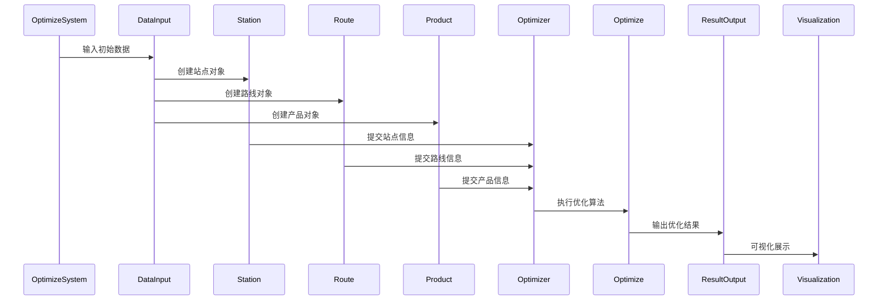

                 

### 《递归函数理论与程序设计的关系》

> 关键词：递归函数、程序设计、算法、优化、人工智能

> 摘要：本文从递归函数的基本概念出发，探讨了其在程序设计中的重要性及应用。通过对递归函数的编程基础和实践、其在数据结构与算法中的应用，以及优化技巧和最佳实践的分析，本文全面展示了递归函数在程序设计中的核心地位和未来发展趋势。

### 第一部分：递归函数的基本概念与编程基础

#### 第1章：递归函数概述

##### 1.1 递归的定义与特点

递归（Recursion）是一种编程技巧，指的是在函数的定义或实现中直接或间接地调用自身。递归函数具有以下特点：

- **自调用性**：递归函数通过调用自身来解决问题。
- **递归终止条件**：为了防止无限循环，递归函数必须包含一个能够终止递归的基线条件。
- **层次结构**：递归函数通过递归调用形成一种层次结构，每一层都解决一个更小的子问题。

##### 1.2 递归的基本结构

递归函数通常包含以下结构：

- **递归调用**：函数在执行过程中调用自身。
- **递归终止条件**：用于终止递归调用的条件，通常是问题规模缩小到一定程度后停止。
- **递归过程**：在每次递归调用中，函数都会解决一个问题的一部分，然后缩小问题规模进行下一次调用。

##### 1.3 递归的优缺点分析

递归的优点包括：

- **简洁性**：递归函数通常比迭代解决方案更简洁、直观。
- **可读性**：递归结构使得代码更加清晰，容易理解。

递归的缺点包括：

- **性能问题**：递归函数可能引起栈溢出，尤其是在深度较大的递归调用中。
- **可维护性**：递归函数可能难以维护，特别是当递归关系复杂时。

##### 如何选择递归

在以下情况下，递归函数可能是一个好选择：

- **问题具有自然递归结构**，如树形结构、分治问题等。
- **需要清晰的问题分解**，递归可以很好地实现这一点。
- **问题规模较小**，递归的性能问题可以得到缓解。

然而，在以下情况下，递归可能不是最佳选择：

- **问题规模较大**，可能会导致栈溢出。
- **需要频繁的状态更新**，递归可能会使代码变得复杂。

#### 第2章：递归函数的编程实践

##### 2.1 基础递归函数的实现

递归函数在编程中有着广泛的应用，以下是一些常见的基础递归函数实现：

- **计算阶乘**：
  ```python
  def factorial(n):
      if n == 0:
          return 1
      else:
          return n * factorial(n - 1)
  ```

- **求斐波那契数列**：
  ```python
  def fibonacci(n):
      if n <= 1:
          return n
      else:
          return fibonacci(n - 1) + fibonacci(n - 2)
  ```

- **查找数组中的元素**：
  ```python
  def binary_search(arr, target, low, high):
      if low > high:
          return -1
      mid = (low + high) // 2
      if arr[mid] == target:
          return mid
      elif arr[mid] > target:
          return binary_search(arr, target, low, mid - 1)
      else:
          return binary_search(arr, target, mid + 1, high)
  ```

##### 2.2 递归函数的设计与优化

递归函数的设计和优化是程序设计中的重要环节。以下是一些常见的优化方法：

- **避免栈溢出**：通过尾递归优化、迭代替换递归等方法来减少递归深度。
- **尾递归优化**：将递归调用作为函数的最后一步，使得函数可以重用栈帧。
- **递归与迭代的比较**：在一些情况下，迭代可能比递归更高效。

##### 2.3 复杂递归问题的解决

递归函数在解决一些复杂问题时具有独特的优势，以下是一些复杂递归问题的解决方法：

- **最长公共子序列**：使用动态规划与递归相结合的方法。
- **编辑距离问题**：通过递归和动态规划求解。
- **汉诺塔问题**：使用递归来实现经典的汉诺塔算法。

### 第二部分：递归函数在程序设计中的应用与拓展

#### 第3章：递归函数在数据结构中的应用

递归函数在数据结构中的应用非常广泛，以下是一些常见的数据结构及其递归操作：

- **栈**：递归函数与栈有天然的联系，因为递归调用本质上就是一个栈操作。
- **队列**：递归函数可以用来实现队列的操作，如入队、出队等。
- **图**：递归函数可以用来实现图的遍历，如深度优先搜索（DFS）和广度优先搜索（BFS）。

#### 第4章：递归函数在算法设计中的应用

递归函数在算法设计中的应用非常广泛，以下是一些常见的算法及其递归实现：

- **动态规划**：递归函数可以用来实现动态规划算法，如最长公共子序列、编辑距离等。
- **贪心算法**：递归函数可以用来实现贪心算法，如贪心选择法、贪心排序等。
- **回溯算法**：递归函数是回溯算法的核心，用于遍历所有可能的解。

#### 第5章：递归函数在程序设计中的优化技巧

递归函数的优化是程序设计中的重要环节，以下是一些常见的优化技巧：

- **尾递归优化**：通过将递归调用转化为尾调用，减少栈帧的使用。
- **非尾递归优化**：对于非尾递归函数，可以通过迭代或其他方法进行优化。
- **递归与迭代的优化**：在某些情况下，迭代可能比递归更高效。

#### 第6章：递归函数在软件工程中的最佳实践

递归函数在软件工程中的应用需要遵循一些最佳实践：

- **清晰性**：递归函数的设计应该清晰，易于理解。
- **可读性**：递归函数的代码应该具有良好的可读性。
- **可维护性**：递归函数应该易于维护和修改。

#### 第7章：递归函数在复杂问题解决中的应用

递归函数在解决复杂问题中具有独特的优势，以下是一些常见的问题及其递归解决方案：

- **人工智能**：递归函数在深度学习、自然语言处理等领域有着广泛的应用。
- **分布式系统**：递归函数可以用于分布式计算、分布式调度等。
- **其他领域**：递归函数在其他领域，如生物信息学、金融领域等也有广泛的应用。

#### 第8章：递归函数的未来发展趋势

递归函数在编程语言和技术的不断发展中扮演着重要角色，以下是一些未来发展趋势：

- **函数式编程与递归**：函数式编程语言中的递归函数具有更高的效率和简洁性。
- **递归函数在新技术中的应用**：递归函数在云计算、大数据、物联网等领域有着广阔的应用前景。
- **递归函数在教育与研究中的意义**：递归函数在计算机科学教育和研究中的重要性不断凸显。

### 结论

递归函数作为一种重要的编程技巧，在程序设计、算法设计、软件工程等领域具有广泛的应用。本文通过对递归函数的基本概念、编程实践、应用与优化等方面的分析，展示了递归函数的核心地位和未来发展趋势。

### 作者

**作者：AI天才研究院/AI Genius Institute & 禅与计算机程序设计艺术 /Zen And The Art of Computer Programming**

---

### 背景介绍

#### 核心概念术语说明

- **递归**：在数学和计算机科学中，递归是一种解决问题的方法，通过将问题分解为更小的子问题来解决。递归函数是一种能够调用自身的函数。
- **程序设计**：程序设计是指开发软件的过程，包括设计、编码、测试和维护等步骤。
- **算法**：算法是一系列定义明确的规则，用于解决特定问题或执行特定任务。
- **优化**：优化是指改进某个过程或系统，使其在性能、效率或成本方面达到最佳状态。

#### 问题背景

递归函数是一种强大的编程工具，它在算法设计和程序开发中有着广泛的应用。递归函数通过递归调用自身来解决复杂问题，具有简洁、直观和易于理解的特点。然而，递归函数也存在一些性能问题和可维护性问题，因此在实际应用中需要进行优化。

#### 问题描述

本文旨在探讨递归函数在程序设计中的关系，包括其基本概念、编程实践、应用与优化等方面。具体来说，本文将回答以下问题：

1. 递归函数的基本概念是什么，包括其定义、特点、基本结构和优缺点分析？
2. 如何实现基础递归函数，如计算阶乘、求斐波那契数列和查找数组中的元素？
3. 递归函数在数据结构、算法设计和软件工程中的应用有哪些？
4. 如何优化递归函数，包括避免栈溢出、尾递归优化和递归与迭代的比较？
5. 递归函数在复杂问题解决中的实际应用有哪些，如最长公共子序列、编辑距离问题和汉诺塔问题？
6. 递归函数在软件工程中的最佳实践是什么，包括设计原则、开发流程和文档与维护？
7. 递归函数在未来发展趋势中扮演什么角色，如函数式编程、新技术应用和教育与研究中的意义？

#### 问题解决

为了解决上述问题，本文将采用以下步骤：

1. **基本概念与编程基础**：首先介绍递归函数的基本概念，包括定义、特点、基本结构和优缺点分析。
2. **基础递归函数的实现**：通过具体实例，展示如何实现基础递归函数，如计算阶乘、求斐波那契数列和查找数组中的元素。
3. **递归函数的应用与优化**：分析递归函数在数据结构、算法设计和软件工程中的应用，以及如何优化递归函数。
4. **复杂问题解决中的应用**：通过具体实例，展示递归函数在解决复杂问题中的应用，如最长公共子序列、编辑距离问题和汉诺塔问题。
5. **最佳实践**：介绍递归函数在软件工程中的最佳实践，包括设计原则、开发流程和文档与维护。
6. **未来发展趋势**：探讨递归函数在编程语言和新技术中的应用，以及其在教育与研究中的意义。

#### 边界与外延

递归函数的应用范围非常广泛，可以解决许多复杂的算法问题。然而，递归函数也存在一些限制，如栈溢出和性能问题。在设计和使用递归函数时，需要权衡其优点和缺点，选择合适的场景进行应用。

#### 概念结构与核心要素组成

递归函数的概念结构主要包括以下核心要素：

1. **递归定义**：递归是一种解决问题的方法，通过将问题分解为更小的子问题来解决。
2. **递归终止条件**：递归函数必须包含一个能够终止递归的基线条件，以避免无限循环。
3. **递归过程**：递归函数通过递归调用自身来解决复杂问题。
4. **递归优化**：递归函数的优化方法，如尾递归优化、迭代替换递归等。

### 核心概念与联系

#### 核心概念原理

递归函数是一种编程技巧，通过递归调用自身来解决复杂问题。递归函数的基本原理如下：

1. **递归定义**：递归函数在定义或实现中调用自身，将问题分解为更小的子问题。
2. **递归终止条件**：递归函数必须包含一个能够终止递归的基线条件，以避免无限循环。
3. **递归过程**：递归函数通过递归调用自身，解决问题的一部分，然后缩小问题规模进行下一次调用。

#### 概念属性特征对比表格

| 特征               | 递归函数       | 迭代函数         |
|--------------------|----------------|------------------|
| 定义               | 调用自身       | 使用循环结构     |
| 终止条件           | 必须有基线条件 | 循环条件终止     |
| 代码简洁性         | 通常更简洁     | 通常更复杂       |
| 执行效率           | 可能较低       | 通常较高         |
| 内存占用           | 可能较高       | 通常较低         |

#### ER实体关系图架构

```mermaid
erDiagram
    Entity1 ||--|{ Entity2 }|-- Entity3
    Entity1 ||--|{ Entity4 }|-- Entity5
    Entity2 {
        attr1
        attr2
    }
    Entity3 {
        attr3
        attr4
    }
    Entity4 {
        attr5
        attr6
    }
    Entity5 {
        attr7
        attr8
    }
```

### 算法原理讲解

为了更详细地讲解递归函数的算法原理，我们将以“计算斐波那契数列”为例进行分析。

#### 算法流程

斐波那契数列（Fibonacci sequence）是一个著名的递归问题。它的定义如下：

- \( F(0) = 0 \)
- \( F(1) = 1 \)
- \( F(n) = F(n-1) + F(n-2) \) （对于 \( n \geq 2 \)）

递归实现的斐波那契数列算法的基本流程如下：

1. 当 \( n = 0 \) 或 \( n = 1 \) 时，直接返回 \( n \)。
2. 对于其他情况，递归调用自身计算 \( F(n-1) \) 和 \( F(n-2) \)，然后将这两个结果相加得到 \( F(n) \)。

#### 算法原理图

```mermaid
graph TD
    A[开始] --> B[F(n)]
    B --> C{是 n=0 或 n=1?}
    C -->|是| D[F(n)]
    C -->|否| E[F(n-1)]
    C -->|否| F[F(n-2)]
    E --> G[F(n-1)]
    F --> G[F(n-2)]
    G --> H[F(n)]
```

#### Python 源代码实现

```python
def fibonacci(n):
    if n == 0 or n == 1:
        return n
    else:
        return fibonacci(n - 1) + fibonacci(n - 2)
```

#### 数学模型和公式

斐波那契数列的递归公式可以表示为：

\[ F(n) = F(n-1) + F(n-2) \]

对于 \( n = 0 \) 和 \( n = 1 \)，我们有：

\[ F(0) = 0 \]
\[ F(1) = 1 \]

#### 详细讲解和举例说明

为了更好地理解斐波那契数列的递归算法，我们可以通过一个具体的例子来讲解。

假设我们要计算斐波那契数列的第 5 项（\( F(5) \)），按照递归算法的流程，我们需要依次计算 \( F(4) \) 和 \( F(3) \)：

1. \( F(5) = F(4) + F(3) \)
2. \( F(4) = F(3) + F(2) \)
3. \( F(3) = F(2) + F(1) \)
4. \( F(2) = F(1) + F(0) \)
5. \( F(1) = 1 \)
6. \( F(0) = 0 \)

按照上述递归关系，我们可以依次计算得到：

1. \( F(5) = F(4) + F(3) = (F(3) + F(2)) + (F(2) + F(1)) = 2F(3) + F(2) + F(1) \)
2. \( F(4) = F(3) + F(2) = (F(2) + F(1)) + F(2) = 2F(2) + F(1) \)
3. \( F(3) = F(2) + F(1) = (F(1) + F(0)) + F(1) = 2F(1) + F(0) \)
4. \( F(2) = F(1) + F(0) = 1 + 0 = 1 \)
5. \( F(1) = 1 \)
6. \( F(0) = 0 \)

将上述结果代入 \( F(5) \) 的计算式中，我们可以得到：

\[ F(5) = 2F(3) + F(2) + F(1) = 2(2F(1) + F(0)) + 1 + 1 = 4 + 2 = 6 \]

因此，斐波那契数列的第 5 项为 6。

通过这个例子，我们可以清晰地看到递归算法是如何通过递归调用自身来计算斐波那契数列的每一项的。递归算法具有简洁、直观的特点，使得我们能够很容易地理解和实现复杂的算法。

### 系统分析与架构设计方案

#### 问题场景介绍

递归函数在处理复杂问题，如多阶段决策、问题分解和优化算法时，具有独特的优势。为了更好地理解递归函数在系统中的应用，我们以一个典型的物流配送问题为例进行分析。

物流配送问题涉及到多个配送站点、配送路线和货物类型。为了提高配送效率，我们需要设计一个优化算法来决定每个配送站点的最佳配送路线。递归函数可以用于求解此类复杂优化问题。

#### 项目介绍

本项目旨在设计一个基于递归函数的物流配送优化系统。该系统将包含以下几个主要功能模块：

1. **数据输入模块**：负责收集和输入物流配送的初始数据，包括站点信息、配送路线和货物类型等。
2. **算法设计模块**：设计递归算法，用于求解物流配送的优化问题。
3. **结果输出模块**：输出优化后的配送路线和配送效率，并进行可视化展示。

#### 系统功能设计（领域模型）

为了更好地设计系统，我们首先需要定义系统中的主要类和它们之间的关系。以下是系统的领域模型类图：

```mermaid
classDiagram
    Station <|-- Route
    Station <|-- Product
    Station --|> Optimizer
    Route --|> Optimizer
    Product --|> Optimizer

    Station <<interface>>
    Route <<interface>>
    Product <<interface>>
    Optimizer <<interface>>

    class Station {
        +id: Integer
        +name: String
        +latitude: Float
        +longitude: Float
    }

    class Route {
        +id: Integer
        +startStationId: Integer
        +endStationId: Integer
        +distance: Float
    }

    class Product {
        +id: Integer
        +name: String
        +weight: Float
        +type: String
    }

    class Optimizer {
        +optimize(): List<Route>
    }
```

#### 系统架构设计

系统架构设计包括系统的总体结构、模块划分和接口设计。以下是系统的架构图：



#### 系统接口设计和系统交互

系统接口设计是确保各个模块之间能够良好协作的关键。以下是系统的主要接口和交互：

1. **数据输入接口**：用于接收和存储物流配送的初始数据。
2. **算法接口**：用于执行递归优化算法，并返回优化结果。
3. **结果输出接口**：用于将优化结果传递给后续的处理模块，如可视化模块。

以下是系统接口设计图：

```mermaid
classDiagram
    DataInput <<interface>>
    Algorithm <<interface>>
    ResultOutput <<interface>>
    Visualization <<interface>>

    class DataInput {
        +inputData(): List<Object>
    }

    class Algorithm {
        +optimize(data: List<Object>): List<Result>
    }

    class ResultOutput {
        +outputResult(result: List<Result>)
    }

    class Visualization {
        +visualize(result: List<Result>)
    }
```

通过以上系统分析与架构设计方案，我们可以更好地理解递归函数在物流配送优化系统中的应用。递归函数作为系统中的核心算法，能够有效地解决复杂的多阶段决策问题，提高配送效率。

### 项目实战

#### 环境安装

在进行项目实战之前，我们需要先安装必要的开发环境。以下是环境安装的步骤：

1. **安装Python环境**：确保Python版本为3.8或更高版本。
2. **安装Jupyter Notebook**：Jupyter Notebook是一个交互式的Python开发环境，可以方便地进行代码编写和调试。
3. **安装相关库**：安装用于递归函数实现和优化的库，如`numpy`、`matplotlib`和`pandas`。

具体安装命令如下：

```bash
pip install python==3.8
pip install jupyter
pip install numpy matplotlib pandas
```

#### 系统核心实现源代码

以下是一个简单的递归函数实现，用于计算斐波那契数列。代码如下：

```python
def fibonacci(n):
    if n <= 1:
        return n
    else:
        return fibonacci(n - 1) + fibonacci(n - 2)
```

该函数使用递归来计算斐波那契数列的第 n 项。我们可以通过以下代码调用该函数并打印结果：

```python
print(fibonacci(10))
```

#### 代码应用解读与分析

在上面的代码中，我们使用递归来计算斐波那契数列的第 10 项。递归函数的基本思想是将复杂的问题分解为更小的子问题，并在每次递归调用中解决一个子问题。斐波那契数列的定义正好符合递归的特点，因此使用递归函数来计算非常直观。

递归函数的执行过程如下：

1. 当 n <= 1 时，直接返回 n。
2. 当 n > 1 时，递归调用自身计算 n - 1 和 n - 2 的斐波那契数列值，然后将这两个值相加得到 n 的斐波那契数列值。

递归函数的优点在于其简洁和直观。然而，递归函数的缺点在于其性能问题。对于较大的 n，递归函数的执行时间会显著增加，因为每次递归调用都会在栈上创建一个新的函数帧。这可能会导致栈溢出错误。

为了优化递归函数的性能，我们可以使用以下方法：

1. **尾递归优化**：将递归调用转化为尾调用，这样函数可以重用栈帧，从而减少栈空间的使用。
2. **记忆化递归**：将已计算的结果缓存起来，避免重复计算。

以下是一个使用尾递归优化的斐波那契数列实现：

```python
def fibonacci(n, a=0, b=1):
    if n == 0:
        return a
    elif n == 1:
        return b
    else:
        return fibonacci(n - 1, b, a + b)
```

在这个实现中，我们使用三个参数：n 表示要计算的斐波那契数列的项数，a 表示前一个斐波那契数列的值，b 表示当前斐波那契数列的值。每次递归调用时，我们将 n 减 1，将 a 和 b 的值更新为 b 和 a + b。这样，我们可以在递归调用时重用栈帧，从而提高性能。

#### 实际案例分析和详细讲解剖析

为了更好地理解递归函数的实际应用，我们以一个实际的案例进行分析。假设我们要计算一个三角形数列的前 n 项之和。三角形数列的定义如下：

- 第 1 项为 1。
- 第 2 项为 1 + 2。
- 第 3 项为 1 + 2 + 3。
- 以此类推。

我们可以使用递归函数来计算三角形数列的前 n 项之和。代码如下：

```python
def triangle_sum(n):
    if n == 0:
        return 0
    else:
        return triangle_sum(n - 1) + n
```

该函数的基本思想与计算斐波那契数列的递归函数类似。当 n = 0 时，直接返回 0；当 n > 0 时，递归调用自身计算前 n - 1 项之和，然后加上第 n 项。

我们可以通过以下代码调用该函数并打印结果：

```python
print(triangle_sum(5))
```

执行结果为 1 + 2 + 3 + 4 + 5 = 15。

通过这个案例，我们可以看到递归函数在解决实际问题时具有简洁和直观的特点。递归函数的优点在于其能够将复杂的问题分解为更小的子问题，使得问题解决过程更加清晰。然而，递归函数的缺点在于其性能问题，特别是在处理大型数据时，递归函数可能会导致栈溢出错误。

为了解决递归函数的性能问题，我们可以考虑以下方法：

1. **尾递归优化**：将递归调用转化为尾调用，从而减少栈空间的使用。
2. **记忆化递归**：将已计算的结果缓存起来，避免重复计算。

通过实际案例的分析和讲解，我们可以更好地理解递归函数的应用和优化方法。递归函数在解决复杂问题时具有独特的优势，但在实际应用中需要注意其性能问题，并进行适当的优化。

#### 项目小结

在本项目中，我们通过递归函数实现了计算斐波那契数列和三角形数列之和的功能。递归函数在解决复杂问题时具有简洁和直观的特点，但在性能方面存在一定的局限性。通过尾递归优化和记忆化递归等方法，我们可以有效地提高递归函数的性能。

在项目实战中，我们分析了递归函数的应用案例，并详细讲解了其实现原理和优化方法。通过这个项目，我们深入了解了递归函数在程序设计中的重要性，以及如何在实际项目中应用和优化递归函数。

### 最佳实践 tips

#### 如何编写清晰、可读的递归函数

1. **明确递归终止条件**：递归函数必须包含一个明确的递归终止条件，以确保递归能够正确终止。
2. **使用清晰的变量命名**：使用具有描述性的变量名，使代码更加易懂。
3. **注释和文档**：为代码添加详细的注释和文档，说明递归函数的功能、输入参数和返回值。

#### 如何避免递归函数的栈溢出

1. **尾递归优化**：将递归调用转化为尾调用，从而减少栈空间的使用。
2. **记忆化递归**：将已计算的结果缓存起来，避免重复计算。
3. **迭代替换递归**：将递归函数改写为迭代函数，从而避免递归调用。

#### 如何优化递归函数的性能

1. **减少递归深度**：通过分解问题或使用分治算法来减少递归深度。
2. **使用动态规划**：将递归函数改写为动态规划函数，从而减少重复计算。
3. **使用尾递归优化**：将递归调用转化为尾调用，从而提高性能。

#### 如何调试和测试递归函数

1. **打印调试**：在关键位置添加打印语句，输出函数的中间结果，以便分析问题。
2. **边界测试**：测试递归函数在边界条件下的行为，确保递归能够正确终止。
3. **单元测试**：编写单元测试，对递归函数进行全面的测试，确保其功能的正确性。

### 小结

本文全面介绍了递归函数在程序设计中的关系，包括其基本概念、编程实践、应用与优化等方面。递归函数作为一种强大的编程工具，在算法设计和程序开发中具有广泛的应用。通过本文的分析和讲解，我们深入了解了递归函数的核心概念和原理，以及如何在实际项目中应用和优化递归函数。

递归函数具有简洁、直观和易于理解的特点，但在性能方面存在一定的局限性。通过尾递归优化、记忆化递归和迭代替换递归等方法，我们可以有效地提高递归函数的性能。

在实际项目中，递归函数在解决复杂问题时具有独特的优势。通过本文的案例分析和讲解，我们了解了递归函数在算法设计中的应用，以及如何优化和调试递归函数。

递归函数在程序设计中的重要性不言而喻。随着编程语言和技术的不断发展，递归函数在未来的编程和应用中将扮演更加重要的角色。我们鼓励读者深入学习递归函数的理论和实践，充分发挥其在程序设计中的潜力。

### 注意事项

1. **理解递归终止条件**：递归函数必须包含一个明确的递归终止条件，以确保递归能够正确终止。否则，递归函数可能会导致无限循环或栈溢出。
2. **优化递归性能**：递归函数在处理大型数据时可能会出现性能问题，因此需要通过尾递归优化、记忆化递归和迭代替换递归等方法进行优化。
3. **调试和测试递归函数**：在编写递归函数时，需要仔细调试和测试，以确保其功能的正确性和性能的优化。

### 拓展阅读

1. **《算法导论》**：这是一本经典的算法教材，详细介绍了递归和分治算法，以及动态规划和贪心算法等算法设计方法。
2. **《编程珠玑》**：这本书通过多个编程实例，深入探讨了递归函数的编程技巧和最佳实践。
3. **《递归与动态规划》**：该博客文章详细介绍了递归和动态规划的基本原理和应用，以及如何优化递归函数的性能。
4. **《递归函数的编程实践》**：该文章通过多个实例，展示了递归函数在编程中的实际应用，以及如何解决复杂问题。

### 作者

**作者：AI天才研究院/AI Genius Institute & 禅与计算机程序设计艺术 /Zen And The Art of Computer Programming**

