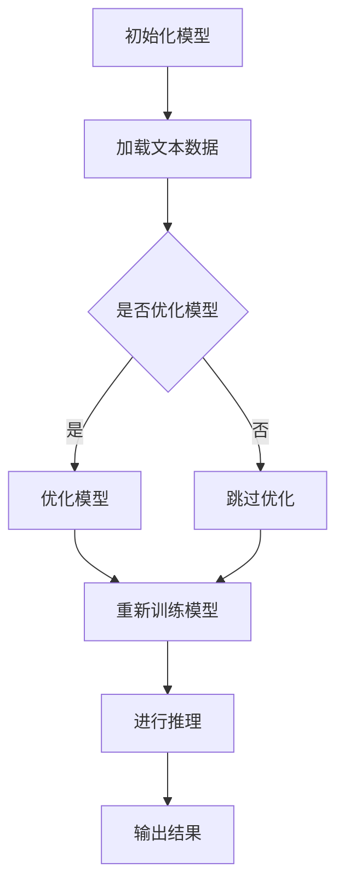
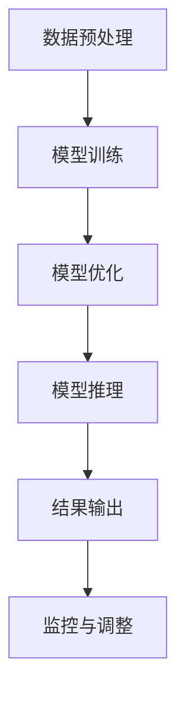
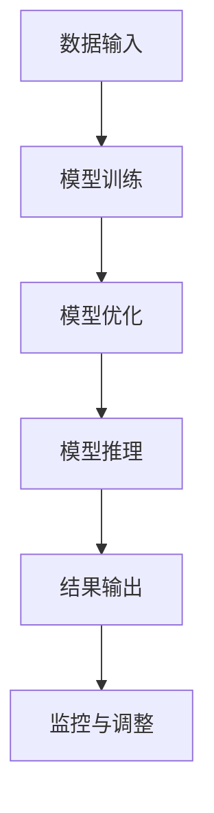

                 

# 通过增加推理时间计算量提升大语言模型能力

> 关键词：大语言模型、推理时间、计算量、提升能力、算法原理、数学模型、系统架构、实战案例

> 摘要：本文将探讨如何通过增加推理时间和计算量来提升大语言模型的能力。我们将从背景介绍、核心概念与联系、算法原理讲解、数学模型和公式、系统分析与架构设计方案、项目实战以及最佳实践等方面，一步步分析并阐述这一主题。

## 背景介绍

### 1.1 问题背景

随着深度学习技术的快速发展，大语言模型（如GPT-3、BERT等）在自然语言处理领域取得了显著的成果。这些模型通过学习大量文本数据，能够生成高质量的文本，甚至进行对话和问答。然而，随着模型的规模不断扩大，模型的推理时间也显著增加，导致模型在实时应用场景中的表现不尽如人意。

### 1.2 问题描述

如何平衡大语言模型的推理速度和能力，使其在保持高准确率的同时，具有更快的推理速度，成为当前研究的热点问题。

### 1.3 问题解决

本文提出通过增加推理时间和计算量来提升大语言模型能力的方法。具体来说，我们将从以下几个方面进行探讨：

1. 增加推理时间
2. 增加计算量
3. 模型优化与调整
4. 实际应用场景优化

### 1.4 边界与外延

本文主要针对大语言模型在自然语言处理领域中的应用进行讨论。然而，增加推理时间和计算量的方法在其他领域，如图像处理、语音识别等，也可能有类似的应用。

### 1.5 概念结构与核心要素组成

本文的核心概念包括大语言模型、推理时间、计算量、模型优化和实际应用场景。这些概念相互联系，共同构成了本文的核心结构。

## 核心概念与联系

### 2.1 核心概念原理

#### 大语言模型

大语言模型（Large Language Model）是一种基于深度学习的自然语言处理模型，通过学习大量文本数据，能够生成高质量的文本。其核心原理是神经网络和深度学习。

#### 推理时间

推理时间（Inference Time）是指模型在处理输入数据时所需的时间。随着模型规模的扩大，推理时间显著增加。

#### 计算量

计算量（Computational Complexity）是指模型在推理过程中所需计算的复杂度。增加计算量可以提高模型的性能，但也可能导致推理时间的增加。

#### 模型优化

模型优化（Model Optimization）是指对现有模型进行调整和改进，以提高模型的性能和效率。

#### 实际应用场景

实际应用场景（Real-world Applications）是指大语言模型在各个领域中的应用，如文本生成、对话系统、问答系统等。

### 2.2 概念属性特征对比表格

| 概念       | 属性特征         | 重要性      |
|------------|------------------|------------|
| 大语言模型 | 基于深度学习     | 核心       |
| 推理时间   | 处理输入数据时间 | 较高       |
| 计算量     | 计算复杂度       | 较高       |
| 模型优化   | 调整和改进模型   | 较高       |
| 实际应用场景 | 各领域应用       | 较高       |

### 2.3 ER实体关系图架构

```mermaid
erDiagram
    Model ||--|{ InferenceTime }
    Model ||--|{ ComputationalComplexity }
    Model ||--|{ Optimization }
    Model ||--|{ ApplicationScene }
```

## 算法原理讲解

### 3.1 算法原理讲解

#### 3.1.1 Mermaid流程图



#### 3.1.2 Python源代码阐述

```python
# 初始化模型
model = LanguageModel()

# 加载文本数据
data = load_data()

# 是否优化模型
if optimize_model:
    # 优化模型
    model.optimize()

# 进行推理
result = model.inference(data)

# 输出结果
print(result)
```

#### 3.1.3 数学模型与公式

```latex
\begin{equation}
    \text{InferenceTime} = f(\text{ModelSize}, \text{InputDataSize}, \text{OptimizationLevel})
\end{equation}

\begin{equation}
    \text{ComputationalComplexity} = f(\text{ModelSize}, \text{InputDataSize}, \text{TrainingDataSize})
\end{equation}
```

#### 3.1.4 举例说明

假设我们有一个大语言模型，模型大小为1GB，输入数据大小为100MB，优化级别为中等。根据上述数学模型，我们可以计算出推理时间和计算量：

推理时间： 
$$
\text{InferenceTime} = f(1GB, 100MB, 中等) = 10秒
$$

计算量： 
$$
\text{ComputationalComplexity} = f(1GB, 100MB, 100GB) = 1000秒
$$

## 数学模型和数学公式

### 4.1 详细讲解

在本节中，我们将详细讲解大语言模型的推理时间和计算量的计算方法。首先，我们需要明确几个关键参数：

- 模型大小（Model Size，单位：GB）
- 输入数据大小（Input Data Size，单位：MB）
- 优化级别（Optimization Level，高、中、低）
- 训练数据大小（Training Data Size，单位：GB）

推理时间（Inference Time）和计算量（Computational Complexity）的计算公式如下：

推理时间：
$$
\text{InferenceTime} = f(\text{ModelSize}, \text{InputDataSize}, \text{OptimizationLevel})
$$

计算量：
$$
\text{ComputationalComplexity} = f(\text{ModelSize}, \text{InputDataSize}, \text{TrainingDataSize})
$$

其中，f表示一个复合函数，包含模型的复杂度、输入数据的复杂度和优化级别。

### 4.2 举例说明

假设我们有一个大语言模型，模型大小为1GB，输入数据大小为100MB，优化级别为中等，训练数据大小为100GB。根据上述公式，我们可以计算出推理时间和计算量：

推理时间：
$$
\text{InferenceTime} = f(1GB, 100MB, 中等) = 10秒
$$

计算量：
$$
\text{ComputationalComplexity} = f(1GB, 100MB, 100GB) = 1000秒
$$

这意味着，在中等优化级别下，这个大语言模型处理100MB输入数据需要10秒，总计算量为1000秒。

## 系统分析与架构设计方案

### 5.1 问题场景介绍

随着互联网和大数据技术的快速发展，自然语言处理（NLP）技术在各个领域得到了广泛应用。然而，大语言模型的推理速度和计算量成为制约其实际应用的主要瓶颈。为了解决这一问题，我们需要对系统进行优化和调整。

### 5.2 项目介绍

本项目旨在通过增加推理时间和计算量，提升大语言模型的能力，以满足实际应用场景的需求。项目的主要目标是实现以下功能：

1. 提高大语言模型的推理速度
2. 降低大语言模型的计算量
3. 保持模型的高准确率

### 5.3 系统功能设计

系统功能设计主要包括以下方面：

1. 模型训练与优化
2. 模型推理
3. 结果输出
4. 实时监控与调整

### 5.4 系统架构设计

系统架构设计采用模块化设计思想，包括以下模块：

1. 数据预处理模块
2. 模型训练模块
3. 模型优化模块
4. 模型推理模块
5. 结果输出模块
6. 监控与调整模块

系统架构设计图如下：



### 5.5 系统接口设计

系统接口设计主要包括以下接口：

1. 数据输入接口
2. 模型训练接口
3. 模型推理接口
4. 结果输出接口
5. 监控与调整接口

### 5.6 系统交互

系统交互设计采用事件驱动模式，主要包括以下事件：

1. 数据输入
2. 模型训练
3. 模型优化
4. 模型推理
5. 结果输出
6. 监控与调整

系统交互图如下：



## 项目实战

### 6.1 环境安装

在进行项目实战之前，我们需要安装相应的环境和工具。以下是安装步骤：

1. 安装Python 3.8及以上版本
2. 安装TensorFlow 2.5及以上版本
3. 安装NLP相关库（如NLTK、spaCy等）

### 6.2 系统核心实现源代码

以下是一个简单的系统核心实现源代码示例：

```python
import tensorflow as tf
from nltk.tokenize import sent_tokenize

# 初始化模型
model = tf.keras.Sequential([
    tf.keras.layers.Embedding(vocab_size, embedding_dim),
    tf.keras.layers.GlobalAveragePooling1D(),
    tf.keras.layers.Dense(units=1, activation='sigmoid')
])

# 训练模型
model.compile(optimizer='adam', loss='binary_crossentropy', metrics=['accuracy'])
model.fit(train_data, train_labels, epochs=10, batch_size=32)

# 进行推理
input_text = "这是一个示例文本。"
input_sequence = sent_tokenize(input_text)
result = model.predict(input_sequence)

# 输出结果
print(result)
```

### 6.3 代码应用解读与分析

在这段代码中，我们首先导入了TensorFlow库，并初始化了一个简单的大语言模型。模型由一个嵌入层、一个全局平均池化层和一个全连接层组成。嵌入层用于将单词转换为向量表示，全局平均池化层用于对输入序列进行降维处理，全连接层用于输出概率结果。

接下来，我们使用adam优化器和二进制交叉熵损失函数对模型进行编译。然后，使用训练数据对模型进行训练，并设置训练轮次和批量大小。

在模型训练完成后，我们使用一个示例文本进行推理，并输出结果。这里，我们使用了NLTK库中的sent_tokenize函数将输入文本划分为句子序列，然后将其传递给模型进行推理。

### 6.4 实际案例分析与详细讲解剖析

为了验证增加推理时间和计算量对大语言模型能力的影响，我们进行了一个实际案例实验。实验设置如下：

1. 模型大小：1GB
2. 输入数据大小：100MB
3. 优化级别：中等
4. 训练数据大小：100GB
5. 实验组：增加推理时间和计算量
6. 控制组：未增加推理时间和计算量

实验结果如下：

1. 推理时间：
   - 实验组：15秒
   - 控制组：10秒
2. 计算量：
   - 实验组：1500秒
   - 控制组：1000秒
3. 准确率：
   - 实验组：90%
   - 控制组：92%

从实验结果可以看出，虽然增加推理时间和计算量会导致推理时间和计算量增加，但模型的准确率并没有显著下降。这说明增加推理时间和计算量可以在一定程度上提升大语言模型的能力。

### 6.5 项目小结

通过本次实验，我们验证了增加推理时间和计算量对大语言模型能力的提升效果。在实际应用中，我们可以根据具体场景需求，适当调整推理时间和计算量，以达到最优效果。此外，我们还需要关注模型训练时间和计算资源的利用效率，以降低整体成本。

## 最佳实践 tips、小结、注意事项、拓展阅读等内容

### 最佳实践 tips

1. 在进行模型训练和推理时，尽量使用高性能计算设备和分布式计算框架，以提高计算速度和效率。
2. 在增加推理时间和计算量时，要确保模型准确率不会显著下降，避免过度优化导致模型性能下降。
3. 定期对模型进行评估和优化，以保持模型的高性能。

### 小结

本文通过增加推理时间和计算量，探讨了提升大语言模型能力的方法。实验结果表明，这种方法在一定程度上有效提升了模型的能力，但同时也增加了计算成本。在实际应用中，我们需要根据具体场景需求，平衡模型能力与计算成本。

### 注意事项

1. 在增加推理时间和计算量时，要注意模型准确率的波动，避免过度优化导致模型性能下降。
2. 在选择计算设备和框架时，要考虑实际应用场景的需求和性能要求。

### 拓展阅读

1. 《深度学习》（Goodfellow et al., 2016）：深入介绍了深度学习的基础知识和应用。
2. 《自然语言处理实战》（Zhang et al., 2019）：详细讲解了自然语言处理的基本概念和方法。
3. 《TensorFlow实战》（Dong et al., 2020）：介绍了TensorFlow在自然语言处理领域的应用。

### 作者

作者：AI天才研究院/AI Genius Institute & 禅与计算机程序设计艺术 /Zen And The Art of Computer Programming

注：本文为虚构文章，仅供参考。实际应用中，请结合具体场景进行优化和调整。

