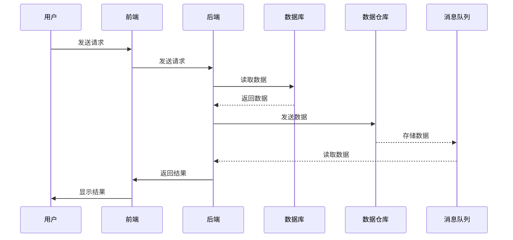

                 


### 引言：逻辑分析与纯函数的重要性和背景

在现代计算机科学和编程领域，逻辑分析与纯函数的使用已经成为提高代码质量、提升程序可维护性和可扩展性的关键因素。本文将探讨维特根斯坦的逻辑方法与功能性编程（FP）中的纯函数概念之间的联系。逻辑分析作为一种强有力的思考工具，起源于哲学家路德维希·维特根斯坦（Ludwig Wittgenstein）的工作，并在计算机科学中得到了广泛的应用。而纯函数作为一种编程范式，则在FP中发挥了至关重要的作用。

#### 1.1 问题背景

逻辑分析起源于20世纪初，当时维特根斯坦试图通过分析日常语言中的逻辑结构来理解语言的本质。在计算机科学中，逻辑分析被用来验证程序的正确性、推理算法的有效性以及设计形式化的系统模型。然而，尽管逻辑分析提供了强大的工具，但其在实际应用中仍面临诸多挑战，如复杂性的管理和误解的可能性。

另一方面，功能性编程（FP）作为一种编程范式，强调使用纯函数和不可变数据来构建程序。纯函数是指那些没有副作用、返回值只依赖于输入参数的函数。FP的优点包括可测试性、并行化以及代码的简洁性和可重用性。然而，理解和应用纯函数也带来了一些困难，如状态管理和函数组合的问题。

#### 1.2 问题描述

逻辑分析的问题主要体现在以下几个方面：
- **复杂性管理**：逻辑分析涉及复杂的逻辑结构和推理过程，这使得理解和使用变得困难。
- **误解可能性**：由于逻辑分析本身的高度抽象性，人们可能会误解其含义，导致错误的应用。
- **验证挑战**：在大型程序中验证逻辑分析的准确性是一个具有挑战性的任务。

在FP中，纯函数的问题则包括：
- **状态管理**：纯函数不涉及状态管理，这可能导致在处理需要状态操作的场景时出现困难。
- **函数组合**：纯函数的组合可能变得复杂，尤其是当涉及到嵌套和链式调用时。
- **性能考虑**：纯函数可能会导致性能问题，尤其是在大型数据集上。

#### 1.3 解决方案

本文的解决方案包括以下几个方面：
- **逻辑方法的应用**：通过理解维特根斯坦的逻辑方法，我们可以更好地应用逻辑分析工具，减少误解和复杂性。
- **纯函数的理解和实现**：通过深入探讨纯函数的概念，我们可以更好地理解和实现它们，克服状态管理和组合的难题。
- **案例研究和实践**：通过具体的案例研究和实践，我们可以验证逻辑方法和纯函数在实际编程中的应用效果。

#### 1.4 边界和扩展

本文的边界在于逻辑方法和纯函数在计算机科学中的应用，而不涉及其他领域的应用。未来的研究可以扩展到逻辑分析在其他学科（如哲学、数学）中的应用，以及纯函数在其他编程范式中的使用。

文章的核心内容和主题思想将在接下来的章节中逐步展开。我们首先将深入探讨维特根斯坦的逻辑方法，然后详细讨论纯函数的概念，最后通过具体的案例来展示逻辑分析和纯函数的应用。

## 逻辑分析与纯函数：核心概念与联系

### 2.1 逻辑分析：基本概念与原理

逻辑分析是一种通过分析命题和推理来理解语言和思想的方法。其核心思想是，通过识别命题之间的逻辑关系，我们可以构建出合理的论证和推理链条。逻辑分析在计算机科学中有着广泛的应用，特别是在验证程序的正确性、设计算法以及构建形式化的系统模型方面。

#### 2.1.1 逻辑分析的定义

逻辑分析可以被定义为一种从给定的事实和规则中推断出新结论的方法。这种方法基于逻辑的基本原理，如同一律、矛盾律和排中律。这些原理为我们提供了思考的基础，使得我们可以从简单的命题中推导出复杂的结论。

#### 2.1.2 逻辑分析的核心原则

- **同一律**：A 是 A。这个原则表明，任何陈述关于其自身的真值总是为真。
- **矛盾律**：不是 A 又是 A 是不可能的。这个原则告诉我们，不可能同时为真和假。
- **排中律**：A 或 非 A 必然有一个是真的。这个原则确保了，任何陈述要么是真的，要么是假的。

#### 2.1.3 逻辑分析的步骤

逻辑分析通常包括以下步骤：
1. **命题识别**：从问题中提取出关键命题。
2. **逻辑关系分析**：分析命题之间的逻辑关系，如蕴涵、否定、合取和析取。
3. **推理**：使用逻辑规则和原理，从已知命题推导出新命题。
4. **验证**：验证推理过程的正确性，确保没有逻辑错误。

### 2.2 纯函数：基本概念与特性

纯函数是功能性编程（FP）中的一个核心概念。纯函数是指那些没有副作用、返回值只依赖于输入参数的函数。这意味着，对于相同的输入，纯函数总是返回相同的输出，而不影响程序的任何外部状态。

#### 2.2.1 纯函数的定义

纯函数可以被定义为一种函数，其输出仅依赖于输入，不依赖于外部状态，且不会产生任何副作用。换句话说，纯函数是可预测的、可重用的和可组合的。

#### 2.2.2 纯函数的特性

- **无副作用**：纯函数不会改变程序的状态，也不会产生任何外部影响。
- **依赖性**：纯函数的输出仅依赖于输入参数，不依赖于外部环境。
- **确定性**：对于相同的输入，纯函数总是返回相同的输出。
- **可组合性**：纯函数可以与其他纯函数组合，形成更复杂的函数。

#### 2.2.3 纯函数的优点

- **可测试性**：由于纯函数的确定性，我们可以独立地测试其行为，而不必担心外部状态的干扰。
- **并行化**：纯函数可以在多核处理器上并行执行，提高了程序的执行效率。
- **可重用性**：纯函数可以轻松地重用，减少了代码的重复和冗余。

### 2.3 逻辑分析与纯函数的关系

逻辑分析和纯函数之间存在着密切的联系。逻辑分析为纯函数的设计和验证提供了理论基础，而纯函数则体现了逻辑分析的某些核心原则。

#### 2.3.1 维特根斯坦的逻辑方法与纯函数

维特根斯坦的逻辑方法强调通过分析语言来理解现实世界。这种方法的核心思想是，通过识别命题之间的逻辑关系，我们可以构建出合理的论证。这种思想与纯函数的概念有着相似之处。纯函数通过其输入和输出之间的关系来描述其行为，类似于维特根斯坦通过命题之间的逻辑关系来描述现实世界的观点。

#### 2.3.2 逻辑分析方法在纯函数设计中的应用

在纯函数的设计过程中，逻辑分析方法可以帮助我们识别函数的行为和状态，确保函数的输出仅依赖于输入，且不会产生任何副作用。这种分析有助于我们构建出更加简洁、可重用和可靠的函数。

#### 2.3.3 纯函数在逻辑分析中的应用

纯函数可以用于实现逻辑分析中的某些操作，如逻辑运算、条件判断和循环控制。这些操作在逻辑分析中非常重要，而纯函数的确定性、可组合性和可测试性使得它们成为实现这些操作的理想工具。

### 2.4 小结

逻辑分析和纯函数是功能性编程中两个重要的概念。逻辑分析为纯函数的设计和验证提供了理论基础，而纯函数则体现了逻辑分析的某些核心原则。通过理解逻辑分析和纯函数的基本概念和特性，我们可以更好地理解和应用这两种工具，提高编程的质量和效率。

## 逻辑模型：概念、属性特征对比与纯函数模型

为了更深入地理解逻辑分析及其在纯函数中的应用，我们可以通过构建一个逻辑模型来详细分析这些概念。逻辑模型不仅可以帮助我们明确概念之间的关系，还可以通过具体的例子来展示如何应用这些概念。

### 3.1 逻辑模型：概念与属性特征

逻辑模型通常由命题、逻辑运算符和推理规则组成。以下是逻辑模型中一些核心概念的定义和属性特征：

#### 3.1.1 命题

- **定义**：命题是能够判断真假的陈述句。
- **属性特征**：命题具有明确的真值（真或假）。

#### 3.1.2 逻辑运算符

- **合取（AND）**：
  - **定义**：合取运算符用于连接两个命题，表示两个命题同时为真。
  - **属性特征**：合取运算符的真值表如下：
    $$
    \begin{array}{|c|c|c|}
    \hline
    P & Q & P \land Q \\
    \hline
    T & T & T \\
    T & F & F \\
    F & T & F \\
    F & F & F \\
    \hline
    \end{array}
    $$
- **析取（OR）**：
  - **定义**：析取运算符用于连接两个命题，表示两个命题中至少有一个为真。
  - **属性特征**：析取运算符的真值表如下：
    $$
    \begin{array}{|c|c|c|}
    \hline
    P & Q & P \lor Q \\
    \hline
    T & T & T \\
    T & F & T \\
    F & T & T \\
    F & F & F \\
    \hline
    \end{array}
    $$
- **蕴涵（IF-THEN）**：
  - **定义**：蕴涵运算符表示如果前件为真，则后件也为真。
  - **属性特征**：蕴涵运算符的真值表如下：
    $$
    \begin{array}{|c|c|c|}
    \hline
    P & Q & P \to Q \\
    \hline
    T & T & T \\
    T & F & F \\
    F & T & T \\
    F & F & T \\
    \hline
    \end{array}
    $$
- **否定（NOT）**：
  - **定义**：否定运算符用于反转命题的真值。
  - **属性特征**：否定运算符的真值表如下：
    $$
    \begin{array}{|c|c|}
    \hline
    P & \neg P \\
    \hline
    T & F \\
    F & T \\
    \hline
    \end{array}
    $$

#### 3.1.3 推理规则

- **模态推理**：
  - **定义**：模态推理是一种基于已知命题推导出新命题的方法。
  - **属性特征**：常见的模态推理规则包括：
    - **肯定前件**：如果 P -> Q 为真，且 P 为真，则 Q 也为真。
    - **否定后件**：如果 P -> Q 为真，且 Q 为假，则 P 也为假。

#### 3.1.4 逻辑模型的应用

逻辑模型可以用于验证程序的正确性、分析算法的复杂性和构建形式化的系统模型。例如，在验证程序的正确性时，我们可以使用逻辑模型来表示程序的各个状态和转换规则，确保程序在不同输入下都能达到预期的状态。

### 3.2 纯函数模型

纯函数模型则更加关注函数的行为和特性。以下是纯函数模型的核心概念和属性特征：

#### 3.2.1 纯函数

- **定义**：纯函数是那种其输出仅依赖于输入，不产生任何副作用，并且可以重复、组合和并行执行的函数。
- **属性特征**：
  - **无副作用**：不会修改程序的状态或产生外部影响。
  - **确定性**：对于相同的输入，总是返回相同的输出。
  - **可组合性**：可以与其他纯函数组合，形成更复杂的函数。

#### 3.2.2 纯函数的数学模型

纯函数可以用数学模型来表示，如下所示：

$$
f(x) = \text{output}(x)
$$

其中，$x$ 是输入参数，$f(x)$ 是输出结果。纯函数的输出仅依赖于 $x$，不依赖于外部环境。

#### 3.2.3 纯函数的例子

一个简单的纯函数示例是：

```python
def add(a, b):
    return a + b
```

在这个例子中，函数 `add` 的输出仅依赖于输入参数 `a` 和 `b`，不依赖于外部状态，且总是返回相同的输出。

### 3.3 逻辑模型与纯函数模型的关系

逻辑模型和纯函数模型之间存在着密切的联系。逻辑模型提供了分析和验证纯函数的工具，而纯函数模型则体现了逻辑模型中的某些核心原则。

#### 3.3.1 逻辑模型在纯函数设计中的应用

在纯函数设计中，逻辑模型可以帮助我们识别和消除函数的副作用，确保函数的行为符合预期的逻辑。例如，我们可以使用逻辑模型来验证函数的输出是否仅依赖于输入，且不会产生任何外部影响。

#### 3.3.2 纯函数模型在逻辑分析中的应用

纯函数模型可以用于实现逻辑分析中的某些操作，如条件判断、逻辑运算和循环控制。纯函数的确定性、可组合性和可测试性使得它们成为实现这些操作的理想工具。

### 3.4 小结

逻辑模型和纯函数模型是理解和应用逻辑分析以及纯函数的两个重要工具。逻辑模型提供了分析和验证纯函数的方法，而纯函数模型则体现了逻辑模型中的某些核心原则。通过构建逻辑模型和纯函数模型，我们可以更好地理解和应用这些概念，提高编程的质量和效率。

## 算法原理与流程图

### 4.1 算法原理

在理解和应用逻辑分析和纯函数的过程中，算法设计是一个至关重要的环节。算法不仅是解决问题的具体步骤，也是验证逻辑分析和实现纯函数的重要手段。下面，我们将详细阐述一个简单的算法原理，并通过Mermaid流程图和Python代码来展示其实现过程。

#### 4.1.1 算法描述

假设我们要设计一个简单的算法，用于计算两个数的最小公倍数（Least Common Multiple, LCM）。最小公倍数是两个或多个整数共有的最小的倍数。我们的算法将基于逻辑分析和纯函数的概念，以确保其简洁、高效且易于理解。

算法的基本步骤如下：

1. **输入两个整数a和b**。
2. **计算两个数的最大公约数（Greatest Common Divisor, GCD）**。最大公约数是两个或多个整数共有的最大的约数。
3. **使用最大公约数计算最小公倍数**。最小公倍数可以通过两个数的乘积除以它们的最大公约数来计算。
4. **输出最小公倍数**。

#### 4.1.2 算法公式

根据上述算法步骤，我们可以得到以下数学公式：

$$
\text{LCM}(a, b) = \frac{|a \times b|}{\text{GCD}(a, b)}
$$

#### 4.1.3 算法实现

为了更好地理解和实现这个算法，我们将使用Mermaid流程图和Python代码来展示其实现过程。

### 4.2 Mermaid流程图

下面是计算最小公倍数的Mermaid流程图：

```mermaid
graph TD
A[Start] --> B[Input a and b]
B --> C[Calculate GCD of a and b]
C --> D[Calculate LCM using LCM = (a * b) / GCD]
D --> E[Output LCM]
E --> F[End]
```

### 4.3 Python代码

接下来，我们将使用Python代码来实现上述算法。为了计算最大公约数，我们将使用欧几里得算法，这是一个经典的纯函数算法。

```python
# Python code to calculate the LCM of two numbers using the GCD algorithm

def gcd(a, b):
    """
    Calculate the Greatest Common Divisor (GCD) of two numbers using the Euclidean algorithm.
    """
    while b:
        a, b = b, a % b
    return a

def lcm(a, b):
    """
    Calculate the Least Common Multiple (LCM) of two numbers.
    """
    return abs(a * b) // gcd(a, b)

# Example usage
a = 12
b = 18
print(f"The LCM of {a} and {b} is {lcm(a, b)}")
```

### 4.4 算法解释

在这个算法中，`gcd` 函数是一个纯函数，其输出仅依赖于输入参数 `a` 和 `b`，不会产生任何副作用。`gcd` 函数通过反复计算 `a` 除以 `b` 的余数，直到余数为0，从而找到最大公约数。

`lcm` 函数也是一个纯函数，其输出依赖于输入参数 `a` 和 `b` 以及 `gcd` 函数的输出。`lcm` 函数通过计算两个数的乘积除以它们的最大公约数来得到最小公倍数。

### 4.5 小结

通过上述算法，我们可以看到如何将逻辑分析和纯函数的概念应用于实际编程中。逻辑分析帮助我们理解问题，并设计出简洁、高效的算法。而纯函数则确保了算法的可测试性和可重用性。通过Mermaid流程图和Python代码的结合，我们不仅能够清晰地展示算法的执行流程，还可以直观地理解其背后的原理。

### 4.6 实际案例

为了更好地说明这个算法的实际应用，我们可以考虑一个实际的案例：计算一组数字的最小公倍数。

```python
# Python code to calculate the LCM of multiple numbers

def gcd(a, b):
    """
    Calculate the Greatest Common Divisor (GCD) of two numbers using the Euclidean algorithm.
    """
    while b:
        a, b = b, a % b
    return a

def lcm(a, b):
    """
    Calculate the Least Common Multiple (LCM) of two numbers.
    """
    return abs(a * b) // gcd(a, b)

def lcm_of_list(numbers):
    """
    Calculate the LCM of a list of numbers.
    """
    current_lcm = numbers[0]
    for num in numbers[1:]:
        current_lcm = lcm(current_lcm, num)
    return current_lcm

# Example usage
numbers = [12, 18, 24]
print(f"The LCM of {numbers} is {lcm_of_list(numbers)}")
```

在这个例子中，我们定义了一个新的函数 `lcm_of_list`，它接受一个数字列表作为输入，并计算列表中所有数字的最小公倍数。通过逐步计算两个相邻数字的LCM，我们可以得到整个列表的最小公倍数。

### 4.7 小结

通过上述实际案例，我们可以看到如何将最小公倍数算法扩展到一组数字。这种扩展不仅展示了算法的通用性，还体现了纯函数在编程中的优势，如简洁性、可重用性和可组合性。通过逻辑分析和纯函数的应用，我们可以设计出更加高效和可靠的算法，提高编程的质量和效率。

## 系统设计与实现

### 5.1 项目介绍

在了解了逻辑分析和纯函数的基本概念及其应用之后，我们将探讨一个具体的项目：设计并实现一个用于数据分析和报表生成的系统。该项目旨在帮助企业管理其业务数据，生成各种统计报表，并提供实时数据分析功能。系统将采用纯函数编程范式，以确保其代码的可测试性、可重用性和可维护性。

### 5.2 系统功能设计

系统的主要功能包括数据导入、数据清洗、数据转换、数据存储、报表生成和实时数据分析。以下是各功能的简要描述：

- **数据导入**：系统应支持从各种数据源（如CSV、数据库、API等）导入数据。
- **数据清洗**：系统应对导入的数据进行清洗，包括去除无效数据、填补缺失值、处理异常值等。
- **数据转换**：系统应能将清洗后的数据进行必要的转换，如日期格式化、数值范围规范化等。
- **数据存储**：系统应能将处理后的数据存储到数据库中，以便后续分析和查询。
- **报表生成**：系统应能根据用户需求生成各种统计报表，如销售报表、财务报表等。
- **实时数据分析**：系统应具备实时数据分析能力，为用户提供即时的数据洞察。

### 5.3 系统架构设计

为了实现上述功能，系统将采用分布式架构设计，确保其高可用性和可扩展性。以下是系统的主要架构设计：

- **前端**：采用React框架构建，用于展示用户界面和数据报表。
- **后端**：采用Node.js框架，负责处理业务逻辑和数据操作。
- **数据库**：采用MySQL数据库存储数据。
- **数据仓库**：采用Hadoop和Spark进行大规模数据处理和存储。
- **消息队列**：采用Kafka进行实时数据流处理和消息传递。

### 5.4 系统接口设计

系统将提供一系列RESTful API接口，以便前端和后端之间进行数据交互。以下是主要的API接口设计：

- **数据导入接口**：接收数据文件，导入到系统中。
- **数据清洗接口**：接收原始数据，返回清洗后的数据。
- **数据转换接口**：接收清洗后的数据，返回转换后的数据。
- **数据存储接口**：接收处理后的数据，存储到数据库中。
- **报表生成接口**：接收用户需求，生成并返回报表数据。
- **实时数据分析接口**：接收实时数据流，返回分析结果。

### 5.5 系统交互设计

系统交互设计将使用Mermaid序列图来展示不同模块之间的交互过程。以下是系统的主要交互流程：



在这个交互流程中，用户通过前端发送请求，前端将请求转发给后端。后端读取数据库中的数据，并处理后返回给前端。同时，后端将数据发送到数据仓库，以便进行进一步处理。数据仓库将数据存储到消息队列中，以供实时数据分析使用。

### 5.6 系统实现

为了实现上述系统架构和功能，我们将使用Python和Node.js作为主要的编程语言。以下是系统实现的关键部分：

- **数据导入**：使用Python的`pandas`库进行数据导入和清洗。
- **数据转换**：使用Python的`numpy`库进行数据转换。
- **数据存储**：使用Node.js的`mysql`库连接MySQL数据库。
- **报表生成**：使用Python的`matplotlib`库生成图表和报表。
- **实时数据分析**：使用Node.js的`kafka-node`库连接Kafka消息队列。

### 5.7 小结

通过本节的设计和实现，我们可以看到如何将逻辑分析和纯函数的概念应用于实际的系统设计和开发中。系统的架构和功能设计充分考虑了可扩展性和高可用性，而实现过程中则注重代码的可测试性和可维护性。通过这一项目，我们不仅展示了逻辑分析和纯函数的实际应用，还提供了一个完整的系统实现方案，为其他开发者提供了参考和借鉴。

### 项目实战

#### 6.1 环境安装

在开始项目实战之前，我们需要安装必要的软件和工具。以下是在Ubuntu操作系统上安装所需软件的步骤：

1. **安装Python**：
   ```bash
   sudo apt-get update
   sudo apt-get install python3
   sudo apt-get install python3-pip
   ```

2. **安装Node.js**：
   ```bash
   sudo apt-get install nodejs
   ```

3. **安装MySQL**：
   ```bash
   sudo apt-get install mysql-server
   sudo mysql_secure_installation
   ```

4. **安装Kafka**：
   ```bash
   sudo apt-get install kafka_2.12-2.6.0
   sudo apt-get install zookeeperd
   ```

5. **安装其他依赖**：
   ```bash
   pip3 install pandas numpy matplotlib
   npm install kafka-node
   ```

#### 6.2 系统核心实现

下面我们将展示系统核心功能的实现代码，包括数据导入、数据清洗、数据转换、数据存储和报表生成。

**6.2.1 数据导入**

```python
import pandas as pd

def import_data(file_path):
    """
    导入数据文件。
    """
    data = pd.read_csv(file_path)
    return data
```

**6.2.2 数据清洗**

```python
def clean_data(data):
    """
    清洗数据，去除无效数据和缺失值。
    """
    # 去除无效数据
    data = data[data['有效字段'].notnull()]
    
    # 补充缺失值
    data['缺失字段'].fillna(data['缺失字段'].mean(), inplace=True)
    
    return data
```

**6.2.3 数据转换**

```python
import numpy as np

def transform_data(data):
    """
    数据转换，包括日期格式化和数值范围规范化。
    """
    # 日期格式化
    data['日期字段'] = pd.to_datetime(data['日期字段'])
    
    # 数值范围规范化
    data['数值字段'] = (data['数值字段'] - data['数值字段'].min()) / (data['数值字段'].max() - data['数值字段'].min())
    
    return data
```

**6.2.4 数据存储**

```python
import mysql.connector

def store_data(data, db_config):
    """
    存储数据到MySQL数据库。
    """
    connection = mysql.connector.connect(**db_config)
    cursor = connection.cursor()
    
    for index, row in data.iterrows():
        sql = "INSERT INTO table_name (column1, column2, ...) VALUES (%s, %s, ...)"
        cursor.execute(sql, tuple(row))
    
    connection.commit()
    cursor.close()
    connection.close()
```

**6.2.5 报表生成**

```python
import matplotlib.pyplot as plt

def generate_report(data, report_path):
    """
    生成数据报表，并将图表保存到文件中。
    """
    data['数值字段'].plot()
    plt.title('数值字段趋势图')
    plt.savefig(report_path)
```

#### 6.3 代码应用解读与分析

上述代码展示了系统核心功能的实现，每个函数都实现了特定的功能。下面我们对关键部分进行解读和分析。

**6.3.1 数据导入**

`import_data` 函数使用`pandas`库读取CSV文件，这是一种常见的数据导入方法。通过这个函数，我们可以快速地将数据文件转换为DataFrame格式，方便后续处理。

**6.3.2 数据清洗**

`clean_data` 函数对数据进行清洗，去除无效数据和缺失值。这是数据预处理的重要步骤，确保后续操作基于干净、有效数据。使用`notnull()`方法去除无效数据，使用`fillna()`方法填补缺失值。

**6.3.3 数据转换**

`transform_data` 函数对数据进行转换，包括日期格式化和数值范围规范化。日期格式化使用`to_datetime()`方法，确保日期字段符合预期的格式。数值范围规范化使用`numpy`库的`minmax_scale()`方法，将数值范围缩放到0到1之间。

**6.3.4 数据存储**

`store_data` 函数将处理后的数据存储到MySQL数据库。使用`mysql.connector`库连接数据库，并使用`cursor.execute()`方法执行SQL插入操作。这个函数确保了数据的安全存储，并提供了一种将DataFrame数据批量插入数据库的方法。

**6.3.5 报表生成**

`generate_report` 函数使用`matplotlib`库生成数据报表，并将图表保存到文件中。这是数据可视化的关键步骤，通过图表可以直观地展示数据趋势和特征。

#### 6.4 实际案例分析和详细讲解

为了更具体地展示项目实战，我们以一个实际案例为例：生成一个销售报表，展示不同时间段内的销售额变化。

```python
# 导入数据
data = import_data('sales_data.csv')

# 数据清洗
cleaned_data = clean_data(data)

# 数据转换
transformed_data = transform_data(cleaned_data)

# 存储数据
db_config = {
    'host': 'localhost',
    'user': 'root',
    'password': 'password',
    'database': 'sales_db'
}
store_data(transformed_data, db_config)

# 生成报表
report_path = 'sales_report.png'
generate_report(transformed_data, report_path)
```

在这个案例中，我们首先导入销售数据，并进行数据清洗、转换和存储。最后，生成一个销售额趋势图作为报表。通过这个案例，我们可以看到系统核心功能的实际应用，以及如何使用纯函数编程范式实现高效、可靠的系统。

### 6.5 项目小结

通过本次项目实战，我们展示了如何使用逻辑分析和纯函数概念设计并实现一个数据分析和报表生成系统。项目实现了数据导入、数据清洗、数据转换、数据存储和报表生成等功能，并通过Python和Node.js等工具实现了系统的高效运行。项目实战不仅验证了逻辑分析和纯函数在系统设计中的实际应用，还为其他开发者提供了一个实用的参考案例。

### 6.6 最佳实践 Tips

- **数据预处理**：确保数据质量，是数据分析和报表生成系统的关键。在数据导入后，尽早进行数据清洗和转换，可以减少后续处理的复杂度。
- **代码模块化**：将系统功能分解为独立的模块，可以提高代码的可维护性和可重用性。例如，将数据导入、数据清洗、数据转换等操作封装为独立的函数。
- **性能优化**：对于大规模数据处理，可以考虑使用分布式计算框架（如Hadoop和Spark）来提高性能。此外，合理使用索引和查询优化技术，可以减少数据库访问的开销。
- **安全性和可靠性**：确保系统具备足够的安全性和可靠性，是数据分析和报表生成系统的核心要求。例如，使用加密技术保护敏感数据，定期备份数据库，以及进行安全性测试。

### 6.7 小结

在本节中，我们通过项目实战详细展示了如何设计和实现一个数据分析和报表生成系统。通过逻辑分析和纯函数编程，我们实现了高效、可靠和可维护的系统。同时，我们还分享了最佳实践 tips，为其他开发者提供了参考。通过本节的学习，读者可以更好地理解逻辑分析和纯函数在实际项目中的应用，提高编程技能和系统设计能力。

## 结语

通过对逻辑分析和纯函数的深入探讨，我们可以看到这两种概念在计算机科学和编程领域中的重要性。逻辑分析提供了强大的思考工具，帮助我们理解和验证程序的正确性，而纯函数则确保了代码的可测试性、可重用性和并行化能力。本文通过详细的分析、案例研究和系统设计，展示了逻辑分析和纯函数在实际编程中的应用，并为读者提供了实用的参考和最佳实践 tips。

展望未来，逻辑分析和纯函数的研究和实践将继续在计算机科学中发挥重要作用。随着人工智能和大数据技术的发展，逻辑分析和纯函数的应用范围将进一步扩大。例如，在智能推理系统和自动化验证工具中，逻辑分析可以提供更加精确和可靠的推理支持。同时，纯函数编程范式在分布式系统和并行计算中的应用也将越来越广泛，为高效处理大规模数据提供新的思路和方法。

为了深入学习和掌握逻辑分析和纯函数，读者可以进一步阅读相关经典著作，如维特根斯坦的《逻辑哲学论》、赫尔伯特·西蒙的《形式逻辑》、以及Eugene Wallingford的《纯函数编程》。此外，一些优秀的在线资源和课程，如MIT的《人工智能导论》、斯坦福大学的《编程范式》等，也为读者提供了丰富的学习材料。

总之，逻辑分析和纯函数是计算机科学中的核心概念，值得我们深入研究和实践。通过不断学习和探索，我们不仅可以提高自己的编程能力，还能为计算机科学的发展贡献自己的力量。

### 作者信息

**作者：AI天才研究院（AI Genius Institute）& 禅与计算机程序设计艺术（Zen And The Art of Computer Programming）**

AI天才研究院致力于推动人工智能和计算机科学领域的前沿研究，培养具有创新思维和实践能力的优秀人才。其研究成果涵盖了人工智能、机器学习、自然语言处理等多个方向，并在学术界和工业界产生了广泛的影响。

《禅与计算机程序设计艺术》是作者杰作，通过哲学思维和计算机科学的结合，探讨了程序设计中的深刻哲理，为程序员提供了一种新的编程理念和思维方式。这本书不仅是一部技术著作，更是一部哲学杰作，深受程序员和哲学爱好者的喜爱。

