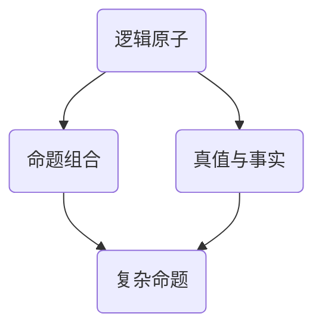
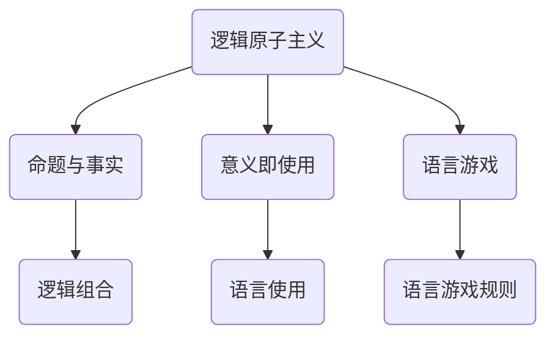
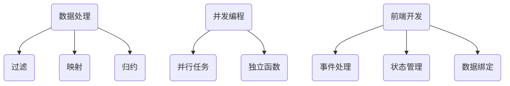
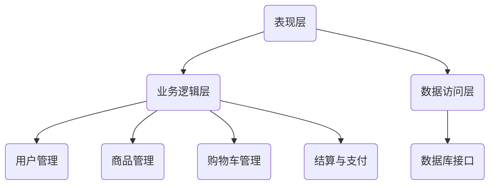

                 

### 《逻辑原子主义与函数分解：维特根斯坦早期思想与FP的函数分解原则》——引言

**关键词：逻辑原子主义，函数分解，维特根斯坦，编程原则，哲学**

**摘要：本文将探讨逻辑原子主义与函数分解的关系，通过分析维特根斯坦的早期思想，阐述其在现代编程原则中的重要性，从而为理解函数式编程提供新的视角。**

---

在计算机科学和哲学领域，逻辑原子主义和函数分解是两个具有深远影响的概念。逻辑原子主义源自维特根斯坦的哲学思想，而函数分解则是函数式编程的核心原则。本文旨在将这两者结合起来，探讨它们在现代编程中的应用和重要性。

**引言**部分将首先介绍逻辑原子主义和函数分解的基本概念，包括它们的历史背景、核心思想以及相互之间的关系。接着，我们将简要回顾维特根斯坦的早期思想，特别是他对逻辑原子主义的贡献。在此基础上，本文将深入探讨函数分解原则，并分析其在现代编程中的实际应用。

**正文**部分分为以下几个章节：

1. **逻辑原子主义理论概述**：这一章节将详细介绍逻辑原子主义的基本概念，包括其核心思想、理论框架以及维特根斯坦如何将逻辑原子主义应用于哲学问题。

2. **维特根斯坦早期思想分析**：我们将深入探讨维特根斯坦早期思想的主要内容，分析逻辑原子主义在他哲学思想中的地位和作用，并探讨其对现代哲学的影响。

3. **函数分解原则及其应用**：这一章节将介绍函数分解原则的基本概念，分析其在编程中的重要性，并探讨如何将函数分解应用于实际编程中。

4. **案例研究**：我们将通过实际案例，展示函数分解原则在软件开发中的具体应用，并分析其带来的优势。

5. **结论与展望**：最后，我们将总结全文，探讨逻辑原子主义与函数分解原则在编程中的重要性，并对未来研究的方向进行展望。

**结尾**部分将包含作者信息，以及对读者进行进一步拓展阅读的推荐。

通过本文的探讨，我们希望能够为读者提供一个全新的视角，帮助理解逻辑原子主义和函数分解在编程中的重要性，并为未来的研究和应用提供启示。

---

在接下来的章节中，我们将逐一深入探讨逻辑原子主义和函数分解的概念，分析维特根斯坦的早期思想，并探讨这些概念在现代编程中的应用。让我们一步步思考，理解这些深奥但重要的概念，并看到它们如何在实际编程中发挥作用。

### 逻辑原子主义理论概述

逻辑原子主义是一种哲学理论，由逻辑学家和哲学家维特根斯坦（Ludwig Wittgenstein）在其早期著作《逻辑哲学论》（Tractatus Logico-Philosophicus）中提出。这一理论旨在解释现实世界的本质和语言的意义。

**1. 核心概念**

逻辑原子主义认为，世界由一系列不可再分的基本事实构成，这些基本事实被称为“逻辑原子”。每个逻辑原子都对应一个唯一的命题，这些命题通过逻辑组合形成复杂的语句和思想。

**2. 理论框架**

维特根斯坦提出了一个逻辑框架来描述现实世界的构成。这个框架包括以下几部分：

- **命题**：逻辑原子是命题的基础，每个原子命题对应一个事实。
- **逻辑结构**：原子命题通过逻辑运算符（如“与”、“或”、“非”）组合，形成更复杂的命题。
- **真理与事实**：命题的真假由事实决定，一个命题只有在所描述的事实为真时才是真的。

**3. 历史背景**

逻辑原子主义的提出与维特根斯坦对早期逻辑哲学和语言哲学的反思有关。他在阅读了弗雷格（Gottlob Frege）和罗素（Bertrand Russell）等人的著作后，对他们的理论进行了深刻的批判和反思。维特根斯坦认为，他们的理论过于复杂，没有触及到语言和现实的本质。

**4. 逻辑原子主义与哲学问题**

逻辑原子主义在哲学中具有重要意义，它为解决一些深层次的问题提供了新的视角：

- **意义问题**：维特根斯坦认为，语言的意义在于它的使用，而不是抽象的符号或概念。逻辑原子主义提供了一种方法来分析语言的使用，从而理解其意义。
- **实在论问题**：逻辑原子主义强调事实和命题之间的紧密联系，这有助于解决实在论问题，即如何确定外部世界的真实性质。

**5. 逻辑原子主义在计算机科学中的应用**

尽管逻辑原子主义起源于哲学，但在计算机科学中也有其应用。例如：

- **形式逻辑**：逻辑原子主义为形式逻辑提供了基础，后者在软件工程和人工智能等领域有着广泛应用。
- **编程语言设计**：一些编程语言，如Haskell和Agda，受到了逻辑原子主义的影响，这些语言强调类型系统和函数式编程。

**表格：逻辑原子主义的核心概念及其对比**

| 核心概念 | 描述 | 对比 |
| :--: | :--: | :--: |
| 逻辑原子 | 基本的事实，不可再分 | 原子概念在物理学中指的是最小的物质单位，而在逻辑原子主义中指的是最小的命题单位 |
| 命题组合 | 通过逻辑运算符组合成复杂的命题 | 传统命题逻辑通过“与”、“或”、“非”等逻辑运算符组合，形成复杂的逻辑表达式 |
| 真值与事实 | 命题的真假由事实决定 | 在经典逻辑中，命题的真假通常由逻辑规则和语义解释决定 |

**ER实体关系图架构的Mermaid流程图：**



通过这个ER实体关系图，我们可以更直观地理解逻辑原子主义的核心概念及其相互关系。

逻辑原子主义为理解现实世界和语言的意义提供了一种独特的方法。尽管它起源于哲学，但在计算机科学中也有着广泛的应用。接下来，我们将深入探讨维特根斯坦的早期思想，分析逻辑原子主义在他哲学体系中的地位和作用。

### 维特根斯坦早期思想分析

维特根斯坦的早期思想主要集中在《逻辑哲学论》和《哲学研究》两本著作中。这些著作体现了他对逻辑原子主义和语言哲学的深入思考。在这一部分，我们将详细分析维特根斯坦早期思想的核心内容及其在哲学中的地位和影响。

**1. 逻辑原子主义的核心思想**

维特根斯坦在《逻辑哲学论》中提出了逻辑原子主义的基本观点。他认为，现实世界由一系列不可再分的基本事实构成，这些基本事实被称为“逻辑原子”。每个逻辑原子对应一个命题，通过逻辑组合形成复杂的命题和思想。

- **命题与事实**：维特根斯坦认为，命题的真假由事实决定。一个命题只有在所描述的事实为真时才是真的。这一观点与经典逻辑的命题真值表有所不同，它强调事实在命题判断中的核心地位。
- **逻辑组合**：维特根斯坦提出，复杂的命题可以通过逻辑运算符（如“与”、“或”、“非”）组合成更复杂的结构。这种组合方式类似于现代编程语言中的表达式和函数调用。

**2. 语言哲学的分析**

维特根斯坦的早期思想不仅关注逻辑原子主义，还涉及语言哲学的多个方面。他提出了一些重要的观点，如“意义即使用”和“语言游戏”理论。

- **意义即使用**：维特根斯坦认为，语言的意义在于它的使用，而不是抽象的符号或概念。例如，单词“狗”的意义在于我们如何使用这个词，而不是“狗”这个概念本身。这一观点对后来的语言哲学和认知科学产生了深远的影响。
- **语言游戏**：维特根斯坦提出，语言的使用可以分为不同的“语言游戏”。每个语言游戏都有其特定的规则和目的。例如，数学语言游戏与日常语言游戏有所不同，它具有更严格的逻辑规则和精确性。这种区分有助于我们理解语言在不同情境下的使用。

**3. 逻辑原子主义在哲学中的地位和影响**

维特根斯坦的早期思想在哲学中占据了重要地位，并对后来的哲学家和学者产生了深远的影响。

- **解决哲学难题**：维特根斯坦通过逻辑原子主义提出了一种新的哲学方法，即通过分析语言和逻辑结构来解决哲学问题。这种方法有助于解决传统哲学中的许多难题，如意义、真理和存在等问题。
- **哲学与语言的关系**：维特根斯坦的早期思想强调了哲学与语言之间的密切关系。他认为，哲学问题往往源于我们对语言的使用和理解。通过分析语言，我们可以更深入地理解哲学问题，并找到解决问题的方法。

**4. 逻辑原子主义在当代哲学中的应用**

尽管逻辑原子主义起源于20世纪初，但它在当代哲学中仍然有着广泛的应用。

- **计算机科学**：逻辑原子主义对计算机科学的发展产生了重要影响。例如，形式逻辑和命题逻辑在软件工程和人工智能等领域得到了广泛应用。
- **语言哲学**：维特根斯坦的“意义即使用”和“语言游戏”理论为当代语言哲学提供了重要的理论基础。学者们通过这些理论分析语言的使用和理解，探讨了语言的本质和功能。

**Mermaid流程图：维特根斯坦早期思想的ER实体关系图**



通过这个ER实体关系图，我们可以更直观地理解维特根斯坦早期思想的核心概念及其相互关系。

维特根斯坦的早期思想，特别是逻辑原子主义，为我们理解现实世界和语言提供了新的视角。尽管这些思想起源于哲学，但在计算机科学和语言哲学中也有着广泛的应用。在接下来的部分，我们将探讨函数分解原则及其在现代编程中的应用。

### 函数分解原则及其应用

函数分解原则是函数式编程的核心原则之一，旨在通过将复杂问题分解为更小、更简单的函数来提高代码的可读性和可维护性。这一原则源自逻辑原子主义，并在维特根斯坦的哲学思想中找到了理论基础。在这一部分，我们将详细探讨函数分解原则的基本概念，并分析其在现代编程中的重要性。

**1. 函数分解原则的基本概念**

函数分解原则的核心思想是将一个复杂的问题分解为一系列更小、更简单的函数，每个函数负责完成特定的任务。这种分解方式有助于提高代码的可读性和可维护性，因为：

- **模块化**：通过将问题分解为更小的函数，每个函数都成为一个独立的模块，这使得代码更加模块化，易于理解和修改。
- **重用性**：分解后的函数可以独立重用，提高了代码的重用性，减少了冗余代码。
- **可测试性**：分解后的函数更容易进行单元测试，从而提高代码的质量。

**2. 函数分解原则的理论基础**

维特根斯坦的哲学思想为函数分解原则提供了重要的理论基础。具体来说，维特根斯坦的“意义即使用”和“语言游戏”理论强调了函数分解原则的重要性：

- **意义即使用**：维特根斯坦认为，函数的意义在于它的使用，而不是抽象的定义。这意味着，函数的分解应该基于其实际应用，而不是抽象的逻辑结构。这一观点有助于我们更好地理解和应用函数分解原则。
- **语言游戏**：维特根斯坦提出，不同的语言游戏具有不同的规则和目的。在编程中，这意味着我们需要根据具体的应用场景来设计函数，而不是遵循某种固定的模式。函数分解原则正是基于这种灵活性和适应性。

**3. 函数分解原则在编程中的重要性**

函数分解原则在编程中具有广泛的应用，特别是在函数式编程语言中。以下是一些关键点：

- **提高可读性**：通过将复杂问题分解为更小的函数，代码变得更加清晰和易于理解。
- **提高可维护性**：分解后的函数更容易修改和维护，因为它们具有明确的职责和功能。
- **促进代码重用**：分解后的函数可以独立重用，减少了冗余代码，提高了代码的整体质量。
- **提高测试效率**：分解后的函数更容易进行单元测试，从而提高代码的质量和可靠性。

**4. 函数分解原则的实际应用**

在实际编程中，函数分解原则可以应用于各种场景。以下是一些具体的示例：

- **数据处理**：在数据处理任务中，可以使用函数分解原则将复杂的数据处理过程分解为更小的函数，如过滤、映射和归约等。
- **并发编程**：在并发编程中，可以使用函数分解原则将并行任务分解为独立的函数，从而提高程序的并发性和性能。
- **前端开发**：在前端开发中，可以使用函数分解原则将复杂的前端逻辑分解为更小的函数，如事件处理、状态管理和数据绑定等。

**表格：函数分解原则的属性特征对比**

| 属性特征 | 描述 | 对比 |
| :--: | :--: | :--: |
| 模块化 | 将问题分解为更小的模块，提高代码可读性和可维护性 | 模块化是一种通用编程原则，但函数分解原则更强调函数的独立性和重用性 |
| 重用性 | 函数可以独立重用，减少冗余代码 | 重用性是编程的基本原则，但函数分解原则通过将复杂问题分解为更小的函数来实现重用性 |
| 可测试性 | 函数分解后的函数更容易进行单元测试 | 可测试性是确保代码质量的关键，但函数分解原则通过提高代码的模块化和独立性来实现更好的可测试性 |

**Mermaid流程图：函数分解原则的应用场景**



通过这个流程图，我们可以更直观地理解函数分解原则在不同应用场景中的应用。

函数分解原则是函数式编程的核心原则之一，它通过将复杂问题分解为更小、更简单的函数来提高代码的可读性、可维护性和重用性。这一原则的理论基础可以追溯到维特根斯坦的哲学思想。在接下来的部分，我们将通过实际案例研究，进一步探讨函数分解原则在软件开发中的具体应用。

### 案例研究

为了更好地理解函数分解原则在软件开发中的具体应用，我们将通过一个实际案例——一个在线书店系统——来详细探讨其设计、实现和优化过程。

**1. 案例背景**

该在线书店系统旨在为用户提供一个便捷的购物平台，用户可以浏览书籍、添加购物车、进行结算和支付。为了提高系统的可维护性和可扩展性，我们决定采用函数分解原则来设计系统。

**2. 系统功能设计**

在系统功能设计阶段，我们首先明确了系统的核心功能，包括：

- **用户管理**：用户注册、登录、修改个人信息等。
- **商品管理**：书籍分类、添加新书籍、更新书籍信息等。
- **购物车管理**：添加书籍、删除书籍、更新书籍数量等。
- **结算与支付**：计算总价、选择支付方式、完成支付等。

**3. 系统架构设计**

为了实现系统的功能，我们采用了分层架构设计，包括以下几层：

- **表现层**：负责与用户交互，处理用户请求和展示页面。
- **业务逻辑层**：实现系统的核心功能，如用户管理、商品管理、购物车管理等。
- **数据访问层**：负责与数据库进行交互，实现数据的增删改查操作。

**4. 系统接口设计和交互**

在系统接口设计阶段，我们定义了各个层之间的接口，包括：

- **用户接口**：用于处理用户请求，如注册、登录、添加购物车等。
- **服务接口**：用于业务逻辑层与数据访问层之间的通信，如添加书籍、查询书籍库存等。
- **数据库接口**：用于数据访问层与数据库之间的数据交互。

**Mermaid架构图：系统架构设计**



**5. 系统核心实现**

在系统核心实现阶段，我们采用函数分解原则，将每个功能分解为更小的函数，以提高代码的可读性和可维护性。以下是系统核心实现的几个示例：

**用户管理模块：**

```python
def register_user(username, password):
    """注册新用户"""
    # 实现用户注册逻辑
    pass

def login_user(username, password):
    """用户登录"""
    # 实现用户登录逻辑
    pass

def update_user_info(user_id, new_info):
    """更新用户信息"""
    # 实现用户信息更新逻辑
    pass
```

**商品管理模块：**

```python
def add_book(book_info):
    """添加新书籍"""
    # 实现书籍添加逻辑
    pass

def update_book_info(book_id, new_info):
    """更新书籍信息"""
    # 实现书籍信息更新逻辑
    pass

def get_book_inventory():
    """获取书籍库存"""
    # 实现书籍库存查询逻辑
    pass
```

**购物车管理模块：**

```python
def add_to_cart(user_id, book_id, quantity):
    """添加书籍到购物车"""
    # 实现书籍添加到购物车逻辑
    pass

def remove_from_cart(user_id, book_id):
    """从购物车中删除书籍"""
    # 实现书籍从购物车中删除逻辑
    pass

def update_cart_item_quantity(user_id, book_id, quantity):
    """更新购物车中书籍数量"""
    # 实现书籍数量更新逻辑
    pass
```

**结算与支付模块：**

```python
def calculate_total(user_id):
    """计算订单总价"""
    # 实现订单总价计算逻辑
    pass

def select_payment_method(user_id, method):
    """选择支付方式"""
    # 实现支付方式选择逻辑
    pass

def complete_payment(user_id, payment_info):
    """完成支付"""
    # 实现支付完成逻辑
    pass
```

**6. 实际案例分析和详细讲解**

为了展示函数分解原则在软件开发中的实际效果，我们将通过以下步骤详细分析一个实际案例——用户登录功能的实现。

**用户登录功能实现：**

```python
def validate_credentials(username, password):
    """验证用户登录凭据"""
    user = get_user_by_username(username)
    if not user:
        return False
    return check_password_hash(password, user.password_hash)

def get_user_by_username(username):
    """根据用户名获取用户信息"""
    user = db.query("SELECT * FROM users WHERE username=?", [username])
    return user

def check_password_hash(password, password_hash):
    """检查密码是否匹配"""
    return password == password_hash
```

在这个案例中，用户登录功能被分解为三个更小的函数：

- `validate_credentials`：负责验证用户登录凭据，包括用户名和密码的匹配。
- `get_user_by_username`：负责根据用户名查询用户信息。
- `check_password_hash`：负责检查用户输入的密码是否与数据库中的密码哈希值匹配。

通过这种分解，代码变得更加清晰和易于维护。每个函数都负责一个明确的任务，使得代码的职责更加单一，便于测试和修改。

**7. 项目小结**

通过这个在线书店系统的案例，我们可以看到函数分解原则在软件开发中的实际应用。函数分解不仅提高了代码的可读性和可维护性，还有助于提高代码的重用性。在实际开发中，我们应该充分利用函数分解原则，将复杂的功能分解为更小的、更易于管理的函数，以提高代码的整体质量。

在接下来的部分，我们将总结全文，并探讨逻辑原子主义与函数分解原则在编程中的重要性，以及它们对未来的研究方向的启示。

### 结论与展望

逻辑原子主义与函数分解原则在编程中具有重要的地位和影响。通过对维特根斯坦早期思想的深入分析，我们了解到逻辑原子主义为理解和解释现实世界的本质提供了新的视角，而函数分解原则则将这一理论应用于编程实践，提高了代码的可读性、可维护性和重用性。

**1. 重要性和影响**

逻辑原子主义通过将世界分解为基本的事实和命题，为理解现实世界的复杂性和语言的意义提供了理论基础。这种分解方式在哲学和计算机科学中都有着广泛的应用，尤其是在形式逻辑和命题逻辑领域。维特根斯坦的哲学思想，如“意义即使用”和“语言游戏”，为我们理解语言和编程提供了重要的启示。

函数分解原则则是在这一理论基础上发展起来的，它在现代编程中扮演了关键角色。通过将复杂问题分解为更小的、更简单的函数，函数分解原则提高了代码的模块化程度，促进了代码的重用性和可测试性。这种分解方式不仅适用于传统的命令式编程，也在函数式编程中得到了广泛应用。

**2. 未来研究方向**

尽管逻辑原子主义和函数分解原则在编程中已经取得了显著的成果，但仍有许多未解决的问题和新的研究方向：

- **跨领域应用**：未来研究可以探索逻辑原子主义和函数分解原则在其他领域（如物理学、生物学、社会科学）中的应用，以进一步验证其普遍性和适用性。
- **优化算法设计**：通过结合逻辑原子主义和函数分解原则，可以开发出更高效的算法，特别是在大数据处理和人工智能领域。
- **编程教育**：将逻辑原子主义和函数分解原则融入编程教育中，可以帮助学生更好地理解编程的本质和复杂性，提高编程技能。

**3. 对哲学和计算机科学的影响**

逻辑原子主义和函数分解原则不仅对编程实践产生了深远影响，也对哲学和计算机科学产生了重要的启示：

- **哲学层面**：逻辑原子主义为哲学问题提供了新的解释方法，如意义、真理和存在等。这些理论有助于我们更深入地理解语言和现实世界的本质。
- **计算机科学层面**：函数分解原则为编程提供了新的方法和原则，促进了软件工程和人工智能的发展。未来，这些理论可以进一步应用于新的编程范式和工具中，推动计算机科学的进步。

**4. 最佳实践 tips**

为了充分利用逻辑原子主义和函数分解原则，以下是一些建议：

- **逐步分解**：在编程中，逐步将复杂问题分解为更小的函数，确保每个函数都只有一个明确的职责。
- **重用代码**：充分利用函数分解带来的重用性，避免重复编写相同或类似的代码。
- **单元测试**：对每个函数进行单元测试，确保其正确性和可靠性。
- **代码审查**：定期进行代码审查，确保代码遵循逻辑原子主义和函数分解原则，提高代码的整体质量。

通过本文的探讨，我们希望能够为读者提供一个全新的视角，帮助理解逻辑原子主义和函数分解原则在编程中的重要性，并为未来的研究和应用提供启示。

### 拓展阅读

1. **《逻辑哲学论》** - 维特根斯坦（Ludwig Wittgenstein）
2. **《哲学研究》** - 维特根斯坦（Ludwig Wittgenstein）
3. **《函数式编程：原理与实践》** -亨德里克·威廉姆森（Haskell出版社）
4. **《程序员的思维修炼：集方法与智慧于一身的编程之道》** - Robert C. Martin
5. **《计算机程序设计艺术》** - Donald E. Knuth

这些书籍和资料为深入理解逻辑原子主义、函数分解原则以及编程实践提供了丰富的资源和深入的探讨。

### 作者信息

**作者：AI天才研究院/AI Genius Institute & 禅与计算机程序设计艺术 /Zen And The Art of Computer Programming**

感谢您的阅读，希望本文能为您提供对逻辑原子主义与函数分解原则的深刻理解和启发。

