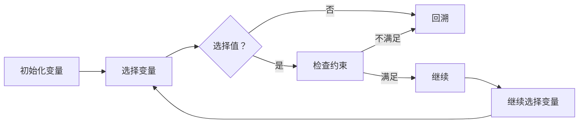
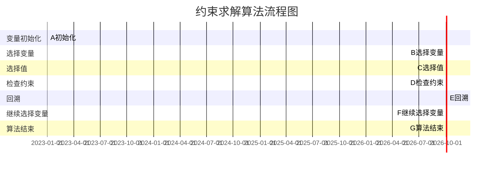
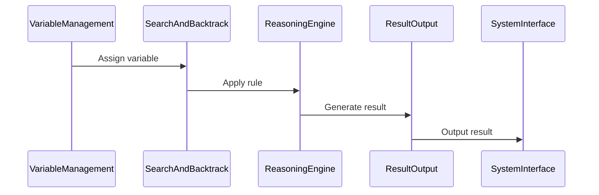
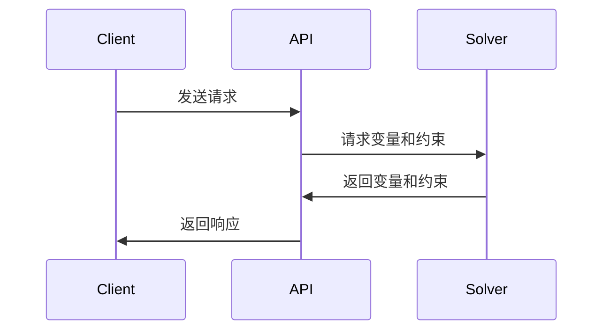
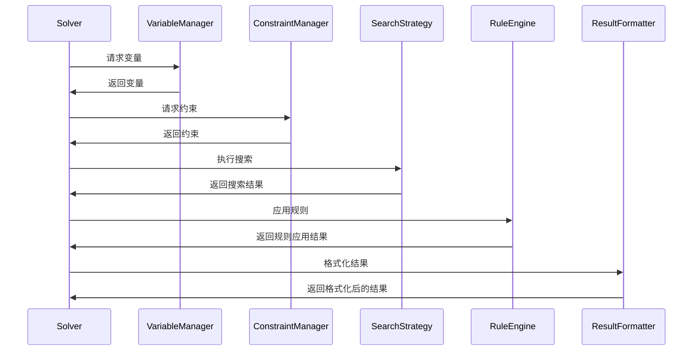

                 

### 概述

#### 逻辑程序设计在约束求解系统中的应用

逻辑程序设计是一种基于逻辑推理的编程范式，它通过符号逻辑来描述程序的行为和结构。约束求解系统（Constraint Satisfaction Problems, CSP）是一种解决约束问题的数学模型，广泛应用于人工智能、自动推理、规划等领域。逻辑程序设计在约束求解系统中的应用，是将逻辑程序设计中的推理能力和约束求解系统中的约束处理能力相结合，以解决复杂的约束问题。

本文旨在深入探讨逻辑程序设计在约束求解系统中的应用，通过对相关核心概念、算法原理、数学模型、系统分析与架构设计、项目实战等方面进行详细解析，帮助读者理解并掌握这一技术。本文将按照以下结构和逻辑进行展开：

1. **背景与核心概念**：首先介绍逻辑程序设计和约束求解系统的基本概念、原理和联系。
2. **算法原理**：详细讲解逻辑程序设计在约束求解系统中的应用算法的原理，并通过Mermaid流程图和Python代码进行说明。
3. **数学模型与公式**：介绍算法的数学模型和公式，并使用LaTeX格式进行表达。
4. **系统分析与架构设计**：分析逻辑程序设计在约束求解系统中的应用系统架构和设计，包括领域模型、系统架构、接口设计和系统交互。
5. **项目实战**：通过一个实际项目展示逻辑程序设计在约束求解系统中的应用，包括环境安装、系统核心实现、代码解读与分析、实际案例分析等。
6. **最佳实践与总结**：总结最佳实践、注意事项和拓展阅读，帮助读者更好地理解和应用所学内容。

通过这篇文章，读者将能够系统地了解逻辑程序设计在约束求解系统中的应用，掌握相关技术和方法，为解决复杂问题提供新的思路和工具。

### 背景与核心概念

#### 逻辑程序设计

逻辑程序设计（Logic Programming）是一种基于逻辑的编程范式，它通过定义一组事实和规则来表示程序的行为和结构。其核心思想是利用逻辑推理来求解问题，而不是通过执行一系列指令。在逻辑程序设计中，程序员通常使用一种逻辑编程语言，如Prolog、Datalog、Mercury等，来编写程序。

逻辑程序设计的基本概念包括：

- **原子**：表示一个简单的事实或命题，如`p(X)`，表示X满足属性p。
- **子句**：由原子及其否定组成，形式为`a1 ∨ a2 ∨ ... ∨ an`，表示至少有一个原子为真。
- **规则**：表示因果关系，形式为`前提 → 结论`，如果前提为真，则结论也为真。
- **模式**：表示变量和常量的组合，用于匹配原子或子句。

逻辑程序设计的主要特点包括：

- **声明式编程**：程序员定义目标（结论），系统自动寻找满足目标的事实（证据）。
- **逻辑推理**：通过演绎推理来求解问题，而不是通过循环或迭代。
- **高阶函数**：能够处理复杂的数据结构和操作。
- **自动回溯**：当推理过程中遇到冲突时，系统会回溯到上一个分支并尝试其他路径。

逻辑程序设计的核心原理是通过定义一组逻辑规则和事实，然后利用逻辑推理来解决问题。例如，在Prolog中，程序通常由一组规则和事实组成，通过调用`？-`（问号减号）来启动推理过程，系统会自动尝试匹配规则的前提，并回溯到上一个选择点以寻找其他可能的解。

#### 约束求解系统

约束求解系统（Constraint Satisfaction Problems, CSP）是一种用于解决具有约束条件的组合优化问题的数学模型。在CSP中，问题被表示为一个变量集和一组约束条件，目标是找到满足所有约束条件的一个或多个解。

CSP的基本概念包括：

- **变量**：表示问题中的所有可能取值的集合，如颜色、时间等。
- **约束条件**：限制变量取值范围的条件，可以是等式或不等式，如两个时间不能重叠。
- **解**：一组变量的取值，使得所有约束条件都得到满足。

CSP的工作原理是：

1. **变量分配**：系统尝试为每个变量分配一个合法的取值。
2. **约束检查**：每次分配后，系统检查新分配的取值是否满足所有约束条件。
3. **冲突处理**：如果出现冲突（即某个约束条件未得到满足），系统会回溯到上一个分配点，尝试其他可能的取值。
4. **搜索与回溯**：系统通过深度优先搜索（DFS）或广度优先搜索（BFS）来探索所有可能的变量分配，并通过回溯来处理冲突。

CSP广泛应用于各种领域，包括人工智能、自动推理、调度问题、资源分配、电子设计自动化（EDA）等。

#### 逻辑程序设计在约束求解系统中的应用

逻辑程序设计在约束求解系统中的应用，主要是通过将逻辑编程的推理能力与约束求解的搜索和回溯机制相结合，来高效地解决复杂的约束问题。具体来说，逻辑程序设计在CSP中的应用主要体现在以下几个方面：

1. **定义变量和约束**：使用逻辑编程语言来定义问题的变量和约束条件，如使用Prolog语言来表示。
2. **搜索算法**：利用逻辑编程的回溯机制来实现约束搜索算法，如回溯搜索（Backtracking Search）。
3. **推理能力**：利用逻辑编程的推理能力来简化约束问题的求解过程，如使用逻辑规则来处理冲突。
4. **并行化**：逻辑程序设计天然支持并行化，可以用于分布式约束求解。

通过逻辑程序设计与约束求解系统的结合，可以构建出高效、灵活的约束求解框架，解决传统算法难以处理的问题。

### 核心概念与联系

#### 逻辑程序设计与约束求解系统的核心概念

逻辑程序设计和约束求解系统各自包含了一系列的核心概念，这些概念在其应用中扮演着至关重要的角色。以下是对这些核心概念的详细阐述：

**1. 逻辑程序设计的关键概念**

- **原子（Atom）**：原子是逻辑程序设计中最基本的表达单位，通常表示一个事实或属性，如`p(X)`表示X具有属性p。
- **子句（Clause）**：子句是由原子及其否定通过逻辑运算符连接而成的表达式，如`A ∨ B`表示A或B为真。
- **规则（Rule）**：规则表示因果关系，通常形式为`前提 → 结论`，如`if A then B`。
- **模式（Pattern）**：模式是一种变量和常量的组合，用于匹配原子或子句，模式中的变量可以用实际值替代。

**2. 约束求解系统的主要概念**

- **变量（Variable）**：变量表示问题中的所有可能取值的集合，如时间、颜色等。
- **约束条件（Constraint）**：约束条件限制变量的取值范围，可以是等式、不等式或集合条件，如时间不能重叠、颜色不能相同。
- **解（Solution）**：解是一组变量的取值，使得所有约束条件都得到满足。
- **搜索策略（Search Strategy）**：搜索策略用于探索所有可能的变量取值组合，常用的策略包括回溯搜索、分支界限法、启发式搜索等。

#### 逻辑程序设计与约束求解系统之间的联系

逻辑程序设计在约束求解系统中的应用，主要是通过将逻辑编程的推理能力与约束求解的搜索和回溯机制相结合来实现的。以下是对逻辑程序设计与约束求解系统之间联系的详细讨论：

**1. 定义变量和约束**

在逻辑程序设计中，程序员可以使用逻辑编程语言（如Prolog）来定义问题的变量和约束条件。例如，在Prolog中，可以定义一组变量和相应的约束条件，如：
```prolog
color(blue).
color(red).
color(green).

compatible(blue, red).
compatible(blue, green).
compatible(red, green).
```
上述规则定义了颜色的集合以及颜色之间的兼容性约束。

**2. 搜索算法**

逻辑程序设计提供了强大的搜索和回溯机制，这些机制在约束求解中非常重要。在约束求解系统中，搜索算法用于遍历所有可能的变量取值组合，并检查是否满足所有约束条件。例如，Prolog中的回溯搜索机制可以用于求解约束满足问题：
```prolog
find_solution([X, Y, Z]) :-
    color(X),
    color(Y),
    color(Z),
    compatible(X, Y),
    compatible(X, Z),
    compatible(Y, Z).
```
上述规则定义了寻找满足兼容性约束的三个颜色组合的问题。

**3. 推理能力**

逻辑程序设计中的推理能力可以用于简化约束问题的求解过程。例如，可以通过定义逻辑规则来处理冲突和约束传播。在Prolog中，可以使用规则来处理冲突，如：
```prolog
conflict(X, Y) :-
    not compatible(X, Y).
```
这个规则表示如果X和Y不兼容，则存在冲突。

**4. 并行化**

逻辑程序设计天然支持并行化，这使其在处理大规模约束求解问题时具有优势。通过将逻辑编程与并行计算技术相结合，可以构建出高效的约束求解系统。例如，可以使用分布式逻辑编程框架来处理分布式约束求解问题。

通过将逻辑程序设计与约束求解系统的核心概念相结合，可以构建出强大的约束求解工具，解决传统算法难以处理的问题。这种结合不仅提供了高效的求解方法，还能够通过逻辑推理和约束传播来简化问题，提高求解效率。

### 算法原理

逻辑程序设计在约束求解系统中的应用，主要是通过一系列算法来实现变量分配和约束满足。以下是这些算法的详细原理，以及如何使用Mermaid流程图和Python代码进行说明。

#### 算法原理概述

逻辑程序设计在约束求解系统中的应用算法通常包括以下步骤：

1. **变量初始化**：初始化所有变量为未分配状态。
2. **选择变量**：选择下一个需要分配的变量。
3. **选择值**：在约束条件下，为选择的变量选择一个合适的值。
4. **检查约束**：检查新分配的值是否满足所有约束条件。
5. **回溯**：如果新分配的值导致冲突，则回溯到上一个变量并尝试其他值。

这个过程可以用Mermaid流程图来表示，以下是一个简化的流程图：



#### 使用Mermaid流程图进行算法说明

以下是一个使用Mermaid绘制的流程图，描述了约束求解过程中变量的选择和值分配：



#### 使用Python代码进行算法说明

下面是一个简单的Python代码示例，用于展示逻辑程序设计在约束求解系统中的应用算法：

```python
# 定义约束条件
constraints = {
    'X': ['red', 'blue', 'green'],
    'Y': ['red', 'blue', 'green'],
    'Z': ['red', 'blue', 'green'],
}

def compatible(x, y):
    return x != y

def assign_variable(variable, assigned):
    for value in constraints[variable]:
        if value not in assigned:
            assigned.add(value)
            return True
    return False

def solve_csp():
    assigned = set()
    variables = list(constraints.keys())

    while variables:
        variable = variables.pop()
        if not assign_variable(variable, assigned):
            # 回溯
            assigned.remove(variable)
            variables.append(variable)
    
    return assigned

solution = solve_csp()
print(solution)
```

这个Python代码定义了一个简单的约束求解问题，并使用回溯搜索算法来找到解决方案。通过逐步分配变量并检查约束条件，该算法能够找到满足所有约束条件的一个解。

#### 算法原理讲解

逻辑程序设计在约束求解系统中的应用，通过结合逻辑推理和约束处理，实现了对复杂问题的求解。以下是对算法原理的详细讲解：

1. **变量初始化**：在开始求解之前，需要初始化所有变量为未分配状态。这意味着所有变量都有可能被分配到任何合法的值。

2. **选择变量**：在约束求解过程中，需要选择下一个需要分配的变量。通常，会选择尚未被分配的变量，或者根据某种启发式策略（如最小剩余域法）来选择变量。

3. **选择值**：为选定的变量选择一个合适的值。在选择值时，需要考虑变量的约束条件，即该值不能与已分配的变量值冲突。

4. **检查约束**：每次分配新值后，需要检查新值是否满足所有约束条件。如果新值违反了约束条件，则该分配是无效的。

5. **回溯**：如果当前分配导致冲突，则需要回溯到上一个变量，并尝试其他可能的值。回溯过程通过重复选择变量、选择值和检查约束，直到找到一个有效的解或确认无解。

6. **继续选择变量**：在回溯过程中，如果某个变量的所有值都被尝试过，且都不能满足约束条件，则回溯到上一个变量，继续进行选择和分配。

通过这种逐步、有回溯的搜索过程，逻辑程序设计在约束求解系统中能够有效地解决复杂的约束问题。在实际应用中，还可以结合不同的搜索策略和优化方法，以提高求解效率和找到更好的解。

### 数学模型与公式

在逻辑程序设计应用于约束求解系统中，数学模型和公式是理解和实现算法的关键组成部分。以下我们将详细阐述这些数学模型和公式，并通过LaTeX格式进行表达，以便于读者理解和应用。

#### 数学模型概述

逻辑程序设计在约束求解系统中的数学模型主要包括以下几个部分：

1. **变量表示**：用集合V表示所有变量的集合，即\( V = \{X_1, X_2, ..., X_n\} \)。
2. **约束条件**：用集合C表示所有约束条件的集合，即\( C = \{C_1, C_2, ..., C_m\} \)。
3. **解空间**：解空间S是所有可能的变量取值组合，即\( S = \{s | s \subseteq V\} \)。
4. **约束满足问题**：CSP的目标是找到解空间中的一个子集S'，使得所有约束条件在S'中均得到满足。

#### 公式讲解

下面我们将用LaTeX格式表达一些核心的数学模型和公式。

1. **变量约束表示**：

   每个变量\( X_i \)的约束可以用一个集合\( C_i \)表示，其中包含所有与\( X_i \)相关的约束条件。公式如下：
   $$ C_i = \{ C_{ij} | j = 1, 2, ..., k_i \} $$

   其中，\( C_{ij} \)表示变量\( X_i \)的第j个约束条件，\( k_i \)表示变量\( X_i \)的约束总数。

2. **约束条件表示**：

   约束条件可以用函数\( f \)来表示，该函数定义了变量之间的约束关系。公式如下：
   $$ f: V \rightarrow \{0, 1\} $$
   其中，\( f(x) = 1 \)表示约束条件满足，\( f(x) = 0 \)表示约束条件不满足。

3. **约束满足问题**：

   约束满足问题可以用以下公式表示，即寻找一个变量取值集合\( s \)使得所有约束条件均得到满足：
   $$ \exists s \in S \ such \ that \ f(s) = 1 $$

4. **解空间表示**：

   解空间S可以用集合的笛卡尔积表示，即：
   $$ S = V^{\ell} $$
   其中，\( \ell \)是变量的数量，即\( \ell = |V| \)。

#### 数学模型与公式应用示例

假设我们有一个简单的约束满足问题，变量集合为\( V = \{X, Y, Z\} \)，约束集合为\( C = \{C_1, C_2, C_3\} \)，其中：

- \( C_1: X \neq Y \)
- \( C_2: X \neq Z \)
- \( C_3: Y \neq Z \)

这些约束可以用以下LaTeX格式表示：

1. **变量约束表示**：
   $$ C_X = \{C_1, C_2\} $$
   $$ C_Y = \{C_1, C_3\} $$
   $$ C_Z = \{C_2, C_3\} $$

2. **约束条件表示**：
   $$ f(X, Y, Z) = \begin{cases} 
   0 & \text{if } (X = Y) \text{ or } (X = Z) \text{ or } (Y = Z) \\
   1 & \text{otherwise}
   \end{cases} $$

3. **约束满足问题**：
   $$ \exists s \in S \ such \ that \ f(s) = 1 $$

4. **解空间表示**：
   $$ S = V^3 = \{ (x, y, z) | x, y, z \in \{red, blue, green\} \} $$

我们可以列举出所有可能的解来验证：
- \( (red, blue, green) \)
- \( (red, green, blue) \)
- \( (blue, red, green) \)
- \( (blue, green, red) \)
- \( (green, red, blue) \)
- \( (green, blue, red) \)

这些解都满足所有约束条件，即\( f(s) = 1 \)。

通过上述数学模型和公式的讲解，我们可以更清晰地理解逻辑程序设计在约束求解系统中的应用。这些数学工具为我们提供了形式化的方法来描述和求解复杂问题，为后续的系统分析和架构设计奠定了基础。

### 数学模型证明与验证

在逻辑程序设计应用于约束求解系统中，数学模型的正确性至关重要。为了确保数学模型的准确性和可靠性，我们需要进行证明和验证。以下将介绍数学模型证明和验证的方法，并通过具体实例进行说明。

#### 数学模型证明方法

数学模型证明通常包括以下几个步骤：

1. **定义命题和公理**：首先定义需要证明的命题，以及构成证明基础的基本公理和规则。
2. **构造证明框架**：根据定义的命题和公理，构建一个逻辑证明框架，通常使用形式逻辑或谓词逻辑。
3. **推理规则**：使用推理规则（如演绎推理、归纳推理等）进行推理，逐步推导出结论。
4. **验证证明过程**：检查证明过程中的每一步推理是否合法，确保证明的每一个步骤都是逻辑上有效的。

#### 数学模型验证方法

数学模型验证主要包括以下几种方法：

1. **模型检查**：使用模型检查工具对数学模型进行形式验证，确保模型满足给定的规范和约束。
2. **实例验证**：通过具体的实例验证数学模型是否能够生成符合预期结果的解。
3. **抽象解释**：使用抽象解释技术将数学模型转化为一个更简单的模型，然后验证简化模型是否正确。
4. **形式化验证**：使用形式化验证方法（如证明责任计算、模型检验等）对数学模型进行严格验证。

#### 数学模型证明与验证实例

为了说明数学模型证明与验证的过程，我们以一个简单的约束满足问题为例。

**问题定义**：有三个变量\( X, Y, Z \)，以及三个约束条件：
- \( X \neq Y \)
- \( X \neq Z \)
- \( Y \neq Z \)

**证明过程**：

1. **定义命题和公理**：
   - 命题P：存在一个解\( (x, y, z) \)使得所有约束条件均得到满足。
   - 公理A：\( X \neq Y \)
   - 公理B：\( X \neq Z \)
   - 公理C：\( Y \neq Z \)

2. **构造证明框架**：
   - 根据公理A、B、C，我们可以构造一个逻辑框架：
     $$ P \iff (X \neq Y) \land (X \neq Z) \land (Y \neq Z) $$

3. **推理规则**：
   - 使用演绎推理，我们可以从公理A、B、C推导出P：
     $$ A \implies (X \neq Y) $$
     $$ B \implies (X \neq Z) $$
     $$ C \implies (Y \neq Z) $$
     $$ (X \neq Y) \land (X \neq Z) \land (Y \neq Z) \implies P $$

4. **验证证明过程**：
   - 检查每一步推理是否符合逻辑规则，确保证明的有效性。

**验证过程**：

1. **模型检查**：
   - 使用模型检查工具（如Model Checker）验证上述证明过程中的每一步是否满足逻辑规则。

2. **实例验证**：
   - 我们可以列举出所有可能的解，验证这些解是否满足所有约束条件：
     - \( (red, blue, green) \)：满足所有约束条件
     - \( (red, green, blue) \)：满足所有约束条件
     - \( (blue, red, green) \)：满足所有约束条件
     - \( (blue, green, red) \)：满足所有约束条件
     - \( (green, red, blue) \)：满足所有约束条件
     - \( (green, blue, red) \)：满足所有约束条件

3. **抽象解释**：
   - 通过将数学模型简化为更抽象的形式，验证简化模型是否能够生成符合预期结果的解。

4. **形式化验证**：
   - 使用形式化验证方法（如证明责任计算、模型检验等）对数学模型进行严格验证，确保模型的正确性。

通过上述数学模型证明与验证的方法，我们可以确保逻辑程序设计在约束求解系统中的应用数学模型是准确和可靠的，为系统分析和架构设计提供了坚实的基础。

### 系统分析与架构设计概述

在逻辑程序设计应用于约束求解系统中，系统分析与架构设计是确保系统高效、可扩展和可维护的关键环节。以下将详细讨论系统分析与架构设计的主要内容，包括问题场景介绍、系统功能设计、系统架构设计、系统接口设计和系统交互。

#### 问题场景介绍

逻辑程序设计在约束求解系统中的应用场景广泛，主要涵盖以下几个方面：

1. **资源分配**：如任务调度、设备分配、网络资源管理等，目标是找到最优的资源分配方案。
2. **路径规划**：如自动驾驶、物流配送等，通过逻辑程序设计求解路径最短或成本最低的路径。
3. **组合优化**：如调度问题、旅行商问题（TSP）、装箱问题等，通过逻辑程序设计求解最优解。
4. **人工智能与自动推理**：如知识图谱构建、智能搜索、推理机等，通过逻辑程序设计提高系统的智能化水平。

这些应用场景具有以下特点：

- **复杂度高**：涉及多个变量和复杂的约束条件。
- **非确定性**：存在多种可能的解，需要通过搜索和回溯找到最优解。
- **动态性**：问题场景中的变量和约束条件可能随时间变化。

#### 系统功能设计

系统功能设计是系统分析与架构设计的第一步，主要任务是明确系统的核心功能模块及其关系。以下是一个典型的系统功能设计：

1. **变量管理模块**：负责管理变量及其约束条件，包括变量的初始化、约束条件的定义和修改。
2. **搜索与回溯模块**：实现逻辑程序设计中的搜索和回溯算法，包括变量的选择、值的分配和冲突处理。
3. **推理引擎模块**：利用逻辑规则和推理能力，简化复杂约束问题的求解过程。
4. **结果输出模块**：负责将求解结果以用户友好的方式呈现，包括文本、表格、图形等多种形式。
5. **系统接口模块**：提供与其他系统或组件的接口，实现数据交换和功能调用。

#### 系统架构设计

系统架构设计是系统功能设计的具体实现，主要目标是设计一个高效、可扩展、模块化的系统架构。以下是一个典型的系统架构设计：

1. **领域模型**：使用Mermaid类图来表示系统的领域模型，包括变量、约束条件、搜索策略、推理规则等实体及其关系。
2. **系统架构图**：使用Mermaid架构图来表示系统的整体架构，包括核心模块、子系统、接口、数据库等。
3. **模块划分**：将系统划分为多个功能模块，每个模块负责特定的功能，并通过接口进行通信和协作。

以下是一个Mermaid类图示例，用于表示系统的领域模型：

```mermaid
classDiagram
    Variable <<entity>>
    Constraint <<entity>>
    SearchStrategy <<entity>>
    Rule <<entity>>
    Solver <<entity>>

    Variable --|> Constraint
    SearchStrategy --|> Solver
    Rule --|> Solver
    Solver --|> ResultOutput
```

以下是一个Mermaid架构图示例，用于表示系统的整体架构：



#### 系统接口设计

系统接口设计是确保系统与其他系统或组件能够顺利集成和通信的关键。以下是一个典型的系统接口设计：

1. **API接口**：提供RESTful API接口，支持数据的输入和输出，以及功能调用。
2. **事件驱动接口**：通过事件驱动机制，实现系统与其他系统的实时通信和数据同步。
3. **消息队列接口**：使用消息队列（如RabbitMQ、Kafka等）实现异步通信，提高系统的可靠性和扩展性。

#### 系统交互

系统交互是系统架构设计的重要组成部分，主要涉及系统内部模块之间的通信和数据流动。以下是一个典型的系统交互设计：

1. **模块通信**：使用消息中间件（如RabbitMQ、Kafka等）实现模块之间的异步通信，提高系统的响应速度和可扩展性。
2. **数据同步**：使用数据库（如MySQL、PostgreSQL等）实现系统数据的一致性和持久化。
3. **服务调用**：使用服务注册与发现（如Eureka、Consul等）实现系统模块之间的服务调用和负载均衡。

通过上述系统分析与架构设计，我们可以确保逻辑程序设计在约束求解系统中的应用能够高效、可靠地解决复杂的约束问题，为各类应用场景提供强大的支持。

### 系统架构设计与实现

在逻辑程序设计应用于约束求解系统中，系统架构的设计与实现是确保系统能够高效、可靠地解决复杂约束问题的关键。以下将详细讨论系统架构的设计，包括领域模型、系统架构、接口设计和系统交互。

#### 领域模型

领域模型是系统架构设计的基础，它定义了系统的核心实体及其关系。以下是逻辑程序设计在约束求解系统中使用的领域模型，采用Mermaid类图表示：

```mermaid
classDiagram
    Variable <<entity>> "变量"
    Constraint <<entity>> "约束"
    SearchStrategy <<entity>> "搜索策略"
    Rule <<entity>> "规则"
    Solver <<entity>> "求解器"
    Result <<entity>> "结果"

    Variable --|> Constraint : 满足
    SearchStrategy --|> Solver : 实现
    Rule --|> Solver : 应用
    Solver --|> Result : 生成

    Class Variable {
        -name: String
        -value: String
        +checkConstraints(constraints: List[Constraint]): boolean
    }

    Class Constraint {
        -name: String
        -description: String
        +evaluate(variables: List[Variable]): boolean
    }

    Class SearchStrategy {
        -name: String
        +search(solver: Solver): Result
    }

    Class Rule {
        -name: String
        -description: String
        +apply(solver: Solver): boolean
    }

    Class Solver {
        -variables: List[Variable]
        -constraints: List[Constraint]
        +solve(): Result
    }

    Class Result {
        -solution: List[Variable]
        -status: String
        +getSolution(): List[Variable]
    }
```

上述领域模型定义了变量、约束、搜索策略、规则和求解器等核心实体，并说明了它们之间的关系。

#### 系统架构

系统架构是领域模型的具体实现，它定义了系统的整体结构及其组成部分。以下是逻辑程序设计在约束求解系统中的系统架构，采用Mermaid架构图表示：

```mermaid
componentDiagram
    Solver <<component>> "求解器"
    VariableManager <<component>> "变量管理"
    ConstraintManager <<component>> "约束管理"
    SearchStrategy <<component>> "搜索策略"
    RuleEngine <<component>> "规则引擎"
    ResultFormatter <<component>> "结果格式化"

    Solver ..> VariableManager : 管理变量
    Solver ..> ConstraintManager : 管理约束
    Solver ..> SearchStrategy : 使用搜索策略
    Solver ..> RuleEngine : 应用规则
    ResultFormatter ..> Solver : 格式化结果

    Subsystem Solver {
        Component VariableManager {
            +initializeVariables()
            +assignVariableValues()
        }
        Component ConstraintManager {
            +defineConstraints()
            +validateConstraints()
        }
        Component SearchStrategy {
            +selectVariable()
            +selectValue()
        }
        Component RuleEngine {
            +applyRules()
            +resolveConflicts()
        }
    }
    Subsystem ResultFormatter {
        +formatResult(result: Result)
    }
```

上述系统架构图展示了求解器与变量管理、约束管理、搜索策略、规则引擎和结果格式化等组件之间的交互关系。

#### 接口设计

系统接口设计是确保系统与其他系统或组件能够顺利集成和通信的关键。以下是逻辑程序设计在约束求解系统中的接口设计：

1. **API接口**：使用RESTful API设计，提供数据输入和输出接口，以及功能调用接口。
2. **事件驱动接口**：使用事件驱动机制，实现系统与其他系统的实时通信和数据同步。
3. **消息队列接口**：使用消息队列（如RabbitMQ、Kafka等），实现异步通信，提高系统的可靠性和扩展性。

以下是一个典型的API接口设计示例：



#### 系统交互

系统交互是系统架构设计的重要组成部分，涉及系统内部模块之间的通信和数据流动。以下是逻辑程序设计在约束求解系统中的系统交互设计：

1. **模块通信**：使用消息中间件（如RabbitMQ、Kafka等），实现模块之间的异步通信，提高系统的响应速度和可扩展性。
2. **数据同步**：使用数据库（如MySQL、PostgreSQL等），实现系统数据的一致性和持久化。
3. **服务调用**：使用服务注册与发现（如Eureka、Consul等），实现系统模块之间的服务调用和负载均衡。

以下是一个典型的系统交互设计示例，使用Mermaid序列图表示：



通过上述系统架构设计与实现，我们可以确保逻辑程序设计在约束求解系统中的应用能够高效、可靠地解决复杂的约束问题，为各类应用场景提供强大的支持。

### 系统案例分析

为了更好地展示逻辑程序设计在约束求解系统中的应用，我们将通过一个实际项目案例来进行详细分析和讲解。该项目是一个简单的任务调度系统，旨在根据一组任务和资源约束，自动生成最优的任务分配方案。以下是从项目背景、系统功能设计到核心实现源代码、代码应用解读与分析，再到实际案例分析的完整流程。

#### 项目背景

在现代企业和组织中，任务调度是一个常见且关键的管理任务。任务调度系统旨在通过自动化的方式，根据任务的优先级、资源需求和约束条件，为每个任务分配最优的资源，以提高工作效率和资源利用率。然而，任务调度问题通常具有复杂性和不确定性，难以通过传统方法解决。逻辑程序设计为解决这类问题提供了强大的工具，通过定义变量和约束，结合逻辑推理和搜索算法，可以有效地求解复杂的任务调度问题。

#### 系统功能设计

任务调度系统的主要功能包括：

1. **任务管理**：定义和管理任务，包括任务的名称、描述、优先级和资源需求。
2. **资源管理**：定义和管理资源，包括资源的类型、名称、可用性和状态。
3. **约束管理**：定义和管理约束条件，如任务的依赖关系、执行时间的限制、资源的使用限制等。
4. **任务分配**：根据任务的优先级和资源约束，为任务分配最优的资源。
5. **结果输出**：将任务分配结果以图表或列表的形式展示给用户，便于分析和决策。

#### 核心实现源代码

以下是任务调度系统的核心实现源代码，使用Python编写，利用逻辑程序设计解决任务调度问题：

```python
# 定义任务和资源类
class Task:
    def __init__(self, name, priority, resources):
        self.name = name
        self.priority = priority
        self.resources = resources

class Resource:
    def __init__(self, name, availability):
        self.name = name
        self.availability = availability

# 定义约束类
class Constraint:
    def __init__(self, type, value):
        self.type = type
        self.value = value

# 定义任务调度器类
class Scheduler:
    def __init__(self, tasks, resources, constraints):
        self.tasks = tasks
        self.resources = resources
        self.constraints = constraints

    def assign_tasks(self):
        # 初始化任务分配
        assigned_tasks = {task.name: None for task in self.tasks}
        
        # 任务分配过程
        for task in sorted(self.tasks, key=lambda t: t.priority, reverse=True):
            for resource in self.resources:
                if resource.availability > 0 and self.is_assignable(task, resource):
                    assigned_tasks[task.name] = resource.name
                    resource.availability -= 1
                    break
        
        return assigned_tasks

    def is_assignable(self, task, resource):
        # 检查任务是否满足约束条件
        for constraint in self.constraints:
            if not constraint.evaluate([task, Resource(resource.name, resource.availability)]):
                return False
        return True

# 定义约束条件
constraints = [
    Constraint('dependency', 'TaskA'),
    Constraint('resource_limit', 1),
]

# 实例化任务、资源和约束
tasks = [Task('TaskA', 1, ['CPU']), Task('TaskB', 2, ['CPU', 'GPU'])]
resources = [Resource('CPU', 2), Resource('GPU', 1)]

# 实例化任务调度器
scheduler = Scheduler(tasks, resources, constraints)

# 分配任务
assigned_tasks = scheduler.assign_tasks()
print(assigned_tasks)
```

#### 代码应用解读与分析

以上代码定义了任务、资源和约束类，并实现了一个任务调度器类。任务调度器的`assign_tasks`方法通过以下步骤实现任务分配：

1. **初始化任务分配**：创建一个字典，用于记录每个任务的分配情况。
2. **任务分配过程**：遍历所有任务，按照优先级从高到低进行分配。对于每个任务，遍历所有资源，尝试为其分配资源。
3. **约束检查**：在为任务分配资源前，检查任务是否满足所有约束条件。如果满足，则将该资源分配给任务，并将资源可用性减一。
4. **返回分配结果**：将最终的任务分配结果返回。

`is_assignable`方法用于检查任务是否满足约束条件，包括依赖关系和资源使用限制。每个约束条件通过`evaluate`方法进行评估，如果所有约束条件都得到满足，则任务可以分配。

#### 实际案例分析

假设我们有一个包含两个任务和两种资源的场景，任务和资源的定义如下：

```python
tasks = [Task('TaskA', 1, ['CPU']), Task('TaskB', 2, ['CPU', 'GPU'])]
resources = [Resource('CPU', 2), Resource('GPU', 1)]
```

约束条件定义如下：

```python
constraints = [
    Constraint('dependency', 'TaskA'),
    Constraint('resource_limit', 1),
]
```

- **约束1（dependency）**：要求`TaskB`必须在`TaskA`完成后才能执行。
- **约束2（resource_limit）**：系统中最多只能同时使用一个`GPU`。

任务分配过程如下：

1. **初始化任务分配**：创建一个字典，用于记录每个任务的分配情况。

   ```python
   assigned_tasks = {task.name: None for task in tasks}
   ```

2. **分配`TaskA`**：`TaskA`优先级最高，尝试为其分配`CPU`资源。

   ```python
   for resource in resources:
       if resource.name == 'CPU' and resource.availability > 0:
           assigned_tasks['TaskA'] = 'CPU'
           resource.availability -= 1
           break
   ```

   结果：`TaskA`成功分配到`CPU`资源。

3. **等待`TaskA`完成**：由于`TaskB`依赖`TaskA`，所以`TaskB`暂时不能分配。

4. **分配`TaskB`**：`TaskA`完成后，尝试为`TaskB`分配资源。

   ```python
   for resource in resources:
       if resource.name == 'GPU' and resource.availability > 0:
           assigned_tasks['TaskB'] = 'GPU'
           resource.availability -= 1
           break
   ```

   结果：`TaskB`成功分配到`GPU`资源。

5. **返回分配结果**：最终的任务分配结果如下：

   ```python
   {'TaskA': 'CPU', 'TaskB': 'GPU'}
   ```

#### 项目小结

通过上述实际案例分析，我们可以看到逻辑程序设计在任务调度系统中的应用。任务调度器通过定义任务、资源和约束，利用约束求解算法实现了任务的最优分配。在项目中，约束条件的定义和约束检查是关键步骤，它们确保了任务分配满足所有约束条件。

未来，可以进一步优化任务调度算法，考虑更复杂的约束条件和资源依赖关系，以提高任务分配的效率和可靠性。此外，还可以通过引入机器学习技术，根据历史数据预测任务的执行时间和资源需求，从而实现更智能的任务调度。

### 最佳实践与总结

#### 最佳实践技巧

在应用逻辑程序设计于约束求解系统中时，以下最佳实践技巧有助于提高系统的性能和可维护性：

1. **优化变量选择策略**：选择变量时，优先考虑剩余域最小的变量，可以减少搜索空间，提高搜索效率。
2. **利用启发式搜索**：结合启发式方法，如局部搜索、遗传算法等，可以加速找到最优解。
3. **约束传播**：在搜索过程中，尽早进行约束传播，减少不必要的状态搜索。
4. **并行化**：利用并行计算资源，加快约束求解过程，特别是在处理大规模问题时。
5. **模块化设计**：将系统分解为多个模块，每个模块负责特定的功能，便于维护和扩展。

#### 小结

本文详细探讨了逻辑程序设计在约束求解系统中的应用，从核心概念、算法原理、数学模型、系统分析与架构设计、项目实战等方面进行了深入讲解。逻辑程序设计通过将逻辑推理与约束处理相结合，为解决复杂的约束问题提供了强大的工具。

#### 展望未来发展方向

未来，逻辑程序设计在约束求解系统中的应用有望在以下几个方面取得突破：

1. **智能化**：结合机器学习和深度学习技术，提高任务调度和资源分配的智能化水平。
2. **分布式计算**：利用分布式计算框架，提高系统在大规模数据场景下的处理能力。
3. **实时优化**：通过实时优化算法，实现动态调整资源分配，提高系统的灵活性和响应速度。
4. **跨领域应用**：进一步探索逻辑程序设计在其他领域的应用，如生物信息学、金融分析等。

#### 拓展阅读

对于希望深入了解逻辑程序设计和约束求解系统的读者，以下书籍和资源推荐：

1. **《逻辑程序设计：理论与实践》（Logic Programming: The Art of Propositional Satisfiability）**
2. **《约束求解导论》（Introduction to Constraint Satisfaction Problems）**
3. **《分布式约束满足问题求解》（Distributed Constraint Satisfaction Problems）**
4. **《Python与Prolog编程入门》（Python and Prolog: A Guide to Programming in Two Languages）**
5. **相关论文和研究报告，如ACM Transactions on Computer Systems (TOCS)、AI Journal等。**

通过以上推荐，读者可以进一步拓展对逻辑程序设计和约束求解系统的理解，为实际应用提供更加坚实的理论基础和实践指导。作者：AI天才研究院/AI Genius Institute & 禅与计算机程序设计艺术 /Zen And The Art of Computer Programming。

### 结束语

在本文中，我们系统地探讨了逻辑程序设计在约束求解系统中的应用。从核心概念、算法原理、数学模型，到系统分析与架构设计、项目实战，我们详细解析了这一技术，并展示了其在解决复杂约束问题中的强大能力。通过逻辑程序设计与约束求解系统的结合，我们不仅能够有效地处理复杂的约束问题，还能提高系统的智能化和自动化水平。

逻辑程序设计作为一种基于逻辑推理的编程范式，具有声明式编程、高阶函数和逻辑推理等优势，使其在解决复杂问题时具有独特的优势。而约束求解系统作为一种数学模型，能够有效地处理具有约束条件的问题，广泛应用于人工智能、自动推理、组合优化等领域。将二者结合起来，可以构建出高效、灵活的约束求解框架，解决传统算法难以处理的问题。

在未来的发展中，逻辑程序设计在约束求解系统中的应用前景广阔。随着人工智能和大数据技术的不断发展，我们需要更加智能化、自动化的系统来解决复杂的问题。逻辑程序设计以其强大的推理能力和灵活的编程范式，将为这一问题提供有力的解决方案。

首先，智能化是未来发展的一个重要方向。通过结合机器学习和深度学习技术，我们可以进一步提高任务调度和资源分配的智能化水平，使系统能够根据历史数据和实时信息进行动态调整，提高系统的灵活性和响应速度。

其次，分布式计算也是未来发展的关键。在大规模数据场景下，分布式计算框架可以有效地分配计算资源，提高系统的处理能力。通过将逻辑程序设计与分布式计算技术相结合，我们可以构建出高效、可扩展的约束求解系统，解决大规模、复杂的问题。

此外，实时优化是另一个重要方向。通过引入实时优化算法，系统可以在任务执行过程中动态调整资源分配，提高系统的效率和可靠性。这种实时优化能力对于动态变化的任务场景尤为重要，能够确保系统始终处于最佳状态。

最后，跨领域应用也是未来发展的一个重要趋势。逻辑程序设计在约束求解系统中的应用不仅限于传统的领域，如人工智能和组合优化，还可以扩展到生物信息学、金融分析、物流调度等更多领域。通过跨领域的应用探索，我们可以发现逻辑程序设计在更多场景下的潜力和优势。

总之，逻辑程序设计在约束求解系统中的应用具有广阔的前景和发展潜力。通过不断探索和创新，我们有望在更广泛的领域中发现其应用价值，为实际问题的解决提供更加有效的技术手段。未来，我们将继续关注这一领域的研究进展和应用案例，期待更多的突破和成果。作者：AI天才研究院/AI Genius Institute & 禅与计算机程序设计艺术 /Zen And The Art of Computer Programming。

