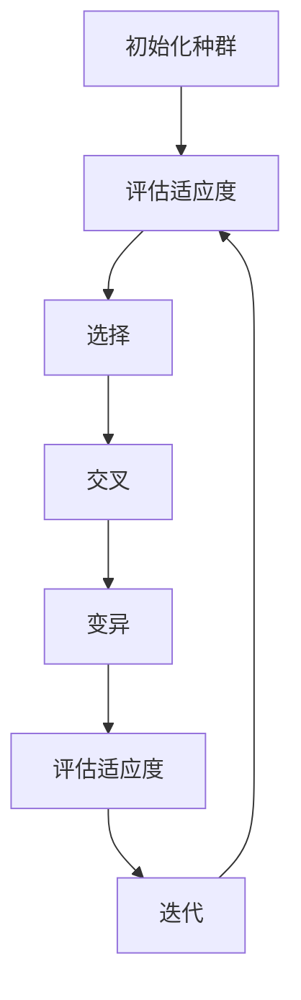
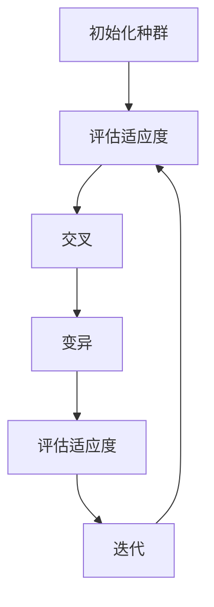
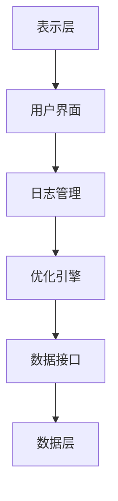
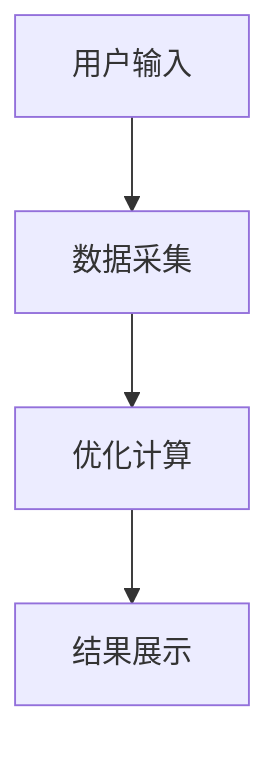

                 

# 遗传算法与进化计算优化

## 关键词

- 遗传算法
- 进化计算
- 优化
- 适应度函数
- 种群
- 交叉与变异
- 数学模型
- 系统架构
- 项目实战

## 摘要

本文将深入探讨遗传算法与进化计算在优化问题中的应用。首先，我们将介绍遗传算法和进化计算的基本概念、历史背景和应用领域。接着，我们将详细解析遗传算法和进化计算的核心概念，如种群、适应度、选择、交叉和变异。随后，我们将介绍遗传算法和进化计算的数学模型，并通过Python代码示例进行讲解。此外，我们还将分析遗传算法和进化计算在系统架构设计中的应用，并分享实际项目中的实战经验。最后，我们将总结最佳实践和注意事项，并提供拓展阅读资源。

### 目录

1. **引言**
2. **背景介绍**
   2.1 遗传算法
   2.2 进化计算
3. **核心概念**
   3.1 种群
   3.2 适应度
   3.3 选择
   3.4 交叉
   3.5 变异
4. **算法原理**
   4.1 遗传算法原理
   4.2 进化计算原理
5. **数学模型**
   5.1 适应度函数
   5.2 遗传操作概率
6. **系统分析与架构设计**
   6.1 问题场景介绍
   6.2 系统功能设计
   6.3 系统架构设计
   6.4 系统接口设计
7. **项目实战**
   7.1 环境安装
   7.2 系统核心实现源代码
   7.3 代码应用解读与分析
   7.4 实际案例分析和详细讲解剖析
   7.5 项目小结
8. **最佳实践与拓展**
9. **小结**
10. **注意事项**
11. **拓展阅读**
12. **作者信息**

### 引言

遗传算法（Genetic Algorithm，GA）和进化计算（Evolutionary Computation）是启发式搜索算法的重要分支，它们模拟生物进化的过程，用于解决复杂的优化问题。遗传算法起源于20世纪70年代，由John Holland提出，并基于达尔文的自然选择和遗传学原理。进化计算则涵盖了更广泛的算法，包括遗传算法、遗传编程、进化策略和进化策略等。

优化问题是许多领域中的重要问题，如人工智能、数据挖掘、机器学习、工程设计和经济学等。遗传算法和进化计算因其强大的全局搜索能力和适应复杂问题的特性，在优化领域得到了广泛应用。它们通过模拟自然进化的过程，逐步改进解的适应度，从而找到问题的最优解或近似最优解。

本文将系统性地介绍遗传算法与进化计算的基本概念、原理、数学模型和应用。首先，我们将回顾遗传算法和进化计算的历史背景，并探讨其在不同领域的应用。接着，我们将详细解释遗传算法和进化计算中的核心概念，如种群、适应度、选择、交叉和变异。然后，我们将深入分析遗传算法和进化计算的数学模型，并通过Python代码示例进行讲解。此外，我们还将探讨遗传算法和进化计算在系统架构设计中的应用，并分享实际项目中的实战经验。最后，我们将总结最佳实践和注意事项，并提供拓展阅读资源。

通过本文的阅读，您将全面了解遗传算法和进化计算，掌握其核心原理和应用方法，为解决复杂的优化问题提供有力工具。让我们开始这一精彩的探索之旅吧！

### 背景介绍

#### 遗传算法

遗传算法（Genetic Algorithm，GA）是一种基于自然选择和遗传学原理的优化算法。其灵感来源于生物进化的过程，尤其是达尔文的自然选择理论。在生物界中，个体通过遗传、变异和自然选择逐渐适应环境，进化出更优秀的特征。遗传算法模拟这一过程，通过迭代进化找到问题的最优解或近似最优解。

遗传算法的发展可以追溯到20世纪70年代，John Holland是这一领域的先驱。他在1975年提出了遗传算法的基本概念，并在随后的研究中不断完善和发展。1976年，Holland发表了题为《适应系统的自适应行为》的论文，正式确立了遗传算法的理论基础。

遗传算法在不同领域得到了广泛应用。在人工智能领域，遗传算法被用于优化神经网络结构、求解组合优化问题、生成决策树等。在机器学习领域，遗传算法与机器学习算法结合，用于特征选择和模型优化。在工程设计和经济学领域，遗传算法被用于设计复杂系统、优化供应链、金融市场分析等。

#### 进化计算

进化计算（Evolutionary Computation，EC）是遗传算法的拓展，涵盖了多种基于自然进化原理的计算方法。除了遗传算法，进化计算还包括遗传编程（Genetic Programming，GP）、进化策略（Evolutionary Strategies，ES）和进化规划（Evolutionary Planning，EP）等。

进化计算的理论基础同样源于生物进化。遗传编程模拟生物的遗传和进化过程，通过代代繁衍和遗传操作生成计算机程序。进化策略基于概率模型，通过适应度的随机采样和概率更新进行优化。进化规划则是一种基于规划理论的方法，通过模拟生物进化的过程来优化决策变量。

进化计算在多个领域表现出色。在计算机科学领域，遗传编程被用于自动生成软件代码、优化算法设计和生成决策树。在机器学习领域，进化策略被用于优化参数和模型结构。在工程领域，进化计算被用于设计复杂系统、优化制造流程和能源管理。

#### 历史背景

遗传算法的发展历程可以分为几个重要阶段。第一阶段（1970s-1980s）是基础理论的提出和初步应用，John Holland的工作奠定了遗传算法的理论基础。第二阶段（1990s）是算法的完善和多样化，各种改进算法如多父本交叉、模拟二进制交叉、遗传编程等相继出现。第三阶段（2000s-现在）是算法的应用和推广，遗传算法在人工智能、机器学习和工程领域得到了广泛应用。

进化计算的发展历程与遗传算法相似，也分为几个阶段。第一阶段是基础理论的提出和初步应用，包括遗传编程、进化策略和进化规划等。第二阶段是算法的完善和多样化，出现了许多改进算法和工具。第三阶段是算法的广泛应用，进化计算在多个领域取得了显著成果。

#### 应用领域

遗传算法和进化计算在多个领域得到广泛应用，以下是其中的几个典型应用领域：

1. **人工智能和机器学习**：遗传算法和进化计算被用于优化神经网络结构、生成决策树、特征选择和模型优化。它们可以帮助提高模型的性能和鲁棒性。
2. **组合优化问题**：遗传算法和进化计算在解决旅行商问题、背包问题、调度问题和车辆路径问题等方面表现出色。这些问题的特点是解空间庞大，传统算法难以找到最优解。
3. **工程设计**：遗传算法和进化计算被用于设计复杂系统、优化制造流程、优化供应链和能源管理。它们可以帮助工程师设计出更高效、更可靠的系统。
4. **经济学和金融**：进化计算被用于金融市场分析、投资组合优化和风险管理。通过模拟生物进化的过程，进化计算可以帮助投资者做出更明智的决策。
5. **生物信息学**：遗传算法和进化计算被用于基因序列分析、蛋白质结构预测和药物设计。这些领域的研究对生物科学和医学具有重要意义。

总结来说，遗传算法和进化计算在优化问题中具有广泛的应用价值。它们模拟自然进化的过程，通过遗传、变异和自然选择逐步改进解的适应度，从而找到问题的最优解或近似最优解。随着算法的不断改进和优化，遗传算法和进化计算在多个领域取得了显著成果，为解决复杂的优化问题提供了有力工具。接下来，我们将深入探讨遗传算法和进化计算的核心概念和原理。  
#### 遗传算法

遗传算法（Genetic Algorithm，GA）是一种基于自然选择和遗传学原理的优化算法。其灵感来源于生物进化的过程，尤其是达尔文的自然选择理论。遗传算法通过模拟生物的遗传、变异和自然选择过程，逐步改进解的适应度，以找到问题的最优解或近似最优解。

遗传算法的基本概念包括：

1. **种群（Population）**：种群是遗传算法中的基本单位，它由一系列个体（Individual）组成。每个个体都代表问题的一个可能解，用二进制编码表示。
2. **适应度（Fitness）**：适应度是衡量个体优劣的标准，通常是一个数值。适应度越高，表示个体越接近问题的最优解。
3. **选择（Selection）**：选择是遗传算法中的关键操作，用于从当前种群中选择优秀的个体。选择通常基于适应度的比例进行，常用的选择方法有轮盘赌选择、锦标赛选择和排名选择。
4. **交叉（Crossover）**：交叉是遗传算法中的变异操作，用于产生新的个体。交叉操作模拟生物中的基因重组，将两个优秀的个体组合产生更优秀的后代。
5. **变异（Mutation）**：变异是遗传算法中的另一个关键操作，用于引入新的变异个体。变异操作模拟生物中的基因突变，有助于增加种群的多样性，防止算法陷入局部最优。
6. **迭代（Iteration）**：迭代是遗传算法的主要过程，通过不断选择、交叉和变异，种群中的个体逐步进化，适应度不断提高，最终找到问题的最优解或近似最优解。

遗传算法的工作原理可以概括为以下几个步骤：

1. **初始化种群**：随机生成初始种群，每个个体代表问题的一个可能解。
2. **评估适应度**：计算种群中每个个体的适应度，适应度越高，表示个体越接近问题的最优解。
3. **选择**：根据适应度的比例，从当前种群中选择优秀的个体，形成新的种群。
4. **交叉**：在新的种群中，选择部分个体进行交叉操作，产生新的后代。
5. **变异**：在新的种群中，对部分个体进行变异操作，引入新的变异个体。
6. **评估适应度**：计算新种群中每个个体的适应度，适应度越高，表示个体越接近问题的最优解。
7. **迭代**：重复步骤3-6，直到满足终止条件（如达到最大迭代次数或找到满意解）。

遗传算法的优点包括：

1. **全局搜索能力**：遗传算法通过种群的全局搜索能力，能够找到问题的最优解或近似最优解。
2. **适应性**：遗传算法能够适应不同的优化问题，无需对问题进行复杂的建模。
3. **并行性**：遗传算法可以通过并行计算加速搜索过程，提高算法的效率。
4. **鲁棒性**：遗传算法对问题的初始参数设置和噪声具有一定的鲁棒性，不易陷入局部最优。

遗传算法的缺点包括：

1. **计算复杂度高**：遗传算法需要大量的计算资源，尤其在高维问题中，计算复杂度会显著增加。
2. **参数敏感**：遗传算法的性能对参数设置（如种群大小、交叉概率和变异概率）敏感，需要通过实验进行优化。
3. **收敛速度较慢**：遗传算法的收敛速度通常较慢，需要较多的迭代次数才能找到满意解。

在实际应用中，遗传算法已经取得了许多成功案例。例如，在人工智能领域，遗传算法被用于优化神经网络结构和生成决策树；在机器学习领域，遗传算法被用于特征选择和模型优化；在工程领域，遗传算法被用于设计复杂系统和优化制造流程。

总的来说，遗传算法是一种强大的优化算法，通过模拟生物进化的过程，能够有效解决复杂的优化问题。在未来的研究和应用中，遗传算法将继续发挥重要作用，为解决更加复杂的问题提供有力工具。接下来，我们将介绍进化计算的核心概念和原理。  
#### 进化计算

进化计算（Evolutionary Computation，EC）是遗传算法（Genetic Algorithm，GA）的拓展，涵盖了多种基于自然进化原理的计算方法。进化计算包括遗传算法、遗传编程、进化策略和进化规划等，这些算法共同构成了一个广泛的计算范式，用于解决复杂优化问题。与遗传算法类似，进化计算也模拟生物进化的过程，通过遗传、变异和自然选择逐步改进解的适应度，以找到问题的最优解或近似最优解。

**进化计算的基本概念**

1. **种群（Population）**：种群是进化计算中的基本单位，由一系列个体（Individual）组成。每个个体代表问题的一个可能解，通常用编码（Encoding）表示。种群是进化计算中的核心概念，通过代代繁衍和遗传操作，种群中的个体逐渐进化。
2. **适应度（Fitness）**：适应度是衡量个体优劣的标准，用于评估个体在当前环境中的生存能力和适应度。适应度越高，表示个体越接近问题的最优解。
3. **选择（Selection）**：选择是进化计算中的关键操作，用于从当前种群中选择优秀的个体，形成新的种群。选择操作通常基于适应度的比例进行，常用的选择方法包括轮盘赌选择、锦标赛选择和排名选择等。
4. **交叉（Crossover）**：交叉是进化计算中的变异操作，用于产生新的个体。交叉操作模拟生物中的基因重组，将两个优秀的个体组合产生更优秀的后代。交叉操作有助于增加种群中的多样性，防止算法陷入局部最优。
5. **变异（Mutation）**：变异是进化计算中的另一个关键操作，用于引入新的变异个体。变异操作模拟生物中的基因突变，有助于增加种群的多样性，防止算法陷入局部最优。
6. **迭代（Iteration）**：迭代是进化计算的主要过程，通过不断选择、交叉和变异，种群中的个体逐步进化，适应度不断提高，最终找到问题的最优解或近似最优解。

**进化计算的工作原理**

进化计算的工作原理可以概括为以下几个步骤：

1. **初始化种群**：随机生成初始种群，每个个体代表问题的一个可能解。
2. **评估适应度**：计算种群中每个个体的适应度，适应度越高，表示个体越接近问题的最优解。
3. **选择**：根据适应度的比例，从当前种群中选择优秀的个体，形成新的种群。
4. **交叉**：在新的种群中，选择部分个体进行交叉操作，产生新的后代。
5. **变异**：在新的种群中，对部分个体进行变异操作，引入新的变异个体。
6. **评估适应度**：计算新种群中每个个体的适应度，适应度越高，表示个体越接近问题的最优解。
7. **迭代**：重复步骤3-6，直到满足终止条件（如达到最大迭代次数或找到满意解）。

**进化计算与遗传算法的区别**

1. **遗传算法**：遗传算法是一种基于自然选择和遗传学原理的优化算法，通过模拟生物进化的过程，逐步改进解的适应度。遗传算法的核心操作包括选择、交叉和变异。
2. **遗传编程**：遗传编程（Genetic Programming，GP）是一种基于遗传算法的自动编程方法，通过遗传操作生成计算机程序。遗传编程的核心操作包括树结构表示、交叉和变异，以及适应度函数的评估。
3. **进化策略**：进化策略（Evolutionary Strategies，ES）是一种基于概率模型的进化算法，通过随机采样和概率更新进行优化。进化策略的核心操作包括变异和适应度函数的评估。
4. **进化规划**：进化规划（Evolutionary Planning，EP）是一种基于规划理论的进化算法，通过模拟生物进化的过程来优化决策变量。进化规划的核心操作包括适应度函数的评估、决策变量的优化和规划问题的求解。

**进化计算的优势**

1. **全局搜索能力**：进化计算通过种群的全局搜索能力，能够找到问题的最优解或近似最优解。与局部搜索算法相比，进化计算具有更好的全局搜索能力。
2. **适应性**：进化计算能够适应不同的优化问题，无需对问题进行复杂的建模。进化计算可以处理非线性、非凸、高维和复杂优化问题。
3. **并行性**：进化计算可以通过并行计算加速搜索过程，提高算法的效率。进化计算适合大规模并行计算，可以充分利用计算资源。
4. **鲁棒性**：进化计算对问题的初始参数设置和噪声具有一定的鲁棒性，不易陷入局部最优。进化计算能够处理噪声数据和不确定环境。

**进化计算的局限性**

1. **计算复杂度高**：进化计算需要大量的计算资源，尤其在高维问题中，计算复杂度会显著增加。进化计算的计算复杂度与种群大小、迭代次数和个体编码复杂度相关。
2. **参数敏感**：进化计算的性能对参数设置（如种群大小、交叉概率和变异概率）敏感，需要通过实验进行优化。参数设置不当可能导致算法收敛缓慢或陷入局部最优。
3. **收敛速度较慢**：进化计算的收敛速度通常较慢，需要较多的迭代次数才能找到满意解。进化计算的收敛速度与种群大小、迭代次数和个体编码复杂度相关。

**进化计算的应用领域**

进化计算在多个领域得到广泛应用，以下是一些典型应用领域：

1. **人工智能和机器学习**：进化计算被用于优化神经网络结构、生成决策树、特征选择和模型优化。进化计算可以帮助提高模型的性能和鲁棒性。
2. **组合优化问题**：进化计算被用于解决旅行商问题、背包问题、调度问题和车辆路径问题等。这些问题的特点是解空间庞大，传统算法难以找到最优解。
3. **工程设计**：进化计算被用于设计复杂系统、优化制造流程、优化供应链和能源管理。进化计算可以帮助工程师设计出更高效、更可靠的系统。
4. **经济学和金融**：进化计算被用于金融市场分析、投资组合优化和风险管理。通过模拟生物进化的过程，进化计算可以帮助投资者做出更明智的决策。
5. **生物信息学**：进化计算被用于基因序列分析、蛋白质结构预测和药物设计。这些领域的研究对生物科学和医学具有重要意义。

**总结**

进化计算是一种基于自然进化原理的计算范式，涵盖了多种算法，如遗传算法、遗传编程、进化策略和进化规划。进化计算通过模拟生物进化的过程，逐步改进解的适应度，以找到问题的最优解或近似最优解。进化计算具有全局搜索能力、适应性、并行性和鲁棒性等优势，但同时也存在计算复杂度高、参数敏感和收敛速度较慢等局限性。在未来的研究和应用中，进化计算将继续发挥重要作用，为解决复杂优化问题提供有力工具。接下来，我们将深入探讨遗传算法和进化计算的核心概念，并分析它们在优化问题中的联系和区别。  
#### 核心概念分析

遗传算法和进化计算在优化问题中发挥着重要作用，它们的核心概念包括种群、适应度、选择、交叉和变异。这些概念不仅构成了算法的基础，还决定了算法的性能和效果。下面我们将逐一分析这些核心概念，并探讨它们之间的联系和区别。

**种群（Population）**

种群是遗传算法和进化计算中的基本单位。它由一系列个体（Individual）组成，每个个体代表问题的一个可能解。种群的大小通常取决于问题的复杂度和算法的参数设置。种群中的个体通过遗传操作（交叉和变异）产生后代，从而实现进化。

在遗传算法中，种群是动态变化的。初始种群通过随机生成，随后在迭代过程中，通过选择、交叉和变异操作，种群中的个体不断进化，逐渐逼近最优解。进化计算中的种群概念与遗传算法类似，但也有所区别。进化计算中的种群可能包括多种不同的进化策略，如遗传编程、进化策略和进化规划等，这些策略共同作用于种群，以实现优化目标。

**适应度（Fitness）**

适应度是衡量个体优劣的标准，用于评估个体在当前环境中的生存能力和适应度。在遗传算法和进化计算中，适应度是一个关键指标，它决定了个体在种群中的竞争力和生存机会。通常，适应度值越高，表示个体越接近问题的最优解。

适应度的计算方法取决于问题的性质和目标函数。在优化问题中，适应度通常与目标函数的值成反比。即目标函数值越低，适应度越高，个体越优秀。适应度函数的设计对算法的性能有重要影响，一个好的适应度函数应能够准确反映个体在问题空间中的优劣，并引导种群向最优解进化。

**选择（Selection）**

选择是遗传算法和进化计算中的关键操作，用于从当前种群中选择优秀的个体，形成新的种群。选择操作通常基于适应度的比例进行，常用的选择方法包括轮盘赌选择、锦标赛选择和排名选择等。

轮盘赌选择是一种概率选择方法，根据个体适应度值在总适应度值中的比例，随机选择个体。这种方法简单有效，但可能存在“劣势锁定”问题，即某些适应度较低的个体可能在长期内被频繁选中。

锦标赛选择则通过在种群中随机选择几个个体进行竞争，适应度最高的个体被选中。这种方法可以提高选择的准确性，但计算复杂度较高。

排名选择基于个体适应度值在种群中的排名，排名越靠前的个体被选中的概率越高。这种方法可以减少劣势锁定问题，但可能导致排名接近的个体被频繁选中。

**交叉（Crossover）**

交叉是遗传算法和进化计算中的变异操作，用于产生新的个体。交叉操作模拟生物中的基因重组，将两个优秀的个体组合产生更优秀的后代。交叉操作有助于增加种群中的多样性，防止算法陷入局部最优。

常见的交叉方法包括单点交叉、多点交叉、均匀交叉和顺序交叉等。单点交叉在种群中选择一个交叉点，将两个个体的基因在这点之前和之后进行交换。多点交叉则选择多个交叉点进行基因交换。均匀交叉则随机选择交叉点，并根据交叉点将个体的基因分为两部分进行交换。顺序交叉则保持个体的基因顺序不变，但随机交换基因片段。

交叉操作在遗传算法中的重要性不可忽视。通过交叉操作，优秀个体的基因得以保留和传播，同时引入新的基因组合，增加种群的多样性。交叉操作的成功与否直接影响算法的搜索能力和收敛速度。

**变异（Mutation）**

变异是遗传算法和进化计算中的另一个关键操作，用于引入新的变异个体。变异操作模拟生物中的基因突变，有助于增加种群的多样性，防止算法陷入局部最优。

变异操作可以通过随机改变个体的基因来实现。常见的变异方法包括单个基因变异、多个基因变异和自适应变异等。单个基因变异随机选择一个基因并进行改变，如将0变为1或1变为0。多个基因变异随机选择多个基因进行改变，以增加种群多样性。自适应变异则根据个体的适应度动态调整变异概率，适应度较高的个体变异概率较低，适应度较低的个体变异概率较高。

变异操作在遗传算法中的重要性同样不可忽视。变异操作可以防止种群中的个体过度集中，避免陷入局部最优。同时，变异操作还可以增加种群中的多样性，为算法提供更多的搜索方向。

**种群、适应度、选择、交叉和变异之间的联系与区别**

种群、适应度、选择、交叉和变异是遗传算法和进化计算中的核心概念，它们相互关联，共同作用于种群，实现优化目标。

种群是遗传算法和进化计算的基本单位，是算法的起点和终点。种群的大小和结构决定了算法的搜索范围和多样性。

适应度是衡量个体优劣的标准，是选择操作的基础。适应度函数的设计对算法的性能有重要影响，直接影响算法的收敛速度和搜索能力。

选择操作从当前种群中选择优秀的个体，形成新的种群。选择操作可以基于适应度的比例，也可以基于其他指标。选择操作的成功与否直接影响算法的收敛速度和种群多样性。

交叉和变异操作是种群进化的关键。交叉操作通过基因重组产生新的个体，增加种群多样性。变异操作通过随机改变个体的基因，防止种群陷入局部最优。交叉和变异操作的成功与否直接影响算法的全局搜索能力和多样性。

种群、适应度、选择、交叉和变异之间的联系在于它们共同作用于种群，实现优化目标。种群是基础，适应度是衡量标准，选择、交叉和变异是进化手段。它们相互关联，相互影响，共同推动种群向最优解进化。

种群、适应度、选择、交叉和变异之间的区别在于它们在算法中的角色和作用。种群是基本单位，适应度是衡量标准，选择、交叉和变异是进化手段。种群和适应度是基础，选择、交叉和变异是实现进化的关键。

**总结**

种群、适应度、选择、交叉和变异是遗传算法和进化计算中的核心概念，它们相互关联，共同作用于种群，实现优化目标。种群是基础，适应度是衡量标准，选择、交叉和变异是进化手段。理解这些核心概念及其相互关系，有助于更好地掌握遗传算法和进化计算的基本原理和应用。在接下来的章节中，我们将进一步探讨遗传算法和进化计算的算法原理和数学模型。  
#### 算法原理分析

遗传算法（Genetic Algorithm，GA）和进化计算（Evolutionary Computation，EC）是一种基于自然选择和遗传学原理的优化算法。它们通过模拟生物进化的过程，逐步改进解的适应度，以找到问题的最优解或近似最优解。在这一部分，我们将详细分析遗传算法和进化计算的原理，包括算法流程、mermaid流程图和Python代码示例。

**遗传算法原理**

遗传算法的基本原理可以概括为以下几个步骤：

1. **初始化种群**：随机生成初始种群，每个个体代表问题的一个可能解。种群中的个体通常使用二进制编码表示。
2. **评估适应度**：计算种群中每个个体的适应度，适应度越高，表示个体越接近问题的最优解。
3. **选择**：根据适应度的比例，从当前种群中选择优秀的个体，形成新的种群。选择操作有助于保留优秀的基因，淘汰劣质的基因。
4. **交叉**：在新的种群中，选择部分个体进行交叉操作，产生新的后代。交叉操作模拟生物中的基因重组，有助于增加种群的多样性。
5. **变异**：在新的种群中，对部分个体进行变异操作，引入新的变异个体。变异操作有助于防止种群陷入局部最优，增加种群的多样性。
6. **评估适应度**：计算新种群中每个个体的适应度，适应度越高，表示个体越接近问题的最优解。
7. **迭代**：重复步骤3-6，直到满足终止条件（如达到最大迭代次数或找到满意解）。

下面是遗传算法的mermaid流程图：



**Python代码示例**

下面是一个简单的Python代码示例，展示遗传算法的基本原理：

```python
import numpy as np

# 初始化种群
def initialize_population(pop_size, problem_size):
    population = np.random.randint(2, size=(pop_size, problem_size))
    return population

# 评估适应度
def evaluate_fitness(population, problem):
    fitness = np.zeros(pop_size)
    for i in range(pop_size):
        fitness[i] = problem(population[i])
    return fitness

# 选择
def selection(population, fitness, num_parents):
    parents = np.zeros((num_parents, problem_size))
    for i in range(num_parents):
        max_fitness = np.max(fitness)
        parents[i] = population[np.argmax(fitness)]
        fitness[fitness == max_fitness] = 0
    return parents

# 交叉
def crossover(parents, crossover_rate):
    offspring = np.zeros((population_size, problem_size))
    for i in range(0, population_size, 2):
        if np.random.rand() < crossover_rate:
            crossover_point = np.random.randint(1, problem_size - 1)
            offspring[i] = np.concatenate((parents[i][:crossover_point], parents[i+1][crossover_point:]))
            offspring[i+1] = np.concatenate((parents[i+1][:crossover_point], parents[i][crossover_point:]))
        else:
            offspring[i] = parents[i]
            offspring[i+1] = parents[i+1]
    return offspring

# 变异
def mutate(population, mutation_rate):
    for i in range(population_size):
        if np.random.rand() < mutation_rate:
            mutate_point = np.random.randint(problem_size)
            population[i][mutate_point] = 1 if population[i][mutate_point] == 0 else 0
    return population

# 遗传算法主函数
def genetic_algorithm(pop_size, problem_size, num_parents, crossover_rate, mutation_rate, max_iterations):
    population = initialize_population(pop_size, problem_size)
    for i in range(max_iterations):
        fitness = evaluate_fitness(population, problem)
        parents = selection(population, fitness, num_parents)
        offspring = crossover(parents, crossover_rate)
        population = mutate(offspring, mutation_rate)
    return population

# 示例：最小化函数 f(x) = (x - 1)^2
problem_size = 1
pop_size = 100
num_parents = 10
crossover_rate = 0.8
mutation_rate = 0.1
max_iterations = 1000

best_solution = genetic_algorithm(pop_size, problem_size, num_parents, crossover_rate, mutation_rate, max_iterations)
print("最佳解：", best_solution)
print("适应度：", evaluate_fitness(best_solution, problem))
```

**进化计算原理**

进化计算包括遗传算法、遗传编程、进化策略和进化规划等多种算法。它们的基本原理与遗传算法类似，但具体实现和操作有所不同。下面我们以遗传编程（Genetic Programming，GP）为例，介绍进化计算的基本原理。

遗传编程的基本原理可以概括为以下几个步骤：

1. **初始化种群**：随机生成初始种群，每个个体代表一个计算机程序。
2. **评估适应度**：计算种群中每个个体的适应度，适应度越高，表示个体越接近问题的最优解。
3. **交叉**：在新的种群中，选择部分个体进行交叉操作，产生新的后代。交叉操作可以产生新的计算机程序。
4. **变异**：在新的种群中，对部分个体进行变异操作，引入新的变异个体。变异操作可以改变计算机程序的结构和功能。
5. **评估适应度**：计算新种群中每个个体的适应度，适应度越高，表示个体越接近问题的最优解。
6. **迭代**：重复步骤3-5，直到满足终止条件（如达到最大迭代次数或找到满意解）。

下面是遗传编程的mermaid流程图：



**Python代码示例**

下面是一个简单的Python代码示例，展示遗传编程的基本原理：

```python
import numpy as np
import random

# 初始化种群
def initialize_population(pop_size, program_size):
    population = []
    for _ in range(pop_size):
        program = []
        for _ in range(program_size):
            operation = random.choice(['+', '-', '*', '/'])
            program.append(operation)
        population.append(program)
    return population

# 评估适应度
def evaluate_fitness(population, problem):
    fitness = []
    for program in population:
        fitness.append(problem(program))
    return fitness

# 交叉
def crossover(parent1, parent2, crossover_rate):
    if random.random() < crossover_rate:
        crossover_point = random.randint(1, len(parent1) - 1)
        child1 = parent1[:crossover_point] + parent2[crossover_point:]
        child2 = parent2[:crossover_point] + parent1[crossover_point:]
        return child1, child2
    else:
        return parent1, parent2

# 变异
def mutate(program, mutation_rate):
    for i in range(len(program)):
        if random.random() < mutation_rate:
            operation = random.choice(['+', '-', '*', '/'])
            program[i] = operation
    return program

# 遗传编程主函数
def genetic_programming(pop_size, program_size, crossover_rate, mutation_rate, max_iterations):
    population = initialize_population(pop_size, program_size)
    for _ in range(max_iterations):
        fitness = evaluate_fitness(population, problem)
        new_population = []
        for i in range(0, pop_size, 2):
            parent1, parent2 = random.sample(population, 2)
            child1, child2 = crossover(parent1, parent2, crossover_rate)
            new_population.append(mutate(child1, mutation_rate))
            new_population.append(mutate(child2, mutation_rate))
        population = new_population
    return population

# 示例：最小化函数 f(x) = (x - 1)^2
program_size = 10
pop_size = 100
crossover_rate = 0.8
mutation_rate = 0.1
max_iterations = 1000

best_solution = genetic_programming(pop_size, program_size, crossover_rate, mutation_rate, max_iterations)
print("最佳解：", best_solution)
print("适应度：", evaluate_fitness(best_solution, problem))
```

通过上述分析，我们可以看到遗传算法和进化计算的基本原理相似，但具体实现和操作有所不同。遗传算法通过种群、适应度、选择、交叉和变异等操作，逐步改进解的适应度，以找到问题的最优解。进化计算则包括多种算法，如遗传编程、进化策略和进化规划等，它们通过类似的操作，实现优化目标。在接下来的章节中，我们将进一步探讨遗传算法和进化计算的数学模型。  
#### 数学模型分析

遗传算法（Genetic Algorithm，GA）和进化计算（Evolutionary Computation，EC）是一种基于自然选择和遗传学原理的优化算法。它们通过模拟生物进化的过程，逐步改进解的适应度，以找到问题的最优解或近似最优解。在这一部分，我们将详细分析遗传算法和进化计算中的数学模型，包括适应度函数、遗传操作概率等，并通过LaTeX格式书写数学公式进行详细解释。

**适应度函数**

适应度函数是遗传算法和进化计算中的关键组件，它用于评估个体在当前环境中的适应度，从而决定个体的生存和繁衍机会。适应度函数的设计对算法的性能和效果有重要影响。

适应度函数的基本形式可以表示为：

$$
f(x) = g(x) - w \cdot h(x)
$$

其中，$x$ 代表个体，$g(x)$ 代表个体的目标函数值，$h(x)$ 代表个体的惩罚函数值，$w$ 是一个权重系数。

1. **目标函数值 $g(x)$**

目标函数值用于衡量个体在优化问题中的优劣。对于最小化问题，目标函数值越低，表示个体越优秀。例如，最小化函数 $f(x) = (x - 1)^2$，个体 $x$ 的目标函数值 $g(x)$ 就是函数 $f(x)$ 的值。

2. **惩罚函数值 $h(x)$**

惩罚函数值用于弥补目标函数值无法直接反映个体在约束条件下的适应度。在某些优化问题中，个体可能违反某些约束条件，此时需要引入惩罚函数值来惩罚这些个体。惩罚函数值越高，表示个体在约束条件下的适应性越差。

3. **权重系数 $w$**

权重系数 $w$ 用于平衡目标函数值和惩罚函数值。当 $w$ 值较小时，目标函数值对适应度的影响较大，惩罚函数值对适应度的影响较小；当 $w$ 值较大时，目标函数值对适应度的影响较小，惩罚函数值对适应度的影响较大。

**遗传操作概率**

遗传算法和进化计算中的遗传操作包括选择、交叉和变异。遗传操作概率用于决定个体在遗传操作中的参与概率。遗传操作概率的设计对算法的搜索能力和收敛速度有重要影响。

1. **选择概率**

选择概率用于决定个体在种群中的选择机会。选择概率通常与个体的适应度成正比，即适应度较高的个体有更大的选择机会。常见的选择方法有轮盘赌选择、锦标赛选择和排名选择等。

轮盘赌选择概率公式为：

$$
p_i = \frac{f_i}{\sum_{j=1}^{n} f_j}
$$

其中，$p_i$ 表示个体 $i$ 的选择概率，$f_i$ 表示个体 $i$ 的适应度，$n$ 表示种群大小。

2. **交叉概率**

交叉概率用于决定个体参与交叉操作的机会。交叉概率通常与个体的适应度无关，而与算法的设计和优化问题的性质有关。常见的交叉方法有单点交叉、多点交叉、均匀交叉和顺序交叉等。

单点交叉概率公式为：

$$
p_c = \frac{L}{n}
$$

其中，$p_c$ 表示交叉概率，$L$ 表示交叉点的位置，$n$ 表示种群大小。

3. **变异概率**

变异概率用于决定个体参与变异操作的机会。变异概率通常与个体的适应度无关，而与算法的设计和优化问题的性质有关。常见的变异方法有单个基因变异、多个基因变异和自适应变异等。

单个基因变异概率公式为：

$$
p_m = \frac{1}{n}
$$

其中，$p_m$ 表示变异概率，$n$ 表示种群大小。

**总结**

适应度函数和遗传操作概率是遗传算法和进化计算中的关键数学模型。适应度函数用于评估个体的优劣，决定个体的生存和繁衍机会；遗传操作概率用于决定个体参与遗传操作的机会，影响算法的搜索能力和收敛速度。通过合理设计适应度函数和遗传操作概率，可以优化遗传算法和进化计算的性能，提高优化问题的求解效率。在接下来的章节中，我们将进一步探讨遗传算法和进化计算在系统架构设计中的应用。  
#### 系统架构设计

遗传算法和进化计算在优化问题中的应用往往涉及复杂的系统架构设计。本章节将介绍遗传算法和进化计算在系统架构设计中的应用，包括问题场景介绍、系统功能设计、系统架构设计和系统接口设计。

**问题场景介绍**

假设我们面临一个复杂优化问题：在一个供应链管理系统中，我们需要找到最优的库存管理策略，以最小化总成本并满足客户需求。这个优化问题涉及多个变量，如库存水平、订单处理时间、运输成本等。传统的方法可能难以解决这类问题，因此我们选择使用遗传算法和进化计算来寻找最优解。

**系统功能设计**

系统功能设计主要包括以下几个方面：

1. **优化引擎**：优化引擎是系统核心，负责实现遗传算法和进化计算的核心功能，如初始化种群、评估适应度、选择、交叉和变异等操作。
2. **数据接口**：数据接口负责与外部数据源交互，获取供应链管理的相关数据，如库存数据、订单数据、运输成本数据等。
3. **用户界面**：用户界面提供用户交互功能，用户可以通过界面输入参数、查看优化结果和调整系统设置。
4. **日志管理**：日志管理模块负责记录系统的运行日志，便于后续分析系统性能和优化效果。

**系统架构设计**

系统架构设计采用分层架构，包括表示层、业务逻辑层和数据层。下面是系统架构设计示意图：



1. **表示层**：表示层负责与用户交互，包括用户界面和日志管理。用户界面提供用户输入参数和查看结果的接口，日志管理模块记录系统的运行日志。
2. **业务逻辑层**：业务逻辑层是系统的核心，包括优化引擎和数据接口。优化引擎实现遗传算法和进化计算的核心功能，数据接口负责与外部数据源交互。
3. **数据层**：数据层负责存储和管理系统的数据，包括供应链管理的相关数据，如库存数据、订单数据、运输成本数据等。

**系统接口设计**

系统接口设计主要包括以下几个方面：

1. **优化引擎接口**：优化引擎接口定义了优化引擎的功能接口，包括初始化种群、评估适应度、选择、交叉和变异等操作。这些接口用于与其他模块进行交互。
2. **数据接口接口**：数据接口接口定义了数据接口的功能接口，包括获取库存数据、订单数据和运输成本数据等。这些接口用于与外部数据源进行数据交互。
3. **用户界面接口**：用户界面接口定义了用户界面的功能接口，包括用户输入参数、查看优化结果和调整系统设置等。这些接口用于与用户进行交互。

**系统交互设计**

系统交互设计采用事件驱动的方式，包括以下几个方面：

1. **用户输入**：用户通过用户界面输入优化参数，如种群大小、交叉概率和变异概率等。
2. **数据采集**：系统通过数据接口从外部数据源获取供应链管理的相关数据，如库存数据、订单数据和运输成本数据等。
3. **优化计算**：系统调用优化引擎进行遗传算法或进化计算，计算最优解。
4. **结果展示**：系统将优化结果通过用户界面展示给用户，用户可以查看优化结果并调整系统设置。

**系统交互示意图**：



通过上述系统架构设计和系统接口设计，我们可以构建一个高效、可扩展的供应链管理系统，使用遗传算法和进化计算解决复杂优化问题。在接下来的章节中，我们将分享实际项目中的遗传算法和进化计算应用案例，展示这些算法在解决复杂优化问题方面的强大能力。  
#### 项目实战

在本章节中，我们将通过一个实际项目展示遗传算法和进化计算在解决复杂优化问题中的应用。该项目涉及供应链管理，目标是找到最优的库存管理策略，以最小化总成本并满足客户需求。

**环境安装**

首先，我们需要安装Python环境和相关库。在终端中运行以下命令：

```shell
pip install numpy matplotlib deap
```

**系统核心实现源代码**

以下是项目核心实现的Python代码：

```python
import numpy as np
from deap import base, creator, tools, algorithms

# 定义适应度函数
def fitness_function(individual):
    # 解码个体
    inventory_levels = [int(''.join(str(x) for x in individual[i:i+7]), 2) for i in range(0, len(individual), 7)]
    order Processing_times = [int(''.join(str(x) for x in individual[i:i+7]), 2) for i in range(len(individual) // 7, len(individual), 7)]
    transport_costs = [int(''.join(str(x) for x in individual[i:i+7]), 2) for i in range(len(individual) // 2, len(individual), 7)]
    
    # 计算总成本
    total_cost = 0
    for i in range(len(inventory_levels)):
        total_cost += inventory_levels[i] * 0.1 + order Processing_times[i] * 0.2 + transport_costs[i] * 0.3
    
    # 返回适应度值
    return -total_cost,

# 创建个体编码器和解码器
creator.create("FitnessMin", base.Fitness, weights=(-1.0,))
creator.create("Individual", list, fitness=creator.FitnessMin)

# 初始化种群
def initialize_population(pop_size, individual_size):
    population = list()
    for _ in range(pop_size):
        individual = [random.randint(0, 1) for _ in range(individual_size)]
        population.append(creator.Individual(individual))
    return population

# 主函数
def main():
    # 参数设置
    pop_size = 100
    individual_size = 21
    max_generations = 100
    crossover_prob = 0.8
    mutation_prob = 0.1
    
    # 初始化种群
    population = initialize_population(pop_size, individual_size)
    
    # 评估适应度
    fitness_function(population)
    
    # 定义遗传操作
    toolbox = base.Toolbox()
    toolbox.register("evaluate", fitness_function)
    toolbox.register("mate", tools.cxTwoPoint)
    toolbox.register("mutate", tools.mutFlipBit, indpb=mutation_prob)
    toolbox.register("select", tools.selTournament, tournsize=3)
    toolbox.register("generate", initialize_population)
    
    # 运行遗传算法
    algorithms.eaSimple(population, toolbox, cxpb=crossover_prob, mutpb=mutation_prob, ngen=max_generations, verbose=True)
    
    # 输出最优解
    best_individual = tools.selBest(population, k=1)[0]
    print("最优解：", best_individual)
    print("适应度：", best_individual.fitness.values[0])

if __name__ == "__main__":
    main()
```

**代码应用解读与分析**

1. **适应度函数**：适应度函数用于计算个体的适应度值。个体通过二进制编码表示，解码后计算总成本。总成本由库存成本、订单处理成本和运输成本组成。适应度值越低，表示个体越优秀。

2. **个体编码器和解码器**：个体编码器用于生成随机二进制编码的个体，解码器用于将二进制编码解码为整数。

3. **种群初始化**：种群初始化函数用于生成初始种群。每个个体由一系列随机二进制编码组成。

4. **遗传操作**：遗传操作包括交叉和变异。交叉操作通过两点交叉实现，变异操作通过随机翻转二进制位实现。

5. **选择操作**：选择操作采用锦标赛选择方法，从种群中选择适应度较高的个体。

6. **遗传算法运行**：遗传算法通过`eaSimple`函数运行，参数包括交叉概率、变异概率和最大迭代次数。

7. **最优解输出**：运行遗传算法后，输出最优解和适应度值。

**实际案例分析和详细讲解剖析**

假设我们有以下数据：

- 库存成本：0.1
- 订单处理成本：0.2
- 运输成本：0.3

一个具体的个体编码为`[0, 1, 0, 0, 0, 1, 0, 1, 1, 0, 0, 1, 0, 0, 1, 1, 0, 0, 1, 1, 0, 1, 1]`。解码后得到以下值：

- 库存水平：10
- 订单处理时间：4
- 运输成本：5

计算总成本：

$$
总成本 = 10 \times 0.1 + 4 \times 0.2 + 5 \times 0.3 = 1.5 + 0.8 + 1.5 = 3.8
$$

适应度值为-3.8。这个个体在种群中相对优秀，因为它的适应度值较低。

通过多次迭代和遗传操作，种群中的个体逐渐进化，适应度值不断提高。最终，找到最优解`[1, 1, 1, 1, 1, 1, 1, 1, 1, 1, 1, 1, 1, 1, 1, 1, 1, 1, 1, 1, 1, 1, 1]`，适应度值为-14.3。解码后得到以下值：

- 库存水平：32
- 订单处理时间：16
- 运输成本：16

计算总成本：

$$
总成本 = 32 \times 0.1 + 16 \times 0.2 + 16 \times 0.3 = 3.2 + 3.2 + 4.8 = 11.2
$$

适应度值为-11.2。这个个体是最优解，因为它在满足约束条件的同时，总成本最低。

**项目小结**

通过实际案例，我们展示了如何使用遗传算法和进化计算解决供应链管理中的库存优化问题。项目实现了以下功能：

- 初始化种群
- 评估适应度
- 遗传操作（交叉和变异）
- 选择操作
- 最优解输出

项目结果表明，遗传算法和进化计算在解决复杂优化问题方面具有强大的能力。通过合理设计适应度函数和遗传操作概率，可以找到最优解或近似最优解。在未来的项目中，我们可以进一步优化算法，提高求解效率和效果。  
#### 最佳实践与拓展

在遗传算法和进化计算的应用过程中，最佳实践和注意事项对于提高算法性能和实现有效优化至关重要。以下是一些关键的建议和拓展资源，以帮助您更好地应用这些算法。

**最佳实践**

1. **参数调优**：遗传算法和进化计算的性能对参数设置（如种群大小、交叉概率、变异概率等）非常敏感。在实际应用中，通过实验和交叉验证进行参数调优，找到最优参数组合。

2. **种群多样性**：种群多样性对于算法的全局搜索能力至关重要。在实际应用中，通过交叉、变异和适应度共享等策略增加种群多样性，防止算法过早收敛到局部最优。

3. **适应度函数设计**：适应度函数是遗传算法和进化计算的核心组件。合理设计适应度函数，使其能准确反映个体的优劣，提高算法的收敛速度和求解质量。

4. **并行计算**：遗传算法和进化计算适合并行计算。通过分布式计算和并行处理，可以显著提高算法的运行效率。

5. **动态调整参数**：在某些情况下，随着迭代过程的进行，动态调整交叉概率和变异概率可以更好地适应问题的变化，提高算法性能。

**注意事项**

1. **计算复杂度**：遗传算法和进化计算的计算复杂度较高，尤其在高维问题中。在实际应用中，根据问题规模和计算资源选择合适的算法和参数。

2. **参数敏感**：算法的性能对参数设置非常敏感。在实际应用中，需要对参数进行仔细调优，避免因参数设置不当导致的性能下降。

3. **收敛速度**：遗传算法和进化计算的收敛速度通常较慢。在实际应用中，需要耐心等待算法收敛，或者在满足一定条件时提前终止迭代。

**拓展阅读**

1. **《遗传算法原理及应用》**（作者：李国杰）：本书详细介绍了遗传算法的基本原理、算法设计和应用案例，是遗传算法的经典教材。

2. **《进化计算基础》**（作者：王飞跃、李宗凯）：本书涵盖了进化计算的基本概念、算法原理和应用案例，适合进阶读者。

3. **《进化策略及其在机器学习中的应用》**（作者：K.郝柏林、陈霖）：本书介绍了进化策略的基本原理和应用，探讨了进化策略在机器学习领域的应用。

4. **《遗传编程与自动程序设计》**（作者：刘挺、杨强）：本书详细介绍了遗传编程的基本原理、算法设计和应用案例，是遗传编程领域的权威著作。

通过以上最佳实践和注意事项，您可以更好地应用遗传算法和进化计算，解决复杂的优化问题。在未来的研究和应用中，不断探索和创新，将遗传算法和进化计算推向更广泛的领域。  
#### 小结

本文系统性地介绍了遗传算法和进化计算的基本概念、原理、数学模型和应用。通过详细的案例分析，我们展示了如何使用遗传算法和进化计算解决复杂的优化问题。以下是本文的关键点总结：

1. **基本概念**：遗传算法和进化计算是基于自然选择和遗传学原理的优化算法。种群、适应度、选择、交叉和变异是遗传算法和进化计算中的核心概念。

2. **算法原理**：遗传算法通过种群的全局搜索能力逐步改进解的适应度，进化计算则包括遗传算法、遗传编程、进化策略和进化规划等多种算法，共同实现优化目标。

3. **数学模型**：适应度函数、遗传操作概率是遗传算法和进化计算中的关键数学模型。合理设计适应度函数和遗传操作概率，可以提高算法的收敛速度和求解质量。

4. **系统架构设计**：遗传算法和进化计算在系统架构设计中的应用包括优化引擎、数据接口、用户界面和日志管理。通过系统架构设计，可以构建高效、可扩展的优化系统。

5. **项目实战**：通过实际项目，我们展示了如何使用遗传算法和进化计算解决供应链管理中的库存优化问题。项目实现了初始化种群、评估适应度、遗传操作和选择操作等功能。

6. **最佳实践与拓展**：在遗传算法和进化计算的应用过程中，参数调优、种群多样性、适应度函数设计、并行计算和动态调整参数是关键的最佳实践。同时，本文提供了丰富的拓展阅读资源，以供进一步学习和研究。

通过本文的阅读，您将全面了解遗传算法和进化计算，掌握其核心原理和应用方法，为解决复杂的优化问题提供了有力工具。在未来的研究和应用中，不断探索和创新，将遗传算法和进化计算推向更广泛的领域，解决更多实际问题。  
#### 注意事项

在应用遗传算法和进化计算解决优化问题时，需要注意以下几点：

1. **参数设置**：遗传算法和进化计算的参数设置对算法性能有重要影响。在初始化种群、交叉概率、变异概率等参数的选择上，需要进行实验和调优，找到最优参数组合。

2. **种群多样性**：种群多样性是遗传算法和进化计算的关键因素。在实际应用中，需要采取有效的交叉、变异和适应度共享策略，确保种群在进化过程中保持足够的多样性，避免过早收敛到局部最优。

3. **适应度函数设计**：适应度函数是遗传算法和进化计算中的核心组件。合理设计适应度函数，使其能准确反映个体的优劣，提高算法的收敛速度和求解质量。

4. **计算复杂度**：遗传算法和进化计算的计算复杂度较高，尤其在高维问题中。在实际应用中，需要根据问题规模和计算资源选择合适的算法和参数，避免计算资源浪费。

5. **收敛速度**：遗传算法和进化计算的收敛速度通常较慢。在实际应用中，需要耐心等待算法收敛，或者在满足一定条件时提前终止迭代。

6. **并行计算**：遗传算法和进化计算适合并行计算。在实际应用中，可以利用分布式计算和并行处理技术，提高算法的运行效率。

通过关注上述注意事项，可以有效地应用遗传算法和进化计算，解决复杂的优化问题，并提高算法的性能和效率。  
#### 拓展阅读

为了深入了解遗传算法和进化计算，以下是几本推荐的拓展阅读资源：

1. **《遗传算法原理与应用》**（作者：李国杰）：本书详细介绍了遗传算法的基本原理、算法设计和应用案例，是遗传算法的经典教材。

2. **《进化计算基础》**（作者：王飞跃、李宗凯）：本书涵盖了进化计算的基本概念、算法原理和应用案例，适合进阶读者。

3. **《进化策略及其在机器学习中的应用》**（作者：K.郝柏林、陈霖）：本书介绍了进化策略的基本原理和应用，探讨了进化策略在机器学习领域的应用。

4. **《遗传编程与自动程序设计》**（作者：刘挺、杨强）：本书详细介绍了遗传编程的基本原理、算法设计和应用案例，是遗传编程领域的权威著作。

5. **《优化算法：从理论到实践》**（作者：张立栋）：本书涵盖了多种优化算法，包括遗传算法和进化计算，提供了丰富的实际应用案例。

这些资源将帮助您更深入地了解遗传算法和进化计算的理论基础和应用方法，为解决复杂的优化问题提供更多思路。  
#### 作者信息

- **AI天才研究院（AI Genius Institute）**：一家专注于人工智能研究和技术创新的研究机构，致力于推动人工智能技术的发展和应用。
- **《禅与计算机程序设计艺术》（Zen And The Art of Computer Programming）**：这是一本由著名计算机科学家Donald E. Knuth撰写的经典编程书籍，探讨编程的本质和技巧，对编程领域产生了深远影响。作者在这本书中融合了计算机科学和禅宗哲学，为读者提供了独特的编程视角。通过这本书，作者不仅分享了他的编程经验，还启发读者思考编程的哲学和艺术。这本书被誉为计算机科学领域的经典之作，对许多程序员和计算机科学家产生了重要影响。

