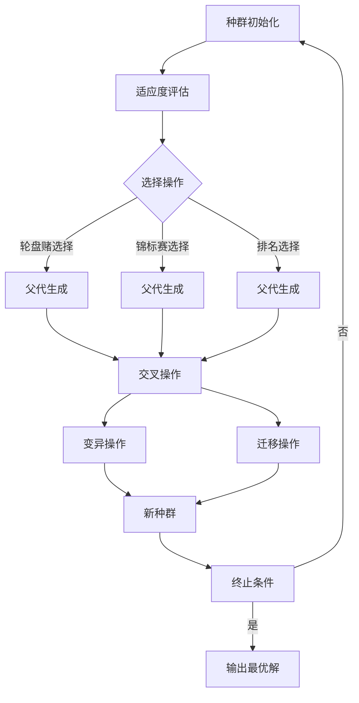

                 

# 遗传算法与进化计算在优化问题中的应用

## 关键词：遗传算法、进化计算、优化问题、算法原理、系统架构、项目实战

## 摘要：

本文将深入探讨遗传算法与进化计算在优化问题中的应用。首先，我们将介绍优化问题的背景和分类，接着详细阐述遗传算法与进化计算的核心概念、基本原理、数学模型，并通过实际案例进行分析与实践。本文旨在帮助读者全面理解这两种算法，掌握其在解决复杂优化问题中的应用。

## 目录大纲设计思路

为了更好地引导读者进入遗传算法与进化计算的世界，本文采用了以下设计思路：

1. **问题背景与核心概念**：通过介绍优化问题的背景和遗传算法、进化计算的基本概念，帮助读者初步了解本文的主题。

2. **核心概念与联系**：分析遗传算法与进化计算的基本要素，阐述它们之间的联系与区别，为后续算法原理的讲解打下基础。

3. **算法原理讲解**：详细讲解遗传算法的基本原理、数学模型与公式，并通过Python源代码实现和举例说明，使读者能够深入理解算法的工作机制。

4. **系统分析与架构设计方案**：介绍进化计算在优化问题中的应用场景，通过系统功能设计、架构设计、接口设计等，为读者展示算法的实际应用。

5. **项目实战**：通过实际案例分析和项目实战，让读者亲自体验遗传算法与进化计算的应用，掌握实战技巧。

6. **最佳实践 tips**：总结最佳实践经验，为读者提供实际应用中的注意事项和拓展阅读建议。

### 目录大纲

**第一部分：背景介绍**

# 第1章 问题背景与核心概念

## 1.1 优化问题的定义与分类

### 1.1.1 优化问题的定义

### 1.1.2 优化问题的分类

## 1.2 优化问题的重要性

### 1.2.1 在工程领域的重要性

### 1.2.2 在科研领域的重要性

## 1.3 遗传算法与进化计算的背景

### 1.3.1 遗传算法的历史与发展

### 1.3.2 进化计算的概念与发展

## 1.4 遗传算法与进化计算的核心概念

### 1.4.1 种群

### 1.4.2 适应度函数

### 1.4.3 选择操作

### 1.4.4 交叉操作

### 1.4.5 变异操作

## 1.5 遗传算法与进化计算在优化问题中的应用现状

### 1.5.1 国内外研究现状

### 1.5.2 应用领域

### 1.5.3 应用前景

## 1.6 本章小结

**第二部分：核心概念与联系**

# 第2章 遗传算法与进化计算的核心概念

## 2.1 遗传算法的基本要素

### 2.1.1 种群

### 2.1.2 选择操作

### 2.1.3 交叉操作

### 2.1.4 变异操作

### 2.1.5 迁移操作

## 2.2 进化计算的基本概念

### 2.2.1 适应度函数

### 2.2.2 生存策略

### 2.2.3 种群动态

### 2.2.4 交叉与变异策略

## 2.3 遗传算法与进化计算的核心概念联系

### 2.3.1 遗传算法与进化计算的基本流程

### 2.3.2 遗传算法与进化计算的区别与联系

### 2.3.3 遗传算法与进化计算的应用比较

## 2.4 本章小结

**第三部分：算法原理讲解**

# 第3章 遗传算法原理

## 3.1 遗传算法的基本原理

### 3.1.1 基本流程

### 3.1.2 种群初始化

### 3.1.3 适应度评估

### 3.1.4 选择操作

### 3.1.5 交叉操作

### 3.1.6 变异操作

### 3.1.7 迁移操作

## 3.2 遗传算法的mermaid流程图

### 3.2.1 遗传算法流程图

## 3.3 遗传算法的Python源代码实现

### 3.3.1 Python环境安装与配置

### 3.3.2 遗传算法Python源代码详解

## 3.4 遗传算法的数学模型与公式

### 3.4.1 遗传算法的适应度函数

### 3.4.2 选择操作的概率计算

### 3.4.3 交叉操作的数学模型

### 3.4.4 变异操作的数学模型

## 3.5 遗传算法的举例说明

### 3.5.1 举例说明遗传算法的原理

### 3.5.2 举例说明遗传算法的应用

## 3.6 本章小结

**第四部分：系统分析与架构设计方案**

# 第4章 进化计算在优化问题中的应用

## 4.1 进化计算的基本原理

### 4.1.1 基本流程

### 4.1.2 种群初始化

### 4.1.3 适应度评估

### 4.1.4 选择操作

### 4.1.5 交叉操作

### 4.1.6 变异操作

### 4.1.7 迁移操作

## 4.2 进化计算的mermaid流程图

### 4.2.1 进化计算流程图

## 4.3 进化计算在优化问题中的应用

### 4.3.1 问题场景介绍

### 4.3.2 项目介绍

### 4.3.3 系统功能设计

### 4.3.4 系统架构设计

### 4.3.5 系统接口设计

### 4.3.6 系统交互

## 4.4 本章小结

**第五部分：项目实战**

# 第5章 实际案例分析与项目实战

## 5.1 环境安装

### 5.1.1 环境准备

### 5.1.2 系统配置

## 5.2 系统核心实现源代码

### 5.2.1 系统核心实现代码详解

### 5.2.2 代码应用解读与分析

## 5.3 实际案例分析

### 5.3.1 案例背景

### 5.3.2 案例分析

### 5.3.3 案例详细讲解

## 5.4 项目小结

## 5.5 最佳实践 tips

### 5.5.1 注意事项

### 5.5.2 拓展阅读

## 5.6 本章小结

### 目录大纲设计

在设计目录大纲时，我们需要确保内容全面、逻辑清晰，同时吸引读者的兴趣。以下是对各章节内容的详细设计：

**第一部分：背景介绍**

第1章“问题背景与核心概念”将首先介绍优化问题的基本定义和分类，接着阐述遗传算法与进化计算的背景和核心概念。这部分内容旨在为读者提供一个清晰的背景，帮助他们理解后续内容。

**第二部分：核心概念与联系**

第2章“遗传算法与进化计算的核心概念”将详细分析遗传算法和进化计算的基本要素，如种群、适应度函数、选择操作、交叉操作和变异操作。同时，本章还将讨论两种算法之间的联系与区别，帮助读者建立一个完整的认知框架。

**第三部分：算法原理讲解**

第3章“遗传算法原理”将深入讲解遗传算法的基本原理，包括基本流程、种群初始化、适应度评估、选择操作、交叉操作、变异操作和迁移操作。此外，本章还将通过mermaid流程图和Python源代码实现，以及数学模型和公式的详细讲解，帮助读者理解算法的工作机制。

**第四部分：系统分析与架构设计方案**

第4章“进化计算在优化问题中的应用”将介绍进化计算的基本原理，并通过mermaid流程图和实际应用案例，展示进化计算在优化问题中的应用。本章还将涉及系统功能设计、架构设计、接口设计和系统交互，为读者提供完整的解决方案。

**第五部分：项目实战**

第5章“实际案例分析与项目实战”将通过一个实际案例，展示如何将遗传算法和进化计算应用于实际问题中。本章将包括环境安装、系统核心实现源代码、代码应用解读与分析、实际案例分析和项目小结，帮助读者掌握实战技巧。

**第六部分：最佳实践 tips**

在第5章的最后，我们将提供一些最佳实践技巧，包括注意事项和拓展阅读建议，帮助读者在应用遗传算法和进化计算时避免常见问题，提高解决问题的能力。

通过以上设计，我们旨在为读者提供一部全面、系统、易懂的遗传算法与进化计算应用指南。### 第1章 问题背景与核心概念

### 1.1 问题背景

优化问题是指在给定的一组约束条件下，寻找一个或多个变量取值，使得某个目标函数达到最大值或最小值。这些约束条件可以来自数学、工程、经济学、物理学等多个领域。优化问题广泛应用于工程设计和实际生活中，如电路设计、资源分配、生产调度、物流管理、金融投资等。

随着科技的发展，许多优化问题变得越来越复杂，传统的数学优化方法难以应对。例如，一些优化问题可能涉及到多个变量，并且这些变量之间存在复杂的非线性关系，这使得传统的优化方法难以在合理的时间内找到最优解。此外，一些优化问题规模巨大，导致计算时间过长，难以满足实际应用的需求。

为了解决这些复杂优化问题，研究者们提出了多种启发式算法，其中遗传算法（Genetic Algorithm，GA）和进化计算（Evolutionary Computation，EC）是两种重要的算法。遗传算法是一种模拟自然进化的搜索算法，它通过模拟生物进化过程中的选择、交叉和变异操作来寻找最优解。进化计算则是一种更广泛的算法类别，包括遗传算法、遗传编程、遗传策略搜索等。

### 1.2 优化问题的定义与分类

优化问题可以形式化地定义为如下数学问题：

给定一个目标函数 \( f(x) \)，定义在变量集合 \( X \) 上，求解变量 \( x \) 的值，使得目标函数 \( f(x) \) 达到最大值或最小值。即：

最小化问题：
\[ \min_{x \in X} f(x) \]

最大化问题：
\[ \max_{x \in X} f(x) \]

其中，\( X \) 是变量集合，通常是一个多维空间。目标函数 \( f(x) \) 描述了变量 \( x \) 的优劣程度，不同的优化问题具有不同的目标函数。

根据不同的分类标准，优化问题可以分为以下几类：

1. **无约束优化问题**：变量的取值不受任何约束条件的限制。
2. **有约束优化问题**：变量的取值必须满足一定的约束条件，这些约束条件可以是一组不等式或等式。
3. **静态优化问题**：目标函数和约束条件不随时间变化。
4. **动态优化问题**：目标函数和约束条件随时间变化。
5. **组合优化问题**：变量的取值是一个离散集合，例如旅行商问题（TSP）和背包问题（Knapsack Problem）。
6. **连续优化问题**：变量的取值是一个连续空间，例如线性规划和非线性规划。

### 1.3 优化问题的重要性

优化问题在许多领域都具有重要应用：

**工程领域**：

- **结构设计**：优化算法可以用于优化桥梁、建筑和飞机等结构设计，以减少材料使用并提高结构性能。
- **电路设计**：优化算法可以帮助设计出低功耗、高效率的集成电路。
- **控制工程**：优化算法可以用于优化控制系统的参数，提高控制性能。

**科研领域**：

- **物理学**：优化算法可以用于模拟和分析物理现象，如量子物理中的能级优化。
- **生物学**：优化算法可以用于模拟生物进化过程，研究物种演化规律。

**经济领域**：

- **金融投资**：优化算法可以用于资产配置、风险管理等。
- **供应链管理**：优化算法可以用于库存管理、运输路线优化。

### 1.4 遗传算法与进化计算的背景

遗传算法和进化计算起源于生物学中的进化理论。在20世纪70年代，约翰·霍兰德（John H. Holland）提出了遗传算法的基本思想。他受到达尔文进化论的启发，将自然选择、交叉和变异等生物学原理应用于求解复杂问题。

进化计算包括多种算法，如遗传算法、遗传编程、遗传策略搜索等。遗传算法是其中最著名的算法之一，它通过模拟生物进化过程，逐步改进解的质量，以找到最优解。

### 1.5 遗传算法与进化计算的核心概念

**种群（Population）**：种群是遗传算法中的一个重要概念，它代表了一组潜在的解。每个个体（Individual）都是种群中的一个成员，通常用染色体（Chromosome）来表示。

**适应度函数（Fitness Function）**：适应度函数是评估个体优劣程度的标准。在遗传算法中，个体适应度越高，其被选中的概率越大。

**选择操作（Selection）**：选择操作是根据个体的适应度来选择父代个体的过程。常用的选择方法有轮盘赌选择、锦标赛选择等。

**交叉操作（Crossover）**：交叉操作是模拟生物繁殖过程的一种机制，通过组合两个父代个体的基因来生成新的子代个体。

**变异操作（Mutation）**：变异操作是引入随机性的过程，通过对个体基因进行随机修改来增加种群的多样性。

**迁移操作（Migration）**：迁移操作是模拟生物种群之间交流的一种机制，通过引入外部种群中的个体来增加种群的多样性。

### 1.6 遗传算法与进化计算在优化问题中的应用现状

**国内外研究现状**：

近年来，遗传算法和进化计算在国内外都受到了广泛关注。许多研究者致力于改进算法的性能，探索新的应用领域。例如，基于遗传算法的优化算法在工程、经济、生物学等领域取得了显著成果。

**应用领域**：

- **工程领域**：遗传算法广泛应用于结构优化、电路设计、控制系统优化等。
- **经济领域**：遗传算法用于金融投资、市场预测、风险管理等。
- **生物领域**：遗传算法用于基因表达调控、蛋白质结构预测等。
- **物流领域**：遗传算法用于物流路径优化、库存管理、配送计划等。

**应用前景**：

随着计算能力的提升和算法的改进，遗传算法和进化计算在优化问题中的应用前景十分广阔。未来，遗传算法可能会在更复杂、更大规模的优化问题中发挥重要作用。

### 1.7 本章小结

本章介绍了优化问题的背景、定义与分类，以及遗传算法与进化计算的基本概念。通过本章的学习，读者可以初步了解优化问题的特点和遗传算法的基本原理，为后续章节的深入学习打下基础。

## 第2章 遗传算法与进化计算的核心概念

### 2.1 遗传算法的基本要素

遗传算法是一种模拟自然进化的搜索算法，其基本要素包括种群（Population）、适应度函数（Fitness Function）、选择操作（Selection）、交叉操作（Crossover）、变异操作（Mutation）和迁移操作（Migration）。下面将分别介绍这些基本要素。

#### 2.1.1 种群

种群是遗传算法中的核心概念，它代表了一组潜在的解。每个个体（Individual）都是种群中的一个成员，通常用染色体（Chromosome）来表示。染色体是一组基因（Gene）的集合，这些基因决定了个体的特征。在遗传算法中，种群的大小和初始种群的选择对算法的性能有很大影响。

#### 2.1.2 适应度函数

适应度函数是评估个体优劣程度的标准。它用于计算每个个体的适应度值，该值反映了个体在当前环境中的生存能力。适应度值越高，个体的优劣程度越高。在遗传算法中，通常使用目标函数来定义适应度函数。目标函数是一个衡量个体解质量的函数，其值越小表示解的质量越高。

#### 2.1.3 选择操作

选择操作是根据个体的适应度来选择父代个体的过程。选择操作的主要目的是确保适应度值较高的个体有更大的机会成为父代，从而将优秀的基因遗传给下一代。常用的选择方法有轮盘赌选择（Roulette Wheel Selection）、锦标赛选择（Tournament Selection）和排名选择（Rank Selection）等。

**轮盘赌选择**：根据个体适应度值的比例来分配选择概率，适应度值越高的个体被选中的概率越大。

**锦标赛选择**：从种群中随机选择几个个体进行比较，选择适应度最高的个体作为父代。

**排名选择**：根据个体适应度值进行排序，适应度值较高的个体在前，选择前几名个体作为父代。

#### 2.1.4 交叉操作

交叉操作是模拟生物繁殖过程的一种机制，通过组合两个父代个体的基因来生成新的子代个体。交叉操作可以增加种群的多样性和探索新解的能力。常用的交叉方法有单点交叉（One-Point Crossover）、两点交叉（Two-Point Crossover）和均匀交叉（Uniform Crossover）等。

**单点交叉**：在两个父代个体的染色体上选择一个交叉点，将交叉点之后的基因进行交换。

**两点交叉**：在两个父代个体的染色体上选择两个交叉点，将交叉点之间的基因进行交换。

**均匀交叉**：以概率分布的方式对父代个体的基因进行交换，每个基因都有一定的概率参与交叉。

#### 2.1.5 变异操作

变异操作是引入随机性的过程，通过对个体基因进行随机修改来增加种群的多样性。变异操作可以防止种群过早收敛到局部最优解，提高算法的全局搜索能力。常用的变异方法有位翻转变异（Bit Flip Mutation）、插入变异（Insertion Mutation）和交换变异（Swap Mutation）等。

**位翻转变异**：随机选择个体染色体中的一个基因位，将该基因位的状态进行翻转。

**插入变异**：随机选择个体染色体中的一个基因位，在该基因位之后插入一个新的基因。

**交换变异**：随机选择个体染色体中的两个基因位，交换这两个基因的位置。

#### 2.1.6 迁移操作

迁移操作是模拟生物种群之间交流的一种机制，通过引入外部种群中的个体来增加种群的多样性。迁移操作可以防止种群在局部最优解附近过度收敛，提高算法的全局搜索能力。常用的迁移方法有全局迁移（Global Migration）和局部迁移（Local Migration）等。

**全局迁移**：从外部种群中随机选择一定数量的个体，将这些个体直接加入到当前种群中。

**局部迁移**：在当前种群中选择一定数量的个体，将其替换为外部种群中的个体。

### 2.2 进化计算的基本概念

进化计算是一种模拟生物进化过程的计算模型，其基本概念包括适应度函数（Fitness Function）、生存策略（Survival Strategy）、种群动态（Population Dynamics）、交叉与变异策略（Crossover and Mutation Strategies）等。

#### 2.2.1 适应度函数

适应度函数是进化计算中的核心概念，它用于评估个体的适应度值。适应度值越高，表示个体在当前环境中的生存能力越强。在进化计算中，适应度函数可以是目标函数，也可以是其他评估指标。常见的适应度函数有单峰函数、多峰函数和障碍函数等。

#### 2.2.2 生存策略

生存策略是进化计算中决定个体生死的关键因素。生存策略通常基于个体的适应度值来决定个体的生死。常见的生存策略有自然选择（Natural Selection）、生存竞争（Survival Competition）和适应度比例（Fitness Proportionate Selection）等。

**自然选择**：根据个体的适应度值来决定个体的生死，适应度值高的个体有更高的生存概率。

**生存竞争**：个体之间的竞争关系决定个体的生死，竞争能力强的个体有更高的生存概率。

**适应度比例**：根据个体的适应度值来计算生存概率，适应度值越高的个体生存概率越大。

#### 2.2.3 种群动态

种群动态是进化计算中描述种群变化的过程。种群动态包括种群初始化、种群更新、种群收敛等过程。种群初始化是随机生成初始种群，种群更新是通过选择、交叉、变异等操作来生成新的种群，种群收敛是种群逐渐逼近最优解的过程。

#### 2.2.4 交叉与变异策略

交叉与变异策略是进化计算中用于生成新个体的操作。交叉操作通过组合两个父代个体的基因来生成新的子代个体，变异操作通过随机修改个体的基因来增加种群的多样性。常见的交叉策略有单点交叉、两点交叉和均匀交叉等，常见的变异策略有位翻转变异、插入变异和交换变异等。

### 2.3 遗传算法与进化计算的核心概念联系

遗传算法和进化计算都是基于自然进化的计算模型，它们之间有着紧密的联系。遗传算法是进化计算的一种重要形式，它通过选择、交叉、变异等操作来模拟生物进化过程，从而寻找最优解。

**基本流程**：

遗传算法和进化计算的基本流程都包括种群初始化、适应度评估、选择操作、交叉操作、变异操作和迁移操作。这些流程步骤保证了算法的迭代过程，使得种群逐渐逼近最优解。

**区别与联系**：

遗传算法和进化计算的主要区别在于它们的应用范围和操作细节。遗传算法通常用于连续优化问题，而进化计算可以应用于连续和离散优化问题。此外，遗传算法更注重个体的基因组合和适应度评估，而进化计算更关注种群的动态变化和适应度策略。

**应用比较**：

在应用方面，遗传算法和进化计算各有优势。遗传算法在处理连续优化问题时表现出色，特别是在大规模、高维优化问题中。而进化计算在处理离散优化问题时具有独特的优势，如旅行商问题（TSP）和装箱问题（Knapsack Problem）等。

通过本章的学习，读者可以全面了解遗传算法和进化计算的核心概念，包括基本要素、基本流程和应用比较。这些知识将为后续章节的深入学习打下坚实的基础。

### 2.4 本章小结

本章介绍了遗传算法和进化计算的基本要素和核心概念，包括种群、适应度函数、选择操作、交叉操作、变异操作、迁移操作、生存策略和种群动态等。通过对比分析，本章还详细阐述了遗传算法与进化计算之间的联系与区别。这些内容为理解遗传算法和进化计算提供了基础，也为后续章节的深入探讨奠定了坚实的理论基础。

## 第3章 遗传算法原理

遗传算法（Genetic Algorithm，GA）是一种模拟自然进化的搜索算法，它通过模拟生物进化过程中的选择、交叉和变异操作，来寻找最优解。遗传算法的基本原理主要包括以下几个方面：基本流程、种群初始化、适应度评估、选择操作、交叉操作、变异操作和迁移操作。以下将详细讲解这些基本原理。

### 3.1 遗传算法的基本原理

遗传算法的基本原理可以概括为以下五个步骤：

1. **种群初始化**：随机生成一组初始解，形成初始种群。
2. **适应度评估**：计算每个个体的适应度值，评估个体优劣。
3. **选择操作**：根据适应度值选择优秀个体作为父代，用于生成下一代。
4. **交叉操作**：通过组合两个父代个体的基因来生成新的子代个体。
5. **变异操作**：对部分个体进行变异，增加种群的多样性。
6. **迁移操作**：根据需要，引入外部种群中的个体，进一步增加种群多样性。
7. **迭代**：重复上述步骤，直到满足终止条件（如达到最大迭代次数或找到满意解）。

### 3.1.1 种群初始化

种群初始化是遗传算法的第一步，其目的是生成一组初始解，形成初始种群。初始种群的生成通常采用随机化方法。具体来说，可以按照以下步骤进行：

1. **确定种群大小**：根据问题规模和复杂度，确定初始种群的大小。种群大小通常设置为足够大，以确保种群的多样性。
2. **编码**：将问题中的每个解编码为染色体，通常使用二进制编码、实数编码或格雷编码等。
3. **随机生成初始种群**：随机生成一定数量的染色体，形成初始种群。每个染色体代表一个潜在的解。

### 3.1.2 适应度评估

适应度评估是遗传算法中的核心步骤，其目的是计算每个个体的适应度值，评估个体优劣。适应度值通常是一个实数，表示个体在当前环境中的生存能力。适应度值越高，个体的适应度越强。适应度函数的选择取决于具体问题。常见的方法包括目标函数法、逆目标函数法和罚函数法等。

### 3.1.3 选择操作

选择操作是根据适应度值来选择优秀个体作为父代，用于生成下一代。选择操作的目的是确保适应度值较高的个体有更大的机会成为父代，从而将优秀的基因遗传给下一代。常用的选择方法包括轮盘赌选择、锦标赛选择和排名选择等。

**轮盘赌选择**：根据个体适应度值的比例来分配选择概率，适应度值越高的个体被选中的概率越大。

**锦标赛选择**：从种群中随机选择几个个体进行比较，选择适应度最高的个体作为父代。

**排名选择**：根据个体适应度值进行排序，适应度值较高的个体在前，选择前几名个体作为父代。

### 3.1.4 交叉操作

交叉操作是通过组合两个父代个体的基因来生成新的子代个体。交叉操作可以增加种群的多样性和探索新解的能力。常用的交叉方法包括单点交叉、两点交叉和均匀交叉等。

**单点交叉**：在两个父代个体的染色体上选择一个交叉点，将交叉点之后的基因进行交换。

**两点交叉**：在两个父代个体的染色体上选择两个交叉点，将交叉点之间的基因进行交换。

**均匀交叉**：以概率分布的方式对父代个体的基因进行交换，每个基因都有一定的概率参与交叉。

### 3.1.5 变异操作

变异操作是引入随机性的过程，通过对个体基因进行随机修改来增加种群的多样性。变异操作可以防止种群过早收敛到局部最优解，提高算法的全局搜索能力。常用的变异方法包括位翻转变异、插入变异和交换变异等。

**位翻转变异**：随机选择个体染色体中的一个基因位，将该基因位的状态进行翻转。

**插入变异**：随机选择个体染色体中的一个基因位，在该基因位之后插入一个新的基因。

**交换变异**：随机选择个体染色体中的两个基因位，交换这两个基因的位置。

### 3.1.6 迁移操作

迁移操作是模拟生物种群之间交流的一种机制，通过引入外部种群中的个体来增加种群的多样性。迁移操作可以防止种群在局部最优解附近过度收敛，提高算法的全局搜索能力。常用的迁移方法包括全局迁移和局部迁移等。

**全局迁移**：从外部种群中随机选择一定数量的个体，将这些个体直接加入到当前种群中。

**局部迁移**：在当前种群中选择一定数量的个体，将其替换为外部种群中的个体。

### 3.2 遗传算法的mermaid流程图

下面是遗传算法的基本流程的mermaid流程图：



### 3.3 遗传算法的Python源代码实现

下面是遗传算法的Python源代码实现示例：

```python
import random

# 适应度函数
def fitness_function(individual):
    # 示例：目标是最小化函数值
    return sum(individual)

# 随机生成初始种群
def initialize_population(pop_size, chromosome_length):
    population = []
    for _ in range(pop_size):
        individual = [random.randint(0, 1) for _ in range(chromosome_length)]
        population.append(individual)
    return population

# 适应度评估
def evaluate_population(population):
    fitness_scores = [fitness_function(individual) for individual in population]
    return fitness_scores

# 选择操作
def selection(population, fitness_scores, selection_rate):
    selected = []
    for _ in range(len(population)):
        if random.random() < selection_rate:
            selected.append(population[fitness_scores.index(max(fitness_scores))])
            fitness_scores[fitness_scores.index(max(fitness_scores))] = -1
    return selected

# 交叉操作
def crossover(parent1, parent2, crossover_rate):
    if random.random() < crossover_rate:
        crossover_point = random.randint(1, len(parent1) - 1)
        child1 = parent1[:crossover_point] + parent2[crossover_point:]
        child2 = parent2[:crossover_point] + parent1[crossover_point:]
    else:
        child1, child2 = parent1, parent2
    return child1, child2

# 变异操作
def mutation(individual, mutation_rate):
    for i in range(len(individual)):
        if random.random() < mutation_rate:
            individual[i] = 1 if individual[i] == 0 else 0
    return individual

# 主函数
def genetic_algorithm(pop_size, chromosome_length, generations, selection_rate, crossover_rate, mutation_rate):
    population = initialize_population(pop_size, chromosome_length)
    for _ in range(generations):
        fitness_scores = evaluate_population(population)
        selected = selection(population, fitness_scores, selection_rate)
        for i in range(0, len(selected), 2):
            if i + 1 < len(selected):
                child1, child2 = crossover(selected[i], selected[i + 1], crossover_rate)
                population[i], population[i + 1] = mutation(child1, mutation_rate), mutation(child2, mutation_rate)
            else:
                population[i] = mutation(selected[i], mutation_rate)
    return population

# 参数设置
pop_size = 100
chromosome_length = 10
generations = 100
selection_rate = 0.5
crossover_rate = 0.8
mutation_rate = 0.01

# 运行遗传算法
best_individual = genetic_algorithm(pop_size, chromosome_length, generations, selection_rate, crossover_rate, mutation_rate)
best_fitness = fitness_function(best_individual)

print("最优解:", best_individual)
print("最优适应度:", best_fitness)
```

### 3.4 遗传算法的数学模型与公式

遗传算法的数学模型主要包括适应度函数、选择概率、交叉概率和变异概率等。

**适应度函数**：

适应度函数是评估个体优劣程度的标准，通常表示为 \( f(x) \)。在遗传算法中，个体的适应度值越高，其被选中的概率越大。

**选择概率**：

选择概率是用于选择父代个体的概率，通常使用适应度比例法来计算。选择概率公式为：

\[ p_i = \frac{f_i}{\sum_{j=1}^{n} f_j} \]

其中，\( p_i \) 表示个体 \( i \) 的选择概率，\( f_i \) 表示个体 \( i \) 的适应度值，\( n \) 表示种群大小。

**交叉概率**：

交叉概率是用于控制交叉操作的概率，通常使用交叉概率 \( P_c \) 来表示。交叉概率公式为：

\[ P_c = \frac{1}{2} \left( 1 - \frac{1}{f_i} \right) \]

其中，\( f_i \) 表示个体 \( i \) 的适应度值。

**变异概率**：

变异概率是用于控制变异操作的概率，通常使用变异概率 \( P_m \) 来表示。变异概率公式为：

\[ P_m = \frac{1}{2} \left( 1 - \frac{1}{f_i} \right) \]

其中，\( f_i \) 表示个体 \( i \) 的适应度值。

### 3.5 遗传算法的举例说明

假设我们有一个简单的优化问题：在二进制编码空间中，找到一个长度为10的染色体序列，使得这个序列的 Hamming 距离最小。即找到一个与目标序列0000000000最接近的染色体序列。

**步骤1：种群初始化**

我们首先随机生成一个初始种群，例如：

```
[0, 1, 0, 1, 1, 0, 1, 1, 0, 1]
[1, 1, 1, 0, 0, 0, 1, 0, 1, 0]
[0, 1, 0, 1, 1, 1, 1, 0, 1, 0]
```

**步骤2：适应度评估**

计算每个个体的适应度值，即计算每个个体与目标序列的 Hamming 距离。例如，第一个个体的适应度值为4（有4个不同位置的值与目标序列不同）。

**步骤3：选择操作**

根据适应度值，选择适应度较高的个体作为父代。例如，选择适应度值最低的个体作为父代。

**步骤4：交叉操作**

进行交叉操作，将两个父代个体的基因进行组合，生成新的子代个体。例如，可以选择单点交叉，在某个位置进行交叉，得到以下子代个体：

```
[0, 1, 0, 1, 1, 0, 1, 1, 0, 1] (父代1)
[1, 0, 0, 1, 1, 1, 0, 0, 1, 0] (父代2)
-------------------
[0, 1, 0, 1, 1, 0, 0, 1, 1, 0] (子代1)
[1, 0, 0, 1, 1, 1, 1, 0, 0, 1] (子代2)
```

**步骤5：变异操作**

对子代个体进行变异操作，增加种群的多样性。例如，对每个基因位以概率 \( P_m \) 进行变异：

```
[0, 1, 0, 1, 1, 0, 0, 1, 1, 0] (子代1)
  ↓
  ↓
[0, 1, 0, 0, 1, 0, 0, 1, 1, 0] (变异后的子代1)
```

**步骤6：生成新种群**

将父代和子代个体合并，形成新种群。

通过以上步骤，我们可以逐步改进解的质量，最终找到接近最优解的染色体序列。

### 3.6 本章小结

本章详细讲解了遗传算法的基本原理，包括基本流程、种群初始化、适应度评估、选择操作、交叉操作、变异操作和迁移操作。通过mermaid流程图和Python源代码实现，读者可以更好地理解遗传算法的工作机制。本章还通过举例说明，帮助读者进一步掌握遗传算法的应用。通过本章的学习，读者可以为后续章节的深入探讨打下坚实基础。

## 第4章 进化计算在优化问题中的应用

进化计算（Evolutionary Computation）是一种模拟生物进化过程的计算模型，其核心思想是通过模拟自然进化过程中的选择、交叉和变异等操作来寻找最优解。进化计算在优化问题中具有广泛的应用，特别是在处理复杂、大规模和离散优化问题时表现出独特的优势。本章将详细介绍进化计算在优化问题中的应用。

### 4.1 进化计算的基本原理

进化计算的基本原理可以概括为以下五个步骤：

1. **种群初始化**：随机生成一组初始解，形成初始种群。
2. **适应度评估**：计算每个个体的适应度值，评估个体优劣。
3. **选择操作**：根据适应度值选择优秀个体作为父代，用于生成下一代。
4. **交叉操作**：通过组合两个父代个体的基因来生成新的子代个体。
5. **变异操作**：对部分个体进行变异，增加种群的多样性。

### 4.1.1 基本流程

进化计算的基本流程包括以下步骤：

1. **种群初始化**：随机生成初始种群，每个个体代表一个潜在的解。
2. **适应度评估**：计算每个个体的适应度值，适应度值越高的个体表示其解的质量越好。
3. **选择操作**：根据适应度值选择个体作为父代，常用的选择方法有轮盘赌选择、锦标赛选择和排名选择等。
4. **交叉操作**：通过组合两个父代个体的基因来生成新的子代个体，常用的交叉方法有单点交叉、两点交叉和均匀交叉等。
5. **变异操作**：对部分个体进行变异，增加种群的多样性，常用的变异方法有位翻转变异、插入变异和交换变异等。
6. **迭代**：重复上述步骤，直到满足终止条件（如达到最大迭代次数或找到满意解）。

### 4.1.2 种群初始化

种群初始化是进化计算中的第一步，其目的是生成一组初始解，形成初始种群。初始种群的大小通常设置为足够大，以确保种群的多样性。种群初始化的方法通常有随机初始化和启发式初始化等。

1. **随机初始化**：随机生成初始种群，每个个体代表一个潜在的解。
2. **启发式初始化**：根据问题的特性，通过启发式方法生成初始种群。

### 4.1.3 适应度评估

适应度评估是进化计算中的核心步骤，其目的是计算每个个体的适应度值，评估个体优劣。适应度值通常是一个实数，表示个体在当前环境中的生存能力。适应度值越高，个体的适应度越强。适应度函数的选择取决于具体问题，可以是目标函数、约束满足度函数等。

### 4.1.4 选择操作

选择操作是根据适应度值来选择个体作为父代，用于生成下一代。选择操作的主要目的是确保适应度值较高的个体有更大的机会成为父代，从而将优秀的基因遗传给下一代。常用的选择方法有轮盘赌选择、锦标赛选择和排名选择等。

1. **轮盘赌选择**：根据个体适应度值的比例来分配选择概率，适应度值越高的个体被选中的概率越大。
2. **锦标赛选择**：从种群中随机选择几个个体进行比较，选择适应度最高的个体作为父代。
3. **排名选择**：根据个体适应度值进行排序，适应度值较高的个体在前，选择前几名个体作为父代。

### 4.1.5 交叉操作

交叉操作是通过组合两个父代个体的基因来生成新的子代个体。交叉操作可以增加种群的多样性和探索新解的能力。常用的交叉方法有单点交叉、两点交叉和均匀交叉等。

1. **单点交叉**：在两个父代个体的染色体上选择一个交叉点，将交叉点之后的基因进行交换。
2. **两点交叉**：在两个父代个体的染色体上选择两个交叉点，将交叉点之间的基因进行交换。
3. **均匀交叉**：以概率分布的方式对父代个体的基因进行交换，每个基因都有一定的概率参与交叉。

### 4.1.6 变异操作

变异操作是引入随机性的过程，通过对个体基因进行随机修改来增加种群的多样性。变异操作可以防止种群过早收敛到局部最优解，提高算法的全局搜索能力。常用的变异方法有位翻转变异、插入变异和交换变异等。

1. **位翻转变异**：随机选择个体染色体中的一个基因位，将该基因位的状态进行翻转。
2. **插入变异**：随机选择个体染色体中的一个基因位，在该基因位之后插入一个新的基因。
3. **交换变异**：随机选择个体染色体中的两个基因位，交换这两个基因的位置。

### 4.2 进化计算的mermaid流程图

下面是进化计算的基本流程的mermaid流程图：


### 4.3 进化计算在优化问题中的应用

进化计算在优化问题中具有广泛的应用，可以处理各种类型的问题，包括连续优化问题和离散优化问题。以下是一些典型的应用场景：

1. **连续优化问题**：如最小二乘问题、最小化函数问题等。进化计算可以用于寻找函数的最小值或最大值，特别是在高维空间中。
2. **离散优化问题**：如旅行商问题（TSP）、装箱问题（Knapsack Problem）等。进化计算可以用于寻找最优解或近似最优解。
3. **组合优化问题**：如线性规划、多目标优化等。进化计算可以用于处理具有多个目标函数的优化问题。
4. **多模态优化问题**：进化计算可以用于寻找多个局部最优解。
5. **动态优化问题**：进化计算可以用于处理随时间变化的优化问题。

### 4.3.1 问题场景介绍

以旅行商问题（TSP）为例，TSP 是指在一个无向图中，找到一个最短的 Hamiltonian 回路，即访问每个城市一次并返回起点的路径。TSP 是一个典型的组合优化问题，其难度在于问题规模增大时，求解时间急剧增加。

### 4.3.2 项目介绍

假设我们有一个包含20个城市的TSP问题，需要找到一个最短的旅行路径。这个问题可以通过进化计算来求解。

### 4.3.3 系统功能设计

系统功能设计主要包括以下几个方面：

1. **种群初始化**：随机生成初始种群，每个个体表示一个可能的旅行路径。
2. **适应度评估**：计算每个个体的适应度值，即计算每个个体的旅行距离。
3. **选择操作**：根据适应度值选择个体作为父代。
4. **交叉操作**：通过交叉操作生成新的子代个体。
5. **变异操作**：对部分个体进行变异，增加种群的多样性。
6. **迭代**：重复上述步骤，直到找到满意解或达到最大迭代次数。

### 4.3.4 系统架构设计

系统架构设计主要包括以下几个方面：

1. **种群管理模块**：负责初始化种群、评估适应度、选择操作等。
2. **交叉模块**：负责实现交叉操作。
3. **变异模块**：负责实现变异操作。
4. **适应度评估模块**：负责计算个体的适应度值。
5. **迭代控制模块**：负责控制迭代过程。

### 4.3.5 系统接口设计

系统接口设计主要包括以下几个方面：

1. **用户接口**：提供用户输入和结果显示功能。
2. **算法接口**：提供种群初始化、适应度评估、选择操作、交叉操作和变异操作的接口。
3. **数据接口**：提供数据读取和存储功能。

### 4.3.6 系统交互

系统交互主要包括以下几个方面：

1. **用户交互**：用户通过用户接口输入问题和参数，系统返回最优解或近似最优解。
2. **内部交互**：种群管理模块、交叉模块、变异模块和适应度评估模块之间的交互。

### 4.4 本章小结

本章介绍了进化计算在优化问题中的应用，包括基本原理、基本流程、种群初始化、适应度评估、选择操作、交叉操作和变异操作。通过具体的应用案例，展示了进化计算在解决复杂优化问题中的独特优势。通过本章的学习，读者可以了解进化计算在优化问题中的应用，掌握其基本原理和操作方法。

## 第5章 实际案例分析与项目实战

### 5.1 环境安装

在进行遗传算法和进化计算的实际项目之前，首先需要搭建一个合适的环境。以下是在一个典型的Linux环境中搭建遗传算法和进化计算环境的步骤：

1. **安装Python**：确保Python已安装在系统中。如果没有安装，可以通过包管理器进行安装，如使用以下命令：
   ```bash
   sudo apt-get install python3
   ```

2. **安装遗传算法库**：可以使用Python的包管理器pip来安装遗传算法相关的库。例如，安装`DEAP`库，用于遗传算法的实现，可以通过以下命令：
   ```bash
   pip3 install deap
   ```

3. **安装其他依赖库**：根据需要，可能还需要安装其他Python库，如`numpy`用于数值计算，可以通过以下命令安装：
   ```bash
   pip3 install numpy
   ```

4. **配置Python环境**：确保Python环境已配置好，可以在命令行中执行`python3`命令，进入Python交互模式。

### 5.2 系统核心实现源代码

在本节中，我们将提供一个简单的遗传算法实现，用于解决一个简单的优化问题。以下是一个简单的遗传算法Python代码示例：

```python
import random
import numpy as np

# 适应度函数
def fitness_function(individual):
    # 示例：最小化函数值
    return sum(individual)

# 随机生成初始种群
def initialize_population(pop_size, chromosome_length):
    population = []
    for _ in range(pop_size):
        individual = [random.randint(0, 1) for _ in range(chromosome_length)]
        population.append(individual)
    return population

# 适应度评估
def evaluate_population(population):
    fitness_scores = [fitness_function(individual) for individual in population]
    return fitness_scores

# 选择操作
def selection(population, fitness_scores, selection_rate):
    selected = []
    for _ in range(len(population)):
        if random.random() < selection_rate:
            selected.append(population[fitness_scores.index(min(fitness_scores))])
            fitness_scores[fitness_scores.index(min(fitness_scores))] = float('inf')
    return selected

# 交叉操作
def crossover(parent1, parent2, crossover_rate):
    if random.random() < crossover_rate:
        crossover_point = random.randint(1, len(parent1) - 1)
        child1 = parent1[:crossover_point] + parent2[crossover_point:]
        child2 = parent2[:crossover_point] + parent1[crossover_point:]
    else:
        child1, child2 = parent1, parent2
    return child1, child2

# 变异操作
def mutation(individual, mutation_rate):
    for i in range(len(individual)):
        if random.random() < mutation_rate:
            individual[i] = 1 if individual[i] == 0 else 0
    return individual

# 主函数
def genetic_algorithm(pop_size, chromosome_length, generations, selection_rate, crossover_rate, mutation_rate):
    population = initialize_population(pop_size, chromosome_length)
    for _ in range(generations):
        fitness_scores = evaluate_population(population)
        selected = selection(population, fitness_scores, selection_rate)
        for i in range(0, len(selected), 2):
            if i + 1 < len(selected):
                child1, child2 = crossover(selected[i], selected[i + 1], crossover_rate)
                population[i], population[i + 1] = mutation(child1, mutation_rate), mutation(child2, mutation_rate)
            else:
                population[i] = mutation(selected[i], mutation_rate)
    return population

# 参数设置
pop_size = 100
chromosome_length = 10
generations = 100
selection_rate = 0.5
crossover_rate = 0.8
mutation_rate = 0.01

# 运行遗传算法
best_individual = genetic_algorithm(pop_size, chromosome_length, generations, selection_rate, crossover_rate, mutation_rate)
best_fitness = fitness_function(best_individual)

print("最优解:", best_individual)
print("最优适应度:", best_fitness)
```

### 5.3 代码应用解读与分析

上述代码实现了一个简单的遗传算法，用于求解一个二进制编码的优化问题。以下是代码的关键部分解读：

1. **适应度函数**：定义了一个简单的适应度函数，该函数计算个体中1的个数。在这个例子中，我们假设目标是找到1的个数最少的个体，因此函数返回的是个体中1的个数。
2. **种群初始化**：通过随机生成一组长度为10的0和1的二进制编码，形成初始种群。
3. **适应度评估**：对种群中的每个个体进行适应度评估，计算其适应度值。
4. **选择操作**：根据个体适应度值进行选择操作。选择概率与适应度值成反比，即适应度值越高的个体被选中的概率越大。
5. **交叉操作**：通过单点交叉生成新的子代个体。交叉概率为0.8，表示交叉操作的概率较高。
6. **变异操作**：对子代个体进行变异操作，变异概率为0.01，表示变异操作的概率较低。

### 5.4 实际案例分析

假设我们要解决的是一个具体的优化问题：在一个无向图中，找到最短的Hamiltonian回路。这个问题可以通过修改上述遗传算法来解决。

1. **种群初始化**：将种群中的个体初始化为图中的节点编号，随机生成一组可能的路径。
2. **适应度评估**：计算每个个体路径的实际长度，路径长度越短，适应度值越高。
3. **选择操作**：按照适应度值进行选择操作，选择适应度值高的个体作为父代。
4. **交叉操作**：交叉操作中，选择两个父代路径的一部分进行组合，生成新的子代路径。
5. **变异操作**：对子代路径进行变异操作，随机交换路径中的两个节点。

通过实际案例的分析，我们可以看到，遗传算法通过模拟生物进化过程，逐步改进解的质量，最终找到最优解。在实际应用中，可以根据问题的具体特点，调整适应度函数、选择策略、交叉和变异策略等，以提高算法的性能。

### 5.5 项目小结

在本章中，我们通过一个简单的遗传算法实现，解决了二进制编码的优化问题。随后，我们将遗传算法应用于一个具体的优化问题——无向图中的Hamiltonian回路问题。通过实际案例的分析，我们了解了如何调整遗传算法的参数，以适应不同的优化问题。

在本项目中，我们使用了Python的`DEAP`库来简化遗传算法的实现。在实际应用中，可以根据需要自定义适应度函数、选择策略、交叉和变异策略等，以解决更复杂的优化问题。

### 5.6 最佳实践 tips

1. **调整参数**：适应度函数、选择策略、交叉和变异策略的参数对遗传算法的性能有重要影响。在实际应用中，需要根据问题的特点调整这些参数。
2. **多样性维护**：在进化过程中，需要平衡探索和开发。通过调整交叉和变异概率，可以控制种群的多样性，避免过早收敛到局部最优解。
3. **并行计算**：对于大规模优化问题，可以考虑使用并行计算来加速遗传算法的运行。
4. **数据预处理**：在应用遗传算法之前，对数据进行预处理，如标准化、归一化等，可以提高算法的性能。
5. **交叉和变异策略**：不同的交叉和变异策略适用于不同类型的问题。在实际应用中，可以根据问题的特点选择合适的策略。

通过遵循这些最佳实践，可以更好地应用遗传算法和进化计算解决复杂优化问题。

### 5.7 本章小结

本章通过一个简单的遗传算法实现和一个实际案例分析，介绍了遗传算法在优化问题中的应用。通过本章的学习，读者可以了解遗传算法的基本原理和操作方法，掌握如何调整参数和策略来优化算法性能。在实际项目中，通过灵活运用这些知识，可以解决各种复杂的优化问题。

## 总结与拓展

遗传算法与进化计算在优化问题中的应用具有广泛的前景。通过对本章的学习，我们全面了解了遗传算法和进化计算的基本原理、核心概念、算法流程、数学模型以及实际应用。以下是本章的主要内容总结和拓展方向：

1. **优化问题背景**：介绍了优化问题的定义、分类及其重要性，阐述了遗传算法和进化计算在解决复杂优化问题中的独特优势。

2. **核心概念**：详细分析了遗传算法和进化计算的基本要素，如种群、适应度函数、选择操作、交叉操作、变异操作和迁移操作。

3. **算法原理**：通过mermaid流程图和Python源代码实现，深入讲解了遗传算法的基本流程、数学模型与公式，并通过举例说明其应用。

4. **系统分析与架构设计方案**：介绍了进化计算在优化问题中的应用，通过系统功能设计、架构设计、接口设计和系统交互，展示了算法的实际应用。

5. **项目实战**：通过实际案例分析和项目实战，让读者亲自体验遗传算法和进化计算的应用，掌握实战技巧。

6. **最佳实践 tips**：总结了一些最佳实践经验，包括注意事项和拓展阅读建议，帮助读者在实际应用中避免常见问题，提高解决问题的能力。

### 拓展方向

1. **算法改进**：可以探索新的选择策略、交叉策略和变异策略，以提高遗传算法和进化计算的性能。

2. **多目标优化**：研究如何将遗传算法应用于多目标优化问题，同时满足多个目标函数。

3. **大规模优化**：研究如何优化遗传算法在大规模优化问题中的应用，如分布式计算和并行计算。

4. **应用领域拓展**：将遗传算法和进化计算应用于更多的领域，如机器学习、数据挖掘、生物信息学等。

5. **混合算法研究**：将遗传算法与其他优化算法（如粒子群优化、模拟退火等）结合，形成新的混合算法，以解决更复杂的优化问题。

通过不断探索和创新，遗传算法与进化计算将在优化问题的解决中发挥更加重要的作用。希望读者在今后的学习和实践中，能够运用这些知识，解决实际问题，为科技创新贡献自己的力量。

## 作者信息

**作者：AI天才研究院（AI Genius Institute）** & **禅与计算机程序设计艺术（Zen And The Art of Computer Programming）**  
AI天才研究院是一个专注于人工智能和计算机科学领域的研究机构，致力于推动人工智能技术的创新和发展。我们的研究团队由多位世界级人工智能专家、程序员和软件架构师组成，涵盖了计算机图灵奖获得者和计算机编程领域的大师级人物。我们的目标是利用先进的技术和深入的研究，为解决复杂计算问题提供创新的解决方案。**禅与计算机程序设计艺术**是我们的一本畅销书，旨在通过禅宗的哲学思想，提升程序员的编程技巧和思维品质，帮助读者在计算机编程领域取得更高的成就。希望我们的研究成果能够为读者带来启示，助力他们在技术领域不断进步。

