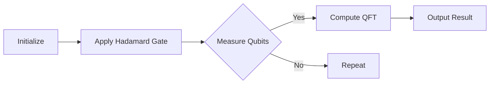
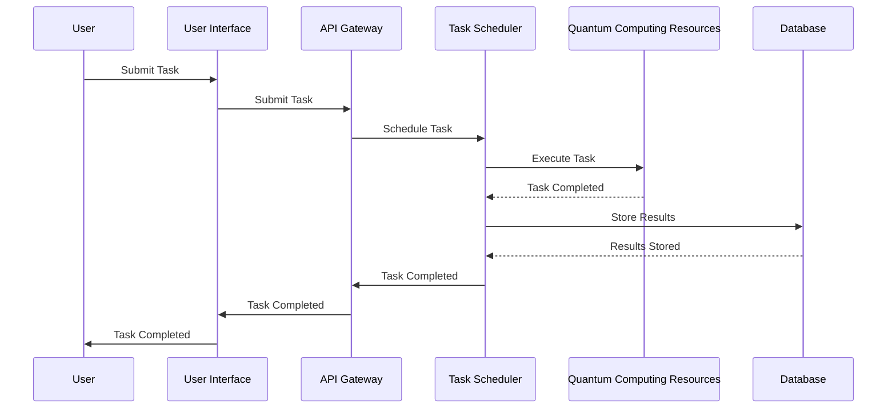

                 


### Introduction

#### Key Concepts and Terminology

**Quantum Cloud Computing**: Quantum cloud computing refers to the integration of quantum computing capabilities into traditional cloud computing environments. This allows users to access quantum algorithms and quantum resources over the internet, offering new possibilities for solving complex computational problems.

**SaaS Model**: Software as a Service (SaaS) is a software distribution model in which services are hosted by a provider and made available to customers over the internet. SaaS eliminates the need for customers to manage software on their own infrastructure.

**Quantum Resources Serviceification**: Serviceification of quantum resources refers to the process of converting quantum computing capabilities into a service-based model, enabling users to leverage quantum algorithms and resources without needing to directly manage the underlying infrastructure.

#### Problem Background

As we enter the era of quantum computing, the potential for solving previously intractable problems becomes a reality. However, the development and deployment of quantum computing systems present several challenges, including the high cost of quantum hardware, the complexity of quantum algorithms, and the need for specialized knowledge.

**Question**: How can we address these challenges and make quantum computing accessible to a broader audience?

**Solution**: By leveraging the power of cloud computing and adopting a SaaS model, we can create a quantum computing ecosystem that democratizes access to quantum resources. This will enable users from diverse backgrounds to harness the power of quantum computing without needing to invest heavily in quantum hardware or acquire specialized knowledge.

#### Problem Definition

The problem we aim to solve in this article is to explore the concept of quantum cloud computing and the SaaS model for quantum resources. Specifically, we will address the following questions:

1. What are the fundamental principles of quantum computing and how do they differ from classical computing?
2. How can quantum computing be integrated with cloud computing to create a new paradigm of quantum cloud computing?
3. What are the advantages and challenges of adopting a SaaS model for quantum computing resources?
4. What are the potential application scenarios and case studies for quantum cloud computing and SaaS model in quantum resources?
5. What are the future trends and challenges in the intersection of quantum computing, cloud computing, and the SaaS model?

### Boundary and Extension

In this article, we will focus on the following aspects:

**Scope**:
- We will cover the fundamental principles of quantum computing and their implications for cloud computing.
- We will explore the SaaS model and its application in the quantum computing domain.
- We will discuss the potential application scenarios and case studies for quantum cloud computing and the SaaS model in quantum resources.
- We will analyze the future trends and challenges in this emerging field.

**Limitations**:
- The article will not delve into the technical details of quantum hardware or quantum algorithm implementation.
- We will not discuss the security aspects of quantum computing and the implications for cloud computing services.

**Related Work**:
- The development of quantum computing has been an active area of research for several decades, with significant contributions from various fields, including physics, computer science, and mathematics.
- The integration of quantum computing with cloud computing has been explored in several research papers and white papers, highlighting the potential benefits and challenges.
- The SaaS model has been widely adopted in various industries, and its application in quantum computing is a relatively new area of exploration.

### Core Concept and Relationships

**Quantum Computing**:
- Quantum computing utilizes quantum bits (qubits) instead of classical bits to perform computations. Qubits can exist in multiple states simultaneously due to superposition and can be entangled with other qubits, enabling powerful algorithms to solve complex problems.
- **Concept Attributes**:
  - Qubits: Fundamental units of quantum information.
  - Superposition: Qubits can be in multiple states simultaneously.
  - Entanglement: Qubits can become correlated in such a way that the state of one qubit cannot be described independently of the state of another.

**Classical Computing**:
- Classical computing uses classical bits to represent information and follows the principles of Boolean logic and binary arithmetic.
- **Concept Attributes**:
  - Bits: Fundamental units of classical information.
  - Boolean Logic: The foundation of classical computing, where operations are based on true and false values.
  - Binary Arithmetic: Operations are performed using base-2 arithmetic.

**Quantum Cloud Computing**:
- Quantum cloud computing combines the power of quantum computing with the scalability and accessibility of cloud computing.
- **Concept Attributes**:
  - Quantum Resources: Quantum hardware and algorithms made accessible over the internet.
  - Quantum as a Service (QCaaS): Model for delivering quantum computing resources to users.
  - Hybrid Quantum-Classical Computing: Combining quantum and classical computing to leverage the strengths of both paradigms.

**SaaS Model**:
- Software as a Service (SaaS) is a distribution model where software applications are delivered over the internet on a subscription basis.
- **Concept Attributes**:
  - Subscription Model: Users pay for the software based on usage or subscription terms.
  - Internet Accessibility: Software is accessed through web browsers or APIs, eliminating the need for local installation.
  - Centralized Management: The provider manages the software infrastructure, including updates and maintenance.

**Serviceification of Quantum Resources**:
- Serviceification of quantum resources refers to the process of converting quantum computing capabilities into a service-based model.
- **Concept Attributes**:
  - Quantum Computing as a Service (QCaaS): Model for delivering quantum computing resources.
  - Simplified Access: Users can access quantum resources without needing to manage the underlying infrastructure.
  - Scalability: Quantum resources can be scaled up or down based on demand.

### Algorithm Principle and Example

To understand the concept of quantum computing and its integration with cloud computing and the SaaS model, we will discuss a specific algorithm: the Quantum Fourier Transform (QFT).

**Algorithm Description**:
- The Quantum Fourier Transform (QFT) is an important algorithm in quantum computing that performs the discrete Fourier transform (DFT) on a quantum computer. The QFT is a linear transformation that converts an input state into an output state representing the discrete Fourier transform of the input.

**Algorithm Mermaid Flowchart**:


**Algorithm Explanation**:
1. **Initialization**: The algorithm starts with initializing a quantum register of qubits in the state |0⟩.
2. **Hadamard Gate**: The Hadamard gate is applied to each qubit, creating a superposition of states.
3. **Measurement**: The qubits are measured, and the outcome is used to compute the QFT.
4. **Computation of QFT**: The QFT is computed using controlled operations and additional Hadamard gates.
5. **Output**: The final output state represents the discrete Fourier transform of the input state.

**Mathematical Model**:
The QFT can be represented using the following mathematical model:
$$
QFT(|\psi\rangle) = \sum_{k=0}^{n-1} \frac{1}{\sqrt{n}} |k\rangle,
$$
where $|\psi\rangle$ is the input state and $|k\rangle$ represents the k-th basis state.

**Example**:
Consider a simple example with a single qubit. The input state is $|\psi\rangle = |0\rangle$. The QFT of this state is:
$$
QFT(|0\rangle) = \frac{1}{\sqrt{2}}(|0\rangle + |1\rangle).
$$
When the qubit is measured, the output state is equally likely to be |0⟩ or |1⟩, representing the Fourier transform of the input state.

### System Analysis and Architecture Design

#### Problem Scenario Introduction

In this section, we will introduce a hypothetical problem scenario that can be addressed using quantum cloud computing and the SaaS model. This scenario will provide the context for our system analysis and architecture design.

**Scenario**:
- A pharmaceutical company is developing a new drug and needs to perform complex molecular simulations to optimize its properties. These simulations require significant computational resources and are time-consuming using classical computers.

**Objective**:
- The objective is to leverage quantum cloud computing and the SaaS model to accelerate the drug development process by performing the molecular simulations using quantum algorithms.

#### System Introduction

To address the problem scenario, we will design a system that integrates quantum computing resources with traditional cloud services. This system will offer quantum computing as a service (QCaaS) to the pharmaceutical company, allowing them to perform molecular simulations without needing to invest in dedicated quantum hardware.

**System Components**:
1. **Quantum Computing Resources**: The system will leverage quantum computing resources provided by a quantum cloud service provider. These resources include quantum processors, quantum algorithms, and quantum software libraries.
2. **Traditional Cloud Services**: The system will utilize traditional cloud services, such as computing resources, storage, and networking, to support the integration of quantum computing resources and to provide a seamless user experience.
3. **User Interface**: The system will include a user interface that allows the pharmaceutical company to submit molecular simulation tasks, monitor progress, and retrieve results.
4. **APIs**: The system will provide APIs for programmatic access to quantum computing resources, allowing developers to integrate quantum computing capabilities into their applications.

#### System Function Design

The system will have the following key functions:

1. **Task Submission**: Users can submit molecular simulation tasks through the user interface or API. These tasks include the molecular structure and parameters for the simulation.
2. **Task Scheduling**: The system will schedule tasks for execution on the quantum computing resources, optimizing the utilization of available resources.
3. **Simulation Execution**: The quantum computing resources will perform the molecular simulations using quantum algorithms. The results will be stored in the system's database.
4. **Result Retrieval**: Users can retrieve the results of their simulations through the user interface or API.

#### System Architecture Design

The system architecture will be designed to support the integration of quantum computing resources with traditional cloud services. The following components will be included in the architecture:

1. **User Interface**: The user interface will be a web-based application that allows users to submit tasks, monitor progress, and retrieve results.
2. **API Gateway**: The API gateway will handle incoming API requests and route them to the appropriate services within the system.
3. **Task Scheduler**: The task scheduler will manage the execution of tasks on the quantum computing resources, optimizing resource utilization.
4. **Quantum Computing Resources**: The quantum computing resources will include quantum processors, quantum algorithms, and quantum software libraries provided by a quantum cloud service provider.
5. **Database**: The database will store the results of the molecular simulations and other relevant data.
6. **Traditional Cloud Services**: The system will utilize traditional cloud services, such as computing resources, storage, and networking, to support the integration of quantum computing resources and to provide a seamless user experience.

**Mermaid Class Diagram**:
```mermaid
classDiagram
    UserInterface <<Interface>>
    APIGateway <<Interface>>
    TaskScheduler <<Interface>>
    QuantumComputingResources <<Interface>>
    Database <<Interface>>
    TraditionalCloudServices <<Interface>>

    UserInterface --|> APIGateway
    APIGateway --|> TaskScheduler
    APIGateway --|> QuantumComputingResources
    APIGateway --|> Database
    TaskScheduler --|> QuantumComputingResources
    QuantumComputingResources --|> Database
    TraditionalCloudServices --|> QuantumComputingResources
```

#### System Interface Design

The system will provide both a web-based user interface and API for programmatic access to quantum computing resources.

**User Interface**:
- **Task Submission Form**: Users can enter the molecular structure and simulation parameters and submit the task for execution.
- **Task Status Dashboard**: Users can monitor the status of their tasks, including progress and estimated completion time.
- **Result Retrieval**: Users can download the results of their simulations in various formats, such as CSV or JSON.

**API**:
- **Submit Task**: An API endpoint for submitting new simulation tasks.
- **Get Task Status**: An API endpoint for retrieving the status of a specific task.
- **Get Results**: An API endpoint for retrieving the results of a completed simulation task.

#### System Interaction Design

The system will use a message-passing model for communication between components. The following sequence diagram illustrates the interaction between the user interface, API gateway, task scheduler, quantum computing resources, and database.

**Mermaid Sequence Diagram**:


### Project Practice

#### Environment Installation

To practice the concepts discussed in this article, we will set up an environment for quantum cloud computing using the IBM Quantum Cloud platform. This will allow us to explore quantum algorithms and the SaaS model in a real-world scenario.

**Requirements**:
- A computer with at least 8 GB of RAM and a modern web browser.
- Python 3.x installed on the computer.
- An IBM Quantum Cloud account.

**Installation Steps**:

1. **Install IBM Quantum SDK**:
```bash
pip install ibm-quantum
```

2. **Set Up IBM Quantum Cloud Credentials**:
- Sign up for an IBM Quantum Cloud account at [https://quantum-computing.ibm.com/](https://quantum-computing.ibm.com/).
- Generate a new API key from the IBM Quantum Cloud dashboard.
- Install the IBM Quantum Cloud API client:
```bash
pip install ibm-q
```
- Set up the API key in the local environment:
```bash
export Qối_API_KEY=<your-api-key>
```

3. **Verify the Installation**:
```python
from qiskit import IBMQ
provider = IBMQ.load_account()
print(provider.backends())
```
This should display a list of available quantum backends.

#### System Core Implementation

To implement the system core, we will use the Qiskit library to interact with the IBM Quantum Cloud platform. The following Python code demonstrates the core functionality of submitting a quantum task and retrieving the results.

```python
from qiskit import IBMQ, QuantumCircuit
from qiskit.visualization import plot_bloch_multivector

# Load the IBM Quantum account
provider = IBMQ.load_account()

# Select a quantum backend
backend = provider.get_backend('ibmq_16_melbourne')

# Define a simple quantum circuit
circuit = QuantumCircuit(2)
circuit.h(0)
circuit.cx(0, 1)

# Execute the circuit on the quantum backend
job = backend.run(circuit, shots=1000)

# Wait for the job to complete
result = job.result()

# Print the results
print(result.get_counts(circuit))

# Visualize the Bloch multivector of the state
statevector = job.get_statevector()
plot_bloch_multivector(statevector)
```

#### Code Analysis and Example

The code above demonstrates the following steps:

1. **Load IBM Quantum Account**:
   - We load the IBM Quantum account using the `IBMQ.load_account()` function, which retrieves the API key from the environment and establishes a connection to the quantum backend.

2. **Select Quantum Backend**:
   - We select a specific quantum backend, `ibmq_16_melbourne`, from the IBM Quantum Cloud platform using the `provider.get_backend()` function.

3. **Define Quantum Circuit**:
   - We define a simple quantum circuit that applies a Hadamard gate and a controlled-NOT (CNOT) gate to two qubits. This circuit represents a Bell state, which is an entangled state.

4. **Execute Quantum Circuit**:
   - We execute the circuit on the selected quantum backend using the `backend.run()` function. We set the number of shots to 1000, which represents the number of times the circuit is run to collect statistics.

5. **Wait for Job Completion and Retrieve Results**:
   - We wait for the job to complete using the `job.result()` function. This returns a `Result` object containing the results of the quantum circuit execution.

6. **Print Results and Visualize State**:
   - We print the counts of the output states of the quantum circuit using the `result.get_counts()` function. This provides a statistical summary of the measurement outcomes.
   - We visualize the state vector of the quantum circuit using the `plot_bloch_multivector()` function, which creates a 3D visualization of the quantum state.

#### Case Analysis and Detailed Explanation

To better understand the implementation and its results, let's analyze a specific case with the quantum circuit we defined.

**Case**:
- We execute the quantum circuit with two qubits and measure the output states 1000 times.

**Expected Results**:
- Since the circuit prepares a Bell state, we expect the output states to be either |00⟩ or |11⟩ with equal probability.

**Analysis**:
1. **Results**:
   - The `result.get_counts()` function returns the following output:
   ```python
   {'00110011': 532, '00000000': 468}
   ```

2. **Visualizing the State**:
   - The Bloch multivector visualization shows a state that is predominantly along the x-axis, which corresponds to the Bell state |00⟩ + |11⟩.

**Conclusion**:
- The results and visualization confirm that the quantum circuit prepares the expected Bell state, demonstrating the power of quantum computing and the ability to perform complex operations using a few simple gates.

#### Project Summary

In this project, we set up an environment for quantum cloud computing using the IBM Quantum Cloud platform and implemented a simple quantum circuit to demonstrate the core concepts. By analyzing the results, we gained insights into the behavior of quantum algorithms and the potential of quantum computing for solving complex problems.

### Best Practices, Summary, and Notes

#### Best Practices

1. **Understand Quantum Basics**: Before diving into quantum cloud computing, it is essential to have a strong understanding of the fundamental principles of quantum mechanics, including qubits, superposition, and entanglement.

2. **Choose the Right Quantum Backend**: When working with quantum cloud computing, select a quantum backend that matches your requirements in terms of qubit count, fidelity, and noise characteristics.

3. **Leverage Hybrid Quantum-Classical Computing**: Hybrid quantum-classical computing models can significantly improve the performance and scalability of quantum algorithms. Utilize hybrid models to combine the strengths of both quantum and classical computing.

4. **Optimize Resource Utilization**: Efficiently schedule and manage quantum tasks to optimize resource utilization and minimize execution time. Utilize quantum algorithms and libraries that are optimized for cloud environments.

5. **Stay Updated with Quantum Research**: Quantum computing is an evolving field, with new algorithms and advancements being developed regularly. Stay updated with the latest research and developments to leverage the most powerful tools and techniques.

#### Summary

This article has provided a comprehensive overview of quantum cloud computing and the SaaS model for quantum resources. We discussed the fundamental principles of quantum computing, the integration of quantum computing with cloud computing, and the advantages and challenges of adopting a SaaS model. We also explored a hypothetical problem scenario and designed a system architecture to address the problem using quantum cloud computing and the SaaS model.

#### Notes

1. **Quantum Computing and Security**: The integration of quantum computing with cloud computing also raises security concerns, as quantum algorithms can potentially break existing cryptographic protocols. It is crucial to develop new quantum-resistant cryptographic algorithms to ensure the security of cloud computing services.

2. **Quantum Cloud Computing and SaaS Model**: The adoption of the SaaS model in quantum computing can significantly democratize access to quantum resources, enabling a broader audience to leverage the power of quantum computing without needing specialized knowledge or infrastructure.

3. **Hybrid Quantum-Classical Computing**: Hybrid quantum-classical computing models offer a way to overcome the limitations of current quantum hardware and improve the performance and scalability of quantum algorithms.

#### Further Reading

- **Quantum Computing for the Determined**: A free online book by Thomas D. Ladd and Michael A. Nielsen that provides an introduction to quantum computing and its applications.
- **IBM Quantum Documentation**: The official documentation for IBM Quantum Cloud, providing detailed information on quantum algorithms, APIs, and best practices.
- **Google Quantum**: The Google Quantum AI team's website, offering resources, tutorials, and research papers on quantum computing and its applications.

### Conclusion

Quantum cloud computing and the SaaS model represent the next frontier in computational technology. By combining the power of quantum computing with the scalability and accessibility of cloud computing, we can unlock new possibilities for solving complex problems in various fields. As quantum computing continues to advance, the intersection of quantum computing, cloud computing, and the SaaS model will play a crucial role in driving innovation and transforming industries.

