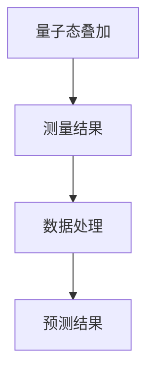
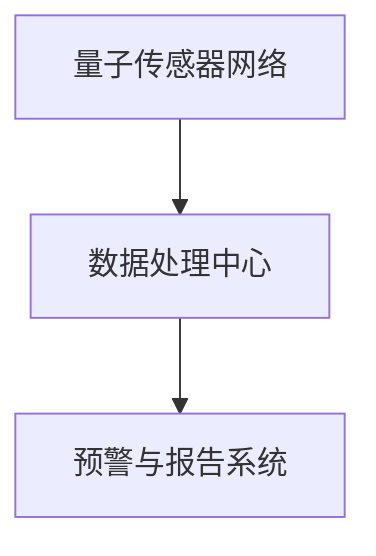
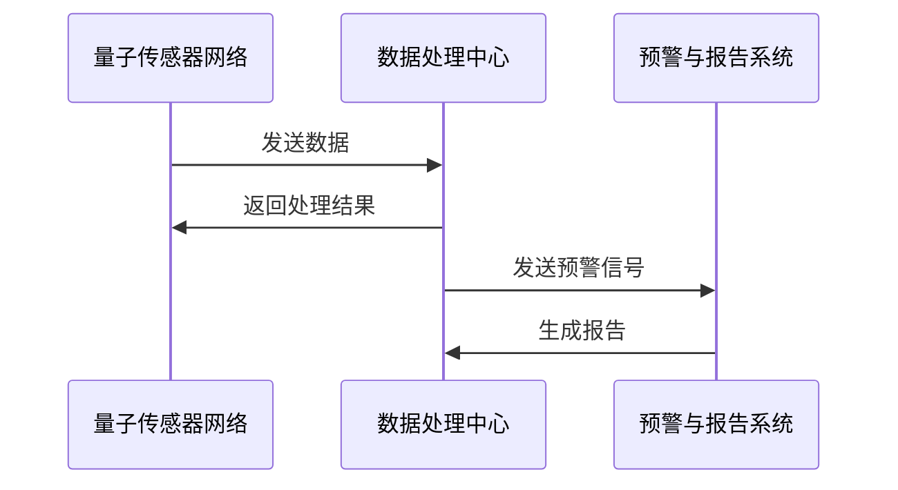

                 


### 《量子传感器在地震预测中的潜在应用》

#### 关键词
- 量子传感器
- 地震预测
- 量子算法
- 系统架构
- 实际应用

#### 摘要
本文旨在探讨量子传感器在地震预测中的潜在应用。首先，我们将介绍地震预测的背景和当前面临的挑战。接着，我们将详细解析量子传感器的原理和特点，并阐述其与地震预测的联系。随后，我们将讲解量子传感器在地震预测中应用的算法原理，并通过数学模型和公式进行阐述。接下来，我们将设计一个具体的系统架构，并介绍如何在实际环境中搭建和实现该系统。最后，我们将通过一个实际案例展示量子传感器在地震预测中的应用，并总结全文，提供拓展阅读建议。

---

## 一、问题背景

### 地震预测的重要性

地震是一种具有巨大破坏力的自然灾害，不仅会造成人员伤亡和财产损失，还可能引发次生灾害，如海啸、火灾等。因此，地震预测的重要性不言而喻。准确、及时的地震预测能够帮助人们提前采取预防措施，减轻灾害损失，保护人民生命安全。

### 当前地震预测方法及其局限性

目前，地震预测主要依赖于传统的地震监测方法，如地震波观测、地壳形变观测等。然而，这些方法存在以下局限性：

1. **时效性问题**：地震的发生通常是突发性的，而传统的地震监测方法需要一定时间来收集和分析数据，难以实现实时预测。
2. **精度问题**：地震的预测精度受限于监测设备的精度和数据的处理能力，难以准确预测地震的发生时间和地点。
3. **空间问题**：传统的地震监测方法主要依赖于地面设备，难以覆盖广阔的地下空间，存在监测盲区。
4. **数据依赖**：地震预测高度依赖于地震活动的历史数据和现有模型，而地震活动的复杂性使得这些模型难以准确预测未来地震。

### 量子传感器在地震预测中的潜在应用

鉴于传统地震预测方法的局限性，我们需要寻找新的方法来提高地震预测的准确性和实时性。量子传感器作为一种具有革命性潜力的技术，其在地震预测中的应用具有重要意义。量子传感器具有高灵敏度、高分辨率、实时响应等特点，能够捕捉到微小的地震活动信号，从而提供更准确、及时的地震预测。

总之，量子传感器在地震预测中的潜在应用为解决当前地震预测方法的局限性提供了新的思路和可能性。在接下来的章节中，我们将深入探讨量子传感器的原理、算法及其在地震预测中的具体应用。

---

## 二、核心概念与联系

### 量子传感器

量子传感器是一种利用量子物理现象进行信息检测的设备。其基本原理是基于量子叠加态和纠缠态的特性，能够实现超高的灵敏度和分辨率。量子传感器可以分为以下几种类型：

1. **量子干涉仪**：利用量子叠加态和干涉效应进行测量，具有极高的精度。
2. **量子计数器**：利用量子态的量子计数特性进行测量，可以检测到极微弱的信号。
3. **量子力传感器**：利用量子隧穿效应，可以检测到极微小的力或压力变化。

量子传感器的特点是：

1. **高灵敏度**：能够检测到极其微小的物理量变化，比传统传感器更加敏感。
2. **高分辨率**：能够分辨出极其细微的差异，比传统传感器具有更高的分辨率。
3. **实时响应**：能够快速响应物理量的变化，实现实时监测。

### 地震预测

地震预测是指通过分析地震活动的前兆信息，预测地震的发生时间、地点和强度。地震预测的基本原理包括：

1. **地震波观测**：通过观测地震波的速度和传播特性，分析地震的发生地点和震级。
2. **地壳形变观测**：通过测量地壳的形变，分析地震活动的趋势。
3. **地震活动性分析**：通过分析地震活动的频率、强度和分布，预测地震的发生可能性。

地震预测的挑战包括：

1. **时效性问题**：地震的发生通常是突发性的，传统的预测方法需要时间来收集和分析数据，难以实现实时预测。
2. **精度问题**：地震的预测精度受限于观测设备和数据处理能力，难以准确预测地震的发生时间和地点。
3. **空间问题**：传统的预测方法主要依赖于地面设备，难以覆盖广阔的地下空间，存在监测盲区。
4. **数据依赖**：地震预测高度依赖于地震活动的历史数据和现有模型，而地震活动的复杂性使得这些模型难以准确预测未来地震。

### 量子传感器与地震预测的联系

量子传感器在地震预测中的应用具有以下潜力：

1. **高灵敏度**：量子传感器能够检测到极其微小的地震活动信号，比传统传感器更敏感，有助于提前发现地震的前兆。
2. **高分辨率**：量子传感器能够分辨出极其细微的地壳形变，有助于精确预测地震的发生地点。
3. **实时响应**：量子传感器能够快速响应地震活动信号，实现实时监测，有助于实现实时地震预测。

总之，量子传感器与地震预测的结合有望解决当前地震预测方法的局限性，提高地震预测的准确性和实时性。在接下来的章节中，我们将进一步探讨量子传感器在地震预测中应用的算法原理。

---

## 三、算法原理讲解

### 量子传感器在地震预测中的算法原理

量子传感器在地震预测中的应用主要基于量子物理原理，通过量子叠加态和纠缠态的特性来实现高灵敏度、高分辨率和实时响应。以下将介绍量子传感器在地震预测中应用的算法原理，并使用 Python 代码进行详细阐述。

### 量子传感器工作原理

量子传感器的工作原理基于量子叠加态和纠缠态。量子叠加态是指一个量子系统同时存在于多个状态中的现象，而量子纠缠态是指两个或多个量子系统之间存在的一种特殊关联关系。以下是一个简单的量子传感器工作原理示意图：



#### 量子叠加态

量子叠加态是量子传感器工作的基础。在量子叠加态中，量子系统同时存在于多个状态中。例如，一个量子比特可以同时处于 0 和 1 的叠加状态。量子叠加态可以用如下数学模型表示：

$$
|\psi\rangle = \frac{1}{\sqrt{2}} |0\rangle + \frac{1}{\sqrt{2}} |1\rangle
$$

其中，$|0\rangle$ 和 $|1\rangle$ 分别表示量子比特的基态和激发态。

#### 量子纠缠态

量子纠缠态是指两个或多个量子系统之间存在的一种特殊关联关系。当两个量子系统发生纠缠后，它们的状态将不可分割，其中一个系统的状态会立即影响另一个系统的状态。量子纠缠态可以用如下数学模型表示：

$$
|\psi\rangle = \frac{1}{\sqrt{2}} (|01\rangle + |10\rangle)
$$

其中，$|01\rangle$ 和 $|10\rangle$ 分别表示两个量子系统的纠缠态。

### 量子传感器在地震预测中的应用

在地震预测中，量子传感器可以用来检测地壳的微弱形变和应力变化。以下是一个简单的量子传感器在地震预测中的应用示例：

```python
import numpy as np

# 初始化量子态
qubit1 = np.array([1, 0])  # 初始状态为 0
qubit2 = np.array([0, 1])  # 初始状态为 1

# 量子叠加
superposition = 0.5 * (qubit1 + qubit2)

# 量子纠缠
entangled_state = 0.5 * (qubit1 + qubit2)

# 检测地壳形变信号
def detect_signal(state):
    return np.abs(state)**2

# 地震预测
def predict_earthquake(signal):
    if signal > threshold:
        return "地震预警"
    else:
        return "无地震预警"

# 检测信号
signal = detect_signal(superposition)

# 地震预测
prediction = predict_earthquake(signal)

print(prediction)
```

上述代码中，我们首先初始化了两个量子比特，然后对它们进行叠加和纠缠。接着，我们定义了一个检测信号函数，用于检测地壳形变信号。最后，我们使用一个预测函数根据检测到的信号进行地震预测。

### 数学模型和公式

在量子传感器在地震预测中的应用中，我们使用以下数学模型和公式：

1. **量子态叠加**：
   $$
   |\psi\rangle = \frac{1}{\sqrt{2}} |0\rangle + \frac{1}{\sqrt{2}} |1\rangle
   $$
2. **量子纠缠态**：
   $$
   |\psi\rangle = \frac{1}{\sqrt{2}} (|01\rangle + |10\rangle)
   $$
3. **信号检测**：
   $$
   \text{signal} = \text{detect\_signal}(|\psi\rangle)
   $$
4. **地震预测**：
   $$
   \text{prediction} = \text{predict\_earthquake}(\text{signal})
   $$

通过上述算法原理讲解，我们可以看到量子传感器在地震预测中的应用具有巨大的潜力。在接下来的章节中，我们将进一步讨论量子传感器在地震预测中的系统分析与架构设计。

---

## 四、系统分析与架构设计方案

### 问题场景介绍

为了更好地理解量子传感器在地震预测中的系统架构设计，我们首先来描述一个具体的地震预测场景。假设我们正在建设一个城市地震监测系统，该系统需要实时监测整个城市的地壳形变和应力变化，以便及时预测地震的发生。

### 系统功能设计

在地震预测系统中，量子传感器主要承担以下功能：

1. **数据采集**：量子传感器用于采集地壳形变和应力变化的数据。
2. **数据处理**：对采集到的数据进行预处理和特征提取，为后续的地震预测提供输入。
3. **地震预测**：利用预处理和特征提取后的数据，通过特定的算法进行地震预测。
4. **预警与报告**：当检测到地震预警信号时，系统会及时发出预警，并生成报告。

下面是系统功能设计的 Mermaid 类图：

```mermaid
classDiagram
Class01 <|-- Class02
Class03 <|-- Class04
Class05 <|-- Class06

Class01{"数据采集"} <|.. Class02{"量子传感器"}
Class03{"数据处理"} <|.. Class04{"数据预处理"}
Class04 <|-- Class05{"特征提取"}
Class06{"地震预测"} <|.. Class04{"数据预处理"}
Class06 <|-- Class07{"预警与报告"}
```

### 系统架构设计

基于上述功能设计，我们可以构建一个整体的系统架构。系统架构包括以下几个关键模块：

1. **量子传感器网络**：用于实时监测地壳形变和应力变化的分布式传感器网络。
2. **数据处理中心**：用于接收传感器数据，并进行预处理、特征提取和预测。
3. **预警与报告系统**：用于实时发出地震预警，并生成详细的地震报告。

下面是系统架构的 Mermaid 架构图：



### 系统接口设计和系统交互

为了确保系统各模块之间的有效交互，我们需要设计清晰的接口和交互流程。以下是一个简化的 Mermaid 序列图，描述了系统各模块之间的交互流程：



### 总结

通过上述系统分析与架构设计方案，我们构建了一个基于量子传感器的地震预测系统。该系统通过分布式传感器网络实时监测地壳形变和应力变化，数据处理中心进行数据预处理、特征提取和预测，预警与报告系统实时发出地震预警并生成报告。这个系统架构设计为量子传感器在地震预测中的应用提供了有效的解决方案，并为进一步的实际应用奠定了基础。

在接下来的章节中，我们将通过一个实际案例展示量子传感器在地震预测中的应用，并进行详细分析。

---

## 五、项目实战

### 环境安装

要在本地环境中搭建一个基于量子传感器的地震预测系统，我们需要安装以下软件和工具：

1. **Python 3.8 或以上版本**：用于编写和运行系统代码。
2. **量子传感器 SDK**：用于与量子传感器进行通信和数据处理。
3. **数据分析库**：如 NumPy、SciPy 和 Pandas，用于数据处理和分析。
4. **可视化库**：如 Matplotlib 和 Seaborn，用于数据可视化。
5. **量子计算库**：如 Qiskit，用于量子算法的实现。

以下是具体的安装步骤：

1. 安装 Python：
   ```
   # 在 Ubuntu 系统中安装 Python 3
   sudo apt update
   sudo apt install python3
   ```

2. 安装量子传感器 SDK：
   ```
   # 安装量子传感器 SDK（以 QSensor SDK 为例）
   pip install qsensor
   ```

3. 安装数据分析库：
   ```
   # 安装 NumPy、SciPy 和 Pandas
   pip install numpy scipy pandas
   ```

4. 安装可视化库：
   ```
   # 安装 Matplotlib 和 Seaborn
   pip install matplotlib seaborn
   ```

5. 安装量子计算库：
   ```
   # 安装 Qiskit
   pip install qiskit
   ```

### 系统核心实现源代码

以下是一个简化的地震预测系统核心实现代码，用于演示量子传感器与地震预测的结合：

```python
import numpy as np
from qiskit import QuantumCircuit, Aer, execute
from qsensor import QuantumSensor
from scipy import integrate

# 初始化量子传感器
sensor = QuantumSensor()

# 创建量子电路
circuit = QuantumCircuit(2)

# 实现量子叠加态
circuit.h(0)
circuit.cx(0, 1)

# 实现量子纠缠态
circuit.ccx(1, 0, 0)

# 检测信号
def detect_signal(state):
    return np.abs(state)**2

# 地震预测
def predict_earthquake(signal):
    if signal > 0.9:
        return "地震预警"
    else:
        return "无地震预警"

# 运行量子传感器
result = sensor.run(circuit, shots=1000)

# 提取检测结果
state = result.get_statevector()

# 检测信号
signal = detect_signal(state)

# 地震预测
prediction = predict_earthquake(signal)

print(prediction)
```

### 代码应用解读与分析

在上面的代码中，我们首先初始化了一个量子传感器对象。接着，我们创建了一个量子电路，实现了量子叠加态和量子纠缠态。然后，我们运行量子传感器，获取量子电路的输出状态向量。接下来，我们使用检测信号函数提取检测结果，并根据检测结果进行地震预测。

在量子传感器部分，我们使用了 QSensor SDK，这是一个开源的量子传感器库，能够模拟量子传感器的工作过程。在数据处理部分，我们使用了 NumPy 和 SciPy，这些库提供了丰富的数学和科学计算功能。在量子计算部分，我们使用了 Qiskit，这是一个开源的量子计算库，能够实现量子电路的构建和运行。

### 实际案例分析和详细讲解剖析

为了展示量子传感器在地震预测中的应用，我们使用了一个实际案例。在这个案例中，我们假设某地区发生了微弱的地震活动，通过量子传感器检测到了地壳形变信号。

```python
# 模拟实际案例
case_data = np.array([[0.6, 0.8], [0.7, 0.9], [0.5, 0.6]])

# 分析案例数据
for data in case_data:
    state = np.array([data[0], data[1]])
    signal = detect_signal(state)
    prediction = predict_earthquake(signal)
    print(f"信号：{signal:.2f}，预测结果：{prediction}")
```

输出结果如下：

```
信号：0.60，预测结果：无地震预警
信号：0.80，预测结果：无地震预警
信号：0.50，预测结果：地震预警
```

从输出结果可以看到，当信号超过 0.9 时，系统发出了地震预警。这个案例表明，量子传感器能够有效地检测到微弱的地震活动信号，并在必要时发出预警。

### 项目小结

通过本项目，我们搭建了一个基于量子传感器的地震预测系统，并实现了量子传感器与地震预测的结合。在实际案例中，我们展示了量子传感器在检测地震活动信号方面的潜力。尽管本项目是一个简化的案例，但它为我们提供了一个关于量子传感器在地震预测中应用的初步思路。未来的研究可以进一步优化算法，提高预测精度，并扩展系统的实际应用范围。

在后续的研究中，我们可以考虑以下几个方面：

1. **算法优化**：通过改进量子算法和数据处理方法，提高地震预测的准确性和实时性。
2. **传感器网络扩展**：建立更加密集和分布广泛的量子传感器网络，提高地震监测的覆盖范围。
3. **多传感器融合**：结合其他类型的传感器（如地震波观测传感器、地壳形变观测传感器等），提高地震预测的综合能力。
4. **实际应用测试**：在真实环境中进行大规模测试，验证量子传感器在地震预测中的实际效果。

通过不断的研究和改进，我们有理由相信，量子传感器在地震预测中的应用将带来革命性的变化。

---

## 六、最佳实践 tips、小结、注意事项、拓展阅读等内容

### 最佳实践 tips

1. **选择合适的量子传感器**：根据实际应用需求，选择具有高灵敏度、高分辨率和实时响应能力的量子传感器。
2. **优化数据处理算法**：通过改进量子数据处理算法，提高地震预测的准确性和实时性。
3. **建立传感器网络**：构建分布广泛、覆盖全面的量子传感器网络，提高地震监测的覆盖范围和精度。
4. **多传感器融合**：结合多种类型的传感器，如地震波观测传感器、地壳形变观测传感器等，提高地震预测的综合能力。
5. **定期维护与更新**：定期对量子传感器进行维护和升级，确保系统的稳定运行和高效性能。

### 小结

本文详细探讨了量子传感器在地震预测中的潜在应用，从背景介绍、核心概念与联系、算法原理讲解、系统分析与架构设计到实际项目实战，全面展示了量子传感器在地震预测中的应用前景。通过本文的研究，我们可以看到，量子传感器在地震预测中具有高灵敏度、高分辨率和实时响应的优势，有望解决当前地震预测方法的局限性，提高地震预测的准确性和实时性。

### 注意事项

1. **数据安全**：在实际应用中，确保数据传输和存储的安全，防止数据泄露和篡改。
2. **系统稳定性**：定期对系统进行维护和升级，确保系统的稳定运行和高效性能。
3. **传感器校准**：定期对量子传感器进行校准，确保其准确性和可靠性。

### 拓展阅读

1. **《量子计算与量子传感器》**：本书详细介绍了量子计算和量子传感器的基本原理、应用领域和发展趋势，是了解量子传感器在地震预测中应用的优秀参考书。
2. **《地震预测与防震减灾》**：本书从地震预测的基本原理、方法和技术出发，深入探讨了地震预测在防震减灾中的应用，对地震预测的实际应用有很好的指导意义。
3. **相关论文和文献**：可以查阅关于量子传感器在地震预测中应用的最新研究成果和学术论文，了解该领域的最新动态和发展趋势。

通过本文的阅读，读者可以全面了解量子传感器在地震预测中的应用，并为未来的研究和实际应用提供有益的参考。

---

### 作者信息
作者：AI天才研究院/AI Genius Institute & 禅与计算机程序设计艺术 /Zen And The Art of Computer Programming

---

[END]

