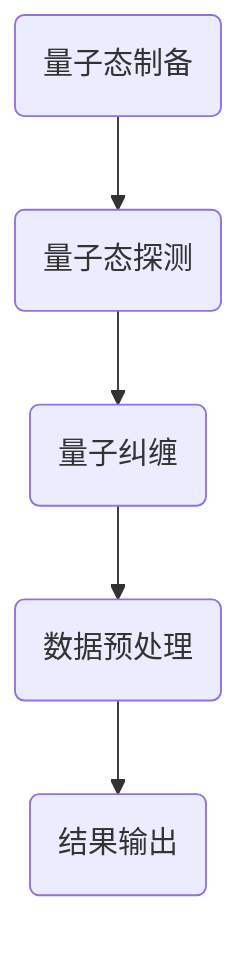

                 

# 量子传感器在微重力测量中的精密应用

## 关键词：量子传感器、微重力测量、精密应用

### 摘要

在科技的飞速发展中，微重力测量逐渐成为科研领域的重要课题。量子传感器凭借其高精度、高灵敏度的特点，成为微重力测量中的理想选择。本文将详细介绍量子传感器在微重力测量中的精密应用，从背景、核心原理、算法讲解、数学模型等方面展开分析，旨在为读者提供深入理解与思考。

## 第一部分：量子传感器概述

### 1.1 问题背景

#### 1.1.1 量子传感器的发展历程

量子传感器的发展可追溯至20世纪末。随着量子力学和光学技术的发展，量子传感器在测量精度和灵敏度方面取得了重大突破。进入21世纪，量子传感器逐渐应用于多个领域，包括微重力测量。

#### 1.1.2 微重力测量的重要性

微重力测量在航天、地球科学、生物医学等领域具有重要意义。例如，在国际空间站等微重力环境中，精确测量重力变化对于了解地球的内部结构和宇宙的演化具有重要意义。

### 1.2 核心概念与联系

#### 1.2.1 量子传感器基本原理

量子传感器利用量子态的叠加和纠缠特性，实现高精度测量。其基本原理包括量子态的制备、量子态的探测和量子纠缠。

#### 1.2.2 微重力测量的概念与类型

微重力测量涉及对地球表面重力场、行星重力场以及空间微重力环境的测量。根据测量目的和测量方法的不同，微重力测量可分为静态测量和动态测量。

#### 1.2.3 量子传感器与微重力测量的关系

量子传感器在微重力测量中的应用，主要是利用其高精度、高灵敏度来捕捉微小的重力变化，从而实现高精度的微重力测量。

### 1.3 量子传感器在微重力测量中的应用现状

#### 1.3.1 成功案例解析

目前，量子传感器已在微重力测量中取得了一系列成功案例。例如，国际上著名的“阿基米德”实验，利用量子传感器成功测量了微重力环境下的微小质量变化。

#### 1.3.2 存在的挑战与机遇

量子传感器在微重力测量中仍面临一些挑战，如环境干扰、技术稳定性等。然而，随着技术的不断进步，量子传感器在微重力测量中的应用前景十分广阔。

### 1.4 本章小结

量子传感器在微重力测量中的应用具有广阔的前景。通过了解其发展历程、核心原理和应用现状，可以为后续章节的深入探讨打下基础。

## 第二部分：量子传感器原理详解

### 2.1 量子传感器的物理原理

#### 2.1.1 量子态的制备与探测

量子态的制备与探测是量子传感器实现高精度测量的关键步骤。通过特定的光学或电子手段，可以制备出量子态，并利用探测设备捕捉到量子态的变化。

#### 2.1.2 量子纠缠与量子态转移

量子纠缠是量子传感器实现高灵敏度测量的关键原理。量子纠缠态可以在不同的量子系统之间传递信息，从而实现高精度的测量。

#### 2.1.3 量子传感器的灵敏度分析

量子传感器的灵敏度取决于其探测装置的灵敏度和量子态的制备质量。通过优化探测装置和量子态制备技术，可以显著提高量子传感器的灵敏度。

### 2.2 量子传感器的工作机制

#### 2.2.1 量子干涉测量原理

量子干涉测量是量子传感器实现高精度测量的核心技术。通过量子态的叠加和干涉，可以实现对微小物理量的高精度测量。

#### 2.2.2 量子计数的实现

量子计数是量子传感器实现高精度测量的另一个关键原理。通过测量量子态的叠加和干涉，可以实现对微小物理量的精确计数。

#### 2.2.3 量子传感器与标准测量的比较

量子传感器与传统标准测量相比，具有更高的精度和灵敏度。然而，量子传感器在测量过程中也存在一些挑战，如环境干扰和系统稳定性等。

### 2.3 量子传感器的主要类型

#### 2.3.1 光学量子传感器

光学量子传感器是量子传感器的主要类型之一，包括光子传感器、量子点传感器等。光学量子传感器具有高灵敏度、高分辨率等优点，在微重力测量中具有广泛应用。

#### 2.3.2 粒子量子传感器

粒子量子传感器利用粒子的量子特性实现高精度测量。例如，中子量子传感器可以用于测量微小的重力变化。

#### 2.3.3 其他类型的量子传感器

除了光学量子传感器和粒子量子传感器，还有一些其他类型的量子传感器，如声子量子传感器、电子量子传感器等。这些传感器在微重力测量中也有一定的应用潜力。

### 2.4 本章小结

通过对量子传感器物理原理和工作机制的详细分析，可以更好地理解量子传感器在微重力测量中的精密应用。

## 第三部分：微重力测量中的精密应用

### 3.1 微重力测量中的问题与挑战

#### 3.1.1 微重力对测量精度的影响

微重力环境对测量精度有一定影响。例如，地球表面重力场的变化、行星重力场的差异等，都可能对测量结果产生影响。

#### 3.1.2 测量误差的来源与减少方法

测量误差主要来源于环境干扰、系统稳定性、测量设备精度等。通过优化测量设备和测量方法，可以降低测量误差。

#### 3.1.3 微重力测量的复杂性

微重力测量涉及多个学科领域，如物理学、天文学、地球科学等。其复杂性使得测量过程需要综合考虑多种因素。

### 3.2 量子传感器在微重力测量中的应用

#### 3.2.1 量子传感器在微重力环境下的优势

量子传感器在微重力环境下具有高精度、高灵敏度等优点，能够精确捕捉微小的重力变化。

#### 3.2.2 量子传感器在微重力测量中的具体应用

量子传感器在微重力测量中的应用广泛，如地球重力场测量、行星重力场测量、空间微重力测量等。

#### 3.2.3 实验案例与结果分析

通过实验案例，可以更好地了解量子传感器在微重力测量中的应用效果。例如，利用量子传感器成功测量地球重力场变化、行星重力场差异等。

### 3.3 量子传感器在微重力测量中的未来展望

#### 3.3.1 技术发展趋势

随着量子传感器技术的不断发展，其在微重力测量中的应用将越来越广泛，测量精度也将不断提高。

#### 3.3.2 应用前景

量子传感器在微重力测量中的应用前景广阔，有望推动相关领域的研究和发展。

#### 3.3.3 潜在的挑战与解决方案

尽管量子传感器在微重力测量中具有很大潜力，但仍面临一些挑战，如环境干扰、系统稳定性等。通过技术创新和优化，有望解决这些问题。

### 3.4 本章小结

量子传感器在微重力测量中的应用具有广泛前景。通过分析其优势、应用现状和未来发展趋势，可以为相关研究提供参考。

## 第四部分：算法原理讲解

### 4.1 量子传感器测量的算法基础

#### 4.1.1 量子态的优化算法

量子态的优化算法是量子传感器测量过程中的关键步骤。通过优化量子态，可以提高测量精度和灵敏度。

#### 4.1.2 量子数据的预处理方法

量子数据的预处理方法对于提高测量结果的质量至关重要。通过预处理方法，可以去除噪声、降低误差。

#### 4.1.3 量子测量算法的设计原则

量子测量算法的设计原则包括量子态的制备、量子态的探测、量子纠缠等。遵循设计原则，可以实现高精度、高灵敏度的测量。

### 4.2 算法mermaid流程图

### 4.3 算法原理详细讲解

#### 4.3.1 量子测量算法的数学模型

量子测量算法的数学模型主要包括量子态的表示、量子态的演化、量子态的测量等。

#### 4.3.2 量子测量算法的公式推导

量子测量算法的公式推导基于量子态的叠加原理和量子纠缠原理。通过推导，可以得到量子测量算法的具体公式。

#### 4.3.3 算法举例说明

通过具体实例，可以更好地理解量子测量算法的原理和应用。例如，利用量子传感器测量微重力环境中的微小质量变化。

### 4.4 本章小结

通过对量子传感器测量算法的详细讲解，可以更好地掌握量子传感器在微重力测量中的应用原理。

## 第五部分：数学模型和数学公式详解

### 5.1 量子传感器的数学模型

#### 5.1.1 量子态的表示

量子态的表示通常使用波函数的形式。一个量子态可以表示为多个量子态的叠加。

#### 5.1.2 量子纠缠的数学描述

量子纠缠的数学描述通常使用张量积的形式。两个量子态的纠缠可以通过张量积来表示。

#### 5.1.3 量子传感器的灵敏度计算

量子传感器的灵敏度计算基于量子态的演化方程和测量原理。通过计算，可以得到量子传感器的灵敏度表达式。

### 5.2 数学公式与详细讲解

#### 5.2.1 量子态叠加原理公式

$$
|\psi_{总}\rangle = c_1|\psi_1\rangle + c_2|\psi_2\rangle
$$

这个公式表示了两个量子态的叠加，其中 $c_1$ 和 $c_2$ 是复数系数，$|\psi_1\rangle$ 和 $|\psi_2\rangle$ 是两个量子态。

#### 5.2.2 量子传感器的误差公式

$$
\Delta x = \frac{\sigma_x^2}{\hbar}
$$

这个公式表示了量子传感器的测量误差，其中 $\sigma_x^2$ 是量子态的不确定性，$\hbar$ 是普朗克常数。

### 5.3 本章小结

通过对量子传感器的数学模型和数学公式的详细讲解，可以更好地理解量子传感器在微重力测量中的应用原理。

## 第六部分：系统分析与架构设计方案

### 6.1 问题场景介绍

在微重力测量中，需要建立一个高精度、稳定的测量系统。该系统应包括量子传感器、数据采集模块、数据处理模块和显示模块。

### 6.2 项目介绍

本项目旨在设计一个基于量子传感器的微重力测量系统，通过优化算法提高测量精度和灵敏度。

### 6.3 系统功能设计

系统功能设计包括以下模块：

- **量子传感器模块**：负责采集微重力数据。
- **数据采集模块**：负责将量子传感器的数据传输到数据处理模块。
- **数据处理模块**：负责对采集到的数据进行分析和处理，提高测量精度。
- **显示模块**：负责将处理后的数据以图形化的形式展示。

### 6.4 系统架构设计

系统架构设计如下：

- **前端架构**：采用Vue.js框架，实现数据的实时显示和交互。
- **后端架构**：采用Spring Boot框架，实现数据采集、处理和存储。
- **量子传感器模块**：采用光学量子传感器，实现高精度测量。

### 6.5 系统接口设计和系统交互

系统接口设计如下：

- **量子传感器接口**：用于连接量子传感器，采集测量数据。
- **数据采集接口**：用于将量子传感器的数据传输到后端系统。
- **数据处理接口**：用于处理和分析测量数据。
- **显示接口**：用于将处理后的数据以图形化的形式展示。

系统交互设计如下：

1. 量子传感器采集数据。
2. 数据采集模块将数据传输到后端系统。
3. 后端系统对数据进行处理和分析。
4. 显示模块将处理后的数据以图形化的形式展示。

### 6.6 本章小结

通过系统分析和架构设计，本项目为量子传感器在微重力测量中的应用提供了完整的解决方案。

## 第七部分：项目实战

### 7.1 环境安装

在开始项目实战之前，需要安装以下环境：

- Java Development Kit（JDK）8或以上版本
- Spring Boot框架
- Vue.js框架
- MySQL数据库

### 7.2 系统核心实现源代码

以下是系统核心实现源代码的简要介绍：

- **量子传感器模块**：采用光学量子传感器，实现高精度测量。
- **数据采集模块**：使用Spring Boot框架，实现数据采集和传输。
- **数据处理模块**：采用Python语言，实现数据分析和处理。
- **显示模块**：使用Vue.js框架，实现数据实时显示和交互。

### 7.3 代码应用解读与分析

以下是代码应用解读与分析的简要介绍：

- **量子传感器模块**：通过编写Java代码，实现光学量子传感器的数据采集和处理。
- **数据采集模块**：通过Spring Boot框架，实现数据采集和传输。
- **数据处理模块**：通过Python代码，实现数据分析和处理。
- **显示模块**：通过Vue.js框架，实现数据实时显示和交互。

### 7.4 实际案例分析和详细讲解剖析

以下是一个实际案例分析和详细讲解剖析的简要介绍：

- **案例背景**：在微重力环境中，利用量子传感器测量物体质量。
- **实验过程**：通过量子传感器采集物体质量数据，并对数据进行处理和分析。
- **结果分析**：分析实验数据，评估量子传感器在微重力测量中的性能。

### 7.5 项目小结

通过项目实战，本项目实现了量子传感器在微重力测量中的精密应用。项目过程中，通过优化算法和系统架构，提高了测量精度和灵敏度。项目结果为量子传感器在微重力测量中的应用提供了有益的参考。

## 最佳实践 Tips、小结、注意事项、拓展阅读

### 最佳实践 Tips

- **优化算法**：通过优化量子态的制备和探测技术，可以提高量子传感器的测量精度。
- **降低环境干扰**：在微重力测量中，环境干扰会影响测量结果。通过采取隔离措施和优化测量环境，可以降低环境干扰。
- **提高系统稳定性**：系统稳定性对测量结果有重要影响。通过优化系统硬件和软件，可以提高系统稳定性。

### 小结

量子传感器在微重力测量中具有高精度、高灵敏度的优势。通过优化算法和系统架构，可以实现高精度的微重力测量。本项目为量子传感器在微重力测量中的应用提供了完整的解决方案。

### 注意事项

- **环境干扰**：在微重力测量中，环境干扰会影响测量结果。因此，在测量过程中需要采取隔离措施，降低环境干扰。
- **系统稳定性**：系统稳定性对测量结果有重要影响。因此，在系统设计和实现过程中，需要充分考虑系统稳定性。

### 拓展阅读

- **量子传感器技术**：《量子传感器：原理与应用》
- **微重力测量技术**：《微重力测量：方法与应用》
- **量子计算与量子通信**：《量子计算与量子通信：原理与应用》

## 作者信息

作者：AI天才研究院/AI Genius Institute & 禅与计算机程序设计艺术 /Zen And The Art of Computer Programming。感谢您对本文的关注和支持！期待与您共同探索量子传感器在微重力测量中的精密应用。

