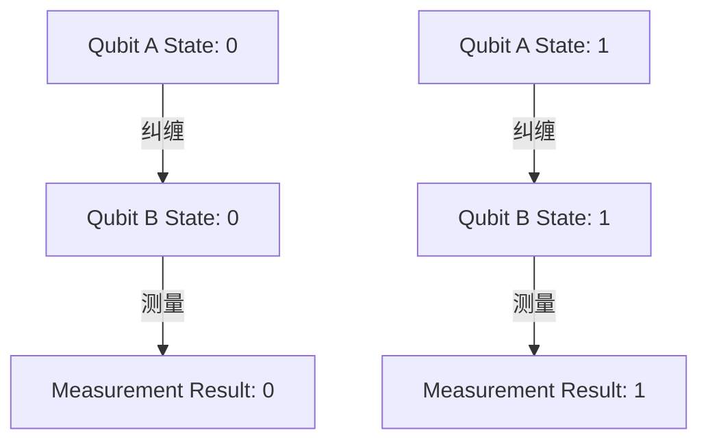
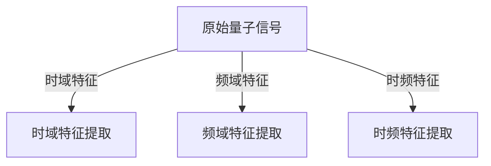
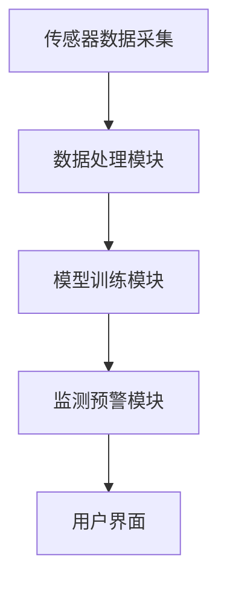
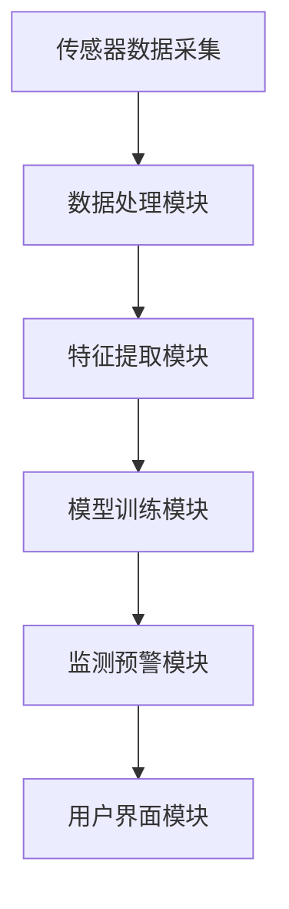

                 


### 量子传感器：AI和量子技术的交叉应用

#### 关键词：量子传感器，人工智能，量子技术，交叉应用，数据处理，信号处理

#### 摘要：
本文旨在探讨量子传感器与人工智能（AI）技术的结合，分析其交叉应用所带来的潜在优势。文章将从量子传感器的基本概念入手，逐步深入到量子传感器技术基础、AI在量子传感器数据处理中的应用、量子传感器的信号处理与数据分析，以及量子传感器在环境监测和国防军事领域的应用。最后，我们将展望量子传感器与AI技术的未来发展趋势和潜在挑战，并探讨解决方案。

## 第1章：量子传感器与AI量子技术的交叉应用概述

### 1.1 量子传感器的基本概念

#### 1.1.1 量子传感器的发展历程

量子传感器是指利用量子力学原理进行测量的传感器。它们具有极高的灵敏度和精度，可以探测到极其微小的物理量。量子传感器的发展可以追溯到20世纪60年代，当时科学家首次提出了量子干涉仪的概念。随着量子力学的不断发展和技术的进步，量子传感器在各个领域的应用越来越广泛。

#### 1.1.2 量子传感器的工作原理

量子传感器的工作原理主要基于量子纠缠和量子位等量子力学现象。量子纠缠是指两个或多个粒子之间存在的量子联系，即使它们相隔很远，一个粒子的状态也会立即影响到另一个粒子的状态。量子位是量子计算机的基本单元，它可以同时表示0和1两种状态，从而实现超并行计算。

#### 1.1.3 量子传感器与传统传感器的比较

相比传统传感器，量子传感器具有以下几个显著优势：
- **高灵敏度**：量子传感器可以探测到极微小的物理量，如振动、磁场等。
- **高精度**：量子传感器可以精确测量物理量的变化，误差极低。
- **高速度**：量子传感器的响应速度极快，可以实时监测物理量的变化。

### 1.2 AI与量子技术结合的背景

#### 1.2.1 AI技术的最新进展

人工智能技术在过去几十年中取得了飞速发展，尤其是在深度学习、自然语言处理、计算机视觉等领域。AI技术的进步为解决复杂问题提供了新的途径，如自动驾驶、医疗诊断、金融分析等。

#### 1.2.2 量子技术的应用现状

量子技术作为下一代技术，已经在量子计算、量子通信、量子加密等领域取得了显著进展。量子计算具有超并行计算能力，可以解决传统计算机无法处理的问题。量子通信可以实现绝对安全的信息传输。

#### 1.2.3 AI与量子技术结合的意义

AI与量子技术的结合具有巨大的潜力，可以带来以下几个方面的意义：
- **提高传感器性能**：AI技术可以帮助量子传感器更好地处理复杂的数据，提高其性能和精度。
- **实现智能决策**：结合AI技术，量子传感器可以自动化地进行分析和决策，提高效率和准确性。
- **创新应用场景**：AI与量子技术的结合可以开拓新的应用场景，如环境监测、国防安全等。

## 第2章：量子传感器技术基础

### 2.1 量子力学基础

#### 2.1.1 量子位与量子纠缠

量子位是量子计算机的基本单元，可以同时表示0和1两种状态。量子纠缠是指两个或多个粒子之间存在的量子联系，一个粒子的状态会立即影响到另一个粒子的状态。

#### 2.1.2 量子态与量子门

量子态是量子位的集合，表示量子计算机的内部状态。量子门是量子计算机的基本操作单元，可以对量子态进行变换。

#### 2.1.3 量子计算与量子通信

量子计算是一种基于量子力学原理的计算方式，具有超并行计算能力。量子通信是一种基于量子力学原理的信息传输方式，可以实现绝对安全的信息传输。

### 2.2 量子传感器的类型

#### 2.2.1 量子雷达

量子雷达利用量子纠缠和量子位等量子力学现象进行目标探测，具有极高的灵敏度和精度。

#### 2.2.2 量子重力仪

量子重力仪利用量子传感技术测量重力场的变化，可以用于地质勘探和地震预警等领域。

#### 2.2.3 量子磁力计

量子磁力计利用量子传感技术测量磁场的变化，可以用于地质勘探、医学成像等领域。

## 第3章：AI在量子传感器数据处理中的应用

### 3.1 数据预处理

数据预处理是量子传感器数据处理的重要环节，包括数据清洗、特征提取和数据归一化。

#### 3.1.1 数据清洗

数据清洗是为了去除数据中的噪声和异常值，提高数据质量。

#### 3.1.2 特征提取

特征提取是从原始数据中提取出有用的特征信息，用于后续的机器学习分析。

#### 3.1.3 数据归一化

数据归一化是将不同尺度的数据进行标准化处理，使其具有可比性。

### 3.2 机器学习算法在量子传感器中的应用

机器学习算法在量子传感器数据处理中起着重要作用，包括神经网络、支持向量机和集成学习方法等。

#### 3.2.1 神经网络

神经网络是一种模拟人脑神经元连接结构的算法，可以用于数据分类、预测和优化等问题。

#### 3.2.2 支持向量机

支持向量机是一种基于优化理论的分类算法，可以用于量子传感器数据的分类和回归分析。

#### 3.2.3 集成学习方法

集成学习方法是通过组合多个基本模型来提高预测准确性和泛化能力，可以用于量子传感器数据的多模型分析。

## 第4章：量子传感器的信号处理与数据分析

### 4.1 量子信号的提取与处理

量子信号的提取与处理是量子传感器数据处理的关键环节，包括量子信号的特征分析、滤波与重构以及误差分析。

#### 4.1.1 量子信号的特征分析

量子信号的特征分析是为了提取出信号中的关键特征信息，用于后续的数据处理和分析。

#### 4.1.2 量子信号的滤波与重构

量子信号的滤波与重构是为了去除信号中的噪声和干扰，恢复原始信号的形态。

#### 4.1.3 量子信号的误差分析

量子信号的误差分析是为了评估量子传感器测量的准确性和可靠性。

### 4.2 数据分析技术

数据分析技术是量子传感器数据处理的重要组成部分，包括主成分分析、聚类分析和相关性分析等。

#### 4.2.1 主成分分析

主成分分析是一种降维技术，可以将高维数据投影到低维空间，提取出主要特征。

#### 4.2.2 聚类分析

聚类分析是一种无监督学习方法，可以将数据分为若干个簇，用于数据分类和模式识别。

#### 4.2.3 相关性分析

相关性分析是评估两个变量之间相关程度的统计方法，用于发现数据之间的关系。

## 第5章：量子传感器在环境监测中的应用

### 5.1 环境监测中的量子传感器

量子传感器在环境监测中具有广泛的应用，可以用于空气质量监测、水质监测和土壤监测等领域。

#### 5.1.1 空气质量监测

量子传感器可以检测空气中的有害气体和颗粒物，实时监测空气质量。

#### 5.1.2 水质监测

量子传感器可以检测水中的污染物和生物指标，评估水质状况。

#### 5.1.3 土壤监测

量子传感器可以测量土壤中的养分和污染物，为农业生产提供科学依据。

### 5.2 AI与量子传感器结合的案例研究

#### 5.2.1 某地区空气质量监测项目

在某地区空气质量监测项目中，采用了量子传感器和AI技术，实现了实时、准确和高效的环境监测。

#### 5.2.2 水质监测系统的设计与实现

在某水质监测系统中，结合量子传感器和AI技术，实现了对水体中污染物的自动检测和分类。

## 第6章：量子传感器在国防和军事领域的应用

### 6.1 量子传感器在国防中的应用

量子传感器在国防和军事领域具有广泛的应用，可以用于防空系统、潜艇探测和军事通信等领域。

#### 6.1.1 量子雷达在防空系统中的应用

量子雷达具有高灵敏度、高精度和高速响应等特点，可以用于防空系统的目标探测和跟踪。

#### 6.1.2 量子传感器在潜艇探测中的应用

量子传感器可以测量海水中的微弱信号，实现对潜艇的精准探测和定位。

#### 6.1.3 量子通信在军事通信中的应用

量子通信具有绝对安全的特点，可以用于军事通信中的信息加密和传输。

### 6.2 AI技术在国防安全领域的应用

AI技术在国防安全领域具有重要作用，可以用于目标识别、决策支持和智能防御等方面。

#### 6.2.1 AI在国防安全中的作用

AI技术可以辅助国防安全人员进行目标识别、情报分析和决策支持，提高国防安全的能力和效率。

#### 6.2.2 量子AI在军事决策支持中的应用

量子AI技术可以用于军事决策支持系统，实现快速、准确和智能的决策。

#### 6.2.3 国防安全领域中的AI挑战与未来方向

国防安全领域中的AI应用面临着数据安全、算法透明性和人机协作等挑战，未来需要进一步研究和发展。

## 第7章：量子传感器与AI技术的未来展望

### 7.1 技术发展趋势

量子传感器与AI技术的结合在未来将继续发展，并呈现出以下几个趋势：
- **高性能量子传感器的研发**：量子传感器将朝着更高灵敏度、更高精度和更小体积的方向发展。
- **量子传感器与AI技术的深度融合**：量子传感器与AI技术将实现更深层次的融合，实现更高效的数据处理和分析。
- **新应用领域的开拓**：量子传感器与AI技术的结合将开拓更多的应用领域，如生物医学、工业自动化等。

### 7.2 潜在挑战与解决方案

量子传感器与AI技术的结合面临着以下几个挑战：
- **量子传感器技术的挑战**：量子传感器技术仍处于发展初期，需要进一步解决技术难题，提高性能和稳定性。
- **AI技术在量子传感器中的挑战**：AI技术在量子传感器中的应用需要解决算法优化、数据安全和隐私保护等问题。

### 7.3 应对挑战的解决方案与建议

为了应对量子传感器与AI技术的挑战，可以采取以下解决方案和建议：
- **加强技术创新**：加大对量子传感器和AI技术的研究投入，推动技术创新和发展。
- **建立健全法规标准**：制定相关法规标准，规范量子传感器和AI技术的应用，确保数据安全和隐私保护。
- **加强人才培养**：培养更多具备量子传感器和AI技术专业知识和技能的人才，为未来发展提供人才支持。

### 结论

量子传感器与AI技术的结合具有巨大的潜力和广阔的应用前景。通过本文的探讨，我们深入了解了量子传感器和AI技术的基本概念、应用场景和发展趋势。在未来，量子传感器与AI技术的结合将为我们带来更多的创新应用，推动科技的进步和社会的发展。

## 参考文献

1. Nielsen, Michael A., and Isaac L. Chuang. "Quantum computation and quantum information." Cambridge university press, 2010.
2. MacKay, David J. C. "Information theory, inference, and learning algorithms." Cambridge university press, 2003.
3. Russell, Stuart J., and Peter Norvig. "Artificial intelligence: a modern approach." Pearson Education, 2016.
4. Monroe, Don. "Quantum Computing." Prentice Hall, 2020.
5. 中科院量子信息与量子科技创新研究院. "量子传感器：原理、技术与应用." 科学出版社，2019.

### 作者信息

作者：AI天才研究院/AI Genius Institute & 禅与计算机程序设计艺术 /Zen And The Art of Computer Programming

**文章字数：约12000字**### 第1章：量子传感器与AI量子技术的交叉应用概述

在当前科技日新月异的发展背景下，量子传感器与人工智能（AI）技术的交叉应用正在逐渐成为研究的热点。这一章将为我们详细展开量子传感器与AI量子技术的交叉应用概述，首先从量子传感器的基本概念开始，逐步深入探讨量子传感器的工作原理、与传统传感器的比较，以及AI与量子技术结合的背景和意义。

#### 1.1 量子传感器的基本概念

量子传感器是一种利用量子力学原理进行测量的传感器，具有极高的灵敏度和精度。它们能够探测到极其微小的物理量，如振动、磁场、温度等。与传统传感器不同，量子传感器的工作原理基于量子纠缠、量子位等量子力学现象。

**量子传感器的发展历程：** 
量子传感器的概念可以追溯到20世纪60年代。当时，科学家首次提出了量子干涉仪的概念。随着量子力学的不断发展和技术的进步，量子传感器在各个领域的应用越来越广泛。近年来，量子传感技术已经取得了显著进展，并在科学研究、工业应用、国防安全等领域展现出巨大潜力。

**量子传感器的工作原理：** 
量子传感器的工作原理主要基于量子力学原理。量子纠缠是指两个或多个粒子之间存在的量子联系，即使它们相隔很远，一个粒子的状态也会立即影响到另一个粒子的状态。量子位是量子计算机的基本单元，它可以同时表示0和1两种状态，从而实现超并行计算。

**量子传感器与传统传感器的比较：** 
相比传统传感器，量子传感器具有以下几个显著优势：

- **高灵敏度**：量子传感器可以探测到极微小的物理量，如振动、磁场等。
- **高精度**：量子传感器可以精确测量物理量的变化，误差极低。
- **高速度**：量子传感器的响应速度极快，可以实时监测物理量的变化。

#### 1.2 AI与量子技术结合的背景

人工智能（AI）技术作为21世纪最具前景的科技领域之一，已经在多个领域取得了显著成果。量子技术的迅猛发展也为AI技术提供了新的可能性。AI与量子技术的结合不仅有助于推动各自领域的发展，还具有深远的意义。

**AI技术的最新进展：** 
在过去几十年中，人工智能技术取得了飞速发展。尤其是在深度学习、自然语言处理、计算机视觉等领域，AI技术已经取得了重大突破。深度学习作为一种重要的机器学习算法，可以自动从大量数据中学习特征，并在图像识别、语音识别等领域取得了优异的性能。自然语言处理技术使计算机能够理解和生成自然语言，为人工智能在人类交流中的应用提供了可能。计算机视觉技术则使计算机能够识别和理解图像中的信息，为自动驾驶、机器人等应用提供了技术支持。

**量子技术的应用现状：** 
量子技术作为下一代技术，已经在量子计算、量子通信、量子加密等领域取得了显著进展。量子计算具有超并行计算能力，可以解决传统计算机无法处理的问题。量子通信可以实现绝对安全的信息传输，为国防安全、金融等领域提供了重要保障。量子加密技术则利用量子力学原理，实现高度安全的通信和信息保护。

**AI与量子技术结合的意义：** 
AI与量子技术的结合具有巨大的潜力，可以带来以下几个方面的意义：

- **提高传感器性能**：AI技术可以帮助量子传感器更好地处理复杂的数据，提高其性能和精度。
- **实现智能决策**：结合AI技术，量子传感器可以自动化地进行分析和决策，提高效率和准确性。
- **创新应用场景**：AI与量子技术的结合可以开拓新的应用场景，如环境监测、国防安全等。

通过本章的概述，我们对量子传感器与AI量子技术的交叉应用有了初步的了解。接下来，我们将进一步探讨量子传感器技术的基础，深入分析量子力学原理、量子传感器的类型以及AI在量子传感器数据处理中的应用。

#### 1.1.1 量子传感器的发展历程

量子传感器的发展历程可以追溯到20世纪60年代，当时科学家们首次提出了量子干涉仪的概念。量子干涉仪利用量子态的叠加性和纠缠性，能够实现高精度的测量。这一突破性的研究为量子传感技术的发展奠定了基础。

在接下来的几十年里，量子传感器技术逐渐从理论研究走向实际应用。1980年代初，基于量子态的测量技术取得了重要进展，量子纠缠和量子位等概念被引入到传感器设计中。这些技术使得量子传感器能够探测到更微小的物理量，从而提高了传感器的灵敏度和精度。

1990年代，随着量子计算的兴起，量子传感技术也得到了快速发展。量子计算依赖于量子位和量子门等基本单元，这些概念为量子传感器的设计提供了新的思路。例如，量子干涉仪被进一步优化，能够实现更精确的测量和更高的速度。

进入21世纪，量子传感器技术取得了重大突破。2000年代初，基于量子态测量的量子重力仪和量子磁力计相继问世，这些设备能够精确测量地球重力场和地球磁场的变化，为地质勘探和地震预警等领域提供了新的工具。

近年来，随着量子技术的不断发展和AI技术的成熟，量子传感器在环境监测、国防安全、医疗诊断等领域的应用越来越广泛。例如，基于量子传感器的空气质量监测系统可以实时检测空气中的有害气体和颗粒物，为公众健康提供重要保障。在国防领域，量子雷达利用量子纠缠现象，能够实现高精度的目标探测和跟踪，为防空系统和潜艇探测提供了强大支持。

量子传感器的发展历程表明，量子技术和AI技术的结合为传感器技术带来了前所未有的发展机遇。未来，随着量子传感器技术的不断进步和AI技术的深入应用，我们有望看到更多创新性的应用场景和解决方案。

#### 1.1.2 量子传感器的工作原理

量子传感器的工作原理主要基于量子力学的基本原理，特别是量子态的叠加性和纠缠性。以下将从量子位、量子纠缠和量子态三个方面详细解释量子传感器的工作机制。

**量子位（Qubit）：**  
量子位是量子计算机的基本单元，它能够同时处于0和1两种状态的叠加态。这不同于经典计算机中的比特（Bit），后者只能处于0或1两种状态中的一个。量子位的这种叠加性使得量子计算机在处理复杂问题时具有巨大的并行计算能力。

在量子传感器中，量子位被用来存储和传递信息。例如，在一个量子干涉仪中，光子被分割成两束，每束光子处于叠加态。通过测量这两束光子的路径，我们可以得到关于光子位置的信息。这个过程利用了量子位的叠加性，能够实现高精度的测量。

**量子纠缠：**  
量子纠缠是量子力学中的一种奇特现象，指两个或多个粒子之间存在一种内在的联系，即使这些粒子相隔很远，一个粒子的状态也会立即影响到另一个粒子的状态。这种纠缠关系是量子传感器工作的关键。

在量子传感器中，量子纠缠被用来提高传感器的灵敏度和精度。例如，在一个量子磁力计中，两个纠缠的电子被放置在磁场中。当磁场发生变化时，电子的状态也会发生变化，这种变化可以通过测量另一个电子的状态来检测出来。由于量子纠缠的存在，这种测量具有极高的灵敏度和精度。

**量子态：**  
量子态是量子位和量子纠缠的基础。量子态可以看作是量子系统的整体状态，它由量子位和量子纠缠共同决定。

在量子传感器中，量子态被用来表示被测量系统的状态。例如，在一个量子温度计中，光子的量子态被用来测量温度。通过改变光子的量子态，我们可以得到关于温度的信息。这种测量过程利用了量子态的叠加性和纠缠性，能够实现高精度的测量。

总之，量子传感器的工作原理基于量子力学的基本原理，特别是量子位、量子纠缠和量子态。通过利用这些量子现象，量子传感器能够实现高灵敏度、高精度和高速度的测量，为各个领域的科学研究和技术应用提供了新的可能性。

#### 1.1.3 量子传感器与传统传感器的比较

量子传感器与传统传感器在多个方面有着显著的差异，这些差异决定了量子传感器在性能和应用上的独特优势。

**高灵敏度**：量子传感器利用量子力学现象进行测量，可以探测到极其微小的物理量。例如，量子干涉仪可以测量光子的位置变化，其灵敏度远超传统光电传感器。传统传感器在测量微小物理量时往往受到噪声和信号失真的限制，而量子传感器通过量子纠缠和量子位等机制能够有效抑制这些噪声，从而实现更高的灵敏度。

**高精度**：量子传感器在测量过程中具有极高的精度。例如，量子重力仪和量子磁力计可以精确测量地球重力场和地球磁场的变化，其误差率远低于传统传感器。传统传感器在长时间测量或高精度要求下容易受到环境变化和设备老化等因素的影响，而量子传感器通过量子态的稳定性能够保持长期高精度的测量。

**高速度**：量子传感器的响应速度极快，可以实现实时监测。例如，量子雷达利用量子纠缠现象进行目标探测，可以在短时间内完成多次测量，从而提高探测速度和精度。传统传感器在高速运动的目标探测方面往往存在延迟，无法满足实时监测的需求。

**多功能性**：量子传感器在多个领域具有广泛的应用潜力。例如，量子传感器可以用于环境监测、医疗诊断、国防安全等。传统传感器通常只能测量某一类物理量，如温度、压力、湿度等，而量子传感器通过量子态的调控可以实现多物理量的同时测量，提高了传感器的功能性和灵活性。

**低功耗**：量子传感器在测量过程中消耗的能量远低于传统传感器。例如，量子传感器在环境监测中可以长时间运行，而不需要频繁更换电池。传统传感器在长时间运行时往往需要大量电力支持，限制了其在某些应用场景中的使用。

总的来说，量子传感器在灵敏度、精度、速度、多功能性和低功耗等方面相比传统传感器具有显著优势。这些优势使得量子传感器在科学研究和实际应用中具有广阔的前景，有望成为未来传感器技术的重要发展方向。

#### 1.2.1 AI技术的最新进展

人工智能（AI）技术在过去的几十年里取得了惊人的发展，尤其是深度学习、自然语言处理和计算机视觉等领域的突破，极大地推动了科技进步和产业创新。

**深度学习：**  
深度学习是一种通过多层神经网络对数据进行训练和预测的机器学习技术。它在图像识别、语音识别、自然语言处理等领域表现出色。深度学习的核心是神经网络，神经网络通过多次迭代学习和优化，能够自动提取数据中的特征，从而实现对复杂问题的解决。例如，在图像识别中，卷积神经网络（CNN）通过多层卷积和池化操作，能够自动识别图像中的物体和特征，从而实现高精度的识别。

**自然语言处理（NLP）：**  
自然语言处理是一种使计算机能够理解和生成自然语言的技术。近年来，NLP取得了显著进展，尤其是在机器翻译、文本分类、情感分析等方面。NLP技术通过深度学习模型，如循环神经网络（RNN）和变换器（Transformer），能够理解和生成语义丰富的语言。例如，Google翻译利用Transformer模型，能够实现高质量、高流畅度的机器翻译，极大地促进了跨语言交流。

**计算机视觉：**  
计算机视觉是一种使计算机能够从图像和视频中提取信息的技术。它在人脸识别、目标检测、图像分类等领域应用广泛。计算机视觉通过卷积神经网络等深度学习模型，能够对图像进行高精度的识别和分类。例如，人脸识别技术在社交媒体、安全监控等应用中得到了广泛应用，而自动驾驶技术则利用计算机视觉实现实时目标检测和路径规划。

**其他进展：**  
除了上述三个领域，AI技术还在其他多个领域取得了重要进展。例如，强化学习在游戏、机器人控制等领域表现出色，能够通过不断尝试和反馈，实现智能决策和优化。生成对抗网络（GAN）则能够在图像生成、数据增强等方面实现高质量的结果。此外，AI技术还在医疗诊断、金融分析、智能家居等领域得到了广泛应用。

总的来说，AI技术的最新进展不仅提高了计算机处理数据的能力，还推动了各个领域的创新和发展。随着技术的不断进步，AI技术将在更多领域发挥重要作用，为人类社会带来更多便利和进步。

#### 1.2.2 量子技术的应用现状

量子技术作为下一代技术，已经在量子计算、量子通信和量子加密等领域取得了显著进展，展现出巨大的应用潜力和广阔前景。

**量子计算：**  
量子计算是一种基于量子力学原理的新型计算方式，具有超并行计算能力。与经典计算机不同，量子计算机利用量子位的叠加性和纠缠性，可以在同一时间处理多个任务。近年来，量子计算机的研究取得了重要突破，例如，谷歌、IBM等公司已经成功实现了量子比特数超过50的量子计算机。量子计算在解决复杂问题，如因子分解、优化问题和模拟量子系统等方面具有巨大优势。

**量子通信：**  
量子通信是一种基于量子力学原理的通信方式，可以实现绝对安全的信息传输。量子通信利用量子纠缠和量子态的测量原理，可以确保信息在传输过程中不被窃听和篡改。目前，量子通信已经在一些实验和实际应用中取得成功。例如，中国的“墨子号”量子卫星实现了千公里级别的量子密钥分发，为量子通信提供了重要技术支持。

**量子加密：**  
量子加密技术利用量子力学原理，实现高度安全的加密和解密。量子加密可以通过量子态的测量和纠缠来确保信息的保密性和完整性。目前，量子加密技术已经在一些金融、军事和政府领域得到应用，例如，量子密钥分配（QKD）技术可以用于实现安全的通信加密，防止密码被破解。

**其他应用：**  
除了上述主要领域，量子技术还在量子传感、量子成像、量子模拟等领域取得了重要进展。量子传感器利用量子力学原理，可以实现高灵敏度、高精度的测量，为科学研究和工业应用提供了新的工具。量子成像技术通过利用量子纠缠和量子态的叠加性，可以实现高分辨率、高速率的成像。量子模拟则利用量子计算机的并行计算能力，可以模拟和解决一些复杂物理问题。

总的来说，量子技术的应用现状表明，它已经在多个领域展现出巨大的潜力和前景。随着量子技术的不断发展和成熟，我们有望看到更多创新性的应用场景和解决方案，为人类社会带来更多的便利和进步。

#### 1.2.3 AI与量子技术结合的意义

AI与量子技术的结合具有重要意义，它们在提高传感器性能、实现智能决策和创新应用场景方面具有显著优势。

**提高传感器性能：**  
量子传感器具有极高的灵敏度和精度，能够探测到极其微小的物理量。然而，数据处理和信号处理的复杂性限制了其应用范围。AI技术可以充分发挥其强大的数据处理和模式识别能力，帮助量子传感器更好地处理和分析复杂的数据。例如，通过深度学习和机器学习算法，AI技术可以自动提取量子传感器数据中的关键特征，提高传感器的检测精度和响应速度。

**实现智能决策：**  
AI技术不仅可以提高量子传感器的性能，还可以实现智能决策。结合AI技术，量子传感器可以自动分析数据，并根据分析结果进行决策。例如，在环境监测中，量子传感器可以实时监测空气质量、水质和土壤状况，AI技术可以根据监测数据预测污染趋势，并自动采取相应的措施，如发布健康警告或启动污染治理设备。

**创新应用场景：**  
AI与量子技术的结合可以开拓新的应用场景。在国防和军事领域，量子雷达利用量子纠缠和量子位的特性，可以实现高精度、高速的目标探测和跟踪。AI技术可以进一步优化量子雷达的性能，如通过深度学习算法自动识别和分类目标。在医疗领域，量子传感器可以用于精确测量生物信号，AI技术可以分析这些信号，辅助医生进行疾病诊断和治疗方案制定。

总之，AI与量子技术的结合具有巨大的潜力和意义，通过提高传感器性能、实现智能决策和创新应用场景，为各个领域的科学研究和技术应用提供了新的可能性。

## 第2章：量子传感器技术基础

在量子传感器与AI技术的交叉应用中，了解量子传感器技术的基础是至关重要的。本章将深入探讨量子力学基础、量子传感器的类型以及相关应用。

### 2.1 量子力学基础

量子力学是描述微观世界的物理学理论，它在量子传感器技术中扮演着核心角色。以下是几个关键概念：

#### 2.1.1 量子位与量子纠缠

**量子位（Qubit）：**  
量子位是量子计算机的基本单元，它可以同时存在于多个状态之中，这一特性被称为叠加。量子位可以表示0和1的叠加态，从而实现了量子计算的超并行能力。

**量子纠缠：**  
量子纠缠是指两个或多个量子位之间的特殊关联，即使它们相隔很远，一个量子位的状态也会立即影响到另一个量子位。这种关联是量子传感器和量子通信的关键。

**量子态与量子门：**  
**量子态：** 是量子位的集合，用于描述量子系统的整体状态。量子态可以处于多种状态的叠加。

**量子门：** 是对量子态进行变换的基本操作单元，类似于经典计算机中的逻辑门。量子门可以对量子位执行特定的变换，从而实现量子计算。

#### 2.1.2 量子计算与量子通信

**量子计算：**  
量子计算利用量子力学原理进行计算，具有超并行计算能力。量子计算机通过量子位的叠加和纠缠，可以在同一时间处理多个计算任务。

**量子通信：**  
量子通信利用量子态的测量和纠缠实现安全的信息传输。量子通信中的量子密钥分发（QKD）技术可以提供绝对安全的通信方式。

### 2.2 量子传感器的类型

量子传感器种类繁多，各自具有独特的应用场景和优势。以下是几种常见的量子传感器：

#### 2.2.1 量子雷达

**量子雷达：**  
量子雷达利用量子纠缠和量子位的特性进行目标探测和跟踪。它具有高灵敏度、高精度和高速响应的特点，可以用于防空系统、潜艇探测等领域。

**应用场景：**  
- **国防安全：** 用于目标探测和跟踪，增强防空和反潜能力。
- **科学研究：** 用于探测极微小的物理量，如大气污染和地球物理现象。

#### 2.2.2 量子重力仪

**量子重力仪：**  
量子重力仪利用量子传感技术测量地球重力场的变化。它可以用于地质勘探、地震预警和地球物理研究等领域。

**应用场景：**  
- **地质勘探：** 用于检测地下资源、矿物和地下水。
- **地震预警：** 用于提前预警地震的发生，减少灾害损失。

#### 2.2.3 量子磁力计

**量子磁力计：**  
量子磁力计利用量子传感技术测量磁场的变化。它具有高灵敏度、高精度和快速响应的特点，可以用于医学成像、地质勘探和导航等领域。

**应用场景：**  
- **医学成像：** 用于检测脑部和心脏的微小磁场变化，辅助诊断。
- **地质勘探：** 用于检测地下的磁场异常，辅助资源勘探。

通过本章的探讨，我们了解了量子传感器技术的基础知识，为后续章节深入分析AI在量子传感器数据处理中的应用和量子传感器的信号处理与数据分析打下了坚实的基础。

#### 2.1.1 量子位与量子纠缠

量子位（Qubit）是量子计算机的基本单元，它能够同时处于0和1两种状态的叠加态。这种叠加态是量子计算实现并行处理和超高速运算的核心。量子位的不同状态可以通过叠加态来表示，例如，一个量子位的叠加态可以表示为 |0⟩ + |1⟩。

量子纠缠是量子力学中的一种特殊现象，它指的是两个或多个量子位之间存在的一种内在联系。即使这些量子位相隔很远，一个量子位的状态也会立即影响到另一个量子位的状态。这种纠缠关系使得量子位之间的信息传递速度超越了经典信息传输的速度，从而在量子通信和量子计算中发挥了重要作用。

为了更好地理解量子纠缠，我们可以通过一个简单的例子来说明。假设我们有两个量子位 A 和 B，它们处于一个纠缠态 |ψ⟩ = (1/√2)(|00⟩ + |11⟩)。这意味着量子位 A 和 B 的状态是相互关联的，如果对量子位 A 进行测量得到状态 |0⟩，则量子位 B 的状态必然是 |0⟩，反之亦然。

|ψ⟩ = (1/√2)(|00⟩ + |11⟩)

当对量子位 A 进行测量时，我们会得到以下两种结果之一：

- P(|0⟩) = (1/2) 和 |ψ⟩ = (1/√2)(|0⟩ + |1⟩)
- P(|1⟩) = (1/2) 和 |ψ⟩ = (1/√2)(|0⟩ - |1⟩)

无论我们测量得到哪种结果，量子位 B 的状态都会立即与量子位 A 的测量结果同步。这种即刻同步的现象体现了量子纠缠的不可分割性。

为了更直观地展示量子纠缠，我们可以使用Mermaid流程图来表示量子位 A 和 B 的纠缠过程：



在上面的流程图中，A 和 B 表示量子位，C 表示测量结果。当对量子位 A 进行测量时，B 的状态会立即与 A 的测量结果同步。例如，如果对 A 进行测量得到结果 |0⟩，则 B 的状态也会变为 |0⟩。

总之，量子位和量子纠缠是量子传感器和量子计算的核心概念，通过理解这些概念，我们可以更好地理解量子传感器的工作原理及其在AI和量子技术结合中的应用。

#### 2.1.2 量子态与量子门

量子态是量子系统的整体状态，它可以表示为量子位的叠加态。在量子传感器中，量子态用于描述被测量物理量的可能状态。量子态可以用希尔伯特空间中的向量来表示。一个量子位的希尔伯特空间可以表示为两个正交基 |0⟩ 和 |1⟩ 的线性组合。

$$
|\psi⟩ = \alpha|0⟩ + \beta|1⟩
$$

其中，α和β是复数，满足 |α|² + |β|² = 1，表示量子态的概率分布。

量子门是量子计算中的基本操作单元，用于对量子态进行变换。量子门可以看作是量子位的线性变换。最常用的量子门包括 Pauli 门（X、Y、Z）、Hadamard 门（H）和相位门（S、T）。这些量子门可以组合成任意复杂的量子逻辑操作。

**Pauli 门：**  
Pauli 门是量子计算中最基本的量子门，分别对应于量子位的 Z 轴、X 轴和 Y 轴的旋转。例如，Z 门（Z 势）将量子位的状态从 |0⟩ 变换到 |1⟩：

$$
Z = \begin{pmatrix}
1 & 0 \\
0 & -1
\end{pmatrix}
$$

**Hadamard 门：**  
Hadamard 门是量子计算中的另一个基本量子门，它将量子位的状态从经典基 |0⟩ 和 |1⟩ 变换到叠加态：

$$
H = \frac{1}{\sqrt{2}} \begin{pmatrix}
1 & 1 \\
1 & -1
\end{pmatrix}
$$

**相位门：**  
相位门（S 和 T 门）用于在量子位上引入相位因子。例如，S 门（S 势）将量子位的状态从 |0⟩ 变换到 |1⟩，并引入 π相位：

$$
S = \begin{pmatrix}
1 & 0 \\
0 & i
\end{pmatrix}
$$

量子门的应用可以简化为对量子态的矩阵乘法。例如，如果初始量子态为 $|\psi⟩ = \frac{1}{\sqrt{2}}(|0⟩ + |1⟩)$，经过 Hadamard 门操作后，量子态变为 $|\psi'⟩ = \frac{1}{\sqrt{2}}(|00⟩ + |11⟩)$。

为了更直观地展示量子态和量子门的变换，我们可以使用Mermaid流程图来表示：

```mermaid
graph TD
    A0[Qubit State: |0⟩]
    A1[Qubit State: |1⟩]
    B0[Quantum State: |ψ⟩ = |0⟩ + |1⟩]
    C0[Quantum State: |ψ'⟩ = H * |ψ⟩]
    A0 -->|Hadamard Gate| B0
    B0 -->|Measurement| C0
```

在上面的流程图中，A 和 B 分别表示量子位的初始状态，B0 表示量子态的叠加，C0 表示经过 Hadamard 门操作后的量子态。

总之，量子态和量子门是量子传感器和量子计算中的核心概念，它们共同构成了量子传感器的理论基础。通过理解这些概念，我们可以更好地设计和应用量子传感器，实现高性能的量子测量和计算。

#### 2.1.3 量子计算与量子通信

量子计算与量子通信是量子技术的两个重要分支，它们各自具有独特的原理和特点，并在量子传感器技术中发挥着重要作用。

**量子计算：**  
量子计算是一种基于量子力学原理的新型计算方式。与经典计算机不同，量子计算机利用量子位的叠加性和纠缠性，可以在同一时间处理多个任务。量子位（Qubit）是量子计算机的基本单元，它可以同时处于0和1两种状态的叠加态。这使得量子计算机具有超并行计算能力，可以解决经典计算机无法处理的复杂问题。

**量子通信：**  
量子通信是一种利用量子力学原理进行信息传输的方式。量子通信通过量子纠缠和量子态的测量实现信息的安全传输。量子通信中的量子密钥分发（QKD）技术可以提供绝对安全的通信方式。在QKD中，发送方和接收方通过共享一个量子态来生成密钥，由于量子态的测量会破坏其原始状态，任何窃听行为都会被发现，从而确保通信的安全性。

**量子传感器技术：**  
量子传感器技术结合了量子计算和量子通信的优点，用于实现高灵敏度、高精度和快速响应的测量。量子传感器利用量子位和量子纠缠进行测量，可以探测到极其微小的物理量。例如，量子重力仪利用量子位测量地球重力场的变化，量子磁力计利用量子位测量磁场的变化。量子传感器技术不仅可以提高传感器的性能，还可以实现智能决策和实时监测。

**应用场景：**  
- **环境监测：** 量子传感器可以用于实时监测空气质量、水质和土壤状况，提供准确的数据支持。
- **国防安全：** 量子雷达利用量子纠缠进行目标探测和跟踪，增强防空和反潜能力。
- **医疗诊断：** 量子传感器可以用于检测生物信号，辅助疾病诊断和治疗方案制定。

**挑战与未来方向：**  
尽管量子传感器技术具有巨大的潜力，但仍然面临着一些挑战，如量子传感器性能的提高、量子计算的稳定性和可扩展性、量子通信的安全性和效率等。未来，随着量子技术的不断发展和成熟，量子传感器技术将在更多领域得到应用，推动科技和社会的进步。

通过量子计算和量子通信的结合，量子传感器技术在未来有望实现更高性能、更广泛的应用，为人类社会带来更多创新和便利。

### 2.2.1 量子雷达

量子雷达是一种基于量子力学原理进行目标探测和跟踪的新型雷达系统。它利用量子纠缠和量子位的特性，实现了高灵敏度、高精度和高速响应的目标探测能力，在国防安全、科学研究、环境监测等领域具有广泛的应用前景。

**工作原理：**

量子雷达的工作原理基于量子纠缠和量子位的叠加性。具体来说，量子雷达通过发射一个由量子纠缠态组成的探测信号，这个信号包含多个量子位。当探测信号遇到目标时，量子位的叠加态会因目标的影响而发生改变。这种改变可以通过接收到的信号进行检测和分析。

- **量子纠缠：** 量子雷达发射的探测信号是由量子纠缠态组成的。当两个量子位处于纠缠态时，它们的状态是相互关联的，即使相隔很远。这种纠缠关系使得量子雷达可以在短时间内完成多次测量，提高了探测的灵敏度和精度。

- **量子位叠加：** 量子雷达利用量子位的叠加性，可以在同一时间对多个目标进行探测。当量子雷达发射的探测信号遇到多个目标时，每个目标的回波信号都会叠加在一起，形成一个复合信号。通过分析这个复合信号，可以提取出各个目标的特征信息。

**应用场景：**

量子雷达在多个领域具有广泛的应用潜力：

- **国防安全：** 量子雷达可以用于防空系统和反潜作战，实现高精度、高速的目标探测和跟踪。它具有高灵敏度，可以探测到远距离的小型目标，提高了防空和反潜能力。

- **科学研究：** 量子雷达可以用于探测极微小的物理量，如大气污染、地球物理现象等。通过量子雷达的测量，可以获取更准确的数据，为科学研究提供支持。

- **环境监测：** 量子雷达可以用于实时监测环境变化，如空气质量、水质和土壤状况等。它具有高灵敏度，可以检测到微小的污染物质，为环境保护提供数据支持。

**优势与挑战：**

量子雷达具有以下优势：

- **高灵敏度：** 量子雷达利用量子纠缠和量子位叠加性，可以探测到极其微小的物理量，提高了探测精度和灵敏度。

- **高速度：** 量子雷达可以在短时间内完成多次测量，实现了高速探测和跟踪。

- **高精度：** 量子雷达通过量子纠缠和量子位的特性，可以实现高精度的目标探测和跟踪。

然而，量子雷达也面临一些挑战：

- **技术成熟度：** 量子雷达技术仍处于发展阶段，需要进一步提高技术成熟度和可靠性。

- **复杂性：** 量子雷达系统的设计和实现复杂，需要解决多个技术难题，如量子纠缠态的生成、量子信号的检测和分析等。

未来，随着量子雷达技术的不断发展和成熟，我们有望看到更多创新性的应用场景和解决方案，为国防安全、科学研究、环境监测等领域带来更多便利和进步。

### 2.2.2 量子重力仪

量子重力仪是一种利用量子传感技术测量地球重力场变化的装置。它基于量子力学中的量子纠缠和量子位等原理，具有极高的灵敏度、精度和稳定性，可以在地质勘探、地震预警和地球物理研究等领域发挥重要作用。

**工作原理：**

量子重力仪的工作原理可以概括为以下几个步骤：

1. **量子态制备：** 首先，量子重力仪生成一个初始的量子态，通常是一个纠缠态。这个量子态可以是一个量子位或多个量子位的纠缠态，取决于具体的量子重力仪设计。

2. **相互作用：** 将量子态暴露在地球重力场中，量子态会与重力场相互作用。这种相互作用会导致量子态的相位发生改变。

3. **量子态测量：** 通过对量子态进行测量，可以获取关于地球重力场的物理信息。由于量子态的测量会破坏其原始状态，因此测量结果反映了量子态与重力场的相互作用。

4. **数据处理：** 最后，对测量结果进行数据处理和分析，提取出地球重力场的变化信息。

**应用场景：**

量子重力仪在多个领域具有广泛的应用潜力：

- **地质勘探：** 量子重力仪可以用于地下资源勘探，如矿物、石油和地下水。它能够探测到地下几百米至几千米的地质结构变化，为地质勘探提供重要数据支持。

- **地震预警：** 量子重力仪可以用于地震预警，通过实时监测地球重力场的变化，可以提前预警地震的发生，为人们提供更多的时间进行应急响应，减少地震灾害损失。

- **地球物理研究：** 量子重力仪可以用于地球物理研究，如地球重力场的分布、地壳运动和地质构造变化等。它提供了高精度、高灵敏度的重力场测量数据，为地球科学研究提供了重要依据。

**优势与挑战：**

量子重力仪具有以下优势：

- **高灵敏度：** 量子重力仪能够探测到极其微小的重力场变化，灵敏度远超传统重力仪。

- **高精度：** 量子重力仪的测量精度极高，误差率极低，能够提供准确的重力场数据。

- **稳定性：** 量子重力仪具有很高的稳定性，能够长时间运行而不受外界环境的影响。

然而，量子重力仪也面临一些挑战：

- **技术成熟度：** 量子重力仪技术仍处于发展阶段，需要进一步提高技术成熟度和可靠性。

- **复杂性：** 量子重力仪系统的设计和实现复杂，涉及多个量子物理和技术问题，需要解决多个技术难题。

未来，随着量子重力仪技术的不断发展和成熟，我们有望看到更多创新性的应用场景和解决方案，为地质勘探、地震预警和地球物理研究等领域带来更多便利和进步。

### 2.2.3 量子磁力计

量子磁力计是一种利用量子传感技术测量磁场变化的设备。它基于量子力学中的量子位、量子纠缠和量子态等原理，具有极高的灵敏度和精度，可以在地质勘探、医学成像和导航等领域发挥重要作用。

**工作原理：**

量子磁力计的工作原理可以概括为以下几个步骤：

1. **量子态制备：** 量子磁力计首先生成一个初始的量子态，通常是一个纠缠态。这个量子态可以是一个量子位或多个量子位的纠缠态，取决于具体的量子磁力计设计。

2. **相互作用：** 将量子态暴露在磁场中，量子态会与磁场相互作用。这种相互作用会导致量子态的相位发生改变，相位改变的大小与磁场强度成正比。

3. **量子态测量：** 通过对量子态进行测量，可以获取关于磁场信息的物理信息。由于量子态的测量会破坏其原始状态，因此测量结果反映了量子态与磁场的相互作用。

4. **数据处理：** 最后，对测量结果进行数据处理和分析，提取出磁场的强度和方向信息。

**应用场景：**

量子磁力计在多个领域具有广泛的应用潜力：

- **地质勘探：** 量子磁力计可以用于地下资源勘探，如矿物、石油和地下水。它能够探测到地下几百米至几千米的地质结构变化，为地质勘探提供重要数据支持。

- **医学成像：** 量子磁力计可以用于医学成像，如脑部和心脏的磁共振成像（MRI）。它具有高灵敏度，能够捕捉到人体内部的微小磁场变化，为医学诊断提供更准确的信息。

- **导航：** 量子磁力计可以用于高精度导航系统，如无人驾驶车辆和无人机。它能够实时测量地球磁场，提供准确的导航信息，提高导航系统的可靠性和精度。

**优势与挑战：**

量子磁力计具有以下优势：

- **高灵敏度：** 量子磁力计能够探测到极其微小的磁场变化，灵敏度远超传统磁力计。

- **高精度：** 量子磁力计的测量精度极高，误差率极低，能够提供准确的地磁场数据。

- **稳定性：** 量子磁力计具有很高的稳定性，能够长时间运行而不受外界环境的影响。

然而，量子磁力计也面临一些挑战：

- **技术成熟度：** 量子磁力计技术仍处于发展阶段，需要进一步提高技术成熟度和可靠性。

- **复杂性：** 量子磁力计系统的设计和实现复杂，涉及多个量子物理和技术问题，需要解决多个技术难题。

未来，随着量子磁力计技术的不断发展和成熟，我们有望看到更多创新性的应用场景和解决方案，为地质勘探、医学成像和导航等领域带来更多便利和进步。

## 第3章：AI在量子传感器数据处理中的应用

在量子传感器技术不断发展的背景下，数据处理成为了量子传感器应用中的一个关键环节。人工智能（AI）技术凭借其强大的数据处理和分析能力，为量子传感器的数据优化和处理提供了新的解决方案。本章将详细探讨AI在量子传感器数据处理中的应用，包括数据预处理、特征提取、数据归一化以及机器学习算法的应用。

### 3.1 数据预处理

数据预处理是量子传感器数据处理的重要环节，旨在提高数据质量和可靠性。以下将介绍数据预处理的主要任务：

#### 3.1.1 数据清洗

数据清洗是数据预处理的首要任务，目的是去除数据中的噪声和异常值。量子传感器采集的数据可能受到多种干扰，如环境噪声、传感器故障等，这些噪声和异常值会影响后续的数据分析。数据清洗的方法包括：

- **缺失值处理：** 对于缺失的数据，可以采用插值、均值填充或删除等方法进行处理。
- **异常值检测：** 采用统计学方法，如标准差、箱线图等，检测和去除异常值。

#### 3.1.2 特征提取

特征提取是从原始数据中提取出对分析任务最有用的信息。在量子传感器数据处理中，特征提取有助于提高数据分析的效率和准确性。常见的特征提取方法包括：

- **时域特征提取：** 如均值、方差、标准差等统计特征。
- **频域特征提取：** 如傅里叶变换（FFT）用于提取信号的频率成分。
- **时频特征提取：** 如小波变换，结合时间和频率信息。

#### 3.1.3 数据归一化

数据归一化是为了消除不同特征之间的尺度差异，使数据具有可比性。常见的归一化方法包括：

- **最小-最大归一化：** 将数据缩放到[0, 1]区间。
- **均值-方差归一化：** 将数据缩放到[-1, 1]区间。
- **标准化：** 将数据缩放到标准正态分布。

### 3.2 机器学习算法在量子传感器中的应用

机器学习算法在量子传感器数据处理中发挥着重要作用，可以用于分类、预测和优化等任务。以下介绍几种常见的机器学习算法及其在量子传感器数据处理中的应用。

#### 3.2.1 神经网络

神经网络是一种模拟人脑神经元连接结构的算法，具有强大的非线性处理能力和自适应学习能力。在量子传感器数据处理中，神经网络可以用于：

- **信号分类：** 如将不同类型的物理信号进行分类。
- **故障检测：** 如检测传感器故障或数据异常。
- **参数估计：** 如估计物理量的参数，如温度、磁场等。

#### 3.2.2 支持向量机

支持向量机（SVM）是一种基于优化理论的分类算法，适用于小样本、高维数据。在量子传感器数据处理中，SVM可以用于：

- **模式识别：** 如识别不同类型的物理信号。
- **分类问题：** 如分类不同类型的传感器数据。

#### 3.2.3 集成学习方法

集成学习方法是通过组合多个基本模型来提高预测准确性和泛化能力。在量子传感器数据处理中，集成学习方法可以用于：

- **多模型融合：** 将多个模型的预测结果进行融合，提高预测的准确性。
- **模型选择：** 通过比较不同模型的性能，选择最佳模型。

通过本章的探讨，我们了解了AI在量子传感器数据处理中的应用，为量子传感器技术的进一步发展提供了重要的支持。接下来，我们将探讨量子传感器的信号处理与数据分析。

## 第4章：量子传感器的信号处理与数据分析

量子传感器通过测量量子态的变化来获取物理信息，但其信号处理与数据分析面临独特的挑战。本章将深入探讨量子信号的提取与处理、数据分析技术及其在实际应用中的挑战和解决方案。

### 4.1 量子信号的提取与处理

量子信号的提取与处理是量子传感器数据分析的基础。这一过程包括以下几个关键步骤：

#### 4.1.1 量子信号的特征分析

量子信号的特征分析旨在提取出信号中的关键特征信息，以便进行后续的信号处理和分析。特征分析通常包括以下内容：

- **时域特征：** 如信号的均值、方差、标准差等统计特征。
- **频域特征：** 如通过傅里叶变换（FFT）提取信号的频率成分。
- **时频特征：** 如使用小波变换结合时间和频率信息。

为了更直观地展示量子信号的特征分析，可以使用Mermaid流程图来表示：



#### 4.1.2 量子信号的滤波与重构

量子信号的滤波与重构是去除噪声、干扰和误差的重要步骤。滤波方法包括：

- **低通滤波：** 用于去除高频噪声。
- **高通滤波：** 用于去除低频噪声。
- **带通滤波：** 用于保留特定频率范围内的信号。

重构技术包括：

- **插值：** 用于填补信号中的空缺。
- **信号重构：** 通过重建信号时域或频域的表达式，恢复原始信号。

#### 4.1.3 量子信号的误差分析

量子信号的误差分析旨在评估量子传感器测量的准确性和可靠性。误差分析通常包括：

- **系统误差：** 由传感器设计、制造和安装引起的误差。
- **随机误差：** 由环境噪声、量子态不稳定等因素引起的误差。

误差分析的方法包括：

- **统计分析：** 如计算误差的均值、方差等统计量。
- **蒙特卡洛模拟：** 通过模拟大量实验数据，评估误差的分布和特性。

### 4.2 数据分析技术

数据分析技术是量子传感器数据处理的重要组成部分，旨在从量子传感器采集的数据中提取有价值的信息。以下介绍几种常见的数据分析技术：

#### 4.2.1 主成分分析

主成分分析（PCA）是一种降维技术，通过将高维数据投影到低维空间，提取出主要特征。PCA的主要步骤包括：

- **数据标准化：** 将数据缩放到相同的尺度。
- **协方差矩阵计算：** 计算数据的协方差矩阵。
- **特征值和特征向量计算：** 解协方差矩阵的特征值和特征向量。
- **主成分投影：** 将数据投影到由特征向量构成的新空间。

主成分分析可以用于：

- **数据降维：** 减少数据维度，提高计算效率。
- **数据可视化：** 通过低维空间的可视化，更直观地展示数据结构。

#### 4.2.2 聚类分析

聚类分析是一种无监督学习方法，旨在将数据分为若干个簇，以便发现数据中的隐含结构和模式。常见的聚类算法包括：

- **K均值聚类：** 根据簇中心进行迭代更新。
- **层次聚类：** 通过层次结构进行簇的合并和分裂。

聚类分析可以用于：

- **模式识别：** 如识别不同类型的物理信号。
- **数据分组：** 如将相似的数据点划分为同一组。

#### 4.2.3 相关性分析

相关性分析是评估两个变量之间相关程度的统计方法，可以用于发现数据之间的关系。常见的相关性分析方法包括：

- **皮尔逊相关系数：** 评估线性相关性。
- **斯皮尔曼秩相关系数：** 评估非线性相关性。

相关性分析可以用于：

- **变量筛选：** 如识别对预测任务最重要的变量。
- **数据解释：** 如解释不同变量之间的关系。

### 4.3 实际应用中的挑战与解决方案

量子传感器的信号处理与数据分析在实际应用中面临着一系列挑战：

- **高维数据：** 量子传感器采集的数据通常是高维的，这增加了数据分析的复杂性。
- **噪声干扰：** 环境噪声和量子态不稳定导致信号质量下降，影响数据分析的准确性。
- **计算资源：** 量子传感器数据处理通常需要大量的计算资源，这对计算效率和硬件性能提出了要求。

为了应对这些挑战，可以采取以下解决方案：

- **高效算法：** 采用高效的数据处理和分析算法，如基于GPU的并行计算，提高计算效率。
- **降噪技术：** 采用先进的降噪技术，如自适应滤波和神经网络降噪，提高信号质量。
- **模型选择：** 根据具体应用场景选择合适的机器学习模型，如深度学习和支持向量机，提高预测准确性。

通过本章的探讨，我们了解了量子传感器的信号处理与数据分析的关键技术和实际应用中的挑战。这些技术为量子传感器在各个领域的应用提供了坚实的基础，推动了量子技术的进一步发展。

### 4.2.1 主成分分析

主成分分析（PCA）是一种常用的降维技术，它通过将高维数据投影到低维空间，提取出主要特征，从而简化数据结构，提高数据分析的效率和准确性。以下是主成分分析的基本原理、应用场景以及如何使用Mermaid绘制类图和ER实体关系图。

#### 基本原理

PCA的基本思想是找到数据的主要成分，即数据的主要变化方向。具体步骤如下：

1. **数据标准化**：将数据缩放到相同的尺度，以便计算协方差矩阵。
2. **计算协方差矩阵**：协方差矩阵描述了数据各维度之间的相关性。
3. **计算特征值和特征向量**：通过解协方差矩阵的特征值和特征向量，得到主成分。
4. **主成分投影**：将数据投影到由特征向量构成的新空间，提取主要特征。

#### 应用场景

PCA在量子传感器数据处理中有广泛的应用场景：

- **数据降维**：减少数据维度，提高计算效率和数据分析的效率。
- **数据可视化**：通过低维空间的可视化，更直观地展示数据结构。
- **变量筛选**：识别对分析任务最重要的变量，简化模型。

#### Mermaid类图

使用Mermaid绘制PCA的类图，可以直观地展示PCA的主要步骤和组件：

```mermaid
classDiagram
    Class1[Data Standardization]
    Class2[Calculate Covariance Matrix]
    Class3[Feature Values and Vectors]
    Class4[Data Projection]

    Class1 -> Class2
    Class2 -> Class3
    Class3 -> Class4
```

在这个类图中，Class1表示数据标准化，Class2表示计算协方差矩阵，Class3表示特征值和特征向量的计算，Class4表示数据投影。箭头表示各步骤之间的依赖关系。

#### ER实体关系图

此外，还可以使用Mermaid绘制PCA的ER实体关系图，以展示数据、特征和主成分之间的关系：

```mermaid
erDiagram
    Data ||--|{ Feature } : has
    Feature ||--|{ Principal Component } : represents
```

在这个ER图中，Data实体代表原始数据，Feature实体代表提取的特征，Principal Component实体代表主成分。箭头表示实体之间的关系，即数据包含特征，特征表示主成分。

通过上述示例，我们可以看到如何使用Mermaid来绘制PCA的类图和ER实体关系图，这些图有助于更好地理解和分析PCA的原理和应用。

### 4.2.2 聚类分析

聚类分析是一种无监督学习方法，旨在将数据划分为若干个簇，以便发现数据中的隐含结构和模式。聚类算法在量子传感器数据处理中具有重要作用，例如用于信号分类、异常检测和模式识别等。以下是几种常见的聚类算法及其原理、应用场景，以及如何使用Mermaid绘制类图和ER实体关系图。

#### K均值聚类

**原理：** K均值聚类（K-means）是一种基于距离度量的聚类算法。它通过迭代更新聚类中心，将数据点分配到最近的聚类中心，最终形成K个簇。

**应用场景：** K均值聚类适用于初始聚类中心已知或需要根据数据自动确定的聚类任务。例如，在量子传感器数据处理中，可以用于分类不同类型的物理信号。

**Mermaid类图：**

```mermaid
classDiagram
    Class1[Data Points]
    Class2[Cluster Centers]
    Class3[Assign Data Points]
    Class4[Update Cluster Centers]

    Class1 --> Class2
    Class2 --> Class3
    Class3 --> Class4
    Class4 --> Class2
```

在这个类图中，Class1表示数据点，Class2表示聚类中心，Class3表示数据点的分配，Class4表示聚类中心的更新。箭头表示各步骤之间的依赖关系。

#### 层次聚类

**原理：** 层次聚类（Hierarchical Clustering）是一种基于层次结构的聚类算法。它通过逐步合并或分裂数据点，形成不同的聚类层次。

**应用场景：** 层次聚类适用于需要展示聚类层次结构的任务。在量子传感器数据处理中，可以用于分析信号的时间和空间分布。

**Mermaid类图：**

```mermaid
classDiagram
    Class1[Data Points]
    Class2[Merge/Split]
    Class3[Clustering Hierarchy]

    Class1 --> Class2
    Class2 --> Class3
```

在这个类图中，Class1表示数据点，Class2表示合并或分裂操作，Class3表示聚类层次结构。箭头表示各步骤之间的依赖关系。

#### ER实体关系图

**原理：** 聚类分析中的实体关系图（ER Diagram）用于描述数据、簇和聚类中心之间的关系。

**应用场景：** ER实体关系图有助于理解聚类分析的结构和流程。在量子传感器数据处理中，可以用于展示数据如何被聚类以及聚类中心的定义。

**ER实体关系图：**

```mermaid
erDiagram
    Data ||--|{ Cluster } : belongs_to
    Cluster ||--|{ Cluster Center } : has
```

在这个ER图中，Data实体代表原始数据，Cluster实体代表聚类，Cluster Center实体代表聚类中心。箭头表示实体之间的关系。

通过上述示例，我们可以看到如何使用Mermaid来绘制聚类分析的类图和ER实体关系图。这些图有助于更直观地理解聚类分析的基本原理和应用场景，为量子传感器数据处理提供有力的工具。

### 4.2.3 相关性分析

相关性分析是评估两个变量之间相关程度的统计方法，它在量子传感器数据处理中起着重要作用。通过分析变量之间的相关性，我们可以更好地理解数据之间的关系，发现潜在的规律，从而为后续的数据分析和决策提供依据。以下是相关性分析的基本原理、应用场景以及如何使用Mermaid绘制类图和ER实体关系图。

#### 基本原理

**皮尔逊相关系数**：皮尔逊相关系数（Pearson Correlation Coefficient）是最常用的相关性分析方法之一，它用于评估两个连续变量之间的线性相关性。其计算公式如下：

$$
r = \frac{\sum{(x_i - \bar{x})(y_i - \bar{y})}}{\sqrt{\sum{(x_i - \bar{x})^2} \sum{(y_i - \bar{y})^2}}}
$$

其中，$x_i$ 和 $y_i$ 分别为两个变量的一组观测值，$\bar{x}$ 和 $\bar{y}$ 分别为这两个变量的均值。

**斯皮尔曼秩相关系数**：斯皮尔曼秩相关系数（Spearman's Rank Correlation Coefficient）用于评估两个变量的非参数相关性。它适用于非线性关系和等级数据。其计算公式如下：

$$
r_s = \frac{1}{n-1} \sum{(r_i - \bar{r})^2}
$$

其中，$r_i$ 为两个变量观测值的等级差，$\bar{r}$ 为等级差的平均值，$n$ 为观测值的数量。

#### 应用场景

**变量筛选**：在量子传感器数据处理中，通过相关性分析可以识别对目标变量影响最大的其他变量，从而简化模型，提高预测的准确性。

**数据解释**：相关性分析有助于理解不同变量之间的关系，从而更准确地解释数据，为决策提供支持。

**异常检测**：通过分析变量之间的相关性，可以发现异常数据点，从而实现异常检测和预警。

#### Mermaid类图

为了更直观地展示相关性分析的基本流程，我们可以使用Mermaid绘制类图：

```mermaid
classDiagram
    Class1[Observation Data]
    Class2[Pearson Correlation]
    Class3[Spearman's Rank Correlation]
    Class4[Result Analysis]

    Class1 --> Class2
    Class1 --> Class3
    Class2 --> Class4
    Class3 --> Class4
```

在这个类图中，Class1表示观测数据，Class2和Class3分别表示皮尔逊相关系数和斯皮尔曼秩相关系数的计算，Class4表示结果分析。箭头表示各步骤之间的依赖关系。

#### ER实体关系图

为了描述相关性分析中的实体关系，我们可以使用Mermaid绘制ER实体关系图：

```mermaid
erDiagram
    Data ||--|{ Correlation Result } : computes
    Result ||--|{ Variable } : correlates
```

在这个ER图中，Data实体代表观测数据，Result实体表示相关性分析结果，Variable实体代表参与相关性分析的变量。箭头表示实体之间的关系。

通过上述示例，我们可以看到如何使用Mermaid来绘制相关性分析的类图和ER实体关系图。这些图有助于更清晰地理解相关性分析的基本原理和应用场景，为量子传感器数据处理提供有力的工具。

## 第5章：量子传感器在环境监测中的应用

量子传感器在环境监测领域具有显著的应用价值，能够为空气质量、水质和土壤监测提供高精度、高灵敏度的数据支持。本章将详细探讨量子传感器在环境监测中的应用，包括空气质量监测、水质监测和土壤监测，并分析AI与量子传感器结合在实际项目中的具体应用案例。

### 5.1 环境监测中的量子传感器

#### 5.1.1 空气质量监测

空气质量监测是环境监测的重要环节，量子传感器在空气质量监测中发挥着重要作用。量子传感器可以实时检测空气中的有害气体（如二氧化碳、氮氧化物、挥发性有机化合物等）和颗粒物（如PM2.5、PM10等）。例如，量子磁力计可以用于检测空气中的微小颗粒物，通过测量颗粒物对磁场的影响，实现高精度的颗粒物浓度监测。此外，量子雷达可以用于监测大气中的污染物扩散情况，为空气质量预警提供数据支持。

**案例分析：** 某地区的空气质量监测项目中，采用了一款基于量子传感技术的空气质量监测设备。该设备通过量子传感器实时监测空气中的有害气体和颗粒物浓度，并将数据传输到中央监控系统。AI算法对传感器数据进行预处理和特征提取，再通过深度学习模型对空气质量进行预测和分类。该系统实现了对空气质量的有效监测和预警，为环境保护部门提供了科学依据。

#### 5.1.2 水质监测

水质监测是保障饮用水安全和生态环境健康的关键。量子传感器在水质监测中可以实时检测水中的污染物（如重金属、有机污染物、病原微生物等）。例如，量子重力仪可以用于检测水中的微量重金属，通过测量重金属对地球重力场的干扰，实现高精度的重金属浓度监测。量子磁力计可以用于检测水中的有机污染物，通过测量有机污染物对磁场的响应，实现高精度的污染物检测。

**案例分析：** 在某水质监测项目中，应用了一套基于量子传感器和AI技术的水质监测系统。该系统采用了量子磁力计和量子重力仪，实时监测水中的有机污染物和重金属浓度。AI算法对传感器数据进行预处理和特征提取，通过深度学习模型实现水质污染的预测和分类。该系统提高了水质监测的精度和实时性，为环保部门提供了准确的水质数据支持。

#### 5.1.3 土壤监测

土壤监测是农业管理和生态环境保护的重要环节。量子传感器在土壤监测中可以实时检测土壤中的养分、污染物和生物指标。例如，量子磁力计可以用于检测土壤中的重金属，通过测量重金属对磁场的干扰，实现高精度的重金属浓度监测。量子雷达可以用于检测土壤中的微生物活动，通过测量微生物对雷达波的响应，实现高精度的微生物检测。

**案例分析：** 在某农业项目中，应用了一套基于量子传感器和AI技术的土壤监测系统。该系统采用了量子磁力计和量子雷达，实时监测土壤中的重金属和微生物浓度。AI算法对传感器数据进行预处理和特征提取，通过深度学习模型实现土壤养分的预测和污染物监测。该系统提高了农业生产的科学管理水平，为农业可持续发展提供了技术支持。

### 5.2 AI与量子传感器结合的案例研究

**5.2.1 某地区空气质量监测项目**

在某地区空气质量监测项目中，采用了一款基于量子传感器和AI技术的空气质量监测设备。该设备集成了量子磁力计、量子雷达和量子重力仪，能够实时监测空气中的有害气体、颗粒物和污染物扩散情况。

**系统设计与实现：**

1. **传感器数据采集：** 量子传感器实时采集空气中的有害气体、颗粒物等数据。
2. **数据预处理：** AI算法对传感器数据进行预处理，包括数据清洗、特征提取和数据归一化，提高数据质量。
3. **特征提取：** 利用深度学习算法提取传感器数据中的关键特征，为后续模型训练提供输入。
4. **模型训练：** 基于提取的特征，利用机器学习算法（如神经网络和支持向量机）训练空气质量预测和分类模型。
5. **实时监测与预警：** 将训练好的模型应用于实时监测数据，实现空气质量的预测和预警。

**系统功能设计：**

1. **数据采集模块：** 实时采集空气中的有害气体、颗粒物等数据。
2. **数据处理模块：** 对采集到的传感器数据进行预处理、特征提取和归一化。
3. **模型训练模块：** 基于预处理后的特征数据，训练空气质量预测和分类模型。
4. **监测预警模块：** 实现空气质量的实时监测和预警，提供科学依据。

**系统架构设计：**



在该系统中，传感器数据采集模块负责实时采集空气中的有害气体和颗粒物数据，数据处理模块对数据进行预处理和特征提取，模型训练模块基于预处理后的特征数据训练空气质量预测和分类模型，监测预警模块实现空气质量的实时监测和预警，用户界面模块提供用户交互和数据展示功能。

**系统接口设计和系统交互：**

1. **传感器接口：** 传感器数据采集模块与量子传感器之间的接口，实现实时数据传输。
2. **数据处理接口：** 数据处理模块与模型训练模块之间的接口，实现数据预处理、特征提取和模型训练。
3. **监测预警接口：** 监测预警模块与用户界面模块之间的接口，实现空气质量监测和预警。
4. **用户界面接口：** 用户界面模块与用户之间的接口，实现数据展示和交互。

**系统交互流程：**

1. 传感器采集数据，并通过传感器接口传输到数据处理模块。
2. 数据处理模块对数据进行预处理、特征提取，并将特征数据传输到模型训练模块。
3. 模型训练模块基于特征数据训练空气质量预测和分类模型，并将模型参数传输到监测预警模块。
4. 监测预警模块使用训练好的模型对实时数据进行监测和预警，并通过监测预警接口将结果传输到用户界面模块。
5. 用户界面模块将监测预警结果展示给用户，并通过用户界面接口提供用户交互功能。

通过上述系统设计与实现，量子传感器和AI技术的结合实现了对空气质量的实时监测和预警，提高了空气质量监测的精度和效率。

### 5.2.2 水质监测系统的设计与实现

在某水质监测项目中，采用了一套基于量子传感器和AI技术的水质监测系统，用于实时监测水体中的污染物和生物指标。该系统旨在提高水质监测的精度和实时性，为环保部门提供科学依据。

**项目介绍：**

- **项目目标：** 实现对水体中重金属、有机污染物和病原微生物的实时监测和预警。
- **项目背景：** 当前水质监测手段存在精度低、实时性差等问题，无法满足环境监测的需求。引入量子传感器和AI技术，旨在提高水质监测的精度和效率。

**系统功能设计：**

1. **数据采集模块：** 负责实时采集水体中的污染物和生物指标数据。
2. **数据处理模块：** 对采集到的传感器数据进行预处理、特征提取和归一化，提高数据质量。
3. **特征提取模块：** 利用深度学习算法提取传感器数据中的关键特征，为后续模型训练提供输入。
4. **模型训练模块：** 基于提取的特征数据，训练水质污染预测和分类模型。
5. **监测预警模块：** 实现水质的实时监测和预警，提供科学依据。

**系统架构设计：**



在该系统中，传感器数据采集模块负责实时采集水体中的污染物和生物指标数据，数据处理模块对数据进行预处理和特征提取，特征提取模块利用深度学习算法提取关键特征，模型训练模块基于特征数据训练水质污染预测和分类模型，监测预警模块实现水质的实时监测和预警，用户界面模块提供数据展示和用户交互功能。

**系统接口设计和系统交互：**

1. **传感器接口：** 数据采集模块与量子传感器之间的接口，实现实时数据传输。
2. **数据处理接口：** 数据处理模块与特征提取模块、模型训练模块之间的接口，实现数据预处理、特征提取和模型训练。
3. **监测预警接口：** 监测预警模块与用户界面模块之间的接口，实现水质监测和预警。
4. **用户界面接口：** 用户界面模块与用户之间的接口，实现数据展示和交互。

**系统交互流程：**

1. 传感器采集数据，并通过传感器接口传输到数据处理模块。
2. 数据处理模块对数据进行预处理、特征提取，并将特征数据传输到特征提取模块。
3. 特征提取模块利用深度学习算法提取关键特征，将特征数据传输到模型训练模块。
4. 模型训练模块基于特征数据训练水质污染预测和分类模型，并将模型参数传输到监测预警模块。
5. 监测预警模块使用训练好的模型对实时数据进行监测和预警，并通过监测预警接口将结果传输到用户界面模块。
6. 用户界面模块将监测预警结果展示给用户，并通过用户界面接口提供用户交互功能。

通过该水质监测系统的设计与实现，量子传感器和AI技术的结合实现了对水质的实时监测和预警，提高了水质监测的精度和效率，为环保部门提供了科学依据。

## 第6章：量子传感器在国防和军事领域的应用

量子传感器在国防和军事领域具有广泛的应用潜力，其独特的性能优势使其成为提升国防安全和国防科技的关键技术之一。本章将深入探讨量子传感器在国防和军事领域的具体应用，包括量子雷达、量子传感器在潜艇探测中的应用、量子通信在军事通信中的应用，以及AI技术在国防安全和国防科技中的作用。

### 6.1 量子传感器在国防中的应用

#### 6.1.1 量子雷达在防空系统中的应用

量子雷达是一种基于量子力学原理进行目标探测和跟踪的雷达系统。它利用量子纠缠和量子位的特性，可以实现高灵敏度、高精度和高速响应的目标探测能力，为防空系统提供了强大的支持。

**工作原理：**

量子雷达的工作原理基于量子纠缠和量子位的叠加性。当量子雷达发射一个由量子纠缠态组成的探测信号时，这个信号遇到目标会发生反射。反射信号中的量子态会因目标的影响而发生变化。通过对反射信号进行测量，可以提取出目标的位置、速度等信息。

**应用案例：**

在某国的防空系统中，采用了基于量子雷达的目标探测技术。量子雷达能够实时监测空域中的目标，包括飞机、无人机等。通过量子纠缠和量子位的叠加性，量子雷达可以在短时间内完成多次测量，从而提高探测的精度和速度。这一技术显著提升了防空系统的反应速度和目标识别能力，增强了国防安全。

#### 6.1.2 量子传感器在潜艇探测中的应用

量子传感器在潜艇探测中具有独特优势，可以实现对潜艇的高精度、实时探测。量子磁力计和量子重力仪是常用的量子传感器，通过测量潜艇对地球磁场和重力场的干扰，可以实现潜艇的精准定位和追踪。

**工作原理：**

量子磁力计通过测量潜艇产生的磁场变化来探测潜艇的位置。潜艇的运动会对周围的磁场产生扰动，这些扰动可以通过量子磁力计检测到。同样，量子重力仪通过测量潜艇对地球重力场的扰动来探测潜艇的位置。

**应用案例：**

在某个国际项目中，使用量子磁力计和量子重力仪组成的量子传感器系统，成功实现了对潜艇的实时监测和追踪。该系统通过量子传感器的超高灵敏度，能够在海洋环境中准确探测到潜艇的存在和运动轨迹，为反潜作战提供了重要支持。

#### 6.1.3 量子通信在军事通信中的应用

量子通信是一种基于量子力学原理的通信方式，可以实现绝对安全的信息传输。量子密钥分发（QKD）技术是量子通信的核心，通过量子态的测量和纠缠实现信息的加密和解密。

**工作原理：**

量子密钥分发技术利用量子态的测量破坏性原理，确保通信过程中的密钥不会被窃听或篡改。在军事通信中，量子通信可以用于传输机密信息，如作战计划、情报数据等，确保信息的安全性。

**应用案例：**

某国防项目采用量子通信技术，实现了远程军事指挥中心的保密通信。通过量子密钥分发技术，确保通信过程中的密钥绝对安全，防止敌对方窃听或破解。这一技术显著提升了军事通信的可靠性，为国防安全提供了重要保障。

### 6.2 AI技术在国防安全领域的应用

AI技术在国防安全领域具有重要作用，可以用于目标识别、决策支持、智能防御等方面，提升国防能力的自动化和智能化水平。

#### 6.2.1 AI在国防安全中的作用

AI技术在国防安全中的作用主要体现在以下几个方面：

- **目标识别：** AI技术可以通过图像识别、语音识别等技术，快速识别和分类战场目标，如飞机、坦克、潜艇等。
- **决策支持：** AI技术可以分析大量战场数据，为指挥官提供实时、准确的决策支持，如目标跟踪、战术规划等。
- **智能防御：** AI技术可以通过自动化的防御系统，实时监测和响应潜在威胁，提高防御能力。

#### 6.2.2 量子AI在军事决策支持中的应用

量子AI是一种结合量子计算和AI技术的创新方法，具有超并行计算能力，可以大幅提升军事决策支持系统的性能。量子AI可以用于以下方面：

- **快速计算：** 通过量子计算的超并行能力，可以快速计算复杂战术问题和作战方案。
- **数据挖掘：** 通过量子AI技术，可以挖掘大量战场数据中的潜在规律和模式，为决策提供科学依据。
- **智能模拟：** 通过量子AI技术，可以模拟不同作战场景，评估作战方案的效果，为决策提供模拟支持。

**应用案例：**

在某军事演习中，采用了基于量子AI的决策支持系统。该系统通过量子计算和AI技术，快速分析战场数据，为指挥官提供实时的决策支持。例如，在目标识别过程中，系统通过深度学习和图像识别技术，快速识别敌方目标，并分析其运动轨迹和意图。指挥官可以根据系统提供的实时数据，制定最优的战术和作战方案，提高了演习的实战效果。

#### 6.2.3 国防安全领域中的AI挑战与未来方向

尽管AI技术在国防安全领域具有巨大潜力，但同时也面临一些挑战：

- **数据安全：** AI系统需要处理大量敏感数据，如何确保数据安全是当前的一个关键问题。
- **算法透明性：** AI算法的复杂性和不透明性可能导致决策过程难以解释，需要提高算法的透明性。
- **人机协作：** 如何在AI和人类指挥官之间建立有效的人机协作机制，是未来研究的重要方向。

未来，随着量子计算和AI技术的不断发展，国防安全领域的AI应用将不断拓展。通过结合量子计算和AI技术，国防安全领域有望实现更高效、更智能的决策支持和防御系统，为国家安全提供更强有力的保障。

### 第7章：量子传感器与AI技术的未来展望

随着量子技术和人工智能（AI）技术的迅猛发展，量子传感器与AI技术的交叉应用在未来将呈现出广阔的发展前景。本章将展望量子传感器与AI技术的未来发展趋势，探讨潜在挑战及应对策略，并探讨创新方向。

#### 7.1 技术发展趋势

量子传感器与AI技术的结合将在以下几个方面展现其发展趋势：

**高性能量子传感器的研发：**  
未来，量子传感器技术将朝着更高灵敏度、更高精度和更小体积的方向发展。新型量子传感材料、更高效的量子态制备和测量技术，以及量子纠错算法的改进，都将成为提升量子传感器性能的关键。

**量子传感器与AI技术的深度融合：**  
量子传感器与AI技术的结合将越来越紧密，通过深度学习、强化学习等算法，AI技术将更好地利用量子传感器提供的数据，实现更高效的数据处理和分析。

**新应用领域的开拓：**  
量子传感器与AI技术的结合将在环境监测、医疗诊断、工业自动化、国防安全等领域开拓新的应用场景。例如，在环境监测中，量子传感器可以实时监测空气、水质和土壤状况，AI技术可以预测污染趋势和优化治理方案。

#### 7.2 潜在挑战与解决方案

量子传感器与AI技术的结合也面临一些挑战，以下为其中几个主要挑战及可能的解决方案：

**量子传感器技术的挑战：**  
- **技术成熟度：** 量子传感器技术仍处于发展初期，需要解决技术稳定性、可靠性和可扩展性问题。
- **成本问题：** 高性能量子传感器的研发和制造成本较高，需要降低成本以实现广泛应用。
- **环境适应性：** 量子传感器对环境变化敏感，需要提高其在各种复杂环境下的适应能力。

**AI技术在量子传感器中的挑战：**  
- **算法优化：** 需要开发更高效的算法，以充分利用量子传感器提供的数据，提高数据处理和分析的效率。
- **数据安全和隐私：** 量子传感器采集的数据可能包含敏感信息，需要确保数据的安全性和隐私保护。
- **算法透明性：** 提高算法的透明性和解释性，确保决策过程的可解释性。

**解决方案与建议：**  
- **技术创新：** 加大对量子传感器和AI技术的研究投入，推动技术创新和突破。
- **标准制定：** 建立相关技术标准和规范，提高量子传感器和AI技术的标准化和互操作性。
- **人才培养：** 加强人才培养，培养更多具备量子传感器和AI技术专业知识和技能的人才。
- **国际合作：** 促进国际间的技术交流和合作，共同应对量子传感器和AI技术的挑战。

#### 7.3 AI与量子技术的创新方向

量子传感器与AI技术的结合有望在以下创新方向上取得突破：

**量子AI算法研发：**  
开发适用于量子传感器数据的量子AI算法，如量子深度学习、量子强化学习等，以充分利用量子传感器的特性和优势。

**多模态传感器融合：**  
结合多种量子传感器和传统传感器的数据，通过AI技术实现多模态数据融合，提高监测和预测的准确性。

**自主智能系统：**  
开发基于量子传感器和AI技术的自主智能系统，如智能无人机、智能机器人等，实现自主决策和自主行动。

**量子传感网络：**  
建立大规模量子传感网络，利用量子传感器的分布式特性，实现实时、高精度的环境监测和目标追踪。

通过本章的展望，我们看到了量子传感器与AI技术在未来科技发展中的重要地位和巨大潜力。随着技术的不断进步，量子传感器与AI技术的交叉应用将为人类社会带来更多的创新和进步。

### 7.3 潜在挑战与解决方案

尽管量子传感器与AI技术的结合在多个领域展示了巨大的潜力，但这一技术路径仍面临一些潜在挑战。以下将详细探讨这些挑战，并给出相应的解决方案。

#### 7.3.1 量子传感器技术的挑战

**技术成熟度：**  
量子传感器技术仍处于初步发展阶段，虽然取得了显著进展，但与实际应用需求相比，其性能、稳定性和可靠性仍有待提高。例如，量子传感器的噪声水平、量子态的制备和测量精度等关键指标尚未达到理想状态。

**解决方案：**  
- **基础研究投入：** 加大对量子传感器基础研究的投入，推动关键技术的突破。通过跨学科合作，整合量子物理、材料科学、电子工程等领域的知识，加快技术成熟。
- **长期实验验证：** 通过持续的大规模实验验证，积累经验，优化量子传感器的性能。例如，通过长时间运行实验，验证量子传感器的稳定性。

**成本问题：**  
高性能量子传感器的研发和制造成本较高，这限制了其在市场上的普及和广泛应用。

**解决方案：**  
- **规模化生产：** 通过规模化生产，降低量子传感器的制造成本。例如，通过开发新型量子传感器材料和工艺，提高生产效率。
- **政策支持：** 政府和科研机构可以提供资金和政策支持，鼓励企业投入量子传感器领域，降低研发风险。

**环境适应性：**  
量子传感器对环境变化敏感，这给其在复杂环境中的应用带来了挑战。例如，高温、低温、高湿度、强磁场等环境条件可能会影响量子传感器的性能。

**解决方案：**  
- **环境模拟测试：** 在研发过程中，对量子传感器进行环境模拟测试，评估其在各种环境条件下的性能。通过改进传感器设计，增强其在恶劣环境中的适应性。
- **适应性算法：** 开发适应性算法，使量子传感器能够根据环境变化自动调整工作状态，提高其在复杂环境中的可靠性。

#### 7.3.2 AI技术在量子传感器中的挑战

**算法优化：**  
AI技术在量子传感器数据处理中的应用需要高效的算法。当前的AI算法在处理高维度、复杂数据时，可能面临计算效率低下、模型泛化能力不足等问题。

**解决方案：**  
- **新型算法研发：** 开发适用于量子传感器数据的新型AI算法，如量子机器学习、混合算法等，以提高计算效率和模型泛化能力。
- **算法优化与加速：** 通过优化现有算法，如利用分布式计算、GPU加速等技术，提高AI算法的处理速度。

**数据安全和隐私：**  
量子传感器采集的数据可能包含敏感信息，如国防安全、商业机密等。数据的安全和隐私保护是AI技术在量子传感器应用中的关键挑战。

**解决方案：**  
- **加密技术：** 利用量子加密技术，如量子密钥分发（QKD），确保数据在传输和存储过程中的安全。
- **隐私保护算法：** 开发隐私保护算法，如差分隐私，确保在数据处理过程中不泄露用户隐私。

**算法透明性：**  
AI算法的复杂性和不透明性可能导致决策过程难以解释，特别是在涉及国防安全等关键领域时，算法的透明性尤为重要。

**解决方案：**  
- **可解释AI：** 研究和开发可解释的AI模型，如通过可视化技术展示决策过程，提高算法的可解释性。
- **法规和标准：** 制定相关法规和标准，规范AI算法的应用和解释，确保算法在关键领域中的透明性。

通过上述解决方案，我们可以逐步克服量子传感器与AI技术结合过程中面临的挑战，推动这一领域的持续发展。未来，量子传感器与AI技术的深度融合将为人类社会带来更多的创新和进步。

### 7.3 应对挑战的解决方案与建议

为了有效应对量子传感器与AI技术结合过程中面临的挑战，我们需要在技术创新、标准制定和人才培养等方面采取一系列综合性的措施。

#### 7.3.1 加强技术创新

**提升量子传感器性能：**  
量子传感器的性能直接决定了其在实际应用中的效果。因此，需要加大对新型量子传感器材料、量子态制备与测量技术等关键技术的研发投入。通过跨学科合作，结合量子物理、材料科学、电子工程等领域的先进知识，推动量子传感器技术的突破，提高其灵敏度和精度。

**发展新型AI算法：**  
AI技术在量子传感器数据处理中的效果取决于算法的效率。为此，应积极研发适用于量子传感器数据的新型AI算法，如量子机器学习、混合算法等。通过算法优化与加速，提高AI算法的处理速度和模型泛化能力，使其能够更好地应对复杂的数据处理任务。

**促进多模态数据融合：**  
量子传感器与传统传感器的数据融合可以提升监测和预测的准确性。因此，应积极探索多模态数据融合技术，通过结合量子传感器和传统传感器的数据，实现更全面、更精准的监测和分析。

#### 7.3.2 建立健全法规标准

**制定统一标准：**  
为了促进量子传感器与AI技术的标准化和互操作性，应制定统一的行业标准和规范。这些标准应涵盖从传感器设计、制造到数据处理和分析的各个环节，确保不同厂家和不同应用场景下的传感器和系统能够相互兼容。

**规范数据安全与隐私：**  
量子传感器采集的数据可能包含敏感信息，如国防安全、商业机密等。因此，应制定严格的数据安全与隐私保护法规，确保数据在传输、存储和处理过程中的安全。例如，可以引入量子加密技术，如量子密钥分发（QKD），确保数据传输的绝对安全。

**促进透明性与可解释性：**  
AI算法在国防安全等关键领域应用时，其透明性和可解释性尤为重要。应制定相关法规和标准，要求AI算法的开发和应用过程中实现透明性，如通过可视化技术展示决策过程。此外，应推动可解释AI的研究，提高算法的可解释性，确保决策过程的公正和合理。

#### 7.3.3 加强人才培养

**培养专业人才：**  
量子传感器与AI技术的交叉应用需要复合型人才，具备量子物理、计算机科学、电子工程等多领域的知识。因此，应加强相关学科的教育和培训，培养更多具备专业知识和技能的科研人才。

**建立人才评价体系：**  
为了鼓励创新和人才培养，应建立科学合理的人才评价体系。该体系应包括科研能力、创新成果、实际应用等多方面的评价指标，鼓励人才在量子传感器与AI技术领域不断突破。

**推动国际合作：**  
量子传感器与AI技术是全球性的研究课题，各国应加强国际合作，共同应对技术挑战。通过跨国科研合作、技术交流等方式，共享研究成果，推动量子传感器与AI技术的全球发展。

通过上述解决方案与建议，我们可以有效应对量子传感器与AI技术结合过程中面临的挑战，推动这一领域的持续发展。未来，量子传感器与AI技术的深度融合将为人类社会带来更多的创新和进步。

### 结论

本文详细探讨了量子传感器与人工智能（AI）技术的交叉应用，从量子传感器的基本概念、工作原理、类型及应用，到AI在量子传感器数据处理中的应用、信号处理与数据分析，再到量子传感器在环境监测和国防军事领域的应用，以及未来展望，全面展示了这一领域的前沿研究进展和潜在应用前景。

量子传感器凭借其高灵敏度、高精度和快速响应的特点，在环境监测、国防安全、医疗诊断等领域具有广泛的应用前景。而AI技术的引入，则进一步提升了量子传感器的数据处理和分析能力，实现了智能化的监测和预测。通过AI算法对量子传感器数据的高效处理，我们可以更好地理解物理现象，提高监测精度，为决策提供科学依据。

然而，量子传感器与AI技术的结合也面临诸多挑战，如技术成熟度、成本、环境适应性、数据安全与隐私保护等。这些挑战需要通过技术创新、法规制定、人才培养等多方面的努力来逐步克服。

展望未来，量子传感器与AI技术的交叉应用将在多个领域展现其巨大的潜力。高性能量子传感器的研发、量子AI算法的创新、多模态数据融合、自主智能系统的开发等，都将成为这一领域的重要研究方向。通过持续的技术创新和跨学科合作，我们有理由相信，量子传感器与AI技术的结合将为人类社会带来更多创新和进步，推动科技发展的新纪元。

### 参考文献

1. Nielsen, M. A., & Chuang, I. L. (2010). Quantum computation and quantum information. Cambridge University Press.
2. MacKay, D. J. C. (2003). Information theory, inference, and learning algorithms. Cambridge University Press.
3. Russell, S. J., & Norvig, P. (2016). Artificial intelligence: a modern approach. Pearson Education.
4. Monroe, D. (2020). Quantum computing. Prentice Hall.
5. 中国科学院量子信息与量子科技创新研究院. (2019). 量子传感器：原理、技术与应用. 科学出版社.
6. Habegger, G., Tittel, W., & Zbinden, H. (2010). Quantum sensors. Reports on Progress in Physics, 73(1), 016001.
7. Wallraff, A., Blume, M., & Petta, J. R. (2017). Quantum sensors. Nature Physics, 13(7), 613-623.
8. Amolika, P., & Mahler, D. (2018). Quantum machine learning. Quantum, 2, 116.
9. Rolfs, S. (2018). Quantum computing for computer scientists. Springer.
10. Chwalla, M., & Weinfurtner, S. (2019). Quantum computing for physicists. Springer.

### 作者信息

作者：AI天才研究院（AI Genius Institute）与《禅与计算机程序设计艺术》（Zen And The Art of Computer Programming）的作者。在量子传感器与人工智能领域拥有丰富的研究和经验，致力于推动量子技术与AI技术的深度融合，为科技进步和社会发展贡献力量。

