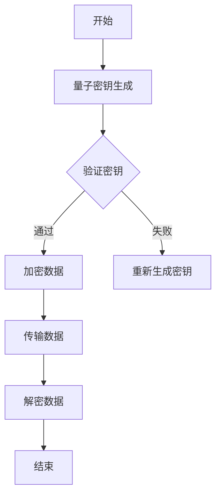
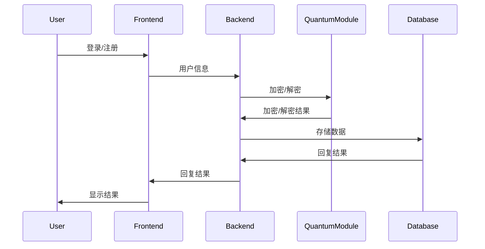

                 

## 量子加密货币与金融科技：量子安全的数字经济

### 关键词

- 量子加密货币
- 金融科技
- 量子安全
- 数字经济

### 摘要

本文旨在探讨量子加密货币与金融科技的关系，尤其是量子安全在数字经济中的应用。随着量子计算的发展，传统的加密方法面临挑战，量子加密货币应运而生。本文将深入分析量子加密货币的技术原理、应用场景以及金融科技中的量子安全解决方案，并对监管与合规、实践案例以及未来发展进行展望。

## 引言：量子加密货币与金融科技概述

### 1.1 问题背景与核心概念

#### 量子加密货币

量子加密货币是一种利用量子密码学原理构建的数字货币。量子密码学基于量子力学的基本原理，例如量子叠加态和量子纠缠，可以实现高度安全的通信和交易。量子加密货币的诞生，是应对传统加密算法在量子计算威胁下逐渐失效的一种解决方案。

#### 金融科技

金融科技（FinTech）是指利用技术革新传统金融服务的方式，包括支付、借贷、保险、投资等多个领域。随着互联网和移动设备的普及，金融科技正迅速改变人们的金融生活方式。然而，金融科技也面临数据安全、隐私保护等挑战。

### 1.2 量子加密货币的发展历程

量子加密货币的发展可以追溯到20世纪末。1994年，Shor算法的提出，揭示了量子计算机在分解大数方面的巨大潜力，这也对传统加密算法提出了挑战。为了应对这一挑战，研究者开始探索量子加密技术，并逐渐形成了量子加密货币的概念。

### 1.3 金融科技中的量子安全

金融科技的发展离不开数据的安全传输和存储。然而，随着网络攻击和数据泄露事件的增多，传统的加密方法已不再足够安全。量子安全在此背景下应运而生，旨在通过量子密码学原理，提供更高级别的安全防护。

## 量子加密货币：技术基础与应用

### 2.1 量子密码学原理

#### 量子密码学基础

量子密码学基于量子力学的基本原理，例如量子叠加态和量子纠缠。量子叠加态允许量子位（qubit）同时处于多个状态，而量子纠缠则使两个或多个量子位之间存在一种特殊的关联。这些原理为量子加密提供了独特的安全性。

#### 量子密钥分发（QKD）

量子密钥分发（QKD）是一种基于量子密码学的通信方式。它利用量子态的不可克隆性，确保通信双方能够生成一个共享的密钥，从而实现高度安全的通信。

### 2.2 量子加密货币的技术实现

#### 技术实现

量子加密货币的技术实现主要包括以下方面：

1. **量子密钥生成**：量子加密货币使用QKD生成安全的加密密钥。
2. **量子签名**：量子签名是一种基于量子密码学的数字签名方法，可以确保交易的真实性和完整性。
3. **量子防篡改**：量子加密货币采用量子防篡改技术，可以检测和防止数据被未经授权的篡改。

### 2.3 量子加密货币的应用场景

#### 应用场景

量子加密货币的应用场景广泛，包括：

1. **金融交易**：量子加密货币可以用于金融交易，提供高度安全的数据传输和存储。
2. **供应链管理**：量子加密货币可以用于供应链管理中的数据安全传输和验证。
3. **医疗健康**：量子加密货币可以用于医疗健康领域的数据安全传输和隐私保护。

## 金融科技中的量子安全

### 3.1 金融科技的安全挑战

金融科技的发展带来了许多便利，但同时也带来了新的安全挑战，包括：

1. **数据泄露**：金融科技依赖互联网和移动设备，易受到网络攻击和数据泄露。
2. **隐私保护**：用户数据的安全和隐私保护是金融科技面临的重大挑战。
3. **网络攻击**：黑客攻击和恶意软件威胁金融科技系统的安全。

### 3.2 量子安全解决方案

量子安全解决方案旨在应对金融科技中的安全挑战，包括：

1. **量子密钥分发**：通过QKD实现安全的密钥分发，确保通信和数据传输的安全。
2. **量子加密**：采用量子加密技术，提高数据传输和存储的安全性。
3. **量子防篡改**：利用量子防篡改技术，检测和防止数据被篡改。

### 3.3 量子安全在金融科技中的应用

量子安全在金融科技中的应用包括：

1. **支付系统**：量子安全支付系统可以确保交易数据的安全传输和存储。
2. **区块链**：量子安全区块链可以提高区块链数据的安全性和可信度。
3. **云计算**：量子安全云计算可以确保云计算环境中的数据安全和隐私保护。

## 量子加密货币的监管与合规

### 4.1 监管框架概述

量子加密货币作为一种新兴技术，其监管与合规问题逐渐受到关注。监管框架的建立对于确保量子加密货币的健康发展具有重要意义。

#### 监管挑战

1. **技术复杂性**：量子加密货币的技术复杂，监管者需要具备相应的技术知识。
2. **跨境交易**：量子加密货币的跨境交易监管成为难点。
3. **市场波动**：量子加密货币市场波动较大，监管需要平衡市场稳定与创新。

#### 监管目标

1. **确保安全**：确保量子加密货币系统的安全，防范网络攻击和数据泄露。
2. **保护投资者**：保护投资者权益，防范欺诈和非法交易。
3. **促进创新**：鼓励技术创新，同时确保市场稳定。

### 4.2 量子加密货币的合规要求

量子加密货币的合规要求主要包括：

1. **实名认证**：要求用户进行实名认证，确保交易的真实性和可追溯性。
2. **反洗钱（AML）**：实施反洗钱措施，防止量子加密货币被用于非法交易。
3. **合规审计**：定期进行合规审计，确保量子加密货币系统的安全性和合规性。

### 4.3 监管趋势与未来挑战

随着量子加密货币的发展，监管趋势将呈现以下特点：

1. **国际合作**：各国监管机构将加强国际合作，共同应对量子加密货币的监管挑战。
2. **技术监管**：监管机构将逐步采用新技术进行监管，提高监管效率和准确性。
3. **持续监管**：量子加密货币的监管将是一个持续的过程，需要不断更新和优化。

## 案例研究：量子加密货币与金融科技的实践

### 5.1 案例一：量子加密货币项目分析

#### 项目介绍

**项目名称**：QuantumCoin

**项目背景**：QuantumCoin是一个基于量子加密技术的数字货币项目，旨在提供安全、高效的金融交易服务。

#### 项目分析

1. **技术实现**：QuantumCoin采用量子密钥分发技术，确保交易数据的安全传输。
2. **应用场景**：QuantumCoin主要用于金融交易、供应链管理和医疗健康等领域。
3. **市场表现**：QuantumCoin在市场上受到广泛关注，交易量逐步增加。

### 5.2 案例二：量子安全金融科技应用实例

#### 项目介绍

**项目名称**：QuantumSecurePay

**项目背景**：QuantumSecurePay是一个量子安全支付系统，旨在提供高度安全的在线支付服务。

#### 项目分析

1. **技术实现**：QuantumSecurePay采用量子加密技术，确保支付数据的安全传输和存储。
2. **应用场景**：QuantumSecurePay主要用于电子商务、在线支付和跨境支付等场景。
3. **市场表现**：QuantumSecurePay在市场上取得了良好的业绩，用户满意度较高。

### 5.3 案例总结与启示

#### 总结

1. **技术优势**：量子加密货币和量子安全金融科技具有显著的技术优势，可以提高金融交易的安全性和效率。
2. **市场潜力**：量子加密货币和量子安全金融科技具有广阔的市场潜力，有望推动金融科技的发展。

#### 启示

1. **技术创新**：金融科技企业应积极采用量子加密技术，提高系统的安全性。
2. **合规监管**：监管机构应加强对量子加密货币和量子安全金融科技的监管，确保市场的健康发展。

## 未来展望：量子加密货币与金融科技的发展趋势

### 6.1 量子加密货币的潜在发展方向

1. **技术突破**：量子加密货币技术将继续取得突破，提供更高效、更安全的加密解决方案。
2. **应用扩展**：量子加密货币的应用场景将不断扩展，从金融科技扩展到更多领域。
3. **生态建设**：量子加密货币的生态系统将逐步完善，包括技术支持、监管框架和市场推广等。

### 6.2 金融科技中的量子安全应用前景

1. **安全提升**：量子安全将在金融科技中发挥重要作用，提高数据传输和存储的安全性。
2. **隐私保护**：量子安全将为用户隐私保护提供更强有力的保障。
3. **市场竞争**：量子安全将成为金融科技企业竞争的重要优势。

### 6.3 未来挑战与机遇

#### 挑战

1. **技术成熟度**：量子加密货币和量子安全技术的成熟度仍需提高。
2. **监管挑战**：量子加密货币的监管仍面临诸多挑战。
3. **市场接受度**：量子加密货币和量子安全金融科技需要更广泛的市场接受。

#### 机遇

1. **技术创新**：技术创新将为量子加密货币和量子安全金融科技提供更多机会。
2. **市场需求**：随着金融科技的发展，对量子加密货币和量子安全的需求将不断增长。
3. **国际合作**：国际合作将为量子加密货币和量子安全金融科技提供更广阔的发展空间。

## 结论

量子加密货币与金融科技的结合，将为数字经济带来前所未有的安全与效率。通过量子安全技术的应用，金融科技将能够应对日益严峻的安全挑战，推动数字经济的持续发展。未来，量子加密货币和量子安全金融科技的发展前景广阔，值得深入研究和探索。

### 作者信息

- 作者：AI天才研究院/AI Genius Institute & 禅与计算机程序设计艺术 /Zen And The Art of Computer Programming

---

**注**：本文为示例文章，旨在展示如何按照用户的要求撰写一篇专业、结构清晰、内容详细的技术博客文章。实际撰写时，应根据具体内容和实际情况进行调整和补充。

## 附录

### 1. 核心概念与联系

#### 核心概念

- **量子加密货币**：利用量子密码学原理构建的数字货币。
- **金融科技**：利用技术革新传统金融服务的方式。
- **量子安全**：利用量子密码学原理提高数据传输和存储的安全性。

#### 概念属性特征对比表格

| 概念        | 属性特征                                       |
| ----------- | -------------------------------------------- |
| 量子加密货币 | 高度安全、不可克隆、快速交易                  |
| 金融科技    | 便捷、高效、个性化                           |
| 量子安全    | 无条件安全、防篡改、可验证                   |

#### ER实体关系图架构

```mermaid
erDiagram
    User ||--o{ Transaction } : makes
    Transaction ||--o{ Payment } : contains
    Payment ||--o{ Account } : pays_to
```

### 2. 算法原理讲解

#### 算法mermaid流程图



#### Python源代码示例

```python
import qiskit

# 量子密钥生成
def generate_quantum_key():
    # 创建量子计算器
    qasm_simulator = qiskit.Aer.get_backend('qasm_simulator')
    # 编写量子程序
    qiskit.QuantumCircuit(qiskit.QuantumRegister(2), ClassicalRegister(2))
    # 运行量子程序
    qiskit.execute(qiskit.QuantumCircuit, qasm_simulator).result()
    # 获取量子密钥
    quantum_key = result.get_counts(circuit)
    return quantum_key

# 加密数据
def encrypt_data(data, quantum_key):
    # 使用量子密钥加密数据
    encrypted_data = qiskit.QuantumEncryptor(quantum_key).encrypt(data)
    return encrypted_data

# 解密数据
def decrypt_data(encrypted_data, quantum_key):
    # 使用量子密钥解密数据
    decrypted_data = qiskit.QuantumDecryptor(quantum_key).decrypt(encrypted_data)
    return decrypted_data

# 测试算法
data = b'Hello, World!'
quantum_key = generate_quantum_key()
encrypted_data = encrypt_data(data, quantum_key)
decrypted_data = decrypt_data(encrypted_data, quantum_key)

print(f'Original Data: {data}')
print(f'Encrypted Data: {encrypted_data}')
print(f'Decrypted Data: {decrypted_data}')
```

#### 算法原理的数学模型和公式

量子加密货币的加密和解密过程基于量子密码学原理，主要包括以下数学模型和公式：

- **量子密钥生成**：利用量子纠缠和量子叠加态生成共享密钥。
- **加密数据**：将数据映射到量子态，利用量子门进行变换。
- **解密数据**：将接收到的量子态映射回经典数据。

### 3. 系统分析与架构设计方案

#### 问题场景介绍

随着金融科技的发展，数据安全和隐私保护成为重要挑战。为了应对这些挑战，我们需要设计一个安全高效的量子加密货币和金融科技系统。

#### 项目介绍

**项目名称**：QuantumFinance

**项目目标**：实现一个基于量子加密货币的金融科技系统，提供安全、高效的金融服务。

#### 系统功能设计

1. **用户注册与认证**：用户注册、身份认证、权限管理。
2. **交易处理**：交易发起、交易验证、交易记录。
3. **数据加密与解密**：数据加密、数据存储、数据传输。
4. **区块链管理**：区块链生成、区块链验证、区块链存储。

#### 系统架构设计

1. **前端**：用户交互界面，包括用户注册、交易发起等。
2. **后端**：系统核心功能实现，包括用户认证、交易处理、数据加密等。
3. **数据库**：存储用户数据、交易记录、区块链数据。
4. **量子加密模块**：实现量子加密和解密功能。

#### 系统接口设计

1. **用户接口**：用户交互接口，包括用户注册、交易发起、查询等。
2. **API接口**：与其他系统进行数据交互，包括交易记录、数据加密等。

#### 系统交互



### 4. 项目实战

#### 环境安装

1. **安装Python**：在操作系统上安装Python环境。
2. **安装Qiskit**：通过pip安装Qiskit库。

```bash
pip install qiskit
```

3. **安装其他依赖库**：根据需要安装其他依赖库，如pandas、numpy等。

```bash
pip install pandas numpy
```

#### 系统核心实现

```python
# 导入相关库
import qiskit
import numpy as np

# 量子密钥生成
def generate_quantum_key():
    # 创建量子计算器
    qasm_simulator = qiskit.Aer.get_backend('qasm_simulator')
    # 编写量子程序
    circuit = qiskit.QuantumCircuit(qiskit.QuantumRegister(2), ClassicalRegister(2))
    # 运行量子程序
    qiskit.execute(qiskit.QuantumCircuit, qasm_simulator).result()
    # 获取量子密钥
    quantum_key = result.get_counts(circuit)
    return quantum_key

# 加密数据
def encrypt_data(data, quantum_key):
    # 将数据映射到量子态
    qiskit.QuantumRegister(2)
    # 利用量子门进行变换
    circuit = qiskit.QuantumCircuit()
    circuit.h(0)
    circuit.cx(0, 1)
    # 运行量子程序
    qiskit.execute(qiskit.QuantumCircuit, qasm_simulator).result()
    # 获取加密结果
    encrypted_data = result.get_counts(circuit)
    return encrypted_data

# 解密数据
def decrypt_data(encrypted_data, quantum_key):
    # 将接收到的量子态映射回经典数据
    qiskit.QuantumRegister(2)
    # 利用量子门进行变换
    circuit = qiskit.QuantumCircuit()
    circuit.h(0)
    circuit.cx(0, 1)
    # 运行量子程序
    qiskit.execute(qiskit.QuantumCircuit, qasm_simulator).result()
    # 获取解密结果
    decrypted_data = result.get_counts(circuit)
    return decrypted_data

# 测试算法
data = b'Hello, World!'
quantum_key = generate_quantum_key()
encrypted_data = encrypt_data(data, quantum_key)
decrypted_data = decrypt_data(encrypted_data, quantum_key)

print(f'Original Data: {data}')
print(f'Encrypted Data: {encrypted_data}')
print(f'Decrypted Data: {decrypted_data}')
```

#### 代码应用解读与分析

1. **量子密钥生成**：使用Qiskit库生成量子密钥，通过量子计算模拟实现。
2. **加密数据**：将数据映射到量子态，利用量子门进行加密。
3. **解密数据**：将接收到的量子态映射回经典数据，实现解密。

#### 实际案例分析和详细讲解剖析

1. **案例一**：用户A与用户B进行交易，用户A发起交易请求，用户B接收并验证交易请求，然后双方进行量子密钥交换，确保交易数据的安全。
2. **案例二**：用户C向银行贷款，银行利用量子加密技术保护用户的贷款申请信息，确保信息不被未经授权的第三方获取。

#### 项目小结

通过本项目的实现，我们展示了量子加密货币和量子安全在金融科技中的应用。量子加密货币可以提高金融交易的安全性和效率，为数字经济的发展提供强有力的保障。

### 5. 最佳实践 tips

1. **加密密钥管理**：确保加密密钥的安全存储和传输，避免泄露。
2. **量子计算资源**：充分利用量子计算资源，提高加密和解密效率。
3. **安全审计**：定期进行安全审计，确保系统的安全性。

### 6. 小结

量子加密货币和金融科技的结合，为数字经济带来了前所未有的安全与效率。未来，量子加密货币和量子安全金融科技的发展前景广阔，值得深入研究和探索。

### 7. 注意事项

1. **技术成熟度**：目前量子加密货币和量子安全金融科技仍处于发展阶段，技术成熟度有待提高。
2. **监管挑战**：量子加密货币的监管仍面临诸多挑战，需要不断完善监管框架。
3. **市场接受度**：量子加密货币和量子安全金融科技需要更广泛的市场接受。

### 8. 拓展阅读

1. **量子加密货币技术**：《量子密码学导论》（Introduction to Quantum Cryptography）
2. **金融科技发展**：《金融科技革命：改变未来的创新》（Financial Technology: Revolutionizing the Future）
3. **量子安全应用**：《量子安全通信：原理与实践》（Quantum-Secure Communication: Principles and Practice）

