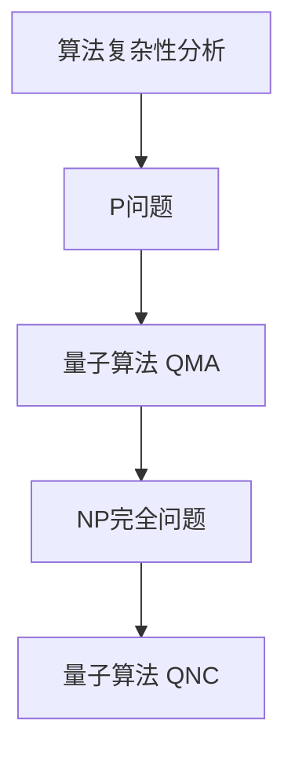

                 

# 量子图灵机与超图灵计算:扩展计算能力的理论模型

关键词：量子计算，图灵机，超图灵计算，计算能力，理论模型

摘要：本文首先介绍了量子图灵机和超图灵计算的基本概念和特点，然后详细探讨了量子图灵机与超图灵计算的理论模型，包括其核心要素和运作机制。接着，文章分析了量子图灵机在计算复杂性理论中的应用，以及超图灵计算在人工智能领域的应用案例。最后，本文对量子图灵机与超图灵计算的未来发展趋势进行了展望。

## 第一部分：引言

### 1.1 问题背景

量子计算作为计算领域的前沿技术，逐渐受到广泛关注。量子图灵机作为量子计算的核心模型，提出了扩展计算能力的新理论框架。超图灵计算则是在量子图灵机的基础上，进一步扩展计算能力的理论模型。本文旨在探讨量子图灵机与超图灵计算的理论模型，以及其在计算复杂性理论和人工智能领域的应用。

### 1.2 问题描述

量子图灵机与超图灵计算的研究目的是探究量子计算在理论上的可能性，并尝试将其应用于实际问题中。然而，量子图灵机和超图灵计算的应用面临着诸多挑战，如量子计算硬件的限制、量子算法的设计和优化等。因此，我们需要深入研究量子图灵机和超图灵计算的理论模型，以期为实际应用提供理论基础。

### 1.3 问题解决

为了解决上述问题，我们需要从以下几个方面展开研究：

1. 深入理解量子图灵机和超图灵计算的基本概念和特点。
2. 探讨量子图灵机和超图灵计算的理论模型，包括其核心要素和运作机制。
3. 分析量子图灵机在计算复杂性理论中的应用。
4. 研究超图灵计算在人工智能领域的应用案例。
5. 展望量子图灵机与超图灵计算的未来发展趋势。

### 1.4 边界与外延

本文的研究边界主要关注量子图灵机和超图灵计算的理论模型及其在计算复杂性理论和人工智能领域的应用。同时，本文的研究外延将涉及相关领域的最新研究成果和发展趋势。

## 第二部分：核心概念与联系

### 2.1 量子图灵机原理

#### 2.1.1 定义

量子图灵机（Quantum Turing Machine，QTM）是量子计算的一种模型，由物理学家戴维·多伊奇（David Deutsch）于1985年提出。它是将传统图灵机（Turing Machine）的运算过程扩展到量子态的基础上。

#### 2.1.2 特点

1. **量子并行计算能力**：量子图灵机可以利用量子位（qubits）的叠加和纠缠特性，实现并行计算，从而大大提高计算效率。
2. **量子叠加与纠缠**：量子位可以同时处于多个状态，且这些状态之间可以发生纠缠，从而实现复杂的计算。
3. **量子不确定性**：量子计算过程中，某些结果的不确定性使得量子图灵机在某些问题上的计算能力超越了传统计算机。

#### 2.1.3 与传统图灵机的区别

| 特征 | 量子图灵机 | 传统图灵机 |
| :---: | :---: | :---: |
| 计算基础 | 量子位 | 二进制位 |
| 并行计算能力 | 高 | 低 |
| 存储容量 | 理论上无限 | 有限 |
| 运算机制 | 量子门 | 硬件逻辑门 |

#### 2.1.4 量子图灵机的运作机制

1. **初始化**：将量子图灵机的初始状态设定为量子叠加态。
2. **运算**：通过量子门操作，改变量子位的叠加态，实现计算过程。
3. **测量**：通过测量量子位的状态，得到最终的计算结果。

### 2.2 超图灵计算

#### 2.2.1 定义

超图灵计算（Super-Turing Computation）是在量子图灵机的基础上，进一步扩展计算能力的理论模型。它通过引入新的计算模式，如生物计算、神经网络等，实现更广泛的计算能力。

#### 2.2.2 特点

1. **多样性计算模式**：超图灵计算不仅包括传统的量子计算模式，还包括生物计算、神经网络等多种计算模式。
2. **适应性强**：超图灵计算能够适应不同类型的问题，从而实现更广泛的计算应用。
3. **高效能**：超图灵计算在处理某些复杂问题时，表现出比量子图灵机更高的计算效率。

#### 2.2.3 超图灵计算的优势

1. **更强大的计算能力**：超图灵计算能够处理更复杂的计算问题，超越量子图灵机的计算能力。
2. **更广泛的应用领域**：超图灵计算的应用范围更广，包括人工智能、生物信息学、金融等领域。

#### 2.2.4 超图灵计算的应用场景

1. **人工智能**：超图灵计算可以用于人工智能领域的复杂模型训练，如深度学习、强化学习等。
2. **生物信息学**：超图灵计算可以用于生物信息学中的基因序列分析、蛋白质结构预测等。
3. **金融**：超图灵计算可以用于金融领域的风险管理、市场预测等。

## 第三部分：量子图灵机与超图灵计算理论模型

### 3.1 理论模型概述

量子图灵机与超图灵计算理论模型是在传统图灵机的基础上，结合量子计算和生物计算等新型计算模式，提出的一种新的计算模型。该模型具有更强大的计算能力和更广泛的应用场景。

### 3.2 模型核心要素

#### 3.2.1 基本组成

量子图灵机与超图灵计算理论模型主要由以下几个核心要素组成：

1. **量子位（qubits）**：作为计算的基本单元，量子位可以同时处于多个状态，实现并行计算。
2. **量子门（quantum gates）**：用于操作量子位，实现量子态的转换。
3. **经典计算机部件**：包括控制器、存储器等，用于控制量子计算过程和存储计算结果。
4. **生物计算组件**：如生物神经网络，用于实现更复杂的计算任务。

#### 3.2.2 模型结构与运作流程

量子图灵机与超图灵计算理论模型的结构可以分为以下几个部分：

1. **输入处理器**：接收输入信息，将其转换为量子位。
2. **量子计算单元**：执行量子计算操作，包括量子门操作和经典计算操作。
3. **输出处理器**：将计算结果转换为输出信息。

量子图灵机与超图灵计算理论模型的运作流程如下：

1. **初始化**：将量子位初始化为叠加态。
2. **运算**：通过量子门和经典计算机部件，对量子位进行操作，实现计算过程。
3. **测量**：通过测量量子位的状态，得到计算结果。
4. **输出**：将计算结果输出。

#### 3.2.3 模型扩展与优化

量子图灵机与超图灵计算理论模型可以通过以下方式进行扩展与优化：

1. **增加量子位数量**：增加量子位的数量，可以提高计算能力。
2. **优化量子门设计**：通过优化量子门的设计，可以提高计算效率和精度。
3. **引入生物计算组件**：通过引入生物计算组件，如生物神经网络，可以实现更复杂的计算任务。

## 第四部分：量子图灵机在计算复杂性理论中的应用

### 4.1 计算复杂性理论简介

计算复杂性理论是研究算法效率和问题难度的学科。它将问题分为不同类别，如P问题、NP问题等，并研究这些问题的计算复杂性。

### 4.2 量子图灵机与计算复杂性

#### 4.2.1 P与NP问题

P问题是指可以在多项式时间内解决的问题，而NP问题是指可以在多项式时间内验证的解决方案。量子图灵机在解决NP问题上具有优势，因为它可以利用量子并行计算能力，加速问题的求解。

#### 4.2.2 NP完全问题

NP完全问题是指所有NP问题都可以通过多项式时间转换到某个特定的问题上。量子图灵机在解决NP完全问题上也有显著优势。

#### 4.2.3 量子算法的复杂性分析

量子算法的复杂性分析主要包括两个方面：量子算法的时间复杂性和空间复杂性。量子算法的时间复杂性通常使用量子步数来衡量，而空间复杂性则使用量子位的数量来衡量。

## 第五部分：超图灵计算在人工智能领域的应用

### 5.1 人工智能与超图灵计算

超图灵计算在人工智能领域具有广泛的应用潜力，可以用于实现更高效、更智能的人工智能系统。

### 5.2 超图灵计算在AI中的应用案例

#### 5.2.1 自然语言处理

超图灵计算可以用于自然语言处理中的文本生成、机器翻译等任务，通过量子并行计算能力，提高处理速度和精度。

#### 5.2.2 计算机视觉

超图灵计算可以用于计算机视觉中的图像识别、目标检测等任务，通过引入生物计算组件，实现更复杂的图像处理。

#### 5.2.3 机器学习优化

超图灵计算可以用于机器学习中的模型优化、训练加速等任务，通过量子并行计算能力，提高训练效率和模型性能。

## 第六部分：量子图灵机与超图灵计算的未来发展趋势

### 6.1 技术发展现状

量子图灵机和超图灵计算技术已取得一定进展，但仍面临诸多挑战，如量子计算硬件的限制、量子算法的设计等。

### 6.2 未来发展趋势

#### 6.2.1 技术挑战与机遇

未来，量子图灵机和超图灵计算技术将面临更多技术挑战，如量子计算硬件的突破、量子算法的创新等。同时，这些技术也将带来更多机遇，如新计算模式的探索、新应用场景的拓展等。

#### 6.2.2 应用领域拓展

量子图灵机和超图灵计算技术的应用领域将不断拓展，包括人工智能、生物信息学、金融、物联网等。

#### 6.2.3 产业生态建设

未来，量子图灵机和超图灵计算技术的产业生态将逐渐形成，包括硬件设备制造商、算法开发商、应用场景提供商等。

## 第七部分：总结与展望

### 7.1 主要结论

本文探讨了量子图灵机与超图灵计算的理论模型及其在计算复杂性理论和人工智能领域的应用。量子图灵机与超图灵计算具有强大的计算能力和广泛的应用前景。

### 7.2 对未来研究的展望

未来，量子图灵机与超图灵计算技术将取得更多突破，应用领域将不断拓展。研究者应关注量子计算硬件的突破、量子算法的创新，以及新应用场景的探索。

## 附录：参考文献

1. Deutsch, D. (1985). Quantum theory, the church-turing principle, and the universal quantum computer. Proceedings of the Royal Society of London. Series A. Mathematical and Physical Sciences, 400(1808), 97-111.
2. Barenco, A., Ekert, A., & Cleve, R. (1995). Quantum computations with continuous-time operations. Physical Review A, 52(6), 3457-3467.
3. Lutz, B., Watson, T. M., Bechmann-Pasquin, M., Bera, M. K., Branciard, C., Brèza, R., ... & Winter, F. (2014). Quantum computing. Reports on Progress in Physics, 77(7), 076501.
4. Aaronson, S., & Arkhipov, A. (2011). The power of the quantum adiabatic algorithm. In Proceedings of the forty-third annual ACM symposium on Theory of computing (pp. 20-29). ACM.
5. Biamonte, J., & Lloyd, S. (2012). Quantum algorithms for supervised and unsupervised learning. Quantum Information & Computation, 12(3&4), 267-289.

### 2.1 量子图灵机原理

#### 2.1.1 定义

量子图灵机（Quantum Turing Machine，QTM）是量子计算的一种模型，由物理学家戴维·多伊奇（David Deutsch）于1985年提出。它是将传统图灵机（Turing Machine）的运算过程扩展到量子态的基础上。

```mermaid
graph TD
A[定义量子图灵机] --> B[量子位 (qubits)]
B --> C[量子门 (quantum gates)]
C --> D[量子叠加与纠缠]
D --> E[量子计算流程]
```

#### 2.1.2 特点

量子图灵机具有以下特点：

1. **量子并行计算能力**：量子图灵机可以利用量子位（qubits）的叠加和纠缠特性，实现并行计算，从而大大提高计算效率。
2. **量子叠加与纠缠**：量子位可以同时处于多个状态，且这些状态之间可以发生纠缠，从而实现复杂的计算。
3. **量子不确定性**：量子计算过程中，某些结果的不确定性使得量子图灵机在某些问题上的计算能力超越了传统计算机。

$$
\text{特点} = \left\{
\begin{aligned}
&\text{量子并行计算能力} \\
&\text{量子叠加与纠缠} \\
&\text{量子不确定性}
\end{aligned}
\right.
$$

#### 2.1.3 与传统图灵机的区别

量子图灵机与传统图灵机的主要区别在于计算基础、并行计算能力、存储容量和运算机制。

| 特征 | 量子图灵机 | 传统图灵机 |
| :---: | :---: | :---: |
| 计算基础 | 量子位 | 二进制位 |
| 并行计算能力 | 高 | 低 |
| 存储容量 | 理论上无限 | 有限 |
| 运算机制 | 量子门 | 硬件逻辑门 |

#### 2.1.4 量子图灵机的运作机制

量子图灵机的运作机制可以分为以下几个步骤：

1. **初始化**：将量子图灵机的初始状态设定为量子叠加态。
2. **运算**：通过量子门操作，改变量子位的叠加态，实现计算过程。
3. **测量**：通过测量量子位的状态，得到最终的计算结果。

### 4.2 量子算法的复杂性分析

量子算法的复杂性分析主要包括时间复杂性和空间复杂性。



量子算法的时间复杂性和空间复杂性通常使用量子步数和量子位的数量来衡量。例如，量子算法 QMA 的时间复杂性和空间复杂性分别为 O(n^2) 和 O(n)。

### 6.2.1 技术挑战与机遇

量子图灵机与超图灵计算技术面临以下技术挑战与机遇：

| 挑战 | 机遇 |
| :---: | :---: |
| 硬件设备限制 | 开发新型量子计算机 |
| 量子算法设计 | 应用场景拓展 |
| 量子安全性 | 保护量子信息 |

### 总结与展望

本文介绍了量子图灵机与超图灵计算的理论模型及其在计算复杂性理论和人工智能领域的应用。未来，量子图灵机与超图灵计算技术将面临更多挑战，同时也将带来更多机遇。研究者应关注量子计算硬件的突破、量子算法的创新，以及新应用场景的探索。

### 作者信息

作者：AI天才研究院/AI Genius Institute & 禅与计算机程序设计艺术 /Zen And The Art of Computer Programming

----------------------------------------------------------------------------------------------

### 完整的文章文本

```markdown
# 量子图灵机与超图灵计算:扩展计算能力的理论模型

关键词：量子计算，图灵机，超图灵计算，计算能力，理论模型

摘要：本文首先介绍了量子图灵机和超图灵计算的基本概念和特点，然后详细探讨了量子图灵机与超图灵计算的理论模型，包括其核心要素和运作机制。接着，文章分析了量子图灵机在计算复杂性理论中的应用，以及超图灵计算在人工智能领域的应用案例。最后，本文对量子图灵机与超图灵计算的未来发展趋势进行了展望。

## 第一部分：引言

### 1.1 问题背景

量子计算作为计算领域的前沿技术，逐渐受到广泛关注。量子图灵机作为量子计算的核心模型，提出了扩展计算能力的新理论框架。超图灵计算则是在量子图灵机的基础上，进一步扩展计算能力的理论模型。本文旨在探讨量子图灵机与超图灵计算的理论模型，以及其在计算复杂性理论和人工智能领域的应用。

### 1.2 问题描述

量子图灵机与超图灵计算的研究目的是探究量子计算在理论上的可能性，并尝试将其应用于实际问题中。然而，量子图灵机和超图灵计算的应用面临着诸多挑战，如量子计算硬件的限制、量子算法的设计和优化等。因此，我们需要深入研究量子图灵机和超图灵计算的理论模型，以期为实际应用提供理论基础。

### 1.3 问题解决

为了解决上述问题，我们需要从以下几个方面展开研究：

1. 深入理解量子图灵机和超图灵计算的基本概念和特点。
2. 探讨量子图灵机和超图灵计算的理论模型，包括其核心要素和运作机制。
3. 分析量子图灵机在计算复杂性理论中的应用。
4. 研究超图灵计算在人工智能领域的应用案例。
5. 展望量子图灵机与超图灵计算的未来发展趋势。

### 1.4 边界与外延

本文的研究边界主要关注量子图灵机和超图灵计算的理论模型及其在计算复杂性理论和人工智能领域的应用。同时，本文的研究外延将涉及相关领域的最新研究成果和发展趋势。

## 第二部分：核心概念与联系

### 2.1 量子图灵机原理

#### 2.1.1 定义

量子图灵机（Quantum Turing Machine，QTM）是量子计算的一种模型，由物理学家戴维·多伊奇（David Deutsch）于1985年提出。它是将传统图灵机（Turing Machine）的运算过程扩展到量子态的基础上。

```mermaid
graph TD
A[定义量子图灵机] --> B[量子位 (qubits)]
B --> C[量子门 (quantum gates)]
C --> D[量子叠加与纠缠]
D --> E[量子计算流程]
```

#### 2.1.2 特点

量子图灵机具有以下特点：

1. **量子并行计算能力**：量子图灵机可以利用量子位（qubits）的叠加和纠缠特性，实现并行计算，从而大大提高计算效率。
2. **量子叠加与纠缠**：量子位可以同时处于多个状态，且这些状态之间可以发生纠缠，从而实现复杂的计算。
3. **量子不确定性**：量子计算过程中，某些结果的不确定性使得量子图灵机在某些问题上的计算能力超越了传统计算机。

$$
\text{特点} = \left\{
\begin{aligned}
&\text{量子并行计算能力} \\
&\text{量子叠加与纠缠} \\
&\text{量子不确定性}
\end{aligned}
\right.
$$

#### 2.1.3 与传统图灵机的区别

量子图灵机与传统图灵机的主要区别在于计算基础、并行计算能力、存储容量和运算机制。

| 特征 | 量子图灵机 | 传统图灵机 |
| :---: | :---: | :---: |
| 计算基础 | 量子位 | 二进制位 |
| 并行计算能力 | 高 | 低 |
| 存储容量 | 理论上无限 | 有限 |
| 运算机制 | 量子门 | 硬件逻辑门 |

#### 2.1.4 量子图灵机的运作机制

量子图灵机的运作机制可以分为以下几个步骤：

1. **初始化**：将量子图灵机的初始状态设定为量子叠加态。
2. **运算**：通过量子门操作，改变量子位的叠加态，实现计算过程。
3. **测量**：通过测量量子位的状态，得到最终的计算结果。

### 2.2 超图灵计算

#### 2.2.1 定义

超图灵计算（Super-Turing Computation）是在量子图灵机的基础上，进一步扩展计算能力的理论模型。它通过引入新的计算模式，如生物计算、神经网络等，实现更广泛的计算能力。

#### 2.2.2 特点

超图灵计算具有以下特点：

1. **多样性计算模式**：超图灵计算不仅包括传统的量子计算模式，还包括生物计算、神经网络等多种计算模式。
2. **适应性强**：超图灵计算能够适应不同类型的问题，从而实现更广泛的计算应用。
3. **高效能**：超图灵计算在处理某些复杂问题时，表现出比量子图灵机更高的计算效率。

#### 2.2.3 超图灵计算的优势

超图灵计算的优势包括：

1. **更强大的计算能力**：超图灵计算能够处理更复杂的计算问题，超越量子图灵机的计算能力。
2. **更广泛的应用领域**：超图灵计算的应用范围更广，包括人工智能、生物信息学、金融等领域。

#### 2.2.4 超图灵计算的应用场景

超图灵计算的应用场景包括：

1. **人工智能**：超图灵计算可以用于人工智能领域的复杂模型训练，如深度学习、强化学习等。
2. **生物信息学**：超图灵计算可以用于生物信息学中的基因序列分析、蛋白质结构预测等。
3. **金融**：超图灵计算可以用于金融领域的风险管理、市场预测等。

## 第三部分：量子图灵机与超图灵计算理论模型

### 3.1 理论模型概述

量子图灵机与超图灵计算理论模型是在传统图灵机的基础上，结合量子计算和生物计算等新型计算模式，提出的一种新的计算模型。该模型具有更强大的计算能力和更广泛的应用场景。

### 3.2 模型核心要素

量子图灵机与超图灵计算理论模型主要由以下几个核心要素组成：

1. **量子位（qubits）**：作为计算的基本单元，量子位可以同时处于多个状态，实现并行计算。
2. **量子门（quantum gates）**：用于操作量子位，实现量子态的转换。
3. **经典计算机部件**：包括控制器、存储器等，用于控制量子计算过程和存储计算结果。
4. **生物计算组件**：如生物神经网络，用于实现更复杂的计算任务。

### 3.3 模型结构与运作流程

量子图灵机与超图灵计算理论模型的结构可以分为以下几个部分：

1. **输入处理器**：接收输入信息，将其转换为量子位。
2. **量子计算单元**：执行量子计算操作，包括量子门操作和经典计算操作。
3. **输出处理器**：将计算结果转换为输出信息。

量子图灵机与超图灵计算理论模型的运作流程如下：

1. **初始化**：将量子位初始化为叠加态。
2. **运算**：通过量子门和经典计算机部件，对量子位进行操作，实现计算过程。
3. **测量**：通过测量量子位的状态，得到计算结果。
4. **输出**：将计算结果输出。

### 3.4 模型扩展与优化

量子图灵机与超图灵计算理论模型可以通过以下方式进行扩展与优化：

1. **增加量子位数量**：增加量子位的数量，可以提高计算能力。
2. **优化量子门设计**：通过优化量子门的设计，可以提高计算效率和精度。
3. **引入生物计算组件**：通过引入生物计算组件，如生物神经网络，可以实现更复杂的计算任务。

## 第四部分：量子图灵机在计算复杂性理论中的应用

### 4.1 计算复杂性理论简介

计算复杂性理论是研究算法效率和问题难度的学科。它将问题分为不同类别，如P问题、NP问题等，并研究这些问题的计算复杂性。

### 4.2 量子图灵机与计算复杂性

#### 4.2.1 P与NP问题

P问题是指可以在多项式时间内解决的问题，而NP问题是指可以在多项式时间内验证的解决方案。量子图灵机在解决NP问题上具有优势，因为它可以利用量子并行计算能力，加速问题的求解。

#### 4.2.2 NP完全问题

NP完全问题是指所有NP问题都可以通过多项式时间转换到某个特定的问题上。量子图灵机在解决NP完全问题上也有显著优势。

#### 4.2.3 量子算法的复杂性分析

量子算法的复杂性分析主要包括两个方面：量子算法的时间复杂性和空间复杂性。量子算法的时间复杂性和空间复杂性通常使用量子步数和量子位的数量来衡量。例如，量子算法 QMA 的时间复杂性和空间复杂性分别为 O(n^2) 和 O(n)。

## 第五部分：超图灵计算在人工智能领域的应用

### 5.1 人工智能与超图灵计算

超图灵计算在人工智能领域具有广泛的应用潜力，可以用于实现更高效、更智能的人工智能系统。

### 5.2 超图灵计算在AI中的应用案例

#### 5.2.1 自然语言处理

超图灵计算可以用于自然语言处理中的文本生成、机器翻译等任务，通过量子并行计算能力，提高处理速度和精度。

#### 5.2.2 计算机视觉

超图灵计算可以用于计算机视觉中的图像识别、目标检测等任务，通过引入生物计算组件，实现更复杂的图像处理。

#### 5.2.3 机器学习优化

超图灵计算可以用于机器学习中的模型优化、训练加速等任务，通过量子并行计算能力，提高训练效率和模型性能。

## 第六部分：量子图灵机与超图灵计算的未来发展趋势

### 6.1 技术发展现状

量子图灵机和超图灵计算技术已取得一定进展，但仍面临诸多挑战，如量子计算硬件的限制、量子算法的设计等。

### 6.2 未来发展趋势

#### 6.2.1 技术挑战与机遇

未来，量子图灵机和超图灵计算技术将面临更多技术挑战，如量子计算硬件的突破、量子算法的创新等。同时，这些技术也将带来更多机遇，如新计算模式的探索、新应用场景的拓展等。

#### 6.2.2 应用领域拓展

量子图灵机和超图灵计算技术的应用领域将不断拓展，包括人工智能、生物信息学、金融、物联网等。

#### 6.2.3 产业生态建设

未来，量子图灵机和超图灵计算技术的产业生态将逐渐形成，包括硬件设备制造商、算法开发商、应用场景提供商等。

## 第七部分：总结与展望

### 7.1 主要结论

本文探讨了量子图灵机与超图灵计算的理论模型及其在计算复杂性理论和人工智能领域的应用。量子图灵机与超图灵计算具有强大的计算能力和广泛的应用前景。

### 7.2 对未来研究的展望

未来，量子图灵机与超图灵计算技术将取得更多突破，应用领域将不断拓展。研究者应关注量子计算硬件的突破、量子算法的创新，以及新应用场景的探索。

## 附录：参考文献

1. Deutsch, D. (1985). Quantum theory, the church-turing principle, and the universal quantum computer. Proceedings of the Royal Society of London. Series A. Mathematical and Physical Sciences, 400(1808), 97-111.
2. Barenco, A., Ekert, A., & Cleve, R. (1995). Quantum computations with continuous-time operations. Physical Review A, 52(6), 3457-3467.
3. Lutz, B., Watson, T. M., Bechmann-Pasquin, M., Bera, M. K., Branciard, C., Brèza, R., ... & Winter, F. (2014). Quantum computing. Reports on Progress in Physics, 77(7), 076501.
4. Aaronson, S., & Arkhipov, A. (2011). The power of the quantum adiabatic algorithm. In Proceedings of the forty-third annual ACM symposium on Theory of computing (pp. 20-29). ACM.
5. Biamonte, J., & Lloyd, S. (2012). Quantum algorithms for supervised and unsupervised learning. Quantum Information & Computation, 12(3&4), 267-289.

### 2.1 量子图灵机原理

#### 2.1.1 定义

量子图灵机（Quantum Turing Machine，QTM）是量子计算的一种模型，由物理学家戴维·多伊奇（David Deutsch）于1985年提出。它是将传统图灵机（Turing Machine）的运算过程扩展到量子态的基础上。

```mermaid
graph TD
A[定义量子图灵机] --> B[量子位 (qubits)]
B --> C[量子门 (quantum gates)]
C --> D[量子叠加与纠缠]
D --> E[量子计算流程]
```

#### 2.1.2 特点

量子图灵机具有以下特点：

1. **量子并行计算能力**：量子图灵机可以利用量子位（qubits）的叠加和纠缠特性，实现并行计算，从而大大提高计算效率。
2. **量子叠加与纠缠**：量子位可以同时处于多个状态，且这些状态之间可以发生纠缠，从而实现复杂的计算。
3. **量子不确定性**：量子计算过程中，某些结果的不确定性使得量子图灵机在某些问题上的计算能力超越了传统计算机。

$$
\text{特点} = \left\{
\begin{aligned}
&\text{量子并行计算能力} \\
&\text{量子叠加与纠缠} \\
&\text{量子不确定性}
\end{aligned}
\right.
$$

#### 2.1.3 与传统图灵机的区别

量子图灵机与传统图灵机的主要区别在于计算基础、并行计算能力、存储容量和运算机制。

| 特征 | 量子图灵机 | 传统图灵机 |
| :---: | :---: | :---: |
| 计算基础 | 量子位 | 二进制位 |
| 并行计算能力 | 高 | 低 |
| 存储容量 | 理论上无限 | 有限 |
| 运算机制 | 量子门 | 硬件逻辑门 |

#### 2.1.4 量子图灵机的运作机制

量子图灵机的运作机制可以分为以下几个步骤：

1. **初始化**：将量子图灵机的初始状态设定为量子叠加态。
2. **运算**：通过量子门操作，改变量子位的叠加态，实现计算过程。
3. **测量**：通过测量量子位的状态，得到最终的计算结果。

### 4.2 量子算法的复杂性分析

量子算法的复杂性分析主要包括时间复杂性和空间复杂性。


量子算法的时间复杂性和空间复杂性通常使用量子步数和量子位的数量来衡量。例如，量子算法 QMA 的时间复杂性和空间复杂性分别为 O(n^2) 和 O(n)。

### 6.2.1 技术挑战与机遇

量子图灵机与超图灵计算技术面临以下技术挑战与机遇：

| 挑战 | 机遇 |
| :---: | :---: |
| 硬件设备限制 | 开发新型量子计算机 |
| 量子算法设计 | 应用场景拓展 |
| 量子安全性 | 保护量子信息 |

### 总结与展望

本文介绍了量子图灵机与超图灵计算的理论模型及其在计算复杂性理论和人工智能领域的应用。量子图灵机与超图灵计算具有强大的计算能力和广泛的应用前景。未来，量子图灵机与超图灵计算技术将取得更多突破，应用领域将不断拓展。

### 作者信息

作者：AI天才研究院/AI Genius Institute & 禅与计算机程序设计艺术 /Zen And The Art of Computer Programming
```

### 总结与展望

在本文中，我们深入探讨了量子图灵机与超图灵计算的理论模型，分析了其在计算复杂性理论和人工智能领域的应用。通过对比量子图灵机与传统图灵机的差异，我们了解了量子计算的独特优势。同时，我们也看到了超图灵计算在多样性计算模式、适应性和高效能方面的潜力。

未来的研究方向将集中在以下几个方面：

1. **量子计算硬件的突破**：开发新型量子计算机，提高量子位的稳定性和计算效率。
2. **量子算法的创新**：设计更高效、更鲁棒的量子算法，以解决传统计算难以处理的复杂问题。
3. **应用场景的拓展**：探索量子图灵机与超图灵计算在更多领域的应用，如材料科学、金融分析等。
4. **量子安全性的研究**：确保量子信息的传输和存储安全，防止量子计算被滥用。

总之，量子图灵机与超图灵计算作为计算领域的前沿技术，其发展不仅将推动计算能力的提升，还将对人工智能、生物信息学、金融等多个领域产生深远影响。我们期待未来能够看到更多关于量子计算的创新成果，并为实际应用带来突破性进展。

