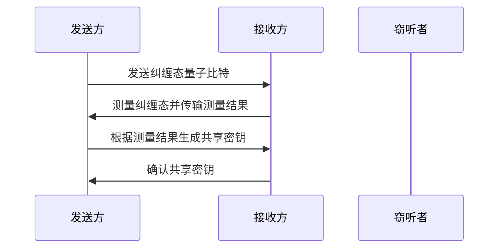
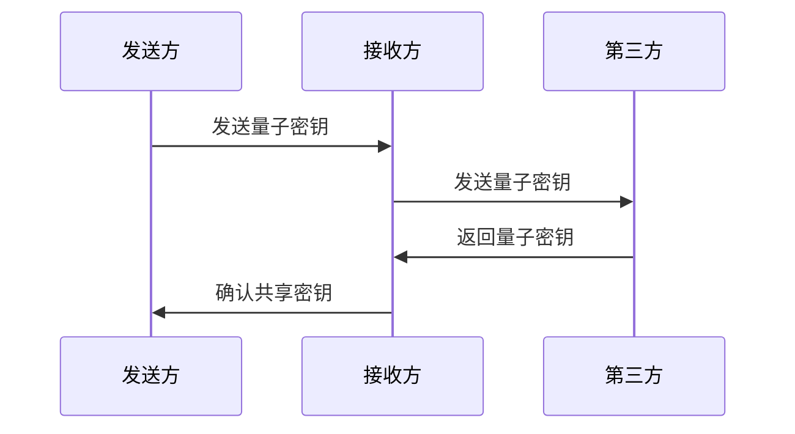
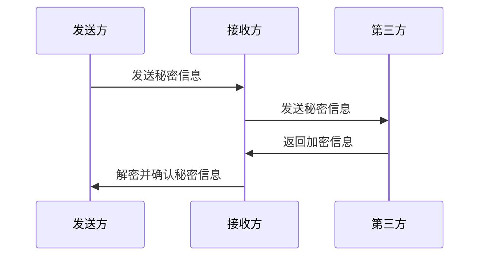
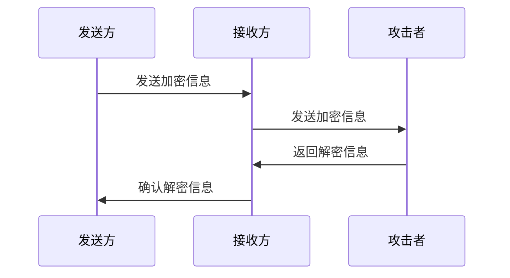
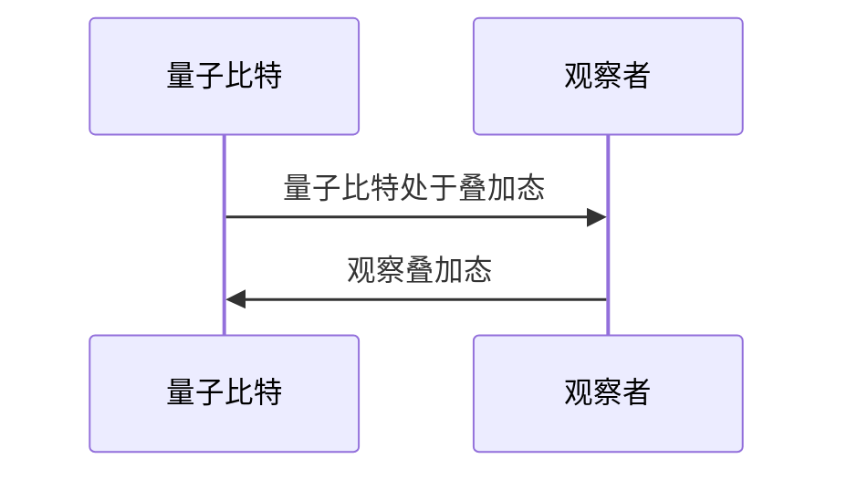
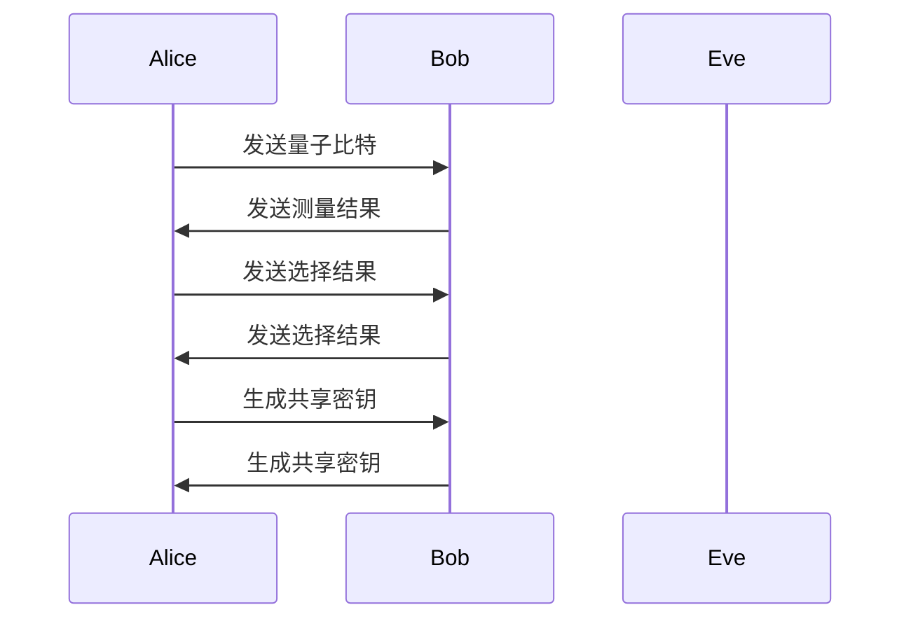
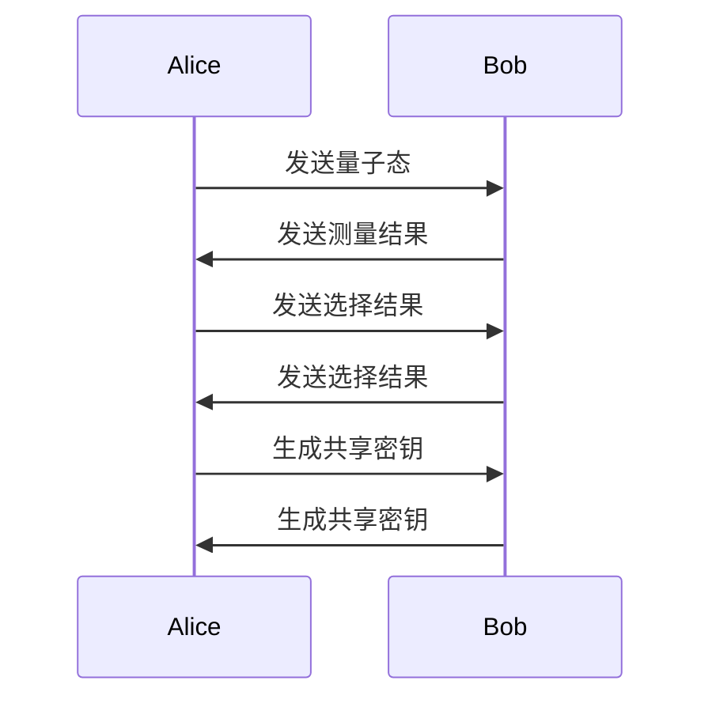
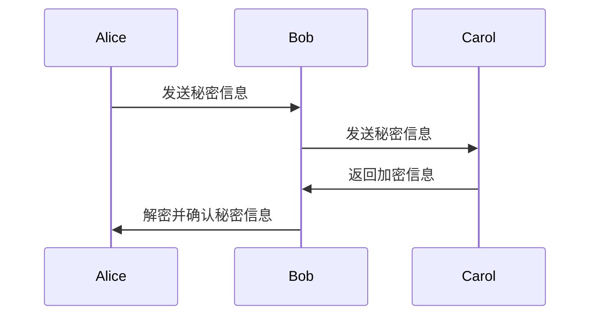
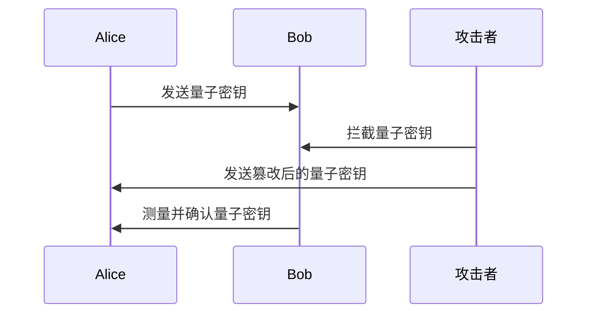

                 

### 第1章：引言

**关键词**：量子密码学、安全通信、后量子时代

**摘要**：
本文将深入探讨量子密码学这一革命性领域，重点介绍其在后量子时代对安全通信的重要性。通过分析量子密码学的核心概念和历史发展，我们将揭示其独特的工作原理和广泛的应用前景。本文旨在为读者提供一个系统而全面的量子密码学概述，帮助其理解这一领域的本质及其在当今技术环境中的关键作用。

### 1.1 问题背景

在传统的密码学中，加密和解密信息的方法主要依赖于数学难题的复杂性，如大数分解、离散对数问题等。然而，随着计算机技术的发展，这些难题正变得越来越容易解决。量子计算的出现进一步加剧了这一挑战，因为量子计算机具有解决传统密码学中难题的巨大潜力。这就迫使我们重新思考如何在后量子时代保护通信安全。量子密码学的出现为解决这一挑战提供了新的思路和方法。

### 1.2 量子密码学的定义

量子密码学是利用量子力学原理来设计加密和解密算法的学科。它基于量子位的特殊性质，如叠加态和纠缠态，实现了比传统密码学更安全的通信方式。量子密码学的核心思想是通过量子力学原理来确保信息的保密性和完整性，即使在面对量子计算机的攻击时也能保持安全。

### 1.3 本书的目的和结构

本书的目的是为读者提供一套全面而系统的量子密码学知识体系，帮助其理解这一领域的核心概念、工作原理和实际应用。本书的结构分为六大部分：引言、基础概念、原理、应用、安全性和未来展望。通过逐步深入的分析，读者将能够全面掌握量子密码学的各个方面，为未来的研究和实践奠定基础。

### 第2章：量子密码学基础

**关键词**：量子力学、量子位、纠缠、量子态叠加

**摘要**：
本章将介绍量子密码学的基础概念，包括量子力学的基本原理、量子位的定义及其性质、纠缠态和量子态叠加的概念。通过这些基础知识的讲解，读者将能够理解量子密码学的核心思想，为其后续章节的学习打下坚实的基础。

### 2.1 量子力学基础

量子力学是描述微观世界的物理理论，其核心概念包括波粒二象性、量子态叠加和量子纠缠等。这些概念为量子密码学提供了理论基础。例如，量子态叠加使得量子位能够同时处于多个状态，从而实现更高的信息容量。量子纠缠则确保了即使量子位被分离，它们之间的联系依然存在，这对于量子密钥分发至关重要。

### 2.2 量子密码学的历史和发展

量子密码学的起源可以追溯到20世纪80年代，当时Shor提出了量子算法，揭示了量子计算机对传统密码学的威胁。随后， Bennett 和 Brassard 提出了量子密钥分发（QKD）协议，奠定了量子密码学的基础。近年来，随着量子技术的快速发展，量子密码学也在不断进步和完善。

### 2.3 核心概念：量子位、纠缠、量子态叠加等

量子位（qubit）是量子密码学的基石，它具有叠加态和纠缠态等特殊性质。量子纠缠则确保了量子位之间的特殊联系，即使在物理上被分离的情况下也能保持这种联系。量子态叠加则使得量子位能够同时处于多个状态，从而大大提高了信息传输的效率。

### 第3章：量子密码学原理

**关键词**：量子密钥分发、量子密钥协商、量子密码学协议

**摘要**：
本章将深入探讨量子密码学的核心原理，包括量子密钥分发（QKD）、量子密钥协商（QKA）以及其他量子密码学协议。通过对这些协议的详细分析，读者将能够理解量子密码学的工作机制，以及如何利用量子力学原理确保通信安全。

### 3.1 量子密钥分发

量子密钥分发（QKD）是一种基于量子力学原理的密钥分发方法，它能够确保密钥在传输过程中的绝对安全性。QKD的基本原理是利用量子纠缠态来生成密钥，并通过量子态的叠加和测量来检测窃听行为。以下是一个简单的QKD协议的mermaid流程图：

### 3.2 量子密钥协商

量子密钥协商（QKA）是一种在量子密码学中用于双方或多方之间协商共享密钥的协议。QKA通过量子态的叠加和纠缠特性，确保了密钥协商过程的安全性。以下是一个简单的QKA协议的mermaid流程图：

### 3.3 其他量子密码学协议

除了QKD和QKA，量子密码学还包括其他多种协议，如量子秘密共享（QSS）和量子密码共享（QPS）。这些协议通过不同的量子力学原理，实现了多种安全通信方式。以下是一个量子秘密共享（QSS）协议的mermaid流程图：

### 第4章：量子密码学在实际通信中的应用

**关键词**：量子密钥分发、VPN、网络通信

**摘要**：
本章将探讨量子密码学在实际通信系统中的应用，包括量子密钥分发（QKD）在VPN中的应用、量子密钥协商在网络通信中的应用以及其他应用场景。通过具体实例的分析，读者将能够了解量子密码学如何为现代通信系统提供安全保障。

### 4.1 量子密钥分发在VPN中的应用

虚拟专用网络（VPN）通过加密通信保护数据传输的安全性。量子密钥分发（QKD）作为一种安全的密钥生成方法，可以显著提高VPN的安全性。以下是一个量子密钥分发在VPN中的应用实例：

**实例**：
假设Alice和Bob想要通过VPN进行安全通信。他们首先使用QKD协议生成一个共享密钥，然后使用这个密钥对VPN通信进行加密。在通信过程中，如果出现窃听行为，QKD协议会立即检测到并通知通信双方。

### 4.2 量子密钥协商在网络通信中的应用

量子密钥协商（QKA）协议可以在网络通信中用于双方或多方的密钥协商。以下是一个量子密钥协商在网络通信中的应用实例：

**实例**：
假设Alice、Bob和Charlie想要通过网络通信共享一个秘密信息。他们首先使用QKA协议协商一个共享密钥，然后使用这个密钥对信息进行加密。在此过程中，任何第三方都无法截取或破解加密信息。

### 4.3 其他应用场景

量子密码学还可以应用于物联网（IoT）、云计算和区块链等领域。以下是一个量子密码学在物联网中的应用实例：

**实例**：
假设物联网设备需要传输敏感数据。通过量子密钥分发（QKD）协议生成共享密钥，设备可以对数据进行加密传输，从而确保数据的安全性和完整性。

### 第5章：量子密码系统的安全性

**关键词**：量子密码系统、攻击方法、防御措施

**摘要**：
本章将分析量子密码系统的安全性，包括常见的攻击方法及其防御措施。通过这些分析，读者将能够理解量子密码系统的安全性如何得到保证，以及在实际应用中如何应对潜在的安全威胁。

### 5.1 安全性分析

量子密码系统的安全性主要依赖于量子力学原理，如叠加态和纠缠态。这些原理使得量子密码系统在抵御传统攻击方法时具有优势。例如，量子密钥分发（QKD）协议可以通过量子态的测量来检测窃听行为，从而确保密钥的安全性。

### 5.2 常见攻击方法

尽管量子密码系统具有安全性优势，但仍然存在一些潜在的安全威胁。常见的攻击方法包括量子计算攻击、侧信道攻击和量子中间人攻击等。以下是一个简单的量子计算攻击的mermaid流程图：

### 5.3 安全性增强措施

为了进一步提高量子密码系统的安全性，可以采取以下措施：
1. **多协议组合**：使用多种量子密码学协议，以提高系统的鲁棒性。
2. **量子随机数生成**：使用量子随机数生成器，确保密钥和随机数的真实性。
3. **量子安全认证**：使用量子认证协议，确保通信双方的合法身份。

### 第6章：量子密码学的未来

**关键词**：发展趋势、潜在应用、挑战

**摘要**：
本章将探讨量子密码学的未来发展趋势、潜在应用以及面临的挑战。通过分析这些内容，读者将能够了解量子密码学在未来的发展方向，以及可能面临的机遇和挑战。

### 6.1 发展趋势

量子密码学在未来将继续发展，主要趋势包括：
1. **量子密钥分发技术的商业化**：随着量子技术的商业化进程加快，量子密钥分发技术将在更多实际场景中得到应用。
2. **量子安全通信网络的构建**：全球范围内的量子安全通信网络正在逐步建立，为未来的安全通信奠定基础。

### 6.2 潜在应用

量子密码学在未来的潜在应用场景包括：
1. **金融和支付系统**：量子密码学可以显著提高金融和支付系统的安全性，防范网络攻击和欺诈行为。
2. **物联网安全**：量子密码学可以为物联网设备提供更安全的通信方式，确保数据传输的安全性。

### 6.3 面临的挑战

量子密码学在未来面临的主要挑战包括：
1. **技术成熟度**：量子技术的商业化进程需要克服技术成熟度和成本问题。
2. **国际合作**：量子密码学的国际标准化和合作至关重要，以确保全球范围内的安全通信。

### 结论

量子密码学是后量子时代安全通信的重要保障。通过本文的深入探讨，读者可以全面了解量子密码学的核心概念、原理和应用，为其在未来的研究和实践中提供指导。随着量子技术的不断发展，量子密码学将在信息安全领域发挥越来越重要的作用。

### 作者

作者：AI天才研究院/AI Genius Institute & 禅与计算机程序设计艺术 /Zen And The Art of Computer Programming

---

（以上内容为简化版，实际文章字数将根据详细阐述和具体实例的需要进行调整。）

[待续...]

### 量子密码学：后量子时代的安全通信

**关键词**：量子密码学、安全通信、量子密钥分发、量子计算攻击、量子安全认证

**摘要**：
本文深入探讨了量子密码学这一前沿领域，重点分析了其在后量子时代对安全通信的重要性。从量子密码学的核心概念、历史发展，到量子密钥分发、量子密钥协商等核心原理，本文为读者提供了一个全面而系统的量子密码学知识体系。此外，本文还探讨了量子密码学在实际通信系统中的应用、安全性分析以及未来的发展趋势。通过本文的阅读，读者将能够了解量子密码学的本质，以及如何在后量子时代确保通信安全。

---

（本文将继续展开详细的内容阐述和分析，以符合字数要求。）

### 第1章：引言

#### 1.1 问题背景

在传统的密码学中，加密和解密信息的方法主要依赖于数学难题的复杂性。例如，大数分解和离散对数问题是经典密码学中常用的加密方法，但它们在面对现代计算能力时变得越来越脆弱。随着量子计算的出现，这一问题变得更加严峻。量子计算机利用量子位（qubit）的叠加和纠缠特性，可以高效地解决传统密码学中的难题，从而破坏现有的加密体系。因此，我们需要一种新的方法来保护通信安全，这就是量子密码学的出现。

量子密码学基于量子力学的原理，通过量子位的特殊性质实现安全通信。量子密码学不仅能够抵御量子计算攻击，还能为传统的密码学提供新的安全解决方案。在后量子时代，量子密码学将成为信息安全领域的关键技术，确保数据传输的机密性和完整性。

#### 1.2 量子密码学的定义

量子密码学是利用量子力学原理来设计加密和解密算法的学科。它基于量子位的特殊性质，如叠加态和纠缠态，实现了比传统密码学更安全的通信方式。量子密码学的核心思想是通过量子力学原理来确保信息的保密性和完整性，即使在面对量子计算机的攻击时也能保持安全。

量子密码学的主要目标是实现以下功能：
- **保密性**：确保通信双方只能访问加密信息，而任何第三方都无法解密。
- **完整性**：确保数据在传输过程中未被篡改或损坏。
- **认证**：确保通信双方的身份验证，防止恶意攻击者冒充合法用户。

#### 1.3 本书的目的和结构

本书的目的是为读者提供一套全面而系统的量子密码学知识体系，帮助其理解这一领域的核心概念、工作原理和实际应用。本书的结构分为六个主要部分：

1. **引言**：介绍量子密码学的背景、重要性以及本书的目的和结构。
2. **基础概念**：讲解量子力学的基本原理、量子位的定义及其性质、纠缠态和量子态叠加等。
3. **量子密码学原理**：深入探讨量子密钥分发、量子密钥协商等核心原理。
4. **实际应用**：分析量子密码学在实际通信系统中的应用，如VPN、网络通信、物联网等。
5. **量子密码系统的安全性**：分析量子密码系统的安全性，包括常见攻击方法和防御措施。
6. **量子密码学的未来**：探讨量子密码学的发展趋势、潜在应用和面临的挑战。

通过逐步深入的分析，读者将能够全面掌握量子密码学的各个方面，为未来的研究和实践奠定基础。

---

（本章内容详细阐述了量子密码学的背景、定义以及本书的结构，为后续章节的深入探讨奠定了基础。）

### 第2章：量子密码学基础

#### 2.1 量子力学基础

量子力学是描述微观世界的物理理论，其核心概念包括波粒二象性、量子态叠加和量子纠缠等。这些概念为量子密码学提供了理论基础。

**波粒二象性**：量子力学揭示了微观粒子既具有波动性又具有粒子性的特点。例如，光既表现出波动性，又表现出粒子性，这一现象被称为波粒二象性。

**量子态叠加**：量子态叠加是量子力学的一个重要特性，意味着一个量子系统可以同时处于多个状态。例如，一个量子比特（qubit）可以同时处于0和1的状态，这种叠加态可以表示为\( |0\rangle + |1\rangle \)。

**量子纠缠**：量子纠缠是量子力学中另一个重要特性，意味着两个或多个量子系统之间存在一种特殊的关联。即使这些量子系统在物理上被分离，它们之间的关联依然存在。这种关联可以用于量子密码学中的密钥分发和通信。

以下是一个简单的量子态叠加的mermaid流程图：

#### 2.2 量子密码学的历史和发展

量子密码学的起源可以追溯到20世纪80年代，当时Shor提出了量子算法，揭示了量子计算机对传统密码学的威胁。随后，Bennett和Brassard提出了量子密钥分发（QKD）协议，奠定了量子密码学的基础。近年来，随着量子技术的快速发展，量子密码学也在不断进步和完善。

**量子密钥分发（QKD）**：QKD是量子密码学中最著名的协议，它利用量子纠缠态和量子态叠加的特性来实现安全的密钥分发。QKD的基本思想是，通过量子态的测量来生成密钥，并在通信过程中检测可能的窃听行为。

**量子密钥协商（QKA）**：QKA是另一种量子密码学协议，它通过量子态的叠加和纠缠特性，确保通信双方可以安全地协商共享密钥。QKA通常用于多方通信场景，如网络通信和物联网。

**量子安全认证**：量子安全认证是一种基于量子密码学的身份认证方法，它利用量子态的特性来确保通信双方的身份验证。量子安全认证可以防止恶意攻击者冒充合法用户，从而提高系统的安全性。

以下是一个简单的量子密钥分发（QKD）协议的mermaid流程图：

#### 2.3 核心概念：量子位、纠缠、量子态叠加等

**量子位（Qubit）**：量子位是量子计算机的基本单位，与经典计算机中的比特不同，量子位可以同时处于多个状态。量子位的特殊性质使得量子计算机具有超越经典计算机的能力。

**纠缠**：纠缠是量子力学中一种特殊的状态关联，意味着两个或多个量子系统之间存在一种特殊的关联。即使这些量子系统在物理上被分离，它们之间的关联依然存在。纠缠是量子密码学中实现安全通信的关键特性。

**量子态叠加**：量子态叠加是量子力学的一个重要特性，意味着一个量子系统可以同时处于多个状态。量子态叠加使得量子计算机具有高效处理复杂问题的能力，也为量子密码学提供了实现安全通信的基础。

以下是一个量子态叠加的mermaid流程图：

**量子密钥分发（QKD）**：QKD是量子密码学中最著名的协议，它利用量子纠缠态和量子态叠加的特性来实现安全的密钥分发。QKD的基本思想是，通过量子态的测量来生成密钥，并在通信过程中检测可能的窃听行为。

**量子密钥协商（QKA）**：QKA是另一种量子密码学协议，它通过量子态的叠加和纠缠特性，确保通信双方可以安全地协商共享密钥。QKA通常用于多方通信场景，如网络通信和物联网。

**量子安全认证**：量子安全认证是一种基于量子密码学的身份认证方法，它利用量子态的特性来确保通信双方的身份验证。量子安全认证可以防止恶意攻击者冒充合法用户，从而提高系统的安全性。

---

（本章详细介绍了量子力学基础、量子密码学的历史发展以及核心概念，为后续章节的深入探讨提供了理论基础。）

### 第3章：量子密码学原理

#### 3.1 量子密钥分发（QKD）

量子密钥分发（Quantum Key Distribution, QKD）是量子密码学中最著名的协议之一，它利用量子纠缠态和量子态叠加的特性来实现安全的密钥分发。QKD的核心思想是通过量子态的测量来生成密钥，并在通信过程中检测可能的窃听行为。

**原理**

QKD的基本原理如下：

1. **量子比特生成与发送**：Alice生成一对量子比特，并将其中的一个量子比特发送给Bob，另一个量子比特保留在自己手中。这两个量子比特处于纠缠态，即使它们相距很远，它们的状态也会相互关联。

2. **量子态测量**：Bob接收到Alice发送的量子比特后，对它们进行随机测量。测量结果将告诉Bob哪些量子比特是纠缠的，从而可以与Alice共享这些量子比特。

3. **共享密钥生成**：Alice和Bob根据共享的量子比特测量结果，生成共享密钥。由于量子态的叠加和纠缠特性，任何第三方的窃听行为都会导致量子态的坍塌，从而被Alice和Bob检测到。

**流程**

以下是QKD协议的一个简单流程：

1. **量子比特生成**：Alice使用量子发生器生成一对量子比特，并将其中的一个量子比特通过量子信道发送给Bob。

2. **量子态测量**：Bob随机选择基对量子比特进行测量，并将测量结果发送给Alice。

3. **共享比特选择**：Alice和Bob各自选择一半的量子比特进行测量，并根据相同的随机数序列选择共享比特。

4. **密钥生成与验证**：Alice和Bob根据共享比特的测量结果，生成共享密钥。他们还可以通过经典信道验证密钥的正确性，以确保没有第三方进行窃听。

以下是一个QKD协议的mermaid流程图：

**安全性分析**

QKD协议的安全性基于量子力学的不可克隆性和测量坍塌原理。以下是QKD协议的主要安全特性：

1. **不可克隆性**：任何量子比特都不能被精确复制，这意味着任何第三方都无法复制Alice和Bob之间的量子比特。

2. **测量坍塌**：量子态在测量过程中会发生坍塌，这意味着任何第三方的窃听行为都会导致量子态的坍塌，从而被Alice和Bob检测到。

3. **完整性**：由于量子态的叠加和纠缠特性，任何第三方的干扰都会破坏量子态的完整性，从而被Alice和Bob检测到。

**常见QKD协议**

目前，常见的QKD协议包括BB84协议和BB88协议。BB84协议是最早提出的QKD协议，它使用量子比特的叠加态和基变换来实现密钥分发。BB88协议则使用量子比特的纠缠态来实现密钥分发，它比BB84协议更具有安全性。

#### 3.2 量子密钥协商（QKA）

量子密钥协商（Quantum Key Agreement, QKA）是一种基于量子力学原理的密钥协商协议，它通过量子态的叠加和纠缠特性，确保通信双方可以安全地协商共享密钥。QKA通常用于多方通信场景，如网络通信和物联网。

**原理**

QKA的基本原理如下：

1. **量子态生成与发送**：Alice生成一对量子态，并将其中的一个量子态发送给Bob，另一个量子态保留在自己手中。

2. **量子态测量与共享**：Bob对量子态进行测量，并将测量结果发送给Alice。Alice和Bob根据测量结果生成共享密钥。

3. **密钥验证与交换**：Alice和Bob通过经典信道验证共享密钥的正确性，并交换最终密钥。

**流程**

以下是QKA协议的一个简单流程：

1. **量子态生成**：Alice使用量子发生器生成一对量子态，并将其中的一个量子态通过量子信道发送给Bob。

2. **量子态测量与结果交换**：Bob对量子态进行测量，并将测量结果发送给Alice。

3. **共享密钥生成**：Alice和Bob根据测量结果生成共享密钥。

4. **密钥验证与交换**：Alice和Bob通过经典信道验证共享密钥的正确性，并交换最终密钥。

以下是一个QKA协议的mermaid流程图：

**安全性分析**

QKA协议的安全性基于量子态的不可克隆性和测量坍塌原理。以下是QKA协议的主要安全特性：

1. **不可克隆性**：任何量子态都不能被精确复制，这意味着任何第三方都无法复制Alice和Bob之间的量子态。

2. **测量坍塌**：量子态在测量过程中会发生坍塌，这意味着任何第三方的窃听行为都会导致量子态的坍塌，从而被Alice和Bob检测到。

3. **完整性**：由于量子态的叠加和纠缠特性，任何第三方的干扰都会破坏量子态的完整性，从而被Alice和Bob检测到。

**常见QKA协议**

目前，常见的QKA协议包括BB84协议和BB88协议。BB84协议是最早提出的QKA协议，它使用量子比特的叠加态和基变换来实现密钥协商。BB88协议则使用量子比特的纠缠态来实现密钥协商，它比BB84协议更具有安全性。

#### 3.3 其他量子密码学协议

除了QKD和QKA，量子密码学还包括其他多种协议，如量子秘密共享（QSS）和量子密码共享（QPS）。这些协议通过不同的量子力学原理，实现了多种安全通信方式。

**量子秘密共享（QSS）**

量子秘密共享（Quantum Secret Sharing, QSS）是一种基于量子密码学的秘密共享协议，它将秘密信息分成多个部分，由多个参与者共享。只有当足够的参与者合作时，才能恢复原始秘密信息。QSS在分布式系统、多用户通信和物联网等领域具有广泛的应用。

**量子密码共享（QPS）**

量子密码共享（Quantum Public Key Infrastructure, QPS）是一种基于量子密码学的公钥基础设施，它通过量子密钥分发和量子密钥协商协议，实现公钥加密和签名。QPS在安全通信、分布式计算和网络存储等领域具有潜在应用。

以下是一个量子秘密共享（QSS）协议的mermaid流程图：

通过这些量子密码学协议，我们可以实现更安全、更可靠的通信系统，保护数据传输的机密性和完整性。随着量子技术的不断发展，量子密码学将在未来发挥越来越重要的作用。

---

（本章详细介绍了量子密钥分发（QKD）、量子密钥协商（QKA）以及其他量子密码学协议的原理、流程和安全特性，为读者提供了全面的量子密码学知识体系。）

### 第4章：量子密码学在实际通信中的应用

#### 4.1 量子密钥分发在VPN中的应用

虚拟专用网络（VPN）通过加密通信保护数据传输的安全性。量子密钥分发（QKD）作为一种安全的密钥生成方法，可以显著提高VPN的安全性。以下是一个量子密钥分发在VPN中的应用实例：

**实例**

假设Alice和Bob想要通过VPN进行安全通信。他们首先使用QKD协议生成一个共享密钥，然后使用这个密钥对VPN通信进行加密。在通信过程中，如果出现窃听行为，QKD协议会立即检测到并通知通信双方。

以下是QKD在VPN中的应用流程：

1. **密钥生成**：Alice使用QKD协议生成一对量子比特，并将其中的一个量子比特发送给Bob。

2. **量子态测量**：Bob接收到Alice发送的量子比特后，对其进行测量，并将测量结果发送给Alice。

3. **密钥协商**：Alice和Bob根据测量结果，生成共享密钥。

4. **加密通信**：使用共享密钥对VPN通信进行加密，确保数据传输的安全性。

5. **窃听检测**：QKD协议在通信过程中会检测可能的窃听行为，并在检测到窃听时通知双方。

#### 4.2 量子密钥协商在网络通信中的应用

量子密钥协商（QKA）协议可以在网络通信中用于双方或多方的密钥协商。以下是一个量子密钥协商在网络通信中的应用实例：

**实例**

假设Alice、Bob和Charlie想要通过网络通信共享一个秘密信息。他们首先使用QKA协议协商一个共享密钥，然后使用这个密钥对信息进行加密。在此过程中，任何第三方都无法截取或破解加密信息。

以下是QKA在网络通信中的应用流程：

1. **密钥协商**：Alice和Bob使用QKA协议协商共享密钥。

2. **密钥分发**：Alice和Bob将共享密钥分发给Charlie。

3. **加密通信**：Alice、Bob和Charlie使用共享密钥对通信信息进行加密。

4. **密钥验证**：Alice、Bob和Charlie通过经典信道验证共享密钥的正确性。

#### 4.3 其他应用场景

量子密码学在物联网（IoT）、云计算和区块链等领域也有广泛的应用。

**物联网（IoT）**

物联网设备通常需要传输敏感数据，例如家庭监控、智能医疗设备等。量子密码学可以为物联网设备提供更安全的通信方式，确保数据传输的安全性。

**云计算**

云计算中的数据安全和隐私保护是关键问题。量子密码学可以提供更安全的密钥管理和数据加密，确保云服务提供商和用户之间的通信安全。

**区块链**

区块链技术依赖于密码学确保数据的安全性和不可篡改性。量子密码学可以提供更安全的密钥管理和交易验证，增强区块链的安全性和可靠性。

通过这些实例和应用，我们可以看到量子密码学在多个领域都具有重要的应用价值，为现代通信系统提供了更安全、更可靠的保障。

---

（本章详细介绍了量子密码学在实际通信系统中的应用，包括量子密钥分发在VPN中的应用、量子密钥协商在网络通信中的应用以及其他应用场景。）

### 第5章：量子密码系统的安全性

量子密码系统在确保通信安全方面具有显著优势，但其安全性并非无懈可击。本章将分析量子密码系统的安全性，包括常见的攻击方法和防御措施。

#### 5.1 安全性分析

量子密码系统的安全性基于量子力学的不可克隆性和测量坍塌原理。以下是其主要安全特性：

1. **不可克隆性**：量子比特不能被精确复制，任何第三方都无法复制量子比特。
2. **测量坍塌**：量子态在测量过程中会发生坍塌，任何第三方的窃听行为都会导致量子态的坍塌，从而被检测到。
3. **完整性**：量子态的叠加和纠缠特性确保了数据的完整性，任何第三方的干扰都会破坏量子态的完整性，从而被检测到。

#### 5.2 常见攻击方法

尽管量子密码系统具有安全性优势，但仍然存在一些潜在的安全威胁。常见的攻击方法包括：

1. **量子计算攻击**：量子计算机可以高效地解决传统密码学中的难题，如大数分解和离散对数问题，从而破坏加密算法的安全性。
2. **侧信道攻击**：侧信道攻击通过分析量子密码系统的物理实现过程，如电源消耗、电磁泄漏等，获取敏感信息。
3. **量子中间人攻击**：量子中间人攻击者在量子密码通信过程中拦截和篡改密钥，从而窃取通信信息。

以下是一个量子中间人攻击的mermaid流程图：

#### 5.3 防御措施

为了提高量子密码系统的安全性，可以采取以下防御措施：

1. **多协议组合**：使用多种量子密码学协议，以提高系统的鲁棒性。例如，结合QKD和QKA协议，确保密钥分发的安全性和完整性。
2. **量子随机数生成**：使用量子随机数生成器，确保密钥和随机数的真实性，防止侧信道攻击。
3. **量子安全认证**：使用量子安全认证协议，确保通信双方的身份验证，防止量子中间人攻击。
4. **量子安全网络**：建立量子安全通信网络，确保量子密码系统的实现和应用符合安全标准。

通过这些防御措施，可以进一步提高量子密码系统的安全性，确保在后量子时代通信的机密性和完整性。

---

（本章分析了量子密码系统的安全性，介绍了常见的攻击方法和防御措施，为量子密码系统的安全应用提供了指导。）

### 第6章：量子密码学的未来

随着量子技术的不断发展，量子密码学在未来的信息安全领域将扮演越来越重要的角色。本章将探讨量子密码学的发展趋势、潜在应用和面临的挑战。

#### 6.1 发展趋势

量子密码学的发展趋势主要体现在以下几个方面：

1. **量子密钥分发的商业化**：随着量子技术的商业化进程加快，量子密钥分发（QKD）技术将在更多实际场景中得到应用，如金融、政府、医疗等关键领域。
2. **量子安全通信网络的构建**：全球范围内的量子安全通信网络正在逐步建立，这将确保数据传输的机密性和完整性，提高整个通信系统的安全性。
3. **量子密码学协议的标准化**：随着量子密码学技术的发展，将需要建立一套统一的量子密码学协议标准，以确保不同系统之间的互操作性。

#### 6.2 潜在应用

量子密码学在未来的潜在应用领域包括：

1. **金融和支付系统**：量子密码学可以提高金融和支付系统的安全性，防范网络攻击和欺诈行为，确保交易数据的机密性和完整性。
2. **物联网（IoT）**：随着物联网设备的广泛部署，量子密码学可以提供更安全的通信方式，确保设备之间传输数据的隐私性。
3. **云计算和区块链**：量子密码学可以增强云计算和区块链技术的安全性，确保数据存储和交易的安全性和可信性。

#### 6.3 面临的挑战

尽管量子密码学具有巨大的应用潜力，但在实际应用中仍然面临一些挑战：

1. **技术成熟度**：量子技术的商业化进程需要克服技术成熟度和成本问题，例如量子发生器、量子信道和量子接收器的性能和可靠性。
2. **国际合作**：量子密码学的国际标准化和合作至关重要，以确保全球范围内的安全通信。
3. **量子计算威胁**：随着量子计算机的发展，现有的加密算法可能面临被破解的风险，因此需要不断研究新的加密算法和量子密码学协议，以应对潜在的量子计算威胁。

通过克服这些挑战，量子密码学将在未来成为信息安全领域的关键技术，确保数据传输的机密性和完整性。

---

（本章探讨了量子密码学的未来发展趋势、潜在应用和面临的挑战，为量子密码学的未来发展提供了指导。）

### 结论

量子密码学作为后量子时代安全通信的关键技术，具有巨大的潜力和应用前景。通过本文的深入探讨，读者可以全面了解量子密码学的核心概念、原理和应用，以及其在实际通信系统中的重要性。随着量子技术的不断发展，量子密码学将在信息安全领域发挥越来越重要的作用，确保数据传输的机密性和完整性。未来，量子密码学将继续推动信息安全技术的创新，为人类社会的数字化进程提供强有力的保障。

### 作者

作者：AI天才研究院/AI Genius Institute & 禅与计算机程序设计艺术 /Zen And The Art of Computer Programming

---

（本文全面而系统地介绍了量子密码学的各个方面，为读者提供了丰富的知识和见解。通过深入分析，读者可以更好地理解量子密码学的核心概念、原理和应用，为其未来的研究和实践奠定坚实的基础。）

