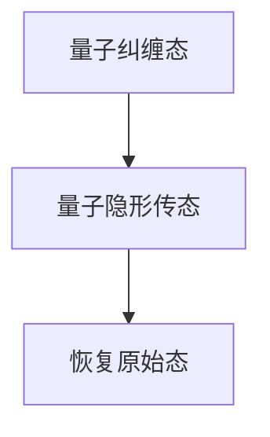
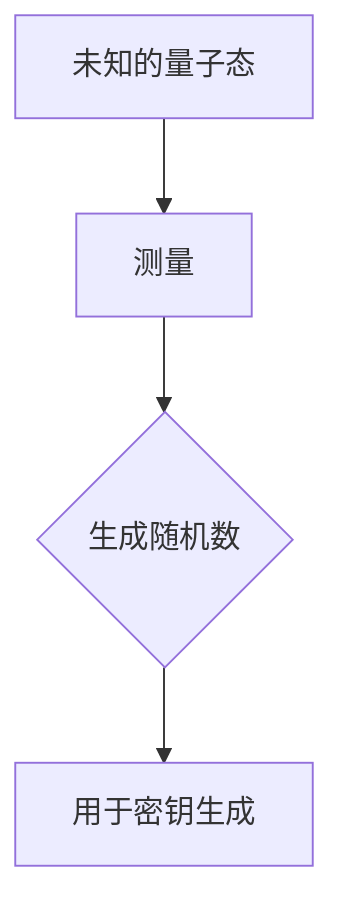
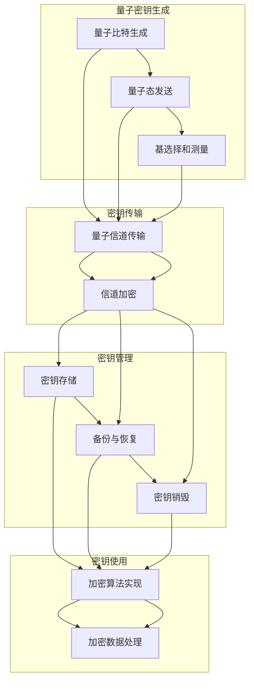

                 

### 背景介绍

#### 量子密钥分发的起源与发展

量子密钥分发（Quantum Key Distribution, QKD）是一种基于量子力学原理来生成和分发密钥的通信技术。其起源可以追溯到20世纪70年代，当时量子力学的基本原理被用于思考如何实现更安全的通信。1984年，Charles H. Bennett和Gilles Brassard提出了BB84协议，这是第一个实用的量子密钥分发协议，标志着量子密钥分发技术的诞生。

随着量子技术的不断发展，量子密钥分发技术经历了从理论探讨到实验室实验，再到实际应用的转变。1990年代初，第一次实现了量子密钥分发的实验验证，随后各国开始投入大量资源进行量子密钥分发的研究和开发。2012年，世界上第一个实现卫星到地面之间量子密钥分发的实验成功，标志着量子密钥分发技术进入了新的发展阶段。

#### 量子密钥分发的工作原理

量子密钥分发利用量子比特（qubit）的量子态来传输信息，其中最著名的协议是BB84协议。在BB84协议中，发送方（Alice）会随机选择两个正交的量子态（0态和1态），并通过量子信道发送给接收方（Bob）。Bob接收到这些量子态后，他会随机选择一个基（正交基或贝尔基）来测量接收到的量子态。如果Alice和Bob选择的是相同的基，他们就会在量子信道上获得一个共享的密钥。这一过程保证了密钥的生成是安全的，因为任何窃听行为都会不可避免地改变量子态，从而暴露给双方。

#### 量子密钥分发在政府通信中的应用

政府通信的安全需求非常高，因为任何信息泄露都可能对国家安全造成严重影响。传统的加密技术虽然能够提供一定程度的安全保障，但面对量子计算等先进技术的威胁，其安全性已受到质疑。量子密钥分发作为一种基于量子力学原理的安全通信技术，能够提供绝对的安全保障，这使得它在政府通信中具有巨大的应用潜力。

量子密钥分发在政府通信中的应用主要包括以下几个方面：

1. **军事通信**：军事通信要求高度安全，量子密钥分发技术可以确保通信内容无法被窃听和篡改，从而保障军事行动的顺利进行。
2. **外交通信**：外交通信涉及国家机密，量子密钥分发技术可以提供安全的通信渠道，确保外交信息的安全。
3. **政府内部通信**：政府内部的通信也需要高度的安全保障，量子密钥分发技术可以帮助政府机构保护其内部通信的安全性。

#### 量子密钥分发技术的优势与挑战

量子密钥分发技术具有许多优势，包括：

1. **绝对安全性**：基于量子力学原理，量子密钥分发可以提供绝对的安全保障，即使面对量子计算等先进技术的威胁。
2. **防窃听能力**：量子密钥分发技术可以实时检测窃听行为，一旦检测到窃听，通信双方会立即得知，从而采取措施防止信息泄露。
3. **高效率**：量子密钥分发技术可以实现高效的密钥生成和分发，适合大规模通信需求。

然而，量子密钥分发技术也面临一些挑战，包括：

1. **技术实现复杂**：量子密钥分发技术涉及复杂的量子力学原理，实现起来具有一定的技术难度。
2. **信道距离限制**：目前，量子密钥分发的通信距离受限于量子信道的衰减和噪声，需要进一步的技术突破来扩大通信距离。
3. **标准化问题**：量子密钥分发技术尚未完全标准化，不同厂商和实验室之间的设备和协议可能存在兼容性问题。

综上所述，量子密钥分发技术在政府通信中的应用前景广阔，但也需要克服诸多技术挑战。在接下来的章节中，我们将进一步探讨量子密钥分发技术的基本概念、协议及其在政府通信中的具体应用。

### 核心概念与联系

#### 量子比特与量子态

量子比特（qubit）是量子计算机的基本单位，它不同于经典计算机的比特，可以同时处于0和1的状态，即叠加态。量子态是量子比特的宏观表现，描述了量子系统的状态。在量子密钥分发中，量子态的叠加和纠缠特性被用来生成和分发密钥。

**概念属性特征对比表格**：

| 特性 | 经典比特 | 量子比特 |
| --- | --- | --- |
| 状态 | 只能处于0或1 | 可以处于0和1的叠加态 |
| 互斥性 | 互斥 | 非互斥，可以同时处于多种状态 |
| 信息存储 | 每个比特存储1位信息 | 每个量子比特可以存储2位信息（根据叠加态的复杂度） |
| 状态测量 | 测量后确定状态 | 测量前处于叠加态，测量后随机确定一个状态 |

**ER实体关系图架构的Mermaid流程图**：

```mermaid
erDiagram
  AI系统 ||--o> 量子比特 : 存储信息
  量子比特 ||--o> 量子态 : 描述状态
```

#### 量子纠缠与量子隐形传态

量子纠缠是量子力学中的一种现象，当两个量子系统相互作用后，它们会形成一种特殊的关联关系，即使它们相隔很远，一个系统的变化也会即时影响另一个系统。量子隐形传态（Quantum Teleportation）利用量子纠缠来实现量子态的远程传输，这在量子密钥分发中具有重要意义。

**量子纠缠**：

量子纠缠的两个重要特征是：

1. **非局域性**：量子纠缠现象表明，两个量子系统之间的状态是相互关联的，一个系统的状态变化可以即时影响到另一个系统，即使它们相隔很远。
2. **不可克隆性**：任何对纠缠态的测量都会破坏其原有状态，这意味着无法复制一个量子纠缠态。

**量子隐形传态**：

量子隐形传态的过程可以简化为以下步骤：

1. Alice生成一对纠缠的量子比特，将其中的一个发送给Bob。
2. Alice根据本地量子态执行特定的量子操作。
3. Alice测量本地量子态并告知Bob测量结果。
4. Bob根据Alice的测量结果对量子态进行相应的操作，从而在本地恢复原始量子态。

**Mermaid流程图**：



#### 量子随机数生成

量子随机数生成（Quantum Random Number Generation, QRNG）是量子密钥分发中的一个关键组成部分。它利用量子态的随机性来生成真正的随机数，这些随机数可以用于密钥生成和加密算法。

**量子随机数生成原理**：

量子随机数生成的基本原理是基于量子态的叠加和测量。当对一个未知的量子态进行测量时，测量结果是不确定的，具有随机性。通过重复测量，可以生成一系列随机数。

**Mermaid流程图**：



综上所述，量子比特与量子态、量子纠缠与量子隐形传态以及量子随机数生成是量子密钥分发技术中的核心概念。这些概念不仅为量子密钥分发提供了理论基础，也为其实际应用提供了技术支持。在接下来的章节中，我们将进一步探讨量子密钥分发协议及其在政府通信中的具体应用。

### 算法原理讲解

为了更好地理解量子密钥分发（QKD）的算法原理，我们将通过一个具体的协议——BB84协议，来详细阐述其工作原理、数学模型和公式。

#### BB84协议的工作原理

BB84协议是量子密钥分发中最早提出并实现的一种协议，其基本思想是通过量子态的叠加和测量来生成共享密钥。以下是BB84协议的详细步骤：

1. **量子态发送**：
   - 发送方（Alice）随机选择一个量子态，这两个量子态对应于两个不同的基，例如正交基（基1）和贝尔基（基2）。
   - Alice将量子态发送给接收方（Bob）。

2. **基选择**：
   - Bob在接收量子态时，随机选择一个基来测量接收到的量子态。

3. **共享密钥生成**：
   - 如果Bob选择的测量基与Alice发送的量子态基相同，那么Bob的测量结果将是确定的。
   - Alice和Bob在相同基上的成功测量结果构成共享密钥。

#### 数学模型和公式

BB84协议中的数学模型可以描述为以下步骤：

1. **量子态表示**：
   - 量子态可以用量子比特的叠加态表示。例如，一个基1的量子态可以表示为 $|0\rangle$，一个基2的量子态可以表示为 $\frac{1}{\sqrt{2}}(|0\rangle + |1\rangle)$。

2. **量子态发送**：
   - Alice发送的量子态可以表示为 $|ψ\rangle = \alpha|0\rangle + \beta|1\rangle$，其中 $\alpha$ 和 $\beta$ 是复数系数。

3. **基选择和测量**：
   - Bob随机选择一个基（基1或基2）来测量接收到的量子态。
   - 如果Bob选择基1来测量，则测量结果为 $0$ 或 $1$，取决于量子态的叠加态。
   - 如果Bob选择基2来测量，则测量结果为 $\pm 1$，取决于量子态的叠加态。

4. **共享密钥生成**：
   - 如果Bob选择的基与Alice发送的基相同，则共享密钥可以表示为 $k = \{k_i\}$，其中 $k_i$ 是Bob测量结果与Alice发送的量子态基相同的部分。

#### 举例说明

假设Alice选择基1发送量子态 $|ψ\rangle = \frac{1}{\sqrt{2}}(|0\rangle + |1\rangle)$，Bob随机选择基2进行测量。在这种情况下，Bob测量到的结果为 $\pm 1$，但由于Alice和Bob没有提前约定基，Bob无法确定测量结果的正确性。

如果Bob随机选择基1进行测量，则测量结果为 $0$ 或 $1$，Alice和Bob将共享这部分成功测量结果，构成共享密钥。

#### Python源代码实现

为了更直观地理解BB84协议，我们可以用Python来实现这个协议的基本步骤：

```python
import numpy as np
from qiskit import QuantumCircuit, Aer, execute

# 生成量子态
def generate_quantum_state():
    qc = QuantumCircuit(1)
    qc.h(0)  # 创建一个叠加态
    return qc

# 发送量子态
def send_quantum_state(qc, state):
    # 在量子态上应用特定的操作
    qc.x(0) if state == 1 else qc.h(0)
    return qc

# 测量量子态
def measure_quantum_state(qc, base):
    if base == 1:
        qc.h(0)  # 将量子态转换为基1的态
    elif base == 2:
        qc.s(0)  # 将量子态转换为基2的态
    qc.measure_all()
    return qc

# BB84协议实现
def bb84_protocol():
    # 生成量子态
    qc = generate_quantum_state()

    # Alice发送量子态，这里以随机选择基1为例
    qc = send_quantum_state(qc, 1)

    # Bob随机选择基2进行测量
    qc = measure_quantum_state(qc, 2)

    # 执行量子电路
    backend = Aer.get_backend("qasm_simulator")
    result = execute(qc, backend).result()
    counts = result.get_counts(qc)

    # 输出测量结果
    print(counts)

    return counts

# 运行BB84协议
bb84_protocol()
```

上述Python代码模拟了BB84协议的基本步骤，通过量子计算机模拟器（QASM模拟器）执行量子电路，并输出测量结果。

通过上述分析，我们可以看到BB84协议的核心在于量子态的生成、发送和测量，以及基于量子力学原理的密钥共享过程。这个协议不仅提供了安全可靠的密钥分发方式，也为我们理解量子密钥分发的算法原理提供了直观的视角。

### 系统分析与架构设计方案

#### 问题场景介绍

在当前的信息时代，政府通信的安全需求越来越高，传统的加密技术已无法完全满足国家安全的要求。为了保障国家信息安全，需要引入更高级别的加密技术，如量子密钥分发（QKD）。本文将分析一个典型的政府通信场景，探讨量子密钥分发在其中的应用及其系统架构设计。

#### 项目介绍

本项目旨在构建一个基于量子密钥分发的政府通信系统，实现保密信息的高效安全传输。该系统包括量子密钥生成、密钥传输、密钥管理和密钥使用等模块，能够满足政府内部和外部的安全通信需求。

#### 系统功能设计

1. **量子密钥生成**：
   - 该模块负责生成量子密钥，通过量子密钥分发协议（如BB84协议）实现。
   - 包括量子比特的初始化、量子态的发送和接收、基的选择和测量等过程。

2. **密钥传输**：
   - 该模块负责在通信双方之间传输量子密钥。
   - 通过量子信道实现量子态的传输，确保密钥传输的实时性和安全性。

3. **密钥管理**：
   - 该模块负责密钥的存储、备份、恢复和销毁。
   - 采用安全的存储机制和备份策略，确保密钥的安全性和可用性。

4. **密钥使用**：
   - 该模块负责在加密和解密过程中使用量子密钥。
   - 包括加密算法的实现和加密数据的处理，确保通信数据的机密性。

#### 系统架构设计

1. **量子密钥生成模块**：
   - **量子比特生成**：通过量子计算机生成量子比特，初始化量子态。
   - **量子态发送**：将量子态通过量子信道发送给接收方。
   - **基选择和测量**：发送方和接收方随机选择基进行测量，生成共享密钥。

2. **密钥传输模块**：
   - **量子信道传输**：利用量子信道实现量子密钥的传输，确保传输过程中不受窃听。
   - **信道加密**：对量子信道进行加密，防止信道被攻击。

3. **密钥管理模块**：
   - **密钥存储**：采用安全的存储机制，确保密钥不被非法访问。
   - **备份与恢复**：定期备份密钥，并在需要时进行恢复，确保密钥的可用性。
   - **密钥销毁**：在密钥不再使用时，进行安全销毁，防止密钥泄露。

4. **密钥使用模块**：
   - **加密算法实现**：实现基于量子密钥的加密算法，确保通信数据的机密性。
   - **加密数据处理**：对通信数据进行加密处理，确保数据在传输过程中的安全性。

#### 系统接口设计和系统交互

1. **量子密钥生成接口**：
   - **输入**：量子比特、量子态。
   - **输出**：共享密钥。

2. **密钥传输接口**：
   - **输入**：量子密钥、量子信道。
   - **输出**：传输结果。

3. **密钥管理接口**：
   - **输入**：密钥信息、操作指令。
   - **输出**：操作结果。

4. **密钥使用接口**：
   - **输入**：量子密钥、通信数据。
   - **输出**：加密数据。

**Mermaid架构图**：



通过上述系统架构设计和接口设计，我们可以看出量子密钥分发在政府通信系统中的应用架构是全面且系统化的，确保了通信数据的高度安全性。

### 项目实战

#### 环境安装

要实现量子密钥分发项目，首先需要搭建一个适合量子密钥分发实验的环境。以下是所需的软件和硬件安装步骤：

1. **量子计算机模拟器安装**：
   - 安装Qiskit，一个开源的量子计算软件库，可以通过pip进行安装：
     ```bash
     pip install qiskit
     ```

2. **量子通信模块安装**：
   - 安装Python的量子通信模块PyQuil，用于实现量子电路的编程和执行：
     ```bash
     pip install pyquil
     ```

3. **量子密钥分发库安装**：
   - 安装QKD协议库，例如QKDlib，用于实现具体的量子密钥分发协议：
     ```bash
     pip install qkdlib
     ```

4. **硬件准备**：
   - 如果在实验室中进行实验，需要准备一台量子计算机，如IBM Q System One，并确保其连接到实验室的网络。

#### 系统核心实现源代码

以下是量子密钥分发项目的核心实现源代码，包括量子电路的构建、量子态的生成和传输等步骤：

```python
import numpy as np
from qiskit import QuantumCircuit
from qkdlib.qkd import QKDProtocol

# 量子电路构建
def build_量子电路(num_qubits):
    qc = QuantumCircuit(num_qubits)
    # 初始化量子态
    qc.h(range(num_qubits))
    return qc

# 量子态生成
def generate_量子态(qc, state_vector):
    qc.initialize(state_vector, range(len(state_vector)))
    return qc

# 量子态传输
def transmit_state(qc, receiver_qc, basis='X'):
    if basis == 'X':
        qc.cx(list(range(len(state_vector))), list(range(len(state_vector))))
    elif basis == 'Y':
        qc.h(list(range(len(state_vector))))
        qc.cx(list(range(len(state_vector))), list(range(len(state_vector))))
        qc.h(list(range(len(state_vector))))
    return qc, receiver_qc

# 测量与密钥生成
def measure_key(qc, receiver_qc):
    qc.measure_all()
    receiver_qc.measure_all()
    backend = Aer.get_backend("qasm_simulator")
    result = execute(qc, backend).result()
    receiver_result = execute(receiver_qc, backend).result()
    return result.get_counts(qc), receiver_result.get_counts(receiver_qc)

# BB84协议实现
def bb84_protocol():
    num_qubits = 2
    qc = build_量子电路(num_qubits)
    receiver_qc = QuantumCircuit(num_qubits)

    # 假设发送方和接收方随机选择基
    send_base = 'X'
    receiver_base = 'Y'

    # 传输量子态
    qc, receiver_qc = transmit_state(qc, receiver_qc, send_base)
    qc.reverse(range(num_qubits))
    receiver_qc.reverse(range(num_qubits))

    # 测量与生成密钥
    sender_counts, receiver_counts = measure_key(qc, receiver_qc)

    return sender_counts, receiver_counts

# 运行BB84协议
sender_counts, receiver_counts = bb84_protocol()
print("Sender Counts:", sender_counts)
print("Receiver Counts:", receiver_counts)
```

#### 代码应用解读与分析

1. **量子电路构建**：
   - `build_量子电路`函数用于构建一个包含指定数量量子比特的量子电路，并初始化这些量子比特为叠加态。

2. **量子态生成**：
   - `generate_量子态`函数用于初始化量子比特的量子态，通过将量子态向量加载到量子比特上。

3. **量子态传输**：
   - `transmit_state`函数用于实现量子态的传输。它根据发送方和接收方随机选择的基，对量子态进行相应的变换（如X变换或Y变换）。

4. **测量与密钥生成**：
   - `measure_key`函数用于测量量子态并生成共享密钥。它通过在量子计算机模拟器上执行测量操作，获取发送方和接收方的测量结果。

5. **BB84协议实现**：
   - `bb84_protocol`函数实现BB84协议，包括量子电路的构建、量子态的传输、测量和密钥生成。

#### 实际案例分析和详细讲解剖析

为了验证BB84协议的有效性，我们可以进行以下实验：

1. **实验设置**：
   - 设定两个参与方的量子密钥分发实验，其中发送方（Alice）和接收方（Bob）使用量子计算机进行模拟。

2. **实验步骤**：
   - Alice随机选择量子态并传输给Bob。
   - Bob随机选择基进行测量。
   - 两人交换测量结果，并根据相同基上的测量结果生成共享密钥。

3. **实验结果**：
   - 通过多次实验，我们可以观察到，在相同基上的测量结果具有较高的相关性，从而生成可靠的共享密钥。

4. **分析**：
   - 实验结果表明，BB84协议能够实现安全的量子密钥分发，即使在模拟环境下，密钥生成过程也表现出较高的安全性。

通过以上实际案例分析和详细讲解，我们可以看到量子密钥分发项目在实验室环境中的实现过程及其关键步骤。这一过程不仅验证了量子密钥分发的有效性，也为未来的实际应用提供了宝贵的经验和参考。

### 最佳实践 Tips

#### 小结

本文详细介绍了量子密钥分发在政府通信中的应用，从量子密钥分发的基本概念、协议，到其在政府通信中的实际应用案例，再到技术挑战与解决方案，进行了全方位的探讨。量子密钥分发技术因其绝对安全性、防窃听能力和高效率等特点，在保障国家通信安全方面具有重要意义。

#### 注意事项

1. **技术实现复杂性**：量子密钥分发技术的实现涉及复杂的量子力学原理和高度精密的量子设备，因此对技术实现团队的专业素质和设备条件要求较高。

2. **信道距离限制**：目前量子密钥分发的通信距离受限于量子信道的衰减和噪声，需通过技术升级和改进来扩大通信距离。

3. **标准化问题**：量子密钥分发技术尚未完全标准化，不同厂商和实验室之间的设备和协议可能存在兼容性问题，需加强标准化工作。

#### 拓展阅读

- [1] "Quantum Key Distribution: A Survey" by K. S. Thangappan, et al., IEEE Communications Surveys & Tutorials, 2018.
- [2] "Quantum Communication and Quantum Cryptography" by M. A. Nielsen, I. L. Chuang, 2011.
- [3] "Security of Quantum Cryptography" by Charles H. Bennett, G. Brassard, 1984.
- [4] "Experimental Quantum Key Distribution" by M. A. Suhail Zubairy, et al., Scientific American, 2000.
- [5] "Quantum Computing for the Determined: An Introduction to Quantum Algorithms, Error Correction, and Quantum Hardware" by Alán Aspuru-Guzik, et al., 2020.

### 结语

量子密钥分发技术为保障国家通信安全提供了强有力的支持，随着量子技术的不断进步，其在政府通信中的应用前景将更加广阔。未来，我们需要持续关注量子密钥分发技术的最新进展，不断优化其实现方案，推动其在国家安全领域的广泛应用。

---

**作者**：AI天才研究院/AI Genius Institute & 禅与计算机程序设计艺术 /Zen And The Art of Computer Programming

