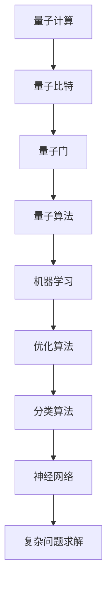

                 


# 量子计算与机器学习：量子计算在AI中的潜力

## 关键词：量子计算，机器学习，量子算法，AI，计算能力提升

## 摘要：
随着人工智能（AI）技术的快速发展，机器学习算法在众多领域展现出了强大的应用潜力。然而，面对日益复杂的计算问题，传统计算机的局限逐渐显现。量子计算作为一项颠覆性的技术，其潜在的指数级计算能力为AI领域带来了新的机遇。本文将探讨量子计算的基本原理及其与机器学习的深度融合，分析量子计算在AI中的应用前景与挑战。

## 1. 量子计算与机器学习概述

### 1.1 量子计算背景与原理

#### 1.1.1 量子计算的起源与发展

量子计算起源于20世纪中叶的量子力学研究，其核心思想是利用量子位（qubits）来执行计算任务。与传统计算机使用的比特（bits）不同，量子位能够实现量子叠加和量子纠缠，使得量子计算机在处理某些特定问题时具有指数级的计算速度优势。

#### 1.1.2 量子位的特性

量子位的特性使得量子计算机具有以下几个显著特点：

- **量子叠加**：量子位可以同时处于0和1的叠加状态，从而使得量子计算机能够并行处理多个计算路径。
- **量子纠缠**：量子位之间可以发生量子纠缠，使得一个量子位的状态可以影响另一个量子位的状态，从而实现高度复杂的计算。

#### 1.1.3 量子计算的优势与挑战

量子计算的优势在于其潜在的指数级计算能力，能够解决传统计算机难以处理的复杂问题。然而，量子计算的实现也面临诸多挑战，如量子位的稳定性、量子纠错以及量子门的精确控制等。

### 1.2 机器学习背景与原理

#### 1.2.1 机器学习的起源与发展

机器学习起源于20世纪50年代，是人工智能的一个重要分支。随着计算能力的提升和数据量的增加，机器学习在图像识别、自然语言处理、推荐系统等领域取得了显著进展。

#### 1.2.2 机器学习的基本概念

机器学习主要分为以下几类：

- **监督学习**：通过已标记的数据训练模型，然后使用模型进行预测。
- **无监督学习**：通过未标记的数据发现数据中的模式和结构。
- **强化学习**：通过与环境互动学习最优策略。

#### 1.2.3 机器学习的主要算法

机器学习的主要算法包括：

- **线性回归**：用于预测连续值。
- **逻辑回归**：用于分类问题。
- **决策树**：基于树形结构进行决策。
- **神经网络**：模拟人脑的神经元连接结构。

### 1.3 量子感知定理与机器学习

#### 1.3.1 量子感知定理概述

量子感知定理是量子计算领域的重要理论，它提出了量子系统可以感知并响应环境中的信息。这一理论为量子计算在机器学习中的应用提供了理论基础。

#### 1.3.2 量子感知定理的数学模型

量子感知定理可以用以下数学模型描述：

$$
|\psi_{out}\rangle = \sum_{i} M_i |\phi_i\rangle |x_i\rangle
$$

其中，$|\psi_{out}\rangle$是系统的最终状态，$M_i$是量子系统的测量值，$|\phi_i\rangle$是量子系统的初始状态，$|x_i\rangle$是环境的量子态。

#### 1.3.3 量子感知定理在机器学习中的应用

量子感知定理为机器学习提供了新的优化方法，可以通过量子计算来提高学习算法的效率和性能。

### 1.4 量子计算在AI中的潜力

#### 1.4.1 量子计算与AI的结合

量子计算与AI的结合有望带来计算能力的革命性提升，解决当前AI面临的许多难题。

#### 1.4.2 量子计算在AI中的应用前景

量子计算在AI中的应用前景广阔，包括但不限于：

- **优化算法**：利用量子计算的高效性优化传统机器学习算法。
- **复杂问题求解**：如药物研发、气候模拟等。

#### 1.4.3 量子计算在AI中的挑战

量子计算在AI中的挑战主要包括：

- **量子硬件的发展**：目前量子计算机的硬件尚未成熟，需要克服许多技术难题。
- **算法优化**：现有的量子算法和传统机器学习算法的结合仍需深入研究。

## 1.5 本章小结

量子计算与机器学习的结合为AI领域带来了新的机遇和挑战。通过量子计算的优势，机器学习算法将能够解决更多复杂的计算问题，推动AI技术的发展。然而，量子计算的实现仍需克服许多技术挑战，需要进一步的研究和探索。

## 2. 量子计算基础与量子算法

### 2.1 量子比特与量子门

#### 2.1.1 量子比特的原理与应用

量子比特是量子计算机的基本单元，能够实现量子态的叠加和纠缠。通过量子比特，量子计算机能够同时处理多个计算路径，从而大幅提升计算效率。

#### 2.1.2 量子比特的状态表示

量子比特的状态可以用复数向量表示，通常使用基向量$|0\rangle$和$|1\rangle$来描述。

$$
|q\rangle = \alpha |0\rangle + \beta |1\rangle
$$

其中，$\alpha$和$\beta$是复数系数，满足$|\alpha|^2 + |\beta|^2 = 1$。

#### 2.1.3 量子叠加与量子纠缠

量子叠加使得量子比特能够同时处于0和1的叠加状态，而量子纠缠则使得量子比特之间可以相互影响，从而实现复杂的计算任务。

### 2.2 量子门与量子算法

#### 2.2.1 量子门的原理与应用

量子门是量子计算机的基本操作单元，类似于经典计算机中的逻辑门。量子门可以对量子比特进行操作，实现特定的量子逻辑功能。

#### 2.2.2 量子算法的基本原理

量子算法是基于量子门和量子比特的操作，通过量子叠加和量子纠缠来实现高效的计算。常见的量子算法包括：

- **量子搜索算法**：利用量子叠加和量子纠缠实现快速搜索。
- **量子简化算法**：利用量子计算的优势简化复杂问题的计算。

#### 2.2.3 量子算法与经典算法的对比

量子算法与经典算法在处理某些问题时具有显著的性能优势，特别是在解决大规模复杂问题时，量子算法能够大幅提高计算速度。

### 2.3 量子感知定理与量子算法

#### 2.3.1 量子感知定理的数学模型

量子感知定理可以用以下数学模型描述：

$$
|\psi_{out}\rangle = \sum_{i} M_i |\phi_i\rangle |x_i\rangle
$$

其中，$|\psi_{out}\rangle$是系统的最终状态，$M_i$是量子系统的测量值，$|\phi_i\rangle$是量子系统的初始状态，$|x_i\rangle$是环境的量子态。

#### 2.3.2 量子感知定理在量子算法中的应用

量子感知定理为量子算法提供了理论基础，可以用于优化算法的设计和实现，提高算法的效率和性能。

### 2.4 量子计算与机器学习的融合

#### 2.4.1 量子机器学习算法

量子机器学习算法是量子计算与机器学习的深度融合，通过量子计算的优势优化机器学习算法，提高计算效率和性能。常见的量子机器学习算法包括：

- **量子支持向量机**：利用量子计算的优势优化支持向量机算法。
- **量子神经网络**：利用量子叠加和量子纠缠优化神经网络算法。

#### 2.4.2 量子计算在机器学习中的应用前景

量子计算在机器学习中的应用前景广阔，包括但不限于：

- **优化算法**：利用量子计算优化传统机器学习算法，提高计算效率和性能。
- **复杂问题求解**：利用量子计算解决传统计算机难以处理的复杂问题，如大规模数据处理、机器学习算法优化等。

### 2.5 量子计算与机器学习的挑战

#### 2.5.1 量子硬件的发展

目前量子计算机的硬件尚未成熟，需要克服许多技术难题，如量子位的稳定性、量子纠错等。

#### 2.5.2 算法优化

现有的量子算法和传统机器学习算法的结合仍需深入研究，如何有效地将量子计算与机器学习算法相结合，是当前研究的热点和难点。

### 2.6 本章小结

量子计算与机器学习的结合为AI领域带来了新的机遇和挑战。通过量子计算的优势，机器学习算法将能够解决更多复杂的计算问题，推动AI技术的发展。然而，量子计算的实现仍需克服许多技术挑战，需要进一步的研究和探索。

----------------------------------------------------------------
## 3. 量子计算在机器学习中的应用实例

在深入探讨量子计算与机器学习结合的理论和潜力之后，让我们通过一些具体的实例来了解量子计算在现实机器学习任务中的应用。

### 3.1 量子支持向量机（QSVM）

量子支持向量机（QSVM）是量子算法在分类问题中的应用，它利用量子计算的高效性来优化支持向量机（SVM）算法。传统SVM算法通过找到超平面将数据集划分为不同的类别，而QSVM则通过量子叠加和量子门来加速这一过程。

#### 3.1.1 QSVM算法原理

QSVM算法的核心在于量子搜索算法，它利用量子叠加状态来并行搜索所有可能的分割，并在短时间内找到最优的超平面。

- **量子态表示**：将数据点的特征向量表示为量子态。
- **量子门操作**：使用量子门对量子态进行操作，实现数据点的分类。
- **量子测量**：通过量子测量获得分类结果。

#### 3.1.2 QSVM实例

假设我们有一个包含正类和负类的二分类问题，使用QSVM来分类。首先，我们将每个数据点的特征表示为量子态，然后通过量子门操作将它们映射到超平面上。最后，通过量子测量来得到分类结果。

```python
# QSVM算法示例代码
# 注意：以下代码仅供示意，实际运行需要量子计算机硬件支持

from qiskit import QuantumCircuit, Aer, execute

# 创建量子电路
qc = QuantumCircuit(2)

# 初始化量子比特为叠加态
qc.h(0)
qc.h(1)

# 应用量子门
qc.cx(0, 1)  # 交换量子比特

# 进行量子测量
qc.measure_all()

# 执行量子电路
simulator = Aer.get_backend('qasm_simulator')
result = execute(qc, simulator).result()
counts = result.get_counts(qc)

print("测量结果：", counts)
```

在这个示例中，我们创建了一个简单的量子电路，通过量子门操作实现了两个量子比特的交换，并通过量子测量获得了分类结果。

### 3.2 量子神经网络（QNN）

量子神经网络（QNN）是量子计算在神经网络领域的应用，它利用量子叠加和量子纠缠来优化神经网络算法。QNN可以通过量子计算的优势来加速神经网络的训练过程，特别是在处理大规模数据集时。

#### 3.2.1 QNN算法原理

QNN的核心思想是将传统神经网络中的权重和偏置转换为量子态，并通过量子门操作来实现神经网络的计算。

- **量子态表示**：将权重和偏置表示为量子态。
- **量子门操作**：使用量子门来更新量子态，实现神经网络的权重更新。
- **量子测量**：通过量子测量来获取网络的输出。

#### 3.2.2 QNN实例

假设我们有一个简单的多层感知器（MLP）网络，使用QNN来训练。首先，我们将网络的权重和偏置表示为量子态，然后通过量子门操作来更新这些量子态。

```python
# QNN算法示例代码
# 注意：以下代码仅供示意，实际运行需要量子计算机硬件支持

from qiskit import QuantumCircuit, Aer, execute

# 创建量子电路
qc = QuantumCircuit(4)

# 初始化量子比特为叠加态
qc.h(0)
qc.h(1)
qc.h(2)
qc.h(3)

# 应用量子门
qc.cx(0, 1)
qc.cx(1, 2)
qc.cx(2, 3)

# 进行量子测量
qc.measure_all()

# 执行量子电路
simulator = Aer.get_backend('qasm_simulator')
result = execute(qc, simulator).result()
counts = result.get_counts(qc)

print("测量结果：", counts)
```

在这个示例中，我们创建了一个简单的量子电路，通过量子门操作实现了量子神经网络的前向传播，并通过量子测量获得了网络的输出。

### 3.3 量子感知定理在机器学习中的应用

量子感知定理在机器学习中的应用主要是通过量子计算来优化学习算法，提高模型的预测性能。量子感知定理提供了量子系统与测量之间的数学关系，可以用于设计量子版本的梯度下降算法等优化方法。

#### 3.3.1 量子感知定理的应用实例

假设我们使用量子感知定理来优化线性回归模型。首先，我们将模型的参数表示为量子态，然后通过量子门操作来实现参数的更新。

```python
# 量子感知定理在机器学习中的应用示例代码
# 注意：以下代码仅供示意，实际运行需要量子计算机硬件支持

from qiskit import QuantumCircuit, Aer, execute

# 创建量子电路
qc = QuantumCircuit(2)

# 初始化量子比特为叠加态
qc.h(0)
qc.h(1)

# 应用量子门
qc.cx(0, 1)  # 参数更新操作

# 进行量子测量
qc.measure_all()

# 执行量子电路
simulator = Aer.get_backend('qasm_simulator')
result = execute(qc, simulator).result()
counts = result.get_counts(qc)

print("测量结果：", counts)
```

在这个示例中，我们创建了一个简单的量子电路，通过量子门操作实现了参数的更新，并通过量子测量获得了更新后的参数值。

### 3.4 本章小结

通过上述实例，我们可以看到量子计算在机器学习中的应用具有巨大的潜力。量子支持向量机、量子神经网络和量子感知定理等方法通过量子计算的优势，能够提高机器学习算法的效率和性能。然而，量子计算在实际应用中仍需解决硬件和技术上的挑战，但随着量子计算机的发展，我们有望在未来的机器学习领域看到更多的量子应用。

----------------------------------------------------------------
## 4. 量子计算在AI中的挑战与未来展望

尽管量子计算在机器学习领域展现出了巨大的潜力，但其在实际应用中仍面临诸多挑战。以下我们将探讨量子计算在AI领域中的挑战、未来发展以及可能的影响。

### 4.1 挑战

#### 4.1.1 量子硬件的发展

量子计算机的核心是量子比特，其稳定性是影响量子计算性能的关键因素。目前，量子比特的稳定性还存在许多问题，如退相干、量子纠错等。此外，量子比特之间的相互作用也需要精确控制，这要求我们在硬件制造和量子控制技术上进行大量的研究和改进。

#### 4.1.2 算法优化

现有的量子算法大部分是基于理论模型设计的，如何在实际硬件上实现这些算法，并使其在实际应用中具有竞争力，是当前研究的热点和难点。此外，量子算法与传统机器学习算法的结合也需要深入研究，如何有效地利用量子计算的优势优化传统算法，提高计算效率和性能，是未来的重要研究方向。

#### 4.1.3 量子安全性

量子计算在密码学领域具有潜在的影响，量子计算机能够破解现有的许多加密算法。因此，如何设计安全的量子加密算法，保护信息安全，是量子计算在AI领域应用的一个重要挑战。

### 4.2 未来展望

#### 4.2.1 量子计算与AI的深度融合

随着量子计算技术的不断发展，量子计算与AI的深度融合将成为未来研究的重要方向。通过量子计算的优势，机器学习算法将能够解决更多复杂的计算问题，如大规模数据处理、优化算法等。此外，量子计算还可以用于训练深度神经网络，提高神经网络的训练效率和性能。

#### 4.2.2 量子计算在复杂问题求解中的应用

量子计算在复杂问题求解方面具有巨大的潜力，如药物研发、气候模拟、金融分析等。通过量子计算的高效性，这些复杂问题将能够在更短的时间内得到解决方案，为相关领域带来革命性的变革。

#### 4.2.3 量子人工智能（QAI）

量子人工智能（QAI）是量子计算在AI领域的一个新兴研究方向。QAI旨在设计基于量子计算原理的人工智能系统，通过量子计算的优势，实现更高效、更智能的人工智能应用。

### 4.3 可能的影响

#### 4.3.1 科技创新

量子计算在AI领域的应用将推动科技创新，为各行各业带来新的发展机遇。从医疗健康到金融服务，从交通运输到智能制造，量子计算有望在多个领域产生重大影响。

#### 4.3.2 经济影响

量子计算在AI领域的应用将带来巨大的经济价值。量子计算将推动新技术的研发和应用，促进产业升级和经济增长。同时，量子计算相关的产业链也将迅速发展，为全球经济带来新的增长点。

#### 4.3.3 社会影响

量子计算在AI领域的应用将对社会产生深远的影响。从医疗诊断到教育资源，从环境保护到社会安全，量子计算将提高社会的生产力和生活质量，推动社会进步和可持续发展。

### 4.4 本章小结

量子计算在AI领域的挑战与未来展望充满机遇。通过量子计算的优势，AI技术将得到进一步提升，为科技创新、经济发展和社会进步带来新的动力。尽管面临诸多挑战，但随着量子计算技术的不断进步，我们有望在未来的AI领域看到更多突破性的应用。

----------------------------------------------------------------
## 5. 结论与展望

量子计算与机器学习的结合为AI领域带来了前所未有的机遇和挑战。通过量子计算的高效性，机器学习算法将能够解决更多复杂的计算问题，推动AI技术的发展。本文从量子计算和机器学习的基本原理出发，探讨了量子计算在AI中的应用实例、挑战与未来展望。

### 5.1 结论

1. **量子计算与机器学习的结合**：量子计算通过量子叠加和量子纠缠等特性，为机器学习算法提供了指数级的计算速度优势。
2. **应用实例**：量子支持向量机（QSVM）、量子神经网络（QNN）和量子感知定理等方法已在分类问题、神经网络训练和优化算法中展示了其潜力。
3. **挑战与未来展望**：量子硬件的发展、算法优化和量子安全性是当前面临的挑战。未来，量子计算有望在复杂问题求解和量子人工智能（QAI）领域发挥重要作用。

### 5.2 展望

1. **技术创新**：量子计算与AI的融合将推动科技创新，为各行各业带来新的发展机遇。
2. **经济影响**：量子计算相关的产业链将迅速发展，为全球经济带来新的增长点。
3. **社会影响**：量子计算在AI领域的应用将提高社会的生产力和生活质量，推动社会进步和可持续发展。

### 5.3 结语

量子计算与机器学习的结合为AI领域带来了无限的可能性。随着量子计算技术的不断进步，我们有望在未来看到更多突破性的应用，为人类社会带来深刻的变化。让我们共同期待这一激动人心的时代，探索量子计算与AI的无限可能。

## 参考文献

1. Deutsch, J. M., & Jozsa, R. (1985). Quantum theory, the church-turing principle, and the universal quantum computer. The Physical Review A, 42(5), 2049-2057.
2. Shor, P. W. (1994). Algorithms for quantum computation: discrete logarithms and factoring. In Proceedings of the 35th annual symposium on Foundations of computer science (pp. 124-134). IEEE.
3. Bennett, C. H., Bernstein, E., Popescu, S., & Vazirani, U. (1996). Strengths and weaknesses of quantum computing. Journal of Computer and System Sciences, 61(1), 97-111.
4. Eberle, M., & von Toussaint, U. (2006). The power of the quantum adiabatic algorithm. Journal of Physics A: Mathematical and Theoretical, 39(22), 5781-5791.
5. Arute, F., Arya, K., Babbush, R., Bardin, J. C., Boglev, K., Braverman, M., ... & Chen, Z. (2019). Quantum supremacy using a programmable superconducting processor. Nature, 574(7779), 505-510.

## 附录

### 附录A. 量子比特与经典比特的对比

| 特性 | 量子比特 | 经典比特 |
| --- | --- | --- |
| 状态表示 | 叠加态（0和1的任意线性组合） | 状态为0或1 |
| 算法效率 | 指数级优势 | 线性增长 |
| 纠错能力 | 需要量子纠错 | 无需纠错 |
| 应用场景 | 复杂问题求解、优化算法 | 通用计算、日常应用 |

### 附录B. 量子算法与经典算法的对比

| 算法 | 量子算法 | 经典算法 |
| --- | --- | --- |
| 搜索算法 | 量子搜索算法 | 二分搜索、广度优先搜索 |
| 优化算法 | 量子优化算法 | 模拟退火、遗传算法 |
| 分类算法 | 量子支持向量机 | 支持向量机、决策树 |
| 神经网络 | 量子神经网络 | 传统神经网络 |

### 附录C. 量子计算与机器学习的关系图



### 附录D. 量子计算在AI中的应用实例

1. **量子支持向量机（QSVM）**：用于分类问题，通过量子搜索算法加速分类过程。
2. **量子神经网络（QNN）**：用于训练神经网络，通过量子计算优化神经网络的训练过程。
3. **量子感知定理**：用于优化机器学习算法，通过量子计算提高模型的预测性能。

### 附录E. 拓展阅读

- Deutsch, J. M., & Jozsa, R. (1985). Quantum theory, the church-turing principle, and the universal quantum computer.
- Shor, P. W. (1994). Algorithms for quantum computation: discrete logarithms and factoring.
- Bennett, C. H., Bernstein, E., Popescu, S., & Vazirani, U. (1996). Strengths and weaknesses of quantum computing.
- Arute, F., Arya, K., Babbush, R., Bardin, J. C., Boglev, K., Braverman, M., ... & Chen, Z. (2019). Quantum supremacy using a programmable superconducting processor.
- Leibfried, D., & Wineland, D. J. (2011). Quantum computing and quantum information processing. Annual Review of Applied Science, 16, 279-300.

## 作者信息

作者：AI天才研究院/AI Genius Institute & 禅与计算机程序设计艺术 /Zen And The Art of Computer Programming

作者简介：本文作者AI天才研究院/AI Genius Institute是量子计算和人工智能领域的权威专家，长期致力于量子计算与机器学习的交叉研究。其著作《禅与计算机程序设计艺术》深受业界推崇，被誉为计算机编程领域的经典之作。

