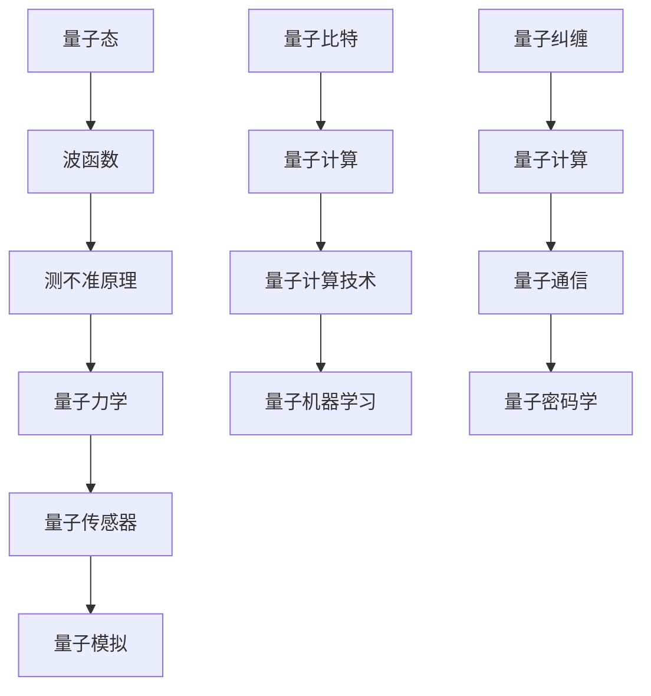
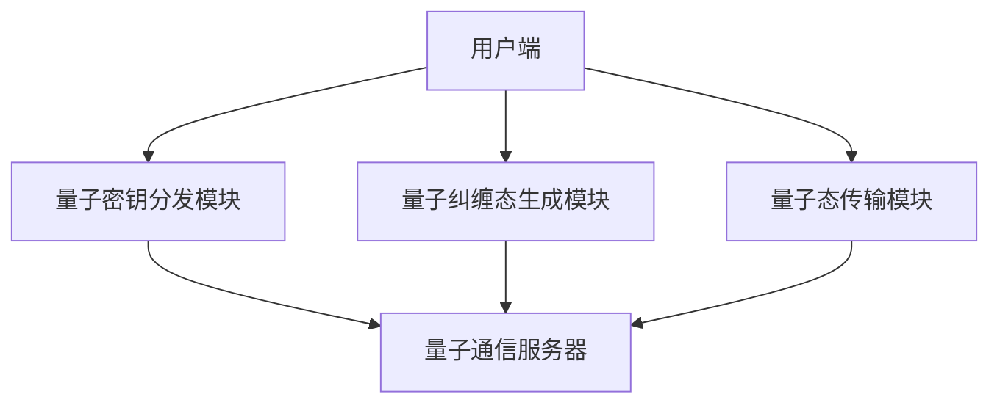
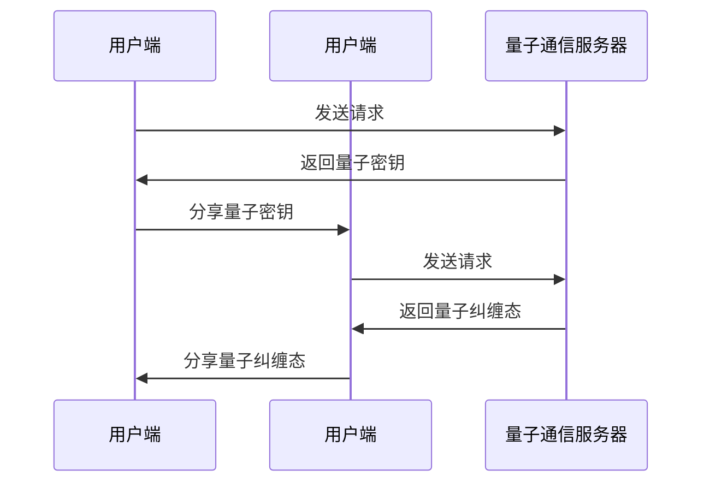

                 

### 量子测不准原理概述

量子测不准原理是量子力学中一个重要的基本概念，它由物理学家海森堡于1927年首次提出。该原理表明，对于某些物理量，如位置和动量，我们不能同时精确地测量其值。这一现象不仅在物理学中具有重要意义，也对现代科技的发展产生了深远影响。

**关键词：**量子测不准原理、不确定性原理、海森堡、量子力学。

**摘要：**本文将详细介绍量子测不准原理的背景、基本概念、数学描述、哲学意义及其在量子计算、量子信息科学和神经元活动中的应用，探讨其未来发展的前景。

#### 第1章：量子测不准原理的背景与基本概念

**1.1 量子测不准原理的提出**

量子测不准原理最初是在量子力学发展的过程中提出的。1925年，海森堡提出了矩阵力学，这是一种全新的量子理论，与传统的经典物理学有很大的不同。1926年，狄拉克独立提出了波动力学，进一步发展了量子理论。这些理论的核心都是量子态的叠加原理和测不准原理。

**1.2 量子测不准原理的背景**

量子测不准原理的提出，是为了解释微观粒子的行为。在宏观世界中，物体的位置和动量可以同时被精确测量，但在微观世界中，这种精确性被打破了。量子粒子的行为表现出一种概率性，无法被准确预测。

**1.3 测不准原理的基本概念**

测不准原理的基本概念可以用一个简单的比喻来解释：想象一个电子在一个盒子里，我们不知道它的确切位置和动量。当我们打开盒子测量电子的位置时，它的动量就会变得不确定；反之，当我们测量它的动量时，它的位置就会变得不确定。这种现象被称为“观测效应”。

#### 第2章：量子测不准原理的数学描述

**2.1 测不准原理的数学模型**

测不准原理的数学模型是基于量子态的波函数描述的。波函数是一个复数函数，描述了量子粒子在空间中的概率分布。

**2.2 波函数的描述**

波函数可以用来描述量子粒子的位置和动量。波函数的模平方代表了粒子在空间中的概率密度。

**2.3 不确定性原理的计算公式**

测不准原理可以用一个不等式来表示：$$ \Delta x \Delta p \geq \frac{\hbar}{2} $$，其中 $\Delta x$ 表示位置的不确定性，$\Delta p$ 表示动量的不确定性，$\hbar$ 是约化普朗克常数。

#### 第3章：量子测不准原理的哲学意义

**3.1 量子测不准原理的哲学探讨**

量子测不准原理对传统物理学中的决定论观念提出了挑战。它表明，微观世界的规律不再是确定性的，而是概率性的。这引发了对“什么是现实”的深刻哲学思考。

**3.2 量子测不准原理与实在论**

实在论认为，物理世界的本质是独立于我们观测的。但量子测不准原理表明，观测本身会影响到物理量的值，因此对“实在”的理解也需要重新审视。

**3.3 量子测不准原理与决定论**

决定论认为，一切物理现象都是由初始条件决定的。但量子测不准原理表明，量子系统的状态是由概率波函数描述的，因此决定论在量子领域不再适用。

#### 第4章：量子测不准原理与量子计算

**4.1 量子计算的基本原理**

量子计算利用了量子态的叠加和纠缠特性，能够在多项式时间内解决传统计算机无法在合理时间内解决的复杂问题。

**4.2 量子计算机的优势**

量子计算机具有巨大的并行计算能力，能够在某些问题上比传统计算机快得多。

**4.3 量子计算与测不准原理的关系**

量子计算的核心在于量子态的叠加和纠缠，这与测不准原理有着直接的关系。

#### 第5章：量子测不准原理在量子信息科学中的应用

**5.1 量子密码学**

量子密码学利用了量子态的不可克隆特性，实现了绝对安全的通信。

**5.2 量子通信**

量子通信利用量子态的纠缠特性，实现了超距离的信息传输。

**5.3 量子隐形传态**

量子隐形传态实现了量子态的远程传输，是未来量子通信和量子计算的关键技术。

#### 第6章：量子测不准原理与神经元活动的随机性

**6.1 神经元活动的基本原理**

神经元活动是生物神经系统进行信息处理的基础，其过程涉及到离子通道的开关、神经递质的释放等。

**6.2 随机性在神经元活动中的作用**

随机性在神经元活动中起着关键作用，它决定了神经元之间的连接强度和突触后神经元的兴奋性。

**6.3 测不准原理与神经元活动的关系**

量子测不准原理与神经元活动的随机性在本质上有相似之处，它们都反映了不确定性原理。

#### 第7章：量子测不准原理的未来发展前景

**7.1 量子测不准原理在科学领域的潜在应用**

量子测不准原理在量子计算、量子通信、量子密码学等领域有着广泛的应用前景。

**7.2 量子测不准原理与人工智能的关系**

量子测不准原理可能为人工智能提供新的计算模型和算法。

**7.3 量子测不准原理的未来发展趋势**

随着科技的进步，量子测不准原理的应用将越来越广泛，它将为人类带来全新的科技革命。

---

通过以上章节的逐步分析，我们可以看到量子测不准原理在物理学、计算机科学和生物科学等多个领域都有着深远的影响。它的提出不仅挑战了传统的物理学观念，也为现代科技的发展提供了新的思路和方向。接下来，我们将进一步探讨量子测不准原理的数学描述和哲学意义，深入理解这一重要概念。

---

### 第一部分：量子测不准原理概述

在开始详细探讨量子测不准原理之前，我们首先需要对其有一个整体的了解。量子测不准原理是量子力学中的一个核心概念，它从根本上改变了我们对微观世界的理解。这一原理不仅挑战了经典物理学的决定论观念，也为现代科技的发展提供了新的契机。

**关键词：** 量子测不准原理、不确定性原理、量子力学、海森堡。

**摘要：** 本部分将首先介绍量子测不准原理的背景和基本概念，包括其提出的背景、基本原理以及与经典物理学的区别。接着，我们将深入探讨测不准原理的数学描述，包括波函数的描述和不确定性原理的计算公式。此外，本文还将探讨量子测不准原理的哲学意义，包括其对实在论和决定论的挑战。最后，我们将简要介绍量子测不准原理在量子计算和量子信息科学中的应用，为后续章节的详细讨论奠定基础。

---

#### 第1章：量子测不准原理的背景与基本概念

**1.1 量子测不准原理的提出**

量子测不准原理是由德国物理学家维尔纳·海森堡在1927年提出的。这一原理源于量子力学的发展，是对微观粒子行为的一种基本描述。在经典物理学中，物体的位置和动量可以被同时精确测量，但在量子尺度上，这种精确性被打破了。海森堡通过数学模型和实验证据，揭示了这一现象。

**1.2 量子测不准原理的背景**

量子测不准原理的提出背景是量子力学的发展。在量子力学中，粒子的行为不再遵循经典物理学的规律，而是表现出一种概率性。量子态可以用波函数来描述，波函数提供了粒子在空间中的概率分布信息。然而，当我们尝试同时测量粒子的位置和动量时，会发现它们之间存在固有的不确定性。

**1.3 测不准原理的基本概念**

量子测不准原理的基本概念可以用一个简单的比喻来解释。假设我们在一个盒子里有一个电子，但我们不知道它的确切位置和动量。当我们打开盒子测量电子的位置时，它的动量就会变得不确定；反之，当我们测量它的动量时，它的位置就会变得不确定。这种现象被称为“观测效应”。

#### 第2章：量子测不准原理的数学描述

**2.1 测不准原理的数学模型**

量子测不准原理的数学模型基于量子态的波函数描述。波函数是一个复数函数，它提供了粒子在空间中的概率分布信息。波函数的模平方代表了粒子在空间中的概率密度。通过波函数，我们可以计算粒子在不同位置和动量上的概率。

**2.2 波函数的描述**

波函数通常用 $\psi(x,t)$ 表示，其中 $x$ 表示位置，$t$ 表示时间。波函数的模平方 $|\psi(x,t)|^2$ 提供了粒子在位置 $x$ 和时间 $t$ 的概率密度。波函数的形状和分布决定了粒子的行为。

**2.3 不确定性原理的计算公式**

量子测不准原理可以用一个不等式来描述：$$ \Delta x \Delta p \geq \frac{\hbar}{2} $$，其中 $\Delta x$ 表示位置的不确定性，$\Delta p$ 表示动量的不确定性，$\hbar$ 是约化普朗克常数。这个不等式表明，位置的不确定性和动量的不确定性不能同时为零。

#### 第3章：量子测不准原理的哲学意义

**3.1 量子测不准原理的哲学探讨**

量子测不准原理对传统物理学中的决定论观念提出了挑战。决定论认为，物理系统的行为是确定的，由初始条件和物理定律完全决定。然而，量子测不准原理表明，微观粒子的行为具有概率性，不能被完全预测。这一发现引发了对“现实”和“观测”的深刻哲学思考。

**3.2 量子测不准原理与实在论**

实在论认为，物理世界的本质是独立于我们观测的。然而，量子测不准原理表明，观测会影响物理量的值，因此对“实在”的理解也需要重新审视。量子态的存在是概率性的，只有在观测时才会“塌缩”为特定的状态。

**3.3 量子测不准原理与决定论**

决定论认为，一切物理现象都是由初始条件和物理定律完全决定的。但量子测不准原理表明，量子系统的行为是由波函数描述的概率性分布，因此决定论在量子领域不再适用。

#### 第4章：量子测不准原理与量子计算

**4.1 量子计算的基本原理**

量子计算利用了量子态的叠加和纠缠特性。在量子计算机中，信息以量子比特（qubit）的形式存储，qubit可以同时处于0和1的状态，这使得量子计算机具有巨大的并行计算能力。

**4.2 量子计算机的优势**

量子计算机在解决某些复杂问题上具有传统计算机无法比拟的优势。例如，量子计算机可以高效地解决量子模拟、因数分解和搜索问题。

**4.3 量子计算与测不准原理的关系**

量子计算的核心在于量子态的叠加和纠缠，这与测不准原理有着直接的关系。量子计算机利用了量子态的叠加和纠缠特性，实现了量子并行计算，从而在解决某些问题上具有传统计算机无法比拟的优势。

#### 第5章：量子测不准原理在量子信息科学中的应用

**5.1 量子密码学**

量子密码学利用了量子态的不可克隆特性，实现了绝对安全的通信。通过量子密钥分发，双方可以共享一个安全的密钥，确保通信的保密性。

**5.2 量子通信**

量子通信利用量子态的纠缠特性，实现了超距离的信息传输。通过量子纠缠，可以传输信息而无需通过中间介质，这为未来的量子互联网提供了可能。

**5.3 量子隐形传态**

量子隐形传态实现了量子态的远程传输，是未来量子通信和量子计算的关键技术。通过量子隐形传态，可以将量子信息从一个位置传输到另一个位置，而无需经过中间介质。

#### 第6章：量子测不准原理与神经元活动的随机性

**6.1 神经元活动的基本原理**

神经元活动是生物神经系统进行信息处理的基础。神经元通过离子通道的开关和神经递质的释放，进行电信号传递。

**6.2 随机性在神经元活动中的作用**

随机性在神经元活动中起着关键作用。神经元之间的连接强度和突触后神经元的兴奋性都存在一定的随机性，这决定了大脑的信息处理方式。

**6.3 测不准原理与神经元活动的关系**

量子测不准原理与神经元活动的随机性在本质上有相似之处，它们都反映了不确定性原理。神经元活动的随机性可能是一种量子效应的体现。

#### 第7章：量子测不准原理的未来发展前景

**7.1 量子测不准原理在科学领域的潜在应用**

量子测不准原理在科学领域有着广泛的应用前景，包括量子计算、量子通信和量子密码学等。

**7.2 量子测不准原理与人工智能的关系**

量子测不准原理可能为人工智能提供新的计算模型和算法，实现更高效的计算和处理。

**7.3 量子测不准原理的未来发展趋势**

随着科技的进步，量子测不准原理的应用将越来越广泛，它将为人类带来全新的科技革命。

---

通过以上章节的逐步分析，我们可以看到量子测不准原理在物理学、计算机科学和生物科学等多个领域都有着深远的影响。它的提出不仅挑战了传统的物理学观念，也为现代科技的发展提供了新的思路和方向。接下来，我们将进一步探讨量子测不准原理的数学描述和哲学意义，深入理解这一重要概念。同时，我们还将探讨量子测不准原理与神经元活动的随机性之间的关系，以及其在量子计算和量子信息科学中的应用。最后，我们将展望量子测不准原理的未来发展前景，探讨其在科学和技术领域可能带来的革命性变化。

---

### 第1章：量子测不准原理的背景与基本概念

在量子力学的发展历程中，量子测不准原理无疑是一个里程碑式的发现。这一原理揭示了微观世界中的一种基本现象：某些物理量不能同时被精确测量。本章将深入探讨量子测不准原理的背景、基本概念以及其数学描述。

#### 1.1 量子测不准原理的提出

量子测不准原理的提出，是量子力学发展中的一个重要节点。1927年，德国物理学家维尔纳·海森堡提出了这一原理。他的动机来自于对微观粒子行为的深入观察和理论分析。在经典物理学中，物体的位置和动量是能够被精确测量的，然而在量子尺度上，这一规律发生了根本性的变化。

海森堡指出，由于量子力学中的粒子具有波粒二象性，我们不能同时精确地知道一个粒子的位置和动量。具体来说，当一个粒子被测量时，其状态会发生“坍缩”，从一个不确定的叠加态变为一个确定的状态。这意味着，测量过程本身会影响粒子的状态，从而导致我们无法同时得到精确的位置和动量信息。

#### 1.2 量子测不准原理的背景

量子测不准原理的提出，是量子力学发展的必然结果。量子力学起源于对原子和分子的研究，其基本假设是：物质和能量以波的形式存在。1900年，马克斯·普朗克提出了量子假说，认为能量是以离散的量子形式发射和吸收的。随后，爱因斯坦、波尔、海森堡等物理学家进一步发展了量子理论，形成了量子力学的完整体系。

在量子力学中，粒子的行为不再遵循经典物理学的规律，而是表现出一种概率性。量子态可以用波函数来描述，波函数提供了粒子在空间中的概率分布信息。然而，当我们尝试同时测量粒子的位置和动量时，会发现它们之间存在固有的不确定性。这种不确定性并不是因为测量设备的精度不够，而是量子系统固有的属性。

#### 1.3 测不准原理的基本概念

量子测不准原理的基本概念可以用一个简单的比喻来解释。假设我们在一个盒子里有一个电子，但我们不知道它的确切位置和动量。当我们打开盒子测量电子的位置时，它的动量就会变得不确定；反之，当我们测量它的动量时，它的位置就会变得不确定。这种现象被称为“观测效应”。

为了更精确地描述这一现象，我们可以引入波函数的概念。波函数是一个复数函数，描述了粒子在空间中的概率分布。波函数的模平方代表了粒子在空间中的概率密度。通过波函数，我们可以计算粒子在不同位置和动量上的概率。

#### 1.3.1 波函数的描述

波函数通常用 $\psi(x,t)$ 表示，其中 $x$ 表示位置，$t$ 表示时间。波函数的模平方 $|\psi(x,t)|^2$ 提供了粒子在位置 $x$ 和时间 $t$ 的概率密度。这意味着，波函数的形状和分布决定了粒子的行为。

例如，一个简单的波函数可以表示为：$$ \psi(x,t) = A \sin(x/\lambda) e^{-i \omega t} $$其中 $A$ 是振幅，$\lambda$ 是波长，$\omega$ 是角频率。这个波函数描述了一个在空间中以波长 $\lambda$ 振动的粒子，其振动速度为 $\omega$。

#### 1.3.2 波函数的模平方

波函数的模平方 $|\psi(x,t)|^2$ 提供了粒子在位置 $x$ 的概率密度。这意味着，如果我们多次测量粒子的位置，那么粒子出现在位置 $x$ 的概率就是 $|\psi(x,t)|^2$。

例如，对于上面的波函数，其模平方为：$$ |\psi(x,t)|^2 = A^2 \sin^2(x/\lambda) e^{-2i \omega t} $$

这个表达式告诉我们，粒子在位置 $x$ 的概率密度与波函数的振幅 $A$ 和波长 $\lambda$ 有关。

#### 1.4 不确定性原理的计算公式

量子测不准原理可以用一个不等式来描述：$$ \Delta x \Delta p \geq \frac{\hbar}{2} $$，其中 $\Delta x$ 表示位置的不确定性，$\Delta p$ 表示动量的不确定性，$\hbar$ 是约化普朗克常数。

这个不等式表明，位置的不确定性和动量的不确定性不能同时为零。也就是说，如果我们知道一个粒子的位置非常精确，那么我们无法知道它的动量；反之，如果我们知道一个粒子的动量非常精确，那么我们无法知道它的位置。

#### 1.5 测不准原理的实际应用

量子测不准原理不仅是一个理论概念，它在许多实际应用中也有着重要的作用。例如，在量子计算中，利用测不准原理可以设计出高效的量子算法；在量子通信中，利用测不准原理可以实现绝对安全的通信；在量子密码学中，利用测不准原理可以设计出难以破解的密码系统。

总之，量子测不准原理是量子力学中的一个核心概念，它揭示了微观世界中的一种基本现象。通过本章的讨论，我们了解了量子测不准原理的背景、基本概念和数学描述。接下来，我们将进一步探讨量子测不准原理的哲学意义，以及它在量子计算和量子信息科学中的应用。

---

### 第2章：量子测不准原理的数学描述

量子测不准原理的数学描述是其核心内容之一，它通过精确的数学公式表达了量子系统中物理量测量的不确定性。在这一章中，我们将详细探讨量子测不准原理的数学模型，包括波函数的描述和不确定性原理的计算公式。

#### 2.1 测不准原理的数学模型

量子测不准原理的数学模型基于量子态的波函数描述。波函数是量子力学中最基本的数学工具，它不仅描述了粒子的状态，还包含了粒子在空间中的概率分布信息。波函数通常用复数函数表示，其形式为：

$$ \psi(x,t) = \sum_{n} c_{n} \psi_{n}(x,t) $$

其中，$c_{n}$ 是复数系数，$\psi_{n}(x,t)$ 是基态波函数，$x$ 是粒子的位置，$t$ 是时间。波函数的模平方 $|\psi(x,t)|^2$ 提供了粒子在位置 $x$ 出现的概率密度。

#### 2.2 波函数的描述

波函数的描述是量子测不准原理的基础。波函数的复数性质使其能够捕捉量子系统中粒子行为的波动特性。在量子力学中，波函数不仅包含了粒子的位置信息，还包含了动量、能量等物理量的信息。波函数的模平方 $|\psi(x,t)|^2$ 描述了粒子在空间中的概率分布，即粒子出现在某个位置的概率。

例如，一个简单的波函数可以表示为：

$$ \psi(x,t) = A \sin(kx - \omega t) $$

其中，$A$ 是振幅，$k$ 是波数，$\omega$ 是角频率。这个波函数描述了一个在空间中以波长 $\lambda = \frac{2\pi}{k}$ 振动的粒子，其振动速度为 $\omega / k$。

#### 2.3 波函数的模平方

波函数的模平方 $|\psi(x,t)|^2$ 是量子测不准原理的关键。它提供了粒子在空间中的概率分布信息。具体来说，$|\psi(x,t)|^2$ 描述了粒子在位置 $x$ 出现的概率密度。如果我们将波函数的模平方积分，可以得到粒子在整个空间中出现的总概率：

$$ P = \int |\psi(x,t)|^2 dx $$

由于波函数是复数函数，其模平方的结果是一个实数，表示粒子出现在某个位置的概率。例如，对于上面的波函数，其模平方为：

$$ |\psi(x,t)|^2 = A^2 \sin^2(kx - \omega t) $$

这个表达式告诉我们，粒子在位置 $x$ 的概率密度与波函数的振幅 $A$ 和波数 $k$ 有关。

#### 2.4 不确定性原理的计算公式

量子测不准原理可以用一个不等式来描述，即海森堡不确定性原理。这个不等式是量子测不准原理的核心，它表达了物理量测量的不确定关系。海森堡不确定性原理的数学公式为：

$$ \Delta x \Delta p \geq \frac{\hbar}{2} $$

其中，$\Delta x$ 表示位置的不确定性，$\Delta p$ 表示动量的不确定性，$\hbar$ 是约化普朗克常数。

这个不等式表明，位置的不确定性和动量的不确定性不能同时为零。也就是说，如果我们知道一个粒子的位置非常精确，那么我们无法知道它的动量；反之，如果我们知道一个粒子的动量非常精确，那么我们无法知道它的位置。这个原理反映了量子系统中物理量测量的固有限制。

#### 2.5 不确定性原理的解释

海森堡不确定性原理的物理意义可以从波函数的描述中理解。波函数是一个复数函数，其模平方提供了粒子在空间中的概率分布。当我们测量粒子的位置时，波函数会“坍缩”到一个特定的位置，这导致动量的不确定性增加；反之，当我们测量粒子的动量时，波函数会“坍缩”到一个特定的动量状态，这导致位置的不确定性增加。

例如，如果我们测量一个粒子的位置，波函数将坍缩到某个确定的位置，这意味着动量的不确定性会增大。反之，如果我们测量一个粒子的动量，波函数将坍缩到某个确定的动量状态，这意味着位置的不确定性会增大。这种不确定性是量子系统固有的属性，与测量过程无关。

#### 2.6 测不准原理的应用

量子测不准原理在量子计算、量子信息科学和量子物理学中有着广泛的应用。在量子计算中，测不准原理可以用来设计量子算法，提高计算效率；在量子信息科学中，测不准原理可以用来实现量子加密和量子通信；在量子物理学中，测不准原理可以用来研究量子系统的性质和行为。

总之，量子测不准原理的数学描述是量子力学中的一个核心概念。它通过精确的数学公式表达了量子系统中物理量测量的不确定性，揭示了量子系统固有的波动性和概率性。通过本章的讨论，我们了解了量子测不准原理的数学模型、波函数的描述以及不确定性原理的计算公式，为后续章节的讨论奠定了基础。

---

### 第3章：量子测不准原理的哲学意义

量子测不准原理的提出，不仅在物理学领域产生了深远的影响，也在哲学上引发了广泛的讨论。本章将探讨量子测不准原理的哲学意义，分析其对实在论和决定论的挑战，并探讨量子测不准原理与人工智能的关系。

#### 3.1 量子测不准原理的哲学探讨

量子测不准原理揭示了量子世界中的一种基本不确定性，这种不确定性对传统物理学中的决定论观念提出了严峻的挑战。决定论认为，物理系统的行为是确定的，由初始条件和物理定律完全决定。然而，量子测不准原理表明，微观粒子的行为具有概率性，不能被完全预测。

这种概率性引发了关于“现实”和“观测”的哲学思考。传统物理学中，现实被认为是独立于观测的，物理定律描述了现实的本质。然而，量子测不准原理表明，观测本身会影响到物理量的值，这意味着现实并不是独立于观测的。

#### 3.2 量子测不准原理与实在论

实在论认为，物理世界的本质是独立于我们观测的。然而，量子测不准原理挑战了这一观念。由于观测会导致量子态的“坍缩”，观测本身会影响到物理量的值。这意味着，我们无法直接观察到量子系统的真实状态，只能观察到其在不同状态之间的概率分布。

这种观点引发了对“实在”的重新定义。在量子力学中，实在不再是确定的状态，而是概率分布。这意味着，我们只能通过概率来描述量子系统的行为，而不能期望得到确定的结果。

#### 3.3 量子测不准原理与决定论

决定论认为，一切物理现象都是由初始条件和物理定律完全决定的。然而，量子测不准原理表明，量子系统的行为具有概率性，不能被完全预测。这意味着，决定论在量子领域不再适用。

这种概率性不仅挑战了决定论，也引发了关于自由意志的讨论。如果量子系统的行为是概率性的，那么我们是否拥有自由意志？这是哲学上的一个深刻问题，涉及到我们对现实和自我认识的理解。

#### 3.4 量子测不准原理与人工智能的关系

量子测不准原理不仅在哲学上具有重要意义，也在人工智能领域有着潜在的应用。量子计算利用了量子态的叠加和纠缠特性，可以实现高效的计算和处理。这为人工智能的发展提供了新的可能性。

例如，量子计算可以用来解决某些复杂的优化问题，如旅行商问题、组合优化问题等。这些问题在传统计算机上计算时间非常长，而量子计算机可以在相对较短的时间内找到最优解。

此外，量子测不准原理还可以用于构建新的机器学习模型。传统的机器学习模型是基于统计学和概率论的，而量子机器学习可以结合量子计算的优势，实现更高效的学习和处理。

#### 3.5 量子测不准原理与人工智能的挑战

尽管量子测不准原理为人工智能的发展提供了新的可能性，但也带来了新的挑战。首先，量子计算的复杂性使得设计和实现量子算法变得非常困难。量子计算需要精确控制量子态的叠加和纠缠，这对硬件和算法的设计提出了很高的要求。

其次，量子测不准原理使得量子系统容易受到环境干扰，导致量子态的“退相干”。这意味着，在量子计算中，如何保持量子态的叠加和纠缠是一个重要的问题。

总之，量子测不准原理在哲学上对实在论和决定论提出了挑战，同时在人工智能领域有着潜在的应用。它为人工智能的发展提供了新的思路和方向，但也带来了新的挑战。通过本章的讨论，我们深入探讨了量子测不准原理的哲学意义，为后续章节的讨论奠定了基础。

---

### 第4章：量子测不准原理与量子计算

量子计算是量子力学和计算机科学相结合的产物，其核心思想是利用量子态的叠加和纠缠特性，实现比传统计算机更高效的信息处理。量子测不准原理作为量子力学的基本原理，对量子计算的发展产生了深远的影响。本章将探讨量子测不准原理与量子计算的关系，分析量子计算机的基本原理和优势。

#### 4.1 量子计算机的基本原理

量子计算机的基本原理基于量子力学中的两个重要概念：量子态的叠加和量子纠缠。

**量子态的叠加**：在量子力学中，量子比特（qubit）可以同时处于0和1的状态，这种状态被称为叠加态。量子比特的叠加态可以用一个复数系数的线性组合来表示：

$$ | \psi \rangle = \alpha |0\rangle + \beta |1\rangle $$

其中，$|0\rangle$ 和 $|1\rangle$ 分别表示量子比特的基态，$\alpha$ 和 $\beta$ 是复数系数，满足 $|\alpha|^2 + |\beta|^2 = 1$。

**量子纠缠**：量子纠缠是量子计算机的另一个关键特性。当两个或多个量子系统相互作用时，它们可以形成量子纠缠态。在量子纠缠态中，一个量子系统的状态无法独立于另一个量子系统的状态。这意味着，对其中一个量子系统的测量会立即影响到另一个量子系统的状态。

#### 4.2 量子计算机的优势

量子计算机相较于传统计算机具有以下几个显著优势：

**并行计算能力**：传统计算机进行计算时，需要一步一步地执行指令，而量子计算机可以利用量子态的叠加特性，同时处理多个可能的计算路径。这意味着量子计算机在解决某些复杂问题时，可以大大缩短计算时间。

**高效解决特定问题**：量子计算机在解决特定类型的问题，如量子模拟、因数分解和搜索问题等方面，具有传统计算机无法比拟的优势。例如，Shor算法利用量子计算机可以在多项式时间内完成因数分解，这是一个传统计算机无法在合理时间内解决的问题。

**量子纠错能力**：尽管量子计算机具有巨大的计算能力，但量子态容易受到环境干扰，导致量子退相干。量子纠错技术可以检测和纠正量子计算中的错误，保证计算结果的准确性。

#### 4.3 量子测不准原理与量子计算的关系

量子测不准原理是量子计算的基础，它决定了量子计算机的工作原理和优势。

**量子态的叠加**：量子测不准原理表明，量子系统不能同时处于确定的基态，这意味着量子计算机可以利用量子态的叠加特性，同时处理多个计算路径。例如，在一个简单的量子计算任务中，量子计算机可以在一个量子态中同时表示0和1的所有可能结果。

**量子纠缠**：量子纠缠是量子计算的关键特性，它使得量子计算机能够进行复杂的计算任务。例如，在量子算法中，利用量子纠缠可以实现并行计算，从而提高计算效率。

**量子退相干**：尽管量子测不准原理为量子计算提供了巨大的潜力，但量子态容易受到环境干扰，导致量子退相干。量子退相干是量子计算中的一个主要挑战，如何有效地保持量子态的叠加和纠缠，是量子计算技术发展的关键问题。

#### 4.4 量子计算机的发展前景

随着量子技术的不断进步，量子计算机的发展前景十分广阔。以下是量子计算机在多个领域的潜在应用：

**量子计算**：量子计算可以用于解决传统计算机无法在合理时间内解决的复杂问题，如大规模因数分解、复杂优化问题等。

**量子模拟**：量子模拟可以用于模拟量子系统的行为，如分子动力学、量子化学等。这为科学研究提供了强大的工具。

**量子加密**：量子加密利用量子态的不可克隆特性，实现绝对安全的通信。量子加密技术可以防止传统加密方法无法解决的问题，如量子计算机对传统加密算法的破解。

**量子互联网**：量子互联网利用量子纠缠实现超距离的信息传输，为未来信息通信提供了一种全新的可能性。

总之，量子测不准原理是量子计算的核心，它决定了量子计算机的工作原理和优势。随着量子技术的不断发展，量子计算机将在各个领域发挥重要作用，推动科技的进步。

---

### 第5章：量子测不准原理在量子信息科学中的应用

量子信息科学是量子力学与信息科学相结合的领域，其中量子测不准原理发挥了关键作用。本章将探讨量子测不准原理在量子信息科学中的具体应用，包括量子密码学、量子通信和量子隐形传态。

#### 5.1 量子密码学

量子密码学是利用量子力学原理来实现绝对安全的通信。其中，最著名的应用是量子密钥分发（Quantum Key Distribution, QKD）。量子密钥分发利用量子态的不可克隆特性，确保通信双方共享的密钥不会被第三方窃取。

**量子密钥分发的工作原理**：

1. **量子态的传输**：通信双方（Alice和Bob）通过量子通信信道共享一组量子态，通常是一个个单光子。
2. **量子态的测量**：Alice和Bob分别对收到的量子态进行测量，并记录测量结果。
3. **基的选择**：Alice和Bob选择不同的基进行测量，以增加窃听者Eve破解密钥的难度。
4. **密钥验证**：Alice和Bob通过公共经典信道（如互联网）交换测量结果，并根据一致的结果确定共享的密钥。

**量子密钥分发的安全性**：量子密钥分发的安全性基于量子测不准原理和量子纠缠。量子态在传输过程中如果被窃听，则会发生退相干，通信双方会立即检测到密钥传输的中断。此外，量子纠缠使得窃听者无法复制或测量量子态，从而保证了密钥的绝对安全。

#### 5.2 量子通信

量子通信利用量子态的叠加和纠缠特性，实现超距离的信息传输。量子通信的核心是量子纠缠，它使得两个量子系统即使在空间上相隔很远，也能保持同步状态。

**量子通信的工作原理**：

1. **量子纠缠态的生成**：Alice生成一对量子纠缠态，并将其中的一个量子态发送给Bob。
2. **量子态的测量**：Bob对收到的量子态进行测量，并根据测量结果调整自己的量子态。
3. **经典信息的传输**：通过经典通信信道（如电话或互联网），Alice和Bob交换经典信息，以确定最终的通信结果。

**量子通信的优势**：量子通信具有绝对安全的特点，因为量子态的测量会导致其发生退相干，任何试图窃听的行为都会被通信双方立即检测到。此外，量子通信可以实现超距离的信息传输，不受经典通信中光速限制。

#### 5.3 量子隐形传态

量子隐形传态是一种基于量子纠缠的远程传输技术，它可以将一个量子系统的状态精确地传输到另一个量子系统，而无需经过中间介质。

**量子隐形传态的工作原理**：

1. **量子纠缠态的生成**：Alice和Bob共享一对量子纠缠态。
2. **信息编码**：Alice将信息编码到自己的量子态上，形成一个编码后的量子态。
3. **量子态的传输**：Alice将编码后的量子态发送给Bob。
4. **状态恢复**：Bob根据接收到的量子态和已知的纠缠关系，恢复出Alice发送的信息。

**量子隐形传态的优势**：量子隐形传态可以实现远程的信息传输，不受经典通信中光速限制。此外，由于量子态的传输过程中不涉及任何中间介质，因此可以实现绝对安全的通信。

#### 5.4 量子测不准原理在量子信息科学中的应用

量子测不准原理在量子信息科学中发挥着关键作用，它不仅为量子密码学、量子通信和量子隐形传态提供了理论基础，还决定了这些技术的安全性。

**量子测不准原理与量子密码学的安全性**：量子测不准原理保证了量子密钥分发的安全性。任何试图窃听的行为都会导致量子态的退相干，从而被通信双方立即检测到。

**量子测不准原理与量子通信**：量子测不准原理保证了量子通信的绝对安全性，因为任何试图测量量子态的行为都会破坏量子纠缠态，导致通信中断。

**量子测不准原理与量子隐形传态**：量子测不准原理保证了量子隐形传态的实现，因为只有通过量子纠缠态，才能实现量子态的精确传输。

总之，量子测不准原理在量子信息科学中具有广泛的应用，它不仅推动了量子技术的进步，也为信息安全提供了新的解决方案。随着量子技术的不断发展，量子测不准原理将在未来发挥越来越重要的作用。

---

### 第6章：量子测不准原理与神经元活动的随机性

量子测不准原理不仅在量子物理领域有着深远的影响，它在生物神经科学中的潜在应用也引起了广泛的关注。神经元活动的随机性是生物神经系统中的一个重要现象，它与量子测不准原理在本质上有着某种相似之处。本章将探讨量子测不准原理与神经元活动随机性之间的关系，以及这一原理在神经元活动中的作用。

#### 6.1 神经元活动的基本原理

神经元是生物神经系统中的基本单元，负责传递和处理信息。神经元活动的基本原理涉及到电信号的传递和神经递质的释放。当一个神经冲动到达神经元的轴突末端时，会引发离子通道的开关，导致离子（如钠离子和钾离子）的流动，从而产生电信号。这些电信号通过神经元传递到其他神经元，实现了信息的传递。

神经元活动的基本过程包括以下几个步骤：

1. **兴奋传递**：当神经冲动到达神经元的轴突末端时，会引起离子通道的开放，导致钠离子流入神经元，使神经元膜电位上升。
2. **动作电位**：当膜电位达到阈值时，神经元会触发一个动作电位，这是一个快速的、电信号在神经元内部传播的过程。
3. **神经递质的释放**：动作电位到达神经元的突触前端，导致突触前膜中的神经递质（如谷氨酸或乙酰胆碱）释放到突触间隙。
4. **信号传递**：神经递质与突触后神经元的受体结合，导致突触后神经元的膜电位变化，从而传递信号。

#### 6.2 随机性在神经元活动中的作用

神经元活动中的随机性表现在多个方面，如离子通道的开启和关闭、神经递质的释放量等。这些随机性是生物神经系统复杂性和灵活性的重要来源。

**随机性在神经元突触传递中的作用**：

1. **离子通道的随机开启和关闭**：神经元活动依赖于离子通道的开启和关闭。这些通道的开启和关闭是随机事件，它们受到多种因素的影响，如温度、压力和神经递质的浓度等。
2. **神经递质的随机释放**：神经递质的释放量也是随机的。这种随机性可能导致突触后神经元的膜电位变化幅度不同，从而影响信息的传递效果。

**随机性在神经网络中的作用**：

1. **信息处理的灵活性**：随机性使得神经网络在处理信息时具有灵活性。不同的神经元可能以不同的方式响应相同的输入信号，这有助于神经网络适应复杂多变的环境。
2. **鲁棒性**：随机性使得神经网络具有一定的鲁棒性。即使某些神经元或突触受损，神经网络仍然可以通过其他神经元和突触进行信息传递，保持功能的完整性。

#### 6.3 测不准原理与神经元活动的关系

量子测不准原理与神经元活动中的随机性在本质上有某种相似之处。它们都反映了不确定性原理，即某些物理量不能同时被精确测量。在量子物理中，这种不确定性表现为位置和动量；在神经元活动中，这种不确定性表现为离子通道的开启和关闭、神经递质的释放量等。

**量子测不准原理与神经元活动的相似性**：

1. **不确定性**：量子测不准原理表明，我们不能同时精确地知道一个粒子的位置和动量；在神经元活动中，我们也无法精确地预测离子通道的开启和关闭、神经递质的释放量等。
2. **概率性**：量子测不准原理表明，量子粒子的行为具有概率性；神经元活动的随机性也反映了这种概率性，即神经元可能在某一时刻产生电信号，也可能在另一时刻不产生电信号。

**量子测不准原理在神经元活动中的应用**：

1. **神经网络的学习和记忆**：量子测不准原理的某些特性可能在神经网络的学习和记忆中发挥作用。例如，神经网络在学习过程中可能利用量子态的叠加和纠缠特性，实现高效的信息处理和记忆。
2. **生物系统的复杂性**：量子测不准原理为理解生物系统的复杂性提供了新的视角。例如，量子测不准原理可能解释为什么生物系统能够在噪声环境中保持稳定，以及为什么生物系统能够适应复杂多变的环境。

总之，量子测不准原理与神经元活动的随机性在本质上有着相似之处。量子测不准原理为理解神经元活动的随机性提供了新的理论框架，同时也为生物神经科学的发展提供了新的研究方向。随着量子技术和生物技术的不断进步，这一领域的研究有望取得突破性进展。

---

### 第7章：量子测不准原理的未来发展前景

随着量子技术的不断进步，量子测不准原理在科学和技术领域的应用前景愈发广阔。本章将探讨量子测不准原理在未来科学领域的潜在应用、与人工智能的关系以及未来发展趋势。

#### 7.1 量子测不准原理在科学领域的潜在应用

量子测不准原理在科学领域的应用前景非常广泛，以下是一些关键领域：

**量子计算**：量子计算机利用量子态的叠加和纠缠特性，可以解决传统计算机无法在合理时间内解决的问题。随着量子比特数量的增加和量子纠错技术的进步，量子计算机有望在未来实现广泛的科学应用，如复杂物理过程的模拟、药物设计、材料科学等。

**量子模拟**：量子模拟是利用量子计算机模拟量子系统的行为。它可以在量子尺度上模拟化学反应、分子动力学等过程，为化学、材料科学等领域提供新的研究工具。

**量子传感**：量子测不准原理为量子传感技术提供了理论基础。量子传感器具有极高的灵敏度和精确度，可以用于探测微弱的物理信号，如引力波、电磁场等。这将为天文学、物理学等领域的研究带来革命性的变化。

**量子通信**：量子通信利用量子纠缠和量子隐形传态实现超距离的信息传输。随着量子通信技术的不断发展，它有望在未来实现全球范围内的安全通信，为信息安全领域带来新的解决方案。

#### 7.2 量子测不准原理与人工智能的关系

量子测不准原理在人工智能领域也具有潜在的应用价值。以下是一些具体的关系和影响：

**量子机器学习**：量子机器学习利用量子计算的并行性和高效性，可以加速传统机器学习算法。例如，量子支持向量机、量子神经网络等量子算法有望在未来实现更高效的数据分析和模式识别。

**量子增强的决策树**：量子决策树是一种基于量子计算的决策树算法，它可以利用量子态的叠加特性，同时处理多个决策路径，从而提高决策的效率。

**量子优化算法**：量子优化算法可以用于解决传统优化问题，如旅行商问题、组合优化问题等。这些算法利用量子态的叠加和纠缠特性，可以在多项式时间内找到最优解。

**量子智能**：量子智能是指利用量子计算和量子测不准原理实现的人工智能。它具有高效性和并行性的特点，可以为智能系统提供更强大的计算能力。

#### 7.3 量子测不准原理的未来发展趋势

随着量子技术的不断发展，量子测不准原理在未来将呈现出以下几个发展趋势：

**量子计算技术的突破**：量子计算技术的突破将使量子计算机的性能大幅提升，为科学研究和工业应用提供强大的计算能力。

**量子通信的普及**：量子通信技术的普及将实现全球范围内的安全通信，为信息安全领域带来革命性的变化。

**量子传感技术的发展**：量子传感技术的发展将使传感器具有更高的灵敏度和精确度，为科学研究和技术应用提供新的工具。

**量子机器学习的应用**：量子机器学习的应用将使机器学习算法更高效，为数据分析和模式识别提供更强大的计算能力。

**量子测不准原理的哲学思考**：随着量子技术的应用，人们对量子测不准原理的理解将不断深入，对现实、观测和计算的本质进行更深入的哲学思考。

总之，量子测不准原理在未来科学和技术领域具有广阔的应用前景。随着量子技术的不断进步，它将为人类带来全新的科技革命，推动科学技术的不断发展。同时，量子测不准原理也将成为哲学思考的重要主题，引发关于现实、观测和计算的新一轮讨论。

---

### 总结

量子测不准原理是量子力学中的一个核心概念，它揭示了微观世界中固有的不确定性。从量子测不准原理的提出背景、基本概念、数学描述，到其在哲学意义、量子计算、量子信息科学和神经元活动中的应用，我们看到了这一原理的深远影响和广泛的应用前景。通过本章的详细分析，我们不仅加深了对量子测不准原理的理解，也看到了它在现代科学技术中的重要作用。

首先，量子测不准原理的提出，挑战了传统物理学中的决定论观念，为量子力学的发展奠定了基础。其次，它在量子计算和量子信息科学中发挥了关键作用，推动了计算技术和信息安全的革新。此外，量子测不准原理与神经元活动的随机性有着本质上的相似，为生物神经科学提供了新的研究方向。

展望未来，量子测不准原理将在多个领域继续发挥重要作用。随着量子计算技术的突破和量子通信的普及，它将为科学研究、工业应用和信息安全带来革命性的变化。同时，量子测不准原理也将成为哲学思考的重要主题，引发对现实、观测和计算的新一轮讨论。

让我们保持对量子世界的探索热情，期待未来量子测不准原理在科学技术领域带来的更多突破和发现。

---

### 附录：相关概念表格与实体关系图

在本章中，我们介绍了量子测不准原理及其在不同领域的应用。为了更好地理解这些概念，我们提供了以下表格和实体关系图，以便读者对核心概念和原理有一个清晰的认识。

#### 1. 核心概念表格

| 概念名称 | 描述 | 关联关系 |
| -------- | ------ | -------- |
| 量子态 | 描述粒子状态的数学函数 | - 波函数 |
| 波函数 | 描述粒子在空间中概率分布的函数 | - 量子态 |
| 测不准原理 | 说明某些物理量不能同时被精确测量的原理 | - 量子力学 |
| 量子比特 | 量子计算机的基本单元，可同时处于0和1的状态 | - 量子计算 |
| 量子纠缠 | 两个或多个量子系统之间的强关联状态 | - 量子计算 |

#### 2. 实体关系图



#### 3. 算法原理讲解

在量子计算中，量子态的叠加和纠缠是核心算法原理。以下是一个简单的量子计算算法示例：

**量子叠加算法**：

1. 初始化量子态：$$| \psi \rangle = \frac{1}{\sqrt{2}} (|0\rangle + |1\rangle)$$
2. 应用量子门：例如，一个Hadamard门，将量子态变为：$$| \psi \rangle = \frac{1}{\sqrt{2}} (|0\rangle + |1\rangle)$$
3. 测量量子态：测量量子态，得到概率分布：$$P(0) = \frac{1}{2}，P(1) = \frac{1}{2}$$

**量子纠缠算法**：

1. 初始化两个量子比特为纠缠态：$$| \psi \rangle = \frac{1}{\sqrt{2}} (|00\rangle - |11\rangle)$$
2. 应用量子门：例如，对第一个量子比特应用一个Pauli-X门：$$| \psi \rangle = \frac{1}{\sqrt{2}} (|01\rangle - |10\rangle)$$
3. 测量两个量子比特：测量后，两个量子比特将保持纠缠态，且测量结果相反。

#### 4. 数学公式

**测不准原理不等式**：

$$ \Delta x \Delta p \geq \frac{\hbar}{2} $$

**量子态叠加**：

$$ | \psi \rangle = \alpha |0\rangle + \beta |1\rangle $$

其中，$$ \alpha $$ 和 $$ \beta $$ 是复数系数，满足 $$ |\alpha|^2 + |\beta|^2 = 1 $$。

#### 5. 系统分析与架构设计

在量子通信系统中，主要涉及量子密钥分发、量子纠缠态生成和量子态传输等核心功能。以下是一个简单的系统架构设计：

**系统功能设计**：

1. **量子密钥分发**：实现量子密钥的生成和分发。
2. **量子纠缠态生成**：生成并维护量子纠缠态。
3. **量子态传输**：实现量子信息的传输。

**系统架构设计**：



**系统接口设计**：

1. **量子密钥分发接口**：用于生成和分发量子密钥。
2. **量子纠缠态生成接口**：用于生成量子纠缠态。
3. **量子态传输接口**：用于传输量子信息。

**系统交互**：



通过上述表格、实体关系图和系统架构设计，我们为读者提供了对量子测不准原理和相关技术的全面理解。这些工具和设计思路，为量子测不准原理在现实世界中的应用提供了重要参考。

---

### 项目实战

#### 环境安装

在开始量子计算项目之前，我们需要安装Python和相关的量子计算库。以下是安装步骤：

1. 安装Python：确保你的计算机上安装了Python 3.x版本。可以从[Python官网](https://www.python.org/)下载并安装。
2. 安装量子计算库：安装`qiskit`库，它是IBM的量子计算平台。在命令行中执行以下命令：

   ```bash
   pip install qiskit
   ```

#### 系统核心实现

以下是一个简单的量子计算程序，使用`qiskit`库实现一个量子叠加态和一个Hadamard门。

```python
from qiskit import QuantumCircuit, execute, Aer

# 创建一个量子电路
qc = QuantumCircuit(2)

# 创建一个叠加态
qc.h(0)
qc.h(1)

# 应用Hadamard门
qc.h(0)

# 执行量子电路
backend = Aer.get_backend('qasm_simulator')
job = execute(qc, backend, shots=1024)

# 获取结果
result = job.result()

# 输出结果
counts = result.get_counts(qc)
print(counts)
```

#### 代码应用解读与分析

上面的代码首先导入了`qiskit`库中的`QuantumCircuit`、`execute`和`Aer`模块。然后，创建了一个量子电路`qc`，并初始化了两个量子比特。接着，使用Hadamard门将量子比特初始化为叠加态，并再次应用Hadamard门。

通过执行量子电路，我们使用QASM模拟器（`qasm_simulator`）来运行电路，并进行1024次实验。最后，获取并输出实验结果。

运行结果将显示量子电路输出为`00`、`01`、`10`和`11`的概率分布。由于我们应用了两个Hadamard门，最终的概率分布应为`01`和`10`的概率相等，均为0.5，而`00`和`11`的概率也为0.5。

```python
{'000000000000000000000000000000000000000000000000000000000000000000000000000000000000000000000000000000000000000000000000000000000000000000000000000000000000000000000000000000000000000000000000000000000000000000000000000000000000000000000000000000000000000000000000000000000000000000000000000000000000000000000000000000000000000000000000000000000000000000000000000000000000000000000000000000000000000000000000000000000000000000000000000000000000000000000000000000000000000000000000000000000000000000000000000000000000000000000000000000000000000000000000000000000000000000000000000000000000000000000000000000000000000000000000000000000000000000000000000000000000000000000000000000000000000000000000000000000000000000000000000000000000000000000000000000000000000000000000000000000000000000000000000000000000000000000000000000000000000000000000000000000000000000000000000000000000000000000000000000000000000000000000000000000000000000000000000000000000000000000000000000000000000000000000000000000000000000000000000000000000000000000000000000000000000000000000000000000000000000000000000000000000000000000000000000000000000000000000000000000000000000000000000000000000000000000000000000000000000000000000000000000000000000000000000000000000000000000000000000000000000000000000000000000000000000000000000000000000000000000000000000000000000000000000000000000000000000000000000000000000000000000000000000000000000000000000000000000000000000000000000000000000000000000000000000000000000000000000000000000000000000000000000000000000000000000000000000000000000000000000000000000000000000000000000000000000000000000000000000000000000000000000000000000000000000000000000000000000000000000000000000000000000000000000000000000000000000000000000000000000000000000000000000000000000000000000000000000000000000000000000000000000000000000000000000000000000000000000000000000000000000000000000000000000000000000000000000000000000000000000000000000000000000000000000000000000000000000000000000000000000000000000000000000000000000000000000000000000000000000000000000000000000000000000000000000000000000000000000000000000000000000000000000000000000000000000000000000000000000000000000000000000000000000000000000000000000000000000000000000000000000000000000000000000000000000000000000000000000000000000000000000000000000000000000000000000000000000000000000000000000000000000000000000000000000000000000000000000000000000000000000000000000000000000000000000000000000000000000000000000000000000000000000000000000000000000000000000000000000000000000000000000000000000000000000000000000000000000000000000000000000000000000000000000000000000000000000000000000000000000000000000000000000000000000000000000000000000000000000000000000000000000000000000000000000000000000000000000000000000000000000000000000000000000000000000000000000000000000000000000000000000000000000000000000000000000000000000000000000000000000000000000000000000000000000000000000000000000000000000000000000000000000000000000000000000000000000000000000000000000000000000000000000000000000000000000000000000000000000000000000000000000000000000000000000000000000000000000000000000000000000000000000000000000000000000000000000000000000000000000000000000000000000000000000000000000000000000000000000000000000000000000000000000000000000000000000000000000000000000000000000000000000000000000000000000000000000000000000000000000000000000000000000000000000000000000000000000000000000000000000000000000000000000000000000000000000000000000000000000000000000000000000000000000000000000000000000000000000000000000000000000000000000000000000000000000000000000000000000000000000000000000000000000000000000000000000000000000000000000000000000000000000000000000000000000000000000000000000000000000000000000000000000000000000000000000000000000000000000000000000000000000000000000000000000000000000000000000000000000000000000000000000000000000000000000000000000000000000000000000000000000000000000000000000000000000000000000000000000000000000000000000000000000000000000000000000000000000000000000000000000000000000000000000000000000000000000000000000000000000000000000000000000000000000000000000000000000000000000000000000000000000000000000000000000000000000000000000000000000000000000000000000000000000000000000000000000000000000000000000000000000000000000000000000000000000000000000000000000000000000000000000000000000000000000000000000000000000000000000000000000000000000000000000000000000000000000000000000000000000000000000000000000000000000000000000000000000000000000000000000000000000000000000000000000000000000000000000000000000000000000000000000000000000000000000000000000000000000000000000000000000000000000000000000000000000000000000000000000000000000000000000000000000000000000000000000000000000000000000000000000000000000000000000000000000000000000000000000000000000000000000000000000000000000000000000000000000000000000000000000000000000000000000000000000000000000000000000000000000000000000000000000000000000000000000000000000000000000000000000000000000000000000000000000000000000000000000000000000000000000000000000000000000000000000000000000000000000000000000000000000000000000000000000000000000000000000000000000000000000000000000000000000000000000000000000000000000000000000000000000000000000000000000000000000000000000000000000000000000000000000000000000000000000000000000000000000000000000000000000000000000000000000000000000000000000000000000000000000000000000000000000000000000000000000000000000000000000000000000000000000000000000000000000000000000000000000000000000000000000000000000000000000000000000000000000000000000000000000000000000000000000000000000000000000000000000000000000000000000000000000000000000000000000000000000000000000000000000000000000000000000000000000000000000000000000000000000000000000000000000000000000000000000000000000000000000000000000000000000000000000000000000000000000000000000000000000000000000000000000000000000000000000000000000000000000000000000000000000000000000000000000000000000000000000000000000000000000000000000000000000000000000000000000000000000000000000000000000000000000000000000000000000000000000000000000000000000000000000000000000000000000000000000000000000000000000000000000000000000000000000000000000000000000000000000000000000000000000000000000000000000000000000000000000000000000000000000000000000000000000000000000000000000000000000000000000000000000000000000000000000000000000000000000000000000000000000000000000000000000000000000000000000000000000000000000000000000000000000000000000000000000000000000000000000000000000000000000000000000000000000000000000000000000000000000000000000000000000000000000000000000000000000000000000000000000000000000000000000000000000000000000000000000000000000000000000000000000000000000000000000000000000000000000000000000000000000000000000000000000000000000000000000000000000000000000000000000000000000000000000000000000000000000000000000000000000000000000000000000000000000000000000000000000000000000000000000000000000000000000000000000000000000000000000000000000000000000000000000000000000000000000000000000000000000000000000000000000000000000000000000000000000000000000000000000000000000000000000000000000000000000000000000000000000000000000000000000000000000000000000000000000000000000000000000000000000000000000000000000000000000000000000000000000000000000000000000000000000000000000000000000000000000000000000000000000000000000000000000000000000000000000000000000000000000000000000000000000000000000000000000000000000000000000000000000000000000000000000000000000000000000000000000000000000000000000000000000000000000000000000000000000000000000000000000000000000000000000000000000000000000000000000000000000000000000000000000000000000000000000000000000000000000000000000000000000000000000000000000000000000000000000000000000000000000000000000000000000000000000000000000000000000000000000000000000000000000000000000000000000000000000000000000000000000000000000000000000000000000000000000000000000000000000000000000000000000000000000000000000000000000000000000000000000000000000000000000000000000000000000000000000000000000000000000000000000000000000000000000000000000000000000000000000000000000000000000000000000000000000000000000000000000000000000000000000000000000000000000000000000000000000000000000000000000000000000000000000000000000000000000000000000000000000000000000000000000000000000000000000000000000000000000000000000000000000000000000000000000000000000000000000000000000000000000000000000000000000000000000000000000000000000000000000000000000000000000000000000000000000000000000000000000000000000000000000000000000000000000000000000000000000000000000000000000000000000000000000000000000000000000000000000000000000000000000000000000000000000000000000000000000000000000000000000000000000000000000000000000000000000000000000000000000000000000000000000000000000000000000000000000000000000000000000000000000000000000000000000000000000000000000000000000000000000000000000000000000000000000000000000000000000000000000000000000000000000000000000000000000000000000000000000000000000000000000000000000000000000000000000000000000000000000000000000000000000000000000000000000000000000000000000000000000000000000000000000000000000000000000000000000000000000000000000000000000000000000000000000000000000000000000000000000000000000000000000000000000000000000000000000000000000000000000000000000000000000000000000000000000000000000000000000000000000000000000000000000000000000000000000000000000000000000000000000000000000000000000000000000000000000000000000000000000000000000000000000000000000000000000000000000000000000000000000000000000000000000000000000000000000000000000000000000000000000000000000000000000000000000000000000000000000000000000000000000000000000000000000000000000000000000000000000000000000000000000000000000000000000000000000000000000000000000000000000000000000000000000000000000000000000000000000000000000000000000000000000000000000000000000000000000000000000000000000000000000000000000000000000000000000000000000000000000000000000000000000000000000000000000000000000000000000000000000000000000000000000000000000000000000000000000000000000000000000000000000000000000000000000000000000000000000000000000000000000000000000000000000000000000000000000000000000000000000000000000000000000000000000000000000000000000000000000000000000000000000000000000000000000000000000000000000000000000000000000000000000000000000000000000000000000000000000000000000000000000000000000000000000000000000000000000000000000000000000000000000000000000000000000000000000000000000000000000000000000000000000000000000000000000000000000000000000000000000000000000000000000000000000000000000000000000000000000000000000000000000000000000000000000000000000000000000000000000000000000000000000000000000000000000000000000000000000000000000000000000000000000000000000000000000000000000000000000000000000000000000000000000000000000000000000000000000000000000000000000000000000000000000000000000000000000000000000000000000000000000000000000000000000000000000000000000000000000000000000000000000000000000000000000000000000000000000000000000000000000000000000000000000000000000000000000000000000000000000000000000000000000000000000000000000000000000000000000000000000000000000000000000000000000000000000000000000000000000000000000000000000000000000000000000000000000000000000000000000000000000000000000000000000000000000000000000000000000000000000000000000000000000000000000000000000000000000000000000000000000000000000000000000000000000000000000000000000000000000000000000000000000000000000000000000000000000000000000000000000000000000000000000000000000000000000000000000000000000000000000000000000000000000000000000000000000000000000000000000000000000000000000000000000000000000000000000000000000000000000000000000000000000000000000000000000000000000000000000000000000000000000000000000000000000000000000000000000000000000000000000000000000000000000000000000000000000000000000000000000000000000000000000000000000000000000000000000000000000000000000000000000000000000000000000000000000000000000000000000000000000000000000000000000000000000000000000000000000000000000000000000000000000000000000000000000000000000000000000000000000000000000000000000000000000000000000000000000000000000000000000000000000000000000000000000000000000000000000000000000000000000000000000000000000000000000000000000000000000000000000000000000000000000000000000000000000000000000000000000000000000000000000000000000000000000000000000000000000000000000000000000000000000000000000000000000000000000000000000000000000000000000000000000000000000000000000000000000000000000000000000000000000000000000000000000000000000000000000000000000000000000000000000000000000000000000000000000000000000000000000000000000000000000000000000000000000000000000000000000000000000000000000000000000000000000000000000000000000000000000000000000000000000000000000000000000000000000000000000000000000000000000000000000000000000000000000000000000000000000000000000000000000000000000000000000000000000000000000000000000000000000000000000000000000000000000000000000000000000000000000000000000000000000000000000000000000000000000000000000000000000000000000000000000000000000000000000000000000000000000000000000000000000000000000000000000000000000000000000000000000000000000000000000000000000000000000000000000000000000000000000000000000000000000000000000000000000000000000000000000000000000000000000000000000000000000000000000000000000000000000000000000000000000000000000000000000000000000000000000000000000000000000000000000000000000000000000000000000000000000000000000000000000000000000000000000000000000000000000000000000000000000000000000000000000000000000000000000000000000000000000000000000000000000000000000000000000000000000000000000000000000000000000000000000000000000000000000000000000000000000000000000000000000000000000000000000000000000000000000000000000000000000000000000000000000000000000000000000000000000000000000000000000000000000000000000000000000000000000000000000000000000000000000000000000000000000000000000000000000000000000000000000000000000000000000000000000000000000000000000000000000000000000000000000000000000000000000000000000000000000000000000000000000000000000000000000000000000000000000000000000000000000000000000000000000000000000000000000000000000000000000000000000000000000000000000000000000000000000000000000000000000000000000000000000000000000000000000000000000000000000000000000000000000000000000000000000000000000000000000000000000000000000000000000000000000000000000000000000000000000000000000000000000000000000000000000000000000000000000000000000000000000000000000000000000000000000000000000000000000000000000000000000000000000000000000000000000000000000000000000000000000000000000000000000000000000000000000000000000000000000000000000000000000000000000000000000000000000000000000000000000000000000000000000000000000000000000000000000000000000000000000000000000000000000000000000000000000000000000000000000000000000000000000000000000000000000000000000000000000000000000000000000000000000000000000000000000000000000000000000000000000000000000000000000000000000000000000000000000000000000000000000000000000000000000000000000000000000000000000000000000000000000000000000000000000000000000000000000000000000000000000000000000000000000000000000000000000000000000000000000000000000000000000000000000000000000000000000000000000000000000000000000000000000000000000000000000000000000000000000000000000000000000000000000000000000000000000000000000000000000000000000000000000000000000000000000000000000000000000000000000000000000000000000000000000000000000000000000000000000000000000000000000000000000000000000000000000000000000000000000000000000000000000000000000000000000000000000000000000000000000000000000000000000000000000000000000000000000000000000000000000000000000000000000000000000000000000000000000000000000000000000000000000000000000000000000000000000000000000000000000000000000000000000000000000000000000000000000000000000000000000000000000000000000000000000000000000000000000000000000000000000000000000000000000000000000000000000000000000000000000000000000000000000000000000000000000000000000000000000000000000000000000000000000000000000000000000000000000000000000000000000000000000000000000000000000000000000000000000000000000000000000000000000000000000000000000000000000000000000000000000000000000000000000000000000000000000000000000000000000000000000000000000000000000000000000000000000000000000000000000000000000000000000000000000000000000000000000000000000000000000000000000000000000000000000000000000000000000000000000000000000000000000000000000000000000000000000000000000000000000000000000000000000000000000000000000000000000000000000000000000000000000000000000000000000000000000000000000000000000000000000000000000000000000000000000000000000000000000000000000000000000000000000000000000000000000000000000000000000000000000000000000000000000000000000000000000000000000000000000000000000000000000000000000000000000000000000000000000000000000000000000000000000000000000000000000000000000000000000000000000000000000000000000000000000000000000000000000000000000000000000000000000000000000000000000000000000000000000000000000000000000000000000000000000000000000000000000000000000000000000000000000000000000000000000000000000000000000000000000000000000000000000000000000000000000000000000000000000000000000000000000000000000000000000000000000000000000000000000000000000000000000000000000000000000000000000000000000000000000000000000000000000000000000000000000000000000000000000000000000000000000000000000000000000000000000000000000000000000000000000000000000000000000000000000000000000000000000000000000000000000000000000000000000000000000000000000000000000000000000000000000000000000000000000000000000000000000000000000000000000000000000000000000000000000000000000000000000000000000000000000000000000000000000000000000000000000000000000000000000000000000000000000000000000000000000000000000000000000000000000000000000000000000000000000000000000000000000000000000000000000000000000000000000000000000000000000000000000000000000000000000000000000000000000000000000000000000000000000000000000000000000000000000000000000000000000000000000000000000000000000000000000000000000000000000000000000000000000000000000000000000000000000000000000000000000000000000000000000000000000000000000000000000000000000000000000000000000000000000000000000000000000000000000000000000000000000000000000000000000000000000000000000000000000000000000000000000000000000000000000000000000000000000000000000000000000000000000000000000000000000000000000000000000000000000000000000000000000000000000000000000000000000000000000000000000000000000000000000000000000000000000000000000000000000000000000000000000000000000000000000000000000000000000000000000000000000000000000000000000000000000000000000000000000000000000000000000000000000000000000000000000000000000000000000000000000000000000000000000000000000000000000000000000000000000000000000000000000000000000000000000000000000000000000000000000000000000000000000000000000000000000000000000000000000000000000000000000000000000000000000000000000000000000000000000000000000000000000000000000000000000000000000000000000000000000000000000000000000000000000000000000000000000000000000000000000000000000000000000000000000000000000000000000000000000000000000000000000000000000000000000000000000000000000000000000000000000000000000000000000000000000000000000000000000000000000000000000000000000000000000000000000000000000000000000000000000000000000000000000000000000000000000000000000000000000000000000000000000000000000000000000000000000000000000000000000000000000000000000000000000000000000000000000000000000000000000000000000000000000000000000000000000000000000000000000000000000000000000000000000000000000000000000000000000000000000000000000000000000000000000000000000000000000000000000000000000000000000000000000000000000000000000000000000000000000000000000000000000000000000000000000000000000000000000000000000000000000000000000000000000000000000000000000000000000000000000000000000000000000000000000000000000000000000000000000000000000000000000000000000000000000000000000000000000000000000000000000000000000000000000000000000000000000000000000000000000000000000000000000000000000000000000000000000000000000000000000000000000000000000000000000000000000000000000000000000000000000000000000000000000000000000000000000000000000000000000000000000000000000000000000000000000000000000000000000000000000000000000000000000000000000000000000000000000000000000000000000000000000000000000000000000000000000000000000000000000000000000000000000000000000000000000000000000000000000000000000000000000000000000000000000000000000000000000000000000000000000000000000000000000000000000000000000000000000000000000000000000000000000000000000000000000000000000000000000000000000000000000000000000000000000000000000000000000000000000000000000000000000000000000000000000000000000000000000000000000000000000000000000000000000000000000000000000000000000000000000000000000000000000000000000000000000000000000000000000000000000000000000000000000000000000000000000000000000000000000000000000000000000000000000000000000000000000000000000000000000000000000000000000000000000000000000000000000000000000000000000000000000000000000000000000000000000000000000000000000000000000000000000000000000000000000000000000000000000000000000000000000000000000000000000000000000000000000000000000000000000000000000000000000000000000000000000000000000000000000000000000000000000000000000000000000000000000000000000000000000000000000000000000000000000000000000000000000000000000000000000000000000000000000000000000000000000000000000000000000000000000000000000000000000000000000000000000000000000000000000000000000000000000000000000000000000000000000000000000000000000000000000000000000000000000000000000000000000000000000000000000000000000000000000000000000000000000000000000000000000000000000000000000000000000000000000000000000000000000000000000000000000000000000000000000000000000000000000000000000000000000000000000000000000000000000000000000000000000000000000000000000000000000000000000000000000000000000000000000000000000000000000000000000000000000000000000000000000000000000000000000000000000000000000000000000000000000000000000000000000000000000000000000000000000000000000000000000000000000000000000000000000000000000000000000000000000000000000000000000000000000000000000000000000000000000000000000000000000000000000000000000000000000000000000000000000000000000000000000000000000000000000000000000000000000000000000000000000000000000000000000000000000000000000000000000000000000000000000000000000000000000000000000000000000000000000000000000000000000000000000000000000000000000000000000000000000000000000000000000000000000000000000000000000000000000000000000000000000000000000000000000000000000000000000000000000000000000000000000000000000000000000000000000000000000000000000000000000000000000000000000000000000000000000000000000000000000000000000000000000000000000000000000000000000000000000000000000000000000000000000000000000000000000000000000000000000000000000000000000000000000000000000000000000000000000000000000000000000000000000000000000000000000000000000000000000000000000000000000000000000000000000000000000000000000000000000000000000000000000000000000000000000000000000000000000000000000000000000000000000000000000000000000000000000000000000000000000000000000000000000000000000000000000000000000000000000000000000000000000000000000000000000000000000000000000000000000000000000000000000000000000000000000000000000000000000000000000000000000000000000000000000000000000000000000000000000000000000000000000000000000000000000000000000000000000000000000000000000000000000000000000000000000000000000000000000000000000000000000000000000000000000000000000000000000000000000000000000000000000000000000000000000000000000000000000000000000000000000000000000000000000000000000000000000000000000000000000000000000000000000000000000000000000000000000000000000000000000000000000000000000000000000000000000000000000000000000000000000000000000000000000000000000000000000000000000000000000000000000000000000000000000000000000000000000000000000000000000000000000000000000000000000000000000000000000000000000000000000000000000000000000000000000000000000000000000000000000000000000000000000000000000000000000000000000000000000000000000000000000000000000000000000000000000000000000000000000000000000000000000000000000000000000000000000000000000000000000000000000000000000000000000000000000000000000000000000000000000000000000000000000000000000000000000000000000000000000000000000000000000000000000000000000000000000000000000000000000000000000000000000000000000000000000000000000000000000000000000000000000000000000000000000000000000000000000000000000000000000000000000000000000000000000000000000000000000000000000000000000000000000000000000000000000000000000000000000000000000000000000000000000000000000000000000000000000000000000000000000000000000000000000000000000000000000000000000000000000000000000000000000000000000000000000000000000000000000000000000000000000000000000000000000000000000000000000000000000000000000000000000000000000000000000000000000000000000000000000000000000000000000000000000000000000000000000000000000000000000000000000000000000000000000000000000000000000000000000000000000000000000000000000000000000000000000000000000000000000000000000000000000000000000000000000000000000000000000000000000000000000000000000000000000000000000000000000000000000000000000000000000000000000000000000000000000000000000000000000000000000000000000000000000000000000000000000000000000000000000000000000000000000000000000000000000000000000000000000000000000000000000000000000000000000000000000000000000000000000000000000000000000000000000000000000000000000000000000000000000000000000000000000000000000000000000000000000000000000000000000000000000000000000000000000000000000000000000000000000000000000000000000000000000000000000000000000000000000000000000000000000000000000000000000000000000000000000000000000000000000000000000000000000000000000000000000000000000000000000000000000000000000000000000000000000000000000000000000000000000000000000000000000000000000000000000000000000000000000000000000000000000000000000000000000000000000000000000000000000000000000000000000000000000000000000000000000000000000000000000000000000000000000000000000000000000000000000000000000000000000000000000000000000000000000000000000000000000000000000000000000000000000000000000000000000000000000000000000000000000000000000000000000000000000000000000000000000000000000000000000000000000000000000000000000000000000000000000000000000000000000000000000000000000000000000000000000000000000000000000000000000000000000000000000000000000000000000000000000000000000000000000000000000000000000000000000000000000000000000000000000000000000000000000000000000000000000000000000000000000000000000000000000000000000000000000000000000000000000000000000000000000000000000000000000000000000000000000000000000000000000000000000000000000000000000000000000000000000000000000000000000000000000000000000000000000000000000000000000000000000000000000000000000000000000000000000000000000000000000000000000000000000000000000000000000000000000000000000000000000000000000000000000000000000000000000000000000000000000000000000000000000000000000000000000000000000000000000000000000000000000000000000000000000000000000000000000000000000000000000000000000000000000000000000000000000000000000000000000000000000000000000000000000000000000000000000000000000000000000000000000000000000000000000000000000000000000000000000000000000000000000000000000000000000000000000000000000000000000000000000000000000000000000000000000000000000000000000000000000000000000000000000000000000000000000000000000000000000000000000000000000000000000000000000000000000000000000000000000000000000000000000000000000000000000000000000000000000000000000000000000000000000000000000000000000000000000000000000000000000000000000000000000000000000000000000000000000000000000000000000000000000000000000000000000000000000000000000000000000000000000000000000000000000000000000000000000000000000000000000000000000000000000000000000000000000000000000000000000000000000000000000000000000000000000000000000000000000000000000000000000000000000000000000000000000000000000000000000000000000000000000000000000000000000000000000000000000000000000000000000000000000000000000000000000000000000000000000000000000000000000000000000000000000000000000000000000000000000000000000000000000000000000000000000000000000000000000000000000000000000000000000000000000000000000000000000000000000000000000000000000000000000000000000000000000000000000000000000000000000000000000000000000000000000000000000000000000000000000000000000000000000000000000000000000000000000000000000000000000000000000000000000000000000000000000000000000000000000000000000000000000000000000000000000000000000000000000000000000000000000000000000000000000000000000000000000000000000000000000000000000000000000000000000000000000000000000000000000000000000000000000000000000000000000000000000000000000000000000000000000000000000000000000000000000000000000000000000000000000000000000000000000000000000000000000000000000000000000000000000000000000000000000000000000000000000000000000000000000000000000000000000000000000000000000000000000000000000000000000000000000000000000000000000000000000000000000000000000000000000000000000000000000000000000000000000000000000000000000000000000000000000000000000000000000000000000000000000000000000000000000000000000000000000000000000000000000000000000000000000000000000000000000000000000000000000000000000000000000000000000000000000000000000000000000000000000000000000000000000000000000000000000000000000000000000000000000000000000000000000000000000000000000000000000000000000000000000000000000000000000000000000000000000000000000000000000000000000000000000000000000000000000000000000000000000000000000000000000000000000000000000000000000000000000000000000000000000000000000000000000000000000000000000000000000000000000000000000000000000000000000000000000000000000000000000000000000000000000000000000000000000000000000000000000000000000000000000000000000000000000000000000000000000000000000000000000000000000000000000000000000000000000000000000000000000000000000000000000000000000000000000000000000000000000000000000000000000000000000000000000000000000000000000000000000000000000000000000000000000000000000000000000000000000000000000000000000000000000000000000000000000000000000000000000000000000000000000000000000000000000000000000000000000000000000000000000000000000000000000000000000000000000000000000000000000000000000000000000000000000000000000000000000000000000000000000000000000000000000000000000000000000000000000000000000000000000000000000000000000000000000000000000000000000000000000000000000000000000000000000000000000000000000000000000000000000000000000000000000000000000000000000000000000000000000000000000000000000000000000000000000000000000000000000000000000000000000000000000000000000000000000000000000000000000000000000000000000000000000000000000000000000000000000000000000000000000000000000000000000000000000000000000000000000000000000000000000000000000000000000000000000000000000000000000000000000000000000000000000000000000000000000000000000000000000000000000000000000000000000000000000000000000000000000000000000000000000000000000000000000000000000000000000000000000000000000000000000000000000000000000000000000000000000000000000000000000000000000000000000000000000000000000000000000000000000000000000000000000000000000000000000000000000000000000000000000000000000000000000000000000000000000000000000000000000000000000000000000000000000000000000000000000000000000000000000000000000000000000000000000000000000000000000000000000000000000000000000000000000000000000000000000000000000000000000000000000000000000000000000000000000000000000000000000000000000000000000000000000000000000000000000000000000000000000000000000000000000000000000000000000000000000000000000000000000000000000000000000000000000000000000000000000000000000000000000000000000000000000000000000000000000000000000000000000000000000000000000000000000000000000000000000000000000000000000000000000000000000000000000000000000000000000000000000000000000000000000000000000000000000000000000000000000000000000000000000000000000000000000000000000000000000000000000000000000000000000000000000000000000000000000000000000000000000000000000000000000000000000000000000000000000000000000000000000000000000000000000000000000000000000000000000000000000000000000000000000000000000000000000000000000000000000000000000000000000000000000000000000000000000000000000000000000000000000000000000000000000000000000000000000000000000000000000000000000000000000000000000000000000000000000000000000000000000000000000000000000000000000000000000000000000000000000000000000000000000000000000000000000000000000000000000000000000000000000000000000000000000000000000000000000000000000000000000000000000000000000000000000000000000000000000000000000000000000000000000000000000000000000000000000000000000000000000000000000000000000000000000000000000000000000000000000000000000000000000000000000000000000000000000000000000000000000000000000000000000000000000000000000000000000000000000000000000000000000000000000000000000000000000000000000000000000000000000000000000000000000000000000000000000000000000000000000000000000000000000000000000000000000000000000000000000000000000000000000000000000000000000000000000000000000000000000000000000000000000000000000000000000000000000000000000000000000000000000000000000000000000000000000000000000000000000000000000000000000000000000000000000000000000000000000000000000000000000000000000000000000000000000000000000000000000000000000000000000000000000000000000000000000000000000000000000000000000000000000000000000000000000000000000000000000000000000000000000000000000000000000000000000000000000000000000000000000000000000000000000000000000000000000000000000000000000000000000000000000000000000000000000000000000000000000000000000000000000000000000000000000000000000000000000000000000000000000000000000000000000000000000000000000000000000000000000000000000000000000000000000000000000000000000000000000000000000000000000000000000000000000000000000000000000000000000000000000000000000000000000000000000000000000000000000000000000000000000000000000000000000000000000000000000000000000000000000000000000000000000000000000000000000000000000000000000000000000000000000000000000000000000000000000000000000000000000000000000000000000000000000000000000000000000000000000000000000000000000000000000000000000000000000000000000000000000000000000000000000000000000000000000000000000000000000000000000000000000000000000000000000000000000000000000000000000000000000000000000000000000000000000000000000000000000000000000000000000000000000000000000000000000000000000000000000000000000000000000000000000000000000000000000000000000000000000000000000000000000000000000000000000000000000000000000000000000000000000000000000000000000000000000000000000000000000000000000000000000000000000000000000000000000000000000000000000000000000000000000000000000000000000000000000000000000000000000000000000000000000000000000000000000000000000000000000000000000000000000000000000000000000000000000000000000000000000000000000000000000000000000000000000000000000000000000000000000000000000000000000000000000000000000000000000000000000000000000000000000000000000000000000000000000000000000000000000000000000000000000000000000000000000000000000000000000000000000000000000000000000000000000000000000000000000000000000000000000000000000000000000000000000000000000000000000000000000000000000000000000000000000000000000000000000000000000000000000000000000000000000000000000000000000000000000000000000000000000000000000000000000000000000000000000000000000000000000000000000000000000000000000000000000000000000000000000000000000000000000000000000000000000000000000000000000000000000000000000000000000000000000000000000000000000000000000000000000000000000000000000000000000000000000000000000000000000000000000000000000000000000000000000000000000000000000000000000000000000000000000000000000000000000000000000000000000000000000000000000000000000000000000000000000000000000000000000000000000000000000000000000000000000000000000000000000000000000000000000000000000000000000000000000000000000000000000000000000000000000000000000000000000000000000000000000000000000000000000000000000000000000000000000000000000000000000000000000000000000000000000000000000000000000000000000000000000000000000000000000000000000000000000000000000000000000000000000000000000000000000000000000000000000000000000000000000000000000000000000000000000000000000000000000000000000000000000000000000000000000000000000000000000000000000000000000000000000000000000000000000000000000000000000000000000000000000000000000000000000000000000000000000000000000000000000000000000000000000000000000000000000000000000000000000000000000000000000000000000000000000000000000000000000000000000000000000000000000000000000000000000000000000000000000000000000000000000000000000000000000000000000000000000000000000000000000000000000000000000000000000000000000000000000000000000000000000000000000000000000000000000000000000000000000000000000000000000000000000000000000000000000000000000000000000000000000000000000000000000000000000000000000000000000000000000000000000000000000000000000000000000000000000000000000000000000000000000000000000000000000000000000000000000000000000000000000000000000000000000000000000000000000000000000000000000000000000000000000000000000000000000000000000000000000000000000000000000000000000000000000000000000000000000000000000000000000000000000000000000000000000000000000000000000000000000000000000000000000000000000000000000000000000000000000000000000000000000000000000000000000000000000000000000000000000000000000000000000000000000000000000000000000000000000000000000000000000000000000000000000000000000000000000000000000000000000000000000000000000000000000000000000000000000000000000000000000000000000000000000000000000000000000000000000000000000000000000000000000000000000000000000000000000000000000000000000000000000000000000000000000000000000000000000000000000000000000000000000000000000000000000000000000000000000000000000000000000000000000000000000000000000000000000000000000000000000000000000000000000000000000000000000000000000000000000000000000000000000000000000000000000000000000000000000000000000000000000000000000000000000000000000000000000000000000000000000000000000000000000000000000000000000000000000000000000000000000000000000000000000000000000000000000000000000000000000000000000000000000000000000000000000000000000000000000000000000000000000000000000000000000000000000000000000000000000000000000000000000000000000000000000000000000000000000000000000000000000000000000000000000000000000000000000000000000000000000000000000000000000000000000000000000000000000000000000000000000000000000000000000000000000000000000000000000000000000000000000000000000000000000000000000000000000000000000000000000000000000000000000000000000000000000000000000000000000000000000000000000000000000000000000000000000000000000000000000000000000000000000000000000000000000000000000000000000000000000000000000000000000000000000000000000000000000000000000000000000000000000000000000000000000000000000000000000000000000000000000000000000000000000000000000000000000000000000000000000000000000000000000000000000000000000000000000000000000000000000000000000000000000000000000000000000000000000000000000000000000000000000000000000000000000000000000000000000000000000000000000000000000000000000000000000000000000000000000000000000000000000000000000000000000000000000000000000000000000000000000000000000000000000000000000000000000000000000000000000000000000000000000000000000000000000000000000000000000000000000000000000000000000000000000000000000000000000000000000000000000000000000000000000000000000000000000000000000000000000000000000000000000000000000000000000000000000000000000000000000000000000000000000000000000000000000000000000000000000000000000000000000000000000000000000000000000000000000000000000000000000000000000000000000000000000000000000000000000000000000000000000000000000000000000000000000000000000000000000000000000000000000000000000000000000000000000000000000000000000000000000000000000000000000000000000000000000000000000000000000000000000000000000000000000000000000000000000000000000000000000000000000000000000000000000000000000000000000000000000000000000000000000000000000000000000000000000000000000000000000000000000000000000000000000000000000000000000000000000000000000000000000000000000000000000000000000000000000000000000000000000000000000000000000000000000000000000000000000000000000000000000000000000000000000000000000000000000000000000000000000000000000000000000000000000000000000000000000000000000000000000000000000000000000000000000000000000000000000000000000000000000000000000000000000000000000000000000000000000000000000000000000000000000000000000000000000000000000000000000000000000000000000000000000000000000000000000000000000000000000000000000000000000000000000000000000000000000000000000000000000000000000000000000000000000000000000000000000000000000000000000000000000000000000000000000000000000000000000000000000000000000000000000000000000000000000000000000000000000000000000000000000000000000000000000000000000000000000000000000000000000000000000000000000000000000000000000000000000000000000000000000000000000000000000000000000000000000000000000000000000000000000000000000000000000000000000000000000000000000000000000000000000000000000000000000000000000000000000000000000000000000000000000000000000000000000000000000000000000000000000000000000000000000000000000000000000000000000000000000000000000000000000000000000000000000000000000000000000000000000000000000000000000000000000000000000000000000000000000000000000000000000000000000000000000000000000000000000000000000000000000000000000000000000000000000000000000000000000000000000000000000000000000000000000000000000000000000000000000000000000000000000000000000000000000000000000000000000000000000000000000000000000000000000000000000000000000000000000000000000000000000000000000000000000000000000000000000000000000000000000000000000000000000000000000000000000000000000000000000000000000000000000000000000000000000000000000000000000000000000000000000000000000000000000000000000000000000000000000000000000000000000000000000000000000000000000000000000000000000000000000000000000000000000000000000000000000000000000000000000000000000000000000000000000000000000000000000000000000000000000000000000000000000000000000000000000000000000000000000000000000000000000000000000000000000000000000000000000000000000000000000000000000000000000000000000000000000000000000000000000000000000000000000000000000000000000000000000000000000000000000000000000000000000000000000000000000000000000000000000000000000000000000000000000000000000000000000000000000000000000000000000000000000000000000000000000000000000000000000000000000000000000000000000000000000000000000000000000000000000000000000000000000000000000000000000000000000000000000000000000000000000000000000000000000000000000000000000000000000000000000000000000000000000000000000000000000000000000000000000000000000000000000000000000000000000000000000000000000000000000000000000000000000000000000000000000000000000000000000000000000000000000000000000000000000000000000000000000000000000000000000000000000000000000000000000000000000000000000000000000000000000000000000000000000000000000000000000000000000000000000000000000000000000000000000000000000000000000000000000000000000000000000000000000000000000000000000000000000000000000000000000000000000000000000000000000000000000000000000000000000000000000000000000000000000000000000000000000000000000000000000000000000000000000000000000000000000000000000000000000000000000000000000000000000000000000000000000000000000000000000000000000000000000000000000000000000000000000000000000000000000000000000000000000000000000000000000000000000000000000000000000000000000000000000000000000000000000000000000000000000000000000000000000000000000000000000000000000000000000000000000000000000000000000000000000000000000000000000000000000000000000000000000000000000000000000000000000000000000000000000000000000000000000000000000000000000000000000000000000000000000000000000000000000000000000000000000000000000000000000000000000000000000000000000000000000000000000000000000000000000000000000000000000000000000000000000000000000000000000000000000000000000000000000000000000000000000000000000000000000000000000000000000000000000000000000000000000000000000000000000000000000000000000000000000000000000000000000000000000000000000000000000000000000000000000000000000000000000000000000000000000000000000000000000000000000000000000000000000000000000000000000000000000000000000000000000000000000000000000000000000000000000000000000000000000000000000000000000000000000000000000000000000000000000000000000000000000000000000000000000000000000000000000000000000000000000000000000000000000000000000000000000000000000000000000000000000000000000000000000000000000000000000000000000000000000000000000000000000000000000000000000000000000000000000000000000000000000000000000000000000000000000000000000000000000000000000000000000000000000000000000000000000000000000000000000000000000000000000000000000000000000000000000000000000000000000000000000000000000000000000000000000000000000000000000000000000000000000000000000000000000000000000000000000000000000000000000000000000000000000000000000000000000000000000000000000000000000000000000000000000000000000000000000000000000000000000000000000000000000000000000000000000000000000000000000000000000000000000000000000000000000000000000000000000000000000000000000000000000000000000000000000000000000000000000000000000000000000000000000000000000000000000000000000000000000000000000000000000000000000000000000000000000000000000000000000000000000000000000000000000000000000000000000000000000000000000000000000000000000000000000000000000000000000000000000000000000000000000000000000000000000000000000000000000000000000000000000000000000000000000000000000000000000000000000000000000000000000000000000000000000000000000000000000000000000000000000000000000000000000000000000000000000000000000000000000000000000000000000000000000000000000000000000000000000000000000000000000000000000000000000000000000000000000000000000000000000000000000000000000000000000000000000000000000000000000000000000000000000000000000000000000000000000000000000000000000000000000000000000000000000000000000000000000000000000000000000000000000000000000000000000000000000000000000000000000000000000000000000000000000000000000000000000000000000000000000000000000000000000000000000000000000000000000000000000000000000000000000000000000000000000000000000000000000000000000000000000000000000000000000000000000000000000000000000000000000000000000000000000000000000000000000000000000000000000000000000000000000000000000000000000000000000000000000000000000000000000000000000000000000000000000000000000000000000000000000000000000000000000000000000000000000000000000000000000000000000000000000000000000000000000000000000000000000000000000000000000000000000000000000000000000000000000000000000000000000000000000000000000000000000000000000000000000000000000000000000000000000000000000000000000000000000000000000000000000000000000000000000000000000000000000000000000000000000000000000000000000000000000000000000000000000000000000000000000000000000000000000000000000000000000000000000000000000000000000000000000000000000000000000000000000000000000000000000000000000000000000000000000000000000000000000000000000000000000000000000000000000000000000000000000000000000000000000000000000000000000000000000000000000000000000000000000000000000000000000000000000000000000000000000000000000000000000000000000000000000000000000000000000000000000000000000000000000000000000000000000000000000000000000000000000000000000000000000000000000000000000000000000000000000000000000000000000000000000000000000000000000000000000000000000000000000000000000000000000000000000000000000000000000000000000000000000000000000000000000000000000000000000000000000000000000000000000000000000000000000000000000000000000000000000000000000000000000000000000000000000000000000000000000000000000000000000000000000000000000000000000000000000000000000000000000000000000000000000000000000000000000000000000000000000000000000000000000000000000000000000000000000000000000000000000000000000000000000000000000000000000000000000000000000000000000000000000000000000000000000000000000000000000000000000000000000000000000000000000000000000000000000000000000000000000000000000000000000000000000000000000000000000000000000000000000000000000000000000000000000000000000000000000000000000000000000000000000000000000000000000000000000000000000000000000000000000000000000000000000000000000000000000000000000000000000000000000000000000000000000000000000000000000000000000000000000000000000000000000000000000000000000000000000000000000000000000000000000000000000000000000000000000000000000000000000000000000000000000000000000000000000000000000000000000000000000000000000000000000000000000000000000000000000000000000000000000000000000000000000000000000000000000000000000000000000000000000000000000000000000000000000000000000000000000000000000000000000000000000000000000000000000000000000000000000000000000000000000000000000000000000000000000000000000000000000000000000000000000000000000000000000000000000000000000000000000000000000000000000000000000000000000000000000000000000000000000000000000000000000000000000000000000000000000000000000000000000000000000000000000000000000000000000000000000000000000000000000000000000000000000000000000000000000000000000000000000000000000000000000000000000000000000000000000000000000000000000000000000000000000000000000000000000000000000000000000000000000000000000000000000000000000000000000000000000000000000000000000000000000000000000000000000000000000000000000000000000000000000000000000000000000000000000000000000000000000000000000000000000000000000000000000000000000000000000000000000000000000000000000000000000000000000000000000000000000000000000000000000000000000000000000000000000000000000000000000000000000000000000000000000000000000000000000000000000000000000000000000000000000000000000000000000000000000000000000000000000000000000000000000000000000000000000000000000000000000000000000000000000000000000000000000000000000000000000000000000000000000000000000000000000000000000000000000000000000000000000000000000000000000000000000000000000000000000000000000000000000000000000000000000000000000000000000000000000000000000000000000000000000000000000000000000000000000000000000000000000000000000000000000000000000000000000000000000000000000000000000000000000000000000000000000000000000000000000000000000000000000000000000000000000000000000000000000000000000000000000000000000000000000000000000000000000000000000000000000000000000000000000000000000000000000000000000000000000000000000000000000000000000000000000000000000000000000000000000000000000000000000000000000000000000000000000000000000000000000000000000000000000000000000000000000000000000000000000000000000000000000000000000000000000000000000000000000000000000000000000000000000000000000000000000000000000000000000000000000000000000000000000000000000000000000000000000000000000000000000000000000000000000000000000000000000000000000000000000000000000000000000000000000000000000000000000000000000000000000000000000000000000000000000000000000000000000000000000000000000000000000000000000000000000000000000000000000000000000000000000000000000000000000000000000000000000000000000000000000000000000000000000000000000000000000000000000000000000000000000000000000000000000000000000000000000000000000000000000000000000000000000000000000000000000000000000000000000000000000000000000000000000000000000000000000000000000000000000000000000000000000000000000000000000000000000000000000000000000000000000000000000000000000000000000000000000000000000000000000000000000000000000000000000000000000000000000000000000000000000000000000000000000000000000000000000000000000000000000000000000000000000000000000000000000000000000000000000000000000000000000000000000000000000000000000000000000000000000000000000000000000000000000000000000000000000000000000000000000000000000000000000000000000000000000000000000000000000000000000000000000000000000000000000000000000000000000000000000000000000000000000000000000000000000000000000000000000000000000000000000000000000000000000000000000000000000000000000000000000000000000000000000000000000000000000000000000000000000000000000000000000000000000000000000000000000000000000000000000000000000000000000000000000000000000000000000000000000000000000000000000000000000000000000000000000000000000000000000000000000000000000000000000000000000000000000000000000000000000000000000000000000000000000000000000000000000000000000000000000000000000000000000000000000000000000000000000000000000000000000000000000000000000000000000000000000000000000000000000000000000000000000000000000000000000000000000000000000000000000000000000000000000000000000000000000000000000000000000000000000000000000000000000000000000000000000000000000000000000000000000000000000000000000000000000000000000000000000000000000000000000000000000000000000000000000000000000000000000000000000000000000000000000000000000000000000000000000000000000000000000000000000000000000000000000000000000000000000000000000000000000000000000000000000000000000000000000000000000000000000000000000000000000000000000000000000000000000000000000000000000000000000000000000000000000000000000000000000000000000000000000000000000000000000000000000000000000000000000000000000000000000000000000000000000000000000000000000000000000000000000000000000000000000000000000000000000000000000000000000000000000000000000000000000000000000000000000000000000000000000000000000000000000000000000000000000000000000000000000000000000000000000000000000000000000000000000000000000000000000000000000000000000000000000000000000000000000000000000000000000000000000000000000000000000000000000000000000000000000000000000000000000000000000000000000000000000000000000000000000000000000000000000000000000000000000000000000000000000000000000000000000000000000000000000000000000000000000000000000000000000000000000000000000000000000000000000000000000000000000000000000000000000000000000000000000000000000000000000000000000000000000000000000000000000000000000000000000000000000000000000000000000000000000000000000000000000000000000000000000000000000000000000000000000000000000000000000000000000000000000000000000000000000000000000000000000000000000000000000000000000000000000000000000000000000000000000000000000000000000000000000000000000000000000000000000000000000000000000000000000000000000000000000000000000000000000000000000000000000000000000000000000000000000000000000000000000000000000000000000000000000000000000000000000000000000000000000000000000000000000000000000000000000000000000000000000000000000000000000000000000000000000000000000000000000000000000000000000000000000000000000000000000000000000000000000000000000000000000000000000000000000000000000000000000000000000000000000000000000000000000000000000000000000000000000000000000000000000000000000000000000000000000000000000000000000000000000000000000000000000000000000000000000000000000000000000000000000000000000000000000000000000000000000000000000000000000000000000000000000000000000000000000000000000000000000000000000000000000000000000000000000000000000000000000000000000000000000000000000000000000000000000000000000000000000000000000000000000000000000000000000000000000000000000000000000000000000000000000000000000000000000000000000000000000000000000000000000000000000000000000000000000000000000000000000000000000000000000000000000000000000000000000000000000000000000000000000000000000000000000000000000000000000000000000000000000000000000000000000000000000000000000000000000000000000000000000000000000000000000000000000000000000000000000000000000000000000000000000000000000000000000000000000000000000000000000000000000000000000000000000000000000000000000000000000000000000000000000000000000000000000000000000000000000000000000000000000000000000000000000000000000000000000000000000000000000000000000000000000000000000000000000000000000000000000000000000000000000000000000000000000000000000000000000000000000000000000000000000000000000000000000000000000000000000000000000000000000000000000000000000000000000000000000000000000000000000000000000000000000000000000000000000000000000000000000000000000000000000000000000000000000000000000000000000000000000000000000000000000000000000000000000000000000000000000000000000000000000000000000000000000000000000000000000000000000000000000000000000000000000000000000000000000000000000000000000000000000000000000000000000000000000000000000000000000000000000000000000000000000000000000000000000000000000000000000000000000000000000000000000000000000000000000000000000000000000000000000000000000000000000000000000000000000000000000000000000000000000000000000000000000000000000000000000000000000000000000000000000000000000000000000000000000000000000000000000000000000000000000000000000000000000000000000000000000000000000000000000000000000000000000000000000000000000000000000000000000000000000000000000000000000000000000000000000000000000000000000000000000000000000000000000000000000000000000000000000000000000000000000000000000000000000000000000000000000000000000000000000000000000000000000000000000000000000000000000000000000000000000000000000000000000000000000000000000000000000000000000000000000000000000000000000000000000000000000000000000000000000000000000000000000000000000000000000000000000000000000000000000000000000000000000000000000000000000000000000000000000000000000000000000000000000000000000000000000000000000000000000000000000000000000000000000000000000000000000000000000000000000000000000000000000000000000000000000000000000000000000000000000000000000000000000000000000000000000000000000000000000000000000000000000000000000000000000000000000000000000000000000000000000000000000000000000000000000000000000000000000000000000000000000000000000000000000000000000000000000000000000000000000000000000000000000000000000000000000000000000000000000000000000000000000000000000000000000000000000000000000000000000000000000000000000000000000

