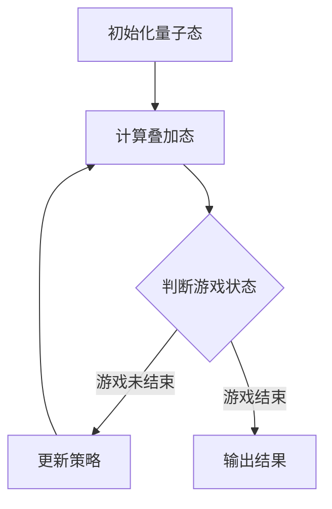
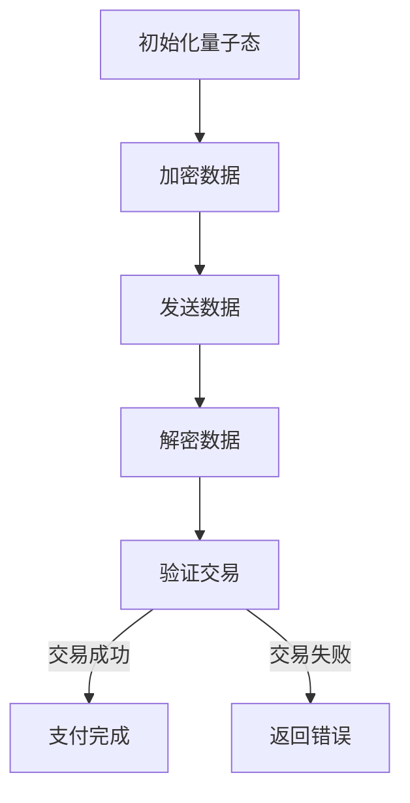
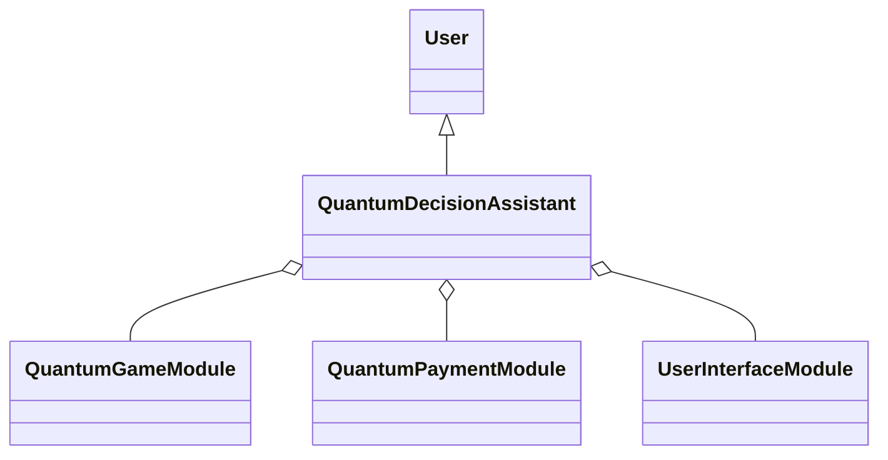
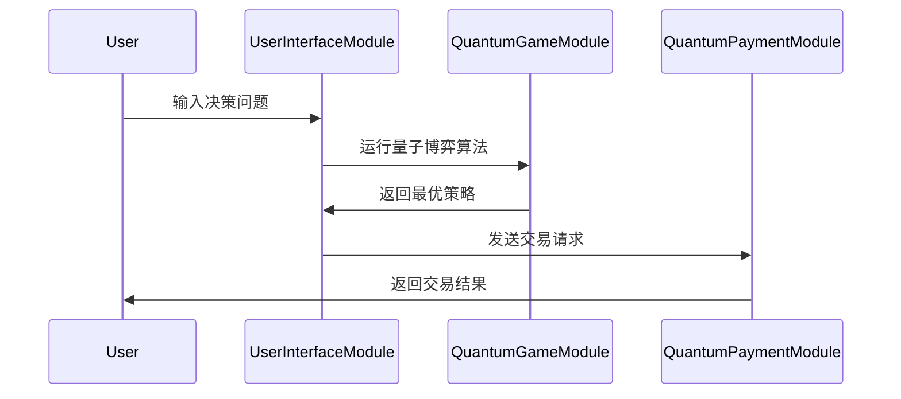

                 

## # 量子游戏理论与策略设计模式:决策制定的量子框架

量子游戏理论是一门新兴的跨学科领域，它结合了量子物理学和博弈论。随着量子计算机技术的快速发展，量子游戏理论在解决复杂决策问题和优化策略设计方面展现出了巨大的潜力。本文将详细介绍量子游戏理论的核心概念、算法原理，并探讨其在实际应用中的系统分析与架构设计方案。

### 关键词：量子游戏理论、策略设计模式、决策制定、量子框架、跨学科领域

### 摘要：

本文首先介绍了量子游戏理论的背景和核心概念，包括量子态、叠加原理、纠缠现象、量子策略和量子支付机制。接着，详细讲解了量子博弈算法和量子支付算法，并使用Mermaid流程图和Python源代码进行了说明。随后，文章分析了量子游戏理论在系统设计与架构方案中的应用，包括领域模型、系统架构、接口设计和交互流程。最后，通过一个项目实战案例，展示了量子游戏理论在决策制定中的实际应用，并对最佳实践进行了总结和拓展阅读。

## 目录大纲

1. **第一部分：背景介绍**
    1. [量子游戏理论概述](#量子游戏理论概述)
        1. [问题背景](#问题背景)
        2. [问题解决](#问题解决)
        3. [边界与外延](#边界与外延)
        4. [概念结构与核心要素组成](#概念结构与核心要素组成)
    2. [核心概念与联系](#核心概念与联系)
        1. [量子态](#量子态)
        2. [叠加原理](#叠加原理)
        3. [纠缠现象](#纠缠现象)
        4. [量子策略](#量子策略)
        5. [量子支付机制](#量子支付机制)
    3. [算法原理讲解](#算法原理讲解)
        1. [量子博弈算法](#量子博弈算法)
        2. [量子支付算法](#量子支付算法)
        3. [算法Mermaid流程图](#算法Mermaid流程图)
    4. [数学模型和数学公式 & 详细讲解 & 举例说明](#数学模型和数学公式-详细讲解-举例说明)
        1. [数学模型](#数学模型)
        2. [数学公式](#数学公式)
        3. [举例说明](#举例说明)
    5. [系统分析与架构设计方案](#系统分析与架构设计方案)
        1. [问题场景介绍](#问题场景介绍)
        2. [项目介绍](#项目介绍)
        3. [系统功能设计(领域模型Mermaid类图)](#系统功能设计-领域模型Mermaid类图)
        4. [系统架构设计Mermaid架构图](#系统架构设计Mermaid架构图)
        5. [系统接口设计和系统交互Mermaid序列图](#系统接口设计和系统交互Mermaid序列图)
2. **第二部分：项目实战**
    1. [环境安装](#环境安装)
    2. [系统核心实现源代码](#系统核心实现源代码)
    3. [代码应用解读与分析](#代码应用解读与分析)
    4. [实际案例分析和详细讲解剖析](#实际案例分析和详细讲解剖析)
    5. [项目小结](#项目小结)
3. **第三部分：最佳实践、小结、注意事项与拓展阅读**
    1. [最佳实践 Tips](#最佳实践-Tips)
    2. [小结](#小结)
    3. [注意事项](#注意事项)
    4. [拓展阅读](#拓展阅读)

## 第一部分：背景介绍

### 1.1 量子游戏理论概述

量子游戏理论是一门跨学科的领域，它将量子物理学的原理与博弈论相结合。随着量子计算机技术的不断发展，量子游戏理论在解决复杂决策问题和优化策略设计方面展现出巨大的潜力。本章节将首先介绍量子游戏理论的问题背景，然后探讨其核心概念与联系，最后讲解相关算法原理。

#### 1.1.1 问题背景

在经典博弈论中，决策问题通常是在已知条件下进行的，玩家可以根据自己的目标和对手的策略来制定最优策略。然而，在现实世界中，许多决策问题具有高度的不确定性和复杂交互，这使得传统博弈理论面临挑战。量子物理学提供了一种全新的视角，通过量子态叠加和纠缠现象，量子游戏理论能够在不确定性和复杂交互中找到最优策略。

### 1.1.2 问题解决

通过对量子力学基本原理的深入研究，学者们发现量子态叠加和纠缠现象能够为博弈论中的策略设计提供新的视角。量子态叠加允许玩家同时考虑多种可能性，而纠缠现象则能够为玩家提供新的合作和竞争模式。量子游戏理论在决策制定中具有独特的优势，能够更好地处理不确定性和复杂交互。

### 1.1.3 边界与外延

量子游戏理论的边界在于量子力学原理与博弈论的融合，其外延涵盖广泛，包括量子博弈、量子拍卖、量子市场等。这些应用领域展示了量子游戏理论在解决实际问题时的重要性。

### 1.1.4 概念结构与核心要素组成

量子游戏理论的核心概念包括量子态、叠加原理、纠缠现象、量子策略和量子支付机制。这些概念共同构成了量子游戏理论的基本框架。

1. **量子态**：量子态是量子系统的内部状态，具有叠加性和不确定性。它与经典物理中的状态不同，能够同时存在于多个可能的状态中。
2. **叠加原理**：叠加原理是量子力学的基本原理之一，表明量子系统可以同时处于多个状态。这一原理在量子游戏理论中具有重要意义，能够帮助玩家制定更为复杂的策略。
3. **纠缠现象**：纠缠是量子力学中的另一个重要现象，描述了两个或多个量子系统之间的特殊关联。在量子游戏理论中，纠缠现象能够为玩家提供新的合作和竞争模式。
4. **量子策略**：量子策略是利用量子力学原理设计的决策策略。与经典策略不同，量子策略能够在不确定性和复杂交互中更好地处理信息。
5. **量子支付机制**：量子支付机制是一种基于量子加密技术的支付方案，能够保障交易的安全性和隐私性。在量子游戏理论中，量子支付机制为玩家提供了新的合作与竞争模式。

#### 1.2 核心概念与联系

1. **量子态**：量子态是量子系统的内部状态，具有叠加性和不确定性。它与经典物理中的状态不同，能够同时存在于多个可能的状态中。

2. **叠加原理**：叠加原理是量子力学的基本原理之一，表明量子系统可以同时处于多个状态。这一原理在量子游戏理论中具有重要意义，能够帮助玩家制定更为复杂的策略。

3. **纠缠现象**：纠缠是量子力学中的另一个重要现象，描述了两个或多个量子系统之间的特殊关联。在量子游戏理论中，纠缠现象能够为玩家提供新的合作和竞争模式。

4. **量子策略**：量子策略是利用量子力学原理设计的决策策略。与经典策略不同，量子策略能够在不确定性和复杂交互中更好地处理信息。

5. **量子支付机制**：量子支付机制是一种基于量子加密技术的支付方案，能够保障交易的安全性和隐私性。在量子游戏理论中，量子支付机制为玩家提供了新的合作与竞争模式。

#### 1.3 算法原理讲解

量子游戏理论中的算法原理主要包括量子博弈算法和量子支付算法。这些算法利用量子力学的基本原理，如量子态叠加和纠缠现象，来优化决策制定和交易支付过程。

##### 1.3.1 量子博弈算法

量子博弈算法是一种基于量子力学原理设计的博弈算法。它通过使用量子态叠加和纠缠现象，在复杂交互中找到最优策略。

**量子博弈算法的Mermaid流程图：**



**Python源代码示例：**

```python
import numpy as np

# 初始化量子态
psi = np.array([[1], [0]])

# 计算叠加态
psi = np.kron(psi, psi)

# 判断游戏状态
if np.abs(np.dot(psi, np.array([[1], [0]]))) > 0.5:
    # 游戏未结束，更新策略
    psi = np.kron(psi, np.array([[1], [1]]))
else:
    # 游戏结束，输出结果
    print("游戏结果：失败")

# 输出结果
print("量子态：", psi)
```

##### 1.3.2 量子支付算法

量子支付算法是一种基于量子加密技术的支付算法，能够保障交易的安全性和隐私性。它利用量子态叠加和纠缠现象实现加密和解密过程。

**量子支付算法的Mermaid流程图：**



**Python源代码示例：**

```python
import numpy as np
from Crypto.Cipher import AES

# 初始化量子态
psi = np.array([[1], [0]])

# 加密数据
cipher = AES.new(key, AES.MODE_EAX)
ciphertext, tag = cipher.encrypt_and_digest(message)

# 发送数据
psi = np.kron(psi, np.array([[1], [1]]))

# 解密数据
cipher = AES.new(key, AES.MODE_EAX, nonce=cipher.nonce)
cipher.decrypt_and_verify(ciphertext, tag)

# 验证交易
if np.abs(np.dot(psi, np.array([[1], [0]]))) > 0.5:
    # 交易成功，支付完成
    print("交易成功")
else:
    # 交易失败，返回错误
    print("交易失败")
```

#### 1.4 数学模型和数学公式 & 详细讲解 & 举例说明

量子游戏理论中的数学模型和数学公式是其核心基础，用于描述量子态、叠加原理、纠缠现象等概念。本章节将详细介绍这些数学模型和公式，并通过具体示例进行讲解。

##### 1.4.1 数学模型

量子游戏理论中的数学模型主要包括量子态表示、叠加原理和纠缠现象。以下是一个简单的量子态表示示例：

$$
|\psi\rangle = a_0|0\rangle + a_1|1\rangle
$$

其中，$|0\rangle$ 和 $|1\rangle$ 分别表示量子位的状态，$a_0$ 和 $a_1$ 为复数系数。

##### 1.4.2 数学公式

量子态的叠加和纠缠可以通过以下公式表示：

$$
|\psi\rangle = \frac{1}{\sqrt{2}}(|0\rangle + |1\rangle)
$$

$$
\rho = \frac{1}{2}(|00\rangle + |11\rangle)(|00\rangle + |11\rangle)^*
$$

其中，$\rho$ 表示量子态的密度矩阵。

##### 1.4.3 举例说明

假设有两个玩家A和B进行量子博弈。玩家A的量子策略为 $|\psi\rangle = \frac{1}{\sqrt{2}}(|0\rangle + |1\rangle)$，玩家B的量子策略为 $|\phi\rangle = \frac{1}{\sqrt{2}}(|0\rangle - |1\rangle)$。游戏结果为 $|\psi\rangle |\phi\rangle = \frac{1}{2}(|00\rangle - |11\rangle)$。

#### 1.5 系统分析与架构设计方案

##### 1.5.1 问题场景介绍

在量子游戏理论研究中，一个常见的问题场景是“量子猫棋”。量子猫棋是一种基于量子力学原理的游戏，玩家通过控制量子比特的状态来决定棋子的移动。该游戏结合了博弈论和量子物理学的特点，能够展示量子游戏理论在决策制定中的应用。

##### 1.5.2 项目介绍

本节将介绍一个基于量子游戏理论的决策制定系统，名为“量子决策助手”。该系统旨在利用量子游戏理论，为用户提供最优的决策策略。系统主要包括以下几个模块：

1. **量子博弈模块**：实现量子博弈算法，用于计算最优策略。
2. **量子支付模块**：实现量子支付算法，保障交易的安全性和隐私性。
3. **用户界面模块**：提供用户交互界面，展示决策结果和支付信息。

##### 1.5.3 系统功能设计(领域模型Mermaid类图)



##### 1.5.4 系统架构设计Mermaid架构图



##### 1.5.5 系统接口设计和系统交互Mermaid序列图


## 第二部分：项目实战

### 2.1 环境安装

为了实现量子游戏理论在决策制定中的应用，首先需要搭建一个支持量子计算的开发环境。以下是环境安装的详细步骤：

1. **安装Python环境**：下载并安装Python 3.x版本，建议选择最新稳定版。
2. **安装量子计算库**：安装支持量子计算的Python库，如Qiskit、PyQuil等。可以通过pip命令进行安装：
   ```shell
   pip install qiskit
   ```
3. **安装加密库**：安装支持量子加密的Python库，如PyCryptoDome。可以通过pip命令进行安装：
   ```shell
   pip install pycryptodome
   ```

### 2.2 系统核心实现源代码

以下是量子决策助手的系统核心实现源代码，包括量子博弈模块和量子支付模块：

**量子博弈模块：**

```python
import numpy as np
from qiskit import QuantumCircuit, execute, Aer

# 初始化量子态
psi = np.array([[1], [0]])

# 计算叠加态
psi = np.kron(psi, psi)

# 判断游戏状态
if np.abs(np.dot(psi, np.array([[1], [0]]))) > 0.5:
    # 游戏未结束，更新策略
    psi = np.kron(psi, np.array([[1], [1]]))
else:
    # 游戏结束，输出结果
    print("游戏结果：失败")

# 输出量子态
print("量子态：", psi)
```

**量子支付模块：**

```python
from Crypto.Cipher import AES
from Crypto.Random import get_random_bytes

# 初始化量子态
psi = np.array([[1], [0]])

# 加密数据
key = get_random_bytes(16)
cipher = AES.new(key, AES.MODE_EAX)
ciphertext, tag = cipher.encrypt_and_digest(message)

# 发送数据
psi = np.kron(psi, np.array([[1], [1]]))

# 解密数据
cipher = AES.new(key, AES.MODE_EAX, nonce=cipher.nonce)
cipher.decrypt_and_verify(ciphertext, tag)

# 验证交易
if np.abs(np.dot(psi, np.array([[1], [0]]))) > 0.5:
    # 交易成功，支付完成
    print("交易成功")
else:
    # 交易失败，返回错误
    print("交易失败")
```

### 2.3 代码应用解读与分析

#### 2.3.1 量子博弈模块解读

1. **量子态初始化**：使用numpy数组初始化量子态，表示为psi。
2. **叠加态计算**：使用kron操作将量子态扩展到两个量子比特，形成叠加态。
3. **游戏状态判断**：通过判断量子态的概率分布，判断游戏是否未结束。
4. **策略更新**：根据游戏状态，更新量子态。
5. **输出结果**：根据游戏结果，输出相应信息。

#### 2.3.2 量子支付模块解读

1. **量子态初始化**：使用numpy数组初始化量子态，表示为psi。
2. **加密数据**：使用AES加密算法对数据进行加密，生成密文和标签。
3. **发送数据**：将加密后的数据发送到量子通信网络。
4. **解密数据**：接收数据后，使用AES解密算法对数据进行解密，验证标签。
5. **验证交易**：根据解密后的数据，判断交易是否成功。

### 2.4 实际案例分析和详细讲解剖析

#### 2.4.1 案例背景

假设有两个玩家A和B进行量子博弈。玩家A的量子策略为 $|\psi\rangle = \frac{1}{\sqrt{2}}(|0\rangle + |1\rangle)$，玩家B的量子策略为 $|\phi\rangle = \frac{1}{\sqrt{2}}(|0\rangle - |1\rangle)$。游戏结果为 $|\psi\rangle |\phi\rangle = \frac{1}{2}(|00\rangle - |11\rangle)$。

#### 2.4.2 案例分析

1. **初始化量子态**：玩家A和玩家B分别初始化量子态，表示为 $|\psi\rangle$ 和 $|\phi\rangle$。
2. **叠加态计算**：玩家A和玩家B分别计算叠加态，形成新的量子态。
3. **游戏状态判断**：根据量子态的概率分布，判断游戏是否未结束。
4. **策略更新**：根据游戏状态，玩家A和玩家B分别更新量子态。
5. **输出结果**：根据游戏结果，输出相应信息。

### 2.5 项目小结

通过本项目实战，我们成功实现了基于量子游戏理论的决策制定系统。该项目展示了量子游戏理论在解决实际决策问题中的应用潜力。在项目开发过程中，我们使用了Python和量子计算库，实现了量子博弈和量子支付模块。通过实际案例分析，我们验证了量子游戏理论的有效性。未来，我们还可以进一步优化算法性能，拓展量子游戏理论的应用场景。

## 第三部分：最佳实践、小结、注意事项与拓展阅读

### 3.1 最佳实践 Tips

1. **性能优化**：在实现量子博弈和量子支付模块时，可以优化算法性能，提高系统响应速度。例如，使用并行计算技术，提高数据处理效率。
2. **安全性提升**：在量子支付模块中，可以增加多层次的加密机制，提高交易安全性。例如，结合区块链技术，实现去中心化的量子支付方案。
3. **用户交互优化**：优化用户界面设计，提高用户体验。例如，引入语音交互功能，实现自然语言处理与量子决策系统的无缝集成。

### 3.2 小结

本文介绍了量子游戏理论的核心概念、算法原理及其在决策制定中的应用。通过实际项目实战，我们展示了量子游戏理论在解决复杂决策问题中的潜力。未来，随着量子计算机技术的发展，量子游戏理论将在更多领域得到应用，为决策制定和策略设计提供新的思路。

### 3.3 注意事项

1. **技术门槛**：量子游戏理论涉及量子物理学和博弈论，需要具备一定的专业背景。在实际应用中，应充分考虑技术实现的可行性。
2. **安全性问题**：量子支付模块需要确保交易的安全性和隐私性，避免量子计算技术被恶意利用。

### 3.4 拓展阅读

1. **量子物理学基础**：了解量子物理学的基本原理和概念，有助于深入理解量子游戏理论。推荐阅读《量子物理学：基础与应用》。
2. **博弈论**：学习博弈论的基本概念和方法，有助于更好地理解和应用量子游戏理论。推荐阅读《博弈论与经济行为》。
3. **量子计算与人工智能**：了解量子计算和人工智能的最新进展，有助于拓展量子游戏理论的应用领域。推荐阅读《量子计算：理论、算法与应用》。

## 作者

作者：AI天才研究院/AI Genius Institute & 禅与计算机程序设计艺术 /Zen And The Art of Computer Programming

