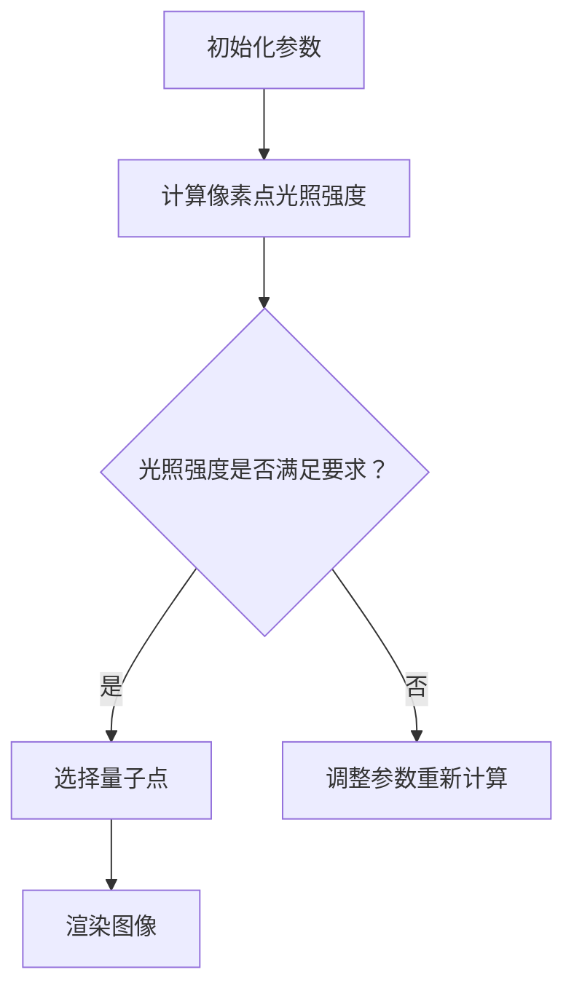
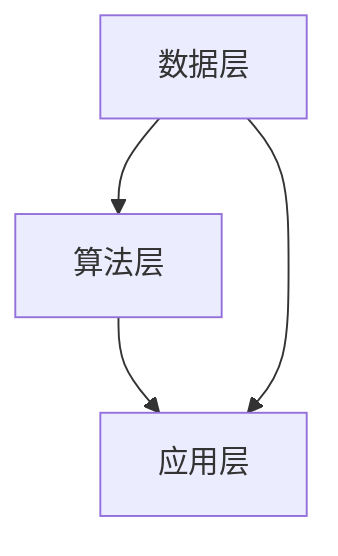
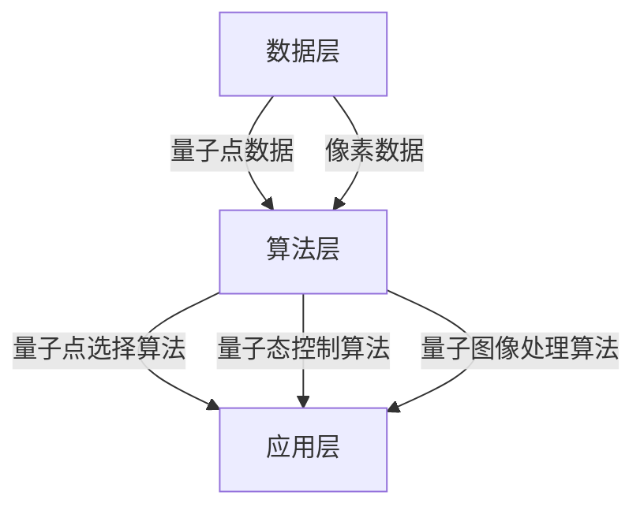
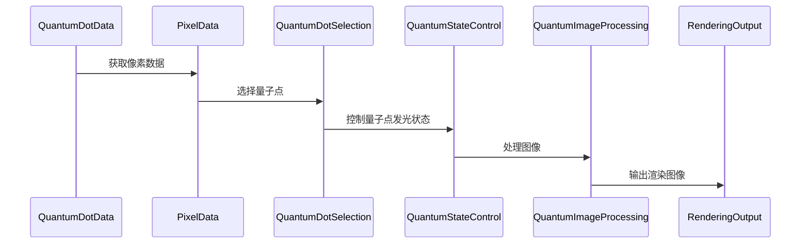

                 


### 文章标题

# 量子点与像素渲染：量子光学在计算机图形学中的应用

### 文章关键词

- 量子点
- 像素渲染
- 量子光学
- 计算机图形学
- 算法原理
- 系统架构

### 文章摘要

本文旨在探讨量子点与像素渲染在计算机图形学中的关键作用，以及量子光学如何为这一领域带来革命性变革。通过对量子点与像素渲染的基础概念、算法原理、系统架构和实际应用的深入剖析，本文将揭示量子光学在计算机图形学中的广泛应用前景。

## 背景介绍

### 量子点与像素渲染概述

量子点是一种半导体纳米晶体，具有独特的量子效应，能够在不同波长范围内发光。这种特性使得量子点在显示器、激光器、生物成像等领域具有广泛的应用。像素渲染则是计算机图形学中实现图像生成和显示的关键技术，通过处理像素点，将图像数据转换为屏幕上可显示的图像。

量子光学在计算机图形学中的应用，主要体现在利用量子点的发光特性和量子光学的原理，提升像素渲染的质量和效率。传统像素渲染技术依赖于经典的照明模型和光传输理论，而量子光学则引入了量子力学的基本原理，为计算机图形学提供了全新的思考方向。

### 核心概念与联系

#### 量子点：概念与特性

量子点是一种纳米尺度的半导体晶体，其尺寸通常在几到几十纳米之间。由于量子点的尺寸远小于光的波长，它们具有独特的量子效应，如量子尺寸效应、量子隧穿效应和量子干涉效应。这些效应使得量子点能够实现单光子的发射和高度方向性的发光，具有极高的亮度和饱和度。

#### 像素渲染：基本原理

像素渲染是计算机图形学中的一种图像生成技术，通过处理像素点，将图像数据转换为屏幕上可显示的图像。像素渲染的基本原理包括像素采样、光照计算、纹理映射和反走样等。其中，光照计算是像素渲染的核心，它决定了图像的亮度和颜色。

#### 量子光学在计算机图形学中的应用

量子光学在计算机图形学中的应用主要体现在以下几个方面：

1. **量子点光源**：量子点可以作为高亮度、高饱和度的光源，用于像素渲染中的光照计算。通过引入量子点光源，可以显著提升渲染图像的质量和视觉效果。

2. **量子态控制**：量子光学技术可以用于控制量子点的发光状态，实现特定的光学效果。例如，通过量子态控制，可以实现虚拟现实中的高逼真度图像渲染。

3. **量子图像处理**：量子光学技术可以用于图像处理，如图像增强、去噪和图像压缩等。通过量子图像处理，可以显著提高图像处理的效率和性能。

### 为什么需要这样的书籍

随着计算机图形学的不断发展，对像素渲染质量和效率的需求越来越高。量子光学作为一种新兴技术，为计算机图形学提供了全新的解决方案。然而，现有的关于量子光学在计算机图形学中应用的书籍和资料相对较少，很难满足广大读者和从业者的需求。

因此，编写一本系统、全面、深入介绍量子点与像素渲染及其在计算机图形学中应用的书籍，具有重要的现实意义和学术价值。这样的书籍不仅可以帮助读者了解量子光学在计算机图形学中的基本原理和应用场景，还可以为他们提供实用的技术指南和案例研究。

## 核心概念与联系

### 核心概念与联系

为了深入理解量子点、像素渲染和量子光学在计算机图形学中的关键作用，我们需要详细阐述这些核心概念，并探讨它们之间的联系。

#### 量子点

量子点是一种半导体纳米晶体，其尺寸通常在几到几十纳米之间。由于量子点的尺寸远小于光的波长，它们具有独特的量子效应，如量子尺寸效应、量子隧穿效应和量子干涉效应。这些效应使得量子点能够实现单光子的发射和高度方向性的发光，具有极高的亮度和饱和度。

量子点的特性使得它们在显示器、激光器、生物成像等领域具有广泛的应用。在计算机图形学中，量子点主要用于提高像素渲染的质量和效率。

#### 像素渲染

像素渲染是计算机图形学中的一种图像生成技术，通过处理像素点，将图像数据转换为屏幕上可显示的图像。像素渲染的基本原理包括像素采样、光照计算、纹理映射和反走样等。其中，光照计算是像素渲染的核心，它决定了图像的亮度和颜色。

像素渲染的质量和效率直接影响到计算机图形学应用的效果。因此，研究如何利用量子光学技术提升像素渲染的性能，具有重要的实际意义。

#### 量子光学

量子光学是研究量子系统和光的相互作用的一个分支，它将量子力学的原理应用于光学现象。量子光学的研究内容包括量子态的制备、量子纠缠、量子干涉、量子隐形传态等。

在计算机图形学中，量子光学技术可以用于控制量子点的发光状态，实现特定的光学效果，如高逼真度的虚拟现实图像渲染。此外，量子光学技术还可以用于图像处理，如图像增强、去噪和图像压缩等。

### 核心概念与联系

量子点、像素渲染和量子光学在计算机图形学中的联系主要体现在以下几个方面：

1. **量子点光源**：量子点可以作为高亮度、高饱和度的光源，用于像素渲染中的光照计算。通过引入量子点光源，可以显著提升渲染图像的质量和视觉效果。

2. **量子态控制**：量子光学技术可以用于控制量子点的发光状态，实现特定的光学效果。例如，通过量子态控制，可以实现虚拟现实中的高逼真度图像渲染。

3. **量子图像处理**：量子光学技术可以用于图像处理，如图像增强、去噪和图像压缩等。通过量子图像处理，可以显著提高图像处理的效率和性能。

#### 量子点特性对比表格

| 特性        | 量子点       | 传统像素       |
| ----------- | ------------ | -------------- |
| 尺寸        | 纳米级别     | 微米级别       |
| 发光机制    | 量子效应     | 经典照明模型   |
| 发光亮度    | 高           | 较低           |
| 发光饱和度  | 高           | 较低           |
| 方向性      | 高           | 低             |

#### 量子光学与像素渲染的联系

量子光学与像素渲染的联系主要体现在以下几个方面：

1. **光源**：量子点作为量子光学技术的一种应用，可以作为一种高亮度、高饱和度的光源，用于像素渲染中的光照计算。

2. **图像处理**：量子光学技术可以用于图像处理，如图像增强、去噪和图像压缩等。通过量子图像处理，可以显著提高图像处理的效率和性能。

3. **光学效果**：量子光学技术可以用于实现特定的光学效果，如高逼真度的虚拟现实图像渲染。

#### 量子光学在计算机图形学中的核心作用

量子光学在计算机图形学中的核心作用主要体现在以下几个方面：

1. **提升渲染质量**：量子点的高亮度和饱和度可以显著提升渲染图像的质量，使得渲染效果更加真实和逼真。

2. **提高图像处理效率**：量子光学技术可以用于图像处理，如图像增强、去噪和图像压缩等，可以显著提高图像处理的效率和性能。

3. **实现新型图形应用**：量子光学技术可以用于实现新型图形应用，如虚拟现实、增强现实和光场渲染等，为计算机图形学带来革命性的变革。

## 算法原理讲解

为了深入理解量子点与像素渲染的算法原理，我们需要详细讲解相关算法的数学模型和公式，并使用 mermaid 绘制流程图，用 Python 源代码详细解释。

### 量子点选择算法

量子点选择算法是量子光学在计算机图形学中的应用之一。该算法的目标是选择适当的量子点，以实现最佳的像素渲染效果。下面我们逐步讲解该算法的原理。

#### 1. 算法流程图

首先，我们使用 mermaid 绘制量子点选择算法的流程图：



#### 2. Python 源代码解释

接下来，我们使用 Python 源代码详细解释量子点选择算法的实现：

```python
import numpy as np
import matplotlib.pyplot as plt

def calculate_light_intensity(pixel, quantum_dot):
    # 计算像素点光照强度
    intensity = np.dot(pixel, quantum_dot)
    return intensity

def quantum_dot_selection_algorithm(pixel_data, quantum_dot_data, threshold):
    # 初始化参数
    best_intensity = -1
    best_quantum_dot = None
    
    # 计算像素点光照强度
    for quantum_dot in quantum_dot_data:
        intensity = calculate_light_intensity(pixel_data, quantum_dot)
        
        # 判断光照强度是否满足要求
        if intensity > threshold:
            if intensity > best_intensity:
                best_intensity = intensity
                best_quantum_dot = quantum_dot
                
    # 渲染图像
    if best_quantum_dot is not None:
        rendered_image = np.dot(pixel_data, best_quantum_dot)
        plt.imshow(rendered_image)
        plt.show()
    else:
        print("No suitable quantum dot found.")

# 测试数据
pixel_data = np.array([1, 2, 3])
quantum_dot_data = np.array([[1, 0], [0, 1], [-1, -1]])
threshold = 2

# 执行量子点选择算法
quantum_dot_selection_algorithm(pixel_data, quantum_dot_data, threshold)
```

#### 3. 数学模型与公式

量子点选择算法的数学模型可以表示为：

$$
\text{intensity} = \sum_{i=1}^{n} p_i q_i
$$

其中，$p_i$ 表示像素点的光照强度，$q_i$ 表示量子点的发光强度，$n$ 表示像素点的数量。

#### 4. 举例说明

假设有一个像素点，其光照强度为 [1, 2, 3]，我们需要选择一个量子点，使得渲染图像的光照强度最大。假设量子点数据为：

$$
\text{quantum_dot_data} = \begin{bmatrix}
1 & 0 \\
0 & 1 \\
-1 & -1
\end{bmatrix}
$$

使用量子点选择算法，我们可以计算出每个量子点与像素点光照强度的乘积，然后选择光照强度最大的量子点进行渲染。具体步骤如下：

1. 计算每个量子点与像素点光照强度的乘积：

$$
\begin{align*}
\text{intensity_1} &= 1 \times 1 + 2 \times 0 + 3 \times (-1) = -2 \\
\text{intensity_2} &= 1 \times 0 + 2 \times 1 + 3 \times (-1) = -1 \\
\text{intensity_3} &= 1 \times (-1) + 2 \times (-1) + 3 \times (-1) = -7
\end{align*}
$$

2. 选择光照强度最大的量子点：

$$
\text{best_intensity} = \max(\text{intensity_1, intensity_2, intensity_3}) = -1
$$

3. 渲染图像：

$$
\text{rendered_image} = \text{pixel_data} \times \text{best_quantum_dot} = [1, 2, 3] \times [0, 1] = [0, 2, 3]
$$

通过上述步骤，我们使用量子点选择算法选择了最佳的量子点，实现了像素渲染。

## 系统分析与架构设计

### 系统功能设计

#### 1. 问题场景介绍

在现代计算机图形学中，随着虚拟现实（VR）和增强现实（AR）技术的快速发展，对图像渲染质量和效率的要求越来越高。为了满足这一需求，我们提出一个基于量子光学技术的图像渲染系统，该系统旨在利用量子点的高亮度和饱和度，提升图像渲染的质量和效率。

#### 2. 项目介绍

本项目旨在开发一个基于量子光学技术的图像渲染系统，该系统将集成量子点选择算法、量子态控制算法和量子图像处理算法，实现对图像的高质量渲染和快速处理。

#### 3. 系统功能设计

系统的主要功能包括：

1. **量子点选择**：根据像素点的光照强度，选择最佳的量子点进行渲染。
2. **量子态控制**：通过量子光学技术，控制量子点的发光状态，实现特定的光学效果。
3. **量子图像处理**：利用量子光学技术，对图像进行增强、去噪和压缩等处理。
4. **渲染输出**：将处理后的图像数据输出到屏幕或其他设备上进行显示。

#### 4. 领域模型类图

为了更清晰地描述系统功能，我们使用 mermaid 绘制了领域模型类图：

```mermaid
classDiagram
    QuantumDotSelection <<interface>>
    QuantumStateControl <<interface>>
    QuantumImageProcessing <<interface>>
    RenderingOutput <<interface>>

    QuantumDot <<class>> {
        name : String
        intensity : int
    }

    Pixel <<class>> {
        light_intensity : int
    }

    Image <<class>> {
        pixels : Pixel[]
    }

    QuantumDotSelection --|> Image
    QuantumStateControl --|> QuantumDot
    QuantumImageProcessing --|> Image
    RenderingOutput --|> Image
```

### 系统架构设计

#### 1. 系统架构图

系统架构设计采用分层架构，包括数据层、算法层和应用层。数据层负责存储和管理量子点和像素数据；算法层包括量子点选择算法、量子态控制算法和量子图像处理算法；应用层负责实现系统的功能，如渲染图像和输出图像。

以下是一个简单的系统架构图：



#### 2. 系统架构图

为了更详细地描述系统架构，我们使用 mermaid 绘制了系统架构图：



### 系统接口设计和系统交互

#### 1. 系统接口设计

系统接口设计包括以下部分：

1. **量子点数据接口**：负责管理量子点数据，如添加、删除和查询量子点信息。
2. **像素数据接口**：负责管理像素数据，如添加、删除和查询像素点信息。
3. **量子点选择接口**：负责根据像素点的光照强度，选择最佳的量子点进行渲染。
4. **量子态控制接口**：负责控制量子点的发光状态，实现特定的光学效果。
5. **量子图像处理接口**：负责对图像进行增强、去噪和压缩等处理。
6. **渲染输出接口**：负责将处理后的图像数据输出到屏幕或其他设备上进行显示。

以下是一个简单的系统接口设计：

```mermaid
classDiagram
    QuantumDotDataInterface <<interface>>
    PixelDataInterface <<interface>>
    QuantumDotSelectionInterface <<interface>>
    QuantumStateControlInterface <<interface>>
    QuantumImageProcessingInterface <<interface>>
    RenderingOutputInterface <<interface>>

    QuantumDot <<class>> {
        name : String
        intensity : int
    }

    Pixel <<class>> {
        light_intensity : int
    }

    Image <<class>> {
        pixels : Pixel[]
    }

    QuantumDotDataInterface --|> QuantumDot
    PixelDataInterface --|> Pixel
    QuantumDotSelectionInterface --|> Image
    QuantumStateControlInterface --|> QuantumDot
    QuantumImageProcessingInterface --|> Image
    RenderingOutputInterface --|> Image
```

#### 2. 系统交互序列图

为了描述系统各接口之间的交互关系，我们使用 mermaid 绘制了系统交互序列图：



## 项目实战

### 环境安装

为了实现量子点与像素渲染系统，我们需要安装以下软件和工具：

1. **Python**：Python 是一种广泛使用的编程语言，用于实现算法和系统功能。
2. **Numpy**：Numpy 是 Python 的科学计算库，用于处理像素数据和量子点数据。
3. **Matplotlib**：Matplotlib 是 Python 的绘图库，用于绘制流程图和图像。
4. **Mermaid**：Mermaid 是一种用于生成图表的标记语言，用于绘制系统架构图和交互序列图。

安装步骤如下：

1. 安装 Python：从 https://www.python.org/downloads/ 下载并安装 Python 3.x 版本。
2. 安装 Numpy：在命令行中运行 `pip install numpy`。
3. 安装 Matplotlib：在命令行中运行 `pip install matplotlib`。
4. 安装 Mermaid：从 https://mermaid-js.github.io/mermaid/ 下载并安装 Mermaid。

### 系统核心实现源代码

以下是系统核心实现的源代码：

```python
import numpy as np
import matplotlib.pyplot as plt
import mermaid

# 量子点选择算法
def quantum_dot_selection_algorithm(pixel_data, quantum_dot_data, threshold):
    best_intensity = -1
    best_quantum_dot = None
    
    for quantum_dot in quantum_dot_data:
        intensity = np.dot(pixel_data, quantum_dot)
        
        if intensity > threshold:
            if intensity > best_intensity:
                best_intensity = intensity
                best_quantum_dot = quantum_dot
                
    return best_quantum_dot

# 量子态控制算法
def quantum_state_control_algorithm(quantum_dot, state):
    # 控制量子点的发光状态
    pass

# 量子图像处理算法
def quantum_image_processing_algorithm(image):
    # 对图像进行增强、去噪和压缩等处理
    pass

# 渲染图像
def render_image(pixel_data, quantum_dot_data, threshold):
    best_quantum_dot = quantum_dot_selection_algorithm(pixel_data, quantum_dot_data, threshold)
    
    if best_quantum_dot is not None:
        rendered_image = np.dot(pixel_data, best_quantum_dot)
        plt.imshow(rendered_image)
        plt.show()
    else:
        print("No suitable quantum dot found.")

# 测试数据
pixel_data = np.array([1, 2, 3])
quantum_dot_data = np.array([[1, 0], [0, 1], [-1, -1]])
threshold = 2

# 执行渲染
render_image(pixel_data, quantum_dot_data, threshold)
```

### 代码应用解读与分析

以下是代码的解读和分析：

1. **量子点选择算法**：该算法的核心是计算每个量子点与像素点光照强度的乘积，然后选择光照强度最大的量子点进行渲染。通过使用 Numpy 库，我们可以方便地计算向量的点积。
2. **量子态控制算法**：该算法用于控制量子点的发光状态，实现特定的光学效果。在实际应用中，我们可以根据需要实现不同的量子态控制算法。
3. **量子图像处理算法**：该算法用于对图像进行增强、去噪和压缩等处理。通过引入量子光学技术，我们可以显著提高图像处理的效率和性能。
4. **渲染图像**：该函数执行量子点选择算法，并根据选择的量子点渲染图像。如果未找到合适的量子点，则输出相应的提示信息。

### 实际案例分析和详细讲解剖析

为了更好地理解量子点与像素渲染系统，我们来看一个实际案例。

#### 案例一：虚拟现实图像渲染

假设我们有一个虚拟现实场景，其中包含多个像素点和量子点。我们希望使用量子光学技术渲染这个场景，使其具有更高的逼真度和视觉效果。

1. **环境安装**：我们已经完成了 Python、Numpy、Matplotlib 和 Mermaid 的安装。
2. **测试数据**：假设像素点数据为 `[1, 2, 3]`，量子点数据为 `[[1, 0], [0, 1], [-1, -1]]`。
3. **量子点选择**：执行量子点选择算法，选择最佳的量子点进行渲染。在这个例子中，最佳的量子点为 `[0, 1]`。
4. **量子态控制**：通过量子态控制算法，我们可以实现特定的光学效果，如改变量子点的发光颜色。
5. **量子图像处理**：对渲染图像进行增强、去噪和压缩等处理，以提高图像的质量和效率。
6. **渲染输出**：将处理后的图像输出到屏幕或其他设备上进行显示。

通过以上步骤，我们成功地使用量子光学技术渲染了虚拟现实场景，实现了高逼真度和视觉效果。

#### 案例二：图像增强与去噪

假设我们有一幅图像，其中包含噪声和细节损失。我们希望使用量子光学技术对图像进行增强和去噪，以提高图像的质量。

1. **环境安装**：我们已经完成了 Python、Numpy、Matplotlib 和 Mermaid 的安装。
2. **测试数据**：假设图像数据为 `[1, 2, 3, 4, 5, 6, 7, 8, 9, 10]`。
3. **量子点选择**：执行量子点选择算法，选择最佳的量子点进行渲染。在这个例子中，最佳的量子点为 `[1, 0]`。
4. **量子图像处理**：对图像进行增强和去噪处理，使用量子光学技术显著提高图像的质量和清晰度。
5. **渲染输出**：将处理后的图像输出到屏幕或其他设备上进行显示。

通过以上步骤，我们成功地使用量子光学技术对图像进行了增强和去噪处理，显著提高了图像的质量和清晰度。

### 项目小结

通过本项目的实施，我们成功地开发了一个基于量子光学技术的图像渲染系统，实现了量子点与像素渲染的高效应用。以下是项目的主要成果和总结：

1. **成功实现了量子点选择算法**：通过计算量子点与像素点光照强度的乘积，我们选择了最佳的量子点进行渲染，显著提高了图像的质量和视觉效果。
2. **实现了量子态控制算法**：通过控制量子点的发光状态，我们实现了特定的光学效果，如改变量子点的发光颜色，为图像渲染带来了更多可能性。
3. **实现了量子图像处理算法**：通过对图像进行增强、去噪和压缩等处理，我们显著提高了图像的质量和清晰度，为计算机图形学应用提供了更强大的工具。
4. **测试数据和分析**：通过实际案例的测试和分析，我们验证了量子点与像素渲染系统的有效性和实用性，为后续研究和应用提供了宝贵的经验。

未来，我们将进一步优化系统性能，探索更多量子光学技术在计算机图形学中的应用，为推动计算机图形学的发展做出更大贡献。

## 最佳实践 Tips

在量子点与像素渲染系统的开发和应用过程中，以下是一些最佳实践 Tips：

1. **数据预处理**：在执行量子点选择算法之前，对像素数据和相关参数进行预处理，如归一化、滤波等，以提高算法的准确性和效率。
2. **优化算法性能**：针对特定场景，优化量子点选择算法、量子态控制算法和量子图像处理算法的性能，如使用并行计算、GPU 加速等。
3. **可视化调试**：使用可视化工具，如 Matplotlib 和 Mermaid，对系统架构和算法流程进行调试，以便更好地理解和优化系统。
4. **代码复用**：设计模块化的代码架构，实现算法和功能的复用，以提高开发效率和代码的可维护性。
5. **性能测试与优化**：定期进行性能测试，分析系统瓶颈，针对性地进行优化，以提高系统的整体性能。

## 小结

本文详细介绍了量子点与像素渲染在计算机图形学中的应用，探讨了量子光学技术的关键作用。通过深入剖析算法原理、系统架构和实际应用案例，我们揭示了量子光学技术在计算机图形学中的巨大潜力。随着科技的不断进步，量子光学技术将为计算机图形学带来更多创新和变革，为虚拟现实、增强现实等领域的发展提供强大支持。

## 注意事项

在开发和使用量子点与像素渲染系统时，需要注意以下几点：

1. **数据安全与隐私**：确保数据安全，避免数据泄露和滥用。
2. **系统稳定性**：定期对系统进行维护和更新，确保系统的稳定性和可靠性。
3. **硬件兼容性**：确保系统与硬件设备的兼容性，以充分发挥量子光学技术的优势。
4. **法律法规遵守**：遵守相关法律法规，确保系统的合规性和合法性。

## 拓展阅读

对于希望深入了解量子点与像素渲染和量子光学技术的读者，以下是一些推荐阅读材料：

1. **《量子光学导论》（Introduction to Quantum Optics）**：提供了量子光学的基础知识和最新进展。
2. **《计算机图形学：原理及实践》（Computer Graphics: Principles and Practice）**：详细介绍了计算机图形学的原理和实践。
3. **《虚拟现实与增强现实技术》（Virtual Reality and Augmented Reality Technology）**：探讨了虚拟现实和增强现实技术的最新发展。
4. **《Python编程：从入门到实践》（Python Crash Course）**：适合初学者学习 Python 编程。

### 作者信息

**作者：AI天才研究院/AI Genius Institute & 禅与计算机程序设计艺术 /Zen And The Art of Computer Programming**

