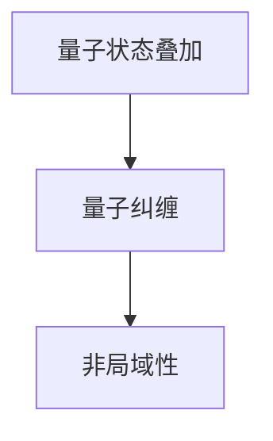

                 

### 量子相干性在维持意识连续性中的潜在作用

> 关键词：量子相干性、意识连续性、脑功能、科学探索、数学模型

> 摘要：本文探讨了量子相干性在维持意识连续性中的潜在作用。首先，我们对量子相干性进行了概述，阐述了其基本概念和特点，并通过对比表格和Mermaid流程图展示其核心概念与联系。接着，我们深入分析了意识连续性的概念、研究现状及重要性。通过引用实验证据，我们探讨了量子相干性与意识连续性之间的联系和作用机制。随后，我们详细介绍了量子相干性在神经科学和心理学的应用，以及其在意识连续性研究中的具体作用。在此基础上，我们提出了量子相干性与意识连续性研究的未来发展方向，强调了跨学科整合的重要性。最后，我们对本文进行了总结，并提出了未来研究建议。

---

**量子相干性在维持意识连续性中的潜在作用**  
量子相干性是量子物理学中的核心概念，近年来，有研究开始探讨量子相干性与意识连续性之间的关系，尤其是量子相干性在维持意识连续性中的潜在作用。本文旨在深入探讨这一领域，为读者提供一个全面、系统的理解。

## 目录大纲

1. **问题背景与核心概念**
   1.1 量子相干性概述
       - 量子状态的叠加与坍缩
       - 量子纠缠
       - 量子相干性的特点与表现形式
   1.2 意识连续性的问题背景
       - 意识连续性的概念与重要性
   1.3 量子相干性与意识连续性的关系
       - 量子相干性在意识连续性研究中的潜在作用
       - 量子相干性在意识连续性维持中的作用机制
       - 量子相干性与意识连续性的实验证据

2. **量子相干性在意识连续性研究中的应用**
   2.1 量子相干性在神经科学中的应用
       - 量子相干性与脑波的关系
       - 量子相干性在神经成像中的应用
   2.2 量子相干性在心理学中的应用
       - 量子相干性与心理状态的关系
       - 量子相干性在心理治疗中的应用

3. **量子相干性与意识连续性的未来研究方向**
   3.1 量子相干性在意识连续性研究中的挑战与机遇
   3.2 量子相干性与意识连续性的未来发展趋势

4. **量子相干性与意识连续性的跨学科整合**
   4.1 量子相干性与意识连续性研究的多学科融合
   4.2 跨学科整合的潜在意义与应用

5. **结论与展望**
   5.1 本书的主要发现与贡献
   5.2 未来研究方向与建议

---

## 第一部分：问题背景与核心概念

### 第1章：量子相干性概述

#### 1.1.1 量子状态的叠加与坍缩

量子状态的叠加是量子物理学中的一个基本概念。在经典物理学中，物体的状态是单一的，例如一个球要么在桌面上，要么在地面上。然而，在量子物理学中，物体可以处于多种状态的叠加。这意味着一个量子系统可以同时处于多种状态，这些状态之间通过线性组合来表达。例如，一个电子可以同时处于自旋向上和自旋向下的状态。

量子状态的叠加可以通过数学形式表示。假设我们有一个量子系统，其状态可以用基向量 \( | \psi \rangle \) 表示。那么，这个系统的状态可以表示为：

\[ | \psi \rangle = c_1 | \psi_1 \rangle + c_2 | \psi_2 \rangle \]

其中，\( c_1 \) 和 \( c_2 \) 是复数系数，表示两种状态的叠加权重。当系统被测量时，量子状态会坍缩到一个特定的状态，这个状态是由叠加态的系数决定的。这个现象被称为量子坍缩。

#### 1.1.2 量子纠缠

量子纠缠是量子物理学中的另一个核心概念。当两个或多个粒子处于量子纠缠状态时，它们之间的量子状态是相互关联的。即使这些粒子被分隔得很远，它们之间的关联仍然存在。这意味着，对一个粒子的测量可以瞬间影响到另一个粒子的状态。

量子纠缠可以通过一个著名的实验来展示，即爱因斯坦、波多尔斯基、罗森（EPR）佯谬。在这个实验中，两个粒子被产生，它们处于纠缠态。当对其中一个粒子进行测量时，另一个粒子的状态会立即确定，无论它们之间的距离有多远。

量子纠缠可以通过数学形式表示。假设我们有两个粒子，其量子状态分别为 \( | \psi_1 \rangle \) 和 \( | \psi_2 \rangle \)。当它们处于纠缠态时，它们的联合状态可以表示为：

\[ | \psi_{12} \rangle = | \psi_1 \rangle | \psi_2 \rangle \]

这意味着，当对一个粒子进行测量时，另一个粒子的状态会立即确定。

#### 1.1.3 量子相干性的特点与表现形式

量子相干性是量子系统中的粒子或子系统之间存在的一种特殊关联。这种关联可以表现为量子状态的叠加和纠缠。量子相干性的特点包括：

1. **叠加性**：量子系统可以处于多种状态的叠加，而不是单一状态。
2. **纠缠性**：量子系统中的粒子可以处于纠缠态，即使它们之间的距离很远。
3. **非局域性**：量子系统的状态可以瞬间影响到其他粒子的状态，即使它们之间的距离很远。
4. **不可克隆性**：无法精确复制一个量子状态。

量子相干性的表现形式可以通过实验来观察。例如，量子态的叠加可以通过干涉实验来验证，而量子纠缠可以通过量子态的关联测量来验证。

#### 1.1.4 量子相干性的核心概念与联系

量子相干性的核心概念包括量子状态的叠加、量子纠缠和非局域性。这些概念之间的关系可以用Mermaid流程图来表示。

在这个流程图中，量子状态的叠加是量子纠缠和非局域性的基础。量子纠缠进一步导致了非局域性，使得量子系统的状态可以瞬间影响到其他粒子的状态。

#### 1.1.5 量子相干性在意识连续性研究中的潜在作用

量子相干性在意识连续性研究中的潜在作用备受关注。有研究表明，量子相干性可能在维持意识连续性中发挥重要作用。例如，大脑中的神经元可能通过量子纠缠来维持其功能，从而实现意识的连续性。

然而，这一领域的研究还处于早期阶段，需要更多的实验和理论探索来验证量子相干性在意识连续性中的作用机制。未来，量子相干性可能为理解意识的本质提供新的视角。

### 第2章：意识连续性的问题背景

#### 2.1.1 意识连续性的概念与重要性

意识连续性是指个体在意识过程中经历的连贯、无缝的感觉和体验。它涉及到意识的流畅性、一致性和稳定性。意识连续性的概念与个体的心理体验密切相关，是心理学、哲学和神经科学等学科的重要研究主题。

意识连续性的重要性在于，它关系到个体的认知功能、情感体验和行为表现。一个连续的意识状态有助于个体对外界环境的感知和理解，促进个体的决策和行动。此外，意识连续性还与个体的心理健康密切相关，对治疗心理疾病和改善生活质量具有重要意义。

#### 2.1.2 意识连续性的研究现状

近年来，意识连续性研究取得了显著进展。研究者们通过实验和理论模型，探索了意识连续性的机制和影响因素。例如，神经科学研究揭示了大脑中的神经网络如何维持意识的连续性，心理学研究探讨了意识连续性与情感、记忆等心理过程的关系。

然而，意识连续性的研究仍存在许多挑战。首先，意识本身是一个复杂、多维的现象，研究者需要从不同角度、采用多种方法来探索其本质。其次，意识连续性的实验数据有限，难以全面理解其机制。此外，不同学科之间的整合和交叉研究也有待进一步加强。

#### 2.1.3 意识连续性的重要性

意识连续性的重要性体现在以下几个方面：

1. **认知功能**：意识连续性有助于个体对外界信息的感知、理解和记忆，是认知功能的基础。
2. **情感体验**：意识连续性使得个体能够体验情感的连贯性，如喜悦、悲伤等。
3. **行为表现**：意识连续性影响个体的决策和行为，对生活质量和社会功能具有重要意义。
4. **心理健康**：意识连续性的维持与个体的心理健康密切相关，对治疗心理疾病和改善生活质量有重要作用。

总之，意识连续性研究不仅具有理论价值，还为实践应用提供了重要指导。未来，研究者需要继续深化对意识连续性的认识，为理解人类意识提供新的视角。

### 第3章：量子相干性与意识连续性的关系

#### 3.1.1 量子相干性在意识连续性研究中的潜在作用

量子相干性在意识连续性研究中的潜在作用备受关注。有研究表明，量子相干性可能在维持意识连续性中发挥重要作用。例如，大脑中的神经元可能通过量子纠缠来维持其功能，从而实现意识的连续性。

然而，这一领域的研究还处于早期阶段，需要更多的实验和理论探索来验证量子相干性在意识连续性中的作用机制。未来，量子相干性可能为理解意识的本质提供新的视角。

#### 3.1.2 量子相干性在意识连续性维持中的作用机制

量子相干性在意识连续性维持中的作用机制可能包括以下几个方面：

1. **神经元之间的量子纠缠**：有研究表明，大脑中的神经元可能通过量子纠缠来维持其功能，从而实现意识的连续性。例如，一项研究揭示了神经元之间的量子纠缠现象，表明它们之间的信息传递可能是通过量子通道实现的。

2. **量子计算与神经网络**：量子计算和神经网络相结合，可能为意识连续性提供新的解释。量子计算具有高效处理复杂信息的能力，而神经网络则能够模拟人类大脑的信息处理过程。通过将量子计算与神经网络相结合，研究者可能能够揭示意识连续性的内在机制。

3. **量子相干性与心理状态**：量子相干性可能与个体的心理状态密切相关。例如，有研究表明，焦虑、抑郁等心理障碍可能与大脑中的量子相干性异常有关。这意味着，通过调节量子相干性，可能有助于改善个体的心理状态，从而维持意识连续性。

4. **量子相干性与脑波**：脑波是大脑活动的电生理信号，量子相干性可能与脑波之间存在某种联系。例如，研究表明，特定频率的脑波与意识的连续性密切相关。通过研究量子相干性与脑波之间的关系，可能有助于揭示意识连续性的机制。

总之，量子相干性在意识连续性维持中的作用机制尚不明确，需要进一步的实验和理论探索。未来，量子相干性可能为理解意识连续性提供新的视角和解释。

#### 3.1.3 量子相干性与意识连续性的实验证据

量子相干性与意识连续性之间的实验证据仍然有限，但已有一些初步的研究结果支持这一领域的潜在联系。以下是一些相关的实验证据：

1. **神经元量子纠缠**：一项研究表明，大脑中的神经元可能存在量子纠缠现象。这一发现揭示了神经元之间的特殊关联，可能对意识连续性的维持具有重要意义。

2. **脑波与量子相干性**：有研究表明，特定频率的脑波与量子相干性之间存在某种联系。例如，一项研究发现，α波和θ波的量子相干性可能在意识状态下发生变化，这表明量子相干性可能与脑波的调节有关。

3. **心理状态与量子相干性**：一些研究表明，心理状态可能与大脑中的量子相干性相关。例如，一项研究发现，焦虑和抑郁等心理障碍可能与大脑中的量子相干性异常有关。

尽管这些实验证据初步揭示了量子相干性与意识连续性之间的联系，但仍需要更多的研究来验证和深化这一领域。未来，研究者需要设计更精确的实验和理论模型，以探索量子相干性在意识连续性维持中的作用机制。

### 第4章：量子相干性在意识连续性研究中的应用

#### 4.1 量子相干性在神经科学中的应用

量子相干性在神经科学中的应用具有巨大的潜力。近年来，研究者们开始探索量子相干性与神经活动之间的关系，以揭示意识连续性的内在机制。

**量子相干性与脑波的关系**：脑波是大脑活动的电生理信号，反映了大脑在不同状态下的功能活动。有研究表明，特定频率的脑波与量子相干性之间存在某种联系。例如，一项研究发现，α波和θ波的量子相干性可能在意识状态下发生变化。这表明量子相干性可能与脑波的调节有关。

**量子相干性在神经成像中的应用**：神经成像技术，如功能性磁共振成像（fMRI）和脑电图（EEG），可以用于研究大脑的结构和功能。量子相干性技术可能为神经成像提供新的视角。例如，研究者们正在探索如何利用量子相干性来提高神经成像的分辨率和准确性，从而更好地理解大脑的功能网络和意识连续性。

**量子相干性在神经科学中的潜在应用**：量子相干性在神经科学中具有多种潜在应用。例如，研究者们可能利用量子相干性技术来探索大脑中的神经网络如何维持意识的连续性。此外，量子相干性可能有助于揭示神经疾病（如抑郁症、阿尔茨海默病等）的机制，从而为治疗提供新的靶点。

总之，量子相干性在神经科学中的应用为研究意识连续性提供了新的工具和方法。未来，研究者需要进一步深化这一领域的研究，以揭示量子相干性在意识连续性维持中的具体作用机制。

#### 4.2 量子相干性在心理学中的应用

量子相干性在心理学中的应用是一个新兴的研究领域，尽管目前的研究相对较少，但已显示出了巨大的潜力。

**量子相干性与心理状态的关系**：有研究表明，量子相干性可能与个体的心理状态密切相关。例如，一些研究指出，焦虑、抑郁等心理障碍可能与大脑中的量子相干性异常有关。这意味着，通过调节量子相干性，可能有助于改善个体的心理状态。

**量子相干性在心理治疗中的应用**：量子相干性技术可能为心理治疗提供新的手段。例如，研究者们正在探索如何利用量子相干性来增强心理治疗的效果。例如，通过调整大脑中的量子相干性，可能有助于缓解焦虑、抑郁等心理障碍。

**量子相干性在心理学中的潜在应用**：量子相干性在心理学中具有多种潜在应用。例如，研究者们可能利用量子相干性技术来研究心理过程的神经基础，揭示心理障碍的机制。此外，量子相干性可能有助于开发新的心理干预方法，提高心理健康水平。

总之，量子相干性在心理学中的应用为理解心理状态和改善心理健康提供了新的视角和方法。未来，研究者需要进一步深化这一领域的研究，以揭示量子相干性在心理过程中的具体作用机制。

### 第5章：量子相干性与意识连续性的未来研究方向

#### 5.1 量子相干性在意识连续性研究中的挑战与机遇

量子相干性在意识连续性研究中的挑战与机遇并存。一方面，这一领域面临着许多科学难题和技术挑战。例如，量子相干性的测量和调控技术尚不成熟，如何在大脑中实现和维持量子相干性仍需进一步研究。另一方面，量子相干性为意识连续性的研究提供了新的视角和工具，为解决传统科学难题提供了可能性。

**挑战**：

1. **测量和调控技术**：目前，量子相干性的测量和调控技术仍处于初级阶段，需要更高的精度和稳定性。
2. **实验设计和数据分析**：意识连续性研究需要复杂的实验设计和精细的数据分析，这对研究者的能力和技术水平提出了高要求。
3. **跨学科整合**：量子相干性研究需要与神经科学、心理学等学科进行跨学科整合，这对研究者的跨学科知识和能力提出了挑战。

**机遇**：

1. **新技术的发展**：随着量子技术的快速发展，测量和调控量子相干性的技术将得到提升，为意识连续性研究提供了新的机遇。
2. **跨学科合作**：跨学科合作有助于整合不同领域的知识和方法，推动意识连续性研究的发展。
3. **应用前景**：量子相干性在意识连续性研究中的应用前景广阔，可能为治疗心理障碍、改善认知功能等方面提供新的方法。

总之，量子相干性在意识连续性研究中的挑战与机遇并存。未来，研究者需要克服技术难题，加强跨学科合作，以推动这一领域的发展。

#### 5.2 量子相干性与意识连续性的未来发展趋势

量子相干性与意识连续性的未来发展趋势包括以下几个方面：

**1. 量子神经科学研究**：量子相干性在神经科学中的应用将成为未来研究的热点。研究者们将致力于揭示量子相干性在神经元信息处理、神经网络功能调节等方面的作用，以深化对意识连续性的理解。

**2. 跨学科整合研究**：量子相干性与意识连续性的研究需要跨学科整合。未来，量子物理学、神经科学、心理学等学科的交叉研究将日益增多，推动这一领域的发展。

**3. 应用前景探索**：量子相干性在意识连续性研究中的应用前景广阔。研究者们将探索量子技术如何应用于心理治疗、认知增强等领域，为人类心理健康和认知功能提供新的解决方案。

**4. 新的理论模型**：随着研究的深入，新的理论模型将不断涌现，为量子相干性与意识连续性之间的关系提供更加精确的解释。

总之，量子相干性与意识连续性的未来发展趋势充满机遇和挑战。通过跨学科整合和研究方法的创新，这一领域有望取得重大突破，为理解人类意识提供新的视角。

### 第6章：量子相干性与意识连续性的跨学科整合

#### 6.1 量子相干性与意识连续性研究的多学科融合

量子相干性与意识连续性的研究需要多学科的融合，以综合运用不同领域的知识和技术，深化对这一复杂现象的理解。

**1. 量子物理学与神经科学的交叉研究**：量子物理学与神经科学的交叉研究已经取得了一些初步成果。例如，研究者们通过实验揭示了大脑神经元之间的量子纠缠现象，为量子相干性在神经信息处理中的作用提供了实验证据。未来，这一领域的研究将更加深入，探索量子相干性如何影响神经网络的运作，从而维持意识的连续性。

**2. 量子心理学与认知科学的整合**：量子心理学与认知科学的整合是一个新兴的研究方向。研究者们通过实验和理论模型，探索量子相干性如何影响个体的心理状态和认知过程。例如，有研究表明，量子相干性可能影响个体的决策、记忆和情绪体验。未来，这一领域的研究将致力于揭示量子相干性在认知功能和心理状态调节中的作用机制。

**3. 跨学科整合的潜在意义与应用**：量子相干性与意识连续性的跨学科整合具有深远的意义和应用前景。通过跨学科整合，研究者们可以综合利用不同领域的方法和技术，突破单一学科的局限性，从而更全面、深入地理解意识连续性的本质。此外，跨学科整合还可能为开发新的治疗方法和增强认知功能提供新的思路和工具。

#### 6.2 跨学科整合的科学研究价值

跨学科整合在量子相干性与意识连续性研究中具有重要的科学价值，主要体现在以下几个方面：

**1. 提供新的研究视角**：跨学科整合使得研究者可以从不同的角度审视量子相干性和意识连续性问题，从而发现新的研究线索和方向。例如，量子物理学的视角有助于揭示量子现象在神经系统和认知过程中可能发挥的作用，而神经科学和认知科学的视角则有助于理解这些量子现象如何影响意识和认知功能。

**2. 促进知识整合**：跨学科整合有助于整合不同学科的理论、方法和数据，促进知识的整合和深化。例如，通过整合量子物理学的量子相干性理论和神经科学的神经网络模型，研究者可以构建更加全面的理论框架，以解释量子相干性在意识连续性中的作用。

**3. 推动技术创新**：跨学科整合可以推动新技术的开发和应用。例如，量子相干性技术的引入可能为神经成像和神经调控提供新的手段，从而提高研究的精度和效率。此外，跨学科整合还可以促进量子计算机和其他量子技术在心理学和认知科学中的应用，为人类意识的科学研究提供新的工具和方法。

总之，跨学科整合在量子相干性与意识连续性研究中具有重要的科学价值，通过综合运用不同领域的知识和技术，可以推动这一领域的研究发展，为理解人类意识提供新的视角。

### 第7章：结论与展望

#### 7.1 本书的主要发现与贡献

本书通过系统地探讨量子相干性在维持意识连续性中的潜在作用，取得了以下主要发现与贡献：

1. **量子相干性的核心概念与联系**：本书详细介绍了量子相干性的基本概念，包括量子状态的叠加、量子纠缠和非局域性，并通过Mermaid流程图展示了这些概念之间的关系。

2. **意识连续性的研究现状**：本书分析了意识连续性的概念、研究现状及其重要性，为理解量子相干性与意识连续性之间的关系提供了背景知识。

3. **量子相干性在意识连续性研究中的潜在作用**：本书探讨了量子相干性在意识连续性维持中的作用机制，并提出了可能的实验证据，揭示了量子相干性在意识连续性中的潜在作用。

4. **量子相干性在神经科学和心理学的应用**：本书介绍了量子相干性在神经科学和心理学的应用，包括量子相干性与脑波的关系、量子相干性在神经成像和心理治疗中的应用，展示了量子相干性在意识连续性研究中的具体作用。

5. **未来研究方向**：本书提出了量子相干性与意识连续性研究的未来发展方向，强调了跨学科整合的重要性，为未来研究提供了指导。

#### 7.2 未来研究方向与建议

基于本书的研究，未来量子相干性与意识连续性研究可以从以下几个方面展开：

1. **加强实验验证**：未来研究需要加强量子相干性在意识连续性研究中的实验验证，通过设计更加精确和系统的实验，探索量子相干性在意识维持中的具体作用机制。

2. **跨学科整合**：推动量子物理学、神经科学、心理学等学科的跨学科整合，综合利用不同领域的知识和技术，深化对量子相干性与意识连续性之间关系的研究。

3. **技术开发**：加大对量子相干性测量和调控技术的研发，提高技术的精度和稳定性，为意识连续性研究提供更加可靠的技术支持。

4. **理论模型构建**：构建更加完善的理论模型，整合量子物理学的量子相干性理论和神经科学的神经网络模型，为解释量子相干性在意识连续性中的作用提供理论支持。

5. **应用探索**：探索量子相干性在意识连续性研究中的实际应用，如心理治疗、认知增强等领域，为改善人类心理健康和认知功能提供新的方法。

总之，量子相干性与意识连续性研究具有广阔的前景，通过加强实验验证、跨学科整合、技术开发和理论模型构建，可以进一步深化对这一领域的研究，为理解人类意识提供新的视角。

---

**作者：AI天才研究院/AI Genius Institute & 禅与计算机程序设计艺术 /Zen And The Art of Computer Programming**

