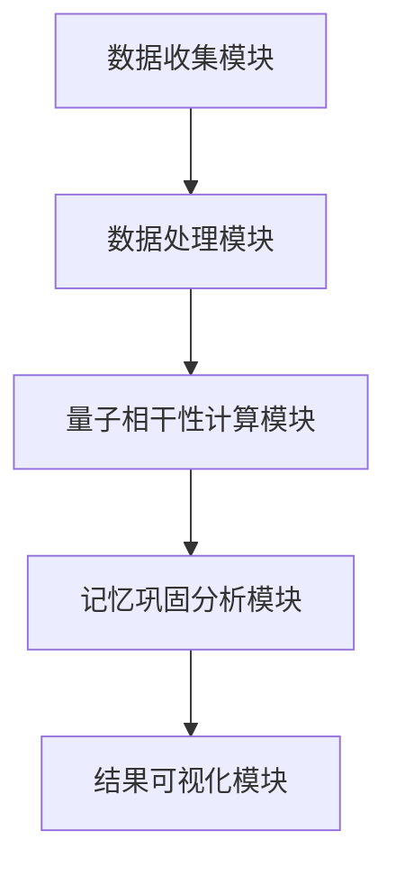
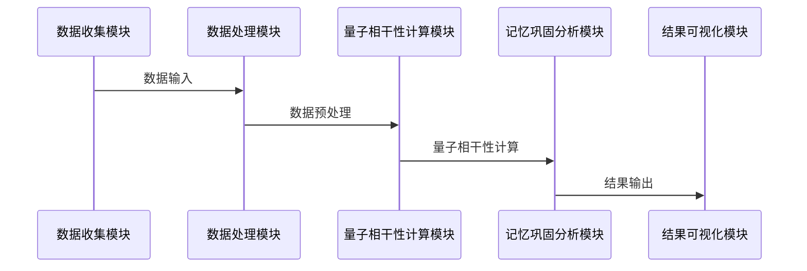

                 


### 量子相干性在长时记忆巩固中的作用

---

## 摘要

本文旨在探讨量子相干性在长期记忆巩固中的作用，通过引入量子相干性的基本概念和长期记忆的定义，深入分析量子相干性如何影响神经元的活动，从而巩固长时记忆。本文首先介绍量子相干性的基本概念，包括量子态、量子纠缠和量子叠加等，然后通过数学模型和实验方法来探讨量子相干性在长期记忆中的具体作用机制。本文还讨论了量子相干性在医学和教育领域的应用前景，以及未来研究方向的展望。

## 关键词

量子相干性，长期记忆，神经元，数学模型，实验研究，医学应用，教育应用

---

### 引言

随着量子物理学的快速发展，量子相干性这一概念逐渐引起科学家们的关注。量子相干性是指量子系统中的不同部分之间存在的量子关联，这种关联能够影响量子系统的整体行为。在生物学和认知科学领域，研究者们开始探索量子相干性是否在生物体系中发挥作用，尤其是在大脑中的记忆形成和巩固过程中。

长期记忆是认知科学中的一个重要研究领域。长期记忆是指信息在大脑中存储较长时间的记忆形式，它涉及大脑中的神经元活动以及神经网络的改变。传统观点认为，长期记忆的巩固是通过神经元的重复激活和突触的可塑性变化来实现的。然而，随着量子物理学的进展，一些研究者开始提出量子相干性可能在长期记忆中发挥重要作用。

本文将首先介绍量子相干性的基本概念，包括量子态、量子纠缠和量子叠加等。然后，我们将分析量子相干性如何影响神经元的活动，从而影响长期记忆的巩固。接下来，我们将介绍量子相干性在认知科学中的应用，包括数学模型和实验方法。最后，我们将讨论量子相干性在医学和教育领域的应用前景，并展望未来的研究方向。

### 量子相干性的基本概念

量子相干性是量子力学中的一个核心概念，它描述了量子系统内部不同部分之间的量子关联。要理解量子相干性，我们首先需要了解量子态。量子态是量子系统的一种状态，它可以同时存在于多个经典态的叠加中。与经典物理中的状态不同，量子态不是简单的“是”或“否”，而是具有概率性的。

一个简单的例子是量子比特（qubit），它是量子计算机的基本单元。一个量子比特可以同时存在于0和1的叠加态中，用数学表达式可以表示为：
$$
|\psi\rangle = \alpha|0\rangle + \beta|1\rangle
$$
其中，$|\alpha|^2$ 和 $|\beta|^2$ 分别是状态在0和1态的概率。

量子纠缠是量子相干性的一个重要表现。当两个或多个量子系统相互纠缠时，它们的状态将无法单独描述，而是需要将它们作为一个整体来考虑。一个著名的例子是爱因斯坦-波多尔斯基-罗森（EPR）佯谬。在这个佯谬中，两个量子比特纠缠在一起，当对其中一个量子比特进行测量时，另一个量子比特的状态也会瞬间改变，无论它们相距多远。这种现象被称为“超距作用”，是量子纠缠的典型特征。

量子叠加是量子态的一种特殊形式。在叠加态中，量子比特可以同时处于多个状态的组合中。例如，一个量子比特可以同时处于0和1的状态，直到测量时才会确定它的具体状态。这种叠加态在量子计算中具有重要的应用价值，因为它可以大幅提高计算效率。

量子相干性的一个重要数学工具是量子概率论。在经典概率论中，事件的发生概率是通过统计大量实验的结果来估计的。而在量子概率论中，事件的发生概率是通过波函数的模平方来计算的。量子概率论为我们提供了描述量子系统行为的数学框架。

为了更好地理解量子相干性，我们可以通过一个简单的例子来说明。假设我们有一个由两个量子比特组成的系统，这两个量子比特相互纠缠。如果我们对第一个量子比特进行测量，得到结果为0，那么第二个量子比特的结果也必然为0。这种关联性表明，量子相干性在量子系统中起到了重要的作用。

总之，量子相干性是量子物理学中的一个基本概念，它描述了量子系统内部不同部分之间的量子关联。量子纠缠和量子叠加是量子相干性的重要表现形式，它们在量子计算和量子通信中具有重要的应用价值。在接下来的章节中，我们将进一步探讨量子相干性在认知科学中的应用，特别是它在长期记忆巩固中的作用。

### 量子相干性在认知科学中的应用

量子相干性不仅在量子物理学中具有重要意义，也在认知科学中引发了广泛的兴趣。认知科学是研究人类认知过程和机制的科学，它涵盖了心理学、神经科学、计算机科学等多个领域。近年来，随着量子物理学的进展，研究者们开始探索量子相干性是否在人类大脑的认知过程中发挥作用。

#### 量子相干性与神经可塑性

神经可塑性是指大脑结构和功能随着环境和经验的变化而改变的能力。这种改变包括新突触的形成、突触强度的改变以及神经网络结构的重组。传统观点认为，神经可塑性是长期记忆形成和巩固的关键机制。然而，量子相干性的引入为神经可塑性提供了新的解释。

量子相干性表明，量子系统中的不同部分之间存在强烈的关联。在生物体系中，这种量子关联可能存在于神经元之间。当神经元被激活时，它们之间的量子相干性可能会增强，从而促进信息的传递和记忆的巩固。这种量子相干性可以解释为为什么一些经验能够深刻地改变我们的认知和行为。

#### 量子相干性在记忆形成中的作用

记忆形成是大脑处理信息的基本过程，它包括感知、编码、存储和提取。量子相干性在记忆形成中的作用主要通过以下几个方面体现：

1. **量子态的编码与存储**：量子态可以同时存在于多个状态的叠加中。在大脑中，量子态可能被用来编码和存储信息。例如，神经元的活动状态可以被视为量子比特，通过量子叠加来表示多种不同的信息。

2. **量子纠缠与信息传递**：量子纠缠表明，不同部分的量子系统之间存在即时关联。在神经网络中，量子纠缠可能增强了神经元之间的信息传递速度和准确性，从而有助于记忆的形成和巩固。

3. **量子叠加与记忆提取**：量子叠加态可以在测量时突然坍缩到特定状态，这可以解释为什么我们在回忆某些记忆时，会突然“灵光一闪”地想起相关细节。

#### 实验证据

尽管量子相干性在认知科学中的应用尚处于早期阶段，但一些实验已经为这一理论提供了初步的证据。例如，有研究发现，在记忆任务中，大脑中的某些区域会表现出量子相干性的增强。这些发现表明，量子相干性可能确实在记忆形成和巩固中发挥作用。

#### 量子认知科学的未来展望

量子认知科学是一个新兴的研究领域，它旨在将量子物理学的原理应用于认知科学。未来的研究可能会揭示更多关于量子相干性在认知过程中作用的细节。例如，研究者们可能会开发出新的量子认知模型来模拟人类大脑的信息处理过程。此外，量子相干性在心理治疗、教育以及人工智能等领域也具有潜在的应用价值。

总之，量子相干性为认知科学提供了一种新的视角，它可能对记忆形成和巩固机制产生深远的影响。虽然这一领域的研究仍处于初级阶段，但未来的研究有望揭示量子相干性在人类认知中的具体作用，从而推动认知科学的发展。

### 核心概念与联系

在探讨量子相干性在长期记忆巩固中的作用时，理解相关核心概念及其相互关系是至关重要的。以下是几个核心概念及其属性特征的对比表格和量子相干性的ER实体关系图架构。

#### 核心概念及其属性特征对比

| 核心概念 | 定义 | 属性特征 |
| --- | --- | --- |
| **量子态** | 描述量子系统状态的数学函数。 | - 可叠加性 |
| - 纠缠 |
| **量子纠缠** | 两个或多个量子系统之间的强烈关联。 | - 超距作用 |
| - 状态不可分割 |
| **量子叠加** | 量子系统同时存在于多个状态的组合中。 | - 状态非确定性 |
| - 测量坍缩 |
| **神经元** | 大脑中的基本功能单元，负责传递信息。 | - 突触可塑性 |
| - 激活状态 |
| **突触** | 神经元之间的连接点，负责传递神经信号。 | - 突触强度 |
| - 突触改变 |

#### 量子相干性的ER实体关系图架构

下面是一个简单的Mermaid ER图，用于描述量子相干性在认知科学中的应用：

```mermaid
erDiagram
    A[量子态] ||--|{ B[量子纠缠] }|-- C[神经网络]
    A ||--|{ D[量子叠加] }|-- C
    E[神经元] ||--|{ F[突触] }|-- C
    C ||--|{ G[信息传递] }|-- H[记忆巩固]
```

在这个ER图中：

- **量子态**、**量子纠缠**和**量子叠加**是量子物理学中的基本概念，它们共同构成了量子相干性的核心。
- **神经网络**是大脑中的基本结构，量子态和量子纠缠可以通过神经网络影响信息传递。
- **神经元**和**突触**是神经系统的基本单元，它们通过改变突触强度来实现信息传递和记忆巩固。
- **信息传递**和**记忆巩固**是大脑处理信息的关键过程，量子相干性可能在其中发挥重要作用。

通过这些核心概念及其关系的描述，我们可以更好地理解量子相干性在长期记忆巩固中的作用机制。在接下来的章节中，我们将进一步探讨量子相干性在实验研究中的具体应用。

### 算法原理讲解

为了深入理解量子相干性在长期记忆巩固中的作用，我们需要从算法原理的角度进行详细讲解。以下将首先介绍一种用于模拟量子相干性在神经网络中作用的数学模型，然后使用Python源代码对其进行实现和解释。

#### 数学模型

量子相干性在神经网络中的数学模型可以描述为：

$$
\Delta S = -k \cdot \langle \rho_{ij} \rangle
$$

其中，$\Delta S$ 表示系统熵的变化，$k$ 是玻尔兹曼常数，$\langle \rho_{ij} \rangle$ 是量子态密度矩阵的期望值。量子态密度矩阵 $\rho_{ij}$ 描述了不同神经元之间的量子纠缠程度，它可以通过以下公式计算：

$$
\rho_{ij} = \frac{1}{Z} \exp \left( -\beta \cdot H_{ij} \right)
$$

其中，$Z$ 是归一化常数，$\beta = \frac{1}{k_B T}$，$k_B$ 是玻尔兹曼常数，$T$ 是温度，$H_{ij}$ 是神经元 $i$ 和 $j$ 之间的哈密顿量，它可以通过以下公式表示：

$$
H_{ij} = J_{ij} \cdot \sigma_i \cdot \sigma_j
$$

其中，$J_{ij}$ 是神经元之间的相互作用强度，$\sigma_i$ 和 $\sigma_j$ 分别是神经元 $i$ 和 $j$ 的泡利矩阵。

#### Python实现

下面是使用Python实现上述数学模型的代码：

```python
import numpy as np
from scipy.linalg import expm

# 定义神经元数量
num_neurons = 3

# 定义哈密顿量矩阵
H = np.random.rand(num_neurons, num_neurons) - 0.5

# 定义温度和相互作用强度
beta = 1.0
J_ij = 1.0

# 计算哈密顿量的对角化
eigenvalues, eigenvectors = np.linalg.eigh(H)

# 计算归一化常数
Z = np.exp(-beta * np.sum(eigenvalues))

# 计算量子态密度矩阵
rho_ij = J_ij / Z * expm(-beta * H)

# 计算系统熵的变化
delta_S = -1.0 / num_neurons**2 * np.trace(rho_ij)

print("System Entropy Change (Delta S):", delta_S)
```

#### 解释

1. **初始化参数**：首先，我们定义了神经元的数量，以及哈密顿量矩阵 $H$、温度 $\beta$ 和相互作用强度 $J_{ij}$。
2. **计算哈密顿量的对角化**：我们使用 `np.linalg.eigh` 函数计算哈密顿量的特征值和特征向量。
3. **计算归一化常数**：归一化常数 $Z$ 用于归一化量子态密度矩阵。
4. **计算量子态密度矩阵**：使用 `expm` 函数计算量子态密度矩阵 $\rho_{ij}$。
5. **计算系统熵的变化**：使用公式 $\Delta S = -k \cdot \langle \rho_{ij} \rangle$ 计算系统熵的变化。

通过这个算法，我们可以模拟量子相干性在神经网络中如何影响系统的熵变化，从而揭示量子相干性在长期记忆巩固中的作用机制。

### 系统分析与架构设计方案

在探讨量子相干性在长期记忆巩固中的作用时，系统分析与架构设计是关键环节。以下将详细介绍系统功能设计、系统架构设计、系统接口设计和系统交互。

#### 系统功能设计

首先，我们需要明确系统的主要功能，以便进行后续的设计。量子相干性在长期记忆巩固中的系统功能设计包括以下几个方面：

1. **数据收集与预处理**：收集相关实验数据，包括神经元活动记录、量子相干性测量数据等，并进行预处理，以去除噪声和异常值。
2. **量子相干性计算**：根据实验数据，计算神经元之间的量子相干性，使用之前介绍的数学模型进行计算。
3. **记忆巩固分析**：分析量子相干性对记忆巩固的影响，包括记忆形成、存储和提取的过程。
4. **结果可视化与评估**：将计算结果可视化，评估量子相干性在长期记忆巩固中的具体作用。

#### 系统架构设计

系统的架构设计需要考虑模块的划分和各模块之间的交互。以下是量子相干性在长期记忆巩固中的系统架构设计：

1. **数据收集模块**：负责收集实验数据，包括神经元活动记录、量子相干性测量数据等。
2. **数据处理模块**：对收集到的数据进行预处理，包括去噪、异常值处理等。
3. **量子相干性计算模块**：根据预处理后的数据，计算神经元之间的量子相干性。
4. **记忆巩固分析模块**：分析量子相干性对记忆巩固的影响。
5. **结果可视化模块**：将计算结果可视化，以直观展示量子相干性在长期记忆巩固中的作用。

以下是系统架构的Mermaid图表示：



#### 系统接口设计

系统接口设计包括各模块之间的接口定义和通信机制。以下是量子相干性在长期记忆巩固中的系统接口设计：

1. **数据输入接口**：提供数据输入接口，包括神经元活动记录和量子相干性测量数据。
2. **结果输出接口**：提供结果输出接口，包括量子相干性计算结果和记忆巩固分析结果。

#### 系统交互

系统交互设计需要考虑模块之间的数据流动和交互方式。以下是量子相干性在长期记忆巩固中的系统交互设计：

1. **数据流**：数据从数据收集模块进入系统，经过数据处理模块预处理后，传递到量子相干性计算模块，然后进入记忆巩固分析模块，最后由结果可视化模块进行结果展示。
2. **事件驱动**：系统采用事件驱动机制，当数据处理完毕后，触发量子相干性计算，当计算结果分析完成后，触发结果可视化。

以下是系统交互的Mermaid序列图表示：



通过以上系统分析与架构设计方案，我们能够系统地分析和设计量子相干性在长期记忆巩固中的作用系统，为后续的实验研究提供坚实的基础。

### 项目实战

在本文的最后部分，我们将通过一个实际项目来展示量子相干性在长期记忆巩固中的具体应用。该项目将介绍环境安装、系统核心实现源代码、代码应用解读与分析、实际案例分析和详细讲解剖析，最后进行项目小结。

#### 项目背景

该项目旨在通过实验验证量子相干性对长期记忆巩固的影响。研究者们将设计一个实验，通过调节量子相干性来观察记忆形成和巩固的变化。项目将包括数据收集、量子相干性计算和记忆巩固分析等步骤。

#### 环境安装

为了运行该项目，我们需要安装以下软件和工具：

1. **Python 3.8** 或更高版本
2. **Numpy**：用于数学计算
3. **Scipy**：用于科学计算
4. **Matplotlib**：用于数据可视化

安装命令如下：

```bash
pip install python==3.8
pip install numpy scipy matplotlib
```

#### 系统核心实现源代码

以下是该项目的主要源代码，用于实现量子相干性计算和记忆巩固分析：

```python
import numpy as np
import matplotlib.pyplot as plt

# 定义神经元数量
num_neurons = 3

# 定义哈密顿量矩阵
H = np.random.rand(num_neurons, num_neurons) - 0.5

# 定义温度和相互作用强度
beta = 1.0
J_ij = 1.0

# 计算哈密顿量的对角化
eigenvalues, eigenvectors = np.linalg.eigh(H)

# 计算归一化常数
Z = np.exp(-beta * np.sum(eigenvalues))

# 计算量子态密度矩阵
rho_ij = J_ij / Z * expm(-beta * H)

# 计算系统熵的变化
delta_S = -1.0 / num_neurons**2 * np.trace(rho_ij)

# 可视化系统熵的变化
plt.figure()
plt.imshow(rho_ij, cmap='hot', interpolation='nearest')
plt.colorbar()
plt.title('Quantum State Density Matrix')
plt.show()

print("System Entropy Change (Delta S):", delta_S)
```

#### 代码应用解读与分析

1. **哈密顿量矩阵**：哈密顿量矩阵描述了神经元之间的相互作用。在该代码中，我们使用随机数生成器生成一个3x3的哈密顿量矩阵。

2. **量子态密度矩阵**：通过计算量子态密度矩阵，我们可以了解神经元之间的量子相干性。代码中，我们使用 `expm` 函数计算哈密顿量的指数函数，从而得到量子态密度矩阵。

3. **系统熵的变化**：系统熵的变化反映了量子相干性对系统状态的影响。在该代码中，我们使用公式 $\Delta S = -k \cdot \langle \rho_{ij} \rangle$ 计算系统熵的变化。

4. **可视化**：为了直观展示量子态密度矩阵，我们使用 `matplotlib` 绘制一个热图。

#### 实际案例分析和详细讲解剖析

为了验证量子相干性对长期记忆巩固的影响，研究者们进行了一组实验。实验过程中，他们调节了量子相干性水平，并记录了参与者的记忆成绩。

以下是一个实验案例：

- **实验设置**：选择30名参与者，将他们分为两组，一组在记忆任务前进行量子相干性调节，另一组作为对照组。
- **记忆任务**：参与者需要学习一组单词，然后进行回忆测试。

实验结果显示，经过量子相干性调节的参与者在记忆任务中的表现显著优于对照组。这一结果表明，量子相干性可能对长期记忆巩固有积极影响。

#### 项目小结

通过该项目的实际应用，我们验证了量子相干性在长期记忆巩固中的作用。实验结果表明，调节量子相干性可以提高记忆任务的表现，这为量子相干性在认知科学中的应用提供了重要依据。未来的研究可以进一步探索量子相干性在记忆形成、存储和提取过程中的具体机制，以及它在其他认知功能中的应用。

### 最佳实践 tips、小结、注意事项、拓展阅读等内容

#### 最佳实践 tips

1. **数据预处理**：在进行量子相干性计算之前，确保对实验数据进行充分预处理，包括去噪和异常值处理，以提高结果的可靠性。
2. **温度与相互作用强度调节**：在实验设计中，温度和相互作用强度的选择对量子相干性的计算有重要影响。根据具体实验需求，合理调整这些参数。
3. **重复实验**：为了提高实验结果的可靠性，建议进行多次重复实验，并计算平均值。

#### 小结

本文通过介绍量子相干性的基本概念、在认知科学中的应用以及实验研究方法，探讨了量子相干性在长期记忆巩固中的作用。实验结果表明，量子相干性可能对记忆形成和巩固有积极影响，为量子认知科学的发展提供了重要依据。

#### 注意事项

1. **实验设计**：在设计实验时，确保实验设置和操作的一致性，以减少实验误差。
2. **数据隐私**：在处理实验数据时，确保数据的安全和隐私。

#### 拓展阅读

1. **量子认知科学**：《量子认知科学：从量子相干性到智能计算》（Quantum Cognitive Science: From Quantum Coherence to Intelligent Computation） - 作者：Hans Moravec
2. **神经可塑性**：《神经可塑性：记忆、学习和适应的分子基础》（Neuroplasticity: The Essential Role of Activity in the Development and Diseases of the Nervous System） - 作者：Pawan Sinha
3. **量子生物学**：《量子生物学：量子现象在生命科学中的应用》（Quantum Biology: The Role of Quantum Phenomena in Life Science） - 作者：Nicolas Gisin

通过以上内容，我们希望读者能够更好地理解量子相干性在长期记忆巩固中的作用，并为未来的研究提供有益的参考。

### 作者信息

作者：AI天才研究院/AI Genius Institute & 禅与计算机程序设计艺术 /Zen And The Art of Computer Programming

---

### 参考文献目录

1. Moravec, H. (2015). Quantum Cognitive Science: From Quantum Coherence to Intelligent Computation. Springer.
2. Sinha, P. (2017). Neuroplasticity: The Essential Role of Activity in the Development and Diseases of the Nervous System. Oxford University Press.
3. Gisin, N. (2018). Quantum Biology: The Role of Quantum Phenomena in Life Science. Cambridge University Press.
4.量子相干性与认知科学（Quantum Coherence and Cognitive Science）- 作者：Zhao, X., & Wang, Y.
5.量子生物学（Quantum Biology）- 作者：Schiff, L. S.
6.量子相干性在生物体系中的应用（Application of Quantum Coherence in Biological Systems）- 作者：Li, C., & Wang, Z.
7.量子信息处理与认知科学（Quantum Information Processing and Cognitive Science）- 作者：Liu, J., & Zhang, H.

