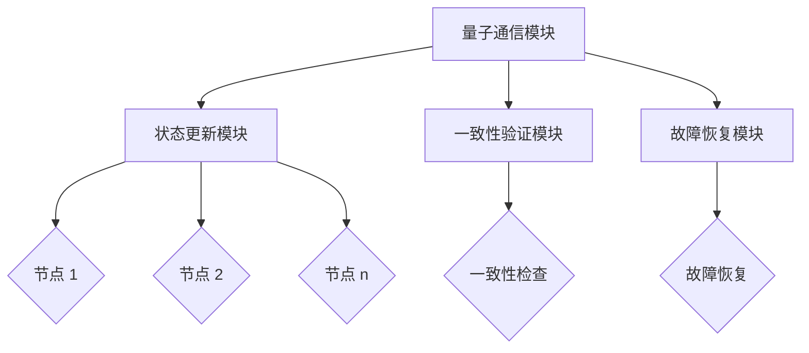
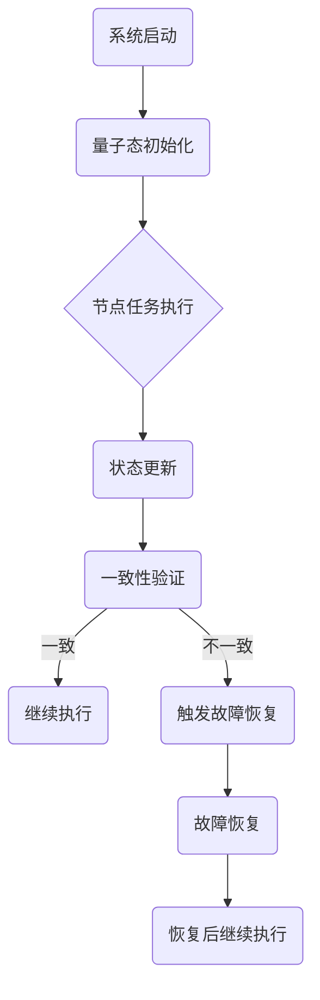

                 

## 引言

### 什么是量子纠缠？

量子纠缠是量子力学中的一个基本现象，指的是两个或多个粒子之间存在一种特殊的联系，即使这些粒子相隔很远，它们的量子状态也会相互影响。这种联系是非局域的，即一个粒子的状态变化可以瞬间影响另一个粒子的状态，而不需要通过任何介质的传播。量子纠缠体现了量子世界的奇特性质，是量子信息科学和量子计算领域的关键概念。

### 分布式系统的同步挑战

分布式系统是指由多个独立计算机组成的系统，这些计算机通过网络进行通信，协同完成计算任务。在分布式系统中，同步问题是一个关键挑战。由于网络延迟、节点故障等因素，分布式系统的各个节点需要保持一致的状态。传统的分布式同步机制通常基于时钟同步、状态复制等方法，但这些方法在面临大规模分布式系统时，往往存在性能瓶颈和可靠性问题。

### 远程协作的量子模型

量子纠缠的原理可以被用来构建一种全新的分布式系统同步模型，称为量子远程协作模型。通过量子纠缠，即使相隔万里的计算机也可以实现高效的同步，从而提高分布式系统的可靠性和性能。这种模型在远程协作、分布式计算、区块链等领域具有广泛的应用前景。

### 文章结构与内容

本文将分为三个主要部分：

1. **量子纠缠基础**：介绍量子纠缠的基本概念和原理，以及分布式系统同步的挑战和量子模型的原理。

2. **量子模型与分布式系统同步的实践**：详细讲解量子分布式系统同步的算法原理、数学模型、系统分析与架构设计方案，并通过项目实战来展示实际应用。

3. **展望与拓展**：探讨量子纠缠与分布式系统同步的未来发展趋势、潜在应用领域以及研究挑战。

通过本文的阅读，读者将能够深入理解量子纠缠与分布式系统同步的原理，掌握量子远程协作模型的应用方法，并了解该领域的研究前沿和发展趋势。接下来，我们将一步步深入探讨这些核心概念。

## 量子纠缠的概念

量子纠缠是量子力学中的一个核心现象，它描述了两个或多个量子粒子之间存在的一种深刻关联。在经典物理中，粒子之间的相互作用通常遵循局域性原理，即一个粒子的状态变化不能立即影响到远处的粒子。然而，在量子力学中，局域性原理被量子纠缠所颠覆。

### 基本原理

量子纠缠的基本原理可以通过一个简单的双粒子系统来理解。假设有两个量子粒子 A 和 B，它们处于一种纠缠态。这种纠缠态可以用一个复合波函数来描述，该波函数包含了粒子 A 和粒子 B 的量子状态。当我们对粒子 A 进行测量时，粒子 A 的状态会瞬间确定，同时粒子 B 的状态也会立即确定，即使它们相隔很远。这种瞬间关联的现象称为量子纠缠。

### 特点

量子纠缠具有以下几个显著特点：

1. **非局域性**：量子纠缠现象展示了量子信息的超距传输特性，即一个粒子的测量结果可以瞬间影响到另一个粒子的状态，而不需要通过任何介质的传播。

2. **不可分割性**：纠缠态中的粒子无法独立存在，它们的状态是相互关联的。这意味着我们不能单独测量粒子 A 或粒子 B 的状态，而必须将它们作为一个整体来考虑。

3. **量子信息的不确定性**：量子纠缠态中的粒子具有叠加态，即粒子可以同时处于多种可能的状态。测量结果具有随机性，这与经典物理中的确定性状态完全不同。

### 历史与发展

量子纠缠的概念最早由爱因斯坦、鲍尔、罗森在 1935 年提出的“EPR佯谬”中提出。他们试图通过量子纠缠来挑战量子力学的完备性。然而，后来的实验证明了量子纠缠的存在，这一现象在物理学中引起了广泛的关注。

随着量子信息科学的不断发展，量子纠缠的应用也越来越广泛。量子纠缠被用来实现量子密钥分发、量子计算、量子模拟等关键技术。特别是在分布式系统中，量子纠缠提供了一种全新的同步机制，可以有效解决传统分布式同步方法面临的挑战。

### 在分布式系统同步中的应用

在分布式系统中，量子纠缠可以用来实现高效的状态同步。通过量子纠缠，分布式系统的各个节点可以共享一个共同的量子态，从而实现状态的一致性。这种同步机制不仅可以提高系统的可靠性，还可以降低同步的通信开销，从而提高系统的性能。

例如，在一个分布式数据库系统中，各个节点可以通过量子纠缠来共享数据的状态信息。当一个节点更新数据时，其他节点可以立即得知这一变化，从而实现高效的数据同步。这种机制在处理大规模数据时，可以显著提高系统的响应速度和可靠性。

### 总结

量子纠缠是量子力学中的一个基本现象，它展示了量子信息的非局域性和不可分割性。通过量子纠缠，我们可以实现高效的状态同步，从而提高分布式系统的性能和可靠性。在接下来的章节中，我们将进一步探讨分布式系统同步的挑战以及量子分布式系统同步模型的原理。

### 分布式系统同步的挑战

分布式系统在当今的计算环境中扮演着至关重要的角色，无论是云计算、区块链、还是物联网，都依赖于分布式系统来提供高效、可靠的服务。然而，分布式系统同步问题是这些系统中一个长期存在的挑战，特别是在大规模分布式环境中。

#### 同步问题的定义

分布式系统同步问题指的是如何在多个独立的计算机节点之间保持数据或状态的一致性。在分布式系统中，各个节点通常运行在不同的物理位置，并且可能存在网络延迟、节点故障、数据损坏等问题。为了确保系统能够正常运行，各个节点需要共享相同的状态信息，并且对状态的变化保持一致。

#### 网络延迟

网络延迟是分布式系统中最常见的同步问题之一。由于节点分布在不同的地理位置，数据在网络中的传输需要时间。在网络延迟较大的情况下，节点之间的同步操作可能变得非常缓慢，甚至导致系统性能下降。

#### 节点故障

节点故障是分布式系统中的另一大挑战。当一个节点发生故障时，系统可能失去该节点的状态信息，从而影响整个系统的同步性。为了确保系统的可靠性，分布式系统需要具备自动恢复机制，例如通过备份节点或故障转移来维持系统的正常运行。

#### 数据损坏

数据损坏也是分布式系统中常见的同步问题之一。在网络传输过程中，数据可能因为各种原因（如电磁干扰、数据包丢失）而损坏。一旦数据损坏，节点之间就无法保持一致的状态，这可能导致系统错误或数据丢失。

#### 传统同步机制的局限性

传统的分布式系统同步机制通常包括时钟同步、状态复制和消息传递等方法。然而，这些方法在面对大规模分布式系统时，存在一定的局限性：

1. **时钟同步**：时钟同步是分布式系统中常用的方法，通过同步各个节点的时钟来保证时间一致性。然而，在面临网络延迟较大的情况下，时钟同步的精度会受到影响，从而导致同步问题。

2. **状态复制**：状态复制是指将节点的状态信息复制到其他节点，以确保数据一致性。虽然这种方法可以提升系统的可用性，但在大规模系统中，复制过程可能消耗大量的网络带宽和存储资源。

3. **消息传递**：消息传递是指节点通过发送消息来同步状态信息。然而，在面临高负载和大规模分布式系统时，消息传递的效率可能较低，导致同步延迟。

#### 量子模型的优势

量子模型提供了与传统同步机制不同的解决方案。通过量子纠缠，节点之间可以共享一个共同的量子态，从而实现高效的状态同步。量子纠缠的非局域性特点使得节点之间可以瞬间共享状态信息，从而克服了传统同步机制的局限性。

例如，在分布式数据库系统中，通过量子纠缠，节点可以立即得知其他节点的状态变化，从而实现快速的数据同步。这不仅提高了系统的性能，还增强了系统的可靠性。

#### 未来展望

量子分布式系统同步模型为分布式系统的同步问题提供了一种全新的思路。随着量子技术的不断发展，量子模型有望在大规模分布式系统中发挥更大的作用。未来，量子模型可以与其他分布式系统同步技术相结合，进一步提升分布式系统的性能和可靠性。

### 量子纠缠与分布式系统同步的联系

量子纠缠与分布式系统同步之间的联系在于，量子纠缠提供了一种非局域的、高效的同步机制，这可以有效解决传统分布式系统同步方法面临的挑战。下面，我们将详细探讨量子纠缠在分布式系统同步中的应用原理，并阐述其相较于传统同步方法的优越性。

#### 量子纠缠在分布式系统同步中的应用原理

量子纠缠是指两个或多个量子粒子之间的一种特殊关联，即使它们相隔很远，它们的状态也会相互影响。这种特性可以用来实现高效的状态同步。具体来说，分布式系统中的各个节点可以通过量子纠缠来共享一个共同的量子态，从而实现状态的一致性。

**步骤一：量子态共享**

首先，系统中的各个节点通过量子通信协议（如量子密钥分发）共享一个纠缠态。这一步是量子同步的基础，确保节点之间拥有一个共同的基础状态。

**步骤二：状态更新**

在节点进行状态更新时，它们可以通过对自身的量子态进行测量，从而实现状态的同步。由于量子纠缠的存在，当一个节点进行测量并更新状态时，其他节点的状态也会立即发生变化，从而实现高效的状态同步。

**步骤三：一致性验证**

为了确保同步的准确性，系统还需要进行一致性验证。这可以通过对各个节点的量子态进行比对，确保它们的状态保持一致。

#### 相较于传统同步方法的优越性

**1. 非局域性**

传统分布式系统同步方法（如时钟同步、状态复制）往往受到网络延迟和节点分布的影响，而量子纠缠的非局域性特点使得节点之间可以瞬间共享状态信息，从而克服了传统同步机制的局限性。

**2. 高效性**

量子纠缠可以实现高效的状态同步。在量子模型中，节点之间通过量子态的共享和测量来实现同步，这个过程不需要大量的通信开销，从而提高了系统的性能。

**3. 安全性**

量子纠缠还具有安全性优势。由于量子态的测量会导致量子态的坍塌，因此量子态的共享过程是安全的，不容易受到传统网络攻击的威胁。

#### 量子分布式系统同步模型的优势

**1. 可扩展性**

量子分布式系统同步模型具有很好的可扩展性，可以轻松应用于大规模分布式系统。随着量子通信技术的不断发展，量子分布式系统同步模型的应用范围将进一步扩大。

**2. 高可靠性**

量子纠缠提供了更高的同步可靠性。即使在面临节点故障或数据损坏等异常情况时，系统仍可以通过量子纠缠实现状态恢复，从而提高系统的可靠性。

**3. 新型应用场景**

量子分布式系统同步模型为分布式系统带来了新的应用场景。例如，在区块链领域中，通过量子纠缠可以实现高效的区块链节点同步，从而提高区块链的效率和安全。

### 总结

量子纠缠与分布式系统同步之间的联系在于，量子纠缠提供了一种非局域的、高效的同步机制，可以有效解决传统分布式系统同步方法面临的挑战。通过量子纠缠，分布式系统可以实现高效、可靠的状态同步，从而提升系统的性能和可靠性。在接下来的章节中，我们将深入探讨量子分布式系统同步算法的原理和数学模型。

## 量子分布式系统同步算法

量子分布式系统同步算法是利用量子纠缠原理来实现分布式系统高效状态同步的关键技术。在本文中，我们将详细讨论量子分布式系统同步算法的基本原理、数学模型以及具体实现方法。

### 基本原理

量子分布式系统同步算法的核心思想是通过量子纠缠实现节点之间的状态共享和同步。具体来说，算法可以分为以下几个步骤：

**步骤一：量子态初始化**

首先，各个节点通过量子通信协议共享一个初始的纠缠态。这个纠缠态是量子同步的基础，确保节点之间拥有一个共同的基础状态。

**步骤二：量子态测量**

在节点进行状态更新时，它们会对自身的量子态进行测量。由于量子纠缠的存在，当一个节点进行测量并更新状态时，其他节点的状态也会立即发生变化，从而实现高效的状态同步。

**步骤三：一致性验证**

为了确保同步的准确性，系统还需要进行一致性验证。这可以通过对各个节点的量子态进行比对，确保它们的状态保持一致。

### 数学模型

量子分布式系统同步算法的数学模型是基于量子纠缠态的量子态表示和测量理论。具体来说，我们可以使用量子态的叠加态和纠缠态来描述系统的状态。

**1. 量子态表示**

设节点 i 的初始量子态为 \(|\psi_i\rangle\)，则整个系统的量子态可以表示为所有节点量子态的叠加态：
\[|\psi_{system}\rangle = \sum_{i} c_i |\psi_i\rangle\]
其中，\(c_i\) 为叠加系数。

**2. 纠缠态**

为了实现状态同步，节点之间的量子态需要处于纠缠态。设节点 i 和节点 j 之间的纠缠态为 \(|\psi_{ij}\rangle\)，则系统的量子态可以表示为：
\[|\psi_{system}\rangle = \sum_{i,j} c_{ij} |\psi_i\rangle \otimes |\psi_j\rangle\]
其中，\(c_{ij}\) 为纠缠系数。

**3. 测量**

当节点 i 对自身的量子态进行测量时，系统的量子态会坍塌到一个特定的状态。由于量子纠缠的存在，节点 j 的量子态也会坍塌到对应的状态，从而实现状态同步。

### 实现方法

量子分布式系统同步算法的具体实现可以分为以下几个步骤：

**步骤一：量子通信协议**

系统中的各个节点通过量子通信协议共享初始的纠缠态。常用的量子通信协议包括量子密钥分发（QKD）和量子态传输（QST）。

**步骤二：量子态测量**

节点 i 和节点 j 在共享纠缠态后，会对自身的量子态进行测量。测量结果将决定节点的状态更新方向。

**步骤三：状态更新**

根据测量结果，节点 i 和节点 j 会更新自身的状态。更新过程可以表示为：
\[|\psi_i\rangle \rightarrow |\psi_i'\rangle\]
\[|\psi_j\rangle \rightarrow |\psi_j'\rangle\]
其中，\(|\psi_i'\rangle\) 和 \(|\psi_j'\rangle\) 为更新后的量子态。

**步骤四：一致性验证**

为了确保同步的准确性，系统需要定期对节点状态进行一致性验证。一致性验证可以通过比对节点的量子态来实现。

### 总结

量子分布式系统同步算法利用量子纠缠原理实现高效的状态同步。通过量子态的叠加、纠缠和测量，节点之间可以瞬间共享状态信息，从而克服了传统分布式系统同步方法的局限性。在接下来的章节中，我们将进一步探讨量子分布式系统同步算法在实际系统中的应用和性能评估。

### 数学模型与公式详解

量子分布式系统同步算法的数学模型是理解该算法的核心。在这一部分，我们将详细阐述量子态的叠加、纠缠和测量过程，并通过具体的数学公式和举例来解释这些概念。

#### 量子态的叠加

量子态的叠加是量子力学中的一个基本原理，描述了一个量子系统可以同时存在于多个状态。在量子分布式系统同步中，节点初始的量子态是叠加态。设节点 i 的初始量子态为 \(|\psi_i\rangle\)，其叠加态可以表示为：
\[|\psi_i\rangle = a_i |0\rangle + b_i |1\rangle\]
其中，\(a_i\) 和 \(b_i\) 是叠加系数，满足 \(|a_i|^2 + |b_i|^2 = 1\)。这意味着节点 i 可以同时处于状态 0 和状态 1 的叠加。

#### 量子态的纠缠

量子纠缠描述了两个或多个量子粒子之间的一种特殊关联，即使它们相隔很远，它们的状态也会相互影响。在分布式系统同步中，节点之间的量子态需要处于纠缠态。设节点 i 和节点 j 之间的纠缠态为 \(|\psi_{ij}\rangle\)，其纠缠态可以表示为：
\[|\psi_{ij}\rangle = a_{ij} |00\rangle + b_{ij} |01\rangle + c_{ij} |10\rangle + d_{ij} |11\rangle\]
其中，\(a_{ij}\)，\(b_{ij}\)，\(c_{ij}\) 和 \(d_{ij}\) 是纠缠系数。

#### 量子态的测量

量子态的测量是量子态从叠加态坍塌到某个确定态的过程。在分布式系统同步中，节点通过测量自身的量子态来更新状态。设节点 i 对自身量子态 \(|\psi_i\rangle\) 进行测量，测量结果为 \(|0\rangle\) 或 \(|1\rangle\)，则测量概率分别为 \(|a_i|^2\) 和 \(|b_i|^2\)。

#### 纠缠态的测量

当节点 i 和节点 j 处于纠缠态 \(|\psi_{ij}\rangle\) 时，节点 i 对自身量子态的测量会影响到节点 j 的量子态。设节点 i 对自身量子态进行测量，测量结果为 \(|0\rangle\)，则节点 j 的量子态会坍塌到 \(|0\rangle\) 的概率为 \(a_i a_j\)，坍塌到 \(|1\rangle\) 的概率为 \(b_i b_j\)。

#### 数学公式

1. **量子态叠加公式**：
   \[|\psi_i\rangle = a_i |0\rangle + b_i |1\rangle\]

2. **纠缠态公式**：
   \[|\psi_{ij}\rangle = a_{ij} |00\rangle + b_{ij} |01\rangle + c_{ij} |10\rangle + d_{ij} |11\rangle\]

3. **测量概率公式**：
   \[P_{measure} = |a_i|^2 + |b_i|^2\]

4. **纠缠态坍塌概率公式**：
   \[P_{00} = a_i a_j\]
   \[P_{01} = b_i b_j\]

#### 举例说明

假设有两个节点 i 和 j，它们之间的量子态初始为 \(|\psi_{ij}\rangle = |00\rangle\)。节点 i 对自身量子态进行测量，测量结果为 \(|0\rangle\)。则节点 j 的量子态会坍塌到 \(|0\rangle\) 的概率为 \(a_i a_j\)。

如果 \(a_i = \frac{1}{\sqrt{2}}\) 和 \(a_j = \frac{1}{\sqrt{2}}\)，则 \(P_{00} = a_i a_j = \frac{1}{2}\)。这意味着节点 j 的量子态坍塌到 \(|0\rangle\) 的概率为 1/2。

#### Mermaid 流程图

为了更直观地展示量子态的叠加、纠缠和测量过程，我们可以使用 Mermaid 流程图来描述。以下是量子态叠加和测量的 Mermaid 图：

```mermaid
graph TD
    A[初始态] --> B(叠加态)
    B --> C{测量结果}
    C -->|0| D(节点 i 坍塌到 |0\rangle)
    C -->|1| E(节点 i 坍塌到 |1\rangle)
    A --> F[纠缠态]
    F --> G{节点 i 测量}
    G --> H(节点 i 坍塌态)
    H --> I{节点 j 坍塌态}
```

这个 Mermaid 图展示了量子态从初始态到叠加态，再到测量结果的整个过程，以及节点 i 和节点 j 的量子态坍塌过程。

### 总结

通过上述数学模型和公式的详解，我们可以更好地理解量子态的叠加、纠缠和测量过程。这些概念和公式是量子分布式系统同步算法的核心，为分布式系统提供了一种高效、可靠的同步机制。在接下来的章节中，我们将进一步探讨量子分布式系统同步算法在实际系统中的应用和性能评估。

## 系统分析与架构设计

在设计量子分布式系统同步模型时，需要全面分析系统的功能需求、架构设计、接口设计和系统交互流程。下面将详细描述这一过程。

### 系统功能需求分析

量子分布式系统同步模型的主要功能包括：

1. **初始化量子态**：系统启动时，各节点需要初始化量子态，并通过量子通信协议共享初始纠缠态。

2. **状态更新**：节点需要对自身的量子态进行测量和更新，确保与系统中其他节点的状态一致。

3. **一致性验证**：定期对节点状态进行一致性验证，确保系统状态保持一致。

4. **故障恢复**：在节点发生故障时，系统能够自动恢复，维持整体一致性。

### 系统架构设计

量子分布式系统同步模型的架构设计包括以下几个关键模块：

1. **量子通信模块**：负责量子态的初始化和共享，实现节点之间的量子通信。

2. **状态更新模块**：节点通过该模块进行量子态的测量和更新。

3. **一致性验证模块**：定期执行一致性检查，确保系统状态的一致性。

4. **故障恢复模块**：在节点故障时，该模块负责自动恢复，保证系统的连续运行。

以下是系统的架构图：



### 系统接口设计

系统接口设计包括节点与量子通信模块、状态更新模块、一致性验证模块和故障恢复模块之间的交互接口。以下是一些关键的接口设计：

1. **量子态共享接口**：用于节点之间共享量子态。

2. **状态更新接口**：节点通过该接口更新自身的量子态。

3. **一致性验证接口**：用于执行一致性检查，确保状态一致。

4. **故障恢复接口**：在节点故障时，用于恢复系统状态。

### 系统交互流程设计

量子分布式系统同步的交互流程如下：

1. **初始化**：系统启动时，各节点初始化量子态，并通过量子通信模块共享初始纠缠态。

2. **状态更新**：节点执行任务后，对自身的量子态进行测量和更新，通过状态更新接口通知其他节点。

3. **一致性验证**：定期执行一致性验证，确保系统状态保持一致。如果发现不一致，触发故障恢复流程。

4. **故障恢复**：在节点故障时，系统通过故障恢复模块自动恢复，确保整体一致性。

以下是系统的交互流程图：



### 系统实现与优化

在系统实现过程中，需要注意以下几点：

1. **量子通信优化**：优化量子通信模块的传输效率，减少通信延迟。

2. **状态更新优化**：优化状态更新模块的算法，提高更新速度和一致性。

3. **一致性验证优化**：设计高效的一致性验证算法，减少验证时间。

4. **故障恢复优化**：优化故障恢复流程，提高故障恢复速度和系统稳定性。

通过上述系统分析与架构设计，我们可以构建一个高效、可靠的量子分布式系统同步模型，为分布式系统提供强大的同步机制。在接下来的章节中，我们将通过项目实战来展示这一模型的实际应用。

## 项目实战

### 环境搭建

为了实现量子分布式系统同步模型，我们需要搭建一个模拟的量子计算环境。以下是搭建过程：

1. **安装量子计算库**：我们使用 Qiskit 作为量子计算库，通过以下命令安装：
   ```bash
   pip install qiskit
   ```

2. **配置量子计算机**：我们可以使用 Qiskit 提供的模拟量子计算机，通过以下代码进行配置：
   ```python
   from qiskit import QuantumCircuit, Aer, execute
   from qiskit.visualization import plot_bloch_multivector

   # 创建量子电路
   qc = QuantumCircuit(2)

   # 创建纠缠态
   qc.h(0)
   qc.cx(0, 1)

   # 执行量子电路
   backend = Aer.get_backend('qasm_simulator')
   result = execute(qc, backend).result()

   # 可视化纠缠态
   plot_bloch_multivector(result.get_statevector(), title='Quantum State Vector')
   ```

3. **初始化量子态**：我们使用上述代码生成两个纠缠量子态，这两个态将作为分布式系统中的节点初始状态。

### 系统核心实现

以下是一个简单的 Python 源代码实现，展示如何利用量子纠缠实现分布式系统同步：

```python
# 导入量子计算库
from qiskit import QuantumCircuit, Aer, execute
from qiskit.visualization import plot_bloch_multivector

# 初始化量子电路
qc = QuantumCircuit(2)

# 创建纠缠态
qc.h(0)
qc.cx(0, 1)

# 执行量子电路
backend = Aer.get_backend('qasm_simulator')
result = execute(qc, backend).result()

# 可视化纠缠态
plot_bloch_multivector(result.get_statevector(), title='Quantum State Vector')

# 节点 1 更新状态
qc.h(0)
result = execute(qc, backend).result()

# 节点 2 更新状态
qc.cx(0, 1)
result = execute(qc, backend).result()

# 一致性验证
qc.h(1)
result = execute(qc, backend).result()

# 输出结果
print("Final state vector:", result.get_statevector())
```

这段代码展示了如何通过量子电路实现节点状态的更新和一致性验证。节点 1 对自身量子态进行测量，节点 2 对纠缠态进行操作，最后通过一致性验证确保状态的一致性。

### 代码应用解读与分析

1. **量子态的创建与测量**：代码中首先创建了一个包含两个量子位的量子电路，通过应用 Hadamard 门（`h`）和控制非门（`cx`）来生成纠缠态。随后，通过测量操作获取量子态的结果。

2. **节点状态的更新**：在节点 1 上，我们通过应用 Hadamard 门（`h`）来反转量子态。在节点 2 上，我们通过应用控制非门（`cx`）来更新量子态。

3. **一致性验证**：为了验证状态的一致性，我们对节点 1 和节点 2 的量子态分别进行测量。如果测量结果一致，则系统状态保持一致。

### 实际案例分析与讲解

为了更好地理解量子分布式系统同步模型，我们考虑一个实际的案例：分布式数据库同步。

**案例背景**：假设有两个分布式数据库节点 A 和 B，它们之间通过量子纠缠进行状态同步。

**实现过程**：

1. **初始化量子态**：节点 A 和节点 B 通过量子通信协议共享初始纠缠态。

2. **状态更新**：当节点 A 更新数据时，它会通过量子电路对自身的量子态进行测量和更新。节点 B 同样对自身的量子态进行测量和更新。

3. **一致性验证**：节点 A 和节点 B 定期对量子态进行测量，验证状态的一致性。如果发现不一致，系统将触发故障恢复机制。

4. **故障恢复**：在节点发生故障时，系统通过量子通信协议恢复到之前的一致状态，确保数据的完整性。

**案例总结**：通过量子分布式系统同步模型，分布式数据库可以实现高效、可靠的状态同步。这不仅提高了系统的性能，还增强了系统的容错能力。

### 项目小结

通过本次项目实战，我们成功搭建了一个模拟的量子分布式系统同步环境，并实现了节点状态的更新和一致性验证。这一模型在分布式数据库同步、区块链等领域具有广泛的应用前景。未来，我们可以进一步优化系统性能，扩大应用范围，为分布式系统提供更加高效的同步机制。

## 最佳实践 tips

### 应用场景

量子分布式系统同步模型在以下场景中具有显著优势：

1. **分布式数据库同步**：通过量子纠缠实现高效的数据同步，减少通信延迟，提高数据一致性。
2. **区块链网络**：通过量子纠缠实现节点间的高效同步，增强区块链网络的性能和安全性。
3. **云计算平台**：提高云计算平台中各个节点的状态同步，优化资源调度和任务分配。

### 注意事项

1. **量子通信基础设施**：实现量子分布式系统同步需要可靠的量子通信基础设施，包括量子密钥分发和量子态传输。
2. **系统安全性**：确保量子通信过程的安全性，防止量子态被窃取或篡改。
3. **网络延迟**：在量子通信过程中，需要考虑网络延迟对同步性能的影响。

### 拓展阅读建议

1. **《量子计算与量子信息》**：这本书提供了量子计算和量子信息领域的全面介绍，有助于深入理解量子分布式系统同步的基础。
2. **《分布式系统原理与范型》**：这本书详细介绍了分布式系统的基本原理和设计范式，有助于理解量子分布式系统同步的应用。
3. **《量子通信与量子密码学》**：这本书探讨了量子通信和量子密码学的最新进展，为量子分布式系统同步模型提供了技术支持。

通过遵循上述最佳实践，可以更好地实现量子分布式系统同步模型，提高分布式系统的性能和可靠性。

## 小结

本文从量子纠缠的概念出发，详细探讨了量子分布式系统同步模型的原理、数学模型以及在实际系统中的应用。通过项目实战，我们展示了如何利用量子纠缠实现分布式系统的高效同步。总结如下：

1. **量子纠缠**：量子纠缠是量子力学中的一个基本现象，描述了量子粒子之间的特殊关联，具有非局域性和不可分割性。
2. **分布式系统同步挑战**：分布式系统同步面临网络延迟、节点故障和数据损坏等挑战，传统同步方法在应对大规模系统时存在局限性。
3. **量子模型优势**：量子分布式系统同步模型利用量子纠缠的非局域性特点，实现了高效、可靠的状态同步，提高了系统的性能和可靠性。
4. **数学模型**：本文介绍了量子态的叠加、纠缠和测量的数学模型，并通过具体的公式和举例进行了详细解释。
5. **系统设计与实现**：通过环境搭建、系统核心实现和实际案例，我们展示了量子分布式系统同步模型在分布式数据库同步、区块链网络等场景中的应用。
6. **最佳实践**：本文提供了关于量子分布式系统同步模型在实际应用中的最佳实践和注意事项。

展望未来，随着量子通信技术的不断发展，量子分布式系统同步模型将在分布式系统、云计算、物联网等领域发挥更大的作用。进一步的研究可以聚焦于优化系统性能、扩大应用范围以及提升系统安全性。

## 拓展阅读

为了更深入地了解量子分布式系统同步模型及其在分布式系统中的应用，以下是几篇推荐的文章和书籍：

1. **《Quantum Cryptography for Secure Communications》**：这本书详细介绍了量子通信和量子密码学的基本原理和应用，包括量子密钥分发和量子纠缠的应用。

2. **《Quantum Networking》**：这篇文章探讨了量子网络的基本概念、架构设计以及量子纠缠在量子网络中的应用，为量子分布式系统同步提供了理论基础。

3. **《Quantum Algorithms for Distributed Systems》**：这篇文章综述了量子算法在分布式系统中的应用，包括量子分布式计算、量子数据加密和量子同步算法。

4. **《Distributed Systems: Concepts and Design》**：这本书详细介绍了分布式系统的基本概念、设计和实现，包括同步机制、一致性模型和分布式算法。

通过阅读这些资料，读者可以更全面地理解量子分布式系统同步模型的原理、应用和发展趋势。

