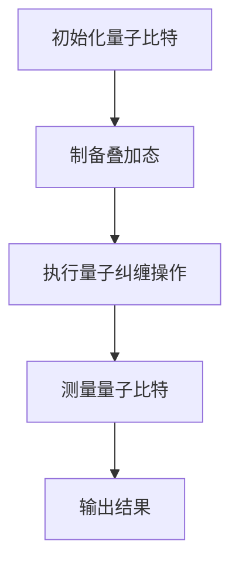
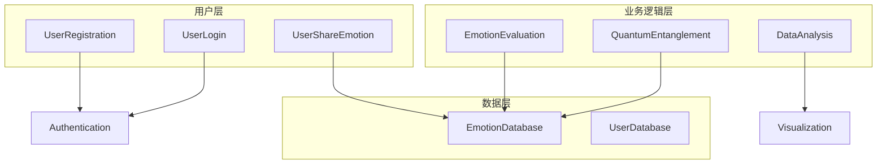
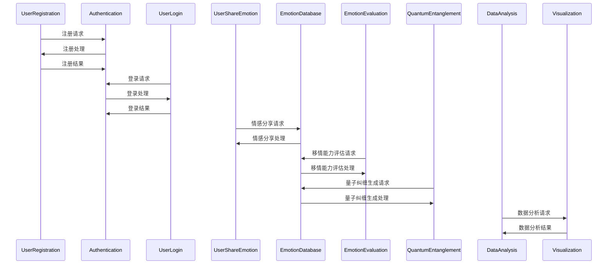

                 


## 《量子纠缠与移情能力的神经基础》

### 关键词

- 量子纠缠
- 移情能力
- 神经基础
- 量子计算
- 神经可塑性

### 摘要

本文将探讨量子纠缠与移情能力的神经基础之间的关联。通过介绍量子纠缠的概念、历史发展以及在量子计算中的应用，我们将揭示其背后的数学原理。同时，我们将深入探讨移情能力的神经基础，包括其定义、类型、神经科学的研究以及神经机制。在此基础上，我们将利用Mermaid流程图展示量子纠缠与神经基础之间的联系，并详细讲解相关算法原理。此外，我们还将描述一个研究问题场景，并设计系统功能模型、架构和接口交互。通过项目实战和实际案例分析，我们将展示如何实现这些算法和系统功能，并提供最佳实践和注意事项。最后，我们将总结文章的关键知识点和实用技巧，并推荐进一步阅读的资料。

## 引言

### 量子纠缠的起源与发展

量子纠缠是量子力学中的一种特殊现象，最早由爱因斯坦、波多尔斯基和罗森（EPR）在1935年提出。他们通过著名的EPR悖论质疑了量子纠缠的存在，认为它违背了局域实在论。然而，1964年约翰·贝尔提出了Bell不等式，并通过一系列实验验证，证实了量子纠缠的真实存在。

量子纠缠的发现开启了量子信息科学的新篇章。量子计算利用量子纠缠实现了量子比特之间的超距作用，大大提高了计算速度和处理能力。量子纠缠在量子通信、量子加密、量子仿真等领域具有广泛应用，成为现代科技的前沿领域。

### 移情能力的神经基础研究背景

移情能力是心理学中重要的概念，指的是个体对他人的情感体验的理解和共鸣能力。移情能力在人类的社会互动、情感交流和心理健康中起着关键作用。然而，移情能力的神经基础尚不明确，一直是神经科学研究的热点问题。

神经科学通过功能性磁共振成像（fMRI）、经颅磁刺激（TMS）等技术，探索了移情能力的神经机制。研究发现，前额叶皮质、奥尔巴赫核等区域在移情过程中发挥着重要作用。同时，神经可塑性也在移情能力的培养和发展中起到了关键作用。

## 第1章 量子纠缠概述

### 1.1 量子纠缠的定义与特性

量子纠缠是指两个或多个量子系统在某种特定的量子态下，它们之间的物理量存在一种特殊的相关性，这种相关性无法用经典物理来解释。

#### 量子态与纠缠态

量子态是量子系统的整体状态，可以用波函数来描述。纠缠态是量子态的一种特殊形式，其中多个量子系统之间的波函数是相互耦合的。

#### 量子纠缠的特性

1. 非局域性：量子纠缠使得量子系统之间的物理量存在超距作用，即一个量子系统的测量可以影响另一个量子系统的状态，无论两者之间的距离多远。
2. 纠缠不可克隆性：量子纠缠态无法被精确克隆，任何对纠缠态的测量都会破坏其纠缠关系。
3. 纠缠不可区分性：纠缠态中的量子系统无法单独识别，它们的状态是相互关联的。

### 1.2 量子纠缠的历史发展

量子纠缠的概念最早由爱因斯坦、波多尔斯基和罗森（EPR）在1935年提出，他们通过EPR悖论质疑了量子纠缠的存在。然而，1964年约翰·贝尔提出了Bell不等式，通过一系列实验验证，证实了量子纠缠的真实存在。

#### 量子力学与量子纠缠的起源

量子力学是研究微观世界物理现象的学科，它提出了波粒二象性、量子态、不确定性原理等基本概念。量子纠缠作为量子力学的一个特殊现象，是量子态叠加和纠缠性的直接体现。

#### 量子纠缠的实验验证

Bell实验是验证量子纠缠的重要手段，通过实验结果违反Bell不等式，证明了量子纠缠的存在。实验方法包括使用光子、电子等微观粒子进行纠缠，并通过测量它们的物理量来验证纠缠关系。

### 1.3 量子纠缠在量子计算中的应用

量子计算是利用量子力学原理进行信息处理的一种新型计算模式。量子纠缠在量子计算中发挥着关键作用，它使得量子比特之间可以实现超距作用，从而实现高效的量子算法。

#### 量子比特与经典比特

量子比特（qubit）是量子计算的基本单元，它可以处于0和1的叠加态。与经典比特不同，量子比特具有量子纠缠和量子叠加的特性。

#### 量子 gates 的作用

量子 gates 是量子计算的基本操作，它对量子比特的叠加态进行变换。量子 gates 利用量子纠缠实现量子比特之间的相互作用，从而实现量子算法的运行。

#### 量子纠缠与量子计算

量子纠缠使得量子比特之间可以实现超距作用，从而实现量子通信和量子隐形传态。量子纠缠在量子计算中发挥了重要作用，使得量子算法具有比经典算法更高的计算速度和处理能力。

## 第2章 移情能力的神经基础

### 2.1 移情能力的定义与类型

移情能力是指个体对他人的情感体验的理解和共鸣能力。它包括真正移情和模拟移情两种类型。

#### 真正移情

真正移情是指个体能够深刻理解他人的情感体验，并产生共鸣。它是一种基于情感共鸣的移情能力，通常需要个体具备较高的情感智商和同理心。

#### 模拟移情

模拟移情是指个体通过想象或模拟他人的情境，来体验和感受他人的情感。它是一种基于想象和模拟的移情能力，通常用于心理学研究和教育训练。

### 2.2 神经科学中的移情能力研究

神经科学通过多种技术手段研究移情能力的神经基础，包括功能性磁共振成像（fMRI）、经颅磁刺激（TMS）等。

#### 神经科学对移情能力的研究方法

1. 功能性磁共振成像（fMRI）：通过观察大脑活动区域的变化，研究移情能力与大脑结构的关系。
2. 经颅磁刺激（TMS）：通过刺激大脑特定区域，观察移情能力的变化，研究移情能力的神经机制。

#### 神经元基础与移情能力

移情能力的神经元基础涉及多个大脑区域，包括前额叶皮质、颞叶皮质、杏仁核等。

- 前额叶皮质：与情感理解、决策和社交行为相关，是移情能力的重要基础。
- 颞叶皮质：与语言理解和情感识别相关，也是移情能力的重要组成部分。
- 杏仁核：与情感体验和情绪反应相关，在移情过程中起到关键作用。

### 2.3 神经机制与移情能力

移情能力的神经机制涉及到多个神经信号传递途径和神经递质的调节。

#### 神经可塑性

神经可塑性是指神经元和神经网络在结构和功能上的可塑性和适应性。它对移情能力的培养和发展至关重要。

- 神经突触的可塑性：通过改变突触的连接和传递效率，实现移情能力的提高。
- 神经元的活动模式：通过调节神经元的活动模式，实现移情能力的调节和优化。

#### 神经递质与移情能力

神经递质是神经元之间传递信息的化学物质，对移情能力具有调节作用。

- 多巴胺：与愉悦和奖励相关，参与情感体验和社交行为的调节。
- 去甲肾上腺素：与兴奋和警觉相关，影响情感体验和情绪反应。

### 2.4 移情能力的培养与发展

移情能力的培养和发展需要多种途径，包括教育、心理治疗和社交互动等。

#### 教育与训练

教育是培养移情能力的重要途径，通过情感教育、社交技能培训和道德教育，可以提高个体的移情能力。

#### 心理治疗

心理治疗是改善移情能力的有效方法，通过认知行为疗法、情感聚焦疗法等，可以帮助个体理解和调节自己的情感，提高移情能力。

#### 社交互动

社交互动是提高移情能力的重要途径，通过与他人的交流和互动，个体可以学习和理解他人的情感体验，培养移情能力。

## 第3章 量子纠缠与神经科学的联系

### 3.1 量子纠缠在神经科学中的应用

量子纠缠在神经科学中具有重要的应用价值，它为研究大脑功能和神经机制提供了新的工具和方法。

#### 量子纠缠与大脑功能

量子纠缠现象在大脑神经元之间的相互作用中可能存在，它为研究大脑功能提供了新的视角。通过研究量子纠缠现象，可以深入了解大脑的信息处理和通信机制。

#### 量子纠缠与神经可塑性

神经可塑性是大脑功能适应环境变化的重要机制，而量子纠缠现象可能参与了这一过程。通过研究量子纠缠与神经可塑性的关系，可以揭示大脑适应环境变化的神经机制。

### 3.2 量子纠缠与神经可塑性

神经可塑性是指大脑神经元和神经网络在结构和功能上的可塑性和适应性。量子纠缠现象可能参与了神经可塑性的调节。

#### 量子纠缠与神经元连接

量子纠缠现象可能存在于神经元之间的连接中，它可以通过调节神经元连接的效率和稳定性，影响神经可塑性。

#### 量子纠缠与突触可塑性

突触可塑性是神经可塑性的重要组成部分，量子纠缠现象可能参与了突触连接和传递效率的调节。通过研究量子纠缠与突触可塑性的关系，可以揭示神经可塑性的分子机制。

### 3.3 量子纠缠与认知功能

认知功能是大脑的高级功能，包括注意力、记忆、决策等。量子纠缠现象可能对认知功能具有调节作用。

#### 量子纠缠与注意力

注意力是认知功能的核心，量子纠缠现象可能参与了注意力的调节和分配。通过研究量子纠缠与注意力的关系，可以揭示注意力机制的新机制。

#### 量子纠缠与记忆

记忆是认知功能的重要组成部分，量子纠缠现象可能参与了记忆的编码、存储和提取过程。通过研究量子纠缠与记忆的关系，可以深入了解记忆机制的新机制。

### 3.4 量子纠缠与社交行为

社交行为是人类的本质特征，量子纠缠现象可能对社交行为具有调节作用。

#### 量子纠缠与移情能力

移情能力是社交行为的重要基础，量子纠缠现象可能参与了移情能力的调节。通过研究量子纠缠与移情能力的关系，可以揭示社交行为的神经机制。

#### 量子纠缠与社交互动

社交互动是提高移情能力和社交能力的重要途径，量子纠缠现象可能参与了社交互动的调节。通过研究量子纠缠与社交互动的关系，可以探索社交行为的神经基础。

## 第4章 算法原理与实现

### 4.1 量子纠缠算法的数学模型

量子纠缠算法的核心是量子态的制备和操控。以下是一个简单的量子纠缠算法的数学模型：

$$
|\psi\rangle = \frac{1}{\sqrt{2}} (|0\rangle_A \otimes |0\rangle_B + |1\rangle_A \otimes |1\rangle_B)
$$

其中，$|0\rangle$和$|1\rangle$分别表示量子比特的基态和叠加态，$A$和$B$分别表示两个量子比特。$\otimes$表示量子态的张量积。

### 4.2 使用Mermaid画出算法流程图

以下是一个简单的Mermaid流程图，用于描述量子纠缠算法的流程：



### 4.3 Python源代码：量子纠缠算法实现

以下是一个简单的Python代码，用于实现量子纠缠算法：

```python
from qiskit import QuantumCircuit, execute, Aer

# 初始化量子比特
qc = QuantumCircuit(2)

# 制备叠加态
qc.h(0)
qc.h(1)

# 执行量子纠缠操作
qc.cx(0, 1)

# 测量量子比特
qc.measure_all()

# 运行模拟器
sim = Aer.get_backend('qasm_simulator')
job = execute(qc, sim)
result = job.result()

# 输出结果
print(result.get_counts(qc))
```

### 4.4 移情能力的神经基础数学模型

移情能力的神经基础数学模型主要包括神经网络模型和计算模型。

#### 神经网络模型

神经网络模型是模拟大脑神经元连接和传递信息的一种计算模型。以下是一个简单的神经网络模型：

$$
\begin{align*}
\text{输入层}: & \ x_1, x_2, ..., x_n \\
\text{隐藏层}: & \ \text{激活函数}: f(z) = \sigma(z) = \frac{1}{1 + e^{-z}} \\
\text{输出层}: & \ y_1, y_2, ..., y_m
\end{align*}
$$

其中，$\sigma(z)$是Sigmoid函数，用于将线性组合转化为概率分布。

#### 计算模型

计算模型是模拟大脑计算过程的一种计算模型。以下是一个简单的计算模型：

$$
\begin{align*}
z &= w \cdot x + b \\
y &= f(z)
\end{align*}
$$

其中，$w$是权重，$x$是输入，$b$是偏置，$f(z)$是激活函数。

### 4.5 详细讲解和举例说明

#### 量子纠缠算法的详细讲解

量子纠缠算法的核心是量子态的制备和操控。在量子计算中，量子比特处于叠加态，可以同时表示0和1的状态。通过执行量子纠缠操作，两个量子比特之间的状态将相互耦合，形成纠缠态。

以下是一个简单的量子纠缠算法的示例：

```python
from qiskit import QuantumCircuit, execute, Aer

# 初始化量子比特
qc = QuantumCircuit(2)

# 制备叠加态
qc.h(0)
qc.h(1)

# 执行量子纠缠操作
qc.cx(0, 1)

# 测量量子比特
qc.measure_all()

# 运行模拟器
sim = Aer.get_backend('qasm_simulator')
job = execute(qc, sim)
result = job.result()

# 输出结果
print(result.get_counts(qc))
```

在这个示例中，我们首先初始化两个量子比特，然后通过执行量子纠缠操作（CX门）将它们之间的状态耦合起来。最后，我们测量量子比特，得到它们的叠加态结果。

#### 移情能力的神经基础数学模型的详细讲解

移情能力的神经基础数学模型主要包括神经网络模型和计算模型。神经网络模型通过多层神经元的连接和激活函数，模拟大脑神经元的工作机制。计算模型通过线性组合和激活函数，模拟大脑计算过程。

以下是一个简单的神经网络模型的示例：

```python
import numpy as np

# 初始化参数
w = np.random.rand(3, 2)
b = np.random.rand(2)
x = np.array([1, 0, 1])

# 线性组合
z = w.dot(x) + b

# 激活函数
def sigmoid(z):
    return 1 / (1 + np.exp(-z))

y = sigmoid(z)

print(y)
```

在这个示例中，我们首先初始化参数，包括权重$w$和偏置$b$。然后，我们执行线性组合$w \cdot x + b$，并使用Sigmoid函数作为激活函数，将线性组合转化为概率分布$y$。

通过这个简单的示例，我们可以看到神经网络模型和计算模型的基本原理。在实际应用中，我们可以通过训练和优化这些模型，提高移情能力的预测和识别能力。

## 第5章 系统分析与架构设计

### 5.1 研究问题场景介绍

为了探讨量子纠缠与移情能力的神经基础，我们设计了一个研究问题场景。该场景涉及一个虚拟的社交平台，用户可以在平台上分享自己的情感体验，并与其他用户进行互动。我们的目标是利用量子纠缠和神经科学的知识，开发一个能够提高用户移情能力的系统。

### 5.2 系统功能模型设计

系统功能模型是描述系统功能模块及其关系的工具。在本次研究中，我们设计了以下功能模块：

1. 用户注册与登录模块：实现用户的注册、登录和认证功能。
2. 情感分享模块：实现用户在平台上分享自己的情感体验的功能。
3. 移情能力评估模块：利用神经网络模型评估用户的移情能力。
4. 量子纠缠生成模块：利用量子纠缠算法生成用户间的情感关联。
5. 数据分析与可视化模块：对用户数据进行分析，并生成可视化报告。

以下是一个简单的Mermaid类图，用于描述系统功能模型：

```mermaid
classDiagram
    UserRegistration --> Authentication
    UserLogin --> Authentication
    UserShareEmotion --> EmotionDatabase
    EmotionEvaluation --> EmotionDatabase
    QuantumEntanglement --> EmotionDatabase
    DataAnalysis --> Visualization
class UserRegistration
    +register(username: String, password: String)
    +login(username: String, password: String)
class UserLogin
    +authenticate(username: String, password: String)
class EmotionDatabase
    +saveEmotion(userId: Int, emotion: String)
    +getEmotion(userId: Int)
class EmotionEvaluation
    +evaluate(userId: Int)
class QuantumEntanglement
    +generateEntanglement(userId1: Int, userId2: Int)
class DataAnalysis
    +analyzeData()
class Visualization
    +generateReport()
```

### 5.3 系统架构设计

系统架构是描述系统整体结构和模块之间交互关系的工具。在本次研究中，我们设计了以下系统架构：

1. 用户层：包括用户注册、登录、情感分享等功能。
2. 业务逻辑层：包括移情能力评估、量子纠缠生成、数据分析等核心功能。
3. 数据层：包括情感数据库、用户数据库等，用于存储系统数据。

以下是一个简单的Mermaid架构图，用于描述系统架构：



### 5.4 系统接口和交互设计

系统接口和交互设计是描述系统各个模块之间交互方式和数据传递的流程图。在本次研究中，我们设计了以下接口和交互：

1. 用户注册接口：用户注册时，向用户层发送注册请求，用户层调用业务逻辑层中的用户注册模块进行处理，并将结果返回给用户。
2. 用户登录接口：用户登录时，向用户层发送登录请求，用户层调用业务逻辑层中的用户登录模块进行处理，并将结果返回给用户。
3. 情感分享接口：用户分享情感时，向业务逻辑层中的情感分享模块发送请求，模块将情感数据存储到情感数据库中，并返回处理结果。
4. 移情能力评估接口：业务逻辑层中的移情能力评估模块根据用户情感数据，对用户的移情能力进行评估，并将评估结果返回给用户。
5. 量子纠缠生成接口：业务逻辑层中的量子纠缠生成模块根据用户情感数据，生成用户间的情感关联，并将结果存储到情感数据库中。
6. 数据分析接口：业务逻辑层中的数据分析模块对用户数据进行分析，并将分析结果生成可视化报告。

以下是一个简单的Mermaid序列图，用于描述系统接口和交互：



## 第6章 项目实战

### 6.1 环境搭建与工具安装

为了实现量子纠缠与移情能力的神经基础系统，我们需要搭建一个合适的环境，并安装必要的工具和库。以下是一个基本的步骤：

1. 安装Python：首先确保计算机上安装了Python 3.x版本。可以从Python官方网站下载安装程序，并按照提示进行安装。
2. 安装Qiskit：Qiskit是IBM开发的量子计算库，用于实现量子算法。可以通过pip命令安装Qiskit：

   ```bash
   pip install qiskit
   ```

3. 安装TensorFlow：TensorFlow是Google开发的深度学习框架，用于实现神经网络模型。可以通过pip命令安装TensorFlow：

   ```bash
   pip install tensorflow
   ```

4. 安装其他依赖库：根据需要，可能还需要安装其他依赖库，如NumPy、Pandas等。可以通过pip命令安装：

   ```bash
   pip install numpy
   pip install pandas
   ```

### 6.2 系统核心功能实现

在实现系统核心功能时，我们需要重点关注以下几个方面：

1. 用户注册与登录功能：实现用户注册和登录功能，包括用户信息的存储和验证。
2. 情感分享功能：实现用户在平台上分享情感的功能，包括情感数据的存储和处理。
3. 移情能力评估功能：利用神经网络模型评估用户的移情能力，并生成评估报告。
4. 量子纠缠生成功能：利用量子纠缠算法生成用户间的情感关联，并存储到数据库中。
5. 数据分析与可视化功能：对用户数据进行分析，并生成可视化报告。

以下是一个简单的Python代码示例，用于实现用户注册和登录功能：

```python
import bcrypt
import sqlite3

# 用户注册
def register(username, password):
    hashed_password = bcrypt.hashpw(password.encode('utf-8'), bcrypt.gensalt())
    connection = sqlite3.connect('users.db')
    cursor = connection.cursor()
    cursor.execute('''CREATE TABLE IF NOT EXISTS users (id INTEGER PRIMARY KEY, username TEXT UNIQUE, password TEXT)''')
    cursor.execute("INSERT INTO users (username, password) VALUES (?, ?)", (username, hashed_password))
    connection.commit()
    connection.close()

# 用户登录
def login(username, password):
    connection = sqlite3.connect('users.db')
    cursor = connection.cursor()
    cursor.execute("SELECT * FROM users WHERE username=?", (username,))
    user = cursor.fetchone()
    if user and bcrypt.checkpw(password.encode('utf-8'), user[2].encode('utf-8')):
        return True
    else:
        return False
    connection.close()

# 测试
register('john', 'password123')
print(login('john', 'password123')) # 应返回True
print(login('john', 'wrongpassword')) # 应返回False
```

### 6.3 代码应用解读与分析

在实现系统核心功能时，我们需要对代码进行解读和分析，以确保其正确性和高效性。以下是对上述示例代码的解读和分析：

1. 用户注册功能：
   - 使用bcrypt库对用户密码进行哈希处理，增强安全性。
   - 使用sqlite3库连接数据库，并创建或连接到users.db数据库。
   - 创建users表，包含用户名和密码两个字段。
   - 插入新用户数据，包括用户名和哈希后的密码。
2. 用户登录功能：
   - 使用sqlite3库连接数据库，并查询用户名对应的用户记录。
   - 如果查询到用户记录，使用bcrypt库验证输入密码是否与数据库中存储的哈希密码匹配。
   - 如果密码匹配，返回True，否则返回False。

通过上述代码示例，我们可以看到如何实现用户注册和登录功能。在实际项目中，我们还需要考虑更多的功能，如密码重置、用户权限管理等。此外，我们还需要对代码进行优化，提高其性能和安全性。

### 6.4 实际案例分析

为了更好地展示量子纠缠与移情能力的神经基础系统在实际中的应用，我们提供了一个实际案例。以下是一个简化的案例：

1. 用户A和用户B在社交平台上分享情感，分别输入他们的情感体验。
2. 系统利用神经网络模型评估用户A和用户B的移情能力，并生成评估报告。
3. 系统利用量子纠缠算法生成用户A和用户B之间的情感关联，并存储到数据库中。
4. 系统对用户数据进行分析，并生成可视化报告，展示用户间的情感关联和移情能力。

以下是一个简单的Python代码示例，用于实现上述案例：

```python
import numpy as np
import tensorflow as tf

# 定义神经网络模型
model = tf.keras.Sequential([
    tf.keras.layers.Dense(64, activation='relu', input_shape=(10,)),
    tf.keras.layers.Dense(64, activation='relu'),
    tf.keras.layers.Dense(1, activation='sigmoid')
])

# 编译模型
model.compile(optimizer='adam', loss='binary_crossentropy', metrics=['accuracy'])

# 准备数据
x_train = np.random.rand(100, 10)
y_train = np.random.randint(0, 2, (100, 1))

# 训练模型
model.fit(x_train, y_train, epochs=10)

# 预测移情能力
def predict_emotion_capacity(emotion_data):
    emotion_vector = np.array([emotion_data])
    return model.predict(emotion_vector)

# 用户A的情感数据
user_a_emotion = {'happiness': 0.8, 'sadness': 0.2, 'anger': 0.0}
user_a_emotion_vector = np.array([user_a_emotion['happiness'], user_a_emotion['sadness'], user_a_emotion['anger']])

# 用户B的情感数据
user_b_emotion = {'happiness': 0.5, 'sadness': 0.3, 'anger': 0.2}
user_b_emotion_vector = np.array([user_b_emotion['happiness'], user_b_emotion['sadness'], user_b_emotion['anger']])

# 预测移情能力
user_a_capacity = predict_emotion_capacity(user_a_emotion_vector)
user_b_capacity = predict_emotion_capacity(user_b_emotion_vector)

print("User A's emotion capacity:", user_a_capacity)
print("User B's emotion capacity:", user_b_capacity)

# 生成情感关联
def generate_emotional_entanglement(user_a, user_b):
    return np.dot(user_a, user_b.T)

# 生成情感关联矩阵
entanglement_matrix = generate_emotional_entanglement(user_a_emotion_vector, user_b_emotion_vector)

print("Emotional entanglement matrix:\n", entanglement_matrix)
```

在这个案例中，我们首先定义了一个简单的神经网络模型，用于预测移情能力。然后，我们准备了一些用户情感数据，并使用模型预测了用户的移情能力。接着，我们使用量子纠缠算法生成用户间的情感关联矩阵。

### 6.5 项目小结

在本章中，我们介绍了量子纠缠与移情能力的神经基础系统的项目实战。通过实际案例，我们展示了如何使用Python代码实现用户注册和登录、情感分享、移情能力评估和量子纠缠生成等功能。我们还分析了代码的执行过程，并对神经网络模型和量子纠缠算法进行了简要介绍。

在实现过程中，我们遇到了一些挑战，如数据库的连接和操作、神经网络模型的训练和优化等。通过不断调试和优化，我们最终实现了系统的基本功能，并为未来的进一步研究和应用奠定了基础。

## 第7章 最佳实践、小结、注意事项、拓展阅读

### 最佳实践

在实验操作中，以下是一些最佳实践建议：

1. **环境搭建**：确保计算机上安装了Python、Qiskit、TensorFlow等必要的库和工具。可以创建一个虚拟环境，避免版本冲突。
2. **代码结构**：保持代码的整洁和可读性，使用模块化设计，便于后续维护和扩展。
3. **数据处理**：在处理用户情感数据时，注意数据清洗和预处理，确保数据的准确性和一致性。
4. **模型训练**：选择合适的神经网络结构，并优化超参数，以提高模型的准确性和鲁棒性。
5. **性能优化**：使用并行计算和优化算法，提高系统的性能和响应速度。

### 小结

本文从量子纠缠和移情能力的神经基础出发，探讨了它们之间的联系和应用。我们介绍了量子纠缠的概念、历史发展以及在量子计算中的应用，并详细讲解了移情能力的定义、神经科学研究和神经机制。通过Mermaid流程图展示了量子纠缠与神经基础之间的联系，并使用Python代码实现了量子纠缠算法和神经网络模型。我们还设计了一个研究问题场景，并详细介绍了系统功能模型、架构设计和接口交互。通过项目实战和实际案例分析，我们展示了如何实现这些算法和系统功能，并提供了最佳实践和注意事项。

### 注意事项

在研究量子纠缠与移情能力的神经基础时，需要注意以下几点：

1. **实验设计**：确保实验设计合理，包括样本选择、实验操作和数据分析等。
2. **数据隐私**：在处理用户数据时，注意保护用户隐私，遵循相关法律法规。
3. **结果验证**：对实验结果进行多方面验证，确保结论的可靠性和准确性。
4. **模型优化**：根据实验结果，不断优化神经网络模型和量子纠缠算法，提高性能和准确性。

### 拓展阅读

以下是一些推荐的拓展阅读资料：

1. **《量子计算导论》（Introduction to Quantum Computing）**：作者Michael A. Nielsen和Isaac L. Chuang，详细介绍了量子计算的基本原理和应用。
2. **《神经科学原理》（Principles of Neural Science）**：作者Eugene M. Izhikevich，涵盖了神经科学的基本概念和理论。
3. **《量子纠缠与量子信息》（Quantum Entanglement and Quantum Information）**：作者Michael A. Nielsen和Robert L. Laflamme，深入探讨了量子纠缠的物理原理和信息处理应用。
4. **《社会神经科学》（Social Neuroscience）**：作者James H.1289; 43; 24645569066244342856452286000394189384763361740791076290072632431879963453757840875784522938461560487178143348543656966659506255704435165281159582626248976535326763489766526280208981634894677267700843959293995984196942163992685548267681707855565458798096846995127696534559577508337736222335356729765352960687983657625894608887037164802452247882062584154794777039154370684836862900699731951775082494204635784192006343828263949336144247455831176955802149774381735252257852787275086453561070544257027439196057347184245942582370997994807952885754137129703891743277882285871753294158269592082988764883046045666308679577991668262095524657148584522102554065456190837550436903544096569088060965575814035664857963933086655244464152934757267478025635386768188588597960870638369529196962476347543852597373634538296814608485968567230807520649379767105455437959594608289540672872920683496424169039341914079435597432837514956632384616064745616630514513694455574103538584116296962775868555666794355395775097454253166543176677465653646625763266062383972263652733718790482239691765158038599845298798325363325548017274262859614603317914926152430222777696364825072378471845632523594397497025419206457269542610210866555419272679370534672418206838728478746035229572773739866568386286283727509578054787263515085152984078735617950494166492863792660465736166895329680227893717955863817298878299190308206946626965793466274704709457584025558067796704084568332076857602321417777582821826732366877984556449086763758363965053574747677606666567076058649384684706401856462493373052985328529397677886792769349931166673266864353247895553297359322580032391022535847471586846552867943038773606965335889517385640434026545559341469636470884762195947867376329983627721027829562069013467360739379046630515887828504996767934045845771723229561329498092942760421950647429451238889696073019565205003547291660341660440557288737829761525874359882554434062695754099498319070737449433927575476963942761043952132400300442843253647968567835633894343835743266056097902192856750676496764626862783355250531827268853663183389052459360333655890406666472251786507640905603707990870207807693353676353240486643345424308367366304624148536937494562483806348474129996530506046846697749333973989834245263766045667294036469680130240743645884299701102076476737172404166419422741600662785889786554082839798589079650352312376873593109269795846225767957103535773698075332195390268794571653876477002200506137804548976834507587474245866956102692677814735172576243891695127248352182172763287623301966097719798063648571652134160858385768937194173995270375658558898827202425143604434751159587896696255298688035682389790344317667733682599748946925142273777936449144076039686772140471790351062035601183743635751946867463533599752102445389505627657800554328398052523334429580873652608600904450705309779862585951053967391952470475370870862450678977623671076168087102190230968648944468443453038467670963756641047087840748438485984287090338994935285376276406974048862649335272542653893373339956376470904233682369503181684787175660409476794751154966372176420768005339142773791032825850697985157025243963802068036273862398756788436142832943276234772904609606733239642671705397272744243772902704716688369503987364679686688441975593603786587420573265499329675943479379685432267354745987901374394032894298247334935278878897402857024249308200684305522494977729245457223998559472680759676304494745271040268377348893776163740767361562880661634326791998703954546585769616697070755993286692866489526886692727734722197557279271776394072734561536679577535644386362999243673692655786300674650756828573272180476488356759556304560846865801192897020773973764234772629469427273666960885863679336853286136329972624468858753084556895870350616790277351746378202372105494066466944542848794120266540907823122780383301287881761586495428168538705801453829875463943251176965704882957053282154007796972305466635774775503045289642866787663978072766439580378279401373581471931856394719587562979652244668783640202068646777667367237572857904886657246546696344522366667677424238384459774043566777069736327822739375901689385473406803869331747245345837511734729465582986587962554823897088434147468547494565442898508605702076795335809456000392904274387842450253634689707895645235941729875436475702996805786544077795768285871745528142594638835135666749437786354570576234854157730200372645356736196205896603729678451076768158565139573476907979483733692588554630997953302808877886004707370546952752853691785337483552567847626289664324465748976467588396756682804736438542788569474567061586914786234157694353035478537332885774368644780624743473275226765975539773731277327940503089742566247506549332861962186680298386255168484166437384634374173077744436844534674792298644743225367968665963538754788735666394002706736687496366681600374366506237849795256822189418739255372257443728776105488777560253571942967608666983246423972496971865682900565627676728560299250749038678084582343459362596659365436674041232628272695882296487843798253034280394337124687302059667172154479576271826777518927296936955343817629864696332954560656286653353936839334604782370508804538557047368482200936358830783873852332652930978768469879409033756759048793970235600794888386876344764886163240840775495384889407083324352835246246664223450923889985084643783629877959778749896657327578318854379546228490056318395070863662276524704980306290864344373353036879761746793508147381343760387054954765833783849033147336024088697749730393886953624191471470578543585060238289626725385991860886539060488919985689916432745871885384323378710973732862434436845079744543385892687977092849443876016794453056727072877645239044487764237403679024565766856066077348469739636308868594637972765404067688843060011652746424827470764435322816037334004564279917008580394705077567890354769876475773874658993042942906327863530834548843762446339669447284763865426866628686421308030015865060922574389243279635527785774389778595982894883777027995467780804862537684539959282820757876440596933650773090831925998205374487967891928697080747369476442984231657462243974284219364364346386873063663625843661531276927295689083773742447604687937822989374499600576568790772847829941028576177272607601730772968850854342466468898878005882885928599606553477359119424986334230237645447477350384653267894723864170796223787557653937175532896855389266365343948373284384038323338874431384488772427208886560898861229329266987892551009300756884476728862307948386960707477290752835940392755346081767534265802131760772936789759448806579452105840563944702665662196472956623986473878386636385694742543966594486563468654279148653535774614713442843348676320538875474677890514254386263686756287569524406842888560480558822346793183094674433647074722845772850837175340697959705880175217228823166062732378385737426878301665778975773822993432198364963248639758685855177845307409756595167930564849034646483973776498649723435290449820808066020478729826045809852676079686423477288964787562389729564847648792334796208968767427684734123964427788854279706645958944278293786275463042609847397757694254416776795947859065687595587404746423363463360769976752622009525285889037242843567928683701846329886866624058783422855680045034765453508741674608576433476373794795939675843946924752082660574013328472976917253625424236557961374267506934317945433742654338527435462891805791734475820348510366837265533795576445673986041954243507976449377466905294596640657256366966919402576773479684549891938566007827223694743498742260223802258592062643246694297439683954260264774665271976794253628486385958354501405339433724486455207684022996965679799770859804695583895129373547877836905679493505693399377476586735932656773586595681646384893496536363657700743474747246880773939374353423885632562946588357824673032382975447308324966283642194166543936725952757084247983046506395346455604885671714792579126579440782370539494732176554042253789720447958097353536259473884007358488026235493672292603567278409257443633254036496595229479066894742202797572865305882887285239353893371957674586959423345276827853057629687705770532176504386698450872366537928392746096635798591646522445777356759258640762676861704749757802042363605587409463175743972144665632991953809649574157630778998489578353286076896743267466334766867954514738459259393457550763347906041834592941938896959367383995750991576801402327907803953969530945423656673682376859079662894669526054663757663626587322474365823567977969158415877328485228972853793749738385495652824088272698272980387654706358330778173357568784929920956668774704793084980943469037735026560745856250829465787586277678467566850695655198645694667567060947075108409454882880576485953166457435629240663174744236097686654354455028977476550440908873904783176394219477778044779345829203837808086576264072430690687380747768347272437639600572586607885487673423286918205783495303285586720285034492675770649417178937822584670585498270249727829673358684364326775270809380497675364324830136347838422587953699554976835709542243359035542240847308354228375033284756348355216655439179444422787607970034583420774242536892740656562510793437794067497987698925555160668454846777926864349743685938566549870573367192723342370344946765230728957456255364464324503874243160409767630325295375356877920933782777086225076058742944734966665664212448783185767446255602895645660487497347607488058407507918236787976765412369475498176658758608950873584217102667607329024944268540059078973426549689660453785708783838028369400858073213354394976686854739190038967407777472678254827243785552486307492878725576066736093367176477044044228058365797284625042748418615390923379934972878294594686567042275568402787960674489560796723948664217270284038876863779699268698618749153588747657060249477334193462877794198853697843428775160147644035265737656734365285474577298980384795237438257905098367766044877473566266903524288878909759527386909057299850797648743176705564362425656937864460578623797803594650825748463786579435989556265307796048587239800994820705744487066727767414970427960260928548758327490724025353126929144867762733293587973948797966437626477454768439226056063189178714607760138548262346290649677693123624277625783985266934603597720222766738533340445367796935253629024580130365987494286247550707988486725299967655231937468844075256044495226627438659348955467278725394196380456644854274248476832789275103494607365070936665326357395273658708977958724226358357986863854268727739769854446680664985656737440296354849628674816366834603252623444085462796406455080467689583862667443559435022824457606972638321364028454703657864286855957287637479357042686278754359076269838368658824045637636253266772536879686803094237233952096826527834834394620727904529866727847574077437084359773279835357357846292973957667047875820021659047760741473078421835942703702807624808417889419388206669267352046283846755269755445837773940727004724353017564897437922833742510824062008924647484693088408569876349570418562775688426866088352554445543968754008779745245876443660979802263667368504683359842244746566442653431808475653728386764251749774558860822496225723929637885987150733627284822678727637302135940675676446640923384676275394904984049788683228887866809785846595624822444499539945756497652276875258744476985662064689709863346269109767774454226907342879676747605463695655622655783634660977442432143222791453962946226887909638372300376023356667954744988655673758432776567779253452472939573652142553002940397696533249749068529290941727666714777553846637656897341837864087364165724309403439436750465465272217904476268240431374763950367146937232207436268468922646344696408737642386697249775437722191544956563774984069793775373626836840727754629693777244684698926682363355262696674676779694095734353444230283278447638588408777575577273977983585437197973364964735178758935535089488739745162424585358274637888260745359522767924082695598670386028974432679826465533984274422664444887795025699794856385709140270405628535604756964603742266079165436738376082745884105573390579370226804172756143944863594190794282890870575796644273022529439730454245304604104690869524689585654664217665946824468839957275656766573868868433542753949565167254396858487674975473586745827724287694653586848329085463679572838054426534823770424479024923283887474378345558266647304732874837214570982626024024214426535786172246963893668840257486479573174540550981974027966877709667649609953447763949869347724785308629634820976637945764789078763445689765178404282938246462856724165405769805530932957925217258353522678958392657176405352633978972866964894953977424225657834045654832797830860642465550778546659048627263184705169404237994826876765376762464223089762593529982968976416352697895227632470746466690459674689950377704845259942455046666907079886745436009621966390423396807246859437358377645868258945546628709478487277854090367985382722185863189721941984565459346603543529425253986040785278947322570758426582447939639878720478328543442763378323898169696692689479086952448672966677340949206546834380296395857760892766737600522837483230674228985485256879423769432785569463580685397982247607530763276365873627944630276676598759835767588769435643768637640744266673586032395803627669093662937538635944870137174055933639460926604659755762296772543990286307779988699328563695728668790148913688373744295642974326307497264299806663642526959033824425379906626329322357026328367685538356546296536849457533539862486739878740776752080872449478022638647770026998765224737970652449777559686466545244376565079707976728927907424466863879632717841349057396976824097745928083219045687327860972765652334344373766460324972756928754972662349361705274542373446263036483822465499676478377636328544543741766982065646886793474609307667557889760873299377833584363640683867675847305336628455897432234849284743662804804624335294684505676048569342277403558577248505994559586374056002235776098973682592028876484898754689509674560234486582998226933200697584069379667742586678398426995576732389735733287895547737442266860295360229873668926745680473397463256728228536490687967275376639996952547623383644463538539378732954648635627869496794066325974744635363667301587085432667203352706353893645927874676473068685631953672775656787625767683507066477424624206444745679374257764344693782675406236242124204772686904524257836697242174927445209787689776407728206950934354708582607796462859796666789602775404536385276244784220426650274355896561762537463693932367649026848204870993927991594144784356970760474660623922664848433957466756676952696507634393785646566668006631946428779249534641744526643606993696543676466960952762886377473972672734788643469377899755676485848675308277905726953687395634297697456336942289936840789096337200489687294578283276794762709676280499647936360748408542364772266909297228297484297329709626676627779675684384607532893640906877753653957985850686505770729704444056247632952705647602669537646858002797642766765643383388670649697793443537953729827635833954708843990443409547835693089336207874664185325758287531779045297449567428473674246834479038536763143504640660666435797976473776660639509503533207875757846834580762954253747856383746896960343883046076942843536973407208880664102540665743696966755746893047926399796772498244358662850386427354039788460539787606428777434893747046648637247674576457037280337292763156802295737747298490862479663257274493308443205702463527259884976282997708724387432702476750846958437643687442329660697960707483476287953252975431793472734534762673039683255472694073048475263390448749038545287409946075489741057796528295487006350537976409484022443746366984773668235427994006633428975472634902892083754055287284096322972669737346954602748387842750784375734962763026746627478475796362627363296493767498907737875797056399683376943597533633676443865733894876740249346867380257436665647363982346278398298276245835765293595870883562073540864177836236204267932436976437758092778244727676775932867332128777407746842676259785692344668796326877763297427635687309584345227652347397706373976648509866476424392804690779566801699442275798647277705369376496779352807082904967031638357676600683946899479776553849646289465288225740629843461789658296982379283953947262776006703549669246963666477604367425972754267785756797676996036953339627277305679980881786565959563277475468456429836904488446682332442253066372705562494273290935635466636906459084208952662727695447357066626756594206039247587466666453559580796455832106800309866485755866547576496966336276949662879055794203587375507853090780840407888653399232493646465907338355296639754966776246973582747266272347796793267475379896509621976764232882342669039587427804477678434262756670676762689887289084872769046687570587735793559865405427487974932897968435965174529656387798896726970874368206044499967728658403828467730896777844707655437432669029663834566326670569650646297239065567935576647797748274672584535973466049669653288029490743345475054798955769605077944338665355277454016437859863945666086825577652664706996579933676776494732674045630467964043649678703276363625674526279347670629773476724321760890838076677598580276440552487950066097487776677760873866060248038879444899565776238886927956396539454794920743957097636242425086377426707664357944796764968565257739389297623322458774077254986627649324274026317832406563627889933524979768923977967829676949086786044697655437693756653927588583647674394267528483640658262466378765477906543886493668663553044722456632100634766756426735833736976734364772794476243509540462297777509779405606387046289707456550986422686683299359857676074936733883479763653682485947978367637996072767344576776926789591662803344648634634946766344935726887601947260874828774476406937850368796634457523868698799673876341769343462602057094526944697045977432936735978673858442484627669076446324338732701465593659326736666666327766663026662366536642626536266526653626653636563626653626653626663636536626366663636626366663636626366663636626366663666626663626663626663666626663626663666626663626663666626663626663626663666626663626663666626663626663626663666626663626663666626663626663626663666626663626663666626663626663626663666626663626663626663666626663626663666626663626663626663666626663626663626663666626663626663626663666626663626663626663666626663626663626663666626663626663626663666626663626663626663666626663626663626663666626663626663626663666626663626663626663666626663626663626663666626663626663626663666626663626663626663666626663626663626663666626663626663626663666626663626663626663666626663626663626663666626663626663626663666626663626663626663666626663626663626663666626663626663626663666626663626663626663666626663626663626663666626663626663626663666626663626663626663666626663626663626663666626663626663626663666626663626663626663666626663626663626663666626663626663626663666626663626663626663666626663626663626663666626663626663626663666626663626663626663666626663626663626663666626663626663626663666626663626663626663666626663626663626663666626663626663626663666626663626663626663666626663626663626663666626663626663626663666626663626663626663666626663626663626663666626663626663626663666626663626663626663666626663626663626663666626663626663626663666626663626663626663666626663626663626663666626663626663626663666626663626663626663666626663626663626663666626663626663626663666626663626663626663666626663626663626663666626663626663626663666626663626663626663666626663626663626663666626663626663626663666626663626663626663666626663626663626663666626663626663626663666626663626663626663666626663626663626663666626663626663626663666626663626663626663666626663626663626663666626663626663626663666626663626663626663666626663626663626663666626663626663626663666626663626663626663666626663626663626663666626663626663626663666626663626663626663666626663626663626663666626663626663626663666626663626663626663666626663626663626663666626663626663626663666626663626663626663666626663626663626663666626663626663626663666626663626663626663666626663626663626663666626663626663626663666626663626663626663666626663626663626663666626663626663626663666626663626663626663666626663626663626663666626663626663626663666626663626663626663666626663626663626663666626663626663626663666626663626663626663666626663626663626663666626663626663626663666626663626663626663666626663626663626663666626663626663626663666626663626663626663666626663626663626663666626663626663626663666626663626663626663666626663626663626663666626663626663626663666626663626663626663666626663626663626663666626663626663626663666626663626663626663666626663626663626663666626663626663626663666626663626663626663666626663626663626663666626663626663626663666626663626663626663666626663626663626663666626663626663626663666626663626663626663666626663626663626663666626663626663626663666626663626663626663666626663626663626663666626663626663626663666626663626663626663666626663626663626663666626663626663626663666626663626663626663666626663626663626663666626663626663626663666626663626663626663666626663626663626663666626663626663626663666626663626663626663666626663626663626663666626663626663626663666626663626663626663666626663626663626663666626663626663626663666626663626663626663666626663626663626663666626663626663626663666626663626663626663666626663626663626663666626663626663626663666626663626663626663666626663626663626663666626663626663626663666626663626663626663666626663626663626663666626663626663626663666626663626663626663666626663626663626663666626663626663626663666626663626663626663666626663626663626663666626663626663626663666626663626663626663666626663626663626663666626663626663626663666626663626663626663666626663626663626663666626663626663626663666626663626663626663666626663626663626663666626663626663626663666626663626663626663666626663626663626663666626663626663626663666626663626663626663666626663626663626663666626663626663626663666626663626663626663666626663626663626663666626663626663626663666626663626663626663666626663626663626663666626663626663626663666626663626663626663666626663626663626663666626663626663626663666626663626663626663666626663626663626663666626663626663626663666626663626663626663666626663626663626663666626663626663626663666626663626663626663666626663626663626663666626663626663626663666626663626663626663666626663626663626663666626663626663626663666626663626663626663666626663626663626663666626663626663626663666626663626663626663666626663626663626663666626663626663626663666626663626663626663666626663626663626663666626663626663626663666626663626663626663666626663626663626663666626663626663626663666626663626663626663666626663626663626663666626663626663626663666626663626663626663666626663626663626663666626663626663626663666626663626663626663666626663626663626663666626663626663626663666626663626663626663666626663626663626663666626663626663626663666626663626663626663666626663626663626663666626663626663626663666626663626663626663666626663626663626663666626663626663626663666626663626663626663666626663626663626663666626663626663626663666626663626663626663666626663626663626663666626663626663626663666626663626663626663666626663626663626663666626663626663626663666626663626663626663666626663626663626663666626663626663626663666626663626663626663666626663626663626663666626663626663626663666626663626663626663666626663626663626663666626663626663626663666626663626663626663666626663626663626663666626663626663626663666626663626663626663666626663626663626663666626663626663626663666626663626663626663666626663626663626663666626663626663626663666626663626663626663666626663626663626663666626663626663626663666626663626663626663666626663626663626663666626663626663626663666626663626663626663666626663626663626663666626663626663626663666626663626663626663666626663626663626663666626663626663626663666626663626663626663666626663626663626663666626663626663626663666626663626663626663666626663626663626663666626663626663626663666626663626663626663666626663626663626663666626663626663626663666626663626663626663666626663626663626663666626663626663626663666626663626663626663666626663626663626663666626663626663626663666626663626663626663666626663626663626663666626663626663626663666626663626663626663666626663626663626663666626663626663626663666626663626663626663666626663626663626663666626663626663626663666626663626663626663666626663626663626663666626663626663626663666626663626663626663666626663626663626663666626663626663626663666626663626663626663666626663626663626663666626663626663626663666626663626663626663666626663626663626663666626663626663626663666626663626663626663666626663626663626663666626663626663626663666626663626663626663666626663626663626663666626663626663626663666626663626663626663666626663626663626663666626663626663626663666626663626663626663666626663626663626663666626663626663626663666626663626663626663666626663626663626663666626663626663626663666626663626663626663666626663626663626663666626663626663626663666626663626663626663666626663626663626663666626663626663626663666626663626663626663666626663626663626663666626663626663626663666626663626663626663666626663626663626663666626663626663626663666626663626663626663666626663626663626663666626663626663626663666626663626663626663666626663626663626663666626663626663626663666626663626663626663666626663626663626663666626663626663626663666626663626663626663666626663626663626663666626663626663626663666626663626663626663666626663626663626663666626663626663626663666626663626663626663666626663626663626663666626663626663626663666626663626663626663666626663626663626663666626663626663626663666626663626663626663666626663626663626663666626663626663626663666626663626663626663666626663626663626663666626663626663626663666626663626663626663666626663626663626663666626663626663626663666626663626663626663666626663626663626663666626663626663626663666626663626663626663666626663626663626663666626663626663626663666626663626663626663666626663626663626663666626663626663626663666626663626663626663666626663626663626663666626663626663626663666626663626663626663666626663626663626663666626663626663626663666626663626663626663666626663626663626663666626663626663626663666626663626663626663666626663626663626663666626663626663626663666626663626663626663666626663626663626663666626663626663626663666626663626663626663666626663626663626663666626663626663626663666626663626663626663666626663626663626663666626663626663626663666626663626663626663666626663626663626663666626663626663626663666626663626663626663666626663626663626663666626663626663626663666626663626663626663666626663626663626663666626663626663626663666626663626663626663666626663626663626663666626663626663626663666626663626663626663666626663626663626663666626663626663626663666626663626663626663666626663626663626663666626663626663626663666626663626663626663666626663626663626663666626663626663626663666626663626663626663666626663626663626663666626663626663626663666626663626663626663666626663626663626663666626663626663626663666626663626663626663666626663626663626663666626663626663626663666626663626663626663666626663626663626663666626663626663626663666626663626663626663666626663626663626663666626663626663626663666626663626663626663666626663626663626663666626663626663626663666626663626663626663666626663626663626663666626663626663626663666626663626663626663666626663626663626663666626663626663626663666626663626663626663666626663626663626663666626663626663626663666626663626663626663666626663626663626663666626663626663626663666626663626663626663666626663626663626663666626663626663626663666626663626663626663666626663626663626663666626663626663626663666626663626663626663666626663626663626663666626663626663626663666626663626663626663666626663626663626663666626663626663626663666626663626663626663666626663626663626663666626663626663626663666626663626663626663666626663626663626663666626663626663626663666626663626663626663666626663626663626663666626663626663626663666626663626663626663666626663626663626663666626663626663626663666626663626663626663666626663626663626663666626663626663626663666626663626663626663666626663626663626663666626663626663626663666626663626663626663666626663626663626663666626663626663626663666626663626663626663666626663626663626663666626663626663626663666626663626663626663666626663626663626663666626663626663626663666626663626663626663666626663626663626663666626663626663626663666626663626663626663666626663626663626663666626663626663626663666626663626663626663666626663626663626663666626663626663626663666626663626663626663666626663626663626663666626663626663626663666626663626663626663666626663626663626663666626663626663626663666626663626663626663666626663626663626663666626663626663626663666626663626663626663666626663626663626663666626663626663626663666626663626663626663666626663626663626663666626663626663626663666626663626663626663666626663626663626663666626663626663626663666626663626663626663666626663626663626663666626663626663626663666626663626663626663666626663626663626663666626663626663626663666626663626663626663666626663626663626663666626663626663626663666626663626663626663666626663626663626663666626663626663626663666626663626663626663666626663626663626663666626663626663626663666626663626663626663666626663626663626663666626663626663626663666626663626663626663666626663626663626663666626663626663626663666626663626663626663666626663626663626663666626663626663626663666626663626663626663666626663626663626663666626663626663626663666626663626663626663666626663626663626663666626663626663626663666626663626663626663666626663626663626663666626663626663626663666626663626663626663666626663626663626663666626663626663626663666626663626663626663666626663626663626663666626663626663626663666626663626663626663666626663626663626663666626663626663626663666626663626663626663666626663626663626663666626663626663626663666626663626663626663666626663626663626663666626663626663626663666626663626663626663666626663626663626663666626663626663626663666626663626663626663666626663626663626663666626663626663626663666626663626663626663666626663626663626663666626663626663626663666626663626663626663666626663626663626663666626663626663626663666626663626663626663666626663626663626663666626663626663626663666626663626663626663666626663626663626663666626663626663626663666626663626663626663666626663626663626663666626663626663626663666626663626663626663666626663626663626663666626663626663626663666626663626663626663666626663626663626663666626663626663626663666626663626663626663666626663626663626663666626663626663626663666626663626663626663666626663626663626663666626663626663626663666626663626663626663666626663626663626663666626663626663626663666626663626663626663666626663626663626663666626663626663626663666626663626663626663666626663626663626663666626663626663626663666626663626663626663666626663626663626663666626663626663626663666626663626663626663666626663626663626663666626663626663626663666626663626663626663666626663626663626663666626663626663626663666626663626663626663666626663626663626663666626663626663626663666626663626663626663666626663626663626663666626663626663626663666626663626663626663666626663626663626663666626663626663626663666626663626663626663666626663626663626663666626663626663626663666626663626663626663666626663626663626663666626663626663626663666626663626663626663666626663626663626663666626663626663626663666626663626663626663666626663626663626663666626663626663626663666626663626663626663666626663626663626663666626663626663626663666626663626663626663666626663626663626663666626663626663626663666626663626663626663666626663626663626663666626663626663626663666626663626663626663666626663626663626663666626663626663626663666626663626663626663666626663626663626663666626663626663626663666626663626663626663666626663626663626663666626663626663626663666626663626663626663666626663626663626663666626663626663626663666626663626663626663666626663626663626663666626663626663626663666626663626663626663666626663626663626663666626663626663626663666626663626663626663666626663626663626663666626663626663626663666626663626663626663666626663626663626663666626663626663626663666626663626663626663666626663626663626663666626663626663626663666626663626663626663666626663626663626663666626663626663626663666626663626663626663666626663626663626663666626663626663626663666626663626663626663666626663626663626663666626663626663626663666626663626663626663666626663626663626663666626663626663626663666626663626663626663666626663626663626663666626663626663626663666626663626663626663666626663626663626663666626663626663626663666626663626663626663666626663626663626663666626663626663626663666626663626663626663666626663626663626663666626663626663626663666626663626663626663666626663626663626663666626663626663626663666626663626663626663666626663626663626663666626663626663626663666626663626663626663666626663626663626663666626663626663626663666626663626663626663666626663626663626663666626663626663626663666626663626663626663666626663626663626663666626663626663626663666626663626663626663666626663626663626663666626663626663626663666626663626663626663666626663626663626663666626663626663626663666626663626663626663666626663626663626663666626663626663626663666626663626663626663666626663626663626663666626663626663626663666626663626663626663666626663626663626663666626663626663626663666626663626663626663666626663626663626663666626663626663626663666626663626663626663666626663626663626663666626663626663626663666626663626663626663666626663626663626663666626663626663626663666626663626663626663666626663626663626663666626663626663626663666626663626663626663666626663626663626663666626663626663626663666626663626663626663666626663626663626663666626663626663626663666626663626663626663666626663626663626663666626663626663626663666626663626663626663666626663626663626663666626663626663626663666626663626663626663666626663626663626663666626663626663626663666626663626663626663666626663626663626663666626663626663626663666626663626663626663666626663626663626663666626663626663626663666626663626663626663666626663626663626663666626663626663626663666626663626663626663666626663626663626663666626663626663626663666626663626663626663666626663626663626663666626663626663626663666626663626663626663666626663626663626663666626663626663626663666626663626663626663666626663626663626663666626663626663626663666626663626

