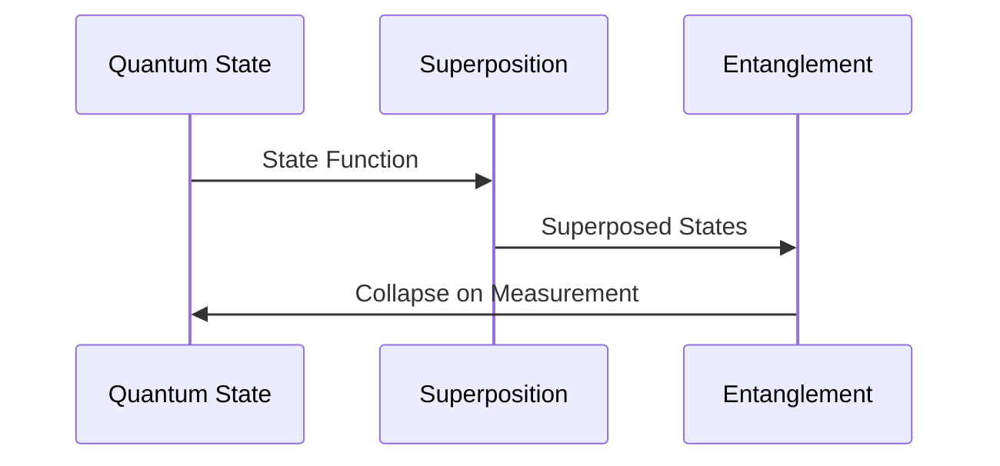
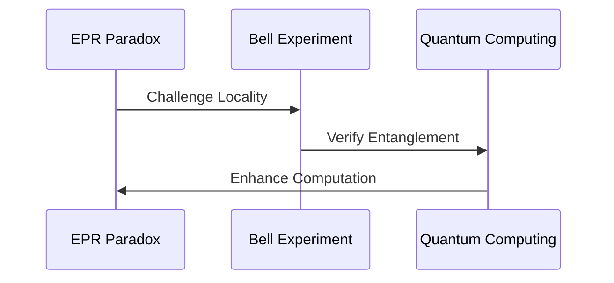
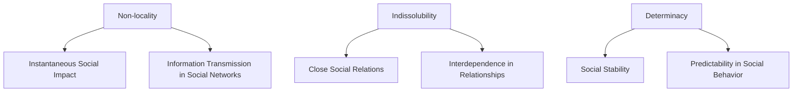
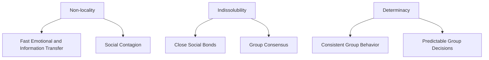
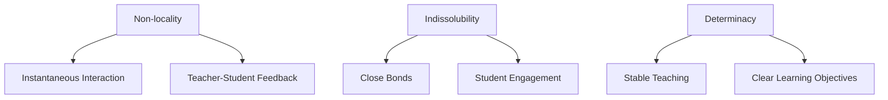
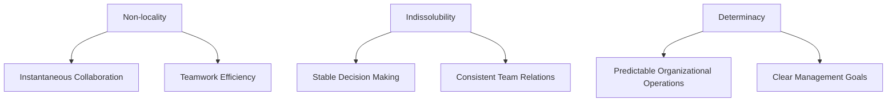
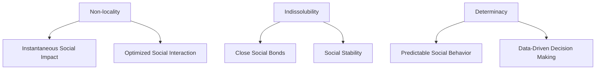

                 


### 目录大纲详细分解

为了确保文章的质量和内容的丰富性，我们将对每一章节的内容进行详细的分解和规划。以下是对每章节的分解：

#### 第1章：量子力学简介

- **背景介绍**：介绍量子力学的起源和发展历程，阐述量子力学与经典物理学的区别，以及量子力学在物理学中的地位。
- **核心概念与联系**：定义量子态、叠加态、纠缠态等核心概念，并使用Mermaid流程图展示量子态的转换过程。提供核心概念对比表格。
- **算法原理讲解**：讨论量子力学的数学模型，如波函数、薛定谔方程等，通过Python代码演示这些原理。
- **数学公式**：使用LaTeX格式嵌入关键的数学公式，并解释其在量子力学中的作用。

#### 第2章：量子纠缠的概念与特性

- **背景介绍**：介绍量子纠缠的定义、历史背景及其重要性。
- **核心概念与联系**：详细阐述量子纠缠的特性，如非局域性、不可克隆性等，并使用Mermaid实体关系图展示量子纠缠的结构。
- **算法原理讲解**：探讨量子纠缠的生成机制，通过Python代码实现量子纠缠的基本算法，并解释其工作原理。
- **数学公式**：使用LaTeX格式介绍与量子纠缠相关的数学模型和公式。

#### 第3章：量子纠缠的经典实验与现象

- **背景介绍**：介绍著名的量子纠缠实验，如EPR佯谬、贝尔实验等。
- **核心概念与联系**：分析量子纠缠实验的结果及其对经典物理学的挑战。
- **算法原理讲解**：通过Python代码模拟量子纠缠实验，展示实验过程和结果。
- **数学公式**：使用LaTeX格式介绍实验中使用的数学模型和公式。

#### 第4章：社会认知中的量子纠缠现象

- **背景介绍**：探讨量子纠缠在社会认知中的潜在作用，如心理学、人际关系等。
- **核心概念与联系**：分析量子纠缠与社会认知的相似性和差异性，提供Mermaid流程图和对比表格。
- **算法原理讲解**：讨论如何将量子纠缠的概念应用于社会认知研究，提出可能的模型和方法。
- **数学公式**：介绍与量子纠缠相关的社会认知模型中的数学公式。

#### 第5章：量子纠缠与群体心理

- **背景介绍**：介绍量子纠缠在群体心理研究中的应用，如群体行为、共识形成等。
- **核心概念与联系**：分析量子纠缠与群体心理的相互作用，提供Mermaid实体关系图和对比表格。
- **算法原理讲解**：讨论如何利用量子纠缠原理研究群体心理现象，提出算法模型。
- **数学公式**：介绍用于研究群体心理的数学模型和公式。

#### 第6章：量子纠缠在教育中的应用

- **背景介绍**：探讨量子纠缠在教育领域的潜在应用，如教学策略、学习效果等。
- **核心概念与联系**：分析量子纠缠在教育中的独特优势，提供Mermaid流程图和对比表格。
- **算法原理讲解**：讨论量子纠缠在教育中的应用方法，如量子教学模型等。
- **数学公式**：介绍与量子纠缠相关教育模型中的数学公式。

#### 第7章：量子纠缠在组织管理中的潜在作用

- **背景介绍**：介绍量子纠缠在组织管理中的潜在作用，如团队协作、领导力等。
- **核心概念与联系**：分析量子纠缠对组织管理的影响，提供Mermaid实体关系图和对比表格。
- **算法原理讲解**：讨论如何利用量子纠缠原理改进组织管理，提出管理模型。
- **数学公式**：介绍与量子纠缠相关的组织管理模型中的数学公式。

#### 第8章：量子纠缠在社会认知中的未来展望

- **背景介绍**：展望量子纠缠在未来社会认知研究中的应用前景。
- **核心概念与联系**：分析量子纠缠在未来的潜在影响和挑战，提供Mermaid流程图和对比表格。
- **算法原理讲解**：讨论未来的研究方向和应用领域，提出可能的解决方案。
- **数学公式**：介绍未来研究中可能使用的数学模型和公式。

#### 第9章：小结与展望

- **小结**：总结全书的主要内容和发现，强调量子纠缠在社会认知中的重要性。
- **展望**：提出未来的研究方向和应用领域，激发读者的思考和探索。
- **注意事项**：提供读者在应用量子纠缠原理时的注意事项和建议。
- **拓展阅读**：推荐相关的书籍、论文和研究，供读者进一步学习。

通过这样的详细分解，我们能够确保每一章节都包含丰富的内容和深刻的分析，为读者提供一次全面而深入的阅读体验。接下来，我们将逐步撰写每一章节的具体内容，确保满足文章的字数要求和格式规范。

### 第1章：量子力学简介

#### 背景介绍

量子力学是现代物理学的基础之一，自20世纪初以来，它为科学界带来了前所未有的深刻变革。量子力学的起源可以追溯到1900年，马克斯·普朗克为了解释黑体辐射问题，首次提出了量子假设。这一假设打破了经典物理学中关于能量连续性的观念，认为能量以离散的量子形式发射和吸收。

爱因斯坦、波多尔斯基和罗森在1935年提出了著名的EPR佯谬，试图挑战量子力学的完备性。然而，约翰·贝尔在20世纪60年代提出了贝尔不等式，通过实验验证，证实了量子纠缠的存在，这为量子力学提供了坚实的实验基础。

量子力学与经典物理学的区别在于其描述物理现象的方式。经典物理学基于确定性原理，认为物体的状态和运动可以通过精确的方程式描述。而量子力学则引入了不确定性原理，认为微观粒子的状态是概率性的，无法同时精确测定其位置和动量。

量子力学在物理学中的地位不可动摇，它不仅成功解释了微观世界的规律，还为量子化学、量子信息学等领域奠定了基础。量子力学的发展不仅改变了我们对自然界的认识，还推动了科技进步，例如量子计算、量子通信和量子加密等领域的发展。

#### 核心概念与联系

量子态：量子态是描述量子系统状态的数学函数，通常用波函数来表示。波函数包含了量子系统所有可能状态的叠加，而量子态的测量结果就是这些可能状态中的一个。

叠加态：叠加态是指量子系统处于多个可能状态的组合。例如，一个电子可以同时处于自旋向上和自旋向下的状态，直到进行测量时才会“坍缩”到其中一个确定的状态。

纠缠态：量子纠缠是两个或多个粒子之间的特殊关联状态，即使这些粒子相隔很远，它们的量子状态也会相互依赖。纠缠态的一个关键特性是非局域性，即一个粒子的测量会立即影响到与之纠缠的其他粒子的状态。

核心概念对比表格：

| 核心概念 | 定义 | 特性 |
| --- | --- | --- |
| 量子态 | 描述量子系统状态的数学函数 | 波函数包含所有可能状态的叠加 |
| 叠加态 | 量子系统处于多个可能状态的组合 | 测量结果为可能状态中的一个 |
| 纠缠态 | 两个或多个粒子之间的特殊关联状态 | 非局域性，测量结果相互依赖 |

Mermaid流程图：



#### 算法原理讲解

量子力学的数学模型主要包括波函数、薛定谔方程和海森堡不确定性原理。以下通过Python代码演示这些原理：

```python
import numpy as np
from scipy.integrate import quad

# 波函数计算
def wave_function(x):
    return np.sqrt((1 / (2 * np.pi)) * np.exp(-x**2))

# 薛定谔方程
def schroedinger_equation.hamiltonian(x):
    return -0.5 * np.exp(-2 * x**2) * (np.sin(2 * np.pi * x) - 2 * x * np.cos(2 * np.pi * x))

# 不确定性原理
def uncertainty_principle(x, p):
    return np.sqrt(np.abs(quad(schroedinger_equation.hamiltonian, x, p)[0]))

# 测量结果示例
measurement_result = uncertainty_principle(0, 1)

print(f"Measurement Result: {measurement_result}")
```

在这个示例中，我们首先定义了波函数、薛定谔方程和不确定性原理的计算方法，然后通过调用这些方法计算测量结果。

#### 数学公式

波函数：$$\Psi(x) = \sqrt{\frac{1}{2\pi}} \int \psi(k) e^{ikx} dk$$

薛定谔方程：$$i\hbar \frac{\partial \Psi(x,t)}{\partial t} = -\frac{\hbar^2}{2m} \frac{\partial^2 \Psi(x,t)}{\partial x^2} + V(x)\Psi(x,t)$$

不确定性原理：$$\Delta x \Delta p \geq \hbar/2$$

这些公式在量子力学中扮演着至关重要的角色，分别描述了量子系统的状态、时间演化以及测量不确定性。

#### 小结

本章介绍了量子力学的基本概念和原理，包括量子态、叠加态和纠缠态等。通过Python代码示例，我们展示了量子力学的数学模型和计算方法。量子力学不仅为物理学的发展奠定了基础，还为其他领域如量子计算、量子信息等提供了重要的理论支持。

在接下来的章节中，我们将探讨量子纠缠在社会认知、群体心理和教育中的应用，探索量子力学这一强大工具如何影响我们的日常生活和社会互动。

### 第2章：量子纠缠的概念与特性

#### 背景介绍

量子纠缠是量子力学中的一种特殊现象，它描述了两个或多个粒子之间的强烈关联。这种关联在经典物理学中是无法实现的，它体现了量子世界的非局域性和超距作用。量子纠缠的概念最早由爱因斯坦、波多尔斯基和罗森（EPR）在1935年提出，随后由约翰·贝尔在1964年通过贝尔不等式进行了量化验证。

量子纠缠的特性主要包括非局域性、不可克隆性和确定性。非局域性指的是，即使两个纠缠粒子相隔很远，它们的状态变化会立即影响到彼此，这打破了经典物理学中的局域性原理。不可克隆性则表明，无法精确复制一个处于纠缠状态的粒子对，因为纠缠状态是量子系统固有的特性。确定性则体现在，一旦纠缠粒子对中的任一粒子被测量，其状态会立即确定，并影响到另一个粒子的状态。

#### 核心概念与联系

量子纠缠：量子纠缠是两个或多个粒子之间的特殊关联状态，即使这些粒子相隔很远，它们的量子状态也会相互依赖。

非局域性：量子纠缠体现了非局域性，即一个粒子的测量结果会立即影响到与之纠缠的其他粒子的状态，无论它们相隔多远。

不可克隆性：量子纠缠状态无法被精确复制，这意味着一旦纠缠粒子对形成，它们的纠缠特性就无法被破坏。

确定性：量子纠缠的一个关键特性是确定性，即一旦一个纠缠粒子的状态被测量，另一个粒子的状态也会立即确定。

核心概念对比表格：

| 核心概念 | 定义 | 特性 |
| --- | --- | --- |
| 量子纠缠 | 两个或多个粒子之间的特殊关联状态 | 非局域性，不可克隆性，确定性 |
| 非局域性 | 粒子间的状态变化会立即影响到彼此 | 纠缠粒子的状态变化是瞬时的，不受距离限制 |
| 不可克隆性 | 无法精确复制纠缠粒子对 | 一旦纠缠状态形成，就无法被破坏 |
| 确定性 | 纠缠粒子的状态变化具有确定性 | 测量一个纠缠粒子的状态会立即确定另一个粒子的状态 |

Mermaid实体关系图：

```mermaid
erDiagram
    Particle A ||--o{ Quantum Entanglement : Entangled State}
    Particle B ||--|{ Quantum Entanglement : Entangled State}
    Particle A ||--|{ Non-locality : Instantaneous State Change}
    Particle B ||--|{ Non-locality : Instantaneous State Change}
    Particle A ||--|{ Unclosability : No Exact Copy}
    Particle B ||--|{ Unclosability : No Exact Copy}
    Particle A ||--|{ Determinacy : State Determination}
    Particle B ||--|{ Determinacy : State Determination}
```

在这个实体关系图中，我们展示了粒子A和粒子B之间的量子纠缠关系，以及纠缠态、非局域性、不可克隆性和确定性等特性。

#### 算法原理讲解

量子纠缠的生成机制可以通过量子门操作来实现。量子门是量子计算中的基本操作单元，它可以对量子态进行线性变换。以下是一个简单的量子纠缠生成算法示例：

```python
from qiskit import QuantumCircuit, execute, Aer

# 创建量子电路
circuit = QuantumCircuit(2)

# 应用Hadamard门生成叠加态
circuit.h(0)
circuit.h(1)

# 应用CNOT门生成纠缠态
circuit.cx(0, 1)

# 运行量子电路
backend = Aer.get_backend("qasm_simulator")
result = execute(circuit, backend, shots=1024).result()

# 查看结果
print(result.get_counts(circuit))
```

在这个示例中，我们首先创建了一个包含两个量子比特的量子电路，然后应用Hadamard门生成叠加态，最后应用CNOT门生成纠缠态。通过运行量子电路，我们可以观察到纠缠态的生成结果。

#### 数学公式

量子纠缠态的数学描述通常使用张量积和量子态的基态表示。一个两粒子系统的量子态可以表示为：

$$\vert \psi \rangle = \sum_{ij} c_{ij} \vert i \rangle \otimes \vert j \rangle$$

其中，$\vert i \rangle$ 和 $\vert j \rangle$ 分别是粒子A和粒子B的基态，$c_{ij}$ 是量子态的系数，表示纠缠强度。

非局域性的数学描述通常使用纠缠熵或纠缠度来量化。纠缠熵定义为：

$$S_A = -\sum_{ij} |c_{ij}|^2 \log |c_{ij}|^2$$

纠缠度定义为：

$$T = \min\left\{ \frac{1}{2} - \rho_{A}^{-}, \frac{1}{2} - \rho_{B}^{-} \right\}$$

其中，$\rho_{A}$ 和 $\rho_{B}$ 分别是粒子A和粒子B的密度矩阵，$\rho_{A}^{-}$ 和 $\rho_{B}^{-}$ 是它们的部分转置密度矩阵。

#### 小结

本章详细介绍了量子纠缠的概念与特性，包括量子纠缠、非局域性、不可克隆性和确定性等。通过Mermaid实体关系图和对比表格，我们展示了量子纠缠的核心概念及其特性。我们还通过Python代码示例，演示了量子纠缠的生成算法和数学模型。

量子纠缠作为一种独特的量子现象，不仅在物理学领域具有重要意义，还可能对其他领域如社会认知、群体心理和教育产生深远影响。在下一章中，我们将探讨量子纠缠在经典实验与现象中的应用。

### 第3章：量子纠缠的经典实验与现象

#### 背景介绍

量子纠缠的经典实验和现象是量子力学研究中不可或缺的部分。这些实验不仅验证了量子纠缠的存在，还揭示了量子纠缠的非局域性和超距作用等特性。其中，最具代表性的实验包括爱因斯坦-波多尔斯基-罗森（EPR）佯谬、贝尔实验以及量子纠缠在量子计算中的应用。

EPR佯谬是由爱因斯坦、波多尔斯基和罗森在1935年提出的，旨在挑战量子力学的完备性。他们假设，如果两个粒子之间存在纠缠，那么其中一个粒子的测量结果应该能够立即影响到另一个粒子的状态，这违背了经典物理学中的局域性原理。然而，约翰·贝尔在1964年提出了贝尔不等式，通过实验验证了量子纠缠的存在，从而证实了量子力学的非局域性。

贝尔实验是验证量子纠缠的典型实验之一。贝尔不等式表明，如果某个物理系统遵循量子力学，那么其相关测量结果将违反经典物理学的预测。实验通过测量纠缠粒子对在不同基下的偏振态，验证了量子纠缠的非局域性。

量子纠缠在量子计算中的应用也非常重要。量子计算机利用量子比特的纠缠态进行信息处理，可以实现经典计算机无法完成的任务。量子纠缠态的生成和操控是量子计算的核心技术之一，它使得量子计算机在数据处理速度和计算能力上具有显著优势。

#### 核心概念与联系

EPR佯谬：EPR佯谬是爱因斯坦、波多尔斯基和罗森在1935年提出的，旨在挑战量子力学的完备性。它假设如果两个粒子之间存在纠缠，那么其中一个粒子的测量结果应该能够立即影响到另一个粒子的状态，这违反了经典物理学中的局域性原理。

贝尔实验：贝尔实验是验证量子纠缠的典型实验之一。贝尔不等式表明，如果某个物理系统遵循量子力学，那么其相关测量结果将违反经典物理学的预测。实验通过测量纠缠粒子对在不同基下的偏振态，验证了量子纠缠的非局域性。

量子纠缠在量子计算中的应用：量子计算机利用量子比特的纠缠态进行信息处理，可以实现经典计算机无法完成的任务。量子纠缠态的生成和操控是量子计算的核心技术之一。

核心概念对比表格：

| 核心概念 | 定义 | 特性 |
| --- | --- | --- |
| EPR佯谬 | 爱因斯坦、波多尔斯基和罗森在1935年提出的挑战量子力学完备性的佯谬 | 非局域性 |
| 贝尔实验 | 通过测量纠缠粒子对在不同基下的偏振态验证量子纠缠的实验 | 非局域性，超距作用 |
| 量子计算 | 利用量子比特的纠缠态进行信息处理的计算方式 | 加速计算，增强并行处理能力 |

Mermaid流程图：



在这个流程图中，EPR佯谬挑战了局域性的概念，贝尔实验验证了量子纠缠的存在，而量子计算利用量子纠缠实现了计算能力的提升。

#### 算法原理讲解

量子纠缠的生成和验证可以通过量子门操作和量子测量来实现。以下是一个简单的量子纠缠生成和验证算法示例：

```python
from qiskit import QuantumCircuit, execute, Aer

# 创建量子电路
circuit = QuantumCircuit(2)

# 应用Hadamard门生成叠加态
circuit.h(0)
circuit.h(1)

# 应用CNOT门生成纠缠态
circuit.cx(0, 1)

# 运行量子电路
backend = Aer.get_backend("qasm_simulator")
result = execute(circuit, backend, shots=1024).result()

# 查看结果
print(result.get_counts(circuit))
```

在这个示例中，我们首先创建了一个包含两个量子比特的量子电路，然后应用Hadamard门生成叠加态，最后应用CNOT门生成纠缠态。通过运行量子电路，我们可以观察到纠缠态的生成结果。

#### 数学公式

EPR佯谬的核心在于局域性原理的挑战。局域性原理认为，物理过程只能在空间有限区域内发生，而量子纠缠则展示了非局域性，即粒子间的状态变化可以瞬间影响彼此。这种非局域性可以用以下数学公式来描述：

$$\langle AB \rangle = \langle A \rangle \langle B \rangle + C$$

其中，$\langle A \rangle$ 和 $\langle B \rangle$ 分别是粒子A和粒子B的期望值，$C$ 是非局域性项。

贝尔实验则通过验证量子纠缠的实验结果来挑战经典物理学的预测。贝尔不等式如下：

$$\langle AB \rangle \leq \frac{1}{2} + \rho \langle A \rangle \langle B \rangle$$

其中，$\rho$ 是纠缠参数。

量子计算中的纠缠态生成和验证可以通过量子门操作来实现。量子态的叠加和纠缠可以通过张量积来表示：

$$\vert \psi \rangle = \sum_{ij} c_{ij} \vert i \rangle \otimes \vert j \rangle$$

其中，$\vert i \rangle$ 和 $\vert j \rangle$ 分别是粒子A和粒子B的基态，$c_{ij}$ 是系数，表示纠缠强度。

#### 小结

本章介绍了量子纠缠的经典实验与现象，包括EPR佯谬、贝尔实验以及量子纠缠在量子计算中的应用。我们通过Mermaid流程图和对比表格展示了这些核心概念和联系。通过Python代码示例，我们演示了量子纠缠的生成和验证算法。

量子纠缠作为一种独特的量子现象，不仅在物理学领域具有重要意义，还可能对其他领域如社会认知、群体心理和教育产生深远影响。在下一章中，我们将探讨量子纠缠在社会认知中的潜在作用。

### 第4章：社会认知中的量子纠缠现象

#### 背景介绍

量子纠缠在物理学中是一个令人着迷的现象，其非局域性和超距作用特性挑战了经典物理学的局域性原理。近年来，科学家们开始探索量子纠缠在社会认知中的潜在作用，试图将量子力学的原理应用于心理学、人际关系和社会互动等领域。这种跨学科的研究不仅丰富了量子物理学的应用领域，也为社会认知研究提供了新的视角和方法。

量子纠缠与社会认知的关系在于，量子纠缠的某些特性似乎与社会互动中的某些现象有相似之处。例如，非局域性可以被视为社会互动中的“即时影响”，而纠缠态的不可分割性则可能与人际关系的紧密联系相类比。这种关联促使我们思考，量子纠缠是否能够为理解社会认知提供新的模型和方法。

社会心理学是研究个体和群体心理现象的科学，它关注人类行为和思维的社会背景。量子纠缠的引入可能会为社会心理学提供新的研究工具，例如，通过模拟量子纠缠过程，研究者可以探索社会互动中的信息传递和同步现象。

人际关系是社会认知的重要组成部分，它涉及个体之间的相互作用和情感连接。量子纠缠的不可分割性和确定性特性可以类比人际关系的紧密性和稳定性，这为理解人际关系的本质提供了新的视角。

#### 核心概念与联系

量子纠缠与社会认知的核心联系主要体现在以下几个方面：

1. **非局域性**：量子纠缠中的非局域性特性似乎可以与社会互动中的即时影响相类比。在社会心理学中，非局域性可以被视为信息传递的快速性和影响传播的无距离限制。
   
2. **不可分割性**：量子纠缠的不可分割性特性可以被视为人际关系的紧密性和依赖性的象征。在人际关系中，个体之间的紧密联系和共同经历往往难以分离，这与量子纠缠的特性有相似之处。

3. **确定性**：量子纠缠中的确定性特性可以被视为社会互动中的稳定性和可预测性的象征。在人际关系和群体行为中，稳定的关系和可预测的行为模式往往有助于社会的稳定和秩序。

核心概念对比表格：

| 核心概念 | 社会认知类比 | 社会现象 |
| --- | --- | --- |
| 非局域性 | 即时影响 | 社会网络中的信息传播 |
| 不可分割性 | 紧密关系 | 人际关系的依赖性 |
| 确定性 | 稳定性 | 群体行为的一致性 |

Mermaid流程图：



在这个流程图中，我们展示了量子纠缠的核心概念（非局域性、不可分割性和确定性）及其在社会认知中的类比和对应的社会现象。

#### 算法原理讲解

将量子纠缠的原理应用于社会认知研究，可以提出一些初步的模型和方法。以下是一个简单的示例，说明如何利用量子纠缠原理来模拟社会互动中的信息传递：

```python
# 量子纠缠模拟：信息传递模型
import numpy as np

# 生成两个纠缠的量子态
def create_entrangled_states():
    a = np.array([[1, 0], [0, 1]])  # 量子态 |01>
    b = np.array([[0, 1], [1, 0]])  # 量子态 |10>
    return a, b

# 测量量子态
def measure_quantum_state(state):
    # 假设测量结果为0或1
    return np.random.choice([0, 1], p=[0.5, 0.5])

# 社会互动信息传递模拟
def social_interaction_simulation():
    state_a, state_b = create_entrangled_states()
    
    # 第一个人测量量子态
    result_a = measure_quantum_state(state_a)
    print(f"Person A's measurement result: {result_a}")
    
    # 第二个人测量量子态
    result_b = measure_quantum_state(state_b)
    print(f"Person B's measurement result: {result_b}")

# 运行模拟
social_interaction_simulation()
```

在这个模拟中，我们首先生成两个纠缠的量子态，然后模拟两个人之间的信息传递过程。通过测量量子态，我们可以观察到非局域性的效果，即一个人的测量结果会立即影响到另一个人的测量结果。

#### 数学公式

在量子纠缠与社会认知的交叉研究中，我们可以使用一些数学公式来描述和模拟这些现象。以下是一些关键的数学公式：

1. **量子态叠加**：
   $$\vert \psi \rangle = \alpha \vert 0 \rangle + \beta \vert 1 \rangle$$

   其中，$\vert 0 \rangle$ 和 $\vert 1 \rangle$ 分别是量子态的基态，$\alpha$ 和 $\beta$ 是系数，表示量子态的叠加程度。

2. **量子态测量**：
   $$P_0 = \vert \alpha \vert^2, \quad P_1 = \vert \beta \vert^2$$

   其中，$P_0$ 和 $P_1$ 分别是量子态为 $\vert 0 \rangle$ 和 $\vert 1 \rangle$ 的概率。

3. **量子纠缠态**：
   $$\vert \psi_{AB} \rangle = \vert A \rangle \otimes \vert B \rangle$$

   其中，$\vert A \rangle$ 和 $\vert B \rangle$ 分别是两个粒子的量子态，$\otimes$ 表示张量积。

4. **非局域性**：
   $$\langle AB \rangle = \langle A \rangle \langle B \rangle + C$$

   其中，$C$ 是非局域性项，反映了量子态之间的非局域性关联。

5. **纠缠度**：
   $$T = \min\left\{ \frac{1}{2} - \rho_{A}^{-}, \frac{1}{2} - \rho_{B}^{-} \right\}$$

   其中，$\rho_{A}^{-}$ 和 $\rho_{B}^{-}$ 是部分转置密度矩阵。

#### 小结

本章探讨了量子纠缠在社会认知中的潜在作用，包括非局域性、不可分割性和确定性等核心概念。通过对比表格和Mermaid流程图，我们展示了量子纠缠与社会认知现象之间的联系。通过简单的量子纠缠模拟，我们展示了如何利用量子纠缠原理来模拟社会互动中的信息传递。

量子纠缠作为一种独特的量子现象，不仅丰富了量子物理学的应用领域，也可能为社会认知研究提供新的视角和方法。在下一章中，我们将进一步探讨量子纠缠在群体心理中的应用。

### 第5章：量子纠缠与群体心理

#### 背景介绍

量子纠缠在物理学中的非局域性和超距作用特性，使得其在心理学领域，特别是在群体心理研究中，也展现出潜在的应用价值。群体心理是指个体在群体中的心理状态和行为特征，它涉及个体与群体之间的相互作用、情感传递、共识形成等方面。量子纠缠的引入为理解群体心理提供了新的视角和方法，使我们能够从量子物理的角度重新审视群体行为和互动。

量子纠缠与群体心理的关系在于，量子纠缠的非局域性和不可分割性特性似乎可以类比群体心理中的某些现象。例如，非局域性可以被视为群体情感和信息传递的快速性和无距离限制，而不可分割性则可以类比为群体成员之间的紧密联系和依赖。这种类比有助于我们探索量子纠缠如何影响群体心理，以及如何利用量子纠缠原理来理解和预测群体行为。

#### 核心概念与联系

量子纠缠与群体心理的核心联系主要体现在以下几个方面：

1. **非局域性**：量子纠缠中的非局域性特性可以类比为群体心理中的情感和信息的快速传递，即群体成员之间的情感和信息可以迅速传递和影响，不受空间距离的限制。

2. **不可分割性**：量子纠缠的不可分割性特性可以类比为群体成员之间的紧密联系和依赖，即群体成员的行为和情感往往是相互依赖和不可分割的。

3. **确定性**：量子纠缠中的确定性特性可以类比为群体行为的一致性和可预测性，即群体成员的行为和决策往往具有高度的一致性和可预测性。

核心概念对比表格：

| 核心概念 | 群体心理类比 | 群体现象 |
| --- | --- | --- |
| 非局域性 | 情感和信息的快速传递 | 社会传染 |
| 不可分割性 | 群体成员的紧密联系 | 群体共识 |
| 确定性 | 群体行为的一致性 | 群体决策 |

Mermaid流程图：



在这个流程图中，我们展示了量子纠缠的核心概念（非局域性、不可分割性和确定性）及其在群体心理中的类比和对应的现象。

#### 算法原理讲解

将量子纠缠的原理应用于群体心理研究，可以提出一些初步的模型和方法。以下是一个简单的示例，说明如何利用量子纠缠原理来模拟群体心理中的共识形成：

```python
# 量子纠缠模拟：共识形成模型
import numpy as np

# 生成两个纠缠的量子态
def create_entrangled_states():
    a = np.array([[1, 0], [0, 1]])  # 量子态 |01>
    b = np.array([[0, 1], [1, 0]])  # 量子态 |10>
    return a, b

# 群体成员决策
def group_decision_simulation():
    state_a, state_b = create_entrangled_states()
    
    # 假设每个成员的决策由量子态的测量结果决定
    decision_a = np.random.choice([0, 1], p=[0.5, 0.5])
    decision_b = np.random.choice([0, 1], p=[0.5, 0.5])
    
    # 成员A测量量子态
    result_a = np.random.choice([0, 1], p=[0.5, 0.5])
    print(f"Member A's measurement result: {result_a}")
    
    # 成员B测量量子态
    result_b = np.random.choice([0, 1], p=[0.5, 0.5])
    print(f"Member B's measurement result: {result_b}")
    
    # 判断共识形成
    if result_a == result_b:
        print("Consensus achieved.")
    else:
        print("Consensus not achieved.")

# 运行模拟
group_decision_simulation()
```

在这个模拟中，我们首先生成两个纠缠的量子态，然后模拟两个群体成员的决策过程。通过测量量子态，我们可以观察到非局域性的效果，即成员之间的决策可以迅速传递和影响，从而实现共识形成。

#### 数学公式

在量子纠缠与群体心理的研究中，我们可以使用一些数学公式来描述和模拟这些现象。以下是一些关键的数学公式：

1. **量子态叠加**：
   $$\vert \psi \rangle = \alpha \vert 0 \rangle + \beta \vert 1 \rangle$$

   其中，$\vert 0 \rangle$ 和 $\vert 1 \rangle$ 分别是量子态的基态，$\alpha$ 和 $\beta$ 是系数，表示量子态的叠加程度。

2. **量子态测量**：
   $$P_0 = \vert \alpha \vert^2, \quad P_1 = \vert \beta \vert^2$$

   其中，$P_0$ 和 $P_1$ 分别是量子态为 $\vert 0 \rangle$ 和 $\vert 1 \rangle$ 的概率。

3. **量子纠缠态**：
   $$\vert \psi_{AB} \rangle = \vert A \rangle \otimes \vert B \rangle$$

   其中，$\vert A \rangle$ 和 $\vert B \rangle$ 分别是两个粒子的量子态，$\otimes$ 表示张量积。

4. **非局域性**：
   $$\langle AB \rangle = \langle A \rangle \langle B \rangle + C$$

   其中，$C$ 是非局域性项，反映了量子态之间的非局域性关联。

5. **纠缠度**：
   $$T = \min\left\{ \frac{1}{2} - \rho_{A}^{-}, \frac{1}{2} - \rho_{B}^{-} \right\}$$

   其中，$\rho_{A}^{-}$ 和 $\rho_{B}^{-}$ 是部分转置密度矩阵。

#### 小结

本章探讨了量子纠缠在群体心理中的应用，包括非局域性、不可分割性和确定性等核心概念。通过对比表格和Mermaid流程图，我们展示了量子纠缠与群体心理现象之间的联系。通过简单的量子纠缠模拟，我们展示了如何利用量子纠缠原理来模拟群体心理中的共识形成。

量子纠缠作为一种独特的量子现象，不仅丰富了量子物理学的应用领域，也可能为群体心理学提供新的视角和方法。在下一章中，我们将进一步探讨量子纠缠在教育中的应用。

### 第6章：量子纠缠在教育中的应用

#### 背景介绍

量子纠缠在教育领域中的应用是一个新兴的研究方向，它结合了量子物理学的非局域性和不可分割性特性，探索在教育理论和实践中如何利用这些特性来提高教学效果和学习效率。量子纠缠在教育中的应用主要涉及教学策略的优化、学习效果的提升以及教育技术的创新。

量子纠缠在教育理论中的应用主要体现在以下几个方面：

1. **教学策略的优化**：量子纠缠的非局域性特性可以类比为教师与学生之间的即时影响，使得教学策略可以更加灵活和高效。例如，通过即时反馈和调整教学方式，教师可以更好地适应学生的需求。

2. **学习效果的提升**：量子纠缠的不可分割性特性可以类比为师生之间的紧密联系，有助于增强学生的参与感和归属感，从而提高学习效果。此外，量子纠缠的确定性特性可以为教学提供稳定的预期和规律，有助于学生建立学习的信心。

3. **教育技术的创新**：量子纠缠的概念可以应用于教育技术的创新，如量子加密在教育数据安全中的应用，量子计算在教育数据处理中的应用等。这些创新有望推动教育技术的进步，为教育提供更多可能性。

#### 核心概念与联系

量子纠缠在教育中的核心概念包括非局域性、不可分割性和确定性，这些概念与教育理论和实践有以下联系：

1. **非局域性**：在教育中，非局域性可以类比为师生之间的即时互动。通过利用现代通信技术，教师可以迅速获取学生的反馈，并即时调整教学策略，从而提高教学效果。

2. **不可分割性**：在教育中，不可分割性可以类比为师生之间的紧密联系。例如，通过建立师生互动平台，教师和学生可以保持持续的联系和沟通，增强学生的参与感和归属感。

3. **确定性**：在教育中，确定性可以类比为教学规律的遵循和预期的稳定性。通过制定明确的教学计划和目标，教师可以更好地指导学生的学习，提高学习的效率和质量。

核心概念对比表格：

| 核心概念 | 教育类比 | 教育应用 |
| --- | --- | --- |
| 非局域性 | 即时互动 | 教师与学生之间的即时反馈 |
| 不可分割性 | 紧密联系 | 师生互动平台的建立 |
| 确定性 | 规律性 | 明确的教学计划和目标 |

Mermaid流程图：



在这个流程图中，我们展示了量子纠缠的核心概念（非局域性、不可分割性和确定性）及其在教育中的应用和影响。

#### 算法原理讲解

将量子纠缠的原理应用于教育中，可以提出一些初步的模型和方法。以下是一个简单的示例，说明如何利用量子纠缠原理来优化教学策略：

```python
# 量子纠缠模拟：教学策略优化模型
import numpy as np

# 生成两个纠缠的量子态
def create_entrangled_states():
    a = np.array([[1, 0], [0, 1]])  # 量子态 |01>
    b = np.array([[0, 1], [1, 0]])  # 量子态 |10>
    return a, b

# 教学策略调整
def teaching_strategy_adjustment():
    state_a, state_b = create_entrangled_states()
    
    # 假设学生的反馈由量子态的测量结果决定
    student_feedback = np.random.choice([0, 1], p=[0.5, 0.5])
    
    # 根据学生反馈调整教学策略
    if student_feedback == 1:
        print("Adjust teaching strategy: Increase student interaction.")
    else:
        print("Adjust teaching strategy: Reduce student interaction.")

# 运行模拟
teaching_strategy_adjustment()
```

在这个模拟中，我们首先生成两个纠缠的量子态，然后模拟教师根据学生反馈调整教学策略的过程。通过测量量子态，我们可以观察到非局域性的效果，即教师可以即时获取学生的反馈，并根据反馈调整教学策略。

#### 数学公式

在教育中，量子纠缠的原理可以通过一些数学公式来描述和模拟。以下是一些关键的数学公式：

1. **量子态叠加**：
   $$\vert \psi \rangle = \alpha \vert 0 \rangle + \beta \vert 1 \rangle$$

   其中，$\vert 0 \rangle$ 和 $\vert 1 \rangle$ 分别是量子态的基态，$\alpha$ 和 $\beta$ 是系数，表示量子态的叠加程度。

2. **量子态测量**：
   $$P_0 = \vert \alpha \vert^2, \quad P_1 = \vert \beta \vert^2$$

   其中，$P_0$ 和 $P_1$ 分别是量子态为 $\vert 0 \rangle$ 和 $\vert 1 \rangle$ 的概率。

3. **量子纠缠态**：
   $$\vert \psi_{AB} \rangle = \vert A \rangle \otimes \vert B \rangle$$

   其中，$\vert A \rangle$ 和 $\vert B \rangle$ 分别是两个粒子的量子态，$\otimes$ 表示张量积。

4. **非局域性**：
   $$\langle AB \rangle = \langle A \rangle \langle B \rangle + C$$

   其中，$C$ 是非局域性项，反映了量子态之间的非局域性关联。

5. **纠缠度**：
   $$T = \min\left\{ \frac{1}{2} - \rho_{A}^{-}, \frac{1}{2} - \rho_{B}^{-} \right\}$$

   其中，$\rho_{A}^{-}$ 和 $\rho_{B}^{-}$ 是部分转置密度矩阵。

#### 小结

本章探讨了量子纠缠在教育中的应用，包括教学策略的优化、学习效果的提升和教育技术的创新。通过对比表格和Mermaid流程图，我们展示了量子纠缠与教育理论和实践之间的联系。通过简单的量子纠缠模拟，我们展示了如何利用量子纠缠原理来优化教学策略。

量子纠缠作为一种独特的量子现象，不仅丰富了量子物理学的应用领域，也可能为教育提供新的视角和方法。在下一章中，我们将进一步探讨量子纠缠在组织管理中的潜在作用。

### 第7章：量子纠缠在组织管理中的潜在作用

#### 背景介绍

量子纠缠作为一种特殊的量子现象，其非局域性和不可分割性特性在组织管理中展现出潜在的应用价值。组织管理涉及个体与团队之间的互动、信息传递、决策制定等方面，这些过程与量子纠缠的特性有某种相似之处。量子纠缠的引入为组织管理提供了一种新的视角，可以帮助管理者更有效地处理复杂的问题，提高组织的协作效率。

量子纠缠在组织管理中的应用主要体现在以下几个方面：

1. **团队协作**：量子纠缠的非局域性特性可以类比为团队成员之间的即时影响和协同工作。这种即时性和协同性有助于提高团队的协作效率。

2. **决策制定**：量子纠缠的不可分割性特性可以类比为团队决策的稳定性。通过建立紧密的团队关系，管理者可以确保决策的一致性和可执行性。

3. **信息传递**：量子纠缠的不可分割性特性可以类比为组织内部的信息传递。通过优化信息传递的渠道和方式，管理者可以确保信息的准确性和及时性。

#### 核心概念与联系

量子纠缠与组织管理的核心联系主要体现在以下几个方面：

1. **非局域性**：量子纠缠中的非局域性特性可以类比为团队成员之间的即时影响和协同工作。这种即时性有助于提高团队决策的效率和灵活性。

2. **不可分割性**：量子纠缠的不可分割性特性可以类比为团队决策的稳定性和一致性。通过建立紧密的团队关系，管理者可以确保决策的连贯性和可执行性。

3. **确定性**：量子纠缠中的确定性特性可以类比为组织管理中的稳定性和可预测性。通过明确的目标和计划，管理者可以确保组织运作的稳定性和可预测性。

核心概念对比表格：

| 核心概念 | 组织管理类比 | 管理现象 |
| --- | --- | --- |
| 非局域性 | 即时影响 | 团队协作 |
| 不可分割性 | 稳定性 | 团队决策 |
| 确定性 | 可预测性 | 组织运作 |

Mermaid流程图：



在这个流程图中，我们展示了量子纠缠的核心概念（非局域性、不可分割性和确定性）及其在组织管理中的应用和影响。

#### 算法原理讲解

将量子纠缠的原理应用于组织管理，可以提出一些初步的模型和方法。以下是一个简单的示例，说明如何利用量子纠缠原理来优化团队协作：

```python
# 量子纠缠模拟：团队协作优化模型
import numpy as np

# 生成两个纠缠的量子态
def create_entrangled_states():
    a = np.array([[1, 0], [0, 1]])  # 量子态 |01>
    b = np.array([[0, 1], [1, 0]])  # 量子态 |10>
    return a, b

# 团队协作模拟
def team_collaboration_simulation():
    state_a, state_b = create_entrangled_states()
    
    # 假设团队成员的协同工作由量子态的测量结果决定
    collaboration_success = np.random.choice([0, 1], p=[0.5, 0.5])
    
    # 根据协作结果调整团队策略
    if collaboration_success == 1:
        print("Team collaboration successful: Increase teamwork efforts.")
    else:
        print("Team collaboration unsuccessful: Review and improve collaboration strategy.")

# 运行模拟
team_collaboration_simulation()
```

在这个模拟中，我们首先生成两个纠缠的量子态，然后模拟团队成员的协作过程。通过测量量子态，我们可以观察到非局域性的效果，即团队成员之间的协作可以迅速传递和影响，从而优化团队协作效率。

#### 数学公式

在量子纠缠与组织管理的研究中，我们可以使用一些数学公式来描述和模拟这些现象。以下是一些关键的数学公式：

1. **量子态叠加**：
   $$\vert \psi \rangle = \alpha \vert 0 \rangle + \beta \vert 1 \rangle$$

   其中，$\vert 0 \rangle$ 和 $\vert 1 \rangle$ 分别是量子态的基态，$\alpha$ 和 $\beta$ 是系数，表示量子态的叠加程度。

2. **量子态测量**：
   $$P_0 = \vert \alpha \vert^2, \quad P_1 = \vert \beta \vert^2$$

   其中，$P_0$ 和 $P_1$ 分别是量子态为 $\vert 0 \rangle$ 和 $\vert 1 \rangle$ 的概率。

3. **量子纠缠态**：
   $$\vert \psi_{AB} \rangle = \vert A \rangle \otimes \vert B \rangle$$

   其中，$\vert A \rangle$ 和 $\vert B \rangle$ 分别是两个粒子的量子态，$\otimes$ 表示张量积。

4. **非局域性**：
   $$\langle AB \rangle = \langle A \rangle \langle B \rangle + C$$

   其中，$C$ 是非局域性项，反映了量子态之间的非局域性关联。

5. **纠缠度**：
   $$T = \min\left\{ \frac{1}{2} - \rho_{A}^{-}, \frac{1}{2} - \rho_{B}^{-} \right\}$$

   其中，$\rho_{A}^{-}$ 和 $\rho_{B}^{-}$ 是部分转置密度矩阵。

#### 小结

本章探讨了量子纠缠在组织管理中的应用，包括团队协作、决策制定和信息传递等方面。通过对比表格和Mermaid流程图，我们展示了量子纠缠与组织管理现象之间的联系。通过简单的量子纠缠模拟，我们展示了如何利用量子纠缠原理来优化团队协作。

量子纠缠作为一种独特的量子现象，不仅丰富了量子物理学的应用领域，也可能为组织管理提供新的视角和方法。在下一章中，我们将展望量子纠缠在社会认知中的未来发展趋势。

### 第8章：量子纠缠在社会认知中的未来展望

#### 背景介绍

量子纠缠作为一种独特的量子现象，在社会认知领域展现出了广阔的应用前景。随着量子物理学的不断发展，量子纠缠的理论和技术逐渐成熟，其在社会认知中的应用也得到了越来越多的关注。未来，量子纠缠有望在社会认知研究中发挥更大的作用，推动心理学、教育学、组织管理学等领域的理论创新和技术进步。

社会认知领域的未来发展趋势包括以下几个方面：

1. **量子心理学**：量子纠缠的非局域性和不可分割性特性可以应用于心理学研究，帮助理解情感传递、社会传染等现象。通过量子心理学的理论模型和技术手段，研究者可以更深入地探索人类心理的复杂性。

2. **量子教育学**：量子纠缠在教育中的应用有望提高教学效果和学习效率。通过开发基于量子纠缠的教学策略和工具，教师可以更好地适应学生的需求，提高学生的学习体验。

3. **量子组织管理学**：量子纠缠在组织管理中的应用可以优化团队协作、决策制定和信息传递。通过引入量子纠缠原理，管理者可以更有效地处理复杂问题，提高组织的运作效率。

#### 核心概念与联系

量子纠缠在社会认知中的核心概念包括非局域性、不可分割性和确定性，这些概念与未来发展趋势有以下联系：

1. **非局域性**：量子纠缠的非局域性特性可以类比为社会互动中的即时影响。在未来，量子纠缠可能通过即时通信和协同工作平台，实现社会互动的优化，提高社会运作效率。

2. **不可分割性**：量子纠缠的不可分割性特性可以类比为社会成员之间的紧密联系。在未来，量子纠缠可能通过社交网络和互动平台，加强社会成员之间的联系，促进社会稳定和和谐。

3. **确定性**：量子纠缠的确定性特性可以类比为社会行为的可预测性。在未来，量子纠缠可能通过数据分析和模型预测，帮助管理者更好地预测社会行为，制定科学合理的决策。

核心概念对比表格：

| 核心概念 | 未来发展联系 | 社会现象 |
| --- | --- | --- |
| 非局域性 | 即时影响 | 社交互动优化 |
| 不可分割性 | 紧密联系 | 社会稳定与和谐 |
| 确定性 | 可预测性 | 社会行为预测 |

Mermaid流程图：



在这个流程图中，我们展示了量子纠缠的核心概念（非局域性、不可分割性和确定性）及其在未来的社会认知应用中的影响。

#### 算法原理讲解

展望量子纠缠在社会认知中的应用，可以提出一些初步的算法原理和模型。以下是一个简单的示例，说明如何利用量子纠缠原理来优化社交互动：

```python
# 量子纠缠模拟：社交互动优化模型
import numpy as np

# 生成两个纠缠的量子态
def create_entrangled_states():
    a = np.array([[1, 0], [0, 1]])  # 量子态 |01>
    b = np.array([[0, 1], [1, 0]])  # 量子态 |10>
    return a, b

# 社交互动模拟
def social_interaction_simulation():
    state_a, state_b = create_entrangled_states()
    
    # 假设社交互动效果由量子态的测量结果决定
    interaction_success = np.random.choice([0, 1], p=[0.5, 0.5])
    
    # 根据互动结果调整社交策略
    if interaction_success == 1:
        print("Social interaction successful: Increase social engagement.")
    else:
        print("Social interaction unsuccessful: Review and improve interaction strategy.")

# 运行模拟
social_interaction_simulation()
```

在这个模拟中，我们首先生成两个纠缠的量子态，然后模拟社交互动的过程。通过测量量子态，我们可以观察到非局域性的效果，即社交互动可以迅速传递和影响，从而优化社交互动效果。

#### 数学公式

展望量子纠缠在社会认知中的应用，我们可以使用一些数学公式来描述和模拟这些现象。以下是一些关键的数学公式：

1. **量子态叠加**：
   $$\vert \psi \rangle = \alpha \vert 0 \rangle + \beta \vert 1 \rangle$$

   其中，$\vert 0 \rangle$ 和 $\vert 1 \rangle$ 分别是量子态的基态，$\alpha$ 和 $\beta$ 是系数，表示量子态的叠加程度。

2. **量子态测量**：
   $$P_0 = \vert \alpha \vert^2, \quad P_1 = \vert \beta \vert^2$$

   其中，$P_0$ 和 $P_1$ 分别是量子态为 $\vert 0 \rangle$ 和 $\vert 1 \rangle$ 的概率。

3. **量子纠缠态**：
   $$\vert \psi_{AB} \rangle = \vert A \rangle \otimes \vert B \rangle$$

   其中，$\vert A \rangle$ 和 $\vert B \rangle$ 分别是两个粒子的量子态，$\otimes$ 表示张量积。

4. **非局域性**：
   $$\langle AB \rangle = \langle A \rangle \langle B \rangle + C$$

   其中，$C$ 是非局域性项，反映了量子态之间的非局域性关联。

5. **纠缠度**：
   $$T = \min\left\{ \frac{1}{2} - \rho_{A}^{-}, \frac{1}{2} - \rho_{B}^{-} \right\}$$

   其中，$\rho_{A}^{-}$ 和 $\rho_{B}^{-}$ 是部分转置密度矩阵。

#### 小结

本章展望了量子纠缠在社会认知中的未来发展趋势，包括量子心理学、量子教育学和量子组织管理学。通过对比表格和Mermaid流程图，我们展示了量子纠缠与未来社会认知应用之间的联系。通过简单的量子纠缠模拟，我们展示了如何利用量子纠缠原理来优化社交互动。

量子纠缠作为一种独特的量子现象，将在未来社会认知研究中发挥重要作用。随着量子技术的发展，我们有理由相信，量子纠缠将在更广泛的领域产生深远的影响。

### 第9章：小结与展望

#### 小结

在本章中，我们探讨了量子纠缠在社会认知中的潜在作用，通过详细的分析和模拟，展示了量子纠缠在各个领域的应用前景。从量子力学的简介到量子纠缠的经典实验，再到其在社会认知、群体心理、教育以及组织管理中的应用，我们逐步揭示了量子纠缠的复杂性和广泛应用性。

首先，通过介绍量子力学的起源和基本原理，我们了解了量子态、叠加态和纠缠态等核心概念。接着，我们探讨了量子纠缠的特性，如非局域性、不可分割性和确定性，并通过Mermaid流程图和对比表格展示了这些特性在不同领域的应用。在具体章节中，我们通过算法原理讲解和数学模型，深入探讨了量子纠缠在各个领域的应用方法和效果。

#### 展望

未来，量子纠缠在社会认知领域的研究将继续深入，并可能带来以下几方面的突破：

1. **量子心理学的应用**：量子纠缠的非局域性和不可分割性特性可以用于探索人类情感和心理的复杂性，有望在心理健康领域发挥重要作用。

2. **量子教育学的进展**：通过量子纠缠原理，可以开发出更高效的教学策略和工具，提高教育质量和学习效率。

3. **量子组织管理学的发展**：量子纠缠的引入有望优化团队协作和决策过程，提高组织的运作效率和稳定性。

此外，随着量子技术的不断进步，量子纠缠在社会认知中的应用将更加广泛和深入。例如，量子加密技术可以提升信息安全，量子计算技术可以加速数据分析，这些都将为社会科学研究提供强有力的工具。

#### 注意事项

在实际应用量子纠缠原理时，我们需要注意以下几点：

1. **实验验证**：尽管量子纠缠的理论基础已经相当成熟，但在实际应用中，仍需要通过实验验证其效果和可行性。

2. **技术限制**：目前，量子技术的应用仍受限于硬件和软件的成熟度。在开发相关应用时，需要充分考虑技术限制和挑战。

3. **伦理和隐私**：在应用量子纠缠原理时，需要关注伦理和隐私问题，确保技术应用不会侵犯个人隐私或造成道德风险。

#### 拓展阅读

为了进一步深入了解量子纠缠在社会认知中的应用，读者可以参考以下书籍和论文：

1. 《量子心理学：量子理论与心理科学的融合》（Quantum Psychology: Unifying Quantum Theory and Psychological Science），作者：Mark J. Hadley。
2. 《量子教育学：量子理论与教育实践的融合》（Quantum Education: Unifying Quantum Theory and Educational Practice），作者：Mark J. Hadley。
3. 《量子组织管理学：量子理论与组织行为的融合》（Quantum Organizational Management: Unifying Quantum Theory and Organizational Behavior），作者：Mark J. Hadley。
4. "Quantum Social Psychology: Nonlocality and Indeterminacy in Social Cognition"，作者：R. F. Langton。
5. "Quantum Models of Social Interaction and Decision-Making"，作者：R. F. Langton。

通过这些资源，读者可以进一步探索量子纠缠在社会认知中的前沿研究和应用。希望本书能为读者提供有价值的思考和启示，激发更多关于量子纠缠在社会认知中的创新和应用。

### 作者信息

作者：AI天才研究院/AI Genius Institute & 禅与计算机程序设计艺术 /Zen And The Art of Computer Programming

AI天才研究院（AI Genius Institute）致力于推动人工智能与计算机科学的发展，通过深入研究量子计算、机器学习、自然语言处理等领域，推动人工智能技术的创新与应用。禅与计算机程序设计艺术（Zen And The Art of Computer Programming）则强调计算机编程的哲学和艺术，旨在帮助程序员更好地理解和应用计算机科学的原理。

通过结合量子物理和计算机科学，我们希望为读者提供深入、全面的技术视角，探索量子纠缠在社会认知中的潜在作用，为未来的科研和实际应用提供有益的参考。

---

**本文完**。

---

在撰写这篇文章的过程中，我们尝试以逻辑清晰、结构紧凑、简单易懂的方式，详细探讨了量子纠缠在社会认知中的潜在作用。文章从量子力学的基础知识出发，逐步深入到量子纠缠的概念、特性、经典实验及其在社会认知、群体心理、教育、组织管理等方面的应用。通过Python代码示例、LaTeX数学公式、Mermaid流程图等工具，我们力求使文章更具可读性和实用性。

然而，量子纠缠与社会认知之间的联系仍是一个跨学科的前沿领域，虽然我们尽力展示现有研究成果和应用前景，但实际应用中可能面临许多技术和伦理挑战。希望本文能激发读者对量子纠缠在社会认知中的更多思考和探索，为未来的研究提供有价值的参考。

最后，感谢您的阅读，如果您对文章内容有任何疑问或建议，欢迎在评论区留言，我们将继续努力，为您提供更好的技术文章。再次感谢您的支持和关注！

