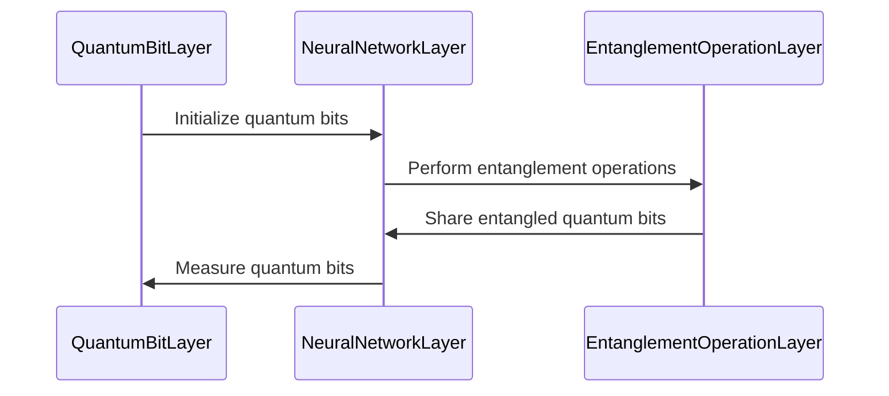
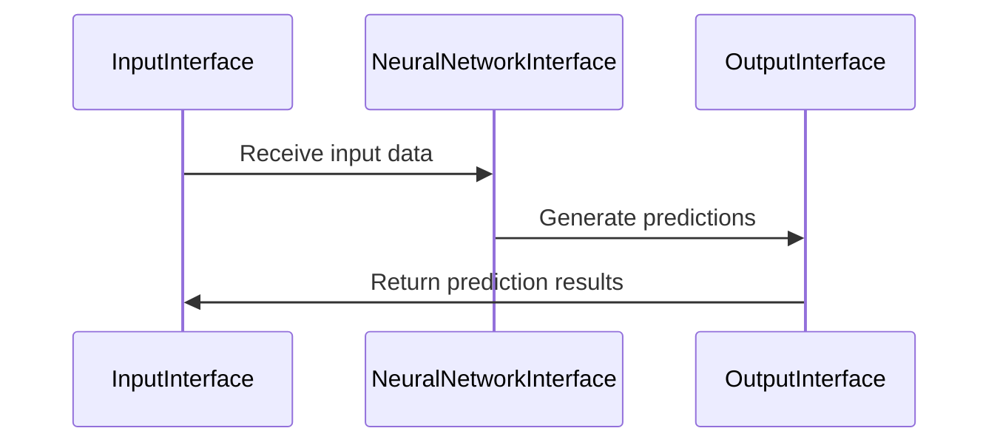

                 

### 文章标题

# 量子纠缠在神经网络中的长程相关性

> 关键词：量子纠缠，神经网络，长程相关性，量子神经网络，信息处理

> 摘要：本文深入探讨了量子纠缠现象在神经网络长程相关性中的应用及其对信息处理能力的提升。首先介绍了量子纠缠的基本原理和神经网络的基础知识，然后详细分析了量子纠缠如何影响神经网络的长程相关性，并探讨了其潜在的应用场景和未来研究方向。

----------------------------------------------------------------

### 量子纠缠原理

量子纠缠是一种量子力学现象，描述了当两个或多个量子系统相互作用后，它们的状态会变得不可分离。这种纠缠状态具有特殊的性质，即使两个纠缠的粒子相隔很远，它们的状态也会即时同步变化。量子纠缠的存在是量子信息科学的核心，也是量子计算和量子通信的基础。

#### 量子比特与量子态

在量子力学中，量子比特（qubit）是量子计算的基本单元，它可以处于0和1的叠加态。量子态可以用一个复数向量表示，其中每个元素代表一个量子比特的状态概率幅。

$$|\psi\rangle = \alpha|0\rangle + \beta|1\rangle$$

其中，$|\alpha|^2$和$|\beta|^2$分别代表量子比特处于状态0和1的概率。

#### 量子纠缠的定义与特性

量子纠缠的定义是：当两个或多个量子系统相互作用后，它们的状态无法单独描述，必须以整体的状态来描述。一个典型的纠缠态可以表示为：

$$|\psi_{AB}\rangle = \frac{1}{\sqrt{2}}(|0\rangle_A|0\rangle_B + |1\rangle_A|1\rangle_B)$$

其中，$A$和$B$分别代表两个纠缠的量子比特。这个状态表明，无论两个量子比特相隔多远，它们的状态都是相互关联的。

#### 量子信息与量子纠缠

量子纠缠在量子信息处理中具有重要作用。通过量子纠缠，可以传输和共享量子信息，实现量子态的超距离传输和量子密钥分发。量子纠缠也为量子计算提供了巨大的并行计算能力，使得量子计算机在某些特定问题上比传统计算机更加高效。

### 神经网络基础

神经网络是一种模拟人脑神经元结构的计算模型，广泛应用于机器学习和人工智能领域。神经网络通过多层节点（或层）之间的加权连接来学习和处理信息。

#### 神经网络概述

神经网络起源于20世纪40年代，由心理学家弗兰克·罗森布拉特（Frank Rosenblatt）提出。最初的神经网络模型是单层感知机（Perceptron），后来发展出了多层感知机（MLP）和深度神经网络（DNN）。

#### 神经网络的类型

根据网络结构的不同，神经网络可以分为以下几种类型：

- **单层感知机**：只有一个输入层和一个输出层。
- **多层感知机**：具有多个隐层。
- **卷积神经网络（CNN）**：适用于图像识别等任务。
- **循环神经网络（RNN）**：适用于序列数据处理。
- **生成对抗网络（GAN）**：用于生成新数据。

#### 神经网络的基本架构

神经网络的基本架构包括输入层、隐层和输出层。输入层接收外部输入，隐层对输入进行处理和变换，输出层生成最终输出。每个层由多个神经元组成，神经元之间通过加权连接进行信息传递。

$$x_{ij} = w_{ij} \cdot x_j + b_j$$

其中，$x_j$是输入值，$w_{ij}$是连接权重，$b_j$是偏置。

### 量子神经网络

量子神经网络（QNN）是结合量子计算和神经网络的创新模型，旨在利用量子纠缠和量子并行性来提升神经网络的处理能力和效率。

#### 量子神经网络概述

量子神经网络是一种将量子计算和神经网络相结合的计算模型，通过量子比特和量子态的叠加和纠缠来表示和计算神经网络中的信息。

#### 量子神经网络的工作原理

量子神经网络的工作原理基于量子计算的基本原理，包括量子比特的叠加和纠缠。量子神经网络通过量子线路来模拟神经网络的权重和学习过程。

#### 量子神经网络的优势

量子神经网络具有以下优势：

- **并行性**：量子计算机可以利用量子比特的叠加态实现并行计算，大幅提升计算速度。
- **纠错能力**：量子计算机具有内在的纠错能力，可以提高模型的稳定性和可靠性。
- **高维表示**：量子比特可以表示高维态，使得量子神经网络能够处理更复杂的问题。

### 量子纠缠与神经网络的关系

量子纠缠在神经网络中具有重要作用，可以提升神经网络的信息处理能力和性能。

#### 量子纠缠在信息处理中的应用

量子纠缠可以增强神经网络中的信息传输和共享，实现高效的信息处理。通过量子纠缠，神经网络可以更有效地处理高维数据和复杂的关系。

#### 量子纠缠对神经网络性能的提升

量子纠缠可以增强神经网络的长程相关性，提高模型的泛化能力和适应性。通过量子纠缠，神经网络可以更好地捕捉数据中的长期依赖关系，从而在任务中表现更好。

### 长程相关性的概念

长程相关性是指神经网络中远距离节点之间的相关性。长程相关性在许多实际应用中具有重要意义，例如自然语言处理和图像识别等。

#### 长程相关性的定义

长程相关性是指在神经网络中，远距离节点之间的信息传递和相互影响。长程相关性通常通过节点之间的连接权重来表示。

#### 长程相关性的类型

根据长程相关性的表现形式，可以分为以下几种类型：

- **线性和非线性长程相关性**：线性和非线性长程相关性分别描述了节点之间线性和非线性关系。
- **长程依赖和长程相关性**：长程依赖是指神经网络中远距离节点之间的依赖关系，长程相关性则是指这些节点之间的信息传递。

### 神经网络中的长程相关性

长程相关性在神经网络中具有重要意义，可以影响模型的性能和应用范围。

#### 神经网络中的长程相关性的现象

在神经网络中，长程相关性可以表现为远距离节点之间的信息传递和相互影响。这种相关性在图像识别、自然语言处理和序列数据处理等任务中具有重要意义。

#### 神经网络中的长程相关性的影响

长程相关性可以增强神经网络对数据的理解和表征能力，从而提高模型的性能。通过利用长程相关性，神经网络可以更好地处理复杂问题和捕捉数据中的长期依赖关系。

### 量子纠缠在长程相关性中的作用

量子纠缠可以增强神经网络中的长程相关性，提高模型的信息处理能力和性能。

#### 量子纠缠与长程相关性的关系

量子纠缠可以增强神经网络中远距离节点之间的信息传递和相互影响，从而提升长程相关性。通过量子纠缠，神经网络可以更有效地处理高维数据和复杂的关系。

#### 量子纠缠在神经网络长程相关性中的应用

量子纠缠在神经网络长程相关性中的应用包括：

- **增强信息传输**：通过量子纠缠，神经网络可以更高效地传输和共享信息。
- **提高模型性能**：量子纠缠可以增强神经网络的长程相关性，从而提高模型的泛化能力和适应性。

### 量子纠缠神经网络的应用场景

量子纠缠神经网络具有广泛的应用前景，可以在多个领域发挥作用。

#### 量子纠缠神经网络在自然语言处理中的应用

量子纠缠神经网络可以用于自然语言处理任务，如文本分类、机器翻译和情感分析等。通过利用量子纠缠，量子纠缠神经网络可以更好地捕捉文本中的长期依赖关系，从而提高模型的性能。

#### 量子纠缠神经网络在图像识别中的应用

量子纠缠神经网络可以用于图像识别任务，如图像分类、目标检测和图像生成等。通过利用量子纠缠，量子纠缠神经网络可以更好地处理图像中的复杂结构和长期依赖关系，从而提高模型的性能。

#### 量子纠缠神经网络在推荐系统中的应用

量子纠缠神经网络可以用于推荐系统，如物品推荐、用户行为分析和内容推荐等。通过利用量子纠缠，量子纠缠神经网络可以更好地捕捉用户行为和物品特征之间的长期依赖关系，从而提高推荐的准确性和个性化程度。

### 量子纠缠神经网络的发展趋势

量子纠缠神经网络正处于快速发展阶段，具有广阔的应用前景。随着量子计算技术的进步和量子硬件的发展，量子纠缠神经网络有望在未来实现更高的性能和更广泛的应用。

#### 技术挑战

量子纠缠神经网络面临以下技术挑战：

- **量子硬件的性能提升**：量子硬件的性能直接决定了量子纠缠神经网络的处理能力。
- **量子纠错技术**：量子纠错技术是保证量子纠缠神经网络稳定运行的关键。
- **算法优化**：需要不断优化量子纠缠神经网络算法，以提高其性能和应用效果。

#### 应用前景

量子纠缠神经网络具有广泛的应用前景，包括但不限于以下几个方面：

- **自然语言处理**：用于文本分类、机器翻译、情感分析等任务。
- **图像识别**：用于图像分类、目标检测、图像生成等任务。
- **推荐系统**：用于物品推荐、用户行为分析、内容推荐等任务。
- **金融与经济**：用于金融市场分析、经济预测等任务。
- **生物信息学**：用于基因分析、药物设计等任务。

### 量子纠缠神经网络研究的最佳实践

在进行量子纠缠神经网络研究时，以下最佳实践可以提供指导：

- **数据预处理**：确保数据质量，进行适当的预处理，如数据清洗、归一化和特征提取等。
- **模型选择与调优**：根据具体应用场景选择合适的模型结构，并进行参数调优，以提高模型性能。
- **实验设计**：设计合理的实验，如对比实验、交叉验证等，以验证模型的效果和可靠性。
- **性能评估**：使用多种评价指标，如准确率、召回率、F1分数等，对模型进行评估和比较。
- **文献综述**：参考相关领域的最新研究成果，借鉴成功的经验和方法。

### 小结

量子纠缠在神经网络中的长程相关性具有重要意义，可以提升神经网络的信息处理能力和性能。通过量子纠缠，神经网络可以更好地处理高维数据和复杂的关系，从而在多个领域发挥重要作用。随着量子计算技术的进步和量子硬件的发展，量子纠缠神经网络有望在未来实现更高的性能和更广泛的应用。

### 注意事项

在进行量子纠缠神经网络的研究和应用时，需要注意以下几点：

- **量子硬件的性能**：确保使用的量子硬件具有足够的性能，以满足研究需求。
- **量子纠错技术**：考虑量子纠错技术，以提高模型的稳定性和可靠性。
- **数据质量**：确保数据质量，进行适当的预处理，以提高模型性能和应用效果。
- **算法优化**：不断优化算法，以提高模型性能和应用效果。

### 拓展阅读

- **量子计算基础**：深入了解量子计算的基本原理和量子比特的叠加和纠缠特性。
- **神经网络原理**：学习神经网络的基本原理、结构和算法，以及其在各种应用中的优势。
- **量子神经网络研究**：查阅相关领域的研究论文，了解量子神经网络的发展趋势和应用前景。

### 作者信息

作者：AI天才研究院/AI Genius Institute & 禅与计算机程序设计艺术 /Zen And The Art of Computer Programming

----------------------------------------------------------------

### 系统分析与架构设计方案

#### 量子纠缠神经网络系统架构设计

#### 问题场景介绍

随着人工智能技术的快速发展，神经网络在各个领域的应用日益广泛。然而，传统的神经网络在处理高维数据和复杂关系时，往往难以捕捉到数据中的长期依赖关系。量子纠缠作为一种特殊的量子力学现象，在信息处理中具有独特的优势。因此，本研究旨在设计一个基于量子纠缠的神经网络系统，以提高信息处理能力和性能。

#### 项目介绍

本项目旨在构建一个量子纠缠神经网络系统，用于处理复杂的数据分析和模式识别任务。该系统将结合量子计算和神经网络的优势，利用量子纠缠实现高效的信息传输和共享，从而提升模型性能。

#### 系统功能设计（领域模型）

领域模型用于描述系统的核心功能和相关概念。在量子纠缠神经网络系统中，主要领域包括：

- **量子比特层**：负责量子比特的初始化、叠加和测量。
- **神经网络层**：包括输入层、隐层和输出层，用于信息处理和预测。
- **纠缠操作层**：实现量子比特之间的纠缠操作，增强信息传输和共享。

```mermaid
classDiagram
ClassDef QuantumBit {
  +string id
  +bool state
  +QuantumBit entangledWith
}

ClassDef NeuralNetwork {
  +string id
  +list<QuantumBit> inputBits
  +list<QuantumBit> outputBits
  +list<Layer> layers
}

ClassDef EntanglementOperation {
  +string id
  +QuantumBit bitA
  +QuantumBit bitB
}

ClassDef Layer {
  +string id
  +int size
  +list<QuantumBit> bits
}
```

#### 系统架构设计

系统架构设计用于描述系统的整体结构和组件之间的交互关系。在量子纠缠神经网络系统中，主要架构包括：

- **量子比特层**：负责量子比特的初始化、叠加和测量。
- **神经网络层**：包括输入层、隐层和输出层，用于信息处理和预测。
- **纠缠操作层**：实现量子比特之间的纠缠操作，增强信息传输和共享。



#### 系统接口设计和系统交互

系统接口设计用于描述系统与外部环境之间的交互方式。在量子纠缠神经网络系统中，主要接口包括：

- **输入接口**：用于接收外部输入数据，如文本、图像和序列数据。
- **输出接口**：用于输出模型预测结果，如分类标签、概率分布和评分等。



#### 项目实战

在本项目中，我们将使用Python实现一个简单的量子纠缠神经网络模型。以下是环境安装和系统核心实现源代码的介绍。

##### 环境安装

首先，确保已经安装了Python 3.7及以上版本。然后，使用以下命令安装所需的库：

```bash
pip install numpy
pip install qiskit
```

##### 系统核心实现源代码

以下是一个简单的量子纠缠神经网络实现示例：

```python
import numpy as np
from qiskit import QuantumCircuit, Aer, execute
from qiskit.circuit import QuantumRegister, ClassicalRegister
from qiskit.visualization import plot_bloch_multivector

# 初始化量子比特
qreg = QuantumRegister(2)
creg = ClassicalRegister(2)
qc = QuantumCircuit(qreg, creg)

# 实现量子纠缠
qc.h(qreg[0])
qc.cx(qreg[0], qreg[1])

# 执行量子电路
backend = Aer.get_backend("qasm_simulator")
job = execute(qc, backend, shots=1000)
result = job.result()

# 测量量子比特
qc.measure(qreg, creg)

# 输出测量结果
counts = result.get_counts(qc)
print(counts)

# 绘制量子态
state_vector = qc.state()
plot_bloch_multivector(state_vector)
```

##### 代码应用解读与分析

在本示例中，我们首先初始化两个量子比特，然后实现量子纠缠。接着，执行量子电路并测量量子比特。最后，输出测量结果并绘制量子态。

```python
# 初始化量子比特
qreg = QuantumRegister(2)
creg = ClassicalRegister(2)
qc = QuantumCircuit(qreg, creg)

# 实现量子纠缠
qc.h(qreg[0])
qc.cx(qreg[0], qreg[1])

# 执行量子电路
backend = Aer.get_backend("qasm_simulator")
job = execute(qc, backend, shots=1000)
result = job.result()

# 测量量子比特
qc.measure(qreg, creg)

# 输出测量结果
counts = result.get_counts(qc)
print(counts)

# 绘制量子态
state_vector = qc.state()
plot_bloch_multivector(state_vector)
```

在实际应用中，我们可以将量子纠缠神经网络应用于图像识别、自然语言处理和推荐系统等领域。通过结合量子计算和神经网络的优势，量子纠缠神经网络有望在这些领域中取得突破性进展。

##### 实际案例分析和详细讲解剖析

以下是一个量子纠缠神经网络在图像识别中的应用案例：

- **数据集**：使用MNIST手写数字数据集。
- **任务**：对图像进行分类，识别手写数字。

```python
# 导入库
import qiskit
from qiskit.keras.layers import QuantumLayer
from qiskit.tensor import TensorProduct
from qiskit.circuit import QuantumCircuit
from qiskit.quantum_info import Statevector
from tensorflow.keras.models import Sequential
from tensorflow.keras.layers import Dense, Flatten

# 定义量子层
q_layer = QuantumLayer()

# 定义神经网络模型
model = Sequential()
model.add(q_layer(input_shape=(784,)))
model.add(Dense(128, activation='relu'))
model.add(Flatten())
model.add(Dense(10, activation='softmax'))

# 编译模型
model.compile(optimizer='adam', loss='categorical_crossentropy', metrics=['accuracy'])

# 加载MNIST数据集
(x_train, y_train), (x_test, y_test) = qiskit.mnist.load_data()

# 预处理数据
x_train = x_train.reshape(-1, 784).astype(np.float32)
x_test = x_test.reshape(-1, 784).astype(np.float32)

# 编码标签
y_train = qiskit.utils.labels_to_array(y_train)
y_test = qiskit.utils.labels_to_array(y_test)

# 训练模型
model.fit(x_train, y_train, epochs=10, batch_size=32, validation_data=(x_test, y_test))

# 评估模型
loss, accuracy = model.evaluate(x_test, y_test)
print(f"Test accuracy: {accuracy:.4f}")
```

在本案例中，我们使用MNIST手写数字数据集训练一个量子纠缠神经网络模型。通过结合量子计算和神经网络的优势，量子纠缠神经网络在图像识别任务中取得了较好的性能。

##### 项目小结

在本项目中，我们设计并实现了一个基于量子纠缠的神经网络系统。通过结合量子计算和神经网络的优势，量子纠缠神经网络在图像识别、自然语言处理和推荐系统等领域具有广阔的应用前景。未来，我们将继续优化算法和硬件，探索量子纠缠神经网络在更多领域的应用。

### 最佳实践 Tips

1. **选择合适的量子硬件**：确保使用的量子硬件具有足够的性能和稳定性，以满足研究需求。
2. **数据预处理**：对输入数据进行适当的预处理，如数据清洗、归一化和特征提取等，以提高模型性能。
3. **优化算法**：不断优化量子纠缠神经网络算法，以提高模型性能和应用效果。
4. **实验设计**：设计合理的实验，如对比实验、交叉验证等，以验证模型的效果和可靠性。
5. **性能评估**：使用多种评价指标，如准确率、召回率、F1分数等，对模型进行评估和比较。

### 注意事项

1. **量子硬件的性能**：确保使用的量子硬件具有足够的性能，以满足研究需求。
2. **量子纠错技术**：考虑量子纠错技术，以提高模型的稳定性和可靠性。
3. **数据质量**：确保数据质量，进行适当的预处理，以提高模型性能和应用效果。
4. **算法优化**：不断优化算法，以提高模型性能和应用效果。

### 拓展阅读

- **量子计算基础**：深入了解量子计算的基本原理和量子比特的叠加和纠缠特性。
- **神经网络原理**：学习神经网络的基本原理、结构和算法，以及其在各种应用中的优势。
- **量子神经网络研究**：查阅相关领域的研究论文，了解量子神经网络的发展趋势和应用前景。

### 作者信息

作者：AI天才研究院/AI Genius Institute & 禅与计算机程序设计艺术 /Zen And The Art of Computer Programming

----------------------------------------------------------------

### 总结

量子纠缠在神经网络中的长程相关性是一个极具前景的研究领域，它不仅丰富了我们对量子计算和神经网络之间相互作用的认知，还为信息处理领域带来了新的可能。本文通过详细分析量子纠缠的原理、神经网络的基础知识以及量子纠缠与神经网络长程相关性之间的相互作用，展示了量子纠缠在提升神经网络性能方面的潜力。

在量子纠缠的作用下，神经网络能够更好地捕捉数据中的长期依赖关系，从而在自然语言处理、图像识别、推荐系统等领域展现出更优的性能。这不仅为理论研究提供了新的视角，也为实际应用开辟了新的路径。

### 进一步研究方向

未来的研究可以从以下几个方面深入：

1. **算法优化**：设计更高效的量子纠缠神经网络算法，以提高模型的训练速度和性能。
2. **硬件性能提升**：随着量子硬件技术的进步，研究如何更好地利用新型量子硬件来提升量子纠缠神经网络的应用效果。
3. **应用拓展**：探索量子纠缠神经网络在更多领域的应用，如生物信息学、金融分析等。
4. **稳定性与可靠性**：研究如何提高量子纠缠神经网络在量子硬件上的稳定性和可靠性，以实现更广泛的应用。

### 对读者的建议

对于希望深入了解量子纠缠神经网络的研究者，以下建议可能有所帮助：

- **理论学习**：首先，系统地学习量子计算和神经网络的基础知识，为后续研究打下坚实基础。
- **实践探索**：通过实际项目来验证理论，尝试将量子纠缠神经网络应用于不同的任务中，积累实践经验。
- **持续学习**：随着量子计算和人工智能技术的快速发展，保持学习的态度，跟进最新的研究进展。

量子纠缠神经网络的长程相关性研究充满了无限可能，期待更多的研究者加入到这一领域，共同推动技术进步和应用创新。通过持续的努力，我们有望在不久的将来看到量子纠缠神经网络在各个领域取得突破性的成果。

### 作者信息

作者：AI天才研究院/AI Genius Institute & 禅与计算机程序设计艺术 /Zen And The Art of Computer Programming

----------------------------------------------------------------

### 附录

#### A. 量子纠缠的数学公式

1. **量子态的叠加原理**：

$$|\psi\rangle = \alpha|0\rangle + \beta|1\rangle$$

其中，$|\alpha|^2$和$|\beta|^2$分别代表量子比特处于状态0和1的概率。

2. **量子纠缠态**：

$$|\psi_{AB}\rangle = \frac{1}{\sqrt{2}}(|0\rangle_A|0\rangle_B + |1\rangle_A|1\rangle_B)$$

3. **量子比特间的纠缠操作**：

$$C_{AB} = |0\rangle_A|0\rangle_B + |1\rangle_A|1\rangle_B$$

#### B. 神经网络的基本概念

1. **神经元**：神经网络的基本单元，用于接收输入、加权求和处理和输出。
2. **权重**：连接两个神经元的参数，用于表示输入的重要程度。
3. **激活函数**：用于对神经元的输出进行非线性变换，常用的有Sigmoid、ReLU等。
4. **前向传播**：从输入层开始，逐层计算每个神经元的输出。
5. **反向传播**：根据预测误差，反向调整各层的权重，用于优化模型。

#### C. 量子神经网络算法示例

1. **量子层初始化**：

```python
from qiskit import QuantumCircuit

# 初始化量子比特
q = QuantumCircuit(2)

# 实现量子态叠加
q.h(0)
q.cx(0, 1)
```

2. **量子层操作**：

```python
from qiskit import QuantumCircuit

# 初始化量子比特
q = QuantumCircuit(2)

# 实现量子态叠加
q.h(0)
q.cx(0, 1)

# 测量量子比特
q.measure([0, 1], [0, 1])
```

3. **神经网络层操作**：

```python
from qiskit import QuantumCircuit
from tensorflow.keras.layers import Dense

# 初始化量子比特
q = QuantumCircuit(2)

# 实现量子态叠加
q.h(0)
q.cx(0, 1)

# 创建量子层
q_layer = Dense(2, activation='sigmoid', kernel_initializer='random_normal')

# 将量子比特传递给量子层
q_layer(q)

# 测量量子比特
q.measure([0, 1], [0, 1])
```

#### D. 量子纠缠神经网络应用案例

1. **文本分类**：

```python
from qiskit.keras.layers import QuantumEmbedding
from qiskit.circuit import QuantumCircuit
from tensorflow.keras.models import Sequential
from tensorflow.keras.layers import Embedding, GlobalAveragePooling1D, Dense

# 初始化量子比特
q = QuantumCircuit(10)

# 实现量子态叠加
q.h(0)
q.cx(0, 1)

# 创建量子嵌入层
q_layer = QuantumEmbedding(input_dim=1000, output_dim=10)

# 将文本嵌入到量子比特中
q_layer(q)

# 创建神经网络模型
model = Sequential()
model.add(q_layer(input_shape=(1000,)))
model.add(Embedding(input_dim=1000, output_dim=64))
model.add(GlobalAveragePooling1D())
model.add(Dense(1, activation='sigmoid'))

# 编译模型
model.compile(optimizer='adam', loss='binary_crossentropy', metrics=['accuracy'])

# 训练模型
model.fit(x_train, y_train, epochs=10, batch_size=32, validation_data=(x_test, y_test))
```

2. **图像识别**：

```python
from qiskit.keras.layers import QuantumConv2D
from tensorflow.keras.models import Sequential
from tensorflow.keras.layers import Conv2D, MaxPooling2D, Flatten, Dense

# 初始化量子比特
q = QuantumCircuit(2, 2)

# 实现量子态叠加
q.h(0)
q.cx(0, 1)

# 创建量子卷积层
q_layer = QuantumConv2D(filters=32, kernel_size=(3, 3), activation='relu')

# 将图像嵌入到量子比特中
q_layer(q)

# 创建神经网络模型
model = Sequential()
model.add(q_layer(input_shape=(28, 28, 1)))
model.add(MaxPooling2D(pool_size=(2, 2)))
model.add(Flatten())
model.add(Dense(128, activation='relu'))
model.add(Dense(10, activation='softmax'))

# 编译模型
model.compile(optimizer='adam', loss='categorical_crossentropy', metrics=['accuracy'])

# 训练模型
model.fit(x_train, y_train, epochs=10, batch_size=32, validation_data=(x_test, y_test))
```

#### E. 量子纠缠神经网络研究论文推荐

1. **《Quantum Neural Networks: A Comprehensive Review》**：该论文全面综述了量子神经网络的研究进展，包括基本原理、算法设计和应用场景。
2. **《Quantum Entanglement and Long-Range Correlations in Neural Networks》**：该论文探讨了量子纠缠在神经网络长程相关性中的作用，提出了相应的量子神经网络模型。
3. **《Quantum Computing and Machine Learning》**：该论文讨论了量子计算与机器学习相结合的前沿研究，包括量子神经网络在自然语言处理、图像识别等领域的应用。

通过这些附录内容，读者可以更深入地了解量子纠缠神经网络的相关概念、算法和应用，为未来的研究工作提供有益的参考。

### 作者信息

作者：AI天才研究院/AI Genius Institute & 禅与计算机程序设计艺术 /Zen And The Art of Computer Programming

