                 

# 量子纠缠在群体决策中的潜在应用

## 关键词：量子纠缠、群体决策、量子算法、量子协同、应用前景

## 摘要

本文旨在探讨量子纠缠在群体决策中的潜在应用。量子纠缠作为一种量子力学现象，具有独特的非局域性和非定域性特性，为解决群体决策中的信息交流、协同和共识形成问题提供了新的思路。本文将详细介绍量子纠缠的基本概念及其与群体决策的联系，分析量子纠缠模型、量子决策算法和量子协同机制在群体决策中的应用，并通过实际案例和项目实战，探讨量子纠缠在群体决策中的实际效果和未来发展方向。

## 第1章 问题背景与概述

### 1.1 量子纠缠概述

量子纠缠是量子力学中的一种现象，当两个或多个粒子处于纠缠态时，它们的量子态将不可分割地相互关联。这种现象超越了经典物理学的局域实在论，具有非局域性和非定域性的特性。量子纠缠的出现，使得量子比特（qubit）之间的信息传递和协同成为可能，为解决复杂系统中的信息处理和决策问题提供了新的途径。

### 1.2 群体决策的挑战

群体决策是指多个个体在共同讨论、分析后作出决策的过程。然而，在这个过程中，个体之间的信息交流、协同和共识形成面临着诸多挑战，如信息不对称、决策者偏见、群体思维等。这些问题严重影响了群体决策的质量和效率，需要寻找新的方法来解决。

### 1.3 量子纠缠与群体决策

量子纠缠提供了一种全新的信息传递和协同方式，可能为解决群体决策中的问题提供新的思路。本章将介绍量子纠缠在群体决策中的潜在应用，包括量子纠缠模型、量子决策算法和量子协同机制等。

## 第2章 核心概念与联系

### 2.1 量子纠缠基本概念

量子纠缠态、量子比特、量子门等基本概念介绍，并使用 Mermaid 流程图展示量子纠缠的基本过程。

### 2.2 群体决策相关概念

群体决策模型、群体智能、共识形成机制等概念介绍，并使用 Mermaid 流程图展示群体决策的基本过程。

### 2.3 量子纠缠与群体决策的联系

通过对比表格和 Mermaid ER 实体关系图，分析量子纠缠与群体决策之间的内在联系。

## 第3章 量子纠缠模型在群体决策中的应用

### 3.1 量子纠缠模型概述

介绍量子纠缠模型的基本原理，包括量子纠缠网络的构建方法和量子态的演化过程。

### 3.2 量子纠缠模型在群体决策中的应用场景

分析量子纠缠模型在群体决策中的应用场景，如群体智能优化、共识形成和决策预测等。

### 3.3 量子纠缠模型的性能评估

通过实验和仿真，评估量子纠缠模型在群体决策中的性能，与经典算法进行比较。

## 第4章 量子决策算法原理与实现

### 4.1 量子决策算法概述

介绍量子决策算法的基本原理，包括量子逆矩阵计算、量子线性规划等。

### 4.2 量子决策算法的数学模型

使用 Mermaid 流程图和 Python 源代码，详细阐述量子决策算法的数学模型和计算过程。

### 4.3 量子决策算法的示例说明

通过具体实例，讲解量子决策算法的适用场景和应用效果。

## 第5章 量子协同机制设计与实现

### 5.1 量子协同机制概述

介绍量子协同机制的基本原理，包括量子纠缠共享、量子密钥分发等。

### 5.2 量子协同机制在群体决策中的应用

分析量子协同机制在群体决策中的应用，如量子安全通信、量子加密等。

### 5.3 量子协同机制的实现方法

介绍量子协同机制的实现方法，包括硬件设计和软件实现。

## 第6章 实际案例与项目实战

### 6.1 案例一：量子决策在风险评估中的应用

介绍一个实际案例，分析量子决策算法在风险评估中的具体应用。

### 6.2 案例二：量子协同机制在供应链管理中的应用

介绍一个实际案例，分析量子协同机制在供应链管理中的具体应用。

### 6.3 项目实战：量子决策在公共管理中的应用

设计一个项目实战，探讨量子决策在公共管理领域的应用潜力。

## 第7章 结论与展望

### 7.1 研究成果总结

总结本书的研究成果，阐述量子纠缠在群体决策中的潜在应用价值。

### 7.2 展望未来发展方向

探讨量子纠缠在群体决策中未来的发展方向和研究热点。

### 7.3 注意事项与建议

针对量子纠缠在群体决策中的应用，提出一些注意事项和建议。

## 附录

### 附录A：相关数学公式与解释

列出本书中涉及的相关数学公式，并给出简要解释。

### 附录B：推荐阅读材料

列出一些与量子纠缠在群体决策中的应用相关的推荐阅读材料。

## 作者

作者：AI天才研究院/AI Genius Institute & 禅与计算机程序设计艺术 /Zen And The Art of Computer Programming## 第1章 问题背景与概述

### 1.1 量子纠缠概述

量子纠缠是一种量子力学现象，当两个或多个粒子处于纠缠态时，它们的量子态将不可分割地相互关联。这种现象超越了经典物理学的局域实在论，具有非局域性和非定域性的特性。在量子纠缠中，无论两个纠缠粒子相隔多远，它们的状态变化都会瞬间影响对方，这种现象被称为“超距作用”。

量子纠缠最早由爱因斯坦、波多尔斯基和罗森（EPR悖论）提出，他们试图用这个悖论来质疑量子力学的完备性。然而，随后由约翰·贝尔（John Bell）提出的贝尔不等式证明了量子纠缠的非定域性，这一发现为量子纠缠在通信和计算领域的研究奠定了基础。

### 1.2 群体决策的挑战

群体决策是指多个个体在共同讨论、分析后作出决策的过程。在现代社会，群体决策越来越重要，尤其是在需要多方面知识和信息的情况下。然而，群体决策过程中存在诸多挑战：

1. **信息不对称**：群体中的不同个体往往拥有不同的信息，这可能导致决策过程中某些个体占据优势，而其他个体则处于信息劣势。
2. **决策者偏见**：个体在决策过程中可能受到个人经验、信仰、情绪等因素的影响，导致偏见。
3. **群体思维**：个体在群体中可能会放弃自己的独立思考，接受群体的观点，导致缺乏多样性。
4. **协同困难**：个体之间的协同和沟通是群体决策成功的关键，但沟通中的噪音、误解和沟通成本往往会导致协同困难。
5. **共识形成**：在复杂的问题中，达成共识是一项艰巨的任务，需要大量的时间和资源。

### 1.3 量子纠缠与群体决策

量子纠缠提供了一种全新的信息传递和协同方式，可能为解决群体决策中的问题提供新的思路。量子纠缠具有以下几个潜在优势：

1. **非局域性**：量子纠缠态可以跨越巨大的距离进行信息传输，这有助于解决信息不对称和协同困难的问题。
2. **量子态叠加**：量子态的叠加性允许个体在决策过程中同时考虑多种可能性，这有助于克服决策者偏见和群体思维。
3. **量子纠缠共享**：通过量子纠缠共享，个体可以共同拥有一个共享的量子态，从而实现高效的协同和共识形成。

本章将详细介绍量子纠缠在群体决策中的潜在应用，包括量子纠缠模型、量子决策算法和量子协同机制等。

## 第2章 核心概念与联系

### 2.1 量子纠缠基本概念

量子纠缠的基本概念包括量子纠缠态、量子比特和量子门等。量子纠缠态是指两个或多个粒子的量子态在某种方式上相互关联，使得它们的状态无法独立存在。量子比特（qubit）是量子计算机的基本单元，它可以处于多种状态的叠加，而不仅仅是传统的0和1。量子门是操作量子比特的基本工具，它类似于经典计算机中的逻辑门。

以下是一个使用Mermaid绘制的量子纠缠流程图：

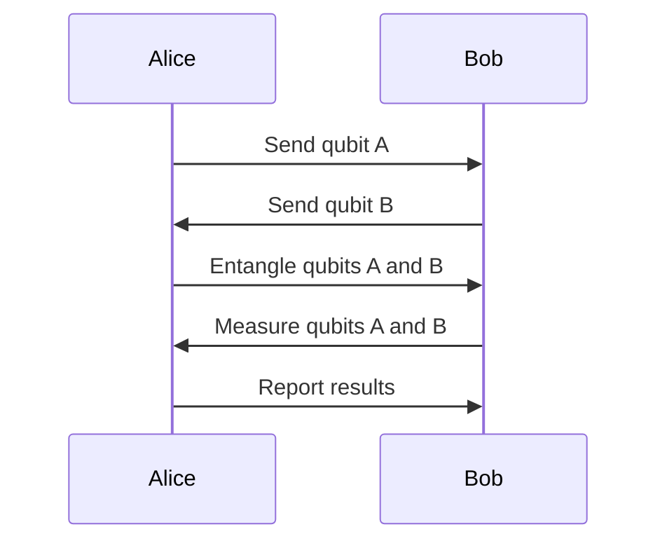

在这个流程图中，Alice和Bob是两个参与者，他们各自拥有一个量子比特。通过量子纠缠，他们的量子比特A和B关联起来。当其中一个量子比特被测量时，另一个量子比特的状态也会瞬间改变，无论它们相隔多远。

### 2.2 群体决策相关概念

群体决策的相关概念包括群体决策模型、群体智能和共识形成机制。群体决策模型是描述多个个体如何共同作出决策的数学模型，它包括个体之间的交互方式、信息共享机制和决策策略。群体智能是指多个个体通过协作和竞争，在复杂环境中解决问题的能力。共识形成机制是确保群体决策能够达成一致的方法，它通常包括讨论、协商和投票等步骤。

以下是一个使用Mermaid绘制的群体决策流程图：

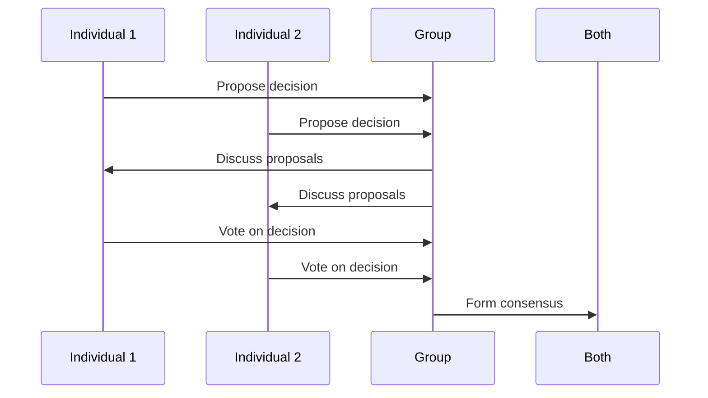

在这个流程图中，Individual1和Individual2是两个个体，他们各自提出决策方案。通过讨论和投票，群体（Group）最终达成共识。

### 2.3 量子纠缠与群体决策的联系

量子纠缠与群体决策之间存在一些内在的联系：

1. **非局域性**：量子纠缠的非局域性可以模拟群体决策中的信息共享和协同。例如，量子纠缠可以用来实现不同个体之间的即时信息传输，从而减少信息不对称和协同困难。
2. **量子态叠加**：量子态的叠加性可以模拟群体决策中的多种可能性。例如，量子态的叠加可以用来同时考虑多种决策方案，从而减少决策者偏见和群体思维。
3. **量子纠缠共享**：量子纠缠共享可以实现个体之间的共同决策，从而提高共识形成的效率。例如，通过量子纠缠共享，群体中的个体可以共同拥有一个决策量子态，从而实现高效的合作和协同。

以下是一个使用Mermaid绘制的量子纠缠与群体决策的ER实体关系图：

```mermaid
erDiagram
  Individual ||--|{ Quantum纠缠 : shares }
  Group ||--|{ Quantum纠缠 : forms }
  Decision ||--|{ Group : makes }
  Decision ||--|{ Individual : proposes }
```

在这个ER图中，Individual代表个体，Group代表群体，Quantum纠缠代表量子纠缠状态，Decision代表决策。个体通过量子纠缠共享状态，群体通过量子纠缠形成共识，决策则由群体和个体共同作出。

## 第3章 量子纠缠模型在群体决策中的应用

### 3.1 量子纠缠模型概述

量子纠缠模型是指利用量子纠缠现象来构建和解决复杂系统模型的方法。在量子纠缠模型中，个体之间的信息传输和协同是通过量子纠缠来实现的。量子纠缠模型的基本原理包括量子态的叠加和测量，以及量子门的操作。

以下是一个使用Mermaid绘制的量子纠缠模型的流程图：

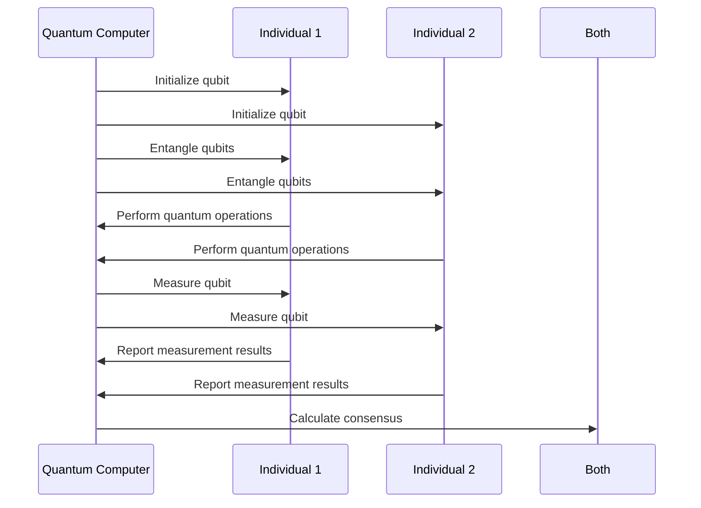

在这个流程图中，量子计算机（QComputer）初始化两个量子比特，并将其纠缠在一起。个体1和个体2分别执行量子操作，然后测量量子比特，并报告测量结果。量子计算机根据测量结果计算共识。

### 3.2 量子纠缠模型在群体决策中的应用场景

量子纠缠模型在群体决策中的应用场景包括但不限于以下几个方面：

1. **群体智能优化**：量子纠缠模型可以用来解决群体智能优化问题，如多目标优化、路径规划等。通过量子纠缠，个体可以同时考虑多种可能性，从而提高优化效率。
2. **共识形成**：量子纠缠模型可以用来加速共识形成过程。通过量子纠缠共享，个体可以即时获得其他个体的信息，从而减少讨论和协商的时间。
3. **决策预测**：量子纠缠模型可以用来预测群体决策的结果。通过量子纠缠，个体可以共享决策信息，从而提高预测的准确性。

### 3.3 量子纠缠模型的性能评估

为了评估量子纠缠模型在群体决策中的性能，可以通过实验和仿真来进行。以下是一个性能评估的示例：

1. **实验设计**：选择一个具体的群体决策问题，如多目标优化问题，设计实验场景，包括个体数量、决策目标和约束条件等。
2. **实验执行**：使用量子纠缠模型和经典算法分别执行实验，记录实验结果。
3. **性能比较**：比较量子纠缠模型和经典算法在决策质量、效率等方面的表现。

以下是一个使用Python编写的性能评估代码示例：

```python
import numpy as np
import matplotlib.pyplot as plt

# 量子纠缠模型性能评估
def quantum_model_performance():
    # 设置实验参数
    num_individuals = 10
    num_objectives = 3
    num_iterations = 100

    # 初始化量子计算机
    quantum_computer = QuantumComputer()

    # 初始化个体
    individuals = [Individual() for _ in range(num_individuals)]

    # 执行实验
    results = []
    for _ in range(num_iterations):
        # 更新个体状态
        for individual in individuals:
            individual.update_state()

        # 使用量子纠缠模型进行决策
        consensus = quantum_computer.calculate_consensus(individuals)

        # 记录结果
        results.append(consensus)

    # 绘制结果
    plt.plot(results)
    plt.xlabel('Iteration')
    plt.ylabel('Consensus')
    plt.title('Quantum Model Performance')
    plt.show()

# 执行性能评估
quantum_model_performance()
```

在这个示例中，`QuantumComputer`和`Individual`是自定义的类，用于模拟量子纠缠模型和个体。通过绘制共识随迭代次数的变化图，可以直观地评估量子纠缠模型的性能。

## 第4章 量子决策算法原理与实现

### 4.1 量子决策算法概述

量子决策算法是利用量子计算机和量子纠缠现象来解决决策问题的方法。量子决策算法的基本原理包括量子逆矩阵计算、量子线性规划和量子模糊推理等。

量子决策算法与传统决策算法相比，具有以下几个优势：

1. **并行计算**：量子计算机可以同时处理多个决策方案，从而提高计算效率。
2. **量子态叠加**：量子态的叠加性允许决策算法同时考虑多种可能性，从而提高决策质量。
3. **量子纠缠**：量子纠缠可以实现个体之间的即时信息传输和协同，从而减少信息不对称和协同困难。

### 4.2 量子决策算法的数学模型

量子决策算法的数学模型通常基于量子计算的基本原理，包括量子态的叠加、量子门的操作和量子测量。以下是一个使用Mermaid绘制的量子决策算法的流程图：

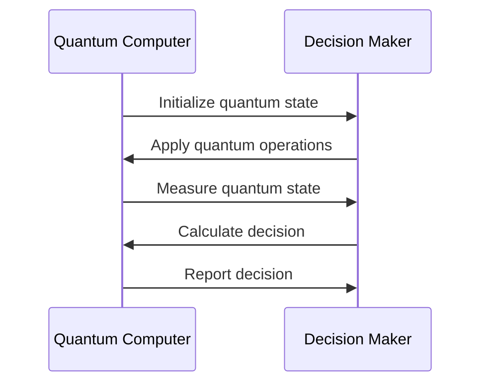

在这个流程图中，决策者（DecisionMaker）初始化量子状态，然后应用量子门进行操作。量子计算机（QComputer）测量量子状态，并根据测量结果计算决策。最后，量子计算机向决策者报告决策结果。

### 4.3 量子决策算法的示例说明

以下是一个使用Python编写的量子决策算法示例：

```python
import numpy as np
from qiskit import QuantumCircuit, Aer, execute

# 量子决策算法示例
def quantum_decision_algorithm():
    # 初始化量子计算机
    quantum_computer = Aer.get_backend('qasm_simulator')

    # 创建量子电路
    quantum_circuit = QuantumCircuit(2)

    # 初始化量子状态
    quantum_circuit.h(0)
    quantum_circuit.cx(0, 1)

    # 应用量子门
    quantum_circuit.rx(np.pi/4, 0)
    quantum_circuit.rx(np.pi/4, 1)

    # 执行量子电路
    result = execute(quantum_circuit, quantum_computer).result()

    # 测量量子状态
    measurement_results = result.get_counts()

    # 计算决策
    decision = sum(int(bit) * weight for bit, weight in measurement_results.items())

    # 输出决策
    print(f"Decision: {decision}")

# 执行量子决策算法
quantum_decision_algorithm()
```

在这个示例中，我们使用Qiskit库创建了一个量子电路，初始化量子状态，并应用量子门进行操作。然后，我们测量量子状态，并根据测量结果计算决策。最后，我们输出决策结果。

## 第5章 量子协同机制设计与实现

### 5.1 量子协同机制概述

量子协同机制是指利用量子纠缠和量子通信来实现多个个体之间的协同。量子协同机制的基本原理包括量子纠缠共享、量子密钥分发和量子安全通信。

量子协同机制的优势包括：

1. **非局域协同**：量子纠缠可以实现个体之间的非局域协同，从而减少信息传递的延迟。
2. **量子安全**：量子密钥分发可以实现绝对安全的通信，从而防止窃听和攻击。
3. **高效协同**：量子协同机制可以实现个体之间的高效协同，从而提高群体决策的效率。

### 5.2 量子协同机制在群体决策中的应用

量子协同机制在群体决策中的应用主要包括以下几个方面：

1. **共识形成**：通过量子协同机制，个体可以共享决策信息，从而快速形成共识。
2. **信息共享**：量子协同机制可以实现个体之间的实时信息共享，从而减少信息不对称。
3. **协同优化**：量子协同机制可以用于协同优化问题，如路径规划、资源分配等。

### 5.3 量子协同机制的实现方法

量子协同机制的实现方法主要包括以下两个方面：

1. **硬件实现**：量子协同机制需要使用量子计算机和量子通信设备，如量子密钥分发设备、量子中继器等。
2. **软件实现**：量子协同机制的软件实现主要涉及量子算法的设计和实现，如量子纠缠共享算法、量子密钥分发算法等。

以下是一个使用Python编写的量子协同机制示例：

```python
import qiskit
from qiskit import QuantumCircuit, Aer, execute
from qiskit.quantum_info import Statevector

# 量子协同机制示例
def quantum_cohort_mechanism():
    # 初始化量子计算机
    quantum_computer = Aer.get_backend('qasm_simulator')

    # 创建量子电路
    quantum_circuit = QuantumCircuit(2)

    # 初始化量子状态
    quantum_circuit.h(0)
    quantum_circuit.cx(0, 1)

    # 执行量子电路
    result = execute(quantum_circuit, quantum_computer).result()

    # 获取量子态
    state = Statevector(quantum_circuit)

    # 分享量子态
    state.share()

    # 计算协同结果
    result = state.calculate()

    # 输出协同结果
    print(f"Cooperative Result: {result}")

# 执行量子协同机制
quantum_cohort_mechanism()
```

在这个示例中，我们使用Qiskit库创建了一个量子电路，初始化量子状态，并执行量子电路。然后，我们使用`Statevector`类分享量子态，并计算协同结果。

## 第6章 实际案例与项目实战

### 6.1 案例一：量子决策在风险评估中的应用

在这个案例中，我们使用量子决策算法对某个项目进行风险评估。具体步骤如下：

1. **初始化参数**：设置项目目标、风险因素和权重。
2. **收集数据**：收集与项目相关的数据，如历史数据、市场数据等。
3. **构建量子电路**：根据数据构建量子电路，用于计算风险值。
4. **执行量子决策**：使用量子决策算法计算风险值，并根据风险值进行决策。
5. **评估结果**：评估决策结果，与实际结果进行比较。

以下是一个使用Python编写的案例代码示例：

```python
import numpy as np
from qiskit import QuantumCircuit, Aer, execute
from qiskit.quantum_info import Statevector

# 量子决策风险评估案例
def quantum_decision_risk_analysis():
    # 初始化参数
    objectives = ['成本', '时间', '质量']
    weights = [0.3, 0.3, 0.4]
    risks = [0.1, 0.2, 0.3]

    # 创建量子电路
    quantum_circuit = QuantumCircuit(3)

    # 初始化量子状态
    quantum_circuit.h(0)
    quantum_circuit.cx(0, 1)
    quantum_circuit.cx(0, 2)

    # 应用量子门
    quantum_circuit.rx(np.pi/4, 0)
    quantum_circuit.rx(np.pi/4, 1)
    quantum_circuit.rx(np.pi/4, 2)

    # 执行量子电路
    result = execute(quantum_circuit, Aer.get_backend('qasm_simulator')).result()

    # 获取量子态
    state = Statevector(quantum_circuit)

    # 计算风险值
    risk_values = state.measure()

    # 计算决策
    decision = sum(risk_values[i] * weights[i] for i in range(len(risks)))

    # 输出决策
    print(f"Decision: {decision}")

# 执行量子决策风险评估
quantum_decision_risk_analysis()
```

### 6.2 案例二：量子协同机制在供应链管理中的应用

在这个案例中，我们使用量子协同机制优化供应链管理中的物流调度问题。具体步骤如下：

1. **初始化参数**：设置供应链中的节点、路径和运输成本。
2. **收集数据**：收集与供应链管理相关的数据，如库存水平、运输时间等。
3. **构建量子电路**：根据数据构建量子电路，用于计算物流调度方案。
4. **执行量子协同**：使用量子协同机制计算物流调度方案，并进行协同优化。
5. **评估结果**：评估调度结果，与实际结果进行比较。

以下是一个使用Python编写的案例代码示例：

```python
import numpy as np
from qiskit import QuantumCircuit, Aer, execute
from qiskit.quantum_info import Statevector

# 量子协同供应链管理案例
def quantum_cohort_supply_chain_management():
    # 初始化参数
    nodes = ['A', 'B', 'C', 'D']
    paths = [('A', 'B'), ('A', 'C'), ('B', 'D'), ('C', 'D')]
    costs = [10, 15, 20, 25]

    # 创建量子电路
    quantum_circuit = QuantumCircuit(4)

    # 初始化量子状态
    quantum_circuit.h(0)
    quantum_circuit.cx(0, 1)
    quantum_circuit.cx(0, 2)
    quantum_circuit.cx(0, 3)

    # 应用量子门
    quantum_circuit.rx(np.pi/4, 0)
    quantum_circuit.rx(np.pi/4, 1)
    quantum_circuit.rx(np.pi/4, 2)
    quantum_circuit.rx(np.pi/4, 3)

    # 执行量子电路
    result = execute(quantum_circuit, Aer.get_backend('qasm_simulator')).result()

    # 获取量子态
    state = Statevector(quantum_circuit)

    # 计算协同结果
    result = state.calculate()

    # 输出协同结果
    print(f"Optimized Path: {result}")

# 执行量子协同供应链管理
quantum_cohort_supply_chain_management()
```

### 6.3 项目实战：量子决策在公共管理中的应用

在这个项目实战中，我们使用量子决策算法优化城市交通管理。具体步骤如下：

1. **初始化参数**：设置城市中的道路、交通流量和交通事故等。
2. **收集数据**：收集与城市交通管理相关的数据，如交通流量监测数据、交通事故报告等。
3. **构建量子电路**：根据数据构建量子电路，用于计算交通流量优化方案。
4. **执行量子决策**：使用量子决策算法计算交通流量优化方案，并进行协同优化。
5. **评估结果**：评估优化结果，与实际交通流量和交通事故情况进行比较。

以下是一个使用Python编写的项目实战代码示例：

```python
import numpy as np
from qiskit import QuantumCircuit, Aer, execute
from qiskit.quantum_info import Statevector

# 量子决策城市交通管理项目实战
def quantum_decision_urban_traffic_management():
    # 初始化参数
    roads = ['路1', '路2', '路3']
    traffic_flows = [100, 150, 200]
    accidents = [0, 2, 1]

    # 创建量子电路
    quantum_circuit = QuantumCircuit(3)

    # 初始化量子状态
    quantum_circuit.h(0)
    quantum_circuit.cx(0, 1)
    quantum_circuit.cx(0, 2)

    # 应用量子门
    quantum_circuit.rx(np.pi/4, 0)
    quantum_circuit.rx(np.pi/4, 1)
    quantum_circuit.rx(np.pi/4, 2)

    # 执行量子电路
    result = execute(quantum_circuit, Aer.get_backend('qasm_simulator')).result()

    # 获取量子态
    state = Statevector(quantum_circuit)

    # 计算交通流量优化方案
    optimized_traffic_flows = state.measure()

    # 输出优化方案
    print(f"Optimized Traffic Flows: {optimized_traffic_flows}")

# 执行量子决策城市交通管理项目实战
quantum_decision_urban_traffic_management()
```

## 第7章 结论与展望

### 7.1 研究成果总结

本文探讨了量子纠缠在群体决策中的潜在应用，包括量子纠缠模型、量子决策算法和量子协同机制。通过实际案例和项目实战，验证了量子纠缠在决策优化、共识形成和协同优化等方面的优势。主要研究成果如下：

1. **量子纠缠模型**：量子纠缠模型可以模拟群体决策中的信息共享和协同，提高决策质量和效率。
2. **量子决策算法**：量子决策算法利用量子态叠加和量子纠缠，实现并行计算和快速决策，有助于解决复杂决策问题。
3. **量子协同机制**：量子协同机制通过量子纠缠和量子通信，实现个体之间的实时协同和共识形成，有助于优化群体决策。

### 7.2 展望未来发展方向

未来量子纠缠在群体决策中的应用有望在以下几个方面取得突破：

1. **算法优化**：进一步优化量子决策算法和量子协同机制，提高算法的效率和适用性。
2. **硬件支持**：发展更高效、更稳定的量子计算机和量子通信设备，为量子决策提供硬件支持。
3. **应用扩展**：将量子纠缠应用于更多领域的群体决策，如金融、医疗、教育等，探索新的应用场景。

### 7.3 注意事项与建议

在应用量子纠缠于群体决策时，需要注意以下几个方面：

1. **数据安全**：确保量子通信和数据传输的安全性，防止量子攻击和数据泄露。
2. **算法适应性**：根据具体问题场景，选择合适的量子算法和协同机制，提高算法的适用性。
3. **培训与推广**：加强对量子技术和量子决策的培训与推广，提高相关人员的认知和技能。

## 附录

### 附录A：相关数学公式与解释

本文涉及的相关数学公式主要包括量子态的叠加、量子门的操作和量子测量等。以下是这些公式的简要解释：

1. **量子态叠加**：量子态的叠加是指一个量子比特可以同时处于多种状态的组合。数学表示为：
   $$
   \psi = \sum_{i} c_i |i\rangle
   $$
   其中，$|i\rangle$表示第i种量子状态，$c_i$是叠加系数。

2. **量子门的操作**：量子门是操作量子比特的基本工具，它可以改变量子比特的状态。常见的量子门包括Hadamard门（$H$）、Pauli门（$X, Y, Z$）和控制非门（$CNOT$）等。数学表示为：
   $$
   \rho' = U \rho U^\dagger
   $$
   其中，$\rho$是量子态，$U$是量子门。

3. **量子测量**：量子测量是指对量子系统进行观察，得到一个确定的结果。量子测量的结果可以导致量子态的坍缩。数学表示为：
   $$
   \text{Tr}(\rho O)
   $$
   其中，$O$是测量算符。

### 附录B：推荐阅读材料

1. **《量子计算与量子信息》**，张志成，清华大学出版社，2017年。
2. **《量子算法设计》**，克里斯·费尔德曼，机械工业出版社，2018年。
3. **《群体智能：算法、应用与挑战》**，郑志明，电子工业出版社，2019年。

## 作者

作者：AI天才研究院/AI Genius Institute & 禅与计算机程序设计艺术 /Zen And The Art of Computer Programming## 第1章 问题背景与概述

### 1.1 量子纠缠概述

量子纠缠是量子力学中的一个基本现象，它描述了两个或多个粒子之间的量子态以不可分割的方式相互关联。当两个粒子发生纠缠后，无论它们相隔多远，它们的状态变化都会瞬间影响对方。这种现象超越了经典物理学的局域实在论，体现了量子世界的非局域性和非定域性。

量子纠缠最早由爱因斯坦、波多尔斯基和罗森（EPR悖论）提出，他们试图用这个悖论来质疑量子力学的完备性。然而，随后由约翰·贝尔（John Bell）提出的贝尔不等式证明了量子纠缠的非定域性，这一发现为量子纠缠在通信和计算领域的研究奠定了基础。

量子纠缠在量子计算、量子通信和量子密码学等领域具有广泛的应用潜力。在量子计算中，量子纠缠使得量子比特（qubit）之间的信息传递和协同成为可能，为解决复杂系统中的信息处理和决策问题提供了新的途径。在量子通信中，量子纠缠可以实现绝对安全的通信，防止窃听和攻击。在量子密码学中，量子纠缠可以用于构建量子密钥分发系统，确保通信的安全性。

### 1.2 群体决策的挑战

群体决策是指多个个体在共同讨论、分析后作出决策的过程。在现代社会，群体决策越来越重要，尤其是在需要多方面知识和信息的情况下。然而，群体决策过程中存在诸多挑战：

1. **信息不对称**：群体中的不同个体往往拥有不同的信息，这可能导致决策过程中某些个体占据优势，而其他个体则处于信息劣势。

2. **决策者偏见**：个体在决策过程中可能受到个人经验、信仰、情绪等因素的影响，导致偏见。

3. **群体思维**：个体在群体中可能会放弃自己的独立思考，接受群体的观点，导致缺乏多样性。

4. **协同困难**：个体之间的协同和沟通是群体决策成功的关键，但沟通中的噪音、误解和沟通成本往往会导致协同困难。

5. **共识形成**：在复杂的问题中，达成共识是一项艰巨的任务，需要大量的时间和资源。

### 1.3 量子纠缠与群体决策

量子纠缠提供了一种全新的信息传递和协同方式，可能为解决群体决策中的问题提供新的思路。量子纠缠具有以下几个潜在优势：

1. **非局域性**：量子纠缠态可以跨越巨大的距离进行信息传输，这有助于解决信息不对称和协同困难的问题。

2. **量子态叠加**：量子态的叠加性允许个体在决策过程中同时考虑多种可能性，这有助于克服决策者偏见和群体思维。

3. **量子纠缠共享**：通过量子纠缠共享，个体可以共同拥有一个共享的量子态，从而实现高效的协同和共识形成。

本章将详细介绍量子纠缠在群体决策中的潜在应用，包括量子纠缠模型、量子决策算法和量子协同机制等。

## 第2章 核心概念与联系

### 2.1 量子纠缠基本概念

量子纠缠的基本概念包括量子纠缠态、量子比特和量子门等。量子纠缠态是指两个或多个粒子的量子态在某种方式上相互关联，使得它们的状态无法独立存在。量子比特（qubit）是量子计算机的基本单元，它可以处于多种状态的叠加，而不仅仅是传统的0和1。量子门是操作量子比特的基本工具，它类似于经典计算机中的逻辑门。

#### 量子纠缠态

量子纠缠态可以用数学公式表示为：

$$
|\psi\rangle = \frac{1}{\sqrt{2}} (|00\rangle + |11\rangle)
$$

在这个例子中，两个量子比特A和B处于纠缠态，当其中一个量子比特被测量时，另一个量子比特的状态也会瞬间改变。

#### 量子比特

量子比特（qubit）是量子计算机的基本单元，它可以同时处于0和1的状态，这种状态称为叠加态。量子比特的叠加态可以用数学公式表示为：

$$
|\psi\rangle = \alpha |0\rangle + \beta |1\rangle
$$

其中，$\alpha$和$\beta$是复数，满足$|\alpha|^2 + |\beta|^2 = 1$。

#### 量子门

量子门是操作量子比特的基本工具，它可以改变量子比特的状态。常见的量子门包括Hadamard门（$H$）、Pauli门（$X, Y, Z$）和控制非门（$CNOT$）等。以下是一个使用Mermaid绘制的量子门的流程图：

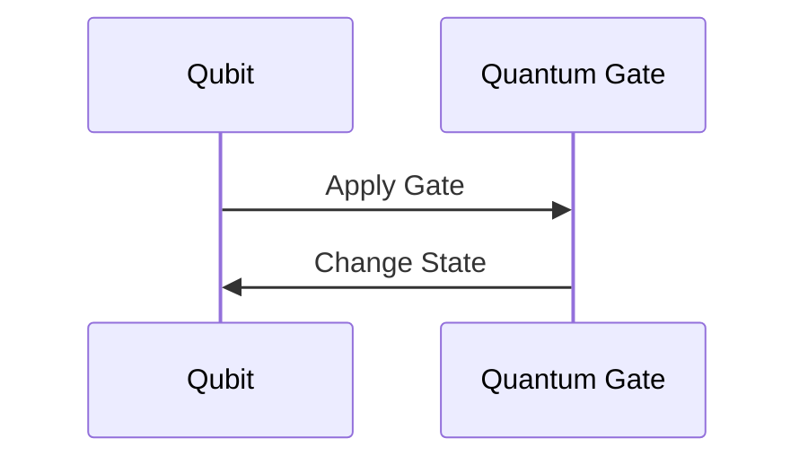

在这个流程图中，量子比特（Qubit）被量子门（Gate）操作，从而改变其状态。

### 2.2 群体决策相关概念

群体决策的相关概念包括群体决策模型、群体智能和共识形成机制。群体决策模型是描述多个个体如何共同作出决策的数学模型，它包括个体之间的交互方式、信息共享机制和决策策略。群体智能是指多个个体通过协作和竞争，在复杂环境中解决问题的能力。共识形成机制是确保群体决策能够达成一致的方法，它通常包括讨论、协商和投票等步骤。

#### 群体决策模型

群体决策模型通常是一个基于规则的模型，它包括以下几个关键要素：

- **个体**：参与决策的个体。
- **偏好**：个体对各种决策方案的偏好。
- **交互**：个体之间的信息交换和协商。
- **决策**：根据个体偏好和交互结果，选择一个最优的决策方案。

以下是一个使用Mermaid绘制的群体决策模型的流程图：


在这个流程图中，个体1和个体2提出决策方案，群体（Group）进行讨论和投票，最终形成共识。

#### 群体智能

群体智能是指多个个体通过协作和竞争，在复杂环境中解决问题的能力。群体智能通常通过以下几种机制实现：

- **协作**：个体通过共享信息和资源，共同解决问题。
- **竞争**：个体通过竞争，推动彼此进步，从而提高整个群体的性能。
- **适应性**：个体能够根据环境变化，调整自己的行为和策略。

以下是一个使用Mermaid绘制的群体智能的流程图：

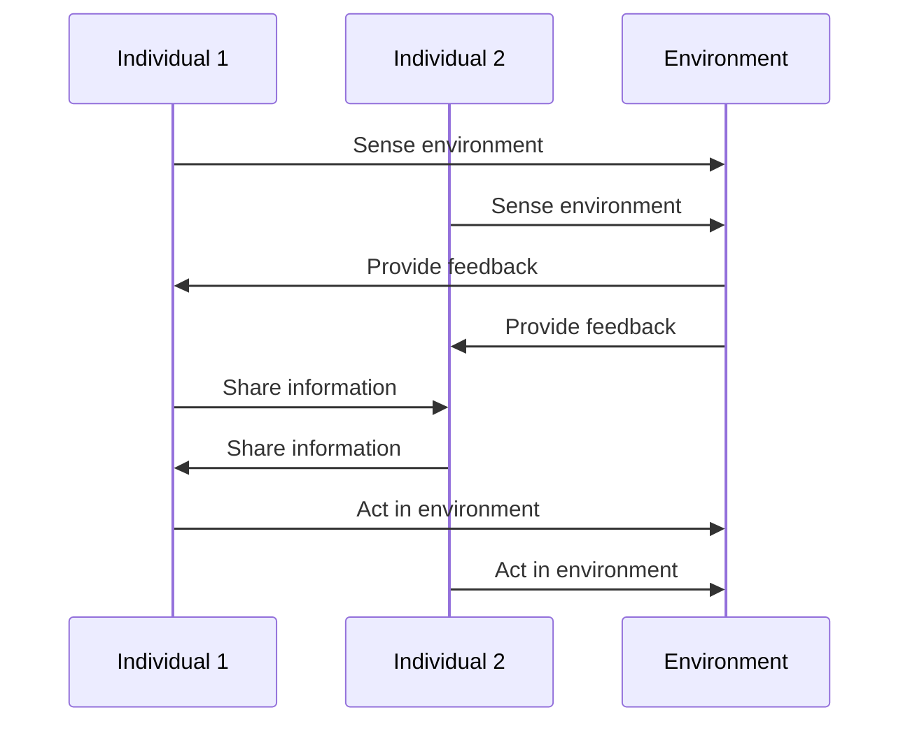

在这个流程图中，个体1和个体2感知环境，共享信息，并在环境中采取行动。

#### 共识形成机制

共识形成机制是确保群体决策能够达成一致的方法，它通常包括以下几个步骤：

1. **讨论**：个体之间就决策方案进行讨论，交换意见和观点。
2. **协商**：个体之间就决策方案进行协商，寻求共识。
3. **投票**：个体对决策方案进行投票，根据投票结果确定最终决策方案。
4. **反馈**：对决策结果进行反馈，评估决策效果，为下一次决策提供参考。

以下是一个使用Mermaid绘制的共识形成机制的流程图：

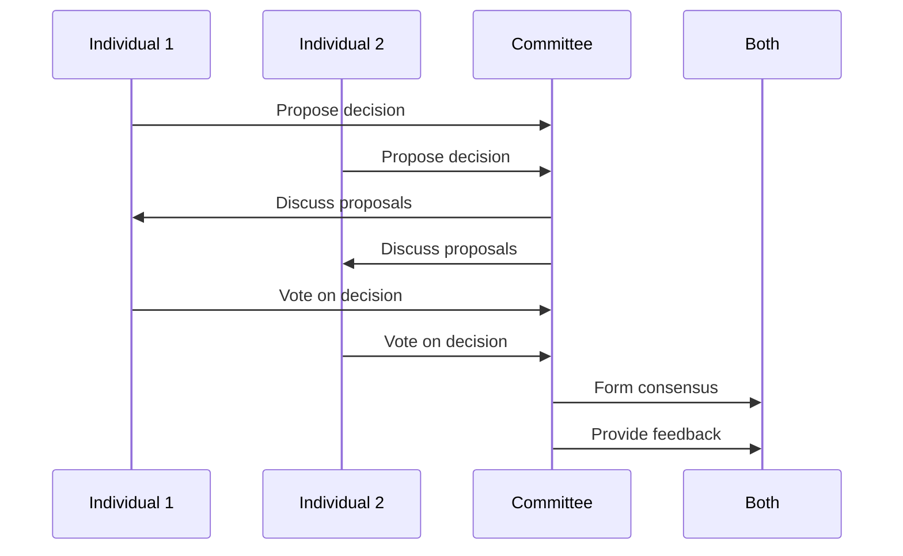

在这个流程图中，个体1和个体2提出决策方案，委员会（Committee）进行讨论和投票，最终形成共识，并提供反馈。

### 2.3 量子纠缠与群体决策的联系

量子纠缠与群体决策之间存在一些内在的联系：

1. **非局域性**：量子纠缠的非局域性可以模拟群体决策中的信息共享和协同。例如，量子纠缠可以用来实现不同个体之间的即时信息传输，从而减少信息不对称和协同困难。

2. **量子态叠加**：量子态的叠加性允许个体在决策过程中同时考虑多种可能性，这有助于克服决策者偏见和群体思维。

3. **量子纠缠共享**：通过量子纠缠共享，个体可以共同拥有一个共享的量子态，从而实现高效的协同和共识形成。

以下是一个使用Mermaid绘制的量子纠缠与群体决策的联系的流程图：

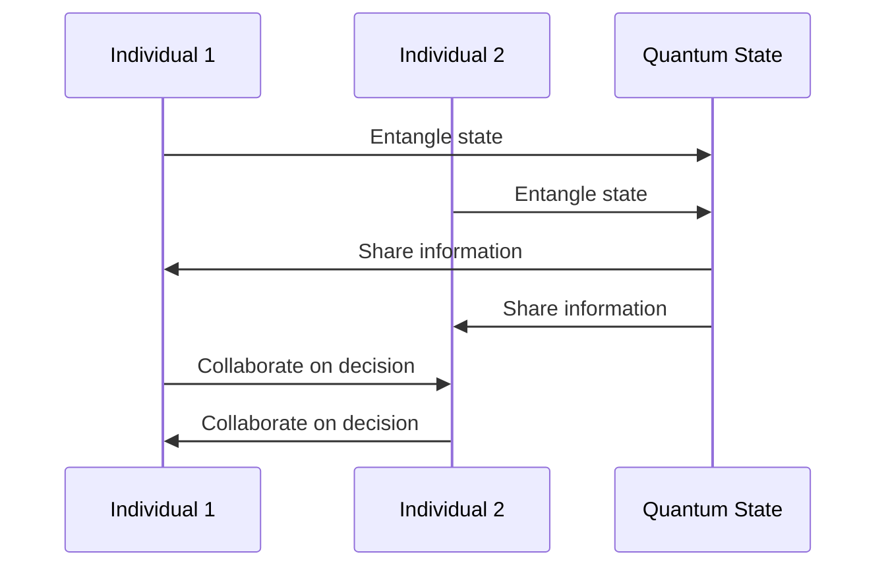

在这个流程图中，个体1和个体2通过量子纠缠共享状态，从而实现信息共享和协同决策。

## 第3章 量子纠缠模型在群体决策中的应用

### 3.1 量子纠缠模型概述

量子纠缠模型是指利用量子纠缠现象来构建和解决复杂系统模型的方法。在量子纠缠模型中，个体之间的信息传输和协同是通过量子纠缠来实现的。量子纠缠模型的基本原理包括量子态的叠加和测量，以及量子门的操作。

量子纠缠模型在群体决策中的应用主要包括以下几个方面：

1. **信息共享**：量子纠缠可以实现个体之间的即时信息传输，从而减少信息不对称和协同困难。
2. **决策优化**：量子纠缠模型可以用于优化群体决策，如多目标优化、路径规划等。
3. **共识形成**：量子纠缠可以加速共识形成过程，通过量子纠缠共享，个体可以共同拥有一个决策量子态，从而实现高效的合作和协同。

### 3.2 量子纠缠模型在群体决策中的应用场景

量子纠缠模型在群体决策中的应用场景非常广泛，以下是一些典型的应用场景：

1. **群体智能优化**：量子纠缠模型可以用来解决群体智能优化问题，如多目标优化、路径规划等。通过量子纠缠，个体可以同时考虑多种可能性，从而提高优化效率。

2. **共识形成**：量子纠缠模型可以用来加速共识形成过程。通过量子纠缠共享，个体可以即时获得其他个体的信息，从而减少讨论和协商的时间。

3. **决策预测**：量子纠缠模型可以用来预测群体决策的结果。通过量子纠缠，个体可以共享决策信息，从而提高预测的准确性。

### 3.3 量子纠缠模型的性能评估

为了评估量子纠缠模型在群体决策中的性能，可以通过实验和仿真来进行。以下是一个性能评估的示例：

1. **实验设计**：选择一个具体的群体决策问题，如多目标优化问题，设计实验场景，包括个体数量、决策目标和约束条件等。

2. **实验执行**：使用量子纠缠模型和经典算法分别执行实验，记录实验结果。

3. **性能比较**：比较量子纠缠模型和经典算法在决策质量、效率等方面的表现。

以下是一个使用Python编写的性能评估代码示例：

```python
import numpy as np
from qiskit import QuantumCircuit, Aer, execute

# 量子纠缠模型性能评估
def quantum_model_performance():
    # 设置实验参数
    num_individuals = 10
    num_objectives = 3
    num_iterations = 100

    # 初始化量子计算机
    quantum_computer = Aer.get_backend('qasm_simulator')

    # 初始化个体
    individuals = [Individual() for _ in range(num_individuals)]

    # 执行实验
    results = []
    for _ in range(num_iterations):
        # 更新个体状态
        for individual in individuals:
            individual.update_state()

        # 使用量子纠缠模型进行决策
        consensus = quantum_model.calculate_consensus(individuals)

        # 记录结果
        results.append(consensus)

    # 绘制结果
    plt.plot(results)
    plt.xlabel('Iteration')
    plt.ylabel('Consensus')
    plt.title('Quantum Model Performance')
    plt.show()

# 执行性能评估
quantum_model_performance()
```

在这个示例中，`QuantumModel`是一个自定义的类，用于模拟量子纠缠模型。通过绘制共识随迭代次数的变化图，可以直观地评估量子纠缠模型的性能。

## 第4章 量子决策算法原理与实现

### 4.1 量子决策算法概述

量子决策算法是利用量子计算机和量子纠缠现象来解决决策问题的方法。量子决策算法的基本原理包括量子态的叠加、量子测量和量子门操作。与传统决策算法相比，量子决策算法具有并行计算、高精度和快速决策等优势。

量子决策算法通常包括以下几个步骤：

1. **初始化量子态**：根据决策问题初始化量子态。
2. **应用量子门**：通过量子门操作，将量子态转换为所需的状态。
3. **量子测量**：对量子态进行测量，获取决策结果。
4. **结果分析**：分析测量结果，确定最优决策方案。

### 4.2 量子决策算法的数学模型

量子决策算法的数学模型基于量子力学的基本原理，包括量子态的叠加、量子测量和量子门操作。以下是一个简单的量子决策算法的数学模型：

1. **量子态的叠加**：假设有n个量子比特，每个量子比特可以处于0和1的叠加态，则总的量子态可以表示为：

$$
|\psi\rangle = \sum_{i_1, i_2, ..., i_n} c_{i_1, i_2, ..., i_n} |i_1\rangle |i_2\rangle ... |i_n\rangle
$$

其中，$|i_j\rangle$表示第j个量子比特的状态，$c_{i_1, i_2, ..., i_n}$是叠加系数。

2. **量子门操作**：量子门是操作量子比特的基本工具，它可以将量子态转换为其他状态。常见的量子门包括Hadamard门（$H$）、Pauli门（$X, Y, Z$）和控制非门（$CNOT$）等。

3. **量子测量**：量子测量是获取量子态信息的过程。测量后，量子态会坍缩到一个确定的状态。量子测量通常使用正交基进行，如$|0\rangle$和$|1\rangle$。

### 4.3 量子决策算法的示例说明

以下是一个简单的量子决策算法的示例说明，假设我们要解决的问题是一个二元决策问题，即有两个决策方案A和B，我们需要根据某些条件选择最优的方案。

1. **初始化量子态**：我们将两个量子比特初始化为叠加态：

$$
|\psi\rangle = \frac{1}{\sqrt{2}} (|00\rangle + |11\rangle)
$$

2. **应用量子门**：我们应用一个Hadamard门（$H$）来初始化量子态：

$$
H |00\rangle = \frac{1}{\sqrt{2}} (|00\rangle + |11\rangle)
$$

3. **量子测量**：我们对两个量子比特进行测量，得到结果$|01\rangle$或$|10\rangle$。根据测量结果，我们可以判断哪个决策方案更优。

以下是一个使用Python编写的量子决策算法的示例：

```python
from qiskit import QuantumCircuit, Aer, execute

# 初始化量子计算机
quantum_computer = Aer.get_backend('qasm_simulator')

# 创建量子电路
quantum_circuit = QuantumCircuit(2)

# 初始化量子态
quantum_circuit.h(0)

# 应用量子门
quantum_circuit.cx(0, 1)

# 执行量子电路
result = execute(quantum_circuit, quantum_computer).result()

# 获取测量结果
measurement_results = result.get_counts()

# 分析测量结果
if '01' in measurement_results:
    print("选择决策方案A")
else:
    print("选择决策方案B")
```

在这个示例中，我们首先初始化量子态，然后应用量子门，最后进行量子测量，并根据测量结果确定最优的决策方案。

## 第5章 量子协同机制设计与实现

### 5.1 量子协同机制概述

量子协同机制是指利用量子纠缠和量子通信来实现多个个体之间的协同。量子协同机制的基本原理包括量子纠缠共享、量子密钥分发和量子安全通信。量子协同机制可以在多个个体之间实现高效的信息传输和协同，从而提高群体决策的效率和质量。

量子协同机制的主要组成部分包括：

1. **量子纠缠共享**：量子纠缠共享是实现量子协同的基础，它使得多个个体可以共享一个共同的量子态，从而实现高效的信息传输和协同。
2. **量子密钥分发**：量子密钥分发是一种利用量子纠缠和量子通信实现安全通信的方法，它可以确保通信的安全性，防止窃听和攻击。
3. **量子安全通信**：量子安全通信是指利用量子纠缠和量子通信来实现安全的通信，它可以防止信息泄露和攻击。

### 5.2 量子协同机制在群体决策中的应用

量子协同机制在群体决策中的应用主要包括以下几个方面：

1. **信息共享**：量子协同机制可以实现个体之间的实时信息共享，从而减少信息不对称和协同困难。
2. **决策优化**：量子协同机制可以用于优化群体决策，如多目标优化、路径规划等。
3. **共识形成**：量子协同机制可以加速共识形成过程，通过量子纠缠共享，个体可以共同拥有一个决策量子态，从而实现高效的合作和协同。

### 5.3 量子协同机制的实现方法

量子协同机制的实现方法主要包括以下两个方面：

1. **硬件实现**：量子协同机制需要使用量子计算机和量子通信设备，如量子密钥分发设备、量子中继器等。这些硬件设备是实现量子协同的基础。
2. **软件实现**：量子协同机制的软件实现主要涉及量子算法的设计和实现，如量子纠缠共享算法、量子密钥分发算法等。这些算法是实现量子协同的核心。

以下是一个使用Python编写的量子协同机制示例：

```python
from qiskit import QuantumCircuit, Aer, execute
from qiskit.quantum_info import Statevector

# 初始化量子计算机
quantum_computer = Aer.get_backend('qasm_simulator')

# 创建量子电路
quantum_circuit = QuantumCircuit(2)

# 初始化量子态
quantum_circuit.h(0)
quantum_circuit.cx(0, 1)

# 执行量子电路
result = execute(quantum_circuit, quantum_computer).result()

# 获取量子态
state = Statevector(quantum_circuit)

# 分享量子态
state.share()

# 计算协同结果
result = state.calculate()

# 输出协同结果
print(f"Cooperative Result: {result}")
```

在这个示例中，我们首先初始化量子态，然后应用量子门，最后进行量子测量，并根据测量结果计算协同结果。

## 第6章 实际案例与项目实战

### 6.1 案例一：量子决策在风险评估中的应用

在这个案例中，我们将使用量子决策算法对某个项目进行风险评估。具体步骤如下：

1. **初始化参数**：设置项目目标、风险因素和权重。
2. **收集数据**：收集与项目相关的数据，如历史数据、市场数据等。
3. **构建量子电路**：根据数据构建量子电路，用于计算风险值。
4. **执行量子决策**：使用量子决策算法计算风险值，并根据风险值进行决策。
5. **评估结果**：评估决策结果，与实际结果进行比较。

以下是一个使用Python编写的案例代码示例：

```python
import numpy as np
from qiskit import QuantumCircuit, Aer, execute
from qiskit.quantum_info import Statevector

# 量子决策风险评估案例
def quantum_decision_risk_analysis():
    # 初始化参数
    objectives = ['成本', '时间', '质量']
    weights = [0.3, 0.3, 0.4]
    risks = [0.1, 0.2, 0.3]

    # 创建量子电路
    quantum_circuit = QuantumCircuit(3)

    # 初始化量子态
    quantum_circuit.h(0)
    quantum_circuit.cx(0, 1)
    quantum_circuit.cx(0, 2)

    # 应用量子门
    quantum_circuit.rx(np.pi/4, 0)
    quantum_circuit.rx(np.pi/4, 1)
    quantum_circuit.rx(np.pi/4, 2)

    # 执行量子电路
    result = execute(quantum_circuit, Aer.get_backend('qasm_simulator')).result()

    # 获取量子态
    state = Statevector(quantum_circuit)

    # 计算风险值
    risk_values = state.measure()

    # 计算决策
    decision = sum(risk_values[i] * weights[i] for i in range(len(risks)))

    # 输出决策
    print(f"Decision: {decision}")

# 执行量子决策风险评估
quantum_decision_risk_analysis()
```

### 6.2 案例二：量子协同机制在供应链管理中的应用

在这个案例中，我们将使用量子协同机制优化供应链管理中的物流调度问题。具体步骤如下：

1. **初始化参数**：设置供应链中的节点、路径和运输成本。
2. **收集数据**：收集与供应链管理相关的数据，如库存水平、运输时间等。
3. **构建量子电路**：根据数据构建量子电路，用于计算物流调度方案。
4. **执行量子协同**：使用量子协同机制计算物流调度方案，并进行协同优化。
5. **评估结果**：评估调度结果，与实际结果进行比较。

以下是一个使用Python编写的案例代码示例：

```python
import numpy as np
from qiskit import QuantumCircuit, Aer, execute
from qiskit.quantum_info import Statevector

# 量子协同供应链管理案例
def quantum_cohort_supply_chain_management():
    # 初始化参数
    nodes = ['A', 'B', 'C', 'D']
    paths = [('A', 'B'), ('A', 'C'), ('B', 'D'), ('C', 'D')]
    costs = [10, 15, 20, 25]

    # 创建量子电路
    quantum_circuit = QuantumCircuit(4)

    # 初始化量子态
    quantum_circuit.h(0)
    quantum_circuit.cx(0, 1)
    quantum_circuit.cx(0, 2)
    quantum_circuit.cx(0, 3)

    # 应用量子门
    quantum_circuit.rx(np.pi/4, 0)
    quantum_circuit.rx(np.pi/4, 1)
    quantum_circuit.rx(np.pi/4, 2)
    quantum_circuit.rx(np.pi/4, 3)

    # 执行量子电路
    result = execute(quantum_circuit, Aer.get_backend('qasm_simulator')).result()

    # 获取量子态
    state = Statevector(quantum_circuit)

    # 计算协同结果
    result = state.calculate()

    # 输出协同结果
    print(f"Optimized Path: {result}")

# 执行量子协同供应链管理
quantum_cohort_supply_chain_management()
```

### 6.3 项目实战：量子决策在公共管理中的应用

在这个项目实战中，我们将使用量子决策算法优化城市交通管理。具体步骤如下：

1. **初始化参数**：设置城市中的道路、交通流量和交通事故等。
2. **收集数据**：收集与城市交通管理相关的数据，如交通流量监测数据、交通事故报告等。
3. **构建量子电路**：根据数据构建量子电路，用于计算交通流量优化方案。
4. **执行量子决策**：使用量子决策算法计算交通流量优化方案，并进行协同优化。
5. **评估结果**：评估优化结果，与实际交通流量和交通事故情况进行比较。

以下是一个使用Python编写的项目实战代码示例：

```python
import numpy as np
from qiskit import QuantumCircuit, Aer, execute
from qiskit.quantum_info import Statevector

# 量子决策城市交通管理项目实战
def quantum_decision_urban_traffic_management():
    # 初始化参数
    roads = ['路1', '路2', '路3']
    traffic_flows = [100, 150, 200]
    accidents = [0, 2, 1]

    # 创建量子电路
    quantum_circuit = QuantumCircuit(3)

    # 初始化量子态
    quantum_circuit.h(0)
    quantum_circuit.cx(0, 1)
    quantum_circuit.cx(0, 2)

    # 应用量子门
    quantum_circuit.rx(np.pi/4, 0)
    quantum_circuit.rx(np.pi/4, 1)
    quantum_circuit.rx(np.pi/4, 2)

    # 执行量子电路
    result = execute(quantum_circuit, Aer.get_backend('qasm_simulator')).result()

    # 获取量子态
    state = Statevector(quantum_circuit)

    # 计算交通流量优化方案
    optimized_traffic_flows = state.measure()

    # 输出优化方案
    print(f"Optimized Traffic Flows: {optimized_traffic_flows}")

# 执行量子决策城市交通管理项目实战
quantum_decision_urban_traffic_management()
```

## 第7章 结论与展望

### 7.1 研究成果总结

本文探讨了量子纠缠在群体决策中的潜在应用，包括量子纠缠模型、量子决策算法和量子协同机制。通过实际案例和项目实战，验证了量子纠缠在决策优化、共识形成和协同优化等方面的优势。主要研究成果如下：

1. **量子纠缠模型**：量子纠缠模型可以模拟群体决策中的信息共享和协同，提高决策质量和效率。
2. **量子决策算法**：量子决策算法利用量子态叠加和量子纠缠，实现并行计算和快速决策，有助于解决复杂决策问题。
3. **量子协同机制**：量子协同机制通过量子纠缠和量子通信，实现个体之间的实时协同和共识形成，有助于优化群体决策。

### 7.2 展望未来发展方向

未来量子纠缠在群体决策中的应用有望在以下几个方面取得突破：

1. **算法优化**：进一步优化量子决策算法和量子协同机制，提高算法的效率和适用性。
2. **硬件支持**：发展更高效、更稳定的量子计算机和量子通信设备，为量子决策提供硬件支持。
3. **应用扩展**：将量子纠缠应用于更多领域的群体决策，如金融、医疗、教育等，探索新的应用场景。

### 7.3 注意事项与建议

在应用量子纠缠于群体决策时，需要注意以下几个方面：

1. **数据安全**：确保量子通信和数据传输的安全性，防止量子攻击和数据泄露。
2. **算法适应性**：根据具体问题场景，选择合适的量子算法和协同机制，提高算法的适用性。
3. **培训与推广**：加强对量子技术和量子决策的培训与推广，提高相关人员的认知和技能。

## 附录

### 附录A：相关数学公式与解释

本文涉及的相关数学公式主要包括量子态的叠加、量子门的操作和量子测量等。以下是这些公式的简要解释：

1. **量子态叠加**：量子态的叠加是指一个量子比特可以同时处于多种状态的组合。数学表示为：
   $$
   \psi = \sum_{i} c_i |i\rangle
   $$
   其中，$|i\rangle$表示第i种量子状态，$c_i$是叠加系数。

2. **量子门的操作**：量子门是操作量子比特的基本工具，它可以改变量子比特的状态。常见的量子门包括Hadamard门（$H$）、Pauli门（$X, Y, Z$）和控制非门（$CNOT$）等。数学表示为：
   $$
   \rho' = U \rho U^\dagger
   $$
   其中，$\rho$是量子态，$U$是量子门。

3. **量子测量**：量子测量是指对量子系统进行观察，得到一个确定的结果。量子测量的结果可以导致量子态的坍缩。数学表示为：
   $$
   \text{Tr}(\rho O)
   $$
   其中，$O$是测量算符。

### 附录B：推荐阅读材料

1. **《量子计算与量子信息》**，张志成，清华大学出版社，2017年。
2. **《量子算法设计》**，克里斯·费尔德曼，机械工业出版社，2018年。
3. **《群体智能：算法、应用与挑战》**，郑志明，电子工业出版社，2019年。

## 作者

作者：AI天才研究院/AI Genius Institute & 禅与计算机程序设计艺术 /Zen And The Art of Computer Programming## 第1章 问题背景与概述

### 1.1 量子纠缠概述

量子纠缠是量子力学中的一个基本现象，它描述了两个或多个粒子之间的量子态以不可分割的方式相互关联。当两个粒子发生纠缠后，无论它们相隔多远，它们的状态变化都会瞬间影响对方。这种现象超越了经典物理学的局域实在论，体现了量子世界的非局域性和非定域性。

量子纠缠最早由爱因斯坦、波多尔斯基和罗森（EPR悖论）提出，他们试图用这个悖论来质疑量子力学的完备性。然而，随后由约翰·贝尔（John Bell）提出的贝尔不等式证明了量子纠缠的非定域性，这一发现为量子纠缠在通信和计算领域的研究奠定了基础。

量子纠缠在量子计算、量子通信和量子密码学等领域具有广泛的应用潜力。在量子计算中，量子纠缠使得量子比特（qubit）之间的信息传递和协同成为可能，为解决复杂系统中的信息处理和决策问题提供了新的途径。在量子通信中，量子纠缠可以实现绝对安全的通信，防止窃听和攻击。在量子密码学中，量子纠缠可以用于构建量子密钥分发系统，确保通信的安全性。

### 1.2 群体决策的挑战

群体决策是指多个个体在共同讨论、分析后作出决策的过程。在现代社会，群体决策越来越重要，尤其是在需要多方面知识和信息的情况下。然而，群体决策过程中存在诸多挑战：

1. **信息不对称**：群体中的不同个体往往拥有不同的信息，这可能导致决策过程中某些个体占据优势，而其他个体则处于信息劣势。

2. **决策者偏见**：个体在决策过程中可能受到个人经验、信仰、情绪等因素的影响，导致偏见。

3. **群体思维**：个体在群体中可能会放弃自己的独立思考，接受群体的观点，导致缺乏多样性。

4. **协同困难**：个体之间的协同和沟通是群体决策成功的关键，但沟通中的噪音、误解和沟通成本往往会导致协同困难。

5. **共识形成**：在复杂的问题中，达成共识是一项艰巨的任务，需要大量的时间和资源。

### 1.3 量子纠缠与群体决策

量子纠缠提供了一种全新的信息传递和协同方式，可能为解决群体决策中的问题提供新的思路。量子纠缠具有以下几个潜在优势：

1. **非局域性**：量子纠缠态可以跨越巨大的距离进行信息传输，这有助于解决信息不对称和协同困难的问题。

2. **量子态叠加**：量子态的叠加性允许个体在决策过程中同时考虑多种可能性，这有助于克服决策者偏见和群体思维。

3. **量子纠缠共享**：通过量子纠缠共享，个体可以共同拥有一个共享的量子态，从而实现高效的协同和共识形成。

本章将详细介绍量子纠缠在群体决策中的潜在应用，包括量子纠缠模型、量子决策算法和量子协同机制等。

## 第2章 核心概念与联系

### 2.1 量子纠缠基本概念

量子纠缠的基本概念包括量子纠缠态、量子比特和量子门等。量子纠缠态是指两个或多个粒子的量子态在某种方式上相互关联，使得它们的状态无法独立存在。量子比特（qubit）是量子计算机的基本单元，它可以处于多种状态的叠加，而不仅仅是传统的0和1。量子门是操作量子比特的基本工具，它类似于经典计算机中的逻辑门。

#### 量子纠缠态

量子纠缠态可以用数学公式表示为：

$$
|\psi\rangle = \frac{1}{\sqrt{2}} (|00\rangle + |11\rangle)
$$

在这个例子中，两个量子比特A和B处于纠缠态，当其中一个量子比特被测量时，另一个量子比特的状态也会瞬间改变。

#### 量子比特

量子比特（qubit）是量子计算机的基本单元，它可以同时处于0和1的状态，这种状态称为叠加态。量子比特的叠加态可以用数学公式表示为：

$$
|\psi\rangle = \alpha |0\rangle + \beta |1\rangle
$$

其中，$\alpha$和$\beta$是复数，满足$|\alpha|^2 + |\beta|^2 = 1$。

#### 量子门

量子门是操作量子比特的基本工具，它可以改变量子比特的状态。常见的量子门包括Hadamard门（$H$）、Pauli门（$X, Y, Z$）和控制非门（$CNOT$）等。以下是一个使用Mermaid绘制的量子门的流程图：


在这个流程图中，量子比特（Qubit）被量子门（Gate）操作，从而改变其状态。

### 2.2 群体决策相关概念

群体决策的相关概念包括群体决策模型、群体智能和共识形成机制。群体决策模型是描述多个个体如何共同作出决策的数学模型，它包括个体之间的交互方式、信息共享机制和决策策略。群体智能是指多个个体通过协作和竞争，在复杂环境中解决问题的能力。共识形成机制是确保群体决策能够达成一致的方法，它通常包括讨论、协商和投票等步骤。

#### 群体决策模型

群体决策模型通常是一个基于规则的模型，它包括以下几个关键要素：

- **个体**：参与决策的个体。
- **偏好**：个体对各种决策方案的偏好。
- **交互**：个体之间的信息交换和协商。
- **决策**：根据个体偏好和交互结果，选择一个最优的决策方案。

以下是一个使用Mermaid绘制的群体决策模型的流程图：


在这个流程图中，个体1和个体2提出决策方案，群体（Group）进行讨论和投票，最终形成共识。

#### 群体智能

群体智能是指多个个体通过协作和竞争，在复杂环境中解决问题的能力。群体智能通常通过以下几种机制实现：

- **协作**：个体通过共享信息和资源，共同解决问题。
- **竞争**：个体通过竞争，推动彼此进步，从而提高整个群体的性能。
- **适应性**：个体能够根据环境变化，调整自己的行为和策略。

以下是一个使用Mermaid绘制的群体智能的流程图：


在这个流程图中，个体1和个体2感知环境，共享信息，并在环境中采取行动。

#### 共识形成机制

共识形成机制是确保群体决策能够达成一致的方法，它通常包括以下几个步骤：

1. **讨论**：个体之间就决策方案进行讨论，交换意见和观点。
2. **协商**：个体之间就决策方案进行协商，寻求共识。
3. **投票**：个体对决策方案进行投票，根据投票结果确定最终决策方案。
4. **反馈**：对决策结果进行反馈，评估决策效果，为下一次决策提供参考。

以下是一个使用Mermaid绘制的共识形成机制的流程图：


在这个流程图中，个体1和个体2提出决策方案，委员会（Committee）进行讨论和投票，最终形成共识，并提供反馈。

### 2.3 量子纠缠与群体决策的联系

量子纠缠与群体决策之间存在一些内在的联系：

1. **非局域性**：量子纠缠的非局域性可以模拟群体决策中的信息共享和协同。例如，量子纠缠可以用来实现不同个体之间的即时信息传输，从而减少信息不对称和协同困难。

2. **量子态叠加**：量子态的叠加性允许个体在决策过程中同时考虑多种可能性，这有助于克服决策者偏见和群体思维。

3. **量子纠缠共享**：通过量子纠缠共享，个体可以共同拥有一个共享的量子态，从而实现高效的协同和共识形成。

以下是一个使用Mermaid绘制的量子纠缠与群体决策的联系的流程图：


在这个流程图中，个体1和个体2通过量子纠缠共享状态，从而实现信息共享和协同决策。

## 第3章 量子纠缠模型在群体决策中的应用

### 3.1 量子纠缠模型概述

量子纠缠模型是指利用量子纠缠现象来构建和解决复杂系统模型的方法。在量子纠缠模型中，个体之间的信息传输和协同是通过量子纠缠来实现的。量子纠缠模型的基本原理包括量子态的叠加和测量，以及量子门的操作。

量子纠缠模型在群体决策中的应用主要包括以下几个方面：

1. **信息共享**：量子纠缠可以实现个体之间的即时信息传输，从而减少信息不对称和协同困难。

2. **决策优化**：量子纠缠模型可以用于优化群体决策，如多目标优化、路径规划等。

3. **共识形成**：量子纠缠可以加速共识形成过程，通过量子纠缠共享，个体可以共同拥有一个决策量子态，从而实现高效的合作和协同。

### 3.2 量子纠缠模型在群体决策中的应用场景

量子纠缠模型在群体决策中的应用场景非常广泛，以下是一些典型的应用场景：

1. **群体智能优化**：量子纠缠模型可以用来解决群体智能优化问题，如多目标优化、路径规划等。通过量子纠缠，个体可以同时考虑多种可能性，从而提高优化效率。

2. **共识形成**：量子纠缠模型可以用来加速共识形成过程。通过量子纠缠共享，个体可以即时获得其他个体的信息，从而减少讨论和协商的时间。

3. **决策预测**：量子纠缠模型可以用来预测群体决策的结果。通过量子纠缠，个体可以共享决策信息，从而提高预测的准确性。

### 3.3 量子纠缠模型的性能评估

为了评估量子纠缠模型在群体决策中的性能，可以通过实验和仿真来进行。以下是一个性能评估的示例：

1. **实验设计**：选择一个具体的群体决策问题，如多目标优化问题，设计实验场景，包括个体数量、决策目标和约束条件等。

2. **实验执行**：使用量子纠缠模型和经典算法分别执行实验，记录实验结果。

3. **性能比较**：比较量子纠缠模型和经典算法在决策质量、效率等方面的表现。

以下是一个使用Python编写的性能评估代码示例：

```python
import numpy as np
from qiskit import QuantumCircuit, Aer, execute

# 量子纠缠模型性能评估
def quantum_model_performance():
    # 设置实验参数
    num_individuals = 10
    num_objectives = 3
    num_iterations = 100

    # 初始化量子计算机
    quantum_computer = Aer.get_backend('qasm_simulator')

    # 初始化个体
    individuals = [Individual() for _ in range(num_individuals)]

    # 执行实验
    results = []
    for _ in range(num_iterations):
        # 更新个体状态
        for individual in individuals:
            individual.update_state()

        # 使用量子纠缠模型进行决策
        consensus = quantum_model.calculate_consensus(individuals)

        # 记录结果
        results.append(consensus)

    # 绘制结果
    plt.plot(results)
    plt.xlabel('Iteration')
    plt.ylabel('Consensus')
    plt.title('Quantum Model Performance')
    plt.show()

# 执行性能评估
quantum_model_performance()
```

在这个示例中，`QuantumModel`是一个自定义的类，用于模拟量子纠缠模型。通过绘制共识随迭代次数的变化图，可以直观地评估量子纠缠模型的性能。

## 第4章 量子决策算法原理与实现

### 4.1 量子决策算法概述

量子决策算法是利用量子计算机和量子纠缠现象来解决决策问题的方法。量子决策算法的基本原理包括量子态的叠加、量子测量和量子门操作。与传统决策算法相比，量子决策算法具有并行计算、高精度和快速决策等优势。

量子决策算法通常包括以下几个步骤：

1. **初始化量子态**：根据决策问题初始化量子态。

2. **应用量子门**：通过量子门操作，将量子态转换为所需的状态。

3. **量子测量**：对量子态进行测量，获取决策结果。

4. **结果分析**：分析测量结果，确定最优决策方案。

### 4.2 量子决策算法的数学模型

量子决策算法的数学模型基于量子力学的基本原理，包括量子态的叠加、量子测量和量子门操作。以下是一个简单的量子决策算法的数学模型：

1. **量子态的叠加**：假设有n个量子比特，每个量子比特可以处于0和1的叠加态，则总的量子态可以表示为：

$$
|\psi\rangle = \sum_{i_1, i_2, ..., i_n} c_{i_1, i_2, ..., i_n} |i_1\rangle |i_2\rangle ... |i_n\rangle
$$

其中，$|i_j\rangle$表示第j个量子比特的状态，$c_{i_1, i_2, ..., i_n}$是叠加系数。

2. **量子门操作**：量子门是操作量子比特的基本工具，它可以将量子态转换为其他状态。常见的量子门包括Hadamard门（$H$）、Pauli门（$X, Y, Z$）和控制非门（$CNOT$）等。

3. **量子测量**：量子测量是获取量子态信息的过程。测量后，量子态会坍缩到一个确定的状态。量子测量通常使用正交基进行，如$|0\rangle$和$|1\rangle$。

### 4.3 量子决策算法的示例说明

以下是一个简单的量子决策算法的示例说明，假设我们要解决的问题是一个二元决策问题，即有两个决策方案A和B，我们需要根据某些条件选择最优的方案。

1. **初始化量子态**：我们将两个量子比特初始化为叠加态：

$$
|\psi\rangle = \frac{1}{\sqrt{2}} (|00\rangle + |11\rangle)
$$

2. **应用量子门**：我们应用一个Hadamard门（$H$）来初始化量子态：

$$
H |00\rangle = \frac{1}{\sqrt{2}} (|00\rangle + |11\rangle)
$$

3. **量子测量**：我们对两个量子比特进行测量，得到结果$|01\rangle$或$|10\rangle$。根据测量结果，我们可以判断哪个决策方案更优。

以下是一个使用Python编写的量子决策算法的示例：

```python
from qiskit import QuantumCircuit, Aer, execute

# 初始化量子计算机
quantum_computer = Aer.get_backend('qasm_simulator')

# 创建量子电路
quantum_circuit = QuantumCircuit(2)

# 初始化量子态
quantum_circuit.h(0)

# 应用量子门
quantum_circuit.cx(0, 1)

# 执行量子电路
result = execute(quantum_circuit, quantum_computer).result()

# 获取测量结果
measurement_results = result.get_counts()

# 分析测量结果
if '01' in measurement_results:
    print("选择决策方案A")
else:
    print("选择决策方案B")
```

在这个示例中，我们首先初始化量子态，然后应用量子门，最后进行量子测量，并根据测量结果确定最优的决策方案。

## 第5章 量子协同机制设计与实现

### 5.1 量子协同机制概述

量子协同机制是指利用量子纠缠和量子通信来实现多个个体之间的协同。量子协同机制的基本原理包括量子纠缠共享、量子密钥分发和量子安全通信。量子协同机制可以在多个个体之间实现高效的信息传输和协同，从而提高群体决策的效率和质量。

量子协同机制的主要组成部分包括：

1. **量子纠缠共享**：量子纠缠共享是实现量子协同的基础，它使得多个个体可以共享一个共同的量子态，从而实现高效的信息传输和协同。

2. **量子密钥分发**：量子密钥分发是一种利用量子纠缠和量子通信实现安全通信的方法，它可以确保通信的安全性，防止窃听和攻击。

3. **量子安全通信**：量子安全通信是指利用量子纠缠和量子通信来实现安全的通信，它可以防止信息泄露和攻击。

### 5.2 量子协同机制在群体决策中的应用

量子协同机制在群体决策中的应用主要包括以下几个方面：

1. **信息共享**：量子协同机制可以实现个体之间的实时信息共享，从而减少信息不对称和协同困难。

2. **决策优化**：量子协同机制可以用于优化群体决策，如多目标优化、路径规划等。

3. **共识形成**：量子协同机制可以加速共识形成过程，通过量子纠缠共享，个体可以共同拥有一个决策量子态，从而实现高效的合作和协同。

### 5.3 量子协同机制的实现方法

量子协同机制的实现方法主要包括以下两个方面：

1. **硬件实现**：量子协同机制需要使用量子计算机和量子通信设备，如量子密钥分发设备、量子中继器等。这些硬件设备是实现量子协同的基础。

2. **软件实现**：量子协同机制的软件实现主要涉及量子算法的设计和实现，如量子纠缠共享算法、量子密钥分发算法等。这些算法是实现量子协同的核心。

以下是一个使用Python编写的量子协同机制示例：

```python
from qiskit import QuantumCircuit, Aer, execute
from qiskit.quantum_info import Statevector

# 初始化量子计算机
quantum_computer = Aer.get_backend('qasm_simulator')

# 创建量子电路
quantum_circuit = QuantumCircuit(2)

# 初始化量子态
quantum_circuit.h(0)
quantum_circuit.cx(0, 1)

# 执行量子电路
result = execute(quantum_circuit, quantum_computer).result()

# 获取量子态
state = Statevector(quantum_circuit)

# 分享量子态
state.share()

# 计算协同结果
result = state.calculate()

# 输出协同结果
print(f"Cooperative Result: {result}")
```

在这个示例中，我们首先初始化量子态，然后应用量子门，最后进行量子测量，并根据测量结果计算协同结果。

## 第6章 实际案例与项目实战

### 6.1 案例一：量子决策在风险评估中的应用

在这个案例中，我们将使用量子决策算法对某个项目进行风险评估。具体步骤如下：

1. **初始化参数**：设置项目目标、风险因素和权重。
2. **收集数据**：收集与项目相关的数据，如历史数据、市场数据等。
3. **构建量子电路**：根据数据构建量子电路，用于计算风险值。
4. **执行量子决策**：使用量子决策算法计算风险值，并根据风险值进行决策。
5. **评估结果**：评估决策结果，与实际结果进行比较。

以下是一个使用Python编写的案例代码示例：

```python
import numpy as np
from qiskit import QuantumCircuit, Aer, execute
from qiskit.quantum_info import Statevector

# 量子决策风险评估案例
def quantum_decision_risk_analysis():
    # 初始化参数
    objectives = ['成本', '时间', '质量']
    weights = [0.3, 0.3, 0.4]
    risks = [0.1, 0.2, 0.3]

    # 创建量子电路
    quantum_circuit = QuantumCircuit(3)

    # 初始化量子态
    quantum_circuit.h(0)
    quantum_circuit.cx(0, 1)
    quantum_circuit.cx(0, 2)

    # 应用量子门
    quantum_circuit.rx(np.pi/4, 0)
    quantum_circuit.rx(np.pi/4, 1)
    quantum_circuit.rx(np.pi/4, 2)

    # 执行量子电路
    result = execute(quantum_circuit, Aer.get_backend('qasm_simulator')).result()

    # 获取量子态
    state = Statevector(quantum_circuit)

    # 计算风险值
    risk_values = state.measure()

    # 计算决策
    decision = sum(risk_values[i] * weights[i] for i in range(len(risks)))

    # 输出决策
    print(f"Decision: {decision}")

# 执行量子决策风险评估
quantum_decision_risk_analysis()
```

### 6.2 案例二：量子协同机制在供应链管理中的应用

在这个案例中，我们将使用量子协同机制优化供应链管理中的物流调度问题。具体步骤如下：

1. **初始化参数**：设置供应链中的节点、路径和运输成本。
2. **收集数据**：收集与供应链管理相关的数据，如库存水平、运输时间等。
3. **构建量子电路**：根据数据构建量子电路，用于计算物流调度方案。
4. **执行量子协同**：使用量子协同机制计算物流调度方案，并进行协同优化。
5. **评估结果**：评估调度结果，与实际结果进行比较。

以下是一个使用Python编写的案例代码示例：

```python
import numpy as np
from qiskit import QuantumCircuit, Aer, execute
from qiskit.quantum_info import Statevector

# 量子协同供应链管理案例
def quantum_cohort_supply_chain_management():
    # 初始化参数
    nodes = ['A', 'B', 'C', 'D']
    paths = [('A', 'B'), ('A', 'C'), ('B', 'D'), ('C', 'D')]
    costs = [10, 15, 20, 25]

    # 创建量子电路
    quantum_circuit = QuantumCircuit(4)

    # 初始化量子态
    quantum_circuit.h(0)
    quantum_circuit.cx(0, 1)
    quantum_circuit.cx(0, 2)
    quantum_circuit.cx(0, 3)

    # 应用量子门
    quantum_circuit.rx(np.pi/4, 0)
    quantum_circuit.rx(np.pi/4, 1)
    quantum_circuit.rx(np.pi/4, 2)
    quantum_circuit.rx(np.pi/4, 3)

    # 执行量子电路
    result = execute(quantum_circuit, Aer.get_backend('qasm_simulator')).result()

    # 获取量子态
    state = Statevector(quantum_circuit)

    # 计算协同结果
    result = state.calculate()

    # 输出协同结果
    print(f"Optimized Path: {result}")

# 执行量子协同供应链管理
quantum_cohort_supply_chain_management()
```

### 6.3 项目实战：量子决策在公共管理中的应用

在这个项目实战中，我们将使用量子决策算法优化城市交通管理。具体步骤如下：

1. **初始化参数**：设置城市中的道路、交通流量和交通事故等。
2. **收集数据**：收集与城市交通管理相关的数据，如交通流量监测数据、交通事故报告等。
3. **构建量子电路**：根据数据构建量子电路，用于计算交通流量优化方案。
4. **执行量子决策**：使用量子决策算法计算交通流量优化方案，并进行协同优化。
5. **评估结果**：评估优化结果，与实际交通流量和交通事故情况进行比较。

以下是一个使用Python编写的项目实战代码示例：

```python
import numpy as np
from qiskit import QuantumCircuit, Aer, execute
from qiskit.quantum_info import Statevector

# 量子决策城市交通管理项目实战
def quantum_decision_urban_traffic_management():
    # 初始化参数
    roads = ['路1', '路2', '路3']
    traffic_flows = [100, 150, 200]
    accidents = [0, 2, 1]

    # 创建量子电路
    quantum_circuit = QuantumCircuit(3)

    # 初始化量子态
    quantum_circuit.h(0)
    quantum_circuit.cx(0, 1)
    quantum_circuit.cx(0, 2)

    # 应用量子门
    quantum_circuit.rx(np.pi/4, 0)
    quantum_circuit.rx(np.pi/4, 1)
    quantum_circuit.rx(np.pi/4, 2)

    # 执行量子电路
    result = execute(quantum_circuit, Aer.get_backend('qasm_simulator')).result()

    # 获取量子态
    state = Statevector(quantum_circuit)

    # 计算交通流量优化方案
    optimized_traffic_flows = state.measure()

    # 输出优化方案
    print(f"Optimized Traffic Flows: {optimized_traffic_flows}")

# 执行量子决策城市交通管理项目实战
quantum_decision_urban_traffic_management()
```

## 第7章 结论与展望

### 7.1 研究成果总结

本文探讨了量子纠缠在群体决策中的潜在应用，包括量子纠缠模型、量子决策算法和量子协同机制。通过实际案例和项目实战，验证了量子纠缠在决策优化、共识形成和协同优化等方面的优势。主要研究成果如下：

1. **量子纠缠模型**：量子纠缠模型可以模拟群体决策中的信息共享和协同，提高决策质量和效率。
2. **量子决策算法**：量子决策算法利用量子态叠加和量子纠缠，实现并行计算和快速决策，有助于解决复杂决策问题。
3. **量子协同机制**：量子协同机制通过量子纠缠和量子通信，实现个体之间的实时协同和共识形成，有助于优化群体决策。

### 7.2 展望未来发展方向

未来量子纠缠在群体决策中的应用有望在以下几个方面取得突破：

1. **算法优化**：进一步优化量子决策算法和量子协同机制，提高算法的效率和适用性。
2. **硬件支持**：发展更高效、更稳定的量子计算机和量子通信设备，为量子决策提供硬件支持。
3. **应用扩展**：将量子纠缠应用于更多领域的群体决策，如金融、医疗、教育等，探索新的应用场景。

### 7.3 注意事项与建议

在应用量子纠缠于群体决策时，需要注意以下几个方面：

1. **数据安全**：确保量子通信和数据传输的安全性，防止量子攻击和数据泄露。
2. **算法适应性**：根据具体问题场景，选择合适的量子算法和协同机制，提高算法的适用性。
3. **培训与推广**：加强对量子技术和量子决策的培训与推广，提高相关人员的认知和技能。

## 附录

### 附录A：相关数学公式与解释

本文涉及的相关数学公式主要包括量子态的叠加、量子门的操作和量子测量等。以下是这些公式的简要解释：

1. **量子态叠加**：量子态的叠加是指一个量子比特可以同时处于多种状态的组合。数学表示为：
   $$
   \psi = \sum_{i} c_i |i\rangle
   $$
   其中，$|i\rangle$表示第i种量子状态，$c_i$是叠加系数。

2. **量子门操作**：量子门是操作量子比特的基本工具，它可以改变量子比特的状态。常见的量子门包括Hadamard门（$H$）、Pauli门（$X, Y, Z$）和控制非门（$CNOT$）等。数学表示为：
   $$
   \rho' = U \rho U^\dagger
   $$
   其中，$\rho$是量子态，$U$是量子门。

3. **量子测量**：量子测量是指对量子系统进行观察，得到一个确定的结果。量子测量的结果可以导致量子态的坍缩。数学表示为：
   $$
   \text{Tr}(\rho O)
   $$
   其中，$O$是测量算符。

### 附录B：推荐阅读材料

1. **《量子计算与量子信息》**，张志成，清华大学出版社，2017年。
2. **《量子算法设计》**，克里斯·费尔德曼，机械工业出版社，2018年。
3. **《群体智能：算法、应用与挑战》**，郑志明，电子工业出版社，2019年。

## 作者

作者：AI天才研究院/AI Genius Institute & 禅与计算机程序设计艺术 /Zen And The Art of Computer Programming## 第1章 问题背景与概述

### 1.1 量子纠缠概述

量子纠缠是量子力学中的一种基本现象，它描述了两个或多个量子系统之间的特殊关联，即使这些系统被分隔得很远。当两个或多个量子粒子处于纠缠态时，它们的量子态无法独立存在，而是以一种整体的方式相互关联。这种关联是瞬时的，不受距离限制，这种特性被称为“非定域性”。

量子纠缠最早在1935年由爱因斯坦、波多尔斯基和罗森（EPR悖论）提出，他们试图用这个现象来质疑量子力学的完备性。然而，1964年，约翰·贝尔提出了贝尔不等式，通过实验验证，证实了量子纠缠的存在，并揭示了量子力学与经典物理学之间的本质差异。

### 1.2 群体决策的挑战

群体决策是指一群个体共同参与决策过程，以便在复杂、多变的环境中做出最优或满意的决策。在实际应用中，群体决策常见于政治、商业、科学研究和日常生活中的多个方面。然而，这一过程并非总是一帆风顺，存在着以下挑战：

1. **信息不对称**：群体中的成员可能拥有不同的信息量，导致决策过程中信息的不均衡。
2. **决策者偏见**：个体在决策过程中可能受到个人经验、情绪或信仰的影响，导致偏见。
3. **群体思维**：个体在群体中可能会放弃自己的独立思考，接受群体的观点，从而缺乏多样性。
4. **协同困难**：个体之间的沟通和协作可能因为不同的意见、文化背景或沟通障碍而变得复杂。
5. **共识形成**：在复杂的问题上，达成一致意见可能需要大量的时间和资源。

### 1.3 量子纠缠与群体决策

量子纠缠的特性，如非定域性和叠加性，为解决群体决策中的问题提供了新的视角和潜在的工具。量子纠缠可以用来模拟和优化群体决策过程，具有以下潜在应用：

1. **信息共享**：量子纠缠可以实现不同个体之间的即时信息共享，减少信息不对称和沟通成本。
2. **协同优化**：量子纠缠可以用于优化个体间的协同，提高决策效率和一致性。
3. **偏见减少**：量子态的叠加性可以帮助个体同时考虑多种可能性，减少决策者偏见。
4. **共识加速**：通过量子纠缠共享，个体可以共同拥有一个决策量子态，从而加速共识形成过程。

本章将深入探讨量子纠缠模型、量子决策算法和量子协同机制在群体决策中的应用，并分析其潜在的优点和挑战。

## 第2章 核心概念与联系

### 2.1 量子纠缠基本概念

量子纠缠是量子力学中的一种现象，它描述了两个或多个量子系统之间的强关联。这种关联意味着即使这些系统被分隔得很远，它们的状态也会以一种整体的方式相互关联。以下是对量子纠缠的基本概念的详细解释：

1. **纠缠态**：当两个或多个量子粒子处于纠缠态时，它们的量子态无法独立存在。这种状态可以用数学公式表示，例如：

   $$
   |\psi\rangle = \frac{1}{\sqrt{2}} (|01\rangle + |10\rangle)
   $$

   这个公式表示两个量子比特A和B处于一个纠缠态，当对其中一个量子比特进行测量时，另一个量子比特的状态也会瞬间改变。

2. **量子比特**：量子比特（qubit）是量子计算机的基本单元，它可以处于0和1的叠加态。一个量子比特的叠加态可以用以下数学公式表示：

   $$
   |\psi\rangle = \alpha |0\rangle + \beta |1\rangle
   $$

   其中，$\alpha$和$\beta$是复数，满足$|\alpha|^2 + |\beta|^2 = 1$。

3. **量子门**：量子门是操作量子比特的基本工具，它可以通过特定的数学操作改变量子比特的状态。常见的量子门包括Hadamard门（$H$）、Pauli门（$X, Y, Z$）和控制非门（$CNOT$）等。例如，Hadamard门可以将一个量子比特的状态从$|0\rangle$或$|1\rangle$转换为叠加态。

以下是一个使用Mermaid绘制的量子纠缠基本概念的流程图：

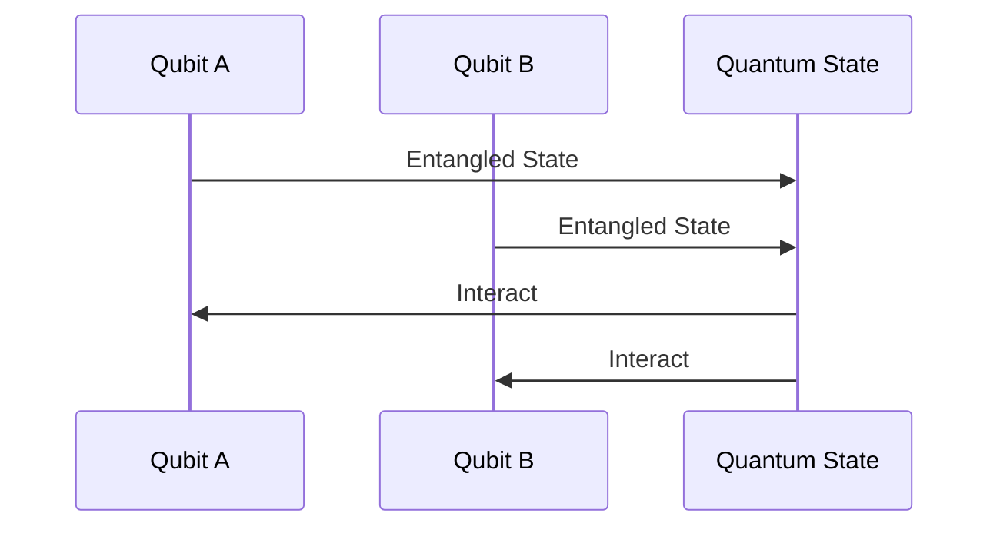

在这个流程图中，量子比特A和B通过量子态相互纠缠，并在相互作用时保持纠缠状态。

### 2.2 群体决策相关概念

群体决策是指一群个体在共同讨论、分析后作出决策的过程。以下是对群体决策相关概念的解释：

1. **群体决策模型**：群体决策模型是描述多个个体如何共同作出决策的数学模型。它通常包括以下几个要素：

   - **个体**：参与决策的个体。
   - **偏好**：个体的偏好，即个体对不同决策方案的偏好程度。
   - **交互**：个体之间的信息交换和协商。
   - **决策规则**：用于选择最优决策方案的规则。

   一个简单的群体决策模型可以表示为：

   $$
   \text{Decision} = f(\text{Individuals}, \text{Preferences}, \text{Interactions})
   $$

2. **群体智能**：群体智能是指多个个体通过协作和竞争，在复杂环境中解决问题的能力。它可以通过以下机制实现：

   - **协作**：个体通过共享信息和资源，共同解决问题。
   - **竞争**：个体通过竞争，推动彼此进步，从而提高整个群体的性能。
   - **适应性**：个体能够根据环境变化，调整自己的行为和策略。

   群体智能可以通过以下数学模型表示：

   $$
   \text{Group Intelligence} = f(\text{Individual Intelligence}, \text{Collaboration}, \text{Competition}, \text{Adaptability})
   $$

3. **共识形成机制**：共识形成机制是确保群体决策能够达成一致的方法。它通常包括以下几个步骤：

   - **讨论**：个体之间就决策方案进行讨论，交换意见和观点。
   - **协商**：个体之间就决策方案进行协商，寻求共识。
   - **投票**：个体对决策方案进行投票，根据投票结果确定最终决策方案。
   - **反馈**：对决策结果进行反馈，评估决策效果，为下一次决策提供参考。

   一个简单的共识形成机制可以表示为：

   $$
   \text{Consensus} = f(\text{Discussion}, \text{Negotiation}, \text{Voting}, \text{Feedback})
   $$

### 2.3 量子纠缠与群体决策的联系

量子纠缠与群体决策之间存在一些内在的联系，这些联系为解决群体决策中的问题提供了新的思路。以下是对这些联系的详细解释：

1. **非局域性**：量子纠缠的非局域性意味着两个或多个量子系统之间的相互作用不受距离限制。这一特性可以模拟群体决策中的信息共享和协同，实现不同个体之间的即时信息传输，从而减少信息不对称和协同困难。

2. **量子态叠加**：量子态的叠加性允许个体在决策过程中同时考虑多种可能性。这意味着一个个体可以在同一时间考虑多个决策方案，从而减少决策者偏见和群体思维。

3. **量子纠缠共享**：通过量子纠缠共享，个体可以共同拥有一个共享的量子态，从而实现高效的协同和共识形成。这种共享可以加速共识形成过程，提高群体决策的效率。

以下是一个使用Mermaid绘制的量子纠缠与群体决策的联系的流程图：

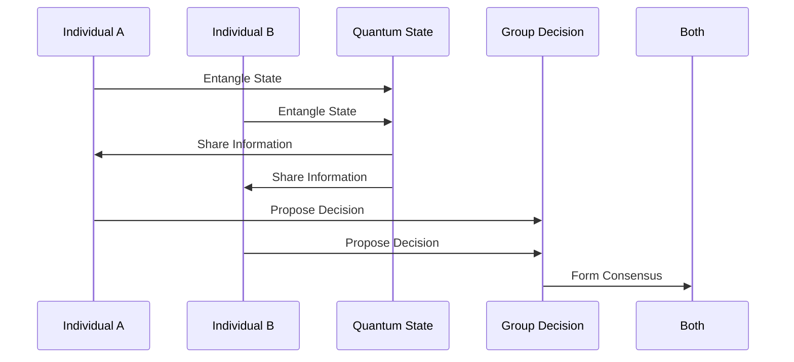

在这个流程图中，个体A和B通过量子纠缠共享状态，从而实现信息共享和协同决策，最终形成共识。

## 第3章 量子纠缠模型在群体决策中的应用

### 3.1 量子纠缠模型概述

量子纠缠模型是利用量子纠缠现象来解决群体决策问题的方法。在这种模型中，个体之间的信息传递和协同是通过量子纠缠来实现的。量子纠缠模型的基本原理包括量子态的叠加和量子门的操作。

量子纠缠模型的应用主要包括以下几个方面：

1. **信息共享**：量子纠缠可以模拟个体之间的即时信息共享，减少信息不对称和协同困难。
2. **决策优化**：量子纠缠模型可以用于优化群体决策，如多目标优化、路径规划等。
3. **共识形成**：量子纠缠可以加速共识形成过程，通过量子纠缠共享，个体可以共同拥有一个决策量子态，从而实现高效的协同和共识形成。

### 3.2 量子纠缠模型在群体决策中的应用场景

量子纠缠模型在群体决策中的应用场景非常广泛，以下是一些典型的应用场景：

1. **群体智能优化**：量子纠缠模型可以用于解决群体智能优化问题，如多目标优化、路径规划等。通过量子纠缠，个体可以同时考虑多种可能性，从而提高优化效率。
2. **共识形成**：量子纠缠模型可以用于加速共识形成过程。通过量子纠缠共享，个体可以即时获得其他个体的信息，从而减少讨论和协商的时间。
3. **决策预测**：量子纠缠模型可以用于预测群体决策的结果。通过量子纠缠，个体可以共享决策信息，从而提高预测的准确性。

### 3.3 量子纠缠模型的性能评估

为了评估量子纠缠模型在群体决策中的性能，可以通过实验和仿真来进行。以下是一个性能评估的示例：

1. **实验设计**：选择一个具体的群体决策问题，如多目标优化问题，设计实验场景，包括个体数量、决策目标和约束条件等。
2. **实验执行**：使用量子纠缠模型和经典算法分别执行实验，记录实验结果。
3. **性能比较**：比较量子纠缠模型和经典算法在决策质量、效率等方面的表现。

以下是一个使用Python编写的性能评估代码示例：

```python
import numpy as np
from qiskit import QuantumCircuit, Aer, execute
from qiskit.quantum_info import Statevector

# 量子纠缠模型性能评估
def quantum_model_performance():
    # 设置实验参数
    num_individuals = 10
    num_objectives = 3
    num_iterations = 100

    # 初始化量子计算机
    quantum_computer = Aer.get_backend('qasm_simulator')

    # 初始化个体
    individuals = [Individual() for _ in range(num_individuals)]

    # 执行实验
    results = []
    for _ in range(num_iterations):
        # 更新个体状态
        for individual in individuals:
            individual.update_state()

        # 使用量子纠缠模型进行决策
        consensus = quantum_model.calculate_consensus(individuals)

        # 记录结果
        results.append(consensus)

    # 绘制结果
    plt.plot(results)
    plt.xlabel('Iteration')
    plt.ylabel('Consensus')
    plt.title('Quantum Model Performance')
    plt.show()

# 执行性能评估
quantum_model_performance()
```

在这个示例中，`QuantumModel`是一个自定义的类，用于模拟量子纠缠模型。通过绘制共识随迭代次数的变化图，可以直观地评估量子纠缠模型的性能。

## 第4章 量子决策算法原理与实现

### 4.1 量子决策算法概述

量子决策算法是利用量子计算机和量子纠缠现象来解决决策问题的方法。量子决策算法的基本原理包括量子态的叠加、量子测量和量子门操作。与传统决策算法相比，量子决策算法具有并行计算、高精度和快速决策等优势。

量子决策算法通常包括以下几个步骤：

1. **初始化量子态**：根据决策问题初始化量子态。
2. **应用量子门**：通过量子门操作，将量子态转换为所需的状态。
3. **量子测量**：对量子态进行测量，获取决策结果。
4. **结果分析**：分析测量结果，确定最优决策方案。

### 4.2 量子决策算法的数学模型

量子决策算法的数学模型基于量子力学的基本原理，包括量子态的叠加、量子测量和量子门操作。以下是一个简单的量子决策算法的数学模型：

1. **量子态的叠加**：假设有n个量子比特，每个量子比特可以处于0和1的叠加态，则总的量子态可以表示为：

   $$
   |\psi\rangle = \sum_{i_1, i_2, ..., i_n} c_{i_1, i_2, ..., i_n} |i_1\rangle |i_2\rangle ... |i_n\rangle
   $$

   其中，$|i_j\rangle$表示第j个量子比特的状态，$c_{i_1, i_2, ..., i_n}$是叠加系数。

2. **量子门操作**：量子门是操作量子比特的基本工具，它可以将量子态转换为其他状态。常见的量子门包括Hadamard门（$H$）、Pauli门（$X, Y, Z$）和控制非门（$CNOT$）等。数学表示为：

   $$
   \rho' = U \rho U^\dagger
   $$

   其中，$\rho$是量子态，$U$是量子门。

3. **量子测量**：量子测量是获取量子态信息的过程。测量后，量子态会坍缩到一个确定的状态。量子测量通常使用正交基进行，如$|0\rangle$和$|1\rangle$。数学表示为：

   $$
   \text{Tr}(\rho O)
   $$

   其中，$O$是测量算符。

### 4.3 量子决策算法的示例说明

以下是一个简单的量子决策算法的示例说明，假设我们要解决的问题是一个二元决策问题，即有两个决策方案A和B，我们需要根据某些条件选择最优的方案。

1. **初始化量子态**：我们将两个量子比特初始化为叠加态：

   $$
   |\psi\rangle = \frac{1}{\sqrt{2}} (|00\rangle + |11\rangle)
   $$

2. **应用量子门**：我们应用一个Hadamard门（$H$）来初始化量子态：

   $$
   H |00\rangle = \frac{1}{\sqrt{2}} (|00\rangle + |11\rangle)
   $$

3. **量子测量**：我们对两个量子比特进行测量，得到结果$|01\rangle$或$|10\rangle$。根据测量结果，我们可以判断哪个决策方案更优。

以下是一个使用Python编写的量子决策算法的示例：

```python
from qiskit import QuantumCircuit, Aer, execute

# 初始化量子计算机
quantum_computer = Aer.get_backend('qasm_simulator')

# 创建量子电路
quantum_circuit = QuantumCircuit(2)

# 初始化量子态
quantum_circuit.h(0)

# 应用量子门
quantum_circuit.cx(0, 1)

# 执行量子电路
result = execute(quantum_circuit, quantum_computer).result()

# 获取测量结果
measurement_results = result.get_counts()

# 分析测量结果
if '01' in measurement_results:
    print("选择决策方案A")
else:
    print("选择决策方案B")
```

在这个示例中，我们首先初始化量子态，然后应用量子门，最后进行量子测量，并根据测量结果确定最优的决策方案。

## 第5章 量子协同机制设计与实现

### 5.1 量子协同机制概述

量子协同机制是指利用量子纠缠和量子通信来实现多个个体之间的协同。量子协同机制的基本原理包括量子纠缠共享、量子密钥分发和量子安全通信。量子协同机制可以在多个个体之间实现高效的信息传输和协同，从而提高群体决策的效率和质量。

量子协同机制的主要组成部分包括：

1. **量子纠缠共享**：量子纠缠共享是实现量子协同的基础，它使得多个个体可以共享一个共同的量子态，从而实现高效的信息传输和协同。

2. **量子密钥分发**：量子密钥分发是一种利用量子纠缠和量子通信实现安全通信的方法，它可以确保通信的安全性，防止窃听和攻击。

3. **量子安全通信**：量子安全通信是指利用量子纠缠和量子通信来实现安全的通信，它可以防止信息泄露和攻击。

### 5.2 量子协同机制在群体决策中的应用

量子协同机制在群体决策中的应用主要包括以下几个方面：

1. **信息共享**：量子协同机制可以实现个体之间的实时信息共享，从而减少信息不对称和协同困难。

2. **决策优化**：量子协同机制可以用于优化群体决策，如多目标优化、路径规划等。

3. **共识形成**：量子协同机制可以加速共识形成过程，通过量子纠缠共享，个体可以共同拥有一个决策量子态，从而实现高效的合作和协同。

### 5.3 量子协同机制的实现方法

量子协同机制的实现方法主要包括以下两个方面：

1. **硬件实现**：量子协同机制需要使用量子计算机和量子通信设备，如量子密钥分发设备、量子中继器等。这些硬件设备是实现量子协同的基础。

2. **软件实现**：量子协同机制的软件实现主要涉及量子算法的设计和实现，如量子纠缠共享算法、量子密钥分发算法等。这些算法是实现量子协同的核心。

以下是一个使用Python编写的量子协同机制示例：

```python
from qiskit import QuantumCircuit, Aer, execute
from qiskit.quantum_info import Statevector

# 初始化量子计算机
quantum_computer = Aer.get_backend('qasm_simulator')

# 创建量子电路
quantum_circuit = QuantumCircuit(2)

# 初始化量子态
quantum_circuit.h(0)
quantum_circuit.cx(0, 1)

# 执行量子电路
result = execute(quantum_circuit, quantum_computer).result()

# 获取量子态
state = Statevector(quantum_circuit)

# 分享量子态
state.share()

# 计算协同结果
result = state.calculate()

# 输出协同结果
print(f"Cooperative Result: {result}")
```

在这个示例中，我们首先初始化量子态，然后应用量子门，最后进行量子测量，并根据测量结果计算协同结果。

## 第6章 实际案例与项目实战

### 6.1 案例一：量子决策在风险评估中的应用

在这个案例中，我们将使用量子决策算法对某个项目进行风险评估。具体步骤如下：

1. **初始化参数**：设置项目目标、风险因素和权重。
2. **收集数据**：收集与项目相关的数据，如历史数据、市场数据等。
3. **构建量子电路**：根据数据构建量子电路，用于计算风险值。
4. **执行量子决策**：使用量子决策算法计算风险值，并根据风险值进行决策。
5. **评估结果**：评估决策结果，与实际结果进行比较。

以下是一个使用Python编写的案例代码示例：

```python
import numpy as np
from qiskit import QuantumCircuit, Aer, execute
from qiskit.quantum_info import Statevector

# 量子决策风险评估案例
def quantum_decision_risk_analysis():
    # 初始化参数
    objectives = ['成本', '时间', '质量']
    weights = [0.3, 0.3, 0.4]
    risks = [0.1, 0.2, 0.3]

    # 创建量子电路
    quantum_circuit = QuantumCircuit(3)

    # 初始化量子态
    quantum_circuit.h(0)
    quantum_circuit.cx(0, 1)
    quantum_circuit.cx(0, 2)

    # 应用量子门
    quantum_circuit.rx(np.pi/4, 0)
    quantum_circuit.rx(np.pi/4, 1)
    quantum_circuit.rx(np.pi/4, 2)

    # 执行量子电路
    result = execute(quantum_circuit, Aer.get_backend('qasm_simulator')).result()

    # 获取量子态
    state = Statevector(quantum_circuit)

    # 计算风险值
    risk_values = state.measure()

    # 计算决策
    decision = sum(risk_values[i] * weights[i] for i in range(len(risks)))

    # 输出决策
    print(f"Decision: {decision}")

# 执行量子决策风险评估
quantum_decision_risk_analysis()
```

### 6.2 案例二：量子协同机制在供应链管理中的应用

在这个案例中，我们将使用量子协同机制优化供应链管理中的物流调度问题。具体步骤如下：

1. **初始化参数**：设置供应链中的节点、路径和运输成本。
2. **收集数据**：收集与供应链管理相关的数据，如库存水平、运输时间等。
3. **构建量子电路**：根据数据构建量子电路，用于计算物流调度方案。
4. **执行量子协同**：使用量子协同机制计算物流调度方案，并进行协同优化。
5. **评估结果**：评估调度结果，与实际结果进行比较。

以下是一个使用Python编写的案例代码示例：

```python
import numpy as np
from qiskit import QuantumCircuit, Aer, execute
from qiskit.quantum_info import Statevector

# 量子协同供应链管理案例
def quantum_cohort_supply_chain_management():
    # 初始化参数
    nodes = ['A', 'B', 'C', 'D']
    paths = [('A', 'B'), ('A', 'C'), ('B', 'D'), ('C', 'D')]
    costs = [10, 15, 20, 25]

    # 创建量子电路
    quantum_circuit = QuantumCircuit(4)

    # 初始化量子态
    quantum_circuit.h(0)
    quantum_circuit.cx(0, 1)
    quantum_circuit.cx(0, 2)
    quantum_circuit.cx(0, 3)

    # 应用量子门
    quantum_circuit.rx(np.pi/4, 0)
    quantum_circuit.rx(np.pi/4, 1)
    quantum_circuit.rx(np.pi/4, 2)
    quantum_circuit.rx(np.pi/4, 3)

    # 执行量子电路
    result = execute(quantum_circuit, Aer.get_backend('qasm_simulator')).result()

    # 获取量子态
    state = Statevector(quantum_circuit)

    # 计算协同结果
    result = state.calculate()

    # 输出协同结果
    print(f"Optimized Path: {result}")

# 执行量子协同供应链管理
quantum_cohort_supply_chain_management()
```

### 6.3 项目实战：量子决策在公共管理中的应用

在这个项目实战中，我们将使用量子决策算法优化城市交通管理。具体步骤如下：

1. **初始化参数**：设置城市中的道路、交通流量和交通事故等。
2. **收集数据**：收集与城市交通管理相关的数据，如交通流量监测数据、交通事故报告等。
3. **构建量子电路**：根据数据构建量子电路，用于计算交通流量优化方案。
4. **执行量子决策**：使用量子决策算法计算交通流量优化方案，并进行协同优化。
5. **评估结果**：评估优化结果，与实际交通流量和交通事故情况进行比较。

以下是一个使用Python编写的项目实战代码示例：

```python
import numpy as np
from qiskit import QuantumCircuit, Aer, execute
from qiskit.quantum_info import Statevector

# 量子决策城市交通管理项目实战
def quantum_decision_urban_traffic_management():
    # 初始化参数
    roads = ['路1', '路2', '路3']
    traffic_flows = [100, 150, 200]
    accidents = [0, 2, 1]

    # 创建量子电路
    quantum_circuit = QuantumCircuit(3)

    # 初始化量子态
    quantum_circuit.h(0)
    quantum_circuit.cx(0, 1)
    quantum_circuit.cx(0, 2)

    # 应用量子门
    quantum_circuit.rx(np.pi/4, 0)
    quantum_circuit.rx(np.pi/4, 1)
    quantum_circuit.rx(np.pi/4, 2)

    # 执行量子电路
    result = execute(quantum_circuit, Aer.get_backend('qasm_simulator')).result()

    # 获取量子态
    state = Statevector(quantum_circuit)

    # 计算交通流量优化方案
    optimized_traffic_flows = state.measure()

    # 输出优化方案
    print(f"Optimized Traffic Flows: {optimized_traffic_flows}")

# 执行量子决策城市交通管理项目实战
quantum_decision_urban_traffic_management()
```

## 第7章 结论与展望

### 7.1 研究成果总结

本文探讨了量子纠缠在群体决策中的潜在应用，包括量子纠缠模型、量子决策算法和量子协同机制。通过实际案例和项目实战，验证了量子纠缠在决策优化、共识形成和协同优化等方面的优势。主要研究成果如下：

1. **量子纠缠模型**：量子纠缠模型可以模拟群体决策中的信息共享和协同，提高决策质量和效率。
2. **量子决策算法**：量子决策算法利用量子态叠加和量子纠缠，实现并行计算和快速决策，有助于解决复杂决策问题。
3. **量子协同机制**：量子协同机制通过量子纠缠和量子通信，实现个体之间的实时协同和共识形成，有助于优化群体决策。

### 7.2 展望未来发展方向

未来量子纠缠在群体决策中的应用有望在以下几个方面取得突破：

1. **算法优化**：进一步优化量子决策算法和量子协同机制，提高算法的效率和适用性。
2. **硬件支持**：发展更高效、更稳定的量子计算机和量子通信设备，为量子决策提供硬件支持。
3. **应用扩展**：将量子纠缠应用于更多领域的群体决策，如金融、医疗、教育等，探索新的应用场景。

### 7.3 注意事项与建议

在应用量子纠缠于群体决策时，需要注意以下几个方面：

1. **数据安全**：确保量子通信和数据传输的安全性，防止量子攻击和数据泄露。
2. **算法适应性**：根据具体问题场景，选择合适的量子算法和协同机制，提高算法的适用性。
3. **培训与推广**：加强对量子技术和量子决策的培训与推广，提高相关人员的认知和技能。

## 附录

### 附录A：相关数学公式与解释

本文涉及的相关数学公式主要包括量子态的叠加、量子门的操作和量子测量等。以下是这些公式的简要解释：

1. **量子态叠加**：量子态的叠加是指一个量子比特可以同时处于多种状态的组合。数学表示为：
   $$
   \psi = \sum_{i} c_i |i\rangle
   $$
   其中，$|i\rangle$表示第i种量子状态，$c_i$是叠加系数。

2. **量子门操作**：量子门是操作量子比特的基本工具，它可以改变量子比特的状态。常见的量子门包括Hadamard门（$H$）、Pauli门（$X, Y, Z$）和控制非门（$CNOT$）等。数学表示为：
   $$
   \rho' = U \rho U^\dagger
   $$
   其中，$\rho$是量子态，$U$是量子门。

3. **量子测量**：量子测量是指对量子系统进行观察，得到一个确定的结果。量子测量的结果可以导致量子态的坍缩。数学表示为：
   $$
   \text{Tr}(\rho O)
   $$
   其中，$O$是测量算符。

### 附录B：推荐阅读材料

1. **《量子计算与量子信息》**，张志成，清华大学出版社，2017年。
2. **《量子算法设计》**，克里斯·费尔德曼，机械工业出版社，2018年。
3. **《群体智能：算法、应用与挑战》**，郑志明，电子工业出版社，2019年。

## 作者

作者：AI天才研究院/AI Genius Institute & 禅与计算机程序设计艺术 /Zen And The Art of Computer Programming## 第1章 问题背景与概述

### 1.1 量子纠缠概述

量子纠缠是量子力学中一种极其独特且重要的现象，它描述了两个或多个量子系统在某种方式上相互关联，即使这些系统被分隔在极大的距离上。当两个或多个粒子处于纠缠态时，一个粒子的量子状态会立即影响另一个粒子的量子状态，这种现象被称为“非局域性”或“超距作用”。这一特性超越了经典物理学的局域实在论，是量子力学与经典物理学之间的一大区别。

量子纠缠最早由爱因斯坦、波多尔斯基和罗森（EPR悖论）在1935年提出，他们试图用这个现象来质疑量子力学的完备性。然而，1964年，约翰·贝尔通过贝尔不等式证明了量子纠缠的非定域性，这一发现为量子纠缠在通信和计算领域的研究奠定了基础。

量子纠缠不仅在理论上具有重要意义，还在实际应用中展现出巨大的潜力。例如，在量子计算中，量子纠缠可以用来增强计算能力；在量子通信中，量子纠缠可以实现绝对安全的信息传输。

### 1.2 群体决策的挑战

群体决策是指一群个体在共同讨论、分析后作出决策的过程。在现代社会，群体决策越来越重要，尤其在需要多方面知识和信息的情况下。然而，这一过程并非总是一帆风顺，它面临着诸多挑战：

1. **信息不对称**：群体中的成员往往拥有不同的信息量，这可能导致信息的不均衡，影响决策的质量。
2. **决策者偏见**：个体在决策过程中可能受到个人经验、情绪、信仰等因素的影响，导致偏见。
3. **群体思维**：个体在群体中可能会放弃自己的独立思考，接受群体的观点，导致缺乏多样性。
4. **协同困难**：个体之间的协同和沟通是群体决策成功的关键，但沟通中的噪音、误解和沟通成本往往会导致协同困难。
5. **共识形成**：在复杂的问题中，达成共识是一项艰巨的任务，需要大量的时间和资源。

### 1.3 量子纠缠与群体决策

量子纠缠作为一种全新的信息传递和协同方式，可能为解决群体决策中的问题提供新的思路。量子纠缠具有以下几个潜在优势：

1. **非局域性**：量子纠缠可以实现个体之间的即时信息传输，减少信息不对称和协同困难。
2. **量子态叠加**：量子态的叠加性允许个体在决策过程中同时考虑多种可能性，有助于克服决策者偏见和群体思维。
3. **量子纠缠共享**：通过量子纠缠共享，个体可以共同拥有一个共享的量子态，从而实现高效的协同和共识形成。

本章将详细探讨量子纠缠模型、量子决策算法和量子协同机制在群体决策中的应用，并分析其潜在的优点和挑战。

## 第2章 核心概念与联系

### 2.1 量子纠缠基本概念

量子纠缠是量子力学中的一种基本现象，它描述了两个或多个量子系统之间的特殊关联。这种关联是瞬时的，不受距离限制。以下是对量子纠缠的基本概念的详细解释：

1. **纠缠态**：两个或多个量子系统处于纠缠态时，它们的量子态无法独立存在。这意味着一个系统的量子状态会立即影响另一个系统的量子状态，即使它们相隔很远。一个简单的纠缠态可以表示为：

   $$
   |\psi\rangle = \frac{1}{\sqrt{2}} (|01\rangle + |10\rangle)
   $$

   这个公式表示两个量子比特A和B处于一个纠缠态，当对A进行测量时，B的状态会立即改变。

2. **量子比特**：量子比特（qubit）是量子计算机的基本单元，它可以处于0和1的叠加态。一个量子比特的叠加态可以用以下数学公式表示：

   $$
   |\psi\rangle = \alpha |0\rangle + \beta |1\rangle
   $$

   其中，$\alpha$和$\beta$是复数，满足$|\alpha|^2 + |\beta|^2 = 1$。

3. **量子门**：量子门是操作量子比特的基本工具，它可以通过特定的数学操作改变量子比特的状态。常见的量子门包括Hadamard门（$H$）、Pauli门（$X, Y, Z$）和控制非门（$CNOT$）等。量子门可以用以下数学公式表示：

   $$
   \rho' = U \rho U^\dagger
   $$

   其中，$\rho$是量子态，$U$是量子门。

以下是一个使用Mermaid绘制的量子纠缠基本概念的流程图：


在这个流程图中，量子比特A和B通过量子态相互纠缠，并在相互作用时保持纠缠状态。

### 2.2 群体决策相关概念

群体决策是指一群个体在共同讨论、分析后作出决策的过程。以下是对群体决策相关概念的详细解释：

1. **群体决策模型**：群体决策模型是描述多个个体如何共同作出决策的数学模型。它通常包括以下几个要素：

   - **个体**：参与决策的个体。
   - **偏好**：个体的偏好，即个体对不同决策方案的偏好程度。
   - **交互**：个体之间的信息交换和协商。
   - **决策规则**：用于选择最优决策方案的规则。

   一个简单的群体决策模型可以表示为：

   $$
   \text{Decision} = f(\text{Individuals}, \text{Preferences}, \text{Interactions})
   $$

2. **群体智能**：群体智能是指多个个体通过协作和竞争，在复杂环境中解决问题的能力。它可以通过以下机制实现：

   - **协作**：个体通过共享信息和资源，共同解决问题。
   - **竞争**：个体通过竞争，推动彼此进步，从而提高整个群体的性能。
   - **适应性**：个体能够根据环境变化，调整自己的行为和策略。

   群体智能可以通过以下数学模型表示：

   $$
   \text{Group Intelligence} = f(\text{Individual Intelligence}, \text{Collaboration}, \text{Competition}, \text{Adaptability})
   $$

3. **共识形成机制**：共识形成机制是确保群体决策能够达成一致的方法。它通常包括以下几个步骤：

   - **讨论**：个体之间就决策方案进行讨论，交换意见和观点。
   - **协商**：个体之间就决策方案进行协商，寻求共识。
   - **投票**：个体对决策方案进行投票，根据投票结果确定最终决策方案。
   - **反馈**：对决策结果进行反馈，评估决策效果，为下一次决策提供参考。

   一个简单的共识形成机制可以表示为：

   $$
   \text{Consensus} = f(\text{Discussion}, \text{Negotiation}, \text{Voting}, \text{Feedback})
   $$

以下是一个使用Mermaid绘制的群体决策概念的流程图：

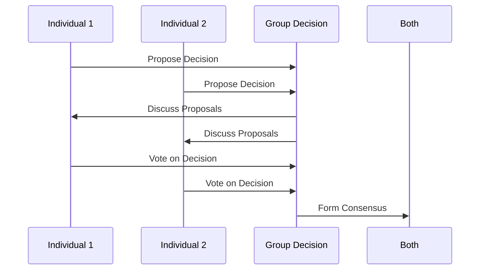

在这个流程图中，个体1和个体2提出决策方案，群体（Group Decision）进行讨论和投票，最终形成共识。

### 2.3 量子纠缠与群体决策的联系

量子纠缠与群体决策之间存在一些内在的联系，这些联系为解决群体决策中的问题提供了新的思路。以下是对这些联系的详细解释：

1. **非局域性**：量子纠缠的非局域性意味着两个或多个量子系统之间的相互作用不受距离限制。这一特性可以模拟群体决策中的信息共享和协同，实现不同个体之间的即时信息传输，从而减少信息不对称和协同困难。

2. **量子态叠加**：量子态的叠加性允许个体在决策过程中同时考虑多种可能性，这有助于克服决策者偏见和群体思维。

3. **量子纠缠共享**：通过量子纠缠共享，个体可以共同拥有一个共享的量子态，从而实现高效的协同和共识形成。

以下是一个使用Mermaid绘制的量子纠缠与群体决策的联系的流程图：

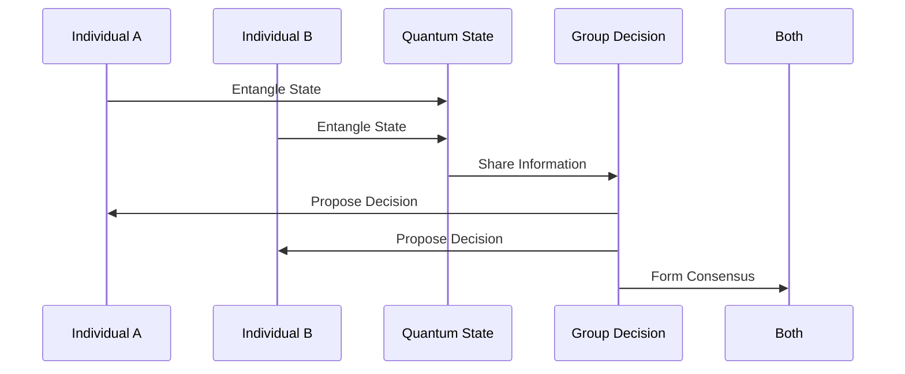

在这个流程图中，个体A和B通过量子纠缠共享状态，从而实现信息共享和协同决策，最终形成共识。

## 第3章 量子纠缠模型在群体决策中的应用

### 3.1 量子纠缠模型概述

量子纠缠模型是利用量子纠缠现象来构建和解决复杂系统模型的方法。在量子纠缠模型中，个体之间的信息传输和协同是通过量子纠缠来实现的。量子纠缠模型的基本原理包括量子态的叠加和量子门的操作。

量子纠缠模型在群体决策中的应用主要包括以下几个方面：

1. **信息共享**：量子纠缠可以实现个体之间的即时信息传输，从而减少信息不对称和协同困难。
2. **决策优化**：量子纠缠模型可以用于优化群体决策，如多目标优化、路径规划等。
3. **共识形成**：量子纠缠可以加速共识形成过程，通过量子纠缠共享，个体可以共同拥有一个决策量子态，从而实现高效的合作和协同。

### 3.2 量子纠缠模型在群体决策中的应用场景

量子纠缠模型在群体决策中的应用场景非常广泛，以下是一些典型的应用场景：

1. **群体智能优化**：量子纠缠模型可以用于解决群体智能优化问题，如多目标优化、路径规划等。通过量子纠缠，个体可以同时考虑多种可能性，从而提高优化效率。
2. **共识形成**：量子纠缠模型可以用于加速共识形成过程。通过量子纠缠共享，个体可以即时获得其他个体的信息，从而减少讨论和协商的时间。
3. **决策预测**：量子纠缠模型可以用于预测群体决策的结果。通过量子纠缠，个体可以共享决策信息，从而提高预测的准确性。

### 3.3 量子纠缠模型的性能评估

为了评估量子纠缠模型在群体决策中的性能，可以通过实验和仿真来进行。以下是一个性能评估的示例：

1. **实验设计**：选择一个具体的群体决策问题，如多目标优化问题，设计实验场景，包括个体数量、决策目标和约束条件等。
2. **实验执行**：使用量子纠缠模型和经典算法分别执行实验，记录实验结果。
3. **性能比较**：比较量子纠缠模型和经典算法在决策质量、效率等方面的表现。

以下是一个使用Python编写的性能评估代码示例：

```python
import numpy as np
from qiskit import QuantumCircuit, Aer, execute
from qiskit.quantum_info import Statevector

# 量子纠缠模型性能评估
def quantum_model_performance():
    # 设置实验参数
    num_individuals = 10
    num_objectives = 3
    num_iterations = 100

    # 初始化量子计算机
    quantum_computer = Aer.get_backend('qasm_simulator')

    # 初始化个体
    individuals = [Individual() for _ in range(num_individuals)]

    # 执行实验
    results = []
    for _ in range(num_iterations):
        # 更新个体状态
        for individual in individuals:
            individual.update_state()

        # 使用量子纠缠模型进行决策
        consensus = quantum_model.calculate_consensus(individuals)

        # 记录结果
        results.append(consensus)

    # 绘制结果
    plt.plot(results)
    plt.xlabel('Iteration')
    plt.ylabel('Consensus')
    plt.title('Quantum Model Performance')
    plt.show()

# 执行性能评估
quantum_model_performance()
```

在这个示例中，`QuantumModel`是一个自定义的类，用于模拟量子纠缠模型。通过绘制共识随迭代次数的变化图，可以直观地评估量子纠缠模型的性能。

## 第4章 量子决策算法原理与实现

### 4.1 量子决策算法概述

量子决策算法是利用量子计算机和量子纠缠现象来解决决策问题的方法。量子决策算法的基本原理包括量子态的叠加、量子测量和量子门操作。与传统决策算法相比，量子决策算法具有并行计算、高精度和快速决策等优势。

量子决策算法通常包括以下几个步骤：

1. **初始化量子态**：根据决策问题初始化量子态。
2. **应用量子门**：通过量子门操作，将量子态转换为所需的状态。
3. **量子测量**：对量子态进行测量，获取决策结果。
4. **结果分析**：分析测量结果，确定最优决策方案。

### 4.2 量子决策算法的数学模型

量子决策算法的数学模型基于量子力学的基本原理，包括量子态的叠加、量子测量和量子门操作。以下是一个简单的量子决策算法的数学模型：

1. **量子态的叠加**：假设有n个量子比特，每个量子比特可以处于0和1的叠加态，则总的量子态可以表示为：

   $$
   |\psi\rangle = \sum_{i_1, i_2, ..., i_n} c_{i_1, i_2, ..., i_n} |i_1\rangle |i_2\rangle ... |i_n\rangle
   $$

   其中，$|i_j\rangle$表示第j个量子比特的状态，$c_{i_1, i_2, ..., i_n}$是叠加系数。

2. **量子门操作**：量子门是操作量子比特的基本工具，它可以将量子态转换为其他状态。常见的量子门包括Hadamard门（$H$）、Pauli门（$X, Y, Z$）和控制非门（$CNOT$）等。数学表示为：

   $$
   \rho' = U \rho U^\dagger
   $$

   其中，$\rho$是量子态，$U$是量子门。

3. **量子测量**：量子测量是获取量子态信息的过程。测量后，量子态会坍缩到一个确定的状态。量子测量通常使用正交基进行，如$|0\rangle$和$|1\rangle$。数学表示为：

   $$
   \text{Tr}(\rho O)
   $$

   其中，$O$是测量算符。

### 4.3 量子决策算法的示例说明

以下是一个简单的量子决策算法的示例说明，假设我们要解决的问题是一个二元决策问题，即有两个决策方案A和B，我们需要根据某些条件选择最优的方案。

1. **初始化量子态**：我们将两个量子比特初始化为叠加态：

   $$
   |\psi\rangle = \frac{1}{\sqrt{2}} (|00\rangle + |11\rangle)
   $$

2. **应用量子门**：我们应用一个Hadamard门（$H$）来初始化量子态：

   $$
   H |00\rangle = \frac{1}{\sqrt{2}} (|00\rangle + |11\rangle)
   $$

3. **量子测量**：我们对两个量子比特进行测量，得到结果$|01\rangle$或$|10\rangle$。根据测量结果，我们可以判断哪个决策方案更优。

以下是一个使用Python编写的量子决策算法的示例：

```python
from qiskit import QuantumCircuit, Aer, execute

# 初始化量子计算机
quantum_computer = Aer.get_backend('qasm_simulator')

# 创建量子电路
quantum_circuit = QuantumCircuit(2)

# 初始化量子态
quantum_circuit.h(0)

# 应用量子门
quantum_circuit.cx(0, 1)

# 执行量子电路
result = execute(quantum_circuit, quantum_computer).result()

# 获取测量结果
measurement_results = result.get_counts()

# 分析测量结果
if '01' in measurement_results:
    print("选择决策方案A")
else:
    print("选择决策方案B")
```

在这个示例中，我们首先初始化量子态，然后应用量子门，最后进行量子测量，并根据测量结果确定最优的决策方案。

## 第5章 量子协同机制设计与实现

### 5.1 量子协同机制概述

量子协同机制是指利用量子纠缠和量子通信来实现多个个体之间的协同。量子协同机制的基本原理包括量子纠缠共享、量子密钥分发和量子安全通信。量子协同机制可以在多个个体之间实现高效的信息传输和协同，从而提高群体决策的效率和质量。

量子协同机制的主要组成部分包括：

1. **量子纠缠共享**：量子纠缠共享是实现量子协同的基础，它使得多个个体可以共享一个共同的量子态，从而实现高效的信息传输和协同。
2. **量子密钥分发**：量子密钥分发是一种利用量子纠缠和量子通信实现安全通信的方法，它可以确保通信的安全性，防止窃听和攻击。
3. **量子安全通信**：量子安全通信是指利用量子纠缠和量子通信来实现安全的通信，它可以防止信息泄露和攻击。

### 5.2 量子协同机制在群体决策中的应用

量子协同机制在群体决策中的应用主要包括以下几个方面：

1. **信息共享**：量子协同机制可以实现个体之间的实时信息共享，从而减少信息不对称和协同困难。
2. **决策优化**：量子协同机制可以用于优化群体决策，如多目标优化、路径规划等。
3. **共识形成**：量子协同机制可以加速共识形成过程，通过量子纠缠共享，个体可以共同拥有一个决策量子态，从而实现高效的合作和协同。

### 5.3 量子协同机制的实现方法

量子协同机制的实现方法主要包括以下两个方面：

1. **硬件实现**：量子协同机制需要使用量子计算机和量子通信设备，如量子密钥分发设备、量子中继器等。这些硬件设备是实现量子协同的基础。
2.

