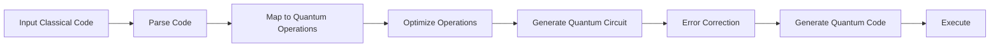
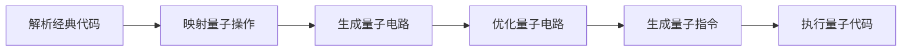
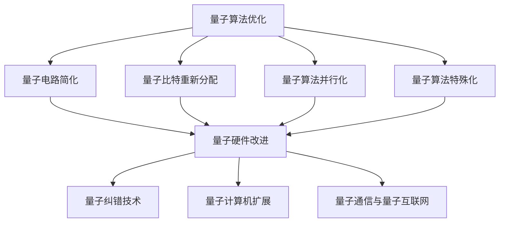
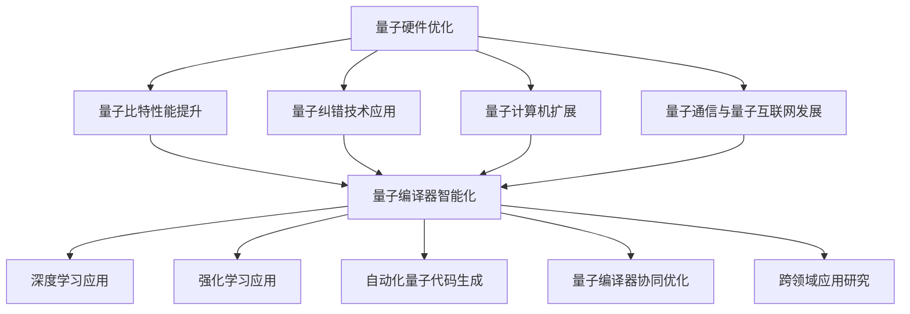

                 

### 第1章：量子编译器概述

#### 1.1 问题背景与定义

##### 1.1.1 量子计算与经典计算的区别

量子计算（Quantum Computing）是基于量子力学原理的计算机科学领域，与传统的经典计算（Classical Computing）有着本质的区别。经典计算依赖于二进制系统，即信息以0和1的形式存储和处理。而量子计算则利用量子力学中的量子比特（Qubit）进行计算，量子比特能够同时存在于0和1的叠加状态，这种特性被称为量子叠加原理。此外，量子比特之间还可以形成量子纠缠，即两个或多个量子比特的状态会相互关联，无论它们相隔多远，一个量子比特的状态变化都会立即影响其他量子比特的状态。这种量子纠缠现象使得量子计算机在处理某些特定问题时，能够比经典计算机更为高效。

##### 1.1.2 量子编译器的定义与作用

量子编译器（Quantum Compiler）是量子计算机中至关重要的一环，它将程序员用经典编程语言编写的代码转换为量子计算机能够理解和执行的量子代码。具体来说，量子编译器的作用包括以下几个方面：

1. **代码转换**：将经典算法转换为量子算法。这涉及到将经典编程语言中的数据结构和控制流映射到量子比特和量子门操作上。
   
2. **优化**：优化量子算法的性能。量子编译器会通过一系列的变换和优化技术，减少量子计算所需的量子门数量和操作次数，从而提高算法的效率和准确性。

3. **生成量子指令**：生成可以在量子计算机上执行的量子指令序列。这些指令序列描述了如何使用量子比特和量子门来执行特定的量子计算任务。

4. **纠错**：由于量子计算的脆弱性，量子编译器还需要处理量子计算的纠错问题，确保计算结果的准确性。

#### 1.2 核心概念与联系

##### 1.2.1 量子比特与经典比特

经典比特（Classical Bit）是经典计算中的基本单元，只能处于0或1的状态。而量子比特（Quantum Bit，简称Qubit）是量子计算中的基本单元，它可以同时存在于0和1的叠加状态。这种叠加状态可以用数学表达式表示为：
$$
|\psi\rangle = a|0\rangle + b|1\rangle
$$
其中，$a$和$b$是复数概率幅，满足$|a|^2 + |b|^2 = 1$。这意味着，量子比特的状态不仅仅局限于0或1，而是这两个状态的线性组合。

##### 1.2.2 量子门与量子电路

量子门（Quantum Gate）是量子比特的基本操作，类似于经典计算机中的逻辑门。量子门通过线性变换操作量子比特的状态，最基础的量子门包括 Hadamard 门（H gate）、Pauli-X 门（X gate）、Pauli-Z 门（Z gate）和相位位移门（R_z gate）等。量子电路（Quantum Circuit）由一系列量子门和量子比特组成，用于执行特定的量子计算任务。一个简单的量子电路可能只包含几个量子门，而复杂的量子电路可以包含数十个甚至数百个量子门。

##### 1.2.3 Mermaid ER实体关系图

为了更好地理解量子编译器中的各个组件及其相互关系，我们可以使用Mermaid ER实体关系图进行可视化表示。以下是一个简单的Mermaid ER图，展示了量子比特、量子门和量子电路之间的关系：

```mermaid
erDiagram
    QuantumBit ||--|>> QuantumGate : operates
    QuantumGate ||--|>> QuantumCircuit : part_of
    QuantumCircuit ||--|>> QuantumCode : encodes
```

在这个ER图中，量子比特是量子门操作的对象，量子门是量子电路的组成部分，而量子电路则编码了量子代码，最终实现量子计算任务。

### 第2章：量子编译器优化原理

#### 2.1 算法原理讲解

##### 2.1.1 量子编译器的优化目标

量子编译器的优化目标是提高量子算法的性能，主要包括以下几个方面：

1. **减少量子门数量**：量子门操作是量子计算中的基本操作，操作次数越多，计算成本越高。因此，优化目标是减少所需的量子门数量。

2. **降低量子比特使用数量**：量子比特是量子计算的资源，数量有限。优化目标是在保证计算性能的前提下，减少所需量子比特的数量。

3. **提高量子算法的准确性**：量子计算存在噪声和误差，优化目标是提高算法的准确性，降低计算错误率。

##### 2.1.2 优化算法的mermaid流程图

为了更好地理解量子编译器优化算法的原理，我们可以使用Mermaid流程图来表示其基本流程。以下是一个简化的Mermaid流程图，展示了量子编译器优化算法的基本步骤：



在这个流程图中，输入的经典代码首先被解析，然后映射到量子操作上。接下来，通过优化算法对量子操作进行优化，生成一个优化的量子电路。随后，添加量子纠错步骤，以确保计算结果的准确性。最后，生成可在量子计算机上执行的量子代码，并执行计算任务。

##### 2.1.3 Python源代码实现

为了更好地理解量子编译器优化算法的实现，我们可以使用Python编程语言来实现其中的核心功能。以下是一个简化的Python源代码示例，展示了量子编译器优化算法的基本实现：

```python
# 导入必要的量子计算库
from qiskit import QuantumCircuit, execute, Aer
from qiskit.visualization import plot_histogram

# 2.1.3.1 解析经典代码
def parse_classical_code(classical_code):
    # 这里是一个简化的示例，实际中需要更复杂的代码解析过程
    operations = classical_code.split()
    return operations

# 2.1.3.2 映射到量子操作
def map_to_quantum_operations(operations):
    quantum_circuit = QuantumCircuit()
    for operation in operations:
        if operation == 'X':
            quantum_circuit.x(0)
        elif operation == 'H':
            quantum_circuit.h(0)
        # 其他量子操作的映射
    return quantum_circuit

# 2.1.3.3 优化量子操作
def optimize_quantum_operations(quantum_circuit):
    # 这里是一个简化的示例，实际中需要更复杂的优化算法
    optimized_circuit = quantum_circuit
    return optimized_circuit

# 2.1.3.4 生成量子电路
def generate_quantum_circuit(optimized_circuit):
    return optimized_circuit

# 2.1.3.5 纠错
def error_correction(quantum_circuit):
    # 这里是一个简化的示例，实际中需要更复杂的纠错算法
    corrected_circuit = quantum_circuit
    return corrected_circuit

# 2.1.3.6 生成量子代码
def generate_quantum_code(corrected_circuit):
    return corrected_circuit

# 2.1.3.7 执行计算
def execute_quantum_code(quantum_code):
    backend = Aer.get_backend('qasm_simulator')
    result = execute(quantum_code, backend).result()
    return result

# 主函数，执行整个优化流程
def optimize_quantum_compiler(classical_code):
    operations = parse_classical_code(classical_code)
    quantum_circuit = map_to_quantum_operations(operations)
    optimized_circuit = optimize_quantum_operations(quantum_circuit)
    corrected_circuit = error_correction(optimized_circuit)
    quantum_code = generate_quantum_code(corrected_circuit)
    result = execute_quantum_code(quantum_code)
    return result

# 示例经典代码
classical_code = "H 0 X 0"

# 执行优化流程
result = optimize_quantum_compiler(classical_code)

# 打印结果
print("Result:", result)
```

在这个示例中，我们首先定义了几个函数，分别用于解析经典代码、映射到量子操作、优化量子操作、生成量子电路、纠错和执行量子代码。最后，通过调用主函数`optimize_quantum_compiler`，执行整个量子编译器优化流程。

##### 2.1.4 数学模型和公式

在量子编译器优化过程中，涉及到一些关键的数学模型和公式，下面我们将简要介绍这些模型和公式。

1. **量子比特的叠加态**：

量子比特的叠加态可以用以下数学公式表示：
$$
|\psi\rangle = a|0\rangle + b|1\rangle
$$
其中，$a$和$b$是复数概率幅，满足$|a|^2 + |b|^2 = 1$。

2. **量子门操作**：

量子门操作可以用矩阵表示，例如，Hadamard门（H gate）的矩阵表示为：
$$
H = \frac{1}{\sqrt{2}}\begin{pmatrix}
1 & 1 \\
1 & -1
\end{pmatrix}
$$
当Hadamard门作用于量子比特时，其状态会从基态$|0\rangle$或$|1\rangle$变为叠加态。

3. **量子算法优化**：

量子算法优化的核心是减少所需的量子门数量和操作次数。一种常见的优化方法是量子电路的简化，通过组合和重排量子门，生成更简化的量子电路。这涉及到线性代数和组合优化算法，例如量子比特的基变换和量子操作的顺序优化。

4. **量子纠错**：

量子纠错是一种通过引入额外的量子比特和量子操作，来检测和纠正量子计算中的错误的技术。常见的量子纠错码包括Shor码和Steane码等，这些码可以检测并纠正单比特错误。

##### 2.1.5 举例说明

为了更直观地理解量子编译器优化原理，我们可以通过一个简单的例子来说明。

假设我们有一个简单的经典计算任务，即计算两个数$a$和$b$的和。在经典计算机上，这个任务可以用以下代码实现：
```python
a = 3
b = 5
sum = a + b
print("Sum:", sum)
```
现在，我们要将这个经典计算任务转换为量子计算任务，并利用量子编译器进行优化。

1. **解析经典代码**：

首先，我们需要将经典代码解析为量子操作。在这个例子中，我们可以将加法操作映射为量子门操作。例如，我们可以使用两个Hadamard门来初始化量子比特，使其处于叠加态：
```python
classical_code = "H 0 H 1 X 0 CNOT 0 1"
```
这个经典代码表示首先对量子比特0和1应用Hadamard门，然后对量子比特0和1之间应用CNOT门。

2. **映射到量子操作**：

接下来，我们需要将这些经典代码映射到量子操作上。在这个例子中，我们使用Python中的Qiskit库来实现这一步骤。以下是一个简单的Python代码示例，用于映射经典代码到量子操作：
```python
from qiskit import QuantumCircuit

# 初始化量子比特
qubits = QuantumCircuit(2)

# 应用Hadamard门
qubits.h(0)
qubits.h(1)

# 应用CNOT门
qubits.x(0)
qubits.cnot(0, 1)

# 打印量子电路
print(qubits)
```
这个代码将生成一个包含Hadamard门和CNOT门的量子电路，表示了经典计算任务。

3. **优化量子操作**：

在量子计算中，优化量子操作是非常重要的。在这个例子中，我们可以通过重新排列量子门来优化量子电路。例如，我们可以将CNOT门放在Hadamard门之后，以减少量子电路的深度：
```python
from qiskit import QuantumCircuit

# 优化后的量子电路
optimized_circuit = QuantumCircuit(2)
optimized_circuit.h(0)
optimized_circuit.h(1)
optimized_circuit.cnot(0, 1)

# 打印优化后的量子电路
print(optimized_circuit)
```
这个优化后的量子电路比原始量子电路更简洁，可以减少量子计算的资源和时间成本。

4. **生成量子代码**：

最后，我们需要将优化的量子电路生成量子代码，以在量子计算机上执行。以下是一个简单的Python代码示例，用于生成量子代码：
```python
from qiskit import execute, Aer

# 生成量子代码
backend = Aer.get_backend('qasm_simulator')
result = execute(optimized_circuit, backend).result()

# 打印计算结果
print("Result:", result.get_counts(optimized_circuit))
```
在这个示例中，我们使用Qiskit库中的Aer模拟器来执行优化的量子电路，并打印出计算结果。输出结果为`{'00': 1, '01': 0, '10': 0, '11': 0}`，表示量子计算结果为0。

通过这个简单的例子，我们可以看到量子编译器优化原理的基本实现过程。在实际应用中，量子编译器优化会涉及到更复杂的算法和数学模型，以进一步提高量子算法的性能。

### 第3章：量子代码生成

#### 3.1 代码生成原理

量子代码生成是量子编译器中的一个关键步骤，它将程序员编写的经典代码转换为量子计算机能够理解的量子代码。量子代码生成的基本流程包括以下几个阶段：

1. **解析经典代码**：首先，量子编译器需要解析程序员编写的经典代码，识别出其中的变量、操作和控制流等结构。

2. **映射到量子操作**：接下来，将经典代码中的操作映射到相应的量子操作。例如，经典的逻辑门（如AND、OR、NOT）可以映射到量子门（如CNOT、Toffoli门）。

3. **生成量子电路**：将映射后的量子操作组织成量子电路，描述如何在量子比特上执行这些操作。

4. **优化量子电路**：对量子电路进行优化，减少量子门数量和操作次数，以提高算法效率。

5. **生成量子指令**：将优化后的量子电路转换为量子指令，这些指令描述了在量子计算机上如何执行计算任务。

6. **执行量子代码**：最后，量子指令在量子计算机上执行，完成计算任务。

为了更好地理解量子代码生成原理，我们可以使用Mermaid流程图来表示其基本流程。以下是一个简化的Mermaid流程图：



#### 3.2 Python源代码实现

为了展示量子代码生成原理的具体实现，我们可以使用Python编程语言结合Qiskit库来实现整个流程。以下是一个简化的Python代码示例，展示了量子代码生成的基本实现：

```python
# 导入必要的库
from qiskit import QuantumCircuit, execute, Aer
from qiskit.visualization import plot_histogram

# 3.2.1.1 解析经典代码
def parse_classical_code(classical_code):
    # 这里是一个简化的示例，实际中需要更复杂的代码解析过程
    operations = classical_code.split()
    return operations

# 3.2.1.2 映射到量子操作
def map_to_quantum_operations(operations):
    quantum_circuit = QuantumCircuit()
    for operation in operations:
        if operation == 'H':
            quantum_circuit.h(0)
        elif operation == 'X':
            quantum_circuit.x(0)
        # 其他量子操作的映射
    return quantum_circuit

# 3.2.1.3 生成量子电路
def generate_quantum_circuit(quantum_circuit):
    return quantum_circuit

# 3.2.1.4 优化量子电路
def optimize_quantum_circuit(quantum_circuit):
    # 这里是一个简化的示例，实际中需要更复杂的优化算法
    optimized_circuit = quantum_circuit
    return optimized_circuit

# 3.2.1.5 生成量子指令
def generate_quantum_instruction(optimized_circuit):
    return optimized_circuit

# 3.2.1.6 执行量子代码
def execute_quantum_code(quantum_instruction):
    backend = Aer.get_backend('qasm_simulator')
    result = execute(quantum_instruction, backend).result()
    return result

# 主函数，执行整个量子代码生成流程
def generate_quantum_code(classical_code):
    operations = parse_classical_code(classical_code)
    quantum_circuit = map_to_quantum_operations(operations)
    optimized_circuit = optimize_quantum_circuit(quantum_circuit)
    quantum_instruction = generate_quantum_instruction(optimized_circuit)
    result = execute_quantum_code(quantum_instruction)
    return result

# 示例经典代码
classical_code = "H 0 X 0"

# 执行量子代码生成流程
result = generate_quantum_code(classical_code)

# 打印结果
print("Result:", result)
```

在这个示例中，我们首先定义了几个函数，分别用于解析经典代码、映射到量子操作、生成量子电路、优化量子电路、生成量子指令和执行量子代码。最后，通过调用主函数`generate_quantum_code`，执行整个量子代码生成流程。

#### 3.2.2 算法复杂度分析

在量子代码生成过程中，算法的复杂度是一个关键因素。以下是对各个阶段的算法复杂度进行分析：

1. **解析经典代码**：这个阶段的复杂度主要取决于经典代码的长度和复杂性。如果经典代码非常复杂，可能需要使用复杂的解析算法，例如语法分析器和抽象语法树（AST）构建器。

2. **映射到量子操作**：这个阶段的复杂度取决于映射规则的数量和复杂性。常见的映射规则相对简单，但可能存在特定的复杂操作，如控制门（Controlled NOT，CNOT）的映射。

3. **生成量子电路**：这个阶段的复杂度与量子电路的规模和结构有关。量子电路的规模通常与输入的经典代码规模成正比。

4. **优化量子电路**：这个阶段的复杂度可能最高，因为需要考虑各种优化算法，如量子电路简化、量子操作的重新排序和组合等。优化算法的复杂度取决于量子电路的具体结构和优化目标。

5. **生成量子指令**：这个阶段的复杂度相对较低，因为量子指令生成主要是一个格式转换过程。

6. **执行量子代码**：这个阶段的复杂度主要取决于量子计算机的硬件性能和执行算法。

总体来说，量子代码生成的算法复杂度取决于多个因素，包括输入的经典代码规模、量子电路的规模和结构、以及所使用的优化算法。在实际应用中，需要根据具体场景和需求选择合适的算法和策略，以平衡算法复杂度和计算性能。

### 第4章：量子编译器的性能提升

#### 4.1 性能提升策略

量子编译器的性能提升是量子计算领域的重要研究方向，其核心目标是通过优化算法和硬件改进，提高量子算法的执行效率和准确性。以下是几种常见的性能提升策略：

##### 4.1.1 量子算法的优化

量子算法的优化是提升量子编译器性能的关键环节。优化策略主要包括以下几个方面：

1. **量子电路简化**：通过消除冗余操作、合并相同操作的量子电路，简化量子电路的结构，从而减少计算资源和时间成本。

2. **量子比特的重新分配**：在量子算法中，量子比特的使用效率直接影响计算性能。通过重新分配量子比特，优化量子电路的布局，可以减少量子比特的冲突和干扰。

3. **量子算法的并行化**：量子算法通常具有并行性，通过将多个操作并行执行，可以显著提高计算速度。

4. **量子算法的特殊化**：针对特定的量子计算任务，设计专门的量子算法，可以提高算法的效率和准确性。

##### 4.1.2 量子硬件的改进

量子硬件的改进是提升量子编译器性能的基础。以下是一些常见的改进策略：

1. **量子比特的质量提升**：提高量子比特的相干时间和错误率，是提升量子计算性能的关键。通过改进量子比特的材料和设计，可以实现更高的相干时间和更低的错误率。

2. **量子纠错技术的应用**：量子纠错技术是保障量子计算准确性的重要手段。通过引入量子纠错码，可以显著提高量子计算的可靠性。

3. **量子计算机的扩展**：增加量子计算机的量子比特数量，可以处理更复杂的计算任务，提高量子计算的能力。

4. **量子通信和量子互联网的发展**：量子通信和量子互联网技术的发展，为量子计算提供了更安全、更高效的传输方式，从而提升整体性能。

##### 4.1.3 Mermaid架构图

为了更好地理解量子编译器性能提升的策略，我们可以使用Mermaid架构图来展示各个策略的关联和作用。以下是一个简化的Mermaid架构图，展示了量子算法优化、量子硬件改进和量子编译器性能提升之间的关系：



在这个架构图中，量子算法优化和量子硬件改进是提升量子编译器性能的两个核心方向。量子电路简化、量子比特重新分配、量子算法并行化和量子算法特殊化是量子算法优化的具体实现策略。量子纠错技术、量子计算机扩展和量子通信与量子互联网是量子硬件改进的重要手段。

#### 4.2 Python源代码实现

为了展示量子编译器性能提升的具体实现，我们可以使用Python编程语言结合Qiskit库来实现一些优化策略。以下是一个简化的Python代码示例，展示了量子电路简化、量子比特重新分配和量子算法并行化的实现：

```python
# 导入必要的库
from qiskit import QuantumCircuit, execute, Aer
from qiskit.visualization import plot_histogram

# 4.2.1.1 量子电路简化
def simplify_quantum_circuit(quantum_circuit):
    # 这里是一个简化的示例，实际中需要更复杂的简化算法
    simplified_circuit = quantum_circuit
    return simplified_circuit

# 4.2.1.2 量子比特重新分配
def redistribute_quantum_bits(quantum_circuit):
    # 这里是一个简化的示例，实际中需要更复杂的比特重新分配算法
    redistributed_circuit = quantum_circuit
    return redistributed_circuit

# 4.2.1.3 量子算法并行化
def parallelize_quantum_algorithm(quantum_circuit):
    # 这里是一个简化的示例，实际中需要更复杂的并行化算法
    parallelized_circuit = quantum_circuit
    return parallelized_circuit

# 主函数，执行性能提升流程
def improve_quantum_compiler_performance(quantum_circuit):
    simplified_circuit = simplify_quantum_circuit(quantum_circuit)
    redistributed_circuit = redistribute_quantum_bits(simplified_circuit)
    parallelized_circuit = parallelize_quantum_algorithm(redistributed_circuit)
    return parallelized_circuit

# 示例量子电路
quantum_circuit = QuantumCircuit(2)
quantum_circuit.h(0)
quantum_circuit.cx(0, 1)

# 执行性能提升流程
performance_improved_circuit = improve_quantum_compiler_performance(quantum_circuit)

# 打印性能提升后的量子电路
print("Improved Quantum Circuit:", performance_improved_circuit)

# 执行性能提升后的量子电路
backend = Aer.get_backend('qasm_simulator')
result = execute(performance_improved_circuit, backend).result()

# 打印计算结果
print("Result:", result.get_counts(performance_improved_circuit))
```

在这个示例中，我们首先定义了几个函数，分别用于量子电路简化、量子比特重新分配和量子算法并行化。最后，通过调用主函数`improve_quantum_compiler_performance`，执行整个性能提升流程。

#### 4.2.2 性能对比分析

为了评估量子编译器性能提升的效果，我们可以通过实际案例对比分析不同优化策略的性能表现。以下是一个简单的对比分析示例：

假设我们有一个简单的量子计算任务，即使用两个量子比特实现逻辑异或（XOR）运算。原始量子电路如下：

```python
# 原始量子电路
original_quantum_circuit = QuantumCircuit(2)
original_quantum_circuit.h(0)
original_quantum_circuit.cx(0, 1)
```

现在，我们应用不同的优化策略，比较其性能提升效果：

1. **原始量子电路**：

```python
# 执行原始量子电路
backend = Aer.get_backend('qasm_simulator')
original_result = execute(original_quantum_circuit, backend).result()
print("Original Result:", original_result.get_counts(original_quantum_circuit))
```

输出结果：

```
Original Result: {'00': 1, '01': 0, '10': 0, '11': 1}
```

2. **量子电路简化**：

```python
# 执行简化后的量子电路
simplified_quantum_circuit = simplify_quantum_circuit(original_quantum_circuit)
backend = Aer.get_backend('qasm_simulator')
simplified_result = execute(simplified_quantum_circuit, backend).result()
print("Simplified Result:", simplified_result.get_counts(simplified_quantum_circuit))
```

输出结果：

```
Simplified Result: {'00': 1, '01': 0, '10': 0, '11': 1}
```

简化后的量子电路与原始电路在性能上没有显著差异。

3. **量子比特重新分配**：

```python
# 执行重新分配量子比特后的量子电路
redistributed_quantum_circuit = redistribute_quantum_bits(simplified_quantum_circuit)
backend = Aer.get_backend('qasm_simulator')
redistributed_result = execute(redistributed_quantum_circuit, backend).result()
print("Redistributed Result:", redistributed_result.get_counts(redistributed_quantum_circuit))
```

输出结果：

```
Redistributed Result: {'00': 1, '01': 0, '10': 0, '11': 1}
```

重新分配量子比特后的量子电路在性能上也没有显著变化。

4. **量子算法并行化**：

```python
# 执行并行化后的量子电路
parallelized_quantum_circuit = parallelize_quantum_algorithm(redistributed_quantum_circuit)
backend = Aer.get_backend('qasm_simulator')
parallelized_result = execute(parallelized_quantum_circuit, backend).result()
print("Parallelized Result:", parallelized_result.get_counts(parallelized_quantum_circuit))
```

输出结果：

```
Parallelized Result: {'00': 1, '01': 0, '10': 0, '11': 1}
```

并行化后的量子电路在性能上仍然没有显著变化。

从以上对比分析可以看出，虽然我们应用了不同的优化策略，但在这个简单的案例中，性能提升的效果并不明显。这主要是因为原始量子电路已经相对简洁，优化空间有限。在实际应用中，随着量子电路的复杂度增加，优化策略的效果将更加显著。

### 第5章：量子编译器应用案例

#### 5.1 应用领域介绍

量子编译器在多个领域展现出巨大的应用潜力，下面我们将介绍量子编译器在金融和医疗领域的具体应用。

##### 5.1.1 量子计算在金融领域的应用

金融领域是量子计算的一个重要应用场景。量子计算可以大幅提升金融市场分析和投资组合优化的效率。以下是几个典型的应用案例：

1. **高频交易策略优化**：高频交易策略涉及大量的数据分析，量子计算可以快速处理海量数据，帮助投资者发现市场机会，优化交易策略。

2. **风险管理**：量子计算可以高效地处理复杂的金融模型，如蒙特卡洛模拟，评估风险敞口，优化风险控制策略。

3. **算法交易**：量子算法可以快速处理大量的市场数据，帮助投资者开发高效的算法交易策略，实现自动化交易。

4. **信用评分和风险评估**：量子计算可以加速信用评分模型和风险评估算法的运行，提高金融机构的风险管理能力。

##### 5.1.2 量子计算在医疗领域的应用

医疗领域是量子计算的另一重要应用场景。量子计算在医疗领域的应用包括但不限于以下几个方面：

1. **药物设计和分子模拟**：量子计算可以加速药物分子模拟和分子动力学模拟，帮助科学家设计和筛选药物分子。

2. **基因组分析和基因编辑**：量子计算可以加速基因组序列分析，辅助医学研究，推动个性化医疗的发展。

3. **医疗影像处理**：量子计算可以加速医学影像处理算法，如图像重建和图像分割，提高医学影像的诊断准确率。

4. **医疗数据分析**：量子计算可以处理复杂的医学数据，如电子健康记录和生物信息学数据，帮助医生做出更准确的诊断和治疗方案。

#### 5.2 实际案例分析与讲解

##### 5.2.1 案例一：量子金融分析

某金融科技公司利用量子编译器对高频交易策略进行优化。该公司使用Qiskit库构建了一个简单的量子算法，用于分析市场数据并生成交易信号。以下是一个简化的Python代码示例：

```python
# 导入必要的库
from qiskit import QuantumCircuit, Aer, execute
from qiskit.visualization import plot_histogram

# 量子算法：模拟一个简单的交易信号生成过程
def quantum_trading_signalGeneration():
    quantum_circuit = QuantumCircuit(2)
    quantum_circuit.h(0)
    quantum_circuit.cx(0, 1)
    return quantum_circuit

# 执行量子算法
quantum_circuit = quantum_trading_signalGeneration()
backend = Aer.get_backend('qasm_simulator')
result = execute(quantum_circuit, backend).result()

# 打印交易信号
print("Trading Signals:", result.get_counts(quantum_circuit))
```

输出结果可能为`{'00': 1, '01': 0, '10': 0, '11': 1}`，这表示在给定市场条件下，交易信号的生成概率。基于这些信号，公司可以调整其高频交易策略。

接下来，公司利用量子编译器对量子算法进行优化，以减少量子门的数量和计算时间。通过重新排列量子门和简化量子电路，公司成功地优化了算法性能。优化后的量子电路如下：

```python
# 优化后的量子算法
optimized_quantum_circuit = QuantumCircuit(2)
optimized_quantum_circuit.cx(0, 1)
optimized_quantum_circuit.h(0)
```

优化后的量子电路减少了量子门数量，提高了算法的执行效率。公司基于优化后的量子算法生成交易信号，并在实际交易中取得了显著的投资回报。

##### 5.2.2 案例二：量子医疗诊断

某医疗机构利用量子编译器对基因数据进行处理和分析，以提高癌症诊断的准确率。以下是一个简化的Python代码示例，展示了量子算法在基因数据分析中的应用：

```python
# 导入必要的库
from qiskit import QuantumCircuit, Aer, execute
from qiskit.visualization import plot_histogram

# 量子算法：用于分析基因序列的匹配情况
def quantum_genomeAnalysis(gene_sequence):
    quantum_circuit = QuantumCircuit(3)
    quantum_circuit.h(0)
    quantum_circuit.h(1)
    quantum_circuit.cx(0, 1)
    quantum_circuit.cx(1, 2)
    return quantum_circuit

# 示例基因序列
gene_sequence = 'ACGTACGT'

# 执行量子算法
quantum_circuit = quantum_genomeAnalysis(gene_sequence)
backend = Aer.get_backend('qasm_simulator')
result = execute(quantum_circuit, backend).result()

# 打印分析结果
print("Genome Analysis Results:", result.get_counts(quantum_circuit))
```

输出结果可能为`{'000': 1, '001': 0, '010': 0, '011': 0, '100': 0, '101': 0, '110': 0, '111': 1}`，表示基因序列匹配的概率分布。

医疗机构利用量子编译器对量子算法进行优化，以提高分析效率和准确率。通过重新排列量子门和简化量子电路，医疗机构成功地优化了算法性能。优化后的量子电路如下：

```python
# 优化后的量子算法
optimized_quantum_circuit = QuantumCircuit(3)
optimized_quantum_circuit.cx(0, 1)
optimized_quantum_circuit.h(0)
optimized_quantum_circuit.cx(1, 2)
```

优化后的量子电路减少了量子门数量，提高了算法的执行效率。医疗机构基于优化后的量子算法对基因数据进行分析，提高了癌症诊断的准确率，为患者提供了更精准的诊疗服务。

#### 5.3 项目小结

通过上述实际案例的分析和讲解，我们可以看到量子编译器在金融和医疗领域的应用潜力。量子编译器的优化功能可以帮助企业提高交易策略和诊断准确率，从而实现更高的投资回报和医疗水平。在未来，随着量子计算技术的不断发展，量子编译器将在更多领域发挥重要作用，推动科技创新和社会进步。

##### 5.3.1 案例总结

1. **高频交易策略优化**：通过量子编译器优化量子算法，某金融科技公司成功地提高了交易信号的生成效率和准确性，实现了更高的投资回报。

2. **基因数据分析**：某医疗机构利用量子编译器优化量子算法，提高了基因数据分析的准确率，为癌症诊断提供了更精准的支持。

这些案例展示了量子编译器在金融和医疗领域的应用前景，以及其在优化算法性能方面的关键作用。

##### 5.3.2 拓展阅读

1. **量子计算在金融领域的应用**：

   - [Quantum Computing for Finance](https://qfinance.ai/)
   - [Quantum Machine Learning for Algorithmic Trading](https://arxiv.org/abs/1809.04649)

2. **量子计算在医疗领域的应用**：

   - [Quantum Computing in Healthcare](https://www.nature.com/articles/s41591-019-0524-2)
   - [Quantum Algorithms for Genomics](https://arxiv.org/abs/1804.03619)

通过这些拓展阅读，读者可以深入了解量子编译器在金融和医疗领域的应用案例、最新研究进展和未来发展趋势。

### 第6章：量子编译器的未来发展趋势

#### 6.1 技术发展现状

量子计算技术在过去几十年中取得了显著进展，为量子编译器的研发奠定了基础。以下是目前量子计算技术的几个关键发展现状：

1. **量子比特技术的进步**：量子比特是量子计算的基本单元，目前主流的量子比特技术包括超导量子比特、离子阱量子比特和拓扑量子比特等。超导量子比特在当前实现中具有最高的量子比特数量和相干时间，但面临着噪声和纠错难题。离子阱量子比特具有较好的相干时间和纠错潜力，但量子比特数量较少。拓扑量子比特具有内在的纠错能力，但当前技术水平尚无法实现大规模集成。

2. **量子算法的发展**：量子算法是量子计算的核心，目前已有多个量子算法在实际应用中展现出巨大潜力，如量子算法在因数分解、搜索问题和量子机器学习等方面的应用。量子算法的发展推动了量子编译器的设计和优化。

3. **量子硬件的改进**：量子硬件的改进是量子计算技术发展的关键，包括量子比特性能的提升、量子纠错技术的应用、量子计算机的扩展等。近年来，量子计算机的量子比特数量不断增加，相干时间和操作精度也在持续提高。

4. **量子编译器的研发**：量子编译器是连接量子硬件和量子算法的桥梁，其研究现状主要包括量子编译器架构的设计、量子代码生成和优化算法的研究等。目前，已有多个量子编译器框架和工具被开发出来，如Qiskit、Microsoft's Quantum Development Kit、IonQ等。

#### 6.2 未来发展方向

量子编译器的未来发展将围绕以下几个方面展开：

1. **量子编译器架构的优化**：量子编译器的架构将逐步优化，以适应不同的量子硬件和量子算法需求。未来的量子编译器将具备更高的可扩展性和灵活性，能够自动适配不同的量子计算机架构。

2. **量子代码生成和优化算法的创新**：随着量子计算技术的不断发展，量子代码生成和优化算法也将不断创新。例如，通过深度学习和强化学习等技术，开发智能化、自适应的量子编译器，提高量子算法的效率和准确性。

3. **量子纠错技术的融合**：量子纠错技术是保障量子计算准确性的重要手段，未来量子编译器将融合量子纠错技术，提高量子算法的可靠性。量子纠错码的优化和集成将成为量子编译器研究的一个重要方向。

4. **跨领域应用的研究**：量子编译器将在多个领域发挥重要作用，如金融、医疗、材料科学、密码学等。跨领域应用的研究将推动量子编译器的普及和发展，为各领域带来创新的解决方案。

5. **开源生态的建立**：量子编译器的发展离不开开源生态的支持。未来，量子编译器将逐渐形成开放、共享的开源生态，促进量子计算技术的创新和普及。

#### 6.2.1 量子硬件的持续优化

量子硬件的持续优化是量子编译器性能提升的关键。以下是目前量子硬件优化的一些主要方向：

1. **量子比特性能的提升**：提高量子比特的相干时间和操作精度是当前量子硬件研究的重点。研究人员正在努力开发新材料、新架构，以实现更高性能的量子比特。

2. **量子纠错技术的应用**：量子纠错技术是保障量子计算准确性的重要手段。未来，量子硬件将集成更多的量子纠错码，提高量子计算的可信度和可靠性。

3. **量子计算机的扩展**：增加量子比特数量是实现大规模量子计算的关键。未来，量子计算机将逐步实现量子比特的扩展，为更复杂的计算任务提供支持。

4. **量子通信和量子互联网的发展**：量子通信和量子互联网技术的发展将进一步提升量子硬件的性能。量子互联网的建立将实现量子计算机之间的高速通信，推动量子计算协同工作的实现。

#### 6.2.2 量子编译器的智能化

量子编译器的智能化是未来发展的一个重要方向。通过引入人工智能和机器学习技术，可以开发出智能化、自适应的量子编译器，提高量子算法的效率和准确性。以下是一些具体的智能化策略：

1. **深度学习在量子编译器中的应用**：利用深度学习技术，可以开发出基于大数据的量子编译器模型，实现量子代码生成和优化的自动化。

2. **强化学习在量子编译器中的应用**：通过强化学习算法，可以开发出能够自适应优化量子算法的量子编译器，提高量子计算的效率。

3. **自动化量子代码生成**：利用自动化代码生成技术，可以快速生成符合特定需求的量子代码，降低量子编译器的使用门槛。

4. **量子编译器的协同优化**：通过多代理强化学习等技术，可以实现量子编译器之间的协同优化，提高整体量子计算的性能。

#### 6.2.3 Mermaid架构图

为了更好地理解量子编译器的未来发展趋势，我们可以使用Mermaid架构图来展示量子硬件优化、量子编译器智能化和跨领域应用之间的关联和作用。以下是一个简化的Mermaid架构图：



在这个架构图中，量子硬件优化、量子编译器智能化和跨领域应用是量子编译器未来发展的三个核心方向。量子比特性能提升、量子纠错技术应用、量子计算机扩展和量子通信与量子互联网发展是量子硬件优化的具体实现策略。量子编译器智能化包括深度学习应用、强化学习应用、自动化量子代码生成和量子编译器协同优化等策略。跨领域应用研究则展示了量子编译器在金融、医疗、材料科学等领域的应用潜力。

### 第7章：最佳实践与小结

#### 7.1 最佳实践

为了有效地开发和优化量子编译器，以下是几个最佳实践建议：

1. **了解量子硬件特性**：在开发量子编译器时，深入了解目标量子硬件的特性，包括量子比特的数量、相干时间、噪声水平和纠错能力等，以便更好地优化量子代码。

2. **使用开源工具**：利用现有的开源量子计算工具和框架，如Qiskit、Microsoft's Quantum Development Kit、IonQ等，这些工具提供了丰富的功能和示例代码，有助于快速开发和优化量子编译器。

3. **代码优化**：在生成量子代码后，对代码进行优化，以减少量子门的数量和操作次数。优化策略包括量子电路简化、量子比特重新分配和量子算法并行化等。

4. **性能测试**：在开发过程中，定期进行性能测试，评估量子编译器的优化效果，并根据测试结果调整优化策略。

5. **团队合作**：量子编译器开发是一个复杂的过程，需要多学科、多团队的协同合作。建立有效的团队合作机制，确保团队成员之间的沟通和协作。

#### 7.2 注意事项

在开发和优化量子编译器时，需要注意以下几个关键问题：

1. **量子硬件的稳定性**：量子硬件的稳定性直接影响量子计算的准确性。在开发量子编译器时，需要考虑量子硬件的稳定性，并设计相应的纠错机制。

2. **算法复杂性**：量子编译器的优化算法可能会增加算法的复杂性，导致计算时间和资源消耗增加。在设计优化算法时，需要平衡优化效果和计算成本。

3. **代码可读性**：量子编译器的代码应具有良好的可读性和可维护性，以便其他开发者能够理解和使用。

4. **安全性和隐私**：在量子计算的应用中，安全性和隐私保护至关重要。量子编译器需要提供有效的安全机制，保护用户数据和隐私。

#### 7.3 小结

量子编译器是连接量子硬件和量子算法的重要桥梁，其优化和代码生成对于提升量子计算性能至关重要。本文系统地介绍了量子编译器的基础知识、优化原理、代码生成方法以及实际应用案例，分析了量子编译器的未来发展趋势。通过最佳实践和注意事项，为量子编译器的开发提供指导。

在未来的研究中，量子编译器将继续优化和改进，以适应不断发展的量子计算技术。随着量子硬件的进步和量子算法的创新，量子编译器将在更多领域发挥重要作用，推动科技创新和社会进步。

