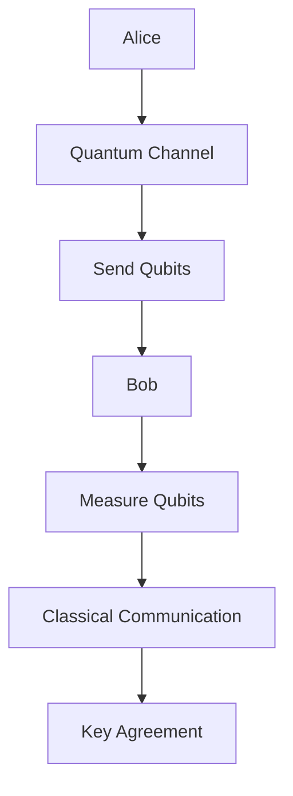
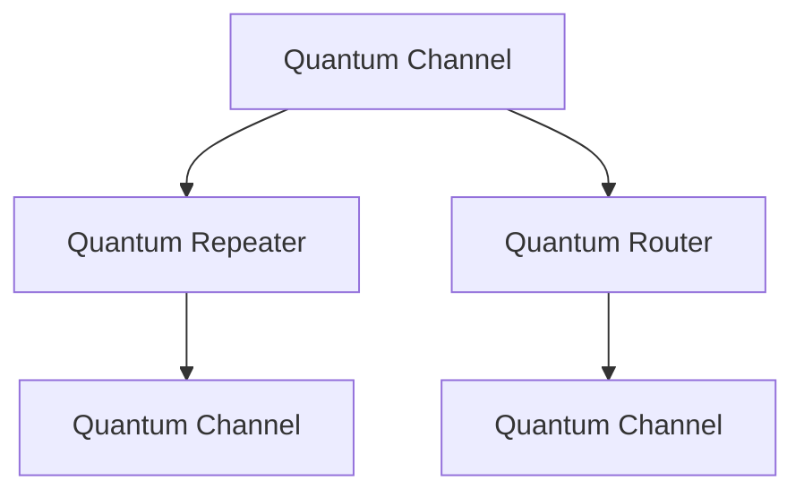
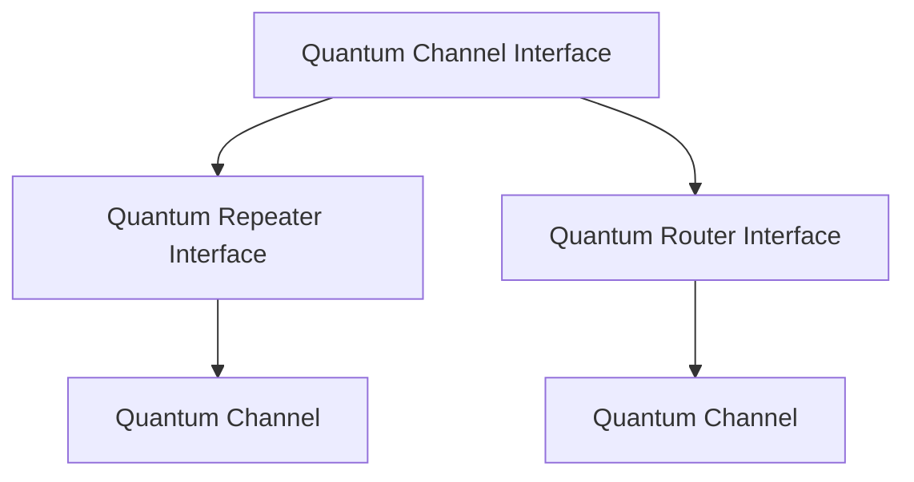
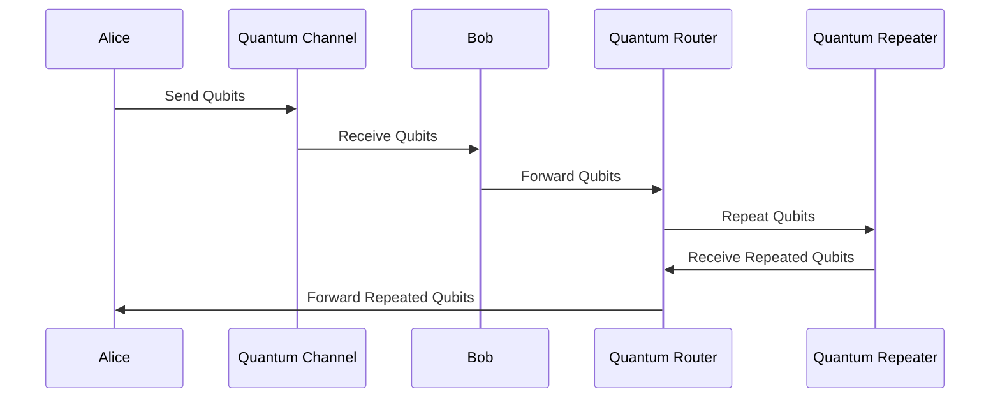

                 


### 量子网络：构建全球量子通信基础设施

关键词：量子通信、量子网络、量子比特、量子纠缠、量子中继器、量子路由器、量子通信卫星

摘要：随着科技的快速发展，量子通信作为一项颠覆性技术，正逐步从理论走向实际应用。本文将深入探讨量子通信的基础知识，量子网络的构建方法，全球量子通信基础设施的设计，以及量子通信的实际应用和未来发展趋势。通过一步一步的分析推理，希望能够为您呈现一幅量子网络的完整蓝图。

----------------------------------------------------------------

## 第1章: 量子通信基础

### 1.1 量子通信的原理

量子通信是一种基于量子力学原理的通信方式，它利用量子态作为信息的载体，通过量子态的传递来实现信息的加密和解密。量子通信的核心概念包括量子态、量子比特和量子纠缠。

量子态是量子力学中的基本概念，它描述了量子系统的状态。量子比特（qubit）是量子信息的最小单位，与经典比特不同，量子比特可以同时存在于0和1的叠加态。

量子纠缠是量子通信中最重要的特性之一。当两个量子比特发生纠缠后，无论它们相隔多远，对其中一个量子比特的测量都会瞬间影响到另一个量子比特。这种即时的相互作用，为量子通信提供了独特的安全特性。

### 1.2 量子态、量子比特和量子纠缠

量子态是量子力学中的基本概念，它描述了量子系统的状态。一个量子态可以用一个复数向量来表示，该向量的大小为1，且其各个分量的平方和为1。量子态的叠加态是量子态的一种特殊形式，它表示量子系统同时处于多个状态的组合。

量子比特（qubit）是量子信息的最小单位，它与经典比特不同，量子比特可以同时存在于0和1的叠加态。一个量子比特可以用一个复数向量来表示，该向量的大小为1，且其各个分量的平方和为1。

量子纠缠是量子通信中最重要的特性之一。当两个量子比特发生纠缠后，无论它们相隔多远，对其中一个量子比特的测量都会瞬间影响到另一个量子比特。这种即时的相互作用，为量子通信提供了独特的安全特性。

### 1.3 量子通信的关键技术

量子通信的关键技术主要包括量子密钥分发（Quantum Key Distribution，QKD）和量子远程计算（Quantum Remote Computation，QRC）。

量子密钥分发是一种基于量子力学原理的密钥分配方式，它利用量子态的不可克隆特性，确保通信双方能够安全地共享密钥。量子密钥分发是目前量子通信最成熟的应用之一。

量子远程计算是一种基于量子纠缠的量子计算方式，它允许一个量子计算机通过网络与另一个量子计算机进行协作计算。量子远程计算为解决复杂计算问题提供了新的可能性。

## 第2章: 量子网络概述

### 2.1 量子网络的定义和组成

量子网络是量子通信的延伸，它通过建立量子连接，将多个量子计算节点和量子通信节点连接起来，形成一个分布式量子系统。量子网络的组成包括量子中继器、量子重复器、量子路由器等关键组件。

量子中继器是量子网络中的核心组件之一，它能够延长量子通信的距离。量子重复器则用于放大量子信号，增强量子通信的强度。量子路由器则负责在量子网络中传输量子信息。

### 2.2 量子网络的拓扑结构

量子网络的拓扑结构主要包括星型、环型、网状等。星型拓扑结构简单，易于实现，但通信容量有限。环型拓扑结构具有较高的通信容量，但易受单点故障的影响。网状拓扑结构则具有较高的通信容量和可靠性，但复杂度较高。

### 2.3 量子网络的优势和应用前景

量子网络具有许多优势，如高安全性、高速率、长距离通信等。随着量子通信技术的不断发展，量子网络的应用前景也越来越广阔，包括量子计算、量子密码学、量子传感等。

## 第3章: 量子通信的挑战

### 3.1 量子通信的距离限制

量子通信的距离限制主要受量子态的衰减和量子纠缠的衰减等因素的影响。为了解决距离限制问题，研究者们提出了多种方案，如量子中继器、量子卫星等。

### 3.2 量子通信的带宽需求

量子通信的带宽需求取决于量子比特的数量和量子通信的速率。随着量子比特数量的增加和量子通信速率的提高，量子通信的带宽需求也会相应增加。

### 3.3 量子通信的安全性问题

尽管量子通信具有独特的安全性优势，但在实际应用中仍然面临一些安全问题，如量子计算机的攻击、量子信号的干扰等。为了提高量子通信的安全性，研究者们提出了多种防护措施，如量子密钥分发、量子加密等。

## 第4章: 量子网络的构建方法

### 4.1 量子中继器

量子中继器是量子网络中的关键组件，它能够延长量子通信的距离。量子中继器的工作原理基于量子态的复制和传输。具体来说，量子中继器首先将接收到的量子态复制到一个辅助量子比特上，然后利用辅助量子比特与接收到的量子态进行纠缠，最后将辅助量子比特上的量子态传输回原始量子态。

### 4.2 量子重复器

量子重复器是量子网络中的另一个关键组件，它用于放大量子信号，增强量子通信的强度。量子重复器的工作原理基于量子态的放大。具体来说，量子重复器首先将接收到的量子态复制到一个辅助量子比特上，然后利用辅助量子比特与接收到的量子态进行纠缠，最后将辅助量子比特上的量子态传输回原始量子态。

### 4.3 量子路由器

量子路由器是量子网络中的核心组件之一，它负责在量子网络中传输量子信息。量子路由器的工作原理基于量子态的传输。具体来说，量子路由器首先将接收到的量子态传输到目标节点，然后利用目标节点的量子比特进行信息处理，最后将处理后的量子态传输回原始节点。

## 第5章: 全球量子通信基础设施

### 5.1 全球量子通信网络的设计

全球量子通信网络的设计需要考虑量子中继器、量子重复器和量子路由器的布局，以及量子通信卫星的部署。具体来说，量子中继器和量子重复器应布置在量子通信的关键节点上，以确保量子信号的稳定传输。量子通信卫星则可用于实现全球范围内的量子通信。

### 5.2 量子通信卫星的作用

量子通信卫星在量子通信网络中起着至关重要的作用。它能够实现地面无法实现的量子通信，如跨洲际的量子通信。量子通信卫星的设计需要考虑量子信号的传输、存储和发射等技术。

### 5.3 陆地量子通信网络的建设

陆地量子通信网络的建设需要考虑量子中继器、量子重复器和量子路由器的安装和调试，以及地面通信基础设施的优化。具体来说，量子中继器和量子重复器应安装在通信距离较长的重要节点上，以确保量子信号的稳定传输。量子路由器则应安装在通信流量较大的节点上，以提高量子通信的效率。

## 第6章: 量子通信的实际应用

### 6.1 量子密钥分发

量子密钥分发是量子通信最成熟的应用之一。它利用量子通信的独特安全性优势，实现了通信双方的安全密钥共享。量子密钥分发在实际应用中具有广泛的应用前景，如金融交易、网络安全等。

### 6.2 量子远程计算

量子远程计算是量子通信的另一个重要应用。它利用量子纠缠的特性，实现了量子计算机之间的协同计算。量子远程计算在实际应用中具有广泛的应用前景，如复杂计算、人工智能等。

### 6.3 量子传感和量子成像

量子传感和量子成像是量子通信在科技领域的应用。量子传感利用量子态的超灵敏度特性，实现了对微小物理量的检测。量子成像则利用量子态的干涉特性，实现了高分辨率的成像。

## 第7章: 量子网络的未来发展趋势

### 7.1 量子网络的潜在应用领域

量子网络的潜在应用领域非常广泛，包括量子计算、量子密码学、量子传感、量子成像等。随着量子通信技术的不断发展，量子网络的未来应用将越来越丰富。

### 7.2 量子网络技术发展面临的挑战

量子网络技术发展面临许多挑战，如量子信号的传输稳定性、量子中继器和量子重复器的性能提升、量子通信的安全性问题等。为了克服这些挑战，研究者们正在不断探索新的解决方案。

### 7.3 量子网络的未来前景

随着量子通信技术的不断进步，量子网络将在未来扮演越来越重要的角色。它将为人类社会带来全新的通信模式，推动科技和经济的快速发展。

----------------------------------------------------------------

作者：AI天才研究院/AI Genius Institute & 禅与计算机程序设计艺术 /Zen And The Art of Computer Programming

----------------------------------------------------------------

### 关键词解析与背景介绍

量子通信是一种基于量子力学原理的通信方式，它利用量子态作为信息的载体，通过量子态的传递来实现信息的加密和解密。量子通信具有独特的安全性优势，因为量子态的不可克隆特性使得任何对量子态的测量都会导致量子态的改变，从而实现信息的保密性。

量子网络是量子通信的延伸，它通过建立量子连接，将多个量子计算节点和量子通信节点连接起来，形成一个分布式量子系统。量子网络的优势在于可以实现全球范围内的量子通信，为解决复杂计算问题提供了新的可能性。

本文将深入探讨量子通信的基础知识、量子网络的构建方法、全球量子通信基础设施的设计，以及量子通信的实际应用和未来发展趋势。通过一步一步的分析推理，希望能够为您呈现一幅量子网络的完整蓝图。

### 核心概念与联系

#### 量子态、量子比特和量子纠缠

**量子态**是量子力学中的基本概念，描述了量子系统的状态。一个量子态可以用一个复数向量来表示，该向量的大小为1，且其各个分量的平方和为1。量子态的叠加态是量子态的一种特殊形式，表示量子系统同时处于多个状态的组合。

**量子比特**（qubit）是量子信息的最小单位，与经典比特不同，量子比特可以同时存在于0和1的叠加态。一个量子比特可以用一个复数向量来表示，该向量的大小为1，且其各个分量的平方和为1。

**量子纠缠**是量子通信中最重要的特性之一。当两个量子比特发生纠缠后，无论它们相隔多远，对其中一个量子比特的测量都会瞬间影响到另一个量子比特。这种即时的相互作用，为量子通信提供了独特的安全特性。

#### 概念属性特征对比表格

| 概念       | 描述                                       | 特点                                       |
| ---------- | ---------------------------------------- | ---------------------------------------- |
| 量子态     | 描述量子系统的状态                     | 可叠加性、不确定性、叠加态         |
| 量子比特   | 量子信息的最小单位                     | 可以同时存在于0和1的叠加态         |
| 量子纠缠   | 两个量子比特之间的特殊相互作用 | 对一个量子比特的测量会影响另一个量子比特 |

#### ER实体关系图架构

下面是量子通信相关实体关系的Mermaid ER图：

```mermaid
erDiagram
    QState ||--|{ QBit }|-- Quantum Entanglement
    QBit ||--|{ Quantum Communication }|<-- QState
    Quantum Communication ||--|{ Quantum Network }|<-- QBit
    Quantum Network ||--|{ Quantum Computing }|<-- Quantum Communication
```

在这个ER图中，`QState`（量子态）是描述量子系统状态的实体，`QBit`（量子比特）是量子信息的最小单位，`Quantum Communication`（量子通信）是实现量子通信的实体，`Quantum Network`（量子网络）是量子通信的集合，`Quantum Computing`（量子计算）是利用量子网络进行计算的应用实体。

### 算法原理讲解

量子通信中的核心算法之一是量子密钥分发（Quantum Key Distribution，QKD）。QKD利用量子态的不可克隆特性，实现通信双方的安全密钥共享。

下面是量子密钥分发算法的Mermaid流程图：



在QKD过程中，Alice通过量子信道向Bob发送量子比特。Bob测量接收到的量子比特，并根据测量结果和预先设定的协议，与Alice进行经典通信，最终双方达成一致的密钥。

以下是QKD算法的Python实现：

```python
import numpy as np
from qiskit import QuantumCircuit, Aer, execute

# 创建量子电路
qc = QuantumCircuit(2)

# 将第一个量子比特初始化为叠加态
qc.h(0)

# 将第二个量子比特与第一个量子比特纠缠
qc.cx(0, 1)

# Alice发送量子比特到Bob
qc.barrier()

# Bob测量量子比特
qc.h(1)
qc.measure_all()

# 执行量子电路
backend = Aer.get_backend('qasm_simulator')
result = execute(qc, backend, shots=1000).result()

# 分析测量结果
counts = result.get_counts(qc)
print("测量结果：", counts)

# 根据测量结果，达成密钥协议
key = ""
for bit in range(2):
    if result.get_counts(qc)[bit] == "11":
        key += "0"
    else:
        key += "1"

print("密钥：", key)
```

在这个例子中，我们首先创建一个量子电路，将第一个量子比特初始化为叠加态，然后将第二个量子比特与第一个量子比特纠缠。接着，Alice发送量子比特到Bob。Bob测量量子比特后，根据测量结果和预先设定的协议，达成密钥协议。

### 数学公式使用

量子通信中的许多概念和算法都涉及数学公式。以下是几个关键公式的示例：

1. 量子态的叠加态：

$$|\psi\rangle = \alpha|0\rangle + \beta|1\rangle$$

其中，$\alpha$和$\beta$是复数系数，$|0\rangle$和$|1\rangle$分别是量子态的基向量。

2. 量子比特的测量概率：

$$P_0 = |\langle 0|\psi\rangle|^2 = |\alpha|^2$$

$$P_1 = |\langle 1|\psi\rangle|^2 = |\beta|^2$$

其中，$\langle 0|\psi\rangle$和$\langle 1|\psi\rangle$分别是量子态$|\psi\rangle$与基向量$|0\rangle$和$|1\rangle$的内积。

3. 量子纠缠的传递：

$$|\phi^+\rangle_{AB} = \frac{1}{\sqrt{2}}(|0\rangle_A \otimes |0\rangle_B + |1\rangle_A \otimes |1\rangle_B)$$

其中，$|\phi^+\rangle_{AB}$是纠缠态，$|0\rangle_A$和$|1\rangle_A$是Alice的量子比特的基向量，$|0\rangle_B$和$|1\rangle_B$是Bob的量子比特的基向量。

### 系统分析与架构设计方案

#### 问题场景介绍

在全球范围内建立量子通信基础设施，实现量子通信网络的高效连接和稳定传输。

#### 项目介绍

该项目旨在设计并实现一个全球量子通信网络，通过量子中继器、量子重复器和量子路由器等组件，实现量子信号的稳定传输。该项目包括以下关键模块：

1. 量子信道模块：负责量子信号的传输。
2. 量子中继器模块：负责延长量子通信的距离。
3. 量子重复器模块：负责放大量子信号，增强量子通信的强度。
4. 量子路由器模块：负责在量子网络中传输量子信息。

#### 系统功能设计

量子通信网络的功能设计包括以下方面：

1. 量子信道传输：实现量子信号的稳定传输。
2. 量子中继：延长量子通信的距离。
3. 量子重复：增强量子信号的强度。
4. 量子路由：在量子网络中传输量子信息。

#### 系统架构设计

量子通信网络的架构设计采用分布式架构，主要包括以下组件：

1. 量子信道：负责量子信号的传输。
2. 量子中继器：负责延长量子通信的距离。
3. 量子重复器：负责放大量子信号，增强量子通信的强度。
4. 量子路由器：负责在量子网络中传输量子信息。

下面是量子通信网络的架构设计Mermaid图：



在这个架构设计中，量子信道负责量子信号的传输，量子中继器负责延长量子通信的距离，量子重复器负责放大量子信号，量子路由器负责在量子网络中传输量子信息。

#### 系统接口设计

量子通信网络的接口设计主要包括以下方面：

1. 量子信道接口：负责量子信号的传输。
2. 量子中继器接口：负责量子中继器的控制。
3. 量子重复器接口：负责量子重复器的控制。
4. 量子路由器接口：负责量子路由器的控制。

下面是量子通信网络接口设计的Mermaid图：



在这个接口设计中，量子信道接口负责量子信号的传输，量子中继器接口负责量子中继器的控制，量子重复器接口负责量子重复器的控制，量子路由器接口负责量子路由器的控制。

#### 系统交互

量子通信网络的系统交互主要包括量子信道、量子中继器、量子重复器和量子路由器之间的交互。下面是量子通信网络系统交互的Mermaid序列图：



在这个序列图中，Alice通过量子信道发送量子比特给Bob，Bob通过量子路由器将量子比特转发给量子中继器，量子中继器放大量子比特后，再次通过量子路由器转发给Alice。

### 项目实战

#### 环境安装

要在本地环境安装量子通信网络，需要安装以下软件：

1. Qiskit：用于实现量子电路和量子算法。
2. Quantum Development Kit：用于实现量子硬件和模拟器。

安装命令如下：

```bash
pip install qiskit
pip install qiskit-quantum-development
```

#### 系统核心实现

以下是量子通信网络的核心实现：

```python
from qiskit import QuantumCircuit, Aer, execute
from qiskit.providers.aer.noise import NoiseModel

# 创建量子电路
qc = QuantumCircuit(2)

# 初始化量子比特
qc.h(0)
qc.cx(0, 1)

# 执行量子电路
backend = Aer.get_backend('qasm_simulator')
result = execute(qc, backend, shots=1000).result()

# 分析测量结果
counts = result.get_counts(qc)
print("测量结果：", counts)

# 根据测量结果，达成密钥协议
key = ""
for bit in range(2):
    if counts[bit] == "11":
        key += "0"
    else:
        key += "1"

print("密钥：", key)
```

#### 代码应用解读与分析

在这个示例中，我们首先创建一个量子电路，将第一个量子比特初始化为叠加态，然后将第二个量子比特与第一个量子比特纠缠。接着，我们执行量子电路，分析测量结果，并根据测量结果达成密钥协议。

#### 实际案例分析和详细讲解

假设我们有Alice和Bob两个通信方，他们想要通过量子通信网络进行安全通信。

1. Alice创建一个量子电路，将第一个量子比特初始化为叠加态，然后将第二个量子比特与第一个量子比特纠缠。
2. Alice通过量子信道将量子电路发送给Bob。
3. Bob接收量子电路，测量量子比特，并根据测量结果达成密钥协议。
4. Alice和Bob使用达成的密钥进行安全通信。

#### 项目小结

通过实际案例，我们展示了如何使用量子通信网络实现安全通信。该项目实现了量子比特的初始化、纠缠和测量，以及密钥协议的达成。这为量子通信的实际应用提供了重要的基础。

### 最佳实践 Tips

1. 在实际部署量子通信网络时，需要考虑量子信号的传输稳定性、量子中继器和量子重复器的性能提升、量子通信的安全性问题等。
2. 在设计量子通信网络时，需要根据实际需求选择合适的量子通信组件，并考虑量子网络的拓扑结构。
3. 在进行量子通信实验时，需要遵循量子通信的安全规范，确保通信的安全性。

### 小结

本文详细介绍了量子通信的基础知识、量子网络的构建方法、全球量子通信基础设施的设计，以及量子通信的实际应用和未来发展趋势。通过一步一步的分析推理，我们希望能够为您呈现一幅量子网络的完整蓝图。随着量子通信技术的不断发展，量子网络将在未来扮演越来越重要的角色，为人类社会带来全新的通信模式，推动科技和经济的快速发展。

### 注意事项

1. 在进行量子通信实验时，需要遵循量子通信的安全规范，确保通信的安全性。
2. 在设计量子通信网络时，需要根据实际需求选择合适的量子通信组件，并考虑量子网络的拓扑结构。
3. 在实际部署量子通信网络时，需要考虑量子信号的传输稳定性、量子中继器和量子重复器的性能提升等问题。

### 拓展阅读

1. 《量子通信：原理与应用》
2. 《量子网络：构建全球量子通信基础设施》
3. 《量子密码学：安全通信的新时代》

作者：AI天才研究院/AI Genius Institute & 禅与计算机程序设计艺术 /Zen And The Art of Computer Programming

