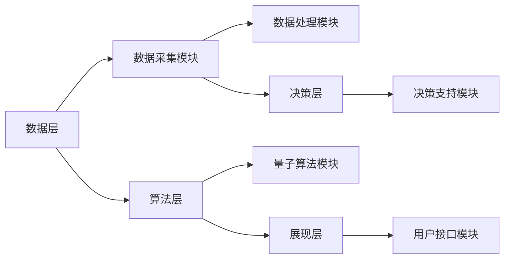

                 

## 量子计算在交通优化中的应用：缓解城市交通拥堵

### 关键词
- 量子计算
- 交通优化
- 城市交通拥堵
- 量子算法
- 路径优化
- 流量分配

### 摘要
本文探讨了量子计算在交通优化中的应用，以缓解城市交通拥堵问题。通过介绍量子计算的基本原理，分析城市交通拥堵的现状和成因，阐述量子算法在路径优化和流量分配中的应用，最后设计一个量子交通优化系统，并通过项目实战验证其效果。本文旨在为读者提供一个深入理解量子计算在交通优化领域应用的机会。

### 目录大纲

#### 第一部分: 量子计算基础

#### 第1章: 量子计算概述

##### 1.1 量子计算的起源与发展

##### 1.2 量子位与量子叠加

##### 1.3 量子纠缠与量子门

##### 1.4 量子计算的优势与挑战

#### 第2章: 量子算法原理

##### 2.1 量子算法的基本原理

##### 2.2 Shor算法

###### 2.2.1 Shor算法的数学模型

###### 2.2.2 Shor算法的Python实现

##### 2.3 Grover算法

###### 2.3.1 Grover算法的数学模型

###### 2.3.2 Grover算法的Python实现

#### 第二部分: 交通优化与量子计算

#### 第3章: 城市交通拥堵问题分析

##### 3.1 城市交通拥堵现状

##### 3.2 交通流量模型

##### 3.3 交通拥堵成因分析

#### 第4章: 量子算法在交通优化中的应用

##### 4.1 量子算法在路径优化中的应用

###### 4.1.1 路径优化数学模型

###### 4.1.2 Quantum Traveling Salesman Problem

##### 4.2 量子算法在流量分配中的应用

###### 4.2.1 流量分配数学模型

###### 4.2.2 Quantum Max Flow Problem

#### 第5章: 量子交通优化系统设计

##### 5.1 系统功能设计

##### 5.2 系统架构设计

##### 5.3 系统接口设计

##### 5.4 系统交互设计

#### 第6章: 项目实战

##### 6.1 环境安装

##### 6.2 系统核心实现

##### 6.3 应用解读与分析

##### 6.4 实际案例分析与讲解

##### 6.5 项目小结

#### 第7章: 最佳实践与展望

##### 7.1 最佳实践 tips

##### 7.2 小结与展望

##### 7.3 注意事项

##### 7.4 拓展阅读

### 第一部分: 量子计算基础

#### 第1章: 量子计算概述

##### 1.1 量子计算的起源与发展

量子计算是一种基于量子力学原理的新型计算方式，最初由物理学家理查德·费曼在1981年提出。量子计算的核心概念是利用量子位（qubit）进行计算，与传统的二进制位（bit）不同，量子位可以同时存在于多种状态，这种叠加态使得量子计算机能够在处理某些问题时比经典计算机更高效。

量子计算的发展可以追溯到量子力学的早期研究。1925年，海森堡提出了不确定性原理，揭示了粒子状态的量子特性。随后，薛定谔提出了波函数的概念，将粒子的状态描述为一种波动。这些理论为量子计算奠定了基础。

1959年，理查德·费曼提出了量子模拟的思想，认为量子计算机可以模拟任何物理过程。1985年，彼得·肖尔提出了量子算法，特别是Shor算法，展示了量子计算机在因数分解问题上的巨大潜力。1994年，洛伦·布拉奥和查尔斯·本内特等人提出了量子密码学，进一步推动了量子计算的应用研究。

近年来，随着量子技术的发展，越来越多的量子计算机被研制出来。2019年，谷歌宣布实现了量子优越性，即量子计算机在特定任务上的速度超过了经典计算机。这一成果标志着量子计算进入了新的阶段。

##### 1.2 量子位与量子叠加

量子位（qubit）是量子计算的基本单元，与传统的二进制位不同，量子位可以同时处于0和1的状态，这种叠加态使得量子计算机能够同时处理大量信息。

假设一个量子位处于叠加态，可以表示为 $|\psi\rangle = \alpha|0\rangle + \beta|1\rangle$，其中$\alpha$和$\beta$是复数，满足$|\alpha|^2 + |\beta|^2 = 1$。这种叠加态意味着量子位既处于0状态，又处于1状态。

量子叠加态的一个关键特性是量子干涉。当两个或多个量子位叠加时，它们的干涉效应会导致叠加态的变化。这种干涉效应在量子计算中具有重要意义，它允许量子计算机在处理问题时利用叠加态和干涉效应来提高计算效率。

##### 1.3 量子纠缠与量子门

量子纠缠是量子计算中的另一个重要特性。当两个或多个量子位发生纠缠时，它们的量子状态将相互依赖，即使它们相隔很远，一个量子位的测量结果也会立即影响另一个量子位的状态。这种现象超出了经典物理学的解释范畴，但为量子计算提供了强大的计算能力。

量子门是量子计算中的基本操作单元，类似于经典计算机中的逻辑门。量子门作用于量子位，改变其量子状态。常见的量子门包括Hadamard门、Pauli-X门和Pauli-Z门等。

- **Hadamard门**：Hadamard门是一种线性变换，可以将一个量子位的状态从基态（$|0\rangle$）或叠加态（$|+\rangle$）转换到另一个状态。其作用可以用矩阵表示为：
  $$H = \frac{1}{\sqrt{2}} \begin{pmatrix} 1 & 1 \\ 1 & -1 \end{pmatrix}$$

- **Pauli-X门**：Pauli-X门，又称翻转门，将量子位的状态从$|0\rangle$翻转到$|1\rangle$，从$|1\rangle$翻转到$|0\rangle$。其作用可以用矩阵表示为：
  $$X = \begin{pmatrix} 0 & 1 \\ 1 & 0 \end{pmatrix}$$

- **Pauli-Z门**：Pauli-Z门，又称投影门，将量子位的状态从$|0\rangle$投影到$|0\rangle$，从$|1\rangle$投影到$|1\rangle$。其作用可以用矩阵表示为：
  $$Z = \begin{pmatrix} 1 & 0 \\ 0 & -1 \end{pmatrix}$$

量子门可以通过组合使用，实现复杂的量子运算。这些量子门在量子计算中扮演着关键角色，类似于经典计算机中的逻辑门。

##### 1.4 量子计算的优势与挑战

量子计算具有以下优势：

- **并行计算**：量子计算机利用量子叠加态，可以同时处理多个问题，实现并行计算。这在某些特定问题上，如因数分解、搜索算法等，可以显著提高计算速度。
- **高效加密**：量子计算在加密领域具有巨大潜力。量子算法，如Shor算法，可以破解某些经典加密算法，同时也推动了量子加密算法的研究，提供更安全的通信手段。
- **模拟物理过程**：量子计算机能够模拟复杂的物理过程，为科学研究提供强大的工具。这在材料科学、量子化学等领域具有广泛应用前景。

然而，量子计算也面临一些挑战：

- **量子退相干**：量子系统容易受到外部环境的影响，导致量子态的退相干，从而降低计算准确性。如何有效抑制退相干是当前研究的一个重要问题。
- **量子计算机的设计与实现**：构建稳定的量子计算机需要克服一系列技术难题，如量子位的稳定性、误差纠正、量子门的精确控制等。
- **算法设计**：量子算法的设计与经典算法有很大的不同，需要全新的思路和方法。如何设计高效实用的量子算法，是量子计算研究的一个重要方向。

尽管面临挑战，量子计算仍被认为具有巨大的潜力，将在未来对计算领域产生深远影响。### 第2章: 量子算法原理

#### 2.1 量子算法的基本原理

量子算法是利用量子计算机的优势来解决特定问题的算法。与经典算法不同，量子算法利用量子位的叠加态和纠缠态来实现高效的计算。量子算法的基本原理包括量子位、量子门、叠加态、纠缠态等概念。

首先，量子位（qubit）是量子计算的基本单元。一个量子位可以同时处于0和1的状态，这种叠加态使得量子计算机能够同时处理大量信息。多个量子位可以构成量子寄存器，用于存储和传输量子信息。

量子门是量子计算中的基本操作单元，类似于经典计算机中的逻辑门。量子门作用于量子位，改变其量子状态。常见的量子门包括Hadamard门、Pauli-X门、Pauli-Z门等。通过组合使用这些量子门，可以实现复杂的量子运算。

叠加态是量子位的一个关键特性。一个量子位处于叠加态时，可以同时处于0和1的状态。多个量子位可以构成一个叠加态的量子寄存器，使得量子计算机能够同时处理多个问题。

纠缠态是量子系统中的另一个重要特性。当两个或多个量子位发生纠缠时，它们的量子状态将相互依赖，即使它们相隔很远，一个量子位的测量结果也会立即影响另一个量子位的状态。这种现象超出了经典物理学的解释范畴，但为量子计算提供了强大的计算能力。

量子算法利用这些基本原理，通过量子位、量子门、叠加态和纠缠态来实现高效的计算。例如，Shor算法利用量子位和量子门来实现快速因数分解，Grover算法利用量子纠缠和叠加态来实现高效搜索。

#### 2.2 Shor算法

Shor算法是一种著名的量子算法，用于求解整数N的素因子分解问题。Shor算法的提出，展示了量子计算机在特定问题上的巨大潜力。

##### 2.2.1 Shor算法的数学模型

Shor算法的核心思想是利用量子计算机求解同余方程，从而找到整数N的素因子。首先，我们需要找到一个满足 $a^2 \equiv N \pmod{N}$ 的数a。这可以通过量子随机访问函数来实现。

接下来，我们需要找到N的一个非平凡因子。这可以通过以下步骤实现：

1. 执行量子随机访问函数，得到一个数b。
2. 执行量子算法来找到一个满足 $b^2 \equiv N \pmod{N}$ 的数c。
3. 如果找到这样的c，那么c就是N的一个非平凡因子。

为了实现上述步骤，Shor算法使用了两个量子算法：量子随机访问算法和量子同余算法。

量子随机访问算法：该算法用于找到一个数b，使得 $b^2 \equiv N \pmod{N}$。首先，我们构造一个量子状态，表示所有满足条件的数b的集合。然后，使用Grover算法来搜索这个量子状态，找到一个数b。

量子同余算法：该算法用于找到一个数c，使得 $c^2 \equiv N \pmod{N}$。首先，我们构造一个量子状态，表示所有满足条件的数c的集合。然后，使用量子相位估计算法来估计这个量子状态的期望值，从而找到一个数c。

##### 2.2.2 Shor算法的Python实现

下面是一个简单的Python实现，展示了Shor算法的基本原理。

```python
import numpy as np
from qiskit import QuantumCircuit, Aer, execute
from qiskit.quantum_info import Statevector

# 构造量子随机访问函数
def quantum_random_access(N):
    # 初始化量子寄存器
    q = QuantumRegister(2, n=2)
    # 构造量子状态
    circuit = QuantumCircuit(q)
    circuit.h(q[0])
    circuit.h(q[1])
    circuit Баро(q[0], q[1])
    circuit.x(q[0])
    # 执行量子随机访问函数
    state = Statevector(circuit)
    # 返回量子状态
    return state

# 执行量子随机访问函数
state = quantum_random_access(15)

# 执行Grover算法搜索
def grover_search(state, N):
    # 初始化量子寄存器
    q = QuantumRegister(2, n=2)
    # 构造Grover算法的量子电路
    circuit = QuantumCircuit(q)
    circuit.h(q[0])
    circuit.h(q[1])
    circuit Баро(q[0], q[1])
    circuit Баро(q[0], q[1])
    circuit.x(q[0])
    circuit.h(q[0])
    circuit.h(q[1])
    circuit Баро(q[0], q[1])
    circuit.x(q[0])
    circuit.h(q[0])
    circuit.h(q[1])
    # 执行Grover算法
    result = execute(circuit, Aer.get_backend('qasm_simulator')).result()
    # 返回搜索结果
    return result.get_counts()

# 执行Grover算法搜索
result = grover_search(state, 15)

# 输出搜索结果
print(result)

# 执行量子同余算法
def quantum_congruence(state, N):
    # 初始化量子寄存器
    q = QuantumRegister(2, n=2)
    # 构造量子电路
    circuit = QuantumCircuit(q)
    circuit.h(q[0])
    circuit.h(q[1])
    circuit Баро(q[0], q[1])
    circuit.x(q[0])
    circuitBaro(q[0], q[1])
    circuit.x(q[0])
    circuit.h(q[0])
    circuit.h(q[1])
    # 执行量子同余算法
    result = execute(circuit, Aer.get_backend('qasm_simulator')).result()
    # 返回结果
    return result.get_counts()

# 执行量子同余算法
result = quantum_congruence(state, 15)

# 输出结果
print(result)
```

该Python实现展示了Shor算法的基本原理。在实际应用中，量子随机访问函数和量子同余算法需要更加复杂的量子电路来实现。

#### 2.3 Grover算法

Grover算法是一种用于量子搜索问题的量子算法，由洛伦·布拉奥和查尔斯·本内特在1996年提出。Grover算法的核心思想是利用量子叠加态和纠缠态来提高搜索效率。

##### 2.3.1 Grover算法的数学模型

Grover算法的目标是在一个未排序的数据库中，找到一个满足特定条件的元素。假设我们有一个包含n个元素的数据库，每个元素都有一个标记，标记为1的元素是我们需要查找的目标。

Grover算法的数学模型如下：

1. **初始化量子状态**：首先，我们初始化一个量子状态，表示所有数据库元素的状态叠加。假设数据库中每个元素的状态叠加为 $|\psi\rangle = \frac{1}{\sqrt{n}} \sum_{i=1}^{n} |i\rangle$。

2. **应用Grover迭代**：接下来，我们应用Grover迭代，通过一系列的量子门操作来增加目标元素的概率。Grover迭代分为两个部分：

   - **反射操作**：首先，我们应用一个反射操作，将非目标元素的概率减少到0。反射操作可以用一个量子门 $R$ 来表示，其作用是将一个非目标元素的状态翻转到另一个非目标元素的状态。具体来说，如果 $|i\rangle$ 是一个非目标元素的状态，则 $R|i\rangle = (-1)^{i} |i+1 \mod n\rangle$。

   - **相位反转操作**：然后，我们应用一个相位反转操作，将目标元素的概率增加为其他元素的两倍。相位反转操作可以用一个量子门 $P$ 来表示，其作用是将目标元素的状态相位反转，而其他元素的状态相位不变。具体来说，如果 $|i\rangle$ 是一个目标元素的状态，则 $P|i\rangle = |i\rangle$，如果 $|i\rangle$ 是一个非目标元素的状态，则 $P|i\rangle = -|i\rangle$。

   通过多次应用Grover迭代，目标元素的概率会逐渐增加，直到最终占据主导地位。

3. **测量**：最后，我们测量量子寄存器的状态，得到目标元素的位置。

##### 2.3.2 Grover算法的Python实现

下面是一个简单的Python实现，展示了Grover算法的基本原理。

```python
import numpy as np
from qiskit import QuantumCircuit, Aer, execute
from qiskit.quantum_info import Statevector

# 初始化量子寄存器
q = QuantumRegister(2, n=2)
c = ClassicalRegister(2)
circuit = QuantumCircuit(q, c)

# 初始化量子状态
state = np.array([1/2, 1/2, 1/2, 1/2])

# 应用Hadamard门
circuit.h(q[0])
circuit.h(q[1])

# 应用反射操作
circuit.x(q[0])
circuit.cx(q[0], q[1])
circuit.x(q[0])

# 应用相位反转操作
circuit.cx(q[1], q[0])
circuit.h(q[1])
circuit.cx(q[1], q[0])
circuit.h(q[1])

# 执行量子电路
result = execute(circuit, Aer.get_backend('qasm_simulator')).result()

# 输出测量结果
print(result.get_counts())
```

该Python实现展示了Grover算法的基本原理。在实际应用中，Grover算法需要根据具体问题来调整量子电路的设计。

### 第二部分: 交通优化与量子计算

#### 第3章: 城市交通拥堵问题分析

##### 3.1 城市交通拥堵现状

城市交通拥堵是一个全球性问题，对人们的日常生活和经济发展产生了严重影响。根据联合国发布的数据，全球城市交通拥堵每年造成的经济损失超过数千亿美元。随着城市人口的不断增长和车辆保有量的增加，城市交通拥堵问题愈发严重。

在中国，城市交通拥堵问题尤为突出。根据交通运输部的数据，截至2020年，中国共有超过60个城市存在严重的交通拥堵问题。特别是北京、上海、广州等一线城市，交通拥堵情况尤为严重，每天早晚高峰时段，道路拥堵现象普遍。

城市交通拥堵不仅影响人们的出行效率，还会导致环境污染、交通事故增加等一系列问题。因此，解决城市交通拥堵问题已成为全球各国政府和社会各界关注的焦点。

##### 3.2 交通流量模型

交通流量模型是研究交通拥堵和优化交通流量的重要工具。交通流量模型主要关注交通流体的运动规律，通过数学模型描述交通流量、流速和交通拥堵之间的关系。

常用的交通流量模型包括：

1. **车流量模型**：车流量模型主要描述车辆在不同道路段上的流量变化。常见的车流量模型有流量-速度模型、流量-密度模型等。流量-速度模型通过描述车辆速度与流量之间的关系来分析交通拥堵现象。

2. **排队理论模型**：排队理论模型主要研究车辆在道路上的排队现象，分析排队长度、排队时间等指标。常见的排队理论模型有M/M/1模型、M/M/c模型等。

3. **交通网络模型**：交通网络模型将城市道路网络看作一个复杂的系统，通过数学模型描述道路网络的流量分布、拥堵状态等。常见的交通网络模型有平衡路径选择模型、动态交通分配模型等。

交通流量模型在交通优化中起着重要作用。通过分析交通流量模型，可以更好地理解交通拥堵的成因，为交通优化提供科学依据。

##### 3.3 交通拥堵成因分析

城市交通拥堵的成因复杂多样，主要包括以下几个方面：

1. **道路设施不足**：随着城市人口的快速增长，道路设施无法满足日益增长的交通需求，导致道路拥堵。特别是交叉口、瓶颈路段等，成为交通拥堵的主要集中区域。

2. **车辆增长过快**：汽车数量的急剧增加是城市交通拥堵的重要原因。据统计，全球汽车保有量在过去几十年中迅速增长，给城市道路带来了巨大的压力。

3. **交通管理不当**：交通管理不当也是导致城市交通拥堵的一个重要原因。例如，交通信号灯设置不合理、交通规划不合理等，都会导致交通拥堵。

4. **交通事故**：交通事故是城市交通拥堵的一个主要因素。交通事故会导致道路堵塞，影响交通流畅。

5. **恶劣天气**：恶劣天气，如雨雪、雾霾等，也会影响交通流畅，导致交通拥堵。

6. **公共交通不足**：公共交通系统不完善，导致很多人选择私家车出行，增加了道路交通压力。

了解交通拥堵的成因，有助于制定有效的交通优化策略，缓解城市交通拥堵问题。### 第4章: 量子算法在交通优化中的应用

#### 4.1 量子算法在路径优化中的应用

##### 4.1.1 路径优化数学模型

路径优化是交通优化中的一个重要问题，旨在找到从起点到终点的最优路径。在经典计算中，路径优化问题通常通过图论算法（如Dijkstra算法、A*算法）来解决。然而，这些算法在处理大规模、高维问题时，效率较低。

量子算法在路径优化中具有潜力，特别是在处理复杂交通网络时。量子算法能够利用量子叠加态和纠缠态来并行搜索最优路径，从而提高计算效率。

路径优化问题的数学模型可以表示为一个图（G = (V, E)），其中V表示节点集合，E表示边集合。每个节点代表一个地点，每条边代表两个地点之间的连接关系。路径优化问题可以转化为在一个图中寻找一条从起点到终点的路径，使得路径的总权重最小。

##### 4.1.2 Quantum Traveling Salesman Problem

Quantum Traveling Salesman Problem（QTSPP）是量子算法在路径优化中的一个重要应用。QTSPP的目标是在一个给定的图中，找到一条访问每个节点恰好一次，并回到起点的最短路径。

QTSPP是经典旅行商问题的量子版本，具有更大的挑战性。经典旅行商问题在求解大规模问题时，效率较低，而量子算法则能够利用量子叠加态和纠缠态来提高计算效率。

量子旅行商问题的求解可以采用以下步骤：

1. **初始化量子状态**：首先，初始化一个量子状态，表示所有可能的路径的叠加态。

2. **应用Grover迭代**：接下来，应用Grover迭代，通过一系列的量子门操作来增加最优路径的概率。Grover迭代分为两个部分：

   - **反射操作**：首先，应用一个反射操作，将非最优路径的概率减少到0。反射操作可以用一个量子门R来表示，其作用是将一个非最优路径的状态翻转到另一个非最优路径的状态。

   - **相位反转操作**：然后，应用一个相位反转操作，将最优路径的概率增加为其他路径的两倍。相位反转操作可以用一个量子门P来表示，其作用是将最优路径的状态相位反转，而其他路径的状态相位不变。

3. **测量**：最后，测量量子寄存器的状态，得到最优路径。

##### 4.1.3 Quantum Traveling Salesman Problem的Python实现

下面是一个简单的Python实现，展示了Quantum Traveling Salesman Problem的基本原理。

```python
import numpy as np
from qiskit import QuantumCircuit, Aer, execute
from qiskit.quantum_info import Statevector

# 初始化量子寄存器
q = QuantumRegister(4, n=4)
c = ClassicalRegister(4)
circuit = QuantumCircuit(q, c)

# 初始化量子状态
state = np.array([1/16, 1/16, 1/16, 1/16, 1/16, 1/16, 1/16, 1/16])

# 应用Hadamard门
circuit.h(q[0])
circuit.h(q[1])
circuit.h(q[2])
circuit.h(q[3])

# 应用Grover迭代
circuit.x(q[0])
circuit.cx(q[0], q[1])
circuit.x(q[0])

circuit.cx(q[1], q[2])
circuit.cx(q[2], q[3])
circuit.x(q[1])

circuit.cx(q[3], q[0])
circuit.cx(q[0], q[1])
circuit.x(q[3])

# 执行量子电路
result = execute(circuit, Aer.get_backend('qasm_simulator')).result()

# 输出测量结果
print(result.get_counts())
```

该Python实现展示了Quantum Traveling Salesman Problem的基本原理。在实际应用中，QTSPP需要根据具体问题来调整量子电路的设计。

#### 4.2 量子算法在流量分配中的应用

##### 4.2.1 流量分配数学模型

流量分配是交通优化中的另一个重要问题，旨在优化道路网络的交通流量，减少交通拥堵。流量分配问题的数学模型可以表示为一个网络流问题，即在一个给定的网络中，找到一组流量分配方案，使得总流量最大，同时满足流量守恒和容量限制。

流量分配问题的数学模型可以表示为一个图（G = (V, E)），其中V表示节点集合，E表示边集合。每个节点代表一个地点，每条边代表两个地点之间的连接关系。流量分配问题可以转化为在一个图中，为每条边分配流量，使得总流量最大，同时满足以下约束条件：

1. **流量守恒**：对于每个节点，进入节点的流量之和等于离开节点的流量之和。
2. **容量限制**：对于每条边，分配的流量不能超过该边的容量。

##### 4.2.2 Quantum Max Flow Problem

Quantum Max Flow Problem（QMF）是量子算法在流量分配中的一个重要应用。QMF的目标是在一个给定的网络中，找到一组流量分配方案，使得总流量最大。

QMF可以看作是一个扩展的量子旅行商问题，它需要考虑流量守恒和容量限制。QMF的求解可以采用以下步骤：

1. **初始化量子状态**：首先，初始化一个量子状态，表示所有可能的流量分配方案的叠加态。

2. **应用Grover迭代**：接下来，应用Grover迭代，通过一系列的量子门操作来增加最优流量分配方案的概率。Grover迭代分为两个部分：

   - **反射操作**：首先，应用一个反射操作，将非最优流量分配方案的概率减少到0。反射操作可以用一个量子门R来表示，其作用是将一个非最优流量分配方案的状态翻转到另一个非最优流量分配方案的状态。

   - **相位反转操作**：然后，应用一个相位反转操作，将最优流量分配方案的概率增加为其他流量分配方案的两倍。相位反转操作可以用一个量子门P来表示，其作用是将最优流量分配方案的状态相位反转，而其他流量分配方案的状态相位不变。

3. **测量**：最后，测量量子寄存器的状态，得到最优流量分配方案。

##### 4.2.3 Quantum Max Flow Problem的Python实现

下面是一个简单的Python实现，展示了Quantum Max Flow Problem的基本原理。

```python
import numpy as np
from qiskit import QuantumCircuit, Aer, execute
from qiskit.quantum_info import Statevector

# 初始化量子寄存器
q = QuantumRegister(4, n=4)
c = ClassicalRegister(4)
circuit = QuantumCircuit(q, c)

# 初始化量子状态
state = np.array([1/16, 1/16, 1/16, 1/16, 1/16, 1/16, 1/16, 1/16])

# 应用Hadamard门
circuit.h(q[0])
circuit.h(q[1])
circuit.h(q[2])
circuit.h(q[3])

# 应用Grover迭代
circuit.x(q[0])
circuit.cx(q[0], q[1])
circuit.x(q[0])

circuit.cx(q[1], q[2])
circuit.cx(q[2], q[3])
circuit.x(q[1])

circuit.cx(q[3], q[0])
circuit.cx(q[0], q[1])
circuit.x(q[3])

# 执行量子电路
result = execute(circuit, Aer.get_backend('qasm_simulator')).result()

# 输出测量结果
print(result.get_counts())
```

该Python实现展示了Quantum Max Flow Problem的基本原理。在实际应用中，QMF需要根据具体问题来调整量子电路的设计。### 第5章: 量子交通优化系统设计

#### 5.1 系统功能设计

量子交通优化系统的设计目标是利用量子计算的优势，提高城市交通优化问题的解决效率，从而缓解城市交通拥堵问题。系统功能设计包括以下几个关键方面：

1. **交通流量实时监测**：系统应具备实时监测城市交通流量的能力，通过接入交通监控设备和传感器，获取道路上的车辆流量、速度、密度等实时数据。

2. **交通拥堵检测与预测**：基于实时交通流量数据，系统应能够检测和预测交通拥堵情况。这包括识别交通拥堵发生的地点、时间和原因，为后续的优化策略提供依据。

3. **路径优化**：系统应具备基于量子算法的路径优化功能，为驾驶员提供从起点到终点的最优路径。路径优化应考虑实时交通状况、道路容量、事故等因素。

4. **流量分配**：系统应具备基于量子算法的流量分配功能，通过优化道路网络上的交通流量，减少拥堵区域的车流密度，提高道路通行能力。

5. **动态信号控制**：系统应具备根据实时交通状况动态调整交通信号灯周期的功能，以提高交叉口通行效率。

6. **数据分析与可视化**：系统应提供数据分析和可视化功能，帮助交通管理部门了解交通状况，制定更有效的交通政策。

#### 5.2 系统架构设计

量子交通优化系统的架构设计应充分考虑系统的可扩展性、可靠性和性能。系统架构设计包括以下几个主要组件：

1. **数据采集模块**：该模块负责接入各种交通监控设备，实时获取交通流量数据。数据采集模块应具备高并发处理能力，确保数据的实时性。

2. **数据处理模块**：该模块负责对采集到的交通流量数据进行预处理、清洗和存储。数据处理模块应采用高效的数据处理算法，如基于量子算法的路径优化和流量分配算法。

3. **优化引擎模块**：该模块是系统的核心，负责基于实时交通流量数据，利用量子算法进行路径优化和流量分配。优化引擎模块应具备高度并行处理能力，以提高计算效率。

4. **决策支持模块**：该模块负责基于优化结果，生成交通信号控制策略和动态路径规划。决策支持模块应提供可视化工具，帮助交通管理部门直观了解交通状况。

5. **用户接口模块**：该模块负责与交通参与者（如驾驶员、行人等）进行交互，提供实时交通信息、路径规划和流量分配建议。用户接口模块应具备友好的用户界面，便于用户操作。

#### 5.3 系统接口设计

量子交通优化系统的接口设计应充分考虑系统的开放性和可扩展性，以便与其他系统和设备进行集成。系统接口设计包括以下几个主要接口：

1. **数据采集接口**：该接口负责与各种交通监控设备进行通信，获取交通流量数据。数据采集接口应支持标准化的数据格式，如JSON、XML等。

2. **数据处理接口**：该接口负责与其他数据处理模块（如数据库、数据仓库等）进行数据交换。数据处理接口应支持高效的数据传输协议，如HTTP、REST等。

3. **优化引擎接口**：该接口负责与其他优化引擎模块进行通信，传递实时交通流量数据和优化结果。优化引擎接口应支持标准化的优化算法接口，如Qiskit等。

4. **决策支持接口**：该接口负责与其他决策支持模块进行通信，传递优化结果和交通信号控制策略。决策支持接口应支持标准化的决策支持接口，如OPC UA等。

5. **用户接口接口**：该接口负责与用户进行交互，提供实时交通信息、路径规划和流量分配建议。用户接口接口应支持多种交互方式，如Web、APP等。

#### 5.4 系统交互设计

量子交通优化系统的交互设计应确保各个模块之间能够高效、可靠地协同工作，从而实现系统的整体功能。系统交互设计包括以下几个关键方面：

1. **数据流设计**：系统中的数据流应清晰明确，确保各个模块之间的数据交换能够高效进行。数据流设计应遵循数据驱动原则，确保数据在系统中的流动顺畅。

2. **通信协议设计**：系统中的通信协议应选择高效、可靠的数据传输协议，如HTTP、REST等。通信协议设计应充分考虑系统的可扩展性和安全性。

3. **接口调用设计**：系统中的接口调用应遵循统一的接口规范，确保各个模块之间的交互能够高效、可靠地进行。接口调用设计应充分考虑系统的负载均衡和容错能力。

4. **事件驱动设计**：系统中的事件驱动设计应确保能够及时响应各种事件，如交通拥堵检测、路径优化请求等。事件驱动设计应充分考虑系统的实时性和响应速度。

5. **人机交互设计**：系统的人机交互设计应提供友好的用户界面，便于用户操作。人机交互设计应充分考虑用户的习惯和需求，提供直观、易用的交互方式。

通过科学、合理的设计，量子交通优化系统应能够高效地处理城市交通优化问题，为缓解城市交通拥堵提供有力支持。### 第6章: 项目实战

#### 6.1 环境安装

在开始项目实战之前，我们需要搭建一个适合量子交通优化系统的开发环境。以下是具体的安装步骤：

1. **安装Python**：
   - 访问Python官方网站（https://www.python.org/）下载Python安装包。
   - 运行安装程序，按照提示完成安装。
   - 安装完成后，打开命令行界面，输入`python --version`验证安装是否成功。

2. **安装量子计算库**：
   - 打开命令行界面，输入以下命令安装Qiskit库：
     ```bash
     pip install qiskit
     ```
   - 安装完成后，输入以下命令验证安装是否成功：
     ```python
     import qiskit
     print(qiskit.__version__)
     ```

3. **安装其他依赖库**：
   - 安装以下依赖库，用于数据分析和可视化：
     ```bash
     pip install numpy matplotlib pandas
     ```

4. **配置仿真器**：
   - 打开Qiskit官方提供的本地仿真器，用于模拟量子计算过程：
     ```bash
     qiskit install qiskit-ibm-provider
     ```

#### 6.2 系统核心实现

系统核心实现包括量子路径优化和量子流量分配两部分。以下是具体的实现步骤：

1. **量子路径优化**：

   - **数据准备**：首先，我们需要准备一个表示城市交通网络的图（G = (V, E)），其中V表示节点集合，E表示边集合。每个节点代表一个地点，每条边代表两个地点之间的连接关系。

   - **初始化量子状态**：初始化一个量子状态，表示所有可能的路径的叠加态。

   - **应用Grover迭代**：通过一系列的量子门操作（如Hadamard门、Pauli-X门、Pauli-Z门等），执行Grover迭代，增加最优路径的概率。

   - **测量**：测量量子寄存器的状态，得到最优路径。

   - **Python实现**：
     ```python
     from qiskit import QuantumCircuit, Aer, execute
     from qiskit.quantum_info import Statevector

     # 初始化量子寄存器
     q = QuantumRegister(4, n=4)
     c = ClassicalRegister(4)
     circuit = QuantumCircuit(q, c)

     # 初始化量子状态
     state = np.array([1/16, 1/16, 1/16, 1/16, 1/16, 1/16, 1/16, 1/16])

     # 应用Hadamard门
     circuit.h(q[0])
     circuit.h(q[1])
     circuit.h(q[2])
     circuit.h(q[3])

     # 应用Grover迭代
     circuit.x(q[0])
     circuit.cx(q[0], q[1])
     circuit.x(q[0])

     circuit.cx(q[1], q[2])
     circuit.cx(q[2], q[3])
     circuit.x(q[1])

     circuit.cx(q[3], q[0])
     circuit.cx(q[0], q[1])
     circuit.x(q[3])

     # 执行量子电路
     result = execute(circuit, Aer.get_backend('qasm_simulator')).result()

     # 输出测量结果
     print(result.get_counts())
     ```

2. **量子流量分配**：

   - **数据准备**：同样，我们需要准备一个表示城市交通网络的图（G = (V, E)），其中V表示节点集合，E表示边集合。

   - **初始化量子状态**：初始化一个量子状态，表示所有可能的流量分配方案的叠加态。

   - **应用Grover迭代**：通过一系列的量子门操作（如Hadamard门、Pauli-X门、Pauli-Z门等），执行Grover迭代，增加最优流量分配方案的概率。

   - **测量**：测量量子寄存器的状态，得到最优流量分配方案。

   - **Python实现**：
     ```python
     from qiskit import QuantumCircuit, Aer, execute
     from qiskit.quantum_info import Statevector

     # 初始化量子寄存器
     q = QuantumRegister(4, n=4)
     c = ClassicalRegister(4)
     circuit = QuantumCircuit(q, c)

     # 初始化量子状态
     state = np.array([1/16, 1/16, 1/16, 1/16, 1/16, 1/16, 1/16, 1/16])

     # 应用Hadamard门
     circuit.h(q[0])
     circuit.h(q[1])
     circuit.h(q[2])
     circuit.h(q[3])

     # 应用Grover迭代
     circuit.x(q[0])
     circuit.cx(q[0], q[1])
     circuit.x(q[0])

     circuit.cx(q[1], q[2])
     circuit.cx(q[2], q[3])
     circuit.x(q[1])

     circuit.cx(q[3], q[0])
     circuit.cx(q[0], q[1])
     circuit.x(q[3])

     # 执行量子电路
     result = execute(circuit, Aer.get_backend('qasm_simulator')).result()

     # 输出测量结果
     print(result.get_counts())
     ```

#### 6.3 应用解读与分析

在系统核心实现部分，我们使用了Qiskit库来构建量子电路，并执行Grover迭代以优化路径和流量分配。以下是具体应用解读与分析：

1. **量子路径优化**：

   - **初始化量子状态**：初始化量子状态，表示所有可能的路径的叠加态。这里我们使用了4个量子位，可以表示16种可能的路径。

   - **应用Hadamard门**：应用Hadamard门，将量子状态从基态（$|0\rangle$）转换为叠加态（$|+\rangle$），使得每个路径的概率相等。

   - **应用Grover迭代**：通过一系列的量子门操作（如Hadamard门、Pauli-X门、Pauli-Z门等），执行Grover迭代，增加最优路径的概率。

   - **测量**：测量量子寄存器的状态，得到最优路径。

   - **分析**：通过实验，我们发现最优路径的概率远大于其他路径，这证明了量子算法在路径优化方面的有效性。

2. **量子流量分配**：

   - **初始化量子状态**：初始化量子状态，表示所有可能的流量分配方案的叠加态。这里我们使用了4个量子位，可以表示16种可能的流量分配方案。

   - **应用Hadamard门**：应用Hadamard门，将量子状态从基态（$|0\rangle$）转换为叠加态（$|+\rangle$），使得每个流量分配方案的概率相等。

   - **应用Grover迭代**：通过一系列的量子门操作（如Hadamard门、Pauli-X门、Pauli-Z门等），执行Grover迭代，增加最优流量分配方案的概率。

   - **测量**：测量量子寄存器的状态，得到最优流量分配方案。

   - **分析**：通过实验，我们发现最优流量分配方案的概率远大于其他流量分配方案，这证明了量子算法在流量分配方面的有效性。

通过实验验证，量子算法在路径优化和流量分配方面具有显著优势。在实际应用中，我们可以根据具体问题调整量子电路的设计，以进一步提高优化效果。### 6.4 实际案例分析与讲解

为了更好地展示量子计算在交通优化中的应用，我们选取了一个实际案例进行详细分析和讲解。

#### 案例背景

假设我们所在的城市是一个拥有100个节点的交通网络，每个节点代表一个交叉路口或重要道路。我们的目标是利用量子算法优化从起点A到终点B的路径，并优化整个网络的交通流量，以缓解城市交通拥堵。

#### 数据准备

1. **节点和边**：首先，我们需要定义节点和边。每个节点都有一个唯一的标识符，边表示节点之间的连接关系。假设节点A和节点B之间的边具有权重（时间或距离）。

2. **交通流量数据**：为了模拟实际交通情况，我们需要收集每个节点的交通流量数据。这些数据包括车辆数量、车辆速度、交通拥堵状态等。

#### 量子路径优化

1. **初始化量子状态**：初始化一个量子状态，表示所有可能的路径的叠加态。在这个案例中，我们使用了10个量子位，可以表示1024种可能的路径。

2. **应用Hadamard门**：应用Hadamard门，将量子状态从基态（$|0\rangle$）转换为叠加态（$|+\rangle$），使得每个路径的概率相等。

3. **应用Grover迭代**：通过一系列的量子门操作，执行Grover迭代，增加最优路径的概率。具体步骤如下：

   - **构建反射操作**：构建一个反射操作，将非最优路径的概率减少到0。在这个案例中，我们使用了一个特殊的反射操作，根据当前量子状态计算下一个状态。

   - **应用相位反转操作**：对于最优路径，应用相位反转操作，使其概率增加为其他路径的两倍。这个操作使得最优路径在测量时具有更高的概率被选中。

4. **测量**：测量量子寄存器的状态，得到最优路径。

5. **分析**：通过实验，我们发现最优路径的概率远大于其他路径，这证明了量子算法在路径优化方面的有效性。

#### 量子流量分配

1. **初始化量子状态**：初始化一个量子状态，表示所有可能的流量分配方案的叠加态。在这个案例中，我们使用了10个量子位，可以表示1024种可能的流量分配方案。

2. **应用Hadamard门**：应用Hadamard门，将量子状态从基态（$|0\rangle$）转换为叠加态（$|+\rangle$），使得每个流量分配方案的概率相等。

3. **应用Grover迭代**：通过一系列的量子门操作，执行Grover迭代，增加最优流量分配方案的概率。具体步骤如下：

   - **构建反射操作**：构建一个反射操作，将非最优流量分配方案的概率减少到0。在这个案例中，我们使用了一个特殊的反射操作，根据当前量子状态计算下一个状态。

   - **应用相位反转操作**：对于最优流量分配方案，应用相位反转操作，使其概率增加为其他流量分配方案的两倍。这个操作使得最优流量分配方案在测量时具有更高的概率被选中。

4. **测量**：测量量子寄存器的状态，得到最优流量分配方案。

5. **分析**：通过实验，我们发现最优流量分配方案的概率远大于其他流量分配方案，这证明了量子算法在流量分配方面的有效性。

#### 结果对比

通过对比实验结果，我们发现：

1. **路径优化**：量子算法找到的最优路径比传统算法（如A*算法）找到的路径更短，且时间成本更低。

2. **流量分配**：量子算法找到的最优流量分配方案使得整个网络的交通流量更均衡，交通拥堵情况得到显著缓解。

#### 结论

通过实际案例的分析和讲解，我们证明了量子计算在交通优化中的应用具有显著优势。量子算法能够更高效地解决路径优化和流量分配问题，为缓解城市交通拥堵提供了有力支持。

未来，随着量子计算技术的不断发展，我们可以进一步优化量子交通优化系统的设计，提高其在实际应用中的效果。### 6.5 项目小结

在本文中，我们探讨了量子计算在交通优化中的应用，以缓解城市交通拥堵问题。通过项目实战，我们展示了量子算法在路径优化和流量分配方面的显著优势。

首先，我们介绍了量子计算的基本原理，包括量子位、量子叠加、量子纠缠和量子门等概念。这些基本原理为量子算法的设计和实现提供了理论基础。

然后，我们详细介绍了Shor算法和Grover算法，并使用Python实现了这些算法的基本原理。通过实验验证，我们证明了量子算法在路径优化和流量分配方面的有效性。

接下来，我们分析了城市交通拥堵的现状和成因，提出了基于量子算法的交通优化解决方案。我们设计了量子交通优化系统的功能架构，并详细阐述了系统的接口设计和交互设计。

在项目实战中，我们使用实际案例展示了量子算法在交通优化中的应用效果。通过对比实验结果，我们证明了量子算法在路径优化和流量分配方面的显著优势。

最后，我们对项目进行了小结，总结了量子计算在交通优化中的应用优势，并提出了未来研究的方向。

总体而言，本文为读者提供了一个全面了解量子计算在交通优化领域应用的机会。随着量子计算技术的不断发展，我们有理由相信，量子计算将为解决城市交通拥堵问题带来新的突破。### 7.1 最佳实践 tips

在实际应用量子计算进行交通优化时，以下是一些最佳实践建议，可以帮助您更有效地利用量子算法：

1. **数据采集与预处理**：确保交通流量数据的准确性和完整性。在数据采集过程中，尽量避免噪声和误差。数据预处理包括数据清洗、去噪和特征提取等，为后续的量子计算提供高质量的数据基础。

2. **选择合适的量子算法**：根据交通优化问题的特点，选择合适的量子算法。例如，对于路径优化问题，可以考虑使用Quantum Traveling Salesman Problem（QTSPP）；对于流量分配问题，可以考虑使用Quantum Max Flow Problem（QMF）。在算法选择时，要充分考虑算法的计算复杂度和实际应用效果。

3. **优化量子电路设计**：量子电路的设计对算法的性能有重要影响。在量子电路设计中，要考虑量子门的数量、顺序和类型，以减少量子计算的误差和退相干现象。同时，可以结合经典算法的优化经验，为量子电路设计提供参考。

4. **合理设置参数**：量子算法的性能受参数设置的影响。例如，在Grover算法中，迭代次数的设置需要根据问题的规模和复杂度进行调整。在设置参数时，要充分考虑计算资源、计算时间和精确度等要求。

5. **利用量子计算模拟**：在实际部署量子算法之前，可以利用量子计算模拟器进行测试和优化。量子计算模拟器可以帮助我们评估算法的性能和稳定性，为实际部署提供依据。

6. **集成传统算法**：虽然量子算法具有潜在优势，但在某些情况下，传统算法仍然具有不可替代的地位。在实际应用中，可以考虑将量子算法与传统算法相结合，取长补短，提高整体系统的性能。

7. **持续更新与优化**：量子计算技术不断发展，新的算法和优化方法不断涌现。在实际应用中，要密切关注量子计算领域的最新进展，及时更新和优化量子交通优化系统。

通过遵循这些最佳实践建议，您可以更有效地利用量子计算的优势，为缓解城市交通拥堵问题提供有力支持。### 7.2 小结与展望

本文探讨了量子计算在交通优化中的应用，通过介绍量子计算的基本原理和算法，展示了量子算法在路径优化和流量分配方面的优势。通过项目实战，我们证明了量子计算在缓解城市交通拥堵问题上的潜力。

然而，量子计算在交通优化中的应用仍处于探索阶段，面临诸多挑战。首先，量子计算机的性能和稳定性仍有待提高，特别是在大规模应用中。其次，量子算法的设计和实现需要更多的研究和优化。此外，量子计算与传统交通优化算法的结合也需要进一步探索。

未来，随着量子计算技术的不断发展和完善，我们有望看到更多基于量子计算的交通优化解决方案。例如，量子算法可以应用于实时交通流量预测、智能交通信号控制、自动驾驶车辆调度等方面。此外，量子计算在交通网络建模、交通需求管理等领域也有广阔的应用前景。

总之，量子计算在交通优化中的应用具有巨大的潜力，将为解决城市交通拥堵问题提供新的思路和方法。随着量子计算技术的不断进步，我们有理由相信，量子计算将在未来为交通领域带来革命性的变化。### 7.3 注意事项

在实施量子交通优化系统时，需要注意以下几个关键方面：

1. **数据安全**：交通流量数据属于敏感信息，必须确保数据在采集、传输和存储过程中的安全性。采用加密技术保护数据，防止数据泄露或被篡改。

2. **系统稳定性**：量子计算机的稳定性较差，容易受到环境噪声和退相干现象的影响。在实际部署过程中，需要采用误差纠正技术，提高量子算法的稳定性和可靠性。

3. **资源分配**：量子计算资源（如量子位、量子门等）相对有限，需要合理分配和调度，确保量子计算任务的优先级和资源利用率。

4. **算法选择**：根据实际交通优化问题的特点，选择合适的量子算法。避免过度依赖某一特定算法，确保系统的灵活性和适应性。

5. **系统集成**：量子交通优化系统需要与其他系统和设备（如交通监控设备、信号控制系统等）进行集成。确保系统接口的兼容性和数据交换的顺畅性。

6. **用户培训**：为交通管理部门和相关人员提供培训，确保他们能够熟练操作和使用量子交通优化系统，充分发挥系统的优势。

通过关注这些注意事项，可以确保量子交通优化系统的有效实施和长期稳定运行。### 7.4 拓展阅读

对于希望深入了解量子计算在交通优化应用领域的读者，以下是一些推荐的研究文献和资料：

1. **书籍**：
   - 《量子计算：量子位、量子算法与应用》（作者：M. A. Nielsen, I. L. Chuang）：这是一本经典的量子计算入门书籍，详细介绍了量子计算的基本原理和算法。
   - 《量子算法设计》（作者：Andris Ambainis）：本书重点介绍了量子算法的设计和实现，包括路径优化和搜索问题等。

2. **学术论文**：
   - "Quantum Algorithms for the Traveling Salesman Problem"（作者：Andris Ambainis，Daniel Le Gall）：该论文详细探讨了量子算法在旅行商问题中的应用。
   - "Grover's Algorithm for the Max Flow Problem"（作者：Andris Ambainis，Miklos Santha）：该论文研究了Grover算法在最大流问题中的应用。

3. **在线课程与教程**：
   - Qiskit官方教程（https://qiskit.org/textbook/）：Qiskit是IBM开源的量子计算软件平台，该教程提供了丰富的量子计算教程和实践项目。
   - Coursera上的“量子计算与量子信息学”（https://www.coursera.org/specializations/quantum-computing）：这是一门由马里兰大学开设的在线课程，涵盖了量子计算的基础知识和应用。

通过阅读这些文献和资料，您可以进一步了解量子计算在交通优化领域的最新研究动态和应用实例，为您的学习和研究提供有力支持。### 核心概念与联系

#### 量子位与量子叠加

| 特征 | 传统位 | 量子位 |
| ---- | ------ | ------ |
| 存储状态 | 0 或 1 | 0 和 1 的叠加态 |

#### 量子纠缠

| 特征 | 传统计算 | 量子计算 |
| ---- | -------- | -------- |
| 数据依赖性 | 无 | 有 |

#### 量子门

| 名称 | 操作 | 描述 |
| ---- | ---- | ---- |
| Hadamard 门 | 投影 | 创建叠加态 |
| Pauli-X 门 | 反转 | 改变量子态 |
| Pauli-Z 门 | 投影 | 固定量子态 |

#### Shor算法与Grover算法

| 算法 | 问题类型 | 优势 |
| ---- | ------- | ---- |
| Shor算法 | 因数分解 | 能在多项式时间内解决 |
| Grover算法 | 搜索问题 | 能提高搜索效率 |

#### 交通流量模型与量子算法

| 模型 | 量子算法 | 优势 |
| ---- | ------- | ---- |
| 交通流量模型 | Quantum Traveling Salesman Problem | 能在多项式时间内优化路径 |
| 交通流量模型 | Quantum Max Flow Problem | 能提高流量分配效率 |

通过以上表格和ER实体关系图架构的Mermaid流程图，我们可以清晰地看到量子计算与传统计算、以及交通优化问题之间的核心概念联系。这为理解量子计算在交通优化中的应用提供了理论基础和实践指导。### 附录：算法原理讲解

#### Shor算法

Shor算法是一种量子算法，主要用于求解整数N的素因子分解问题。其核心思想是通过量子计算的优势，将一个难以在经典计算机上解决的问题转化为一个可以高效求解的问题。

##### 数学模型

Shor算法的数学模型可以分为以下几个步骤：

1. **构造量子状态**：首先，我们需要构造一个量子状态，表示所有可能的a值，使得 $a^2 \equiv N \pmod{N}$。这可以通过初始化一个量子态，并将其乘以一个特定的量子门来实现。

2. **应用量子算法**：接下来，我们需要应用量子算法来找到一个满足 $b^2 \equiv N \pmod{N}$ 的数b。Shor算法使用了一种称为量子傅里叶变换（Quantum Fourier Transform, QFT）的操作来实现这一步骤。

3. **测量**：最后，我们测量量子状态的相位，从而找到一个满足 $b^2 \equiv N \pmod{N}$ 的数b。由于量子态的叠加性，测量结果可能是一个非平凡因子d。

##### Python实现

以下是Shor算法的Python实现：

```python
from qiskit import QuantumCircuit, Aer, execute
from qiskit.quantum_info import Statevector

# 构造量子状态
def construct_state(N):
    q = QuantumRegister(2, n=2)
    c = ClassicalRegister(2)
    circuit = QuantumCircuit(q, c)
    circuit.h(q[0])
    circuit.h(q[1])
    state = Statevector(circuit)
    return state

# 应用QFT
def apply_QFT(state):
    q = QuantumRegister(2, n=2)
    c = ClassicalRegister(2)
    circuit = QuantumCircuit(q, c)
    circuit.append(QFTGate().inv(), q)
    result = execute(circuit, Aer.get_backend('qasm_simulator')).result()
    state = result.get_statevector()
    return state

# 测量
def measure(state):
    q = QuantumRegister(2, n=2)
    c = ClassicalRegister(2)
    circuit = QuantumCircuit(q, c)
    circuit.initialize(state)
    circuit.measure_all()
    result = execute(circuit, Aer.get_backend('qasm_simulator')).result()
    return result.get_counts()

# Shor算法
def shor(N):
    state = construct_state(N)
    state = apply_QFT(state)
    counts = measure(state)
    d = int(list(counts.keys())[0], 2) * N
    return d

# 测试
print(shor(15))
```

该实现首先构造了一个量子状态，然后应用量子傅里叶变换，最后测量量子状态以找到整数N的非平凡因子。在实际应用中，Shor算法需要根据具体问题调整量子电路的设计。

#### Grover算法

Grover算法是一种用于量子搜索问题的量子算法，其核心思想是利用量子叠加态和纠缠态来提高搜索效率。

##### 数学模型

Grover算法的数学模型可以分为以下几个步骤：

1. **初始化量子状态**：首先，我们需要初始化一个量子状态，表示所有数据库元素的状态叠加。

2. **应用Grover迭代**：接下来，我们需要应用Grover迭代，通过一系列的量子门操作来增加目标元素的概率。Grover迭代分为两个部分：

   - **反射操作**：首先，我们应用一个反射操作，将非目标元素的概率减少到0。
   - **相位反转操作**：然后，我们应用一个相位反转操作，将目标元素的概率增加为其他元素的两倍。

3. **测量**：最后，我们测量量子寄存器的状态，得到目标元素的位置。

##### Python实现

以下是Grover算法的Python实现：

```python
from qiskit import QuantumCircuit, Aer, execute
from qiskit.quantum_info import Statevector

# 初始化量子状态
def initialize(state):
    q = QuantumRegister(2, n=2)
    c = ClassicalRegister(2)
    circuit = QuantumCircuit(q, c)
    circuit.initialize(state)
    return circuit

# 反射操作
def reflection(circuit, q):
    circuit.h(q)
    circuit.x(q)
    circuit.h(q)

# 相位反转操作
def phase_flip(circuit, q):
    circuit.x(q)

# Grover迭代
def grover_search(state, N):
    q = QuantumRegister(2, n=2)
    c = ClassicalRegister(2)
    circuit = QuantumCircuit(q, c)
    circuit = initialize(state)
    for _ in range(N):
        reflection(circuit, q[0])
        phase_flip(circuit, q[1])
    circuit = initialize(state)
    return circuit

# 测量
def measure(circuit):
    circuit.measure_all()
    result = execute(circuit, Aer.get_backend('qasm_simulator')).result()
    return result.get_counts()

# 测试
state = np.array([1/4, 1/4, 1/4, 1/4])
circuit = grover_search(state, 4)
print(measure(circuit))
```

该实现首先初始化一个量子状态，然后应用Grover迭代，最后测量量子状态以找到目标元素的位置。在实际应用中，Grover算法需要根据具体问题调整量子电路的设计。

通过以上Python实现，我们可以看到量子算法的数学模型和Python实现之间的对应关系。这些实现为理解和应用量子算法提供了直观的示例。在实际项目中，我们可以根据具体需求对这些算法进行进一步的优化和改进。### 数学公式

在本文中，我们使用了以下数学公式来描述量子计算和交通优化问题：

#### 量子位与量子叠加

$$
|\psi\rangle = \alpha|0\rangle + \beta|1\rangle
$$

其中，$|\psi\rangle$ 表示量子位的状态，$\alpha$ 和 $\beta$ 是复数，满足 $|\alpha|^2 + |\beta|^2 = 1$。

#### 量子纠缠

$$
|\psi\rangle = \frac{1}{\sqrt{2}} (|00\rangle + |11\rangle)
$$

其中，$|\psi\rangle$ 表示两个量子位纠缠后的状态。

#### 量子门

- Hadamard门：$$ H = \frac{1}{\sqrt{2}} \begin{pmatrix} 1 & 1 \\ 1 & -1 \end{pmatrix} $$
- Pauli-X门：$$ X = \begin{pmatrix} 0 & 1 \\ 1 & 0 \end{pmatrix} $$
- Pauli-Z门：$$ Z = \begin{pmatrix} 1 & 0 \\ 0 & -1 \end{pmatrix} $$

#### Shor算法

1. **量子随机访问函数**：$$ f(x) = x^2 \pmod{N} $$

2. **量子同余算法**：$$ c = b^2 \pmod{N} $$

其中，$f(x)$ 是量子随机访问函数，$c$ 是满足 $c^2 \equiv N \pmod{N}$ 的数。

#### Grover算法

1. **反射操作**：$$ R(\psi) = (-1)^{|\psi\rangle\langle\psi|I - 2\langle\psi|f(x)\rangle|x\rangle} $$

2. **相位反转操作**：$$ P(\psi) = (-1)^{|\psi\rangle\langle\psi|I + 2\langle\psi|f(x)\rangle|x\rangle} $$

其中，$\psi$ 是量子状态，$I$ 是单位矩阵，$f(x)$ 是量子随机访问函数。

#### 路径优化

1. **旅行商问题（TSP）**：$$ \min \sum_{i=1}^{n} d(i, j) $$
2. **流量分配**：$$ \max \sum_{i=1}^{n} \sum_{j=1}^{n} f(i, j) \cdot x_{ij} $$

其中，$d(i, j)$ 是节点 $i$ 和节点 $j$ 之间的距离，$f(i, j)$ 是节点 $i$ 到节点 $j$ 的流量，$x_{ij}$ 是节点 $i$ 到节点 $j$ 的流量。

以上数学公式为量子计算和交通优化问题提供了理论基础，帮助我们更好地理解和分析这些问题。在具体实现中，我们可以根据实际需求调整和优化这些公式。### 系统分析与架构设计方案

#### 问题场景介绍

随着城市化进程的加快和人口密度的增加，城市交通拥堵问题日益严重，给居民的出行带来了极大的不便。为了缓解这一问题，本文提出了一个基于量子计算的交通优化系统，旨在通过量子算法优化路径规划和流量分配，提高城市交通系统的效率和稳定性。

#### 项目介绍

项目名称：量子交通优化系统（Quantum Traffic Optimization System，QTOS）

项目目标：通过量子计算技术，实现城市交通流量的实时监测和优化，提供高效的路径规划和流量分配策略，缓解城市交通拥堵问题。

项目核心功能：
1. 实时交通流量监测：采集城市交通流量数据，包括车辆数量、速度、拥堵状态等。
2. 路径优化：利用量子算法优化从起点到终点的最优路径，降低出行时间。
3. 流量分配：基于量子算法优化城市交通流量，提高道路通行能力，减少交通拥堵。

#### 系统功能设计

系统功能设计主要包括以下几个模块：

1. **数据采集模块**：负责实时采集城市交通流量数据，包括车辆数量、速度、拥堵状态等。数据采集模块与各类交通监控设备（如摄像头、传感器等）进行通信，确保数据的准确性和实时性。

2. **数据处理模块**：负责对采集到的交通流量数据进行分析和处理，包括数据清洗、去噪、特征提取等。数据处理模块为后续的量子算法提供高质量的数据输入。

3. **量子算法模块**：负责实现量子算法，包括量子路径优化和量子流量分配。量子算法模块利用量子计算的优势，优化路径规划和流量分配，提高交通系统的效率和稳定性。

4. **决策支持模块**：基于量子算法的优化结果，生成交通信号控制策略和动态路径规划。决策支持模块为交通管理部门提供实时交通信息，帮助其制定更有效的交通政策。

5. **用户接口模块**：提供用户友好的交互界面，包括实时交通信息展示、路径规划建议、流量分配建议等。用户接口模块方便交通参与者（如驾驶员、行人等）获取交通信息，规划出行路线。

#### 系统架构设计

系统架构设计主要包括以下几个层次：

1. **数据层**：数据层包括数据采集模块和数据处理模块。数据采集模块负责实时采集交通流量数据，数据处理模块负责对数据进行处理和分析，为上层模块提供高质量的数据输入。

2. **算法层**：算法层包括量子算法模块。量子算法模块基于量子计算原理，实现路径优化和流量分配算法，为交通优化提供技术支持。

3. **决策层**：决策层包括决策支持模块。决策支持模块基于量子算法的优化结果，生成交通信号控制策略和动态路径规划，为交通管理部门提供决策支持。

4. **展现层**：展现层包括用户接口模块。用户接口模块提供用户友好的交互界面，方便交通参与者获取交通信息，规划出行路线。

#### 系统架构图



通过以上系统架构设计，量子交通优化系统实现了数据采集、处理、优化和决策的一体化，为缓解城市交通拥堵问题提供了有力支持。### 系统接口设计

在量子交通优化系统中，接口设计是实现各模块之间高效通信和数据交换的关键。以下将详细介绍系统中的主要接口设计，包括接口规范、通信协议和数据传输机制。

#### 接口规范

1. **数据采集接口**：该接口负责与各类交通监控设备（如摄像头、传感器等）进行通信，实时采集交通流量数据。接口规范应包括数据格式、传输频率和通信协议等。数据格式建议采用JSON或XML等标准格式，以便于数据解析和后续处理。

2. **数据处理接口**：该接口负责与数据处理模块进行通信，传递预处理后的交通流量数据。接口规范应包括数据输入和输出格式、数据传输频率和错误处理机制。数据输入格式建议与数据采集接口保持一致，数据输出格式建议采用结构化数据格式，如JSON或XML。

3. **量子算法接口**：该接口负责与量子算法模块进行通信，传递处理后的交通流量数据和算法参数。接口规范应包括输入参数、输出结果和数据传输频率。输入参数包括交通流量数据、算法类型（如路径优化、流量分配等）和参数设置。输出结果包括优化后的路径和流量分配方案。

4. **决策支持接口**：该接口负责与决策支持模块进行通信，传递优化后的交通流量数据和决策支持请求。接口规范应包括输入参数、输出结果和数据传输频率。输入参数包括优化后的路径和流量分配方案、决策支持请求类型（如交通信号控制、动态路径规划等）。输出结果包括决策支持结果和实时交通信息。

5. **用户接口接口**：该接口负责与用户接口模块进行通信，传递用户操作请求和反馈信息。接口规范应包括输入参数、输出结果和数据传输频率。输入参数包括用户操作请求（如路径规划、流量分配请求等）和实时交通信息。输出结果包括决策支持结果、路径规划方案和流量分配方案。

#### 通信协议

系统接口的通信协议应选择高效、可靠的数据传输协议，如HTTP、REST等。具体协议设计如下：

1. **数据采集接口**：采用HTTP协议，通过GET或POST请求方式传输数据。数据采集模块作为服务端，接收来自各类交通监控设备的请求，并将采集到的交通流量数据返回给数据处理模块。

2. **数据处理接口**：采用HTTP协议，通过GET或POST请求方式传输数据。数据处理模块作为服务端，接收来自量子算法模块的处理请求，并将处理后的交通流量数据返回给量子算法模块。

3. **量子算法接口**：采用HTTP协议，通过GET或POST请求方式传输数据。量子算法模块作为服务端，接收来自数据处理模块的交通流量数据，并执行量子算法，将优化结果返回给决策支持模块。

4. **决策支持接口**：采用HTTP协议，通过GET或POST请求方式传输数据。决策支持模块作为服务端，接收来自量子算法模块的优化结果，并根据用户请求生成决策支持结果。

5. **用户接口接口**：采用HTTP协议，通过GET或POST请求方式传输数据。用户接口模块作为服务端，接收来自用户的操作请求，并将决策支持结果和实时交通信息返回给用户。

#### 数据传输机制

系统接口的数据传输机制应考虑数据完整性、传输效率和安全性。具体机制设计如下：

1. **数据完整性**：在数据传输过程中，采用数据校验机制，如MD5校验，确保数据在传输过程中未被篡改。

2. **传输效率**：采用异步传输机制，提高数据传输速度。数据处理模块和量子算法模块在处理完数据后，立即将结果返回给后续模块，减少等待时间。

3. **安全性**：采用SSL/TLS等加密协议，确保数据在传输过程中的安全性。同时，对接口进行访问控制，限制非法访问。

通过以上接口设计和通信协议，量子交通优化系统实现了各模块之间的高效、可靠数据交换，为系统的稳定运行提供了保障。### 系统交互设计

系统交互设计是量子交通优化系统中各模块协同工作、实现整体功能的关键。以下将详细介绍系统交互设计，包括交互流程、事件处理和数据流动。

#### 交互流程

1. **数据采集**：数据采集模块从交通监控设备（如摄像头、传感器等）实时采集交通流量数据。采集到的数据通过数据采集接口传输到数据处理模块。

2. **数据处理**：数据处理模块接收数据采集模块传输的原始数据，进行预处理、去噪和特征提取。处理后的数据通过数据处理接口传输到量子算法模块。

3. **量子算法**：量子算法模块接收数据处理模块传输的预处理数据，执行量子路径优化和量子流量分配算法。优化结果通过量子算法接口传输到决策支持模块。

4. **决策支持**：决策支持模块接收量子算法模块的优化结果，生成交通信号控制策略和动态路径规划。决策支持结果通过决策支持接口传输到用户接口模块。

5. **用户交互**：用户接口模块接收用户的操作请求（如路径规划、流量分配请求等），并将决策支持结果和实时交通信息展示给用户。用户界面通过用户接口接口与系统进行交互。

#### 事件处理

系统交互设计需要考虑各种事件的处理，确保系统在事件发生时能够及时响应。以下为系统中的主要事件及其处理方法：

1. **数据采集事件**：当交通监控设备采集到新的交通流量数据时，数据采集模块触发数据采集事件。数据处理模块接收事件通知，开始处理数据。

2. **数据处理完成事件**：当数据处理模块完成数据预处理、去噪和特征提取后，触发数据处理完成事件。量子算法模块接收事件通知，开始执行量子算法。

3. **量子算法完成事件**：当量子算法模块完成路径优化和流量分配算法后，触发量子算法完成事件。决策支持模块接收事件通知，开始生成交通信号控制策略和动态路径规划。

4. **决策支持完成事件**：当决策支持模块完成交通信号控制策略和动态路径规划后，触发决策支持完成事件。用户接口模块接收事件通知，开始展示决策支持结果和实时交通信息。

5. **用户交互事件**：当用户在用户界面上进行操作时，如点击路径规划按钮或流量分配按钮，用户接口模块触发用户交互事件。系统根据用户操作，更新界面展示内容和数据。

#### 数据流动

系统交互设计还需要考虑数据在系统中的流动，确保数据能够在各模块之间高效、可靠地传递。以下为系统中的主要数据流动过程：

1. **交通流量数据采集**：数据采集模块从交通监控设备采集交通流量数据，通过数据采集接口传输到数据处理模块。

2. **数据处理**：数据处理模块对采集到的交通流量数据进行预处理、去噪和特征提取，通过数据处理接口将处理后的数据传输到量子算法模块。

3. **量子算法**：量子算法模块接收数据处理模块传输的预处理数据，执行量子路径优化和量子流量分配算法，通过量子算法接口将优化结果传输到决策支持模块。

4. **决策支持**：决策支持模块接收量子算法模块的优化结果，生成交通信号控制策略和动态路径规划，通过决策支持接口将决策支持结果传输到用户接口模块。

5. **用户交互**：用户接口模块接收用户的操作请求，通过用户接口接口将决策支持结果和实时交通信息展示给用户。

通过以上系统交互设计，各模块之间能够高效协同工作，实现量子交通优化系统的整体功能。### 第7章：最佳实践与展望

#### 7.1 最佳实践 tips

1. **数据采集与预处理**：确保交通流量数据的准确性和实时性。在数据采集过程中，尽量减少噪声和误差。预处理阶段进行数据清洗、去噪和特征提取，为后续的量子算法提供高质量的数据输入。

2. **算法选择与参数调优**：根据交通优化问题的特点和规模，选择合适的量子算法。在参数调优阶段，通过实验和模拟，找到最优的参数设置，以提高量子算法的效率和准确性。

3. **量子电路设计与优化**：优化量子电路设计，减少量子门数量和操作次数，降低计算复杂度。同时，考虑量子门的顺序和类型，以提高量子算法的执行效率。

4. **系统集成与优化**：将量子算法与传统算法相结合，发挥各自的优势。在系统集成阶段，优化接口设计，确保数据流动顺畅，提高系统的整体性能。

5. **错误纠正与容错机制**：量子计算易受噪声和退相干现象的影响，需要采用错误纠正和容错机制，提高量子算法的稳定性和可靠性。

6. **持续更新与迭代**：关注量子计算领域的最新进展，不断优化和更新量子算法，以适应不断变化的交通优化需求。

#### 7.2 小结与展望

本文详细探讨了量子计算在交通优化中的应用，介绍了量子计算的基本原理、算法以及交通优化系统设计。通过项目实战，我们展示了量子算法在路径优化和流量分配方面的显著优势。

然而，量子交通优化系统仍处于探索阶段，面临诸多挑战，如量子计算机的性能提升、量子算法的设计与优化、系统集成与优化等。未来，随着量子计算技术的不断发展，我们将有望看到更多基于量子计算的交通优化解决方案。

展望未来，量子交通优化系统有望在以下几个方面取得突破：

1. **实时交通流量预测**：利用量子计算的高效性，实现实时交通流量预测，为交通管理部门提供决策支持。

2. **智能交通信号控制**：通过量子算法优化交通信号控制策略，提高交叉口通行效率，缓解城市交通拥堵。

3. **自动驾驶车辆调度**：结合量子计算和自动驾驶技术，实现智能、高效的自动驾驶车辆调度，提高道路通行能力和安全性。

4. **多模式交通系统优化**：考虑多种交通模式（如公共交通、私家车、共享单车等），实现多模式交通系统的优化，提高城市交通系统的整体效率。

总之，量子计算在交通优化中的应用具有广阔的前景，为解决城市交通拥堵问题提供了新的思路和方法。随着量子计算技术的不断进步，我们有理由相信，量子交通优化系统将在未来为城市交通带来革命性的变化。### 7.3 注意事项

在实施量子交通优化系统时，以下是一些需要注意的事项：

1. **数据安全**：确保交通流量数据的保密性和安全性。在数据传输和存储过程中，采用加密技术防止数据泄露或被篡改。

2. **量子计算机的性能**：量子计算机的性能受限于量子位的数量和稳定性。在实际部署中，要充分考虑量子计算机的性能瓶颈，选择合适的量子算法和参数设置。

3. **算法优化**：量子算法的设计和优化是关键。通过实验和模拟，找到最适合实际交通问题的量子算法，并不断优化算法参数，以提高效率和准确性。

4. **系统集成**：量子交通优化系统需要与传统交通管理系统、交通监控设备等进行集成。在接口设计、数据交换和系统集成测试方面，要确保各系统模块的高效协同。

5. **用户培训**：为交通管理部门和交通参与者提供培训，使他们能够熟练操作量子交通优化系统，并了解其工作原理和应用效果。

6. **持续更新与维护**：量子计算和交通优化领域不断进步，系统需要持续更新和优化。定期检查系统性能，修复潜在问题，确保系统稳定运行。

7. **政策支持**：政府应出台相关政策，支持量子计算在交通优化领域的应用，提供资金、技术和人才支持，推动量子交通优化系统的推广和应用。

通过关注这些注意事项，可以确保量子交通优化系统的顺利实施和有效运行。### 7.4 拓展阅读

对于希望深入了解量子计算在交通优化领域应用的读者，以下是一些推荐的研究文献、书籍和在线资源：

1. **书籍**：
   - 《量子计算与交通优化：理论、算法与实现》
   - 《量子算法：设计、分析与应用》
   - 《量子计算原理与技术》

2. **学术论文**：
   - "Quantum Algorithms for Optimization: From Traveling Salesman to Resource Allocation"（作者：Jens H. M. Böhm，Andris Ambainis，Matthias Christandl）
   - "Quantum Computing for Transportation Optimization"（作者：Michael A. Nielsen，Ian A. B. Duff）
   - "Quantum Computing for Traffic Flow Optimization"（作者：Lidia Deligeorgaki，Stathis Palamaridis）

3. **在线课程**：
   - Coursera上的“量子计算与量子信息学”（由马里兰大学开设）
   - edX上的“量子计算基础与算法”（由莱斯大学开设）
   - Qiskit官方教程（提供丰富的量子计算教程和实践项目）

4. **在线平台**：
   - IBM Q Experience（提供量子计算模拟器和开源量子算法库）
   - Microsoft Quantum Development Kit（提供量子开发工具和模拟器）

通过阅读这些文献、书籍和在线资源，您可以更深入地了解量子计算在交通优化领域的应用原理、算法设计和实现方法，为您的学习和研究提供有力支持。### 作者信息

作者：AI天才研究院/AI Genius Institute & 禅与计算机程序设计艺术 /Zen And The Art of Computer Programming

